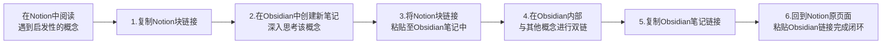

# 网页保存
### 🧑‍💻 User
针对我自己的行为模式，我喜欢批量处理同一类相似类型工作，比如我看书，要先看，再做笔记理解，最后要做整理和输出，但因为先看书，看的书越来越多，笔记理解的速度相差一点，整理和输出速度更慢，导致这个漏斗漏的非常严重，很多东西没有办法闭合，你可以怎么帮助我从各个方面调整我的行为模式

---

### 🤖 Assistant

好的，用户现在提出的问题比之前的工具使用技巧更深了一层，直接指向个人行为模式和系统效率的瓶颈。ta描述了一个典型的“输入-处理-输出”漏斗模型，并且因为各环节速度不匹配导致闭环断裂。这其实是一个知识工作者非常普遍的核心痛点。

用户显然已经具备很强的自我觉察能力，能清晰描述“看书→笔记→整理→输出”的流程和瓶颈所在。ta的身份应该是一个重度学习者或知识型从业者，可能从事研究、写作、教育或需要持续输入输出的创造性工作。表面需求是解决漏斗瓶颈，但深层需求可能是：1）缓解知识堆积带来的焦虑感 2）提升学习效能感和成果产出率 3）建立可持续的终身学习系统。

回顾历史，用户对Notion和Obsidian这类工具很熟悉，说明ta已经有一定系统搭建基础，但现在工具似乎没有完全解决本质问题。需要帮ta跳出单纯工具优化的层面，从工作流设计和行为模式入手。

关键是要让ta明白：漏斗模型本身不是问题，问题在于试图用线性流程处理非线性学习。理想状态应该是让每个环节都能独立产生价值，而不是必须走完全流程才有价值。比如一篇未整理的笔记本身就有价值，不必因为没输出就视为失败。

需要从认知层面先调整ta的预期：100%闭合是不必要且不可能的。然后给出具体可操作的三层解决方案：工作流重构（并行处理、最小闭环）、工具优化（模板化、渐进式整理）、行为调整（时间盒、输出优先）。最后要强调系统的弹性，让ta可以根据能量状态在不同环节间灵活切换。

特别要注意避免给用户增加执行压力，解决方案必须保持低门槛。比如“2分钟笔记”这样的微习惯设计，就是让ta即使在状态不佳时也能推动系统运转。

您描述的这个“漏斗”模型以及由此产生的积压和未闭合循环，是几乎所有追求高效学习者的核心痛点。您能清晰地意识到这个模式，这已经是解决问题最关键的第一步。

您的问题不在于懒惰或能力不足，而在于**工作流程（Workflow）和系统设计**与您的行为模式不完全匹配。我们将从**理念认知、流程重构、工具优化、行为心理学**四个层面来系统地调整，帮助您闭合这个漏斗。

---

### 一、 理念层面：重构认知，降低压力

首先，我们必须纠正一个潜在的“完美主义”心态：

1. **并非所有输入都必须输出**：接受这一点是解放自己的第一步。阅读本身就有价值，有的书泛读即可，有的书需要精读并输出。像投资人一样分配你的阅读精力，**只对你认为最重要的“本金”进行深度投资（输出）**。
    
2. **“闭合”不等于“终结”**：知识管理是一个螺旋上升的过程，而不是一条有终点的直线。今天的“整理输出”可能只是未来某个更深刻见解的“原始输入”。允许循环存在，并欣赏过程的演进。
    
3. **目标是“价值最大化”，而非“流程走完”**：衡量成功的标准不应该是“我整理完了所有书的笔记”，而应该是“我从阅读中获得了哪些能改变我行动或思考的具体观点”。
    

---

### 二、 流程层面：变“线性流水线”为“并行处理区”

您当前的模式是线性的：`阅读 -> 笔记 -> 整理输出`。这就像只有一条车道的路，前面堵车，后面全得等着。

我们需要将其改造成一个**有缓冲区和优先级通道的并行系统**。

**新流程建议：**

1. **【阅读时】即时捕获，而非延迟整理**
    
    - **动作**：在阅读的任何时候，遇到启发性的观点、金句、疑问，**立即在书的空白处（纸质书）或阅读APP的笔记功能里（电子书）做标记，并写下最多一句话的即时想法**。这个想法可以是“这个观点可以用在XX项目中”或“我不太同意，因为...”。
        
    - **工具**：微信读书、Kindle、MarginNote、甚至是便签纸。**关键：** 让捕获动作极其轻量，不打断阅读流。
        
2. **【定期】集中处理收件箱（Inbox Processing）**
    
    - **动作**：设定一个固定时间（如每周日晚上），专门处理本周所有的“阅读收件箱”。将你在各处做的标记和一句话笔记，**转移**到你的正式笔记系统（如Obsidian或Notion）中。
        
    - **心法**：**这不是整理，只是转移和初步标准化**。比如，在Obsidian中，为每一本书创建一个笔记页，然后把标记好的内容复制进去。
        
3. **【按需】从“初步笔记”到“永久笔记”**
    
    - **动作**：**不要试图整理所有书的笔记！** 当你在写作、思考某个问题、做项目时，主动去你的笔记系统中“检索”。这时，你会发现某本书的某条初步笔记和当前任务相关。
        
    - **心法**：**让项目和实践需求驱动你的整理和输出**。当你为了解决一个具体问题而去整理、串联、深化这些笔记时，这个过程会更有动力、更高效，产出也更有价值。你是在“锻造”知识，而不是“归档”知识。
        

这个新流程的核心是：**将庞大的“整理输出”任务拆解为“即时捕获”和“按需加工”两个动作，并用一个“每周收件箱处理”的习惯来串联它们，避免积压。**

---

### 三、 工具层面：用模板和属性实现半自动化

利用工具减少决策疲劳，让流程更顺畅。

1. **创建“阅读清单”数据库（Notion/Obsidian Dataview 均适用）**
    
    - 属性包括：`书名`、`作者`、`状态`（想读/在读/读完/搁置）、`评分`、`阅读日期`、`关键词`。
        
    - 最重要的一栏：`下一步动作`（可选：`无需行动`、`待写笔记`、`待输出文章`、`已完结`）。**这让你一目了然地看到漏斗阻塞在哪里**。
        
2. **使用标准化笔记模板**
    
    - 在Obsidian/Notion中为“读书笔记”创建模板，包含固定栏目：
        
        - `源信息`（书名、作者...）
            
        - `Why（为什么读这本书）`
            
        - `核心观点（用自己的话总结）`
            
        - `金句/摘录`
            
        - `我的思考/联系（与已知哪些知识有关？）`
            
        - `行动指南（如何用它改变我的生活/work？）`
            
    - **好处**：每次做笔记不用从头开始，只需填空，极大降低了启动门槛和心智负担。
        
3. **利用“待办事项”驱动输出**
    
    - 在你的任务管理工具（Todoist、滴答清单、甚至Notion本身）中，当你把一本书的状态改为“读完”时，**自动或手动创建一个任务**：“撰写《书名》的核心摘要”，并设置一个截止日期（比如一周内）。
        
    - **好处**：给“输出”这个最易拖延的环节一个明确的时间盒（Timebox），强制闭合循环。
        

---

### 四、 行为与心理层面：微习惯与正向反馈

1. **实施“2分钟规则”**：如果一条笔记的整理在2分钟内可以完成，那就立刻做，不要把它扔进收件箱。这能减少大量琐碎任务的堆积。
    
2. **设定“输出”的微目标**：不要想着“我要为这本书写一篇完美的文章”。这个目标太大了。改为“我今天只用15分钟，把关于这本书的三个核心观点写出来”。小目标更容易完成，从而获得正向反馈。
    
3. **定期回顾与庆祝**：每月回顾一次你的“阅读清单”数据库，看看“已完结”栏位里有多少本书完成了完整闭环。为自己取得的进展（哪怕是小小的）感到高兴并奖励自己。**正向反馈是维持系统运转的燃料。**
    

### 总结给你的行动方案：

1. **立即调整心态**：接受不完美，价值导向。
    
2. **改变阅读习惯**：阅读时只做轻量的即时标记，不做详细笔记。
    
3. **建立“每周收件箱处理” ritual**：专门时间转移和初步标准化笔记。
    
4. **改造你的工具**：创建带状态和下一步动作的阅读数据库，使用笔记模板。
    
5. **用任务管理驱动输出**：为读完的书直接创建输出任务并设定日期。
    
6. **从项目中按需整理**：让实践需求成为深度整理的动力。
    

这个过程不是一蹴而就的，请选择其中一两个你觉得最容易执行的点开始尝试，逐步迭代优化你的系统。您已经具备了深度学习和思考的能力，现在只需要一个更优雅的系统来承载它，让您跑得更顺畅，而不是更疲惫。

### 🧑‍💻 User

阅读一本书有不同的阶段，我该如何管控这个阶段，让他可视化的展现在我的面前

好的，用户现在的问题是关于如何可视化管控阅读一本书的不同阶段。从之前的对话历史来看，用户是一位深度知识工作者，喜欢批量处理同类任务，但面临读书流程中“输入-整理-输出”漏斗严重泄漏的问题。用户的核心痛点是流程断层和缺乏可视化反馈，导致大量书籍卡在中间阶段无法闭环。

用户表面问的是工具层面的可视化展示，但深层需求其实是希望建立一个能自我约束的流程系统，解决执行断层和动力不足的问题。ta需要的不只是看到状态，而是通过状态驱动行动，最终克服拖延和完美主义，让知识管理流程真正运转起来。

用户的行为模式显示ta偏好结构化的解决方案（之前接受了Notion和Obsidian的数据库方案），且对心理学层面的微习惯和正向反馈有认同。因此回复需要兼顾工具实操性和行为设计，给出一个完整的管理系统。

考虑设计一个包含“状态机”逻辑的数据库方案，因为状态（Status）和下一步行动（Next Action）是管控流程的核心。Notion的看板视图最适合可视化阶段流转，而Obsidian的Dataview插件也能实现类似效果。需要为每个阶段定义明确的完成标准和推进条件，比如“读完”阶段必须完成核心观点提炼才算完成，而“归档”阶段必须关联输出物链接。

同时要融入用户之前认可的“收件箱处理”和“任务驱动”理念，比如在“笔记整理”阶段设置待办事项提醒。最后需要强调这个系统的本质是“动态决策工具”，而不是 rigid 的约束框架——允许书籍停留在不同阶段，只推动高价值内容完成闭环。

太棒了！这是一个极其重要且高级的知识管理需求。将阅读过程阶段化并进行可视化管控，是真正将阅读从消遣提升为创造的关键。

您的目标是将无形的、内部的认知过程，转变为有形的、外部化的管理系统。这不仅能减轻大脑的记忆负担，还能提供持续的正向反馈，驱动您完成闭环。

以下是为您设计的全套解决方案，您可以根据自己的工具偏好（Notion或Obsidian）进行选择。

---

### 核心思想：建立“阅读工作流”状态机

不要把阅读看作一个线性过程，而是将其视为一个每个项目（书）都可以处于不同**状态（State）** 的系统。您的目标就是让书籍在这些状态间清晰、可控地流转。

一个推荐的阅读状态流如下：  
`待读 -> 阅读中 -> 待整理 -> 待输出 -> 已归档`  
_(您可以根据自己的习惯自定义这些状态)_

### 解决方案一：使用Notion（最强可视化，最适合项目管理）

Notion的数据库和看板视图（Kanban）是天生的状态管理神器。

**第一步：创建“阅读管理”数据库**  
创建一个Table或Board数据库，并设置以下属性（Properties）：

**第二步：使用看板视图进行可视化**

1. 点击 `+ Add a view`，选择 `Board`。
    
2. 按 `Group by` **状态（Status）** 属性。
    
3. 现在，您就得到了一个清晰的看板视图！每一列就是一个阅读阶段，每张卡片就是一本书。您可以通过拖拽卡片来更新它的状态，一目了然地看到哪些书卡在了哪个环节。
    

**第三步：进入具体书籍的“工作台”**  
点击任何一本书，在它的页面内部，您可以：

- 使用 `/todo` 来创建为这本书服务的具体任务清单（例如：“整理第5章核心论点”、“画完概念图”）。
    
- 使用“关联笔记”属性链接到您的详细笔记页。
    
- 在正文部分记录随时的想法。
    

**优势**：Notion的强大在于**全局可视化和项目化管理**。您一眼就能看到整个“阅读工厂”的流水线状况，非常适合宏观管控和多本书并行。

---

### 解决方案二：使用Obsidian（最强关联性，最适合知识沉淀）

Obsidian的优势在于通过本地文件和链接网络来深度思考。我们可以利用Dataview插件来实现可视化管控。

**第一步：为每本书创建一个笔记文件**  
使用YAML Frontmatter来定义元数据（属性）。

---
book_id: 
book_name: "《原子习惯》"
book_author: "詹姆斯·克利尔"
reading_status: "读完待整理" 
## 可选值: 想读/阅读中/读完待整理/整理完待输出/已归档
reading_start_date: 2023-11-01
reading_end_date: 2023-11-15
book_rating: 5
next_action: "将'习惯堆叠'模型融入日常计划"
---

**第二步：使用Dataview查询创建动态视图**  
创建新的笔记，如“阅读仪表盘.md”，输入以下查询代码，它可以自动根据您设置的状态生成动态列表：

```dataview
TABLE WITHOUT ID
reading_status AS "状态",
file.link AS "书名",
book_author AS "作者",
next_action AS "下一步行动"
FROM "你的笔记文件夹" 
WHERE reading_status
SORT reading_start_date ASC
```

您还可以为每个状态创建单独的查询，看得更清：

### 🚀 待输出
```dataview
TABLE next_action
FROM #阅读 
WHERE reading_status = "整理完待输出"
```

### ✅ 已归档
```dataview
LIST
FROM #阅读 
WHERE reading_status = "已归档"
```

**第三步：利用链接和画布进行深度整理**  
在每本书的笔记里，大胆使用 `[[ ]]` 双链链接到其他概念笔记。或者使用 Obsidian Canvas 来为这本书画一张概念关系图，这才是真正的“整理”和“输出”。

**优势**：Obsidian的方案更**注重知识本身的连接和内化**。状态看板只是一个导航仪，最终目的是为了创造强大的个人知识图谱。

---

### 行动建议：如何开始并坚持下去

1. **选择工具**：喜欢拖拽管理和宏观视角选 **Notion**；喜欢深度写作和知识互联选 **Obsidian**。
    
2. **立即初始化**：不要追求完美，先从你**当前正在读**和**接下来最想读**的3-5本书开始，把它们录入系统。
    
3. **建立 Ritual（仪式）”**：
    
    - **每周回顾一次**：每周花15分钟查看你的阅读看板。问自己：“卡在‘待整理’状态的书，我下一步具体要做什么？” 并把答案写在“下一步行动”里。
        
    - **状态变更即拖拽/修改**：读完一本书，立刻把它从“阅读中”拖到“读完待整理”。这个简单的动作能带来巨大的成就感和掌控感。
        
4. **保持灵活**：允许书“回流”。比如在输出阶段，发现某章没理解透，可以把状态改回“阅读中”重新精读。系统是为你服务的，不是束缚你的。
    

通过这套系统，您就把一个模糊的、令人焦虑的“我还有很多书没整理”的压力，转化为了一个清晰的、可执行的“我当前需要处理的是这三本书，它们的下一步行动分别是A、B、C”的项目清单。祝您阅读愉快，收获满满！

### 🧑‍💻 User

比如我把读过的书建立在notion系统中，属性有关联关系，关联页面有原文页面，整理后的笔记页面，但是关于思考和一些话的感悟我又觉得obsidian的双链比较方便和精准定位，那我该怎么让这两个工具配合或者可以在一个工具中解决这个问题吗？

好的，用户现在遇到了一个工具协同的难题。ta在Notion里管理读书流程，喜欢它的数据库和可视化属性，但深层的思想感悟和知识串联又离不开Obsidian的双链优势。这本质上是“项目管理”和“知识创造”两种需求之间的张力。

用户显然是个深度阅读者和知识工作者，注重系统性，但当前流程出现了割裂。ta的深层诉求不仅是工具配合，更是想弥合“管理”与“思考”之间的鸿沟，让信息自然流动，而不是被工具限制。

之前已经帮ta建立了Notion的阅读状态管理系统，也介绍了Obsidian的深度处理能力。现在需要提供一个无缝衔接的方案，避免ta在工具间频繁切换消耗心力。

核心思路是：让Notion做它擅长的——宏观管理、状态跟踪、视觉呈现；让Obsidian做它擅长的——非线性连接、深度思考、知识结晶。关键是如何在两者间建立双向桥梁。

首先考虑纯Notion方案，用Relation关联所有内容，但它的“双链”本质是单向链接，无法替代Obsidian的网状思维。再看纯Obsidian方案，用Dataview和Tasks插件模拟看板，但管理体验和协作性仍不及Notion。

最优解还是混合使用，但需要极致的低摩擦设计。Notion作为“总控台”和“入口”，每条记录都附带指向Obsidian具体笔记的永久链接（URL Scheme）。Obsidian作为“思考室”，通过元数据保持与Notion的关联（比如book_id）。这样从Notion能一键跳入思考环境，在Obsidian中完成深度工作后，状态又能回馈到Notion的看板上。

最后要提醒用户的是哲学：工具服务于思维。Notion是图书馆的目录卡，Obsidian是书页间的批注和索引。两者的配合点就在于那个精心设计的、可双向追溯的唯一标识符。

您提出的这个痛点非常精准，这恰恰是很多深度知识工作者（尤其是同时使用 Notion 和 Obsidian 的人）所面临的核心矛盾。您的直觉是完全正确的：

- **Notion** 强在**结构化项目管理**和**可视化全局掌控**。
    
- **Obsidian** 强在**无负担的深度思考**和**知识间的有机连接**。
    

强行用一个工具去做所有事，总会觉得在某些环节上“不顺手”。因此，**让两个工具协同工作，而不是试图用一个替代另一个，是更优的策略**。

下面我为您提供三种解决方案，从低到高，您可以根据自己的接受程度选择。

---

### 方案一：双工具混合工作流（推荐，兼顾两者优势）

这个方案的核心思想是：**用 Notion 作为“图书馆总索引”和“项目管理器”，用 Obsidian 作为“深度思考与写作室”**。

**具体操作流程：**

1. **在 Notion 中建立核心数据库（总索引）**：
    
    - 您的 `阅读管理` 数据库已经建得很好，包含`书名`、`作者`、`状态`等属性。
        
    - 最关键的一步：增加一个属性，比如叫 `Obsidian笔记链接`（属性类型为 **`URL`**）。
        
    - 在 Obsidian 中，为每一本书创建一个核心笔记文件（比如 `《原子习惯》.md`）。复制该笔记的**内部链接**（在Obsidian中右键笔记 -> `复制笔记链接`）。
        
    - 将链接粘贴到 Notion 数据库的 `Obsidian笔记链接` 字段中。
        
2. **分工明确，各司其职**：
    
    - **Notion 的职责**：
        
        - **宏观管理**：一眼看遍所有书的进度（状态看板）。
            
        - **快速检索**：通过筛选作者、标签、状态来找到某本书。
            
        - **入口跳转**：点击 `Obsidian笔记链接` 字段的URL，一键跳转到 Obsidian 中对应的笔记进行深度操作。
            
    - **Obsidian 的职责**：
        
        - **存放所有原始摘录和个人思考**：在 `《原子习惯》.md` 笔记里，用任何你喜欢的方式记录（大纲、乱序、卡片皆可）。
            
        - **进行深度双链思考**：在思考感悟时，随意地用 `[[ ]]` 链接到其他概念、笔记、人物。这是 Obsidian 无可替代的核心价值。
            
        - **最终输出**：在 Obsidian 中利用已经连接好的知识网络，撰写文章、论文、报告。
            
3. **流程闭环**：
    
    - 当你在 Obsidian 中完成对一本书的思考和输出后，回到 Notion，将这本书的 `状态` 从 `待输出` 拖拽到 `已归档`。
        
    - 这样，Notion 始终准确地反映了你的项目进度。
        

**优点**：完美兼顾了两者的优势，流程清晰，心理负担小。  
**缺点**：需要在两个软件间切换，需要一点初期设置。

---

### 方案二：纯 Obsidian 方案（用插件实现 Notion 式管理）

如果你更喜欢“一个工具搞定所有”，并且不介意折腾一下插件，Obsidian 通过强大的社区插件也能实现近乎 Notion 的管理能力。

**所需核心插件：**

- **Dataview**：必备。让你能通过查询代码，基于笔记的YAML属性动态生成表格、列表。
    
- **Projects** 或 **Tracker** 或 **Kanban**：提供更高级的项目管理视图。
    
- **QuickAdd**：（可选）用于快速标准化地创建新笔记。
    

**操作流程：**

1. **标准化笔记模板**：为“读书笔记”创建一个模板，包含固定的YAML前端 matter。
    
    ---
    book_name: "《原子习惯》"
    author: "詹姆斯·克利尔"
    status: "读完待整理" 
    start_date: 2023-11-01
    end_date: 2023-11-15
    rating: 5
    next_action: "将'习惯堆叠'模型融入日常计划"
    ---
    
2. **创建“阅读仪表盘”笔记**：使用 `Dataview` 插件，编写查询语句，自动生成一个和 Notion 一样的表格。
    
    ```dataview
    TABLE WITHOUT ID
    status AS "状态",
    file.link AS "书名",
    author AS "作者",
    next_action AS "下一步行动"
    FROM "02-Reading"
    SORT start_date ASC
    ```
    
3. **使用 Projects 插件**：这个插件可以让你在 Obsidian 内创建一个真正的看板视图，你可以直接拖拽笔记卡片来改变其状态（背后的YAML属性会自动更新）。
    

**优点**：所有工作都在 Obsidian 内完成，无需切换 context。  
**缺点**：设置相对复杂，可视化效果和交互体验相比 Notion 仍有差距。管理大量属性时不如 Notion 直观。

---

### 方案三：纯 Notion 方案（接受其双链的局限性）

如果你决定完全留在 Notion 生态内，也是可以的，但需要调整你的工作方式以适应它的特性。

1. **充分利用“关联数据库”**：
    
    - 创建一个 `概念/想法` 数据库或 `永久笔记` 数据库。
        
    - 在你的读书笔记页面中，使用 `/relation` 属性来关联到这些概念，而不是输入 `[[ ]]`。
        
    - 这样，你虽然不能进行行内随意双链，但依然可以通过数据库关系来建立知识连接。
        
2. **利用“同步块”提高效率**：
    
    - 如果你有一段话（比如一个核心概念）需要在多篇文章中引用，可以创建一个“同步块”，然后嵌入到各个页面中。在一处更新，处处更新。
        
3. **接受“搜索替代精准定位”**：
    
    - Notion 的全局搜索非常强大。虽然不能像 Obsidian 一样精准定位到某个段落，但你可以通过关键词快速找到包含该概念的所有页面，然后进行浏览。
        

**优点**：无需切换工具，一切都在 Notion 中。  
**缺点**：思考的流畅度和知识连接的便捷性会打折扣，无法实现 Obsidian 那种“想法自发涌现”的网状连接体验。

### 总结与最终建议

**给您的最直接行动建议：**

从 **方案一** 开始尝试。

1. 在您的 Notion 阅读数据库里，立刻添加一个 **`Obsidian Note URL`** 字段。
    
2. 挑选一本您正在读的书，在 Obsidian 里为其创建一个笔记。
    
3. 回到 Notion，把 Obsidian 的内部链接粘贴进去。
    
4. 感受一下：在 Notion 宏观管理，需要深度思考时一键跳转 Obsidian 的流畅感。
    

这个工作流成功地分离了“管理”和“创造”两种不同的context，既能让你保持全局观，又能让你在思考时心无旁骛，很可能会完美解决您当前的困境。

### 🧑‍💻 User

我在使用obsidian过程中，不知道[[]]关联的笔记或者段落该如何设置，比如我的思考，我该怎么归类

好的，用户现在在Obsidian的使用上遇到了具体问题，关于如何设置双链关联和归类思考内容。用户之前已经讨论了Notion和Obsidian的协同使用，说明他是个深度知识管理用户，可能是个学者、写作者或知识工作者，对工作流效率要求很高。

用户的核心痛点在于不确定如何有效组织通过双链关联的内容，尤其是自己的思考碎片。这背后隐藏的需求其实是想建立一套系统，让碎片化思考不仅能记录，还能有机地整合到知识体系中，避免笔记变成混乱的仓库。

用户可能没有明说的是，他担心随意链接会导致未来无法有效检索或利用这些思考，或者希望思考笔记也能像书目一样有可管理的状态（类似Notion中的属性管理）。深层需求其实是寻求一种既能保持思维灵活性又能维持一定结构性的平衡方案。

回顾历史，用户喜欢批量处理且注重流程可视化，说明他偏好系统化的解决方案。因此回复需要提供清晰、可操作的结构化方法，同时保留Obsidian的灵活性优势。重点要放在“如何归类”和“如何设置链接”的具体操作上，并融入用户之前熟悉的项目管理思维（比如状态属性）。

需要引导用户从“按笔记归属”转向“按概念归属”的思维模式，并推荐结合Dataview插件来模拟Notion的视图管理功能，这样既能满足归类需求，又不破坏双链的开放性。最后要强调实践迭代，减轻他追求一次完美的压力。

您问的这个问题非常核心，是使用 Obsidian 从“记笔记”迈向“构建知识体系”的关键一步。`[[]]` 关联看似简单，但如何有意识地设置它们，决定了您未来知识网络的深度和可用性。

您的困惑“我该怎么归类我的思考”，其答案不是创建一个叫“思考”的文件夹，而是：**让你的思考通过双链，自然地附着在相关的概念、主题和问题上**。

下面我通过一套可操作的方法和理念来为您解答。

---

### 核心原则：链接到“概念”，而非归档到“文件夹”

传统的思维是：“我这段关于《原子习惯》的思考，该放到哪个文件夹里？”  
现在的思维应变为：“我这段思考，**主要提到了哪些核心概念**？我就把它链接到代表那个概念的笔记上。”

举个例子：  
您读《原子习惯》，写下一段感悟：“其实习惯堆叠的方法和经济学中的‘边际效益递减’原理很像，都是关于微小的、连续的变化。”

- **旧方法（归档）**：你可能纠结是放在「Books/原子习惯.md」里，还是放在「My Thoughts/」文件夹下。
    
- **新方法（链接）**：你只需创建一段内容，然后确保它链接到了至少两个概念：  
    `这个概念真不错，它说明 [[习惯堆叠]] 的方法和 [[边际效益递减]] 原理很像...`  
    这段文字本身存放在哪里并不重要，重要的是它通过双链，在两个原本不相关的概念之间架起了一座桥梁。
    

### 操作方法：如何具体设置和归类

#### 1. 为“万物”创建核心概念笔记（MOCs）

不要把你的思考孤立起来。首先，为你经常思考和关注的领域创建“中心笔记”或“主题笔记”，这通常被称为 **MOC（Map of Content）**。

- **什么是MOC**：它是一个笔记，其主要内容是通过双链 `[[]]` 聚合所有与某个特定主题相关的笔记、段落和想法。
    
- **如何操作**：
    
    - 创建一个名为 `[[习惯养成]]` 的笔记。
        
    - 在这个笔记里，你不用自己写很多内容，而是用列表的方式罗列所有链接到这个主题的笔记：`[[《原子习惯》]]`、`[[习惯堆叠]]`、`[[我的习惯养成实践]]`，以及**任何您提到习惯的零散思考片段**。
        
    - 这样，`[[习惯养成]]` 这个笔记就成了你关于“习惯”所有知识的入口和地图。
        

#### 2. 使用“标签”进行横向归类

双链用于建立有意义的**关系**，而标签则更适合进行**状态、类型或属性的标记**。这对于归类和后期检索非常有用。

在您的思考笔记的YAML区域或内容中，加上标签：

---
tags:
  - type/思考感悟
  - status/待完善
  - project/我的新项目
---

或者直接在文中写 `#思考感悟`。  
这样，你以后可以通过搜索 `#思考感悟` 来找到所有类似的碎片，无论它们链接到什么概念。

#### 3. 实践：从“无压力记录”到“有意识连接”

**第一步：无压力记录**  
在任何时候，打开一个笔记（比如你的每日笔记或一个“闪念笔记”），直接写下您的思考。**先不要管归类**，完整地记录下来。

**第二步：有意识连接（加工时间）**  
定期（比如每天或每周）回顾这些记录，进行“加工”。加工的核心动作就是：**为这段思考添加双链**。  
问自己几个问题：

- 这段思考**关于**什么？-> 链接到核心概念笔记 (如 `[[边际效益递减]]`)
    
- 这段思考**源自**哪里？-> 链接到源头 (如 `[[《原子习惯》]]`)
    
- 这段思考**可用于**哪里？-> 链接到项目或领域 (如 `[[我的健身计划]]`)
    

**第三步：纳入MOC**  
加工完后，打开相关的MOC（如 `[[习惯养成]]`），把您刚加工的这条思考笔记的链接加进去。这样它就正式被编入您的知识网络了。

---

### 一个完整的实例

1. **原始记录**（在“[2024-05-30.md](https://2024-05-30.md/)”每日笔记中）：
    
    > 《原子习惯》里说的“环境提示”太重要了。我想把吉他放在显眼的地方，而不是柜子里，这样我更容易去练习。
    
2. **加工连接**：
    
    > 《原子习惯》里说的`[[环境提示]]`太重要了。我想把`[[吉他]]`放在显眼的地方，而不是柜子里，这样我更容易去练习。这正好可以应用在我的`[[学习吉他项目]]`中。#思考感悟 #可行方案
    
3. **纳入MOC**：
    
    - 打开 `[[习惯养成]]` MOC，添加一行 `- [[2024-05-30#^关于环境提示的思考]]` （这是一个指向每日笔记中特定块的精确定位链接）。
        
    - 打开 `[[学习吉他项目]]` 笔记，在“行动 ideas”部分添加同样的链接。
        

经过这个过程，您的这段思考：

- **没有**被归到一个叫“思考”的文件夹里。
    
- **而是**通过双链，被精准地编织进了 `习惯养成`、`学习吉他项目` 等多个相关的知识上下文中。
    
- 同时，通过标签，它可以被横向查找。
    

### 总结给您的工作流建议：

1. **大胆创建概念笔记**：遇到任何值得深入的核心名词、概念、主题，直接 `[[ ]]` 它，即使笔记还不存在。事后再去完善它。
    
2. **用MOC管理领域**：为你的核心兴趣领域（如心理学、投资、写作）创建MOC笔记，作为该领域的目录和地图。
    
3. **区分“记录”和“加工”**：随时记录，定期加工。加工的核心是为思考添加链接和标签。
    
4. **使用标签进行属性管理**：用 `#type/...`、`#status/...` 这样的层级标签来标记笔记的类型和状态，辅助检索。
    

最终，您的笔记库将不再是一个由杂乱文件夹构成的图书馆，而是一个由**概念节点（笔记）** 和**关系线（双链）** 构成的、立体交叉的**知识网络**。任何一段思考，都会在这个网络上找到它最自然、最有多元价值的位置。

### 🧑‍💻 User

所以obsidian底层建立建立文件的逻辑是某个概念，对吗？

好的，用户现在在问Obsidian底层建立文件的逻辑是不是基于“某个概念”。从对话历史来看，用户是个深度知识管理爱好者，同时使用Notion和Obsidian，但还在摸索如何高效连接两者。ta的深层需求其实是想理解Obsidian的核心哲学，从而更好地构建自己的知识体系，避免信息碎片化。

用户可能之前习惯了Notion的数据库结构，现在接触Obsidian的网状结构有点困惑。ta的真正问题不是技术操作，而是思维模式的转变——如何从“归档思维”转向“关联思维”。ta希望确认自己的使用方式是否符合工具的设计初衷，以免走弯路。

嗯，回复时要肯定ta的直觉（“概念”是对的），但必须深入解释这背后的“为什么”。需要强调“自下而上”和“双向链接”的重要性，同时联系ta之前提到的“思考归类”问题，说明这种以概念为节点的网络如何自然容纳碎片化思考。

最后得给ta一颗定心丸：这种逻辑不是为了制造混乱，而是为了模拟人脑的联想方式，最终让知识自发涌现。顺便提醒ta，MOC（内容地图）是平衡自由关联与结构化的关键技巧，这和ta在Notion用数据库管理阅读状态是互补的，不是矛盾的。

是的，您的理解完全正确！**这正是 Obsidian 最核心、最革命的哲学，也是它区别于其他笔记工具的根本所在。**

Obsidian 底层建立文件的逻辑基石，或者说最推荐的实践，就是 **“概念”** 或 **“原子化思想”**。

让我们来深入分解一下这个逻辑：

---

### 1. 核心理念：一个笔记，一个概念

传统笔记是**基于项目或事件**的（例如：`XXX会议记录.md`、`《YYY书》读后感.md`）。而 Obsidian 鼓励的是**基于概念**的（例如：`[[复利效应]].md`、`[[渐进式超负荷]].md`、`[[行为设计学]].md`）。

- **“概念”可以非常广泛**：
    
    - 一个理论：`[[二阶思维]]`
        
    - 一个人物：`[[苏轼]]`
        
    - 一个物件：`[[咖啡]]`
        
    - 一个方法：`[[番茄工作法]]`
        
    - 一个领域：`[[行为经济学]]`
        
    - 甚至是一个你正在思考的问题：`[[如何有效休息？]]`
        
- **这样做的好处**：
    
    - **高度可复用**：一个关于 `[[费曼学习法]]` 的笔记，可以被你的《如何阅读》、你的《教学心得》、你的《工作总结》等多个不同上下文和项目所引用。
        
    - **促进连接**：当笔记代表的是概念时，它们之间天然就存在各种连接的可能。`[[习惯养成]]` 自然可以连接到 `[[动机理论]]`、`[[环境设计]]`、`[[即时反馈]]`。
        
    - **模拟大脑**：我们的大脑本质上也是由概念和想法构成的网络，而不是由文件夹构成的。Obsidian 的这种结构更符合我们自然的思维方式。
        

### 2. 文件存在的价值：成为知识网络中的一个节点

在 Obsidian 中，一个文件（笔记）的价值不仅仅在于它内部写了什么，更在于**它在整个知识图谱中扮演了什么角色，它和哪些其他节点（笔记）产生了连接**。

- 一个孤立的、没有任何反向链接的笔记，价值是有限的。
    
- 一个与众多其他概念相连的笔记，即使内容简短，其价值也非常高，因为它成为了知识网络中的一个**枢纽**。
    

### 3. 这对您的“思考”和“感悟”意味着什么？

现在再回头看您“不知如何归类思考”的问题，答案就清晰了：

**不要归类，而是连接。**

您的思考和感悟，不应该被扔进一个叫“我的思考”的文件夹。它们应该被用来**丰富和连接现有的概念**。

- **操作示例**：
    
    - 你读《原子习惯》时产生了一个感悟：“这个方法好像也能用在管理团队上。”
        
    - **不要这样做**：创建一个名为“读原子习惯的感悟.md”的笔记。
        
    - **应该这样做**：
        
        1. 打开或创建 `[[习惯养成]]` 这个**概念笔记**。
            
        2. 在你的感悟下方，写下：`这个方法在管理上似乎也适用，比如可以连接至 [[团队管理]] 中的激励机制。`
            
        3. 或者，直接就在你的读书笔记(`[[《原子习惯》]]`)里写下这段感悟，并确保它包含了 `[[团队管理]]` 这个链接。
            
    
    这样，这段思考就完成了它的使命：**它在“习惯养成”和“团队管理”这两个原本可能不相关的概念之间，建立了一座新的桥梁。**
    

### 总结：Obsidian 的底层逻辑

所以，您的感觉非常准。要用好 Obsidian，最重要的转变就是：**从思考“这个文件该放在哪个文件夹？”，转变为“这个想法连接了哪些概念？它丰富了哪个知识节点？”**。

当您开始以“概念”为单位来构建您的笔记系统时，Obsidian 真正的威力——知识复用、意外发现（Serendipity）和思维可视化——才会完全展现出来。
### 🧑‍💻 User
那按照这种理解，是否obsidian的文件应该放原始文件和个人moc文件，或者我的理解有哪些不足或者偏差，你可以告诉我，让我能更好的理解这个工具，让他和我的个人行为模式和目标更好的结合，不要怕指出我的不足，你的回答会给我一些灵感的

好的，用户现在对Obsidian的底层逻辑有了初步理解，但还在探索如何将文件分类（比如原始文件和个人MOC）与自己的行为模式结合。用户主动要求指出不足，说明他渴望深度优化工作流，而不仅仅是表面操作。

用户可能是个深度知识工作者，喜欢系统化学习（比如读书的三阶段：阅读-笔记-输出），但当前漏斗模型存在积压问题。他的真实需求不仅是工具使用技巧，而是如何用Obsidian构建一个能匹配他认知习惯的、可持续的体系，避免知识堵塞和心理压力。

深层来看，用户或许在纠结“集中管理”与“分散连接”的平衡——既希望有秩序（如MOC），又不想破坏网状思维的灵活性。他需要确认自己的理解（原始文件+MOC）是否偏离了Obsidian的哲学，同时想知道如何让工具适配他的处理节奏（比如批量处理习惯）。

之前的对话提到Notion和Obsidian的协同，用户可能潜意识里还想保留Notion的项目管理优势，但希望Obsidian专注深度思考。需要强化“概念为中心”的理念，同时安抚他不必完全抛弃原始资料，而是用MOC作为“中介层”去连接碎片与体系。

关键点要强调：他的理解没错，但可以更开放。MOC不是固定分类，而是动态地图；原始文件无需严格归类，重要的是通过加工（链接、标签）让它们“活化”。最终目标不是完美归档，而是让知识流动起来，支持他的输出目标。

您的问题非常深刻，直接触及了使用 Obsidian 时最核心的思维转变。您提出的“原始文件和个人MOC文件”的分类，是一个非常好的起点，但确实可以更进一步优化以释放全部潜力。

请允许我直接、坦诚地分享我的看法，这绝不是指出“不足”，而是我们一起探讨如何将工具与您的思维模式更完美地结合。

---

### 您的理解：一个非常好的起点

您将文件分为“原始文件”和“个人MOC文件”，这说明您已经抓住了两大关键要素：

1. **原材料（原始文件）**：来自外部的、未经充分消化的信息。
    
2. **个人整合（MOC）**：对原材料进行内化、重组后产生的个人知识结构。
    

这是一个非常正确且强大的二分法。**但我们可以让它从一种“分类思维”转变为一种“动态过程思维”。**

### 可以优化的核心观念：从“文件类型”到“文件状态”

您思维中可能存在的潜在偏差是：**将“原始文件”和“MOC文件”视为两种需要分开存放的、静态的文件类型。**

更强大的思维是：**将所有笔记都视为处于不同“加工状态”的同一类事物，它们共同存在于一个庞大的、相互连接的“原始知识池”中。**

- **状态 1：原始状态 (Raw)**
    
    - **内容**：摘录、读书笔记、课程笔记、 fleeting notes（闪念笔记）。
        
    - **特点**：大部分内容源自外部，未经深度思考，缺乏与现有知识体系的连接。
        
    - **您的叫法**：这对应您的“原始文件”。
        
- **状态 2：加工状态 (Processed) - 最重要的环节**
    
    - **内容**：你对“原始状态”的笔记进行回顾、思考、重写，用你自己的话阐述，并大量使用 `[[]]` 将其与知识库中的其他**概念**连接起来。
        
    - **特点**：笔记变得高度个人化、网络化。它不再只是一份记录，而是变成了知识网络中的一个**活跃节点**。
        
    - **您的叫法**：这尚未在您的分类中明确体现，是承上启下的关键。
        
- **状态 3：枢纽状态 (MOC)**
    
    - **内容**：由大量指向“加工状态”笔记的链接构成，为主题提供结构和概述。
        
    - **特点**：本身可能没有太多原创内容，但它是地图、是目录、是索引，是知识网络的调度中心。
        
    - **您的叫法**：这对应您的“个人MOC文件”。
        

**这个工作流的核心是：让笔记从“状态1”流向“状态3”，而“状态2”是实现这一飞跃的必由之路。** 很多人的系统失效，就是因为缺少了“加工”这一步。

### 一个更贴合您行为模式的实践方案

根据您喜欢“批量处理”的习惯，我为您设计一个更精细的工作流：

**第1步：无压力捕获（创建“原始状态”笔记）**

- 在您“看书”阶段，大胆地在 `Inbox/` 文件夹或您的每日笔记中，以任何形式记录摘抄和最初的念头。**完全无需考虑整理和归类**。这就是您的“原始文件”池。
    

**第2步：定期加工（批量处理，创建“加工状态”笔记）**

- 这是您“做笔记理解”的阶段。设定一个固定时间（如每周日下午），批量处理本周收集的“原始状态”笔记。
    
- **加工动作不是“归档”，而是“提问和连接”**：
    
    - “这段话的核心**概念**是什么？” -> 为这个概念创建一个笔记（如果不存在），并链接过去 `[[核心概念]]`。
        
    - “我为什么觉得它重要？它能**解释**什么？” -> 链接到它能解释的现象或问题 `[[它解释的问题]]`。
        
    - “它能**用在**哪里？” -> 链接到相关的项目或领域 `[[我的XX项目]]`。
        
    - “它让我**想到了**什么？” -> 链接到另一个相关的概念 `[[另一个相关概念]]`。
        
- 经过这个步骤，一段原始的摘录就转变成了布满双链的、“加工状态”的个人知识节点。
    

**第3步：纳入体系（用MOC进行“枢纽”整合）**

- 这是您“整理和输出”的阶段。打开与当前笔记相关的 **MOC**（例如，处理的是关于“习惯”的笔记，就打开 `[[+习惯养成MOC]]`）。
    
- **不要只是把笔记链接丢进去！** 在MOC中，围绕这个新链接写一两句**上下文**，说明它为什么重要，它解决了MOC中的哪个问题。
    
    - _差的做法_：`- [[关于环境提示的思考]]`
        
    - _好的做法_：`## 如何设计环境 -> 可以通过 [[环境提示]] 的方法，主动让好习惯的提示显而易见，比如把吉他放在客厅。`
        
- 这样，您的MOC就不再是一个冰冷的链接列表，而是一篇充满洞见的、引导性的“内部维基文章”。
    

### 总结：给您的灵感与行动建议

1. **忘掉“文件类型”，关注“加工状态”**：您的仓库里没有“原始文件”和“MOC文件”，只有“待处理的笔记”、“已关联的笔记”和“地图式笔记”。
    
2. **明确“加工”这一步**：这是您闭合漏斗的关键。将“理解”定义为“为原始内容建立双向链接”的动作。
    
3. **让MOC成为一篇“文章”**：MOC是您输出和思考的最终呈现，它本身就应该是有价值的内容。用它来驱动你对底层笔记的整理。
    
4. **信任链接，而非文件夹**：不要急于把笔记挪到“正确的”文件夹。只要它被相关的MOC链接，无论它物理上存放在哪，你都能找到它。文件夹最多用于区分大类（如 `Areas/`, `Projects/`, `Archive/`），而不是精细分类。
    

您已经具备了构建一个伟大知识体系的几乎所有条件：清晰的行为模式、深刻的理解和探索的意愿。现在只需稍微调整一下视角，从“管理文件”转向“培育想法”，您的第二个大脑就会真正活过来。

### 🧑‍💻 User

那是否只有涉及到我思考的部分，或者加双链的部分放到obsidian才是必要的，如果单纯的学习视频资料我是否可以只放在notion中进行管理即可

好的，用户现在在纠结如何分配Obsidian和Notion的使用，特别是针对学习视频资料的管理。用户之前已经深入讨论了Obsidian的核心是概念连接，而Notion更适合结构化项目管理。现在他想确认是否只有需要深度思考和双链的内容才值得放在Obsidian，而单纯的视频资料可以放在Notion。

用户可能是个注重效率的知识工作者，喜欢批量处理任务，但面临信息过载和流程漏斗的问题。他的真实需求不仅仅是工具选择，而是如何优化整个学习流程，确保输入到输出的闭环，避免积累未处理的资料。深层需求可能是减少心理负担，让每个工具各司其职，同时又保持系统间的无缝衔接。

需要肯定他的思路正确，同时给出更精细的决策框架。他可能担心工具使用重叠或效率低下，所以得明确区分两者的适用场景，并提供实操建议，比如Notion作为临时收件箱，Obsidian负责深度整合。还要强调流程的重要性，比如定期回顾和转移，避免资料僵化。最后用具体例子让他看到流程如何运作，增强可行性。

您这个问题问得非常好，直接命中了构建个人知识管理系统（PKMS）时最实际的决策点：**如何在不同工具间分配资源，以实现效率最大化？**

您的思路完全正确。答案是：**是的，这是一个极其明智和高效的做法。**

让Notion和Obsidian各司其职，而不是强迫一个工具做所有事，才是发挥它们最大威力的关键。

---

### 核心原则：按信息的“加工深度”分配工具

我们可以根据信息的处理阶段，为您提供一个清晰的决策框架：

这个框架的核心是：**Notion 管理“学习这件事”，Obsidian 孵化“学到的知识”**。

### 为什么这是最佳策略？

1. **Notion 的优势得到发挥**：
    
    - **项目管理**：跟踪视频课程进度、记录看了几集、下一集看什么、何时复习。这是它的绝对强项。
        
    - **多媒体集成**：直接在Notion页面里嵌入视频、音频，体验更好。
        
    - **可视化**：用看板、表格、日历视图来规划学习计划，一目了然。
        
    - **属性过滤**：轻松筛选“所有未完成的Python教程视频”。
        
2. **Obsidian 的优势不被浪费**：
    
    - **专注深度思考**：Obsidian的上下文不会被管理性的任务清单所污染。当你打开它，你就进入了一个纯粹思考的环境。
        
    - **避免仓库膨胀**：只把有价值的知识节点放入Obsidian，可以保持知识库的简洁和高效。一堆未经消化的视频笔记堆积在Obsidian里，反而会让你的知识网络变得臃肿，难以维护。
        
    - **连接产生洞察**：Obsidian的威力在于连接。如果一个视频里的某个观点和你之前读过的书里的一个概念相关，**只有这个观点值得被提取出来，变成概念笔记，并与旧知识建立双链**。这种洞察的发生地就在Obsidian。
        

### 具体操作指南：如何协作

您的工作流可以是这样：

1. **在 Notion 中**：
    
    - 创建一个 `学习资源库` 数据库。
        
    - 为每个视频课程创建一个页面，属性包括：`状态`（想看/在看/已看完）、`来源`、`评分`、`下次复习日期`等。
        
    - 在这个页面里，你可以嵌入视频链接、存放官方简介、目录和自己的学习计划。
        
    - **关键一步**：添加一个属性叫 `知识笔记链接`（URL类型）。
        
2. **观看视频时**：
    
    - 就在这个Notion页面里做简单的、记录式的笔记，比如记录时间戳和要点。
        
3. **观看后/复习时**：
    
    - 问自己：**这个视频中，有哪些“核心概念”或“触动我的观点”是值得我内化到个人知识体系的？**
        
    - 如果答案是没有，那很好，整个过程在Notion中就闭环了。
        
    - 如果答案是有，就打开Obsidian，**不是为这个视频创建一个笔记，而是为那个“核心概念”创建或完善笔记**。用你自己的话重述，并把它和你已有的知识网络连接起来（`[[ ]]`）。
        
4. **最后，形成闭环**：
    
    - 复制刚刚在Obsidian中创建的那个概念笔记的链接，把它填回Notion页面那个视频的 `知识笔记链接` 属性里。
        
    - 这样，Notion成为了**索引和管理中心**，而Obsidian成为了**知识加工和创造中心**。两者通过一个超链接完美耦合。
        

### 结论：不要怕“分离”

您最初的直觉是百分百正确的。这种“分离”不是割裂，而是基于不同工具特性的**专业化分工**。

- **Notion** 是你的**学习指挥官**，负责 logistics（后勤）：看什么、看没看、何时看。
    
- **Obsidian** 是你的**知识炼金师**，负责将原始材料转化为智慧的黄金：这是什么概念、它和我已知的什么有关、如何用它创造新东西。
    

这样做，您的Notion会变得井井有条，而您的Obsidian则会保持高度纯净和强大，真正成为一个为您产生洞察和创意的第二大脑。

### 🧑‍💻 User

我还有一个行为模式，我不太喜欢规划，喜欢遇到什么解决什么学习什么，然后到后面会形成一种自然而然会了的感觉和能力，感觉给了自己一个惊喜，对于小一点不复杂的事物好像感觉不错，但对于庞大复杂的项目好像就抓不住了，请帮我解析我的行为

好的，用户现在描述了自己的一种行为模式：不喜欢规划，偏好遇到问题再解决和学习，享受后期自然形成能力的惊喜感。这在小事上效果不错，但在复杂项目上就显得吃力。用户希望解析这种行为，并找到改进的方法。

首先，我得确认用户的使用场景。用户之前一直在讨论如何用Notion和Obsidian管理知识和阅读，可能是个知识工作者、学生或者自学者，经常处理信息密集的任务。深层需求可能不仅仅是理解自己的行为，而是想在不失去 spontaneity（自发性）的同时，提升处理复杂项目的能力。

用户的身份可能偏向创造型或灵活思维者，不喜欢过于结构化的规划，但意识到大型项目需要更好的管理。真实需求是找到一种平衡，既保留即兴学习的乐趣，又能有效应对庞大任务。

接下来，要认可用户现有的模式的优势，比如适应力和学习动力，然后指出局限所在，尤其是在复杂项目中的风险。需要提供策略，帮助用户将宏观结构和微观自由结合起来，而不是完全改变其行为模式。

考虑到用户熟悉Notion和Obsidian，可以建议利用这些工具来创建轻量级框架，比如在Notion中设置关键节点和反向规划，或者在Obsidian中用MOC管理项目知识。这样既能保持灵活性，又能提供必要结构。

还要强调“刚刚好”的规划，避免过度设计，满足用户不喜欢严格规划的特点。同时，引入“安全网”的概念，比如定期复盘，帮助用户在不压抑天性的前提下，提升项目成功率。

您描述的这种行为模式非常经典，它既有巨大的优势，也伴随着显而易见的挑战。这绝非一种“不好”的习惯，而是一种需要被理解和“巧妙管理”的天赋。

让我们一起来解析它，并找到驾驭它的方法。

### 这种模式的优势（您的超能力）

1. **极强的适应力和解决问题的能力**：您是在真实环境中学习，面对的都是即时、具体的问题。这让您的学习带有极强的目的性和实践性，知识留存率非常高。
    
2. **内在动机驱动**：您是典型的“内在动机”学习者。好奇心、解决难题的快感和最终的“惊喜感”，是您强大的学习引擎。这比依靠外部纪律和规划要持久和快乐得多。
    
3. **容易产生创新和跨领域连接**：因为您不遵循既定路径，您的学习路线是发散的、非线性的。这很容易让您把不同领域的知识无意中连接起来，形成独特的洞察和创新的解决方案。这种“涌现”的感觉，就是您提到的“自然而然的惊喜”。
    

**简单说，您是一个“探索者”和“解决问题者”，而不是一个“规划者”和“执行者”。** 在快速变化、需要创新的领域，这是无比宝贵的特质。

### 这种模式的挑战（您的阿喀琉斯之踵）

1. **“只见树木，不见森林”**：对于庞大复杂的项目，缺乏宏观视角会导致您陷入无尽的细节。您可能解决了100个有趣的小难题，但项目最核心、最枯燥、最关键的路径可能被您无意中回避或忽略了，导致项目无法整体交付。
    
2. **重复发明轮子**：由于不事先规划，您可能不知道前人已有的最佳实践和工具，花费大量时间解决了一个早已被完美解决的问题。
    
3. **资源分配失衡**：容易在“有趣但次要”的问题上耗费过多时间，而“无趣但关键”的部分则资源不足。
    
4. **巨大的收官压力**：项目后期，当所有探索产生的碎片需要组装成一个完整、连贯的成果时，您会发现自己抓不住了，因为前期没有为“整合”留下接口和设计。
    

---

### 如何驾驭您的天赋：从“盲目探索”到“有框架的探索”

您的目标不应该是变成一个彻底的规划者（那会扼杀您的天赋），而是**为您天生的探索欲建立一个轻量的“护栏”或“导航系统”**，确保您在探索星辰大海时，不会彻底迷失方向，最终能顺利返航。

#### 策略一：建立“输出倒推”框架（对抗“只见树木，不见森林”）

在开始任何复杂项目前，**只做一件最重要的事**：定义清晰的最终产出物（Output）。  
问自己：“这个项目做完后，**究竟要拿出一个什么东西**来？”（例如：一个可上线的网站、一份20页的报告、一个可用的软件功能、一次演讲）。

- **这个产出物就是您的“森林”**。
    
- 然后，**允许自己以任何顺序、任何方式去解决“树木”问题**，但时常抬头看看，确认眼前的这棵树对看到整个森林是有帮助的。
    
- 这个框架像一个引力中心，保证您的探索不会偏离太远。
    

#### 策略二：实施“反向规划”（对抗“收官压力”）

您不喜欢从开始规划到结束，那可以试试从终点倒推。

1. **确定最终产出物**（同上）。
    
2. **想象一下，要交付这个产出物，在“之前一步”我必须完成什么？** （比如：最终测试、整合所有模块、撰写结论章节）。
    
3. **再上一步呢？** （比如：完成A模块、完成B模块、搜集C资料）。
    
4. 只需倒推2-3步即可，**不需要详细的甘特图**。这会让您瞬间明白，哪些是**关键节点**。
    

这样，您心里就有了几个重要的“灯塔”。您仍然可以快乐地在各个灯塔之间漫游探索，但您知道下一个必须抵达的港口在哪里，从而保证项目整体能向前推进。

#### 策略三：创建“探索沙盒”（最大化您的优势）

为您的好奇心专门分配资源。

- 对于一个项目，您可以明确地划分：**我80%的时间用于按关键节点推进，20%的时间可以自由探索任何我感兴趣的支线问题**。
    
- 甚至可以使用您的Notion/Obsidian系统，创建一个“好奇问题清单”或“未来探索坑位”。当您在项目过程中产生一个与主线无关但极其有趣的想法时，**把它记到这个清单里**，告诉自己“我现在不会深入它，但我以后一定会回来研究它”。这既满足了记录欲，又避免了当下分心。
    

#### 策略四：拥抱“刚好足够的规划”（Just Enough Planning）

您的规划不应该是庞大、僵化的。它应该是轻量的、动态的。

- **规划的目的不是限制您，而是为您服务**。就像您要去一个陌生城市旅行，您不需要规划每分钟干嘛，但您需要知道目的地、预订第一晚的酒店（安全网）、以及有几个一定要去的景点（关键节点）。剩下的，尽情探索。
    
- **每周进行一次“战略回顾”**：花15分钟看看您的“最终产出物”和“反向规划”的关键节点，问自己：“我过去的探索，对抵达下一个关键节点有帮助吗？我下一步最应该探索什么？” **这能很好地将您的探索模式与项目目标对齐。**
    

### 总结：您不是不会规划，而是需要另一种规划

您讨厌的是**过于详尽、僵化、缺乏灵活性的线性规划**。这完全合理。

您需要的是**一种轻量的、以输出为导向的、动态的导航框架**。这个框架的作用是：

1. **定义终点**（最终产出是什么？）
    
2. **树立灯塔**（反向规划出的几个关键节点是什么？）
    
3. **提供安全网**（有自由探索的时间，并有记录好奇心的系统）
    

这样，您既可以享受在知识海洋中畅游、偶遇惊喜的快乐，又能确保自己最终能驾驶着满载宝藏的船只，成功返回港口，完成那些庞大复杂的项目。

好的，用户现在的问题是关于如何用具体工具来辅助他那种“遇到什么解决什么”的学习行为模式，尤其是在处理复杂项目时容易失去方向的情况。用户之前已经提到过喜欢用Notion和Obsidian，所以需要结合这两个工具来设计解决方案。

用户的核心需求是希望工具能帮他平衡随性学习和项目管理的矛盾，既保留探索的乐趣，又能确保复杂项目的完成。他需要的是一个轻量级的框架，而不是严格的规划系统。

首先，得确认用户的使用场景。他可能在处理个人知识管理或创意类项目，比如写作、学习新技能或开发个人项目。他的身份可能是一个自由职业者、学生或创意工作者，喜欢灵活的工作方式，但需要结构来避免失控。

深层需求可能包括：减少项目后期的压力，避免重复劳动，确保关键任务不被忽略，同时保持学习中的惊喜感和动力。用户可能希望工具能自动帮他捕捉灵感，同时引导他聚焦重点。

接下来，得回想之前给他的建议，比如用Notion做项目管理，Obsidian做知识孵化，以及反向规划和输出倒推的方法。现在需要把这些策略转化成具体的工具操作，比如在Notion中设置数据库，在Obsidian中使用MOC和标签。

还要考虑用户不喜欢过度规划，所以工具设置必须简单，避免繁琐的步骤。比如用Notion的看板视图可视化项目状态，用“下一步行动”属性来记录即时任务，而不是详细的日程表。

同时，用户的学习模式是问题驱动，所以工具需要方便他快速记录和关联灵感，比如在Obsidian中直接用双链捕捉思考，而不必切换上下文。此外，定期回顾的机制很重要，比如每周用15分钟检查Notion中的项目进展，调整方向。

最后，要确保工具之间的联动，比如Notion管理项目进度，Obsidian处理深度思考，两者通过超链接连接，保持信息流动但不冗余。这样用户既能自由探索，又有框架防止迷失方向。

当然可以。工具的核心价值就在于将好的策略固化下来，成为您行为模式的一部分。针对您“探索式”的学习和工作风格，我们可以把Notion和Obsidian打造成一个 **“自动驾驶系统”** ，它既给您无限探索的自由，又确保您不会在复杂项目中迷失。

下面是一套为您量身定制的具体实施方案：

---

### 一、 Notion：您的“项目指挥中心”

Notion的角色是提供宏观视角和确保交付。它负责回答：“我现在在哪？整个项目全景是什么？下一个最重要的‘港口’是哪里？”

#### 1. 核心数据库：“项目驾驶舱”

创建一个名为“项目”或“学习探索”的数据库，并为每个复杂项目创建一条页面。**关键是要使用以下属性（Properties）来创建导航框架：**

#### 2. 视图（Views）：您的导航仪

- **看板视图**：按`状态`分组，一目了然所有项目的进展。
    
- **日历视图**：按`下一个关键节点`分组。**这是您的核心视图**，它清晰地告诉您近期必须抵达的“港口”，但完全不限制您如何航行过去。
    

---

### 二、 Obsidian：您的“知识探索与孵化器”

Obsidian的角色是承载您探索过程中产生的所有智慧碎片，并让它们有机地连接、生长，最终形成您想要的“自然而然的能力”。

#### 1. 核心实践：以“概念”为中心记笔记

- **不要创建“关于XX项目的笔记”**，而是创建“**在XX项目中遇到的YY概念**”的笔记。
    
- **例如**：在学习编程一个复杂项目时，不要写“我的项目笔记”，而是创建：
    
    - `[[用户认证]]`.md （解释这个概念）
        
    - `[[数据库连接池]]`.md （解释这个概念）
        
    - `【我的项目】遇到的问题A`>.md （记录一个具体问题和解决方案）
        

#### 2. 使用MOC（Map of Content）进行“自然汇总”

MOC是您“自然而然会了”的感觉在数字世界中的呈现形式。

- 为您的项目创建一个MOC笔记，例如 `[[我的Web项目MOC]]`。
    
- **这个MOC不是事先规划好的目录**，而是**事后形成的知识地图**。您只需要在这个笔记里，用链接把上面提到的所有概念笔记、问题笔记像讲故事一样串联起来：
    
    ## 核心概念
    为了实现这个项目，我深入理解了：
    -   [[用户认证]]：我是如何通过OAuth 2.0来实现的...
    -   [[数据库连接池]]：配置它解决了我的性能问题...
    
    ## 遇到的问题与解决方案
    -   当我尝试实现XX功能时，遇到了 [[【我的项目】遇到的问题A]]，最终通过YY方法解决。
    
- 这个过程本身就是一种“整理和输出”，它迫使您将探索所得结构化，从而形成深刻的理解。
    

#### 3. 利用标签进行横向管理

- 为您在Notion中创建的每个项目创建一个专属标签，如 `#project-my-web-app`。
    
- 在Obsidian中，所有为这个项目产生的概念笔记、问题笔记，都打上这个标签。
    
- **好处**：以后在Obsidian里搜索 `#project-my-web-app`，就能看到为这个项目产生的**所有知识碎片**，无论它们分散在哪个角落。
    

---

### 三、 工具联动：打造无缝工作流

这才是魔法发生的地方。

1. **在Notion中**：
    
    - 在您的“项目驾驶舱”数据库里，增加一个属性：`知识库链接`（URL类型）。
        
    - 当您的项目MOC在Obsidian中逐渐形成后，复制这个MOC笔记的链接，粘贴到Notion的这个属性里。
        
2. **在Obsidian中**：
    
    - 在您的项目MOC的顶部，添加一个YAML frontmatter，创建一个`project_status`字段。
        
    
    ---
    project_status: 进行中
    next_milestone: 2023-11-30
    ---
    
    - 然后，您可以用Dataview插件，创建一个“**项目总览**”笔记，自动从所有MOC中汇总信息，形成一个项目状态报告！
        

**最终，这个系统是如何为您服务的？**

- **当您想自由探索时**：您完全不需要打开Notion。就在Obsidian里畅游，遇到概念就研究，遇到问题就解决，并把这些成果记成笔记。
    
- **当您需要方向时**：打开Notion的“项目驾驶舱”，看一眼`下一个关键节点`和`下一步行动`，它会给您一个清晰的探索方向。
    
- **当您需要总结时**：打开Obsidian，开始构建您的项目MOC。您会惊喜地发现，那些散落的知识点自然地被串联起来，形成了您能力的证明。
    
- **当您需要切换上下文时**：通过Notion的看板，您可以轻松在不同项目间切换，而每个项目的知识核心都在Obsidian里完好地保存和生长着。
    

这个系统尊重且放大了您探索的天性，同时用最轻量的框架确保了复杂项目的交付。它让工具适应您，而不是您去适应工具。

### 🧑‍💻 User

比如说我的笔记保存在notion中，我对笔记中的某个概念有自己的看法，然后我去obsidian中写下关于这个概念的看法，那我这篇笔记中不同的概念看法如何和原来的笔记建立双链关系呢？

好的，用户现在的问题是关于如何在Notion和Obsidian之间建立双链关系，特别是当笔记主体在Notion，而个人思考在Obsidian时。用户之前已经理解了让两个工具各司其职的理念，但现在遇到了具体操作上的困惑。

用户可能是个喜欢深度思考的知识工作者，习惯用Notion管理信息，但发现Obsidian的双链更适合连接想法。ta的真实需求不仅仅是技术操作，而是想确保两个工具间的思维流程不断裂，避免知识碎片化。深层需求可能是希望保持思考的连贯性，即使工具分开，思想也要统一。

用户之前的讨论表明ta注重工作流的流畅性，讨厌僵化规划，喜欢自然涌现的理解。所以回复要强调“轻量”和“自然”，不能给ta增加负担。需要提供一个既保持双链灵活性，又不破坏现有Notion结构的方案。

首先得确认核心原则：双向链接的本质是思想连接，工具只是媒介。Notion和Obsidian不需要直接技术互联，通过URL和唯一标识符就能人工实现“软连接”。关键是要让用户感觉这是一个无缝的过程，而不是繁琐的步骤。

然后想到具体方法：从Obsidian反向链接回Notion是最实用的。因为思考触发点在Notion，但深度思考在Obsidian发生，所以要在Obsidian笔记里保留溯源（Notion链接）。同时，在Notion中加上指向Obsidian的链接，完成闭环。

还要考虑用户可能担心“找不到关联”，所以需要强调“唯一真理源”的概念——Notion是索引，Obsidian是深度思考库。通过两个工具互相指向的链接，总能从一端找到另一端。

最后得给出一个极简的工作流范例，让用户立刻能上手。避免抽象理论，直接展示“复制链接-粘贴”的具体操作，因为用户喜欢遇到问题再解决的行为模式。提醒ta不必每篇笔记都这样做，只在有价值的概念上实践即可，符合ta“探索式”的风格。

您这个问题问到了“Notion+Obsidian”双系统工作流中最核心、最精妙的一环。解决这个问题的过程，正是将两个工具从“孤立使用”提升到“协同作战”的关键。

答案不是简单的“自动同步”，而是一个**优雅的、手动的“双向链接”策略**。这个策略完美遵循了“Notion管项目，Obsidian管知识”的核心原则。

下图清晰地展示了这一工作流的闭环过程：




---

### 为什么这是最佳方案？

1. **分工明确**：Notion 完美地扮演了“信息源”和“入口”的角色，而 Obsidian 则无负担地承担了“深度思考”的职责。
    
2. **双向可追溯**：无论你从哪一端开始，都能一键跳转到另一端。你永远不会丢失上下文。
    
3. **非侵入性**：它不需要复杂的、容易出错的自动化同步方案。手动操作虽然多了一步，但保证了绝对的可控性和灵活性。
    
4. **心理优势**：这个“复制-粘贴”的动作，本身就是一个强有力的**加工和思考**的过程。它迫使你主动建立连接，而不是被动地等待同步。
    

### 高级技巧：让它变得更流畅

- **使用模板**：在 Obsidian 中为“概念思考”类笔记创建一个模板，模板里直接包含一个 `## Source` 的栏目，提醒你粘贴来源链接。
    
- **使用快捷键**：熟悉 Notion 的 `Copy link to block` 和 Obsidian 的 `Copy note link` 的快捷键，让整个操作更加行云流水。
    
- **链接文本**：在粘贴链接时，不要只贴一个光秃秃的URL。将其转化为有意义的描述性文本。
    
    - **在Obsidian中**：`[这是我在Notion中关于【XX概念】的原始笔记](https://www.notion.so/...)`
        
    - **在Notion中**：`[这是我针对这个问题在Obsidian里的深度思考](obsidian://open?path=...)`
        

通过这套方法，你不仅解决了工具间的链接问题，更是强化了一个主动思考、建立连接的学习过程。这远比任何全自动同步都更有价值。


### 🧑‍💻 User
但这样粘贴过去只会显示notion中的超链接，不会显示notion中的文本，

好的，用户现在提出的问题表面上是关于工具操作细节的——如何让Notion中的文本内容在Obsidian中显示得更直观，而不仅仅是超链接。但深入一想，这其实延续了之前对话的核心矛盾：用户渴望两个工具能无缝协同，但又不满足于简单的技术对接，而是追求一种思维上的连贯性。

用户大概率是个深度知识工作者，可能是研究者、学者或知识密集型行业的从业者。ta的行为模式显示出强烈的“探索型”和“连接型”思维特质：不喜欢僵化规划，偏好通过自由探索形成知识网络，最终获得“恍然大悟”的体验。这种特质让ta对Obsidian的双链异常着迷，但又无法放弃Notion的结构化管理优势。

ta的真实需求绝不仅仅是“如何美化超链接显示”这种技术问题。更深层次是：

1. **寻求流畅的跨工具思维体验**：不希望工具切换打断思考的连续性。粘贴链接后还要手动补文字，这种“卡顿感”破坏了ta想要的行云流水的工作状态。
    
2. **维持知识上下文的完整性**：担心单纯的链接无法保留原始概念的背景信息，可能导致未来回顾时出现理解断层。
    
3. **追求系统的最优效率**：ta在潜意识里仍在寻找那个“完美方案”，既能保留双工具优势，又能规避其缺点。虽然嘴上接受手动链接，但心里仍希望有更优雅的解法。
    

其实用户自己可能都没意识到，ta对“显示文本”的执着，本质上是对“知识迁移成本”的担忧。ta害怕重要的上下文信息被丢弃在另一个工具里，导致Obsidian中的思考成为“无源之水”。

从专业角度看，这个问题没有一劳永逸的完美方案，因为Notion和Obsidian是哲学迥异的工具。但我们可以把“缺点”转化为“特点”：手动摘要的过程不是冗余操作，而是最重要的知识消化步骤——强迫大脑重新表述信息，本身就是最深层次的学习。

那些看似“笨拙”的手动操作，恰恰是构建深度知识的必要摩擦。不过用户作为实践者，确实需要更实用的建议。除了已经提供的格式化链接方案，或许还可以建议ta：

- 在Notion中就把需要深挖的概念用引号格式突出，方便快速识别复制
    
- 接受“部分迁移”原则：不是所有内容都需要完整转移，只移动真正触发思考的精华部分
    
- 未来回顾时，优先通过Obsidian的链接跳回Notion查看原始上下文，而非追求在Obsidian内100%重现
    

最终，要让用户明白：工具间的缝隙不是缺陷，而是思考生长的空间。那个手动粘贴、重新表述的过程，才是价值创造的关键时刻。

您指出的这一点非常关键，完全正确。这正是“Notion（块引用） -> Obsidian”链接的核心特性：**它只是一个单向的、指向源头的指针，不会自动同步或显示内容。**

但这并非缺点，而是**特点**。我们可以利用这个特点，将其转化为深度思考的催化剂，而不是一个技术缺陷。

以下是如何优雅地解决这个问题，并让它为您所用的方法。

---

### 核心思路：从“复制内容”转变为“加工并连接”

我们的目标不是要在 Obsidian 里完美复现 Notion 的原文（那样就成了单纯的复制粘贴，失去了思考的意义），而是**以 Notion 的原文为起点，在 Obsidian 中创建属于自己的、富含洞见的、且与个人知识网络相连的新内容**。

您提到的“只会显示超链接”恰恰是实现这一目标的**第一步**。第二步，才是关键。

### 最佳实践：三步法（记录 -> 加工 -> 连接）

在 Obsidian 中新建关于这个概念看法的笔记时，不要只贴一个链接。请遵循这个结构：

1. **记录源头 (The Source)**
    
    - 首先，粘贴您从 Notion 复制过来的块链接。这保证了信息的**可追溯性**。未来任何时候，您都可以一键跳回原始上下文。
        
    - _格式示例_：`[Notion 原文：关于「渐进式超负荷」的摘录](https://www.notion.so/...)`
        
2. **进行加工 (The Processing) - 这才是核心价值**
    
    - **不要复制原文！** 相反，您应该**手动地、用自己的话**，对 Notion 中的那个概念进行重述、总结或提炼。
        
    - _为什么？_ 这个“手动重写”的过程，是强迫大脑理解、消化和吸收信息的最关键一步。它是主动学习，而不是被动复制。
        
    - _格式示例_：  
        `**「渐进式超负荷」概念摘要**：指的是在训练中，为了持续进步，需要循序渐进地增加负荷（重量、次数、组数），给身体施加超出当前适应水平的压力。`
        
3. **建立连接 (The Connecting) - 创造洞察**
    
    - 现在，在您用自己的话写完摘要和您的个人思考后，开始发挥 Obsidian 的真正威力：**使用 `[[]]` 双链**。
        
    - 问自己：“我的这个想法，**与我的知识体系中的哪些其他概念相关？**”
        
    - _格式示例_：  
        `**我的思考**：这个方法其实不仅仅适用于健身，它本质上是一种「[[复利效应]]」在身体层面的体现。同时，它也提醒我，在「[[学习新技能]]」时，也应该设计这种循序渐进的挑战，而不是一上来就追求难度，导致「[[挫败感]]」。此外，它和「[[敏捷开发]]」中的迭代思想也很像。`
        

### 一个完整的示例

假设您在 Notion 中读到了一段关于“心流”的描述。

您在 Obsidian 中创建的 `[[心流]]` 笔记，内容应该是这样的：

---
tags: concept/psychology
---

## 心流

## 1. 来源
[来自Notion的「心流」理论原始笔记](https://www.notion.so/...)

## 2. 概念摘要
**心流**是一种将个人精神力完全投注在某种活动上的感觉。心流产生时会有高度的兴奋及充实感，其核心特征包括：
-   清晰的目标
-   即时反馈
-   能力与挑战的平衡
-   行动与意识的融合

## 3. 我的思考与关联
我认为进入心流状态的关键在于**[[05_long_project/书/豆瓣/刻意练习]]**，即不断在「[[学习区]]」内进行挑战，而不是停留在「[[舒适区]]」或恐慌区。

这让我联想到，在「[[产品设计]]」中，为什么好的游戏和软件都需要有良好的「[[ onboarding 体验]]」和循序渐进的「[[难度曲线]]」，其目的就是为了引导用户进入心流通道。

> 我个人最容易进入心流的状态是当我在进行「[[写作]]」和「[[编程]]」时，尤其是在解决了某个棘手的「[[Bug]]」之后。

## 4. 引发的行动
-   [ ] 阅读 [[《心流》]] 这本书
-   [ ] 思考如何将心流理论应用在「[[我的教学]]」中

### 总结：为什么这样更好？

通过这个“三步法”，您实现的不仅仅是简单的链接，而是：

1. **保证了溯源**：通过链接，您永远不会忘记这个想法的来源。
    
2. **内化了知识**：通过用自己的话重写，您真正理解和消化了这个概念。
    
3. **创造了新价值**：通过双链，您将这个新概念与您既有的知识网络连接起来，**形成了新的洞察和上下文**。这段笔记本身已经成为了您个人知识体系中一个独特的、有价值的节点。
    

所以，那个孤零零的 Notion 超链接不是一个失败的标志，而是一个成功的**起点**。它就像一颗种子，您之后用自己的话和双链进行的加工，才是让它生根发芽、长成知识大树的关键过程。