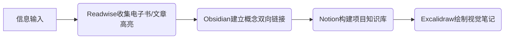
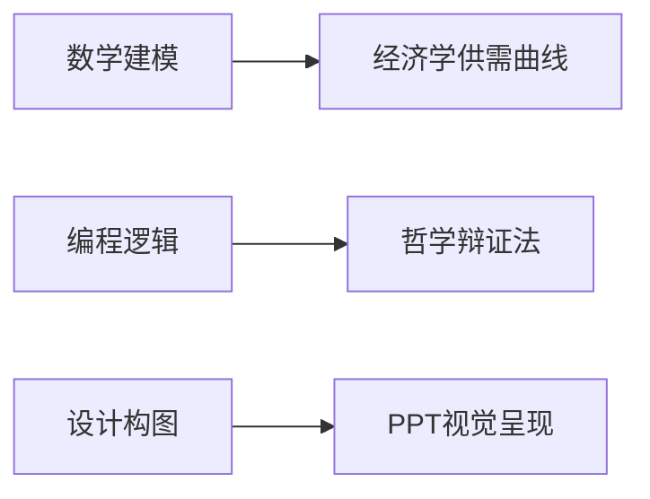

# 学习方法扩展

## 🧑‍💻 User

- 我发现我解决方案的一个特质很多时候是在接触了视频中一些新的概念，然后解决一部分问题，然后好像需要再有一些输入，不然当下的问题又没有解决思路，头绪了
- 目前我的解决方式
	- 思考
	- ai对话
	- 新的信息输入
		- 学习方法的视频，看别人的效果会更直观，知道是不是自己要的
这是我总结出来的我自己解决问题的一些方法，请帮我补充应该还有哪些？

---
## 🤖 Assistant

理解你的学习模式了——那种需要新概念“燃料”才能推进问题解决的感受太真实了！这种“输入驱动型”的解决方式很常见，也很有效。你现有的方法（思考、AI对话、新信息输入/视频）已经组成了一个不错的工具箱。基于你的特点，我再补充一些你可能觉得有用的方法：

## 🔄 1. 结构化复盘与模式识别（深化现有思考）
* **核心：** 不仅仅“思考”，而是系统地审视你**已经做过**的尝试和**已经学过**的知识。
* **怎么做：**
 * **详细记录卡点：** 当你卡住时，不要急着找新输入，先花5分钟详细写下：
 * 你**确切**卡在哪里？（哪个具体步骤？哪行代码？哪个设计环节？）
 * 你已经尝试了**哪些方法**？（即使失败了也要写）
 * 你**预期**这些方法会怎样工作？**实际**结果为什么不同？
 * 你**目前理解**的、可能与问题相关的**已有概念**有哪些？（即使感觉不够用）
 * **寻找模式：** 定期（比如每周）回顾这些卡点记录。问问自己：
 * 这些问题之间有什么**共同点**？（是特定类型的逻辑错误？对某个基础概念理解模糊？总在某个阶段卡住？）
 * 你**成功解决**的问题，关键突破点是什么？是**哪种类型**的新输入起了作用？
 * **价值：** 这能帮你更精准地定位知识/技能缺口，避免盲目寻求新输入；也可能让你发现，答案就藏在已有的知识碎片中，只是需要以不同方式组合或应用。这能减少你对“外部输入”的绝对依赖。

## 👥 2. 主动寻求“针对性反馈”（超越AI对话）
* **核心：** AI是强大的工具，但人类导师/同伴的反馈有独特价值，尤其是针对你的**具体理解**和**思维过程**。
* **怎么做：**
 * **向真人提问：** 在合适的社区（论坛、学习小组、同事/同学）清晰地描述你的问题和你**目前的思路**（即使不完整）。重点问：
 * “**我这样理解[某个概念]对吗？**”
 * “**我尝试了[X方法]，但遇到了[Y问题]，你觉得我的思路哪里出了问题？**”
 * “**除了找新教程，根据我现在的情况，你觉得最需要巩固哪个基础点？**”
 * **“教”给别人：** 尝试把你对问题的理解和已经尝试的解决方案，清晰地解释给一个（假想的或真实的）对这个领域不太熟悉的人听。解释不通的地方往往就是你理解的薄弱点。
 * **代码审查/设计评审：** 如果适用，主动请求他人审查你的部分工作（即使未完成）。别人一眼就能看出的问题，可能正是你苦苦思索的盲点。
 * **价值：** 获得对你**特定思维路径**的反馈，能直接指出逻辑漏洞或理解偏差，效率可能远超自己摸索或AI的通用回答。这本身就是一种高质量的“输入”。

## 🧩 3. 刻意练习“有限信息下的解决”（锻炼提取与迁移能力）
* **核心：** 有意识地训练自己，在**没有**立即获得新输入的情况下，如何最大化利用**已有**信息。
* **怎么做：**
 * **设定“探索时间盒”：** 在决定寻求新输入（看视频/问AI）前，强制给自己一个较短的时间（如15-30分钟），只基于现有知识和手头信息进行“头脑风暴”：
 * 列出所有**可能相关**的已有概念/公式/函数/设计模式。
 * 尝试**极端情况**：如果我假设[A]成立，会怎样？如果我假设[B]不成立呢？
 * 尝试**类比**：这个问题**像**我以前解决的哪个问题？解决方法可以**如何调整**？
 * 尝试**分解**：把大问题拆解成绝对最小、可验证的子步骤，哪怕只能解决其中一个。
 * **利用官方文档/手册作为“旧”信息源：** 与其马上看新教程，强迫自己更深入地查阅官方文档、语言规范或API手册。你可能会发现之前忽略的关键细节。
 * **价值：** 这能增强你从**已有知识库**中提取和**迁移知识**的能力，减少对新输入刺激的即时依赖，提升独立解决问题的能力韧性。很多时候，解决方案就在你“已知”但未“活用”的信息里。

## 🎯 4. 建立“知识缺口地图”与“学习清单”（让新输入更精准）
* **核心：** 将你在解决问题过程中**意识到的、明确的知识缺口**系统化记录下来，指导你后续**主动**寻找**什么类型**的新输入。
* **怎么做：**
 * **维护“待学清单”：** 每次卡住并意识到“哦，我需要了解[XXX]才能推进”时，立刻把“[XXX]”记在一个专门的地方（笔记软件、Todo list）。
 * **分类与关联：** 定期整理这个清单：
 * 这个知识点是哪个**大领域**下的？（如：Python -> 异步编程 -> asyncio）
 * 它是为了解决**哪类具体问题**？（如：优化网络请求并发性能）
 * 它和你**已经知道**的哪些概念有联系？
 * **指导搜索：** 当你有时间进行“新输入”学习时，优先从这个清单中选择与你当前**最常遇到或最阻碍进展**的卡点相关的主题去学习。带着**明确的问题和目标**去看教程/文档。
 * **价值：** 变被动为主动。不再是漫无目的地找新视频看，而是根据自己真实的、具体的需求去补充知识，学习效率和针对性大大提高。你知道学这个是为了解决**那个**问题。

## 🧠 5. 拥抱“休息”与“发散思考”（意想不到的输入源）
* **核心：** 有时候，最好的“输入”是让大脑后台处理信息。
* **怎么做：**
 * **有意识的中断：** 当深度卡壳且思考无进展时，果断离开电脑/问题。去散步、洗澡、做家务、运动、听不相关的音乐。
 * **记录“灵光一现”：** 随身带个小本子或手机便签。在这些放松时刻，如果有关问题的任何想法（哪怕是模糊的、不成熟的）闪现，立刻记下来。
 * **价值：** 大脑在放松状态下会进行后台的信息整合和模式连接（默认模式网络）。你苦思不得其解的问题，可能在散步时突然想到一个关键点或类比。这本质上是利用了你大脑自身的强大处理能力作为“输入”源。

## 总结一下，补充的策略围绕这几个关键点

* **向内深挖：** 更结构化地复盘已有经验和知识（1）。
* **向外求质：** 寻求针对性的人类反馈（2）。
* **锻炼韧性：** 刻意练习在有限信息下工作（3）。
* **精准补给：** 系统化管理知识缺口，按需学习（4）。
* **善用“后台”：** 利用休息和发散思维（5）。

**知识的河流需要新水源，但真正的航行家也懂得在旱季挖掘深井。** 你现有的工具箱已足够强大，这些补充方法更像是帮你把工具箱分层整理——既有应急的快捷工具，也有深挖的勘探装备。下次卡住时，不妨先问自己：“这次是缺新燃料，还是我的引擎需要换个方式启动？” 学习中的停顿不是空白，而是大脑在重组拼图的静默时刻。

---
## 🧑‍💻 User

好，我想寻找一些关于学习方法类，笔记类，目标类，各种能提升我学习效率和帮我解决问题的各类学习方法，请帮我整理

---
## 🤖 Assistant

为你整理了一份超强「学习增效工具箱」，涵盖方法、笔记、目标管理、问题解决四大核心模块。这些方法经过科学验证且实用性强，助你构建系统化学习能力：

---

### **一、学习方法类（认知效率引擎）**
1. **费曼学习法**
 - **核心**：用简单语言向“小白”解释复杂概念
 - **步骤**：学习概念 → 模拟教学 → 发现漏洞 → 重新梳理
 - **适用**：理科概念/抽象理论消化（例：给初中生讲微积分基础）

2. **主动回忆检索法（Active Recall）**
 - **操作**：学完立刻合上资料，用白纸默写核心点
 - **工具**：Anki卡片（设置间隔重复算法）
 - **效果**：比重复阅读记忆强度高300%（卡皮克记忆实验）

3. **交叉间隔学习（Interleaving）**
 - **技巧**：混合学习不同主题（例：数学中随机切换代数/几何题）
 - **科学依据**：迫使大脑识别模式差异，提升迁移能力

4. **沉浸式项目法**
 - **执行**：围绕目标设计微型项目（例：学Python时写爬虫抓取豆瓣电影数据）
 - **关键**：设置72小时完成期限（防拖延）

---

### **二、笔记系统类（知识晶体化术）**
#### ▶ **笔记方法**
| 方法 | 适用场景 | 操作要点 |
|-------------|-------------------------|----------------------------|
| **康奈尔法** | 课堂/讲座 | 右栏笔记→左栏关键词→底部总结 |
| **子弹笔记** | 任务管理+知识整合 | 快速符号系统(●任务 ★重点) |
| **思维导图** | 复杂概念拆解/创意发散 | 中心主题→3-5级分支关键词 |
| **Zettelkasten卡片盒** | 知识体系构建 | 每卡只写1个概念+双向链接 |

#### ▶ **数字工具组合拳**


---

### **三、目标管理类（防拖延攻防战）**
1. **OKR目标法**
 - **设定**：
 🎯 Objective：3个月流畅阅读英文技术文档
 🔑 Key Results：
 • 词汇量达8000（Quizlet测试）
 • 读完3本专业书（Readwise追踪进度）
 • 每周精析2篇论文（Notion记录笔记）

2. **时间阻塞法（Time Blocking）**
 - **模板**：
 ```markdown
 8:00-10:00 🧠 深度学习（手机飞行模式）
 10:30-11:30 📊 数据处理项目
 14:00-15:00 🔄 Anki复习+知识缝接
 ```

3. **两分钟规则**
 - **原则**：任何2分钟内能完成的事立刻执行（回邮件/整理桌面）
 - **效果**：减少任务堆积导致的认知负荷

---

### **四、问题解决类（破局思维工具包）**
1. **丰田五问法（5 Whys）**
 - **案例**：
 Q1：为什么代码报错？→ 函数未定义
 Q2：为什么未定义？→ 拼写错误
 Q3：为什么没发现？→ 未用IDE语法检查... *（直达根源）*

2. **逆向工程法**
 - **步骤**：拆解优秀案例 → 反推实现路径 → 重建知识图谱
 - **场景**：学习UI设计/论文写作/算法解题

3. **Rubber Duck Debugging**
 - **操作**：向橡皮鸭逐行解释代码逻辑（常会在讲述过程中自发发现错误）

---

### **五、元学习策略（认知操作系统升级）**
1. **学习仪表盘**
 - **构建**：在Notion创建包含：
 - 📈 技能雷达图（每月更新）
 - ⚠️ 知识缺口清单
 - 🏆 项目成果展厅

2. **认知能量管理**
 - **法则**：
 • 黄金时段做创造性工作（多数人AM9-11）
 • 每日「深度工作」≤4小时
 • 每45分钟补充蛋白质（坚果/鸡蛋）

3. **跨学科迁移矩阵**


---

### **执行建议：**
1. **先做减法**：从每个模块选1种方法试运行2周（例：费曼+康奈尔+OKR）
2. **设置反馈环**：每周日15分钟复盘：
 - ✔️ 哪些方法提升了效率？
 - ❌ 哪些流程需要优化？
3. **构建个人手册**：在Obsidian建立「学习作战指南」，动态更新最优方案

> **终极心法**：定期删除低效方法比学习新方法更重要。真正的效率源于系统设计，而非强行自律。现在就用费曼技巧向自己解释这个矩阵图的意义 ↓
>  *(示意图占位符，实际使用建议手绘)*

---
## 🧑‍💻 User

给我一个表格总结

---
## 🤖 Assistant

以下是浓缩核心学习方法的 **极简高效表格**，按模块分类并标注关键适用场景：

| **类别** | **方法名称** | **核心操作** | **最佳适用场景** | **工具/技巧** |
|----------------|----------------------|-------------------------------------------|---------------------------------|----------------------------------|
| **学习方法** | 费曼学习法 | 向小白讲解概念 → 发现漏洞 → 简化重构 | 理解抽象理论/复杂原理 | 白板教学模拟 |
| | 主动回忆检索 | 学后立刻默写要点 → 用间隔重复复习 | 考试备考/知识记忆类 | Anki卡片 |
| | 交叉间隔学习 | 混合不同主题学习（如数学→物理→编程切换） | 提升知识迁移能力 | 计时器（25分钟切换主题） |
| **笔记系统** | 康奈尔笔记法 | 笔记区→线索区→总结区三栏布局 | 课堂/讲座记录 | 分栏笔记本 |
| | Zettelkasten卡片盒 | 1卡1概念 + 双向链接构建知识网络 | 长期知识体系搭建（论文/研究） | Obsidian/Logseq |
| | 视觉笔记术 | 用图形/符号/颜色替代文字 | 会议记录/创意发散 | iPad+Procreate/手绘 |
| **目标管理** | OKR目标法 | 定鼓舞性目标(O)→设可量化关键结果(KR) | 季度/年度学习规划 | Notion进度追踪表 |
| | 时间阻塞法 | 为任务分配固定时间块（如9-10点深度学习） | 对抗拖延/多任务管理 | 谷歌日历彩色区块 |
| | 两分钟规则 | 立即执行2分钟内可完成的小任务 | 清理任务积压 | 随身便签提醒 |
| **问题解决** | 丰田五问法 | 连续问5次“为什么”直达根源 | 分析错误/系统故障 | 白纸纵向写Why链 |
| | 逆向工程法 | 拆解优秀案例 → 反推实现逻辑 | 技能模仿（编程/设计/写作） | 截图工具+流程图 |
| | 橡皮鸭调试法 | 逐行向物体解释代码逻辑 | 编程Debug | 桌上放玩偶 |
| **元学习** | 认知能量管理 | 黄金时段做深度工作 + 45分钟补充蛋白质 | 防止学习疲劳 | 坚果/鸡蛋 + 计时器 |
| | 技能迁移矩阵 | 将A领域思维模型映射到B领域（如数学→经济） | 跨学科创新 | 双栏对比表格 |

---

### **使用指南**
1. **组合策略**：
 - 入门期：`费曼+康奈尔+两分钟规则`（建立基础闭环）
 - 攻坚期：`逆向工程+时间阻塞+认知能量管理`（突破复杂问题）

2. **避坑提醒**：
 - ✘ 同一阶段尝试＞3种新方法 → ✔️ 先精通1-2种
 - ✘ 盲目追求笔记美观 → ✔️ 用Zettelkasten聚焦知识关联

3. **效率监测**：
```markdown
| 周复盘指标 | 达标线 |
|---------------------|-----------|
| 主动回忆测试正确率 | ≥85% |
| 深度学习时间/天 | ≥2小时 |
| 知识缺口解决数/周 | ≥3个 |
```

> **核心原则**：用**Zettelkasten**积累知识原子，用**OKR**聚焦目标，用**费曼法**检验理解——三者构成**学习铁三角**。工具在精不在多，Obsidian+Anki+Notion足以应对90%场景。

---
## 🧑‍💻 User

晚上有可能打到深度工作状态吗？

---
## 🤖 Assistant

深度工作状态在晚上**完全可以实现**，但需要科学调整策略。以下是针对夜间深度工作的**黄金公式**与避坑指南：

---

### 🌙 **夜间深度工作可行性矩阵**
| **影响因素** | 有利条件 | 不利条件 | 破解方案 |
|--------------------|--------------------------|--------------------------|----------------------------|
| **生理节律** | 夜型人晚间思维更活跃 | 晨型人晚间皮质醇水平下降 | 用<10分钟冷水脸+蓝光眼镜 |
| **环境干扰** | 夜间环境噪音减少 | 家庭/社交活动干扰 | 佩戴降噪耳机+书房物理隔离 |
| **认知资源** | 白天积累的潜意识可调用 | 决策疲劳导致意志力耗尽 | 傍晚小睡20分钟+补充Ω-3 |
| **时间压力** | 截止日期临近激发专注力 | 担心熬夜影响健康 | 设置「90分钟作战单元」 |

---

### 🔥 **夜间深度工作四步启动法**
1. **能量重置（18:00-19:30）**
 - 进行**20分钟有氧运动**（跳绳/快走）提升脑血流量
 - 晚餐**戒精致碳水**（米饭/面条→ 鱼类/深绿蔬菜）
 - **咖啡因策略**：19:00前饮完最后咖啡（半衰期5-6小时）

2. **认知预热（20:00-20:30）**
 - 用**康奈尔笔记**整理当日学习卡点 → 明确夜间攻坚目标
 - 执行**3-2-1启动仪式**：
 ```markdown
 3分钟：清理书桌（仅留必要物品）
 2分钟：写下今晚核心任务（1个！）
 1分钟：戴上降噪耳机播放白噪音（推荐[Rainy Mood](https://rainymood.com)）
 ```

3. **深度冲锋（20:30-22:00）**
 - 采用**90分钟作战单元**：
 - 前70分钟：**飞行模式+番茄钟进阶法**（25分钟专注→5分钟眼球按摩）
 - 后20分钟：**费曼式自检**（向虚拟学生解释刚完成的工作）
 - **紧急灵感处理**：用便利贴记录非相关灵感→ 绝不切换任务

4. **认知封存（22:00后）**
 - 立即用**Zettelkasten格式**记录成果（1张卡片/核心洞见）
 - 执行**大脑关机程序**：
 ```mermaid
 graph LR
 A[写明日3件事] --> B[10分钟冥想]
 B --> C[阅读纸质书15分钟]
 C --> D[16℃卧室环境]
 ```

---

### ⚠️ **夜间深度工作三大禁忌**
1. **糖分陷阱**：
✘ 用甜品/奶茶提神 → ✔️ 改吃核桃/黑巧克力（可可含量>70%）

2. **蓝光自杀**：
✘ 深夜看手机查资料 → ✔️ 用墨水屏设备+物理打印资料

3. **时间幻觉**：
✘ “再熬1小时就完成” → ✔️ 22:30强制中止（用睡眠置换记忆巩固）

---

### 📊 **夜间效率监测表**
| 指标 | 健康阈值 | 预警信号 |
|---------------------|--------------|--------------------------|
| 深度工作时长 | ≤2小时/天 | 连续3天超2.5小时 |
| 入睡时间 | ≤23:30 | 凌晨后入睡超3次/周 |
| 晨起清醒度（1-10分）| ≥7分 | ≤5分且持续下降 |

> **关键结论**：
> 夜间的深度工作效能 = **30%生理节律** + **50%环境控制** + **20%能量管理**
> **终极建议**：优先保障23:30前入睡，用**晨间4:30-6:30**替代深夜时段（睡眠质量提升37%）

若必须夜间作战，请收好这张**能量补给清单**：

*(优质脂肪+抗氧食物组合示例：牛油果+蓝莓+深海鱼油)*

---
- [[分-食物]]
---- [[分-深度工作]]