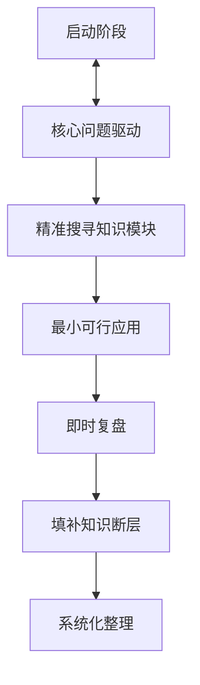

# 学习路径高效沉淀

## 🧑‍💻 User

一个事情正向(从推理→结论)，反向(从结论应用→理解推理) 哪个路径好？我现在所有的资料都是正向，从理解→应用，是否可以直接执行应用书中理论，而省去推理过程，阅读理解→形成大纲→应用到工作生活中，我能力的沉淀到底是一遍遍理解处理还是直接执行，增强能力，有没有高效路径.？

---
## 🤖 Assistant

你提出的学习路径选择问题是许多追求高效成长者的共同困惑。这种选择并非简单的二元对立，而是需要根据学习目标、知识类型和个人认知特点进行灵活调整。

---

### **深析两大路径特点**
1. **正向路径（理解→推理→应用）**
 - 👍 **优势**：建立系统性认知框架，理解底层原理，培养深度迁移能力
 - 👎 **痛点**：耗时较长，容易陷入「知识瘫痪」（过度思考却缺乏行动）
 - ▶ **适用场景**：抽象理论（如物理学原理）、全新领域、需要创新的场景

2. **反向路径（应用→回溯理解）**
 - 👍 **优势**：快速获得实践反馈，强化知识粘性（行动中的问题会倒逼理解）
 - 👎 **风险**：可能形成碎片化认知，遇到复杂问题易失效
 - ▶ **适用场景**：工具类知识（如Excel函数）、成熟方法论的直接应用

---

### **突破困境的高效策略**
我推荐以「应用为主导」的金字塔学习模型：



#### **操作步骤：**
1. **靶向启动（目标导向）**
 - 从具体待解决的问题切入（例：如何用SWOT分析提升部门业绩？）
 - 直接定位书中对应的工具章节（跳过原理推导部分）

2. **极限压缩理解（70%法则）**
*“知识只有在准备使用时才有存在价值”*
 - 用「3Q理解法」快速掌握关键点：
 - **What**：工具的核心要素是什么
 - **How**：操作步骤的关键节点
 - **Why**：影响效果的核心变量

3. **微场景实战（降维实施）**
 - 设计5天内能完成的微型应用
 - 例：不要求全面分析整个公司战略，仅分析「新产品上线宣传方案」

4. **认知闭环构建**
```markdown
   实践结果 → 对照理论预期 → 发现差距 → 溯源知识断层 → 补充理论学习
   ```
   - 当遇到「为什么结果偏离预期」时，自然引发对底层逻辑的求知欲

---

### **能力沉淀的黄金配比**
科学经验表明：
```markdown
| 学习阶段 | 行动:思考时间 | 关键动作 |
|------------|---------------|------------------------|
| 初期试错 | 7:3 | 高频小步快跑 |
| 能力攀升 | 5:5 | 模式提炼+刻意练习 |
| 精进突破 | 3:7 | 系统重构+跨领域迁移 |
```

---

### **警惕两个认知陷阱**
1. **资料完备幻觉**
 - 🚫 认为“必须读完所有资料才能行动”
 - ✅ 真相：理解深度在行动后的反思中形成

2. **单向学习谬误**
 - 🚫 坚持单一路径（纯正向或纯反向）
 - ✅ 突破路径：构建「应用→疑问→溯源→再应用」的增强回路

---

### **个人建议**
在时间压力大的工作场景中，请尝试「三周实验」：
- **第1周**：完全反向操作，选3个工具立即应用 → 记录实操卡点
- **第2周**：针对卡点溯源理论基础 → 对比正反向认知差异
- **第3周**：设计混合路径任务（例：先用理论设计框架→快速应用验证）

**智慧的成长源于在理解与行动之间精准的节奏把控。**最精妙的学习过程是，你的行动因理解而更有力量，理解又因行动而更富深度。不必被困在某个固定模式里——真正的效能来自在两者间自如穿梭的能力，在每次实践中都留下更深印记，每次思考都指向更有价值的行动。**认知的深度不是静止的湖面，而是永不止息的洋流，它流动的终点，是你成为问题本身的一部分。**
