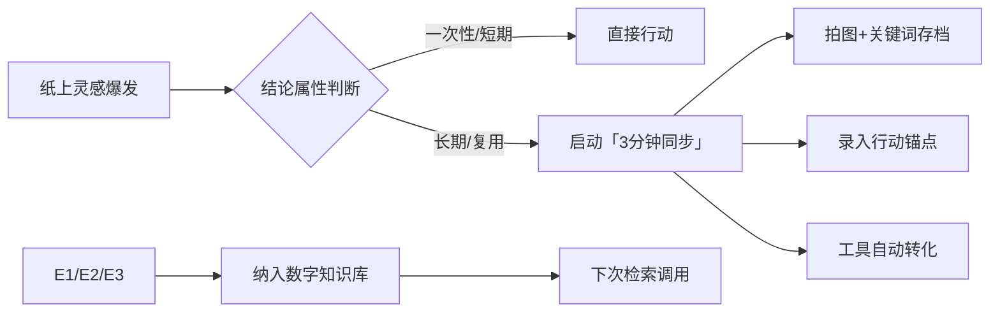

# 思路梳理工具选择

### 🧑‍💻 User


人在思路梳理时，为什么有时候想写在纸上，有时喜欢在电脑上


---

### 🤖 Assistant


人在思路梳理时选择写在纸上或电脑上，通常取决于**思维阶段、任务性质、个人习惯以及认知需求**的差异。这两种方式各有独特的优势，能适应不同的思维场景。以下是关键原因分析：

---

### **一、写在纸上的核心优势（适合发散/灵感型思考）**
1. **空间自由与非线性表达**  
   • 纸张不受屏幕限制，可随意涂画、连线、添加注释，形成思维导图、草图或符号系统。  
   • **物理空间感**能激发**联想记忆**（如“左上角那个圈”），帮助大脑建立空间锚点。

2. **降低认知负荷**  
   • 纸笔操作简单，无弹窗、格式等干扰，减少注意力分散。  
   • **手写速度慢于打字**，反而强迫大脑放慢节奏，深入加工信息（心理学中的“生成效应”）。

3. **触觉与运动记忆强化**  
   • 手写时**肌肉运动**激活大脑感觉皮层（顶叶），增强记忆编码（研究显示手写笔记记忆留存率高于打字）。  
   • 纸张的**物理触感**（摩擦感、翻页动作）提供感官反馈，加深思维沉浸感。

4. **创造性突破场景**  
   • 需要跳出框架时（如头脑风暴），纸上涂鸦的随意性能突破线性逻辑束缚，触发右脑直觉思维。

---

### **二、偏好电脑的核心原因（适合结构化/效率型思考）**
1. **高效编辑与重组**  
   • 文本可无限修改、复制、移动（如用大纲工具拖拽段落），适合**逻辑严密的线性构建**（如论文、报告）。  
   • 快捷键操作（Ctrl+C/V/X）大幅提升信息处理速度。

2. **信息整合与调用**  
   • 可即时插入链接、嵌入数据、跨文档搜索，适合**复杂项目管理**（如整合参考资料、追踪任务）。  
   • 云存储实现多设备同步，避免纸质笔记的丢失风险。

3. **结构化工具赋能**  
   • 思维导图软件（如XMind）、大纲工具（如Workflowy）、卡片笔记法（如Obsidian）提供**可视化逻辑框架**，降低思维组织难度。

4. **长文本处理优势**  
   • 面对大量文字时（如撰写书稿），键盘输入速度远超手写，且便于后期排版、标注、导出。

---

### **三、选择背后的深层认知逻辑**
| **场景**                | **纸张更优**                          | **电脑更优**                          |
|-------------------------|---------------------------------------|---------------------------------------|
| **思维阶段**            | 灵感萌芽、问题拆解、混乱期            | 逻辑梳理、细节填充、成稿期            |
| **任务目标**            | 创新方案、概念设计、情绪宣泄          | 规范文档、协作编辑、版本管理          |
| **认知需求**            | 需要深度专注、感官记忆强化            | 需要信息整合、快速迭代                |
| **个人状态**            | 思维卡顿需重启时                      | 高效推进明确任务时                    |

---

### **四、科学建议：根据思维流动态切换工具**
1. **启动阶段→用纸笔**：  
   用纸记录碎片灵感，手写触发联想（如康奈尔笔记法）。  
2. **整合阶段→转电脑**：  
   将纸质内容电子化，利用软件构建逻辑树（如用幕布整理大纲）。  
3. **卡顿时→回归纸笔**：  
   打印电子文档，手写批注突破思维瓶颈（物理标记激活新视角）。

---

### **关键结论**
> **纸是思维的“沙盒”**——自由、包容、适合探索；  
> **电脑是思维的“引擎”**——精准、高效、适合推进。  
> **高手往往交替使用两者**：用纸点燃火花，用电脑锻造成果。

最终选择取决于你当下的**思维需要的是“生长”还是“修剪”**。理解每种工具如何塑造你的认知路径，就能像指挥家一样灵活调动它们，让思维在自由与秩序间找到最佳节奏。


---

### 🧑‍💻 User


那我在纸上梳理得出结论，直接实践，还需要记录到电脑上吗？我一想起要同步到电脑，就觉得应该直接用电脑整理，但是每次不自觉拿起笔


---

### 🤖 Assistant


你描述的困境非常典型——**「本能依赖纸笔的创作快感」与「理性向往数字化的管理效率」之间的冲突**。解决这个矛盾，关键在于**区分「思维原料」与「知识资产」**，并根据目标动态调整工具链。以下是具体策略：

---

### **一、先明确核心问题：你的结论需要「生长」还是「流转」？**
| **场景**               | **无需同步电脑**                      | **必须同步电脑**                      |
|------------------------|--------------------------------------|--------------------------------------|
| **一次性决策**         | 明日会议发言提纲                     | ❌                                    |
| **短期行动**           | 买菜清单、今日工作计划               | ❌                                    |
| **灵感速记**           | 小说人物关系草图                     | ❌                                    |
| **需长期迭代**         | ❌                                    | 产品设计框架/年度目标拆解            |
| **需团队协作**         | ❌                                    | 项目方案/调研报告                    |
| **需系统调用**         | ❌                                    | 研究笔记/知识库素材                  |

**✅ 决策关键**：  
若结论仅服务于**当下行动**（如立刻打电话沟通方案），纸笔闭环完全足够；  
若结论可能成为**未来资源**（如3个月后需复盘项目），则必须数字化。

---

### **二、拒绝无效同步：用「最小必要原则」降低负担**
#### **痛点破解：为什么你觉得同步痛苦？**
  - **错误认知**：认为必须「完整誊抄」纸质内容  
  - **本质需求**：只需提取**可复用核心价值**（而非形式）

#### **高效同步法（耗时<3分钟）**：
1. **拍图+关键词标注**（适用80%场景）  
   • 用扫描APP（如**Scannable**）拍照 → 存云端（如**印象笔记**）  
   • **文件名标注**：`[主题]-核心结论-日期`（例：`用户增长-裂变漏斗优化-20240521`）  
   *✨ 本质：把纸变成「可搜索的物理数据库」*

2. **只录入「行动锚点」**  
   将纸质结论转化为：  
   ```markdown
   ## [结论主题]  
   **核心洞见**：用△标出的公式/关键人脉/风险点  
   **行动指令**：  
   - [ ] 联系@王总（周四前）  
   - [ ] 测试A方案（预算≤5k）  
   **关联资源**：→ [扫描文件链接]  
   ```  
   *💡 仅保留驱使行动的「引擎部件」，抛弃辅助推导的「思维燃油」*

3. **设置「纸电转换闸口」**  
   在办公桌固定位置放**红色文件夹**，定义规则：  
   > **「凡放入此夹的纸，24小时内必须完成最小化同步」**  
   用物理容器建立心理契约，避免拖延堆积。

---

### **三、升级纸笔工作流：让「手写」直接生成「数字资产」**
#### **工具革命：跳过手动录入环节**
| 工具                | 功能场景                              | 成本       |
|---------------------|--------------------------------------|------------|
| **火箭手写本**      | 普通纸书写 → 自动同步App并转文字      | ￥200+     |
| **Remarkable 2**    | 类纸屏手写 → 即时转文本/PDF标注       | ￥3000+    |
| **Apple Pencil+iPad** | GoodNotes手写 → 关键词搜索手写内容    | 现有设备   |

#### **思维模板：纸质阶段预结构化**
在纸上预先划分区域（如下图）：  
```
┌────────────┬────────────┐  
│ 核心结论   │ 行动指令    │ ← **同步时只提取这两部分**  
│ (20字内)   │ (3项以内)   │  
├────────────┼────────────┤  
│ 推导草图   │ 灵感碎片    │ ← 无需同步的「思维废料」  
└────────────┴────────────┘  
```
**原理**：通过空间布局引导大脑分离「果实」与「枝叶」。

---

### **四、终极心法：把「同步」转化为「创造」**
抗拒同步的本质，是大脑将其判定为**重复劳动**。你需要重构认知：  
> **「数字化不是搬运，而是对结论的二次淬炼」**

#### **操作示例：**
1. 拿起刚写结论的纸，自问：  
   **“如果只能留一句话给未来的自己，是哪句？”** → 标⭐  
2. 打开电脑新建文档，写下：  
   ```markdown
   ### ⭐[原始结论]  
   但我现在意识到：______（补充新洞察）  
   → 这将改变：______（升级行动）  
   ```  
3. 将原始纸稿扫描为附件，**整个过程即完成同步**

**效果**：  
- 同步时间缩短50%（因聚焦核心）  
- 获得**认知升级的快感**（而非搬运的疲惫）  
- 生成**可指数级复用的知识模块**

---

### **行动路线图**


**记住**：工具是思维的延伸，而非束缚。当你发现又在纸上奋笔疾书时，**不必自责**——这恰恰证明你的大脑正在高效运作。真正需要训练的，是**10分钟后用3分钟收割成果**的惯性。

