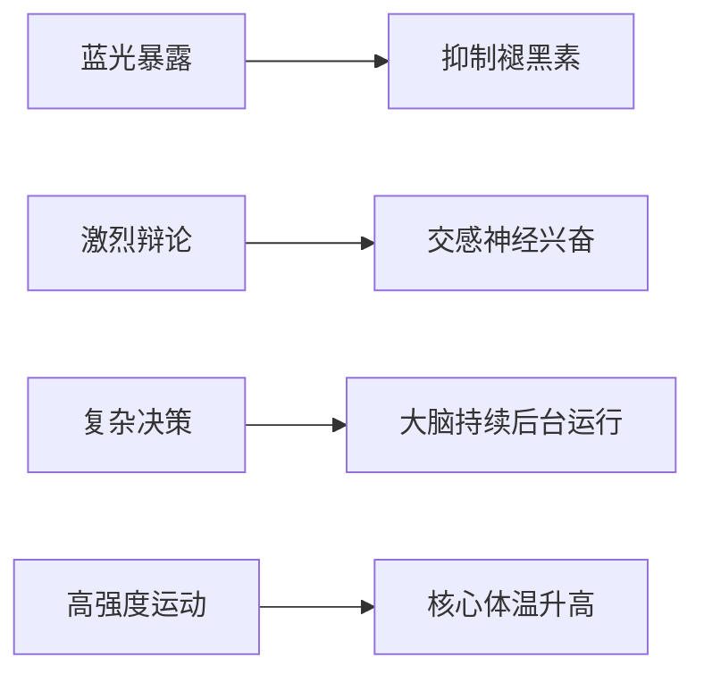

# 运动阅读播客复盘习惯安排建议

## 🧑‍💻 User

比如说我打算一天中养成运动，阅读，听播客，复盘的习惯，你觉得我时间安排和强度上应该怎么安排，以及你对我有什么建议，让我可以把这四个习惯坚持下来

---
## 🤖 Assistant

太棒了！一天内计划养成运动、阅读、听播客和复盘这四项习惯，说明你非常有自我提升的意愿和决心。这四项习惯组合起来，能全面提升你的身心健康、知识储备和反思能力。我来帮你设计一个**切实可行、可持续**的时间安排和强度建议，并提供一些关键的建议帮你坚持下去。

**核心原则：**

1. **循序渐进，避免过度：** 初期强度一定要低，重点是“完成”，而不是“完美”。让习惯容易到不可能失败。
2. **结合生活节奏：** 利用好已有的时间框架（如通勤、午休、睡前）。
3. **微型化启动：** 从最小的、几乎没有负担的行动开始。
4. **一致性第一：** 每天坚持（即使只有几分钟）比单次时间长更重要。
5. **关注精力管理：** 高强度运动后可能不适合深度阅读，需要合理安排顺序。
6. **灵活性：** 生活总有意外，计划要有弹性空间，允许调整。

## 📅 时间安排与强度建议（以朝九晚五上班族为例）

* **06:30 - 07:00 起床 🌞**
* **07:00 - 07:30 运动 (30分钟 - 核心习惯)**
 * **强度：** **从“微习惯”开始！** 初期：
 * 目标1：换上运动服，走出家门/铺开瑜伽垫（完成即成功）。
 * 目标2：只做5-10分钟。比如：快走/慢跑10分钟，或者一套10分钟的居家瑜伽/拉伸/自重训练（俯卧撑、深蹲各几组）。
 * **关键：** 让启动变得极其容易。一旦开始，往往会多做几分钟。
 * **进阶：** 适应后，可逐渐增加到20-30分钟中等强度运动（如慢跑、跳绳、健身环、跟练视频）。**周末可以安排一次稍长时间或强度稍高的运动。**
 * **为什么此时？** 早晨精力较好，不易被打扰，完成运动后一天都有成就感。避免下班后太累而放弃。

* **07:30 - 08:00 洗漱、早餐 🥣**
* **通勤时间 (08:00 - 08:45) 听播客 (45分钟 - 利用碎片时间)**
 * **强度：** 非常灵活。选择你感兴趣的主题（知识、新闻、娱乐、故事均可），**不必强求全部听懂或记住**，享受过程，吸收一点是一点。
 * **关键：** 这是最容易坚持的习惯之一，因为它利用了原本“闲置”的时间。

* **08:45 - 17:30 工作/学习 💼**
* **午休 (12:00 - 13:00) 中的 12:30 - 12:45 阅读 (15分钟 - 微型习惯)**
 * **强度：** **从每天只读1页/5分钟开始！** 重点是打开书/APP，开始读。
 * **内容：** 选择轻松、吸引人的书，避免一上来就啃大部头或晦涩难懂的。小说、传记、感兴趣的领域科普都可以。
 * **进阶：** 适应后，稳定在15-20分钟。感觉好、时间充裕时自然可以延长。
 * **为什么此时？** 午休是大脑需要转换的时间，短时间阅读是很好的休息和充电。

* **通勤时间 (17:30 - 18:15) 听播客 (45分钟 - 利用碎片时间)**
 * 同上，放松或继续学习。

* **18:15 - 20:00 晚餐、休息、家庭时间 🍽️**
* **20:00 - 20:15 / 睡前 复盘 (10-15分钟 - 核心习惯)**
 * **强度：** **极其关键的习惯，但时间可以最短。** 从每天只问自己2-3个问题开始，甚至只记录1件最有成就感的事和1件可以改进的事。
 * **形式 (初期极简版)：**
 * 今天做得好的3件事（哪怕再小，如“准时起床了”、“没喝奶茶”）？
 * 今天哪1件事可以做得更好？如何改进（一个很小的行动点）？
 * 今天最大的收获/感悟是什么（一句话）？
 * **(可选) 明天最重要的1-3件事是什么？**
 * **工具：** 最简单的笔记本、手机备忘录、或专门的日记/复盘APP。**重要的是写下来！**
 * **为什么此时？** 睡前是回顾一天的天然时机，有助于整理思绪，带着平静和计划入睡。如果晚上有其他安排，可以稍微提前到晚饭后安静的时间。

* **20:15/睡前 - 自由时间/准备睡觉 😴**
 * 如果晚上精力尚可且喜欢阅读，可以在睡前再读10-15分钟（取代午休阅读，或作为补充）。但避免过度兴奋的内容影响睡眠。

## 📌 关键建议：让习惯扎根并坚持下来

1. **从“微小”到“不可能失败”：** 这是成功的最关键点！
 * 运动：目标不是30分钟，而是“穿上运动鞋”或“做1个俯卧撑”。
 * 阅读：目标不是1小时，而是“翻开书读1页”或“读5分钟”。
 * 复盘：目标不是长篇大论，而是“写下今天一件好事和一件可改进的事”。
 * **为什么有效？** 心理负担极小，几乎总能完成。完成本身带来成就感，通常会推动你多做一点。长期积累，小习惯自然会长大。

2. **绑定已有习惯 (习惯叠加)：**
 * “**刷牙后**，我马上换上运动服。”
 * “**午饭后坐回工位前**，我读5分钟书。”
 * “**通勤戴上耳机**，我就打开播客APP。”
 * “**关灯躺下前**，我花5分钟写复盘。”
 * 把新习惯“钩”在稳固的旧习惯后面，成功率大增。

3. **降低启动门槛：**
 * **运动：** 前一晚就把运动服、鞋子、瑜伽垫放在显眼处。
 * **阅读：** 把书/阅读APP放在午休后回工位的必经之路/手机主屏幕。
 * **播客：** 提前订阅好喜欢的节目，通勤前打开APP就能播放。
 * **复盘：** 把笔记本和笔放在床头/固定位置，或者手机设置提醒/把复盘APP放在桌面。
 * **移除障碍：** 让做这件事需要的步骤越少越好。

4. **追踪与庆祝微小胜利：**
 * 使用**习惯追踪APP** (如 Streaks, Habitica, Loop) 或简单的**日历打勾**。看着连续的“√”非常有激励作用。
 * **庆祝每一次完成！** 即使是微小的完成，在心里对自己说“好样的！”、“我又做到了！”。这种积极的自我反馈强化行为。

5. **关注“坚持”而非“完美”：**
 * **允许中断：** 生活中总有意外。某天没完成某个习惯？**完全没问题！** 第二天重新开始就好，不要有负罪感，更不要因此放弃全部。“永不连续错过两次”是个好原则。
 * **调整而非放弃：** 如果某个时间段总是无法执行（比如午休总被占用），**果断调整时间**（如挪到睡前阅读15分钟）。找到最适合你当前节奏的安排。

6. **质量 > 数量 (尤其在初期)：**
 * **阅读：** 5分钟专注的阅读 > 30分钟心不在焉的翻页。
 * **运动：** 10分钟标准动作的训练 > 30分钟敷衍了事的动作。
 * **复盘：** 真诚地回答1个核心问题 > 流水账记录。
 * **播客：** 选择1个真正吸引你的主题，有1点收获 > 麻木地听好几个。

7. **营造环境与仪式感：**
 * **阅读/复盘：** 找一个相对安静、舒适的角落。
 * **运动：** 播放激励的音乐或创造一个专属空间。
 * **播客：** 用一副舒适的耳机。
 * **仪式感** 能帮你更快进入状态。

8. **理解“为什么”：** 时常回顾你做这些事的深层原因：
 * 运动是为了更健康、更有精力、更自信？
 * 阅读是为了增长见识、放松身心、提升技能？
 * 听播客是为了开阔视野、学习新知、娱乐放松？
 * 复盘是为了避免重复犯错、加速成长、更了解自己？
 * 当动力不足时，想想这个强大的“为什么”。

9. **灵活调整组合：**
 * 如果某天精神疲惫，可以把运动强度降低（如散步代替跑步），阅读换成听轻松的小说音频，复盘只写一句话。
 * 周末时间充裕时，可以延长运动时间、进行深度阅读、听长节目、做更详细的周复盘。

10. **寻求支持 (可选)：**
 * 告诉家人/朋友你的计划，获得理解和支持。
 * 加入线上/线下的习惯养成社群，互相鼓励。

## 📎 重要提示

* **倾听身体：** 如果感到极度疲惫或不适，给自己休息的权利。强迫坚持可能导致厌恶甚至受伤。
* **个体差异：** 以上时间安排是示例。**请务必根据你自己的生物钟（你是晨型人还是夜猫子？）、工作生活节奏、精力波动情况来调整。** 比如，如果你晚上精力更充沛，可以把运动或阅读挪到晚上。
* **专注当下：** 做每项习惯时，尽量专注。运动时感受身体，阅读时沉浸内容，听播客时专注聆听，复盘时真诚反思。避免同时多任务（比如运动时听需要深度思考的播客），效果会打折。

**总结：**

从**极其微小**的行动开始（穿上运动鞋、打开书读1页、写下一件好事），利用好**碎片时间**（通勤听播客），将新习惯**绑定**在旧习惯之后，**降低启动门槛**，**追踪并庆祝**每一次小的成功，**允许不完美**但绝**不连续放弃两次**。**记住，习惯的养成不在于单次的强度，而在于长期、稳定的重复。** 坚持几周后，你会发现自己已经将这些有益的活动自然地融入生活，它们不再是需要“坚持”的任务，而是让你感到充实和愉悦的日常。

你已经迈出了重要的第一步——有了计划和意愿！接下来，就是行动和温柔的坚持。祝你养成这四个好习惯，收获一个更健康、更智慧、更高效的自己！💪📚🎧✨

---
## 🧑‍💻 User

早上起床10分钟后可以直接运动吗？

---
## 🤖 Assistant

早上起床10分钟后直接运动**是可以的，但具体是否适合你，取决于几个关键因素和你的身体反应**。以下是详细分析和建议，帮助你安全有效地安排晨间运动：

---

### **一、早起运动的优势**
1. **代谢激活**：提升全天代谢率，帮助燃脂。
2. **精力充沛**：促进内啡肽分泌，改善情绪和专注力。
3. **时间可控**：不易被其他事务干扰，培养规律性。
4. **空腹燃脂**：低强度有氧运动（如快走、慢跑）可优先消耗脂肪储备。

---

### **二、早起10分钟后运动的注意事项**
#### **1. 身体唤醒度是关键**
 - **睡眠惯性**：刚醒时身体反应、协调性、核心温度较低（比白天低1°C）。
 - **建议行动**：
 - 起床后先喝一杯温水（约200-300ml），补充夜间水分流失。
 - 做**3-5分钟动态拉伸**（如手臂画圈、弓步转体、高抬腿），激活关节和肌肉。
 - 从**低强度有氧**开始（如快走、慢跑、瑜伽），避免直接进行力量训练或高强度间歇训练（HIIT）。

#### **2. 评估空腹耐受度**
 - **低血糖风险**：空腹8小时以上运动，部分人可能出现头晕、乏力。
 - **解决方案**：
 - 若计划运动≤30分钟，可完全空腹（身体会调用脂肪供能）。
 - 若计划中高强度运动＞30分钟，建议吃**快速碳水**（如半根香蕉、一片吐司）后再开始。
 - **自测方法**：先尝试1-2次，运动中若心慌手抖需及时停止。

#### **3. 心血管适应时间**
 - **血压变化**：晨起时血压自然升高（晨峰现象），直接剧烈运动可能增加心脏负担。
 - **安全建议**：
 - 高血压/心血管风险人群避免立即高强度运动。
 - 普通人从心率＜130次/分钟的有氧运动开始（如散步过渡到慢跑）。

---

### **三、推荐运动类型与强度（起床10分钟后）**
| **运动类型** | **强度建议** | **适合人群** |
|---------------------|-----------------------------|----------------------------------|
| **动态拉伸/瑜伽** | 低强度，10-15分钟 | 所有人，尤其久坐/关节僵硬者 |
| **快走/慢跑** | 心率＜140次/分钟，20分钟 | 健康人群，空腹燃脂需求者 |
| **自重训练** | 中低强度（深蹲、俯卧撑） | 有训练基础者，避免力竭 |
| **高强度训练(HIIT)** | 不推荐（至少起床30分钟后） | 经验丰富的训练者，非空腹状态 |

---

### **四、个性化调整建议**
1. **尝试“阶梯式启动”**：
 - 第1周：起床后仅做5分钟拉伸 + 10分钟快走。
 - 第2周：增加至15分钟慢跑或20分钟瑜伽。
 - 身体适应后再逐步提升强度。

2. **关注身体信号**：
 - ✅ **可继续**：呼吸平稳、肌肉微热、精神振奋。
 - ❌ **需停止**：头晕、恶心、关节疼痛、心率过快（＞180-年龄）。

3. **特殊人群谨慎**：
 - 低血糖/糖尿病患者 → 运动前需补充少量蛋白质（如1个鸡蛋）。
 - 腰椎/膝关节旧伤 → 避免跳跃动作，选择游泳或椭圆机。

---

### **五、优化晨间运动效率的贴士**
1. **睡前准备**：将运动服放在床头，节省起床后决策时间。
2. **快速补水**：水中加少量盐（约0.3g）改善电解质平衡。
3. **利用光照**：在窗边或户外运动，自然光帮助调整生物钟。
4. **运动后补充**：结束后30分钟内摄入「碳水+蛋白质」（如牛奶+燕麦）。

---

### **结论**
**对健康人群而言，起床10分钟后进行低强度运动（如动态拉伸、快走、慢跑）是安全且高效的**，但需遵循：
1. 从最低强度开始，给身体「启动时间」；
2. 重视补水和热身；
3. 根据自身反应调整强度（宁可保守勿激进）。

**若你属于以下情况，建议延后运动时间至起床30分钟以上**：
- 有心血管疾病史或晨起明显头晕；
- 计划进行力量训练或HIIT；
- 前一天睡眠不足5小时或饮酒。

最终请以身体的反馈为准——**可持续的运动计划永远优于勉强坚持的高强度方案**。

---
## 🧑‍💻 User

比如说我晚上9.30以后脑子基本转不动了，我适合干些什么？

---
## 🤖 Assistant

晚上9:30后大脑进入低能耗状态是自然生理现象（褪黑素分泌增加，神经兴奋度降低），此时**应顺应身体节奏，专注恢复型活动**。以下是科学且实用的晚间安排建议，兼顾放松、自我提升和睡眠准备：

---

### **一、优先选择：彻底放松身心的活动**
#### **1. 舒缓型身体维护**
- **筋膜放松**（5-10分钟）
用泡沫轴按摩肩背/腿部（参考下图动作），缓解久坐疲劳，提升睡眠质量
*👉 注意：避免剧烈疼痛感，保持呼吸平稳*
- **睡前瑜伽/拉伸**（10分钟）
重点做「婴儿式」「仰卧脊柱扭转」「腿部靠墙倒箭式」，直接促进褪黑素分泌
- **热水足浴**（42℃水温，15分钟）
水中可加含镁浴盐，加速下肢血液循环，调节植物神经

#### **2. 无压力信息输入**
- **听音频内容**
 - 📚 **文学类有声书**（如《瓦尔登湖》片段）
 - 🎧 **白噪音/自然声**（雨声、篝火声）→ 用Noisli或小睡眠APP
 - 💬 **闲聊类播客**（避免知识密集型内容）
- **视觉减压**
 - 翻看**摄影画册/图解书籍**（如《这里》《S》）
 - 观赏**慢节奏纪录片**（《行星地球》《航拍中国》开0.5倍速）

---

### **二、创造性替代：低认知消耗的产出**
#### **1. 整理型事务（清理物理/数字空间）**
| 事项 | 操作建议 | 心理收益 |
|---------------------|------------------------------|------------------------|
| 整理明日背包 | 收好钥匙/口罩/交通卡 | 减少晨间决策压力 |
| 清理手机相册 | 删除模糊/重复照片 | 释放存储焦虑 |
| 桌面极简整理 | 只保留台灯+1本书 | 提升睡眠环境秩序感 |

#### **2. 开放式创作（无需逻辑闭环）**
- **自由书写**：用纸笔随意写脑中碎片（不回头修改）
- **拼贴手账**：剪贴杂志图片+单词语句表达情绪
- **简单涂色**：填涂曼陀罗模板（激活大脑α波）

---

### **三、为次日蓄能的高效准备**
1. **3件要事预规划**
在便签写：「明天必须完成的TOP3任务」
*例：① 9:00前提交报告 ② 预约牙医 ③ 买猫粮*
*👉 避免写超过3项，减轻潜意识负担*

2. **环境预设（2分钟仪式）**
 - 将运动服放在床头椅
 - 咖啡机装好水豆
 - 翻开书籍到次日阅读页
*✨ 减少晨间意志力消耗*

---

### **四、绝对禁忌事项（损害睡眠质量）**

---

### **五、个性化方案模板（按性格选择）**
- **内向型**：熏衣草精油扩香 + 针织/拼图 + 暖黄灯光
- **外向型**：给亲友写简短感恩便条 + 整理社交照片
- **焦虑倾向**：4-7-8呼吸法（吸气4秒→屏息7秒→呼气8秒）重复5轮

---

### **关键科学原理**
> 21:30后大脑前额叶活跃度下降40%，此时强行学习工作效率不足白天1/3，且会延长睡眠潜伏期（NASA睡眠研究数据）。顺应昼夜节律的安排反而能提升次日晨间200%的专注力（《Why We Sleep》Matthew Walker）。

**执行建议**：先从1个5分钟放松小动作开始（如腿部靠墙+听雨声），建立「晚间无压力」的心理联结，逐步形成自动化的睡前程序。
