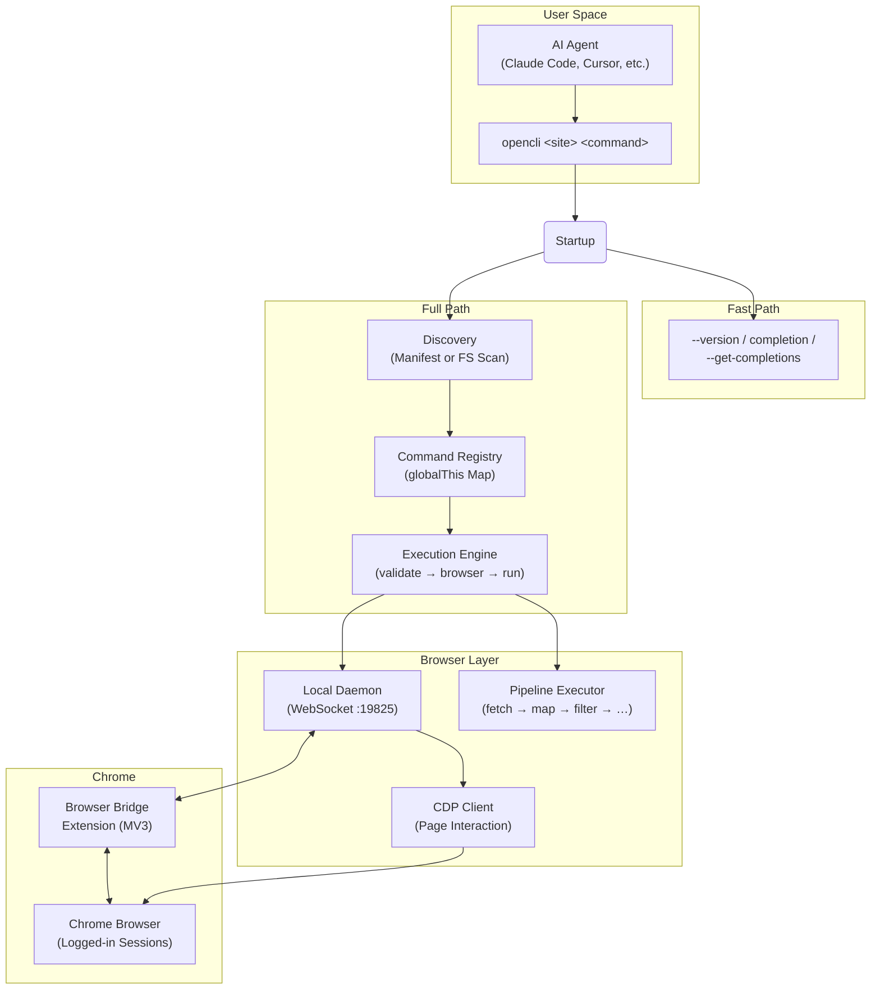

## 1. Overview

**OpenCLI** 能将任意网站转换为命令行界面，并让 AI 代理操作你已登录的 Chrome 浏览器。它为三种自动化范式提供了统一的操作界面：针对 100+ 网站的内置适配器、面向 AI 代理的按需浏览器驱动，以及端到端的适配器编写工作流。无论你是编写自动化脚本处理重复性 Web 任务的开发者、在需认证页面中导航的 AI 代理，还是将网站访问模式代码化的适配器编写者——OpenCLI 都能为你提供确定性的 CLI，取代脆弱的浏览器会话。

来源: [README.md](/README.md#L1-L40), [package.json](/package.json#L1-L10)

## OpenCLI 的功能

OpenCLI 弥合了 Web 的交互特性与 CLI 的可组合性。其核心在于将**每个网站视为一个可调用命令**，具备结构化参数、确定性输出及可配置的认证策略。这之所以可行，是因为 OpenCLI 通过轻量级扩展和本地守护进程维持着与你 Chrome 浏览器的实时连接——这意味着你现有的登录会话、Cookie 和页面状态无需手动认证即可供每个命令使用。

该系统支持共享同一运行时的三种不同用例：

| 用例 | 工作原理 | 示例 |
|----------|-------------|---------|
| **内置适配器** | 针对热门网站预编写的命令，以 `opencli <site> <command>` 调用 | `opencli hackernews top --limit 5` |
| **AI 代理浏览器驱动** | 为你的 AI 代理安装技能；代理通过你的 Chrome 发送浏览器原语 | "查看我的小红书通知" |
| **适配器编写** | 使用 `opencli-adapter-author` 技能来搭建、编写并验证新适配器 | "为抖音热搜编写一个适配器" |

来源: [README.md](/README.md#L6.0-L19), [src/main.ts](/src/main.ts#L1-L30)

## 架构概览

OpenCLI 的架构遵循 **发现 → 注册 → 执行** 的流水线，并采用双路径启动（简单命令走快速路径，适配器命令走完整路径）。Chrome 浏览器桥接扩展通过 WebSocket 与本地守护进程通信，该进程为活跃的浏览器会话提供 CDP（Chrome 开发者协议）访问。



来源: [src/main.ts](/src/main.ts#L48-L90), [src/registry.ts](/src/registry.ts#L1-L40), [src/execution.ts](/src/execution.ts#L1-L30), [extension/manifest.json](/extension/manifest.json#L1-L42)

## 核心组件

### 命令注册表

注册表是 OpenCLI 的核心——一个以 `site/name` 为键的**全局单例 `Map<string, CliCommand>`**。每个适配器无论是内置还是用户自定义，均通过 `cli()` 函数在此注册。注册表保存命令的元数据（site、name、strategy、args、columns、pipeline），并根据声明的 `strategy` 判定命令是否需要浏览器会话。

**五种认证策略**决定了命令与浏览器的交互方式：

| 策略 | 需要浏览器 | 描述 |
|----------|:----------------:|-------------|
| **PUBLIC** | ✗ | 无需认证；纯 HTTP/fetch（如 HackerNews API） |
| **LOCAL** | ✗ | 本地二进制文件或工具；不涉及浏览器 |
| **COOKIE** | ✓ | 使用 Chrome 的 Cookie；预先导航至对应域 |
| **INTERCEPT** | ✓ | 在页面加载期间拦截网络请求 |
| **UI** | ✓ | 直接自动化浏览器 UI（点击、输入、提取） |

来源: [src/registry.ts](/src/registry.ts#L9-L20), [src/registry.ts](/src/registry.ts#L95-L150)

### 发现系统

OpenCLI 采用针对启动速度优化的**双路径发现**系统。在生产环境中，预编译的 `cli-manifest.json` 实现了即时注册——适配器 JS 模块仅在其命令首次执行时延迟加载。在开发环境中，则通过文件系统扫描动态发现 `.js` 适配器文件。发现过程并行运行：内置适配器、用户适配器设置（`ensureUserCliCompatShims`、`ensureUserAdapters`）与插件发现相互协调，确保**用户适配器覆盖内置适配器**，且**插件覆盖前两者**。

来源: [src/discovery.ts](/src/discovery.ts#L1-L30), [src/discovery.ts](/src/discovery.ts#L82-L140)

### 流水线执行器

流水线是 OpenCLI 的**声明式 DSL，用于组合适配器逻辑**，无需编写命令式 JavaScript。流水线是一个有序的步骤数组——`fetch`、`map`、`filter`、`limit`、`sort`、`navigate`、`click`、`fill`、`intercept`、`download`、`tap`、`transform` 等——按顺序执行，将数据从一步传递至下一步。模板表达式（如 `${{ item.title }}`）可插值流水线状态。仅限浏览器的步骤（`navigate`、`click`、`type`、`fill`、`wait` 等）会通过能力路由自动触发浏览器会话。瞬态浏览器错误将触发自动重试（默认最多 2 次）。

以下是 HackerNews `top` 适配器使用纯 fetch 流水线的示例——无需浏览器：

```js
cli({
    site: 'hackernews', name: 'top', strategy: Strategy.PUBLIC, browser: false,
    pipeline: [
        { fetch: { url: 'https://hacker-news.firebaseio.com/v0/topstories.json' } },
        { limit: '${{ Math.min((args.limit ?? 20) + 10, 50) }}' },
        { map: { id: '${{ item }}' } },
        { fetch: { url: 'https://hacker-news.firebaseio.com/v0/item/${{ item.id }}.json' } },
        { filter: 'item.title && !item.deleted && !item.dead' },
        { map: { rank: '${{ index + 1 }}', id: '${{ item.id }}', title: '${{ item.title }}' } },
        { limit: '${{ args.limit }}' },
    ],
});
```

来源: [src/pipeline/executor.ts](/src/pipeline/executor.ts#L1-L50), [src/capabilityRouting.ts](/src/capabilityRouting.ts#L1-L56), [clis/hackernews/top.js](/clis/hackernews/top.js#L1-L32)

### 浏览器桥接与守护进程

**Chrome 扩展**（Manifest V3）安装在你的浏览器中，并通过 19825 端口的 WebSocket 将 CDP 访问权限暴露给 OpenCLI 的**本地守护进程**。守护进程管理标签页租约、会话上下文和命令路由。当需要浏览器支持的命令运行时，OpenCLI 通过守护进程发送 CDP 指令与页面交互——导航、快照无障碍树、点击元素、填写表单、提取数据及拦截网络响应。守护进程在需要时自动启动，并支持多配置文件的 Chrome 设置。

来源: [extension/manifest.json](/extension/manifest.json#L1-L42), [src/browser/daemon-client.ts](/src/browser/daemon-client.ts#L1-L1), [src/browser/bridge.ts](/src/browser/bridge.ts#L1-L1)

## 适配器生态

OpenCLI 内置了 **100+ 适配器**，涵盖社交媒体、搜索、电商、金融、AI 工具、学术数据库等领域。每个适配器以 `.js` 文件形式位于 `clis/<site>/` 下，调用 `cli()` 完成自注册。适配器按策略分类——`PUBLIC` 适配器无需浏览器（纯 API 调用），而 `COOKIE`/`INTERCEPT`/`UI` 适配器则利用浏览器桥接进行认证访问。

| 类别 | 示例站点 | 典型策略 |
|----------|--------------|-----------------|
| **社交与内容** | xiaohongshu, bilibili, zhihu, reddit, twitter, weibo | COOKIE / UI |
| **搜索与参考** | hackernews, google, duckduckgo, wikipedia | PUBLIC / COOKIE |
| **电商** | taobao, jd, amazon, booking, 1688 | COOKIE / INTERCEPT |
| **AI 与开发工具** | chatgpt, claude, gemini, cursor, codex | UI (Electron) |
| **学术** | arxiv, google-scholar, pubmed, semanticscholar | PUBLIC / COOKIE |
| **金融与加密** | eastmoney, binance, coingecko, yahoo-finance | PUBLIC / COOKIE |
| **求职与职场** | linkedin, boss, indeed, upwork, maimai | COOKIE / UI |

来源: [README.md](/README.md#L210-L240), [clis/](/clis/)

## AI 代理技能

OpenCLI 提供 **六种技能**，可安装至 AI 代理（Claude Code、Cursor 等）中，赋予其浏览器自动化能力。这些技能将自然语言意图转换为确定性的 `opencli browser` 命令：

| 技能 | 用途 |
|-------|---------|
| **opencli-browser** | 按需驱动 Chrome——导航、填写、点击、提取、等待 |
| **opencli-browser-sitemap** | 在驱动浏览器任务时使用站点地图上下文 |
| **opencli-adapter-author** | 端到端编写新适配器（侦察 → 发现 → 编码 → 验证） |
| **opencli-autofix** | 在内置命令失败时修复受损适配器 |
| **opencli-sitemap-author** | 为浏览器代理创建或更新站点地图知识 |
| **opencli-usage** | 所有 OpenCLI 命令和站点的快速参考 |

来源: [README.md](/README.md#L82-L110), [skills/](/skills/)

## 扩展模型

OpenCLI 的可扩展性遵循清晰的覆盖层级：**插件 > 用户适配器 > 内置适配器**。你可以通过以下途径扩展系统：

- **`opencli plugin create`** — 搭建一个拥有自身适配器的插件仓库
- **`opencli adapter eject <site>`** — 将内置适配器复制到 `~/.opencli/clis/` 以进行本地修改
- **`opencli external register <name>`** — 将现有本地二进制文件（如 `gh`、`docker`）包装入 OpenCLI 发现层
- **自定义流水线步骤** — 注册接入流水线执行器的新步骤处理器

来源: [README.md](/README.md#L47-L65), [src/discovery.ts](/src/discovery.ts#L"L300-L340")

## 项目结构

```
opencli/
├── src/                    # 核心运行时源码
│   ├── main.ts             # 入口点：快速路径 + 完整启动
│   ├── cli.ts              # Commander 配置 + 浏览器命令
│   ├── registry.ts         # 命令注册表（全局 Map）
│   ├── discovery.ts        # 适配器发现（清单 + 文件系统扫描）
│   ├── execution.ts        # 命令执行引擎
│   ├── pipeline/           # 流水线 DSL 执行器 + 步骤处理器
│   ├── browser/            # 浏览器桥接、CDP、守护进程、页面交互
│   └── commands/           # 内置 CLI 子命令（auth、daemon 等）
├── clis/                   # 100+ 内置适配器 (clis/<site>/<command>.js)
├── extension/              # Chrome 浏览器桥接扩展 (MV3)
├── skills/                 # AI 代理技能（浏览器、适配器编写、自动修复等）
├── docs/                   # VitePress 文档站点
├── scripts/                # 构建、代码检查与 CI 脚本
└── autoresearch/           # 自动化评估工具
```

来源: [package.json](/package.json#L1-L30), [src/](/src/)

<CgxTip>OpenCLI 的双路径启动对性能至关重要：快速路径（`--version`、`completion`、`--get-completions`）在不加载完整注册表的情况下以微秒级退出。完整路径中基于清单的发现将适配器模块加载推迟至首次执行——这就是 100+ 内置适配器不会拖慢启动速度的原因。</CgxTip>

<CgxTip>注册表使用 `globalThis.__opencli_registry__` 来确保所有模块实例共享同一个 Map。这对于通过 `npm link` 或 `peerDependency` 加载的插件至关重要，否则它们将创建拥有独立隔离注册表的单独模块实例。</CgxTip>

## 接下来去哪

既然你已了解 OpenCLI 是什么及其各部分的协同方式，以下是阅读文档的逻辑路径：

1. **[快速入门](2-quick-start)** — 安装 OpenCLI、设置浏览器桥接并运行你的首个命令
2. **[内置适配器](3-built-in-adapters)** — 探索 100+ 内置站点适配器的完整目录
3. **[架构概览](7-architecture-overview)** — 深入了解运行时架构与数据流
4. **[流水线 DSL 语法](14-pipeline-dsl-syntax)** — 学习如何编写声明式适配器流水线
5. **[浏览器支持适配器模式](16-browser-backed-adapter-pattern)** — 构建利用浏览器桥接访问需认证站点的适配器
