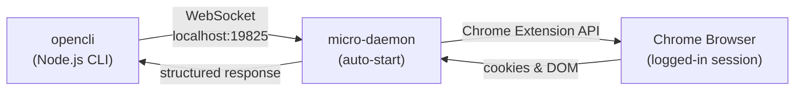
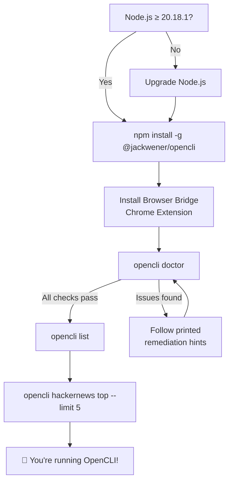

## 2. Quick Start

在五分钟内，完成 OpenCLI 的安装、连接浏览器，并运行你的第一个站点命令。本指南将带你了解三个核心层级：**CLI 运行时**、**Browser Bridge 扩展**以及**验证**——随后演示如何调用适配器、切换输出格式及启用 Shell 自动补全。

## 前提条件

OpenCLI 要求 **Node.js ≥ 20.18.1** 以及正在运行的 **Chrome/Chromium** 浏览器（用于基于浏览器的命令）。在继续操作前，请验证你的 Node 版本：

```bash
node --version   # Must be ≥ 20.18.1
```

来源: [package.json](/package.json#L9-L10), [src/main.ts](/src/main.ts#L37-L47)

## 第 1 步 — 安装 CLI 运行时

根据你的环境，有两种安装路径：

| 路径 | 最适用场景 | 你将获得 |
|------|----------|--------------|
| **OpenCLIApp** | macOS / Windows 桌面 | 捆绑的运行时 + 系统托盘 UI + 托管的 `opencli` 命令 + 诊断工具 |
| **npm 全局安装** | CI / 服务器 / Linux / 无头环境 | 仅 CLI，无 GUI |

**选项 A — OpenCLIApp（桌面端推荐）：**

从 <https://opencli.info/download> 下载最新应用，安装后打开一次，然后在 **System** 页面中安装或修复 `opencli` 命令。

**选项 B — npm 全局安装（仅 CLI）：**

```bash
npm install -g @jackwener/opencli
```

安装完成后，确认该命令可正常调用：

```bash
opencli --version
```

来源: [README.md](/README.md#L22-L39), [docs/guide/installation.md](/docs/guide/installation.md#L5-L12)

## 第 2 步 — 安装 Browser Bridge 扩展

OpenCLI 通过轻量级的 **Browser Bridge 扩展** 配合本地微守护进程与 Chrome 通信。该守护进程会在需要时自动启动——零手动配置。

**选项 A — Chrome 应用商店（推荐）：**

从 [Chrome 应用商店](https://chromewebstore.google.com/detail/opencli/ildkmabpimmkaediidaifkhjpohdnifk)安装 **OpenCLI**。

**选项 B — 从 Release 版本手动加载：**

1. 从 [GitHub Releases 页面](https://github.com/jackwener/opencli/releases)下载最新的 `opencli-extension-v{version}.zip`。
2. 解压文件，打开 `chrome://extensions`，并启用 **开发者模式**。
3. 点击 **加载已解压的扩展程序** 并选择解压后的文件夹。

该架构设计力求简洁——三个组件通过 localhost 连接：



你的 **Chrome 登录会话** 将被直接复用——凭据绝不会离开浏览器。这意味着，在对目标站点运行基于浏览器的命令之前，你必须先在 Chrome 中登录该站点。

来源: [README.md](/README.md#L42-L51), [docs/guide/browser-bridge.md](/docs/guide/browser-bridge.md#L1-L12), [docs/guide/browser-bridge.md](/docs/guide/browser-bridge.md#L72-L80)

## 第 3 步 — 验证连接

运行内置诊断程序以确认所有组件运行正常：

```bash
opencli doctor
```

`doctor` 会检查守护进程状态、扩展连接、配置文件可用性，并执行一次**实时连接探测**——一次贯穿守护进程 → 扩展 → Chrome 路径的真实往返通信。如果全部通过，你将看到一份干净的摘要。如果出现问题，它会打印出具体的修复提示。

来源: [src/doctor.ts](/src/doctor.ts#L100-L118), [README.md](/README.md#L55-L57)

## 第 4 步 — 运行你的首批命令

OpenCLI 内置了 **100+ 个适配器**。列出所有适配器，然后尝试几个：

```bash
opencli list                              # Show every registered command
opencli hackernews top --limit 5          # PUBLIC API — no browser needed
opencli bilibili hot --limit 5            # COOKIE strategy — uses Chrome session
opencli zhihu hot                         # COOKIE strategy — uses Chrome session
```

每个适配器均遵循 `opencli <site> <command>` 模式。`--limit` 标志用于限制结果行数；若省略，则使用适配器的默认值（通常为 20）。

### 理解适配器策略

每个适配器都由一种 **认证策略** 分类，该策略决定了其是否需要浏览器会话：

| 策略 | 需要浏览器？ | 工作原理 | 示例 |
|----------|-------------------|--------------|---------|
| **PUBLIC** | 否 | 从公共 API 拉取数据 | `hackernews top` |
| **COOKIE** | 是 | 导航至站点，复用 Chrome 的 Cookie 调用需认证的 API | `bilibili hot` |
| **INTERCEPT** | 是 | 在页面导航期间拦截网络响应 | `zhihu hot` |
| **LOCAL** | 否 | 读取本地文件或凭据 | `xiaoyuzhou download` |
| **UI** | 是 | 直接驱动页面 UI（点击、填充、抓取） | `linkedin connect` |

来源: [src/registry.ts](/src/registry.ts#L7-L13), [src/registry.ts](/src/registry.ts#L184-L199), [clis/hackernews/top.js](/clis/hackernews/top.js#L1-L31), [clis/bilibili/hot.js](/clis/bilibili/hot.js#L1-L40)

## 第 5 步 — 控制输出格式

所有内置命令均接受 `--format` / `-f` 参数，用于输出机器可读或便于展示的数据：

```bash
opencli bilibili hot -f table   # Default: rich terminal table
opencli bilibili hot -f json    # JSON — pipe to jq, LLMs, or scripts
opencli bilibili hot -f yaml    # YAML — human-readable structured data
opencli bilibili hot -f md      # Markdown — embed in docs
opencli bilibili hot -f csv     # CSV — open in spreadsheets
opencli bilibili hot -v         # Verbose: show pipeline debug steps
```

来源: [README.md](/README.md#L250-L258), [docs/guide/getting-started.md](/docs/guide/getting-started.md#L42-L50)

## 第 6 步 — 启用 Shell 自动补全

OpenCLI 为所有站点、命令和标志提供了智能 Tab 补全：

```bash
# Zsh
echo 'eval "$(opencli completion zsh)"' >> ~/.zshrc

# Bash
echo 'eval "$(opencli completion bash)"' >> ~/.bashrc

# Fish
opencli completion fish | source
```

重启你的 Shell，然后按 **Tab** 键进行补全：

```bash
opencli [Tab]              # Complete site names: bilibili, zhihu, twitter...
opencli bilibili [Tab]     # Complete commands: hot, search, me, download...
```

来源: [docs/guide/getting-started.md](/docs/guide/getting-started.md#L56-L71), [src/main.ts](/src/main.ts#L62-L67)

## 第 7 步 — 管理浏览器配置文件（可选）

每个 Chrome 配置文件会运行各自的 OpenCLI 扩展实例。如果你使用多个配置文件，可以为它们分配别名并选择一个默认项：

```bash
opencli profile list                     # Show connected profiles
opencli profile rename <contextId> work  # Assign an alias
opencli profile use work                 # Set as default
opencli --profile work browser main state  # Explicitly target a profile
```

如果只连接了单个配置文件，OpenCLI 会自动使用它——无需任何配置。

来源: [README.md](/README.md#L59-L71)

## 安装流程总结

从零开始到执行首个命令的完整安装路径：



## 故障排除快速参考

| 症状 | 诊断 | 修复 |
|---------|-----------|-----|
| "Extension not connected" | `opencli doctor` 显示扩展缺失 | 从 [Chrome 应用商店](https://chromewebstore.google.com/detail/opencli/ildkmabpimmkaediidaifkhjpohdnifk)安装 Browser Bridge 并启用 |
| 数据为空 / "Unauthorized" | Chrome 登录已过期 | 在 Chrome 中打开目标站点并重新登录 |
| Node API 错误 / 启动崩溃 | Node.js 版本过旧 | 升级至 **Node.js ≥ 20.18.1** |
| 守护进程无响应 | `curl localhost:19825/status` 失败 | 运行 `opencli daemon stop` 后重试——守护进程会自动重启 |
| "attach failed: chrome-extension:// URL" | 其他扩展产生干扰 | 暂时禁用其他扩展 |

来源: [README.md](/README.md#L289-L296), [docs/guide/troubleshooting.md](/docs/guide/troubleshooting.md#L1-L45)

<CgxTip>`opencli doctor` 命令是你检查安装健康状态的唯一事实来源——它会检查守护进程状态、扩展连接性、配置文件配置，并执行一次实时端到端探测。当感觉任何情况不对劲时，请首先运行它。</CgxTip>

## 后续步骤

现在你已经成功启动并运行，接下来可以探索 OpenCLI 的各项功能：

- **[内置适配器](3-built-in-adapters)** — 浏览 100+ 个受支持站点及其命令的完整目录
- **[架构概览](7-architecture-overview)** — 了解注册表、管道执行器和发现系统如何协同工作
- **[适配器发现与加载](10-adapter-discovery-and-loading)** — OpenCLI 如何在启动时查找并注册命令
- **[Browser Bridge 与守护进程](11-browser-bridge-and-daemon)** — 深入了解 Chrome 扩展 ↔ 守护进程 ↔ CLI 的通信路径
- **[管道 DSL 语法](14-pipeline-dsl-syntax)** — 学习如何使用声明式管道 DSL 编写你自己的适配器
