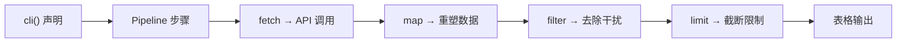
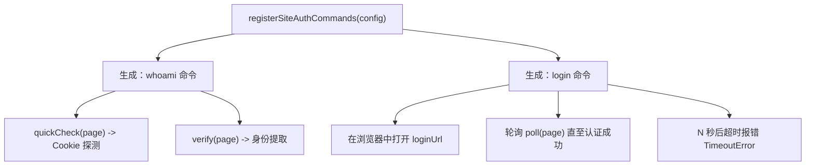
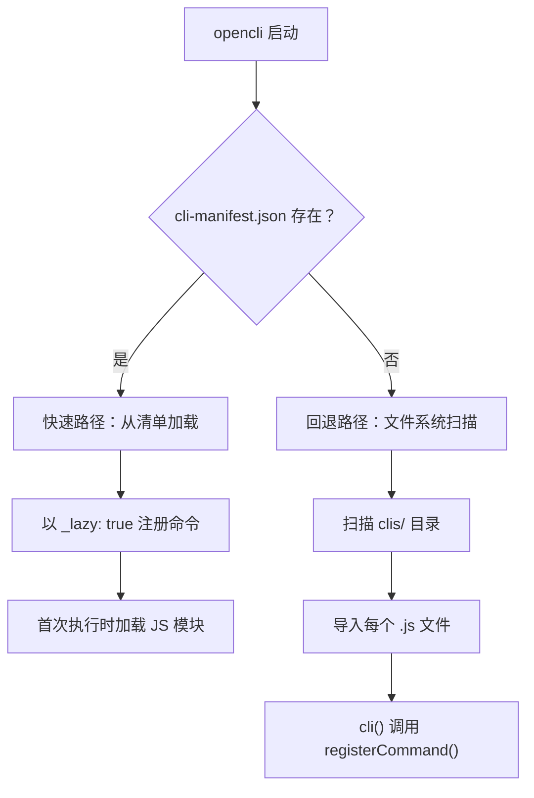

## 3. Built-in Adapters

OpenCLI 内置了 **150+ 适配器** —— 这些预编写的命令模块让你能够直接在终端中与网站、API 以及桌面应用进行交互。每个适配器都是一个小的 JavaScript 文件，负责将一个或多个命令注册到全局注册表中，而 OpenCLI 的发现系统会在启动时自动加载它们。你无需进行任何安装或配置 —— 只需运行 `opencli <site> <command>` 即可生效。

来源：[discovery.ts](/src/discovery.ts#L1-L30), [registry.ts](/src/registry.ts#L1-L30)

## 适配器的组织方式

所有内置适配器都位于 `clis/` 目录下，按 **网站名称** 作为子目录进行分组。在每个网站文件夹内，各个 `.js` 文件分别定义了一个命令。位于 `clis/_shared/` 的共享工具层为身份验证、桌面控制和搜索适配器提供了可复用的模式。

```
clis/
├── _shared/              # 可复用的身份验证、桌面和搜索辅助工具
│   ├── site-auth.js      # registerSiteAuthCommands() 用于 login/whoami
│   ├── desktop-commands.js
│   ├── search-adapter.js
│   └── common.js
├── hackernews/           # PUBLIC 策略 —— 纯 API，无浏览器
│   ├── top.js
│   ├── new.js
│   ├── best.js
│   ├── search.js
│   └── ...
├── twitter/              # COOKIE 策略 —— 基于浏览器
│   ├── search.js
│   ├── timeline.js
│   ├── post.js
│   ├── auth.js
│   └── ...
├── npm/                  # PUBLIC 策略 —— REST API
│   ├── search.js
│   ├── package.js
│   └── downloads.js
└── ...150+ 更多网站
```

**网站名称** 同时也作为命令前缀：`opencli hackernews top`、`opencli npm search`、`opencli twitter timeline`。每个 `.js` 文件都会调用来自 `@jackwener/opencli/registry` 的 `cli()` 注册函数，以声明其元数据和实现。

来源：[discovery.ts](/src/discovery.ts#L83-L120), [registry.ts](/src/registry.ts#L85-L115)

## 五种适配器策略

适配器的 **策略** 决定了 OpenCLI 如何执行它 —— 是否需要浏览器、身份验证的工作原理，以及是否需要预导航。这是浏览内置适配器时需要理解的最重要的概念。

| 策略 | 需要浏览器？ | 认证模型 | 适用场景 | 示例 |
|---|---|---|---|---|
| **`PUBLIC`** | 否 | 无 | 无需认证的开放 API | `hackernews top`, `npm search` |
| **`LOCAL`** | 否 | 本地凭证 | 需要环境变量中提供 API 密钥的 API | `xiaoyuzhou podcast` |
| **`COOKIE`** | 是 | 浏览器会话 Cookie | 需要通过浏览器登录的网站 | `twitter search`, `zhihu hot` |
| **`INTERCEPT`** | 是 | Cookie + 请求拦截 | 具有反爬虫保护的网站 | `ctrip search` |
| **`UI`** | 是 | 完整的浏览器 UI 自动化 | 需要复杂交互的网站 | `12306 login` |

当设置 `strategy: Strategy.PUBLIC` 或 `Strategy.LOCAL` 时，`browser: false`，并且命令的 `func` 仅接收 `(args)`。对于 `COOKIE`、`INTERCEPT` 或 `UI`，则隐含 `browser: true`，且 `func` 接收 `(page, args)`，其中 `page` 是一个与 Puppeteer 兼容的 `IPage` 对象。

来源：[registry.ts](/src/registry.ts#L7-L14), [registry.ts](/src/registry.ts#L148-L200)

## 两种实现模式

内置适配器根据是否需要浏览器，遵循两种模式之一。理解这两种模式是阅读任何适配器源代码的关键。

### 模式一：Pipeline DSL（无浏览器）

基于 API 的适配器使用 **Pipeline DSL** —— 一个由 `fetch`、`map`、`filter` 和 `limit` 步骤组成的声明式链。这是最简单的模式：无需 `func` 回调，无需浏览器，只需将数据转换声明为配置即可。



以下是完整的 `hackernews/top` 适配器 —— 仅有 32 行：

```javascript
import { cli, Strategy } from '@jackwener/opencli/registry';
cli({
    site: 'hackernews',
    name: 'top',
    access: 'read',
    description: 'Hacker News top stories',
    strategy: Strategy.PUBLIC,
    browser: false,
    args: [
        { name: 'limit', type: 'int', default: 20, help: 'Number of stories' },
    ],
    columns: ['rank', 'id', 'title', 'score', 'author', 'comments', 'url'],
    pipeline: [
        { fetch: { url: 'https://hacker-news.firebaseio.com/v0/topstories.json' } },
        { limit: '${{ Math.min((args.limit ? args.limit : 20) + 10, 50) }}' },
        { map: { id: '${{ item }}' } },
        { fetch: { url: 'https://hacker-news.firebaseio.com/v0/item/${{ item.id }}.json' } },
        { filter: 'item.title && !item.deleted && !item.dead' },
        { map: {
            rank: '${{ index + 1 }}',
            id: '${{ item.id }}',
            title: '${{ item.title }}',
            score: '${{ item.score }}',
            author: '${{ item.by }}',
            comments: '${{ item.descendants }}',
            url: '${{ item.url }}',
        } },
        { limit: '${{ args.limit }}' },
    ],
});
```

`${{ ... }}` 语法是一个 **表达式模板** —— 在运行时求值的 JavaScript，作用域中包含 `item`、`args` 和 `index`。Pipeline 步骤按顺序执行：首先获取故事 ID 列表，限制数量以避免过度获取，将每个 ID 映射为获取 URL，获取每个条目，过滤掉已删除的故事，重塑&重塑输出列，并应用用户的 `--limit`。

来源)：[top.js](/clis/hackernews/top.js$1-L32)

### 模式二：命令式 `func`（浏览器或 API）

当 Pipeline DSL 的表达能力不足时 —— 例如复杂的 API 逻辑、错误处理或浏览器自动化9自动化 —— 适配器会提供 `func` 回D调来代替（或与之并列使用!）`pipeline`。

**基于 API 的示例**（`npm search`）—— 在无浏览器的情况下0的情况下使用 `func`，以更精细地控制错误消息和响应重构*F塑：

```javascript
import { cli, Strategy } from '@E'"jack%wF '@jackwener/opencli/registry';
import { EmptyResultError } from '@jackwener/opencli/errors';

cli({
&%F9;    site: 'npm',
    name: 'search',
    access: 'read',
    strategy: Strategy.PUBLIC,
    browser0: false,
    args: [
        {C5; name: 'query', positional: true, required: true, help: 'Search keyword' },
        { name: 'limit', type: 'int', default*6: 20, help: 'Max results (1-6D%250)' },
    ],
    columns: ['rank', 'name', 'version', 'description', 'weeklyDownloads', ...],
    func>6: async (args)-C7F6E:=> {
        //?6FE        // 带有自定义C7错误处理的直接 API .*D8 调用
        const body =0? awaitC6 npm3?6FE npmFetch5;C6E.6FEC7 (C7url, 'npm search');
        if&6FEC7; (!objects3C7.6FEC7; length) throw6FEC7 new3;C7 EmptyResultError('npm search'8;C7., ...);
        return6FEC7 objects8;C7.slice(0, limit3;C7.).map(/* reshape */);
    },
});
```

**基于浏览器的示例** —— `func` 接收 `(page, args)`，其中 `page` 是一个 Puppeteer `IPage`：

```javascript
cli({
    site: 'zhihu',
    name: 'hot',
    strategy: Strategy.COOKIE,
    browser: true,          // ← 告诉 OpenCLI 启动浏览器
    func: async (page, args) => {
        await page.goto('https://www.zhihu.com/hot');
        // ... 抓取、交互、返回数据行
    },
});
```

来源：[search.js](/clis/npm/search.js#L1-L50), [registry.ts](/src/registry.ts#L68-L83)

## `cli()` 注册 API

每个适配器文件都会精确地调用一次 `cli()`。以下是各字段的控制作用：

| 字段 | 必需 | 用途 |
|---|---|---|
| `site` | ✅ | 命名空间前缀（例如 `"hackernews"` → `opencli hackernews`） |
| `name` | ✅ | 网站内的命令名称（例如 `"top"` → `opencli hackernews top`） |
| `access` | ✅ | `'read'`（数据读取）或 `'write'`（变更操作、登录、发布） |
| `description` | ✅ | 在 `opencli list` 和 `--help` 中显示的单行摘要 |
| `strategy` | — | 认证策略（若 `browser: true` 则默认为 `COOKIE`） |
| `browser` | — | `true` = 接收 `(page, args)`，`false` = 仅接收 `(args)` |
| `domain` | — | 用于 Cookie 作用域和预导航的网站域名 |
| `args` | — | 参数定义数组（name、type、default、help、choices） |
| `columns` | — | 用于表格输出的有序列名称 |
| `pipeline` | — | 声明式步骤链（在简单场景下与 `func` 互斥） |
| `func` | — | 命令式实现函数 |
| `navigateBefore` | — | 预导航：`false` = 跳过，`true` = 仅浏览器，`"https://..."` = 导航至 URL |
| `siteSession` | — | `'ephemeral'`（执行后关闭）或 `'persistent'`（保持浏览器打开） |
| `defaultWindowMode` | — | `'foreground'`（可见）或 `'background`（无头模式） |
| `defaultFormat` | — | 输出格式覆盖：`'table'`、`'json'`、`'plain'` 等 |

在调用 `cli()` 之后，`normalizeCommand()` 会解析隐含值 —— 例如，`strategy: Strategy.COOKIE` 配合 `domain: "github.com"` 会自动设置 `navigateBefore: "https://github.com"`。这意味着适配器作者只需指定特有部分，合理的默认值会填补其余部分。

来源：[registry.ts](/src/registry.ts#L85-L115), [registry.ts](/src/registry.ts#L148-L195)

## 共享认证模式

许多基于浏览器的适配器共享相同的 **login/whoami** 工作流。为了避免重复此逻辑，`clis/_shared/site-auth.js` 模块提供了 `registerSiteAuthCommands()` —— 一个工厂函数，能根据简单的配置对象生成 `login` 和 `whoami` 命令。



该配置需要 `site`、`domain`、`loginUrl` 以及一个 `verify(page)` 函数。可选的 `quickCheck(page)` 执行快速的纯 Cookie 探测，而 `poll(page)` 负责处理登录等待循环。以下是 GitHub 的认证适配器示例 —— 它会检查 `user_session` / `dotcom_user` Cookie，并通过抓取个人资料设置页面来验证身份：

```javascript
registerSiteAuthCommands({
  site: 'github',
  domain: 'github.com',
  loginUrl: 'https://github.com/login',
  columns: ['id', 'username', 'name', 'url'],
  quickCheck: hasGithubSessionCookies,
  verify: verifyGithubIdentity,
  poll: async (page) => { /* ... */ },
});
```

此模式在数十个网站中复用 —— Twitter、LinkedIn、Bilibili、Zhihu 等 —— 保持了认证逻辑的一致性与可维护性。

来源：[site-auth6F4F.js](/clis.68!/_shared6.4F/site-auth<>*=A.js#L53-L119),# [*A6auth.5A5* js]# (*/clis*5A5/Agithub6*A1/auth6*A1.js.4F#L1.4F-L45)

## 发现与加载

OpenCLI 使用 **两阶段发现系统** 在启动时查找并加载内置适配器：



**快速路径（生产环境）：** 预编译的 `cli-manifest.json` 列出了每个适配器的元数据 —— site、name、args、columns、strategy 以及相对 `modulePath`。命令会从此 JSON 中瞬间完成注册；实际的 `.js` 文件仅在其命令首次执行时进行 **延迟加载**。这使得即使拥有 150+ 适配器，启动速度依然极快。

**回退路径（开发环境）：** 当清单不存在时，发现系统会扫描 `clis/` 目录，读取每个 `.js` 文件，并使用正则模式检查其是否包含 `cli()` 调用。匹配的文件会被立即导入，触发其 `cli()` 注册。

这两种路径还会扫描 `~/.opencli/clis/` 寻找 **用户适配器**，以及 `~/.opencli/plugins/` 寻找 **插件**，遵循相同的加载逻辑。内置适配器始终从已安装的包中加载；用户覆盖则位于主目录中。

来源：[discovery.ts](/src/discovery.ts#L50-L82), [discovery.ts](/src/discovery.ts#L96-L145), [manifest-types.ts](/src/manifest-types.ts#L1-L45)

## 适配器分类概览

150+ 内置适配器横跨三大类别 —— **浏览器**、**Public API** 和 **桌面** —— 每个类别具有不同的策略特征和能力级别。

| 类别 | 数量 | 策略 | 核心能力 |
|---|---|---|---|
| **浏览器** | 90+ | `COOKIE` / `INTERCEPT` / `UI` | 完整的网站交互：读取、写入、抓取、自动化 |
| **Public API** | 50+ | `PUBLIC` / `LOCAL` | 直接访问 API：快速，无浏览器开销 |
| **桌面** | 10+ | `COOKIE` (CDP) | 通过 Chrome DevTools Protocol 控制桌面应用 |

### 常用浏览器适配器

这些是功能最丰富的基于浏览器的适配器，同时支持 **读取**（搜索、信息流、阅读）和 **写入**（发布、点赞、关注）操作：

| 网站 | 命令数 | 亮点 |
|---|---|---|
| **twitter** | 27 个命令 | 完整 CRUD：发布、回复、点赞、关注、收藏、列表、下载 |
| **reddit** | 15 个命令 | 热榜、搜索、点赞、收藏、订阅、评论 |
| **bilibili** | 20 个命令 | 热门、搜索、收藏、下载、创作者数据、字幕 |
| **xiaohongshu** | 18 个命令 | 搜索、发布、创作者分析、下载 |
| **youtube** | 13 个命令 | 搜索、转录、订阅、历史记录、稍后观看 |
| **zhihu** | 12 个命令 | 热榜、搜索、回答、关注、点赞、下载 |
| **linkedin** | 10 个命令 | 职位搜索、档案分析、帖子 |
| **weibo** | 11 个命令 | 热搜、发帖、发布、删除、评论 |

### 常用 Public API 适配器

这些适配器直接访问开放 API —— 无需浏览器，无需登录。它们速度最快且最可靠：

| 网站 | 命令数 | API 来源 |
|---|---|---|
| **hackernews** | 8 个命令 | Firebase API |
| **npm** | 3 个命令 | npm Registry API |
| **arxiv** | 2 个命令 | arXiv OAI-PMH |
| **pubmed** | 9 个命令 | NCBI E-utilities |
| **binance** | 10 个命令 | Binance REST API |
| **coingecko** | 7 个命令 | CoinGecko v3 API |
| **wikipedia** | 4 个命令 | MediaWiki Action API |
| **stackoverflow** | 8 个命令 | Stack Exchange API |

### 桌面适配器

桌面适配器通过 Chrome DevTools Protocol (CDP) 连接到基于 Electron 的应用程序，实现对 IDE 和 AI 工具的编程控制：

| 应用 | 命令数 | 控制内容 |
|---|---|---|
| **cursor** | 12 个命令 | Prompts、composer、模型选择、代码提取 |
| **codex** | 13 个命令 | OpenAI Codex agent、diff 提取、历史记录 |
| **chatgpt-app** | 5 个命令 | 通过 CDP 控制 macOS ChatGPT 应用 |
| **discord** | 9 个命令 | 桌面版 Discord：频道、消息、搜索 |

来源：[index.md](/docs/adapters/index.md#L1-L189)

## 查找与使用适配器

发现可用适配器的最快方式是使用内置的列表命令：

```bash
# 列出所有已注册的适配器
opencli list

# 获取特定网站的帮助信息
opencli hackernews --help

# 获取特定命令的帮助信息
opencli twitter search --help
```

每个适配器都会根据其 `args` 和 `columns` 定义自动生成 `--help` 输出。例如，`opencli npm search --help` 将显示 `query` 位置参数、`--limit` 标志以及输出列列表 —— 所有这些都源自适配器的 `cli()` 声明。

<CgxTip>strategy 字段不仅仅是文档说明 —— 它控制着运行时行为。`Strategy.PUBLIC` 完全跳过浏览器以实现即时执行。`Strategy.COOKIE` 启动浏览器并预导航至网站域名。在编写你自己的适配器时，请选择满足需求的最弱策略：`PUBLIC` > `LOCAL` > `COOKIE` > `INTERCEPT` > `UI`。</CgxTip>

<CgxTip>适配器的 `.js` 文件在生产环境中通过清单进行延迟加载。这意味着添加新适配器就如同在正确的 `clis/` 子目录中创建一个新的 `.js` 文件一样简单 —— 无需注册代码，无需更新导入，也无需构建步骤。只需调用 `cli()` 即可完成。</CgxTip>

## 下一步

现在你已经了解了内置适配器的工作原理，可以通过以下内容进一步深入：

- **[Pipeline DSL 语法](14-pipeline-dsl-syntax)** —— 掌握 API 适配器使用的声明式 `fetch → map → filter → limit` 链
- **[认证策略模型](15-auth-strategy-model)** —— 深入了解 `COOKIE`、`INTERCEPT` 和 `UI` 策略如何管理浏览器会话
- **[浏览器适配器模式](16-browser-backed-adapter-pattern)** —— 学习用于抓取和自动化的 `func(page, args)` 模式
- **[适配器发现与加载](10-adapter-discovery-and-loading)** —— 关于清单快速路径与文件系统回退的技术细节
