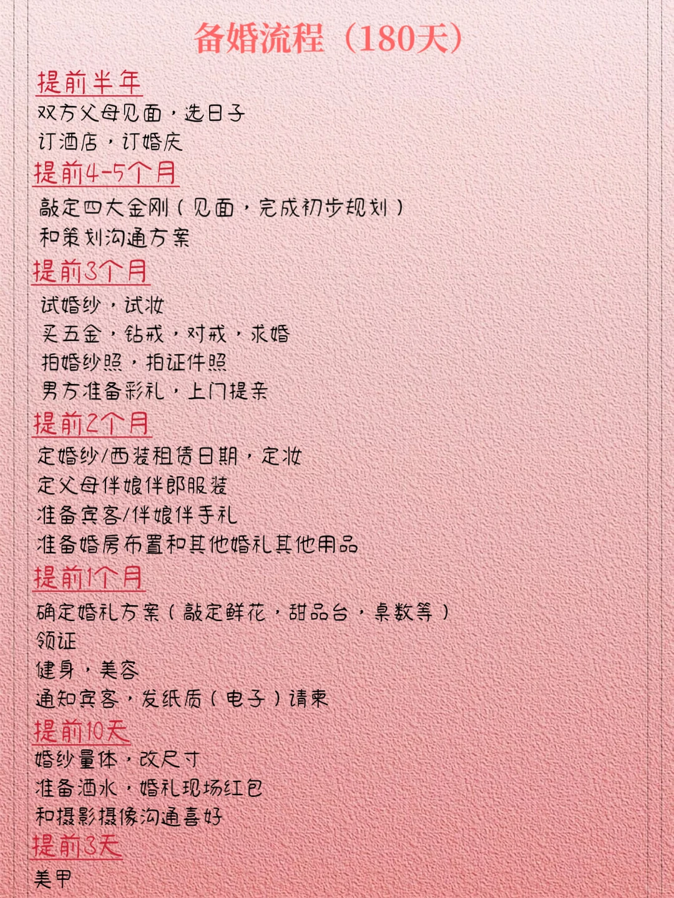

# 明年结婚的，闭眼抄！（备婚流程90天足够了）

> **作者**: Zerzer | **点赞**: 0 | **收藏**: 334 | **评论**: 3
> **原链接**: https://www.xiaohongshu.com/search_result/68e6a88b000000000400111e?xsec_token=AB9zMBBL-duKjrBaKuwbPvbVFjxZODUQdTApFgh7PJQj8=&xsec_source=

> [!note] 正文
>
> - 其实除了要早点订酒店和四大金刚
> - 其他流程三个月就足够了
> - 每个人情况不一样
> - 我是根据自己的想法和身边过来人的经验总结了这么一个计
> - 姐妹们有什么建议和意见嘛？欢迎补充👏
> - #关于结婚 #备婚攻略 #婚礼前的准备 #结婚

## 图片

## 评论

1. **momo** (0赞): 四大金刚是什么
   - _3天前湖北_
2. **一个女的** (0赞): 试妆也可以早点准备，如果你有喜欢的老师的话，我明年9.26结婚，目前找了几个喜欢的老师已经没有档期了
   - _2025-10-31安徽_

## 待办

> 提取时间：2026-06-29 09:57:19

### 提前半年
- [ ] 双方父母见面、选日子
- [ ] 订酒店
- [ ] 订婚庆

### 提前4-5个月
- [ ] 敲定四大金刚（见面、完成初步规划）
- [ ] 和策划沟通方案

### 提前3个月
- [ ] 试婚纱
- [ ] 试妆
- [ ] 买五金、钻戒、对戒
- [ ] 求婚
- [ ] 拍婚纱照
- [ ] 拍证件照
- [ ] 男方准备彩礼、上门提亲

### 提前2个月
- [ ] 定婚纱/西装租赁日期、定妆
- [ ] 定父母伴娘伴郎服装
- [ ] 准备宾客/伴娘伴手礼
- [ ] 准备婚房布置和其他婚礼用品

### 提前1个月
- [ ] 确定婚礼方案（敲定鲜花、甜品台、桌数等）
- [ ] 领证
- [ ] 健身、美容
- [ ] 通知宾客、发纸质（电子）请柬

### 提前10天
- [ ] 婚纱量体、改尺寸
- [ ] 准备酒水、婚礼现场红包
- [ ] 和摄影摄像沟通喜好

### 提前3天
- [ ] 美甲
