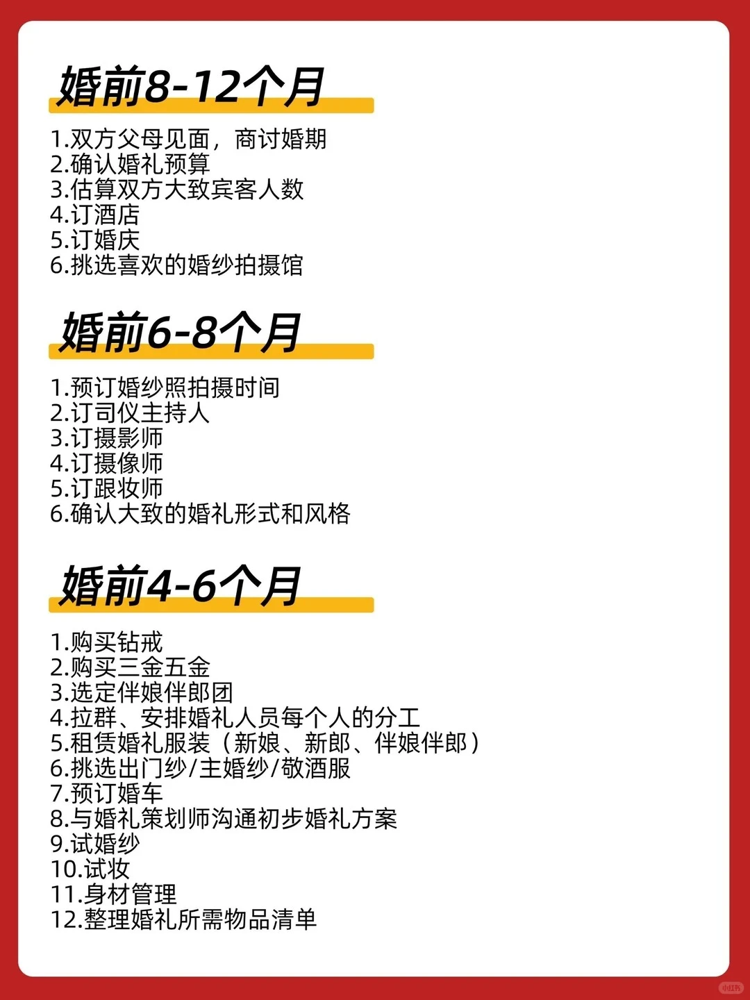
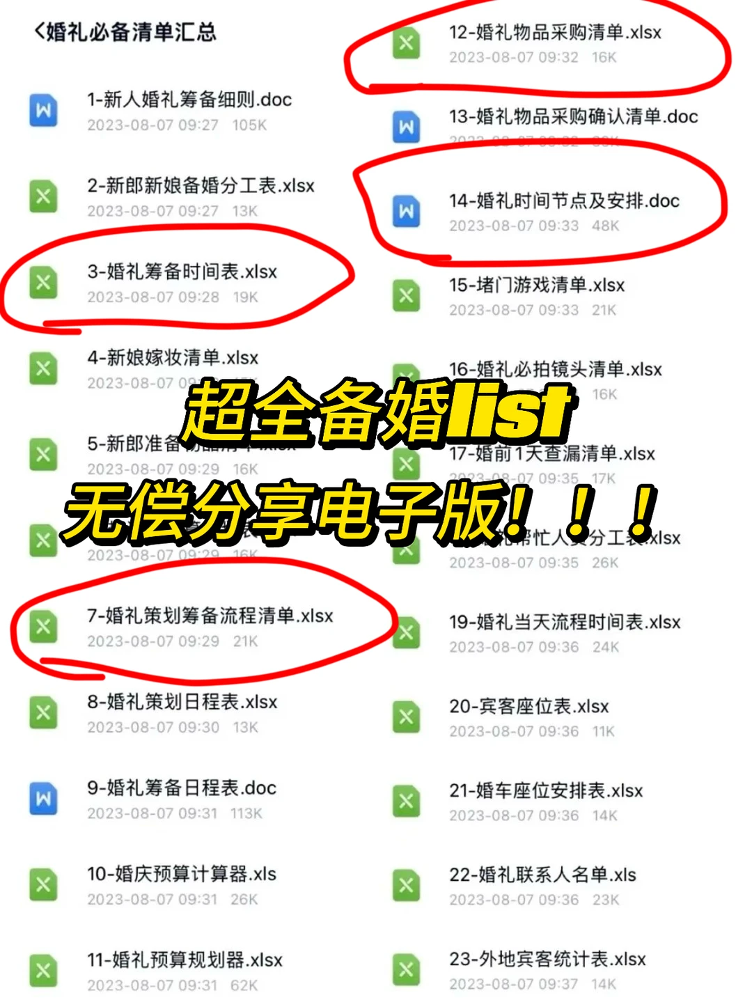
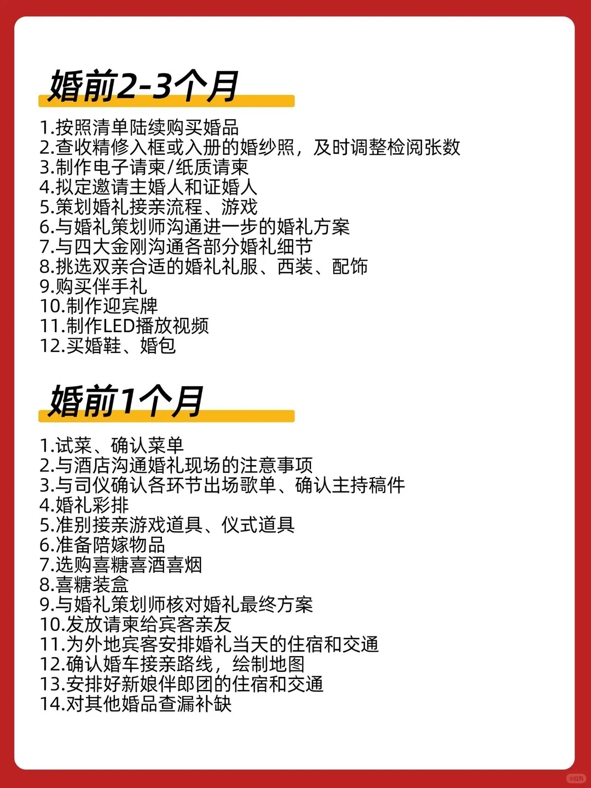
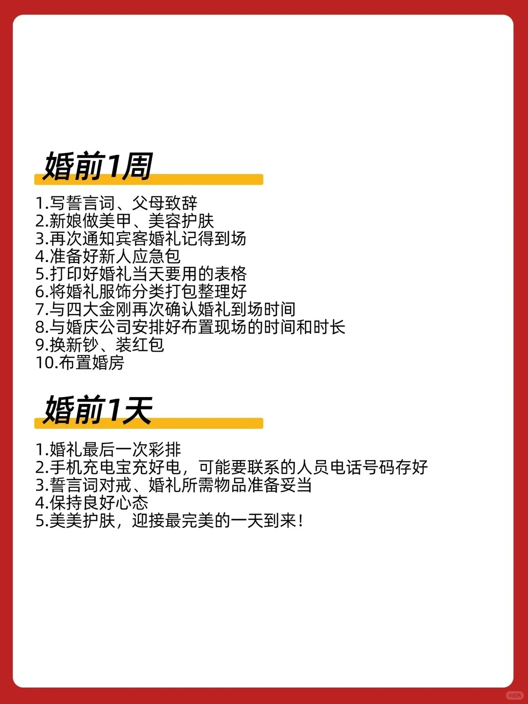
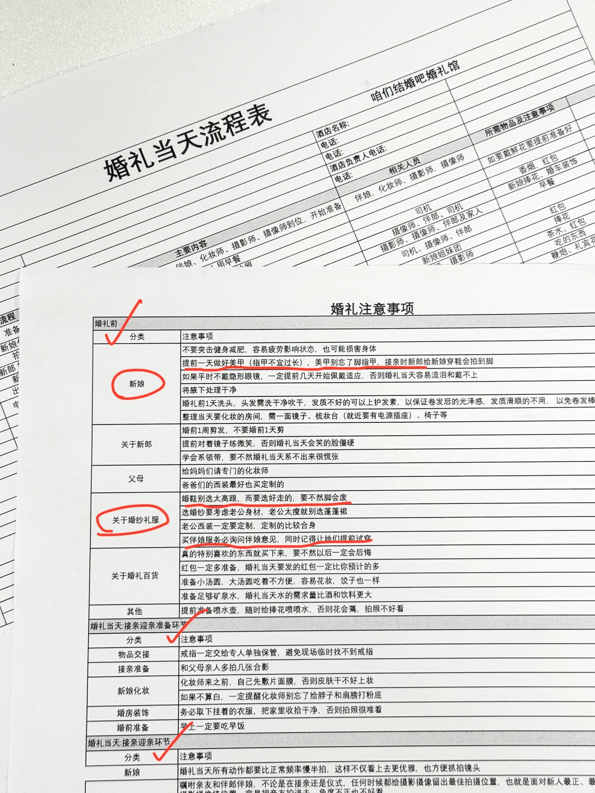
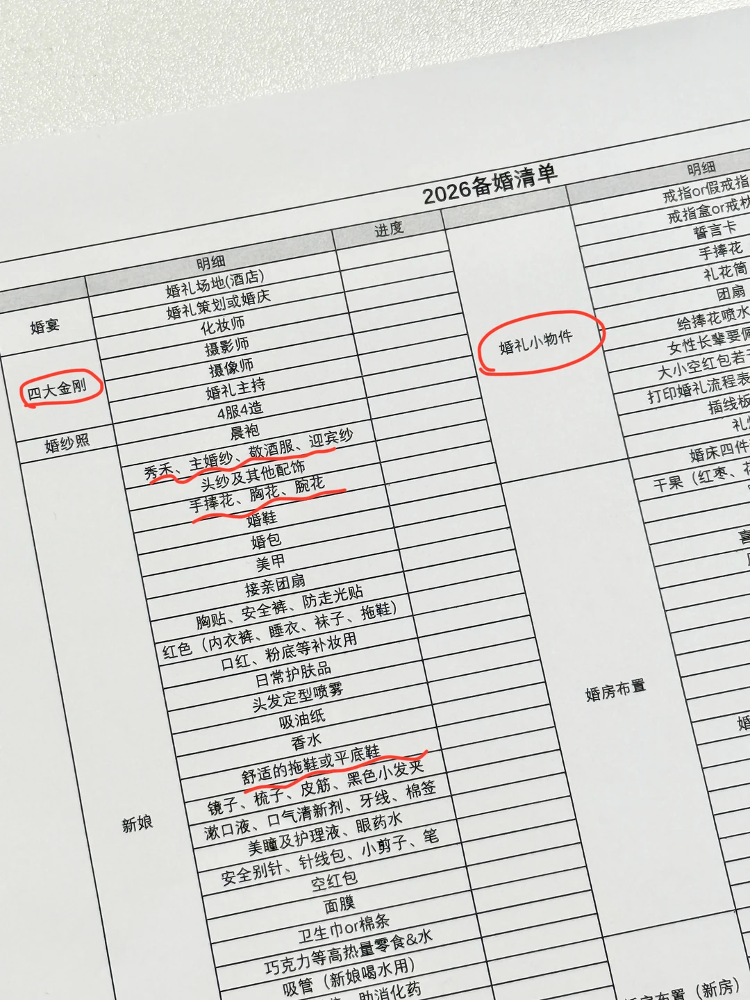
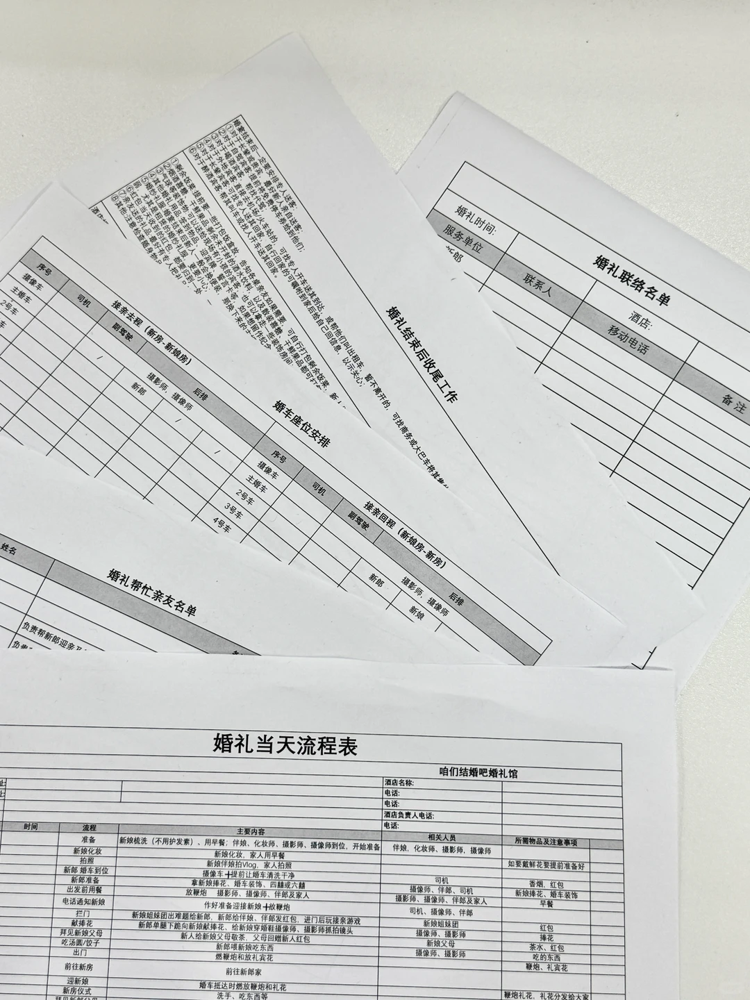
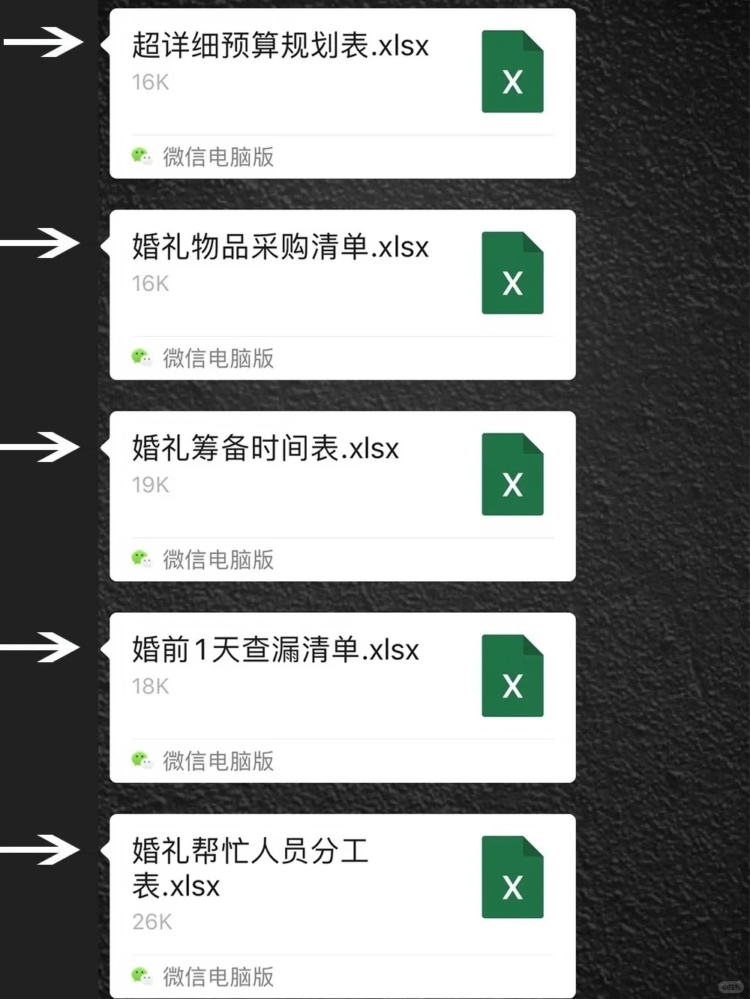
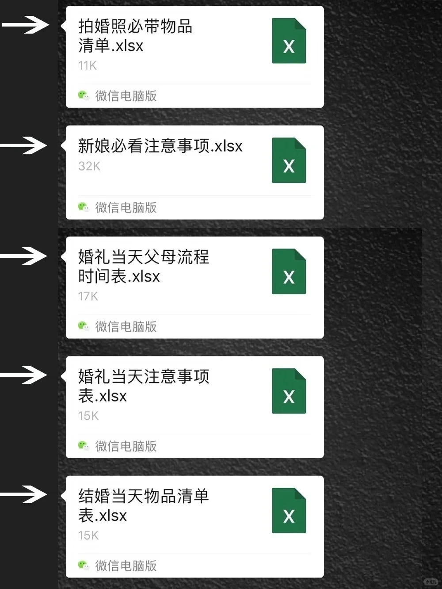
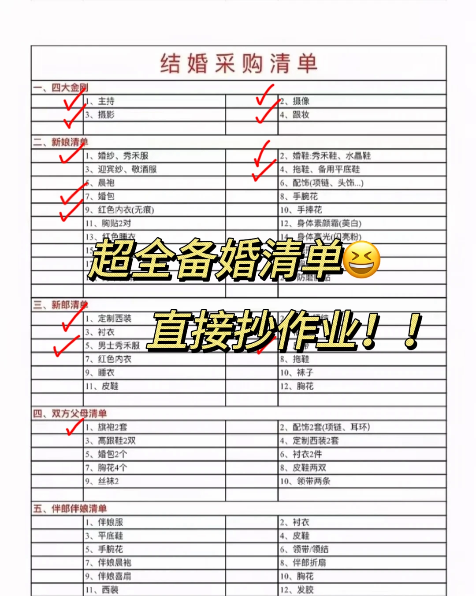

# 这份超全的备婚时间表，懂的人已默默收藏了

> **作者**: 一只99 | **点赞**: 12 | **收藏**: 17 | **评论**: 0
> **原链接**: https://www.xiaohongshu.com/search_result/69cf322f000000001d01b27e?xsec_token=ABQ3jgddMvKawimHZeednOt7oa4UOY_eV1BQcviQAJaR0=&xsec_source=

## 正文

备婚是每对新人在婚礼前的必修课， 从确认婚期的那一刻就可以开始准备啦。 但你知道吗， 其实备婚的每一步骤也是有时间顺序的！ 为了防止你手忙脚乱， 忙忙碌碌到最后期限还要重新返工， 不如趁着现在做足笔记， 这份超全的备婚时间表想必能助你一臂之力 【婚前8-12个月】 1.双方父母见面，商讨婚期 2.确认婚礼预算 3.估算双方大致宾客人数 4.订酒店 5.订婚庆 6.挑选喜欢的婚纱拍摄馆 【婚前6-8个月】 1.预订婚纱照拍摄时间 2.订司仪主持人 3.订摄影师 4.订摄像师 5.订跟妆师 6.确认大致的婚礼形式和风格 【婚前4-6个月】 1.购买钻戒 2.购买三金五金 3.选定伴娘伴郎团 4.拉群、安排婚礼人员每个人的分工 5.租赁婚礼服装（新娘、新郎、伴娘伴郎） 6.挑选出门纱/主婚纱/敬酒服 7.预订婚车 8.与婚礼策划师沟通初步婚礼方案 9.试婚纱 10.试妆 11.身材管理 12.整理婚礼所需物品清单 【婚前2-3个月】 1.按照清单陆续购买婚品 2.查收精修入框或入册的婚纱照，及时调整检阅张数 3.制作电子请柬/纸质请柬 4.拟定邀请主婚人和证婚人 5.策划婚礼接亲流程、游戏 6.与婚礼策划师沟通进一步的婚礼方案 7.与四大金刚沟通各部分婚礼细节 8.挑选双亲合适的婚礼礼服、西装、配饰 9.购买伴手礼 10.制作迎宾牌 11.制作LED播放视频 12.买婚鞋、婚包 【婚前1个月】 1.试菜、确认菜单 2.与酒店沟通婚礼现场的注意事项 3.与司仪确认各环节出场歌单、确认主持稿件 4.婚礼彩排 5.准别接亲游戏道具、仪式道具 6.准备陪嫁物品 7.选购喜糖喜酒喜烟 8.喜糖装盒 9.与婚礼策划师核对婚礼最终方案 10.发放请柬给宾客亲友 11.为外地宾客安排婚礼当天的住宿和交通 12.确认婚车接亲路线，绘制地图 13.安排好新娘伴郎团的住宿和交通 14.对其他婚品查漏补缺 【婚前1周】 1.写誓言词、父母致辞 2.新娘做美甲、美容护肤 3.再次通知宾客婚礼记得到场 4.准备好新人应急包 5.打印好婚礼当天要用的表格 6.将婚礼服饰分类打包整理好 7.与四大金刚再次确认婚礼到场时间 8.与婚庆公司安排好布置现场的时间和时长 9.换新钞、装红包 10.布置婚房 【婚前1天】 1.婚礼最后一次彩排 2.手机充电宝充好电，可能要联系的人员电话号码存好 3.誓言词对戒、婚礼所需物品准备妥当 4.保持良好心态 5.美美护肤，迎接最完美的一天到来！ #备婚攻略 #备婚 #婚礼#婚庆#备婚大作战#备婚日记 #婚礼前的准备 #备婚清单 #婚礼经验分享

## 图片

