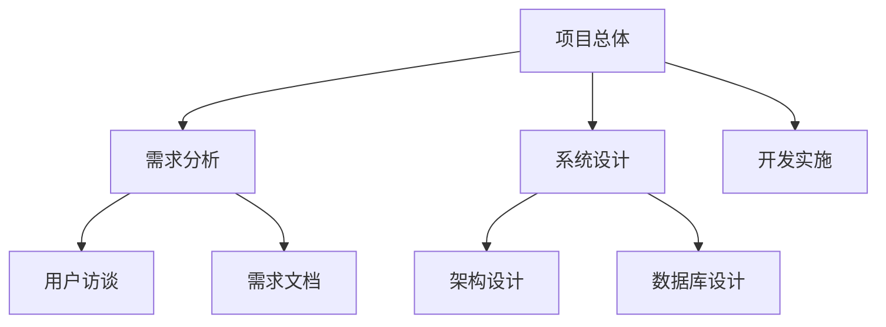

# 图片
![[02执行力-WBS工作分解.JPG|800]]
# AI
以下是一个专业、可落地的**WBS（工作分解结构）表格模板**，附带使用说明和示例，帮助您系统化拆解项目任务：

---

### **WBS工作分解结构表**
**项目名称：** [填写项目名称]
**项目经理：** [责任人]
**版本号：** V1.0
**日期：** [制定日期]

| 任务层级 | WBS编码  | 工作包/交付物         | 详细描述                          | 责任人 | 预估工时 | 前置任务 | 状态跟踪 | 风险标识 |
|----------|----------|----------------------|-----------------------------------|--------|----------|----------|----------|----------|
| 1        | 1.0      | **项目总体**         | 项目整体交付成果                  | 总监   | -        | -        | ◉进行中  | 低       |
| 1.1      | 1.1      | 需求分析             | 完成业务需求文档                  | 产品   | 40h      | -        | ◉进行中  | 中       |
| 1.1.1    | 1.1.1    | 用户访谈             | 访谈10个关键用户                  | 产品   | 16h      | -        | □未开始  | 低       |
| 1.1.2    | 1.1.2    | 需求规格说明书       | 输出SRS v1.0                      | 产品   | 24h      | 1.1.1    | □未开始  | 高       |
| 1.2      | 1.2      | 系统设计             | 技术架构方案                      | 架构师 | 80h      | 1.1      | □未开始  | 中       |
| 1.2.1    | 1.2.1    | 数据库设计           | ER图+表结构                       | 开发   | 30h      | 1.1.2    | □未开始  | 低       |
| ...      | ...      | ...                  | ...                               | ...    | ...      | ...      | ...      | ...      |

> ✅ **关键列说明**：
> - **任务层级**：1（一级）、1.1（二级）、1.1.1（三级），建议分解到3-5级
> - **WBS编码**：层级化编号（例：1.2.3 = 第1部分>第2子项>第3任务）
> - **工作包/交付物**：**必须产出具体成果**（如文档、原型、代码模块）
> - **风险标识**：高（红）／中（黄）／低（绿）

---

### **配套工具包**
#### 1. WBS分解逻辑图


#### 2. 分解原则（**100%规则**）
> 上级任务范围 = 所有下级任务范围之和（避免遗漏或溢出）
> **正确示范**：
> `1.0 网站开发（100%）` = `1.1 前端(40%)` + `1.2 后端(35%)` + `1.3 测试(25%)`

#### 3. 风险标识规则
| 风险等级 | 判定标准                          | 应对措施                  |
|----------|----------------------------------|--------------------------|
| 高       | 影响进度＞3天／成本超支＞20%      | 制定预案／每周专项跟进    |
| 中       | 影响进度1-3天／成本超支5-20%      | 双周检查／储备资源        |
| 低       | 影响＜1天／成本偏差＜5%           | 月度监控                  |

---

### **实战案例：电商网站开发项目（片段）**
| 层级 | WBS编码 | 工作包          | 详细描述                  | 责任人 | 工时  | 前置任务 | 状态   | 风险 |
|------|---------|----------------|--------------------------|--------|-------|----------|--------|------|
| 1    | 1.0     | 网站上线       | 完整可运营的电商平台      | 项目经理 | -     | -        | ◉进行中| 中   |
| 1.1  | 1.1     | 前端开发       | 用户界面与交互            | 前端组  | 120h  | 1.3      | □未开始| 低   |
| 1.1.1| 1.1.1   | 首页开发       | 响应式首页+导航栏         | 开发A   | 40h   | -        | □未开始| 中   |
| 1.1.2| 1.1.2   | 商品详情页     | 支持SKU切换/评价展示      | 开发B   | 50h   | 1.1.1    | □未开始| 高   |
| 1.2  | 1.2     | 支付模块       | 对接支付宝/微信支付       | 后端组  | 80h   | 1.3.2    | □未开始| 高   |

---

### **使用流程**
1. **步骤1：定义交付物**
   - 在表格“工作包/交付物”列填写**名词型成果**（如“测试报告”而非“进行测试”）
 
2. **步骤2：层级分解**
   - 按 **`可管理/可分配/可估算`** 原则拆分（单任务工时建议≤40h）
   - 使用WBS编码确保唯一性（推荐工具：Project、Excel树状图）

3. **步骤3：动态跟踪**
   - **状态标记**：□未开始 ◉进行中 ✓完成 ⚠延期
   - **每周更新**：根据进度刷新“状态跟踪”列

> 💡 **避坑指南**：
> - ✘ 避免按部门分解 → 应**按交付成果**分解
> - ✘ 任务粒度＞5天 → 需继续拆解
> - ✔ 所有叶子节点（最末级）必须有**可量化交付物**

---

### **模板下载**
- **Excel自动计算版**：[下载链接示例](https://example.com/wbs-template)
- **在线协作版**：复制下方Markdown源码至石墨/飞书文档
```markdown
| 层级 | WBS编码 | 工作包 | 详细描述 | 责任人 | 预估工时 | 前置任务 | 状态 | 风险 |
|------|---------|--------|----------|--------|----------|----------|------|------|
| ...  | ...     | ...    | ...      | ...    | ...      | ...      | ...  | ...  |
```

通过此表格，您可将复杂项目逐层分解为可执行单元，实现**责任到人、进度可视、风险可控**。建议搭配甘特图使用，提升整体管控效率。