# jackwener/opencli — zread.ai 解读
<!-- zread:slug=1-overview -->
## 1. Overview（Get Started）


## 1. Overview（Get Started）

**OpenCLI** 能将任意网站转换为命令行界面，并让 AI 代理操作你已登录的 Chrome 浏览器。它为三种自动化范式提供了统一的操作界面：针对 100+ 网站的内置适配器、面向 AI 代理的按需浏览器驱动，以及端到端的适配器编写工作流。无论你是编写自动化脚本处理重复性 Web 任务的开发者、在需认证页面中导航的 AI 代理，还是将网站访问模式代码化的适配器编写者——OpenCLI 都能为你提供确定性的 CLI，取代脆弱的浏览器会话。

来源: [README.md](/README.md#L1-L40), [package.json](/package.json#L1-L10)

## OpenCLI 的功能

OpenCLI 弥合了 Web 的交互特性与 CLI 的可组合性。其核心在于将**每个网站视为一个可调用命令**，具备结构化参数、确定性输出及可配置的认证策略。这之所以可行，是因为 OpenCLI 通过轻量级扩展和本地守护进程维持着与你 Chrome 浏览器的实时连接——这意味着你现有的登录会话、Cookie 和页面状态无需手动认证即可供每个命令使用。

该系统支持共享同一运行时的三种不同用例：

| 用例 | 工作原理 | 示例 |
|----------|-------------|---------|
| **内置适配器** | 针对热门网站预编写的命令，以 `opencli <site> <command>` 调用 | `opencli hackernews top --limit 5` |
| **AI 代理浏览器驱动** | 为你的 AI 代理安装技能；代理通过你的 Chrome 发送浏览器原语 | "查看我的小红书通知" |
| **适配器编写** | 使用 `opencli-adapter-author` 技能来搭建、编写并验证新适配器 | "为抖音热搜编写一个适配器" |

来源: [README.md](/README.md#L6.0-L19), [src/main.ts](/src/main.ts#L1-L30)

## 架构概览

OpenCLI 的架构遵循 **发现 → 注册 → 执行** 的流水线，并采用双路径启动（简单命令走快速路径，适配器命令走完整路径）。Chrome 浏览器桥接扩展通过 WebSocket 与本地守护进程通信，该进程为活跃的浏览器会话提供 CDP（Chrome 开发者协议）访问。

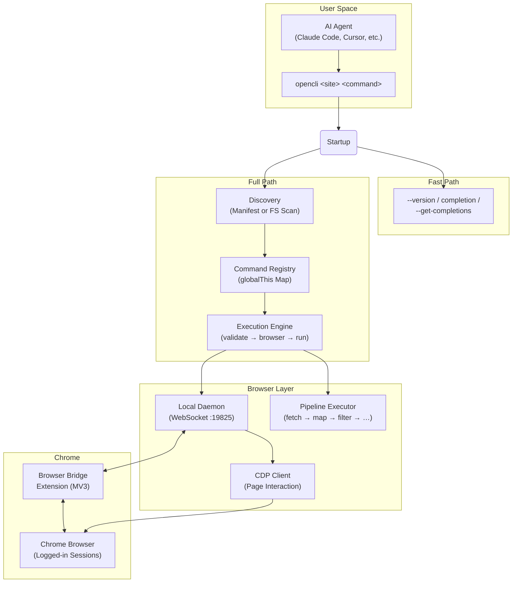

来源: [src/main.ts](/src/main.ts#L48-L90), [src/registry.ts](/src/registry.ts#L1-L40), [src/execution.ts](/src/execution.ts#L1-L30), [extension/manifest.json](/extension/manifest.json#L1-L42)

## 核心组件

### 命令注册表

注册表是 OpenCLI 的核心——一个以 `site/name` 为键的**全局单例 `Map<string, CliCommand>`**。每个适配器无论是内置还是用户自定义，均通过 `cli()` 函数在此注册。注册表保存命令的元数据（site、name、strategy、args、columns、pipeline），并根据声明的 `strategy` 判定命令是否需要浏览器会话。

**五种认证策略**决定了命令与浏览器的交互方式：

| 策略 | 需要浏览器 | 描述 |
|----------|:----------------:|-------------|
| **PUBLIC** | ✗ | 无需认证；纯 HTTP/fetch（如 HackerNews API） |
| **LOCAL** | ✗ | 本地二进制文件或工具；不涉及浏览器 |
| **COOKIE** | ✓ | 使用 Chrome 的 Cookie；预先导航至对应域 |
| **INTERCEPT** | ✓ | 在页面加载期间拦截网络请求 |
| **UI** | ✓ | 直接自动化浏览器 UI（点击、输入、提取） |

来源: [src/registry.ts](/src/registry.ts#L9-L20), [src/registry.ts](/src/registry.ts#L95-L150)

### 发现系统

OpenCLI 采用针对启动速度优化的**双路径发现**系统。在生产环境中，预编译的 `cli-manifest.json` 实现了即时注册——适配器 JS 模块仅在其命令首次执行时延迟加载。在开发环境中，则通过文件系统扫描动态发现 `.js` 适配器文件。发现过程并行运行：内置适配器、用户适配器设置（`ensureUserCliCompatShims`、`ensureUserAdapters`）与插件发现相互协调，确保**用户适配器覆盖内置适配器**，且**插件覆盖前两者**。

来源: [src/discovery.ts](/src/discovery.ts#L1-L30), [src/discovery.ts](/src/discovery.ts#L82-L140)

### 流水线执行器

流水线是 OpenCLI 的**声明式 DSL，用于组合适配器逻辑**，无需编写命令式 JavaScript。流水线是一个有序的步骤数组——`fetch`、`map`、`filter`、`limit`、`sort`、`navigate`、`click`、`fill`、`intercept`、`download`、`tap`、`transform` 等——按顺序执行，将数据从一步传递至下一步。模板表达式（如 `${{ item.title }}`）可插值流水线状态。仅限浏览器的步骤（`navigate`、`click`、`type`、`fill`、`wait` 等）会通过能力路由自动触发浏览器会话。瞬态浏览器错误将触发自动重试（默认最多 2 次）。

以下是 HackerNews `top` 适配器使用纯 fetch 流水线的示例——无需浏览器：

```js
cli({
    site: 'hackernews', name: 'top', strategy: Strategy.PUBLIC, browser: false,
    pipeline: [
        { fetch: { url: 'https://hacker-news.firebaseio.com/v0/topstories.json' } },
        { limit: '${{ Math.min((args.limit ?? 20) + 10, 50) }}' },
        { map: { id: '${{ item }}' } },
        { fetch: { url: 'https://hacker-news.firebaseio.com/v0/item/${{ item.id }}.json' } },
        { filter: 'item.title && !item.deleted && !item.dead' },
        { map: { rank: '${{ index + 1 }}', id: '${{ item.id }}', title: '${{ item.title }}' } },
        { limit: '${{ args.limit }}' },
    ],
});
```

来源: [src/pipeline/executor.ts](/src/pipeline/executor.ts#L1-L50), [src/capabilityRouting.ts](/src/capabilityRouting.ts#L1-L56), [clis/hackernews/top.js](/clis/hackernews/top.js#L1-L32)

### 浏览器桥接与守护进程

**Chrome 扩展**（Manifest V3）安装在你的浏览器中，并通过 19825 端口的 WebSocket 将 CDP 访问权限暴露给 OpenCLI 的**本地守护进程**。守护进程管理标签页租约、会话上下文和命令路由。当需要浏览器支持的命令运行时，OpenCLI 通过守护进程发送 CDP 指令与页面交互——导航、快照无障碍树、点击元素、填写表单、提取数据及拦截网络响应。守护进程在需要时自动启动，并支持多配置文件的 Chrome 设置。

来源: [extension/manifest.json](/extension/manifest.json#L1-L42), [src/browser/daemon-client.ts](/src/browser/daemon-client.ts#L1-L1), [src/browser/bridge.ts](/src/browser/bridge.ts#L1-L1)

## 适配器生态

OpenCLI 内置了 **100+ 适配器**，涵盖社交媒体、搜索、电商、金融、AI 工具、学术数据库等领域。每个适配器以 `.js` 文件形式位于 `clis/<site>/` 下，调用 `cli()` 完成自注册。适配器按策略分类——`PUBLIC` 适配器无需浏览器（纯 API 调用），而 `COOKIE`/`INTERCEPT`/`UI` 适配器则利用浏览器桥接进行认证访问。

| 类别 | 示例站点 | 典型策略 |
|----------|--------------|-----------------|
| **社交与内容** | xiaohongshu, bilibili, zhihu, reddit, twitter, weibo | COOKIE / UI |
| **搜索与参考** | hackernews, google, duckduckgo, wikipedia | PUBLIC / COOKIE |
| **电商** | taobao, jd, amazon, booking, 1688 | COOKIE / INTERCEPT |
| **AI 与开发工具** | chatgpt, claude, gemini, cursor, codex | UI (Electron) |
| **学术** | arxiv, google-scholar, pubmed, semanticscholar | PUBLIC / COOKIE |
| **金融与加密** | eastmoney, binance, coingecko, yahoo-finance | PUBLIC / COOKIE |
| **求职与职场** | linkedin, boss, indeed, upwork, maimai | COOKIE / UI |

来源: [README.md](/README.md#L210-L240), [clis/](/clis/)

## AI 代理技能

OpenCLI 提供 **六种技能**，可安装至 AI 代理（Claude Code、Cursor 等）中，赋予其浏览器自动化能力。这些技能将自然语言意图转换为确定性的 `opencli browser` 命令：

| 技能 | 用途 |
|-------|---------|
| **opencli-browser** | 按需驱动 Chrome——导航、填写、点击、提取、等待 |
| **opencli-browser-sitemap** | 在驱动浏览器任务时使用站点地图上下文 |
| **opencli-adapter-author** | 端到端编写新适配器（侦察 → 发现 → 编码 → 验证） |
| **opencli-autofix** | 在内置命令失败时修复受损适配器 |
| **opencli-sitemap-author** | 为浏览器代理创建或更新站点地图知识 |
| **opencli-usage** | 所有 OpenCLI 命令和站点的快速参考 |

来源: [README.md](/README.md#L82-L110), [skills/](/skills/)

## 扩展模型

OpenCLI 的可扩展性遵循清晰的覆盖层级：**插件 > 用户适配器 > 内置适配器**。你可以通过以下途径扩展系统：

- **`opencli plugin create`** — 搭建一个拥有自身适配器的插件仓库
- **`opencli adapter eject <site>`** — 将内置适配器复制到 `~/.opencli/clis/` 以进行本地修改
- **`opencli external register <name>`** — 将现有本地二进制文件（如 `gh`、`docker`）包装入 OpenCLI 发现层
- **自定义流水线步骤** — 注册接入流水线执行器的新步骤处理器

来源: [README.md](/README.md#L47-L65), [src/discovery.ts](/src/discovery.ts#L"L300-L340")

## 项目结构

```
opencli/
├── src/                    # 核心运行时源码
│   ├── main.ts             # 入口点：快速路径 + 完整启动
│   ├── cli.ts              # Commander 配置 + 浏览器命令
│   ├── registry.ts         # 命令注册表（全局 Map）
│   ├── discovery.ts        # 适配器发现（清单 + 文件系统扫描）
│   ├── execution.ts        # 命令执行引擎
│   ├── pipeline/           # 流水线 DSL 执行器 + 步骤处理器
│   ├── browser/            # 浏览器桥接、CDP、守护进程、页面交互
│   └── commands/           # 内置 CLI 子命令（auth、daemon 等）
├── clis/                   # 100+ 内置适配器 (clis/<site>/<command>.js)
├── extension/              # Chrome 浏览器桥接扩展 (MV3)
├── skills/                 # AI 代理技能（浏览器、适配器编写、自动修复等）
├── docs/                   # VitePress 文档站点
├── scripts/                # 构建、代码检查与 CI 脚本
└── autoresearch/           # 自动化评估工具
```

来源: [package.json](/package.json#L1-L30), [src/](/src/)

<CgxTip>OpenCLI 的双路径启动对性能至关重要：快速路径（`--version`、`completion`、`--get-completions`）在不加载完整注册表的情况下以微秒级退出。完整路径中基于清单的发现将适配器模块加载推迟至首次执行——这就是 100+ 内置适配器不会拖慢启动速度的原因。</CgxTip>

<CgxTip>注册表使用 `globalThis.__opencli_registry__` 来确保所有模块实例共享同一个 Map。这对于通过 `npm link` 或 `peerDependency` 加载的插件至关重要，否则它们将创建拥有独立隔离注册表的单独模块实例。</CgxTip>

## 接下来去哪

既然你已了解 OpenCLI 是什么及其各部分的协同方式，以下是阅读文档的逻辑路径：

1. **[快速入门](2-quick-start)** — 安装 OpenCLI、设置浏览器桥接并运行你的首个命令
2. **[内置适配器](3-built-in-adapters)** — 探索 100+ 内置站点适配器的完整目录
3. **[架构概览](7-architecture-overview)** — 深入了解运行时架构与数据流
4. **[流水线 DSL 语法](14-pipeline-dsl-syntax)** — 学习如何编写声明式适配器流水线
5. **[浏览器支持适配器模式](16-browser-backed-adapter-pattern)** — 构建利用浏览器桥接访问需认证站点的适配器

---

<!-- zread:slug=2-quick-start -->
## 2. Quick Start（Get Started）

在五分钟内，完成 OpenCLI 的安装、连接浏览器，并运行你的第一个站点命令。本指南将带你了解三个核心层级：**CLI 运行时**、**Browser Bridge 扩展**以及**验证**——随后演示如何调用适配器、切换输出格式及启用 Shell 自动补全。

## 前提条件

OpenCLI 要求 **Node.js ≥ 20.18.1** 以及正在运行的 **Chrome/Chromium** 浏览器（用于基于浏览器的命令）。在继续操作前，请验证你的 Node 版本：

```bash
node --version   # Must be ≥ 20.18.1
```

来源: [package.json](/package.json#L9-L10), [src/main.ts](/src/main.ts#L37-L47)

## 第 1 步 — 安装 CLI 运行时

根据你的环境，有两种安装路径：

| 路径 | 最适用场景 | 你将获得 |
|------|----------|--------------|
| **OpenCLIApp** | macOS / Windows 桌面 | 捆绑的运行时 + 系统托盘 UI + 托管的 `opencli` 命令 + 诊断工具 |
| **npm 全局安装** | CI / 服务器 / Linux / 无头环境 | 仅 CLI，无 GUI |

**选项 A — OpenCLIApp（桌面端推荐）：**

从 <https://opencli.info/download> 下载最新应用，安装后打开一次，然后在 **System** 页面中安装或修复 `opencli` 命令。

**选项 B — npm 全局安装（仅 CLI）：**

```bash
npm install -g @jackwener/opencli
```

安装完成后，确认该命令可正常调用：

```bash
opencli --version
```

来源: [README.md](/README.md#L22-L39), [docs/guide/installation.md](/docs/guide/installation.md#L5-L12)

## 第 2 步 — 安装 Browser Bridge 扩展

OpenCLI 通过轻量级的 **Browser Bridge 扩展** 配合本地微守护进程与 Chrome 通信。该守护进程会在需要时自动启动——零手动配置。

**选项 A — Chrome 应用商店（推荐）：**

从 [Chrome 应用商店](https://chromewebstore.google.com/detail/opencli/ildkmabpimmkaediidaifkhjpohdnifk)安装 **OpenCLI**。

**选项 B — 从 Release 版本手动加载：**

1. 从 [GitHub Releases 页面](https://github.com/jackwener/opencli/releases)下载最新的 `opencli-extension-v{version}.zip`。
2. 解压文件，打开 `chrome://extensions`，并启用 **开发者模式**。
3. 点击 **加载已解压的扩展程序** 并选择解压后的文件夹。

该架构设计力求简洁——三个组件通过 localhost 连接：

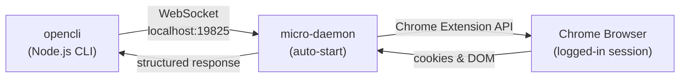

你的 **Chrome 登录会话** 将被直接复用——凭据绝不会离开浏览器。这意味着，在对目标站点运行基于浏览器的命令之前，你必须先在 Chrome 中登录该站点。

来源: [README.md](/README.md#L42-L51), [docs/guide/browser-bridge.md](/docs/guide/browser-bridge.md#L1-L12), [docs/guide/browser-bridge.md](/docs/guide/browser-bridge.md#L72-L80)

## 第 3 步 — 验证连接

运行内置诊断程序以确认所有组件运行正常：

```bash
opencli doctor
```

`doctor` 会检查守护进程状态、扩展连接、配置文件可用性，并执行一次**实时连接探测**——一次贯穿守护进程 → 扩展 → Chrome 路径的真实往返通信。如果全部通过，你将看到一份干净的摘要。如果出现问题，它会打印出具体的修复提示。

来源: [src/doctor.ts](/src/doctor.ts#L100-L118), [README.md](/README.md#L55-L57)

## 第 4 步 — 运行你的首批命令

OpenCLI 内置了 **100+ 个适配器**。列出所有适配器，然后尝试几个：

```bash
opencli list                              # Show every registered command
opencli hackernews top --limit 5          # PUBLIC API — no browser needed
opencli bilibili hot --limit 5            # COOKIE strategy — uses Chrome session
opencli zhihu hot                         # COOKIE strategy — uses Chrome session
```

每个适配器均遵循 `opencli <site> <command>` 模式。`--limit` 标志用于限制结果行数；若省略，则使用适配器的默认值（通常为 20）。

### 理解适配器策略

每个适配器都由一种 **认证策略** 分类，该策略决定了其是否需要浏览器会话：

| 策略 | 需要浏览器？ | 工作原理 | 示例 |
|----------|-------------------|--------------|---------|
| **PUBLIC** | 否 | 从公共 API 拉取数据 | `hackernews top` |
| **COOKIE** | 是 | 导航至站点，复用 Chrome 的 Cookie 调用需认证的 API | `bilibili hot` |
| **INTERCEPT** | 是 | 在页面导航期间拦截网络响应 | `zhihu hot` |
| **LOCAL** | 否 | 读取本地文件或凭据 | `xiaoyuzhou download` |
| **UI** | 是 | 直接驱动页面 UI（点击、填充、抓取） | `linkedin connect` |

来源: [src/registry.ts](/src/registry.ts#L7-L13), [src/registry.ts](/src/registry.ts#L184-L199), [clis/hackernews/top.js](/clis/hackernews/top.js#L1-L31), [clis/bilibili/hot.js](/clis/bilibili/hot.js#L1-L40)

## 第 5 步 — 控制输出格式

所有内置命令均接受 `--format` / `-f` 参数，用于输出机器可读或便于展示的数据：

```bash
opencli bilibili hot -f table   # Default: rich terminal table
opencli bilibili hot -f json    # JSON — pipe to jq, LLMs, or scripts
opencli bilibili hot -f yaml    # YAML — human-readable structured data
opencli bilibili hot -f md      # Markdown — embed in docs
opencli bilibili hot -f csv     # CSV — open in spreadsheets
opencli bilibili hot -v         # Verbose: show pipeline debug steps
```

来源: [README.md](/README.md#L250-L258), [docs/guide/getting-started.md](/docs/guide/getting-started.md#L42-L50)

## 第 6 步 — 启用 Shell 自动补全

OpenCLI 为所有站点、命令和标志提供了智能 Tab 补全：

```bash
# Zsh
echo 'eval "$(opencli completion zsh)"' >> ~/.zshrc

# Bash
echo 'eval "$(opencli completion bash)"' >> ~/.bashrc

# Fish
opencli completion fish | source
```

重启你的 Shell，然后按 **Tab** 键进行补全：

```bash
opencli [Tab]              # Complete site names: bilibili, zhihu, twitter...
opencli bilibili [Tab]     # Complete commands: hot, search, me, download...
```

来源: [docs/guide/getting-started.md](/docs/guide/getting-started.md#L56-L71), [src/main.ts](/src/main.ts#L62-L67)

## 第 7 步 — 管理浏览器配置文件（可选）

每个 Chrome 配置文件会运行各自的 OpenCLI 扩展实例。如果你使用多个配置文件，可以为它们分配别名并选择一个默认项：

```bash
opencli profile list                     # Show connected profiles
opencli profile rename <contextId> work  # Assign an alias
opencli profile use work                 # Set as default
opencli --profile work browser main state  # Explicitly target a profile
```

如果只连接了单个配置文件，OpenCLI 会自动使用它——无需任何配置。

来源: [README.md](/README.md#L59-L71)

## 安装流程总结

从零开始到执行首个命令的完整安装路径：

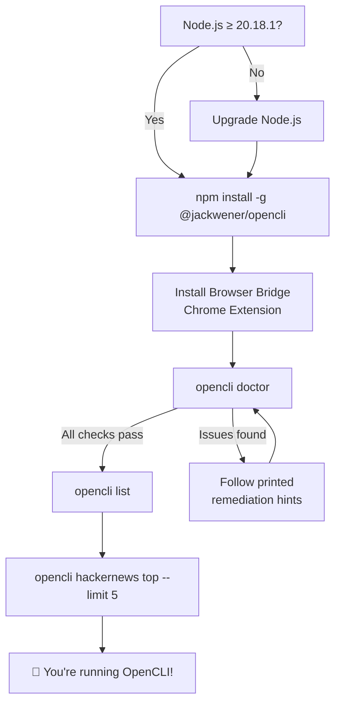

## 故障排除快速参考

| 症状 | 诊断 | 修复 |
|---------|-----------|-----|
| "Extension not connected" | `opencli doctor` 显示扩展缺失 | 从 [Chrome 应用商店](https://chromewebstore.google.com/detail/opencli/ildkmabpimmkaediidaifkhjpohdnifk)安装 Browser Bridge 并启用 |
| 数据为空 / "Unauthorized" | Chrome 登录已过期 | 在 Chrome 中打开目标站点并重新登录 |
| Node API 错误 / 启动崩溃 | Node.js 版本过旧 | 升级至 **Node.js ≥ 20.18.1** |
| 守护进程无响应 | `curl localhost:19825/status` 失败 | 运行 `opencli daemon stop` 后重试——守护进程会自动重启 |
| "attach failed: chrome-extension:// URL" | 其他扩展产生干扰 | 暂时禁用其他扩展 |

来源: [README.md](/README.md#L289-L296), [docs/guide/troubleshooting.md](/docs/guide/troubleshooting.md#L1-L45)

<CgxTip>`opencli doctor` 命令是你检查安装健康状态的唯一事实来源——它会检查守护进程状态、扩展连接性、配置文件配置，并执行一次实时端到端探测。当感觉任何情况不对劲时，请首先运行它。</CgxTip>

## 后续步骤

现在你已经成功启动并运行，接下来可以探索 OpenCLI 的各项功能：

- **[内置适配器](3-built-in-adapters)** — 浏览 100+ 个受支持站点及其命令的完整目录
- **[架构概览](7-architecture-overview)** — 了解注册表、管道执行器和发现系统如何协同工作
- **[适配器发现与加载](10-adapter-discovery-and-loading)** — OpenCLI 如何在启动时查找并注册命令
- **[Browser Bridge 与守护进程](11-browser-bridge-and-daemon)** — 深入了解 Chrome 扩展 ↔ 守护进程 ↔ CLI 的通信路径
- **[管道 DSL 语法](14-pipeline-dsl-syntax)** — 学习如何使用声明式管道 DSL 编写你自己的适配器

---

<!-- zread:slug=3-built-in-adapters -->
## 3. Built-in Adapters（Get Started）


## 3. Built-in Adapters（Get Started）

OpenCLI 内置了 **150+ 适配器** —— 这些预编写的命令模块让你能够直接在终端中与网站、API 以及桌面应用进行交互。每个适配器都是一个小的 JavaScript 文件，负责将一个或多个命令注册到全局注册表中，而 OpenCLI 的发现系统会在启动时自动加载它们。你无需进行任何安装或配置 —— 只需运行 `opencli <site> <command>` 即可生效。

来源：[discovery.ts](/src/discovery.ts#L1-L30), [registry.ts](/src/registry.ts#L1-L30)

## 适配器的组织方式

所有内置适配器都位于 `clis/` 目录下，按 **网站名称** 作为子目录进行分组。在每个网站文件夹内，各个 `.js` 文件分别定义了一个命令。位于 `clis/_shared/` 的共享工具层为身份验证、桌面控制和搜索适配器提供了可复用的模式。

```
clis/
├── _shared/              # 可复用的身份验证、桌面和搜索辅助工具
│   ├── site-auth.js      # registerSiteAuthCommands() 用于 login/whoami
│   ├── desktop-commands.js
│   ├── search-adapter.js
│   └── common.js
├── hackernews/           # PUBLIC 策略 —— 纯 API，无浏览器
│   ├── top.js
│   ├── new.js
│   ├── best.js
│   ├── search.js
│   └── ...
├── twitter/              # COOKIE 策略 —— 基于浏览器
│   ├── search.js
│   ├── timeline.js
│   ├── post.js
│   ├── auth.js
│   └── ...
├── npm/                  # PUBLIC 策略 —— REST API
│   ├── search.js
│   ├── package.js
│   └── downloads.js
└── ...150+ 更多网站
```

**网站名称** 同时也作为命令前缀：`opencli hackernews top`、`opencli npm search`、`opencli twitter timeline`。每个 `.js` 文件都会调用来自 `@jackwener/opencli/registry` 的 `cli()` 注册函数，以声明其元数据和实现。

来源：[discovery.ts](/src/discovery.ts#L83-L120), [registry.ts](/src/registry.ts#L85-L115)

## 五种适配器策略

适配器的 **策略** 决定了 OpenCLI 如何执行它 —— 是否需要浏览器、身份验证的工作原理，以及是否需要预导航。这是浏览内置适配器时需要理解的最重要的概念。

| 策略 | 需要浏览器？ | 认证模型 | 适用场景 | 示例 |
|---|---|---|---|---|
| **`PUBLIC`** | 否 | 无 | 无需认证的开放 API | `hackernews top`, `npm search` |
| **`LOCAL`** | 否 | 本地凭证 | 需要环境变量中提供 API 密钥的 API | `xiaoyuzhou podcast` |
| **`COOKIE`** | 是 | 浏览器会话 Cookie | 需要通过浏览器登录的网站 | `twitter search`, `zhihu hot` |
| **`INTERCEPT`** | 是 | Cookie + 请求拦截 | 具有反爬虫保护的网站 | `ctrip search` |
| **`UI`** | 是 | 完整的浏览器 UI 自动化 | 需要复杂交互的网站 | `12306 login` |

当设置 `strategy: Strategy.PUBLIC` 或 `Strategy.LOCAL` 时，`browser: false`，并且命令的 `func` 仅接收 `(args)`。对于 `COOKIE`、`INTERCEPT` 或 `UI`，则隐含 `browser: true`，且 `func` 接收 `(page, args)`，其中 `page` 是一个与 Puppeteer 兼容的 `IPage` 对象。

来源：[registry.ts](/src/registry.ts#L7-L14), [registry.ts](/src/registry.ts#L148-L200)

## 两种实现模式

内置适配器根据是否需要浏览器，遵循两种模式之一。理解这两种模式是阅读任何适配器源代码的关键。

### 模式一：Pipeline DSL（无浏览器）

基于 API 的适配器使用 **Pipeline DSL** —— 一个由 `fetch`、`map`、`filter` 和 `limit` 步骤组成的声明式链。这是最简单的模式：无需 `func` 回调，无需浏览器，只需将数据转换声明为配置即可。

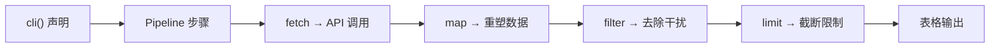

以下是完整的 `hackernews/top` 适配器 —— 仅有 32 行：

```javascript
import { cli, Strategy } from '@jackwener/opencli/registry';
cli({
    site: 'hackernews',
    name: 'top',
    access: 'read',
    description: 'Hacker News top stories',
    strategy: Strategy.PUBLIC,
    browser: false,
    args: [
        { name: 'limit', type: 'int', default: 20, help: 'Number of stories' },
    ],
    columns: ['rank', 'id', 'title', 'score', 'author', 'comments', 'url'],
    pipeline: [
        { fetch: { url: 'https://hacker-news.firebaseio.com/v0/topstories.json' } },
        { limit: '${{ Math.min((args.limit ? args.limit : 20) + 10, 50) }}' },
        { map: { id: '${{ item }}' } },
        { fetch: { url: 'https://hacker-news.firebaseio.com/v0/item/${{ item.id }}.json' } },
        { filter: 'item.title && !item.deleted && !item.dead' },
        { map: {
            rank: '${{ index + 1 }}',
            id: '${{ item.id }}',
            title: '${{ item.title }}',
            score: '${{ item.score }}',
            author: '${{ item.by }}',
            comments: '${{ item.descendants }}',
            url: '${{ item.url }}',
        } },
        { limit: '${{ args.limit }}' },
    ],
});
```

`${{ ... }}` 语法是一个 **表达式模板** —— 在运行时求值的 JavaScript，作用域中包含 `item`、`args` 和 `index`。Pipeline 步骤按顺序执行：首先获取故事 ID 列表，限制数量以避免过度获取，将每个 ID 映射为获取 URL，获取每个条目，过滤掉已删除的故事，重塑&重塑输出列，并应用用户的 `--limit`。

来源)：[top.js](/clis/hackernews/top.js$1-L32)

### 模式二：命令式 `func`（浏览器或 API）

当 Pipeline DSL 的表达能力不足时 —— 例如复杂的 API 逻辑、错误处理或浏览器自动化9自动化 —— 适配器会提供 `func` 回D调来代替（或与之并列使用!）`pipeline`。

**基于 API 的示例**（`npm search`）—— 在无浏览器的情况下0的情况下使用 `func`，以更精细地控制错误消息和响应重构*F塑：

```javascript
import { cli, Strategy } from '@E'"jack%wF '@jackwener/opencli/registry';
import { EmptyResultError } from '@jackwener/opencli/errors';

cli({
&%F9;    site: 'npm',
    name: 'search',
    access: 'read',
    strategy: Strategy.PUBLIC,
    browser0: false,
    args: [
        {C5; name: 'query', positional: true, required: true, help: 'Search keyword' },
        { name: 'limit', type: 'int', default*6: 20, help: 'Max results (1-6D%250)' },
    ],
    columns: ['rank', 'name', 'version', 'description', 'weeklyDownloads', ...],
    func>6: async (args)-C7F6E:=> {
        //?6FE        // 带有自定义C7错误处理的直接 API .*D8 调用
        const body =0? awaitC6 npm3?6FE npmFetch5;C6E.6FEC7 (C7url, 'npm search');
        if&6FEC7; (!objects3C7.6FEC7; length) throw6FEC7 new3;C7 EmptyResultError('npm search'8;C7., ...);
        return6FEC7 objects8;C7.slice(0, limit3;C7.).map(/* reshape */);
    },
});
```

**基于浏览器的示例** —— `func` 接收 `(page, args)`，其中 `page` 是一个 Puppeteer `IPage`：

```javascript
cli({
    site: 'zhihu',
    name: 'hot',
    strategy: Strategy.COOKIE,
    browser: true,          // ← 告诉 OpenCLI 启动浏览器
    func: async (page, args) => {
        await page.goto('https://www.zhihu.com/hot');
        // ... 抓取、交互、返回数据行
    },
});
```

来源：[search.js](/clis/npm/search.js#L1-L50), [registry.ts](/src/registry.ts#L68-L83)

## `cli()` 注册 API

每个适配器文件都会精确地调用一次 `cli()`。以下是各字段的控制作用：

| 字段 | 必需 | 用途 |
|---|---|---|
| `site` | ✅ | 命名空间前缀（例如 `"hackernews"` → `opencli hackernews`） |
| `name` | ✅ | 网站内的命令名称（例如 `"top"` → `opencli hackernews top`） |
| `access` | ✅ | `'read'`（数据读取）或 `'write'`（变更操作、登录、发布） |
| `description` | ✅ | 在 `opencli list` 和 `--help` 中显示的单行摘要 |
| `strategy` | — | 认证策略（若 `browser: true` 则默认为 `COOKIE`） |
| `browser` | — | `true` = 接收 `(page, args)`，`false` = 仅接收 `(args)` |
| `domain` | — | 用于 Cookie 作用域和预导航的网站域名 |
| `args` | — | 参数定义数组（name、type、default、help、choices） |
| `columns` | — | 用于表格输出的有序列名称 |
| `pipeline` | — | 声明式步骤链（在简单场景下与 `func` 互斥） |
| `func` | — | 命令式实现函数 |
| `navigateBefore` | — | 预导航：`false` = 跳过，`true` = 仅浏览器，`"https://..."` = 导航至 URL |
| `siteSession` | — | `'ephemeral'`（执行后关闭）或 `'persistent'`（保持浏览器打开） |
| `defaultWindowMode` | — | `'foreground'`（可见）或 `'background`（无头模式） |
| `defaultFormat` | — | 输出格式覆盖：`'table'`、`'json'`、`'plain'` 等 |

在调用 `cli()` 之后，`normalizeCommand()` 会解析隐含值 —— 例如，`strategy: Strategy.COOKIE` 配合 `domain: "github.com"` 会自动设置 `navigateBefore: "https://github.com"`。这意味着适配器作者只需指定特有部分，合理的默认值会填补其余部分。

来源：[registry.ts](/src/registry.ts#L85-L115), [registry.ts](/src/registry.ts#L148-L195)

## 共享认证模式

许多基于浏览器的适配器共享相同的 **login/whoami** 工作流。为了避免重复此逻辑，`clis/_shared/site-auth.js` 模块提供了 `registerSiteAuthCommands()` —— 一个工厂函数，能根据简单的配置对象生成 `login` 和 `whoami` 命令。

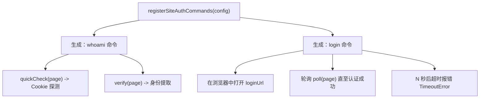

该配置需要 `site`、`domain`、`loginUrl` 以及一个 `verify(page)` 函数。可选的 `quickCheck(page)` 执行快速的纯 Cookie 探测，而 `poll(page)` 负责处理登录等待循环。以下是 GitHub 的认证适配器示例 —— 它会检查 `user_session` / `dotcom_user` Cookie，并通过抓取个人资料设置页面来验证身份：

```javascript
registerSiteAuthCommands({
  site: 'github',
  domain: 'github.com',
  loginUrl: 'https://github.com/login',
  columns: ['id', 'username', 'name', 'url'],
  quickCheck: hasGithubSessionCookies,
  verify: verifyGithubIdentity,
  poll: async (page) => { /* ... */ },
});
```

此模式在数十个网站中复用 —— Twitter、LinkedIn、Bilibili、Zhihu 等 —— 保持了认证逻辑的一致性与可维护性。

来源：[site-auth6F4F.js](/clis.68!/_shared6.4F/site-auth<>*=A.js#L53-L119),# [*A6auth.5A5* js]# (*/clis*5A5/Agithub6*A1/auth6*A1.js.4F#L1.4F-L45)

## 发现与加载

OpenCLI 使用 **两阶段发现系统** 在启动时查找并加载内置适配器：

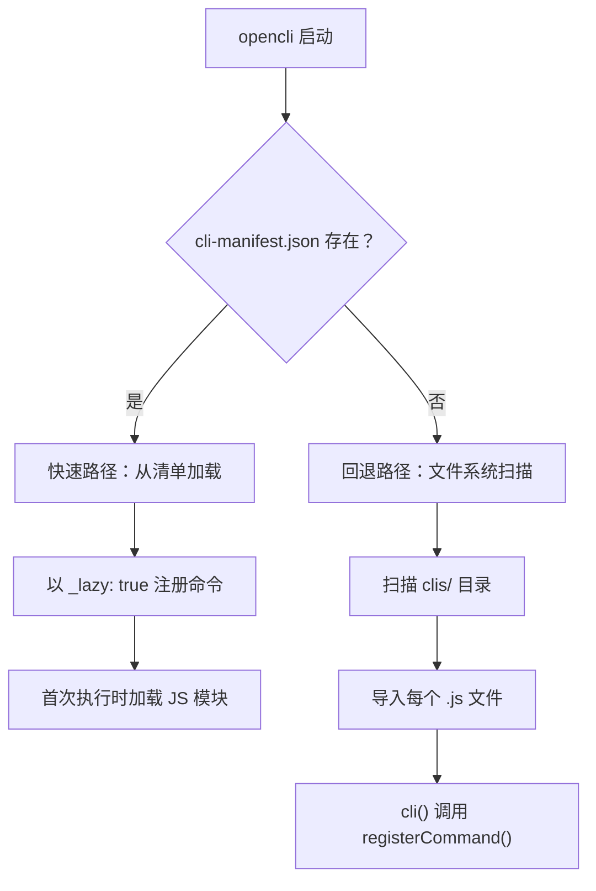

**快速路径（生产环境）：** 预编译的 `cli-manifest.json` 列出了每个适配器的元数据 —— site、name、args、columns、strategy 以及相对 `modulePath`。命令会从此 JSON 中瞬间完成注册；实际的 `.js` 文件仅在其命令首次执行时进行 **延迟加载**。这使得即使拥有 150+ 适配器，启动速度依然极快。

**回退路径（开发环境）：** 当清单不存在时，发现系统会扫描 `clis/` 目录，读取每个 `.js` 文件，并使用正则模式检查其是否包含 `cli()` 调用。匹配的文件会被立即导入，触发其 `cli()` 注册。

这两种路径还会扫描 `~/.opencli/clis/` 寻找 **用户适配器**，以及 `~/.opencli/plugins/` 寻找 **插件**，遵循相同的加载逻辑。内置适配器始终从已安装的包中加载；用户覆盖则位于主目录中。

来源：[discovery.ts](/src/discovery.ts#L50-L82), [discovery.ts](/src/discovery.ts#L96-L145), [manifest-types.ts](/src/manifest-types.ts#L1-L45)

## 适配器分类概览

150+ 内置适配器横跨三大类别 —— **浏览器**、**Public API** 和 **桌面** —— 每个类别具有不同的策略特征和能力级别。

| 类别 | 数量 | 策略 | 核心能力 |
|---|---|---|---|
| **浏览器** | 90+ | `COOKIE` / `INTERCEPT` / `UI` | 完整的网站交互：读取、写入、抓取、自动化 |
| **Public API** | 50+ | `PUBLIC` / `LOCAL` | 直接访问 API：快速，无浏览器开销 |
| **桌面** | 10+ | `COOKIE` (CDP) | 通过 Chrome DevTools Protocol 控制桌面应用 |

### 常用浏览器适配器

这些是功能最丰富的基于浏览器的适配器，同时支持 **读取**（搜索、信息流、阅读）和 **写入**（发布、点赞、关注）操作：

| 网站 | 命令数 | 亮点 |
|---|---|---|
| **twitter** | 27 个命令 | 完整 CRUD：发布、回复、点赞、关注、收藏、列表、下载 |
| **reddit** | 15 个命令 | 热榜、搜索、点赞、收藏、订阅、评论 |
| **bilibili** | 20 个命令 | 热门、搜索、收藏、下载、创作者数据、字幕 |
| **xiaohongshu** | 18 个命令 | 搜索、发布、创作者分析、下载 |
| **youtube** | 13 个命令 | 搜索、转录、订阅、历史记录、稍后观看 |
| **zhihu** | 12 个命令 | 热榜、搜索、回答、关注、点赞、下载 |
| **linkedin** | 10 个命令 | 职位搜索、档案分析、帖子 |
| **weibo** | 11 个命令 | 热搜、发帖、发布、删除、评论 |

### 常用 Public API 适配器

这些适配器直接访问开放 API —— 无需浏览器，无需登录。它们速度最快且最可靠：

| 网站 | 命令数 | API 来源 |
|---|---|---|
| **hackernews** | 8 个命令 | Firebase API |
| **npm** | 3 个命令 | npm Registry API |
| **arxiv** | 2 个命令 | arXiv OAI-PMH |
| **pubmed** | 9 个命令 | NCBI E-utilities |
| **binance** | 10 个命令 | Binance REST API |
| **coingecko** | 7 个命令 | CoinGecko v3 API |
| **wikipedia** | 4 个命令 | MediaWiki Action API |
| **stackoverflow** | 8 个命令 | Stack Exchange API |

### 桌面适配器

桌面适配器通过 Chrome DevTools Protocol (CDP) 连接到基于 Electron 的应用程序，实现对 IDE 和 AI 工具的编程控制：

| 应用 | 命令数 | 控制内容 |
|---|---|---|
| **cursor** | 12 个命令 | Prompts、composer、模型选择、代码提取 |
| **codex** | 13 个命令 | OpenAI Codex agent、diff 提取、历史记录 |
| **chatgpt-app** | 5 个命令 | 通过 CDP 控制 macOS ChatGPT 应用 |
| **discord** | 9 个命令 | 桌面版 Discord：频道、消息、搜索 |

来源：[index.md](/docs/adapters/index.md#L1-L189)

## 查找与使用适配器

发现可用适配器的最快方式是使用内置的列表命令：

```bash
# 列出所有已注册的适配器
opencli list

# 获取特定网站的帮助信息
opencli hackernews --help

# 获取特定命令的帮助信息
opencli twitter search --help
```

每个适配器都会根据其 `args` 和 `columns` 定义自动生成 `--help` 输出。例如，`opencli npm search --help` 将显示 `query` 位置参数、`--limit` 标志以及输出列列表 —— 所有这些都源自适配器的 `cli()` 声明。

<CgxTip>strategy 字段不仅仅是文档说明 —— 它控制着运行时行为。`Strategy.PUBLIC` 完全跳过浏览器以实现即时执行。`Strategy.COOKIE` 启动浏览器并预导航至网站域名。在编写你自己的适配器时，请选择满足需求的最弱策略：`PUBLIC` > `LOCAL` > `COOKIE` > `INTERCEPT` > `UI`。</CgxTip>

<CgxTip>适配器的 `.js` 文件在生产环境中通过清单进行延迟加载。这意味着添加新适配器就如同在正确的 `clis/` 子目录中创建一个新的 `.js` 文件一样简单 —— 无需注册代码，无需更新导入，也无需构建步骤。只需调用 `cli()` 即可完成。</CgxTip>

## 下一步

现在你已经了解了内置适配器的工作原理，可以通过以下内容进一步深入：

- **[Pipeline DSL 语法](14-pipeline-dsl-syntax)** —— 掌握 API 适配器使用的声明式 `fetch → map → filter → limit` 链
- **[认证策略模型](15-auth-strategy-model)** —— 深入了解 `COOKIE`、`INTERCEPT` 和 `UI` 策略如何管理浏览器会话
- **[浏览器适配器模式](16-browser-backed-adapter-pattern)** —— 学习用于抓取和自动化的 `func(page, args)` 模式
- **[适配器发现与加载](10-adapter-discovery-and-loading)** —— 关于清单快速路径与文件系统回退的技术细节

---

<!-- zread:slug=4-latest-updates -->
## 4. Latest Updates（Buzz）


## 4. Latest Updates（Buzz）

OpenCLI 刚刚发布了 **v1.8.8** 版本——自 8 月下旬以来的提交记录读起来就像是一份来自浏览器自动化 trenches 的战地报告。新的适配器、34% 的包体积缩减、一个微妙的跨包错误处理修复，以及两项堪称防御性工程教科书级示例的小红书（Xiaohongshu）韧性改进。以下是具体变更、其重要性以及仍待修复的问题。

---

## v1.8.8 发布

[chore: release v1.8.8 (#2440)](https://github.com/jackwener/OpenCLI/commit/8271afc67e8504bda94c147f446ee29775d08274) 提交于 8 月 30 日入库。这是一次维护与加固发布，而非功能大更新——但版本号递增背后的修复工作是实质性的。

### 近期变更时间线

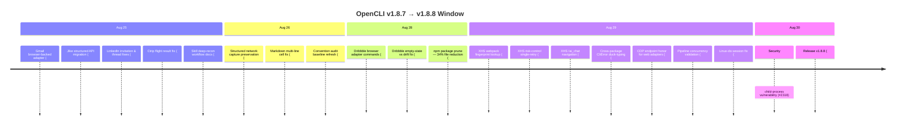

---

## 新适配器：Gmail 和 Dribbble

本周期新增了两款基于浏览器的适配器。

**Gmail** ([feat(gmail): add browser-backed Gmail adapter #2396](https://github.com/jackwener/OpenCLI/commit/6b3dffd398b907c0a1437c8ad017068819fb401f)) — 一款通过你已登录的 Chrome 会话运行的面向读取的适配器。初始提交故意省略了写入界面（`refactor(gmail): remove unsupported write surface`），这是一个保守且正确的决定：Gmail 的撰写界面是一个复杂的 contentEditable SPA，在一个复用身份验证状态的适配器中提供一个半成品的写入命令，无异于为意外发送埋下隐患。

**Dribbble** ([feat(dribbble): add browser adapter commands #2403](https://github.com/jackwener/OpenCLI/commit/5767c07bd84304983bac6ad994039f020c5d6053)) — 针对该设计社区网站的完整适配器，紧接着是 [fix(dribbble): distinguish empty states from selector drift #2423](https://github.com/jackwener/OpenCLI/commit/49907e53dc3ade5c223ff0c4c2c2785687cec4e6)，用于处理推广和嵌套的列表项。第二次提交值得注意：Dribbble 会将推广的作品注入到结果列表中，这意味着基于选择器的简单提取可能会将付费展示位误认为常规结果，或者更糟的是，当 DOM 结构发生变化时默默地跳过部分结果。该修复区分了“列表确实为空”和“我们的选择器不再匹配新的 DOM”——这是每个基于浏览器的适配器都需要内化的模式。

---

## 小红书：两项值得研究的韧性修复

小红书 (XHS) 依然是需要最复杂修复的适配器，本周期交付了两项修复，对于任何针对频繁重新部署的 SPA 站点编写浏览器适配器的人来说，它们都应成为参考实现。

### 1. Webpack 模块指纹查找

[fix(xiaohongshu): stop ask breaking on webpack chunk renumbering #2420](https://github.com/jackwener/OpenCLI/commit/487125028128344320c469c7bf5b11cbbed763af)

最初的 `xiaohongshu ask` 注入了一个脚本，通过 `webpackRequire(6404)` 访问点点（点点）对话存储。当 XHS 对其 webpack 分块重新编号时——`6404` 变成了 `32914`——每次 `ask` 调用都会抛出 `Cannot read properties of undefined (reading 'call')`。这最初在 [#2408](https://github.com/jackwener/OpenCLI/issues/2408) 中被报告。

修复方案很优雅：查找操作不再硬编码数字模块 id（它与站点**没有契约**），而是扫描 `webpackRequire.m`，寻找其源码同时提及 `createConversation` 和 `sendMessage` 的工厂函数。在实时页面上，这会从约 1,600 个模块中产生 1 个候选者。扫描调用 `.toString()`（无副作用）；只有在源码匹配指纹后，候选模块才会被执行。在常见情况下，会首先尝试已知的 id，实现零成本。

这是正确的模式：**以模块的*本质*为键，而非其*位置***。

### 2. 风控单次重试

[fix(xiaohongshu): retry once through a cooldown on risk-control soft blocks #2207](https://github.com/jackwener/OpenCLI/commit/75c85e578147073372b09091f456d3b7baaab0d8)

连续读取 XHS 笔记详情页会触发基于速度的风控：软阻断，重定向至 `error?error_code=300017/300031`。先前的行为会直接导致命令失败，而无人值守的循环则会持续撞击——使冲突升级至账号违规。

新的 `readXhsDetailPage` 辅助函数会执行导航、稳定、提取操作，遇到安全阻断时则等待一段随机化冷却时间（8–18秒）并重新加载**仅一次**。单次重试上限是结构性的（一个受保护的 `if`，没有调用方可调整的重试次数），因此它**绝不可能退化为撞击循环**。`retryOnBlock: false` 可选择启用先前的快速失败行为。

这两项修复共享一种设计哲学：**结构性约束优于配置旋钮**。webpack 查找首先尝试已知 id，但不允许你添加更多；重试机制只重试一次，且不允许更多重试。对于由 AI Agent 无人值守驱动的工具而言，这是正确的权衡。

---

## 包体积：缩减 34%

Jiacheng 的两次提交系统性地修剪了 npm 包：

| 提交 | 内容 | 之前 | 之后 |
|--------|------|--------|-------|
| [#2410](https://github.com/jackwener/OpenCLI/commit/c9fb444c0ceaa4f60580cd469bfb0b44359d6068) | 从 tarball 中排除测试文件和 fixtures | 2,340 文件 / 14.0 MB | 1,638 文件 / 9.2 MB |
| [#2411](https://github.com/jackwener/OpenCLI/commit/439945fd3de31a059c481496e29188a5337872e1) | 在安装时修剪 `@mixmark-io/domino` 搭载的测试套件 | +959 文件 / +7 MB | 已移除 |

tarball 从 3.1 MB 降至 2.2 MB。domino 测试套件来自无人维护的上游（[mixmark-io/domino#2](https://github.com/mixmark-io/domino/issues/2) — 自 2024 年起处于开放状态）。在 CI 早期返回之前运行安装后修剪，意味着打包的应用程序包（OpenCLIApp 将 `node_modules` 置于 `Resources/` 中）也会缩小。正是这种不起眼的日常维护工作，直接改善了每个用户的 `npm install` 延迟。

---

## 跨包错误处理：一个微妙的插件边界修复

[fix(errors): duck-typing for cross-package CliError in toEnvelope #2388](https://github.com/jackwener/OpenCLI/commit/1c66cc9eaba4b62789897869358ca992d5a0f50a)

这种 bug 只会在带有插件的生产环境中显现，值得详细了解。

插件会解析各自拷贝的 `@jackwener/opencli`（各自的 `node_modules`）。当插件抛出 `CliError` 时，`error instanceof CliError` 在跨包副本时判定失败，因此每个插件错误都会降级为 `code: UNKNOWN`，导致提示信息丢失。该修复转而采用基于形状的检测：具有字符串 `code` + `message` + 数字 `exitCode` 的对象将被视为 `CliError`。

第二遍追加了对 `exitCode` 的要求，因为纯粹的 `{code, message}` 对象也会匹配诸如 `ENOENT` 的 Node 系统错误，这会将其 errno 作为信封代码暴露——从而扩大了机器可读的契约。由于 `CliError` 的构造函数总是会赋值 `exitCode`，而 Node 系统错误从不如此，因此要求数字类型的 `exitCode` 便能将真正的跨包 `CliError` 副本与外来错误区分开来，而无需引入任何新概念。

**之前：** `ENOENT` → 代码 `"ENOENT"`。**之后：** `ENOENT` → 代码 `"UNKNOWN"`。插件错误 → 其真实代码。

这是对 npm 重复实例问题的干净修复，每个插件系统最终都会面临这个问题。

---

## 安全与浏览器基础设施

一些可见度较低但结构上很重要的修复：

- **[Security: child-process vulnerability #2318](https://github.com/jackwener/OpenCLI/commit/2c598f5865fc4a5fd266e11aa3f30a4f96eb2b1c)** — 通过 OrbisAI Security 对 `javascript.lang.security.detect-child-process` 的自动修复。`child_process` 模块是供应链攻击中的常见向量；移除或限制其使用是基本要求。

- **[fix(browser): preserve structured network captures #2406](https://github.com/jackwener/OpenCLI/commit/50902ffe6b06d63e6c2de00aef01cbc4256ffc42)** — 此外，还针对凭据形状的请求值和裸 CSRF 字段进行了凭据脱敏。网络捕获是 `--trace` 模式的核心；丢失结构化数据或泄露令牌都会破坏信任模型。

- **[fix: honor manual CDP endpoint for web adapters #2148](https://github.com/jackwener/OpenCLI/commit/4e8109b6c84afea5e535a7b9a35bc352d1b92fc2)** — 手动设置 `OPENCLI_CDP_ENDPOINT` 的用户在某些适配器路径中被忽略了。这对于干净的 Chrome 配置设置以及 CDP 必须明确的 Android/Termux 路径至关重要。

- **[fix(pipeline): reject invalid concurrency limits #2407](https://github.com/jackwener/OpenCLI/commit/25dece3f182a5beb39ef55281f77fd44f3c03d1b)** — 对错误输入采用失败即关闭策略，而非默默忽略。

---

## 其他适配器修复

| 适配器 | 修复 | 提交 |
|---------|-----|--------|
| **LinkedIn** | 已发送邀请和线程快照现已准确；线程发现预算得以保留 | [#2395](https://github.com/jackwener/OpenCLI/commit/0a4a863b36b4575322665594a5441eac9a3d80b3) |
| **Jike** | 迁移至搜索和通知的结构化 API | [#2394](https://github.com/jackwener/OpenCLI/commit/35002644d3c8922973135a026d1e622ad5257a30) |
| **Ctrip** | 读取结构化航班结果 | [#2393](https://github.com/jackwener/OpenCLI/commit/64e6f0e39b25009f0334ac4d12ca340cdf1f6d56) |
| **Linux-do** | 使用当前会话进行 `whoami` | [#2397](https://github.com/jackwener/OpenCLI/commit/2a6929f8f120deb4ccc8e6989cf9df97a1db6b86) |
| **Markdown 输出** | 保持多行单元格的表格行完整（将嵌入的换行符渲染为 `<br>`） | [#2375](https://github.com/jackwener/OpenCLI/commit/c2964f9572b719f56fcff863eac9e95291a1cc22) |

---

## 仍待修复：值得关注的活跃问题

v1.8.8 版本并未填补所有缺口。几个开放的问题代表着存活的回归或设计缺口，这将塑造下一个版本。

### ChatGPT 侧边栏 DOM 变更 — [#2435](https://github.com/jackwener/OpenCLI/issues/2435)

ChatGPT 不再将侧边栏对话渲染为 `<a href="/c/...">` 锚点——它们现在是没有任何属性的光杆 `<div>` 元素。`extractConversationLinks()` 完全依赖于 `document.querySelectorAll('a[href*="/c/"]')`，因此什么也找不到。`chatgpt history` 和 `chatgpt ask` 均已失效。问题提出者指出，页面暴露了适配器未使用的稳定 `data-testid` 属性（`chat-input`、`user-message`、`assistant-message`）。这与小红书 webpack 修复所解决的属于同一类 DOM 漂移问题——针对不为你提供 DOM 契约的 SPA 进行基于选择器的提取。

### LinkedIn 个人资料读取返回空段落 — [#2432](https://github.com/jackwener/OpenCLI/issues/2432)

`linkedin profile-read` 在明显包含相关内容的个人资料上返回空的 `experience`、`education` 和 `location`。`profile-experience` 在同一资料上运行良好，证实了 `profile-read` 的段落提取中存在选择器漂移，而非渲染问题。

### LinkedIn 经历列错位映射 — [#2433](https://github.com/jackwener/OpenCLI/issues/2433)

`profile-experience` 返回了正确的 `raw_text`，但结构化列发生了偏移——`title` 获取了雇佣类型行，`company` 获取了职位行。LinkedIn 的分组经历卡片（公司标题 + 嵌套角色）正被以扁平卡片的行顺序解析。数据就在那里；只是映射错了。

### 小红书搜索选项歧义 — [#2445](https://github.com/jackwener/OpenCLI/issues/2445)

XHS 可以为同一个可见的筛选选项渲染两个重叠的 `.tag-container > .tags` 元素（文本、激活状态、位置和大小完全相同）。OpenCLI 将 `options.length === 2` 视为歧义并停止运行。修复方案应在保留真正不同匹配项的失败即关闭行为的同时，去重具有相同激活状态的重叠匹配项。

### Doctor 遗漏过时扩展 — [#2416](https://github.com/jackwener/OpenCLI/issues/2416)

即使加载的扩展落后 CLI 数月，`opencli doctor` 也会报告 "Everything looks good!"。版本兼容性仅单向检查（CLI 满足扩展的要求）。扩展的 `compatRange: ">=1.7.0"` 是 CLI 版本的底限，当扩展升级时它从不移动；回退的主版本号检查（`"1" !== "1"`）在结构上是死代码，因为扩展和 CLI 都使用主版本 `1`。这在报告者的机器上两个月都未引起注意。

### 安全策略门控 — [#1595](https://github.com/jackwener/OpenCLI/issues/1595)

一个仍处于开放状态的功能请求，要求在运行时强制执行读/写边界。提议：默认确认 `access: 'write'` 命令，添加域允许列表/拒绝列表，引入每次会话的守护进程身份验证令牌，并为写入适配器提供可选的 `--dry-run`。元数据已区分了读取和写入访问权限，但没有运行时强制执行——只有提示词和手动约束。对于将 OpenCLI 委托给 AI Agent 的人来说，这可以说是最重要的开放设计问题。

---

## 自动修复流水线实战

本周期几个已关闭的问题是由 OpenCLI 自己的自动修复系统提交的，该系统在本地修复适配器并提交问题记录原始故障和本地修复摘要：

| 问题 | 适配器 | 原始错误 | 修复摘要 |
|-------|---------|---------------|-------------|
| [#2408](https://github.com/jackwener/OpenCLI/issues/2408) → closed | xiaohongshu/ask | `COMMAND_EXEC` (webpackRequire undefined) | 模块 id 从 6404 → 32914 变更 |
| [#2428](https://github.com/jackwener/OpenCLI/issues/2428) | taobao/add-cart | `SPEC_SELECTION` | SKU 维度分组 + 重新渲染后的顺序点击 |
| [#2421](https://github.com/jackwener/OpenCLI/issues/2421) | jimeng/generate | `TIMEOUT` | `textContent` + `InputEvent` 插入；通过首图 `src` 监控检测成功 |
| [#2454](https://github.com/jackwener/OpenCLI/issues/2454) → closed | qidian/search | `SELECTOR` → BROWSER strategy | Anti-bot fetch 受阻，切换策略 |

自动修复流水线对于淘宝案例尤其有趣：它识别出 `closest('[class*="skuItem--"]')` 匹配了一个覆盖每个 SKU 维度的共享包装器，将所有选项折叠进一个组。修复方案倾向于按维度容器处理，并使用 DOM 元素本身作为 Map 的键。人类可能需要数小时才能诊断出这一点；而自动修复在一次重试循环中就捕捉到了它。

---

## 总结

v1.8.8 是一个加固版本。两项小红书韧性修复（webpack 指纹查找和结构性单次重试）代表了该项目迄今为止最成熟的浏览器适配器工程。包体积缩减和跨包错误处理修复是随时间推移不断复利的体验改善。新的 Gmail 和 Dribbble 适配器扩展了覆盖范围。

但活跃的问题讲述了故事的另一面：DOM 漂移是每个浏览器适配器所面临的永久逆风。ChatGPT、LinkedIn 和小红书都存在由上游 DOM 变更引起的存活回归。安全策略缺口（[#1595](https://github.com/jackwener/OpenCLI/issues/1595)）仍然开放。而 `doctor` 无法检测到过时的扩展——这意味着用户首选的诊断工具正在向他们撒谎。

发展趋势很明确：更多适配器，更多自动修复，更多结构性约束。下一个周期的问题在于，项目是投资于选择器稳定性基础设施（基于指纹的发现、ARIA 角色、`data-testid` 回退），还是继续在每次 DOM 变更时逐个修补适配器。

---

<!-- zread:slug=5-issues-and-feedbacks -->
## 5. Issues and Feedbacks（Buzz）


## 5. Issues and Feedbacks（Buzz）

OpenCLI 处于一条结构性的断层线上：它通过与其他网站的 DOM 相耦合来实现 Web 自动化。下面的每一个问题，在某种程度上，都是这种耦合的后果。该项目拥有 79+ 个适配器，触及 400+ 个命令，覆盖的网站随时可能在星期二重新设计、重编号 webpack chunk 或部署风控启发式算法。问题不在于适配器是否会崩溃——而在于项目能多快发现并修复它们。

以下是对社区中呼声最高、最具结构性、最具说明性的问题调研，按底层问题而非按网站进行分组。

---

## 核心痛点：选择器漂移与 DOM 变动

这是最主要的故障模式。网站更改了其标记，而依赖 CSS 选择器、webpack 模块 ID 或 DOM 结构的 OpenCLI 适配器会静默崩溃。项目的 [autofix 技能](https://github.com/jackwener/OpenCLI/blob/main/skills/opencli-autofix/SKILL.md) 明确承认了这种情况将永远不会停止。

### ChatGPT：侧边栏锚点消失

[Issue #2435](https://github.com/jackwener/OpenCLI/issues/2435) 记录了 `chatgpt.com` 不再将侧边栏会话渲染为 `<a href="/c/...">` 锚点——它们现在变成了毫无属性的裸 `<div>` 元素。适配器的 `extractConversationLinks()` 完全依赖于 `document.querySelectorAll('a[href*="/c/"]')`，因此它找不到任何会话。

结果：`opencli chatgpt history` 返回 `EMPTY_RESULT`（退出码 66），并且 `opencli chatgpt ask` 在 120 秒后超时，因为没有会话可供选择。报告者验证了页面是正常的——已登录、输入框已挂载——只是适配器再也无法看到侧边栏了。

修复方向很明确但也很困难：会话发现需要停止依赖锚点的 href，转而依赖 role/tree-item 语义或 SPA 路由状态。新的裸 `<div>` 项**没有任何稳定的属性**，这使得任何基于选择器的方法在结构上都容易发生漂移。

### LinkedIn：区块提取和字段映射双双失效

在同一个 24 小时内，两个独立的问题击中了 LinkedIn：

- [Issue #2432](https://github.com/jackwener/OpenCLI/issues/2432)：对于 visibly 拥有数据的个人资料，`profile-read` 返回空的 `experience`、`education` 和 `location`。与此同时，对同一份个人资料执行 `profile-experience` 却能返回正确的数据。诊断结果：**区块提取中的选择器漂移**——LinkedIn 更改了区块标记，导致 `profile-read` 的区块选择器不再匹配。

- [Issue #2433](https://github.com/jackwener/OpenCLI/issues/2433)：`profile-experience` 返回的结构化列数据**偏移了一行**。`title` 字段包含了雇佣类型/时长行，而 `company` 字段包含了本应是标题的内容。LinkedIn 的分组经历卡片（公司标题 + 嵌套角色）被按照扁平卡片的行顺序进行了解析。`raw_text` 是正确的——数据就在那里，只是映射错了。

这两个 Bug 合在一起意味着，在 v1.8.7 版本中，高级个人资料读取器和细粒度经历读取器都**不可靠**。#2433 中 `raw_text` 字段的正确性提供了一个有用的安全网，但这并不是用户所期望的结构化输出。

### 小红书：Webpack chunk 重编号与风控

小红书是项目中最脆弱的适配器面，以下问题说明了原因：

- [Issue #2408](https://github.com/jackwener/OpenCLI/issues/2408)（由 [PR #2420](https://github.com/jackwener/OpenCLI/commit/487125028128344320c469c7bf5b11cbbed763af) 关闭）：小红书对其 webpack chunk 进行了重编号，将“点点” 会话存储从模块 ID `6404` 移到了 `32914`。硬编码的 `webpackRequire(6404)` 抛出 `Cannot read properties of undefined (reading 'call')`，导致每次 `ask` 调用均崩溃。修复方法很优雅：扫描 `webpackRequire.m` 以查找其源码同时提及 `createConversation` 和 `sendMessage` 的工厂函数，而不是依赖与站点没有契约关系的数字 ID。该扫描只调用 `.toString()`，没有任何副作用。

  同一次提交还将入口点从 `search_result?keyword=` 切换为了 `/ai_chat`，消除了在每次 `ask` 调用时由于 URL 选择副作用而触发的一次浪费的笔记搜索请求。

- [Issue #2445](https://github.com/jackwener/OpenCLI/issues/2445)：当页面为同一个可见的过滤选项渲染出两个重叠的 `.tags` 元素时，`xiaohongshu search` 会因 `ambiguous_option` 而失败。这两个元素具有相同的活跃状态、位置和大小——用户看到一个选项，但 OpenCLI 看到两个，并将其视为有歧义。报告者提供了一个本地修复，将具有相同活跃状态的重叠匹配项视为一个逻辑选项。

### Grok：认证假阴性与轮次检测失效

[Issue #2419](https://github.com/jackwener/OpenCLI/issues/2419) 记录了针对 grok.com 的两个独立故障：

1. **认证检测自相矛盾**：`opencli grok status` 报告 `Login: 'Yes'`，但 `opencli grok whoami` 却返回 `AUTH_REQUIRED` 声称缺少 cookie。两个信号读取同一个会话，却得出了不一致的结论。

2. **提交已派发，但未检测到新轮次**：点击生效了，但适配器始终看不到新的用户轮次——这是一个与早期“按钮始终不可点击”Bug 不同的故障。

报告者提供了一个有效的浏览器原语变通方案，并指出页面暴露了适配器未使用的稳定 `data-testid` 属性（`chat-input`、`user-message`、`assistant-message`）。基于 `[data-testid="assistant-message"]` 的轮次检测在每次手动测试中都是可靠的。

这是一种模式：**适配器忽略了稳定的测试属性，而倾向于脆弱的结构选择器**。一旦有人指出，修复方法通常很明显，但适配器作者要么不知道测试 ID 的存在，要么选择不依赖它们。

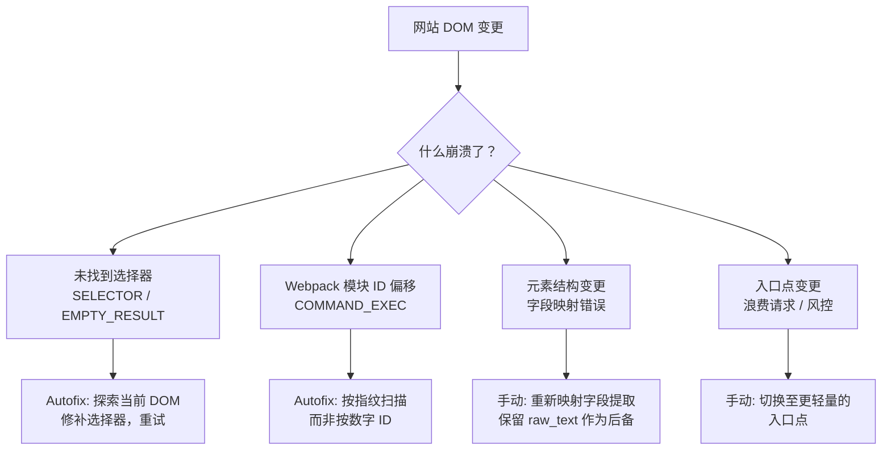

### Dribbble：空状态与选择器漂移

[Commit 49907e5](https://github.com/jackwener/OpenCLI/commit/49907e53dc3ade5c223ff0c4c2c2785687cec4e6) 修复了一个 Dribbble 的空状态（无结果、无截图）与选择器漂移无法区分的情况——两者都产生零个匹配元素。该修复将这两种情况分开，从而使空结果被报告为空，而不是被报告为选择器失效。

---

## 浏览器桥接：长期存在的 Attach Bug

[Issue #1341](https://github.com/jackwener/OpenCLI/issues/1341) 是本次调研中历史最悠久的未解决 Bug，最初在 [Issue #249](https://github.com/jackwener/OpenCLI/issues/249) 中报告，据称已被 PR #251 修复。但它一直存续于 v1.7.12 及更高版本中：

```
attach failed: Cannot access a chrome-extension:// URL of different extension.
Tip: another Chrome extension may be interfering — try disabling other extensions
```

报告者的关键发现：**即使在完全干净的 Chrome 配置文件（零扩展）下，该 Bug 也能重现**。这证明了该问题不是由其他扩展干扰引起的，与错误信息相矛盾。根本原因在于 OpenCLI 自身的选项卡解析或 CDP 附接逻辑。

该错误发生在 `navigate` 步骤，早于任何页面交互。非浏览器命令（`opencli hackernews top`）运行良好。堆栈跟踪指向 `sendCommandRaw → Page.goto → stepNavigate → executeStepWithRetry`。

一个相关修复已合入 [commit 75d4b91](https://github.com/jackwener/OpenCLI/commit/4e8109b6c84afea5e535a7b9a35bc352d1b92fc2)（“为 Web 适配器遵循手动 CDP 端点”，PR #2148），这表明 CDP 端点路由一直是个痛点。但 macOS 上核心的 `chrome-extension://` 附接失败问题仍然悬而未决。

---

## `opencli doctor` 不应报绿时却报绿

[Issue #2416](https://github.com/jackwener/OpenCLI/issues/2416) 是一个削弱了对工具链信任的诊断缺口。问题在于：当加载的扩展落后 CLI 数月时，`opencli doctor` 依然报告 "Everything looks good!"。

版本兼容性检查在两个分支中都存在结构性缺陷：

| 分支 | 为什么它无法捕获过时的扩展 |
|--------|--------------------------------------|
| 主分支：`extensionCompatRange` | 扩展声明 `compatRange: ">=1.7.0"`——这是 CLI 版本的下限，当扩展升级时并不会移动。从 1.7.0 往后的每一个 CLI 都能满足每一个最近的扩展。 |
| 回退分支：主版本号比较 | 扩展版本为 `1.0.x`，CLI 版本为 `1.8.x`——两者的主版本号均为 `"1"`，因此 `extMajor !== cliMajor` 始终为 false。 |

报告者是在不匹配持续了**两个月**的日常使用后才发现这一点的，期间 `doctor` 一直是绿灯。实际后果：适配器故障被错误地归咎于适配器、守护进程或站点——绝不会归咎于实际导致它们的版本偏差。

报告者提出了三个修复方向（CLI 侧下限、与捆绑扩展进行比较、修复回退逻辑），并明确将选择权留给维护者，因为这涉及到应由哪个制品拥有兼容性契约的问题。

---

## 安全策略缺口

[Issue #1595](https://github.com/jackwener/OpenCLI/issues/1595) 是架构意义上最重要的未解决问题。它提议在命令执行和本地守护进程周围增加一个安全策略层，其动机源于一个简单的观察：

> OpenCLI 正在成为一个强大的 AI 原生运行时，用于支持浏览器和已认证站点的适配器。这很有用，但它也意味着本地 Agent 可以触及敏感的浏览器功能，例如 cookie、广泛的标签页/调试器自动化以及 `access: 'write'` 命令。

该提案有四大支柱：

1. **`access: 'write'` 命令的全局确认门**——除非设置了 `--yes`、策略允许列表或 `OPENCLI_ALLOW_WRITE=1`，否则需要确认。
2. **站点和域的运行时允许列表/拒绝列表**——即使扩展拥有广泛的主机权限，也要缩小有效的运行时面。
3. **本地守护进程认证令牌**——一个仅由 CLI 和浏览器扩展共享的每次会话随机令牌，减少对无关本地进程的暴露。
4. **写适配器的可选 `--dry-run` / 计划模式**——展示将发生的情况9什么而不改变状态。

核心洞察：**AI Agent 提示词并不是一个可靠的安全边界**。当前的元数据已经区分了 `access: 'read'` 和 `access: 'write'`，但没有运行时强制执行——被委托的 Agent 可以像调用 `opencli hackernews top` 一样自由地调用 `opencli twitter post` 或 `opencli jd add-cart`。

此问题自 2026 年 5 月以来一直开放，在有关 Agent 安全的讨论中经常被引用。这是一种很容易推迟、但在 incident 发生后却难以追溯补上的基础设施变更。

---

## 跨包错误处理：一个隐蔽的插件 Bug

[Commit 1c66cc9](https://github.com/jackwener/OpenCLI/commit/1c66cc9eaba4b62789897869358ca992d5a0f50a) 修复了一个隐蔽但真实的 Bug：解析了自己 `@jackwener/opencli` 副本（其自身的 `node_modules`）的插件，拥有与宿主不同的 `CliError` 类实例。`instanceof` 在跨包副本时会失败，因此每个插件错误都会降级为 `code: UNKNOWN` 并丢失提示。

该修复转而采用**鸭子类型**——基于形状的检测（`code` + `message` 字符串，可选的 `hint` + 数字 `exitCode`）。增加 `exitCode` 要求是为了专门防止 Node 系统错误（ENOENT, ECONNREFUSED）被误识别为 CliErrors，因为它们携带字符串 `code` 但从未有过数字 `exitCode`。

这是一个典型的 npm 双包危害。这种 Bug 在单元测试（同一包副本）中不会出现，只会在真实的插件安装中显现。

---

## 小红书风控：升级循环

[Commit 75c85e5](https://github.com/jackwener/OpenCLI/commit/75c85e578147073372b09091f456d3b7baaab0d8) 解决了一种危险的故障模式：连续读取小红书笔记详情页会触发基于速度的风控，产生软阻断（错误代码 300017/300031，“安全限制”/“访问链接异常”）。第一次阻断直接导致命令失败，而一个**无人值守的循环持续敲击**，将风险状态升级至账号违规或封禁。

该修复添加了一个共享的 `readXhsDetailPage` 辅助函数，在遇到安全阻断时，等待一个较长的随机冷却时间（8-18秒）并**仅重新加载一次**。单次重试上限是结构性的（一个受守护的 `if`，没有调用方可调的重试计数），因此它永远不会退化成敲击循环。`retryOnBlock: false` 可选择启用以前的快速失败行为。

提交消息明确指出：“这不会限制跨独立 CLI 调用的请求速度——那需要会话级别的步调控制，留作后续跟进。”风控是一场持续的攻防战，而不是一次性的修复。

---

## 包臃肿：测试代码被发布到生产环境

近期的两次提交解决了 npm 包大小问题：

- [Commit c9fb444](https://github.com/jackwener/OpenCLI/commit/c9fb444c0ceaa4f60580cd469bfb0b44359d6068)：从 npm 包中排除了测试文件和固件。发布出的 tarball 包含了 **601 个编译后的 `*.test.js` 文件**、约 100 个 `*.test.d.ts`、零散的 `*.test.ts` 源码以及 `__fixtures__` HTML 快照。排除它们后，包的文件数从 2340 缩减至 1638，解包后体积从 14.0 MB 缩减至 9.2 MB（tarball 从 3.1 MB 缩减至 2.2 MB）。

- [Commit 439945f](https://github.com/jackwener/OpenCLI/commit/439945fd3de31a059c481496e29188a5337872e1)：在安装时裁剪了 `@mixmark-io/domino` 的附源测试套件。turndown 拉入了 domino，而后者将其完整的测试套件发布到了 npm：959 个文件 / 7 MB，约占该包的 94%。上游自 2024 年起便无人维护。

综合这些削减，从每次 `npm install` 中移除了大约 **5 MB**。对于用户全局安装的 CLI 工具而言，这是一项有意义的体验改善。

---

## Autofix：正在运作的自修复流水线

autofix 技能并非纸上谈兵——它正在经过验证的本地修复后提交真实的 issue。近期的两个例子：

| Issue | 站点/命令 | 错误 | 根本原因 |
|-------|-------------|-------|------------|
| [#2408](https://github.com/jackwener/OpenCLI/issues/2408) | xiaohongshu/ask | COMMAND_EXEC | Webpack 模块 ID 6404 → 32914 |
| [#2428](https://github.com/jackwener/OpenCLI/issues/2428) | taobao/add-cart | SPEC_SELECTION | SKU 维度分组匹配到了共享的包装器；顺序点击触发了重新渲染，清除了先前的选择 |

淘宝的修复特别具有启发性：`closest('[class*="skuItem--"]')` 匹配到了一个覆盖每个 SKU 维度的包装器，将所有选项折叠进了一个组。修复使用了按维度的容器 `[class*="skuItemClipX--"]`，并一次点击一个维度，在每次点击间等待重新渲染。

这些 autofix issue 遵循一致的模板：`[autofix] <site>/<command>: <error_code>`，包含原始故障、本地修复摘要以及重试通过的注释。它们是由 autofix 技能在修复经过验证**之后**提交的——而非之前。

---

## 安全：子进程检测

[Commit 2c598f5](https://github.com/jackwener/OpenCLI/commit/2c598f5865fc4a5fd266e11aa3f30a4f96eb2b1c) 解决了由 OrbisAI Security 标记出的 `javascript.lang.security.detect-child-process` 漏洞。这是一个自动化的安全修复——此类修复是通过依赖扫描而非人工审查浮出水面的一种。提交消息很简短，由 OrbisAI Security 生成的自动化安全修复），这对于此类修复来说是标准做法。

---

## 总结：结构性模式

| 问题类别 | 频率 | 当前缓解措施 | 缺口 |
|-----------------|-----------|-------------------|-----|
| **选择器 / DOM 漂移** | 频繁——每次网站重新设计 | Autofix 技能 + 追踪制品 | 适配器仍倾向于脆弱的选择器而非稳定的测试 ID；无主动漂移检测 |
| **Webpack / 打包变更** | 中国站点每月一次 | 指纹扫描（小红书） | 仅针对小红书部署；其他依赖 webpack 的适配器仍硬编码 ID |
| **风控 / 反机器人** | 小红书、淘宝偏高 | 单次重试加冷却（小红书） | 无会话级别的步调控制；无跨调用的速率感知 |
| **浏览器桥接可靠性** | macOS 上持续存在 | `opencli doctor`，CDP 端点覆盖 | 核心 `chrome-extension://` 附接 Bug 仍未解决；doctor 无法检测过时的扩展 |
| **插件 / 跨包错误** | 小众但静默 | 鸭子类型错误检测 | 仅针对 CliError 进行了修复；其他共享类型在跨副本时可能仍会崩溃 |
| **写命令安全性** | 目前没有——但不可避免 | 仅有 `access: 'read'` / `'write'` 元数据 | 无运行时强制执行；Agent 可自由调用写命令 |
| **包臃肿** | 已修复 | npm pack 中排除测试/固件 | 持续进行——任何新的测试固件都需要显式的排除规则 |

贯穿始终的主线：OpenCLI 的价值主张（复用已登录的浏览器会话、79+ 个适配器、为 AI Agent 准备就绪）造成了对外部 DOM 的结构性耦合，再多的 autofix 也无法完全消除。项目的应对措施——追踪制品、autofix 技能、基于指纹的模块发现、结构性的重试上限——是经过深思熟虑的。但是，在“我们能在崩溃后修复”与“我们能在崩溃前检测”之间的差距依然巨大，而安全策略层（[Issue #1595](https://github.com/jackwener/OpenCLI/issues/1595)）是目前缺失的最重要的一块基础设施。

---

<!-- zread:slug=6-about-contributors -->
## 6. About Contributors（Buzz）


## 6. About Contributors（Buzz）

OpenCLI 不是一个伪装成社区的独奏项目——它是一个生机勃勃的开源生态系统，拥有 **1,700+ 已合并的拉取请求**，以及一长串贡献者，他们各自负责 100+ 适配器层面中的某个角落。该项目目前拥有 [14,135 颗星](https://github.com/jackwener/opencli) 和 [1,302 个分叉](https://github.com/jackwener/opencli/pulls)，对于一个核心价值主张是*确定性浏览器复用 CLI*，而非又一个 LLM 封装的工具来说，这相当引人瞩目。

让我们揭开促成这一切的幕后贡献者的面纱。

## 创始人：jakevin (jackwener)

[jakevin](https://github.com/jackwener) 是 OpenCLI 的创建者和终身仁慈独裁者（BDFL）。其 GitHub 账号 `jackwener` 对应邮箱 `jakevingoo@gmail.com`，在提交日志中使用的显示名为 `jakevin`。他们是最高产的唯一贡献者——近期的提交历史显示，他们在同一周内完成了版本发布、浏览器核心修复、新适配器（Gmail、Dribbble、Jike、Ctrip）、输出/渲染修复、LinkedIn 纠正以及文档编写。

jakevin 最突出的是**其提交范围的广度**。仅在 8 月 25 日至 30 日期间，他们就交付了：

| 提交 | 范围 | 内容 |
|--------|-------|------|
| [chore: release v1.8.8](https://github.com/jackwener/OpenCLI/commit/8271afc67e8504bda94c147f446ee29775d08274) | 发布 | v1.8.8 切片 |
| [fix(browser): preserve structured network captures](https://github.com/jackwener/OpenCLI/commit/50902ffe6b06d63e6c2de00aef01cbc4256ffc42) | 核心 | 网络捕获 + 凭证脱敏 |
| [fix(output): keep markdown rows intact for multi-line cells](https://github.com/jackwener/OpenCLI/commit/c2964f9572b719f56fcff863eac9e95291a1cc22) | 输出 | Markdown 表格渲染 |
| [feat(gmail): add browser-backed Gmail adapter](https://github.com/jackwener/OpenCLI/commit/6b3dffd398b907c0a1437c8ad017068819fb401f) | 新适配器 | 完整的 Gmail 浏览器适配器 |
| [feat(jike): use structured APIs](https://github.com/jackwener/OpenCLI/commit/35002644d3c8922973135a026d1e622ad5257a30) | 适配器 | Jike API 现代化 |
| [fix(linkedin): make sent invitations and thread snapshots accurate](https://github.com/jackwener/OpenCLI/commit/0a4a863b36b4575322665594a5441eac9a3d80b3) | 适配器 | LinkedIn 数据准确性 |
| [fix(dribbble): distinguish empty states from selector drift](https://github.com/jackwener/OpenCLI/commit/49907e53dc3ade5c223ff0c4c2c2785687cec4e6) | 适配器 | Dribbble 容错性 |

这不是一个只审查 PR 的维护者。jakevin 编写适配器、修复浏览器桥接、改进输出层并裁剪发布版本——有时这一切都在同一天内完成。这种模式自项目最早的提交以来就始终如一。

一个结构性的说明：jakevin 与 `OpenCLI-sol <opencli-sol@users.noreply.github.com>` 共同撰写了许多提交，后者似乎是一个 AI 辅助开发机器人。这在提交元数据中是透明的——`Co-authored-by` 尾注始终存在。这是一个务实的选择：适配器的面非常庞大（100+ 个站点，每个站点的 DOM 都会漂移），对于选择器修复，AI 辅助的补丁生成比手工逐一处理要快得多。关键约束在于，每一个此类提交仍然由人类审查并合入。

## 深层技术专家

### Vec — Webpack 倾听者

[Vec](https://github.com/jackwener/OpenCLI/commit/487125028128344320c469c7bf5b11cbbed763af)（邮箱 `vecsat@foxmail.com`）交付了近期历史上技术上最成熟的单次提交：[fix(xiaohongshu): stop ask breaking on webpack chunk renumbering](https://github.com/jackwener/OpenCLI/commit/487125028128344320c469c7bf5b11cbbed763af) (#2420)。

问题所在：小红书的前端使用 webpack，而 `ask` 命令依赖硬编码的模块 ID（`6404`）来访问会话存储。当 XHS 重新部署并重新对块进行编号（6404 → 32914）时，每次 `ask` 调用都会抛出 `Cannot read properties of undefined (reading 'call')`。Vec 的修复方案会扫描 `webpackRequire.m`，寻找源码中同时包含 `createConversation` 和 `sendMessage` 的工厂函数——这是一种结构指纹，而非脆弱的数字 ID。扫描过程调用 `.toString()`（无副作用），且候选对象仅在其源码匹配后才执行。正如他们在提交信息中指出的：*"硬编码的数字模块 ID 与站点没有契约关系。"*

他们还修复了导航入口点：`ask` 之前通过 `search_result?keyword=...` 进入，这会在任何聊天发生之前触发不必要的笔记搜索 API 调用。切换到 `/ai_chat` 彻底消除了副效应请求——这已在同一会话的受控 A/B 测试中验证。

这就是那种将网站的 JavaScript 包视为逆向工程目标，而非黑盒的贡献者。

### Zhongyue Lin — 风控韧性

Zhongyue Lin 提交了 [fix(xiaohongshu): retry once through a cooldown on risk-control soft blocks](https://github.com/jackwener/OpenCLI/commit/75c85e578147073372b09091f456d3b7baaab0d8) (#2207，引用 #1825)。XHS 基于速度的风控会触发 "安全限制" / "访问链接异常" 重定向。Lin 的修复引入了一个共享的 `readXhsDetailPage` 辅助函数——在遇到安全拦截时，等待一个随机冷却时间（8–18 秒）并重新加载**恰好一次**，然后才抛出 `SECURITY_BLOCK`。单次重试上限是结构性的：一个守卫 `if`，没有调用方可调的重试次数。这防止了无人值守的锤击循环，这种循环将导致违规升级至账号层面。

### 万物生腾·Omnisurge — 跨包错误处理

万物生腾·Omnisurge（一个富有诗意的账号名，大意是 "万物生长 · Omnisurge"）贡献了 [fix(errors): duck-typing for cross-package CliError in toEnvelope](https://github.com/jackwener/OpenCLI/commit/1c66cc9eaba4b62789897869358ca992d5a0f50a) (#2388)。插件会解析各自拷贝的 `@jackwener/opencli`（各自的 `node_modules`），因此跨包副本的 `instanceof CliError` 会失效，导致每个插件错误降级为 `UNKNOWN`。其修复方案：基于形状的检测（`code` + `message` 字符串，可选 `hint`），并带有 `exitCode` 守卫，以区分真正的跨包 `CliError` 副本与 `ENOENT` 等 Node 系统错误。这种修复只有在真正的插件作者遇到真正的边缘情况时才会浮现。

## 适配器专家

OpenCLI 的价值存在于其适配器中，而适配器工作是一种特殊的苦差事——你是在追逐一个你无法控制的网站上随时可能变更的 DOM。以下是从事这些工作的人员：

| 贡献者 | 适配器 | 近期 PR | 工作性质 |
|-------------|-----------|-----------|----------------|
| **Jamie** | Dribbble | [feat(dribbble): add browser adapter commands](https://github.com/jackwener/OpenCLI/commit/5767c07bd84304983bac6ad994039f020c5d6053) (#2403) | 从零开始构建完整适配器 |
| **Loturs** | Linux.do | [fix(linux-do): use current session for whoami](https://github.com/jackwener/OpenCLI/commit/2a6929f8f120deb4ccc8e6989cf9df97a1db6b86) (#2397) | 会话身份修复 |
| **RusianHu** | ChatGPT, Doubao | [fix(chatgpt): adapt to 2026-08 UI](https://github.com/jackwener/OpenCLI/pull/2436), [feat(doubao): add edit-image](https://github.com/jackwener/OpenCLI/pull/2447) | DOM 漂移修复 + 新功能 |
| **lorenzozanee** | 浏览器核心 | [fix(browser): resolve out-of-process iframe targets](https://github.com/jackwener/OpenCLI/pull/2452) | CDP/iframe 修复 |
| **ele-yufo** | Twitter | [fix(twitter): stop bookmarks/likes failing on terminal repeated cursor](https://github.com/jackwener/OpenCLI/pull/2439) | 分页边缘情况 |
| **vecyang1** | 小红书, Clarity | [fix(xiaohongshu): give ask citation URLs that actually open](https://github.com/jackwener/OpenCLI/pull/2424), [feat(clarity): add Microsoft Clarity adapter](https://github.com/jackwener/OpenCLI/pull/2402) | 修复 + 新适配器 |
| **yisiliu** | 微博 | [fix(weibo): persistent site session](https://github.com/jackwener/OpenCLI/pull/2442) | 停止重新打开主页 |
| **BoYanZh** | 知乎 | [fix(zhihu): modernize hot adapter](https://github.com/jackwener/OpenCLI/pull/2409) | 适配器现代化 |
| **KtzeAbyss** | DeepSeek | [fix(deepseek): guarantee ask --new starts fresh](https://github.com/jackwener/OpenCLI/pull/2405) | 会话状态修复 |
| **albemiglio** | Instagram | [feat(instagram): expose public contact fields](https://github.com/jackwener/OpenCLI/pull/2399) | 新数据面 |
| **luckydududu** | Twitter | [feat(twitter): allow post to attach a video](https://github.com/jackwener/OpenCLI/pull/2430) | 新写入能力 |
| **wuyak** | 小红书 | [fix(xiaohongshu): accept overlapping duplicate filter options](https://github.com/jackwener/OpenCLI/pull/2446) | DOM 歧义修复 |
| **asts-top** | 抖音 | [fix(douyin): make fast_detect retries independent of error wording](https://github.com/jackwener/OpenCLI/pull/2444) | 反机器人韧性 |
| **miakh** | Facebook | [fix(facebook): support current feed DOM](https://github.com/jackwener/OpenCLI/pull/2453) | DOM 漂移修复 |

模式很清晰：**适配器维护是一项西西弗斯式的任务**。每次网站重新设计都会破坏选择器，而修复总是特定于站点的。这就是为什么贡献者名单很长，而人均提交数适中的原因——每个人通常只负责一两个适配器，并在这类站点发生变更时出现。

## 基础设施构建者

一些贡献者致力于*引擎*而非适配器——即让所有 100+ 适配器运转起来的内容：

| 贡献者 | 领域 | 提交 |
|-------------|------|--------|
| **Jiacheng** | 打包 | [chore(pack): exclude test files from npm package](https://github.com/jackwener/OpenCLI/commit/c9fb444c0ceaa4f60580cd469bfb0b44359d6068) (#2410) — 将包体积从 14.0 MB / 2340 个文件缩减至 9.2 MB / 1638 个文件 |
| **Jiacheng** | 打包 | [chore(pack): prune @mixmark-io/domino's vendored test suite](https://github.com/jackwener/OpenCLI/commit/439945fd3de31a059c481496e29188a5337872e1) (#2411) — 从传递依赖中移除了 959 个不必要的文件 |
| **axxop** | 浏览器核心 | [fix: honor manual CDP endpoint for web adapters](https://github.com/jackwener/OpenCLI/commit/4e8109b6c84afea5e535a7b9a35bc352d1b92fc2) (#2148) |
| **陈家名** | 流水线 | [fix(pipeline): reject invalid concurrency limits](https://github.com/jackwener/OpenCLI/commit/25dece3f182a5beb39ef55281f77fd443f03d1b) (#2407) |
| **cat0825** | 诊断 | [feat(doctor): add --strict exit code and -f json output](https://github.com/jackwener/OpenCLI/pull/2427), [fix(update-check): stop failed extension lookup from silencing notice](https://github.com/jackwener/OpenCLI/pull/2426), [fix(errors): stop suggesting --timeout](https://github.com/jackwener/OpenCLI/pull/2425) |
| **wstczyw** | 跨平台 | [fix(windows): make path handling and tests portable](https://github.com/jackwener/OpenCLI/pull/2438) |
| **Anupam Mediratta** | 安全 | [fix: javascript.lang.security.detect-child-process](https://github.com/jackwener/OpenCLI/commit/2c598f5865fc4a5fd266e11aa3f30a4f96eb2b1c) (#2318) — 通过 OrbisAI Security 自动化 |

Jiacheng 的打包工作值得特别提及。发布出的 tarball 包含了 **601 个编译后的 `*.test.js` 文件**和零散的 `__fixtures__` HTML 快照——这些在运行时均未使用。将它们排除在外后，npm 包的 tarball 体积从 3.1 MB 缩减至 2.2 MB。对于一个全局安装的 CLI 来说，这是在安装时间上极具意义的改进。

cat0825 在诊断领域的连续三个 PR 也值得关注：他们独立发现了 `doctor` 会静默吞噬扩展更新失败，以及错误信息会向不接受 `--timeout` 的适配器命令建议使用 `--timeout`。这些都是只有真正阅读错误输出的用户才会发现的用户体验微瑕。

## AI 辅助贡献者：OpenCLI-sol

`OpenCLI-sol <opencli-sol@users.noreply.github.com>` 作为 `Co-authored-by` 出现在近期很大一部分提交中。这是一个用于 AI 辅助适配器开发的机器人账号。它的存在是透明的——它从不作为提交的唯一作者出现，总是与人类审查者并列。

模式是一致的：人类识别适配器的故障（通常通过自动修复 issue，如 [#2428](https://github.com/jackwener/OpenCLI/issues/2428) 或 [#2421](https://github.com/jackwener/OpenCLI/issues/2421)），AI 为选择器/API 变更生成候选补丁，人类审查并合入。对于在 100+ 个站点中追逐 DOM 漂移的重复性工作而言，这是一种合理的分工——AI 处理样板式的选择器更新，人类对照真实页面进行验证。

## 贡献者流转可视化

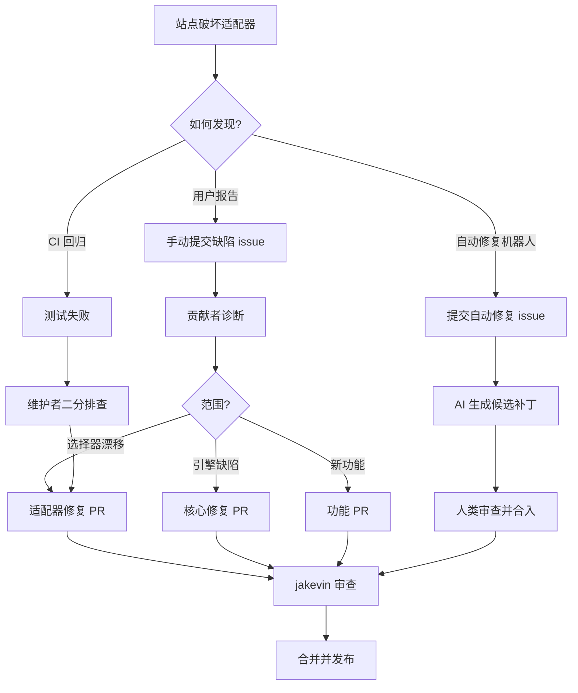

## 社区形态

查看[开放的 PR 列表](https://github.com/jackwener/opencli/pulls)（145 个开放，1,711 个已关闭），贡献者基础可分为三个层次：

1. **核心（1–2 人）** — jakevin 负责版本发布、核心引擎工作以及新适配器脚手架。这既是瓶颈也是保障：每个 PR 都经由他们合入。

2. **常客（10–15 人）** — 像 Vec、Zhongyue Lin、cat0825、Jiacheng、vecyang1 这样的贡献者，他们跨越多个 PR 周期持续贡献，并在特定适配器或子系统上积累领域专业知识。

3. **长尾（100+ 人）** — 大多数贡献者只提交单个 PR：一次适配器修复，一次打包改进，一次 Windows 可移植性补丁。这是健康的——这意味着项目的准入门槛低，人们无需理解完整架构即可贡献。

[自动修复系统](https://github.com/jackwener/OpenCLI/issues/2428) 增加了一个有趣的转折：OpenCLI 可以自动检测适配器故障并提交带有修复建议的 issue。标记为 `[autofix]` 的 issue（如 [#2408](https://github.com/jackwener/OpenCLI/issues/2408)、[#2428](https://github.com/jackwener/OpenCLI/issues/2428)、[#2421](https://github.com/jackwener/OpenCLI/issues/2421)）代表了项目自身的运行时自诊断故障。这将传统的 "用户报告缺陷 → 贡献者修复" 流程转变为更紧密的闭环，工具本身就能精确暴露故障模式。

## 此贡献者群体的非凡之处

大多数拥有 14K+ 星标的 CLI 工具都有企业支持或基金会背书。OpenCLI 两者皆无——它是一个人加上一个由站点特定专家组成的社区。其架构使这成为可能：适配器是隔离的（`clis/<site>/`），命令注册表会自动发现它们，并且测试夹具是按站点划分的。你可以在对 Twitter 适配器或浏览器桥接内部一无所知的情况下，贡献一个小红书修复。

这种架构隔离并非偶然。正是它让[长尾贡献者](https://github.com/jackwener/opencli/pulls?q=is%3Apr+is%3Aclosed)得以存在——也正是它让项目在适配器维护具有西西弗斯式特性的情况下仍具可持续性。每个站点终将再次出故障。问题在于，当故障发生时，了解该站点的贡献者是否还在。OpenCLI 的设计让*新*贡献者在老贡献者离开时能够轻松介入。

这才是贡献者名单背后的真实故事：不是英雄名册，而是一个让英雄主义变得不必要的系统。

---

<!-- zread:slug=7-architecture-overview -->
## 7. Architecture Overview（Deep Dive）


## 7. Architecture Overview（Deep Dive）

OpenCLI 是一个**统一的 CLI 接口**，能将任何网站、浏览器会话、Electron 应用或本地工具转换为确定性的命令行界面——人类与 AI Agent 皆可使用。其架构围绕五个内聚层展开：快速路径入口点、命令注册表、管道执行器、浏览器自动化桥接和可扩展系统。每一层均具备单一职责，并通过定义良好的接口进行通信，使得系统具备可组合性、可测试性及抗变性。

来源: [main.ts](/src/main.ts#L1-L183), [README.md](/README.md#L1-L18)

## 启动架构：两阶段引导

OpenCLI 采用**两阶段启动**策略以最小化感知延迟。第一阶段处理完全绕过完整发现的超快速路径；第二阶段仅在需要执行真实命令时，才支付完整的启动开销。

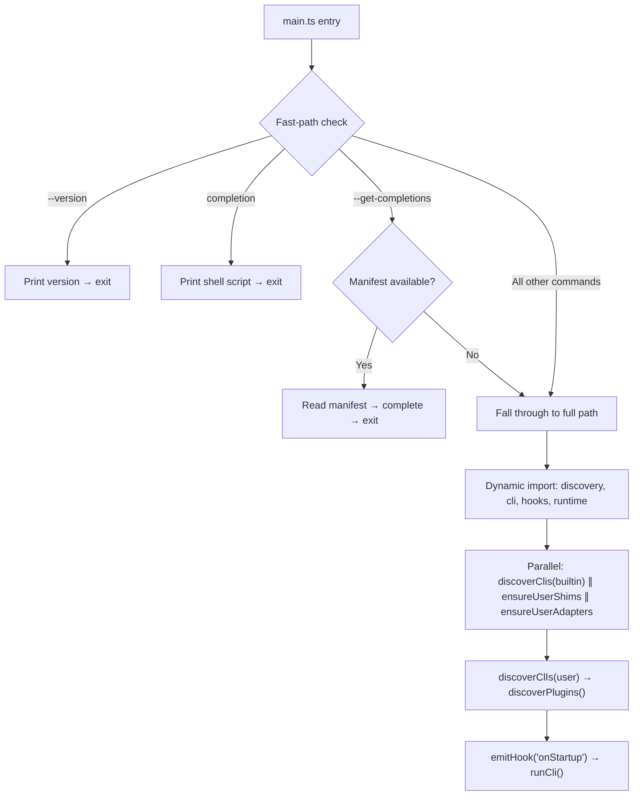

**阶段 1**（`main.ts` 第 35–97 行）仅针对预编译的 `cli-manifest.json` 执行同步文件读取，处理 `--version`、`completion` 和 `--get-completions`。无动态导入，无发现过程，无注册表——进程在微秒级内退出。

**阶段 2**（第 99–182 行）为完整启动路径。它动态导入所有重型模块（`discovery`、`cli`、`hooks`、`runtime`），随后并行化三个独立的 I/O 操作：内置适配器发现、用户目录 shim 设置及用户适配器目录创建。用户 CLI 发现运行于内置发现**之后**，以保持预期的覆盖顺序（当名称冲突时，用户适配器会遮蔽内置适配器）。插件发现最后运行，因为插件可能同时覆盖两者。

来源: [main.ts](/src/main.ts#L33-L129)

## 核心层：命令注册表

**命令注册表**是 OpenCLI 的中枢神经系统。它是一个存储在 `globalThis.__opencli_registry__` 上的全局单例 `Map<string, CliCommand>`，用于确保在所有模块副本间共享唯一实例——对于通过 `npm link` 或 `peerDependency` 符号链接加载的插件而言，这是一项关键设计决策，否则它们将在独立的模块图中创建重复的 `Map` 实例。

每个适配器——无论是内置、用户定义还是插件提供——均通过相同的 `cli()` 函数进行注册，该函数将命令规范化并将其插入注册表。键格式为 `site/name`（例如 `hackernews/top`），后续具有相同键的注册会覆盖先前的注册，从而确立确定性的**覆盖级联**：内置 → 用户 → 插件。

注册表的类型系统区分了**浏览器命令**（接收 `IPage` 接口）与**非浏览器命令**（纯参数操作）。这一区分驱动了每个下游层的能力路由、会话管理和执行策略。

| 字段 | 用途 | 示例 |
|-------|---------|---------|
| `site` | 命名空间 / 网站标识 | `hackernews` |
| `name` | 站点内的子命令 | `top` |
| `strategy` | 访问模式: `public`, `local`, `cookie`, `intercept`, `ui` | `cookie` |
| `browser` | 命令是否需要 `IPage` | `true` |
| `pipeline` | YAML 步骤定义（`func` 的替代方案） | `[{fetch: ...}, {select: ...}]` |
| `navigateBefore` | 预导航 URL 或会话标志 | `"https://x.com"` |
| `access` | 用于会话租约的读/写分类 | `read` |
| `args` | 用于验证与帮助的参数模式 | `[{name: "limit", type: "int"}]` |

`normalizeCommand()` 函数是将 `strategy` 解码为具体运行时字段（`browser`、`navigateBefore`）的**唯一权威**。规范化后，下游执行代码绝不直接读取 `cmd.strategy`——而是读取已解析的字段。覆盖优先级为：显式命令字段 > 策略派生默认值。

来源: [registry.ts](/src/registry.ts#L1-L200)

## 适配器发现：清单优先加载

适配器发现遵循**清单优先**策略并辅以文件系统回退。在生产环境（构建后）中，预编译的 `cli-manifest.json` 与 `clis/` 目录并存，无需加载任何 JavaScript 模块即可实现所有命令的即时注册。TypeScript 模块被标记为 `_lazy: true` 并存储其 `_modulePath`——仅在命令实际执行时才按需导入。

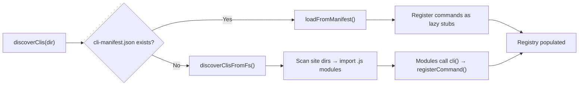

发现系统识别三种适配器来源：

| 来源 | 位置 | 加载方式 | 覆盖优先级 |
|--------|----------|---------|-------------------|
| **内置** | `<package-root>/clis/` | 清单（延迟）或文件系统扫描 | 最低 |
| **用户** | `~/.opencli/clis/` | 与内置相同 | 中（遮蔽内置） |
| **插件** | `~/.opencli/plugins/<name>/` | 逐插件子目录扁平扫描 | 最高（遮蔽所有） |

用户 CLI 的兼容性通过位于 `~/.opencli/node_modules/@jackwener/opencli` 的**符号链接 shim** 维持，该 shim 指向已安装的包根目录，允许用户适配器通过标准 Node.js ESM 解析执行 `import { cli } from '@jackwener/opencli/registry'`。

来源: [discovery.ts](/src/discovery.ts#L1-L194)

## 执行引擎：命令调度管道

当用户调用 `opencli hackernews top --limit 5` 时，执行流程将按照由 `execution.ts` 编排的验证、会话管理与调度步骤的精确序列进行：

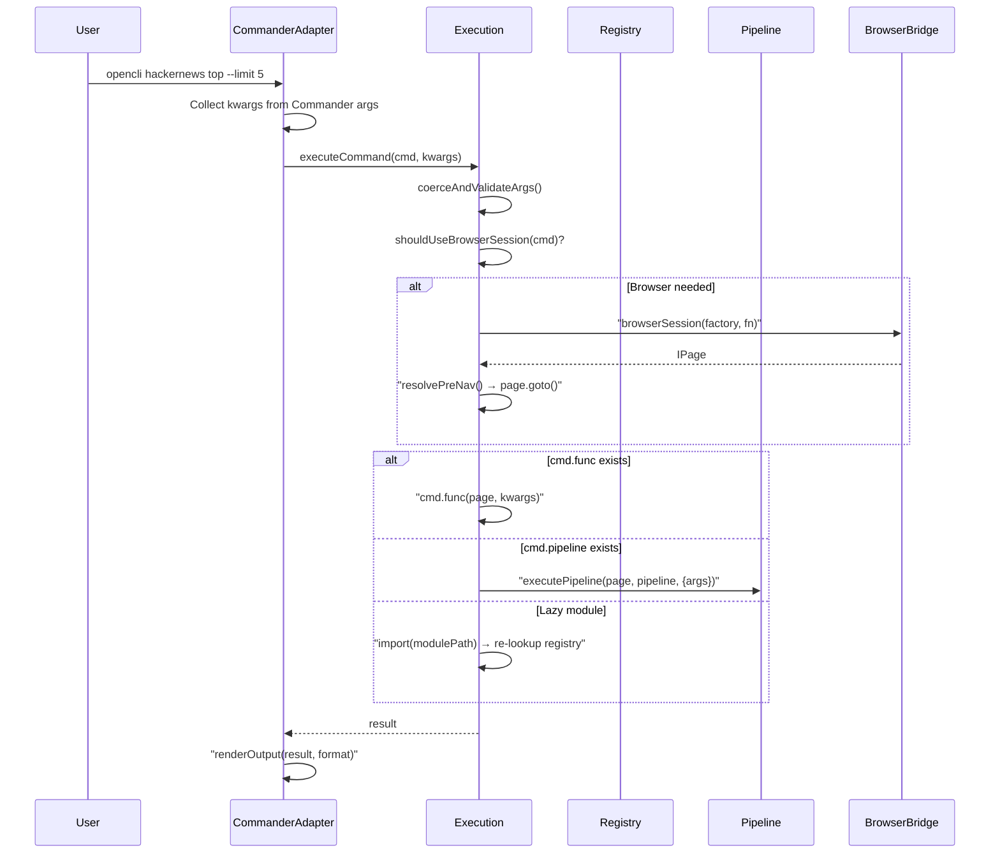

`executeCommand()` 函数是所有命令执行的**单一入口点**。它负责处理：(1) 依据 `Arg[]` 模式进行参数强制转换与验证，(2) 通过 `shouldUseBrowserSession()` 能力路由管理浏览器会话生命周期，(3) 针对基于 cookie 策略的域名预导航，(4) 超时强制执行，(5) 支持用户适配器热重载的延迟模块加载，以及 (6) 生命周期钩子触发（`onBeforeExecute`、`onAfterExecute`）。

**延迟加载与热重载**：当命令通过清单以 `_lazy: true` 注册时，其模块将在首次执行时导入。对于用户适配器，系统会跟踪文件 `mtime`，并在磁盘上的源文件发生更改时使缓存失效——无需重启守护进程即可实现适配器的迭代开发。

来源: [execution.ts](/src/execution.ts#L1-L200), [commanderAdapter.ts](/src/commanderAdapter.ts#L1-L150)

## 管道执行器：声明式适配器 DSL

管道系统提供了一种**声明式 YAML DSL**，作为命令式 JavaScript 函数的替代方案。每个管道都是一个有序的步骤序列，其中一步的输出将作为 `data` 输入至下一步。这使得适配器能够完全以数据形式表达——无需编写代码。

| 步骤类别 | 步骤 | 需要浏览器 |
|---------------|-------|-----------------|
| **导航与交互** | `navigate`, `click`, `type`, `fill`, `wait`, `press` | ✅ |
| **观察** | `snapshot`, `evaluate`, `intercept` | ✅ |
| **数据获取** | `fetch` | ❌ |
| **转换** | `select`, `map`, `filter`, `sort`, `limit` | ❌ |
| **控制流** | `tap`, `download` | ❌ / ✅ |

管道注册表是**动态可扩展的**——插件可调用 `registerStep()` 以添加自定义操作。`capabilityRouting` 模块维护了一个 `BROWSER_ONLY_STEPS` 集合，该集合作为完整注册表的子集接受验证，确保系统能在无需检查步骤内部细节的情况下，准确判断某管道是否需要浏览器会话。

**步骤重试**：纯浏览器步骤在遇到瞬态错误（例如元素尚未挂载）时会自动重试最多 2 次，两次尝试间隔 1 秒。非浏览器步骤默认不进行重试。

来源: [pipeline/executor.ts](/src/pipeline/executor.ts#L1-L111), [pipeline/registry.ts](/src/pipeline/registry.ts#L1-L76), [capabilityRouting.ts](/src/capabilityRouting.ts#L1-L56)

## 浏览器自动化：守护进程桥接架构

OpenCLI 的浏览器自动化采用**微守护进程**架构，通过轻量级 HTTP + WebSocket 守护进程及配套的 Chrome 扩展，在 CLI 进程与 Chrome 之间建立桥接：

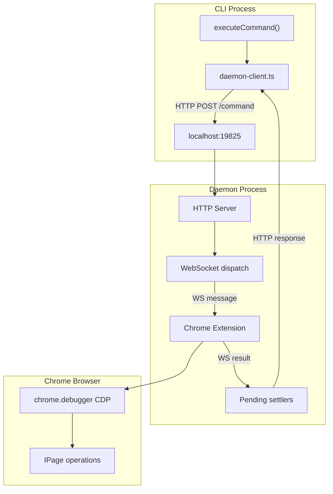

守护进程提供了**深度防御安全**：(1) 源检查拒绝非扩展来源，(2) 要求自定义 `X-OpenCLI` 头，(3) 命令端点无 CORS 头，(4) 1 MB 请求体大小限制，以及 (5) WebSocket 在升级前执行 `verifyClient` 拒绝。

**会话租约**将针对同一 Chrome 标签页的并发写入命令序列化。`SessionLeaseRegistry` 通过基于 TTL 的过期机制追踪活跃持有者，因此崩溃的 CLI 进程无法永久锁定标签页。若持有陈旧租约的持有者仍有命令在执行中，则视为活跃——命令完成结算会刷新租约 TTL。

**`IPage` 接口**是浏览器操作的统一抽象。它定义了涵盖导航、DOM 交互（`click`、`fillText`、`typeText`）、观察（`snapshot`、`evaluate`）、网络捕获、标签页管理及 CDP 透传的 40 余种方法。所有管道步骤与适配器函数均针对此接口操作，使其与底层传输机制解耦。

来源: [daemon.ts](/src/daemon.ts#L1-L100), [types.ts](/src/types.ts#L72-L157), [runtime.ts](/src/runtime.ts#L1-L80)

## 策略模型：适配器如何访问数据

`Strategy` 枚举定义了五种访问模式，决定了适配器从目标网站检索数据的方式：

| 策略 | 机制 | 需要浏览器 | 典型用途 |
|----------|-----------|---------------|-------------|
| `PUBLIC` | 直接 HTTP 获取（无需认证） | ❌ | 公开 API，RSS 订阅源 |
| `LOCAL` | 本地二进制调用 | ❌ | `gh`、`docker`，CLI 工具 |
| `COOKIE` | 携带 cookie 的浏览器上下文获取 | ✅ | 需认证的 API 端点 |
| `INTERCEPT` | 导航 + 拦截网络响应 | ✅ | 包含 XHR/SPA 模式的站点 |
| `UI` | 完整 DOM 交互（点击、填充、提取） | ✅ | 无 API 端点的站点 |

`normalizeCommand()` 函数将策略展开为具体的运行时字段。例如，`domain` 为 `"x.com"` 的 `COOKIE` 策略会设置 `navigateBefore: "https://x.com"`——执行引擎将预导航至该 URL，确保浏览器的 cookie jar 已填充，以便后续的 `fetchJson()` 调用。`INTERCEPT` 策略设置 `navigateBefore: true`，表明需要经过认证的浏览器上下文，但没有具体的预导航 URL。

来源: [registry.ts](/src/registry.ts#L7-L13), [registry.ts](/src/registry.ts#L184-L200)

## 可扩展层：插件、技能与钩子

OpenCLI 提供了三种互补的可扩展机制：

**插件**是从 Git 仓库、本地目录或单体仓库安装的独立包。它们位于 `~/.opencli/plugins/<name>/`，可以注册命令、生命周期钩子及自定义管道步骤。插件系统管理安装、版本锁定（`plugins.lock.json`）、兼容性检查及卸载。在命令注册表中，插件具有**最高覆盖优先级**。

**AI Agent 技能**是基于 Markdown 的知识包（例如 `opencli-browser`、`opencli-adapter-author`、`opencli-autofix`），用于指导 Claude Code 或 Cursor 等 AI 编码 Agent。每项技能位于 `skills/<name>/` 目录，包含一个 `SKILL.md` 前置元数据文件及可选的辅助文档。它们通过 `opencli skills read <skill>` 读取，并注入到 Agent 上下文中。

**生命周期钩子**采用与命令注册表相同的 `globalThis` 单例模式，以确保跨模块实例的一致性。提供三个钩子点：

| 钩子 | 时机 | 用例 |
|------|--------|-----------|
| `onStartup` | 所有发现完成后，首个命令执行前 | 初始化外部服务，注册自定义步骤 |
| `onBeforeExecute` | 每次命令执行前 | 日志记录，参数修改，访问控制 |
| `onAfterExecute` | 每次命令执行后 | 指标收集，结果后处理 |

钩子处理程序被 try/catch 包裹——失败的钩子**绝不阻塞**命令执行，从而维持系统的故障隔离保证。

来源: [plugin.ts](/src/plugin.ts#L1-L69), [skills.ts](/src/skills.ts#L1-L42), [hooks.ts](/src/hooks.ts#L1-L92)

## 架构原则

| 原则 | 实现 |
|-----------|---------------|
| **单例一致性** | 注册表与钩子使用 `globalThis` 以在跨符号链接边界的模块去重中存活 |
| **覆盖级联** | 内置 → 用户 → 插件，采用后注册者胜出的语义 |
| **默认延迟** | 基于清单的发现将模块加载推迟至执行时 |
| **能力路由** | 策略与管道分析决定浏览器需求，无需运行时探测 |
| **故障隔离** | 钩子被防火墙隔离；瞬态浏览器错误触发步骤级重试；守护进程租约自动过期 |
| **并行启动** | 独立 I/O 操作通过 `Promise.all` 并发运行以缩减启动时间 |

<CgxTip>`globalThis.__opencli_registry__` 模式绝非偶然——它是使插件在通过 `npm link` 加载时仍能正确工作的关键枢纽。若无此机制，每个模块副本将拥有各自的空 `Map`，插件注册的命令将从 CLI 视图中消失。此模式同样适用于钩子存储。</CgxTip>

<CgxTip>编写新适配器时，选择正确的 `strategy` 是最具影响力的设计决策。`PUBLIC` 适配器启动极快（无需浏览器会话）。`COOKIE` 适配器速度快但需登录。`INTERCEPT` 与 `UI` 适配器最为强大，但需支付完整的浏览器会话开销。基于管道的适配器（使用 `pipeline` 字段而非 `func`）在遇到瞬态浏览器错误时，会自动执行步骤级重试。</CgxTip>

## 接下来去往何处

架构概述确立了概念框架。若要深入了解特定子系统：

- **[命令注册表系统](8-command-registry-system)** — `cli()`、`normalizeCommand()` 及覆盖级联的详细工作原理
- **[管道执行器](9-pipeline-executor)** — YAML DSL、步骤处理程序、模板渲染及重试语义
- **[适配器发现与加载](10-adapter-discovery-and-loading)** — 清单编译、文件系统回退及插件扫描
- **[浏览器桥接与守护进程](11-browser-bridge-and-daemon)** — 守护进程协议、会话租约及配置文件管理
- **[管道 DSL 语法](14-pipeline-dsl-syntax)** — 编写基于管道适配器的实用参考
- **[插件系统](17-plugin-system)** — 插件清单、安装及生命周期

---

<!-- zread:slug=8-command-registry-system -->
## 8. Command Registry System（Deep Dive）

> [!warning] 此页获取失败：请求超时（>120s）：opencli read jackwener/opencli --slug 8-command-registry-system --lang zh
> zread 服务端偶发故障。重跑同一命令可断点续跑（已成功页自动跳过）。

---

<!-- zread:slug=9-pipeline-executor -->
## 9. Pipeline Executor（Deep Dive）


## 9. Pipeline Executor（Deep Dive）

**流水线执行器**（Pipeline Executor）是 OpenCLI 适配器运行时的核心顺序步骤求值引擎。它将声明式的 YAML 步骤列表转换为命令式的数据流计算，通过解析模板表达式、强制执行浏览器能力约束以及应用瞬态错误重试语义，将可变的 `data` 值依次穿透传递给每个步骤。使用 YAML DSL 编写的每个适配器最终都会汇聚于此执行器——理解其运行机制对于调试、扩展和优化适配器流水线至关重要。

## 执行模型

流水线执行器处理一个有序的步骤对象数组，其中每个对象仅包含一个映射到其参数的操作键。**单个可变的 `data` 值**在所有步骤中依次传递：步骤 *N* 的返回值将成为步骤 *N+1* 的输入 `data`。这种累加器模式意味着流水线的最终输出就是其最后一步的返回值。

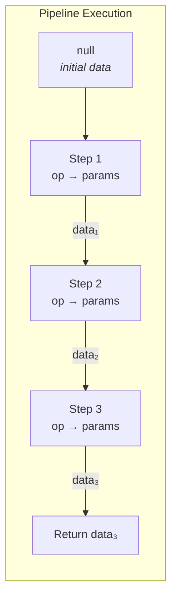

`executePipeline` 中的核心循环会迭代每个步骤，通过 `Object.entries(step)` 解析其操作键和参数，通过 `getStep(op)` 查找已注册的处理程序，并将 `data` 替换为该处理程序的返回值。如果处理程序未注册，则会立即抛出 `ConfigError`，并附带步骤索引和修复提示。当出现任何未处理的异常时，执行器会尝试通过 `page.closeWindow()` 释放浏览器标签页租约，然后重新抛出异常——从而防止在流水线失败时出现孤立的自动化窗口。

来源: [executor.ts](/src/pipeline/executor.ts#L23-L55)

## 步骤处理程序契约

每个流水线步骤——无论是内置的还是通过插件注册的——都遵循统一的 `StepHandler` 签名：

| 参数 | 类型 | 用途 |
|-----------|------|---------|
| `page` | `IPage \| null` | 浏览器会话；对于纯数据步骤为 `null` |
| `params` | `unknown` | 来自 YAML 步骤定义的原始参数 |
| `data` | `unknown` | 从上一步累积的数据 |
| `args` | `Record<string, unknown>` | 通过 `PipelineContext` 传递的 CLI 参数 |

处理程序返回 `Promise<unknown>`——其解决值将成为下一步的 `data` 输入。浏览器交互步骤（navigate、click、evaluate 等）需要非空 `page`，并将调用 `IPage` 接口上的方法。纯数据转换步骤（select、map、filter、sort、limit）完全忽略 `page`，使其能够在无头/非浏览器上下文中运行。

来源: [registry.ts](/src/pipeline/registry.ts#L18-L24)

## 步骤注册表与动态扩展

步骤注册表是一个 `Map<string, StepHandler>`，在模块加载时用所有核心步骤填充。`registerStep(name, handler)` 函数被公开导出，允许插件和外部模块在流水线执行开始前注入自定义操作。

**核心注册步骤**——在导入时自动注册：

| 类别 | 步骤名称 | 需要浏览器 |
|----------|-----------|-----------------|
| **浏览器交互** | `navigate`, `click`, `type`, `fill`, `wait`, `press`, `snapshot`, `evaluate` | ✅ |
| **网络** | `fetch`, `intercept`, `tap` | `fetch`: 视情况而定；其他: ✅ |
| **数据转换** | `select`, `map`, `filter`, `sort`, `limit` | ❌ |
| **I/O** | `download` | ❌ (但在可用时使用浏览器 cookies) |

`getRegisteredStepNames()` 函数返回所有当前的键——`validate.ts` 使用它来将步骤名称加入白名单，而无需维护并行的硬编码列表。能力路由中的 `BROWSER_ONLY_STEPS` 集合在测试时被验证为已注册步骤的严格子集，确保在步骤重命名或移除后不会遗留过时的仅限浏览器声明。

来源: [registry.ts](/src/pipeline/registry.ts#L44-L76), [capabilityRouting.ts](/src/capabilityRouting.ts#L14-L26)

## 重试与瞬态错误处理

每个步骤的执行都包裹在 `executeStepWithRetry` 中，它应用了可配置的重试策略：

- **仅限浏览器的步骤**默认重试 **2 次**（共 3 次尝试）
- **所有其他步骤**默认重试 **0 次**（立即失败）
- `PipelineContext` 中的自定义 `stepRetries` 会覆盖所有步骤的默认设置
- 重试**仅在发生瞬态浏览器错误时触发**——非瞬态失败会立即传播
- 重试尝试之间有 1 秒的延迟，以允许浏览器会话稳定下来

瞬态错误分类使用 `isTransientBrowserError()`，它能识别 CDP 断开连接、导航超时以及类似的短暂等待后可自我恢复的条件。这种设计确保了不稳定的浏览器交互（在动态 SPA 中很常见）能够优雅地恢复，而不会掩盖适配器定义中真正的逻辑错误。

来源: [executor.ts](/src/pipeline/executor.ts#L57-L77)

## 模板引擎 (${{ }} 表达式)

模板引擎在每个步骤处理程序执行之前解析步骤参数内的 `${{ ... }}` 表达式。它按递增的成本和能力分为三个解析层级操作：

### 第 1 层：点路径解析
像 `args.limit`、`item.title`、`data.items.0` 这样的简单属性查找，通过遍历上下文对象来解析，无需任何 JS 求值。根命名空间为 `args`（CLI 参数）、`item`（当前迭代项）、`data`（累加器）、`root`（`select` 之前的原始数据）和 `index`（循环计数器）。无前缀的路径隐式解析为 `item`。

### 第 2 层：管道过滤器
表达式支持 Jinja2 风格的管道语法：`expr | filter1 | filter2(arg)`。管道在单个 `|`（而不是 `||`）上分割，因此逻辑 OR 可以自然共存。内置过滤器：

| 过滤器 | 示例 | 描述 |
|--------|---------|-------------|
| `default(val)` | `item.x \| default(0)` | null/undefined/空值的回退 |
| `join(sep)` | `item.tags \| join(,)` | 数组转字符串 |
| `upper` / `lower` | `item.name \| upper` | 大小写转换 |
| `truncate(n)` | `item.text \| truncate(50)` | 使用 `...` 截断 |
| `replace(old,new)` | `item.path \| replace(/,_)` | 字符串替换 |
| `length` | `item.list \| length` | 数组/字符串长度 |
| `first` / `last` | `item.rows \| first` | 数组的首/尾元素 |
| `keys` | `item \| keys` | 对象键 |
| `json` | `item \| json` | JSON 序列化 |
| `slugify` | `item.title \| slugify` | URL 安全的 slug |
| `sanitize` | `item.name \| sanitize` | 文件名安全字符 |
| `urlencode` / `urldecode` | `item.q \| urlencode` | URL 编码 |

### 第 3 层：沙箱化 JS 求值
复杂表达式（三元运算、算术运算、`||`、`??`、方法调用）会穿透至 `node:vm` 沙箱。该沙箱：

- **切断原型链**，通过 `sanitizeContext()`（带有 BigInt 强制转换的 JSON 往返转换），防止 `constructor.constructor('return process')()` 逃逸
- **缓存编译后的 `vm.Script` 对象**在 LRU 限制的映射中（最多 256 个条目），以避免在循环中重新编译
- **在求值之间复用单个 V8 上下文**——`vm.createContext()` 每次调用耗时约 0.3 毫秒；复用消除了在评估数百个项的 `map`/`filter` 循环中的这种开销
- **阻止禁止的模式**：`constructor`、`__proto__`、`prototype`、`globalThis`、`process`、`require`、`import`、`eval`
- **强制每个表达式 50 毫秒的超时**和 2000 字符的长度限制
- **在求值之间清理非白名单沙箱键**，以防止 `${{ x = 42 }}` 将 `x` 泄漏到后续调用中

来源: [template.ts](/src/pipeline/template.ts#L1-L97), [template.ts](/src/pipeline/template.ts#L200-L341)

## 步骤类别深入探讨

### 浏览器交互步骤

这些步骤需要活跃的 `IPage` 会话，并构成浏览器自动化的骨干：

| 步骤 | 参数 | 数据流 |
|------|-----------|-----------|
| `navigate` | `{ url, waitUntil, settleMs }` 或字符串 URL | 保留传入的 `data` |
| `click` | 选择器字符串（去除前导 `@`） | 保留传入的 `data` |
| `type` | `{ ref, text, submit }` | 保留传入的 `data` |
| `fill` | `{ ref, text, submit }` | 保留传入的 `data` |
| `wait` | 数字（毫秒），`{ text, timeout }`，或 `{ time }` | 保留传入的 `data` |
| `press` | 按键名称字符串 | 保留传入的 `data` |
| `snapshot` | `{ interactive, compact, max_depth, raw }` | **替换** `data` 为 DOM 快照 |
| `evaluate` | JS 源码字符串 | **替换** `data` 为求值结果 |

请注意关键区别：`navigate`、`click`、`type`、`fill`、`wait` 和 `press` 是**副作用步骤**，它们执行浏览器操作但**保留传入的数据**——它们不会覆盖累加器。相比之下，`snapshot` 和 `evaluate` 用其返回值**替换**数据。这种区别决定了适配器如何链式调用步骤：获取 API 数据的 `evaluate` 必须位于任何转换步骤之前，而 navigation/click 步骤可以自由穿插其中而不会导致数据丢失。

来源: [browser.ts](/src/pipeline/steps/browser.ts#L1-L87)

### 数据转换步骤

重塑累加器而不进行浏览器交互的纯函数：

- **`select`**——从 `data` 中提取点路径（例如，`data.list` → 数组）。遍历对象和数字数组索引。
- **`map`**——数组上的逐项投影。支持内联 `select` 以在映射前提取嵌套数组。每次迭代将 `item` 和 `index` 暴露给模板上下文，加上用于访问 select 前原始数据的 `root`。
- **`filter`**——保留表达式求值为真的数组项。
- **`sort`**——按键排序，使用 `localeCompare({ numeric: true })` 实现自然数字排序。支持 `order: 'desc'`。非变异操作（排序前展开）。
- **`limit`**——将数组切片为 N 项。接受模板表达式以实现动态限制。

来源: [transform.ts](/src/pipeline/steps/transform.ts#L1-L72)

### 网络步骤

- **`fetch`**——HTTP API 请求，具有两种执行模式：单 URL 获取和按项批量获取。当 `data` 是数组且 URL 模板包含 `item` 时，它为每个项渲染一个 URL。在浏览器上下文中，批量获取使用 **`fetchBatchInBrowser`**——一个单独的 `evaluate()` 调用，在 V8 引擎内注入一个并发工作池，从而消除 N-1 次跨进程 IPC 往返。在没有浏览器的情况下，它会回退到使用 Node.js `fetch()` 的 `mapConcurrent`。支持 `concurrency`、`method`、`params` 和 `headers` 选项。

- **`intercept`**——声明式 XHR 拦截：在触发操作前注入 fetch/XHR 代理，执行触发器（`navigate:`、`evaluate:`、`click:` 或 `scroll`），等待与 URL 模式匹配的捕获响应，然后可选地从结果中 `select` 嵌套路径。

- **`tap`**——SPA 框架的 Store Action Bridge：按名称定位 Pinia 或 Vuex 存储，调用 store action，使用双重 fetch/XHR 拦截捕获由该 action 触发的网络响应，并可选地从结果中子选择。自动生成一个自包含的 IIFE，在 `finally` 块中处理设置、action 调用、捕获等待和清理。

来源: [fetch.ts](/src/pipeline/steps/fetch.ts#L1-L144), [intercept.ts](/src/pipeline/steps/intercept.ts#L1-L68), [tap.ts](/src/pipeline/steps/tap.ts#L1-L117)

### I/O 步骤

- **`download`**——具有并发控制、进度跟踪、文件名模板和 cookie 转发的文件下载。支持直接 HTTP 下载、针对视频平台的 yt-dlp 集成、用于认证下载的 Netscape 格式浏览器 cookie 导出以及去重。每个下载的项都会被扩充一个 `_download` 子对象，其中包含 `status`、`path`、`size` 和 `duration`。

来源: [download.ts](/src/pipeline/steps/download.ts#L1-L90)

## 能力路由

在流水线执行之前，`shouldUseBrowserSession()` 确定是否需要浏览器会话。对于基于流水线的命令，它根据 `BROWSER_ONLY_STEPS` 检查每个步骤的操作键。如果没有步骤需要浏览器，流水线可以在纯数据模式下运行——无需启动 Chrome，无需扩展握手，无需 CDP 连接。此优化对于从不接触页面的仅 API 适配器至关重要。

子集关系（`BROWSER_ONLY_STEPS ⊆ registeredSteps`）由能力路由测试套件中的 `_validateBrowserOnlyStepsAgainstRegistry()` 验证，确保每个声明的仅限浏览器步骤实际存在于注册表中。

来源: [capabilityRouting.ts](/src/capabilityRouting.ts#L1-L56)

## 与命令执行的集成

流水线执行器通过 `execution.ts` 中的 `runCommand()` 内的两条路径被调用：

1. **延迟加载的适配器**：当命令具有 `_lazy: true` 和 `_modulePath` 时，执行器首先动态导入适配器模块（通过 mtime 跟踪为用户适配器提供热重载支持），然后对新加载的命令定义调用 `executePipeline(page, updated.pipeline, { args, debug })`。

2. **预先加载的命令**：当 `cmd.pipeline` 已被填充时，执行器直接调用 `executePipeline(page, cmd.pipeline, { args, debug })`。

在这两种情况下，对于非浏览器命令，`page` 参数为 `null`，对于浏览器命令，则是活跃的 `IPage` 实例。`args` 对象携带完整验证/强制转换的 CLI 参数。`debug` 标志启用每步日志记录，显示操作名称、参数预览和结果形状（项数、字典键或字符串预览）。

来源: [execution.ts](/src/execution.ts#L80-L109)

<CgxTip>在编写 YAML 适配器时，请记住**有副作用的浏览器步骤（navigate、click、type、fill、wait、press）保留传入的数据**，而**产生数据的步骤（evaluate、snapshot、fetch、intercept、tap、download）替换它**。可以自由穿插导航，但始终确保数据产生步骤位于你的转换链之前。</CgxTip>

<CgxTip>模板引擎的**管道过滤器语法**（`item.name | upper | truncate(30)`）在 VM 沙箱路径之前解析，使其既更安全又更快速。尽可能优先使用管道而不是原始 JS 表达式——它们完全避免了 50 毫秒的 VM 超时和沙箱开销。</CgxTip>

## 调试观察

当在 `PipelineContext` 中设置 `debug: true` 时，执行器会发出结构化的步骤级日志：

- **每步之前**：步骤编号、总计数、操作名称和参数预览（字符串截断至 80 个字符，或对象键列表）
- **每步之后**：结果形状摘要——数组的项数、对象的键列表、标量的字符串预览，或 null 的 `(no data)`

此输出流经 `log.step()` 和 `log.stepResult()`，在适配器开发期间无需修改适配器定义即可实现实时流水线追踪。

来源: [executor.ts](/src/pipeline/executor.ts#L79-L111)

## 架构概览

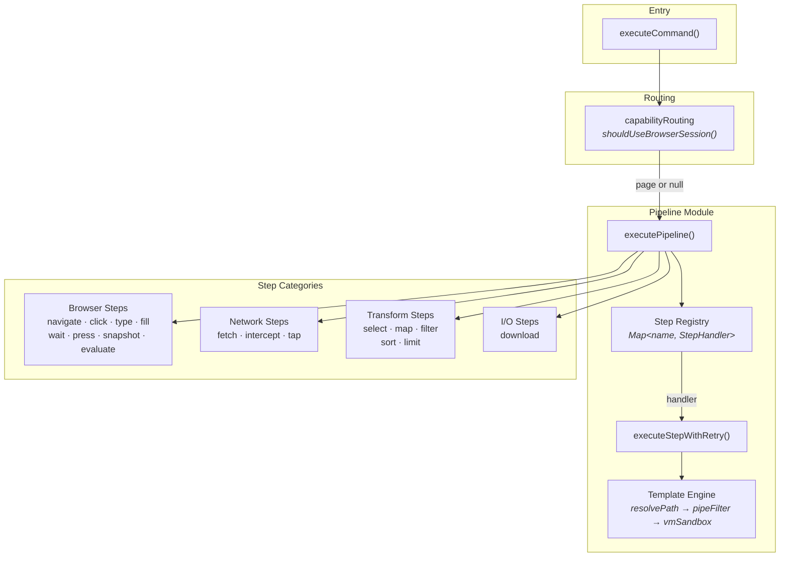

流水线执行器位于命令执行层和步骤处理程序之间，提供编排骨干，用于传递数据、解析模板、应用重试和路由浏览器会话。其步骤注册表架构支持开放扩展——插件在执行前通过 `registerStep()` 注册自定义步骤，能力路由器自动发现这些步骤是否需要浏览器会话。

有关定义这些流水线的 YAML DSL 语法，请参见 [Pipeline DSL Syntax](14-pipeline-dsl-syntax)。有关适配器在流水线执行前如何被发现和加载，请参见 [Adapter Discovery & Loading](10-adapter-discovery-and-loading)。有关在整个命令执行前后触发的生命周期钩子（包裹流水线），请参见 [Lifecycle Hooks](19-lifecycle-hooks)。

---

