# jackwener/opencli — zread.ai 解读
<!-- zread:slug=1-overview -->
## 1. Overview（Get Started）

**OpenCLI** 能将任意网站转换为命令行界面，并让 AI 代理操作你已登录的 Chrome 浏览器。它为三种自动化范式提供了统一的操作界面：针对 100+ 网站的内置适配器、面向 AI 代理的按需浏览器驱动，以及端到端的适配器编写工作流。无论你是编写自动化脚本处理重复性 Web 任务的开发者、在需认证页面中导航的 AI 代理，还是将网站访问模式代码化的适配器编写者——OpenCLI 都能为你提供确定性的 CLI，取代脆弱的浏览器会话。

来源: [README.md](/README.md#L1-L40), [package.json](/package.json#L1-L10)

## OpenCLI 的功能

OpenCLI 弥合了 Web 的交互特性与 CLI 的可组合性。其核心在于将**每个网站视为一个可调用命令**，具备结构化参数、确定性输出及可配置的认证策略。这之所以可行，是因为 OpenCLI 通过轻量级扩展和本地守护进程维持着与你 Chrome 浏览器的实时连接——这意味着你现有的登录会话、Cookie 和页面状态无需手动认证即可供每个命令使用。

该系统支持共享同一运行时的三种不同用例：

| 用例 | 工作原理 | 示例 |
|----------|-------------|---------|
| **内置适配器** | 针对热门网站预编写的命令，以 `opencli <site> <command>` 调用 | `opencli hackernews top --limit 5` |
| **AI 代理浏览器驱动** | 为你的 AI 代理安装技能；代理通过你的 Chrome 发送浏览器原语 | "查看我的小红书通知" |
| **适配器编写** | 使用 `opencli-adapter-author` 技能来搭建、编写并验证新适配器 | "为抖音热搜编写一个适配器" |

来源: [README.md](/README.md#L6.0-L19), [src/main.ts](/src/main.ts#L1-L30)

## 架构概览

OpenCLI 的架构遵循 **发现 → 注册 → 执行** 的流水线，并采用双路径启动（简单命令走快速路径，适配器命令走完整路径）。Chrome 浏览器桥接扩展通过 WebSocket 与本地守护进程通信，该进程为活跃的浏览器会话提供 CDP（Chrome 开发者协议）访问。

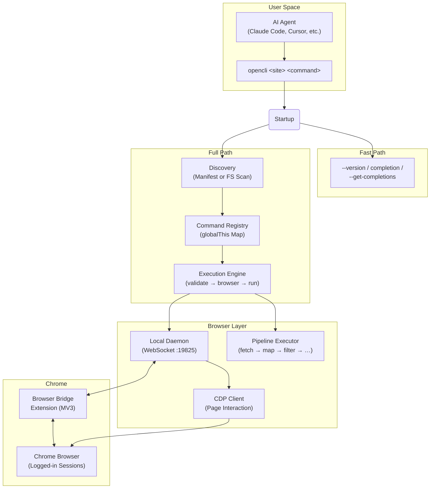
```mermaid
graph TB
    subgraph CLI9["User Space"]
        CMD["opencli &lt;site&gt; &lt;command&gt;"]
        AI["AI Agent<br/>(Claude Code, Cursor, etc.)"]
    end

    sub(Startup)

    subgraph "Fast Path"
        FP["--version / completion /<br/>--get-completions"]
    end

    subgraph "Full Path"
        DISC["Discovery<br/>(Manifest or FS Scan)"]
        REG["Command Registry<br/>(globalThis Map)"]
        EXEC["Execution Engine<br/>(validate → browser → run)"]
    end

    subgraph "Browser Layer"
        DAEMON["Local Daemon<br/>(WebSocket :19825)"]
        CDP["CDP Client<br/>(Page Interaction)"]
        PIPE["Pipeline Executor<br/>(fetch → map → filter → …)"]
    end

    subgraph "Chrome"
        EXT["Browser Bridge<br/>Extension (MV3)"]
        CHROME["Chrome Browser<br/>(Logged-in Sessions)"]
    end

    CMD --> sub
    sub --> FP
    sub --> DISC
    DISC --> REG
    REG --> EXEC
    EXEC --> PIPE
    EXEC --> DAEMON
    AI --> CMD
    DAEMON <--> EXT
    EXT <--> CHROME
    DAEMON --> CDP
    CDP --> CHROME
```

来源: [src/main.ts](/src/main.ts#L48-L90), [src/registry.ts](/src/registry.ts#L1-L40), [src/execution.ts](/src/execution.ts#L1-L30), [extension/manifest.json](/extension/manifest.json#L1-L42)

## 核心组件

### 命令注册表

注册表是 OpenCLI 的核心——一个以 `site/name` 为键的**全局单例 `Map<string, CliCommand>`**。每个适配器无论是内置还是用户自定义，均通过 `cli()` 函数在此注册。注册表保存命令的元数据（site、name、strategy、args、columns、pipeline），并根据声明的 `strategy` 判定命令是否需要浏览器会话。

**五种认证策略**决定了命令与浏览器的交互方式：

| 策略 | 需要浏览器 | 描述 |
|----------|:----------------:|-------------|
| **PUBLIC** | ✗ | 无需认证；纯 HTTP/fetch（如 HackerNews API） |
| **LOCAL** | ✗ | 本地二进制文件或工具；不涉及浏览器 |
| **COOKIE** | ✓ | 使用 Chrome 的 Cookie；预先导航至对应域 |
| **INTERCEPT** | ✓ | 在页面加载期间拦截网络请求 |
| **UI** | ✓ | 直接自动化浏览器 UI（点击、输入、提取） |

来源: [src/registry.ts](/src/registry.ts#L9-L20), [src/registry.ts](/src/registry.ts#L95-L150)

### 发现系统

OpenCLI 采用针对启动速度优化的**双路径发现**系统。在生产环境中，预编译的 `cli-manifest.json` 实现了即时注册——适配器 JS 模块仅在其命令首次执行时延迟加载。在开发环境中，则通过文件系统扫描动态发现 `.js` 适配器文件。发现过程并行运行：内置适配器、用户适配器设置（`ensureUserCliCompatShims`、`ensureUserAdapters`）与插件发现相互协调，确保**用户适配器覆盖内置适配器**，且**插件覆盖前两者**。

来源: [src/discovery.ts](/src/discovery.ts#L1-L30), [src/discovery.ts](/src/discovery.ts#L82-L140)

### 流水线执行器

流水线是 OpenCLI 的**声明式 DSL，用于组合适配器逻辑**，无需编写命令式 JavaScript。流水线是一个有序的步骤数组——`fetch`、`map`、`filter`、`limit`、`sort`、`navigate`、`click`、`fill`、`intercept`、`download`、`tap`、`transform` 等——按顺序执行，将数据从一步传递至下一步。模板表达式（如 `${{ item.title }}`）可插值流水线状态。仅限浏览器的步骤（`navigate`、`click`、`type`、`fill`、`wait` 等）会通过能力路由自动触发浏览器会话。瞬态浏览器错误将触发自动重试（默认最多 2 次）。

以下是 HackerNews `top` 适配器使用纯 fetch 流水线的示例——无需浏览器：

```js
cli({
    site: 'hackernews', name: 'top', strategy: Strategy.PUBLIC, browser: false,
    pipeline: [
        { fetch: { url: 'https://hacker-news.firebaseio.com/v0/topstories.json' } },
        { limit: '${{ Math.min((args.limit ?? 20) + 10, 50) }}' },
        { map: { id: '${{ item }}' } },
        { fetch: { url: 'https://hacker-news.firebaseio.com/v0/item/${{ item.id }}.json' } },
        { filter: 'item.title && !item.deleted && !item.dead' },
        { map: { rank: '${{ index + 1 }}', id: '${{ item.id }}', title: '${{ item.title }}' } },
        { limit: '${{ args.limit }}' },
    ],
});
```

来源: [src/pipeline/executor.ts](/src/pipeline/executor.ts#L1-L50), [src/capabilityRouting.ts](/src/capabilityRouting.ts#L1-L56), [clis/hackernews/top.js](/clis/hackernews/top.js#L1-L32)

### 浏览器桥接与守护进程

**Chrome 扩展**（Manifest V3）安装在你的浏览器中，并通过 19825 端口的 WebSocket 将 CDP 访问权限暴露给 OpenCLI 的**本地守护进程**。守护进程管理标签页租约、会话上下文和命令路由。当需要浏览器支持的命令运行时，OpenCLI 通过守护进程发送 CDP 指令与页面交互——导航、快照无障碍树、点击元素、填写表单、提取数据及拦截网络响应。守护进程在需要时自动启动，并支持多配置文件的 Chrome 设置。

来源: [extension/manifest.json](/extension/manifest.json#L1-L42), [src/browser/daemon-client.ts](/src/browser/daemon-client.ts#L1-L1), [src/browser/bridge.ts](/src/browser/bridge.ts#L1-L1)

## 适配器生态

OpenCLI 内置了 **100+ 适配器**，涵盖社交媒体、搜索、电商、金融、AI 工具、学术数据库等领域。每个适配器以 `.js` 文件形式位于 `clis/<site>/` 下，调用 `cli()` 完成自注册。适配器按策略分类——`PUBLIC` 适配器无需浏览器（纯 API 调用），而 `COOKIE`/`INTERCEPT`/`UI` 适配器则利用浏览器桥接进行认证访问。

| 类别 | 示例站点 | 典型策略 |
|----------|--------------|-----------------|
| **社交与内容** | xiaohongshu, bilibili, zhihu, reddit, twitter, weibo | COOKIE / UI |
| **搜索与参考** | hackernews, google, duckduckgo, wikipedia | PUBLIC / COOKIE |
| **电商** | taobao, jd, amazon, booking, 1688 | COOKIE / INTERCEPT |
| **AI 与开发工具** | chatgpt, claude, gemini, cursor, codex | UI (Electron) |
| **学术** | arxiv, google-scholar, pubmed, semanticscholar | PUBLIC / COOKIE |
| **金融与加密** | eastmoney, binance, coingecko, yahoo-finance | PUBLIC / COOKIE |
| **求职与职场** | linkedin, boss, indeed, upwork, maimai | COOKIE / UI |

来源: [README.md](/README.md#L210-L240), [clis/](/clis/)

## AI 代理技能

OpenCLI 提供 **六种技能**，可安装至 AI 代理（Claude Code、Cursor 等）中，赋予其浏览器自动化能力。这些技能将自然语言意图转换为确定性的 `opencli browser` 命令：

| 技能 | 用途 |
|-------|---------|
| **opencli-browser** | 按需驱动 Chrome——导航、填写、点击、提取、等待 |
| **opencli-browser-sitemap** | 在驱动浏览器任务时使用站点地图上下文 |
| **opencli-adapter-author** | 端到端编写新适配器（侦察 → 发现 → 编码 → 验证） |
| **opencli-autofix** | 在内置命令失败时修复受损适配器 |
| **opencli-sitemap-author** | 为浏览器代理创建或更新站点地图知识 |
| **opencli-usage** | 所有 OpenCLI 命令和站点的快速参考 |

来源: [README.md](/README.md#L82-L110), [skills/](/skills/)

## 扩展模型

OpenCLI 的可扩展性遵循清晰的覆盖层级：**插件 > 用户适配器 > 内置适配器**。你可以通过以下途径扩展系统：

- **`opencli plugin create`** — 搭建一个拥有自身适配器的插件仓库
- **`opencli adapter eject <site>`** — 将内置适配器复制到 `~/.opencli/clis/` 以进行本地修改
- **`opencli external register <name>`** — 将现有本地二进制文件（如 `gh`、`docker`）包装入 OpenCLI 发现层
- **自定义流水线步骤** — 注册接入流水线执行器的新步骤处理器

来源: [README.md](/README.md#L47-L65), [src/discovery.ts](/src/discovery.ts#L"L300-L340")

## 项目结构

```
opencli/
├── src/                    # 核心运行时源码
│   ├── main.ts             # 入口点：快速路径 + 完整启动
│   ├── cli.ts              # Commander 配置 + 浏览器命令
│   ├── registry.ts         # 命令注册表（全局 Map）
│   ├── discovery.ts        # 适配器发现（清单 + 文件系统扫描）
│   ├── execution.ts        # 命令执行引擎
│   ├── pipeline/           # 流水线 DSL 执行器 + 步骤处理器
│   ├── browser/            # 浏览器桥接、CDP、守护进程、页面交互
│   └── commands/           # 内置 CLI 子命令（auth、daemon 等）
├── clis/                   # 100+ 内置适配器 (clis/<site>/<command>.js)
├── extension/              # Chrome 浏览器桥接扩展 (MV3)
├── skills/                 # AI 代理技能（浏览器、适配器编写、自动修复等）
├── docs/                   # VitePress 文档站点
├── scripts/                # 构建、代码检查与 CI 脚本
└── autoresearch/           # 自动化评估工具
```

来源: [package.json](/package.json#L1-L30), [src/](/src/)

<CgxTip>OpenCLI 的双路径启动对性能至关重要：快速路径（`--version`、`completion`、`--get-completions`）在不加载完整注册表的情况下以微秒级退出。完整路径中基于清单的发现将适配器模块加载推迟至首次执行——这就是 100+ 内置适配器不会拖慢启动速度的原因。</CgxTip>

<CgxTip>注册表使用 `globalThis.__opencli_registry__` 来确保所有模块实例共享同一个 Map。这对于通过 `npm link` 或 `peerDependency` 加载的插件至关重要，否则它们将创建拥有独立隔离注册表的单独模块实例。</CgxTip>

## 接下来去哪

既然你已了解 OpenCLI 是什么及其各部分的协同方式，以下是阅读文档的逻辑路径：

1. **[快速入门](2-quick-start)** — 安装 OpenCLI、设置浏览器桥接并运行你的首个命令
2. **[内置适配器](3-built-in-adapters)** — 探索 100+ 内置站点适配器的完整目录
3. **[架构概览](7-architecture-overview)** — 深入了解运行时架构与数据流
4. **[流水线 DSL 语法](14-pipeline-dsl-syntax)** — 学习如何编写声明式适配器流水线
5. **[浏览器支持适配器模式](16-browser-backed-adapter-pattern)** — 构建利用浏览器桥接访问需认证站点的适配器

---

<!-- zread:slug=2-quick-start -->
## 2. Quick Start（Get Started）

> [!warning] 此页获取失败：请求超时（>120s）：opencli read jackwener/opencli --slug 2-quick-start --lang zh
> zread 服务端偶发故障。重跑同一命令可断点续跑（已成功页自动跳过）。

---

<!-- zread:slug=3-built-in-adapters -->
## 3. Built-in Adapters（Get Started）

OpenCLI 内置了 **150+ 适配器** —— 这些预编写的命令模块让你能够直接在终端中与网站、API 以及桌面应用进行交互。每个适配器都是一个小的 JavaScript 文件，负责将一个或多个命令注册到全局注册表中，而 OpenCLI 的发现系统会在启动时自动加载它们。你无需进行任何安装或配置 —— 只需运行 `opencli <site> <command>` 即可生效。

来源：[discovery.ts](/src/discovery.ts#L1-L30), [registry.ts](/src/registry.ts#L1-L30)

## 适配器的组织方式

所有内置适配器都位于 `clis/` 目录下，按 **网站名称** 作为子目录进行分组。在每个网站文件夹内，各个 `.js` 文件分别定义了一个命令。位于 `clis/_shared/` 的共享工具层为身份验证、桌面控制和搜索适配器提供了可复用的模式。

```
clis/
├── _shared/              # 可复用的身份验证、桌面和搜索辅助工具
│   ├── site-auth.js      # registerSiteAuthCommands() 用于 login/whoami
│   ├── desktop-commands.js
│   ├── search-adapter.js
│   └── common.js
├── hackernews/           # PUBLIC 策略 —— 纯 API，无浏览器
│   ├── top.js
│   ├── new.js
│   ├── best.js
│   ├── search.js
│   └── ...
├── twitter/              # COOKIE 策略 —— 基于浏览器
│   ├── search.js
│   ├── timeline.js
│   ├── post.js
│   ├── auth.js
│   └── ...
├── npm/                  # PUBLIC 策略 —— REST API
│   ├── search.js
│   ├── package.js
│   └── downloads.js
└── ...150+ 更多网站
```

**网站名称** 同时也作为命令前缀：`opencli hackernews top`、`opencli npm search`、`opencli twitter timeline`。每个 `.js` 文件都会调用来自 `@jackwener/opencli/registry` 的 `cli()` 注册函数，以声明其元数据和实现。

来源：[discovery.ts](/src/discovery.ts#L83-L120), [registry.ts](/src/registry.ts#L85-L115)

## 五种适配器策略

适配器的 **策略** 决定了 OpenCLI 如何执行它 —— 是否需要浏览器、身份验证的工作原理，以及是否需要预导航。这是浏览内置适配器时需要理解的最重要的概念。

| 策略 | 需要浏览器？ | 认证模型 | 适用场景 | 示例 |
|---|---|---|---|---|
| **`PUBLIC`** | 否 | 无 | 无需认证的开放 API | `hackernews top`, `npm search` |
| **`LOCAL`** | 否 | 本地凭证 | 需要环境变量中提供 API 密钥的 API | `xiaoyuzhou podcast` |
| **`COOKIE`** | 是 | 浏览器会话 Cookie | 需要通过浏览器登录的网站 | `twitter search`, `zhihu hot` |
| **`INTERCEPT`** | 是 | Cookie + 请求拦截 | 具有反爬虫保护的网站 | `ctrip search` |
| **`UI`** | 是 | 完整的浏览器 UI 自动化 | 需要复杂交互的网站 | `12306 login` |

当设置 `strategy: Strategy.PUBLIC` 或 `Strategy.LOCAL` 时，`browser: false`，并且命令的 `func` 仅接收 `(args)`。对于 `COOKIE`、`INTERCEPT` 或 `UI`，则隐含 `browser: true`，且 `func` 接收 `(page, args)`，其中 `page` 是一个与 Puppeteer 兼容的 `IPage` 对象。

来源：[registry.ts](/src/registry.ts#L7-L14), [registry.ts](/src/registry.ts#L148-L200)

## 两种实现模式

内置适配器根据是否需要浏览器，遵循两种模式之一。理解这两种模式是阅读任何适配器源代码的关键。

### 模式一：Pipeline DSL（无浏览器）

基于 API 的适配器使用 **Pipeline DSL** —— 一个由 `fetch`、`map`、`filter` 和 `limit` 步骤组成的声明式链。这是最简单的模式：无需 `func` 回调，无需浏览器，只需将数据转换声明为配置即可。

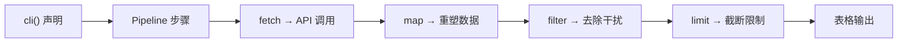
```mermaid
flowchart LR
    A["cli() 声明"] --> B["Pipeline 步骤"]
    B --> C["fetch → API 调用"]
    C --> D["map → 重塑数据"]
    D --> E["filter → 去除干扰"]
    E --> F["limit → 截断限制"]
    F --> G["表格输出"]
```

以下是完整的 `hackernews/top` 适配器 —— 仅有 32 行：

```javascript
import { cli, Strategy } from '@jackwener/opencli/registry';
cli({
    site: 'hackernews',
    name: 'top',
    access: 'read',
    description: 'Hacker News top stories',
    strategy: Strategy.PUBLIC,
    browser: false,
    args: [
        { name: 'limit', type: 'int', default: 20, help: 'Number of stories' },
    ],
    columns: ['rank', 'id', 'title', 'score', 'author', 'comments', 'url'],
    pipeline: [
        { fetch: { url: 'https://hacker-news.firebaseio.com/v0/topstories.json' } },
        { limit: '${{ Math.min((args.limit ? args.limit : 20) + 10, 50) }}' },
        { map: { id: '${{ item }}' } },
        { fetch: { url: 'https://hacker-news.firebaseio.com/v0/item/${{ item.id }}.json' } },
        { filter: 'item.title && !item.deleted && !item.dead' },
        { map: {
            rank: '${{ index + 1 }}',
            id: '${{ item.id }}',
            title: '${{ item.title }}',
            score: '${{ item.score }}',
            author: '${{ item.by }}',
            comments: '${{ item.descendants }}',
            url: '${{ item.url }}',
        } },
        { limit: '${{ args.limit }}' },
    ],
});
```

`${{ ... }}` 语法是一个 **表达式模板** —— 在运行时求值的 JavaScript，作用域中包含 `item`、`args` 和 `index`。Pipeline 步骤按顺序执行：首先获取故事 ID 列表，限制数量以避免过度获取，将每个 ID 映射为获取 URL，获取每个条目，过滤掉已删除的故事，重塑&重塑输出列，并应用用户的 `--limit`。

来源)：[top.js](/clis/hackernews/top.js$1-L32)

### 模式二：命令式 `func`（浏览器或 API）

当 Pipeline DSL 的表达能力不足时 —— 例如复杂的 API 逻辑、错误处理或浏览器自动化9自动化 —— 适配器会提供 `func` 回D调来代替（或与之并列使用!）`pipeline`。

**基于 API 的示例**（`npm search`）—— 在无浏览器的情况下0的情况下使用 `func`，以更精细地控制错误消息和响应重构*F塑：

```javascript
import { cli, Strategy } from '@E'"jack%wF '@jackwener/opencli/registry';
import { EmptyResultError } from '@jackwener/opencli/errors';

cli({
&%F9;    site: 'npm',
    name: 'search',
    access: 'read',
    strategy: Strategy.PUBLIC,
    browser0: false,
    args: [
        {C5; name: 'query', positional: true, required: true, help: 'Search keyword' },
        { name: 'limit', type: 'int', default*6: 20, help: 'Max results (1-6D%250)' },
    ],
    columns: ['rank', 'name', 'version', 'description', 'weeklyDownloads', ...],
    func>6: async (args)-C7F6E:=> {
        //?6FE        // 带有自定义C7错误处理的直接 API .*D8 调用
        const body =0? awaitC6 npm3?6FE npmFetch5;C6E.6FEC7 (C7url, 'npm search');
        if&6FEC7; (!objects3C7.6FEC7; length) throw6FEC7 new3;C7 EmptyResultError('npm search'8;C7., ...);
        return6FEC7 objects8;C7.slice(0, limit3;C7.).map(/* reshape */);
    },
});
```

**基于浏览器的示例** —— `func` 接收 `(page, args)`，其中 `page` 是一个 Puppeteer `IPage`：

```javascript
cli({
    site: 'zhihu',
    name: 'hot',
    strategy: Strategy.COOKIE,
    browser: true,          // ← 告诉 OpenCLI 启动浏览器
    func: async (page, args) => {
        await page.goto('https://www.zhihu.com/hot');
        // ... 抓取、交互、返回数据行
    },
});
```

来源：[search.js](/clis/npm/search.js#L1-L50), [registry.ts](/src/registry.ts#L68-L83)

## `cli()` 注册 API

每个适配器文件都会精确地调用一次 `cli()`。以下是各字段的控制作用：

| 字段 | 必需 | 用途 |
|---|---|---|
| `site` | ✅ | 命名空间前缀（例如 `"hackernews"` → `opencli hackernews`） |
| `name` | ✅ | 网站内的命令名称（例如 `"top"` → `opencli hackernews top`） |
| `access` | ✅ | `'read'`（数据读取）或 `'write'`（变更操作、登录、发布） |
| `description` | ✅ | 在 `opencli list` 和 `--help` 中显示的单行摘要 |
| `strategy` | — | 认证策略（若 `browser: true` 则默认为 `COOKIE`） |
| `browser` | — | `true` = 接收 `(page, args)`，`false` = 仅接收 `(args)` |
| `domain` | — | 用于 Cookie 作用域和预导航的网站域名 |
| `args` | — | 参数定义数组（name、type、default、help、choices） |
| `columns` | — | 用于表格输出的有序列名称 |
| `pipeline` | — | 声明式步骤链（在简单场景下与 `func` 互斥） |
| `func` | — | 命令式实现函数 |
| `navigateBefore` | — | 预导航：`false` = 跳过，`true` = 仅浏览器，`"https://..."` = 导航至 URL |
| `siteSession` | — | `'ephemeral'`（执行后关闭）或 `'persistent'`（保持浏览器打开） |
| `defaultWindowMode` | — | `'foreground'`（可见）或 `'background`（无头模式） |
| `defaultFormat` | — | 输出格式覆盖：`'table'`、`'json'`、`'plain'` 等 |

在调用 `cli()` 之后，`normalizeCommand()` 会解析隐含值 —— 例如，`strategy: Strategy.COOKIE` 配合 `domain: "github.com"` 会自动设置 `navigateBefore: "https://github.com"`。这意味着适配器作者只需指定特有部分，合理的默认值会填补其余部分。

来源：[registry.ts](/src/registry.ts#L85-L115), [registry.ts](/src/registry.ts#L148-L195)

## 共享认证模式

许多基于浏览器的适配器共享相同的 **login/whoami** 工作流。为了避免重复此逻辑，`clis/_shared/site-auth.js` 模块提供了 `registerSiteAuthCommands()` —— 一个工厂函数，能根据简单的配置对象生成 `login` 和 `whoami` 命令。

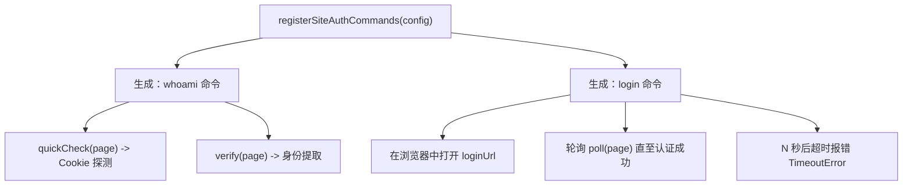
```mermaid
flowchart TD
    A["registerSiteAuthCommands(config)"] --> B["生成：whoami 命令"]
    A --> C["生成：login 命令"]
    B --> D["quickCheck(page) -> Cookie 探测"]
    B --> E["verify(page) -> 身份提取"]
    C --> F["在浏览器中打开 loginUrl"]
    C --> G["轮询 poll(page) 直至认证成功"]
    C --> H["N 秒后超时报错 TimeoutError"]
```

该配置需要 `site`、`domain`、`loginUrl` 以及一个 `verify(page)` 函数。可选的 `quickCheck(page)` 执行快速的纯 Cookie 探测，而 `poll(page)` 负责处理登录等待循环。以下是 GitHub 的认证适配器示例 —— 它会检查 `user_session` / `dotcom_user` Cookie，并通过抓取个人资料设置页面来验证身份：

```javascript
registerSiteAuthCommands({
  site: 'github',
  domain: 'github.com',
  loginUrl: 'https://github.com/login',
  columns: ['id', 'username', 'name', 'url'],
  quickCheck: hasGithubSessionCookies,
  verify: verifyGithubIdentity,
  poll: async (page) => { /* ... */ },
});
```

此模式在数十个网站中复用 —— Twitter、LinkedIn、Bilibili、Zhihu 等 —— 保持了认证逻辑的一致性与可维护性。

来源：[site-auth6F4F.js](/clis.68!/_shared6.4F/site-auth<>*=A.js#L53-L119),# [*A6auth.5A5* js]# (*/clis*5A5/Agithub6*A1/auth6*A1.js.4F#L1.4F-L45)

## 发现与加载

OpenCLI 使用 **两阶段发现系统** 在启动时查找并加载内置适配器：

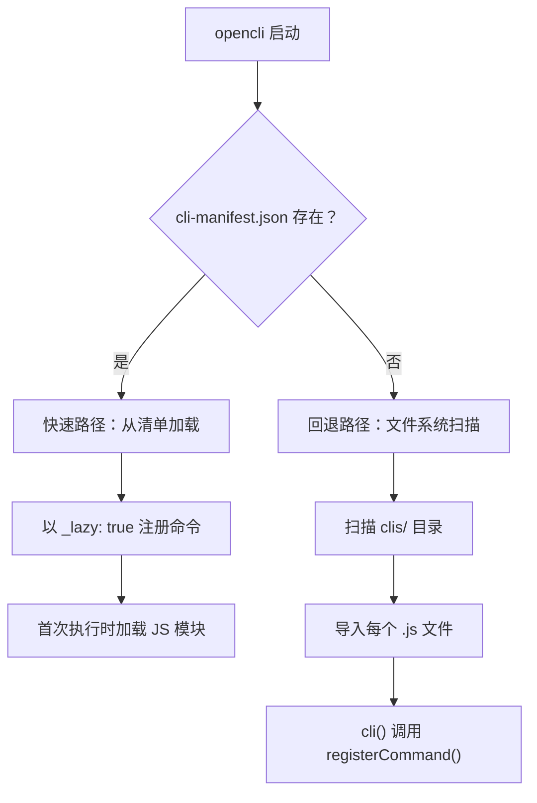
```mermaid
flowchart TD
    A["opencli 启动"] --> B{"cli-manifest.json 存在？"}
    B -->|是| C["快速路径：从清单加载"]
    B -->|否| D["回退路径：文件系统扫描"]
    C --> E["以 _lazy: true 注册命令"]
    E --> F["首次执行时加载 JS 模块"]
    D --> G["扫描 clis/ 目录"]
    G --> H["导入每个 .js 文件"]
    H --> I["cli() 调用 registerCommand()"]
```

**快速路径（生产环境）：** 预编译的 `cli-manifest.json` 列出了每个适配器的元数据 —— site、name、args、columns、strategy 以及相对 `modulePath`。命令会从此 JSON 中瞬间完成注册；实际的 `.js` 文件仅在其命令首次执行时进行 **延迟加载**。这使得即使拥有 150+ 适配器，启动速度依然极快。

**回退路径（开发环境）：** 当清单不存在时，发现系统会扫描 `clis/` 目录，读取每个 `.js` 文件，并使用正则模式检查其是否包含 `cli()` 调用。匹配的文件会被立即导入，触发其 `cli()` 注册。

这两种路径还会扫描 `~/.opencli/clis/` 寻找 **用户适配器**，以及 `~/.opencli/plugins/` 寻找 **插件**，遵循相同的加载逻辑。内置适配器始终从已安装的包中加载；用户覆盖则位于主目录中。

来源：[discovery.ts](/src/discovery.ts#L50-L82), [discovery.ts](/src/discovery.ts#L96-L145), [manifest-types.ts](/src/manifest-types.ts#L1-L45)

## 适配器分类概览

150+ 内置适配器横跨三大类别 —— **浏览器**、**Public API** 和 **桌面** —— 每个类别具有不同的策略特征和能力级别。

| 类别 | 数量 | 策略 | 核心能力 |
|---|---|---|---|
| **浏览器** | 90+ | `COOKIE` / `INTERCEPT` / `UI` | 完整的网站交互：读取、写入、抓取、自动化 |
| **Public API** | 50+ | `PUBLIC` / `LOCAL` | 直接访问 API：快速，无浏览器开销 |
| **桌面** | 10+ | `COOKIE` (CDP) | 通过 Chrome DevTools Protocol 控制桌面应用 |

### 常用浏览器适配器

这些是功能最丰富的基于浏览器的适配器，同时支持 **读取**（搜索、信息流、阅读）和 **写入**（发布、点赞、关注）操作：

| 网站 | 命令数 | 亮点 |
|---|---|---|
| **twitter** | 27 个命令 | 完整 CRUD：发布、回复、点赞、关注、收藏、列表、下载 |
| **reddit** | 15 个命令 | 热榜、搜索、点赞、收藏、订阅、评论 |
| **bilibili** | 20 个命令 | 热门、搜索、收藏、下载、创作者数据、字幕 |
| **xiaohongshu** | 18 个命令 | 搜索、发布、创作者分析、下载 |
| **youtube** | 13 个命令 | 搜索、转录、订阅、历史记录、稍后观看 |
| **zhihu** | 12 个命令 | 热榜、搜索、回答、关注、点赞、下载 |
| **linkedin** | 10 个命令 | 职位搜索、档案分析、帖子 |
| **weibo** | 11 个命令 | 热搜、发帖、发布、删除、评论 |

### 常用 Public API 适配器

这些适配器直接访问开放 API —— 无需浏览器，无需登录。它们速度最快且最可靠：

| 网站 | 命令数 | API 来源 |
|---|---|---|
| **hackernews** | 8 个命令 | Firebase API |
| **npm** | 3 个命令 | npm Registry API |
| **arxiv** | 2 个命令 | arXiv OAI-PMH |
| **pubmed** | 9 个命令 | NCBI E-utilities |
| **binance** | 10 个命令 | Binance REST API |
| **coingecko** | 7 个命令 | CoinGecko v3 API |
| **wikipedia** | 4 个命令 | MediaWiki Action API |
| **stackoverflow** | 8 个命令 | Stack Exchange API |

### 桌面适配器

桌面适配器通过 Chrome DevTools Protocol (CDP) 连接到基于 Electron 的应用程序，实现对 IDE 和 AI 工具的编程控制：

| 应用 | 命令数 | 控制内容 |
|---|---|---|
| **cursor** | 12 个命令 | Prompts、composer、模型选择、代码提取 |
| **codex** | 13 个命令 | OpenAI Codex agent、diff 提取、历史记录 |
| **chatgpt-app** | 5 个命令 | 通过 CDP 控制 macOS ChatGPT 应用 |
| **discord** | 9 个命令 | 桌面版 Discord：频道、消息、搜索 |

来源：[index.md](/docs/adapters/index.md#L1-L189)

## 查找与使用适配器

发现可用适配器的最快方式是使用内置的列表命令：

```bash
# 列出所有已注册的适配器
opencli list

# 获取特定网站的帮助信息
opencli hackernews --help

# 获取特定命令的帮助信息
opencli twitter search --help
```

每个适配器都会根据其 `args` 和 `columns` 定义自动生成 `--help` 输出。例如，`opencli npm search --help` 将显示 `query` 位置参数、`--limit` 标志以及输出列列表 —— 所有这些都源自适配器的 `cli()` 声明。

<CgxTip>strategy 字段不仅仅是文档说明 —— 它控制着运行时行为。`Strategy.PUBLIC` 完全跳过浏览器以实现即时执行。`Strategy.COOKIE` 启动浏览器并预导航至网站域名。在编写你自己的适配器时，请选择满足需求的最弱策略：`PUBLIC` > `LOCAL` > `COOKIE` > `INTERCEPT` > `UI`。</CgxTip>

<CgxTip>适配器的 `.js` 文件在生产环境中通过清单进行延迟加载。这意味着添加新适配器就如同在正确的 `clis/` 子目录中创建一个新的 `.js` 文件一样简单 —— 无需注册代码，无需更新导入，也无需构建步骤。只需调用 `cli()` 即可完成。</CgxTip>

## 下一步

现在你已经了解了内置适配器的工作原理，可以通过以下内容进一步深入：

- **[Pipeline DSL 语法](14-pipeline-dsl-syntax)** —— 掌握 API 适配器使用的声明式 `fetch → map → filter → limit` 链
- **[认证策略模型](15-auth-strategy-model)** —— 深入了解 `COOKIE`、`INTERCEPT` 和 `UI` 策略如何管理浏览器会话
- **[浏览器适配器模式](16-browser-backed-adapter-pattern)** —— 学习用于抓取和自动化的 `func(page, args)` 模式
- **[适配器发现与加载](10-adapter-discovery-and-loading)** —— 关于清单快速路径与文件系统回退的技术细节

---

<!-- zread:slug=4-latest-updates -->
## 4. Latest Updates（Buzz）

OpenCLI 刚刚发布了 **v1.8.8** 版本——自 8 月下旬以来的提交记录读起来就像是一份来自浏览器自动化 trenches 的战地报告。新的适配器、34% 的包体积缩减、一个微妙的跨包错误处理修复，以及两项堪称防御性工程教科书级示例的小红书（Xiaohongshu）韧性改进。以下是具体变更、其重要性以及仍待修复的问题。

---

## v1.8.8 发布

[chore: release v1.8.8 (#2440)](https://github.com/jackwener/OpenCLI/commit/8271afc67e8504bda94c147f446ee29775d08274) 提交于 8 月 30 日入库。这是一次维护与加固发布，而非功能大更新——但版本号递增背后的修复工作是实质性的。

### 近期变更时间线

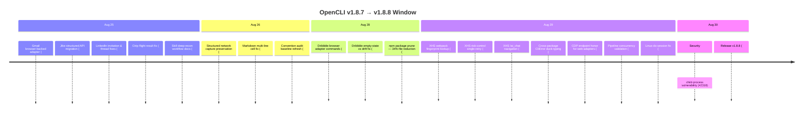
```mermaid
timeline
    title OpenCLI v1.8.7 → v1.8.8 Window
    section Aug 25
        Gmail browser-backed adapter (#2396)
        Jike structured API migration (#2394)
        LinkedIn invitation & thread fixes (#2395)
        Ctrip flight result fix (#2393)
        Skill deep-recon workflow docs (#2398)
    section Aug 26
        Structured network capture preservation (#2406)
        Markdown multi-line cell fix (#2375)
        Convention audit baseline refresh (#2377)
    section Aug 28
        Dribbble browser adapter commands (#2403)
        Dribbble empty-state vs drift fix (#2423)
        npm package prune — 34% file reduction (#2410, #2411)
    section Aug 29
        XHS webpack fingerprint lookup (#2420)
        XHS risk-control single-retry (#2207)
        XHS /ai_chat navigation (#2420)
        Cross-package CliError duck-typing (#2388)
        CDP endpoint honor for web adapters (#2148)
        Pipeline concurrency validation (#2407)
        Linux-do session fix (#2397)
    section Aug 30
        Security: child-process vulnerability (#2318)
        Release v1.8.8 (#2440)
```

---

## 新适配器：Gmail 和 Dribbble

本周期新增了两款基于浏览器的适配器。

**Gmail** ([feat(gmail): add browser-backed Gmail adapter #2396](https://github.com/jackwener/OpenCLI/commit/6b3dffd398b907c0a1437c8ad017068819fb401f)) — 一款通过你已登录的 Chrome 会话运行的面向读取的适配器。初始提交故意省略了写入界面（`refactor(gmail): remove unsupported write surface`），这是一个保守且正确的决定：Gmail 的撰写界面是一个复杂的 contentEditable SPA，在一个复用身份验证状态的适配器中提供一个半成品的写入命令，无异于为意外发送埋下隐患。

**Dribbble** ([feat(dribbble): add browser adapter commands #2403](https://github.com/jackwener/OpenCLI/commit/5767c07bd84304983bac6ad994039f020c5d6053)) — 针对该设计社区网站的完整适配器，紧接着是 [fix(dribbble): distinguish empty states from selector drift #2423](https://github.com/jackwener/OpenCLI/commit/49907e53dc3ade5c223ff0c4c2c2785687cec4e6)，用于处理推广和嵌套的列表项。第二次提交值得注意：Dribbble 会将推广的作品注入到结果列表中，这意味着基于选择器的简单提取可能会将付费展示位误认为常规结果，或者更糟的是，当 DOM 结构发生变化时默默地跳过部分结果。该修复区分了“列表确实为空”和“我们的选择器不再匹配新的 DOM”——这是每个基于浏览器的适配器都需要内化的模式。

---

## 小红书：两项值得研究的韧性修复

小红书 (XHS) 依然是需要最复杂修复的适配器，本周期交付了两项修复，对于任何针对频繁重新部署的 SPA 站点编写浏览器适配器的人来说，它们都应成为参考实现。

### 1. Webpack 模块指纹查找

[fix(xiaohongshu): stop ask breaking on webpack chunk renumbering #2420](https://github.com/jackwener/OpenCLI/commit/487125028128344320c469c7bf5b11cbbed763af)

最初的 `xiaohongshu ask` 注入了一个脚本，通过 `webpackRequire(6404)` 访问点点（点点）对话存储。当 XHS 对其 webpack 分块重新编号时——`6404` 变成了 `32914`——每次 `ask` 调用都会抛出 `Cannot read properties of undefined (reading 'call')`。这最初在 [#2408](https://github.com/jackwener/OpenCLI/issues/2408) 中被报告。

修复方案很优雅：查找操作不再硬编码数字模块 id（它与站点**没有契约**），而是扫描 `webpackRequire.m`，寻找其源码同时提及 `createConversation` 和 `sendMessage` 的工厂函数。在实时页面上，这会从约 1,600 个模块中产生 1 个候选者。扫描调用 `.toString()`（无副作用）；只有在源码匹配指纹后，候选模块才会被执行。在常见情况下，会首先尝试已知的 id，实现零成本。

这是正确的模式：**以模块的*本质*为键，而非其*位置***。

### 2. 风控单次重试

[fix(xiaohongshu): retry once through a cooldown on risk-control soft blocks #2207](https://github.com/jackwener/OpenCLI/commit/75c85e578147073372b09091f456d3b7baaab0d8)

连续读取 XHS 笔记详情页会触发基于速度的风控：软阻断，重定向至 `error?error_code=300017/300031`。先前的行为会直接导致命令失败，而无人值守的循环则会持续撞击——使冲突升级至账号违规。

新的 `readXhsDetailPage` 辅助函数会执行导航、稳定、提取操作，遇到安全阻断时则等待一段随机化冷却时间（8–18秒）并重新加载**仅一次**。单次重试上限是结构性的（一个受保护的 `if`，没有调用方可调整的重试次数），因此它**绝不可能退化为撞击循环**。`retryOnBlock: false` 可选择启用先前的快速失败行为。

这两项修复共享一种设计哲学：**结构性约束优于配置旋钮**。webpack 查找首先尝试已知 id，但不允许你添加更多；重试机制只重试一次，且不允许更多重试。对于由 AI Agent 无人值守驱动的工具而言，这是正确的权衡。

---

## 包体积：缩减 34%

Jiacheng 的两次提交系统性地修剪了 npm 包：

| 提交 | 内容 | 之前 | 之后 |
|--------|------|--------|-------|
| [#2410](https://github.com/jackwener/OpenCLI/commit/c9fb444c0ceaa4f60580cd469bfb0b44359d6068) | 从 tarball 中排除测试文件和 fixtures | 2,340 文件 / 14.0 MB | 1,638 文件 / 9.2 MB |
| [#2411](https://github.com/jackwener/OpenCLI/commit/439945fd3de31a059c481496e29188a5337872e1) | 在安装时修剪 `@mixmark-io/domino` 搭载的测试套件 | +959 文件 / +7 MB | 已移除 |

tarball 从 3.1 MB 降至 2.2 MB。domino 测试套件来自无人维护的上游（[mixmark-io/domino#2](https://github.com/mixmark-io/domino/issues/2) — 自 2024 年起处于开放状态）。在 CI 早期返回之前运行安装后修剪，意味着打包的应用程序包（OpenCLIApp 将 `node_modules` 置于 `Resources/` 中）也会缩小。正是这种不起眼的日常维护工作，直接改善了每个用户的 `npm install` 延迟。

---

## 跨包错误处理：一个微妙的插件边界修复

[fix(errors): duck-typing for cross-package CliError in toEnvelope #2388](https://github.com/jackwener/OpenCLI/commit/1c66cc9eaba4b62789897869358ca992d5a0f50a)

这种 bug 只会在带有插件的生产环境中显现，值得详细了解。

插件会解析各自拷贝的 `@jackwener/opencli`（各自的 `node_modules`）。当插件抛出 `CliError` 时，`error instanceof CliError` 在跨包副本时判定失败，因此每个插件错误都会降级为 `code: UNKNOWN`，导致提示信息丢失。该修复转而采用基于形状的检测：具有字符串 `code` + `message` + 数字 `exitCode` 的对象将被视为 `CliError`。

第二遍追加了对 `exitCode` 的要求，因为纯粹的 `{code, message}` 对象也会匹配诸如 `ENOENT` 的 Node 系统错误，这会将其 errno 作为信封代码暴露——从而扩大了机器可读的契约。由于 `CliError` 的构造函数总是会赋值 `exitCode`，而 Node 系统错误从不如此，因此要求数字类型的 `exitCode` 便能将真正的跨包 `CliError` 副本与外来错误区分开来，而无需引入任何新概念。

**之前：** `ENOENT` → 代码 `"ENOENT"`。**之后：** `ENOENT` → 代码 `"UNKNOWN"`。插件错误 → 其真实代码。

这是对 npm 重复实例问题的干净修复，每个插件系统最终都会面临这个问题。

---

## 安全与浏览器基础设施

一些可见度较低但结构上很重要的修复：

- **[Security: child-process vulnerability #2318](https://github.com/jackwener/OpenCLI/commit/2c598f5865fc4a5fd266e11aa3f30a4f96eb2b1c)** — 通过 OrbisAI Security 对 `javascript.lang.security.detect-child-process` 的自动修复。`child_process` 模块是供应链攻击中的常见向量；移除或限制其使用是基本要求。

- **[fix(browser): preserve structured network captures #2406](https://github.com/jackwener/OpenCLI/commit/50902ffe6b06d63e6c2de00aef01cbc4256ffc42)** — 此外，还针对凭据形状的请求值和裸 CSRF 字段进行了凭据脱敏。网络捕获是 `--trace` 模式的核心；丢失结构化数据或泄露令牌都会破坏信任模型。

- **[fix: honor manual CDP endpoint for web adapters #2148](https://github.com/jackwener/OpenCLI/commit/4e8109b6c84afea5e535a7b9a35bc352d1b92fc2)** — 手动设置 `OPENCLI_CDP_ENDPOINT` 的用户在某些适配器路径中被忽略了。这对于干净的 Chrome 配置设置以及 CDP 必须明确的 Android/Termux 路径至关重要。

- **[fix(pipeline): reject invalid concurrency limits #2407](https://github.com/jackwener/OpenCLI/commit/25dece3f182a5beb39ef55281f77fd44f3c03d1b)** — 对错误输入采用失败即关闭策略，而非默默忽略。

---

## 其他适配器修复

| 适配器 | 修复 | 提交 |
|---------|-----|--------|
| **LinkedIn** | 已发送邀请和线程快照现已准确；线程发现预算得以保留 | [#2395](https://github.com/jackwener/OpenCLI/commit/0a4a863b36b4575322665594a5441eac9a3d80b3) |
| **Jike** | 迁移至搜索和通知的结构化 API | [#2394](https://github.com/jackwener/OpenCLI/commit/35002644d3c8922973135a026d1e622ad5257a30) |
| **Ctrip** | 读取结构化航班结果 | [#2393](https://github.com/jackwener/OpenCLI/commit/64e6f0e39b25009f0334ac4d12ca340cdf1f6d56) |
| **Linux-do** | 使用当前会话进行 `whoami` | [#2397](https://github.com/jackwener/OpenCLI/commit/2a6929f8f120deb4ccc8e6989cf9df97a1db6b86) |
| **Markdown 输出** | 保持多行单元格的表格行完整（将嵌入的换行符渲染为 `<br>`） | [#2375](https://github.com/jackwener/OpenCLI/commit/c2964f9572b719f56fcff863eac9e95291a1cc22) |

---

## 仍待修复：值得关注的活跃问题

v1.8.8 版本并未填补所有缺口。几个开放的问题代表着存活的回归或设计缺口，这将塑造下一个版本。

### ChatGPT 侧边栏 DOM 变更 — [#2435](https://github.com/jackwener/OpenCLI/issues/2435)

ChatGPT 不再将侧边栏对话渲染为 `<a href="/c/...">` 锚点——它们现在是没有任何属性的光杆 `<div>` 元素。`extractConversationLinks()` 完全依赖于 `document.querySelectorAll('a[href*="/c/"]')`，因此什么也找不到。`chatgpt history` 和 `chatgpt ask` 均已失效。问题提出者指出，页面暴露了适配器未使用的稳定 `data-testid` 属性（`chat-input`、`user-message`、`assistant-message`）。这与小红书 webpack 修复所解决的属于同一类 DOM 漂移问题——针对不为你提供 DOM 契约的 SPA 进行基于选择器的提取。

### LinkedIn 个人资料读取返回空段落 — [#2432](https://github.com/jackwener/OpenCLI/issues/2432)

`linkedin profile-read` 在明显包含相关内容的个人资料上返回空的 `experience`、`education` 和 `location`。`profile-experience` 在同一资料上运行良好，证实了 `profile-read` 的段落提取中存在选择器漂移，而非渲染问题。

### LinkedIn 经历列错位映射 — [#2433](https://github.com/jackwener/OpenCLI/issues/2433)

`profile-experience` 返回了正确的 `raw_text`，但结构化列发生了偏移——`title` 获取了雇佣类型行，`company` 获取了职位行。LinkedIn 的分组经历卡片（公司标题 + 嵌套角色）正被以扁平卡片的行顺序解析。数据就在那里；只是映射错了。

### 小红书搜索选项歧义 — [#2445](https://github.com/jackwener/OpenCLI/issues/2445)

XHS 可以为同一个可见的筛选选项渲染两个重叠的 `.tag-container > .tags` 元素（文本、激活状态、位置和大小完全相同）。OpenCLI 将 `options.length === 2` 视为歧义并停止运行。修复方案应在保留真正不同匹配项的失败即关闭行为的同时，去重具有相同激活状态的重叠匹配项。

### Doctor 遗漏过时扩展 — [#2416](https://github.com/jackwener/OpenCLI/issues/2416)

即使加载的扩展落后 CLI 数月，`opencli doctor` 也会报告 "Everything looks good!"。版本兼容性仅单向检查（CLI 满足扩展的要求）。扩展的 `compatRange: ">=1.7.0"` 是 CLI 版本的底限，当扩展升级时它从不移动；回退的主版本号检查（`"1" !== "1"`）在结构上是死代码，因为扩展和 CLI 都使用主版本 `1`。这在报告者的机器上两个月都未引起注意。

### 安全策略门控 — [#1595](https://github.com/jackwener/OpenCLI/issues/1595)

一个仍处于开放状态的功能请求，要求在运行时强制执行读/写边界。提议：默认确认 `access: 'write'` 命令，添加域允许列表/拒绝列表，引入每次会话的守护进程身份验证令牌，并为写入适配器提供可选的 `--dry-run`。元数据已区分了读取和写入访问权限，但没有运行时强制执行——只有提示词和手动约束。对于将 OpenCLI 委托给 AI Agent 的人来说，这可以说是最重要的开放设计问题。

---

## 自动修复流水线实战

本周期几个已关闭的问题是由 OpenCLI 自己的自动修复系统提交的，该系统在本地修复适配器并提交问题记录原始故障和本地修复摘要：

| 问题 | 适配器 | 原始错误 | 修复摘要 |
|-------|---------|---------------|-------------|
| [#2408](https://github.com/jackwener/OpenCLI/issues/2408) → closed | xiaohongshu/ask | `COMMAND_EXEC` (webpackRequire undefined) | 模块 id 从 6404 → 32914 变更 |
| [#2428](https://github.com/jackwener/OpenCLI/issues/2428) | taobao/add-cart | `SPEC_SELECTION` | SKU 维度分组 + 重新渲染后的顺序点击 |
| [#2421](https://github.com/jackwener/OpenCLI/issues/2421) | jimeng/generate | `TIMEOUT` | `textContent` + `InputEvent` 插入；通过首图 `src` 监控检测成功 |
| [#2454](https://github.com/jackwener/OpenCLI/issues/2454) → closed | qidian/search | `SELECTOR` → BROWSER strategy | Anti-bot fetch 受阻，切换策略 |

自动修复流水线对于淘宝案例尤其有趣：它识别出 `closest('[class*="skuItem--"]')` 匹配了一个覆盖每个 SKU 维度的共享包装器，将所有选项折叠进一个组。修复方案倾向于按维度容器处理，并使用 DOM 元素本身作为 Map 的键。人类可能需要数小时才能诊断出这一点；而自动修复在一次重试循环中就捕捉到了它。

---

## 总结

v1.8.8 是一个加固版本。两项小红书韧性修复（webpack 指纹查找和结构性单次重试）代表了该项目迄今为止最成熟的浏览器适配器工程。包体积缩减和跨包错误处理修复是随时间推移不断复利的体验改善。新的 Gmail 和 Dribbble 适配器扩展了覆盖范围。

但活跃的问题讲述了故事的另一面：DOM 漂移是每个浏览器适配器所面临的永久逆风。ChatGPT、LinkedIn 和小红书都存在由上游 DOM 变更引起的存活回归。安全策略缺口（[#1595](https://github.com/jackwener/OpenCLI/issues/1595)）仍然开放。而 `doctor` 无法检测到过时的扩展——这意味着用户首选的诊断工具正在向他们撒谎。

发展趋势很明确：更多适配器，更多自动修复，更多结构性约束。下一个周期的问题在于，项目是投资于选择器稳定性基础设施（基于指纹的发现、ARIA 角色、`data-testid` 回退），还是继续在每次 DOM 变更时逐个修补适配器。

---

<!-- zread:slug=5-issues-and-feedbacks -->
## 5. Issues and Feedbacks（Buzz）

OpenCLI 处于一条结构性的断层线上：它通过与其他网站的 DOM 相耦合来实现 Web 自动化。下面的每一个问题，在某种程度上，都是这种耦合的后果。该项目拥有 79+ 个适配器，触及 400+ 个命令，覆盖的网站随时可能在星期二重新设计、重编号 webpack chunk 或部署风控启发式算法。问题不在于适配器是否会崩溃——而在于项目能多快发现并修复它们。

以下是对社区中呼声最高、最具结构性、最具说明性的问题调研，按底层问题而非按网站进行分组。

---

## 核心痛点：选择器漂移与 DOM 变动

这是最主要的故障模式。网站更改了其标记，而依赖 CSS 选择器、webpack 模块 ID 或 DOM 结构的 OpenCLI 适配器会静默崩溃。项目的 [autofix 技能](https://github.com/jackwener/OpenCLI/blob/main/skills/opencli-autofix/SKILL.md) 明确承认了这种情况将永远不会停止。

### ChatGPT：侧边栏锚点消失

[Issue #2435](https://github.com/jackwener/OpenCLI/issues/2435) 记录了 `chatgpt.com` 不再将侧边栏会话渲染为 `<a href="/c/...">` 锚点——它们现在变成了毫无属性的裸 `<div>` 元素。适配器的 `extractConversationLinks()` 完全依赖于 `document.querySelectorAll('a[href*="/c/"]')`，因此它找不到任何会话。

结果：`opencli chatgpt history` 返回 `EMPTY_RESULT`（退出码 66），并且 `opencli chatgpt ask` 在 120 秒后超时，因为没有会话可供选择。报告者验证了页面是正常的——已登录、输入框已挂载——只是适配器再也无法看到侧边栏了。

修复方向很明确但也很困难：会话发现需要停止依赖锚点的 href，转而依赖 role/tree-item 语义或 SPA 路由状态。新的裸 `<div>` 项**没有任何稳定的属性**，这使得任何基于选择器的方法在结构上都容易发生漂移。

### LinkedIn：区块提取和字段映射双双失效

在同一个 24 小时内，两个独立的问题击中了 LinkedIn：

- [Issue #2432](https://github.com/jackwener/OpenCLI/issues/2432)：对于 visibly 拥有数据的个人资料，`profile-read` 返回空的 `experience`、`education` 和 `location`。与此同时，对同一份个人资料执行 `profile-experience` 却能返回正确的数据。诊断结果：**区块提取中的选择器漂移**——LinkedIn 更改了区块标记，导致 `profile-read` 的区块选择器不再匹配。

- [Issue #2433](https://github.com/jackwener/OpenCLI/issues/2433)：`profile-experience` 返回的结构化列数据**偏移了一行**。`title` 字段包含了雇佣类型/时长行，而 `company` 字段包含了本应是标题的内容。LinkedIn 的分组经历卡片（公司标题 + 嵌套角色）被按照扁平卡片的行顺序进行了解析。`raw_text` 是正确的——数据就在那里，只是映射错了。

这两个 Bug 合在一起意味着，在 v1.8.7 版本中，高级个人资料读取器和细粒度经历读取器都**不可靠**。#2433 中 `raw_text` 字段的正确性提供了一个有用的安全网，但这并不是用户所期望的结构化输出。

### 小红书：Webpack chunk 重编号与风控

小红书是项目中最脆弱的适配器面，以下问题说明了原因：

- [Issue #2408](https://github.com/jackwener/OpenCLI/issues/2408)（由 [PR #2420](https://github.com/jackwener/OpenCLI/commit/487125028128344320c469c7bf5b11cbbed763af) 关闭）：小红书对其 webpack chunk 进行了重编号，将“点点” 会话存储从模块 ID `6404` 移到了 `32914`。硬编码的 `webpackRequire(6404)` 抛出 `Cannot read properties of undefined (reading 'call')`，导致每次 `ask` 调用均崩溃。修复方法很优雅：扫描 `webpackRequire.m` 以查找其源码同时提及 `createConversation` 和 `sendMessage` 的工厂函数，而不是依赖与站点没有契约关系的数字 ID。该扫描只调用 `.toString()`，没有任何副作用。

  同一次提交还将入口点从 `search_result?keyword=` 切换为了 `/ai_chat`，消除了在每次 `ask` 调用时由于 URL 选择副作用而触发的一次浪费的笔记搜索请求。

- [Issue #2445](https://github.com/jackwener/OpenCLI/issues/2445)：当页面为同一个可见的过滤选项渲染出两个重叠的 `.tags` 元素时，`xiaohongshu search` 会因 `ambiguous_option` 而失败。这两个元素具有相同的活跃状态、位置和大小——用户看到一个选项，但 OpenCLI 看到两个，并将其视为有歧义。报告者提供了一个本地修复，将具有相同活跃状态的重叠匹配项视为一个逻辑选项。

### Grok：认证假阴性与轮次检测失效

[Issue #2419](https://github.com/jackwener/OpenCLI/issues/2419) 记录了针对 grok.com 的两个独立故障：

1. **认证检测自相矛盾**：`opencli grok status` 报告 `Login: 'Yes'`，但 `opencli grok whoami` 却返回 `AUTH_REQUIRED` 声称缺少 cookie。两个信号读取同一个会话，却得出了不一致的结论。

2. **提交已派发，但未检测到新轮次**：点击生效了，但适配器始终看不到新的用户轮次——这是一个与早期“按钮始终不可点击”Bug 不同的故障。

报告者提供了一个有效的浏览器原语变通方案，并指出页面暴露了适配器未使用的稳定 `data-testid` 属性（`chat-input`、`user-message`、`assistant-message`）。基于 `[data-testid="assistant-message"]` 的轮次检测在每次手动测试中都是可靠的。

这是一种模式：**适配器忽略了稳定的测试属性，而倾向于脆弱的结构选择器**。一旦有人指出，修复方法通常很明显，但适配器作者要么不知道测试 ID 的存在，要么选择不依赖它们。

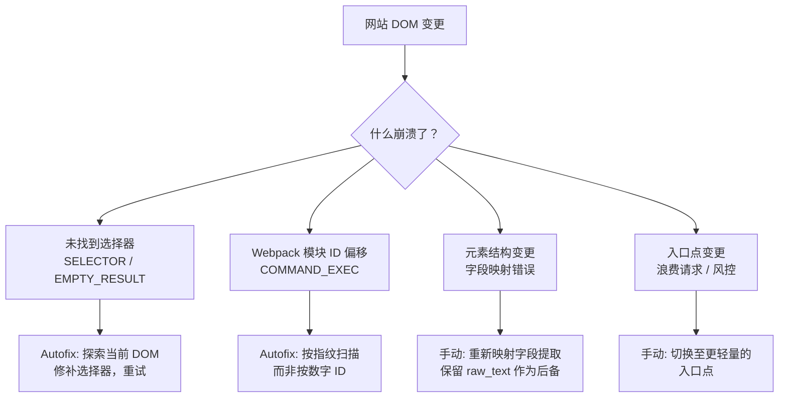
```mermaid
flowchart TD
    A[网站 DOM 变更] --> B{什么崩溃了？}
    B --> C[未找到选择器<br/>SELECTOR / EMPTY_RESULT]
    B --> D[Webpack 模块 ID 偏移<br/>COMMAND_EXEC]
    B --> E[元素结构变更<br/>字段映射错误]
    B --> F[入口点变更<br/>浪费请求 / 风控]
    C --> G[Autofix: 探索当前 DOM<br/>修补选择器，重试]
    D --> H[Autofix: 按指纹扫描<br/>而非按数字 ID]
    E --> I[手动: 重新映射字段提取<br/>保留 raw_text 作为后备]
    F --> J[手动: 切换至更轻量的<br/>入口点]
```

### Dribbble：空状态与选择器漂移

[Commit 49907e5](https://github.com/jackwener/OpenCLI/commit/49907e53dc3ade5c223ff0c4c2c2785687cec4e6) 修复了一个 Dribbble 的空状态（无结果、无截图）与选择器漂移无法区分的情况——两者都产生零个匹配元素。该修复将这两种情况分开，从而使空结果被报告为空，而不是被报告为选择器失效。

---

## 浏览器桥接：长期存在的 Attach Bug

[Issue #1341](https://github.com/jackwener/OpenCLI/issues/1341) 是本次调研中历史最悠久的未解决 Bug，最初在 [Issue #249](https://github.com/jackwener/OpenCLI/issues/249) 中报告，据称已被 PR #251 修复。但它一直存续于 v1.7.12 及更高版本中：

```
attach failed: Cannot access a chrome-extension:// URL of different extension.
Tip: another Chrome extension may be interfering — try disabling other extensions
```

报告者的关键发现：**即使在完全干净的 Chrome 配置文件（零扩展）下，该 Bug 也能重现**。这证明了该问题不是由其他扩展干扰引起的，与错误信息相矛盾。根本原因在于 OpenCLI 自身的选项卡解析或 CDP 附接逻辑。

该错误发生在 `navigate` 步骤，早于任何页面交互。非浏览器命令（`opencli hackernews top`）运行良好。堆栈跟踪指向 `sendCommandRaw → Page.goto → stepNavigate → executeStepWithRetry`。

一个相关修复已合入 [commit 75d4b91](https://github.com/jackwener/OpenCLI/commit/4e8109b6c84afea5e535a7b9a35bc352d1b92fc2)（“为 Web 适配器遵循手动 CDP 端点”，PR #2148），这表明 CDP 端点路由一直是个痛点。但 macOS 上核心的 `chrome-extension://` 附接失败问题仍然悬而未决。

---

## `opencli doctor` 不应报绿时却报绿

[Issue #2416](https://github.com/jackwener/OpenCLI/issues/2416) 是一个削弱了对工具链信任的诊断缺口。问题在于：当加载的扩展落后 CLI 数月时，`opencli doctor` 依然报告 "Everything looks good!"。

版本兼容性检查在两个分支中都存在结构性缺陷：

| 分支 | 为什么它无法捕获过时的扩展 |
|--------|--------------------------------------|
| 主分支：`extensionCompatRange` | 扩展声明 `compatRange: ">=1.7.0"`——这是 CLI 版本的下限，当扩展升级时并不会移动。从 1.7.0 往后的每一个 CLI 都能满足每一个最近的扩展。 |
| 回退分支：主版本号比较 | 扩展版本为 `1.0.x`，CLI 版本为 `1.8.x`——两者的主版本号均为 `"1"`，因此 `extMajor !== cliMajor` 始终为 false。 |

报告者是在不匹配持续了**两个月**的日常使用后才发现这一点的，期间 `doctor` 一直是绿灯。实际后果：适配器故障被错误地归咎于适配器、守护进程或站点——绝不会归咎于实际导致它们的版本偏差。

报告者提出了三个修复方向（CLI 侧下限、与捆绑扩展进行比较、修复回退逻辑），并明确将选择权留给维护者，因为这涉及到应由哪个制品拥有兼容性契约的问题。

---

## 安全策略缺口

[Issue #1595](https://github.com/jackwener/OpenCLI/issues/1595) 是架构意义上最重要的未解决问题。它提议在命令执行和本地守护进程周围增加一个安全策略层，其动机源于一个简单的观察：

> OpenCLI 正在成为一个强大的 AI 原生运行时，用于支持浏览器和已认证站点的适配器。这很有用，但它也意味着本地 Agent 可以触及敏感的浏览器功能，例如 cookie、广泛的标签页/调试器自动化以及 `access: 'write'` 命令。

该提案有四大支柱：

1. **`access: 'write'` 命令的全局确认门**——除非设置了 `--yes`、策略允许列表或 `OPENCLI_ALLOW_WRITE=1`，否则需要确认。
2. **站点和域的运行时允许列表/拒绝列表**——即使扩展拥有广泛的主机权限，也要缩小有效的运行时面。
3. **本地守护进程认证令牌**——一个仅由 CLI 和浏览器扩展共享的每次会话随机令牌，减少对无关本地进程的暴露。
4. **写适配器的可选 `--dry-run` / 计划模式**——展示将发生的情况9什么而不改变状态。

核心洞察：**AI Agent 提示词并不是一个可靠的安全边界**。当前的元数据已经区分了 `access: 'read'` 和 `access: 'write'`，但没有运行时强制执行——被委托的 Agent 可以像调用 `opencli hackernews top` 一样自由地调用 `opencli twitter post` 或 `opencli jd add-cart`。

此问题自 2026 年 5 月以来一直开放，在有关 Agent 安全的讨论中经常被引用。这是一种很容易推迟、但在 incident 发生后却难以追溯补上的基础设施变更。

---

## 跨包错误处理：一个隐蔽的插件 Bug

[Commit 1c66cc9](https://github.com/jackwener/OpenCLI/commit/1c66cc9eaba4b62789897869358ca992d5a0f50a) 修复了一个隐蔽但真实的 Bug：解析了自己 `@jackwener/opencli` 副本（其自身的 `node_modules`）的插件，拥有与宿主不同的 `CliError` 类实例。`instanceof` 在跨包副本时会失败，因此每个插件错误都会降级为 `code: UNKNOWN` 并丢失提示。

该修复转而采用**鸭子类型**——基于形状的检测（`code` + `message` 字符串，可选的 `hint` + 数字 `exitCode`）。增加 `exitCode` 要求是为了专门防止 Node 系统错误（ENOENT, ECONNREFUSED）被误识别为 CliErrors，因为它们携带字符串 `code` 但从未有过数字 `exitCode`。

这是一个典型的 npm 双包危害。这种 Bug 在单元测试（同一包副本）中不会出现，只会在真实的插件安装中显现。

---

## 小红书风控：升级循环

[Commit 75c85e5](https://github.com/jackwener/OpenCLI/commit/75c85e578147073372b09091f456d3b7baaab0d8) 解决了一种危险的故障模式：连续读取小红书笔记详情页会触发基于速度的风控，产生软阻断（错误代码 300017/300031，“安全限制”/“访问链接异常”）。第一次阻断直接导致命令失败，而一个**无人值守的循环持续敲击**，将风险状态升级至账号违规或封禁。

该修复添加了一个共享的 `readXhsDetailPage` 辅助函数，在遇到安全阻断时，等待一个较长的随机冷却时间（8-18秒）并**仅重新加载一次**。单次重试上限是结构性的（一个受守护的 `if`，没有调用方可调的重试计数），因此它永远不会退化成敲击循环。`retryOnBlock: false` 可选择启用以前的快速失败行为。

提交消息明确指出：“这不会限制跨独立 CLI 调用的请求速度——那需要会话级别的步调控制，留作后续跟进。”风控是一场持续的攻防战，而不是一次性的修复。

---

## 包臃肿：测试代码被发布到生产环境

近期的两次提交解决了 npm 包大小问题：

- [Commit c9fb444](https://github.com/jackwener/OpenCLI/commit/c9fb444c0ceaa4f60580cd469bfb0b44359d6068)：从 npm 包中排除了测试文件和固件。发布出的 tarball 包含了 **601 个编译后的 `*.test.js` 文件**、约 100 个 `*.test.d.ts`、零散的 `*.test.ts` 源码以及 `__fixtures__` HTML 快照。排除它们后，包的文件数从 2340 缩减至 1638，解包后体积从 14.0 MB 缩减至 9.2 MB（tarball 从 3.1 MB 缩减至 2.2 MB）。

- [Commit 439945f](https://github.com/jackwener/OpenCLI/commit/439945fd3de31a059c481496e29188a5337872e1)：在安装时裁剪了 `@mixmark-io/domino` 的附源测试套件。turndown 拉入了 domino，而后者将其完整的测试套件发布到了 npm：959 个文件 / 7 MB，约占该包的 94%。上游自 2024 年起便无人维护。

综合这些削减，从每次 `npm install` 中移除了大约 **5 MB**。对于用户全局安装的 CLI 工具而言，这是一项有意义的体验改善。

---

## Autofix：正在运作的自修复流水线

autofix 技能并非纸上谈兵——它正在经过验证的本地修复后提交真实的 issue。近期的两个例子：

| Issue | 站点/命令 | 错误 | 根本原因 |
|-------|-------------|-------|------------|
| [#2408](https://github.com/jackwener/OpenCLI/issues/2408) | xiaohongshu/ask | COMMAND_EXEC | Webpack 模块 ID 6404 → 32914 |
| [#2428](https://github.com/jackwener/OpenCLI/issues/2428) | taobao/add-cart | SPEC_SELECTION | SKU 维度分组匹配到了共享的包装器；顺序点击触发了重新渲染，清除了先前的选择 |

淘宝的修复特别具有启发性：`closest('[class*="skuItem--"]')` 匹配到了一个覆盖每个 SKU 维度的包装器，将所有选项折叠进了一个组。修复使用了按维度的容器 `[class*="skuItemClipX--"]`，并一次点击一个维度，在每次点击间等待重新渲染。

这些 autofix issue 遵循一致的模板：`[autofix] <site>/<command>: <error_code>`，包含原始故障、本地修复摘要以及重试通过的注释。它们是由 autofix 技能在修复经过验证**之后**提交的——而非之前。

---

## 安全：子进程检测

[Commit 2c598f5](https://github.com/jackwener/OpenCLI/commit/2c598f5865fc4a5fd266e11aa3f30a4f96eb2b1c) 解决了由 OrbisAI Security 标记出的 `javascript.lang.security.detect-child-process` 漏洞。这是一个自动化的安全修复——此类修复是通过依赖扫描而非人工审查浮出水面的一种。提交消息很简短，由 OrbisAI Security 生成的自动化安全修复），这对于此类修复来说是标准做法。

---

## 总结：结构性模式

| 问题类别 | 频率 | 当前缓解措施 | 缺口 |
|-----------------|-----------|-------------------|-----|
| **选择器 / DOM 漂移** | 频繁——每次网站重新设计 | Autofix 技能 + 追踪制品 | 适配器仍倾向于脆弱的选择器而非稳定的测试 ID；无主动漂移检测 |
| **Webpack / 打包变更** | 中国站点每月一次 | 指纹扫描（小红书） | 仅针对小红书部署；其他依赖 webpack 的适配器仍硬编码 ID |
| **风控 / 反机器人** | 小红书、淘宝偏高 | 单次重试加冷却（小红书） | 无会话级别的步调控制；无跨调用的速率感知 |
| **浏览器桥接可靠性** | macOS 上持续存在 | `opencli doctor`，CDP 端点覆盖 | 核心 `chrome-extension://` 附接 Bug 仍未解决；doctor 无法检测过时的扩展 |
| **插件 / 跨包错误** | 小众但静默 | 鸭子类型错误检测 | 仅针对 CliError 进行了修复；其他共享类型在跨副本时可能仍会崩溃 |
| **写命令安全性** | 目前没有——但不可避免 | 仅有 `access: 'read'` / `'write'` 元数据 | 无运行时强制执行；Agent 可自由调用写命令 |
| **包臃肿** | 已修复 | npm pack 中排除测试/固件 | 持续进行——任何新的测试固件都需要显式的排除规则 |

贯穿始终的主线：OpenCLI 的价值主张（复用已登录的浏览器会话、79+ 个适配器、为 AI Agent 准备就绪）造成了对外部 DOM 的结构性耦合，再多的 autofix 也无法完全消除。项目的应对措施——追踪制品、autofix 技能、基于指纹的模块发现、结构性的重试上限——是经过深思熟虑的。但是，在“我们能在崩溃后修复”与“我们能在崩溃前检测”之间的差距依然巨大，而安全策略层（[Issue #1595](https://github.com/jackwener/OpenCLI/issues/1595)）是目前缺失的最重要的一块基础设施。

---

<!-- zread:slug=6-about-contributors -->
## 6. About Contributors（Buzz）

OpenCLI 不是一个伪装成社区的独奏项目——它是一个生机勃勃的开源生态系统，拥有 **1,700+ 已合并的拉取请求**，以及一长串贡献者，他们各自负责 100+ 适配器层面中的某个角落。该项目目前拥有 [14,135 颗星](https://github.com/jackwener/opencli) 和 [1,302 个分叉](https://github.com/jackwener/opencli/pulls)，对于一个核心价值主张是*确定性浏览器复用 CLI*，而非又一个 LLM 封装的工具来说，这相当引人瞩目。

让我们揭开促成这一切的幕后贡献者的面纱。

## 创始人：jakevin (jackwener)

[jakevin](https://github.com/jackwener) 是 OpenCLI 的创建者和终身仁慈独裁者（BDFL）。其 GitHub 账号 `jackwener` 对应邮箱 `jakevingoo@gmail.com`，在提交日志中使用的显示名为 `jakevin`。他们是最高产的唯一贡献者——近期的提交历史显示，他们在同一周内完成了版本发布、浏览器核心修复、新适配器（Gmail、Dribbble、Jike、Ctrip）、输出/渲染修复、LinkedIn 纠正以及文档编写。

jakevin 最突出的是**其提交范围的广度**。仅在 8 月 25 日至 30 日期间，他们就交付了：

| 提交 | 范围 | 内容 |
|--------|-------|------|
| [chore: release v1.8.8](https://github.com/jackwener/OpenCLI/commit/8271afc67e8504bda94c147f446ee29775d08274) | 发布 | v1.8.8 切片 |
| [fix(browser): preserve structured network captures](https://github.com/jackwener/OpenCLI/commit/50902ffe6b06d63e6c2de00aef01cbc4256ffc42) | 核心 | 网络捕获 + 凭证脱敏 |
| [fix(output): keep markdown rows intact for multi-line cells](https://github.com/jackwener/OpenCLI/commit/c2964f9572b719f56fcff863eac9e95291a1cc22) | 输出 | Markdown 表格渲染 |
| [feat(gmail): add browser-backed Gmail adapter](https://github.com/jackwener/OpenCLI/commit/6b3dffd398b907c0a1437c8ad017068819fb401f) | 新适配器 | 完整的 Gmail 浏览器适配器 |
| [feat(jike): use structured APIs](https://github.com/jackwener/OpenCLI/commit/35002644d3c8922973135a026d1e622ad5257a30) | 适配器 | Jike API 现代化 |
| [fix(linkedin): make sent invitations and thread snapshots accurate](https://github.com/jackwener/OpenCLI/commit/0a4a863b36b4575322665594a5441eac9a3d80b3) | 适配器 | LinkedIn 数据准确性 |
| [fix(dribbble): distinguish empty states from selector drift](https://github.com/jackwener/OpenCLI/commit/49907e53dc3ade5c223ff0c4c2c2785687cec4e6) | 适配器 | Dribbble 容错性 |

这不是一个只审查 PR 的维护者。jakevin 编写适配器、修复浏览器桥接、改进输出层并裁剪发布版本——有时这一切都在同一天内完成。这种模式自项目最早的提交以来就始终如一。

一个结构性的说明：jakevin 与 `OpenCLI-sol <opencli-sol@users.noreply.github.com>` 共同撰写了许多提交，后者似乎是一个 AI 辅助开发机器人。这在提交元数据中是透明的——`Co-authored-by` 尾注始终存在。这是一个务实的选择：适配器的面非常庞大（100+ 个站点，每个站点的 DOM 都会漂移），对于选择器修复，AI 辅助的补丁生成比手工逐一处理要快得多。关键约束在于，每一个此类提交仍然由人类审查并合入。

## 深层技术专家

### Vec — Webpack 倾听者

[Vec](https://github.com/jackwener/OpenCLI/commit/487125028128344320c469c7bf5b11cbbed763af)（邮箱 `vecsat@foxmail.com`）交付了近期历史上技术上最成熟的单次提交：[fix(xiaohongshu): stop ask breaking on webpack chunk renumbering](https://github.com/jackwener/OpenCLI/commit/487125028128344320c469c7bf5b11cbbed763af) (#2420)。

问题所在：小红书的前端使用 webpack，而 `ask` 命令依赖硬编码的模块 ID（`6404`）来访问会话存储。当 XHS 重新部署并重新对块进行编号（6404 → 32914）时，每次 `ask` 调用都会抛出 `Cannot read properties of undefined (reading 'call')`。Vec 的修复方案会扫描 `webpackRequire.m`，寻找源码中同时包含 `createConversation` 和 `sendMessage` 的工厂函数——这是一种结构指纹，而非脆弱的数字 ID。扫描过程调用 `.toString()`（无副作用），且候选对象仅在其源码匹配后才执行。正如他们在提交信息中指出的：*"硬编码的数字模块 ID 与站点没有契约关系。"*

他们还修复了导航入口点：`ask` 之前通过 `search_result?keyword=...` 进入，这会在任何聊天发生之前触发不必要的笔记搜索 API 调用。切换到 `/ai_chat` 彻底消除了副效应请求——这已在同一会话的受控 A/B 测试中验证。

这就是那种将网站的 JavaScript 包视为逆向工程目标，而非黑盒的贡献者。

### Zhongyue Lin — 风控韧性

Zhongyue Lin 提交了 [fix(xiaohongshu): retry once through a cooldown on risk-control soft blocks](https://github.com/jackwener/OpenCLI/commit/75c85e578147073372b09091f456d3b7baaab0d8) (#2207，引用 #1825)。XHS 基于速度的风控会触发 "安全限制" / "访问链接异常" 重定向。Lin 的修复引入了一个共享的 `readXhsDetailPage` 辅助函数——在遇到安全拦截时，等待一个随机冷却时间（8–18 秒）并重新加载**恰好一次**，然后才抛出 `SECURITY_BLOCK`。单次重试上限是结构性的：一个守卫 `if`，没有调用方可调的重试次数。这防止了无人值守的锤击循环，这种循环将导致违规升级至账号层面。

### 万物生腾·Omnisurge — 跨包错误处理

万物生腾·Omnisurge（一个富有诗意的账号名，大意是 "万物生长 · Omnisurge"）贡献了 [fix(errors): duck-typing for cross-package CliError in toEnvelope](https://github.com/jackwener/OpenCLI/commit/1c66cc9eaba4b62789897869358ca992d5a0f50a) (#2388)。插件会解析各自拷贝的 `@jackwener/opencli`（各自的 `node_modules`），因此跨包副本的 `instanceof CliError` 会失效，导致每个插件错误降级为 `UNKNOWN`。其修复方案：基于形状的检测（`code` + `message` 字符串，可选 `hint`），并带有 `exitCode` 守卫，以区分真正的跨包 `CliError` 副本与 `ENOENT` 等 Node 系统错误。这种修复只有在真正的插件作者遇到真正的边缘情况时才会浮现。

## 适配器专家

OpenCLI 的价值存在于其适配器中，而适配器工作是一种特殊的苦差事——你是在追逐一个你无法控制的网站上随时可能变更的 DOM。以下是从事这些工作的人员：

| 贡献者 | 适配器 | 近期 PR | 工作性质 |
|-------------|-----------|-----------|----------------|
| **Jamie** | Dribbble | [feat(dribbble): add browser adapter commands](https://github.com/jackwener/OpenCLI/commit/5767c07bd84304983bac6ad994039f020c5d6053) (#2403) | 从零开始构建完整适配器 |
| **Loturs** | Linux.do | [fix(linux-do): use current session for whoami](https://github.com/jackwener/OpenCLI/commit/2a6929f8f120deb4ccc8e6989cf9df97a1db6b86) (#2397) | 会话身份修复 |
| **RusianHu** | ChatGPT, Doubao | [fix(chatgpt): adapt to 2026-08 UI](https://github.com/jackwener/OpenCLI/pull/2436), [feat(doubao): add edit-image](https://github.com/jackwener/OpenCLI/pull/2447) | DOM 漂移修复 + 新功能 |
| **lorenzozanee** | 浏览器核心 | [fix(browser): resolve out-of-process iframe targets](https://github.com/jackwener/OpenCLI/pull/2452) | CDP/iframe 修复 |
| **ele-yufo** | Twitter | [fix(twitter): stop bookmarks/likes failing on terminal repeated cursor](https://github.com/jackwener/OpenCLI/pull/2439) | 分页边缘情况 |
| **vecyang1** | 小红书, Clarity | [fix(xiaohongshu): give ask citation URLs that actually open](https://github.com/jackwener/OpenCLI/pull/2424), [feat(clarity): add Microsoft Clarity adapter](https://github.com/jackwener/OpenCLI/pull/2402) | 修复 + 新适配器 |
| **yisiliu** | 微博 | [fix(weibo): persistent site session](https://github.com/jackwener/OpenCLI/pull/2442) | 停止重新打开主页 |
| **BoYanZh** | 知乎 | [fix(zhihu): modernize hot adapter](https://github.com/jackwener/OpenCLI/pull/2409) | 适配器现代化 |
| **KtzeAbyss** | DeepSeek | [fix(deepseek): guarantee ask --new starts fresh](https://github.com/jackwener/OpenCLI/pull/2405) | 会话状态修复 |
| **albemiglio** | Instagram | [feat(instagram): expose public contact fields](https://github.com/jackwener/OpenCLI/pull/2399) | 新数据面 |
| **luckydududu** | Twitter | [feat(twitter): allow post to attach a video](https://github.com/jackwener/OpenCLI/pull/2430) | 新写入能力 |
| **wuyak** | 小红书 | [fix(xiaohongshu): accept overlapping duplicate filter options](https://github.com/jackwener/OpenCLI/pull/2446) | DOM 歧义修复 |
| **asts-top** | 抖音 | [fix(douyin): make fast_detect retries independent of error wording](https://github.com/jackwener/OpenCLI/pull/2444) | 反机器人韧性 |
| **miakh** | Facebook | [fix(facebook): support current feed DOM](https://github.com/jackwener/OpenCLI/pull/2453) | DOM 漂移修复 |

模式很清晰：**适配器维护是一项西西弗斯式的任务**。每次网站重新设计都会破坏选择器，而修复总是特定于站点的。这就是为什么贡献者名单很长，而人均提交数适中的原因——每个人通常只负责一两个适配器，并在这类站点发生变更时出现。

## 基础设施构建者

一些贡献者致力于*引擎*而非适配器——即让所有 100+ 适配器运转起来的内容：

| 贡献者 | 领域 | 提交 |
|-------------|------|--------|
| **Jiacheng** | 打包 | [chore(pack): exclude test files from npm package](https://github.com/jackwener/OpenCLI/commit/c9fb444c0ceaa4f60580cd469bfb0b44359d6068) (#2410) — 将包体积从 14.0 MB / 2340 个文件缩减至 9.2 MB / 1638 个文件 |
| **Jiacheng** | 打包 | [chore(pack): prune @mixmark-io/domino's vendored test suite](https://github.com/jackwener/OpenCLI/commit/439945fd3de31a059c481496e29188a5337872e1) (#2411) — 从传递依赖中移除了 959 个不必要的文件 |
| **axxop** | 浏览器核心 | [fix: honor manual CDP endpoint for web adapters](https://github.com/jackwener/OpenCLI/commit/4e8109b6c84afea5e535a7b9a35bc352d1b92fc2) (#2148) |
| **陈家名** | 流水线 | [fix(pipeline): reject invalid concurrency limits](https://github.com/jackwener/OpenCLI/commit/25dece3f182a5beb39ef55281f77fd443f03d1b) (#2407) |
| **cat0825** | 诊断 | [feat(doctor): add --strict exit code and -f json output](https://github.com/jackwener/OpenCLI/pull/2427), [fix(update-check): stop failed extension lookup from silencing notice](https://github.com/jackwener/OpenCLI/pull/2426), [fix(errors): stop suggesting --timeout](https://github.com/jackwener/OpenCLI/pull/2425) |
| **wstczyw** | 跨平台 | [fix(windows): make path handling and tests portable](https://github.com/jackwener/OpenCLI/pull/2438) |
| **Anupam Mediratta** | 安全 | [fix: javascript.lang.security.detect-child-process](https://github.com/jackwener/OpenCLI/commit/2c598f5865fc4a5fd266e11aa3f30a4f96eb2b1c) (#2318) — 通过 OrbisAI Security 自动化 |

Jiacheng 的打包工作值得特别提及。发布出的 tarball 包含了 **601 个编译后的 `*.test.js` 文件**和零散的 `__fixtures__` HTML 快照——这些在运行时均未使用。将它们排除在外后，npm 包的 tarball 体积从 3.1 MB 缩减至 2.2 MB。对于一个全局安装的 CLI 来说，这是在安装时间上极具意义的改进。

cat0825 在诊断领域的连续三个 PR 也值得关注：他们独立发现了 `doctor` 会静默吞噬扩展更新失败，以及错误信息会向不接受 `--timeout` 的适配器命令建议使用 `--timeout`。这些都是只有真正阅读错误输出的用户才会发现的用户体验微瑕。

## AI 辅助贡献者：OpenCLI-sol

`OpenCLI-sol <opencli-sol@users.noreply.github.com>` 作为 `Co-authored-by` 出现在近期很大一部分提交中。这是一个用于 AI 辅助适配器开发的机器人账号。它的存在是透明的——它从不作为提交的唯一作者出现，总是与人类审查者并列。

模式是一致的：人类识别适配器的故障（通常通过自动修复 issue，如 [#2428](https://github.com/jackwener/OpenCLI/issues/2428) 或 [#2421](https://github.com/jackwener/OpenCLI/issues/2421)），AI 为选择器/API 变更生成候选补丁，人类审查并合入。对于在 100+ 个站点中追逐 DOM 漂移的重复性工作而言，这是一种合理的分工——AI 处理样板式的选择器更新，人类对照真实页面进行验证。

## 贡献者流转可视化

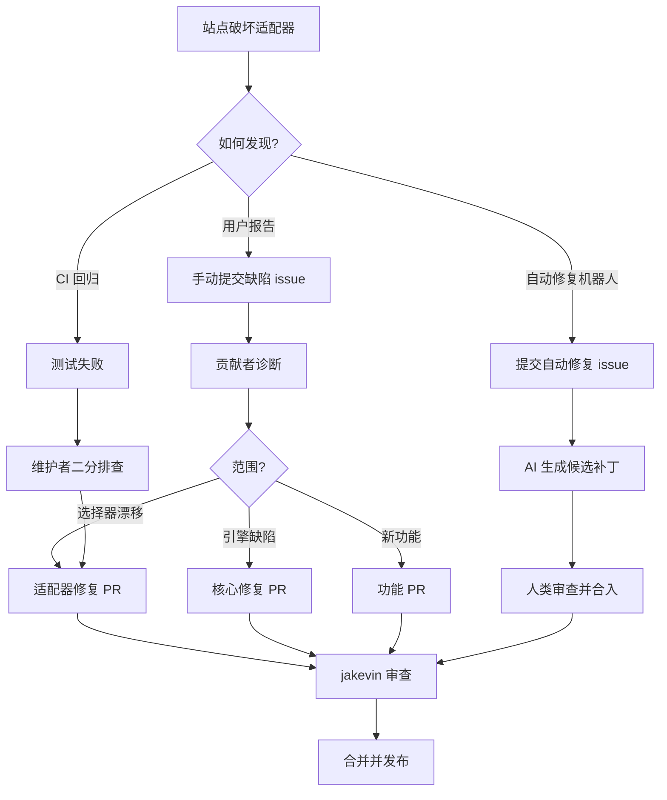
```mermaid
flowchart TD
    A[站点破坏适配器] --> B{如何发现?}
    B -->|自动修复机器人| C[提交自动修复 issue]
    B -->|用户报告| D[手动提交缺陷 issue]
    B -->|CI 回归| E[测试失败]
    
    C --> F[AI 生成候选补丁]
    F --> G[人类审查并合入]
    
    D --> H[贡献者诊断]
    H --> I{范围?}
    I -->|选择器漂移| J[适配器修复 PR]
    I -->|引擎缺陷| K[核心修复 PR]
    I -->|新功能| L[功能 PR]
    
    E --> M[维护者二分排查]
    M --> J
    
    J --> N[jakevin 审查]
    K --> N
    L --> N
    G --> N
    
    N --> O[合并并发布]
```

## 社区形态

查看[开放的 PR 列表](https://github.com/jackwener/opencli/pulls)（145 个开放，1,711 个已关闭），贡献者基础可分为三个层次：

1. **核心（1–2 人）** — jakevin 负责版本发布、核心引擎工作以及新适配器脚手架。这既是瓶颈也是保障：每个 PR 都经由他们合入。

2. **常客（10–15 人）** — 像 Vec、Zhongyue Lin、cat0825、Jiacheng、vecyang1 这样的贡献者，他们跨越多个 PR 周期持续贡献，并在特定适配器或子系统上积累领域专业知识。

3. **长尾（100+ 人）** — 大多数贡献者只提交单个 PR：一次适配器修复，一次打包改进，一次 Windows 可移植性补丁。这是健康的——这意味着项目的准入门槛低，人们无需理解完整架构即可贡献。

[自动修复系统](https://github.com/jackwener/OpenCLI/issues/2428) 增加了一个有趣的转折：OpenCLI 可以自动检测适配器故障并提交带有修复建议的 issue。标记为 `[autofix]` 的 issue（如 [#2408](https://github.com/jackwener/OpenCLI/issues/2408)、[#2428](https://github.com/jackwener/OpenCLI/issues/2428)、[#2421](https://github.com/jackwener/OpenCLI/issues/2421)）代表了项目自身的运行时自诊断故障。这将传统的 "用户报告缺陷 → 贡献者修复" 流程转变为更紧密的闭环，工具本身就能精确暴露故障模式。

## 此贡献者群体的非凡之处

大多数拥有 14K+ 星标的 CLI 工具都有企业支持或基金会背书。OpenCLI 两者皆无——它是一个人加上一个由站点特定专家组成的社区。其架构使这成为可能：适配器是隔离的（`clis/<site>/`），命令注册表会自动发现它们，并且测试夹具是按站点划分的。你可以在对 Twitter 适配器或浏览器桥接内部一无所知的情况下，贡献一个小红书修复。

这种架构隔离并非偶然。正是它让[长尾贡献者](https://github.com/jackwener/opencli/pulls?q=is%3Apr+is%3Aclosed)得以存在——也正是它让项目在适配器维护具有西西弗斯式特性的情况下仍具可持续性。每个站点终将再次出故障。问题在于，当故障发生时，了解该站点的贡献者是否还在。OpenCLI 的设计让*新*贡献者在老贡献者离开时能够轻松介入。

这才是贡献者名单背后的真实故事：不是英雄名册，而是一个让英雄主义变得不必要的系统。

---

<!-- zread:slug=7-architecture-overview -->
## 7. Architecture Overview（Deep Dive）

OpenCLI 是一个**统一的 CLI 接口**，能将任何网站、浏览器会话、Electron 应用或本地工具转换为确定性的命令行界面——人类与 AI Agent 皆可使用。其架构围绕五个内聚层展开：快速路径入口点、命令注册表、管道执行器、浏览器自动化桥接和可扩展系统。每一层均具备单一职责，并通过定义良好的接口进行通信，使得系统具备可组合性、可测试性及抗变性。

来源: [main.ts](/src/main.ts#L1-L183), [README.md](/README.md#L1-L18)

## 启动架构：两阶段引导

OpenCLI 采用**两阶段启动**策略以最小化感知延迟。第一阶段处理完全绕过完整发现的超快速路径；第二阶段仅在需要执行真实命令时，才支付完整的启动开销。

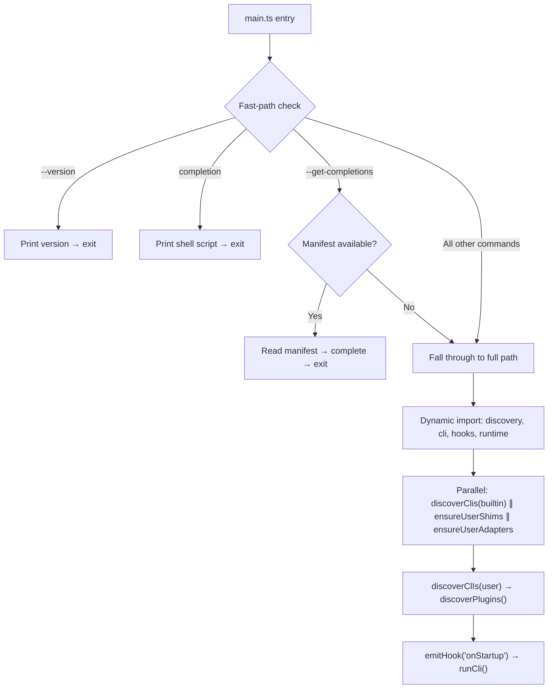
```mermaid
flowchart TD
    A["main.ts entry"] --> B{"Fast-path check"}
    B -->|"--version"| C["Print version → exit"]
    B -->|"completion <shell>"| D["Print shell script → exit"]
    B -->|"--get-completions"| E{"Manifest available?"}
    E -->|Yes| F["Read manifest → complete → exit"]
    E -->|No| G["Fall through to full path"]
    B -->|"All other commands"| G
    G --> H["Dynamic import: discovery, cli, hooks, runtime"]
    H --> I["Parallel: discoverClis(builtin) ∥ ensureUserShims ∥ ensureUserAdapters"]
    I --> J["discoverClIs(user) → discoverPlugins()"]
    J --> K["emitHook('onStartup') → runCli()"]
```

**阶段 1**（`main.ts` 第 35–97 行）仅针对预编译的 `cli-manifest.json` 执行同步文件读取，处理 `--version`、`completion` 和 `--get-completions`。无动态导入，无发现过程，无注册表——进程在微秒级内退出。

**阶段 2**（第 99–182 行）为完整启动路径。它动态导入所有重型模块（`discovery`、`cli`、`hooks`、`runtime`），随后并行化三个独立的 I/O 操作：内置适配器发现、用户目录 shim 设置及用户适配器目录创建。用户 CLI 发现运行于内置发现**之后**，以保持预期的覆盖顺序（当名称冲突时，用户适配器会遮蔽内置适配器）。插件发现最后运行，因为插件可能同时覆盖两者。

来源: [main.ts](/src/main.ts#L33-L129)

## 核心层：命令注册表

**命令注册表**是 OpenCLI 的中枢神经系统。它是一个存储在 `globalThis.__opencli_registry__` 上的全局单例 `Map<string, CliCommand>`，用于确保在所有模块副本间共享唯一实例——对于通过 `npm link` 或 `peerDependency` 符号链接加载的插件而言，这是一项关键设计决策，否则它们将在独立的模块图中创建重复的 `Map` 实例。

每个适配器——无论是内置、用户定义还是插件提供——均通过相同的 `cli()` 函数进行注册，该函数将命令规范化并将其插入注册表。键格式为 `site/name`（例如 `hackernews/top`），后续具有相同键的注册会覆盖先前的注册，从而确立确定性的**覆盖级联**：内置 → 用户 → 插件。

注册表的类型系统区分了**浏览器命令**（接收 `IPage` 接口）与**非浏览器命令**（纯参数操作）。这一区分驱动了每个下游层的能力路由、会话管理和执行策略。

| 字段 | 用途 | 示例 |
|-------|---------|---------|
| `site` | 命名空间 / 网站标识 | `hackernews` |
| `name` | 站点内的子命令 | `top` |
| `strategy` | 访问模式: `public`, `local`, `cookie`, `intercept`, `ui` | `cookie` |
| `browser` | 命令是否需要 `IPage` | `true` |
| `pipeline` | YAML 步骤定义（`func` 的替代方案） | `[{fetch: ...}, {select: ...}]` |
| `navigateBefore` | 预导航 URL 或会话标志 | `"https://x.com"` |
| `access` | 用于会话租约的读/写分类 | `read` |
| `args` | 用于验证与帮助的参数模式 | `[{name: "limit", type: "int"}]` |

`normalizeCommand()` 函数是将 `strategy` 解码为具体运行时字段（`browser`、`navigateBefore`）的**唯一权威**。规范化后，下游执行代码绝不直接读取 `cmd.strategy`——而是读取已解析的字段。覆盖优先级为：显式命令字段 > 策略派生默认值。

来源: [registry.ts](/src/registry.ts#L1-L200)

## 适配器发现：清单优先加载

适配器发现遵循**清单优先**策略并辅以文件系统回退。在生产环境（构建后）中，预编译的 `cli-manifest.json` 与 `clis/` 目录并存，无需加载任何 JavaScript 模块即可实现所有命令的即时注册。TypeScript 模块被标记为 `_lazy: true` 并存储其 `_modulePath`——仅在命令实际执行时才按需导入。

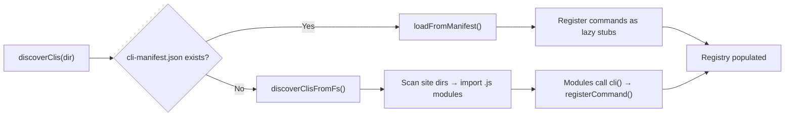
```mermaid
flowchart LR
    A["discoverClis(dir)"] --> B{"cli-manifest.json exists?"}
    B -->|Yes| C["loadFromManifest()"]
    C --> D["Register commands as lazy stubs"]
    B -->|No| E["discoverClisFromFs()"]
    E --> F["Scan site dirs → import .js modules"]
    F --> G["Modules call cli() → registerCommand()"]
    D --> H["Registry populated"]
    G --> H
```

发现系统识别三种适配器来源：

| 来源 | 位置 | 加载方式 | 覆盖优先级 |
|--------|----------|---------|-------------------|
| **内置** | `<package-root>/clis/` | 清单（延迟）或文件系统扫描 | 最低 |
| **用户** | `~/.opencli/clis/` | 与内置相同 | 中（遮蔽内置） |
| **插件** | `~/.opencli/plugins/<name>/` | 逐插件子目录扁平扫描 | 最高（遮蔽所有） |

用户 CLI 的兼容性通过位于 `~/.opencli/node_modules/@jackwener/opencli` 的**符号链接 shim** 维持，该 shim 指向已安装的包根目录，允许用户适配器通过标准 Node.js ESM 解析执行 `import { cli } from '@jackwener/opencli/registry'`。

来源: [discovery.ts](/src/discovery.ts#L1-L194)

## 执行引擎：命令调度管道

当用户调用 `opencli hackernews top --limit 5` 时，执行流程将按照由 `execution.ts` 编排的验证、会话管理与调度步骤的精确序列进行：

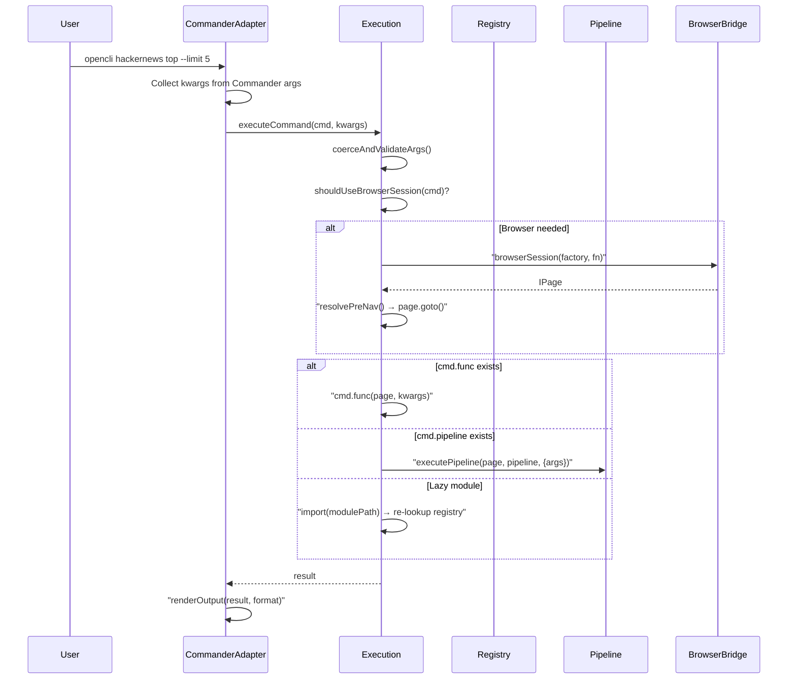
```mermaid
sequenceDiagram
    participant User
    participant CommanderAdapter
    participant Execution
    participant Registry
    participant Pipeline
    participant BrowserBridge

    User->>CommanderAdapter: opencli hackernews top --limit 5
    CommanderAdapter->>CommanderAdapter: Collect kwargs from Commander args
    CommanderAdapter->>Execution: executeCommand(cmd, kwargs)
    Execution->>Execution: coerceAndValidateArgs()
    Execution->>Execution: shouldUseBrowserSession(cmd)?
    alt Browser needed
        Execution->>BrowserBridge: "browserSession(factory, fn)"
        BrowserBridge-->>Execution: IPage
        Execution->>Execution: "resolvePreNav() → page.goto()"
    end
    alt cmd.func exists
        Execution->>Execution: "cmd.func(page, kwargs)"
    else cmd.pipeline exists
        Execution->>Pipeline: "executePipeline(page, pipeline, {args})"
    else Lazy module
        Execution->>Execution: "import(modulePath) → re-lookup registry"
    end
    Execution-->>CommanderAdapter: result
    CommanderAdapter->>CommanderAdapter: "renderOutput(result, format)"
```

`executeCommand()` 函数是所有命令执行的**单一入口点**。它负责处理：(1) 依据 `Arg[]` 模式进行参数强制转换与验证，(2) 通过 `shouldUseBrowserSession()` 能力路由管理浏览器会话生命周期，(3) 针对基于 cookie 策略的域名预导航，(4) 超时强制执行，(5) 支持用户适配器热重载的延迟模块加载，以及 (6) 生命周期钩子触发（`onBeforeExecute`、`onAfterExecute`）。

**延迟加载与热重载**：当命令通过清单以 `_lazy: true` 注册时，其模块将在首次执行时导入。对于用户适配器，系统会跟踪文件 `mtime`，并在磁盘上的源文件发生更改时使缓存失效——无需重启守护进程即可实现适配器的迭代开发。

来源: [execution.ts](/src/execution.ts#L1-L200), [commanderAdapter.ts](/src/commanderAdapter.ts#L1-L150)

## 管道执行器：声明式适配器 DSL

管道系统提供了一种**声明式 YAML DSL**，作为命令式 JavaScript 函数的替代方案。每个管道都是一个有序的步骤序列，其中一步的输出将作为 `data` 输入至下一步。这使得适配器能够完全以数据形式表达——无需编写代码。

| 步骤类别 | 步骤 | 需要浏览器 |
|---------------|-------|-----------------|
| **导航与交互** | `navigate`, `click`, `type`, `fill`, `wait`, `press` | ✅ |
| **观察** | `snapshot`, `evaluate`, `intercept` | ✅ |
| **数据获取** | `fetch` | ❌ |
| **转换** | `select`, `map`, `filter`, `sort`, `limit` | ❌ |
| **控制流** | `tap`, `download` | ❌ / ✅ |

管道注册表是**动态可扩展的**——插件可调用 `registerStep()` 以添加自定义操作。`capabilityRouting` 模块维护了一个 `BROWSER_ONLY_STEPS` 集合，该集合作为完整注册表的子集接受验证，确保系统能在无需检查步骤内部细节的情况下，准确判断某管道是否需要浏览器会话。

**步骤重试**：纯浏览器步骤在遇到瞬态错误（例如元素尚未挂载）时会自动重试最多 2 次，两次尝试间隔 1 秒。非浏览器步骤默认不进行重试。

来源: [pipeline/executor.ts](/src/pipeline/executor.ts#L1-L111), [pipeline/registry.ts](/src/pipeline/registry.ts#L1-L76), [capabilityRouting.ts](/src/capabilityRouting.ts#L1-L56)

## 浏览器自动化：守护进程桥接架构

OpenCLI 的浏览器自动化采用**微守护进程**架构，通过轻量级 HTTP + WebSocket 守护进程及配套的 Chrome 扩展，在 CLI 进程与 Chrome 之间建立桥接：

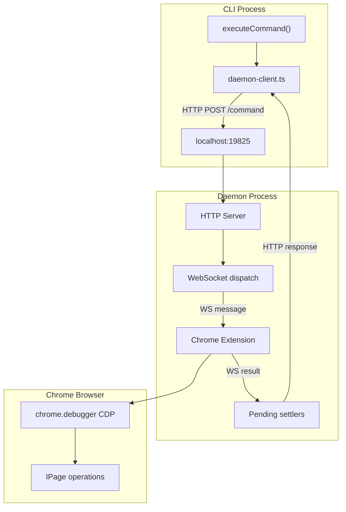
```mermaid
flowchart TD
    subgraph "CLI Process"
        A["executeCommand()"] --> B["daemon-client.ts"]
        B -->|"HTTP POST /command"| C["localhost:19825"]
    end
    subgraph "Daemon Process"
        C --> D["HTTP Server"]
        D --> E["WebSocket dispatch"]
        E -->|"WS message"| F["Chrome Extension"]
        F -->|"WS result"| G["Pending settlers"]
        G -->|"HTTP response"| B
    end
    subgraph "Chrome Browser"
        F --> H["chrome.debugger CDP"]
        H --> I["IPage operations"]
    end
```

守护进程提供了**深度防御安全**：(1) 源检查拒绝非扩展来源，(2) 要求自定义 `X-OpenCLI` 头，(3) 命令端点无 CORS 头，(4) 1 MB 请求体大小限制，以及 (5) WebSocket 在升级前执行 `verifyClient` 拒绝。

**会话租约**将针对同一 Chrome 标签页的并发写入命令序列化。`SessionLeaseRegistry` 通过基于 TTL 的过期机制追踪活跃持有者，因此崩溃的 CLI 进程无法永久锁定标签页。若持有陈旧租约的持有者仍有命令在执行中，则视为活跃——命令完成结算会刷新租约 TTL。

**`IPage` 接口**是浏览器操作的统一抽象。它定义了涵盖导航、DOM 交互（`click`、`fillText`、`typeText`）、观察（`snapshot`、`evaluate`）、网络捕获、标签页管理及 CDP 透传的 40 余种方法。所有管道步骤与适配器函数均针对此接口操作，使其与底层传输机制解耦。

来源: [daemon.ts](/src/daemon.ts#L1-L100), [types.ts](/src/types.ts#L72-L157), [runtime.ts](/src/runtime.ts#L1-L80)

## 策略模型：适配器如何访问数据

`Strategy` 枚举定义了五种访问模式，决定了适配器从目标网站检索数据的方式：

| 策略 | 机制 | 需要浏览器 | 典型用途 |
|----------|-----------|---------------|-------------|
| `PUBLIC` | 直接 HTTP 获取（无需认证） | ❌ | 公开 API，RSS 订阅源 |
| `LOCAL` | 本地二进制调用 | ❌ | `gh`、`docker`，CLI 工具 |
| `COOKIE` | 携带 cookie 的浏览器上下文获取 | ✅ | 需认证的 API 端点 |
| `INTERCEPT` | 导航 + 拦截网络响应 | ✅ | 包含 XHR/SPA 模式的站点 |
| `UI` | 完整 DOM 交互（点击、填充、提取） | ✅ | 无 API 端点的站点 |

`normalizeCommand()` 函数将策略展开为具体的运行时字段。例如，`domain` 为 `"x.com"` 的 `COOKIE` 策略会设置 `navigateBefore: "https://x.com"`——执行引擎将预导航至该 URL，确保浏览器的 cookie jar 已填充，以便后续的 `fetchJson()` 调用。`INTERCEPT` 策略设置 `navigateBefore: true`，表明需要经过认证的浏览器上下文，但没有具体的预导航 URL。

来源: [registry.ts](/src/registry.ts#L7-L13), [registry.ts](/src/registry.ts#L184-L200)

## 可扩展层：插件、技能与钩子

OpenCLI 提供了三种互补的可扩展机制：

**插件**是从 Git 仓库、本地目录或单体仓库安装的独立包。它们位于 `~/.opencli/plugins/<name>/`，可以注册命令、生命周期钩子及自定义管道步骤。插件系统管理安装、版本锁定（`plugins.lock.json`）、兼容性检查及卸载。在命令注册表中，插件具有**最高覆盖优先级**。

**AI Agent 技能**是基于 Markdown 的知识包（例如 `opencli-browser`、`opencli-adapter-author`、`opencli-autofix`），用于指导 Claude Code 或 Cursor 等 AI 编码 Agent。每项技能位于 `skills/<name>/` 目录，包含一个 `SKILL.md` 前置元数据文件及可选的辅助文档。它们通过 `opencli skills read <skill>` 读取，并注入到 Agent 上下文中。

**生命周期钩子**采用与命令注册表相同的 `globalThis` 单例模式，以确保跨模块实例的一致性。提供三个钩子点：

| 钩子 | 时机 | 用例 |
|------|--------|-----------|
| `onStartup` | 所有发现完成后，首个命令执行前 | 初始化外部服务，注册自定义步骤 |
| `onBeforeExecute` | 每次命令执行前 | 日志记录，参数修改，访问控制 |
| `onAfterExecute` | 每次命令执行后 | 指标收集，结果后处理 |

钩子处理程序被 try/catch 包裹——失败的钩子**绝不阻塞**命令执行，从而维持系统的故障隔离保证。

来源: [plugin.ts](/src/plugin.ts#L1-L69), [skills.ts](/src/skills.ts#L1-L42), [hooks.ts](/src/hooks.ts#L1-L92)

## 架构原则

| 原则 | 实现 |
|-----------|---------------|
| **单例一致性** | 注册表与钩子使用 `globalThis` 以在跨符号链接边界的模块去重中存活 |
| **覆盖级联** | 内置 → 用户 → 插件，采用后注册者胜出的语义 |
| **默认延迟** | 基于清单的发现将模块加载推迟至执行时 |
| **能力路由** | 策略与管道分析决定浏览器需求，无需运行时探测 |
| **故障隔离** | 钩子被防火墙隔离；瞬态浏览器错误触发步骤级重试；守护进程租约自动过期 |
| **并行启动** | 独立 I/O 操作通过 `Promise.all` 并发运行以缩减启动时间 |

<CgxTip>`globalThis.__opencli_registry__` 模式绝非偶然——它是使插件在通过 `npm link` 加载时仍能正确工作的关键枢纽。若无此机制，每个模块副本将拥有各自的空 `Map`，插件注册的命令将从 CLI 视图中消失。此模式同样适用于钩子存储。</CgxTip>

<CgxTip>编写新适配器时，选择正确的 `strategy` 是最具影响力的设计决策。`PUBLIC` 适配器启动极快（无需浏览器会话）。`COOKIE` 适配器速度快但需登录。`INTERCEPT` 与 `UI` 适配器最为强大，但需支付完整的浏览器会话开销。基于管道的适配器（使用 `pipeline` 字段而非 `func`）在遇到瞬态浏览器错误时，会自动执行步骤级重试。</CgxTip>

## 接下来去往何处

架构概述确立了概念框架。若要深入了解特定子系统：

- **[命令注册表系统](8-command-registry-system)** — `cli()`、`normalizeCommand()` 及覆盖级联的详细工作原理
- **[管道执行器](9-pipeline-executor)** — YAML DSL、步骤处理程序、模板渲染及重试语义
- **[适配器发现与加载](10-adapter-discovery-and-loading)** — 清单编译、文件系统回退及插件扫描
- **[浏览器桥接与守护进程](11-browser-bridge-and-daemon)** — 守护进程协议、会话租约及配置文件管理
- **[管道 DSL 语法](14-pipeline-dsl-syntax)** — 编写基于管道适配器的实用参考
- **[插件系统](17-plugin-system)** — 插件清单、安装及生命周期

---

<!-- zread:slug=8-command-registry-system -->
## 8. Command Registry System（Deep Dive）

> [!warning] 此页获取失败：请求超时（>120s）：opencli read jackwener/opencli --slug 8-command-registry-system --lang zh
> zread 服务端偶发故障。重跑同一命令可断点续跑（已成功页自动跳过）。

---

<!-- zread:slug=9-pipeline-executor -->
## 9. Pipeline Executor（Deep Dive）

**流水线执行器**（Pipeline Executor）是 OpenCLI 适配器运行时的核心顺序步骤求值引擎。它将声明式的 YAML 步骤列表转换为命令式的数据流计算，通过解析模板表达式、强制执行浏览器能力约束以及应用瞬态错误重试语义，将可变的 `data` 值依次穿透传递给每个步骤。使用 YAML DSL 编写的每个适配器最终都会汇聚于此执行器——理解其运行机制对于调试、扩展和优化适配器流水线至关重要。

## 执行模型

流水线执行器处理一个有序的步骤对象数组，其中每个对象仅包含一个映射到其参数的操作键。**单个可变的 `data` 值**在所有步骤中依次传递：步骤 *N* 的返回值将成为步骤 *N+1* 的输入 `data`。这种累加器模式意味着流水线的最终输出就是其最后一步的返回值。

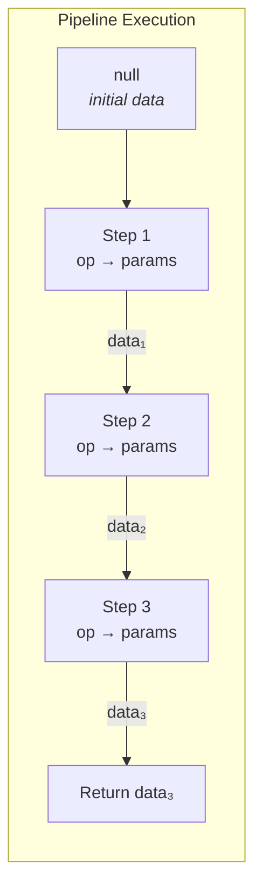
```mermaid
flowchart LR
    subgraph Pipeline Execution
        direction TB
        S0["null<br/><i>initial data</i>"] --> S1["Step 1<br/>op → params"]
        S1 -->|data₁| S2["Step 2<br/>op → params"]
        S2 -->|data₂| S3["Step 3<br/>op → params"]
        S3 -->|data₃| OUT["Return data₃"]
    end
```

`executePipeline` 中的核心循环会迭代每个步骤，通过 `Object.entries(step)` 解析其操作键和参数，通过 `getStep(op)` 查找已注册的处理程序，并将 `data` 替换为该处理程序的返回值。如果处理程序未注册，则会立即抛出 `ConfigError`，并附带步骤索引和修复提示。当出现任何未处理的异常时，执行器会尝试通过 `page.closeWindow()` 释放浏览器标签页租约，然后重新抛出异常——从而防止在流水线失败时出现孤立的自动化窗口。

来源: [executor.ts](/src/pipeline/executor.ts#L23-L55)

## 步骤处理程序契约

每个流水线步骤——无论是内置的还是通过插件注册的——都遵循统一的 `StepHandler` 签名：

| 参数 | 类型 | 用途 |
|-----------|------|---------|
| `page` | `IPage \| null` | 浏览器会话；对于纯数据步骤为 `null` |
| `params` | `unknown` | 来自 YAML 步骤定义的原始参数 |
| `data` | `unknown` | 从上一步累积的数据 |
| `args` | `Record<string, unknown>` | 通过 `PipelineContext` 传递的 CLI 参数 |

处理程序返回 `Promise<unknown>`——其解决值将成为下一步的 `data` 输入。浏览器交互步骤（navigate、click、evaluate 等）需要非空 `page`，并将调用 `IPage` 接口上的方法。纯数据转换步骤（select、map、filter、sort、limit）完全忽略 `page`，使其能够在无头/非浏览器上下文中运行。

来源: [registry.ts](/src/pipeline/registry.ts#L18-L24)

## 步骤注册表与动态扩展

步骤注册表是一个 `Map<string, StepHandler>`，在模块加载时用所有核心步骤填充。`registerStep(name, handler)` 函数被公开导出，允许插件和外部模块在流水线执行开始前注入自定义操作。

**核心注册步骤**——在导入时自动注册：

| 类别 | 步骤名称 | 需要浏览器 |
|----------|-----------|-----------------|
| **浏览器交互** | `navigate`, `click`, `type`, `fill`, `wait`, `press`, `snapshot`, `evaluate` | ✅ |
| **网络** | `fetch`, `intercept`, `tap` | `fetch`: 视情况而定；其他: ✅ |
| **数据转换** | `select`, `map`, `filter`, `sort`, `limit` | ❌ |
| **I/O** | `download` | ❌ (但在可用时使用浏览器 cookies) |

`getRegisteredStepNames()` 函数返回所有当前的键——`validate.ts` 使用它来将步骤名称加入白名单，而无需维护并行的硬编码列表。能力路由中的 `BROWSER_ONLY_STEPS` 集合在测试时被验证为已注册步骤的严格子集，确保在步骤重命名或移除后不会遗留过时的仅限浏览器声明。

来源: [registry.ts](/src/pipeline/registry.ts#L44-L76), [capabilityRouting.ts](/src/capabilityRouting.ts#L14-L26)

## 重试与瞬态错误处理

每个步骤的执行都包裹在 `executeStepWithRetry` 中，它应用了可配置的重试策略：

- **仅限浏览器的步骤**默认重试 **2 次**（共 3 次尝试）
- **所有其他步骤**默认重试 **0 次**（立即失败）
- `PipelineContext` 中的自定义 `stepRetries` 会覆盖所有步骤的默认设置
- 重试**仅在发生瞬态浏览器错误时触发**——非瞬态失败会立即传播
- 重试尝试之间有 1 秒的延迟，以允许浏览器会话稳定下来

瞬态错误分类使用 `isTransientBrowserError()`，它能识别 CDP 断开连接、导航超时以及类似的短暂等待后可自我恢复的条件。这种设计确保了不稳定的浏览器交互（在动态 SPA 中很常见）能够优雅地恢复，而不会掩盖适配器定义中真正的逻辑错误。

来源: [executor.ts](/src/pipeline/executor.ts#L57-L77)

## 模板引擎 (${{ }} 表达式)

模板引擎在每个步骤处理程序执行之前解析步骤参数内的 `${{ ... }}` 表达式。它按递增的成本和能力分为三个解析层级操作：

### 第 1 层：点路径解析
像 `args.limit`、`item.title`、`data.items.0` 这样的简单属性查找，通过遍历上下文对象来解析，无需任何 JS 求值。根命名空间为 `args`（CLI 参数）、`item`（当前迭代项）、`data`（累加器）、`root`（`select` 之前的原始数据）和 `index`（循环计数器）。无前缀的路径隐式解析为 `item`。

### 第 2 层：管道过滤器
表达式支持 Jinja2 风格的管道语法：`expr | filter1 | filter2(arg)`。管道在单个 `|`（而不是 `||`）上分割，因此逻辑 OR 可以自然共存。内置过滤器：

| 过滤器 | 示例 | 描述 |
|--------|---------|-------------|
| `default(val)` | `item.x \| default(0)` | null/undefined/空值的回退 |
| `join(sep)` | `item.tags \| join(,)` | 数组转字符串 |
| `upper` / `lower` | `item.name \| upper` | 大小写转换 |
| `truncate(n)` | `item.text \| truncate(50)` | 使用 `...` 截断 |
| `replace(old,new)` | `item.path \| replace(/,_)` | 字符串替换 |
| `length` | `item.list \| length` | 数组/字符串长度 |
| `first` / `last` | `item.rows \| first` | 数组的首/尾元素 |
| `keys` | `item \| keys` | 对象键 |
| `json` | `item \| json` | JSON 序列化 |
| `slugify` | `item.title \| slugify` | URL 安全的 slug |
| `sanitize` | `item.name \| sanitize` | 文件名安全字符 |
| `urlencode` / `urldecode` | `item.q \| urlencode` | URL 编码 |

### 第 3 层：沙箱化 JS 求值
复杂表达式（三元运算、算术运算、`||`、`??`、方法调用）会穿透至 `node:vm` 沙箱。该沙箱：

- **切断原型链**，通过 `sanitizeContext()`（带有 BigInt 强制转换的 JSON 往返转换），防止 `constructor.constructor('return process')()` 逃逸
- **缓存编译后的 `vm.Script` 对象**在 LRU 限制的映射中（最多 256 个条目），以避免在循环中重新编译
- **在求值之间复用单个 V8 上下文**——`vm.createContext()` 每次调用耗时约 0.3 毫秒；复用消除了在评估数百个项的 `map`/`filter` 循环中的这种开销
- **阻止禁止的模式**：`constructor`、`__proto__`、`prototype`、`globalThis`、`process`、`require`、`import`、`eval`
- **强制每个表达式 50 毫秒的超时**和 2000 字符的长度限制
- **在求值之间清理非白名单沙箱键**，以防止 `${{ x = 42 }}` 将 `x` 泄漏到后续调用中

来源: [template.ts](/src/pipeline/template.ts#L1-L97), [template.ts](/src/pipeline/template.ts#L200-L341)

## 步骤类别深入探讨

### 浏览器交互步骤

这些步骤需要活跃的 `IPage` 会话，并构成浏览器自动化的骨干：

| 步骤 | 参数 | 数据流 |
|------|-----------|-----------|
| `navigate` | `{ url, waitUntil, settleMs }` 或字符串 URL | 保留传入的 `data` |
| `click` | 选择器字符串（去除前导 `@`） | 保留传入的 `data` |
| `type` | `{ ref, text, submit }` | 保留传入的 `data` |
| `fill` | `{ ref, text, submit }` | 保留传入的 `data` |
| `wait` | 数字（毫秒），`{ text, timeout }`，或 `{ time }` | 保留传入的 `data` |
| `press` | 按键名称字符串 | 保留传入的 `data` |
| `snapshot` | `{ interactive, compact, max_depth, raw }` | **替换** `data` 为 DOM 快照 |
| `evaluate` | JS 源码字符串 | **替换** `data` 为求值结果 |

请注意关键区别：`navigate`、`click`、`type`、`fill`、`wait` 和 `press` 是**副作用步骤**，它们执行浏览器操作但**保留传入的数据**——它们不会覆盖累加器。相比之下，`snapshot` 和 `evaluate` 用其返回值**替换**数据。这种区别决定了适配器如何链式调用步骤：获取 API 数据的 `evaluate` 必须位于任何转换步骤之前，而 navigation/click 步骤可以自由穿插其中而不会导致数据丢失。

来源: [browser.ts](/src/pipeline/steps/browser.ts#L1-L87)

### 数据转换步骤

重塑累加器而不进行浏览器交互的纯函数：

- **`select`**——从 `data` 中提取点路径（例如，`data.list` → 数组）。遍历对象和数字数组索引。
- **`map`**——数组上的逐项投影。支持内联 `select` 以在映射前提取嵌套数组。每次迭代将 `item` 和 `index` 暴露给模板上下文，加上用于访问 select 前原始数据的 `root`。
- **`filter`**——保留表达式求值为真的数组项。
- **`sort`**——按键排序，使用 `localeCompare({ numeric: true })` 实现自然数字排序。支持 `order: 'desc'`。非变异操作（排序前展开）。
- **`limit`**——将数组切片为 N 项。接受模板表达式以实现动态限制。

来源: [transform.ts](/src/pipeline/steps/transform.ts#L1-L72)

### 网络步骤

- **`fetch`**——HTTP API 请求，具有两种执行模式：单 URL 获取和按项批量获取。当 `data` 是数组且 URL 模板包含 `item` 时，它为每个项渲染一个 URL。在浏览器上下文中，批量获取使用 **`fetchBatchInBrowser`**——一个单独的 `evaluate()` 调用，在 V8 引擎内注入一个并发工作池，从而消除 N-1 次跨进程 IPC 往返。在没有浏览器的情况下，它会回退到使用 Node.js `fetch()` 的 `mapConcurrent`。支持 `concurrency`、`method`、`params` 和 `headers` 选项。

- **`intercept`**——声明式 XHR 拦截：在触发操作前注入 fetch/XHR 代理，执行触发器（`navigate:`、`evaluate:`、`click:` 或 `scroll`），等待与 URL 模式匹配的捕获响应，然后可选地从结果中 `select` 嵌套路径。

- **`tap`**——SPA 框架的 Store Action Bridge：按名称定位 Pinia 或 Vuex 存储，调用 store action，使用双重 fetch/XHR 拦截捕获由该 action 触发的网络响应，并可选地从结果中子选择。自动生成一个自包含的 IIFE，在 `finally` 块中处理设置、action 调用、捕获等待和清理。

来源: [fetch.ts](/src/pipeline/steps/fetch.ts#L1-L144), [intercept.ts](/src/pipeline/steps/intercept.ts#L1-L68), [tap.ts](/src/pipeline/steps/tap.ts#L1-L117)

### I/O 步骤

- **`download`**——具有并发控制、进度跟踪、文件名模板和 cookie 转发的文件下载。支持直接 HTTP 下载、针对视频平台的 yt-dlp 集成、用于认证下载的 Netscape 格式浏览器 cookie 导出以及去重。每个下载的项都会被扩充一个 `_download` 子对象，其中包含 `status`、`path`、`size` 和 `duration`。

来源: [download.ts](/src/pipeline/steps/download.ts#L1-L90)

## 能力路由

在流水线执行之前，`shouldUseBrowserSession()` 确定是否需要浏览器会话。对于基于流水线的命令，它根据 `BROWSER_ONLY_STEPS` 检查每个步骤的操作键。如果没有步骤需要浏览器，流水线可以在纯数据模式下运行——无需启动 Chrome，无需扩展握手，无需 CDP 连接。此优化对于从不接触页面的仅 API 适配器至关重要。

子集关系（`BROWSER_ONLY_STEPS ⊆ registeredSteps`）由能力路由测试套件中的 `_validateBrowserOnlyStepsAgainstRegistry()` 验证，确保每个声明的仅限浏览器步骤实际存在于注册表中。

来源: [capabilityRouting.ts](/src/capabilityRouting.ts#L1-L56)

## 与命令执行的集成

流水线执行器通过 `execution.ts` 中的 `runCommand()` 内的两条路径被调用：

1. **延迟加载的适配器**：当命令具有 `_lazy: true` 和 `_modulePath` 时，执行器首先动态导入适配器模块（通过 mtime 跟踪为用户适配器提供热重载支持），然后对新加载的命令定义调用 `executePipeline(page, updated.pipeline, { args, debug })`。

2. **预先加载的命令**：当 `cmd.pipeline` 已被填充时，执行器直接调用 `executePipeline(page, cmd.pipeline, { args, debug })`。

在这两种情况下，对于非浏览器命令，`page` 参数为 `null`，对于浏览器命令，则是活跃的 `IPage` 实例。`args` 对象携带完整验证/强制转换的 CLI 参数。`debug` 标志启用每步日志记录，显示操作名称、参数预览和结果形状（项数、字典键或字符串预览）。

来源: [execution.ts](/src/execution.ts#L80-L109)

<CgxTip>在编写 YAML 适配器时，请记住**有副作用的浏览器步骤（navigate、click、type、fill、wait、press）保留传入的数据**，而**产生数据的步骤（evaluate、snapshot、fetch、intercept、tap、download）替换它**。可以自由穿插导航，但始终确保数据产生步骤位于你的转换链之前。</CgxTip>

<CgxTip>模板引擎的**管道过滤器语法**（`item.name | upper | truncate(30)`）在 VM 沙箱路径之前解析，使其既更安全又更快速。尽可能优先使用管道而不是原始 JS 表达式——它们完全避免了 50 毫秒的 VM 超时和沙箱开销。</CgxTip>

## 调试观察

当在 `PipelineContext` 中设置 `debug: true` 时，执行器会发出结构化的步骤级日志：

- **每步之前**：步骤编号、总计数、操作名称和参数预览（字符串截断至 80 个字符，或对象键列表）
- **每步之后**：结果形状摘要——数组的项数、对象的键列表、标量的字符串预览，或 null 的 `(no data)`

此输出流经 `log.step()` 和 `log.stepResult()`，在适配器开发期间无需修改适配器定义即可实现实时流水线追踪。

来源: [executor.ts](/src/pipeline/executor.ts#L79-L111)

## 架构概览

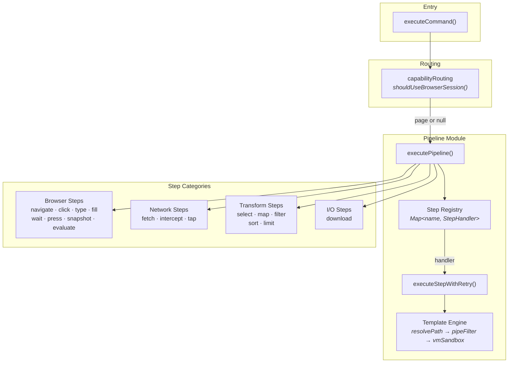
```mermaid
flowchart TB
    subgraph Entry
        EC["executeCommand()"]
    end

    subgraph Pipeline Module
        direction TB
        EP["executePipeline()"]
        SR["Step Registry<br/><i>Map&lt;name, StepHandler&gt;</i>"]
        TE["Template Engine<br/><i>resolvePath → pipeFilter → vmSandbox</i>"]
        RTRY["executeStepWithRetry()"]
    end

    subgraph Step Categories
        direction LR
        BS["Browser Steps<br/>navigate · click · type · fill<br/>wait · press · snapshot · evaluate"]
        NS["Network Steps<br/>fetch · intercept · tap"]
        TS["Transform Steps<br/>select · map · filter<br/>sort · limit"]
        DS["I/O Steps<br/>download"]
    end

    subgraph Routing
        CR["capabilityRouting<br/><i>shouldUseBrowserSession()</i>"]
    end

    EC --> CR
    CR -->|"page or null"| EP
    EP --> SR
    SR -->|handler| RTRY
    RTRY --> TE
    EP --> BS
    EP --> NS
    EP --> TS
    EP --> DS
```

流水线执行器位于命令执行层和步骤处理程序之间，提供编排骨干，用于传递数据、解析模板、应用重试和路由浏览器会话。其步骤注册表架构支持开放扩展——插件在执行前通过 `registerStep()` 注册自定义步骤，能力路由器自动发现这些步骤是否需要浏览器会话。

有关定义这些流水线的 YAML DSL 语法，请参见 [Pipeline DSL Syntax](14-pipeline-dsl-syntax)。有关适配器在流水线执行前如何被发现和加载，请参见 [Adapter Discovery & Loading](10-adapter-discovery-and-loading)。有关在整个命令执行前后触发的生命周期钩子（包裹流水线），请参见 [Lifecycle Hooks](19-lifecycle-hooks)。

---

<!-- zread:slug=10-adapter-discovery-and-loading -->
## 10. Adapter Discovery & Loading（Deep Dive）

> [!warning] 此页获取失败：请求超时（>120s）：opencli read jackwener/opencli --slug 10-adapter-discovery-and-loading --lang zh
> zread 服务端偶发故障。重跑同一命令可断点续跑（已成功页自动跳过）。

---

<!-- zread:slug=11-browser-bridge-and-daemon -->
## 11. Browser Bridge & Daemon（Deep Dive）

**Browser Bridge & Daemon** 是一个持久化的 IPC 层，用于将 OpenCLI 命令行进程与运行在用户浏览器中的 Chrome 扩展程序连接起来。它是一个 HTTP + WebSocket 微守护进程，会在首次执行浏览器命令时自动派生，在多次 CLI 调用期间保持存活，并裁决对浏览器标签页的并发访问——同时全程执行纵深防御安全策略，以抵御基于浏览器的 CSRF 攻击。

## 架构概述

该系统被组织为一个三层中继：CLI 进程通过 HTTP 与守护进程通信，守护进程通过 WebSocket 与 Chrome 扩展程序通信。这种分离使得 CLI 在调用之间保持无状态，而由守护进程持有长期存在的扩展连接和待处理命令状态。

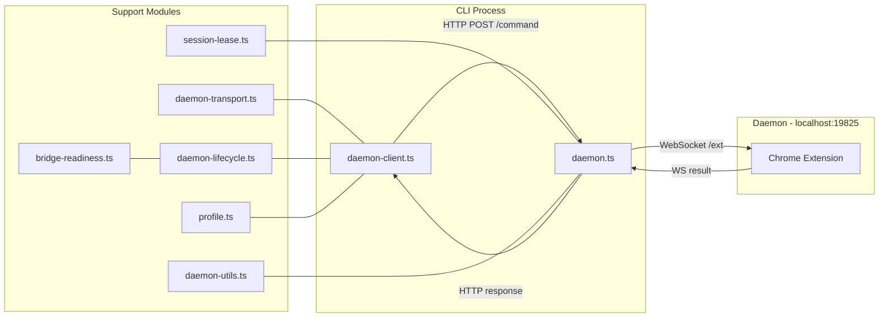
```mermaid
graph LR
    subgraph CLI Process
        A["daemon-client.ts"] -->|HTTP POST /command| B["daemon.ts"]
    end
    subgraph Daemon - localhost:19825
        B -->|WebSocket /ext| C["Chrome Extension"]
        C -->|WS result| B
        B -->|HTTP response| A
    end
    subgraph Support Modules
        D["daemon-transport.ts"] --- A
        E["daemon-lifecycle.ts"] --- A
        F["bridge-readiness.ts"] --- E
        G["session-lease.ts"] --- B
        H["daemon-utils.ts"] --- B
        I["profile.ts"] --- A
    end
```

**单条命令的数据流**：CLI → `HTTP POST /command` → 守护进程将其作为 `PendingEntry` 入队 → 守护进程通过 WebSocket 转发 → 扩展程序通过 CDP 执行 → 扩展程序通过 WebSocket 发回 JSON 结果 → 守护进程 resolve 待处理的 promise → HTTP 响应返回至 CLI。

来源：[daemon.ts](/src/daemon.ts#L1-L30), [daemon-client.ts](/src/browser/daemon-client.ts#L1-L7)

## 守护进程

守护进程 ([daemon.ts](/src/daemon.ts)) 是一个轻量级的 Node.js HTTP + WebSocket 服务器，它专门绑定到 **`127.0.0.1:19825`**。它由 CLI 在首次执行浏览器命令时自动派生，并保持存活直到显式关闭、接收到 `SIGTERM` 或卸载。它在内存中维护两个核心数据结构：

| 数据结构 | 类型 | 用途 |
|---|---|---|
| `extensionProfiles` | `Map<contextId, ExtensionProfileConnection>` | 跟踪来自 Chrome 扩展程序配置文件的 WebSocket 连接 |
| `pending` | `Map<commandId, PendingEntry>` | 等待扩展程序结果的进行中命令 |
| `sessionLeases` | `SessionLeaseRegistry` | 并发适配器命令的写入租约裁决 |

每个 `ExtensionProfileConnection` 记录了 WebSocket 句柄、Chrome 上下文 ID、扩展程序版本/兼容范围以及 `lastSeenAt` 时间戳。每个 `PendingEntry` 持有上下文 ID、操作名称、调度状态、settler promise 数组（用于重试去重）、超时定时器以及可选的租约键。

来源：[daemon.ts](/src/daemon.ts#L41-L92)

### HTTP 端点

守护进程暴露了一个小型的、特定用途的 HTTP 接口。除 `/ping` 之外，每个端点都需要自定义的 `X-OpenCLI` 标头——浏览器在没有 CORS 预检请求的情况下无法附加自定义标头，而守护进程通过返回不带 `Access-Control-Allow-*` 标头的 `204` 来拒绝预检。

| 方法 | 路径 | 认证 | 用途 |
|---|---|---|---|
| `GET` | `/ping` | 无（允许 `chrome-extension://` 源的 CORS） | 用于扩展程序可达性检测的健康探针 |
| `GET` | `/status` | 需要 `X-OpenCLI` | 守护进程健康状态、配置文件、待处理计数、内存、租约 |
| `GET` | `/logs` | 需要 `X-OpenCLI` | 扩展程序日志环形缓冲区（200 条记录） |
| `DELETE` | `/logs` | 需要 `X-OpenCLI` | 清除日志缓冲区 |
| `POST` | `/command` | 需要 `X-OpenCLI` | 将浏览器命令调度到扩展程序 |
| `POST` | `/shutdown` | 需要 `X-OpenCLI` | 优雅终止守护进程 |

`/status` 响应是守护进程的运营仪表板——它报告 PID、运行时间、守护进程版本、扩展程序连接状态、每个配置文件的待处理计数、活动会话租约以及以 MB 为单位的 RSS 内存。

来源：[daemon.ts](/src/daemon.ts#L230-L330)

### WebSocket 扩展程序通道

扩展程序在 `ws://localhost:19825/ext` 上连接。守护进程的 `verifyClient` 会拒绝任何 `Origin` 不是 `chrome-extension://` 的 WebSocket 升级请求，从而防止恶意网页冒充扩展程序（浏览器不会对 WebSocket 执行 CORS）。

连接后，守护进程启动一个**心跳周期**（每 15 秒 ping 一次，未收到 pong 达 2 次后终止）。扩展程序发送一条包含其 `contextId`、`version` 和 `compatRange` 的 `hello` 消息；守护进程将其注册到 `extensionProfiles` 中。后续消息要么是 `log` 条目（被缓冲），要么是 `ping` 保活（对于 MV3 service worker 保活而言是无操作），要么是 **command results**，用于 resolve 匹配的 `PendingEntry`。

当扩展程序断开连接时，守护进程会使用相应的错误规约使该配置文件的每个待处理命令失败——已调度的命令收到 `command_result_unknown`（结果确实未知），而尚未调度的命令收到 `profile_disconnected`（可安全地在其他地方重试）。

来源：[daemon.ts](/src/daemon.ts#L480-L598)

### 安全模型（纵深防御）

由于守护进程监听 localhost，任何本地网页都可能尝试连接，因此它采用五层保护来抵御基于浏览器的 CSRF 攻击：

1. **Origin 检查**——拒绝来自非 `chrome-extension://` 源的 HTTP/WS 请求
2. **自定义标头**——除 `/ping` 外的所有端点都需要 `X-OpenCLI`；浏览器无法在不触发 CORS 预检的情况下发送它，而预检会被拒绝
3. **命令端点无 CORS**——只有 `/ping` 返回 `Access-Control-Allow-Origin`，且仅针对 `chrome-extension://` 源
4. **请求体大小限制**——`/command` 上最大 1 MB，以防止 OOM
5. **WebSocket verifyClient**——如果源不是 Chrome 扩展程序，则在连接建立之前拒绝升级

来源：[daemon.ts](/src/daemon.ts#L1-L29), [daemon.ts](/src/daemon.ts#L214-L228)

## 守护进程生命周期管理

生命周期模块 ([daemon-lifecycle.ts](/src/browser/daemon-lifecycle.ts)) 控制 CLI 如何启动、监控和替换守护进程。核心函数是 `ensureBrowserBridgeReady()`，它实现了一个状态机：

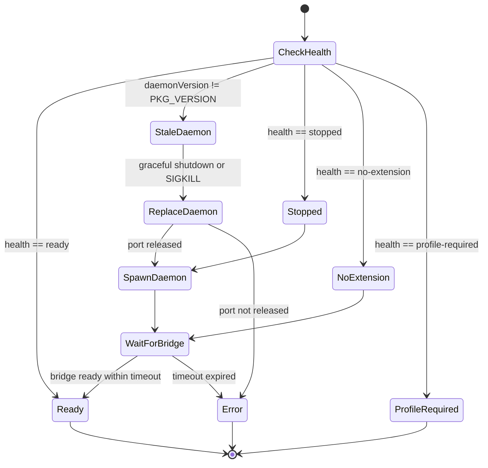
```mermaid
stateDiagram-v2
    [*] --> CheckHealth
    CheckHealth --> Ready: health == ready
    CheckHealth --> StaleDaemon: daemonVersion != PKG_VERSION
    CheckHealth --> Stopped: health == stopped
    CheckHealth --> NoExtension: health == no-extension
    CheckHealth --> ProfileRequired: health == profile-required
    StaleDaemon --> ReplaceDaemon: graceful shutdown or SIGKILL
    ReplaceDaemon --> SpawnDaemon: port released
    ReplaceDaemon --> Error: port not released
    Stopped --> SpawnDaemon
    SpawnDaemon --> WaitForBridge
    NoExtension --> WaitForBridge
    WaitForBridge --> Ready: bridge ready within timeout
    WaitForBridge --> Error: timeout expired
    Ready --> [*]
    Error --> [*]
    ProfileRequired --> [*]
```

**过期守护进程替换**：当守护进程的版本与 CLI 的 `PKG_VERSION` 不匹配时，生命周期模块首先尝试优雅关闭（`POST /shutdown`），然后等待 3 秒以释放端口。如果失败，它会通过 PID 对过期的守护进程执行 `SIGKILL`，并再等待 2 秒。只有当两者都失败时，它才会抛出 `BrowserConnectError`。

**Bridge 就绪轮询**：派生守护进程后，生命周期模块每 200 毫秒轮询一次 `getDaemonHealth()`，直到状态达到 `ready` 或超时（默认 10 秒）。这在 [bridge-readiness.ts](/src/browser/bridge-readiness.ts) 中实现。

来源：[daemon-lifecycle.ts](/src/browser/daemon-lifecycle.ts#L55-L146), [bridge-readiness.ts](/src/browser/bridge-readiness.ts#L9-L22)

### 守护进程传输

传输层 ([daemon-transport.ts](/src/browser/daemon-transport.ts)) 提供了类型化的 HTTP 辅助函数：`requestDaemon()` 使用 `X-OpenCLI: 1` 标头和 `AbortController` 超时封装了 `fetch()`；`fetchDaemonStatus()` 访问 `/status`；`getDaemonHealth()` 将状态分类为类型化的 `DaemonHealth` 可辨识联合体；`requestDaemonShutdown()` 向 `/shutdown` 发送 POST 请求。

`DaemonHealth` 类型是 CLI 的主要决策输入：

| 状态 | 含义 | 动作 |
|---|---|---|
| `stopped` | 无守护进程响应 | 派生守护进程 |
| `no-extension` | 守护进程启动，但扩展程序未连接 | 等待扩展程序 |
| `profile-required` | 多个配置文件已连接，但未选择 | 抛出异常并附带 `--profile` 提示 |
| `profile-disconnected` | 选定的配置文件离线 | 抛出异常并附带重新连接提示 |
| `ready` | 守护进程 + 扩展程序 + 配置文件均正常 | 继续执行 |

来源：[daemon-transport.ts](/src/browser/daemon-transport.ts#L56-L77)

## Browser Bridge 工厂

`BrowserBridge` 类 ([bridge.ts](/src/browser/bridge.ts)) 是适配器代码与之交互的 **IBrowserFactory** 实现。它管理一个状态机（`idle → connecting → connected → closing → closed`）并提供 `IPage` 实例：

```typescript
const bridge = new BrowserBridge();
const page = await bridge.connect({ session: 'my-session', idleTimeout: 300 });
// page: IPage — 用于 navigate、exec、screenshot 等
await bridge.close(); // 不会杀死守护进程——它是持久化的
```

关键设计决策：`connect()` 在确保守护进程就绪之前会解析配置文件路由（显式 `--profile` vs. 持久化默认值 vs. 自动检测），因此过期的默认值永远不会阻塞确保路径。守护进程**永远不会被 `close()` 杀死**——它会为后续的 CLI 调用持续存在。

来源：[bridge.ts](/src/browser/bridge.ts#L12-L70)

## 配置文件路由

配置文件系统 ([profile.ts](/src/browser/profile.ts)) 解析应由哪个 Chrome 配置文件来服务命令。有两种具有不同失败语义的路由模式：

| 模式 | 来源 | 离线时 | 示例 |
|---|---|---|---|
| **强制要求** | `--profile` 标志或 `OPENCLI_PROFILE` 环境变量 | **快速失败**——立即报错 | `opencli --profile work chatgpt ask` |
| **偏好** | 来自 `browser-profiles.json` 的持久化默认值 | **回退**——如果唯一连接的配置文件明确，则使用它 | `opencli profile use work`（可在扩展程序重新安装后存活） |

这种区别存在是因为 Chrome 扩展程序上下文 ID 在重新安装时会重新生成。持久化的默认值通常会比它所命名的扩展程序实例存活时间更长，因此将其视为硬性要求将破坏常见的单配置文件工作流。守护进程的 `resolveProfileRoute()` ([daemon-utils.ts](/src/daemon-utils.ts)) 实现了此裁决器：当只连接一个配置文件时，无论过期的默认值是什么，都会自动使用它。

来源：[profile.ts](/src/browser/profile.ts#L82-L113), [daemon-utils.ts](/src/daemon-utils.ts#L43-L92)

## 会话租约裁决

长时间运行的适配器命令（例如，耗时 10-20 分钟的 `chatgpt ask`）由针对一个持久化站点会话的数百次短 `exec` 往返组成。如果外部 Agent 超时并在第一个进程仍在驱动同一个 Chrome 标签页时重试，这两个进程将交错执行，在没有 exec 级别裁决的情况下成倍增加渲染器负载。

**SessionLeaseRegistry** ([session-lease.ts](/src/session-lease.ts)) 为每个 `(contextId, surface, session)` 元组授予**一个逻辑写入租约**。租约键构造为 `${contextId}␟${surface}␟${encodeURIComponent(session)}`——Chrome 配置文件是键的一部分，因为两个配置文件中的同名会话会驱动两个不同的浏览器。

| 场景 | 结果 |
|---|---|
| 空闲键 | 调用者获取——`granted: true` |
| 与持有者的 `runId` 相同 | 心跳刷新——`granted: true` |
| `runId` 不同，持有者存活 | **快速失败**——`granted: false`，返回持有者信息用于忙错误 |
| 持有者过期（TTL 已过期，无待处理工作） | 驱逐，调用者获取 |

TTL 为 **45 秒**（`SESSION_LEASE_TTL_MS`）。关键是，如果守护进程报告 `hasPendingWork(runId) === true`，则其单次 exec 超过 TTL（例如，缓慢的导航）的持有者仍受保护。读命令和临时会话从不进行裁决——处于询问中期的用户仍必须能够检查状态。

来源：[session-lease.ts](/src/session-lease.ts#L1-L36), [session-lease.ts](/src/session-lease.ts#L95-L130)

## 命令传输与重试协议

[daemon-client.ts](/src/browser/daemon-client.ts) 中的 `sendCommandRaw()` 函数实现了一个具有两个不同重试类的复杂重试协议：

### 传输重试（相同命令 ID）

这些重试重新发送**相同的命令 ID**，以便扩展程序的命令日志重放记录的结果而不是重新执行。触发条件包括：

- **预连接 fetch 失败**（`ECONNREFUSED`、`UND_ERR_CONNECT_TIMEOUT` 等）——请求从未到达守护进程
- **预调度错误**（`extension_not_connected`、`profile_disconnected`）——命令从未被转发到扩展程序
- **守护进程正在关闭**——仅在扩展程序记录命令 ID 时安全（版本 ≥ 1.0.22）

### 语义重试（新命令 ID）

仅针对在任何页面代码运行之前发生的执行器瞬态错误（例如，`attach_failed`、`tab_gone`），使用新 ID 进行恰好**一次**新尝试。`target_navigated` 错误由页面层决定，永远不会被重试。

### 永不重试

携带 `command_result_unknown`、`command_lost` 或 `result_evicted` 的错误——结果确实未知，重试写入命令可能会重复其效果。

重试循环最多运行 **4 次传输尝试**（`TRANSPORT_MAX_ATTEMPTS`）。每次尝试都会重新确保 bridge 已就绪（如果需要则派生守护进程），携带所有跳共享的绝对 `deadlineAt` 纪元，并且 HTTP 中止仅在守护进程的结构化超时响应本应到达后才触发——因此失败会从最内层到最外层（扩展程序 → 守护进程 → 客户端）浮现，并带有真实错误而不是不透明的 `AbortError`。

来源：[daemon-client.ts](/src/browser/daemon-client.ts#L145-L170), [daemon-client.ts](/src/browser/daemon-client.ts#L285-L398)

## 优雅关闭

在 `SIGTERM` 或 `SIGINT` 时，守护进程的 `shutdown()` 函数会在关闭 WebSocket 连接和 HTTP 服务器之前，使用相应的错误规约拒绝每个待处理的命令。尚未调度的命令收到 `profile_disconnected`（可安全重新发送）；已调度的命令收到 `daemon_shutting_down`，并附带具有日志功能的扩展程序将在重试时重放结果的提示。这确保了 CLI 始终接收到它可以采取行动的结构化响应，而不是原始的套接字挂起。

来源：[daemon.ts](/src/daemon.ts#L604-L640)

## 关键配置

| 变量 | 默认值 | 用途 |
|---|---|---|
| `DEFAULT_DAEMON_PORT` | `19825` | 固定端口——Chrome 扩展程序只能连接到此端口 |
| `OPENCLI_BROWSER_CONNECT_TIMEOUT` | `45`（秒） | 守护进程 + 扩展程序就绪的最大等待时间 |
| `OPENCLI_BROWSER_COMMAND_TIMEOUT` | `60`（秒） | 默认的单命令超时时间 |
| `OPENCLI_WINDOW` | — | `foreground` 或 `background` 窗口策略 |
| `OPENCLI_PROFILE` | — | 硬性配置文件要求（永不回退） |
| `SESSION_LEASE_TTL_MS` | `45000`（毫秒） | 写入租约被视为废弃之前的不活动窗口 |

<CgxTip>守护进程端口是**不可配置的**——Chrome 扩展程序硬编码了 `localhost:19825`。仅当 `OPENCLI_DAEMON_PORT` 环境变量等于默认值时才被接受（以避免破坏注入它的 OpenCLIApp 托管 CLI）。非默认值会立即触发错误。</CgxTip>

来源：[constants.ts](/src/constants.ts#L6-L28), [config.ts](/src/browser/config.ts#L1-L16)

## 模块交互图

| 模块 | 角色 | 关键导出 |
|---|---|---|
| [daemon.ts](/src/daemon.ts) | 服务器：HTTP + WebSocket 中继 | 独立进程 |
| [daemon-utils.ts](/src/daemon-utils.ts) | 配置文件路由，错误规约 | `resolveProfileRoute()`，`buildCommandTimeoutFailure()` |
| [daemon-transport.ts](/src/browser/daemon-transport.ts) | HTTP 客户端辅助函数 | `requestDaemon()`，`getDaemonHealth()` |
| [daemon-lifecycle.ts](/src/browser/daemon-lifecycle.ts) | 派生/替换/等待逻辑 | `ensureBrowserBridgeReady()`，`spawnDaemonProcess()` |
| [daemon-client.ts](/src/browser/daemon-client.ts) | 带重试的类型化命令发送器 | `sendCommand()`，`sendCommandRaw()` |
| [daemon-version.ts](/src/browser/daemon-version.ts) | 过期版本检测 | `isDaemonStale()`，`staleDaemonIssue()` |
| [bridge-readiness.ts](/src/browser/bridge-readiness.ts) | bridge 就绪轮询循环 | `waitForBridgeReady()` |
| [bridge.ts](/src/browser/bridge.ts) | IBrowserFactory 实现 | `BrowserBridge` 类 |
| [profile.ts](/src/browser/profile.ts) | 配置文件配置与路由参数 | `resolveProfileSelection()`，`profileRouteParams()` |
| [session-lease.ts](/src/session-lease.ts) | 写入租约裁决 | `SessionLeaseRegistry` 类 |

守护进程是并发访问的**唯一裁决器**，因为它是唯一能看到每个 CLI 客户端的本地进程。`SessionLeaseRegistry` 被有意设计为纯实现（无 I/O），以便无需 Chrome 即可进行测试。

来源：[daemon.ts](/src/daemon.ts#L1-L640), [session-lease.ts](/src/session-lease.ts#L1-L10)

---

**下一步**：守护进程将命令中继到 Chrome 扩展程序，扩展程序通过 CDP 执行这些命令——有关页面级命令模型，请参阅 [CDP & Page Interaction](12-cdp-and-page-interaction)，有关扩展程序如何定位正确的浏览器标签页，请参阅 [Target Resolver & Find](13-target-resolver-and-find)。

---

<!-- zread:slug=12-cdp-and-page-interaction -->
## 12. CDP & Page Interaction（Deep Dive）

OpenCLI 提供了两个共享统一 `IPage` 接口的浏览器交互后端：**CDPPage** 通过 Chrome DevTools 协议 WebSocket 直接连接到 Chrome，而 **Page** 则通过 Browser Bridge 守护进程路由命令。两者均继承自 `CDPBasePage`，该基类去重了约 200 行完全相同的 DOM 交互逻辑——包括点击、输入、滚动、快照、网络捕获等——因此适配器开发者只需针对同一契约编写代码，无需关心底层传输方式。

## 架构：两种传输方式，同一契约

系统在传输层遵循**策略模式**，并在共享 DOM 操作上采用**模板方法模式**。`CDPBasePage`（抽象类）根据 `goto`、`evaluate` 和 `getCookies` 这三个原语定义了所有 DOM 辅助方法，子类必须实现这三个原语。`CDPPage` 通过原始 CDP WebSocket 消息实现它们；`Page` 则通过向守护进程发送 HTTP 命令实现它们。

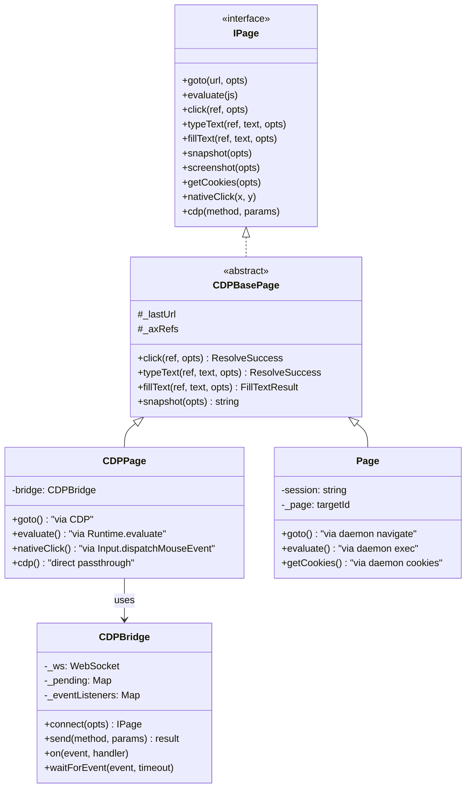
```mermaid
classDiagram
    class IPage {
        <<interface>>
        +goto(url, opts)
        +evaluate(js)
        +click(ref, opts)
        +typeText(ref, text, opts)
        +fillText(ref, text, opts)
        +snapshot(opts)
        +screenshot(opts)
        +getCookies(opts)
        +nativeClick(x, y)
        +cdp(method, params)
    }
    class CDPBasePage {
        <<abstract>>
        #_lastUrl
        #_axRefs
        +click(ref, opts) ResolveSuccess
        +typeText(ref, text, opts) ResolveSuccess
        +fillText(ref, text, opts) FillTextResult
        +snapshot(opts) string
    }
    class CDPPage {
        -bridge: CDPBridge
        +goto() "via CDP"
        +evaluate() "via Runtime.evaluate"
        +nativeClick() "via Input.dispatchMouseEvent"
        +cdp() "direct passthrough"
    }
    class Page {
        -session: string
        -_page: targetId
        +goto() "via daemon navigate"
        +evaluate() "via daemon exec"
        +getCookies() "via daemon cookies"
    }
    class CDPBridge {
        -_ws: WebSocket
        -_pending: Map
        -_eventListeners: Map
        +connect(opts) IPage
        +send(method, params) result
        +on(event, handler)
        +waitForEvent(event, timeout)
    }
    IPage <|.. CDPBasePage
    CDPBasePage <|-- CDPPage
    CDPBasePage <|-- Page
    CDPPage --> CDPBridge : uses
```

来源: [cdp.ts](/src/browser/cdp.ts#L1-L50), [page.ts](/src/browser/page.ts#L1-L30), [base-page.ts](/src/browser/base-page.ts#L1-L30), [types.ts](/src/types.ts#L1-L158)

## CDPBridge：直接 WebSocket 连接

`CDPBridge` 通过打开一个连接到 Chrome CDP 端点的 WebSocket 来实现 `IBrowserFactory`。它管理着一个**命令-响应关联映射**（`_pending`），以单调递增的 `id` 作为键；此外还有一个**事件监听器注册表**（`_eventListeners`），用于监听诸如 `Page.loadEventFired` 和 `Network.requestWillBeSent` 等 CDP 领域事件。

| 能力 | 实现方式 |
|---|---|
| **连接** | 将 HTTP `/json` 端点解析为 WebSocket URL，或直接连接到 `ws://` URL。通过 `Page.addScriptToEvaluateOnNewDocument` 注入隐身 JS。 |
| **发送** | 将 `{id, method, params}` 序列化为 JSON，在 `_pending` 中追踪并设置 30 秒超时守卫，在匹配到响应 `id` 时解决。 |
| **事件** | `on(method, handler)` / `off(method, handler)` 注册按方法划分的监听器集合；传入的以 `method` 为键的消息会分发到所有处理器。 |
| **waitForEvent** | 带超时的一次性事件监听器——被 `goto()` 用于等待 `Page.loadEventFired`。 |

`connect()` 方法接受一个丰富的配置项对象来控制会话生命周期：

```typescript
async connect(opts?: {
  timeout?: number;
  session?: string;
  cdpEndpoint?: string;       // 或 OPENCLI_CDP_ENDPOINT 环境变量
  contextId?: string;          // Chrome 配置文件上下文
  idleTimeout?: number;
  windowMode?: 'foreground' | 'background';
  surface?: 'browser' | 'adapter';
  siteSession?: 'ephemeral' | 'persistent';
}): Promise<IPage>
```

当 `cdpEndpoint` 是 HTTP URL 时，桥接器会获取 `/json` 以枚举可检查的目标，并通过 `selectCDPTarget()` 选择最佳目标——这是一个评分函数，它更偏好 `type: 'app'` 而非 `page`，提升 localhost URL 的优先级，降低 `about:blank` 的优先级，并识别注册表中已知的 Electron 应用名称。

来源: [cdp.ts](/src/browser/cdp.ts#L37-L170)

## CDPPage：CDP 原生页面操作

`CDPPage` 扩展了 `CDPBasePage`，并通过将传输特定的原语映射到 CDP 领域命令来实现它们：

| IPage 方法 | CDP 领域命令 | 关键细节 |
|---|---|---|
| `goto(url)` | `Page.navigate` + await `Page.loadEventFired` | 用事件驱动的加载检测取代硬编码的 1 秒休眠 |
| `evaluate(js)` | `Runtime.evaluate` | 设置 `returnByValue: true`，`awaitPromise: true`；在 `exceptionDetails` 时抛出异常 |
| `getCookies()` | `Network.getCookies` | 支持域过滤和 URL 范围查询 |
| `screenshot()` | `Page.captureScreenshot` + `Emulation.setDeviceMetricsOverride` | 支持 `fullPage`、自定义尺寸、JPEG 质量 |
| `nativeClick(x, y)` | `Input.dispatchMouseEvent` | 按下 → 释放序列，用于生成可信的合成点击 |
| `nativeType(text)` | `Input.insertText` | 绕过 DOM 值修改——适用于富文本编辑器 |
| `nativeKeyPress(key)` | `Input.dispatchKeyEvent` | 完整的 keydown/keyup 生命周期，支持修饰键 |
| `cdp(method, params)` | 直通到 `bridge.send()` | 任意 CDP 命令访问 |

### 网络捕获 (CDP 模式)

`CDPPage` 通过启用 `Network.enable` 并订阅三个级联的 CDP 事件来实现全流量网络捕获：

1. **`Network.requestWillBeSent`** —— 记录 URL、方法、请求头和请求体（对于超过内联限制的请求体，回退使用 `Network.getRequestPostData`）。
2. **`Network.responseReceived`** —— 填充状态码和 MIME 类型。
3. **`Network.loadingFinished`** —— 通过 `Network.getResponseBody` 获取完整响应体，遵循 8 MB 的捕获限制（`CDP_RESPONSE_BODY_CAPTURE_LIMIT`），并暴露 `responseBodyFullSize` + `responseBodyTruncated`，以便 Agent 知道何时发生了截断。

### 控制台捕获 (CDP 模式)

`CDPPage.consoleMessages()` 启用 `Runtime.enable` 并捕获 `Runtime.consoleAPICalled`（所有控制台级别）和 `Runtime.exceptionThrown`（未捕获的异常映射为 `type: 'error'`），上限为 500 条目，采用 FIFO 淘汰机制。

来源: [cdp.ts](/src/browser/cdp.ts#L200-L450)

## Page：守护进程支撑的操作

`Page` 是生产环境的主力——它通过 HTTP 命令（`sendCommand` / `sendCommandFull`）将所有操作路由到 Browser Bridge 守护进程。与 `CDPPage` 的关键架构差异：

**陈旧页面标识恢复**：在 `goto()` 之后，Page 会缓存守护进程返回的 `targetId`。如果用户关闭了标签页或长时间运行的脚本驱逐了目标，后续命令会因 `"Page not found: <id> — stale page identity"` 而失败。Page 会检测此特征，丢弃缓存的 `_page`，然后重试——守护进程会回退到会话租约或打开一个新标签页。如果没有这种机制，每个并发调用都会级联失败。

**组合隐身与稳定检测**：导航后，Page 在**单次 `exec` 往返**中注入隐身 JS 和 DOM 稳定性检测，而不是两次顺序调用，将导航后开销减半。隐身守卫标志防止双重注入；稳定检测使用基于 `MutationObserver` 的 DOM 稳定性检测。

**目标导航重试**：`evaluate()` 方法会捕获分类为 `"target-navigation"` 的错误（使执行上下文无效的 SPA 客户端重定向），并在 `delayMs` 暂停后重试一次——而不会重试守护进程已处理的真实错误。

来源: [page.ts](/src/browser/page.ts#L37-L200)

## 目标解析流水线

每次 `click`、`typeText`、`fillText`、`scrollTo` 和 `setChecked` 调用都流经一个**统一的解析流水线**，该流水线将 `ref` 字符串映射到存储在 `window.__resolved` 中的单个 DOM 元素。该流水线有两个分支：

| 输入形式 | 路径 | 解析策略 |
|---|---|---|
| 全数字 (例如 `"42"`) | **数字引用** | 级联陈旧引用指纹匹配 |
| 其他 (例如 `"button.submit"`) | **CSS 选择器** | `querySelectorAll` + 匹配数量策略 |

### 级联陈旧引用解析

数字引用在放弃前会经历三个层级，灵感来自 browser-use 的方法，但针对 OpenCLI 的指纹映射进行了调整：

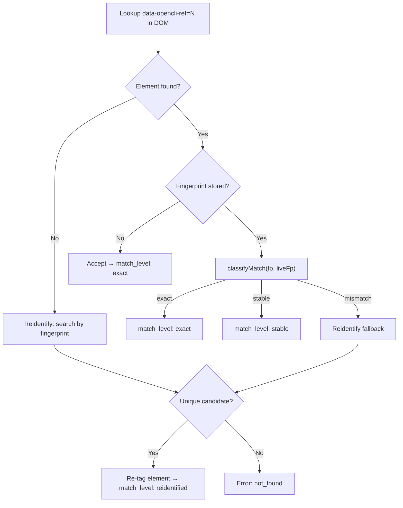
```mermaid
flowchart TD
    A["Lookup data-opencli-ref=N in DOM"] --> B{Element found?}
    B -->|No| C["Reidentify: search by fingerprint"]
    C --> D{Unique candidate?}
    D -->|Yes| E["Re-tag element → match_level: reidentified"]
    D -->|No| F["Error: not_found"]
    B -->|Yes| G{Fingerprint stored?}
    G -->|No| H["Accept → match_level: exact"]
    G -->|Yes| I["classifyMatch(fp, liveFp)"]
    I -->|exact| J["match_level: exact"]
    I -->|stable| K["match_level: stable"]
    I -->|mismatch| L["Reidentify fallback"]
    L --> D
```

- **EXACT (精确)** —— 标签 + 每个非空的存储字段 (id, testId, role, aria-label, 文本前缀) 完全一致。
- **STABLE (稳定)** —— 标签 + 至少一个强标识符 (id 或 testId) 仍然匹配；弱信号已偏移。操作继续执行，因此动态 SPA 不会停滞。
- **REIDENTIFIED (重新标识)** —— 原始 ref 元素已消失，但指纹唯一地标识了另一个存活的元素。用旧的 ref 重新标记该元素并继续。

每个成功的信封都带有 `match_level`，以便下游 CLI 显示所遍历的最弱层级。只有当这三个层级全部失败时，解析器才会发出带有结构化 `TargetError`（包括 `candidates` 和 `hint`）的 `stale_ref`。

来源: [target-resolver.ts](/src/browser/target-resolver.ts#L1-L100), [base-page.ts](/src/browser/base-page.ts#L80-L130)

## 点击执行：CDP 优先与 JS 回退

`CDPBasePage` 中的 `click()` 方法实现了**三阶段点击策略**，在各种页面实现中最大化可靠性：

| 阶段 | 机制 | 使用时机 |
|---|---|---|
| **AX ref 点击** | 无障碍树 `backendNodeId` → `DOM.getBoxModel` → `Input.dispatchMouseEvent` | ref 为全数字且 ax 快照中存在匹配项 |
| **CDP 可信点击** | 命中测试解析边界矩形 → `Input.dispatchMouseEvent` | 命中测试返回 `target` 或 `ancestor` (光标下的元素或其后代) |
| **JS 回退** | 直接在 `__resolved` 上分发 `el.click()` | CDP 点击不可用，或不相关的覆盖层 (`hit: 'other'`) 阻挡了该点 |

命中测试分类（`ResolveSuccess` 中的 `hit` 字段）告诉 Agent CDP 点击是否实际到达了预期元素：
- **`target`** —— 点击点落在元素或其后代上 (可信)。
- **`ancestor`** —— 点击点落在祖先上 (开放的 shadow-DOM 宿主 / 包装器——CDP 仍能到达目标)。
- **`other`** —— 覆盖层/兄弟节点覆盖了点击点 (CDP 点击会错失目标 → JS 回退)。
- **`none`** —— 点击点处无内容 (零矩形元素)。

**重定向**路径处理点击处理程序位于包裹的 `<div>` 上的 SVG 图标 (issue #2071) —— 点击被重定向到附近可点击的祖先，以便处理程序实际触发。

来源: [base-page.ts](/src/browser/base-page.ts#L265-L330)

## 输入与表单填充

### typeText

`typeText(ref, text)` 解析目标，然后首先尝试**原生 CDP 输入**：`DOM.scrollIntoViewIfNeeded` → `DOM.focus` → `prepareNativeTypeResolvedJs` (清除现有值，聚焦元素) → `Input.insertText`。如果原生输入失败，则回退到 `typeResolvedJs`，后者设置 `el.value` 并分发 input/change 事件。

### fillText

`fillText(ref, text)` 在输入的基础上增加了**验证**：在设置值 (原生或 JS) 后，运行 `verifyFilledResolvedJs` 回读实际值。如果原生输入报告成功但验证失败 (例如，React 受控组件拒绝了修改)，它会使用 JS setter 路径重试。结果包括 `filled`、`verified`、`expected`、`actual` 和 `mode` (`input` | `textarea` | `contenteditable`)。

### 快捷键解析

`pressKey` 通过 `parseKeyChord()` 支持修饰键+按键表示法 (例如 `"Ctrl+Enter"`、`"Cmd+S"`)，该函数按 `+` 分割，将左侧标记分类为修饰键，并将最右侧的标记作为按键传递。首先尝试原生 CDP 键盘事件 (`Input.dispatchKeyEvent`)；JS `KeyboardEvent` 分发作为回退。

来源: [base-page.ts](/src/browser/base-page.ts#L400-L500)

## DOM 快照引擎

快照引擎生成 JavaScript，当通过 `Runtime.evaluate` 在页面内执行时，会产生一个**经过修剪的 DOM 树，专为 LLM 消费而优化**。这 13 阶段流水线完全在浏览器中运行：

| 阶段 | 操作 |
|---|---|
| 1 | 遍历 DOM 树，收集可见性 + 布局 + 交互性信号 |
| 2 | 修剪不可见、零面积、非内容元素 |
| 3 | SVG 与装饰折叠 |
| 4 | Shadow DOM 遍历 |
| 5 | 同源 iframe 内容提取 |
| 6 | 边界框父子去重 (包裹子元素的链接/按钮) |
| 7 | 绘制顺序遮挡检测 (覆盖层/模态框覆盖) |
| 8 | 属性白名单过滤 |
| 9 | 表格感知序列化 (markdown 表格) |
| 10 | 节省令牌的序列化，带有交互索引 |
| 11 | 用于点击/输入定位的 `data-opencli-ref` 注解 |
| 12 | 隐藏交互元素提示 (滚动以显示) |
| 13 | 增量差异 (用 `*` 标记新元素) |

输出格式：


```
[42]<button type=submit>Search</button>
|scroll|<div> (0.5↑ 3.2↓)
  *[58]<a href=/r/1>Result A</a>
  [59]<a href=/r/2>Result B</a6>
```

- `[id]` —— 交互元素。带有用于定位的后端索引的元素
- `*` 前缀 —— 新出现的元素 (增量差异)
- `|scroll|` —— 带有页面计数的可滚动容器
- `|shadow|` —— Shadow DOM 边界
- `|iframe|` —— iframe 内容
- `|table|` —— markdown 表格渲染

附加在树之后的**复合边车**列出了每个 `date/select/file` 引的丰富 JSON——完整的选项列表、`accept` 模式、`multiple` 标志——这些是内联属性无法表达的数据，且 Agent 历史上常浪费轮次去发现它们。

有两种快照来源可用：`dom` (稳定的默认选项，即上述流水线) 和 `ax` (选择启用的原型，通过 CDP 使用 `Accessibility.getFullAXTree`)。

/ 来源: [dom-snapshot.ts](/src/browser/dom-snapshot.ts#L1-L100)

## 隐身反检测

在任何页面脚本运行之前，OpenCLI 通过 `Page.addScriptToEvaluateOnNewDocument` (CDP) 或与导航后稳定脚本组合 (守护进程) 注入隐身载荷。该载荷修补了八个指纹表面：

| # | 目标 | 修补 |
|---|---|---|
| 1 | `navigator.webdriver` | 覆盖 getter → `false` |
| 2 | `window.chrome` | 如果缺失则填充 `runtime`、`loadTimes`、`csi` 存根 |
| 3 | `navigator.plugins` | 如果列表为空则伪造 PDF Viewer 条目 |
| 4 | `navigator.languages` | 如果为空则保证为 `['en-US', 'en']` |
| 5 | `Permissions.query` | 规范化无头上下文的通知权限 |
| 6 | 自动化全局变量 | 删除 `__playwright`、`__puppeteur`、`cdc_*` 前缀属性 |
| 7 | 错误堆栈跟踪 | 从 `Error.prototype.stack` getter 中过滤 CDP/自动化帧 |
| 8 | `debugger` 陷阱 | 从动态 `Function`/eval 中剥离 `debugger` 语句 |

**共享的 toString 伪装基础设施**使用基于 `WeakMap` 的 `Function.prototype.toString` 覆盖，以便修补后的函数返回 `function name() { [native code] }`——对于反机器人扫描器的代码检查来说与原生代码无法区分。

守卫标志防止在独立的 CDP 评估中双重注入，作为 `EventTarget.prototype` 上的不可枚举 getter 暂存，以避免被属性扫描指纹识别器发现。

来源: [stealth.ts](/src/browser/stealth.ts#L1-L200)

## DOM 辅助：页面内 JS 生成器

所有 DOM 操作都实现为 **JS 代码生成器**——返回自包含 JavaScript 字符串以供 `page.evaluate()` 使用的函数。这种设计消除了 `Page` (守护进程) 和 `CDPPage` (直接 CDP) 之间的代码重复，因为两者都在浏览器上下文中执行相同的生成代码。

| 生成器 | 目的 | 关键技术 |
|---|---|---|
| `pressKeyJs6Js(key, modifiers)` | 分发键盘事件 | 在 `document.activeElement` 上的 `KeyboardEvent` |
| `waitForTextJs(text, timeoutMs)` | 等待 `body.innerText` 中的文本 | 带有截止时间的 200ms 轮询 |
| `waitForSelectorJs(selector, timeoutMs)` | 等待 CSS 匹配 | `MutationObserver` 实现近乎瞬时的解析 |
| `waitForDomStableJs(maxMs, quietMs)` | 等待 DOM 变异停止 | `MutationObserver` + 静默期 + 硬性上限 |
A| `scrollJs(direction, amount)` | 滚动视口 | `window.scrollBy(dx, dy)` |
| `autoScrollJs(times, delayMs)` | 感知懒加载的自动滚动 | `MutationObserver` 观察 `scrollHeight` 增长 |
| `networkRequestsJs(includeStatic)` | 读取 `performance.getEntriesByType('resource')` | 默认过滤掉非静态发起者 |
| `waitForCaptureJs(maxMs)` | 等待拦截器数据 | 轮询 `window.__opencli_xhr` 长度 |

`waitForDomStableJs` 生成器尤为重要——它用自适应等待取代了固定的 `setTimeout` 休眠，该等待在页面停止变异时立即解决，上限为 `maxMs`。这正是使 `goto()` 在静态页面上速度飞快，同时仍能等待动态内容的原因。

来源: [dom-helpers.ts](/src/browser/dom-helpers.ts#L1-L173)

## 网络捕获的内存守卫

两个常量定义了网络请求/响应体的捕获边界：

| 常量 | 值 | 目的 |
|---|---|---|
| `CDP_RESPONSE_BODY_CAPTURE_LIMIT` | 8 MB | 保留高达此限制的完整响应体；超出此限制，`responseBodyTruncated: true` |
| `CDP_REQUEST_BODY_CAPTURE_LIMIT` | 1 MB | 保留高达此限制的完整请求体；超出此限制，`requestBodyTr4uncated: true` |

先前版本限制为 4 KB 并静默截断，导致不完整对象上的 `JSON.parse` 失败。当前限制在绝大多数 API 调用中保留了完整的主体，同时暴露截断元数据，以便 Agent 收到真实信号而非损坏的载荷。

来源: [cdp.ts](/src/browser/cdp.ts#L49-L52)

## IPage 接口：编写契约

[types.ts](/src/types.ts) 中的 `IPage` 接口定义了浏览器交互的完整表面积。高级使用者应注意这些可能并非在所有后端都可用的可选方法：

| 方法 | 可用性 | 传输方式 |
|---|---|---|
| `nativeClick(x, y)` | CDP + 扩展 | `Input.dispatchMouseEvent` |
| `nativeType(text)` | CDP + 扩展 | `Input.insertText` |
| `nativeKeyPress(key, modifiers)` | CDP + 扩展 | `Input.dispatchKeyEvent` |
| `cdp(method, params)` | CDP + 扩展 | 原始 CDP 直通 |
| `insertText(text)` | CDP 直连 | 聚焦元素上的 `Input.insertText` |
| `setFileInput(files, selector)` | CDP + 扩展 | `DOM.setFileInputFiles` —— 无需 base64 编码 |
| `startNetworkCapture(pattern)` | 两者皆有 | CDP `Network.*` 或扩展拦截 |
| `handleJavaScriptDialog(accept, text)` | 扩展 | 接受/关闭 alert/confirm/prompt |
| `frames()` / `evaluateInFrame(js, idx)` | 扩展 | 跨源 iframe 访问 |
| `waitForDownload(pattern, timeout)` | 扩展 | Chrome 下载 API |

<CgxTip>在编写基于浏览器的适配器时，请始终针对 `Page` (守护进程) 和 `CDPPage` (直接 CDP) 进行测试——某些方法如 `tabs()` 和 `selectTab()` 在 CDP 模式下返回空值/无操作。对于需要直接协议访问的操作请使用 `cdp()`，并优先使用在两种传输方式上工作方式相同的共享 `CDPBasePage` 方法 (click, type, snapshot)。</CgxTip>

来源: [types.ts](/src/types.ts#L1-L158)

## CDP 端点选择的目标评分

连接到 HTTP CDP 端点时，`selectCDPTarget()` 对来自 `/json` 的所有目标进行评分，以挑选最相关的目标。评分函数跨多个维度评估每个目标：

| 信号 | 评分增量 | 理由 |
|---|---|---|
| `OPENCLI_CDP_TARGET` 模式匹配 | +1000 | 显式用户偏好胜过一切 |
| `type: 'app'` | +120 | Electron 应用窗口 |
| `type: 'webview'` | +100 | 嵌入式网页内容 |
| `type: 'page'` | +80 | 标准浏览器标签页 |
| `localhost` URL | +90 | 可能是自动化目标 |
| `file://` URL | +60 | 本地应用文档 |
| 标题中已知的 Electron 应用 | +120 | 注册表匹配 (例如 Codex, Antigravity) |
| URL 中已知的 Electron 应用 | +100 | 基于 URL 的注册表匹配 |
| `about:blank` | −120 | 非有意义的目标 |
| 标题/URL 中的 DevTools | −∞ | 永不将 DevTools 窗口作为目标 |

**路由窗口降级**决胜机制 (issue #2242) 防止 Electron 应用将命令路由到辅助窗口 (例如头像覆盖层)，这些窗口共享相同的文档来源但携带基于查询的路由——当分数相同时，普通文档胜过带路由的兄弟节点。

来源: [cdp.ts](/src/browser/cdp.ts#L450-L560)

---

**下一步**：在 [目标解析器与查找](13-target-resolver-and-find) 中详细了解目标解析器的 CSS 和指纹路径如何工作，或者在 [Browser Bridge 与守护进程](11-browser-bridge-and-daemon) 中了解为 `Page` 后端提供动力的守护进程。

---

<!-- zread:slug=13-target-resolver-and-find -->
## 13. Target Resolver & Find（Deep Dive）

OpenCLI 的 **目标解析器** 和 **Find** 系统构成了定位骨干，让 AI Agent 能够在动态网页的整个生命周期中可靠地定位并操作 DOM 元素。该解析器将两种定位策略——数字快照引用和 CSS 选择器——统一为一条流水线，每个浏览器动作（`click`、`type`、`select`、`get`）都流经此流水线。`find` 命令通过提供结构化的 CSS 和语义查询对此进行了扩展，这些查询会**即时分配引用**，使得 `find` 即使在没有预先执行 `browser state` 快照的情况下，也能成为引用系统的一等入口点。两者结合，解决了 Agent 的核心挑战：*如何稳定地定位一个在你底层不断变化的页面上的元素*。

来源：[target-resolver.ts](/src/browser/target-resolver.ts#L1-L39), [find.ts](/src/browser/find.ts#L1-L29)

## 架构概述

定位系统作为一个**两阶段流水线**运行：首先是 *resolve*（识别 DOM 元素），然后是 *act*（点击、输入、滚动等）。所有解析逻辑都被编译成在 `page.evaluate()` 内部执行的 JS 字符串——浏览器本身即是运行时，而非 Node.js。这种设计意味着每个 Agent 动作都遵循相同的路径，无论输入是像 `"7"` 这样的数字引用，还是像 `"#submit-btn"` 这样的 CSS 选择器。

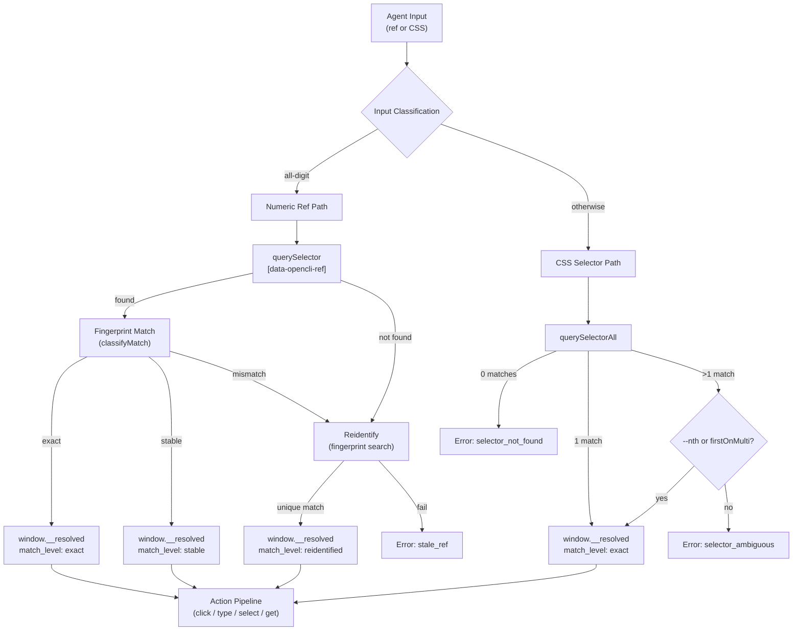
```mermaid
flowchart TD
    Input["Agent Input<br/>(ref or CSS)"] --> Classify{"Input Classification"}
    Classify -->|all-digit| RefPath["Numeric Ref Path"]
    Classify -->|otherwise| CSSPath["CSS Selector Path"]

    RefPath --> RefLookup["querySelector<br/>[data-opencli-ref]"]
    RefLookup -->|found| Fingerprint["Fingerprint Match<br/>(classifyMatch)"]
    Fingerprint -->|exact| StoreExact["window.__resolved<br/>match_level: exact"]
    Fingerprint -->|stable| StoreStable["window.__resolved<br/>match_level: stable"]
    Fingerprint -->|mismatch| Reidentify["Reidentify<br/>(fingerprint search)"]
    Reidentify -->|unique match| StoreReid["window.__resolved<br/>match_level: reidentified"]
    Reidentify -->|fail| StaleRef["Error: stale_ref"]
    RefLookup -->|not found| Reidentify

    CSSPath --> QSA["querySelectorAll"]
    QSA -->|0 matches| SelNotFound["Error: selector_not_found"]
    QSA -->|1 match| StoreCSS["window.__resolved<br/>match_level: exact"]
    QSA -->|>1 match| Ambiguous{"--nth or firstOnMulti?"}
    Ambiguous -->|yes| StoreCSS
    Ambiguous -->|no| SelAmbiguous["Error: selector_ambiguous"]

    StoreExact --> Action["Action Pipeline<br/>(click / type / select / get)"]
    StoreStable --> Action
    StoreReid --> Action
    StoreCSS --> Action
```

解析后的元素始终存储在 `window.__resolved` 中，这是一个全局约定，下游的动作辅助函数（`clickResolvedJs`、`typeResolvedJs`、`selectResolvedJs` 等）会从中读取。这种两步设计将*哪个元素*与*对其执行什么操作*分离开来，使得在动作触发前能够进行命中测试、重定向和遮罩检测。

来源：[target-resolver.ts](/src/browser/target-resolver.ts#L73-L295), [target-errors.ts](/src/browser/target-errors.ts#L1-L68)

## 输入分类

解析器的第一个决定看似简单：**全数字字符串**路由到数字引用路径；**其他所有内容**路由到 `querySelectorAll`。没有前端正则表达式白名单来预先验证“类 CSS”输入——浏览器自身的解析器即是权威。此约定保证了 `browser find --css` 接受的任何选择器，也能被 `browser click`/`get`/`type`/`select` 使用相同的选择器字符串接受。以前，`isCssLike` 正则表达式会拒绝像 `:root`、`*`、`:has(.foo)` 和 `::shadow-root` 这样的有效选择器；统一解析器彻底消除了这类假阴性问题。

| 输入模式 | 分类 | 解析机制 |
|---|---|---|
| `"7"` | 数字引用 | `data-opencli-ref` 属性查找 + 指纹级联 |
| `"#submit"` | CSS 选择器 | `querySelectorAll('#submit')` |
| `":has(.foo)"` | CSS 选择器 | `querySelectorAll(':has(.foo)')` |
| `"???"` | CSS 选择器 | `querySelectorAll('???')` → 运行时 `invalid_selector` |

来源：[target-resolver.ts](/src/browser/target-resolver.ts#L84-L89), [target-resolver.test.ts](/src/browser/target-resolver.test.ts#L201-L211)

## 级联引用解析流水线

数字引用来自 DOM 快照（参见 [CDP 与页面交互](12-cdp-and-page-interaction)），该快照用 `data-opencli-ref="N"` 属性标注交互式元素，并将指纹存储在 `window.__opencli_ref_identity` 中。解析器在放弃前会遍历**三个层级**——这就是“浏览器使用风格”的过期引用级联，可防止动态页面导致 Agent 停滞：

### 第 1 层 — 精确匹配

标签及每个非空的已存储字段（id、testId、role、ariaLabel、带前缀匹配的 text）均一致。该元素正是快照当时看到的。返回 `match_level: 'exact'`。

### 第 2 层 — 稳定匹配

标签一致且至少一个**强标识符**（DOM `id` 或 `data-testid`）仍然匹配，但软信号（aria-label、role、text）已发生偏移。这涵盖了 SPA 重新渲染和 i18n 标签互换的情况。Agent 会收到警告，但动作仍会继续执行。返回 `match_level: 'stable'`。

### 第 3 层 — 重新识别

原始引用属性在 DOM 中缺失或完全失配，但指纹通过 id/testId/aria-label 查找唯一标识了**另一个存活的单一元素**。解析器使用旧的引用重新标记该元素，并刷新身份映射，以便后续解析命中第 1 层。返回 `match_level: 'reidentified'`。

只有当这三个层级全部失败时，解析器才会发出 `stale_ref`。每个成功的信封都带有 `match_level`，以便下游 CLI 能够显示所遍历的最弱层级。

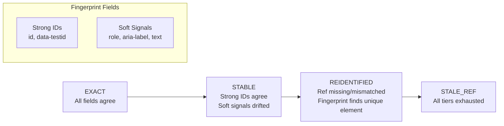
```mermaid
flowchart LR
    subgraph "Fingerprint Fields"
        direction TB
        Strong["Strong IDs<br/>id, data-testid"]
        Soft["Soft Signals<br/>role, aria-label, text"]
    end

    Exact["EXACT<br/>All fields agree"] --> Stable["STABLE<br/>Strong IDs agree<br/>Soft signals drifted"]
    Stable --> Reid["REIDENTIFIED<br/>Ref missing/mismatched<br/>Fingerprint finds unique element"]
    Reid --> Stale_Ref["STALE_REF<br/>All tiers exhausted"]
```

`classifyMatch` 函数实现了此层级结构。强标识符是能够挽救已偏移指纹的**唯一**信号——如果没有存活的 `id` 或 `testId`，仅凭软信号偏移将直接落入失配。随后，`reidentify` 函数通过指纹中最强的可用键（id → testId → aria-label）搜索存活的 DOM，严格要求**仅有一个候选元素**，以避免静默选中错误的元素。

来源：[target-resolver.ts](/src/browser/target-resolver.ts#L91-L229), [target-resolver.test.ts](/src/browser/target-resolver.test.ts#L235-L273)

## `browser find` 命令

`browser find` 是一个结构化查询，它返回 JSON 信封，Agent 无需解析自由文本快照输出即可读取。它在两种模式下运行：

### CSS 查找 (`--css <selector>`)

对页面执行 `querySelectorAll`，并将每个匹配项作为结构化的 `FindEntry` 返回，包含两个标识符——数字 `ref` 和从 0 开始的 `nth`——以便 Agent 可以通过任一路径对特定结果执行操作：

```
browser click <ref>              # 数字引用路径
browser click "<sel>" --nth <n>  # 选择器 + 索引路径
```

**引用分配是核心创新**：对于未被先前快照标记的匹配元素，`find` 会分配下一个可用的数字引用，在元素上设置 `data-opencli-ref`，并将指纹写入 `window.__opencli_ref_identity`。这使得 `find` 成为引用系统的一等入口点——当 Agent 已经知道选择器时，可以完全跳过 `browser state`。

### 语义查找 (`--role`, `--name`, `--label`, `--text`, `--testid`)

与原始 CSS 选择器不同，语义查找查询的是**无障碍树**。它遍历所有交互式候选元素（`a[href]`、`button`、`input`、`[role]`、`[aria-label]` 等），并与标准化后的 role、可访问名称、标签文本、内容文本和 test id 条件进行匹配。`nativeRole` 函数将 HTML 标签映射为隐式 ARIA 角色（例如，`<button>` → `button`，`<input type="checkbox">` → `checkbox`），而 `accessibleName` 则聚合了 aria-label、aria-labelledby、关联的 `<label>`、alt、title、placeholder 和文本内容。

来源：[find.ts](/src/browser/find.ts#L31-L230), [find.ts](/src/browser/find.ts#L232-L451)

## Find 输出结构

每次 `find` 调用都会返回一个结构化的信封，其输出边界受限于 Agent 的上下文窗口：

| 字段 | 类型 | 描述 |
|---|---|---|
| `matches_n` | `number` | 总匹配数（如果应用了 `limit`，可能会超过 `entries.length`） |
| `entries[].nth` | `number` | 从 0 开始的位置——与下游命令的 `--nth` 配对使用 |
| `entries[].ref` | `number` | 数字引用——与 `browser click <ref>` 配对使用 |
| `entries[].tag` | `string` | 小写标签名 |
| `entries[].role` | `string` | 显式 `role` 属性 |
| `entries[].text` | `string` | 修剪后的文本内容（默认最多 120 个字符） |
| `entries[].attrs` | `object` | 仅包含白名单中的属性 |
| `entries[].visible` | `boolean` | 元素具有非零面积且不是 display:none/visibility:hidden/opacity:0 |
| `entries[].compound` | `object?` | date/select/file 输入的富视图（见下文） |

**属性白名单**被刻意保持精简，以维持输出高信噪比：`id`、`class`、`name`、`type`、`placeholder`、`aria-label`、`title`、`href`、`value`、`role`、`data-testid`。像 `style`、`onclick` 和 `onload` 这样的敏感属性会被排除。

**复合字段**解决了表单页面上三大 Agent 失败模式：错误的日期格式、猜测的 select 选项以及重复上传的文件。对于 date/time 输入，`compound` 带有 `format`（例如 `YYYY-MM-DD`）。对于 `<select>`，它带有完整的选项列表。对于 file 输入，它带有 `accept` 和 `multiple` 约束。

来源：[find.ts](/src/browser/find.ts#L34-L88), [find.test.ts](/src/browser/find.test.ts#L76-L116)

## 结构化错误系统

每次解析失败都会产生一个结构化的 `TargetError`，包含机器可读的 `code`、人类可读的 `message` 以及可操作的 `hint`。这用 AI Agent 能够以编程方式作出反应的诊断信息取代了通用的“未找到元素”提示。

| 错误代码 | 路径 | 含义 | Agent 恢复策略 |
|---|---|---|---|
| `not_found` | Numeric | DOM 中不存在该引用 | 重新运行 `browser state` 获取最新快照 |
| `stale_ref` | Numeric | 引用指向了不同的元素 | 重新运行 `browser state` 进行刷新 |
| `invalid_selector` | CSS | 语法被 `querySelectorAll` 拒绝 | 修复选择器语法 |
| `selector_not_found` | CSS | 0 个匹配项 | 尝试限制更少的选择器或使用 `browser state` |
| `selector_ambiguous` | CSS | 写入操作出现 >1 个匹配项 | 传递 `--nth <n>` 或使用更具体的选择器 |
| `selector_nth_out_of_range` | CSS | `--nth` 超出匹配数量 | 使用介于 0 和 matches_n−1 之间的 `--nth` |
| `not_editable` | Action | 目标存在但无法接受文本输入 | 检查元素类型 |
| `not_checkable` | Action | 目标无法被选中/取消选中 | 验证元素是否为 checkbox/radio |
| `not_file_input` | Action | 目标不是可用的文件输入 | 使用 `browser find` 定位正确的输入 |
| `semantic_not_found` | Semantic | 语义定位器匹配了 0 个元素 | 放宽条件或使用 `--source ax` |

`TargetError` 类通过 `toJSON()` 干净地序列化，以便为 AI Agent 提供结构化输出，同时保留 `candidates`（模糊选择器最多 5 个样本元素）和 `matches_n` 以用于消歧。

来源：[target-errors.ts](/src/browser/target-errors.ts#L1-L68), [target-resolver.ts](/src/browser/target-resolver.ts#L222-L292)

## 点击重定向与命中测试

一旦解析器将元素存储在 `window.__resolved` 中，`boundingRectResolvedJs` 函数（带有 `forClick: true`）会在 CDP `Input.dispatchMouseEvent` 触发之前执行关键的点击时调整：

### 重定向 (#2071)

如果解析后的元素**不拥有点击处理程序**（不是 `<button>`、`<a>`、`[role="button"]` 等），但附近的祖先元素**是可点击的**（拥有处理程序或具有 `cursor: pointer`），则点击目标会重定向到该祖先元素——最多向上回溯 4 层。这修复了当 `<div>` 内的 `<svg>` 图标被解析，但 `<div>` 持有实际处理程序时的常见情况。`ownsClickHandler` 检查刻意排除了继承的 `cursor: pointer`（可点击 div 内的 SVG 继承了光标，但并不拥有该处理程序）。

### 命中分类 (#2076)

CDP 点击在 `(x, y)` 处进行命中测试，并将事件传递给最顶层的元素——遮罩层可能会静默吞噬该事件。解析器对命中结果进行分类：

| 命中类别 | 含义 | 动作 |
|---|---|---|
| `target` | 点落在目标或其后代上 | CDP 点击是安全的 |
| `ancestor` | 点落在祖先上（shadow-DOM 宿主或包装器） | CDP 点击是安全的（穿透 shadow root） |
| `other` | 无关元素覆盖了该点 | 回退到直接的 DOM `el.click()` |

当中心点被遮挡（`hit: 'other'`）时，解析器在回退之前会探测最多 6 个替代点（四分位位置 + 角部插入）。这最大化了 CDP 优先点击（触发 Radix/MUI/shadcn 下拉菜单所依赖的完整 pointer/mouse 链）的机会，同时避免了静默的错误传递。

来源：[target-resolver.ts](/src/browser/target-resolver.ts#L304-L414), [target-resolver.test.ts](/src/browser/target-resolver.test.ts#L57-L143)

## 已解析元素的动作辅助函数

所有动作辅助函数都从 `window.__resolved` 读取——即由 `resolveTargetJs` 设定的约定：

| 辅助函数 | 用途 | 关键行为 |
|---|---|---|
| `clickResolvedJs` | JS 回退点击 | `scrollIntoView` → `el.click()` |
| `typeResolvedJs` | JS 回退文本输入 | 使用原生 `value` setter 以兼容 React/Vue |
| `prepareNativeTypeResolvedJs` | 为 CDP `Input.insertText` 做准备 | 聚焦、选择内容、处理 contenteditable |
| `verifyFilledResolvedJs` | 验证输入的值 | 比较实际值与期望值，返回 `{ ok, actual, expected }` |
| `selectResolvedJs` | 选择 `<option>` | 使用原生 `value` setter + 派发 input/change 事件 |
| `scrollResolvedJs` | 平滑滚动至元素 | `scrollIntoView({ behavior: 'smooth' })` |
| `getTextResolvedJs` | 读取文本&1 文@4$E45O:!@8L0E'2D6+5R` | `el.textContent?.trim()` |
| `getValueResolvedJs` | 读取输入值 | `el.value` |
| `getAttributesResolvedJs` | 读取所有属性 | `JSON.stringify(Object.fromEntries([...el.attributes]))` |
| `isAutocompleteResolvedJs` | 检测 combobox/autocomplete | 检查 `role="combobox"`、`aria-autocomplete`、`list` 属性 |

`typeResolvedJs` 辅助函数使用 `Object.getOwnPropertyDescriptor(HTMLInputElement.prototype, 'value').set`——即**原生 setter**——来绕过拦截直接 `.value` 赋值的 React/Vue 受控组件包装器。这确保了框架的内部状态随 DOM 一同更新。

来源：[target-resolver.ts](/src/browser/target-resolver.ts#L425-L701)

## 指纹约定

整个系统建立在快照写入器、find 引用分配器和目标解析器共同认同的共享指纹结构之上：

```typescript
{
  tag: string;        // element.tagName.toLowerCase()
  role: string;       // getAttribute('role') || ''
  text: string;       // textContent.trim().slice(0, 30)
  ariaLabel: string;  // getAttribute('aria-label') || ''
  id: string;         // element.id || ''
  testId: string;     // data-testid || data-test || ''
}
```

此映射存在于 `window.__opencli_ref_identity` 中——一个在快照、查找和解析之间共享的单一事实来源。当 `find` 为未标记的元素分配新引用时，它会将指纹写入此同一映射。当解析器的 `reidentify` 函数搜索丢失的引用时，它会从此映射中读取。当 `reidentify` 恢复一个元素时，它会**重新标记 DOM 属性**并**刷新身份条目**，以便后续解析命中 `exact` 而无需重新遍历级联。

<CgxTip>指纹的 30 字符文本截断是刻意的：它捕获了足够的信息来区分元素（按钮标签、链接文本），同时避免了在数千个元素中因完整 `textContent` 导致的上下文窗口膨胀。</CgxTip>

<CgxTip>`find` 中的引用分配会遍历身份映射及现有的 `data-opencli-ref` DOM 标注，以防止在清除 `window` 状态但保留 DOM 属性的软导航后发生冲突。</CgxTip>

来源：[target-resolver.ts](/src/browser/target-resolver.ts#L97-L106), [find.ts](/src/browser/find.ts#L160-L208), [dom-snapshot.ts](/src/browser/dom-snapshot.ts#L1-L32)

## 解析选项

`ResolveOptions` 接口控制 CSS 路径如何处理多匹配结果：

| 选项 | 类型 | 默认值 | 作用 |
|---|---|---|---|
| `nth` | `number?` | `undefined` | 选取此 0 基索引处的元素；如果越界则抛出 `selector_nth_out_of_range` |
| `firstOnMulti` | `boolean?` | `false` | 选取第一个匹配项而不是抛出 `selector_ambiguous`；由读取命令用于尽最大努力提供答案 |

当设置了 `nth` 时，它的优先级高于 `firstOnMulti`。写入操作（click、type、select）需要显式消歧——它们不会静默选取第一个匹配项。读取操作（get text、get value、get attributes）使用 `firstOnMulti: true` 以提供尽最大努力的答案，并在信封中附带 `matches_n`，以便 Agent 知道存在多个候选元素。

来源：[target-resolver.ts](/src/browser/target-resolver.ts#L41-L55), [target-resolver.ts](/src/browser/target-resolver.ts#L255-L291)

## Find 与 Resolve 如何协同工作

`find` 与 `resolve` 之间的关系为元素定位创建了一个**闭环**：

1. **Agent 运行 `browser find --css ".submit-btn"`** → 接收 `{ entries: [{ ref: 7, nth: 0, ... }] }`
2. **Agent 运行 `browser click 7`** → 解析器查找 `data-opencli-ref="7"`，验证指纹，执行点击
3. **页面重新渲染 (SPA)** → 解析器检测到软信号偏移，返回 `match_level: 'stable'`，点击继续进行
4. **页面完全重新挂载** → 解析器的 `reidentify` 通过 testId 找到该元素，重新标记它，返回 `match_level: 'reidentified'`
5. **元素被真正移除** → 所有层级失败，抛出带有提示重新运行快照的 `stale_ref` 错误

此循环意味着 Agent 不需要在每次操作之间重新获取快照——级联解析器会自动吸收常规的页面变化，仅在元素真正消失时才需要新的快照。

来源：[target-resolver.ts](/src/browser/target-resolver.ts#L21-L38), [find.ts](/src/browser/find.ts#L13-L18)

---

**下一步**：了解解析器的动作辅助函数如何被适配器作者用来组合浏览器交互的 [Pipeline DSL 语法](14-pipeline-dsl-syntax) 所使用，或查看提供这些 JS 字符串执行所在的 `page.evaluate()` 运行时的上游 [CDP 与页面交互](12-cdp-and-page-interaction) 层。

---

<!-- zread:slug=14-pipeline-dsl-syntax -->
## 14. Pipeline DSL Syntax（Deep Dive）

**Pipeline DSL** 是每个 OpenCLI 适配器的声明式核心——一个按顺序排列的步骤数组，用于获取、转换和塑造数据，无需编写命令式的胶水代码。每个步骤都是一个单键对象，将**操作名称**映射至其**参数**，按从左到右的顺序执行，且每个步骤的结果将作为输入 (`data`) 传递给下一个步骤。这种设计允许你以紧凑且可审计的结构表达复杂的数据工作流（从 API 分页到浏览器 DOM 提取），该结构直接存在于适配器定义内部。

来源: [executor.ts](src/pipeline/executor.ts#L1-L111), [registry.ts](src/pipeline/registry.ts#L1-L76)

## 执行模型

管道执行器按**顺序且累积地**处理步骤：步骤 *N* 接收步骤 *N-1* 的返回值作为其 `data` 参数，其自身的返回值则成为步骤 *N+1* 的 `data`。初始 `data` 为 `null`。如果在注册表中找不到步骤处理器，则会立即抛出 `ConfigError`。出现任何未处理的失败时，执行器会尝试关闭浏览器窗口（如果存在），然后再重新抛出异常，从而防止产生孤立的自动化会话。

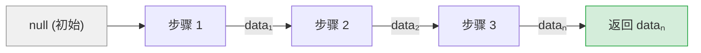
```mermaid
flowchart LR
    A["null (初始)"] --> S1["步骤 1"]
    S1 -->|data₁| S2["步骤 2"]
    S2 -->|data₂| S3["步骤 3"]
    S3 -->|dataₙ| R["返回 dataₙ"]
    
    style A fill:#f0f0f0,stroke:#999
    style R fill:#d4edda,stroke:#28a745
```

**重试语义**内置于执行器中。仅限浏览器的步骤（`navigate`、`click`、`type`、`fill`、`wait`、`press`、`snapshot`、`evaluate`、`intercept`、`tap`）在遇到瞬时浏览器错误（导航超时、元素脱离）时，默认**重试 2 次**。非浏览器步骤默认**重试 0 次**。每次重试前会有 1 秒的延迟。`PipelineContext` 上的 `stepRetries` 字段可全局覆盖这些默认值。

来源: [executor.ts](src/pipeline/executor.ts#L35-L75), [capabilityRouting.ts](src/capabilityRouting.ts#L1-L30)

## 步骤参考

所有 17 个核心步骤在模块加载时通过 `registerStep()` 自动注册。注册表是一个 `Map<string, StepHandler>`，这使得插件可以轻松对其进行扩展。每个 `StepHandler` 都符合签名 `(page, params, data, args) => Promise<result>`。

### API / 数据步骤（无需浏览器）

| 步骤 | 用途 | 参数类型 | 输出 |
|------|---------|-------------|--------|
| **`fetch`** | HTTP 请求（单个或逐项批量） | `string` 或 `{ url, method?, params?, headers?, concurrency? }` | 解析后的 JSON 响应；批处理时为数组 |
| **`select`** | 沿点路径遍历至 `data` | `string`（例如 `'hits'`、`'data.children'`） | 路径对应的值 |
| **`map`** | 将每个数组项投影为新形状 | `{ [column]: template }`，带有可选的 `select` 键 | 塑形后的新对象数组 |
| **`filter`** | 按谓词表达式移除项 | `string`（JS 布尔表达式） | 过滤后的数组 |
| **`sort`** | 按键对数组排序 | `string`（键名）或 `{ by, order? }` | 排序后的数组 |
| **`limit`** | 将数组截断至前 *N* 项 | `string` 或 `number`（渲染为计数） | 截断后的数组 |
| **`download`** | 并发下载文件并显示进度 | `{ url, dir?, filename?, concurrency?, skip_existing?, use_ytdlp?, type? }` | 每项附带 `_download` 状态的数组 |

### 浏览器步骤（需要活动页面会话）

| 步骤 | 用途 | 参数类型 | 输出 |
|------|---------|-------------|--------|
| **`navigate`** | 前往 URL | `string` 或 `{ url, waitUntil?, settleMs? }` | 不变的 `data` |
| **`click`** | 点击 DOM 元素 | `string`（选择器，去除 `@` 前缀） | 不变的 `data` |
| **`type`** | 在元素中输入文本 | `{ ref, text, submit? }` | 不变的 `data` |
| **`fill`** | 填充输入框（替换内容） | `{ ref, text, submit? }` | 不变的 `data` |
| **`wait`** | 等待条件或时间 | `number` / `{ text, timeout? }` / `{ time }` / `string` | 不变的 `data` |
| **`press`** | 按下键盘按键 | `string`（例如 `'Enter'`） | 不变的 `data` |
| **`snapshot`** | 捕获无障碍树 | `{ interactive?, compact?, max_depth?, raw? }` | 快照对象 |
| **`evaluate`** | 在浏览器上下文中执行 JS | `string`（JS 表达式/函数） | JS 的返回值（自动解析 JSON 字符串） |
| **`intercept`** | 声明式捕获 XHR/fetch 响应 | `{ trigger?, capture, timeout?, select? }` | 捕获的响应 |
| **`tap`** | 调用 Pinia/Vuex store action 并捕获响应 | `{ store, action, capture, timeout?, select?, framework?, args? }` | 捕获的 API 数据 |

来源: [registry.ts](src/pipeline/registry.ts#L46-L76), [fetch.ts](src/pipeline/steps/fetch.ts#L1-L144), [transform.ts](src/pipeline/steps/transform.ts#L1-L72), [browser.ts](src/pipeline/steps/browser.ts#L1-L87), [intercept.ts](src/pipeline/steps/intercept.ts#L1-L68), [tap.ts](src/pipeline/steps/tap.ts#L1-L117), [download.ts](src/pipeline/steps/download.ts#L1-L200)

## 模板表达式

管道步骤中的每个字符串参数都会经过**模板引擎**处理，该引擎会在步骤处理器接收参数之前评估 `${{ ... }}` 表达式。这是将 CLI 参数、循环项和累积数据绑定到管道逻辑中的机制。

### 表达式语法

引擎按三个优先层级解析表达式：

1. **管道过滤器** — 包含 `|`（而非 `||`）的表达式会被分割为多个片段；每个过滤器转换前一个过滤器的结果：`${{ item.title | upper | truncate(40) }}`
2. **快速路径字面量** — 带引号的字符串（`'hello'`）和数字字面量（`42`、`3.14`）完全绕过 VM
3. **点路径解析** — `args.limit`、`item.score`、`data.children`、`root.meta`、`index` 通过属性遍历解析，无需执行 VM
4. **JS 求值降级** — 任何剩余表达式（三元运算、算术运算、`||`、`??`、方法调用）在禁用 `codeGeneration` 且超时为 50ms 的**沙箱化 `node:vm`** 上下文中运行

### 上下文变量

| 变量 | 作用域 | 描述 |
|----------|-------|-------------|
| `args` | 所有步骤 | CLI 参数对象（例如 `args.limit`、`args.query`） |
| `data` | 所有步骤 | 上一步累积的管道结果 |
| `item` | `map`、`filter`、`fetch`（批处理） | 迭代中的当前元素 |
| `root` | `map` | 替换 `select` 派生源之前的原始 `data` |
| `index` | `map`、`filter`、`fetch`（批处理） | 从零开始的循环索引 |

### 内置管道过滤器

| 过滤器 | 签名 | 示例 |
|--------|-----------|---------|
| `default` | `default(val)` | `${{ item.avatar \| default('none') }}` |
| `join` | `join(sep)` | `${{ item.tags \| join(', ') }}` |
| `upper` / `lower` | — | `${{ item.title \| upper }}` |
| `trim` | — | `${{ item.text \| trim }}` |
| `truncate` | `truncate(n)` | `${{ item.body \| truncate(200) }}` |
| `replace` | `replace(old,new)` | `${{ item.name \| replace(' ', '-') }}` |
| `keys` | — | 返回 `Object.keys()` |
| `length` | — | 数组或字符串长度 |
| `first` / `last` | — | 数组首尾访问器 |
| `json` | — | `JSON.stringify()` |
| `slugify` | — | URL 安全的 slug（`Hello World` → `hello-world`） |
| `sanitize` | — | 剥离无效文件名字符（`<>:"/\|?*` + C0） |
| `ext` | — | 从路径/URL 提取文件扩展名 |
| `basename` | — | 从路径/URL 提取文件名 |
| `urlencode` / `urldecode` | — | `encodeURIComponent` / `decodeURIComponent` |

<CgxTip>模板引擎在具有 LRU 限制脚本缓存（256 个条目）的**可复用 VM 沙箱**中运行。上下文对象在注入前会进行深拷贝（`sanitizeContext`），以防止原型污染逃逸。长度超过 2000 个字符或包含 `constructor`、`__proto__`、`process`、`require`、`eval` 的表达式会被彻底拒绝。这使得 DSL 在保持完整 JS 表达能力的同时，对不受信任的适配器定义也是安全的。</CgxTip>

来源: [template.ts](src/pipeline/template.ts#L1-L200), [template.ts](src/pipeline/template.ts#L200-L341)

## 真实模式

### 模式 1：纯 API 管道（无浏览器）

DSL 的最纯粹形式——从公共 API 获取、转换并输出数据。此模式被 `hackernews top` 和 `hackernews search` 等适配器使用：

```js
pipeline: [
    { fetch: { url: 'https://hacker-news.firebaseio.com/v0/topstories.json' } },
    { limit: '${{ Math.min((args.limit ? args.limit : 20) + 10, 50) }}' },
    { map: { id: '${{ item }}' } },
    { fetch: { url: 'https://hacker-news.firebaseio.com/v0/item/${{ item.id }}.json' } },
    { filter: 'item.title && !item.deleted && !item.dead' },
    { map: {
        rank: '${{ index + 1 }}',
        id: '${{ item.id }}',
        title: '${{ item.title }}',
        score: '${{ item.score }}',
    } },
    { limit: '${{ args.limit }}' },
],
```

流程为：**获取 ID** → **限制过度获取** → **封装为对象** → **批量获取详情** → **过滤无效项** → **投影列** → **最终限制**。第二个 `fetch` 检测到 `data` 是数组且 URL 包含 `item`，当页面可用时，会自动进入**逐项批处理模式**，并在浏览器端并行执行。

来源: [top.js](clis/hackernews/top.js#L1-L32)

### 模式 2：带查询参数的 API + Select

当 API 返回嵌套信封时，使用 `select` 在映射前进行解包：

```js
pipeline: [
    { fetch: {
        url: 'https://hn.algolia.com/api/v1/${{ args.sort === "date" ? "search_by_date" : "search" }}',
        params: { query: '${{ args.query }}', tags: 'story', hitsPerPage: '${{ args.limit }}' },
    } },
    { select: 'hits' },
    { map: {
        rank: '${{ index + 1 }}',
        id: '${{ item.objectID }}',
        title: '${{ item.title }}',
    } },
    { limit: '${{ args.limit }}' },
],
```

`params` 对象会被渲染为 URL 查询参数。`select: 'hits'` 步骤深入 Algolia 响应信封，在 `map` 迭代之前将 `data` 替换为仅包含的 hits 数组。

来源: [search.js](clis/hackernews/search.js#L1-L39)

### 模式 3：浏览器 + Evaluate 管道

对于没有公共 API 的网站，DSL 驱动真实的浏览器会话。`navigate` 打开页面，`evaluate` 在浏览器的 V8 上下文中运行任意 JS，`map` 重塑结果：

```js
pipeline: [
    { navigate: 'https://www.reddit.com' },
    { evaluate: `(async () => {
      const res = await fetch('/r/all.json?limit=${{ args.limit }}&raw_json=1', { credentials: 'include' });
      const j = await res.json();
      return (j?.data?.children || []).map(c => ({
        title: c.data.title,
        subreddit: c.data.subreddit_name_prefixed,
        score: c.data.score,
      }));
    })()` },
    { map: {
        rank: '${{ index + 1 }}',
        title: '${{ item.title }}',
        subreddit: '${{ item.subreddit }}',
    } },
    { limit: '${{ args.limit }}' },
],
```

核心要点：`evaluate` 利用浏览器自身的 `fetch()` 并附带 `credentials: 'include'`，从而继承了由 `navigate` 建立的会话 Cookie。这避免了为基于 Cookie 认证的网站单独设立认证层。

来源: [frontpage.js](clis/reddit/frontpage.js#L1-L71)

### 模式 4：Intercept / Tap 用于 SPA 数据捕获

对于通过用户操作触发的 XHR/fetch 加载数据的 SPA，`intercept` 和 `tap` 提供了声明式的网络捕获，而无需手动调用 `waitForResponse`：

```js
// intercept：触发一个动作，捕获匹配的 XHR 响应
{ intercept: {
    trigger: 'click:#load-more',
    capture: '/api/v2/list',
    timeout: 8,
    select: 'data.items',
} }

// tap：直接调用 Pinia store action，捕获其 API 调用
{ tap: {
    store: 'userStore',
    action: 'fetchProfile',
    capture: '/api/user/profile',
    select: 'data',
    framework: 'pinia',
} }
```

`intercept` 步骤在触发器之前注入 fetch/XHR 代理，等待与捕获模式匹配的响应，然后通过 `select` 提取数据。`tap` 步骤更进一步——它在页面上定位 Vue 应用的 Pinia/Vuex store，调用指定的 action，并捕获产生的网络响应，所有这些都在一个于浏览器中执行的自包含 IIFE 中完成。

来源: [intercept.ts](src/pipeline/steps/intercept.ts#L1-L68), [tap.ts](src/pipeline/steps/tap.ts#L1-L117)

## 步骤详情：Fetch

`fetch` 步骤在操作上最为丰富，支持**单次请求**、**逐项批量请求**和**浏览器内批量 IPC 优化**。

**单次模式** — 当 `data` 不是数组或 URL 未引用 `item` 时，发起标准 HTTP 请求。若浏览器页面可用，则使用 `page.fetchJson()`（继承 Cookie）；否则使用 Node.js 的 `fetch()`。

**批量模式** — 当 `data` 是数组且 URL 模板包含 `item` 时，该步骤为数组中的每个元素渲染一个 URL。`concurrency` 参数（默认值：5）控制并发度。若浏览器页面可用，**所有 fetch 请求将使用内联 worker 池模式批量合并为单次 `evaluate()` 调用**——这消除了 N-1 次跨进程 IPC 往返。若无浏览器，则由 `mapConcurrent()` 提供 Node.js 端并发。

```mermaid
flowchart TB
    subgraph "批量获取 (浏览器可用)"
        A[N 项数组] --> B["单次 evaluate() 调用"]
        B --> C["V8 中的 Worker 池"]
        C --> D["N 个带凭据的并行 fetch()"]
        D --> E["返回结果数组"]
    end
    
    subgraph "批量获取 (无浏览器)"
        F[N 项数组] --> G["mapConcurrent()"]
        G --> H["Node.js fetch() 池"]
        H --> I["返回结果数组"]
    end
```

来源: [fetch.ts](src/pipeline/steps/fetch.ts#L1-L144)

## 步骤详情：Map

`map` 步骤是主要的塑形原语。它遍历 `data`（或由 `select` 派生的子路径），并使用模板表达式将每个项投影为新对象：

```js
{ map: {
    select: 'data.children',     // 可选：映射前遍历
    rank: '${{ index + 1 }}',    // index 从 0 开始
    title: '${{ item.title }}',
    url: '${{ item.url | default("#") }}',
    slug: '${{ item.title | slugify }}',
} }
```

当存在 `select` 时，`map` 首先解析该路径，然后遍历结果数组。每个模板值均由 `item`（当前元素）、`index`（循环位置）、`data`（select 后的源）和 `root`（select 前的原始 `data`）渲染而成。这种两阶段方法允许你在单一步骤中解包嵌套的 API 信封并重塑数据。

来源: [transform.ts](src/pipeline/steps/transform.ts#L21-L50)

## 扩展 DSL

插件可以使用公共的 `registerStep` API 注册自定义步骤。处理器必须符合 `StepHandler` 签名：

```ts
import { registerStep, type StepHandler } from '@jackwener/opencli/pipeline';

const myStep: StepHandler = async (page, params, data, args) => {
  // 此处编写自定义逻辑
  return transformedData;
};

registerStep('myCustomOp', myStep);
```

一旦注册，`myCustomOp` 便可用于任何适配器的 `pipeline` 数组中，并享有完整的模板渲染和重试语义。`getRegisteredStepNames()` 函数返回所有当前已注册的步骤名称——被 `validate.ts` 用于在构建时捕获未知的步骤引用。

来源: [registry.ts](src/pipeline/registry.ts#L27-L45)

## 快速参考：完整管道示例

以下来自 `hackernews search` 的端到端示例展示了所有常用功能：

```js
cli({
    site: 'hackernews',
    name: 'search',
    strategy: Strategy.PUBLIC,
    browser: false,
    args: [
        { name: 'query', required: true, positional: true },
        { name: 'limit', type: 'int', default: 20 },
        { name: 'sort', default: 'relevance', choices: ['relevance', 'date'] },
    ],
    columns: ['rank', 'id', 'title', 'score', 'author', 'comments', 'url'],
    pipeline: [
        { fetch: {                    // 步骤 1：带动态 URL 和查询参数的 HTTP GET
            url: 'https://hn.algolia.com/api/v1/${{ args.sort === "date" ? "search_by_date" : "search" }}',
            params: { query: '${{ args.query }}', tags: 'story', hitsPerPage: '${{ args.limit }}' },
        } },
        { select: 'hits' },          // 步骤 2：深入响应信封
        { map: {                     // 步骤 3：将每个 hit 投影为输出模式
            rank: '${{ index + 1 }}',
            id: '${{ item.objectID }}',
            title: '${{ item.title }}',
            score: '${{ item.points }}',
            author: '${{ item.author }}',
            comments: '${{ item.num_comments }}',
            url: '${{ item.url }}',
        } },
        { limit: '${{ args.limit }}' }, // 步骤 4：强制执行用户的限制
    ],
});
```

`columns` 数组决定了最终映射对象中的哪些键会显示在终端输出中。未在 `columns` 中列出的键依然可供下游步骤使用，但会对用户隐藏。

来源: [search.js](clis/hackernews/search.js#L1-L39)

**下一步**：了解身份验证如何与管道集成，请参阅 [Auth Strategy Model](15-auth-strategy-model)，或探索浏览器自动化的基础，请参阅 [Browser-Backed Adapter Pattern](16-browser-backed-adapter-pattern)。

---

<!-- zread:slug=15-auth-strategy-model -->
## 15. Auth Strategy Model（Deep Dive）

OpenCLI 的 **Auth Strategy Model（认证策略模型）** 是一种声明式机制，用于控制每个适配器命令如何获取凭证、是否需要浏览器会话，以及运行时如何在执行前解析预导航。该模型将认证逻辑集中为五种枚举策略，而不是将其分散在每个适配器中。注册表会将这些策略标准化为具体的运行时字段 — `browser`、`navigateBefore`、`siteSession` — 从而使执行引擎在运行时不再重新解析策略。本页将解释策略分类体系、标准化管道、基于 Cookie 站点的共享认证助手，以及适配器用来发出认证失败信号的错误契约。

来源：[registry.ts](/src/registry.ts#L7-L13), [execution.ts](/src/execution.ts#L1-L11)

## 策略分类体系

`Strategy` 枚举定义了五种认证模型，每种模型编码了命令、浏览器与凭证来源之间的特定关系：

| 策略 | 需要浏览器 | 凭证来源 | 预导航 | 典型用途 |
|---|---|---|---|---|
| `PUBLIC` | 否（可选） | 无 | 无 | 公开 API、搜索引擎 |
| `LOCAL` | 否 | 本地文件系统 / 配置 | 无 | 本地工具、离线数据 |
| `COOKIE` | 是 | 浏览器 Cookie 存储 | `https://{domain}` | 社交媒体、SaaS 仪表盘 |
| `INTERCEPT` | 是 | 网络拦截 + Cookie | `true`（仅上下文） | API 逆向工程 |
| `UI` | 是 | 全页 UI 交互 | `true`（仅上下文） | 登录墙站点、CAPTCHA 流程 |

```mermaid
graph TD
    S[Strategy Enum] --> PUBLIC
    S --> LOCAL
    S --> COOKIE
    S --> INTERCEPT
    S --> UI

    PUBLIC -->|browser: false| NB[Non-Browser Path]
    LOCAL -->|browser: false| NB
    COOKIE -->|browser: true| BP[Browser Path]
    INTERCEPT -->|browser: true| BP
    UI -->|browser: true| BP

    COOKIE -->|navigateBefore: URL string| PN[Pre-Navigation]
    INTERCEPT -->|navigateBefore: true| AC[Auth Context Only]
    UI -->|navigateBefore: true| AC
    PUBLIC -->|navigateBefore: undefined| NN[No Pre-Nav]
    LOCAL -->|navigateBefore: undefined| NN
```

**PUBLIC** 和 **LOCAL** 是非浏览器策略。`PUBLIC` 命令访问公开可用的端点 — 无需 Cookie，无需登录。`LOCAL` 命令从文件系统或本地配置中读取数据。两者均默认为 `browser: false`，尽管 `PUBLIC` 可以选择启用浏览器会话（例如，DuckDuckGo 搜索在服务端渲染 HTML，但需要一个页面来提取结果）。**COOKIE**、**INTERCEPT** 和 **UI** 是浏览器策略。它们始终要求 `browser: true`，区别在于获取凭证的方式：`COOKIE` 依赖于浏览器现有的 Cookie 存储并预导航至站点域名；`INTERCEPT` 设置网络拦截以捕获 API 令牌；`UI` 驱动全页交互，包括填写表单和解决 CAPTCHA。

来源：[registry.ts](/src/registry.ts#L7-L13), [registry.ts](/src/registry.ts#L112-L120)

## 标准化管道

当 `cli()` 注册一个命令时，`normalizeCommand()` 会将声明式的 `strategy` 扩展为执行路径读取的具体运行时字段。**标准化之后，执行引擎永远不再直接检查 `cmd.strategy`** — 而是读取 `cmd.browser`、`cmd.navigateBefore` 和 `cmd.siteSession`。这种分离意味着策略作为元数据被保留，供 `opencli list`、文档和适配器生成使用，而运行时则在已解析且明确的字段上操作。

标准化应用了**覆盖优先级**（最高优先级胜出）：

1. **命令上的显式字段** — `browser: false`、`navigateBefore: false`
2. **从策略 + 域名派生** — 以下默认值

派生规则为：

| 策略 | `browser` 默认值 | `navigateBefore` 默认值 |
|---|---|---|
| `PUBLIC` / `LOCAL` | `false` | `undefined` |
| `COOKIE` + 已设置 `domain` | `true` | `` `https://${domain}` `` |
| `COOKIE` / `INTERCEPT` / `UI` + 无域名 | `true` | `true`（需要上下文，无 URL） |

当 `navigateBefore` 是 **URL 字符串** 时，执行引擎会在运行适配器之前导航至该 URL — 这是 `COOKIE` 策略确保浏览器到达 Cookie 生成的正确域名的主要机制。当 `navigateBefore` 为 `true`（布尔值）时，引擎知道需要经过认证的浏览器上下文，但会跳过预导航 — 适配器自行处理路由。当为 `false` 时，即使策略通常需要预导航，也会被显式禁用。

来源：[registry.ts](/src/registry.ts#L184-L206), [execution.ts](/src/execution.ts#L164-L169)

## Cookie 策略与共享认证助手

OpenCLI 的大部分适配器使用 `Strategy.COOKIE`。为了消除样板代码，框架在 `clis/_shared/site-auth.js` 中提供了 `registerSiteAuthCommands()` — 这是一个工厂函数，用于注册两个规范命令（`whoami` 和 `login`），并确保所有基于 Cookie 的站点具有一致的行为。

`registerSiteAuthCommands` 的配置契约如下：

| 字段 | 类型 | 必填 | 用途 |
|---|---|---|---|
| `site` | `string` | 是 | 适配器站点标识符（如 `'github'`） |
| `domain` | `string` | 是 | Cookie 域名（如 `'github.com'`） |
| `loginUrl` | `string` | 是 | 登录流程要导航到的 URL |
| `verify` | `(page, {phase}) => identity` | 是 | 探测已认证的身份；如果未登录则抛出 `AuthRequiredError` |
| `poll` | `(page, {phase}) => identity` | 否 | 用于登录完成检测的轻量级轮询变体 |
| `quickCheck` | `(page) => boolean\|object` | 否 | 仅用于 `authStatus.quickCheck` 的快速 Cookie 检查（无导航） |
| `refresh` | `(page, kwargs) => object` | 否 | 用于 `authStatus.refresh` 的会话刷新操作 |
| `columns` | `string[]` | 否 | 超出默认 `['id','username','name']` 的身份列 |

### `whoami` 命令

`whoami` 命令调用 `verify(page)` 来探测用户身份。如果用户已认证，它返回一个标准化的身份对象：`{ logged_in: true, site, ...identity }`。如果未认证，`verify` 抛出 `AuthRequiredError`，该错误会传播到 CLI 层并带有退出码 77（`EXIT_CODES.NOPERM`）。关键是，`whoami` 永远不会打开登录页面 — 它是一个**只读探测**。

### `login` 命令

`login` 命令遵循**先探测后轮询**的模式：

1. **已登录快速路径**：调用 `verify(page)`。如果成功，立即返回 `{ status: 'already_logged_in', ...identity }`。
2. **导航到登录 URL**：`page.goto(config.loginUrl)` 打开认证页面。
3. **轮询循环**：每 2 秒调用一次 `poll(page)`（如果没有轮询函数则回退到 `verify`）。如果成功，返回 `{ status: 'login_complete', ...identity }`。如果抛出 `AuthRequiredError`，则继续轮询。
4. **超时**：如果超过截止时间（默认 300 秒），则抛出 `TimeoutError` 并提示重试。

这种设计确保用户能看到浏览器登录页面，并且 CLI 会自动检测认证何时完成，而无需用户手动发出完成信号。

来源：[site-auth.js](/clis/_shared/site-auth.js#L45-L118), [site-auth.test.js](/clis/_shared/site-auth.test.js#L39-L97)

## 真实适配器示例

### GitHub — 带 `quickCheck` + `poll` 的 Cookie 策略

GitHub 的适配器展示了完整的 `registerSiteAuthCommands` 契约。`quickCheck` 函数执行轻量级的仅 Cookie 检查 — 它读取 `github.com` 的 Cookie，并查找 `user_session`、`dotcom_user` 或 `logged_in` 等 Cookie 名称。这完全避免了快速路径中的导航操作。`verify` 函数导航到个人资料设置页面，并从 `<meta>` 标签和 DOM 元素中提取身份信息。`poll` 函数结合了 Cookie 门控与完整身份探测，确保登录完成检测既快速又准确。

```js
// Simplified from clis/github/auth.js
registerSiteAuthCommands({
  site: 'github',
  domain: 'github.com',
  loginUrl: 'https://github.com/login',
  columns: ['id', 'username', 'name', 'url'],
  quickCheck: hasGithubSessionCookies,  // 仅 Cookie，无导航
  verify: verifyGithubIdentity,           // 完整 DOM 探测
  poll: async (page) => {                 // Cookie 门控 → 完整探测
    if (!await hasGithubSessionCookies(page))
      throw new AuthRequiredError('github.com', '...');
    return verifyGithubIdentity(page);
  },
});
```

### ChatGPT — 带分块会话令牌的 Cookie 策略

ChatGPT 的适配器处理了一个微妙的现实问题：NextAuth 将大型会话令牌分块为多个 Cookie，命名为 `__Secure-next-auth.session-token.0`、`.1` 等。`quickCheck` 使用**前缀匹配**（`c.name.startsWith('__Secure-next-auth.session-token')`）而非精确名称检查。`verify` 函数在浏览器上下文内调用 ChatGPT 的 `/api/auth/session` 端点 — 这是权威探测，因为当前的 ChatGPT 会话无需传统的 Cookie 名称即可完成认证。`poll` 函数故意使用 Cookie 门控（而非 `verify`），因为在登录期间，每 2 秒导航到 `chatgpt.com` 会把用户从 OAuth 表单中拉走。

来源：[auth.js](/clis/github/auth.js#L1-L45), [auth.js](/clis/chatgpt/auth.js#L1-L62)

### DuckDuckGo — 带浏览器可选启用的 PUBLIC 策略

DuckDuckGo 搜索使用 `Strategy.PUBLIC`，因为不需要认证，但设置了 `browser: true`，因为结果需从服务端渲染的 HTML 中提取。该命令自行处理导航（`page.goto(url)`），无需设置 `navigateBefore: false`，因为 `PUBLIC` 默认从不触发预导航。

来源：[search.js](/clis/duckduckgo/search.js#L72-L87)

### Binance — 无浏览器的 PUBLIC 策略

Binance 的 `price` 命令使用带有 `browser: false` 的 `Strategy.PUBLIC` — 它通过带有零浏览器交互的管道 `fetch` 步骤从公开 API 获取数据。这是 PUBLIC 策略最纯粹的形式：无 Cookie、无浏览器、无导航。

来源：[price.js](/clis/binance/price.js#L1-L19)

## 认证的错误契约

适配器通过两个专用错误类发出认证失败信号，它们集成了 OpenCLI 的统一错误层次结构：

| 错误类 | 退出码 | 代码 | 含义 |
|---|---|---|---|
| `AuthRequiredError` | 77 (`NOPERM`) | `AUTH_REQUIRED` | 未登录 / 会话过期 |
| `LoginWallError` | 1 (`GENERIC_ERROR`) | `LOGIN_WALL` | 服务器返回 HTML 而非 JSON（登录墙 / WAF） |

`AuthRequiredError` 是 Cookie 策略流程中的**主要信号**。它携带 `domain` 并生成提示，指导用户通过浏览器登录。`registerSiteAuthCommands` 的登录循环专门捕获 `AuthRequiredError` 以继续轮询 — 任何其他错误类型（甚至是其他 `CliError` 子类）都会立即传播并中止登录尝试。这种选择性捕获使得先轮询后重试的模式变得安全：只有认证相关的失败才会重试；网络错误、选择器错误和意外异常会立即浮现。

`LoginWallError` 处理不同的失败模式：当 JSON API 端点返回 HTML 而非 JSON 时 — 通常是因为反向代理或 WAF 重定向到了登录页面。如果没有这个错误，调用者会从 `JSON.parse` 看到晦涩的 `SyntaxError: Unexpected token '<'`。`LoginWallError` 捕获 HTTP 状态、URL 和正文预览以供调试。

```mermaid
sequenceDiagram
    participant User
    participant CLI
    participant Page as Browser Page
    participant Adapter

    User->>CLI: opencli github whoami
    CLI->>Page: pre-navigate to https://github.com
    CLI->>Adapter: verify(page)
    alt Authenticated
        Adapter-->>CLI: { username, id, name }
        CLI-->>User: Identity table
    else Not Authenticated
        Adapter-->>CLI: throw AuthRequiredError
        CLI-->>User: Exit 77 + hint
    end

    User->>CLI: opencli github login
    CLI->>Page: goto(loginUrl)
    loop Every 2s until timeout
        CLI->>Adapter: poll(page)
        alt Still not logged in
            Adapter-->>CLI: throw AuthRequiredError
            Note over CLI: Continue polling
        else Login complete
            Adapter-->>CLI: { username, id, name }
            CLI-->>User: { status: 'login_complete', ...identity }
        end
    end
    CLI-->>User: TimeoutError (exit 75)
```

来源：[errors.ts](/src/errors.ts#L104-L115), [errors.ts](/src/errors.ts#L186-L200), [site-auth.js](/clis/_shared/site-auth.js#L14-L16), [site-auth.js](/clis/_shared/site-auth.js#L88-L117)

## 认证状态元数据

除了 `whoami` 和 `login` 之外，`CliCommand` 上的 `authStatus` 字段提供了**环境认证元数据**，框架无需运行完整命令即可查询。`AuthStatusMetadata` 接口暴露了两个可选函数：

- **`quickCheck`** — 一种轻量级、无导航的探测，返回一个布尔值或对象以指示用户是否已认证。结果会被标准化：`true` → `{ logged_in: true }`，带有 `logged_in` 的对象 → 保留原样，其他任何值 → `{ logged_in: false }`。
- **`refresh`** — 一种会话刷新操作，用于重新验证或延长当前会话。结果会被标准化：对象 → 保留原样，其他任何值 → `{ touched: true }`。

此元数据使框架能够在 `opencli list` 中显示认证状态，支持状态栏集成，并做出路由决策，而无需承担完整 `whoami` 探测的成本。

来源：[registry.ts](/src/registry.ts#L32-L35), [site-auth.js](/clis/_shared/site-auth.js#L32-L43), [site-auth.js](/clis/_shared/site-auth.js#L62-L69)

## 会话生命周期与预导航

策略模型与两种相关的运行时机制交互：

**站点会话模式**（`siteSession: 'ephemeral' | 'persistent'`）控制浏览器标签页是否在命令之间保持存活。持久会话保持标签页打开，以便 Cookie 在调用之间保持有效 — 这对于登录状态重建成本高昂的 `COOKIE` 策略适配器至关重要。临时会话在每次命令后关闭标签页。`registerSiteAuthCommands` 工厂为 `whoami` 和 `login` 都设置了 `siteSession: 'persistent'`，并且 `login` 额外设置了 `defaultWindowMode: 'foreground'`，以便用户能看到浏览器来完成登录表单。

**预导航优化** — 当持久会话已经加载了正确的域名时，执行引擎会跳过预导航的 `page.goto()` 调用。`shouldRunPreNav()` 函数检查当前页面 URL 是否已匹配命令的域名；如果是，则省略预导航，在同一会话内的重复命令中节省一次完整的页面加载。

<CgxTip>在编写新适配器时，对于任何基于 Cookie 的站点，请从 `clis/_shared/site-auth.js` 中的 `registerSiteAuthCommands` 开始。你只需实现 `verify`（以及可选的 `quickCheck`/`poll`/`refresh`） — 该工厂会处理 `whoami`、`login`、策略分配、会话生命周期和先轮询后超时循环。将直接的 `Strategy.COOKIE` + `cli()` 注册保留给需要认证但不是身份/登录操作的命令。</CgxTip>

<CgxTip>标准化后，`navigateBefore` 字段具有三个不同的语义值：`undefined`（不需要预导航）、`false`（显式禁用 — 覆盖策略默认值）和字符串 URL（预导航至该 URL）。值为 `true` 意味着“需要认证上下文但无特定 URL” — 这是来自 `INTERCEPT`/`UI` 策略的内部信号，不应由适配器作者直接设置。</CgxTip>

来源：[execution.ts](/src/execution.ts#L164-L198), [site-auth.js](/clis/_shared/site-auth.js#L73-L87), [registry.ts](/src/registry.ts#L56-L78)

## 下一步

- 了解如何在认证会话中编写执行的管道步骤：[Pipeline DSL 语法](14-pipeline-dsl-syntax)
- 理解结合认证策略与页面交互的浏览器支持适配器模式：[浏览器支持的适配器模式](16-browser-backed-adapter-pattern)
- 探索认证相关字段的完整配置参考：[配置参考](20-configuration-reference)

---

<!-- zread:slug=16-browser-backed-adapter-pattern -->
## 16. Browser-Backed Adapter Pattern（Deep Dive）

**浏览器支撑适配器模式**是 OpenCLI 能够与缺乏公共 API、需要身份验证会话或通过 JavaScript 渲染 SPA 提供内容的 Web 服务进行交互的架构基石。这些适配器并不封装 HTTP 端点，而是将交互委托给真实的浏览器会话——从而获得了原生的 Cookie 处理、CSRF 令牌提取和 DOM 级别的数据访问能力，代价是引入了更重的运行时依赖。该模式将浏览器从渲染引擎转变为**可编程的数据提取基座**，在人工点击驱动的工作流与机器可读的 CLI 输出之间架起了桥梁。

## 何时需要浏览器支撑

并非每个适配器都需要浏览器。OpenCLI 通过一个**能力路由**系统来区分浏览器支撑适配器与纯网络适配器，该系统会检查适配器声明的 `browser` 字段及其流水线步骤组合。当满足以下**任意**条件时，适配器需要浏览器会话：

| 条件 | 示例 | 原因 |
|---|---|---|
| 显式设置 `browser: true` | `xiaohongshu feed` | 在 `func` 中直接操作 `IPage` |
| `strategy` 为 `COOKIE`、`INTERCEPT` 或 `UI` | `twitter timeline` | 身份验证依赖浏览器 Cookie/拦截 |
| 设置了 `navigateBefore`（字符串或 `true`） | `zhihu hot` | 预导航以建立域上下文 |
| 流水线包含仅限浏览器的步骤 | 任何使用 `navigate`、`click`、`evaluate`、`snapshot` 的适配器 | 步骤触及 `IPage` 对象 |

`BROWSER_ONLY_STEPS` 集合——`{navigate, click, type, fill, wait, press, snapshot, evaluate, intercept, tap}`——是需要活跃页面的流水线操作的权威列表。纯数据步骤如 `fetch`、`select`、`map`、`filter`、`sort` 和 `limit` 即使混入同一流水线中，也会在无任何浏览器依赖的情况下执行。

来源: [capabilityRouting.ts](/src/capabilityRouting.ts#L1-L56), [registry.ts](/src/registry.ts#L1-L120)

## 适配器声明模型

浏览器支撑适配器通过 `cli()` 注册，并带有 `browser: true` 标志（或者省略它，因为规范化后默认值为 `true`）。关键的类型区别在于函数签名层面：浏览器适配器接收 `(page: IPage, kwargs, debug?)`，而非浏览器适配器接收 `(kwargs, debug?)`。

```typescript
// 浏览器支撑：IPage 是第一个参数
cli({
  site: 'xiaohongshu',
  name: 'feed',
  access: 'read',
  strategy: Strategy.COOKIE,   // ← 触发浏览器需求
  browser: true,
  func: async (page, kwargs) => { /* page.goto, page.evaluate, … */ },
});

// 非浏览器：无 IPage 参数
cli({
  site: 'hackernews',
  name: 'top',
  access: 'read',
  strategy: Strategy.PUBLIC,   // ← 不需要浏览器
  browser: false,
  pipeline: [
    { fetch: { url: 'https://hacker-news.firebaseio.com/v0/topstories.json' } },
    // …纯数据转换…
  ],
});
```

`Strategy` 枚举控制着身份验证模型和隐式浏览器会话需求：

| 策略 | 需要浏览器 | 验证机制 | 典型用途 |
|---|---|---|---|
| `PUBLIC` | 否 | 无 | 公共 API，无需会话 |
| `LOCAL` | 否 | 本地配置/令牌文件 | API 密钥服务 |
| `COOKIE` | 是 | 浏览器 Cookie 会话 | 需要登录的网站（Twitter、知乎） |
| `INTERCEPT` | 是 | 网络拦截 + 重放 | API 逆向工程 |
| `UI` | 是 | 完整 UI 自动化 | 带有验证码、复杂流程的网站 |

来源: [registry.ts](/src/registry.ts#L8-L13), [registry.ts](/src/registry.ts#L53-L100)

## 两种执行模式

浏览器支撑适配器在两种执行模式之一下运行，每种模式都在灵活性与声明式简洁性之间进行权衡。

### Func 模式 — 直接 IPage 编程

当提供 `func` 时，适配器作者编写命令式 JavaScript，直接调用 `IPage` 接口上的方法。这是最灵活的模式，适用于复杂的交互序列、页面内 JavaScript 求值以及 Cookie 级别的身份验证检查。

`xiaohongshu feed` 适配器 exemplifies 此模式：它导航到订阅页面，等待 SPA 水合，然后在浏览器上下文内执行 JavaScript 以直接读取 Pinia 存储：

```javascript
cli({
  site: 'xiaohongshu',
  name: 'feed',
  strategy: Strategy.COOKIE,
  browser: true,
  navigateBefore: false,       // 适配器处理自身的导航
  func: async (page, kwargs) => {
    await page.goto('https://www.xiaohongshu.com/explore');
    await page.wait({ time: 2 });  // 等待 SPA 水合
    const data = await page.evaluate(FEEDS_READ_JS);  // 读取 Pinia 存储
    // …解析并返回行…
  },
});
```

Func 模式下可用的关键 `IPage` 方法包括 `goto`、`click`、`wait`、`evaluate`、`getCookies`、`typeText`、`fillText`、`pressKey`、`snapshot` 和 `closeWindow`。`evaluate` 方法特别强大——它在页面上下文中运行任意 JavaScript，并自动解析 JSON 字符串结果。

### Pipeline 模式 — 声明式步骤组合

当提供 `pipeline` 而非 `func` 时，适配器是一个由流水线执行器执行的声明式步骤对象序列。每个步骤命名一个操作并提供参数；执行器从步骤注册表中解析处理程序并顺序运行，将 `data` 累加器贯穿整个链路。

```yaml
pipeline:
  - navigate: { url: 'https://example.com/search?q=${{ args.query }}' }
  - wait: { text: 'Results' }
  - snapshot: { interactive: true }
  - evaluate: 'document.querySelectorAll(".result").length'
```

模板表达式（`${{ … }}`）在步骤执行时渲染，可访问 `args`（用户参数）和 `data`（累积的流水线状态），从而无需命令式代码即可实现动态 URL 构建和依赖数据的分支。

来源: [pipeline/steps/browser.ts](/src/pipeline/steps/browser.ts#L1-L87), [xiaohongshu/feed.js](/clis/xiaohongshu/feed.js#L104-L158)

## 浏览器会话生命周期

执行引擎将浏览器会话作为**限定范围资源**进行管理——在适配器运行前获取，并在其完成（或失败）后释放。此生命周期对正确性至关重要：会话泄漏会耗尽 Chrome 的进程限制，而过早关闭则会使进行中的操作成为孤立状态。

```mermaid
sequenceDiagram
    participant CLI as 执行引擎
    participant BF as BrowserFactory
    participant P as IPage
    participant Adapter as "适配器 (func/pipeline)"
    
    CLI->>BF: browserSession(factory, callback)
    BF->>P: 创建/复用自动化标签页
    CLI->>CLI: resolvePreNav(cmd)
    alt 需要预导航
        CLI->>P: page.goto(preNavUrl)
    end
    CLI->>Adapter: runCommand(cmd, page, kwargs)
    alt func 模式
        Adapter->>P: page.goto / evaluate / click…
        P-->>Adapter: data
    else pipeline 模式
        loop 每个步骤
            Adapter->>P: stepHandler(page, params, data, args)
            P-->>Adapter: 更新的 data
        end
    end
    Adapter-->>CLI: result
    CLI->>P: "page.closeWindow() [如果 !keepTab]"
    BF-->>CLI: 会话已释放
```

预导航阶段（`navigateBefore`）从适配器的策略和域中解析。对于带有声明 `domain` 的 `COOKIE` 策略，引擎会在适配器运行前自动导航到 `https://{domain}`，确保 Cookie 在作用域内。管理自身导航的适配器设置 `navigateBefore: false` 以跳过此步骤。

### 重试与错误分类

流水线执行器对仅限浏览器的步骤应用**自动重试**。当步骤抛出异常时，执行器检查 `isTransientBrowserError(err)`——瞬时错误（导航超时、元素失效、断开连接）最多重试 2 次，每次延迟 1 秒；而非瞬时错误（身份验证失败、参数错误）则立即传播。这种区分避免了对确定性失败的无效重试，同时容忍了浏览器自动化固有的不稳定性。

来源: [execution.ts](/src/execution.ts#L1-L200), [pipeline/executor.ts](/src/pipeline/executor.ts#L1-L111)

## Evaluate–Extract 模式

浏览器支撑适配器中的一个主导惯用法是 **evaluate–extract 模式**：使用 `page.evaluate()` 在浏览器上下文内运行 JavaScript，然后在适配器的 TypeScript/JavaScript 中解析结果。这种两阶段方法利用浏览器完整的 DOM 和 JavaScript 运行时进行数据提取，同时将展示逻辑保留在 CLI 层。

`twitter timeline` 适配器在大规模上展示了此模式。它使用 `page.getCookies()` 直接从浏览器的 Cookie 存储中读取 CSRF 令牌（身份验证无需 `page.evaluate` 往返），然后使用 `page.evaluate()` **从浏览器上下文内**发出 `fetch()` 调用——继承了页面的 Cookie、CORS 凭证和会话状态：

```javascript
const cookies = await page.getCookies({ url: 'https://x.com' });
const ct0 = cookies.find(c => c.name === 'ct0')?.value;
// …
const data = await page.evaluate(`async () => {
  const r = await fetch("${apiUrl}", {
    method: "${method}",
    headers: ${headers},
    credentials: 'include'
  });
  return r.ok ? await r.json() : { error: r.status };
}`);
```

此模式之所以强大，是因为浏览器内的 `fetch()` 携带了完整的会话上下文（Cookie、CSRF 令牌、Origin 头），而适配器无需显式管理其中任何一项。适配器代码专注于请求构建和响应解析，而浏览器负责处理身份验证管道。

<CgxTip>从 SPA 提取数据时，通过 `page.evaluate()` 定位框架的内部存储（Pinia、Redux、Vuex），而不是抓取 DOM。存储数据是结构化的、稳定的，并且通常包含未在 DOM 中渲染的字段（如签名令牌）。`xiaohongshu feed` 适配器直接读取 `pinia._s.get('feed').feeds`——一次 `evaluate` 调用即可替代数十个脆弱的 DOM 选择器。</CgxTip>

来源: [twitter/timeline.js](/clis/twitter/timeline.js#L150-L200), [xiaohongshu/feed.js](/clis/xiaohongshu/feed.js#L46-L98)

## 浏览器适配器的流水线步骤参考

以下步骤在 Pipeline 模式下可用，并需要活跃的浏览器会话。每个步骤从执行器接收隐式的 `page: IPage` 参数。

| 步骤 | 用途 | 关键参数 |
|---|---|---|
| `navigate` | 导航到 URL | `url`、`waitUntil`（`load`/`none`）、`settleMs` |
| `click` | 点击 DOM 元素 | 选择器字符串（去除前导 `@`） |
| `type` | 在元素中输入文本 | `ref`（选择器）、`text`、`submit`（输入后按回车） |
| `fill` | 填充文本字段（替换内容） | `ref`、`text`、`submit` |
| `wait` | 等待条件或时间 | `text`（等待文本）、`time`（毫秒）、`timeout` |
| `press` | 按下键盘按键 | 按键名称字符串（例如 `'Enter'`） |
| `snapshot` | 捕获可访问性树 | `interactive`、`compact`、`max_depth`、`raw` |
| `evaluate` | 在页面上下文中运行 JS | JavaScript 字符串；自动解析 JSON 结果 |
| `intercept` | 拦截网络请求 | 处理程序配置 |
| `tap` | 轻点击元素（移动端/指针） | 选择器或坐标 |

所有步骤参数均支持通过 `${{ }}` 表达式进行模板渲染，可访问 `args`（CLI 参数）和 `data`（流水线累加器状态），从而无需命令式分支即可实现动态参数化。

来源: [pipeline/registry.ts](/src/pipeline/registry.ts#L56-L76), [pipeline/steps/browser.ts](/src/pipeline/steps/browser.ts#L1-L87)

## 预导航与域上下文

`navigateBefore` 字段控制执行引擎如何在适配器运行前建立域上下文。在 `normalizeCommand()` 展开策略后，此字段携带解析后的运行时意图：

| `navigateBefore` 值 | 行为 | 用例 |
|---|---|---|
| `undefined` | 无预导航；浏览器会话由流水线步骤决定 | 无域亲和性的适配器 |
| `false` | 显式跳过预导航 | 适配器处理自身的 `page.goto()` |
| `true` | 需要浏览器会话但无特定 URL | `INTERCEPT`/`UI` 策略 |
| `string`（URL） | 预导航到此 URL | 带有声明 `domain` 的 `COOKIE` 策略 |

对于持久会话，引擎执行**幂等预导航检查**：如果页面已位于目标域，则跳过导航以避免不必要的页面重新加载。此优化对于守护进程模式操作至关重要，在该模式下，同一标签页会在顺序命令间复用。

来源: [execution.ts](/src/execution.ts#L254-L320), [registry.ts](/src/registry.ts#L78-L95)

## 身份验证委托

浏览器支撑适配器通过浏览器原生的 Cookie 和会话管理“免费”获得了身份验证能力。`Strategy.COOKIE` 声明告知框架该适配器需要经过身份验证的浏览器会话——引擎确保在适配器执行前，浏览器已运行、用户已登录（通过 Chrome 扩展），并且域的 Cookie 已在作用域内。

这消除了适配器作者管理令牌刷新、会话持久化或凭证存储的需要。`twitter timeline` 适配器的整个身份验证流程为：从 `page.getCookies()` 读取 `ct0`，如果缺失则抛出 `AuthRequiredError`。框架处理其余部分——提示登录、等待会话建立以及重试命令。

```mermaid
graph TD
    A["声明 Strategy.COOKIE"] --> B{引擎检查浏览器会话}
    B -->|无会话| C[通过 BrowserFactory 启动浏览器]
    B -->|会话存在| D{Cookie 有效？}
    C --> D
    D -->|否| E[抛出 AuthRequiredError]
    E --> F[扩展提示登录]
    F --> G[用户在浏览器中验证身份]
    G --> D
    D -->|是| H[预导航至域]
    H --> I[使用 IPage 执行适配器]
```

<CgxTip>对于每次请求都会轮换 CSRF 令牌的网站，请在每次请求前立即从 `page.getCookies()` 读取令牌——不要在多次 `page.evaluate()` 调用间缓存它。`twitter timeline` 适配器在每个分页循环开始时重新读取 `ct0`，以避免长时间运行的命令出现过期令牌错误。</CgxTip>

来源: [twitter/timeline.js](/clis/twitter/timeline.js#L155-L170), [capabilityRouting.ts](/src/capabilityRouting.ts#L38-L56)

## 在 Func 与 Pipeline 模式之间选择

Func 模式与 Pipeline 模式之间的决策不仅仅是风格问题——它对可测试性、可组合性和错误处理具有架构层面的影响。

| 维度 | Func 模式 | Pipeline 模式 |
|---|---|---|
| **灵活性** | 完整 — 任意 JS 逻辑、循环、条件语句 | 受限于已注册的步骤语义 |
| **可测试性** | 需要浏览器模拟或真实会话 | 步骤可单独测试；流水线是声明式的 |
| **错误粒度** | 围绕整个函数的单个 try/catch | 带有瞬时错误分类的每步重试 |
| **调试可见性** | 需要自定义日志 | 内置的逐步调试输出 |
| **可复用性** | 通过辅助模块共享代码 | 步骤组合；无跨适配器复用 |
| **身份验证复杂度** | 完全控制（Cookie 读取、令牌刷新） | 限于 `intercept` 步骤用于 API 捕获 |
| **典型用途** | 复杂 SPA、多步身份验证、存储提取 | 简单的导航 + 抓取模式 |

**在以下情况使用 Func 模式**：你需要读取浏览器内部状态（JavaScript 存储、Cookie）、从页面上下文内执行 `fetch()`、实现多步交互序列，或使用动态游标处理分页。

**在以下情况使用 Pipeline 模式**：你的适配器遵循线性的 navigate→interact→extract 模式、你希望内置步骤重试和调试追踪，或者你正在 YAML 中定义适配器而无法使用命令式代码。

来源: [pipeline/executor.ts](/src/pipeline/executor.ts#L30-L70), [xiaohongshu/feed.js](/clis/xiaohongshu/feed.js#L104-L158)

## 相关页面

- [流水线 DSL 语法](14-pipeline-dsl-syntax) — 模板表达式、步骤参数和数据流语义
- [身份验证策略模型](15-auth-strategy-model) — 策略枚举、Cookie 验证和登录流程
- [浏览器桥接与守护进程](11-browser-bridge-and-daemon) — BrowserFactory、会话管理和守护进程传输
- [CDP 与页面交互](12-cdp-and-page-interaction) — IPage 接口、DOM 辅助函数和可访问性快照

---

<!-- zread:slug=17-plugin-system -->
## 17. Plugin System（Deep Dive）

OpenCLI 的插件系统提供了一流的可扩展层，允许你安装、开发和分发内置目录之外的适配器命令。插件是自包含的目录，通过核心适配器使用的同一 `cli()` 注册表 API 来注册命令——这意味着插件在架构上与内置适配器**完全相同**，只是从 `~/.opencli/plugins/` 而非包的 `clis/` 目录中发现。该系统处理三种来源拓扑（Git 仓库、本地目录和单仓），维护用于版本跟踪的原子锁文件，并在安装前通过 semver 约束验证兼容性。

## 架构概览

插件系统由四个协作模块组成，形成了一条从**清单解析**到**生命周期终结**的管道：

```mermaid
flowchart TB
    subgraph "Plugin Lifecycle"
        A["parseSource()"] --> B{"Source Type?"}
        B -->|Git| C["cloneRepoToTemp()"]
        B -->|Local| D["symlinkSync()"]
        B -->|Monorepo| C
        C --> E["readPluginManifest()"]
        E --> F{"isMonorepo()?"}
        F -->|Yes| G["installMonorepo()"]
        F -->|No| H["installSinglePlugin()"]
        G --> I["postInstallMonorepoLifecycle()"]
        H --> J["postInstallLifecycle()"]
        D --> J
        I --> K["writeLockFile()"]
        J --> K
    end

    subgraph "Discovery (Runtime)"
        L["discoverPlugins()"] --> M["discoverPluginDir()"]
        M --> N["import .js modules"]
        N --> O["cli() / hooks register"]
    end

    K -.->|"next startup"| L
```

左侧子图在 `opencli plugin install` 时执行——克隆、验证、转译和持久化插件。右侧子图在每次 CLI 启动时执行——扫描 `~/.opencli/plugins/` 并动态导入每个插件的命令模块，使其加入全局命令注册表。

来源：[plugin.ts](/src/plugin.ts#L1-L1579), [discovery.ts](/src/discovery.ts#L1-L404)

## 插件清单

每个插件通过其根目录的 `opencli-plugin.json` 清单进行标识。该文件声明元数据、版本兼容性，以及可选的单仓结构：

| 字段 | 类型 | 用途 |
|-------|------|---------|
| `name` | `string` | 插件标识符（单插件模式） |
| `version` | `string` | 语义版本（单插件模式） |
| `opencli` | `string` | 宿主兼容性 semver 范围，例如 `">=1.0.0"` |
| `description` | `string` | 人类可读的描述 |
| `plugins` | `Record<string, SubPluginEntry>` | 单仓子插件映射 |

对于**单仓模式**，`plugins` 中的每个条目指定一个子插件：

| 子插件字段 | 类型 | 用途 |
|-----------------|------|---------|
| `path` | `string` | 从仓库根目录到子插件目录的相对路径 |
| `version` | `string?` | 覆盖此子插件的版本 |
| `opencli` | `string?` | 覆盖兼容性范围 |
| `disabled` | `boolean?` | 安装期间跳过此子插件 |
| `description` | `string?` | 覆盖描述 |

清单读取器对缺失或格式错误的文件会优雅地返回 `null`，`isMonorepo()` 谓词检查非空 `plugins` 对象，以在单插件和单仓安装路径之间进行路由。

来源：[plugin-manifest.ts](/src/plugin-manifest.ts#L1-L211)

## 版本兼容性

在安装插件之前，`checkCompatibility()` 会根据清单的 `opencli` semver 范围验证宿主 OpenCLI 版本。该实现支持无外部依赖的实用 semver 子集：

| 语法 | 含义 | 示例 |
|--------|---------|---------|
| `>=X.Y.Z` | 大于或等于 | `>=1.0.0` |
| `<=X.Y.Z` | 小于或等于 | `<=2.0.0` |
| `>X.Y.Z` / `<X.Y.Z` | 严格大于/小于 | `<3.0.0` |
| `^X.Y.Z` | 兼容（相同主版本） | `^1.2.0` → `>=1.2.0 <2.0.0` |
| `~X.Y.Z` | 补丁级别（相同次版本） | `~1.2.0` → `>=1.2.0 <1.3.0` |
| `X.Y.Z` | 精确匹配 | `1.2.3` |
| 空格分隔 | AND 约束 | `>=1.0.0 <2.0.0` |

未定义或空范围始终通过——无约束即表示始终兼容。子插件可以覆盖顶层的 `opencli` 范围，从而在单仓中实现细粒度的兼容性控制。

来源：[plugin-manifest.ts](/src/plugin-manifest.ts#L86-L199)

## 安装来源与来源解析

`parseSource()` 函数接受多种来源格式，并将其规范化为统一的 `ParsedSource` 结构。这是 `installPlugin()` 的入口点：

| 来源格式 | 解析类型 | 解析策略 |
|---------------|-------------|---------------------|
| `github:user/repo` | `git` | `https://github.com/user/repo.git` |
| `github:user/repo/subplugin` | `git` | 同上 + 设置 `subPlugin` 字段 |
| `https://github.com/user/repo` | `git` | 直接克隆 URL |
| `https://<host>/<path>/repo.git` | `git` | 通用 HTTP(S) git URL |
| `ssh://git@<host>/<path>/repo.git` | `git` | SSH 协议 |
| `git@<host>:user/repo.git` | `git` | SCP 风格 SSH |
| `file:///absolute/path` | `local` | 解析为本地文件系统路径 |
| `/absolute/path` | `local` | 解析为本地文件系统路径 |

Git 来源执行**浅克隆**（`--depth 1`）到临时目录，然后以原子方式将结果移动到 `~/.opencli/plugins/<name>/`。本地来源则创建**符号链接**——这是开发工作流，对源目录的编辑会立即反映而无需重新安装。

来源：[plugin.ts](/src/plugin.ts#L694-L733), [plugin.ts](/src/plugin.ts#L1294-L1398)

## 安装流程：单插件

对于标准的 Git 来源单插件，安装流程经过以下阶段：

1. **克隆** — `cloneRepoToTemp()` 使用 `git clone --depth 1` 将仓库浅克隆到 `os.tmpdir()` 中。
2. **读取清单** — `readPluginManifest()` 解析 `opencli-plugin.json`；通过 `checkCompatibility()` 检查兼容性。
3. **结构验证** — `validatePluginStructure()` 确认至少存在一个 `.ts` 或 `.js` 命令文件，且包含 `.ts` 的插件具有有效的 `package.json` 及 `"type": "module"`。
4. **依赖安装** — `installDependencies()` 运行 `npm install --omit=dev --ignore-scripts`。`--ignore-scripts` 标志是一个**安全边界**：插件从不受信任的第三方 URL 克隆，执行生命周期脚本将在安装时授予任意代码执行权限。
5. **宿主链接** — `linkHostOpencli()` 将运行中的 OpenCLI 包符号链接到插件的 `node_modules/@jackwener/opencli`，确保 TypeScript 插件针对宿主版本解析注册表 API，而非过期的 npm 发布副本。
6. **转译** — `transpilePluginTs()` 通过 esbuild 将 `.ts` 文件编译为 `.js`，以便生产环境 Node.js 可以加载它们。
7. **原子发布** — `publishStandalonePlugin()` 使用事务性 `beginReplaceDir()` 将暂存目录移动到 `~/.opencli/plugins/<name>/`，该操作创建备份并在失败时回滚。
8. **锁更新** — 提交哈希和来源记录写入 `~/.opencli/plugins.lock.json`。

来源：[plugin.ts](/src/plugin.ts#L516-L598), [plugin.ts](/src/plugin.ts#L643-L763)

## 安装流程：单仓

单仓插件在其清单的 `plugins` 字段中声明多个子插件。安装流程在关键方面有所不同：

- **仓库根目录**持久化在 `~/.opencli/monorepos/<repo-name>/` 而非 `~/.opencli/plugins/`。
- 每个**子插件**表示为从 `~/.opencli/plugins/<subplugin-name>/` 指向单仓根目录中其目录的**符号链接**。
- 禁用的子插件（`disabled: true`）会自动跳过。
- 如果请求了特定子插件（例如 `github:user/repo/subplugin`），则仅安装该子插件。
- `postInstallMonorepoLifecycle()` 首先在仓库根目录安装依赖（针对工作区提升的单仓），然后为每个符合条件的子插件运行 `finalizePluginRuntime()`。

此架构确保单仓子插件共享单次克隆，同时仍可作为一等插件单独寻址。

来源：[plugin.ts](/src/plugin.ts#L845-L963), [plugin-manifest.ts](/src/plugin-manifest.ts#L61-L83)

## 安装流程：本地插件

本地插件使用 `installLocalPlugin()`，它将源目录**符号链接**到 `~/.opencli/plugins/` 而非复制。这是开发工作流——对源目录的更改立即可用而无需重新安装。符号链接在 Windows 上使用 `junction` 类型（无需管理员权限），在其他平台上使用 `dir` 类型。依赖在源目录原地安装，TypeScript 原地转译。

来源：[plugin.ts](/src/plugin.ts#L766-L819)

## 锁文件

位于 `~/.opencli/plugins.lock.json` 的锁文件跟踪每个已安装插件的来源：

```json
{
  "my-plugin": {
    "source": { "kind": "git", "url": "https://github.com/user/repo.git" },
    "commitHash": "a1b2c3d...",
    "installedAt": "2024-01-15T10:30:00.000Z",
    "updatedAt": "2024-02-01T08:00:00.000Z"
  },
  "my-local": {
    "source": { "kind": "local", "path": "/home/dev/my-local-plugin" },
    "commitHash": "local",
    "installedAt": "2024-01-15T10:35:00.000Z"
  },
  "sub-a": {
    "source": {
      "kind": "monorepo",
      "url": "https://github.com/user/mono-repo.git",
      "repoName": "mono-repo",
      "subPath": "plugins/sub-a"
    },
    "commitHash": "d4e5f6g...",
    "installedAt": "2024-01-15T10:40:00.000Z"
  }
}
```

`PluginSourceRecord` 类型区分三种来源类型——`git`、`local` 和 `monorepo`——每种都携带更新所需的信息。锁文件写入是**原子的**（先写入临时文件，然后重命名），且通过 `normalizeLockEntry()` 在读取时自动迁移旧版锁条目。

来源：[plugin.ts](/src/plugin.ts#L45-L56), [plugin.ts](/src/plugin.ts#L435-L496)

## 事务性文件系统操作

安装和更新操作使用 `Transaction` 类，该类跟踪具有 `finalize()` 和 `rollback()` 方法的 `TransactionHandle` 对象。如果任何步骤失败，所有跟踪的句柄将以**逆序**回滚——这防止了部分安装使插件目录处于不一致状态。两个关键的事务性操作是：

- **`beginReplaceDir()`** — 原子替换目录。创建临时目标，将暂存目录移动到该处，备份现有目标，然后交换。回滚时，恢复备份。
- **`beginReplaceSymlink()`** — 原子替换符号链接。使用相同的先临时后交换模式。回滚时，恢复以前的符号链接。

`moveDir()` 辅助函数包含 **EXDEV 回退**——当源和目标位于不同文件系统（例如 `/tmp` → `~/.opencli`）时，`fs.renameSync` 会失败，因此它会回退到 `cpSync` + `rmSync`。

来源：[plugin.ts](/src/plugin.ts#L200-L424)

## 运行时插件发现

在 CLI 启动时，`discoverPlugins()` 扫描 `~/.opencli/plugins/` 并导入每个插件的命令模块：

1. 每个子目录（或解析为目录的符号链接）被视为一个插件。
2. 文件**扁平**扫描——与使用嵌套 `site/command.ts` 结构的内置适配器不同，插件将命令文件直接放置在插件根目录中。
3. 匹配 `PLUGIN_MODULE_PATTERN` 正则表达式（查找 `cli(`、`registerSiteAuthCommands(` 或钩子注册）的 `.js` 文件会被动态导入。
4. `.ts` 文件**被跳过，优先使用编译后的 `.js`** ——如果仅存在 `.ts` 而无对应的 `.js`，则会发出警告，建议运行 `opencli plugin update` 重新转译。
5. YAML 适配器会被忽略并发出弃用警告。

这种扁平扫描方法意味着 `~/.opencli/plugins/my-plugin/` 中的插件会自动在 `my-plugin` 站点命名空间下注册命令。

来源：[discovery.ts](/src/discovery.ts#L201-L251)

## 生命周期钩子

插件可以通过钩子系统接入 OpenCLI 的执行生命周期。有三个可用的钩子点：

| 钩子 | 触发时机 | 上下文 |
|------|---------|---------|
| `onStartup` | 所有命令和插件发现后执行一次 | `command: "__startup__"` |
| `onBeforeExecute` | 每次命令执行前 | `command: "site/name"`, `args` |
| `onAfterExecute` | 每次命令执行后 | `command: "site/name"`, `args`, `result`, `error?`, `startedAt`, `finishedAt` |

`HookContext` 接口提供了一个共享的可变对象，插件可用于**跨钩子通信**——在 `onBeforeExecute` 中附加的数据在 `onAfterExecute` 中可用。钩子处理程序被 try/catch 包裹，因此失败的钩子**永远不会阻塞命令执行**。钩子存储使用 `globalThis` 以保证跨模块副本的单个共享实例——当 TypeScript 插件通过 npm link 或 peerDependency 符号链接加载时，这至关重要。

```typescript
// Plugin: register a timing hook
import { onBeforeExecute, onAfterExecute } from '@jackwener/opencli/hooks';

onBeforeExecute((ctx) => {
  ctx._startMs = Date.now();
});

onAfterExecute((ctx) => {
  const elapsed = Date.now() - (ctx._startMs as number);
  console.log(`${ctx.command} took ${elapsed}ms`);
});
```

来源：[hooks.ts](/src/hooks.ts#L1-L92)

## 插件脚手架

`opencli plugin create <name>` 命令通过 `createPluginScaffold()` 生成即开即用的插件脚手架。插件名称必须匹配 `^[a-z][a-z0-9-]*$`（小写字母开头，字母数字加连字符）。脚手架创建：

| 文件 | 用途 |
|------|---------|
| `opencli-plugin.json` | 包含 `name`、`version: "0.1.0"`、`opencli: ">=<current>"` 的清单 |
| `package.json` | 带有 `@jackwener/opencli` peer 依赖的 ESM 包 |
| `hello.ts` | 使用声明式 `pipeline` DSL 的示例**管道**命令 |
| `greet.ts` | 使用 `func()` API 的示例**编程式**命令 |
| `README.md` | 安装、命令表和开发说明 |

脚手架演示了两种命令创作模式——用于声明式数据获取的管道 DSL（`hello.ts`）和用于编程式逻辑的 `func()` API（`greet.ts`）。两者都从 `@jackwener/opencli/registry` 导入，该模块在运行时通过宿主符号链接机制解析。

来源：[plugin-scaffold.ts](/src/plugin-scaffold.ts#L1-L172)

## 更新与卸载

**`updatePlugin(name)`** 从锁文件解析来源并重新克隆仓库，然后原子替换已安装目录，同时保留现有安装时间戳。对于单仓子插件，整个单仓根目录将被重新克隆，且该单仓中的所有子插件会一起更新。本地插件原地运行 `postInstallLifecycle()`（重新安装依赖和重新转译）。`updateAllPlugins()` 迭代所有已安装插件，即使个别更新失败也会继续。

**`uninstallPlugin(name)`** 从 `~/.opencli/plugins/` 中移除插件目录（或符号链接），清理锁条目，对于单仓子插件，移除符号链接而保持单仓根目录完整（其他子插件可能仍引用它）。

来源：[plugin.ts](/src/plugin.ts#L1103-L1209)

## 插件来源类型总结

| 方面 | Git（单插件） | Git（单仓） | 本地（符号链接） |
|--------|-------------|----------------|-----------------|
| 安装路径 | `~/.opencli/plugins/<name>/` | `~/.opencli/monorepos/<repo>/` + 符号链接 | 指向源目录的符号链接 |
| 更新方式 | 重新克隆 + 原子替换 | 重新克隆单仓根目录 | 原地重新运行生命周期 |
| 开发流程 | 手动重新安装 | 手动重新安装 | **自动反映**（符号链接） |
| 依赖安装 | `npm install --omit=dev --ignore-scripts` | 根目录 + 每个子插件 | 原地 |
| 转译 | esbuild `.ts` → `.js` | 每个子插件 esbuild | 原地 |
| 锁来源类型 | `git` | `monorepo` | `local` |

<CgxTip>`npm install` 期间的 `--ignore-scripts` 标志是有意设置的安全边界——插件仓库从不受信任的第三方 URL 克隆，生命周期脚本将以用户权限执行任意代码。适配器插件无需生命周期脚本即可运行。</CgxTip>

<CgxTip>在本地开发插件时，始终使用 `file://` 或绝对路径安装（`opencli plugin install /path/to/plugin`）。符号链接意味着编辑会立即反映——但如果你添加了新的依赖或更改了需要重新转译的 TypeScript 文件，则必须重新运行 `opencli plugin update <name>`。</CgxTip>

## 接下来阅读什么

- **[管道 DSL 语法](14-pipeline-dsl-syntax)** — 学习脚手架中 `hello.ts` 使用的声明式管道 API
- **[生命周期钩子](19-lifecycle-hooks)** — 深入了解钩子上下文、发射顺序和跨钩子通信模式
- **[适配器发现与加载](10-adapter-discovery-and-loading)** — 发现系统如何在启动时加载内置适配器和插件
- **[AI Agent 技能](18-ai-agent-skills)** — 补充插件系统的另一种可扩展机制

---

<!-- zread:slug=18-ai-agent-skills -->
## 18. AI Agent Skills（Deep Dive）

OpenCLI 的**技能系统**是一个基于 Markdown 驱动的指令框架，它为 AI Agent 配备了结构化、版本化的操作手册，以应对复杂的工作流——浏览器自动化、适配器编写、自修复、搜索路由和站点地图导航。每个技能都是 `skills/` 目录下的一个独立目录，包含一个带有 YAML 前置元数据的 `SKILL.md` 入口文件，以及可选的 `references/` 支撑文档。`src/skills.ts` 中的运行时负责按需发现、验证并将这些技能包提供给 Agent，并在每个边界上强制执行命名空间隔离和路径安全。

## 架构概述

技能层位于适配器注册表之上、Agent 编排器之下。它不引入新的 CLI 命令或运行时原语——相反，它将现有的 OpenCLI 能力（`opencli browser *`、`opencli doctor`、`opencli list` 等）组合成 AI Agent 可以逐步遵循的**面向目标的工作流**。技能的主要消费者不是在终端中输入命令的人类，而是读取 Markdown 并执行 bash 命令的 LLM。

```mermaid
graph TD
    Agent["AI Agent"] -->|"load skill"| SkillsRuntime["Skills Runtime<br/>(src/skills.ts)"]
    SkillsRuntime -->|"discover"| SkillsDir["skills/<name>/"]
    SkillsDir --> SKILLMD["SKILL.md<br/>(frontmatter + body)"]
    SkillsDir --> Refs["references/*.md"]
    
    SkillsRuntime -->|"opencli-browser"| BrowserSkill["opencli-browser"]
    SkillsRuntime -->|"opencli-autofix"| AutoFixSkill["opencli-autofix"]
    SkillsRuntime -->|"opencli-adapter-author"| AuthorSkill["opencli-adapter-author"]
    SkillsRuntime -->|"opencli-browser-sitemap"| SitemapConsumer["opencli-browser-sitemap"]
    SkillsRuntime -->|"opencli-sitemap-author"| SitemapAuthor["opencli-sitemap-author"]
    SkillsRuntime -->|"opencli-usage"| UsageSkill["opencli-usage"]
    SkillsRuntime -->|"smart-search"| SearchSkill["smart-search"]
    
    BrowserSkill -->|"sitemap available?"| SitemapConsumer
    AutoFixSkill -->|"explore live site"| BrowserSkill
    AuthorSkill -->|"verify fails"| AutoFixSkill
    UsageSkill -->|"route to task"| BrowserSkill
    UsageSkill -->|"route to task"| AuthorSkill
    UsageSkill -->|"route to task"| AutoFixSkill
    UsageSkill -->|"route to task"| SearchSkill
```

来源: [skills.ts](/src/skills.ts#L1-L154), [skills.test.ts](/src/skills.test.ts#L1-L79)

## 技能清单格式

每个技能目录必须包含一个 `SKILL.md`，其 YAML 前置元数据声明了身份和工具权限：

```yaml
---
name: opencli-browser
description: Use when an agent needs to drive a real Chrome window via opencli...
version: 1.2.3
allowed-tools: Bash(opencli:*), Read, Edit, Write
---
```

| 字段 | 用途 | 是否必需 |
|-------|---------|----------|
| `name` | 技能标识符；官方技能必须以 `opencli-` 为前缀 | 是 |
| `description` | 单段式目的声明；Agent 使用此描述来决定加载哪个技能 | 是 |
| `version` | 用于变更追踪的语义化版本 | 否 |
| `allowed-tools` | 声明技能可以调用哪些 Agent 工具（例如 `Bash(opencli:*)`、`Read`、`Edit`） | 否 |

前置元数据之后的正文是自由格式的 Markdown——即 Agent 读取的实际指令集。技能可以包含一个 `references/` 子目录，其中带有补充手册（字段约定、策略选择指南、模板 Schema），Agent 会按需读取这些文档，而不是在一开始就将它们全部加载到上下文中。

来源: [skills.ts](/src/skills.ts#L86-L105)

## 运行时 API

技能运行时（`src/skills.ts`）暴露了两个公共函数，供 CLI 的 `skills` 命令和 Agent 接口使用：

| 函数 | 签名 | 行为 |
|----------|-----------|----------|
| `listOpenCliSkills` | `(packageRoot?) → OpenCliSkillInfo[]` | 扫描 `skills/` 中以 `opencli-` 开头的目录，解析每个 `SKILL.md` 的前置元数据，返回按排序的 `{name, description, version, path}` 数组。非 `opencli-` 目录（如 `smart-search`）会被从官方列表中过滤掉。 |
| `readOpenCliSkill` | `(target, relpath?, packageRoot?) → OpenCliSkillReadResult` | 将 `target`（例如 `opencli-browser` 或 `opencli-browser/references/targets.md`）解析为绝对文件路径，验证其保持在技能目录内（防止路径遍历），读取文件，并返回 `{skill, path, content}`。 |

### 安全边界

运行时强制执行三项硬性约束：

1. **命名空间门控** — 仅接受带 `opencli-` 前缀的技能名称。调用 `readOpenCliSkill('smart-search', ...)` 会抛出 `ArgumentError`，因为该技能缺少官方前缀。
2. **路径遍历预防** — 包含 `..`、前导 `/` 或空字节的路径将被拒绝。通过 `path.relative()` 检查 `..` 前缀，来验证解析后的绝对路径是否保留在技能根目录内。
3. **存在性验证** — 技能目录必须存在并包含一个 `SKILL.md`；引用文件必须作为常规文件存在。缺失的目标会产生可操作的错误消息，引导你执行 `opencli skills list`。

来源: [skills.ts](/src/skills.ts#L37-L78), [skills.test.ts](/src/skills.test.ts#L47-L72)

## 七大技能

### opencli-usage — 导向层

**首先加载此技能。** 该技能是 OpenCLI 能力范围的拓扑图——三大支柱（适配器命令、浏览器驱动、外部 CLI 直通）、通用标志、输出格式、环境变量，以及告诉 Agent 接下来应加载哪个专用技能的**路由表**。它回答了“opencli 能做什么？”这一问题，而无需硬编码适配器列表（这类列表每周都会失效）；相反，它指示 Agent 调用 `opencli list -f json` 来获取实时的注册表。

它编码的关键路由决策：

| 如果你即将… | 加载此技能 |
|---------------------|-----------------|
| 临时驱动真实浏览器 | `opencli-browser` |
| 编写新适配器 | `opencli-adapter-author` |
| 修复损坏的适配器 | `opencli-autofix` |
| 路由搜索/研究请求 | `smart-search` |

来源: [SKILL.md](/skills/opencli-usage/SKILL.md#L1-L171)

### opencli-browser — 实时浏览器控制

这是系统中细节最丰富的技能。它向 Agent 传授了**选择器优先的目标契约**：每次交互（`click`、`type`、`select`、`get text/value/attributes`）都接受一个 `<target>`，它要么是来自先前 `state`/`find` 快照的数字引用，要么是 CSS 选择器。该契约使得浏览器驱动对 Agent 而言变得可靠——数字引用能够承受轻微的 DOM 漂移，因为 CLI 会对每个标记的元素进行指纹识别。

**十条关键规则** govern 约束了 Agent 的行为，包括：始终在行动前进行检查（先执行 `state` 或 `find`），在原始浏览器驱动前优先使用站点适配器，在每次写入后读取 `match_level`，验证重要的写入操作，以及当有可用的 JSON API 时，优先使用 `network` 而非屏幕抓取。

该技能定义了三个**匹配置信度级别**，每次交互信封都会报告这些级别：

| 级别 | 含义 | Agent 动作 |
|-------|---------|--------------|
| `exact` | 指纹在标签和强 ID 上一致 | 继续 |
| `stable` | 标签和强 ID 一致；软属性发生漂移 | 继续，若精度要求高则重新检查 |
| `reidentified` | 原始引用消失；找到了唯一的替代项 | 在链接更多写入操作前需反复确认 |

结构化错误代码4（`not_found`、`stale_ref`、(invalid_selector`、`selector;elector_not_found`、`selector_ambiguous`、`option_not_found`、`not_a_select`）允许 Agent 进行程序化2分支处理C，而O不是D解E析> 人F可G读H消C的I消2BzC5A1yA0x5w8v6u4t2s/r/q/p/o/n/m/l/k/j/i/h/gE5xCeDbcDaSbRaQzPyOoxNwMvLuKtJsIrH

来源: [SKILL.md](*:/skills/opencli-browser/SKILL.md#L1-L200)

### opencli-autofix — 自动适配器自修复

当 `$open(;!$ `opencli <site> <command>` 因网站更改了其 DOM、API:API 或响应 Schema 而失败时，此技能将引导 Agent C完O成8M成: P8:O:NE;NT;E:XT -> ;SE'&C:O:N:TE;X:T; -> P8AR:SE; -> V8A:L:ID;#A:TE;# 执A行N一D个C**O五M> 步A修P复P> 循E环>D。： 收P集R跟O9踪O上C下E文S →S 分=析 失败 → 探索当前网站 → 修补适配器 → 验证修复。它受限于硬性安全约束：

- **安全边界**：`AUTH_REQUIRED`（退出码 77）和 `BROWSER_CONNECT`（退出码 69）是**硬性停止**——Agent 不得修改代码。遇到 CAPTCHA/频率限制也是硬性停止。
- **范围约束**：只能修改位于 `adapterSourcePath`（来自追踪前置元数据）的文件。绝不能触碰 `src/`、`extension/`、`tests/` 或 `package.json`。
- **重试预算**：每次失败最多进行 **3 轮修复**，随后报告已尝试的操作。
- **空值 ≠ 损坏规则**：在进入修复之前，Agent 必须排除平台结果重塑、软屏蔽和软 404 的可能性。来自正常端点的结构化空结果是一个合法的答案，而不是 Bug。

追踪产物系统（`--trace retain-on-failure`）生成一个结构化证据包：`summary.md`（面向 LLM 的入口）、`receipt.json`、`trace.jsonl`、`network.jsonl`、`console.jsonl`、`state/` 和 `screenshots/`。Agent 首先读取 `summaryPath`，然后根据需要深入查看特定的产物。

来源: [SKILL.md](/skills/opencli-autofix/SKILL.md#L1-L200)

### opencli-adapter-author — 端到端适配器编写

这是最复杂的技能，目标是对于简单站点实现**从零到通过 `opencli browser verify` 仅需 30 分钟**。它遵循严格的决策树，从 `opencli doctor` 开始，读取站点记忆、执行侦察、发现 API、验证候选契约、解码字段、设计输出列、脚手架适配器，最后进行验证。

核心设计决策是**策略选择**，这并非“API 比 DOM 更好”，而是**“数据源是否具有外部契约？”**：

| 策略 | 契约级别 | 何时使用 |
|----------|---------------|-------------|
| `PUBLIC_API` | 稳定 | 无需登录；Node 端 `fetch` 即可满足 |
| `COOKIE_API` | 稳定 | Node 端 `fetch` + `page.getCookies()` |
| `UI_SELECTOR` | 可见 UI | 表单、上传、点击；页面语义即为契约 |
| `DOM_STATE` | 可见 UI | 数据位于水合状态 / SSR HTML 中 |
| `PAGE_FETCH` | 内部不稳定 | 必须从页面上下文进行 `fetch`；解释为何其他方式无效 |
| `INTERCEPT` | 内部不稳定 | 复杂的请求签名；由页面自然发出 |

经验表明，`PAGE_FETCH`/`INTERCEPT` 的崩溃频率比 `PUBLIC_API` 高 **7-8 倍**。该技能强制要求在编写任何代码之前必须有一份**策略说明**文档——没有它，Agent 不得开始编写适配器文件。

该技能包含 12 份参考文档，涵盖字段约定、策略选择依据、深度侦察协议、类型化错误和站点记忆 Schema。

来源: [SKILL.md](/skills/opencli-adapter-author/SKILL.md#L1-L200)

### opencli-browser-sitemap — 站点地图感知导航

当 `opencli browser open` 或 `analyze` 报告 `sitemap.available: true` 时加载。站点地图是**先验知识，而非基本事实**——它减少了盲目点击，但绝不能覆盖实时的浏览器状态。消费循环：读取最少的站点地图上下文 → 优先使用适配器最佳路径 → 回退到浏览器工作流 → 刷新状态 → 冲突时信任现实 → 标记过期条目。

该技能强制执行两层存储模型：位于 `~/.opencli/sites/<site>/sitemap/` 的**本地覆盖层**会覆盖位于 `sitemaps/<site>/` 的**全局种子层**。当适配器失败且站点地图的恢复路径指定了 `adapter_health_update` 时，消费者会将该健康状态写回本地覆盖层——从而形成一个**记忆循环**，当前 Agent 会回退一次，而下一个 Agent 将完全跳过已知损坏的适配器。

来源: [SKILL.md](/skills/opencli-browser-sitemap/SKILL.md#L1-L97)

### opencli-sitemap-author — 站点地图编写

创建并维护 `opencli-browser-sitemap` 所消费的任务执行图。这**不是 SEO 站点地图**——它是面向 Agent 的导航知识库，记录了页面用途、稳定锚点、状态签名、操作、工作流、API 引用和陷阱。

每个操作边必须包含紧凑的 Schema：`pre`（当前状态）、`do`（Agent 操作）、`post`（成功证明）、`fail`（失败信号）、`recover`（回退 + 适配器健康指令）、`evidence`（浏览器命令或追踪路径）。跨页面的 UI 原语被提取到**分部文件**（例如 `_tweet_card.md`）中，并使用作用域选择器，以防止页面级别的首次匹配错误。

大小指南将文件保持在 Agent 延迟加载预算内：1500 token 以下为自然大小；1500-3000 需要进行内聚性审查；超过 3000 必须拆分。

来源: [SKILL.md](/skills/opencli-sitemap-author/SKILL.md#L1-L162)

### smart-search — 智能搜索路由器

根据主题和上下文将用户查询路由到最佳的 OpenCLI 搜索来源。它强制执行单一路由规则：**当用户指定了站点时，使用该站点；否则，选择一个 AI 来源**（基于语言/上下文选择 `grok`、`doubao` 或 `gemini`）；仅当 AI 响应缺乏原始数据、权威性或垂直覆盖时，才用 1-2 个专用来源进行补充。

**预算和频率限制**非常严格：每个 AI 站点每个问题最多调用 **1 次**；非 AI 站点最多调用 **2 次**（第 2 次需要提供正当理由）。每个查询会话必须以结构化搜索摘要结束，记录使用的站点、查询词、调用次数以及任何被跳过的来源。预飞检查（`opencli list -f yaml`、`opencli <site> -h`）是强制性的，且不计入搜索预算。

来源: [SKILL.md](/skills/smart-search/SKILL.md#L1-L157)

## 技能相互依赖图

这些技能构成了一个有向无环工作流图。没有技能在代码层面导入另一个技能——依赖关系是 SKILL.md 正文中的**叙述性引用**，告诉 Agent 何时切换上下文：

```mermaid
graph LR
    usage["opencli-usage<br/><i>Orientation</i>"] --> browser["opencli-browser<br/><i>Live Control</i>"]
    usage --> author["opencli-adapter-author<br/><i>Authoring</i>"]
    usage --> autofix["opencli-autofix<br/><i>Self-Repair</i>"]
    usage --> search["smart-search<br/><i>Search Router</i>"]
    
    browser -->|"sitemap available?"| bsm["opencli-browser-sitemap<br/><i>Consume Sitemap</i>"]
    author -->|"verify fails"| autofix
    author -->|"deep recon"| browser
    autofix -->|"explore site"| browser
    bsm -->|"mark stale"| sma["opencli-sitemap-author<br/><i>Author Sitemap</i>"]
    
    style usage fill:#4a90d9,stroke:#2c5f8a,color:#fff
    style browser fill:#e67e22,stroke:#a3520a,color:#fff
    style author fill:#27ae60,stroke:#1a7a42,color:#fff
    style autofix fill:#e74c3c,stroke:#a82315,color:#fff
    style search fill:#8e44ad,stroke:#5b2d6e,color:#fff
    style bsm fill:#f39c12,stroke:#a66b00,color:#fff
    style sma fill:#16a085,stroke:#0d6d56,color:#fff
```

<CgxTip>添加新技能时，必须满足三个要求：(1) 目录名必须以 `opencli-` 开头才能出现在官方列表中；(2) 根目录下必须存在一个带有有效 YAML 前置元数据的 `SKILL.md`；(3) 该技能只能组合现有的 OpenCLI 能力——技能中不应包含新的 CLI 命令或运行时原语。</CgxTip>

## 对比：技能 vs 适配器 vs 插件

| 维度 | 技能 | 适配器 | 插件 |
|-----------|-------|---------|--------|
| **目的** | Agent 指令操作手册 | 站点特定的命令实现 | 第三方扩展包 |
| **位置** | `skills/<name>/` | `clis/<site>/` 或 `~/.opencli/clis/<site>/` | 基于 Git，通过 `opencli plugin install` 安装 |
| **格式** | Markdown (SKILL.md + references) | JavaScript (流水线 DSL 或 func) | JavaScript 包 |
| **消费者** | AI Agent 读取指令 | CLI 运行时执行流水线 | CLI 运行时加载模块 |
| **命名** | 必须带有 `opencli-` 前缀 | 站点名（例如 `twitter`） | 任意 |
| **版本控制** | YAML 前置元数据 `version` 字段 | 通过 git/包版本隐式确定 | Git 标签 / 分支 |
| **可扩展性** | 添加 references/ 文档 | 在站点目录中添加命令 | 添加新的插件仓库 |

来源: [skills.ts](/src/skills.ts#L15-L22), [skills/opencli-usage/SKILL.md](/skills/opencli-usage/SKILL.md#L127-L154)

## 实现自定义技能

技能的生命周期极其精简——没有构建步骤，没有编译，也没有注册仪式。运行时通过文件系统约定发现技能：

1. **创建目录**：`skills/<name>/`，其中 `<name>` 以 `opencli-` 开头。
2. **编写 SKILL.md**，包含 YAML 前置元数据（至少包括 `name` 和 `description`）以及包含 Agent 指令的 Markdown 正文。
3. **添加 references/** 目录，用于存放 Agent 根据上下文延迟加载的补充文档。
4. **在前置元数据中声明 allowed-tools**，以指明技能需要哪些 Agent 能力。

运行时的 `listOpenCliSkills()` 将在下次调用时自动发现新技能。无需更新任何索引文件——发现过程纯粹是目录扫描，并结合 `opencli-` 前缀过滤和 `SKILL.md` 存在性验证。

来源: [skills.ts](/src/skills.ts#L31-L46)

<CgxTip>技能是为 AI Agent 设计的，而不是为人类设计的。请将 SKILL.md 的正文编写为带有显式分支（`如果 X → 执行 Y`）的结构化决策树，而非散文式的文章。最有效的技能会使用表格、编号规则和紧凑的 YAML Schema，以便 LLM 能够毫无歧义地进行解析。</CgxTip>

## 下一步

- 了解与技能并行运行的插件系统，请参阅 [插件系统](17-plugin-system)。
- 了解在技能驱动的适配器执行期间触发的生命周期钩子，请参阅 [生命周期钩子](19-lifecycle-hooks)。
- 了解 `opencli-browser` 和 `opencli-autofix` 所依赖的浏览器桥接，请参阅 [浏览器桥接与守护进程](11-browser-bridge-and-daemon)。
- 了解通过 `opencli-adapter-author` 编写的适配器所使用的流水线 DSL，请参阅 [流水线 DSL 语法](14-pipeline-dsl-syntax)。

---

<!-- zread:slug=19-lifecycle-hooks -->
## 19. Lifecycle Hooks（Deep Dive）

OpenCLI 的**生命周期钩子**为插件提供了一种确定性的、错误隔离的机制，使其能够在命令执行生命周期的精确边界点注入逻辑。该钩子系统基于 `globalThis` 单例存储构建，确保在所有模块副本中共享唯一的注册表——当 TypeScript 插件通过 `npm link` 或 `peerDependency` 符号链接加载时，这是一个关键的不变性条件，否则将产生带有独立注册表的重复模块实例。

来源: [hooks.ts](/src/hooks.ts#L1-L12)

## 钩子目录

三个生命周期钩子涵盖了从启动到命令完成的完整执行周期。每个钩子都有其独特的架构用途，并接收一个携带该阶段相关信息的类型化上下文对象。

| 钩子 | 触发时机 | 上下文 `command` | 接收 `result` | 主要用途 |
|---|---|---|---|---|
| **`onStartup`** | 仅一次，在发现所有命令和插件之后 | `__startup__` | 否 | 预热缓存，注册全局状态，打印通知 |
| **`onBeforeExecute`** | 每次命令执行之前 | `site/name` | 否 | 请求验证，速率限制，审计日志 |
| **`onAfterExecute`** | 每次命令执行之后（无论成功或失败） | `site/name` | 是（成功时） | 指标收集，结果后处理，错误告警 |

`onStartup` 钩子在每次进程调用中仅触发一次，发生在完整的发现流程解析出内置适配器、用户适配器和插件之后。`onBeforeExecute` / `onAfterExecute` 钩子对围绕**每一次**命令执行触发，在适配器的运行逻辑外形成对称的边界。

来源: [hooks.ts](/src/hooks.ts#L16-L65), [main.ts](/src/main.ts#L181-L182), [execution.ts](/src/execution.ts#L237-L242)

## HookContext 契约

`HookContext` 对象是核心引擎与钩子处理程序之间的共享通信媒介。其模式被刻意设计为可扩展的——`[key: string]: unknown` 索引签名允许插件在单个命令执行期间附加任意数据，以进行跨钩子通信。

```typescript
interface HookContext {
  /** 采用 "site/name" 格式的命令全名，或针对 onStartup 的 "__startup__" */
  command: string;
  /** 经强制转换和验证的参数 */
  args: Record<string, unknown>;
  /** 执行开始时的 Epoch 毫秒时间戳（由 executeCommand 设置） */
  startedAt?: number;
  /** 执行结束时的 Epoch 毫秒时间戳（由 executeCommand 设置） */
  finishedAt?: number;
  /** 命令抛出的错误（如果执行失败） */
  error?: unknown;
  /** 插件可在此附加任意数据，用于跨钩子通信 */
  [key: string]: unknown;
}
```

`startedAt` / `finishedAt` 时间戳使得 `onAfterExecute` 处理程序能够精确测量执行时长，而无需插件维护自身的计时状态。`error` 字段**仅**在失败路径下被填充——它的存在是在 `onAfterExecute` 处理程序中区分成功与失败的权威方式。

来源: [hooks.ts](/src/hooks.ts#L18-L31)

## 执行流集成

下图展示了每个钩子在完整命令执行流水线中的触发位置，从 CLI 调用、适配器解析到结果返回。

```mermaid
sequenceDiagram
    participant Main as main.ts
    participant Disc as Discovery
    participant Hook as Hook System
    participant Exec as executeCommand
    participant Adapter as Adapter Run

    Main->>Disc: discoverClis() + discoverPlugins()
    Disc-->>Main: Registry populated
    Main->>Hook: emitHook('onStartup', {command: '__startup__'})
    
    Note over Main: User invokes command
    Main->>Exec: executeCommand(cmd, args)
    Exec->>Exec: prepareCommandArgs() — validate & coerce
    Exec->>Hook: emitHook('onBeforeExecute', {command, args, startedAt})
    
    alt Browser command
        Exec->>Adapter: browserSession() → runCommand()
    else Non-browser command
        Exec->>Adapter: runCommand()
    end
    
    alt Success
        Adapter-->>Exec: result
        Exec->>Hook: emitHook('onAfterExecute', {command, args, startedAt, finishedAt}, result)
    else Failure
        Adapter-->>Exec: error
        Exec->>Hook: emitHook('onAfterExecute', {command, args, startedAt, finishedAt, error})
        Exec-->>Main: re-throw error
    end
```

钩子触发点直接嵌入在 `executeCommand` 中——`onBeforeExecute` 在参数验证之后、任何浏览器会话或适配器逻辑运行之前触发；而 `onAfterExecute` 在成功和异常捕获分支中均会触发，以确保其始终执行。在失败路径下，`hookCtx.error` 会被设置，且 `hookCtx.finishedAt` 会在钩子触发**之前**被记录，从而确保处理程序能够观测到完整的失败上下文。

来源: [execution.ts](/src/execution.ts#L237-L242), [execution.ts](/src/execution.ts#L484-L493), [main.ts](/src/main.ts#L181-L182)

## 注册 API

插件通过从钩子模块导入公共注册函数来注册钩子。每个函数对重复注册均具有幂等性——如果传入相同的函数引用两次，第二次调用将被静默忽略。

```javascript
import { onStartup, onBeforeExecute, onAfterExecute } from '@jackwener/opencli/hooks';

// 所有插件加载完成后的一次性初始化
onStartup((ctx) => {
  console.log(`OpenCLI started with command: ${ctx.command}`);
});

// 在每个命令运行前进行拦截
onBeforeExecute((ctx) => {
  ctx._myPluginStartTime = Date.now();
  console.log(`About to run: ${ctx.command}`, ctx.args);
});

// 在每个命令后观测结果或错误
onAfterExecute((ctx, result) => {
  const duration = ctx.finishedAt! - ctx.startedAt!;
  if (ctx.error) {
    console.error(`Command ${ctx.command} failed after ${duration}ms:`, ctx.error);
  } else {
    console.log(`Command ${ctx.command} succeeded in ${duration}ms`);
  }
});
```

`HookFn` 签名为 `(ctx: HookContext, result?: unknown) => void | Promise<void>`。处理程序可以返回一个 `Promise`——`emitHook` 函数会依次等待每个处理程序完成后再调用下一个。这意味着**完全支持异步钩子**，但同时也意味着缓慢的异步处理程序会阻塞同一事件上的后续处理程序。

来源: [hooks.ts](/src/hooks.ts#L33-L65)

## 执行语义

### 顺序有序调用

注册在同一钩子事件上的处理程序会**按注册顺序依次执行**。这是一个深思熟虑的设计选择——它为插件提供了可预测的执行模型，避免了并发钩子解析带来的不确定性。如果插件需要并行执行，则必须在内部自行管理该并发逻辑。

### 错误隔离

每个处理程序都被单独包裹在 `try/catch` 中。失败的处理程序**绝不会阻塞**命令执行，也不会阻止后续处理程序的运行。失败会被记录为 `warn` 级别，但在其他方面会被静默吸收。这是一个关键的安全不变量：钩子系统存在的目的是观测和增强，绝不成为单点故障。

```
// Handler 2 抛出异常，但 handler 1 和 3 仍会执行
onBeforeExecute(() => { /* handler 1 — 执行 */ });
onBeforeExecute(() => { throw new Error('boom'); /* handler 2 — 静默失败 */ });
onBeforeExecute(() => { /* handler 3 — 执行 */ });
```

同步抛出的异常和异步拒绝（抛出异常的 `async` 函数）都会被隔离包装器捕获。引擎会记录该失败并继续执行下一个处理程序。

来源: [hooks.ts](/src/hooks.ts#L73-L84)

## 单例存储架构

钩子注册表存放在 `globalThis.__opencli_hooks__` 中，类型为 `Map<HookName, HookFn[]>`。这种全局单例模式解决了一个特定的 Node.js 模块去重问题：当插件通过符号链接导入 `@jackwener/opencli/hooks` 时（这在 `npm link` 和 monorepo 的 `peerDependency` 配置中很常见），Node.js 可能会将其解析为与核心引擎所使用的模块实例不同的另一个实例。如果没有 `globalThis` 间接层，插件会将钩子注册到其私有的 Map 中，这对核心引擎的 `emitHook` 调用将是不可见的。

```
declare global {
  var __opencli_hooks__: Map<HookName, HookFn[]> | undefined;
}
const _hooks: Map<HookName, HookFn[]> =
  globalThis.__opencli_hooks__ ??= new Map();
```

`??=` 赋值确保 Map 仅被创建一次——首个执行此代码的模块获胜，所有后续的执行（即使是来自不同的模块副本）都将共享同一个实例。`clearAllHooks()` 函数仅用于测试隔离，在测试用例之间重置该 Map。

来源: [hooks.ts](/src/hooks.ts#L36-L41), [hooks.ts](/src/hooks.ts#L89-L91)

## 插件发现与钩子注册

在启动序列期间，插件将从 `~/.opencli/plugins/` 中被发现。发现引擎会扫描每个插件目录下的 `.js` 文件，并导入那些源码匹配模块模式正则表达式的文件，该正则表达式显式包含了钩子注册调用：

```
const PLUGIN_MODULE_PATTERN = /\b(?:cli|registerSiteAuthCommands|onStartup|onBeforeExecute|onAfterExecute)\s*\(/;
```

此模式意味着，如果插件文件包含 `onStartup(`、`onBeforeExecute(` 或 `onAfterExecute(` 中的**任意**一个，就会被检测为 CLI 模块并导入。此导入会执行模块的顶层代码，从而调用注册函数并填充钩子存储。发现序列为：内置 CLI → 用户 CLI → 插件——因此插件可以覆盖内置和用户命令，且其钩子将在最后被注册。

<CgxTip>钩子注册作为**模块导入的副作用**发生。并没有显式的“注册此插件”调用——`onStartup()` / `onBeforeExecute()` / `onAfterExecute()` 函数会在导入时修改全局存储。这意味着插件文件在处理条件注册时必须谨慎：请将注册调用包装在你期望的逻辑中，因为导入本身总是会被执行。</CgxTip>

来源: [discovery.ts](/src/discovery.ts#L28-L29), [discovery.ts](/src/discovery.ts#L201-L251)

## 跨钩子通信

`HookContext` 的索引签名 `[key: string]: unknown` 实现了一种强大的模式：`onBeforeExecute` 处理程序可以附加数据，而相应的 `onAfterExecute` 处理程序可以读取这些数据，这一切都在同一次命令执行的同一个上下文对象中完成。

```javascript
// 在限流插件中
onBeforeExecute((ctx) => {
  ctx._rateLimiter = { startTime: Date.now(), tokens: acquireToken(ctx.command) };
});

onAfterExecute((ctx) => {
  const info = ctx._rateLimiter;
  if (info && !info.tokens) {
    reportThrottledCommand(ctx.command, Date.now() - info.startTime);
  }
});
```

由于相同的 `hookCtx` 对象是通过引用传递给 `onBeforeExecute` 和 `onAfterExecute` 的，因此在 before-处理程序中的修改在 after-处理程序中同样可见。插件应对其键名进行命名空间处理（例如 `_myPlugin`），以避免与其他插件或未来的核心字段发生冲突。

来源: [hooks.ts](/src/hooks.ts#L29-L31)

## API 参考

| 函数 | 签名 | 描述 |
|---|---|---|
| `onStartup` | `(fn: HookFn) => void` | 注册一个在所有插件发现完成后触发一次的处理程序 |
| `onBeforeExecute` | `(fn: HookFn) => void` | 注册一个在每次命令执行前触发的处理程序 |
| `onAfterExecute` | `(fn: HookFn) => void` | 注册一个在每次命令执行后触发的处理程序，可接收可选的 result |
| `emitHook` | `(name: HookName, ctx: HookContext, result?: unknown) => Promise<void>` | 触发某钩子的所有已注册处理程序（内部 API） |
| `clearAllHooks` | `() => void` | 移除所有已注册的钩子（仅用于测试） |

来源: [hooks.ts](/src/hooks.ts#L45-L91)

## 相关页面

生命周期钩子系统与 OpenCLI 中的其他几种扩展机制相互交织。如需全面了解插件架构，请浏览：

- **[Plugin System](17-plugin-system)** — 插件的安装、管理及加载至发现流水线的方式
- **[AI Agent Skills](18-ai-agent-skills)** — 可与钩子组合的更高层级 Agent 能力
- **[Pipeline Executor](9-pipeline-executor)** — 被 `onBeforeExecute` / `onAfterExecute` 括起的执行引擎
- **[Architecture Overview](7-architecture-overview)** — 钩子在全局系统架构中的位置

---

<!-- zread:slug=20-configuration-reference -->
## 20. Configuration Reference（Deep Dive）

> [!warning] 此页获取失败：请求超时（>120s）：opencli read jackwener/opencli --slug 20-configuration-reference --lang zh
> zread 服务端偶发故障。重跑同一命令可断点续跑（已成功页自动跳过）。

---

<!-- zread:slug=21-chrome-extension-internals -->
## 21. Chrome Extension Internals（Deep Dive）

OpenCLI Chrome 扩展是一个**基于 Manifest V3 Service Worker 的桥接器**，它通过 WebSocket 将 CLI 守护进程与 Chrome 浏览器连接起来，并通过 `chrome.debugger` (CDP)、`chrome.tabs` 和 `chrome.cookies` API 派发命令。它是所有浏览器自动化的唯一运行路径——不依赖 Playwright，也不依赖 Puppeteer。理解其内部机制对于调试扩展冲突、诊断 Service Worker 生命周期问题或贡献新的浏览器操作至关重要。

来源：[manifest.json](/extension/manifest.json#L1-L42)，[background.ts](/extension/src/background.ts#L1-L50)

## 架构概述

该扩展作为守护进程背后的**轻量级命令执行器**运行。CLI 永远不会直接与扩展通信——所有流量都通过守护进程的 WebSocket 中继流转，该中继将来自一个或多个 CLI 会话的命令多路复用到单个持久的扩展连接上。

```mermaid
graph LR
    CLI["CLI Process"] -->|HTTP/WS| Daemon["Node Daemon<br/>(port 19825)"]
    Daemon -->|WS /ext| Ext["Extension<br/>Service Worker"]
    Ext -->|chrome.debugger| CDP["CDP (Tab)"]
    Ext -->|chrome.tabs| Tabs["Tab Management"]
    Ext -->|chrome.cookies| Cookies["Cookie Store"]
    Ext -->|chrome.downloads| DL["Download Monitor"]

    subgraph "Chrome Extension (MV3)"
        Ext
        Journal["Journal<br/>(idempotency)"]
        Identity["Identity<br/>(targetId↔tabId)"]
        CDP
        Tabs
        Cookies
        DL
    end

    Ext --- Journal
    Ext --- Identity
```

守护进程负责认证和多路复用；扩展负责授权和执行。这种分离意味着扩展对 CLI 会话**零知识**——它仅了解浏览器会话（租约键）、标签页身份和命令 ID。

来源：[protocol.ts](/extension/src/protocol.ts#L1-L130)，[background.ts](/extension/src/background.ts#L1-L50)

## 协议层

共享的 `protocol.ts` 模块定义了守护进程与扩展之间的通信契约。它是命令和结果结构的唯一事实来源。

### 命令与结果类型

`Command` 接口携带一个 `id`（用于日志幂等性）、一个 `action` 鉴别符以及特定于操作的 optional 字段。`Result` 接口镜像 `id`，并在成功时返回 `data`，或在失败时返回 `error` / `errorCode` / `errorHint`。

| Action | Purpose | Key Fields |
|--------|---------|------------|
| `exec` | 在页面上下文中求值 JS | `code` |
| `navigate` | 将标签页导航至 URL | `url` |
| `tabs` | 列出 / 新建 / 关闭 / 选择标签页 | `op`, `index` |
| `cookies` | 读取某个域的 Cookie | `domain` |
| `screenshot` | 截取标签页屏幕截图 | `format`, `quality`, `fullPage`, `width`, `height` |
| `close-window` | 关闭一个拥有的容器窗口 | — |
| `sessions` | 列出活动的租约会话 | — |
| `set-file-input` | 在 `<input type="file">` 上设置文件 | `files`, `selector` |
| `insert-text` | 通过 IME 安全的 CDP 插入文本 | `text` |
| `bind` | 将会话绑定到用户标签页 | — |
| `network-capture-start` | 开始捕获网络流量 | `pattern` |
| `network-capture-read` | 耗尽已捕获的条目 | — |
| `wait-download` | 等待下载完成 | `pattern`, `timeoutMs` |
| `cdp` | 原始 CDP 方法调用 | `cdpMethod`, `cdpParams` |
| `frames` | 列出页面框架 | — |

协议还定义了守护进程的固定网络坐标：

| Constant | Value | Purpose |
|----------|-------|---------|
| `DAEMON_PORT` | `19825` | 守护进程监听端口 |
| `DAEMON_WS_URL` | `ws://localhost:19825/ext` | 扩展 WebSocket 端点 |
| `DAEMON_PING_URL` | `http://localhost:19825/ping` | 预连接 HTTP 健康探测 |

来源：[protocol.ts](/extension/src/protocol.ts#L13-L130)

## Service Worker 生命周期与 WebSocket 连接

后台 Service Worker (`background.ts`) 是扩展的核心——一个约 2400 行的模块，负责管理守护进程 WebSocket、浏览器目标租约、命令派发以及 MV3 Service Worker 存活。

### 启动就绪门

MV3 Service Worker 可以在事件（警报、标签页移除）触发下被唤醒，**这发生在** `initialize()` 从 `chrome.storage.session` 重新水合内存状态**之前**。如果事件处理器在恢复完成之前持久化状态，它将用空快照覆盖注册表——从而擦除租约记录和自愈指针。`workerReady` promise 会门控所有持久化事件处理器：

```
workerReady → initialize() recovery → workerRecovered = true
```

一旦恢复完成，同步的 `workerRecovered` 标志允许稳态的 `connect()` 路径完全跳过 `await workerReady` 微任务跳转，因此热路径与引入门控前的代码相比没有变化。

来源：[background.ts](/extension/src/background.ts#L28-L42)

### 连接流

连接序列使用**两阶段探测**，以避免 Chrome 将 `ERR_CONNECTION_REFUSED` 记录到扩展错误页面（`new WebSocket()` 无法抑制此错误）：

```mermaid
flowchart TD
    A["connect() called"] --> B{"Socket active?"}
    B -->|Yes| Z["Return immediately"]
    B -->|No| C{"workerRecovered?"}
    C -->|No| D["await workerReady"] --> E
    C -->|Yes| E["connectAttempt()"]
    E --> F["fetch(PING_URL)<br/>credentials: omit"]
    F -->|ok| G["new WebSocket(WS_URL)"]
    F -->|fail| H["scheduleReconnect()"]
    G --> I["onopen → send hello<br/>+ startWsKeepalive"]
    G --> J["onmessage → dispatch command"]
    G --> K["onclose → scheduleReconnect()"]
```

Ping fetch 上的 `credentials: 'omit'` 是故意的——庞大的 localhost cookie 槽可能会使请求超出 Node 的默认头限制，导致静默的 431 卡死，从而永远中断连接循环。

来源：[background.ts](/extension/src/background.ts#L95-L175)

### 保活与重连

Chrome 116+ 基于**WebSocket 活动**延长 Service Worker 的生命周期——空闲的 OPEN 套接字不计入活动。扩展每 20 秒发送一次应用级别的 `{ type: 'ping' }` 消息以保持 Worker 存活。守护进程会忽略这些 ping。

重连使用带抖动的指数退避：`min(15s, 1s × 2^attempt) + random(0–500ms)`。`chrome.alarms` API 提供了持久的唤醒路径（生产环境的 Chrome 强制执行约 30 秒的最小警报间隔），而 `setTimeout` 提供了更快的进程内路径。

来源：[background.ts](/extension/src/background.ts#L177-L225)

### 上下文身份

每次扩展安装都会生成一个随机的 8 字符上下文 ID（通过对 29 字符字母表进行偏拒绝采样），存储在 `chrome.storage.local` 中。此 ID 在 `hello` 消息中发送，以便守护进程在同时连接多个 Chrome 配置文件时，能将命令路由到正确的浏览器配置文件。

来源：[background.ts](/extension/src/background.ts#L44-L79)

## 命令日志（幂等性）

`journal.ts` 模块使命令执行**按 ID 幂等**，这是传输层重试契约在执行器侧的一半。当 CLI 使用**相同的命令 ID** 重试失败的传输时，日志保证：

| State | Behavior |
|-------|----------|
| **In-flight** | 重复项将附加到现有 promise 上——不会双重执行 |
| **Completed** | 回放已记录的 `Result`——不会重新执行 |
| **Started but never finished** | 返回 `command_lost` 错误——绝不静默地重新执行写入操作 |

日志持久化在 `chrome.storage.session` 中（在 Service Worker 重启后仍然存活，在浏览器退出时清除）。大于 64 KB 的结果不会被记录——重放的 ID 会真实地再次失败，而不是消耗无限存储。日志最多裁剪至 64 条目，优先驱逐最旧的条目。

<CgxTip>`command_lost` 错误包含一个恢复提示：*"在重试之前检查浏览器/会话状态。不要盲目地重新运行写入命令，如 navigate、click、type 或 eval。"* 这对于自动重试的 Agent 至关重要——丢失的 `navigate` 可能已应用，也可能未应用，重放它可能导致双重导航。</CgxTip>

来源：[journal.ts](/extension/src/journal.ts#L1-L147)

## 页面身份映射

`identity.ts` 模块维护 **targetId**（CDP 目标 UUID——与守护进程共享的跨层页面身份）和 **tabId**（Chrome Tabs API 内部路由细节——绝不暴露在扩展之外）之间的双向缓存。

该缓存通过 `chrome.debugger.getTargets()` 懒加载填充。在缓存未命中时，会发生完全刷新。如果刷新后仍无法解析 targetId，则会抛出硬错误——扩展绝不猜测标签页 ID，因为过时的映射可能将命令发送到错误的页面。

驱逐发生在 `chrome.tabs.onRemoved` 上。扩展的 `background.ts` 将此事件同时连接到 `identity.evictTab()` 和租约清理。

来源：[identity.ts](/extension/src/identity.ts#L1-L72)

## CDP 执行引擎

`cdp.ts` 模块是通过 `chrome.debugger` API 与 Chrome 通信的低级执行层。它处理附加/分离生命周期、命令超时、屏幕截图捕获、文件输入、网络拦截、框架遍历和下载监控。

### 调试器附加与重试

`ensureAttached()` 函数实现了**先验证再附加**协议，并对扩展冲突进行激进重试：

1. **URL 验证**——只有 `http://`、`https://`、`about:blank` 和 `data:` URL 可调试
2. **过期附加健康检查**——如果缓存指示已附加，则发送 `Runtime.evaluate('1')` 并设置 2 秒探测超时；失败时，使缓存无效并重新附加
3. **重试循环**——普通命令获得 2 次重试，延迟 500ms；浏览器命令（带有 `aggressiveRetry`）获得 5 次重试，延迟 1500ms，以容忍来自 1Password 或 Playwright MCP Bridge 等扩展的干扰
4. **网络捕获保留**——强制分离会擦除标签页的 CDP Network 域状态；附加路径在重新附加后会快照并还原捕获映射

### 命令超时

`chrome.debugger.sendCommand` 没有原生超时。阻塞页面的原生对话框（alert/confirm/print/beforeunload）会使 `Runtime.evaluate` 永远挂起。`sendDebuggerCommand()` 包装器将命令与 60 秒截止时间（可配置）进行竞争，如果页面可能被阻塞，则拒绝并返回描述性错误。超时的命令 promise 仍会在旁路分支中被吞没，以避免未处理的拒绝。

来源：[cdp.ts](/extension/src/cdp.ts#L1-L120)

### 屏幕截图捕获

`screenshot()` 函数支持 PNG 和 JPEG 格式，具有可选的全页捕获和视口覆盖。全页路径：

1. 可选地通过 `Emulation.setDeviceMetricsOverride` 应用宽度覆盖
2. 读取 `Page.getLayoutMetrics` 获取 `cssContentSize`（优先）或 `contentSize`
3. 设置匹配完整内容尺寸的临时设备指标覆盖
4. 调用 `Page.captureScreenshot`
5. 在 `finally` 块中清除覆盖

来源：[cdp.ts](/extension/src/cdp.ts#L215-L280)

### 文件输入拦截

当调试器通过 `chrome.debugger` 附加时，`DOM.setFileInputFiles` 会以 `-32000 Not allowed` 拒绝调用（crbug 928255），`setFileInputFiles()` 绕过了这一限制。该变通方法使用**文件选择器拦截**：

1. 启用 `Page.setInterceptFileChooserDialog`
2. 以编程方式点击文件输入——拦截会抑制原生对话框
3. 监听 `Page.fileChooserOpened` 事件，该事件携带有效的 `backendNodeId`
4. 使用该 `backendNodeId` 调用 `DOM.setFileInputFiles`——此路径被 Chrome 接受
5. 在 `finally` 块中禁用拦截

来源：[cdp.ts](/extension/src/cdp.ts#L282-L370)

### 网络捕获

网络捕获系统记录通过 CDP 的 `Network` 域观察到的请求/响应对：

| Event | Data Captured |
|-------|---------------|
| `Network.requestWillBeSent` | URL、方法、请求头、请求体（最高 1 MB） |
| `Network.responseReceived` | 状态、MIME 类型、响应头 |
| `Network.loadingFinished` | 响应体（最高 8 MB） |

`readNetworkCapture()` 耗尽累积的条目并清除缓冲区——一种单次通过模型。8 MB 的响应体限制与守护进程侧的 `CDP_RESPONSE_BODY_CAPTURE_LIMIT` 常量匹配，以防止大型 API 主体上的 JSON 解析失败。

来源：[cdp.ts](/extension/src/cdp.ts#L620-L670)，[cdp.ts](/extension/src/cdp.ts#L800-L938)

### 框架与跨上下文执行

扩展通过两个互补路径支持在特定 iframe 上下文中的求值：

1. **ExecutionContext 缓存**——`Runtime.executionContextCreated` 事件填充 `tabId → frameId → contextId` 映射；`evaluateInFrame()` 首先尝试使用 `contextId` 进行 `Runtime.evaluate`（快速，无需额外 CDP 往返）
2. **框架目标回退**——如果缓存上下文已过期（导航使其无效），代码会向下穿透到 `Target.setAutoAttach` + `Target.getTargets` 来解析 iframe 自身的 CDP 目标，附加到该目标，并直接发送命令

`Page.getFrameTree` 操作返回完整的框架层次结构以供枚举。

来源：[cdp.ts](/extension/src/cdp.ts#L490-L620)

### 下载监控

`waitForDownload()` 使用 `chrome.downloads.onCreated` 和 `chrome.downloads.onChanged` 监听器，带有可配置的超时和 URL/文件名模式过滤器。它首先通过 `chrome.downloads.search` 检查正在进行和最近完成的下载，然后监听新事件。返回包含文件名、MIME 类型、状态和经过时间的结构化 `DownloadWaitResult`。

来源：[cdp.ts](/extension/src/cdp.ts#L380-L470)

## 浏览器目标租约

租约系统是扩展架构最复杂的子系统——它管理浏览器会话、拥有的容器窗口和标签页租约的生命周期，具备空闲超时、持久化和 MV3 安全恢复能力。

### 租约分类

| Kind | Ownership | Lifecycle | Idle Timeout |
|------|-----------|-----------|--------------|
| **owned (browser)** | 扩展创建并拥有标签页 | 持久 | 10 分钟（人工步调） |
| **owned (adapter)** | 扩展创建并拥有标签页 | 短暂（默认）或持久 | 30 秒（自动化步调） |
| **bound** | 用户拥有标签页；扩展借用它 | 固定 | 永不（保持绑定直到解绑/关闭） |

会话覆盖（`idleTimeout`、`windowMode`、`siteSession`）可以在运行时按租约修改这些默认值。

### 租约键设计

租约键编码了界面和会话名称：`"browser\u0000<encoded-session>"` 或 `"adapter\u0000<encoded-session>"`。空字节分隔符防止了界面前缀和会话名称之间的冲突。

来源：[background.ts](/extension/src/background.ts#L268-L320)，[background.ts](/extension/src/background.ts#L400-L470)

### 拥有的容器窗口

每个界面（`browser` / `adapter`）获得一个专用容器窗口：

- **交互式窗口**——前台，1280×900，标签页分组在橙色的 "OpenCLI Browser" 标签组下
- **自动化窗口**——后台，相同尺寸，无可见标签组（所有权锚点是 `windowId` + `preferredTabId`）

容器窗口发现是一个**四层收敛**系统，可在 Worker 崩溃后自愈：

1. **缓存的 `windowId`**——快速路径，通过 `chrome.windows.get` 验证
2. **标签组标题查询**——`chrome.tabGroups.query({ Title: 'OpenCLI Browser' })`
3. **租约 `preferredTabId` 查找**——扫描其 `groupId` 指向有效组的租约中的标签页
4. **孤立组扫描**——查找包含租约的 `preferredTabId` 的无标题组（捕获 `chrome.tabs.group` 返回与 `tabGroups.update` 落地之间的崩溃窗口）

每一层逐渐代价更高，但处理特定的故障模式。重复的组会被合并（标签页移入规范组，多余的组被清空）。

来源：[background.ts](/extension/src/background.ts#L670-L900)

### 空闲超时与释放

空闲计时器同时使用 `setTimeout`（进程内快速路径）和 `chrome.alarms`（持久 MV3 唤醒路径）。当警报在 Service Worker 重启后触发时，剩余时间从持久化的 `idleDeadlineAt` 计算，而不是授予全新的完整超时——这防止了无限的租约延长。

租约上正在处理的命令会递增 `activeCommandCounts[leaseKey]`，阻止空闲释放。计时器在命令完成后重新武装。

来源：[background.ts](/extension/src/background.ts#L530-L570)

### 注册表持久化

租约注册表存储在 `chrome.storage.session` 中——**而不是** `chrome.storage.local`。这很关键：注册表中的每个 ID（窗口、标签页、组）都是仅在一次浏览器会话内有效的 Chrome 运行时数字。`storage.session` 在 MV3 Service Worker 重启后仍然存活（这是恢复机制存在的意义），并在这些 ID 死亡时（浏览器退出、扩展重载）被清除。存储的形状：

```typescript
type StoredRegistry = {
  version: 2;
  contextId: BrowserContextId;
  ownedContainers: {
    interactive: { windowId: number | null; groupIds: number[] };
    automation: { windowId: number | null };
  };
  leases: Record<string, StoredLease>;
};
```

`interactiveGroupLedger`（本次浏览器会话创建或采纳的所有组 ID 的 `Set<number>`）与租约一起持久化，使得崩溃后的孤立组发现成为可能。

来源：[background.ts](/extension/src/background.ts#L330-L370)，[background.ts](/extension/src/background.ts#L490-L530)

## 控制台日志转发

Service Worker 猴子补丁了 `console.log`、`console.warn` 和 `console.error`，以便通过 WebSocket 将日志转发给守护进程：

```
{ type: 'log', level: 'info'|'warn'|'error', msg: string, ts: number }
```

这使得扩展侧的诊断信息在 CLI 的 `--verbose` 输出和守护进程的日志流中可见，而无需用户打开 `chrome://extensions` → Service Worker → Console。

来源：[background.ts](/extension/src/background.ts#L82-L98)

## 弹出窗口 UI

弹出窗口（`popup.html` + `popup.js`）是一个最小的 300px 宽状态卡片，它通过 `chrome.runtime.sendMessage({ type: 'getStatus' })` 查询 Service Worker 并显示：

- **连接状态**——绿点（已连接）、橙色（重连中）、红色（已断开）
- **守护进程版本**——连接时显示
- **上下文 ID**——扩展的浏览器配置文件标识符，带有用于 `--profile` 标志用法的复制按钮
- **提示文本**——"The extension connects automatically when you run any `opencli` command"（断开连接时显示）

弹出窗口是只读的——它没有连接或断开控制的控件。连接是完全自动的。

来源：[popup.html](/extension/popup.html#L1-L147)，[popup.js](/extension/popup.js#L1-L78)

## 构建与打包

| Tool | Purpose |
|------|---------|
| **Vite** | 将 `src/` 捆绑至 `dist/` 并注入 `__OPENCLI_COMPAT_RANGE__` 定义 |
| **TypeScript** | 类型检查（`tsc --noEmit`），源语言 |
| `@types/chrome` | Chrome 扩展 API 类型定义 |
| `scripts/package-release.mjs` | 创建用于 Chrome Web Store 提交的 zip 包 |

编译时常量 `__OPENCLI_COMPAT_RANGE__`（源自 `package.json` 的 `opencli.compatRange`）由 Vite 注入并在 `hello` 消息中发送，以便守护进程可以向 CLI 标记版本不匹配。

来源：[package.json](/extension/package.json#L1-L21)，[vite.config.ts](/extension/vite.config.ts)

## 关键设计原则

| Principle | Mechanism |
|-----------|-----------|
| **零猜测** | 身份模块绝不伪造标签页 ID；对无法解析的映射抛出硬错误 |
| **幂等执行** | 日志使重试安全——重复的 ID 回放或报告 `command_lost` |
| **MV3 存活** | 警报用于持久唤醒，`storage.session` 用于崩溃恢复，保活 ping 用于 Worker 生命周期 |
| **扩展冲突容忍** | 延迟 1500ms 的激进附加重试，过期附加健康检查，重新附加间的网络捕获保留 |
| **截止时间传播** | `deadlineAt` 纪元毫秒由 CLI 设置 → 传播到扩展 → CDP 命令超时派生为剩余预算 |
| **跨层身份** | `targetId` 是守护进程和扩展之间共享的唯一页面标识符；`tabId` 纯粹是内部的 |

<CgxTip>在调试扩展问题时，`ensureOwnedContainerGroup` 中的**四层容器收敛**是细微 Bug 最常见的来源。在 `chrome.tabs.group` 返回与 `tabGroups.update` 落地之间发生的 Worker 崩溃会创建一个无标题的孤立组——只有账本 + 租约 preferredTabId 扫描（第 4 层）才能发现它。如果你看到重复的 "OpenCLI Browser" 组，则收敛路径存在 Bug。</CgxTip>

---

**后续步骤**：有关更广泛的浏览器自动化架构，请参阅 [Browser Bridge & Daemon](11-browser-bridge-and-daemon) 了解此 WebSocket 连接的守护进程侧，以及 [CDP & Page Interaction](12-cdp-and-page-interaction) 了解 CLI 如何构造 CDP 命令。对于使用浏览器支持模式的适配器作者，请参阅 [Browser-Backed Adapter Pattern](16-browser-backed-adapter-pattern)。

---


<!-- zread:summary -->
> [!warning] 共 4 页获取失败：2-quick-start, 8-command-registry-system, 10-adapter-discovery-and-loading, 20-configuration-reference。重跑同一命令可断点续跑补全。
