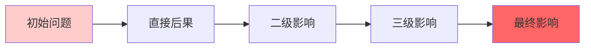

## 时间段记录与分析
| 开始时间 | 结束时间 | 任务 | 产出 | 状态 | 遇到的问题 | 即时应对 | 后续跟进 |
|---------|---------|------|------|------|------------|----------|----------|
| | | | | | | | |
| | | | | | | | |

## 行动卡片库（增强版）
| 任务名称 | 预估耗时 | 所需资源 | 难点/风险 | **潜在后果** | 状态   | 优先级 | 能量需求 | **预防措施** |
| ---- | ---- | ---- | ----- | -------- | ---- | --- | ---- | -------- |
|      |      |      |       |          | 🔴待办 |     |      |          |
|      |      |      |       |          | 🔴待办 |     |      |          |
|      |      |      |       |          | 🔴待办 |     |      |          |

## 执行步骤
1. [ ] 
2. [ ] 
3. [ ] 

## 关键决策点记录
| 决策时间 | 决策内容 | **考虑的选项**        | **选择理由** | **预期结果** | **实际结果** | 复盘建议 |
| ---- | ---- | ---------------- | -------- | -------- | -------- | ---- |
|      |      | 1.  2.  3. |          |          |          |      |
|      |      | 1.  2.  3. |          |          |          |      |

## 深度复盘与学习

### 问题根源分析（5Why法）
**表层问题：**
- 

**延伸问题**
- 
  
**深入追问：**
1. 为什么会出现这个问题？
   - 
2. 为什么这个原因存在？
   - 
3. 为什么系统/流程允许它发生？
   - 
4. 为什么我们没有提前预防？
   - 
5. 为什么我们会有这样的工作方式？
   - 

**根本原因：**
- 

### 连锁反应分析

**实际发生的连锁反应：**
- 第一层影响（直接影响）：
  - 
- 第二层影响（间接影响）：
  - 
- 第三层影响（系统性影响）：
  - 

