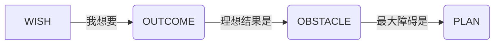

## 🎯 任务本体 (SMART 锚定)
**WHAT：**  
« 用动词+具体成果描述 »  
▸ **重构前**："整理客户资料"  
▸ **WOOP-SMART重构**：  
> ✅ **筛选20个高净值客户资料 → 生成A级客户清单(带联系方式+需求标签)**  

**SMART 自检：**  

| S具体     | M可测           | A可行        | R相关        | T时限       |
| ------- | ------------- | ---------- | ---------- | --------- |
| 输出带标签清单 | 数量≥20，完整率100% | 需2小时+CRM权限 | 推进年度客户转化目标 | {{TIME}}前 |

## 🛡️ WOOP 战场预演 (核心模块)


### 1️⃣ WISH 愿望源头
« 关联年度目标中的愿望 »  
> ✨ 例：实现季度客户转化率提升15%

### 2️⃣ OUTCOME 成功画面
« **视觉化成果具象图景** »  
✅ **数据层面**：Excel 中生成可过滤的客户矩阵表  
✅ **情感层面**：交出清单时经理点头说"精准高效"

### 3️⃣ OBSTACLE 障碍预判
« **必须用第一人称场景化描述** »  
❗️"当我开始整理时，可能会：  
- 被同事临时打断要数据 → 烦躁中敷衍了事  
- 发现客户资料残缺 → 产生挫败感直接放弃

### 4️⃣ PLAN 反击方案
« **IF-THEN 武器库自动触发** »  
```dataviewjs
dv.list([
"❗️IF 被打断 → THEN 速记对方需求说『2点回复您』+戴降噪耳机",
"❗️IF 资料缺失 → THEN 先标记『缺X信息』留空处理，集满10条后统一找助理补全"
])
```

## ⚙️ 执行记录 (事中控制)
| 时间线        | 行动记录                     | 障碍触发      | 反击状态 |  
|---------------|----------------------------|--------------|----------|
| {{TIME}}-开始 | 打开CRM导出原始数据          | -            | -        |  
| {{TIME}}      | 同事A来问报表 → **触发IF1**  | ⚡被打断      | 🛡️戴耳机 ✅ |  
| {{TIME}}      | 发现客户B缺联系方式 → **触发IF2** | 🔥资料缺失   | ⏳标记待补 |  

1. 询问AI
	1. 我自己的眼光太局限了，我需要和外界交互启发
	2. 怎么无法解决了再转移到纸质上，否则主次不分

## 🔍 日清复盘 (PDCA循环)
**完成度：** ▢ 100%  ▢ >70%  ▢ <50%  
**WOOP效能评分：** 🌟🌟🌟 (应对及时性)  

▶️ **今日最佳实践：**  
« 当____时，成功用[IF-THEN代码]化解危机 »  

▶️ **待优化环节：**  
« 应对__障碍的IF-THEN需要调整为：___ »  

▶️ **迁移价值：**  
« 此经验可复制到[其他场景]，因为... »  
