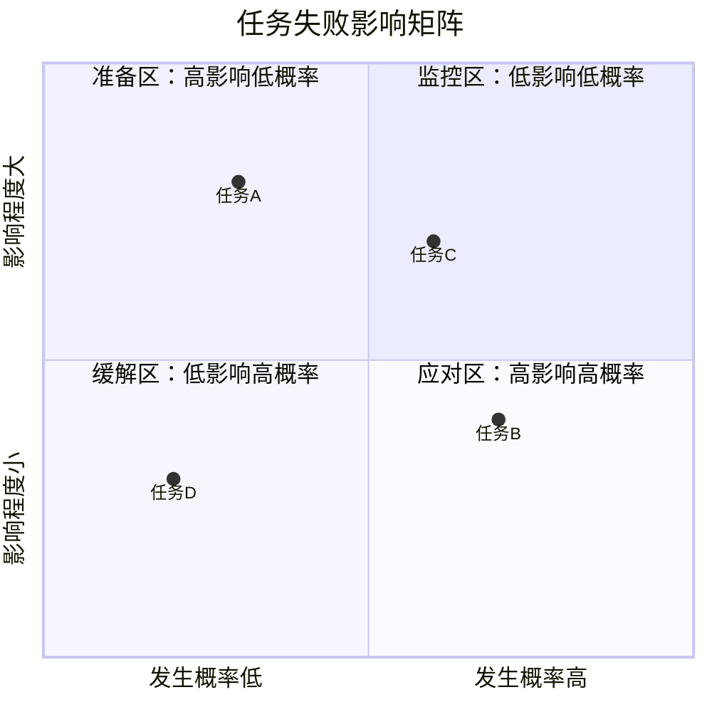
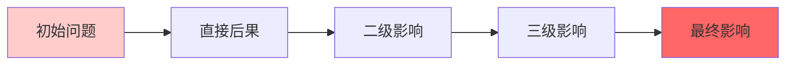

## 时间段记录与分析
| 日期   | 开始时间  | 结束时间  | 任务         | 产出                        | 状态  | 遇到的问题                                           | 即时应对 | 后续跟进 |
| ---- | ----- | ----- | ---------- | ------------------------- | --- | ----------------------------------------------- | ---- | ---- |
| 2.4  | 9:16  | 开始即结束 |            | 规划模版，SMART，目标模版           |     | 状态不好，整理笔记                                       |      |      |
|      | 14:28 | 15:00 |            |                           |     | 打扫                                              |      |      |
| 2.5  | 08.26 | 11.37 |            | 开始实践5w1h和5why             |     |                                                 |      |      |
|      | 14.23 | 17:30 |            | 在框架下思路很受限，又回归自由（什么时候和我爸谈） |     |                                                 |      |      |
| 2.6  | 8:52  | 10:00 |            | 纸质梳理                      |     |                                                 |      |      |
|      | 10:00 | 10:44 |            | 纸质梳理阅读播客，又转移了，上网留到下午吧     |     |                                                 |      |      |
|      | 14:30 | 16:00 |            | 网上查资料，之后开始看怎么花医保的钱，然后打针   |     |                                                 |      |      |
| 2.7  | 9.00  | 11.23 |            | 梳理笔记但没梳理青蛙，而是其他待办延伸出来的问题  |     |                                                 |      |      |
|      | 15:16 |       |            | 中午2:00睡觉，状态不好，放弃纸质梳理      |     |                                                 |      |      |
| 2.8  | 8.31  | 10.21 |            | 脑力耗尽                      |     |                                                 |      |      |
|      | 14.30 | 15.40 |            | 纸质梳理                      |     |                                                 |      |      |
| 2.9  | 9.00  | 10.00 |            | 纸质梳理                      |     | 纸质梳理已无进展，需要推进                                   |      |      |
|      | 10.00 | 11.30 |            | 笔记对照                      |     |                                                 |      |      |
|      | 14.30 | 15.40 |            | 笔记对照                      |     |                                                 |      |      |
| 2.10 | 8.30  | 11.10 |            | 笔记重新排版后AI2次整理             |     | ai生成的结构不够条理，需要自己重新排版                            |      |      |
|      | 14.20 | 15.20 |            | 纸质梳理，看之前的宁波怎么处理           |     | 宁波笔记多，处理耗时长，看是否有解决方案<br>另外两个已走完流程，看是否有共性的部分可以提取 |      |      |
| 2.11 | 8.30  | 10.00 |            | 纸质梳理，看宁波的怎么处理             |     | 宁波笔记多，耗时长，看是否可以有其他处理方案                          |      |      |
|      | 10.00 | 11.15 |            | 重新测试新的ai指令                |     | 测试成功，这条路可以走                                     |      |      |
|      | 11.15 |       |            | 看ai视频                     |     | 精力不允许                                           |      |      |
|      | 14.28 |       |            |                           |     | 下午状态不好，躺平                                       |      |      |
| 2.14 | 8.30  | 11.30 |            | 整理完成                      |     |                                                 |      |      |
| 2.15 | 8.30  | 11.30 | 梳理其他待办     |                           |     |                                                 |      |      |
|      | 14.24 | 15.37 | 个人思考梳理     |                           |     |                                                 |      |      |
| 2.16 | 8.34  | 9.00  | 个人思考梳理     |                           |     |                                                 |      |      |
| 3.2  |       |       | 个人思考梳理（病+） |                           |     |                                                 |      |      |
| 3.3  |       |       | 个人思考梳理（谈话） |                           |     |                                                 |      |      |


| 日期   | 开始时间  | 结束时间  | 任务  | 产出                                        | 遇到的问题 |
| ---- | ----- | ----- | --- | ----------------------------------------- | ----- |
| 2.22 | 9:16  | 11.37 |     | 将笔记和AI对照                                  |       |
| 2.23 | 9:16  | 11.37 |     | 将笔记和AI对照                                  |       |
| 2.24 | 9:16  | 11.37 |     | 将笔记和AI对照                                  |       |
| 2.25 | 9:16  | 11.37 |     | 对待办打标签                                    |       |
|      | 14:28 | 17:00 |     | 将笔记从待办→灵感                                 |       |
| 2.26 | 08.26 | 11.37 |     | 将笔记从待办→灵感                                 |       |
|      | 14.23 | 17:30 |     | 文本转语音代码调试<br> obsidian中融入skills           |       |
| 2.27 |       |       |     | 实践从0搭建Obsidian知识库，用Kimi深度搜索               |       |
| 2.28 |       |       |     | 购买谷歌账号，实践notebooklm                       |       |
| 3.1  |       |       |     | 视频学习的笔记导入Obsidian，开始实践这个习惯<br>导出播客笔记，开始实践 |       |
| 3.2  |       |       |     |                                           |       |
| 3.3  |       |       |     |                                           |       |
| 3.4  |       |       |     | 购物                                        |       |
| 3.5  |       |       |     | 上下午整理，晚上谈                                 |       |
| 3.6  |       |       |     | 歇菜，效率不怎么样                                 |       |
| 3.7  |       |       |     | 看视频，                                      |       |
| 3.8  |       |       |     | 调试结构化指令，确定原子笔记和总览的结构<br>下午写rpa指令          |       |
| 3.9  |       |       |     | 上午继续rpa<br>下午3w→1w的指令和ai工具确定              |       |
| 3.10 |       |       |     |                                           |       |

### 问题追踪表（按严重程度）
| 问题描述 | 发现时间 | 影响任务 | 紧急程度        | 根本原因 | 解决方案 | 负责人 | 解决状态 |
| ---- | ---- | ---- | ----------- | ---- | ---- | --- | ---- |
|      |      |      | 🔴高/🟡中/🟢低 |      |      |     | 待处理  |
|      |      |      | 🔴高/🟡中/🟢低 |      |      |     | 待处理  |

## 行动卡片库（增强版）
| 任务名称 | 预估耗时 | 所需资源 | 难点/风险 | **潜在后果** | 状态 | 优先级 | 能量需求 | **预防措施** |
|---------|---------|---------|----------|--------------|------|--------|---------|--------------|
| | | | | | 🔴待办 | | | |
| | | | | | 🔴待办 | | | |
| | | | | | 🔴待办 | | | |

### 后果影响矩阵


## 执行步骤与检查点
| 步骤 | 具体行动 | 检查标准 | **可能的问题** | **问题后果** | **备用方案** | 完成状态 |
|------|----------|----------|----------------|--------------|--------------|----------|
| 1 | | | | | | [ ] |
| 2 | | | | | | [ ] |
| 3 | | | | | | [ ] |

### 关键决策点记录
| 决策时间 | 决策内容 | **考虑的选项**        | **选择理由** | **预期结果** | **实际结果** | 复盘建议 |
| ---- | ---- | ---------------- | -------- | -------- | -------- | ---- |
|      |      | 1. <br>2. <br>3. |          |          |          |      |
|      |      | 1. <br>2. <br>3. |          |          |          |      |

## 深度复盘与学习

### 问题根源分析（5Why法）
**表层问题：**
- 
  
**深入追问：**
1. 为什么会出现这个问题？
   - 
2. 为什么这个原因存在？
   - 
3. 为什么系统/流程允许它发生？
   - 
4. 为什么我们没有提前预防？
   - 
5. 为什么我们会有这样的工作方式？
   - 

**根本原因：**
- 

### 连锁反应分析


**实际发生的连锁反应：**
- 第一层影响（直接影响）：
  - 
- 第二层影响（间接影响）：
  - 
- 第三层影响（系统性影响）：
  - 

### 效率评估与优化
**今日专注时长：** 
**有效产出时间：** 
**时间损失分布：**
- 沟通协调：___%
- 技术问题：___%
- 等待/阻塞：___%
- 会议：___%
- 其他：___%

**主要干扰因素：**
1. **因素：** ______
   - **影响程度：** 🔴高/🟡中/🟢低
   - **发生频率：** 每天/每周/偶尔
   - **可控性：** 可控制/可影响/不可控
   - **应对策略：**
     - 
2. **因素：** ______
   - **影响程度：** 🔴高/🟡中/🟢低
   - **发生频率：** 每天/每周/偶尔
   - **可控性：** 可控制/可影响/不可控
   - **应对策略：**
     - 

### 风险预警雷达
```mermaid
radar-chart
    title 风险预警雷达图
    axis "时间风险", "质量风险", "成本风险", "范围风险", "沟通风险", "技术风险"
    "当前状态" [7, 6, 4, 5, 8, 3]
    "警戒阈值" [5, 5, 5, 5, 5, 5]
    "安全区域" [3, 3, 3, 3, 3, 3]
```

**高风险领域（需立即关注）：**
1. 
   - **表现：**
   - **可能后果：**
   - **缓解措施：**

**中风险领域（需要监控）：**
1. 
   - **表现：**
   - **可能后果：**
   - **预防措施：**

### 效率提升实验
**本周尝试的改进方法：**
- [ ] 方法1：______
  - **预期效果：**
  - **实际效果：**
  - **是否坚持：** 是/否
- [ ] 方法2：______
  - **预期效果：**
  - **实际效果：**
  - **是否坚持：** 是/否

**效率提升想法：**
1. **想法：** ______
   - **实施难度：** 🔴高/🟡中/🟢低
   - **预期收益：** 🔴高/🟡中/🟢低
   - **试点计划：**
     - 
2. **想法：** ______
   - **实施难度：** 🔴高/🟡中/🟢低
   - **预期收益：** 🔴高/🟡中/🟢低
   - **试点计划：**
     - 

### 教训与洞察库
| 学到的教训 | 发生场景 | 根本原因 | 避免方法 | 适用场景 | 重要程度 |
|------------|----------|----------|----------|----------|----------|
| | | | | | 🔴关键/🟡重要/🟢一般 |
| | | | | | 🔴关键/🟡重要/🟢一般 |

---

## 明日改进计划

### 基于今日问题的针对性改进
1. **问题：** ______
   - **改进措施：**
     - 
   - **检查点：** 
   - **成功标志：**

2. **问题：** ______
   - **改进措施：**
     - 
   - **检查点：** 
   - **成功标志：**

### 风险预防清单
- [ ] 
- [ ] 
- [ ] 

### 重点关注事项
1. 
2. 

---

## 长期模式识别

### 重复出现的问题模式
| 问题模式 | 出现频率 | 触发条件 | 影响范围 | 系统性解决方案 |
| ---- | ---- | ---- | ---- | ------- |
|      |      |      |      |         |
|      |      |      |      |         |

### 个人效能模式
**高效时段分布：**
- 上午（9-12）：效率___%
- 下午（13-17）：效率___%
- 晚上（18-22）：效率___%

**高效工作条件：**
1. 
2. 
3. 

**低效触发因素：**
1. 
2. 
3. 
