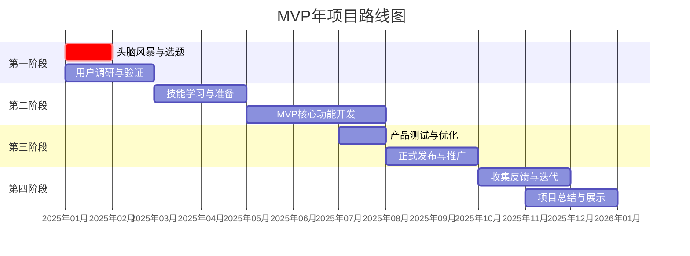

# 🚀 **方向7：“最小可行产品（MVP）年”详细计划**

基于你对方向7的兴趣，我为你设计了一套完整的、可执行的年度计划。这个计划将引导你从0到1打造一个真实可用的个人产品，同时锻炼关键能力，为职业重启提供强力证明。

---

## 📋 **年度计划核心档案**

**year**: 2025  
**area**: 产品打造 | 技能整合 | 个人品牌  
**status**: active  
**target**: 在2025年12月31日前，完成并发布一个完整的、可展示的“最小可行产品”（MVP），并收获至少100名真实用户或观众  
**measure**:  
- 完成产品从构思到上线的全流程  
- 获得至少100名用户/关注者/下载量  
- 收集至少20条有效用户反馈  
- 将整个过程系统记录为“构建日志”  
**feasible**: 利用免费工具和平台，通过分阶段执行降低难度  
**relevance**: 直接展示项目管理、问题解决和创造能力，弥补职业空窗期  
**deadline**: 2025年12月31日  
**progress**: 0%  

---

## 🎯 **第一阶段：产品构思与验证（1-2月）**

### **核心目标**：确定一个具体、可行、有价值的MVP方向
### **关键任务**：
1. **头脑风暴会议**（1月第1周）
   - 列出你感兴趣的3-5个领域
   - 在每个领域中找出1-2个你能解决的小问题
   - 示例方向：
     * 一个帮助求职者整理进度的Notion模板
     * 一个记录城市免费学习资源的网站/文档
     * 一系列“30天学会基础Python”的图文教程
     * 一个本地生活省钱技巧的邮件通讯

2. **最小可行性测试**（1月第2-3周）
   - 制作简单的产品原型（草图/描述文档）
   - 向5-10位潜在用户展示并收集初步反馈
   - 使用“价值 vs 可行性”矩阵评估每个想法

3. **最终决策与规划**（1月第4周-2月）
   - 选定一个MVP方向
   - 制定详细的产品规格（功能列表、用户画像）
   - 创建项目时间线和技术栈选择

### **产出物**：
- 产品概念文档（一页纸说明）
- 用户反馈摘要
- 详细项目计划

---

## 🔨 **第二阶段：学习与构建（3-7月）**

### **核心目标**：掌握必要技能，完成产品构建
### **关键任务**：
1. **技能补全计划**（3-4月）
   - 根据产品需求，学习关键技能（如基础编程、设计工具、写作等）
   - 采用“学一点，用一点”的即时应用策略

2. **MVP开发**（5-7月）
   - 按模块逐步构建产品
   - 每周记录进展和遇到的挑战
   - 保持功能极简化，专注于核心价值

3. **内部测试**（7月底）
   - 邀请3-5位友好用户进行早期测试
   - 修复关键问题，优化用户体验

### **产出物**：
- 技能学习记录
- 产品构建日志（每周更新）
- 可运行的MVP初版

---

## 🚢 **第三阶段：发布与推广（8-10月）**

### **核心目标**：正式发布产品，获取首批用户
### **关键任务**：
1. **发布准备**（8月第1-2周）
   - 完善产品文档和使用说明
   - 准备发布素材（截图、介绍文案、演示视频）
   - 选择合适的发布平台（GitHub、独立网站、应用商店等）

2. **启动推广**（8月第3周-9月）
   - 在相关社群、论坛分享产品
   - 撰写一篇“我是如何构建这个产品的”幕后故事
   - 使用简单增长策略（如邀请机制、限时免费）

3. **用户反馈循环**（10月）
   - 建立用户反馈收集机制
   - 根据反馈规划产品迭代路线图

### **产出物**：
- 已发布的产品链接
- 首批用户数据报告
- 用户反馈汇总与分析

---

## 📈 **第四阶段：迭代与总结（11-12月）**

### **核心目标**：基于反馈优化产品，完成项目总结
### **关键任务**：
1. **产品迭代**（11月）
   - 开发1-2个最重要的新功能或改进
   - 发布更新版本

2. **项目总结与展示**（12月）
   - 制作项目作品集页面
   - 撰写完整的项目复盘报告
   - 准备向潜在雇主展示的“故事”

3. **下一步规划**（12月底）
   - 决定产品的未来方向（继续维护、开源、存档）
   - 将所学技能迁移到求职或新项目中

### **产出物**：
- 项目作品集（在线页面）
- 深度复盘报告
- 技能迁移计划

---

## ✨ **SMART完整描述**

**«在2025年底前独立完成并发布一个解决实际问题的MVP，获得100名真实用户»**  
- **达成证据**：可访问的产品链接、用户数据截图、构建过程文档、用户反馈记录  
- **执行策略**：  
  1. 每周固定10-15小时专注项目时间（可分散安排）  
  2. 采用敏捷开发思维，小步快跑，每周都有可见进展  
  3. 公开分享过程，建立问责机制（如定期在社交媒体更新进度）  
- **关联强度**：极高（直接证明主动性、学习能力和项目执行力）  
- **最后期限**：2025年12月31日  

---

## 📅 **月度里程碑甘特图**



---

## 🛡️ **WOOP完整描述**

- **wish**: 通过独立完成一个真实产品，证明自己的创造力和执行力，为职业生涯注入新动力  
- **outcome**: 拥有一份令人印象深刻的项目作品、系统的产品思维、真实用户反馈带来的自信  
- **obstacle**: 
  1. 中途失去动力或方向
  2. 技术难题难以解决
  3. 羞于推广和展示自己
  4. 与求职时间冲突
  
- **plan**:
  1. **如果中途失去动力**：回顾最初解决问题的热情；将大目标拆解为微小到不可能失败的小任务
  2. **如果遇到技术难题**：将问题具体化后在技术社区求助；考虑简化方案或替代实现
  3. **如果羞于推广**：从最小范围开始（如亲友圈）；聚焦于“帮助他人”而非“展示自己”
  4. **如果与求职冲突**：将产品构建本身写入求职日程；将项目进展作为面试谈资

---

## 💡 **MVP创意灵感库**

如果你还没有具体想法，这里有几个适合个人开发者且市场需求明确的MVP方向：

| 方向 | 核心价值 | 所需技能 | 潜在用户 |
|------|----------|----------|----------|
| **求职进度追踪器** | 帮助求职者系统管理申请进度 | Notion/表格+基础设计 | 求职者、转行者 |
| **本地免费资源地图** | 聚合城市免费学习、活动空间 | 地图API/简单网页 | 学生、自由职业者 |
| **习惯养成伴侣** | 极简习惯追踪与打卡 | 简单APP/微信小程序 | 自我提升人群 |
| **专业知识库** | 系统整理某个细分领域知识 | 内容整理+网站搭建 | 学习者、从业者 |
| **工具工作流** | 自动化某个重复性手动任务 | 脚本编程/现有工具组合 | 有相同痛点的人群 |

---

## 📊 **进度跟踪模板**

```markdown
## 第X周进展 (YYYY-MM-DD)

### 本周完成
- [ ] 任务1
- [ ] 任务2

### 遇到的问题
1. 问题描述
   - 尝试的解决方案
   - 结果

### 下周计划
1. 计划任务1
2. 计划任务2

### 关键学习
- 学习点1
- 学习点2
```

---

## 🎯 **下一步行动建议**

1. **立即行动**：从本周开始，花2小时进行**头脑风暴**，列出至少3个可能的MVP想法
2. **资源准备**：创建一个专用的项目文件夹（数字或实体），存放所有相关材料
3. **公开承诺**：告诉一位朋友你的计划，建立初期问责
4. **学习启动**：根据可能的方向，开始学习最基础的技能（如GitHub使用、基础HTML等）

**需要我帮你做什么？**
- 如果你已经有了MVP的具体想法，我可以帮你细化产品规格
- 如果你需要学习资源推荐，我可以根据方向提供清单
- 如果你想要更详细的每周执行模板，我可以为你定制

这个计划的核心是**行动而非完美**。每一个不完美的进展，都比完美的计划更有价值。从写下第一个想法开始，你的2025年MVP之旅就正式启动了。

祝你打造出令自己骄傲的作品！ 🛠️