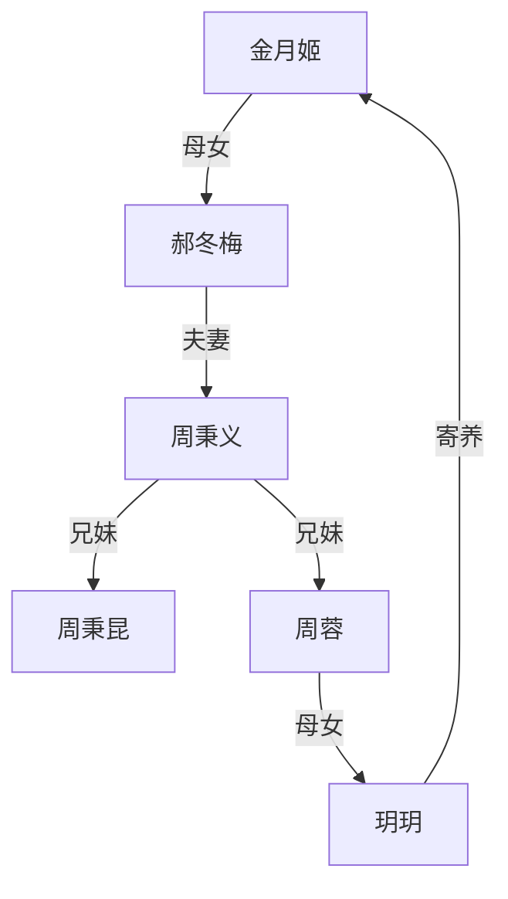

# 人世间

状态: TODO
Update Date: 2025年11月14日 10:22
Create Date: 2025年11月14日 10:17

# dedepan书籍资源获取指南

创建于：2025-11-12 02:11:54

标签：
AI链接笔记
书单推荐
dedepan
免费电子书

---

原文：[(anonymous)](https://x-1381123255.cos.ap-beijing.myqcloud.com/%E4%BA%BA%E4%B8%96%E9%97%B4_PVAXMXF55YYKVS7YVDX3BVXCDKYJB2KN_01_%E7%AB%A0%E8%8A%82_1.pdf)

📚 **核心资源获取渠道**
- 微信公众号：TEDshare（名称：dedepan）
- QQ群：974707128（dedepan读书交流群）

📋 **精选书籍资源分类**
1. kindle人60G书籍资源精选
2. 豆瓣年度高分图书
3. 豆瓣年度短篇小说
4. 多看阅读精选
5. 亚马逊销量前20书籍
6. 京东销量前10书籍
7. 网易蜗牛读书在读榜前十图书
8. 知乎一小时系列图书
9. 知名作家作品合集

💡 **服务特点**
- 每日更新新的书单
- 提供多种平台/榜单的精选书籍资源

# 梁晓声个人信息及主要成就

创建于：2025-11-12 02:12:10

标签：
AI链接笔记
梁晓声
当代作家
知青文学

---

原文：[(anonymous)](https://x-1381123255.cos.ap-beijing.myqcloud.com/%E4%BA%BA%E4%B8%96%E9%97%B4_PVAXMXF55YYKVS7YVDX3BVXCDKYJB2KN_02_%E7%AB%A0%E8%8A%82_2.pdf)

### 一、基本信息

### 1. 个人概况

- 原名：梁绍生
- 祖籍：山东荣成
- 出生：1949年，哈尔滨市

### 2. 职业身份

- 当代著名作家、学者
- 现任北京语言大学人文学院资深教授
- 全国政协委员
- 中央文史研究馆馆员

### 二、主要作品

- 《今夜有暴风雪》
- 《这是一片神奇的土地》
- 《雪城》
- 《返城年代》
- 《年轮》
- 《知青》
- 其他：数十部作品，多部被译介到海外

# A城共乐区历史发展脉络

创建于：2025-11-12 02:12:25

标签：
AI链接笔记
A城共乐区
城市发展史
移民社区

---

原文：[(anonymous)](https://x-1381123255.cos.ap-beijing.myqcloud.com/%E4%BA%BA%E4%B8%96%E9%97%B4_PVAXMXF55YYKVS7YVDX3BVXCDKYJB2KN_03_%E7%AB%A0%E8%8A%82_3.pdf)

📜 **一、共乐区的起源（20世纪20-30年代）**

1. **早期居民构成**

- 苏联逃亡者聚居地：”十月革命”的敌对者/不被信任者（富农、小地主及受牵连者）

- 与市中心俄式贵族建筑群的差异：前者为”板夹泥”房，后者为贵族府邸

2. **地理特征**

- 位置：距A市中心十几里，地势高于周边

- 基础设施：土路连接农村，无正式街名，与城市间有铁路分隔

🏗️ **二、日据时期的变迁（1931年后）**

1. **日本设施建设**

- 铁路员工宿舍：水泥厚墙建筑，兼具居住与要塞功能

- 日军军营：最多驻兵一个团，设”慰情舍”（军妓院）

2. **社会影响**

- 居民恐慌：中国流民与俄裔侨民终日提防

- 经济隔离：日人生活物资充足，与本地居民形成鲜明对比

🔄 **三、战后初期的动荡（1945年光复后）**

1. **资源争夺**

- 中国居民：瓜分日军遗留物资（粮食、衣物、战马）

- 俄裔侨民：接收日军军犬，体现对动物的特殊情感

2. **人口流动**

- 日本女性：被中国光棍领走，成为”幸运日”的特殊收获

- 苏联红军：与俄裔侨民建立亲密关系，形成文化冲突点

🏙️ **四、城市新区的形成（20世纪50年代后）**

1. **行政确立**

- 1950年代初：颁发统一户口本，正式命名”共乐区”

- 基础设施改造：土路硬化、街名标准化（光仁街/光义街等）、公共照明与公厕建设

2. **经济与社会发展**

- 工业：拖拉机制造厂、亚麻布厂、松花江酱油厂（全市知名）

- 民生：2所中学、5所小学、1所小型医院、近400㎡大型商店

- 身份认同：粮店的设立标志居民获得”商品粮”资格，实现从农民到市民的转变

# 《人世间》第二章：1972年A市死刑执行事件与"九虎十三鹰"团伙

创建于：2025-11-12 02:12:41

标签：
AI链接笔记
文革社会生态
九虎十三鹰团伙
死刑执行制度

---

原文：[(anonymous)](https://x-1381123255.cos.ap-beijing.myqcloud.com/%E4%BA%BA%E4%B8%96%E9%97%B4_PVAXMXF55YYKVS7YVDX3BVXCDKYJB2KN_04_%E7%AB%A0%E8%8A%82_4.pdf)

### 一、死刑执行背景与布告制度

1. **执行概况**
    - ⏰ 时间：1972年冬季上午10时
    - 地点：A市松花江畔沙滩（常规刑场）
    - 规模：7名死刑犯（6名杀人犯+1名惯犯强奸犯）
2. **布告张贴规则**
    - 仅限死刑犯布告张贴于”显眼处”（人行道墙面）
    - 非市中心区无专用布告栏，叠加于旧大字报之上
    - 死刑犯姓名需划**鲜红×**，视觉冲击力强
    - 偶用重刑犯名单填充版面（当死刑犯人数不足时）

### 二、”九虎十三鹰”团伙详情

1. **组织构成**
    - 性质：文革时期城市流氓团伙（类似”古惑仔”）
    - 成员：
        - 🔹”九虎”：9名男性，最小未满19岁
        - 🔹”十三鹰”：13名女性，最小17岁
    - 核心成员：涂志强（”九虎”之一，本次处决对象）
2. **作案特征**
    - 活动范围：外市/外省，避免本地作案
    - 目标群体：”三结合”干部（含造反派）
    - 作案手段：扒/偷/骗/抢+女性成员色相勾引
    - 标志性案件：列车软卧干部财物盗窃案（附裤裆剪裤恶作剧）
    - 生存技能：伪造介绍信入住招待所、获取特供避孕药

### 三、核心人物关系网络

1. **涂志强（强子）**
    - 背景：共乐区光字片出身，”红五类”家庭（父亲为电锯厂烈士）
    - 性格：孤僻内向，寡言少语
    - 前科：”九虎十三鹰”成员，曾被劳教3个月
    - 死因：醉酒斗殴杀人（未交代真实动机）
2. **周秉昆**
    - 身份：涂志强的发小+工厂”对子”（抬木梁搭档）
    - 关系：被迫参与刑场围观，因恐惧晕倒
    - 特殊点：唯一明确表达对涂志强情感联结的角色
3. **公安干部与围观群众**
    - 干部矛盾行为：强调”人道主义”却拒绝警帽使用
    - 群众心理：将行刑视为”特殊娱乐”，骑车全程跟随

### 四、文革时期社会生态侧写

1. **青年生存困境**
    - 🔻”上山下乡”政策：初高中生强制离城，留城者多为病残或”顽固者”
    - 家庭结构破裂：父母被下放/关押，青少年形成”抱团取暖”团伙
2. **司法与社会秩序**
    - 量刑标准：”红五类”身份可减轻刑罚但难抵死罪
    - 行刑流程：7人以上处决必游街示众，用铁钎补刺确认死亡（节约子弹）
    - 人道细节：临刑前为涂志强寻帽，最终由瘸腿群众提供”坦克帽”

### 五、关键场景与象征意义

1. **刑场围观场景**
    - 围观人群：自发聚集，骑车跟随刑车至终点
    - 秩序维持：工厂强制派人（含教育意义），臂挽臂组人墙
2. **夜间悼念情节**
    - 神秘团伙：自称”大哥”的人物率人悼念，暗示涂志强杀人另有隐情
    - 环境隐喻：寒风卷雪的鬼城意象，烘托时代压抑感

# 《人世间》第三章：光字片的生活与周家变故

创建于：2025-11-12 02:12:56

标签：
AI链接笔记
上山下乡
光字片
禁书阅读

---

原文：[(anonymous)](https://x-1381123255.cos.ap-beijing.myqcloud.com/%E4%BA%BA%E4%B8%96%E9%97%B4_PVAXMXF55YYKVS7YVDX3BVXCDKYJB2KN_05_%E7%AB%A0%E8%8A%82_5.pdf)

### 一、光字片的居住环境与人际关系

### 1. 居住条件

- 🏠 **建筑特征**：土坯房为主，草房顶多改为油毡顶（补丁遍布、石头压制），门窗歪斜、墙体矮化
- 🚶 **布局特点**：无院落、户挨户排列，街道狭窄（窗对窗/门对门），公共设施简陋（公厕摇摇欲坠、路灯缺失）

### 2. 人际关系

- ✅ **优势**：邻里互助意识强（”拆了墙就是一家人”），安全系数高（一家有事全街支援）
- ❌ **劣势**：隐私完全暴露（日常活动、访客情况无秘密），矛盾成本高（”低头不见抬头见”）

### 二、周家概况与核心人物

### 1. 家庭构成

- 👨‍👩‍👧‍👦 **成员情况**：
    - 父亲：周志刚（新中国第一代建筑工人，长期在大西北工作）
    - 母亲：典型家庭妇女，街道组长（调解邻里纠纷）
    - 子女：周秉义（长子）、周蓉（长女）、周秉昆（幼子）

### 2. 居住特殊性

- 🔑 **唯一院落**：因公厕建在门前获补偿，成为街道唯一有小院的家庭
- 🏠 **房屋结构**：两间20平米方正房间，后墙开窗改善采光通风

### 三、周家子女命运转折（1972年背景）

### 1. 长子周秉义

- 📚 **知青经历**：首批下乡知青，兵团宣传干事
- 💑 **情感关系**：与”走资派”女儿郝冬梅相恋，共同阅读禁书（《战争与和平》《红与黑》等）

### 2. 长女周蓉

- 🎤 **人物特质**：三中校花、文艺骨干（歌唱 talent），性格执拗有主见
- 🌟 **关键事件**：
    - 隐瞒家人远赴贵州插队（因与北京摘帽右派诗人相恋）
    - 与蔡晓光维持”朋友关系”（对方实为追求者，协助其下乡）
    - 留下简短书信解释去向，引发家庭危机

### 3. 幼子周秉昆

- 🤔 **人物特点**：被认为”缺心眼”，实则有独立思考能力（为《叶尔绍夫兄弟》角色抱不平）
- 👨‍👩 **家庭角色**：最终留城陪伴母亲，承担照顾责任

### 四、核心冲突与社会背景

### 1. 家庭内部矛盾

- 💥 **代际冲突**：周蓉婚恋观与母亲传统观念对立（”好年华vs好人生”辩论）
- 🔄 **姐弟关系**：周蓉对周秉昆的”不聪明”评价引发弟弟自尊反击

### 2. 时代印记

- 📜 **政策影响**：”上山下乡”政策（多子女家庭仅留一人）
- 📚 **文化环境**：禁书阅读成青年精神寄托（托尔斯泰/肖洛霍夫等名著地下传播）
- ⚖️ **政治标签**：”右派”“走资派”等身份对个人命运的直接影响

# 《人世间》第四章人物事件梳理

创建于：2025-11-12 02:13:12

标签：
AI链接笔记
周秉昆职业转型
乔春燕人物弧光
知青家庭关系

---

原文：[(anonymous)](https://x-1381123255.cos.ap-beijing.myqcloud.com/%E4%BA%BA%E4%B8%96%E9%97%B4_PVAXMXF55YYKVS7YVDX3BVXCDKYJB2KN_06_%E7%AB%A0%E8%8A%82_6.pdf)

### 一、周秉昆的工作与心理困境

1. **木材厂经历**
    - 目睹工友涂志强被处决后精神受创，频繁出现幻觉（误认新搭档为涂志强、电锯声引发恐怖联想）
    - 因多次叫错同事名字与肖国庆发生冲突，最终与领导争执后辞职
2. **职业转型契机**
    - 求助前准姐夫蔡晓光，通过谎称”堂兄弟”关系进入拖拉机厂传达室
    - 被推荐调入松花江酱油厂，接受”福利优于厂名体面”的现实（每月发放酱油/醋/味精，夏季有自制冰棍）

### 二、乔春燕的人生轨迹

1. **职业分配挫折**
    - 因姐姐们在兵团服役，自信能分配国企，却被安排到公共浴池学修脚
    - 初期抗拒”服务男性”的工作内容，后成为师傅唯一学徒，在单位获得特殊地位
2. **人物成长变化**
    - 外形：从”假小子”身材变得有女性曲线，着装摩登（贝雷帽+红围巾+灰呢大衣）
    - 性格：保持大大咧咧特质，学会用自嘲化解尴尬（自称”人民修脚师”）

### 三、周家家庭关系

1. **母子互动**
    - 母亲患角膜炎视力衰退，仍坚持糊墙/烧炕，关心儿子工作与婚恋
    - 秉昆主动分担家务（倒泔水），因未能保护姐姐心怀愧疚
2. **姐弟隔阂**
    - 周蓉离家四年未归，家信内容多为”散文投稿”式见闻，回避家庭关怀
    - 母亲对女儿”风花雪月”的来信感到失望，常中断秉昆读信

### 四、社会背景与人际关系

1. **知青政策影响**
    - A市多数青年赴兵团/农场（挣工资），家庭经济因”少人吃饭+子女寄钱”改善
    - 周家因周蓉私奔贵州山区，成为邻里间的特殊存在
2. **权力阶层差异**
    - 蔡晓光（省革委会常委之子）：任拖拉机厂办公室副主任，抽特供”凤凰”烟，可调动跨系统资源
    - 普通市民：如周家冬季靠烧炕取暖，多数家庭买不到好煤

### 五、关键事件时间线

| 时间节点 | 核心事件 |
| --- | --- |
| 1968年 | 周蓉离家赴贵州；春燕分配修脚工作 |
| 1971年 | 蔡晓光提前告知林彪事件机密 |
| 1972年初 | 涂志强被处决，周秉昆辞职 |
| 1972年冬 | 秉昆调入松花江酱油厂 |

# 周秉昆的酱油厂工作与新使命

创建于：2025-11-12 02:13:27

标签：
AI链接笔记
周秉昆
酱油厂工作
出渣工

---

原文：[(anonymous)](https://x-1381123255.cos.ap-beijing.myqcloud.com/%E4%BA%BA%E4%B8%96%E9%97%B4_PVAXMXF55YYKVS7YVDX3BVXCDKYJB2KN_07_%E7%AB%A0%E8%8A%82_7.pdf)

📝 **一、入职背景与波折**

1. **入职契机**

- 1973年春节前，经蔡晓光代办手续，周秉昆成为松花江酱油厂工人

- 蔡晓光代签姓名，字迹漂亮，让秉昆感叹”人比人气死人”

1. **岗位分配冲突**
    - **初始安排**：厂一把手拟分配至味精车间（干净、活轻）
    - **反对者**：革委会副主任曲秀贞（51-52岁，绰号”水英妈”，1938年参加革命，原省高院庭长，丈夫为开国少将）
    - **反对理由**：味精车间超编，出渣班组缺人（力气活），新人为壮小伙
    - **结果**：领导班子附和曲秀贞，分配至出渣班组
2. **出渣工工作特点**
    - **劳动强度**：24小时三班倒，高温酱油渣需扬出窗外装卡车，”气蒸背后，风吹前身”
    - **健康风险**：两名老工人因风湿性心脏病一死一病休

📊 **二、工厂人际关系与谣言**

1. **工友关系**

- **吕川**：国字脸络腮胡，相貌堂堂，五音不全爱唱歌

- **曹德宝**：瘦高个留大背头，绰号”五四青年”，口琴伴奏

- **态度**：孤立秉昆，认为出渣工结局注定悲惨

1. **谣言与影响**
    - **谣言内容**：靠后门入职、父亲惩罚、私生子等
    - **秉昆应对**：将谣言视为”无形保护伞”，享受”上等家庭背景”标签
    - **厂领导态度**：一把手暗示”暂时安排”，请求不告知其堂哥

👥 **三、神秘人物与新使命**

1. **陌生人接触**

- **接头人**：27-28岁”棉猴”大衣男子+瘸腿小个子（容貌女性化）

- **接触方式**：下班路上被挽住手臂，带至避风楼角

1. **委托任务**
    - **背景**：涂志强（秉昆前同事）杀人伏法，遗孀郑娟、儿子及老岳母生活无着
    - **委托内容**：每月代送30元生活费，地址写在信封上
    - **报酬**：每次10元辛苦费（秉昆转赠）
2. **人物特征**
    - **瘸子**：秀眉俊目，说话绵软，强调”讲义气、讲诚信”，能通过眼神判断他人同情心
    - **棉猴**：配合瘸子行动，负责交接钱款

# 周家养鸡与光字片生活日常

创建于：2025-11-12 02:13:43

标签：
AI链接笔记
计划经济时期
物资匮乏年代
邻里关系

---

原文：[(anonymous)](https://x-1381123255.cos.ap-beijing.myqcloud.com/%E4%BA%BA%E4%B8%96%E9%97%B4_PVAXMXF55YYKVS7YVDX3BVXCDKYJB2KN_08_%E7%AB%A0%E8%8A%82_8.pdf)

### 一、时代背景与物资状况

1. **食品供应体系**
    - 凭票定量：猪肉每人每月半斤、豆油每人每月半斤、豆腐每人每月10块
    - 特殊商品：鸡蛋仅春节凭票供应，每人半斤
    - 重要凭证：副食本与户口本同等重要，丢失需层层审批补发
2. **百姓应对策略**
    - 优先选择肥肉：可炼大油延长食用周期，邻里间相互通报特肥肉供应信息
    - 养鸡补充营养：主要目的是获取鸡蛋，春季需到郊区购买小鸡（成活率约1/3-1/4）

### 二、周家养鸡事宜

1. **养鸡条件与成果**
    - 居住优势：外屋（厨房）宽敞，可隔出空间放置鸡笼
    - 养殖成果：2只母鸡每3天下2蛋，母亲视其为”劳苦功高的家庭成员”
2. **鸡蛋分配与使用**
    - 主要用途：母亲作为街道大组长，用于慰问邻里（坐月子、生病、老人等情况）
    - 内部消耗：优先供应秉昆（因工作劳累），春节预留招待蔡晓光

### 三、人物关系与核心事件

1. **周母的社交网络**
    - 身份：街道大组长，通过送鸡蛋密切联系群众
    - 人际关系：与春燕母亲频繁交流，涉及子女婚恋话题
2. **秉昆的社交与矛盾**
    - 蔡晓光事件：母亲因当年驱赶蔡晓光自责，计划春节宴请道歉
    - 春燕纠缠：春燕主动接近秉昆，其父母与周母暗中议论二人关系
    - 鸡蛋用途冲突：秉昆不满母亲将鸡蛋用于”无关琐事”，欲转赠工友
3. **邻里互动片段**
    - 春燕家庭矛盾：因二姐婚恋问题父母争吵，周母送鸡蛋慰问
    - 水站偶遇：春燕暗示对秉昆的好感，提及想找木材厂职工处对象

### 四、关键细节与时代印记

- **生活细节**：水缸容量（两担水用一周）、副食券使用场景、冻豆腐购买技巧
- **观念特征**：”营养过剩”被视为天方夜谭，肥肉炼大油被认为比豆油香
- **权力象征**：街道组长职务虽小，却需承担调解邻里矛盾的责任

# 《人世间》第七章：社会阶层与人性困境

创建于：2025-11-12 02:13:58

标签：
AI链接笔记
《人世间》第七章
社会阶层分化
特殊年代生存

---

原文：[(anonymous)](https://x-1381123255.cos.ap-beijing.myqcloud.com/%E4%BA%BA%E4%B8%96%E9%97%B4_PVAXMXF55YYKVS7YVDX3BVXCDKYJB2KN_09_%E7%AB%A0%E8%8A%82_9.pdf)

### 一、A市地理与社会空间分布

### 1.1 “上坎”地貌与居住格局

- 🌉 **地理特征**：城市形成前的缓坡地貌，与江边平地形成阶层分化
- 🏘️ **居住差异**：
    - **上坎区域**：俄式老建筑，住户以中小知识分子、基层干部为主（教师/医生/科长等）
    - **坡下胡同**：土坯房密集区，郑娟家所在，生存条件恶劣
    - **市中心区**：高级知识分子与处级以上干部居住区

### 1.2 光字片与太平胡同的生存环境

- 光字片：被描述为”脏街组合部落”，但对比胡同人家反显幸福
- 太平胡同：
    - 曲里拐弯约一里半长，房屋连成黄泥墙
    - 无门牌号，道路狭窄（最窄处仅一米）
    - 与上坎人家因取土问题长期冲突

### 二、郑娟家庭构成与生存状态

### 2.1 核心家庭成员

- 👩 **郑娟**：21-22岁未婚母亲，涂志强遗孀，外表柔弱内心刚烈
- 👵 **郑母**：以卖冰棍/糖葫芦为生，对现实妥协
- 👦 **郑光明**：盲少年，懂事早熟，靠玻璃片望太阳为乐

### 2.2 经济困境与社会关系

- 经济来源：郑母小生意维持全家生计
- 社会关系：
    - 与涂志强未正式领证，属”非正式寡妇”
    - 受涂志强朋友（瘸子二人组）资助
    - 与周秉昆因送钱事件建立联系

### 三、周秉昆的心理转变与社会认知

### 3.1 送钱事件的关键冲突

- 🔑 **核心矛盾**：郑娟拒绝接受”施舍” vs 家庭实际生存需求
- 事件结果：
    - 郑母以哀求方式收下钱
    - 周秉昆承诺每月送钱
    - 与郑光明建立秘密约定

### 3.2 自我认知的觉醒

- 对社会阶层的反思：
    - 不再因光字片出身自卑
    - 理解底层生存的无奈
- 对人性的深刻认识：
    - 承认自身曾有侵犯郑娟的恶念
    - 通过郑光明的”下跪”领悟道德自省

### 四、社会背景与青年命运

### 4.1 特殊年代的生存法则

- 🚓 **政治高压环境**：
    - 韩伟事件：因用”万岁”信纸折青蛙遭批判后自杀
    - 街道管控：派出所民警对意识形态问题高度紧张
- 生存智慧：
    - 周母处理”摔瓷像事件”：将碎瓷片包装为”宝瓷片”分发
    - 信息管控：韩伟死因被定性为”意外事故”

### 4.2 青年群体的命运差异

- 阶层流动案例：
    - 周秉昆：通过姐姐关系从木材厂调入酱油厂
    - 韩伟：父亲（火葬场化妆师）的关系进入亚麻厂
    - 郑娟：底层女性完全无法通过正常途径改变命运
- 群体特征：
    - 底层青年：对上层社会既羡慕又无奈
    - 知识分子家庭：仍保有相对优势

### 五、关键文学引用与象征意义

### 5.1 诗歌与文学影响

- 美国作家诗句：”寻常人生寻常过，有限快乐胜黄金”
- 文学对周秉昆的影响：
    - 养成自我分析习惯
    - 形成对”革命话语”的反思能力

### 5.2 重要象征意象

- 玻璃片：郑光明感知世界的工具，象征残缺中的希望
- 土坯房：底层生存环境的物质载体
- 军裤：涂志强遗留物，象征逝去的爱情与依靠

# 1973年春节物资与社会生活片段

创建于：2025-11-12 02:14:14

标签：
AI链接笔记
1973年春节
计划经济物资供应
文革时期社会生活

---

原文：[(anonymous)](https://x-1381123255.cos.ap-beijing.myqcloud.com/%E4%BA%BA%E4%B8%96%E9%97%B4_PVAXMXF55YYKVS7YVDX3BVXCDKYJB2KN_10_%E7%AB%A0%E8%8A%82_10.pdf)

### 一、春节物资供应背景

📦 **特殊年代的物资交换**

- 1973年春节A市年货供应改善，关键物资来源：

- 明太鱼：中国用大米从朝鲜换取，凭票每人2斤，供应充足可多次购买

- 中东蜜枣：无票供应，同样为大米换购商品

- 稀缺副食：瓜子/花生/芝麻酱/香油/虾酱凭本限量供应，茶叶（2两/户）、上海檀香皂（1块/户）为奢侈品

🌾 **东北物资匮乏原因**

- 农村严格执行”以粮为纲”政策，农耕地禁止种植向日葵/花生

- 自留地在”割资本主义尾巴”运动中缩减，优先种植蔬菜

- 东北本地罕见的瓜子花生由沿海省份调配，因出口剩余或政策调整供应

### 二、市民生活场景

### （1）买肉事件

1. **秘密行动**
    - 时间：腊月二十九
    - 人物：周秉昆、肖国庆、孙赶超（原木材厂工友）
    - 地点：城乡接合部小商店
    - 细节：无票猪肉0.48元/斤，五人合买两扇肉（约210斤），冒鹅毛大雪步行20余里
2. **意外和解**
    - 冲突：曹德宝、吕川因误解孤立周秉昆（认为其靠后门进厂）
    - 转机：孙赶超讲述周秉昆真实经历后，双方关系破冰
    - 结果：五人协作将肉运回，在周家分割后各自归家

### （2）浴池风波

- 时间：除夕
- 事件：50多岁老人洗澡时滑倒致腿骨骨折
- 行动：周秉昆主动用平板车送医（部队”一三一”医院）
- 细节：脱下棉袄包裹伤者脚部防冻，登记姓名单位时遭遇护士生硬态度

### 三、社会心理与时代特征

1. **集体心态**
    - 对”林彪事件”后的政策调整持欢迎态度，两种民间解读并存：
        - 说法①：出口物资过剩转内销
        - 说法②：毛主席指示”为人民压惊”，驳斥”国富民穷”论
    - 文革第七年，政治辩论热情消退，民众更关注实际生活改善
2. **人际关系**
    - 底层互助：商店默许多买年货、农民解释物资短缺原因
    - 群体隔阂：因”后门”问题产生的工友矛盾（曹德宝/吕川 vs 周秉昆）
    - 情感联结：通过共同经历（买肉、助人）重建信任

### 四、周秉昆的个人成长

- **认知转变**：从冲动易怒（曾想劈砍工友）到理解人性复杂，认识到”普通人的温暖”（母亲、老所长等）
- **道德抉择**：坚持帮助郑娟一家（尽管”不可告人”），认为”对的事就该做下去”
- **人际关系**：与肖国庆、孙赶超建立深厚友谊，主动化解与曹德宝、吕川的矛盾

# 1973年A市春节社会风貌与周家生活纪事

创建于：2025-11-12 02:14:29

标签：
AI链接笔记
1973年春节
社会风貌
底层青年

---

原文：[(anonymous)](https://x-1381123255.cos.ap-beijing.myqcloud.com/%E4%BA%BA%E4%B8%96%E9%97%B4_PVAXMXF55YYKVS7YVDX3BVXCDKYJB2KN_11_%E7%AB%A0%E8%8A%82_11.pdf)

📅 **时代背景与社会氛围**
- **政治环境**

✅ 1973年春节政治气氛宽松，”九一三”事件余波下，靠边站干部、知识分子可相互拜年

✅ 光字片区域因两起青年非正常死亡事件笼罩不祥，韩家挂黑布幡，全区域禁放鞭炮

- **社会阶层差异**
▶ 普通市民：年货供应改善，政治联想边界扩大
▶ 底层群体：光字片涂家被封、韩家丧子，民间道德自觉（如禁放鞭炮）

🏠 **周家核心事件**
1. **书籍守护使命**

- 周秉昆受兄长嘱托，用木箱+白菜/棉被掩盖收藏书籍（含车尔尼雪夫斯基《怎么办？》）

- 书籍来源：老师同学及郝冬梅等友人寄存，兄长强调”未来中国稀缺的精神财富”

1. **家庭关系与情感**
    - 母子互动：初一晚读周蓉书信成保留节目，母亲对女儿婚事态度从反对转为理解
    - 亲戚关系：蔡晓光家因干部身份成攀附对象，周母鼓励儿子维护人脉
2. **青年聚会风波**
    - 初三聚会人员：国庆（带对象吴倩）、赶超、吕川、曹德宝等工友
    - 才艺展示：曹德宝大提琴演奏、吕川魔术表演，凸显底层青年精神追求
    - 意外事件：春燕与曹德宝酒后同床，周母主张”负责任”，推动两人关系

👥 **关键人物关系网络**
- **周秉昆**：守护书籍的责任感，对自身”一无所长”的自卑，与郑娟的隐秘情愫

- **春燕**：精心打扮吸引关注，促成与曹德宝关系，展现底层女性生存智慧

- **曹德宝/吕川**：分别以乐器、魔术技能获得认可，反映青年精神差异化发展

- **吴倩**：因”激素紊乱症”自卑，引发对女性容貌焦虑与社会偏见的讨论

💡 **核心矛盾与主题**
1. **生存压力与精神追求**

- 底层青年在苦力工作中发展才艺（如曹德宝提琴、吕川魔术）

- 周秉昆对”一辈子这样活下去不是回事”的自我反思

1. **政治冷感与现实关怀**
    - 青年群体对政治运动的疏离：”关心政治是哥哥姐姐们的专利”
    - 对社会差别的清醒认知：”造反未带来平等遗产”
2. **人性觉醒与情感困境**
    - 周母对女儿婚恋态度转变：从”生米煮成熟饭”的愤怒到”爱上了就没办法”的包容
    - 青年情感纠葛：国庆与吴倩的貌合神离，赶超对春燕的暗中追求

# 《人世间》第十章：周志刚寻女记与三线建设背景

创建于：2025-11-12 02:14:45

标签：
AI链接笔记
人世间第十章
三线建设
文革时期社会

---

原文：[(anonymous)](https://x-1381123255.cos.ap-beijing.myqcloud.com/%E4%BA%BA%E4%B8%96%E9%97%B4_PVAXMXF55YYKVS7YVDX3BVXCDKYJB2KN_12_%E7%AB%A0%E8%8A%82_12.pdf)

### 一、人物关系与家庭矛盾

1. **周家子女态度差异**
    - 周母最看重长子周秉义
    - 周志刚偏爱女儿周蓉（善于讨欢心）
    - 周蓉因爱情与家庭决裂，追随冯化成到贵州深山
2. **核心人物关系**
    - **周志刚**：三线建设老工人，隐忍坚韧的父亲
    - **周蓉**：为爱私奔的叛逆女儿，山村小学教师
    - **冯化成**：周蓉丈夫，被划为”现行反革命”的诗人
    - **郭诚**：周志刚工友，业余诗人，代笔写信促成父女相见

### 二、三线建设背景与社会环境

1. **艰苦的建设环境**
    - 时间：1973年春节（文革后期军管阶段）
    - 地点：贵州深山，阴冷潮湿，物资匮乏
    - 人员构成：东北/河北/山东籍工人为主，含航天、武器制造、基建三大系统
2. **社会矛盾与管控**
    - 造反派斗争后实行军管，逮捕”反革命分子”
    - 物资特供制度：粮食/蔬菜由荷枪实弹士兵押运
    - 严格保密纪律：通信地址仅标注数字番号，禁止与山民接触

### 三、周志刚寻女历程

1. **动机与准备**
    - 五年未见女儿，借调往贵州机会寻亲
    - 违反纪律委托山民购买腊肉，自备20斤面粉（东北工人特供）
    - 郭诚代笔写信给周秉义，获取女儿地址
2. **艰难跋涉**
    - 冒雨步行，搭运货卡车
    - 途中救助受困油罐车，偶遇女婿冯化成（戴眼镜的知识分子）
3. **父女重逢**
    - 地点：山洞改造的山村小学
    - 场景：周蓉跪地痛哭，周志刚见女儿安好落泪
    - 冲突：周志刚禁止周蓉撰写贫困纪实文学

### 四、关键社会现象与细节

1. **三线工人生活**
    - 劳动强度：开山凿洞、水泥封顶，工伤风险高
    - 物资匮乏：肥皂/胶鞋按季度发放，靠收集肥皂头度日
    - 精神文化：郭诚创作长诗《工友》获广泛共鸣
2. **山民生存状态**
    - 极端贫困：衣不蔽体，以野菜/树皮充饥
    - 人伦困境：杀狗充饥、毒蛇咬死后煮食蛇肉
    - 教育缺失：13岁独臂少女赤足乞讨
3. **特殊时代印记**
    - 政治口号：”抓革命促生产”“工人阶级领导一切”
    - 阶级划分：”地富反坏右”监督改造制度
    - 婚恋观念：周蓉的”爱情至上主义”与传统家庭伦理冲突

### 五、象征意象与隐喻

1. **自然环境象征**
    - 连绵阴雨：压抑的政治氛围
    - 山洞小学：封闭环境中的精神寄托
    - 油菜花与野花：绝境中的生命力
2. **物品隐喻**
    - 帆布工作服：工人阶级身份象征（周蓉绣蝴蝶改造）
    - 竹篓：承载父爱与生存物资
    - 肥皂头/草鞋：艰苦环境中的生活智慧

# 第十一章：留城青年的成长与时代印记

创建于：2025-11-12 02:15:00

标签：
AI链接笔记
文革社会生态
知青下乡
婚姻伦理

---

原文：[(anonymous)](https://x-1381123255.cos.ap-beijing.myqcloud.com/%E4%BA%BA%E4%B8%96%E9%97%B4_PVAXMXF55YYKVS7YVDX3BVXCDKYJB2KN_13_%E7%AB%A0%E8%8A%82_13.pdf)

📝 **核心事件：促成曹德宝与乔春燕婚姻**

1. **事件起因**

- 曹德宝与乔春燕发生关系后不愿负责，周秉昆等人为保护春燕（避免未婚先孕影响其标兵评选），决定联合促成两人结婚

- 周秉昆、肖国庆、孙赶超、吕川组成”统一战线”，周母最终出面说服双方父母

1. **关键行动**
    - **说服孙赶超**：以吴倩介绍”鸳鸯型”女友为条件，化解其因春燕被抢的愤怒
    - **突破曹德宝**：发现曹德宝因仓促性行为导致包皮受伤，结合其”捡漏干部女儿”的功利心态，迫使他接受现实
    - **家庭谈判**：周母以”春燕非德宝不嫁”为由，说服双方父母，并促成德宝”倒插门”乔家
2. **结果**
    - 两人迅速办理结婚证，德宝父母要求每月10元赡养费，春燕家提供住房

🌆 **时代背景与社会矛盾**

1. **政治环境影响**

- **“坏事变好事”事件**：某医院因居民感谢火灾后重建，报纸发文引发批判，相关人员被下放

- **权力崇拜现象**：曹德宝父亲曾因与公安副局长的旧关系获得住房，德宝甚至想借文革”续前缘”

1. **阶层差异与特权**
    - **“水英妈”的双面性**：作为厂领导，她改善工人劳动条件（安装风扇、输送槽），但也享受特殊住房和物资供应
    - **青年的认知冲突**：周秉昆等人参观”水英妈”的俄式住宅后，对地毯、红酒等奢侈品产生心理失衡

🧠 **人物成长与思想觉醒**

1. **周秉昆的反思**

- 对母亲”攀附蔡晓光关系”的矛盾心理

- 对”文化”定义的困惑：哥哥姐姐尊重的文化 vs 毛主席语录中的”文化”

1. **群体意识萌芽**
    - 吕川对”特权合理性”的质疑：引用”红宝书”批判兵司机的”等级论”
    - 青年间的朴素正义感：即使方法粗糙（如欺骗双方父母），仍以保护春燕为核心目标

# 动荡年代的青年群像与生存智慧

创建于：2025-11-12 02:15:16

标签：
AI链接笔记
文革时期青年
文艺会演
人性与友谊

---

原文：[(anonymous)](https://x-1381123255.cos.ap-beijing.myqcloud.com/%E4%BA%BA%E4%B8%96%E9%97%B4_PVAXMXF55YYKVS7YVDX3BVXCDKYJB2KN_14_%E7%AB%A0%E8%8A%82_14.pdf)

### 一、时代背景与社会环境

1. **政治气候**
    - 文革后期（七周年），政治运动加剧社会动荡
    - 阶级斗争扩大化，人际关系紧张（例：唐向阳父亲因历史问题被批斗）
    - 文艺形式单一，样板戏与语录歌为主，群众文艺会演成为政治任务
2. **社会现象**
    - 青年精神压抑，抑郁症药品需求激增
    - 政治投机者利用运动实现野心，多数人谨小慎微
    - 对”洋文化”的排斥（大提琴被贬低为”资本主义文艺”）

### 二、核心事件：文艺会演风波

1. **起因与筹备**
    - A市商业系统举办”五一”文艺会演，酱油厂缺乏人才，曲书记（”老太太”）焦虑
    - 秉昆、吕川、德宝三人决定排演节目，初衷是报答曲书记关怀
2. **节目创意与争议**
    - **《小竹板挑战大提琴》**：快板（社会主义文艺） vs 大提琴（资本主义象征）
    - 德宝不满扮演”小丑”角色：”大提琴一百年后肯定有人听”
    - 吕川坚持政治正确：”东风压倒西风，打出红彤彤新世界”
3. **演出效果与评价**
    - **观众反响**：娱乐性突出，亲友团带动气氛（木材厂工人举牌助威）
    - **领导评价**：政治思想正确，获二等奖第一名
    - **角色排名**：
        - 观众喜爱度：吕川（搞笑）> 德宝（大提琴）> 秉昆（快板）
        - 领导印象分：秉昆（革命内容）> 吕川 > 德宝（洋乐器）

### 三、人物群像与关系网络

1. **核心青年团体**
    - **周秉昆**：重情义，为常进步争取调岗，拒绝当推销员（不善钻营）
    - **吕川**：务实派，策划节目时灵活妥协，后调味精车间任班长
    - **曹德宝**：文艺青年，热爱大提琴，为朋友牺牲形象
    - **唐向阳**：孤傲学霸，父亲曾是中学校长，因”三青团”嫌疑被打倒，后成为出渣房班长
    - **龚宾**：胆小谨慎，民警侄子，退回多发的味精
    - **常进步**：聋哑青年，父母为军工厂骨干，因残疾被分配重体力劳动
2. **关键人物：曲书记（”老太太”）**
    - 前文工团员，关心青年，力排众议安排常进步母亲治病
    - 用人智慧：根据特长调岗（吕川/德宝升班长，秉昆任推销员）
    - 政治平衡：既坚持原则（新工人必去出渣房锻炼），又灵活变通（给秉昆伙食补贴）

### 四、青年成长与人性光辉

1. **友谊的建立**
    - 跨背景互助：唐向阳教数理化，德宝教大提琴，出渣房变”夜校”
    - 集体意识：为常进步向领导请愿，即使被训斥仍坚持
    - 微妙变化：从隔阂到”休戚与共”，如唐向阳主动骑车带人
2. **生存智慧**
    - **政治适应**：唐父改名”朝阳”为”向阳”规避批斗风险
    - **曲线抗争**：德宝通过”小丑”角色展示大提琴价值
    - **人性坚守**：常进步留言”即使不讲理，仍要相信真爱与友谊”

### 五、命运转折点

1. **岗位调整**
    - 吕川→味精车间班长，德宝→酱油车间副班长
    - 秉昆→推销员（利用”名人效应”提升销售）
    - 唐向阳→出渣房班长（经秉昆临时带教）
2. **隐性福利**
    - 推销员：工作时间自由+8元伙食补贴
    - 新工关系网：为后续发展奠定人脉基础

# 《人世间》第十三章：周秉昆的生活风波与成长

创建于：2025-11-12 02:15:31

标签：
AI链接笔记
批林批孔运动
工人生活
人生觉醒

---

原文：[(anonymous)](https://x-1381123255.cos.ap-beijing.myqcloud.com/%E4%BA%BA%E4%B8%96%E9%97%B4_PVAXMXF55YYKVS7YVDX3BVXCDKYJB2KN_15_%E7%AB%A0%E8%8A%82_15.pdf)

### 一、日常冲突与人际谜团

1. **意外碰撞**
    - 秉昆骑旧自行车上班时撞上蔡晓光，对方刻意回避打招呼，引发秉昆困惑与自省
    - 核心矛盾：蔡晓光为何假装不认识曾帮助过的秉昆？
2. **政治外调突袭**
    - 市”批林批孔”领导小组找秉昆调查蔡晓光父亲（省领导蔡儒凯）
    - 调查焦点：蔡晓光父子对运动的看法
    - 关键转折：老太太（厂领导）全程保护，驳斥”走后门”指控，强调秉昆是正当调动的出渣工

### 二、外调交锋与人格坚守

1. **智慧应对**
    - 秉昆以”政治白痴”人设应对，直言”关心政治的人不跟我谈政治”
    - 情绪爆发：怒斥调查者”你他妈的还烦我是不是？”，成功结束盘问
2. **深层启示**
    - 老太太点破：”原本不是王八蛋的人，在那种情况下很容易变成王八蛋”
    - 秉昆觉醒：拒绝做”被榨尽体力和技能的可悲的人”，萌生改变人生的想法

### 三、生活转机与新目标

1. **意外收获**
    - 获赠老太太的杭州龙井和麦乳精（营养品）
    - 母亲透露：蔡晓光因父亲问题将调往外县分厂，特意登门告别
2. **人生灯塔**
    - 受老太太启发，发现改变命运的正道——考大学
    - 行动：翻出哥哥姐姐的初高中课本，决心弥补文化知识

### 四、新挑战与责任担当

1. **春燕的求助**
    - 市标兵春燕被要求写”批孔”文章，秉昆召集朋友集体创作
    - 矛盾升级：母亲施压”这才像个干哥哥的样子”
2. **重大生产事故**
    - 出渣房泄漏三吨酱油，创厂史纪录
    - 追责焦点：代理班长秉昆多日未到岗，现场惨状令其”完全傻掉”
    - 危机处理：唐向阳为关阀门双手烫伤，众人抢救生产

# 《人世间》第十四章：周秉义与郝冬梅的爱情抉择与人生转折

创建于：2025-11-12 02:15:47

标签：
AI链接笔记
知青爱情
时代抉择
政治环境

---

原文：[(anonymous)](https://x-1381123255.cos.ap-beijing.myqcloud.com/%E4%BA%BA%E4%B8%96%E9%97%B4_PVAXMXF55YYKVS7YVDX3BVXCDKYJB2KN_16_%E7%AB%A0%E8%8A%82_16.pdf)

### 一、核心事件脉络

### 1. 爱情与前途的冲突

- **关键抉择**：周秉义拒绝沈阳军区调令，因郝冬梅父亲”走资派”身份影响政审
- **矛盾焦点**：郝冬梅认为需深入沟通，周秉义坚持”不去”的决定，双方爆发争执
- **情感转折**：从编花环的浪漫互动到激烈争吵，暴露十年感情中的激情缺失问题

### 2. 调令事件背景

- **机遇由来**：因陪同沈阳军区谢副司令员视察，获赏识拟调任军区秘书（知青转正式军人）
- **阻力来源**：郝冬梅父亲未被解放的”走资派”身份，不符合”社会关系纯洁”要求
- **内部压力**：师部传言周秉义”走上层路线”，承受”聚蚊成雷、人言可畏”的舆论攻击

### 3. 事件解决与后续影响

- **最终决定**：以”未婚妻父亲问题未解决”为由拒绝调令，师部试图挽留未果
- **关系升级**：经历冲突后决定结婚，10月2日举行婚礼，获师部分配住房
- **连锁反应**：陶平事件中展现协调能力，通过”病退”方式帮助其返城

### 二、人物关系与性格刻画

### 1. 周秉义人物特质

- **价值观**：爱情至上主义者，将郝冬梅视为”不可失去的人生习惯”（类比基督徒与《圣经》的关系）
- **性格矛盾**：表面文质彬彬，内心有山东人倔脾气；追求完美主义（编花环需三色花朵）
- **行为逻辑**：习惯压抑情感，通过行动表达爱意（拒绝调令时未激烈思想斗争，属本能选择）

### 2. 郝冬梅人物特质

- **身份困境**：高干子女却因父亲问题沦为”争取教育好的知青”，在农场受监视（曹会计监听电话）
- **性格养成**：白俄女佣阿黛莎培养的贵族习性与革命家庭背景的矛盾体
- **情感需求**：渴望平等尊重，因周秉义未提前沟通调令决定而感到不被重视

### 3. 关键配角作用

- **颜副司令员**：赏识周秉义”头脑可靠”，因教育报告修改事件留下深刻印象
- **夏季风**：陶平事件核心人物，以极”左”方式报复前男友，展现知青群体内部矛盾
- **周蓉**：周秉义妹妹，以文学视角点评两人关系”只有柔情缺乏激情”，成为冬梅的情感导师

### 三、时代背景与社会矛盾

### 1. 知青群体生存状态

- **身份焦虑**：”非工非农非学非军”的尴尬定位，缺乏归属感，通过招工/参军/上大学改变命运
- **情感困境**：地下爱情普遍存在，揭发”地下爱情”成为知青间报复手段
- **价值冲突**：理想主义与现实压力碰撞（如周秉义拒绝为前途牺牲爱情）

### 2. 政治环境影响

- **特殊年代特征**：中苏关系紧张背景下的边境兵团军事化管理
- **极”左”思潮表现**：从”走资派”定性到文字狱式批判（胡适名言引发政治事件）
- **政策风向变化**：1973年开始解放老干部，《人民日报》社论强调”惩前毖后，治病救人”

### 四、象征意象与文学手法

### 1. 核心意象解析

- **三色喇叭花**：白色/蓝色/紫色花朵缠绕白桦树，象征两人关系中纯洁、忧郁与高贵的交织
- **花环**：从编织到丢弃再到找回的过程，隐喻爱情从完美主义到现实接纳的转变
- **公路**：象征人生岔路选择，周秉义最终放弃”康庄大道”（军区调令）选择爱情小径

### 2. 对比手法运用

- **人物对比**：周秉义的平民底色 vs 郝冬梅的贵族习性；夏季风的极端 vs 陶平的软弱
- **环境对比**：白桦林的浪漫氛围 vs 政治高压的现实环境；兵团的”军”属性 vs 农场的”民”属性
- **情感对比**：十年柔情似水的相处 vs 结婚后的激情释放；表面和谐 vs 内在矛盾

# 《人世间》第十五章：1974年春节的底层青年群像

创建于：2025-11-12 02:16:03

标签：
AI链接笔记
文革时期青年
底层社会关系
民间价值观

---

原文：[(anonymous)](https://x-1381123255.cos.ap-beijing.myqcloud.com/%E4%BA%BA%E4%B8%96%E9%97%B4_PVAXMXF55YYKVS7YVDX3BVXCDKYJB2KN_17_%E7%AB%A0%E8%8A%82_17.pdf)

📅 **时代背景**

- 时间：1974年春节初三至初四

- 社会环境：文革时期，城市副食供应略有改善，但底层青年命运仍受政治环境挤压

- 核心矛盾：民间价值观与政治环境的冲突，青年对生存、情感与尊严的挣扎

👥 **主要人物关系网络**

### 周家核心圈

- **周秉昆**：故事主视角，酱油厂工人，重情义但命运多舛
- **德宝&乔春燕**：已婚夫妻，春燕为市标兵，德宝幸福感溢于言表
- **吕川、国庆、孙赶超**：秉昆挚友，关系经考验后肝胆相照

### 伴侣关系

- **国庆&吴倩**：吴倩经春燕帮助解决体毛问题，精神面貌焕然一新
- **孙赶超&于虹**：于虹为糖厂职工家属，从事麦秸画出口工作，与赶超关系稳定

🏮 **春节聚会核心事件**

### 1. 青年群像与情感表达

- **于虹的”黏豆包理论”**：用黄米面黏豆包比喻底层爱情的稳固性，强调”黏包了”的责任与忠诚
- **德宝的幸福感宣言**：因春燕获标兵及住房奖励，幸福感爆棚，誓言捍卫婚姻
- **吕川与唐向阳的大学梦**：计划报考工农兵学员，因沈一兵事件引发公平性质疑

### 2. 社会矛盾与底层智慧

- **沈一兵特权事件**：背景神秘的青年挂名酱油厂班长，引发六小君子集体不满
- **“长白山巨蛇”谣言**：青年用惊悚传闻抵御政治话题，反映对命运固定性的无奈
- **住房与资源分配**：春燕获市中心俄式住房奖励，成为共乐区儿女羡慕对象

### 3. 隐秘情感与人性挣扎

- **周秉昆与郑娟的禁忌之恋**：郑娟为带私生子的寡妇，二人突破道德束缚建立关系
- **郑娟家庭真相**：母女均为被收养，儿子实为”棉猴”私生子，揭示底层生存隐痛
- **老太太的离开与影响**：前酱油厂书记因事故补偿问题离职，成为青年心中正义象征

🌱 **人物成长与时代印记**

### 1. 青年觉醒与成熟

- **秉昆的责任担当**：事故后主动承担责任，获”六小君子”美名
- **吕川的政治清醒**：识破工农兵学员推荐机制弊端，劝诫同伴放弃陪考
- **春燕的务实蜕变**：从修脚工到市标兵，利用政治规则改善生存状态

### 2. 底层互助与江湖义气

- **跨群体支持网络**：春燕帮吴倩脱毛、吴倩助春燕写批判稿，形成互助链条
- **德宝与赶超的”同谋”**：为国庆、赶超提供机会在周家过夜，体现底层青年的生存智慧

# 周家探亲与家庭关系（第十六章）

创建于：2025-11-12 02:16:19

标签：
AI链接笔记
家庭团聚
政治环境
婚恋观念

---

原文：[(anonymous)](https://x-1381123255.cos.ap-beijing.myqcloud.com/%E4%BA%BA%E4%B8%96%E9%97%B4_PVAXMXF55YYKVS7YVDX3BVXCDKYJB2KN_18_%E7%AB%A0%E8%8A%82_18.pdf)

📅 **家庭团聚背景**
- 时间：五月份（五一至五四青年节期间）
- 人物：周秉义、郝冬梅、周志刚（父亲）
- 原因：周秉义（知青干部）与父亲六年未见，协调探亲假时间
- 特殊情况：郝冬梅因丈夫无法春节回家，推迟探亲；父亲因帮郭诚捎腊肉改签车票，疲惫归家

👨‍👩‍👧‍👦 **家庭成员互动**
1. 周志刚对郝冬梅的认可
- 初见印象：认为”完全配得上大儿子”
- 评价标准：注重”男人有男人样，女人有女人样”

1. 周秉昆的情感困境
    - 隐瞒对象：郑娟（寡妇，带盲弟光明和幼子）
    - 家庭压力：父亲反对找寡妇，母亲催促相亲
    - 内心矛盾：既认可郑娟品性，又担忧家庭反对
2. 父母对子女婚事的态度
    - 父亲：强调尊重母亲意见，反对自由恋爱
    - 母亲：对春燕（曾介绍给秉昆）成为德宝妻子仍有埋怨

🏡 **家庭日常与社交**
- 访客往来：春燕、德宝、赶超等工友带对象探望
- 邻里互动：吴倩分享撮合经验（”连哄带吓唬”战术）
- 离别场景：父亲返程时全家及工友送行，场面热闹

🔍 **隐藏的危机**
1. 郝冬梅父亲问题
- 现状：未被解放，失联，下落不明
- 影响：夫妻二人暗中打听，向马守常求助
- 背景：卷入刘少奇案，被列为”重要知情人”

1. 蔡晓光的家庭困境
    - 事由：为父亲（被诬陷为林彪线人）找马守常签名作证
    - 主张：通过证明材料”既辩诬又留台阶”，拒绝成为”政治动物”

💡 **核心观念冲突**
- 周秉义对弟弟的警告（约法三章）
1. 远离政治：学习坐角落，表态随大流
2. 避免争议：不与人争论，不写日记
3. 生存策略：”像锁在保险箱里一样安全”

- 蔡晓光的人生选择
    - 拒绝政治投机，立志从事”与政治不沾边的文艺”
    - 文学启发：”不彻底变成政治动物的人，会活出更多人生意味”

# 周秉昆借调与《红齿轮》编辑部及相关事件

创建于：2025-11-12 02:16:34

标签：
AI链接笔记
周秉昆
《红齿轮》杂志
借调

---

原文：[(anonymous)](https://x-1381123255.cos.ap-beijing.myqcloud.com/%E4%BA%BA%E4%B8%96%E9%97%B4_PVAXMXF55YYKVS7YVDX3BVXCDKYJB2KN_19_%E7%AB%A0%E8%8A%82_19.pdf)

### 一、周秉昆借调与《红齿轮》编辑部

### （一）借调背景与过程

- 市革委会宣传部门向酱油厂发借调令，将周秉昆借调到群众文艺办公室
- 借调在酱油厂引起轰动，哥们儿为其高兴，吕川和德宝有失落感，秉昆请他俩和向阳吃饭，未通知国庆和赶超等人，引发不满

### （二）《红齿轮》编辑部情况

- **办公地点**：在一幢带院子的俄式小楼里，两层，五个十几平方米的房间，院子有棵老丁香树，接近市中心，门牌“甲三号”
- **人员构成**
    - 负责人：邵敬文，原部队文艺干事，曲艺创作多面手，因与首长女儿谈恋爱被逐出部队文艺团体
    - “将”：白笑川，原《大众曲艺》老编辑，表演艺术家，精通多种曲艺形式，刚结束“五七”干校思想改造
    - “兵”：周秉昆，具体工作身份是《红齿轮》杂志编创
- **刊物情况**：原名《大众曲艺》，“文革”开始后停刊，为呼应推广小靳庄革命文艺大繁荣经验复刊

### （三）编辑部工作与理念

- **工作任务**：尽快让创刊号问世，每期办得使领导和群众满意，难以做到时首先保证领导满意
- **办刊方法**：分紧密配合政治形势和反映群众中好人好事两部分内容
- **分工**：秉昆因想到哥哥约法三章，抢着组好人好事方面稿件，白笑川负责配合政治方面稿件
- **创刊号成果**：如期问世，领导群众都认为不错，有大领导表扬“好就好在《红齿轮》是红色的”

### 二、周秉昆与白笑川的矛盾及化解

### （一）矛盾起因

- 秉昆询问白笑川对政治是否感兴趣，白笑川称政治伤透自己，秉昆不解自己抢组好人好事稿件白笑川为何无意见
- 白笑川解释组好人好事稿件的难处，称其有“四费”，而自己负责的配合政治稿件相对简单
- 秉昆希望能以曲艺方式批判丑恶现象，白笑川表示欣赏并愿收其为徒，后询问秉昆如何认识马守常，引出对“老太太”的不同评价

### （二）矛盾爆发

- 白笑川得知“老太太”是秉昆贵人后，称其“坏透了”，并打铁响板诅咒“老太太”
- 秉昆怒指白笑川，二人发生冲突

### （三）矛盾化解

- 邵敬文回来后了解情况，转述白笑川与“老太太”的过往恩怨（“老太太”曾将白笑川追求的京剧名角向桂芳打成“右派”，白笑川因替向桂芳鸣冤也成“右派”，后摘帽但仍受影响）
- 次日秉昆主动请求白笑川收其为徒，经邵敬文主持，秉昆鞠躬、下跪磕头后拜师成功，邵敬文宣布办公室纪律，三人关系更加紧密

### 三、吕川上大学及相关影响

- 吕川从酱油厂消失，德宝打听得知吕川上大学，未参加考试和群众评议，沈一兵也从厂里消失
- 此事对向阳是好事，其成为班长；对“老太太”不是好事，有人议论她干不靠谱的事；对秉昆、德宝等人也有负面影响，被人讥笑为马屁精

### 四、龚宾相关事件

### （一）龚维则事件

- 龚维则在公安系统政治学习班因反驳他人引用张春桥言论，被定辱骂中央首长罪名，遭攻击后被开除警籍，成为政治劳改犯

### （二）龚宾遭遇

- 龚宾是龚维则侄子，在酱油厂受牵连，遭职工指指点点，精神崩溃被送入精神病院

### （三）解决龚宾住院费问题

- 德宝向秉昆告急，秉昆向邵敬文请假处理
- 秉昆找酱油厂一把手理论无果，后在“老太太”指点下，动员相关人员，与老马同志沟通，最终酱油厂职工代表大会决定为龚宾报销百分之七十医疗住院费

### 五、于虹相关事件

### （一）“黑画事件”起因

- 于虹所在麦秸画作坊制作一批取材于被定性为“黑画”的国画的动物作品，追查至业务组长于虹头上，领导让其写检讨，于虹拒不检讨，被停工作在家反省

### （二）国庆和赶超行动及后果

- 赶超和国庆为于虹理论，与领导发生冲突，后与民警发生言语和肢体冲突，被铐在派出所暖气上

### （三）事件解决与后续影响

- 秉昆在邵敬文和白笑川帮助下，通过邵敬文联系的公安分局局长，使国庆和赶超在“十一”假期后被放出，条件是编辑部组织曲艺界人士为两区公安干警演出
- 于虹因没颜面在单位待下去，同意以被开除名义辞职，单位多给两个月工资并允许带走一批麦秸画，后在春燕帮助下成为其修脚师徒弟

# 《人世间》第十八章人物关系与社会事件梳理

创建于：2025-11-12 02:16:50

标签：
AI链接笔记
知青下乡
人世间第十八章
底层青年生存

---

原文：[(anonymous)](https://x-1381123255.cos.ap-beijing.myqcloud.com/%E4%BA%BA%E4%B8%96%E9%97%B4_PVAXMXF55YYKVS7YVDX3BVXCDKYJB2KN_20_%E7%AB%A0%E8%8A%82_20.pdf)

### 一、核心人物关系网络

### 1. 周家核心圈

- **周秉昆**：《红齿轮》编辑，单恋郑娟，为其变卖祖传玉镯维持生计
- **秉昆妈**：对小儿子事业放心，热衷社交（陪春燕妈下乡）
- **周秉义**：兵团干部，协助唐向阳下乡事宜

### 2. 共乐区青年群体

| 人物组合 | 核心矛盾/现状 | 关键事件 |
| --- | --- | --- |
| 德宝&春燕 | 分房被顶替，情绪失落 | 春燕利用市知青办关系解决向阳入团问题 |
| 赶超&于虹 | 租房结婚，赶超沉迷政治 | 因”黑画事件”钻研政治，与于虹争执不断 |
| 国庆&吴倩 | 怀孕3个月，急需婚房 | 与国庆妈关系紧张，计划另建小屋 |
| 向阳&进步 | 向阳辞职下乡，进步依赖兄长 | 被树立为”上山下乡”典型，入团波折 |
| 吕川 | 大学后思想转变，与旧友决裂 | 写信批判朋友”义气”，主张政治觉醒 |

### 二、社会背景与时代事件

### 1. 政治环境影响

- **社会思潮**：赶超因”黑画事件”开始关心政治，形容国家”像在变魔术”
- **政策压力**：酱油厂超编接收工人，《红齿轮》被要求每期发表”批林批孔”作品
- **典型塑造**：唐向阳被强行树立为下乡典型，数千人送行形成政治表演

### 2. 底层生存困境

- **住房危机**：赶超租13平米朝阳房，国庆计划拆后院10平米建新房
- **经济压力**：郑娟靠糊纸盒维生（每个2分），月均收入约10元
- **社会保障缺失**：郑娟母亲猝死，邻里互助完成丧葬；龚宾两次精神入院

### 三、关键情节发展脉络

### 1. 吕川事件链

1. **决裂信风波**：指责朋友”义气=拜把子”，提出”同仁取代朋友”论
2. **信件销毁**：春燕当机立断焚烧信件，众人达成”未涉政治”共识
3. **关系断裂**：秉昆发电报”粮票已分”暗示终止联系，内心矛盾激化

### 2. 郑娟生活线

1. **经济支柱崩塌**：”棉猴”和瘸子（原资助者）因投机倒把被游街示众
2. **家庭变故**：母亲受刺激猝死，发现唯一旧照存疑
3. **新生计**：街道安排糊纸盒工作，月糊500个维持基本生活
4. **情感进展**：秉昆承诺每月资助，光明主动撮合婚事

### 3. 唐向阳下乡事件

1. **动机**：厌倦酱油厂工作，因与进步感情留下
2. **入团波折**：德宝力荐未果，春燕通过市知青办关系解决
3. **典型化过程**：被塑造成反击”变相劳改”言论的政治符号
4. **离别嘱托**：关照精神病院的龚宾，感谢秉昆帮助

### 四、象征意象与隐喻系统

- **炉中信件**：象征知识分子思想在高压下的毁灭
- **玉镯变卖**：传统价值观向生存现实妥协的隐喻（1200元=3年生活费）
- **糊纸盒**：重复性劳动象征底层生活的机械与卑微
- **太上老君八卦炉**：秉昆将吕川比作炼丹的孙悟空，暗示思想淬炼

# 《人世间》第十九章：1976年春节的命运转折

创建于：2025-11-12 02:17:05

标签：
AI链接笔记
人世间第十九章
1976年春节
天安门诗歌事件

---

原文：[(anonymous)](https://x-1381123255.cos.ap-beijing.myqcloud.com/%E4%BA%BA%E4%B8%96%E9%97%B4_PVAXMXF55YYKVS7YVDX3BVXCDKYJB2KN_21_%E7%AB%A0%E8%8A%82_21.pdf)

### 一、春节团聚与人物关系

1. **周家动态**
    - 秉昆妈赴兵团与秉义夫妻共度春节，秉义为母亲选择带自留地的平房
    - 秉昆独自留守，三十晚潜入郑娟家陪伴，初一完成街坊拜年任务
2. **师徒之行**
    - 初二与师父白笑川赴邵敬文县城家做客，邵妻为县委招待所所长
    - 白笑川传授曲艺技艺，三人切磋表演，邵妻女担任观众
3. **朋友相聚**
    - 初四德宝、春燕等朋友聚周家，因政治观点分歧爆发争吵
    - 春燕不满被当”枪使”，于虹反对代表发言，众人讨论”如何做有正义感的老百姓”

### 二、政治风波与家庭变故

1. **周蓉夫妇遇险**
    - 周蓉、冯化成携女玥玥返家途中，因冯朗读悼念周总理的诗遭殴打
    - 郭诚带玥玥投奔周家，透露周蓉住院、冯化成失踪的消息
2. **家庭危机**
    - 秉昆向母亲坦白真相，母亲受刺激成植物人
    - 街坊春燕妈援手，朋友因怕牵连逐渐疏远
3. **吕川的秘密行动**
    - 吕川托同学送”天安门诗歌”抄本，附言”此人可信”
    - 邵敬文、白笑川冒险编印诗歌特刊，秉昆参与分发

### 三、命运抉择与人生转折

1. **编辑部的最后时光**
    - 邵敬文将秉昆推出险境，独自承担责任
    - 秉昆写下亲友通讯录交郑娟，预感”出差”风险
2. **被捕与觉醒**
    - 1976年4月，秉昆因分发特刊被捕
    - 临别回望编辑部：”这里也曾是我的大学”
3. **人物成长弧光**
    - 从”不关心政治”到主动参与正义行动
    - 与郑娟的感情升华为生死相依的承诺

# 改革开放初期周家及A市社会变迁

创建于：2025-11-12 02:17:21

标签：
AI链接笔记
改革开放初期
返城知青
军转民

---

原文：[(anonymous)](https://x-1381123255.cos.ap-beijing.myqcloud.com/%E4%BA%BA%E4%B8%96%E9%97%B4_PVAXMXF55YYKVS7YVDX3BVXCDKYJB2KN_22_%E7%AB%A0%E8%8A%82_22.pdf)

### 一、时代背景与社会变革

### 1. 宏观社会环境

- ⚡ **改革开放初期特征**：1976-1986年中国处于理论争论期，改革者与传统理论权威博弈，科技、教育、文化界参与使局面复杂，可用《喧嚣与骚动》概括80年代初社会状态
- 🔄 **政策转变**：中央推动”军转民”改革，军工企业转产民用产品；知青返城导致兵团体制改为农场体制

### 2. A市地方变化

- 🏭 **产业调整**：军工企业”军转民”转型困难，职工收入受影响
- 🏘️ **城市面貌**：十年间变化有限，共乐区仅新增四五幢六层红砖楼，光字片因返城知青违建变得更脏乱差

### 二、周家核心人物及关系

### 1. 周志刚家庭角色

- 👷 **身份背景**：新中国第一代建筑工人，”大三线”退休后回归光字片
- 🏠 **晚年生活**：将光字片视为”小三线”，义务为街坊抹墙修路，获选街道先进居民
- 🚲 **城市情感**：退休后骑行逛遍A市，对城市变化有限表示”哪儿都没变，哪儿都熟悉”

### 2. 周秉昆与郑娟关系发展

- 💑 **关系建立**：秉昆被捕后，郑娟以雇工身份照顾其植物人母亲和外甥女，实际为恋人关系
- 👨‍👩‍👧‍👦 **家庭构成**：形成特殊家庭组合（郑娟、植物人母亲、盲弟光明、”黑”孩子楠楠、外甥女玥玥）
- 💍 **情感考验**：面对街坊猜疑目光，秉昆朋友认可郑娟”嫂子”身份，德宝行三拜大礼确认关系

### 3. 周母苏醒后的家庭矛盾

- 🌙 **苏醒奇迹**：郑娟坚持按摩一年三四个月后，植物人周母苏醒，初期意识混乱
- 🧠 **认知障碍**：将郑娟误认为”冬梅”或”九尾狐狸精”，对家庭关系产生冲击
- 🔄 **状态反复**：时而清醒感谢郑娟付出，时而要求其带孩子离开，反映老年痴呆症状

### 三、光字片社区生活

### 1. 居住环境

- 🏚️ **违建问题**：返城知青因住房紧张私搭乱建，街道呈”锯齿状”，雨后泥泞难行
- 🏗️ **资源争夺**：黄泥成为稀缺资源，挖取黄泥常引发邻里冲突，形成”占山为王”领地意识
- 🌆 **基础设施**：十年仅新增四五幢六层红砖楼，共乐区整体变化有限

### 2. 邻里关系

- 👥 **人际网络**：春燕妈等街坊提供帮助，形成守望相助的社区关系
- 流言与接纳：郑娟因身份特殊成为议论焦点，最终以实际付出获得认可
- 🏅 **社区荣誉**：周志刚因义务修路抹墙当选先进居民，获赠红绸抹板

### 四、关键事件与影响

### 1. 知青返城与兵团改制

- 🔄 **体制变革**：兵团体制改为农场，返城知青失落感强烈，”如同出家人还俗后庙被拆”
- 🏢 **军转民影响**：军工企业转产民用产品，职工从”特牛的工人”变得迷茫，工资受影响

### 2. 《大众说唱》复刊

- 📰 **办刊历程**：马部长批示复刊，邵敬文、白笑川、周秉昆三人团队克服困难
- 📈 **发行突破**：从首刊3万册滞销到第三期突破50万册，成为全国第一份曲艺刊物
- 🧠 **思想交锋**：马部长提出处理”娱乐与欣赏”“文字与表演”“长与短”三种关系的办刊理念

### 3. 秉昆职业变迁

- 🏭 **工厂经历**：从酱油厂出渣工到《大众说唱》编辑，因政治问题面临身份争议
- 🤝 **师徒情谊**：白笑川赠送安眠药帮助控制周母病情，邵敬文调整工作时间支持其照顾家庭

# 周志刚与周秉昆父子矛盾及郑娟关系进展

创建于：2025-11-12 02:17:37

标签：
AI链接笔记
代际冲突
家庭伦理
父子矛盾

---

原文：[(anonymous)](https://x-1381123255.cos.ap-beijing.myqcloud.com/%E4%BA%BA%E4%B8%96%E9%97%B4_PVAXMXF55YYKVS7YVDX3BVXCDKYJB2KN_23_%E7%AB%A0%E8%8A%82_23.pdf)

### 一、父子深夜谈话（小院场景）

1. **核心议题**
    - 秉昆坦白参与”去年清明事件”：因”气不忿”抱打不平，自认”有点思想”
    - 家庭问题通报：未告知哥嫂家中变故，未赎回母亲镯子
    - 关键冲突：周志刚质疑儿子”有思想”暗讽自己，父子爆发言语争执
2. **情感张力**
    - 父权尊严受挫：62岁周志刚需儿子搀扶站起，体力衰退暴露
    - 代际观念碰撞：秉昆认为”四人帮折腾到头”，父亲斥其”小子狂妄”

### 二、郑娟关系摊牌（家庭矛盾升级）

1. **父亲态度转变**
    - 回避表态：以”心里烦”拒绝回应秉昆与郑娟婚事
    - 突然家访：次日坚持带腊肉茶叶拜访，称”对周家有恩”需探望
2. **冲突白热化**
    - 当街对峙：秉昆警告”不怀好意就断绝关系”，父亲怒斥”先当好儿子”
    - 关键细节：郑娟带楠楠就医未遇，光明穿糖葫芦时认出周志刚

### 三、家访关键事件（郑娟家场景）

1. **考察与验证**
    - 手形观察：周志刚要求查看郑娟双手，确认”常年按摩致手指变形”属实
    - 环境冲击：目睹郑家贫寒（光明炕上穿糖葫芦、楠楠感冒就医），心情沉重
2. **态度暗示**
    - 沉默离去：未明确表态婚事，仅说”算我谢过了”，回避正面回应
    - 细节伏笔：接受腊肉茶叶却不评价郑娟，暗示内心矛盾

### 四、人物关系与性格

1. **周志刚**
    - 传统家长：强调”一家之主”权威，克制情绪但固执
    - 隐性认可：虽不满儿子选择，仍承认郑娟”对周家有恩”
2. **周秉昆**
    - 护妻狂魔：警告父亲”伤害郑娟就断绝关系”，态度强硬
    - 成长觉醒：自认”有思想”，敢于挑战父权
3. **郑娟**
    - 隐忍感恩：拒绝光明提还钱要求，坚持”人在做天在看”
    - 细节控：发现周志刚烟盒未抽、关心其回家安全

# 周秉昆的人生转折与成长历程

创建于：2025-11-12 02:17:52

标签：
AI链接笔记
周秉昆成长历程
1978-1979年社会变革
家庭关系与矛盾

---

原文：[(anonymous)](https://x-1381123255.cos.ap-beijing.myqcloud.com/%E4%BA%BA%E4%B8%96%E9%97%B4_PVAXMXF55YYKVS7YVDX3BVXCDKYJB2KN_24_%E7%AB%A0%E8%8A%82_24.pdf)

### 一、家庭关系与矛盾

### 1. 父子关系的变化

- **劳动冲突**：父亲周志刚以教和泥抹墙为由，变相惩罚秉昆
- **态度转变**：从沉默宽容到主动送秉昆去郑家，认可其与郑娟的关系
- **关键对话**：11月3日明确表态”周家不许出不义之人”，要求秉昆承担家庭责任

### 2. 与郑娟的关系进展

- **关系确认**：11月4日办理结婚证（相识近五年）
- **婚后生活**：1978-1979年和和睦睦，无口角，郑家小屋充满笑声
- **家庭建设**：在朋友帮助下，郑家后墙外扩一米，光明有了独立空间

### 二、个人成长与转变

### 1. 思想认识的提升

- **平反影响**：1978年12月18日中央平反，重拾生活希望
- **性格调整**：从沉默寡言到学会热情待人、嘴甜沟通
- **价值观重塑**：在郑娟影响下理解”性格与人心是两回事”

### 2. 事业发展突破

- **工作转变**：从酱油厂工人到《大众说唱》编辑
- **能力认可**：1979年春节前成功组织联欢会，获文艺活动组织能力好评
- **职位提升**：1979年5月任编辑部代理主任（因学历问题暂未转正）

### 三、关键事件与时间线

### 1. 1978年重要事件

- **10月**：父子因抹墙产生矛盾，秉昆认为是劳动惩罚
- **11月3日**：周志刚送秉昆去郑家，明确支持其婚姻
- **11月4日**：秉昆与郑娟办理结婚证
- **12月18日**：中央为秉昆参与事件平反

### 2. 1979年重要事件

- **春节前**：组织甲三号联欢会，获多方好评
- **5月**：正式调入《大众说唱》，任编辑部代理主任
- **后续发展**：获省艺校进修班免试入学机会

### 四、人物关系与互动

### 1. 核心人物关系

- **周秉昆 & 郑娟**：从相恋到结婚，相互扶持共同成长
- **周秉昆 & 周志刚**：从冲突到理解，父子关系和解
- **周秉昆 & 白笑川**：师徒情谊，白笑川为其争取进修机会

### 2. 重要配角影响

- **邵敬文**：工作上的支持者，推荐秉昆任代理主任
- **史彦中**：省艺校校长，破例提供免试入学机会
- **春燕妈**：生日宴成为父子关系转折的契机

# 底层青年的生存困境与命运挣扎

创建于：2025-11-12 02:18:08

标签：
AI链接笔记
底层青年
返城知青
社会阶层

---

原文：[(anonymous)](https://x-1381123255.cos.ap-beijing.myqcloud.com/%E4%BA%BA%E4%B8%96%E9%97%B4_PVAXMXF55YYKVS7YVDX3BVXCDKYJB2KN_25_%E7%AB%A0%E8%8A%82_25.pdf)

### 一、人物关系与现状

1. **核心群体**
    - 周秉昆：从酱油厂工人转为杂志编辑，与郑娟组建家庭，面临经济压力与父亲期望
    - 朋友团：曹德宝、孙赶超、肖国庆等底层青年，均已成家立业，生活困顿
    - 特殊人物：吕川（名牌大学毕业，即将进入省委/市委工作，成为朋友团的希望寄托）
2. **典型困境**
    - 住房危机：国庆频繁搬家、赶超因违建与邻居冲突、春燕与返城姐姐争夺住房
    - 就业歧视：返城知青挤压本地青年就业机会，无关系者难以进入好单位
    - 政治余波：春燕因文革时期言论被批斗，靠老干部保举才得以解脱

### 二、社会背景与矛盾

1. **时代特征**
    - 时间节点：粉碎”四人帮”后两年（约1978年），政治清算与社会重建并行
    - 返城潮冲击：知青返城导致就业压力激增，社会治安恶化，城市管理紧张
2. **底层生存逻辑**
    - 友谊价值：”失去一个朋友就少一个”，同质化命运下的相互支撑
    - 关系依赖：无背景青年只能寄望于朋友（如吕川）的权力荫庇
    - 代际固化：普通家庭子女若无关系，难以突破阶层壁垒

### 三、关键冲突与主题

1. **家庭矛盾**
    - 周志刚的期望：要求秉昆再生儿子延续香火，督促下一代通过高考”脱胎换骨”
    - 父子冲突：秉昆不满父亲对朋友的偏见，反抗”认命”论调
2. **核心主题**
    - 无形压迫：贫穷如同”冯老兰式”的地主，对底层青年形成系统性压迫
    - 希望寄托：朋友团将改变命运的希望押在吕川身上，折射阶层跃迁的无力感
    - 个体挣扎：即便秉昆成为编辑，仍未摆脱底层标签，福利损失反而加剧困境

### 四、象征与隐喻

1. **意象符号**
    - 丁香芬芳：恶劣环境中短暂的美好，反衬生活的苦涩
    - 京胡唱词：”各自生路各思谋”，暗示友谊在现实面前的脆弱
    - 军服与警服：吕川的着装象征权力与阶层差异
2. **历史对照**
    - 《红旗谱》情节：底层青年对吕川的期待，复刻了农民对革命干部的依附模式

# 周家1986年家庭纪事与人物关系

创建于：2025-11-12 02:18:23

标签：
AI链接笔记
周家家庭纪事
1980年代社会
人物关系分析

---

原文：[(anonymous)](https://x-1381123255.cos.ap-beijing.myqcloud.com/%E4%BA%BA%E4%B8%96%E9%97%B4_PVAXMXF55YYKVS7YVDX3BVXCDKYJB2KN_26_%E7%AB%A0%E8%8A%82_26.pdf)

### 一、核心事件：周志刚生日

1. **背景**
    - 时间：1986年5月25日（周日），周志刚66岁生日
    - 特殊意义：补过65岁生日（因流感住院未过）
    - 家庭重视：全家欲弥补一家之主的遗憾
2. **关键情节**
    - **蔡晓光送建材**：周蓉朋友蔡晓光送黄泥、沙子、水泥和砖，解决周志刚修房需求
    - **老两口反应**：周志刚惊喜（视为女儿懂心意），老伴质疑实用性（认为不如买衣服）

### 二、家庭成员现状

### （一）周志刚夫妇

- **周志刚**：退休工人，家庭精神支柱，重视修房改善居住
- **老伴**：精神状态不稳定，依赖周志刚震慑，但关心家人

### （二）子女及配偶

1. **周秉义**
    - **现状**：省文化厅文艺处处长，与郝冬梅（副省长女儿）结婚
    - **背景**：1977年考入北大历史系，曾任系学生会主席，主动放弃留京机会返回家乡尽孝
    - **性格**：温良恭俭让，继承母亲处世智慧，适应性强
2. **周蓉**
    - **现状**：本省重点大学哲学系副教授（最年轻），北大中文系硕士，离婚后返回家乡
    - **背景**：与诗人冯化成婚姻破裂（因对方多次出轨），曾因叛逆性格放弃保送重点中学
    - **性格**：追求自由，思想独立，从骨子里叛逆
3. **周秉昆**
    - **现状**：《大众说唱》编辑，与郑娟育有周聪、周楠楠
    - **特点**：最了解父亲，负责家庭实际事务，性格耿直

### （三）第三代

- **玥玥**：周蓉与冯化成之女，15岁初三学生
- **周聪**：周秉昆之子，5岁
- **楠楠**：周秉昆养子（郑娟与前夫之子）

### 三、人物关系与矛盾

1. **周蓉与冯化成**
    - 婚姻破裂：冯化成平反后任区图书馆副馆长，因“补偿心理”多次出轨，最终离婚
    - 文学关联：冯化成发表长诗《我的“洞府”生涯》纪念婚姻，周蓉冷静看待
2. **周秉义与周蓉**
    - 北大时期矛盾：因周蓉发表《论好人与好学生》引发辩论，兄妹理念冲突
    - 和解：周秉义住院时兄妹破冰，互相理解
3. **邻里与光字片环境**
    - **居住困境**：光字片环境脏乱差，房屋老旧，居民期待拆迁
    - **社会矛盾**：干部批评淘粪工引发冲突，反映基层治理与民生需求脱节

### 四、时代背景与社会细节

1. **1980年代社会特征**
    - **物质条件**：的确良、涤卡布料流行，成衣普及，补丁减少
    - **价值观**：“文革”后思想解放，大学生追求独立思考，知青返城后职业分化
    - **住房问题**：公房紧张，光字片等老旧区域改造滞后
2. **文化现象**
    - **诗歌热潮**：冯化成等诗人受追捧，校园诗歌朗诵会流行
    - **学术复苏**：北大恢复研究生招生，周蓉跨专业攻读哲学

### 五、核心冲突与主题

1. **个人与时代**：周家子女在改革开放初期的命运选择（留京vs返乡、学术vs家庭）
2. **理想与现实**：周蓉对自由的追求与婚姻失败的矛盾，冯化成“补偿心理”的堕落
3. **家庭责任**：子女间的孝老分工（秉义返家、秉昆持家、周蓉专注学业）

# 《人世间》第六章核心情节与人物关系解析

创建于：2025-11-12 02:18:39

标签：
AI链接笔记
《人世间》第六章
蔡晓光事业转型
周家家庭矛盾

---

原文：[(anonymous)](https://x-1381123255.cos.ap-beijing.myqcloud.com/%E4%BA%BA%E4%B8%96%E9%97%B4_PVAXMXF55YYKVS7YVDX3BVXCDKYJB2KN_27_%E7%AB%A0%E8%8A%82_27.pdf)

### 一、蔡晓光的人生转折

### 1. 职业转型背景

- 父亲”文革”平反后病逝，蔡晓光受牵连下放工厂
- 拒绝回拖拉机厂，申请调入市话剧团任导演/编剧
- 凭借剧本《北方的地火》证明才华，获领导批准

### 2. 创作成功要素

- 📚 **文学积淀**：低谷期坚持阅读，熟悉”文革”官场生态
- ✍️ **生活素材**：父亲经历+自身迫害体验+工厂生活观察
- 🤝 **前辈助力**：周秉昆引荐白笑川、邵敬文、史彦中指导
- 💡 **独特视角**：非文艺界身份减少创作顾虑，剧本棱角分明

### 3. 事业波折

- 剧本原定进京演出，因”地火”剧名引发政治敏感
- 文化部领导质疑”南北呼应”，演出计划取消
- 周蓉撰写的评论文章未能发表

### 二、周蓉与蔡晓光的情感发展

### 1. 关系重建

- 周蓉离婚后与蔡晓光重逢，坦诚过往”利用”愧疚
- 蔡晓光提出报答请求：为《北方的地火》撰写评论
- 周蓉被打动，评论获省报副刊主任高度评价

### 2. 情感升温

- 蔡晓光酒后表白：”可以名正言顺追求你”
- 周蓉以”年龄差距+单亲母亲”为由婉拒
- 蔡晓光持续接近，两人在周家厨房发生亲密举动被玥玥撞见

### 3. 婚姻促成

- 校园流言四起：周蓉深夜调用学校值班车送蔡晓光就医
- 为应对”生活作风”质疑，两人仓促登记结婚
- 周蓉发喜糖化解舆论：”集中精力搞好教学，已领结婚证”

### 三、周家家庭矛盾与成员关系

### 1. 生日宴冲突（1986.5.25）

- 导火索：玥玥当众揭发蔡晓光亲吻周蓉
- 升级过程：
    1. 周蓉与女儿激烈争执，揭露离婚事实
    2. 周志刚震怒，欲掌掴周蓉被蔡晓光阻拦
    3. 周蓉以”知识分子”身份抗辩，父女关系破裂
- 结局：家宴不欢而散，周蓉与蔡晓光离席

### 2. 核心成员状态

- 👴 **周志刚**：退休建筑工人，传统大家长，对子女婚姻不满
- 👵 **秉昆妈**：精神状态时好时坏，认不出发胖的郑娟，错认其为”狐狸精”
- 👩 **郑娟**：与婆婆建立特殊亲密关系，以”功臣”身份调和家庭矛盾
- 👨 **周秉义**：周旋于父亲与弟妹间，维护家庭表面和谐

### 3. 家庭外部压力

- 光字片邻居议论：周家子女”步步高升”引发嫉妒
- 派出所长龚维则因频繁拜访周家遭群众质疑
- 春燕妈告诫女儿：”今非昔比，减少往来”

### 四、文化教育与社会背景

### 1. 传统文化复兴

- 郝冬梅辅导玥玥、楠楠背诵《千字文》
- 📜 **教育理念**：”庶几中庸，劳谦谨敕”，注重蒙学经典育人价值
- 周蓉评价《三字经》：”教知识又育人，真正做到立德树人”

### 2. 社会思潮碰撞

- 蔡晓光对高干子弟的批判：”只能当官只会当官”
- 周蓉论胡适与鲁迅：”敬重胡适道德文章不亚于鲁迅”
- 文艺界生态：前辈无私提携后辈，创作与金钱关系淡薄

# 第七章人物关系与生活变迁

创建于：2025-11-12 02:18:54

标签：
AI链接笔记
阳明心学
80年代社会变迁
职场斗争

---

原文：[(anonymous)](https://x-1381123255.cos.ap-beijing.myqcloud.com/%E4%BA%BA%E4%B8%96%E9%97%B4_PVAXMXF55YYKVS7YVDX3BVXCDKYJB2KN_28_%E7%AB%A0%E8%8A%82_28.pdf)

📚 **主要人物线**

### 1. 周蓉学术线

- **师从汪尔淼**：研究阳明心学，课堂展现扎实学问与敬业态度（板书提纲+关键词对照）
- **家庭背景**：住筒子楼吊铺，女儿患精神病，学问在吊铺完成
- **关键互动**：周蓉质疑“学问无用”致汪教授窘迫，后被其敬业打动，愿考博士

### 2. 周秉昆生活线

### （1）事业困境

- **职场斗争**：杂志社社长韩文琪任人唯亲，排挤邵敬文、周秉昆等创刊功臣
- **人际关系**：新同事何雯示好被拒，反遭诬陷“言语轻佻”
- **转机**：白笑川成立演出活动承办部，周秉昆任副主任，解决国庆姐、赶超妹就业

### （2）住房风波

- **购房**：1600元“兑”得苏联房（永久居住权），全家首次拥有稳定住所
- **危机**：原始房主归国需腾房，二房主失联，房管所推卸责任
- **求助无门**：哥哥周秉义（文化厅副巡视员）、姐夫蔡晓光均因现实原因无法协助
- **结局**：邵敬文提供文化馆地下室暂住，保障楠楠学业

### 3. 社会背景线

- **80年代社会现象**：
    - 西方哲学升温，传统哲学受冷遇
    - 国企转型压力（拖拉机厂效益下滑，工人摆摊求生）
    - 计划生育严格（于虹堕胎大出血）
    - 住房制度：房管所产权主导，民间“兑房”现象普遍

# 《人世间》第八章核心情节与人物关系梳理

创建于：2025-11-12 02:19:10

标签：
AI链接笔记
周秉昆 地下室生活
1987年社会变迁
老友群体分化

---

原文：[(anonymous)](https://x-1381123255.cos.ap-beijing.myqcloud.com/%E4%BA%BA%E4%B8%96%E9%97%B4_PVAXMXF55YYKVS7YVDX3BVXCDKYJB2KN_29_%E7%AB%A0%E8%8A%82_29.pdf)

### 一、周秉昆的生活困境与人际网络

### 1. 家庭矛盾与自我挣扎

- 因哥哥周秉义未提供帮助且言语指责（称其”准知识分子”），国庆假期拒绝回家，独自清扫文化馆地下室
- 搬家至地下室时拒绝朋友帮忙，雇佣马路零工并给予高于市场价报酬，体现底层共情
- 与郑娟、楠楠、聪聪在地下室组成临时家庭，父子关系成为情感支柱（楠楠：”爸，我还是爱你”）

### 2. 关键人脉拓展

- 通过瓦工结识陶平弟弟，为儿子楠楠升学铺路（获承诺：”差十分八分，我哥一句话的事”）
- 经春燕帮助，安排郑娟弟弟光明学习盲人按摩实现自食其力
- 与白笑川师徒合作经营演出公司，每月可报销300元”联谊费”

### 二、老友群体的人生轨迹分化

### 1. 核心成员现状

| 人物 | 职业发展 | 关键事件 |
| --- | --- | --- |
| 唐向阳 | 省化工研究所骨干 | 为尽孝放弃北京工作，娶中学化学老师 |
| 常进步 | 酱油厂工人 | 耳科专家修复耳蜗恢复听力，拒绝调回军工厂 |
| 曹德宝 | 酱油厂车间主任 | 抱怨仕途不顺，被妻子春燕当众训斥 |
| 吕川 | （失联） | 传闻留京当官，断绝草根朋友联系 |
| 龚宾 | 精神病人 | 娶农村媳妇后复发，导致人财两空 |

### 2. 友谊考验与维系

- 1987年正月初三地下室聚会：10人到场（缺龚宾、吕川），展现阶层差异下的情谊
- 唐向阳坚持参加聚会，主动帮助国庆/赶超解决工作，赢得敬重
- 秉昆用公司经费设宴，地下室布置拉花年画营造节日氛围

### 三、周父病危与家庭关系转折

### 1. 突发危机与抢救过程

- 周志刚下棋时突然昏倒，春燕父亲与街坊轮流背往医院
- 医生宣布”仅剩两小时”，周秉昆塞烟后奇迹苏醒，连吸三支”凤凰”牌香烟
- 秉义蹬平板车送父回家，途中周志刚清醒教诲：”下一代必须考大学”

### 2. 父子临终对话

- 周志刚：”光字片老百姓太懊糟，脱胎换骨只能靠上大学”
- 临终前要求交出整盒香烟，展现传统家长权威
- 最终在儿子家中平静离世，兄弟二人跪地痛哭

### 四、社会背景与时代印记

### 1. 经济转型期特征

- 1987年市场变化：南方家具冲击北方市场，小木材加工厂倒闭
- 物价与消费：高级烟”凤凰”“牡丹”上市，俄式红肠、大列巴重现街头
- 就业形态：盲人按摩、演出公司等新兴职业出现，”赞助费”成为升学潜规则

### 2. 政治环境影响

- 文化厅副巡视员周秉义预警：”针对思想文化界的运动即将开始”
- 分房制度：秉义因岳家关系放弃福利分房，父母仍住光字片土坯房
- 社会关系学：”人情保障生存权利”成为民间共识，马哲名言被本土化解读

# 《人世间》第九章核心情节梳理

创建于：2025-11-12 02:19:25

标签：
AI链接笔记
家庭伦理
政治环境
社会变迁

---

原文：[(anonymous)](https://x-1381123255.cos.ap-beijing.myqcloud.com/%E4%BA%BA%E4%B8%96%E9%97%B4_PVAXMXF55YYKVS7YVDX3BVXCDKYJB2KN_30_%E7%AB%A0%E8%8A%82_30.pdf)

### 一、家庭变动与人物关系

1. **周秉昆家庭搬迁**
    - 因需照顾母亲搬回光字片老屋，地下室被旅店租用，赶超一家未能入住
    - 母亲更愿与郑娟同住，周蓉因父亲去世陷入悲伤，秉义心怀愧疚
2. **兄妹情感纠葛**
    - **周蓉**：对父亲去世极度自责，反思”为家庭增光=感恩”的错误认知
    - **周秉义**：自认愧对父母，向秉昆坦言”你是最对得起爸妈的”
    - **周秉昆**：全家搬回时获儿子楠楠告白”永远爱你”

### 二、事业波折与社会环境

1. **跨省演出风波**
    - 带团队”走穴”南方被扣留，因”干扰当地演出市场”没收收益
    - 周秉义以”反自由化工作组副组长”身份解救，回程中兄弟关系紧张
2. **公开检讨与政治影响**
    - 被要求集体学习红头文件，周秉昆代表团队做公开检讨
    - 周秉义主持”反对资产阶级自由化”报告会，获听众高度评价
    - 白笑川点破真相：检讨会实为”公开洗白公司清白的免费广告”

### 三、人物成长与思想转变

1. **周秉昆的认知升级**
    - 对哥哥秉义的理解：”他是属于党的人，信仰坚定的政治信徒”
    - 放弃入党想法：周蓉建议”咱俩是感情动物，不适合做政治信徒”
    - 对妻子郑娟的新认识：靠承诺即可获得幸福感，兑现意识淡薄
2. **社会关系与民间智慧**
    - **调解德宝-春燕矛盾**：设计”三家置换住房”方案，获派出所长龚维则支持
    - **解决债务问题**：通过收取房租、动员亲属互助化解经济纠纷
    - **人际关系网络**：白笑川、邵敬文等朋友提供关键建议，韩文琪社长动用关系解决报销难题

### 四、关键事件与象征意义

1. **可疑人物事件**
    - 家门口出现戴头盔男子，引发全家警惕，折射社会转型期的不安
2. **文化创作反思**
    - 相声《伟大的公民》因”黑色幽默”被邵敬文否决，体现文艺创作的政治边界
3. **时代背景隐喻**
    - 1987年”公民”概念兴起，反映法治意识觉醒
    - 港台商人通过官方渠道邀请演出，暗示市场化与政治规范的博弈

# 周秉昆的事业转型与时代困境

创建于：2025-11-12 02:19:40

标签：
AI链接笔记
社会转型期
传统曲艺衰落
公款消费

---

原文：[(anonymous)](https://x-1381123255.cos.ap-beijing.myqcloud.com/%E4%BA%BA%E4%B8%96%E9%97%B4_PVAXMXF55YYKVS7YVDX3BVXCDKYJB2KN_31_%E7%AB%A0%E8%8A%82_31.pdf)

### 一、传统曲艺的南方受挫

1. **演出市场变化** 🎭
    - 北方曲艺（快板/快书/坠子/梆子）在南方无人问津
    - 相声仅能吸引少量观众，演员缺乏知名度
    - 流行歌曲占据主流，港台甜歌劲歌深受年轻人追捧
    - 观众审美转向：俊男靓女+形象设计+情感化歌词
2. **白笑川的认知冲击** 💡
    - 首次接触港台歌曲：《你的眼神》《月亮代表我的心》
    - 语言模仿能力展现：粤语复唱港台歌曲
    - 核心反思：传统曲艺缺乏创新，演员形象老化（平均年龄45+）

### 二、事业转型与饭店创业

1. **和顺楼的诞生** 🏨
    - 背景：杂志社面临生存危机，需拓展创收渠道
    - 定位：高级饭店，专做公款消费（科级以上干部为主）
    - 筹备：俄式小楼装修，内部推荐就业名额分配
    - 特色：允许划拳行令，包间私密，主打”接地气”商务宴请
2. **经营实况** 💰
    - 客源结构：正副处级干部（占比最高）、濒临倒闭企业领导
    - 盈利模式：靠企业白条/变卖设备原材料维持消费
    - 管理难题：识别假港商骗子、处理媒体危机、控制坏账风险

### 三、社会转型期的矛盾

1. **东北工业困境** 🏭
    - 企业现状：国有大厂负债累累，工人数月无工资
    - 转型阵痛：设备老化/技术落后/人才流失（流向南方）
    - 典型案例：周秉义任职的工厂连供暖煤都无力购买
2. **价值观冲突** ⚖️
    - 文化碰撞：传统曲艺 vs 流行文化
    - 道德困境：公款吃喝的合理性争议
    - 人际矛盾：周秉昆为朋友求职与哥哥的权力伦理冲突

### 四、关键人物关系演变

1. **师徒关系** 🧑🏫
    - 白笑川：从曲艺名家到饭店经理，主动让贤
    - 周秉昆：从曲艺学徒到饭店副经理，责任感增强
    - 共识：默认”同流合污”赚公款钱，保持生存底线
2. **兄弟关系** 👨👦
    - 周秉义：副厅级干部，面临企业转型压力
    - 周秉昆：平民视角，重视朋友情义
    - 冲突焦点：权力使用边界（为孙赶超妹妹安排工作事件）

# 1988年东北雪灾与社会民生困境

创建于：2025-11-12 02:19:56

标签：
AI链接笔记
1988东北雪灾
煤炭危机
国企改制

---

原文：[(anonymous)](https://x-1381123255.cos.ap-beijing.myqcloud.com/%E4%BA%BA%E4%B8%96%E9%97%B4_PVAXMXF55YYKVS7YVDX3BVXCDKYJB2KN_32_%E7%AB%A0%E8%8A%82_32.pdf)

### 一、极端天气事件

❄️ **百年罕见暴雪**
- 时间：1988年春节前
- 范围：苏联过境→东三省→华北，持续5天
- 影响：积雪半米深，交通瘫痪，城市冻僵

🌡️ **创纪录严寒**
- 气温：连续20天零下33-34℃，极端接近-40℃
- 社会停摆：学校停课、工厂停工、公交瘫痪
- 特殊出行：领导乘拖拉机牵引爬犁，市民步行上班

### 二、城市危机应对

1. **清雪行动**
    - 部队官兵率先出动
    - 全市动员：干部/工人/学生参与，持续1周
    - 时间节点：春节前3天仍在清雪
2. **能源危机**
    - 煤炭告急根源：
        - 东北煤矿资源枯竭（70年代末开始）
        - 全国钢铁业大发展导致需求激增
        - 国家调配优先保障重点工业
    - 民生影响：
        - 暖气供应中断，家庭哈气成霜
        - 医院人满为患，老人儿童冻病率激增
        - 民间流传”老天收人”的恐慌谣言
3. **应急措施**
    - 商场暖气区成为老人避难所
    - 市民抢占暖气片位置，商场提供热水红糖
    - 政府求援中央及兄弟省市，援助杯水车薪

### 三、肖国庆父亲之死事件

### （1）背景因素

- 经济困境：
    - 退休金、医药费无法报销
    - 工厂濒临破产，拟与港商合资
- 家庭矛盾：
    - 房产证更名引发的情感纠葛
    - 父子对”合资卖厂”的观念冲突

### （2）事件经过

1. 失踪：商场取暖后未归，女儿因多服安眠药未察觉
2. 搜寻：20余人全市排查下水道铁条盖（热气排放处）
3. 发现：蜷缩于医院锅炉房炉灰堆，身体被炉灰半掩埋
4. 死状：呈高台跳水运动员姿态，面部紧贴膝盖无法伸展

### （3）后续影响

- 家庭层面：
    - 肖国庆精神崩溃，先后怀疑妻子、姐姐
    - 姐姐产生自杀念头
    - 朋友介入调解，要求书面保证不再追责
- 社会反思：
    - 暴露社会保障体系漏洞
    - 引发对工人阶级地位变化的集体焦虑

### 四、社会转型期矛盾

1. **企业改制阵痛**
    - 典型案例：
        - 肉联厂：设备老旧，市场份额被合资企业挤压
        - 军工厂：”军转民”转型，工人优越感丧失
    - 观念冲突：
        - 老工人：”工人阶级与资本家不是一家人”
        - 年轻一代：对合资、卖厂感到迷茫
2. **民生压力**
    - 物价上涨：蔬菜肉类价格翻倍，工资未涨
    - 医疗困境：
        - 公费医疗覆盖有限
        - 自费药价高涨，普通家庭难以承受
    - 住房问题：单位分房制度下的继承纠纷
3. **人际关系变化**
    - 朋友互助网络：成为下岗再就业重要途径
    - 家庭关系：经济压力引发信任危机
    - 社会心态：普遍存在的不安全感与迷茫感

### 五、典型人物群像

| 群体 | 特征表现 | 代表人物 |
| --- | --- | --- |
| 老工人 | 坚守阶级立场，难以适应变革 | 肖国庆父亲 |
| 中年工人 | 面临下岗危机，家庭责任沉重 | 周秉昆、肖国庆 |
| 家庭主妇 | 从依赖到觉醒，关注经济自主权 | 郑娟、吴倩 |
| 知识分子 | 对社会趋势有清醒认知 | 蔡晓光、周蓉 |

# 《人世间》第十二章人物关系与核心事件

创建于：2025-11-12 02:20:12

标签：
AI链接笔记
周秉昆 商业事件
金月姬 人物分析
周家 亲属关系

---

原文：[(anonymous)](https://x-1381123255.cos.ap-beijing.myqcloud.com/%E4%BA%BA%E4%B8%96%E9%97%B4_PVAXMXF55YYKVS7YVDX3BVXCDKYJB2KN_33_%E7%AB%A0%E8%8A%82_33.pdf)

### 一、和顺楼经营事件

1. **关键人物**
    - 周秉昆：和顺楼负责人，同意邵敬文打白条接待南方客商
    - 邵敬文：文化馆馆长，为促成羽绒服厂租房合同求助
    - 白笑川：曲艺家，安排艺人助兴促成合作
2. **事件经过**
    - 南方羽绒服厂商父子考察文化馆场地，指定和顺楼用餐
    - 秉昆破例允许白条消费（酒水除外），白笑川组织曲艺家助兴
    - 双方饭桌上签约，白笑川称”开业以来最开心的一次陪同”

### 二、金月姬人物档案

### 1. 身份背景

- **化名由来**：抗战时期地下工作需要，”金月姬”为长期使用的化名（汉族，非朝鲜族）
- **革命资历**：1931年”九一八”事变后参加革命，1932年入党（时年19岁），东三省抗日地下工作者，抗联部队政委

### 2. 职业经历

- 新中国成立后任省妇联副主任（副厅级），实际资历远超同级干部
- “文革”中被批”红色寄生虫”，捐存款、当勤务员试图洗刷污名
- 1987年以正厅级享受副部级待遇退休（组织部特批）

### 3. 性格特点

- **高风亮节**：主动放弃更高职级，认为”革命不是交易”
- **务实清醒**：评价张载名言”为天地立心”等为”矫情空泛”
- **政治智慧**：教导周秉义”与知识分子保持距离”“用自己语言呼应形势”

### 三、周秉义家庭关系网络

### 1. 核心亲属关系

### 2. 关键互动事件

- **岳母女婿关系**：
    - 金月姬起初抵触周秉义出身，见面后认可其”仪表堂堂有书卷气”
    - 秉义每日陪聊获青睐，被评价”比儿子还亲”
    - 共同讨论张载名言，展现政治见解共鸣
- **亲家矛盾**：
    - 周志刚（秉义父亲）不满儿子称岳母为”我妈”，强调”亲妈与丈母娘界限”
    - 金月姬因行动不便未拜访周家，周志刚视为”没面子”
    - 周志刚支持玥玥住金家，认为”利于孩子教育”

### 四、经典语录与思想碰撞

1. **金月姬的政治观**
    - “改革不成则革命，两者都需豁命，且未必成功”
    - “对老干部要热情，对知识分子要敬而远之”
2. **周秉义的处世哲学**
    - “哄丈母娘开心=家庭和谐+自我放松”（对郝冬梅解释）
    - “古代知识分子诗化理想→近现代口号空洞化”（评价张载名言）
3. **周志刚的价值观**
    - “工人阶级奖状比高干资历更光荣”
    - “倒插门与上门女婿的原则界限”

# 周秉义出任军工厂党委书记事件始末

创建于：2025-11-12 02:20:28

标签：
AI链接笔记
周秉义
军工厂转型
干部年轻化

---

原文：[(anonymous)](https://x-1381123255.cos.ap-beijing.myqcloud.com/%E4%BA%BA%E4%B8%96%E9%97%B4_PVAXMXF55YYKVS7YVDX3BVXCDKYJB2KN_34_%E7%AB%A0%E8%8A%82_34.pdf)

### 一、任职背景与动机

1. **岳母的推动**
    - 金月姬利用老干部影响力干预女婿仕途，认为”干部家庭需要门面”
    - 反对周秉义”去大学教书”的首选意愿，支持其”做经济管理”的次选目标
2. **个人诉求**
    - 周秉义真实愿望：①去大学教书 ②做经济管理工作
    - 对文化厅副巡视员岗位的自我否定：”有混的感觉”
3. **组织安排**
    - 军工厂为正厅级单位，解决行政级别问题
    - 中央与省里双重领导，干部高配性质

### 二、关键人物关系网络

1. **核心家庭关系**
    - 岳母金月姬：老干部，强势干预女婿职业规划
    - 妻子郝冬梅：大学行政人员，调解家庭矛盾
    - 弟弟周秉昆：与工厂保卫处长有私交，提供基层视角
2. **工厂关键人物**
    - 老书记：交接时警示工人特殊性（90%部队转业官兵）
    - 保卫处长常宇怀：成为周秉义左膀右臂
    - 枪械专家杜德海：抗美援朝老兵，因绝症引发危机事件

### 三、主要事件发展脉络

### （一）上任初期挑战

1. **工人信任危机**
    - 负面传言：①靠岳母关系上位 ②用优质煤收买人心
    - 首次全厂讲话遭遇抵触：”工资乃民生之本，挨冻非社会主义”
2. **杜德海事件**
    - 导火索：癌症晚期求杜冷丁被拒，以炸药威胁
    - 周秉义处置：①拒绝押送公安局 ②安排招待所疗养 ③组织老工友陪护
    - 转折意义：展现危机处理能力，初步建立威信

### （二）家庭矛盾与化解

1. **核心冲突**
    - 周秉义对岳母干预的不满：”那绝不是让我高兴的事”
    - 冬梅与母亲争执：”把女婿往火坑里推”
2. **和解契机**
    - 周蓉到访：以文件汇编、羊毛鞋垫等礼物缓和气氛
    - 金月姬态度转变：支持对杜德海的处理方案

### 四、时代背景与社会矛盾

1. **政策环境**
    - 1987-1988年：干部年轻化政策实施期
    - 军转民转型阵痛：工厂倒闭、工人失业普遍
2. **阶层矛盾**
    - 医疗资源分配不公：干部vs工人（杜德海延误治疗案例）
    - 特权现象：金月姬动用跨省关系购煤、电话解决杜冷丁

# 1988年大学师生的思想碰撞与现实困境

创建于：2025-11-12 02:20:43

标签：
AI链接笔记
师生关系
1980年代社会思潮
知识分子困境

---

原文：[(anonymous)](https://x-1381123255.cos.ap-beijing.myqcloud.com/%E4%BA%BA%E4%B8%96%E9%97%B4_PVAXMXF55YYKVS7YVDX3BVXCDKYJB2KN_35_%E7%AB%A0%E8%8A%82_35.pdf)

### 一、校园思想动态

### （一）走廊辩论焦点

- 学生行动争议：支持方认为是关心工人命运，反对方视为”自我表现欲冲动”
- 辩论特点：观点对立激烈（摔抹布/敲锅对峙），缺乏理性倾听，类似”洁癖式”观点排斥
- 校园风气：权威观点被视为”恐龙化石”，追求新观点而非正确性，跨专业旁听成风

### （二）周蓉的认知转变

- 从辩论到讨论：评副教授后更倾向倾听不同观点，认为需”为全面看法思考对方观点”
- 学术影响源：导师汪尔淼的讨论式教学（如将学生观点视为”享受”，延迟表态）

### 二、核心人物关系

### （一）师生互动

- 学术指导：汪尔淼引导周蓉探讨”宋词阴柔美与宋人心理”，强调独立思考
- 生活困境：汪女患精神疾病（吊铺吵闹/做鬼脸），师母需哼唱儿歌安抚
- 情感联结：周蓉为导师补办出国手续，汪尔淼称”想认干女儿”（因师生关系和女儿问题作罢）

### （二）兄妹交集

- 机场偶遇：周秉义（军工大厂书记）误解周蓉与导师关系，警示”感情不可儿戏”
- 价值观对比：周秉义省俭务实（独自赴苏出差），周蓉注重学术尊严

### 三、时代背景折射

### （一）社会矛盾

- 经济问题：东北工业改革阵痛（劳动力密集/生产水平低），”官倒”“拼缝”“扎条子”现象蔓延
- 信任危机：知识分子群体分化（教师电话”捞好处”），政策突变引发混乱（出国经费收回）

### （二）文化冲突

- 传统与现实：学生质疑”传统文化为何未改变国民劣根性”，汪尔淼提出需结合《中国人的气质》《人性的弱点》反思
- 代际差异：文革后十年仍难容忍异见，青年挑战权威与中老年保守心态碰撞

### 四、关键事件脉络

1. **前夜事件**：学生聚集被公安驱散，天冷与无对峙群体导致事件平息
2. **出国风波**：
    - 法方邀请民间学术交流（仅负担去程）
    - 汪尔淼因”省经费”放弃，周蓉篡改传真坚持导师出访
    - 校方突收回返程美金，周蓉无奈接受现实
3. **机场结局**：汪尔淼（首乘飞机）被空姐”拖拽”安检，周蓉目送导师孤身赴法

# 1988年A市春季社会生活实录

创建于：2025-11-12 02:20:59

标签：
AI链接笔记
1988年社会实录
官倒现象
城市民生

---

原文：[(anonymous)](https://x-1381123255.cos.ap-beijing.myqcloud.com/%E4%BA%BA%E4%B8%96%E9%97%B4_PVAXMXF55YYKVS7YVDX3BVXCDKYJB2KN_36_%E7%AB%A0%E8%8A%82_36.pdf)

### 一、季节与环境变化 🌱

1. **气候异常**
    - A市春季比往年迟至，3月下旬降大雪，气温低至-24~-25℃
    - 回暖后冰雪融化导致全市积水，出行需穿防水靴
2. **光字片困境**
    - 泥泞程度超”二战纪录片中德军在苏联经历的泥泞”
    - 公厕被冰雪水灌后满溢，如厕成为危险事
    - 中小学因路况临时放假

### 二、社会治理与民生应对

1. **政府措施**
    - 调拨卡车和砖块，在泥泞路段垫砖改善通行
    - 共乐区光字片垫砖量最大，部分区域需垫两层砖
2. **民间反应**
    - 多数居民感激政府行动
    - 部分家庭偷搬公共砖块回家（如郑娟带儿子搬20-30块）

### 三、”和顺楼”的经济图景 🍽️

1. **经营特色**
    - 韩社长推行高端路线，专人赴大连采购海鲜、山区采购山珍
    - 招牌菜：”飞龙戏猴”（飞龙鸟+野生猴头蘑）、海参、对虾
2. **特殊客源**
    - 以北宾馆住客为主，多操京腔或异地口音
    - 身份特征：秘书/下属，常提及”老头子”（大官）
    - 消费习惯：点得多吃得少，剩菜丰富，不打包
3. **经济现象**
    - 核心业务：原油、煤、木材等资源倒卖（官倒）
    - 争议点：低价收购本地资源转卖，导致市民烧煤困难

### 四、价值观冲突与家庭矛盾 💥

1. **秉昆家庭冲突**
    - 导火索：郑娟带儿子偷搬公共砖块
    - 秉昆立场：”别人家是别人家，咱们家是咱们家”
    - 升级点：秉昆失言提及”你妈才会赞成”引发郑娟激烈反应
2. **教育观念**
    - 秉昆强调：”防止小市民习气沾染到你们身上”
    - 儿子质疑：”长在小市民成堆的地方怨我们自己吗？”

### 五、社会情绪与阶层差异

1. **市民心态**
    - 普遍担忧：物价上涨、工资拖欠、医药费报销难
    - 矛盾心理：感激”官倒”带来的剩菜改善生活，又厌恶其特权
2. **阶层对比**
    - 特权阶层：住小楼、用沙发、吃山珍
    - 底层市民：光字片泥泞、为砖块争执、子女结婚无房

### 六、时代背景与城市命运

1. **政策信号**
    - 省报社论《城市要干干净净地经受困难时期的考验》
    - 非官方传言：环卫系统不裁员、优先保障工资
2. **社会隐忧**
    - 潜在紧张情绪蔓延，关键词：特权、腐败、官倒、损公肥私
    - 普通上班族淡定表象下的愤懑与诅咒

# 1988年军工厂改革与人物事件纪实

创建于：2025-11-12 02:21:15

标签：
AI链接笔记
军工厂转型
工人生活
1988年改革

---

原文：[(anonymous)](https://x-1381123255.cos.ap-beijing.myqcloud.com/%E4%BA%BA%E4%B8%96%E9%97%B4_PVAXMXF55YYKVS7YVDX3BVXCDKYJB2KN_37_%E7%AB%A0%E8%8A%82_37.pdf)

### 一、军工厂转型困境与干部作为

### 1. 老干部视察与杜德海事件

- 北京中将五一节前视察军工厂，关注重病工人杜德海安置问题
- 杜德海被送回山东老家，享受处级干部待遇（工资按时汇发+重病补助+定期探望）
- 将军批评”送回农村等于让他早死”，最终支持”特殊情况特殊处理”原则

### 2. 周秉义的改革突破

- 胃溃疡复发仍坚持工作，选择保守治疗后立即返厂通报
- 促成苏联退役巡洋舰拆解业务，为工厂带来近百万收入
- 个人经历：通过俄语优势、军方资源及苏联人脉达成跨国合作
- 因喝酒应酬导致胃疾，岳母金老太太评价”组织和我都有眼光”

### 二、工厂管理与工人生活

### 1. 内部管理矛盾

- 保卫处长常宇怀为杜德海提供安眠药，助其自杀（攒药自杀/解脱困境）
- 周秉义主持”追思会”替代追悼会，肯定杜德海贡献
- 工人倒卖工厂物资现象：滚珠/轴承等零部件外流，门卫管理失效

### 2. 工人转型生存状态

- 技术工人南下深圳谋生：建筑苦力/零工/摆摊变卖工具
- 工具交换场景：电工工具换农产品，获奖笔记本成收藏热点
- 肖国庆当门卫遭遇冲突：查扣工人饭盒滚珠，引发群体对立

### 三、社会关系与人际网络

### 1. 高层人脉运作

- 曲秀贞（法院系统退休干部）与金月姬（周秉义岳母）联手解决孙赶超事件
- 公安系统介入：追回2000双”解放”胶鞋，避免工人被追责
- 老干部特权体现：专车使用/跨部门协调/信访渠道优先

### 2. 平民互助网络

- 六小君子群体行动：为孙赶超求助曲老太太，集体探望协调
- 吕川回京调研：与旧友联系，凸显时代变迁中的阶层分化
- 下一代关系：玥玥与楠楠早恋，反映社会观念变化

### 四、时代背景与社会矛盾

### 1. 改革阵痛表现

- 物价上涨与财政补贴矛盾：农产品涨价导致工人生活压力
- 企业转型困境：军工厂转产/停工，工人自谋出路
- 媒体管控：工人生活报道需经宣传部审核，避免引发恐慌

### 2. 价值观冲突

- 新旧观念碰撞：吴倩与肖国庆争论”糖厂产品市场化”问题
- 特权阶层反思：金老太太自问”为何害怕与百姓结亲”
- 青年觉醒：楠楠/聪聪抗议被父母利用参与社交活动

# 《人世间》第十七章核心事件梳理

创建于：2025-11-12 02:21:31

标签：
AI链接笔记
家庭矛盾
崇文书店
楠楠身世

---

原文：[(anonymous)](https://x-1381123255.cos.ap-beijing.myqcloud.com/%E4%BA%BA%E4%B8%96%E9%97%B4_PVAXMXF55YYKVS7YVDX3BVXCDKYJB2KN_38_%E7%AB%A0%E8%8A%82_38.pdf)

### 一、崇文书店重逢

1. **书店概况**
    - 位置：和顺楼街拐角，与秉昆上下班方向相反
    - 特色：主营书籍兼卖报刊，装修古朴（名人读书语录木板墙），面积120-130㎡，环境整洁
    - 书籍：有冯友兰《中国哲学简史》等新书好书
2. **关键人物重逢**
    - **秉昆**：下班后探访书店，发现店主是”瘸子”
    - **水自流**（瘸子）：
        - 外貌变化：白头蓄三缕长须，穿中式裤褂黑布鞋
        - 经历：坐过牢，已戒烟，由昔日”小弟”投资开书店
        - 核心信息：透露涂志强冤案真相（骆士宾实为真凶）

### 二、家庭矛盾爆发

1. **楠楠身世危机**
    - 水自流警告：骆士宾（楠楠生父）可能争夺抚养权
    - 郑娟反应：被秉昆言语刺伤自尊（”别忘了他是谁的种”）
2. **青少年情感纠葛**
    - **楠楠与玥玥**：
        - 关系：名义表姐弟（无血缘），被发现早恋（游泳馆亲密相处）
        - 深层矛盾：楠楠已私下接触骆士宾，计划出国
3. **家长冲突升级**
    - **秉昆 vs 郑娟**：因楠楠抚养权问题激烈争吵，夫妻关系降至冰点
    - **秉昆 vs 周蓉**：
        - 导火索：秉昆打骂玥玥
        - 核心分歧：周蓉认为应理性沟通，秉昆坚持强硬干预
        - 结果：姐弟互扇耳光，关系破裂

### 三、连锁反应与后果

1. **玥玥离家出走**
    - 原因：不满家长粗暴教育，谎称父亲病重赴北京
    - 影响：周蓉、蔡晓光赴京寻人，周母暂回秉昆家
2. **家庭关系恶化**
    - 父子关系：楠楠对秉昆态度恭顺疏离
    - 夫妻关系：秉昆与郑娟分房而居，互不交流

# 《人世间》第十八章核心情节梳理

创建于：2025-11-12 02:21:47

标签：
AI链接笔记
周家人物关系
社会阶层冲突
伦理困境

---

原文：[(anonymous)](https://x-1381123255.cos.ap-beijing.myqcloud.com/%E4%BA%BA%E4%B8%96%E9%97%B4_PVAXMXF55YYKVS7YVDX3BVXCDKYJB2KN_39_%E7%AB%A0%E8%8A%82_39.pdf)

### 一、时代背景与社会环境

1. 1988-1989年冬春之交
    - 罕见暖冬，民间流传”蛇年暖冬非吉兆”说法（蛇醒早致百虫乱舞）
    - 社会阶层分化加剧，权力、知识、资本群体开始形成张力

### 二、周家成员动态

### （一）周秉义线

1. 工作成就
    - 率队拆解巡洋舰获100万元工程款，缓解工厂转型压力
    - 春节坚守岗位，冬梅赴邻省团聚
2. 重大事件
    - 3月护送常宇怀烈士遗体返厂
    - 处理后事体现领导力：成立互助小组、个人捐款3000元
3. 性格特质
    - 坚持原则：拒绝利用岳母关系为弟谋职，称”要做清流”
    - 身体隐患：长期胃痛，忽视健康

### （二）周秉昆线

1. 家庭生活
    - 获蔡晓光赠煤，与国庆、赶超分享
    - 春节家庭矛盾：玥玥缺席引发尴尬，楠楠反应异常
2. 职场冲突
    - 骆士宾收购”和顺楼”成为大股东
    - 车内谈判破裂，暴力殴打骆士宾（烟头烫脸+拳脚相向）
3. 父子关系
    - 警告楠楠：成年前必须姓周，禁止刺激母亲
    - 内心期望与现实反差：楠楠冷漠回应”记住了”

### （三）其他人物

1. 常宇怀
    - 见义勇为牺牲：救下卡车司机一家三口
    - 人物形象：工人眼中的”义士”，领导眼中的”问题干部”
2. 骆士宾
    - 资本扩张：收购酒楼、开桑塔纳、拥有多套房产
    - 野心计划：欲通过楠楠-玥玥联姻整合周家资源

### 三、核心矛盾冲突

1. 阶层价值观对立
    - 周秉义：坚持政治正确 vs 周秉昆：渴望现实利益
    - 骆士宾：资本逻辑渗透 vs 传统伦理坚守
2. 家庭伦理危机
    - 楠楠身世谜团：血缘认同与养育恩情的博弈
    - 亲情异化：周蓉春节探访流于形式，玥玥缺席成导火索

### 四、关键情节转折点

1. 常宇怀之死：展现工人阶级精神困境
2. 骆士宾控股：资本力量侵入平民生活
3. 秉昆暴力反击：底层愤怒的爆发

# 第十九章 老友重逢与冲突

创建于：2025-11-12 02:22:03

标签：
AI链接笔记
老友重逢
工厂改革
抚养权纠纷

---

原文：[(anonymous)](https://x-1381123255.cos.ap-beijing.myqcloud.com/%E4%BA%BA%E4%B8%96%E9%97%B4_PVAXMXF55YYKVS7YVDX3BVXCDKYJB2KN_40_%E7%AB%A0%E8%8A%82_40.pdf)

### 一、吕川归来

1. **重逢契机**
    - 吕川从北京回A市调研，入住北方宾馆
    - 曹德宝包下酱油厂旁小饭店，组织老友聚会
    - 参会人员：秉昆、德宝、国庆、赶超、进步等（除龚宾外）
2. **初见场景**
    - 吕川着装：西服+风衣（后因室温低改喝白酒）
    - 其他人状态：国庆/赶超仍穿棉袄，女同胞亦加入饮酒
    - 初始气氛：拘束疏离，三轮白酒后逐渐活跃

### 二、往事与现状交流

1. **众人境遇**
    - 龚宾：精神失常
    - 国庆：父亲去世、调换单位
    - 进步：父亲去世
    - 赶超：遭遇麻烦后获曲老太太帮助
    - 秉昆：需照顾母亲，郑娟未参会
2. **吕川背景**
    - 职业轨迹：中央机关→全国总工会
    - 近期经历：青年干部培训→调研工作
    - 特殊标识：西服袖戴黑纱（为人生导师）

### 三、核心冲突爆发

1. **理念分歧**
    - 吕川观点：工厂改革阵痛难免，建议”相忘于江湖”（引用古语劝众人转型）
    - 赶超反驳：质疑官员腐败问题，不满被要求牺牲
2. **冲突升级**
    - 赶超掀翻餐桌，菜汤泼洒吕川
    - 秉昆扇赶超耳光，吕川愤而离席
    - 后续：赶超酒醒后欲道歉，吕川已退房离开

### 四、秉昆的危机

1. **楠楠事件**
    - 骆士宾安排楠楠赴日留学
    - 水自流告知消息并提供骆士宾地址
2. **紧急追寻**
    - 秉昆发现市区异常：公交停运、人群聚集
    - 狂奔至目的地与骆士宾对峙
3. **终极冲突**
    - 争执焦点：楠楠抚养权归属
    - 结果：二人争执中撞翻护栏坠楼，吊灯坠落现场狼藉

# 周秉昆出狱前后关键事件与人物关系梳理

创建于：2025-11-12 02:22:19

标签：
AI链接笔记
国企改革
周秉昆出狱
骆士宾事件

---

原文：[(anonymous)](https://x-1381123255.cos.ap-beijing.myqcloud.com/%E4%BA%BA%E4%B8%96%E9%97%B4_PVAXMXF55YYKVS7YVDX3BVXCDKYJB2KN_41_%E7%AB%A0%E8%8A%82_41.pdf)

### 一、出狱核心事件

### 1. 出狱时间线

- ⚖️ **正式出狱**：2001年7月5日上午9时，服刑12年后正式释放
- 🔄 **特殊经历**：七年前因母亲去世获临时出狱许可（非正式出狱）

### 2. 狱中表现与减刑

- ✅ 因表现良好获两次减刑（原判刑期15年，实际服刑12年）
- 🎭 参与监狱文艺宣传队，展现积极面貌
- 🤝 与品行良好的犯人建立友谊，分享物资帮助他人

### 二、人物关系网络

### 1. 核心家庭成员

- 👨‍👩‍👦 **直系亲属**
    - 妻子：郑娟（独自支撑家庭，探监常客）
    - 儿子：周聪（记者，接出狱）、周楠（美国留学）
    - 母亲：心脏病突发去世（七年前）
    - 父亲：早年去世
- 👨‍👨‍👧‍👦 **扩展亲属**
    - 哥哥：周秉义（市委书记，为周聪安排工作）
    - 姐姐：周蓉（前副教授，旅居法国）
    - 姐夫：蔡晓光（导演，负责出狱接待）
    - 妻弟：郑光明（盲人，后出家为僧）

### 2. 关键社会关系

- 🔒 **监狱系统**
    - 张管教（年轻管教，协助处理母亲后事）
    - 理发管教（提供特殊照顾）
- 🤝 **社会支持**
    - 郝冬梅母亲（高干，临终前促成提前释放）
    - 白笑川（师父，探监常客）
    - 水自流（朋友，骆士宾事件关键人物）

### 三、核心矛盾与事件背景

### 1. 入狱原因

- ⚠️ **骆士宾冲突**
    - 起因：争夺儿子周楠抚养权
    - 经过：二人从二楼意外坠落，骆士宾重伤（后成植物人）
    - 判决：有期徒刑15年（律师以”事出有因/非蓄意伤害”辩护）

### 2. 社会背景影响

- 🏭 **国企改革阵痛**
    - 军工厂转型：周秉义主导下工人买断工龄，引发骂名
    - 就业困境：周聪大学毕业难找工作，依赖大伯关系入职报社
    - 私营经济兴起：蔡晓光等文艺界人士受益于政策变化

### 四、十二年社会变迁

### 1. 重大事件冲击

- 🔄 **苏联解体**：周秉昆狱中信息闭塞，出狱后震惊
- ✈️ **留学潮**：周楠公派留学美国
- 📉 **国企改制**：大量工人失业，补偿微薄

### 2. 生活方式变革

- 🚿 **消费升级**：高级洗浴中心出现（如阿拉风格装修场所）
- 👔 **社会分层**：蔡晓光获赠江景房，与底层失业工人形成对比
- 📱 **信息鸿沟**：重刑犯与社会严重脱节

# 蔡晓光人物形象与事件脉络

创建于：2025-11-12 02:22:35

标签：
AI链接笔记
蔡晓光
主旋律导演
人生变奏曲

---

原文：[(anonymous)](https://x-1381123255.cos.ap-beijing.myqcloud.com/%E4%BA%BA%E4%B8%96%E9%97%B4_PVAXMXF55YYKVS7YVDX3BVXCDKYJB2KN_42_%E7%AB%A0%E8%8A%82_42.pdf)

### 一、人物核心特质

### 1. 职业能力与地位

🎯 **主旋律创作天赋**

- 对政策导向有精准直觉，作品常契合高层精神

- 争取经费成功率极高，被称为”绝导”“蔡绝主”

- 剧团”摇钱树”：决定年度业绩、人员收入与就业

### 2. 性格与处世哲学

⚖️ **双商在线的生存智慧**

- 原则性：分配利益公平（临时工亦同等待遇）、艺术创作坚守均衡性

- 灵活性：能屈能伸（被房东羞辱时隐忍，事后巧妙反击）、公私分明

- 人格魅力：死党众多（小刘视其为伯乐）、社会口碑极佳（重情义有诚信）

### 二、关键事件脉络

### 1. 情感纠纷与艺术创作

💔 **护士长事件连锁反应**

- 因遗忘约会引发误会（误闯房间撞见小舅子）

- 补偿方式：强化电视剧中女医生戏份

- 创作态度：拒绝私人感情过度干预艺术（及时叫停加戏提议）

### 2. 《人生变奏曲》剧本风波

✍️ **创作波折全记录**

- 初始构想：以周秉义为原型塑造干部角色遭拒

- 连锁反应：原编剧罢工→另聘新编剧→额外支出编剧费

- 转机：曹德宝提供饭店店主素材→发现新创作灵感

### 3. 饭店冲突与危机处理

💸 **典型事件处置策略**

- 矛盾焦点：店主与房东因租金上涨爆发冲突（合同期内涨租4年共2.4万）

- 解决方案：当场垫付租金→要求分期偿还→事后查明房东背景（卖假烟/聚赌/高利贷）

- 后续影响：编剧信心大增→房东送礼赔罪→借机设立”雅劫”规则（收取3.5万打点费）

### 三、社会关系网络

### 1. 核心人际圈

👥 **关键人物关系图谱**

- 周秉义：亲属关系，艺术创作理念冲突（拒绝原型塑造）

- 小刘：助理兼死党，音乐才子（自学成才/词曲创作）

- 白笑川：文艺界前辈，调解失败（承认周秉义性格固执）

### 2. “晓光创作室”运作模式

💰 **灰色地带生存法则**

- 资金来源：自筹经费（小金库）、”雅劫”（如房东3.5万打点费）

- 支出方向：

① 创作室运营（交朋会友/吃请）

② 慈善救助（匿名资助流浪汉/困难家庭，称”党给的”）

- 管理原则：账目公开（剧团财务代管）、绝不私吞（个人吸烟自购）

### 四、价值观与行为逻辑

### 1. 金钱观

💡 **独特财富哲学**

- 对己：自律（不揣私囊）、低调（拒收房东礼物）

- 对人：慷慨（资助他人不求回报）、务实（小金库保障创作自由）

### 2. 道德边界

🔍 **游走于规则边缘**

- 灰色手段：以”雅劫”名义劫富济贫

- 底线坚守：拒绝慈善标签→强调集体行为属性→维护主旋律形象

# 2001年7月5日蔡晓光与周秉昆的平行叙事

创建于：2025-11-12 02:22:51

标签：
AI链接笔记
家庭关系
商业谈判
剧本创作理念

---

原文：[(anonymous)](https://x-1381123255.cos.ap-beijing.myqcloud.com/%E4%BA%BA%E4%B8%96%E9%97%B4_PVAXMXF55YYKVS7YVDX3BVXCDKYJB2KN_43_%E7%AB%A0%E8%8A%82_43.pdf)

### 一、蔡晓光的剧本创作讨论

### 1. 创作理念冲突

- **喜剧与悲剧的平衡**
    - 编剧追求”含泪而笑”的艺术效果
    - 蔡晓光主张明确区分喜剧/悲剧情节：”电影院里要么哭要么笑，现实中含泪而笑极为罕见”
    - 反对将评论家语言作为创作目标：”观众反应因人而异，不必强人所难”
- **创作定位争议**
    - 蔡晓光否定悲情剧=悲剧：”《李尔王》《复活》才是深刻悲剧，当下只能做平庸作品”
    - 强调生存优先：”我们是吃电视剧这碗饭的，别把饭碗摔了”

### 2. 团队管理风格

- **民主决策**：接受剧名修改建议，尊重主创意见
- **务实导向**：要求喜剧情节”放开手脚闹腾”，避免主旋律题材过度悲情
- **历史观照**：以小姨父50年代末留私房钱的案例说明创作需贴近现实

### 二、周秉昆的家庭生活

### 1. 夫妻重逢

- **久别后的亲密**：十二年分离后首次身体接触，”演奏激越的肉体欢乐颂”
- **生活细节**：郑娟用香皂洗澡、老屋破败景象（钢管支撑、墙皮剥落、灯光昏暗）

### 2. 现实困境

- **经济状况**：公共浴池关闭后洗澡成本增加，每年仅能洗1-2次
- **房屋维修**：计划购买水泥砖瓦修缮，但考虑”求人买能便宜不少”
- **就业问题**：周秉昆想先”清闲一阵子”，郑娟表示”该我俩养你了”

### 三、蔡晓光的社交与商业谈判

### 1. 路路通公司合作

- **人物关系**：
    - 曾珊（骆士宾遗孀）：持股70%的和顺楼大股东，经贸大学研究生
    - 唐向阳：辞职下海的总技师，蔡晓光通过白笑川认识
    - 水自流：公司顾问，促成合作饭局
- **赞助达成**：
    - 20万元赞助当场敲定，曾珊承诺三日到账
    - 蔡晓光提供转型建议：从化工涂料转向木材加工，利用其父林业系统人脉

### 2. 个人原则展现

- **拒绝权色交易**：酒店”三万元一口价”事件，反讽特殊服务者
- **情感观**：十二年仅与四位女性发生关系，视关铃为”无私的情人”
- **价值观**：拒绝曾珊干股提议：”要了钱再要身子是浑蛋，愧对两个女人是罪孽”

### 四、核心人物关系网络

### 1. 蔡晓光社交圈

- **家庭关系**：周蓉丈夫（出国十二年），周秉昆姐夫
- **事业伙伴**：”死党”团队（小刘、老摄影等），关铃（护士长情人）
- **政商人脉**：林业系统干部（父执辈），市领导（探班时传播”我是一条虫”）

### 2. 周秉昆社会关系

- **家庭成员**：郑娟（妻子），聪聪（儿子），郑光明（妻弟/萤心和尚）
- **朋友网络**：唐向阳（前同事），水自流（间接关联骆士宾案）

### 五、时代背景与文化符号

### 1. 社会转型特征

- **经济层面**：国企改制（唐向阳辞职下海），股份制改革（曾珊导师背景）
- **文化现象**：《廊桥遗梦》风靡，”廊桥式幻想”成为女性情感寄托
- **价值观变迁**：”穷欢乐”的现实选择，”我是一条虫”的自我调侃流行

### 2. 文学艺术引用

- **悲剧作品**：《李尔王》《德伯家的苔丝》《第六病房》《复活》
- **中国案例**：《梁山伯与祝英台》《悲惨世界》（米里哀主教台词）
- **流行文化**：《小芳》歌曲引用，”含泪而笑”的评论家语言

# 周蓉在法国的十二年流亡生活

创建于：2025-11-12 02:23:07

标签：
AI链接笔记
母女关系
海外流亡
跨文化冲突

---

原文：[(anonymous)](https://x-1381123255.cos.ap-beijing.myqcloud.com/%E4%BA%BA%E4%B8%96%E9%97%B4_PVAXMXF55YYKVS7YVDX3BVXCDKYJB2KN_44_%E7%AB%A0%E8%8A%82_44.pdf)

### 一、人物背景与关系

### 1. 核心人物

- **周蓉**：前中国副教授，为寻女儿赴法，滞留十二年，靠打工与写作谋生
- **玥玥**：周蓉女儿，随生父冯化成”逃亡”法国，后考入里昂第一大学研究生
- **冯化成**：周蓉前夫，诗人，法语零基础，在法靠刷盘子维生
- **楠楠**：周蓉侄子（周秉昆养子），哈佛大学法学博士生，与玥玥有表亲关系

### 2. 重要配角

- **葛蕾妮夫人**：80岁法国房东，热爱生活，周蓉母女的资助者
- **古思婷**：周蓉法国好友，中文名，曾帮助办理签证
- **英国老先生**：追求周蓉的退休研究员，导致母女逃离鲁昂

### 二、法国生活纪实

### 1. 生存状态

- **经济状况**：旧货市场购物，自学剪发，身兼数职（瓷器店推销员/导游）
- **语言能力**：精通法语（含俚语）、英语，出版两部中国哲学著作
- **居住环境**：马赛老港附近公寓，葛蕾妮夫人提供的住所

### 2. 文化融入

- **职业挑战**：旅游公司亚洲区转欧洲区的抗争，以著作证明专业能力
- **社交圈**：与法国知识分子交流，参与文学讨论，拯救古思婷姐姐的”思想病”
- **生活细节**：手工饺子皮的文化慰藉，与房东的跨文化生日庆祝

### 三、关键事件时间线

### 1. 初到法国（约1989年）

- 为寻女儿办理签证，获古思婷夫妇帮助
- 巴黎郊区修道院找到冯化成与玥玥，遭遇女儿抗拒

### 2. 鲁昂时期

- 瓷器店推销员，业绩突出但遭排挤
- 英国老先生追求+中国留学生事件，被迫潜逃

### 3. 马赛时期

- 旅游公司导游，出版《庄子和他的言行》《老子和孔子有什么不同》
- 玥玥考取里昂第一大学，母女关系和解
- 楠楠到访马赛，周蓉最终原谅其过往纠葛

### 四、情感与思想转变

### 1. 母女关系

- **冲突期**：玥玥维护生父，咬伤母亲，拒绝回国
- **和解期**：共同备考、打工，玥玥逐渐理解母亲艰辛
- **成熟期**：玥玥主动关心母亲白发，提出”是否加入法国籍”的试探

### 2. 文化认同

- **对法国**：欣赏其文化包容，但始终认为”祖国是祖宗安息的地方”
- **对中国**：流亡期间才深刻体会”骨肉难离”，计划撰写介绍法国的书籍
- **身份焦虑**：被误认为台湾人/混血，坚持强调”大陆工人的女儿”

### 五、象征意象与隐喻

### 1. 自然意象

- **马赛夕阳**：槟榔红海水与红鲤鱼鳞片波纹，象征流亡中的短暂美好
- **伊夫堡**：《基度山伯爵》地标，映射周蓉的”囚禁”状态
- **紫色小花**：周蓉晕倒时的路边花，象征绝境中的生命力

### 2. 文化符号

- **饺子**：手工擀皮的中国味道，成为跨文化交流媒介
- **乔治·桑**：法国作家，葛蕾妮夫人与周蓉的精神共鸣点
- **红葡萄酒**：贯穿全书的社交道具，见证中法文化融合

# 周秉昆家修房事件及相关人物关系

创建于：2025-11-12 02:23:22

标签：
AI链接笔记
权力寻租
周秉昆修房
下岗工人

---

原文：[(anonymous)](https://x-1381123255.cos.ap-beijing.myqcloud.com/%E4%BA%BA%E4%B8%96%E9%97%B4_PVAXMXF55YYKVS7YVDX3BVXCDKYJB2KN_45_%E7%AB%A0%E8%8A%82_45.pdf)

### 一、修房背景与参与人员

1. **时间与缘由**
    - 2001年7月下旬星期日，周秉昆出狱后修缮光字片危房
    - 材料由向阳（路路通公司高管）无偿提供（沙土、水泥、砖、油毡）
2. **到场人员**
    - **核心好友**：德宝、国庆、赶超、进步、龚宾
    - **缺席人员**：向阳（借口未到，怕暴露高管身份）
    - **家属**：于虹（赶超妻子）、孙胜（赶超儿子）、郑娟（周秉昆妻子）

### 二、主要人物现状与关系

### （一）龚宾与家族影响

🏢 **背景**：小叔龚维则任区公安局常务副局长，借权力为其安排私企工作

- **现状**：保安公司保安，工作随意（可随时辞职），白拿工资，因穿保安服、喜欢管人而长期任职

- **性格**：精神病后缺乏常性，利用小叔权威，貂场参观时强行借貂给孙胜

### （二）赶超与于虹的家庭矛盾

💔 **核心冲突**：

- **经济地位反转**：赶超下岗买断工龄后失业，于虹靠亲戚关系成为家庭经济支柱，地位颠覆

- **价值观分歧**：

- 赶超：拒绝妻子亲戚帮助，坚持大男子主义

- 于虹：务实，支持儿子孙胜写貂作文（认为比写父亲下岗更易获奖）

- **生活细节**：孙胜借貂观察，赶超将貂当宠物养，引发家庭调侃

### （三）周秉义的仕途与民间评价

🌟 **职业转折**：

- 外市市委书记任满两届，拟调大学遭中央首长干预，建议“委以重任”

- 民间口碑：政绩斐然（建桥修路、改善民生），擅长与各群体沟通，被市民称为“好干部”

### （四）其他人物简况

| 人物 | 现状 | 关键信息 |

|——|——|———-|

| 德宝 | 文艺“单干户” | 承接红白喜事表演，收入不稳定，母亲需看病 |

| 国庆 | 下岗失业 | 糖尿病并发症后性格转变，靠姐姐（“和顺楼”员工）接济 |

| 进步 | 烈士之子 | 娶农村妻子，婆媳和睦，幸福感强 |

| 吴倩 | 求职受挫 | 应聘公园清洁工失败，求周秉昆找蔡晓光帮忙 |

### 三、核心事件与冲突

### （一）修房过程中的插曲

1. **貂引发的讨论**
    - 孙胜为写作文向龚宾借貂，引发“野生/家养”争议
    - 赶超调侃：“写你爸下岗比写貂更感人”，激化夫妻矛盾
2. **周秉昆的内疚与道歉**
    - **内疚点**：入狱12年未照顾朋友，哥哥周秉义未帮好友解决工作
    - **行动**：修房时向德宝等道歉，强调“为下一代苟活也值得”

### （二）社会现实折射

1. **下岗群体困境**：赶超、国庆等下岗工人生活拮据，依赖亲友救济
2. **权力寻租现象**：龚维则、貂场老板等利用关系网谋利（如貂场老板借周秉义关系讨好于虹）
3. **改革阵痛**：德宝自嘲“人生如橄榄球，中间煎熬，两头短暂美好”

### 四、悲剧结局与伏笔

1. **周楠之死**
    - 周秉昆侄子、留学生周楠在美国为保护同学中枪身亡
    - 周秉昆得知消息后吐血晕倒
2. **未解决的矛盾**
    - 吴倩求职未果，蔡晓光承诺“挂心”但无实质进展
    - 光字片危房问题：德宝感叹“除非地震重建，否则无改善希望”

# 周楠后事与周家人物命运转折

创建于：2025-11-12 02:23:38

标签：
AI链接笔记
周楠后事
正义大坑
官场生态

---

原文：[(anonymous)](https://x-1381123255.cos.ap-beijing.myqcloud.com/%E4%BA%BA%E4%B8%96%E9%97%B4_PVAXMXF55YYKVS7YVDX3BVXCDKYJB2KN_46_%E7%AB%A0%E8%8A%82_46.pdf)

📋 **一、周楠后事安排**
1. **跨国迎灵**

- 中美外交部门协助办理出入境手续

- 核心成员：郑娟（母亲）、周聪（弟弟）、周蓉（姑姑，法国赶来）、郝冬梅（大伯母）

- 蔡晓光原计划陪同，后改为留守照顾周秉昆

1. **家庭分歧与协调**
    - 郑娟坚持留守医院照顾周秉昆：”我已经失去一个儿子了，不能再失去丈夫”
    - 周秉义最终决策：郑娟必须赴美，冬梅陪同；蔡晓光负责照看秉昆
2. **骨灰安置方案**
    - 计划：迁坟合并安置，将周楠骨灰葬于父母墓旁
    - 碑文设计争议：拟刻”父母的好长孙”，落款包含全家成员

📊 **二、周秉义的多重困境**
1. **职务变动与政治风波**

- 调任教育部受阻：因”正义大坑”项目遭匿名举报

- 中纪委介入：调查后将其档案调至中纪委工作

1. **官场生态折射**
    - 下属诬告：因处分喝”花酒”干部遭报复性举报
    - 秘书小宋事件：心理崩溃跳楼致腿部骨折
    - 权力异化反思：周蓉批评其”在淮为橘、逾淮为枳”
2. **家庭关系张力**
    - 与周蓉的理念冲突：
        - 周蓉：”官场已把你变成另一种人”
        - 周秉义：强调”做清官”的自我定位
    - 与周秉昆的疏离：十二年未见，重逢时秉昆反应淡漠

🔍 **三、关键事件背景**
1. **“正义大坑”项目**

- 性质：中俄商贸城开发，省级重点招商项目

- 问题：开发商违约、拆迁户维权、银行贷款风险

- 后果：引发中纪委调查，牵出地方干部腐败线索

1. **干部作风丑闻**
    - 陪酒事件：多名干部参与”花酒”游戏，解衣扣罚酒
    - 处理结果：周秉义离任前处分13名干部

👥 **四、人物关系演变**
1. **周秉义核心关系网**

- 上下级：万副主任（监视与求助）、龚维则（攀附与利用）

- 旧识：吕川（弟弟工友，现中纪委同事）

1. **周家内部联结**
    - 代际矛盾：父辈价值观（周志刚）与子辈选择的冲突
    - 利益共同体：蔡晓光承担全家事务协调者角色

# 《人世间》第七章：周楠离世后的家庭悲喜与抉择

创建于：2025-11-12 02:23:54

标签：
AI链接笔记
周楠离世
郑娟坚强与脆弱
赔偿款争议

---

原文：[(anonymous)](https://x-1381123255.cos.ap-beijing.myqcloud.com/%E4%BA%BA%E4%B8%96%E9%97%B4_PVAXMXF55YYKVS7YVDX3BVXCDKYJB2KN_47_%E7%AB%A0%E8%8A%82_47.pdf)

### 一、周楠后事与家庭情感冲击

1. **骨灰迎回场景**
    - 周秉昆抱骨灰盒恸哭，拒绝松手，经周聪提醒才转向安慰郑娟
    - 蔡晓光建议周玥、周聪回避，成人单独沟通
2. **郑娟的双重表现**
    - **美国追思会**：冷静从容，用简单话语诠释”好人教育”，获师生掌声
    - **回国后**：情绪崩溃，依偎秉昆怀中痛哭，展现坚强外表下的脆弱

### 二、郑娟的追思仪式与文化碰撞

1. **讲话准备争议**
    - 亲人为其准备讲话稿遭拒，坚持”自己的话自己说”
    - 周蓉英语翻译精准，母女配合引发全场破例鼓掌
2. **核心教育观**
    
    > “作为母亲，我对儿子唯一的教育，就是希望他长大后是一个好人。现在，他用行动证明了我的希望没有落空。”
    

### 三、十万美元赔偿的家庭分歧

1. **郑娟的决绝态度**
    - 拒绝接受”儿子用命换来的钱”，强调”楠楠的死不能和钱沾边”
    - 认为已花费美方食宿机票，不愿再添麻烦
2. **年轻一代的现实考量**
    - 周聪：担忧母亲对金钱认知有限，需长远引导
    - 周玥：激烈反对，认为应改善家庭居住条件（光字片老屋）
3. **调解过程**
    - 周蓉尝试讲解汇率被拒，郑娟沉浸丧子悲痛
    - 郝冬梅建议尊重郑娟决定：”她怎么决定，我们只有尊重的份儿”

### 四、周家二代的情感与生活困境

1. **周秉昆与郑娟的共生关系**
    - 十二年牢狱依赖郑娟探监支撑，共同生活形成”2-1＜1”的精神共生
    - 秉昆出狱后展现生活能力：独自操持饭菜、照顾郑娟
2. **蔡晓光与周蓉的情感张力**
    - 十二年未见的压抑与亲昵（小屋拥吻被周玥打断）
    - 接受郑娟赠送的美国旧牛仔帽，感动于其患难中的心意
3. **周玥的复杂心态**
    - 对赔偿款的执念源于对生活改善的渴望
    - 因母亲周蓉曾默许她与周楠的关系，对现状产生失落与憋屈

### 五、光字片的底层生活图景

1. **居住条件窘迫**
    - 周家住屋破旧，需借用春燕家白洋铁盆洗澡
    - 春燕妈抱怨：”澡堂黄了，全家洗澡都成问题”
2. **邻里互助与困境**
    - 春燕妈倾诉子女外出打工、外孙女教育问题
    - 秉昆承诺协助处理家书与汇款事宜

# 《人世间》第八章人物关系与生活困境

创建于：2025-11-12 02:24:10

标签：
AI链接笔记
家庭关系
社会变迁
人世间第八章

---

原文：[(anonymous)](https://x-1381123255.cos.ap-beijing.myqcloud.com/%E4%BA%BA%E4%B8%96%E9%97%B4_PVAXMXF55YYKVS7YVDX3BVXCDKYJB2KN_48_%E7%AB%A0%E8%8A%82_48.pdf)

### 一、周蓉与蔡晓光的情感与生活

1. **淋浴习惯的冲突与融合**
    - 周蓉在法国养成每日淋浴习惯，回国后因条件限制试图改变，但蔡晓光家中电热水器让她喜出望外
    - 蔡晓光两次敲门引发互动：第一次提议共浴被拒，第二次借口上厕所被要求忍耐，体现两人亲密又克制的关系
2. **十二年婚姻的坚守与坦诚**
    - 蔡晓光坦白“守而不忠”：与四人有过关系，均为单身女性且无后遗症，平均三年一人
    - 周蓉坚守“守身如玉”，认为是对蔡晓光十二年等待的报答，二人对话揭示婚姻中的牺牲与理解

### 二、郑娟的精神困境与光明的介入

1. **丧子之痛的表现**
    - 郑娟整日沉默，需周秉昆提醒饮食，频繁凝视楠楠骨灰盒，精神状态堪忧
    - 周秉昆担忧其发展为母亲式精神问题，提议送精神病院被蔡晓光反对
2. **萤心师父（光明）的救助**
    - 蔡晓光提议求助郑娟弟弟光明（已出家，法号萤心），其在北普陀寺以治疗抑郁和颈肩病闻名
    - 光明亲自接郑娟上山，允许携带楠楠骨灰，以“楠楠在另一世界祈福”安抚郑娟，效果显著

### 三、周秉昆的生活挑战与亲情维系

1. **家庭与经济压力**
    - 郑娟因请假过长失去清洁工工作，周秉昆出狱后求职困难，父子靠周聪工资度日
    - 楠楠骨灰安葬遇阻：原预定墓地被加价，周秉义愿出资但金额过高，周秉昆拒绝向亲友借钱
2. **关键人物离世与情感冲击**
    - **白笑川（师父）**：去世一个月后周秉昆才得知，邵敬文代其送花圈，师母向桂芳拒绝提前告知以免添忧
    - **曲秀贞（老太太）**：癌症晚期住院，因儿媳贪污案影响追悼会规格，周秉昆独自参加，回忆酱油厂往事

### 四、社会背景与时代印记

1. **物质条件限制**
    - 普通家庭无淋浴条件，大学教职工需凭票公共浴池洗澡，校长多洗几次被批“官僚特权”
    - 光字片贫困现状：房屋下沉、道路坑洼，周秉昆家“墙破地陷门歪窗斜”
2. **社会变革中的个体命运**
    - 东北工人阶级普遍困境：国庆、赶超合买三轮车“拉脚”谋生，吴倩靠蔡晓光关系获宾馆保洁工作
    - 知识分子与体制关系：周蓉回国后找工作需调整心态，蔡晓光以“无为”人生观平衡现实压力

# 2002年春节前后社会生活与人物命运

创建于：2025-11-12 02:24:25

标签：
AI链接笔记
改革阵痛
工人阶层困境
艾滋病歧视

---

原文：[(anonymous)](https://x-1381123255.cos.ap-beijing.myqcloud.com/%E4%BA%BA%E4%B8%96%E9%97%B4_PVAXMXF55YYKVS7YVDX3BVXCDKYJB2KN_49_%E7%AB%A0%E8%8A%82_49.pdf)

### 一、社会背景与矛盾

### 1. 冬季民生困境

- ❄️ **能源短缺**：多地缺煤导致暖气停供，医院/商店成取暖场所，学校改烧煤炉引发煤气中毒事件
- **群体事件**：邻省静坐者被拉至荒郊受冻，老汉心脏病发身亡，官方辟谣称”传谣者可举报”
- **政策应对**：省报号召”顾全改革大局”，干部需”做好群众思想工作”

### 2. 社会阶层分化

- **工人阶层阵痛**：下岗工人生活困顿（如孙赶超打零工、周秉昆修江堤），部分人靠妻子养家
- **知识阶层优势**：周家因教育背景改变命运（4人高等教育，周秉义仕途发展）
- **地域差异**：南方经济发达地区吸引东北劳动力，”东北虎返籍”引发地域偏见

### 二、核心人物关系与事件

### 1. 孙赶超家庭悲剧

- **妹妹之死**：在南方染艾滋病后投江自尽，遗书暴露病情，哥哥隐瞒父母
- **家庭矛盾**：妻子于虹因照顾老人问题与公婆对立，夫妻关系濒临破裂
- **经济困境**：靠打零工维生，妹妹丧葬费用成为沉重负担

### 2. 周秉昆社交网络

- **六小君子现状**：吕川从政、唐向阳任副总、龚宾养貂场工作，仅周秉昆/孙赶超/常进步生活困顿
- **朋友互助**：周秉昆将年货分给困难朋友，众人共同资助国庆女儿学费
- **价值观冲突**：周聪欲报道底层困境遭姑姑劝阻，凸显知识分子与平民视角差异

### 3. 周蓉家庭聚会

- **阶层对比**：年夜饭丰盛（报社福利+剧组年货），与工人家庭形成鲜明反差
- **代际观念碰撞**：周玥（洋硕士）批判表弟报道立场，引发”底层代言资格”争论
- **亲情维系**：郑娟主动资助困难朋友，体现传统邻里互助精神

### 三、关键情节发展

### 1. 常国庆之死

- **直接原因**：尿毒症无钱医治，选择卧轨以获铁路系统丧葬费
- **社会反响**：周聪报道被要求删除”卧轨”细节，凸显媒体管控
- **朋友反应**：吕川质问”为何不是你”引发冲突，暴露阶层隔阂

### 2. 吕川返乡调研

- **身份转变**：中纪委干部身份与”六小君子”出身形成张力
- **反腐言论**：批判腐败却回避具体案例，引发朋友质疑”光说不做”
- **情感爆发**：得知国庆死讯后崩溃痛哭，展现理想与现实的撕裂

### 四、主题思想

### 1. 改革阵痛

- **工人阶层困境**：下岗、贫困、医保缺失构成系统性压迫
- **价值观念变迁**：传统互助精神与市场经济利益至上的冲突
- **阶层固化**：教育与婚姻成为阶层跃升的主要途径（如周家子女通过高考改变命运）

### 2. 人性光辉

- **底层尊严**：常国庆选择惨烈死法为家庭留丧葬费，体现生存智慧与无奈
- **朋友道义**：周秉昆重体力劳动仍坚持互助，超越阶层差异的情感联结
- **女性力量**：郑娟从丧子之痛中走出，成为家庭与朋友网络的情感支柱

# 周蓉的工作困境与人生转变

创建于：2025-11-12 02:24:40

标签：
AI链接笔记
工作困境
观念转变
爱情至上

---

原文：[(anonymous)](https://x-1381123255.cos.ap-beijing.myqcloud.com/%E4%BA%BA%E4%B8%96%E9%97%B4_PVAXMXF55YYKVS7YVDX3BVXCDKYJB2KN_50_%E7%AB%A0%E8%8A%82_50.pdf)

📚 **一、周蓉的工作困境**
1. **求职预期与现实落差**
- 周蓉认为回国后大学教职唾手可得，实际无大学联系
- 核心原因：学历未达博士、年龄偏大（近50岁）、文史哲学科边缘化
2. **导师汪尔淼的点拨**
- 现状分析：高校教师岗位竞争激烈（近百位博士竞争1个岗位）
- 关键建议：转变就业观念，适应市场需求，放弃”名校情结”

💡 **二、蔡晓光的人生开导**
1. **工作选择建议**
- 选项一：坚持高校教职 → 可能自取其辱（年龄/学历劣势）
- 选项二：自由职业/家庭主妇 → 周蓉主动放弃（不愿依附）
- 选项三：转变观念就业 → 最终选择方向
2. **爱情至上主义**
- 核心观点：真爱是人生终极幸福，其他皆为次要
- 现实反思：承认自己只是”幸运的普通人”，放下大师执念

🏥 **三、住院经历与心态转变**
1. **护士长关铃的影响**
- 职业特质：乐观幽默（病房开心果）、专业细心（”关一针”）
- 关键启示：焦虑无需压抑，暴露情绪不丢人
2. **女性间的深度对话**
- 周蓉&关铃关系：从潜在情敌到”相见恨晚”
- 绅士精神定义：蔡晓光便后放下马桶垫的细节被赞为绅士行为

🎯 **四、最终抉择与行动**
1. **职业新起点**
- 选择：民办中学数学教师（避开文史哲红海竞争）
- 理由：学校态度明朗、能发挥优势（提升学生成绩）
2. **生活态度转变**
- 接受平凡：放弃大师梦，认可”幸运普通人”定位
- 婚姻升华：彻底信任蔡晓光，结束”清夫侧”疑虑

# 2003年春节周家及朋友们的生活片段

创建于：2025-11-12 02:24:56

标签：
AI链接笔记
2003年春节
下岗工人生活
国企改革转型

---

原文：[(anonymous)](https://x-1381123255.cos.ap-beijing.myqcloud.com/%E4%BA%BA%E4%B8%96%E9%97%B4_PVAXMXF55YYKVS7YVDX3BVXCDKYJB2KN_51_%E7%AB%A0%E8%8A%82_51.pdf)

📅 **一、春节前的生计与冲突**

### 1. 周秉昆的冬季工作

- 修江堤工作冬季暂停，与孙赶超一起”拉脚”（三轮车货运）
- 承接报社搬迁大活，被推举为临时负责人（孙赶超力推+肖国庆人缘背书）
- 工作艰辛：零下27-28度大雪天，车夫们”眉毛胡子结霜如雪人”

### 2. 报社搬迁冲突事件

- 起因：车夫不慎摔碎女记者名贵君子兰，索赔金额引发争执
- 爆发：周秉昆怒斥”讹诈”，双方对峙（车夫罢工vs报社年轻人）
- 解决：周聪居间协调，父子对话后和解（周聪代同事道歉）

💬 **二、周家春节团聚**

### 1. 家庭经济与消费

- 周秉昆目标：买18英寸彩电（1000余元）让郑娟春节看上电视
- 时代背景：东北工资仅为南方一半，彩电成为婚嫁必备品
- 郑娟反应：制作电视罩、塑料桌布，操控电视时”比节目本身好看”

### 2. 家庭成员状态

- 周蓉：因女儿周玥工作问题伤感，感叹”可怜天下父母心”
- 周玥：海归求职遇挫（外企管理经验不符国情），被老同学们热衷介绍对象
- 蔡晓光：收藏爱好者，观看《新春亮宝》节目时关注玉镯价值

🎭 **三、社会现象与价值观**

### 1. 经济转型期特征

- 就业市场：国企改革导致下岗潮，私企开始发展（”路路通公司”等新兴企业）
- 收入差距：脑力/体力劳动者收入分化，南方经济优势显现
- 消费观念：收藏市场兴起（玉镯估值7-8万），”万元户”概念冲击普通人认知

### 2. 人际关系与矛盾

- 春燕家：因5000元存折分配引发姐妹矛盾，母亲威胁”吃耗子药”
- 吴倩困境：寡妇带女，女儿小霞与贵州山区男友相恋遭反对
- 周玥婚恋观：老同学们信奉”干得好不如嫁得好”，劝其通过婚姻解决工作

🔄 **四、命运转折与回忆**

### 1. 关键物品线索

- 玉镯往事：周秉昆认出电视中玉镯为自家当年所当（1200元），感慨”白送人了”
- 母亲预言：郑娟母亲曾说”娶郑娟是你命里最好运相”，印证婚姻决定命运

### 2. 人物命运对比

| 人物 | 现状 | 关键转折 |
| --- | --- | --- |
| 周秉昆 | 三轮车夫，家庭支柱 | 当年当掉玉镯娶郑娟 |
| 吴倩 | 宾馆勤杂工，戴黑纱一年 | 丈夫肖国庆去世 |
| 庄重 | 包装设计专业签约私企 | 设计比赛获奖，早签约 |
| 周玥 | 待业海归，依赖家庭关系 | 法国企业管理专业与国情脱节 |

# 《人世间》第十二章核心事件与人物关系梳理

创建于：2025-11-12 02:25:11

标签：
AI链接笔记
周秉昆职业转型
周玥事件
光字片改造

---

原文：[(anonymous)](https://x-1381123255.cos.ap-beijing.myqcloud.com/%E4%BA%BA%E4%B8%96%E9%97%B4_PVAXMXF55YYKVS7YVDX3BVXCDKYJB2KN_52_%E7%AB%A0%E8%8A%82_52.pdf)

### 一、周秉昆的职业变迁

1. **三轮车夫阶段**
    - 天暖后活计增多，被推荐为法人代表筹备”车行”
    - 因私企物流公司出现（20辆卡车）导致活计锐减
    - 转型为物流公司装卸工，获”双保”待遇
2. **创业阶段**
    - 因周玥事件离职，动用儿子结婚钱摆摊卖煎饼
    - 扩展为面食店，收入反超上班时期
    - 周聪支持父母补交”双保”

### 二、周玥事件连锁反应

1. **家庭矛盾爆发**
    - 与有妇之夫同居引发妇联介入，春燕（区妇联副主任）陷入工作困境
    - 周蓉气病但坚持上课，与女儿断绝关系
    - 周秉昆扇周玥耳光，双方爆发过往恩怨
2. **职场连带影响**
    - 周秉昆、孙赶超相继离职物流公司
    - 相关报道牵连周秉义，引发官场议论

### 三、周秉义的官场困境

1. **调任与舆论危机**
    - 从北京平调回本市任副市长，分管招商引资与城市改造
    - 被记者追问时以”考虑考虑”回应，遭民间批评
    - 光字片考察时被抢劫，因不报案引发二次负面新闻
2. **光字片改造工程**
    - 提出”灭了它”（拆除坯房区）的激进目标
    - 推行”井田方案”，组织专业测量队进驻
    - 光字片居民自发形成”送饭支援队”，展现民间互助

### 四、核心人物关系演变

1. **周秉昆 & 孙赶超**
    - 三十年挚友因职场选择产生裂痕
    - 赶超拒绝周秉义金钱援助，坚持”朋友道义”
2. **周秉义 & 郝冬梅**
    - 夫妻对官场规则认知分歧：冬梅主张”务实妥协”，秉义坚持”理想主义”
    - 春节团聚时因”特权消费”爆发争吵
3. **周蓉 & 蔡晓光**
    - 蔡晓光隐瞒周玥道歉信，维护家庭声誉
    - 周蓉胃痛坚持教学，展现知识分子韧性

### 五、时代背景与社会变迁

1. **经济转型印记**
    - 2004年物价：奶油冰棍0.7元，普通工人月薪约1000元
    - 私企崛起冲击传统行业（三轮车夫→物流公司）
    - “双保”政策成为工人阶层核心诉求
2. **城市空间对比**
    - 光字片：土坯房、无路灯、公共设施匮乏
    - 安字片：俄式街道（吉别斯卡亚街等）、砖房集中区
    - “寒碜楼”：预制板宿舍楼，象征光字片居民的阶层向往

# 周秉义主导光字片拆迁改造事件始末

创建于：2025-11-12 02:25:27

标签：
AI链接笔记
光字片拆迁
希望新区建设
政府公信力

---

原文：[(anonymous)](https://x-1381123255.cos.ap-beijing.myqcloud.com/%E4%BA%BA%E4%B8%96%E9%97%B4_PVAXMXF55YYKVS7YVDX3BVXCDKYJB2KN_53_%E7%AB%A0%E8%8A%82_53.pdf)

### 一、项目启动与初期阻力

### 1. 虎皮冈选址争议

- 2004年”五一”后，周秉义率建筑大军进驻沙化严重的虎皮冈（城乡结合部）
- 光字片居民质疑：”连兔子都不刨窝的地方”，担忧失去城市户口
- 核心矛盾：土地属性争议（城区身份 vs 郊区位置）与政府公信力危机

### 2. 民众态度转变

- 从”满怀憧憬”到”感觉被耍”的180度转弯
- 典型言论：”光字片再烂也是城区，子孙后代都是城里人”
- 周秉昆家拆小院扩门面引发二次信任危机：”连他弟弟都要长期住下去”

### 二、关键人物行动与博弈

### 1. 周秉义的策略部署

- 工程推进：先建宿舍/食堂形成长期驻扎态势
- 舆论应对：避免过早解释，”时候不对，解释了也白解释”
- 亲情动员：强令周秉昆带头搬迁，提供门面房+两居室优惠
- 政策创新：推出”特别优惠期”与”院落整体搬迁制”

### 2. 周秉昆家庭的抉择

- 郑娟关键作用：两次拍板决策（迁户口/赠房产）
- 产权博弈：郑娟将太平胡同土坯房赠予孙赶超，仅要求”上等黄牛皮皮鞋”作为回报
- 示范效应：2005年成为新区首户居民，获优先选房权

### 3. 民众典型反应

- 观望派：”等着看笑话”，认为周家兄弟”演双簧”
- 行动派：孙赶超夫妇凑钱购房（3万元特别优惠价）
- 搅局者：曹德宝/乔春燕后期索要”特殊照顾”，暴露利益诉求

### 三、拆迁进程与政策落地

### 1. 阶段性成果

- 2004年10月：虎皮冈建成两排十幢20层高楼框架
- 2005年”五一”：周秉昆家正式迁入”希望新区”
- 2005年10月：孙赶超成为新区购房第二户
- 2006年”十一”：光字片全部清空并启动拆除

### 2. 创新机制

- 产权转移：郑娟房产转移需居委会+民政局+派出所三重证明
- 价格体系：象征性收费（孙赶超3万元）+企业借款（周玥公司借2万）
- 谈判策略：”井田方案”分隔地块，逐个院落突破

### 四、深层矛盾与社会反思

### 1. 信任危机表现

- 拯救者vs被拯救者：”一门心思工作vs集体看笑话”
- 典型现象：”私下谈判+严守秘密”的搬迁模式
- 周秉义自评：”获得群众信任比获得开发商信任还难”

### 2. 权力运作特点

- 利益平衡：与开发商”利益博弈”，承诺合理回报
- 情感杠杆：利用亲情（周秉昆）、友情（孙赶超）突破僵局
- 原则底线：对曹德宝明确表示”特殊优惠期已结束”

### 3. 媒体与舆论

- 《没有掌声的演说》见报引发轰动，报纸脱销
- 争议言论：”光字片是本省本市的耻辱，也是国家的耻辱”
- 宣传策略：电视推销楼盘+政府官员站台背书

### 五、事件结局与影响

### 1. 直接成果

- 希望新区建成：煤气接通/地下水饮用/道路绿化完成
- 光字片转型：原址建成高档社区，成为”本市房价最贵区域之一”
- 居民分流：部分迁入新区，部分获其他危房区改造资格

### 2. 人物命运转折

- 周秉义：2011年胃癌手术，胃全切除后退休
- 周秉昆：经营面食店维持生计，实现”阳台养花”的多年梦想
- 孙赶超：解决住房问题，但需偿还购房借款
- 曹德宝/乔春燕：因索要特殊待遇导致友情破裂

# 周家2012-2013年人物生活与社会观察

创建于：2025-11-12 02:25:42

标签：
AI链接笔记
退休生活
家庭关系
社会观察

---

原文：[(anonymous)](https://x-1381123255.cos.ap-beijing.myqcloud.com/%E4%BA%BA%E4%B8%96%E9%97%B4_PVAXMXF55YYKVS7YVDX3BVXCDKYJB2KN_54_%E7%AB%A0%E8%8A%82_54.pdf)

### 一、周秉义：退休生活与内心反思

### 1. 退休状态

- 2012年退休后完成两处危房区拆迁，公私压力消除
- 与郝冬梅开启多国旅游计划（港澳台→新马泰→日韩→欧洲）
- 拒绝担任省人大代表、政协常委，坚持完全退休

### 2. 权力反思

- 承认利用权力为弟弟周秉昆争取拆迁利益（门面房+优先选房）
- 对”以权谋私”保持警惕，主动退回学校分配住房
- 欧洲旅行中感受到阶层差异，反思权力与资源分配

### 二、周蓉与蔡晓光：文艺夫妻的晚年生活

### 1. 职业转型

- 周蓉：民办中学副校长退休后创作小说，参与城镇化调研
- 蔡晓光：电视剧导演”过气”后转型影视讲座+广告拍摄，经营博客成为意见领袖

### 2. 家庭关系

- 夫妻财务分工：通过”石头剪子布”决定周蓉管钱，坚持传统储蓄方式
- 养女周玥：嫁给50多岁物流公司老板，与养父母保持微妙联系
- 社会观察：银行排队买国债经历引发对老年人生存状态的思考

### 三、周秉昆与郑娟：平凡夫妻的生活变迁

### 1. 生活改善

- 受益于拆迁政策，分得带门面的新房，经营面食店维持生计
- 儿子周聪成为报社记者，生活步入中产阶级

### 2. 人情往来

- 水自流临终托孤：将崇文书店托付邵敬文经营
- 老友关系：与唐向阳、光明保持联系，参与春节聚会
- 家庭矛盾：对周聪女友”君子兰公主”的性格争议

### 四、社会现象与时代背景

### 1. 经济转型观察

- 影视行业：主旋律题材遇冷，商业化娱乐剧主导市场
- 书店经营：崇文书店面临生存困境，反映阅读功利化倾向
- 医疗问题：老年人住院费用负担重，护工费用高昂

### 2. 权力与阶层

- 官员退休待遇：周秉义获赠厅级干部住房，郝冬梅坚持不退学校分房
- 社会关系网络：龚维则利用与周家关系拓展人脉，引发争议
- 价值观冲突：蔡晓光将统战经验应用于养女关系，体现实用主义倾向

# 秉昆与朋友们的聚会及崇文书店的变迁

创建于：2025-11-12 02:25:57

标签：
AI链接笔记
人物关系
朋友聚会
崇文书店变迁

---

原文：[(anonymous)](https://x-1381123255.cos.ap-beijing.myqcloud.com/%E4%BA%BA%E4%B8%96%E9%97%B4_PVAXMXF55YYKVS7YVDX3BVXCDKYJB2KN_55_%E7%AB%A0%E8%8A%82_55.pdf)

### 一、正月初三聚会

### （一）聚会概况

- 时间：正月初三上午
- 地点：秉昆家
- 参与人员：秉昆、郑娟、赶超一家三口、进步一家三口、吴倩母女、唐向阳一家三口、龚宾（春燕和德宝两口子未到）
- 环境变化：秉昆家有门面，地方大且暖和

### （二）人物与交流

1. **唐向阳一家**
    - 唐向阳：公司副总经理，有专车（半新帕萨特），对女老板曾珊感激且沾沾自喜
    - 爱人：中学化学教师，业余课外辅导，收入不比唐向阳少
    - 儿子唐迪：高三学生，市重点高中，多次在省市奥数竞赛中取得较好名次，已考过“托福”，计划申请哈佛或剑桥等国外名校
    - 引发感叹：“龙生龙，凤生凤”“拼爹更要拼妈”
2. **龚宾**
    - 穿着：俄罗斯银灰色军大衣，内套西服
    - 赠送礼物：上等貂皮筒子（可当围脖），称是老板所赠，因叔叔龚维则常帮老板解决麻烦
3. **吕川到访**
    - 身份：中纪委副司级干部，即将退休，头发白了一半多
    - 与众人互动：
        - 解释看望周秉义（曾是其领导），非约谈
        - 批判国人穿皮草、吃野味等陋习
        - 赠送礼物：计步器和核桃，经“请求”后女人们才收下
    - 特别举动：对龚宾格外亲近，为其夹菜添汤
    - 离别感言：对城市有感情因有朋友们，友情像胎记

### 二、崇文书店变迁

### （一）书店改址缘由

- 曾珊（唐向阳公司女老板）在水自流临终前保证保留书店，水自流死后不久单方面变卦，将店面卖给路路通公司改成肯德基店
- 邵敬文告知秉昆此事，怕影响其春节心情，节前未说

### （二）秉昆的努力与结果

1. **寻求帮助**
    - 找外甥女周玥（物流公司老板），希望其买下店面（认为三百多万元可买下），周玥以开书店非好项目、资本积累期等理由拒绝
    - 孙赶超分析：周玥作为老板利字当先，唐向阳不告知可能因职业道德（老板信任）
2. **最终结果**
    - 崇文书店在“五一”节前改造成肯德基店，“六一”开张，场面热闹，有促销活动（买三份送一份并可抽奖），开张当天营业额达好几万元
    - 唐向阳接受采访：力主开肯德基店，称书店月月赔钱，肯德基月月盈利，等读书人口多了可再改回书店，自己在肯德基店有股份

### 三、其他相关

- 孙赶超：在周玥公司当主任，有责任心，周玥拿他当自己人
- 邵敬文：因到秉昆家出汗后冲凉水澡感冒转肺炎住院
- 秉昆心情：对崇文书店消亡感到惆怅，对曾珊变卦、唐向阳行为不满

# 反腐风暴下的人性与抉择

创建于：2025-11-12 02:26:13

标签：
AI链接笔记
反腐风暴
基层治理
人性抉择

---

原文：[(anonymous)](https://x-1381123255.cos.ap-beijing.myqcloud.com/%E4%BA%BA%E4%B8%96%E9%97%B4_PVAXMXF55YYKVS7YVDX3BVXCDKYJB2KN_56_%E7%AB%A0%E8%8A%82_56.pdf)

### 一、反腐核心事件

1. **龚维则案** ⚖️
    - 退休干部被”双规”，定性”五毒俱全”：买官/卖职/贪污/受贿/堕落
    - 关键问题：退休后利用人脉腐败，警示意义重大
    - 结局：数罪并罚，预计入狱十余年
2. **关联案件发展**
    - 曾珊案：涉嫌洗钱、骗贷转移资产，已押往北京审查
    - 向阳案：知法犯法协助曾珊，因感情问题失足，获刑约5-6年
    - 吕川角色：中纪委特派员（非传言女性），负责彻查本地腐败

### 二、周家人物关系与应对

1. **核心人物网络**
    - 周秉义：退休副市长，新区建设核心人物，被牵连调查
    - 周秉昆：基层经营者，夹在亲情与反腐风暴中
    - 周蓉/蔡晓光：文化界人士，谨慎应对家族危机
    - 郝冬梅：周秉义妻子，坚定支持丈夫
2. **危机应对策略**
    - 信息管控：避免谈论案情，减少通讯联系
    - 关系切割：与涉案人员保持距离
    - 内部保护：周玥安排龚宾转移工作，周聪被严令谨慎发言

### 三、新区治理矛盾

1. **管理冲突焦点**
    - 私搭乱建：居民侵占公共空间现象严重
    - 停车纠纷：反对规范收费，强装地锁引发冲突
    - 保安队争议：专业化服务与低成本诉求的矛盾
2. **典型案例**
    - 春燕妈拆迁诉求：从合理照顾到过度要求（扩大院子/额外分房）
    - 德宝揭发事件：举报周秉义分房问题，暴露人性复杂

### 四、周秉义的政治生涯

1. **新区建设成就** 🏗️
    - 主导百亿级拆迁工程，实现居民安置
    - 创新管理：专业化保安服务、绿化环境改造
    - 个人品质：经手巨额资金却保持清白，获纪委高度评价
2. **争议与困境**
    - 民众质疑：拆迁补偿/停车场收费/资金使用透明度
    - 舆论攻击：被污名化为”半大老虎”，收到大量举报信
    - 政治遗产：被认为是”难以复制的清官典范”

### 五、人物命运与社会反思

1. **主要人物结局**
    - 周秉义：胃癌晚期去世，遗嘱要求骨灰陪伴父母
    - 龚维则：身败名裂，家族受牵连
    - 吕川：坚持原则完成反腐任务，赢得老友支持
2. **社会现象透视**
    - 网络时代：反腐热情与娱乐化倾向并存
    - 人性考验：利益面前的友谊变质（德宝案例）
    - 改革困境：清官治理与民众短视诉求的矛盾

# 周家故事尾声：生活变迁与情感交织

创建于：2025-11-12 02:26:28

标签：
AI链接笔记
周家故事
《我们这代儿女》
婚姻与家庭

---

原文：[(anonymous)](https://x-1381123255.cos.ap-beijing.myqcloud.com/%E4%BA%BA%E4%B8%96%E9%97%B4_PVAXMXF55YYKVS7YVDX3BVXCDKYJB2KN_57_%E7%AB%A0%E8%8A%82_57.pdf)

### 一、人物动态与家庭事件

### 1. 周秉昆一家

- 周秉昆孙子出生（八月），郑娟欢喜不已
- 周聪贷款+借款购买90㎡二手房，与妻子因阳台改造争吵
- 周秉昆偶遇德宝遭无视，内心失落
- 周秉昆阅读周蓉小说，多次因内容落泪

### 2. 周蓉与蔡晓光

- 周蓉小说《我们这代儿女》出版（七月）
    - 经历退稿后由文化公司协助出版
    - 从三卷压缩为上下两卷，网络连载引发争议
    - 首印五万套售罄并加印，成为年度文化现象
- 蔡晓光支持周蓉拒绝评奖炒作，建议继续短篇创作
- 二人购买25-26万旅行车，带周秉昆夫妇郊区兜风

### 3. 郝冬梅

- 十月一日再婚，嫁美籍华侨”红二代”
    - 婚礼在五星级酒店举行，西式仪式
    - 周蓉担任伴娘，赠书提及”小说中有她的影子”
- 透露再婚系周秉义遗愿，自己也需重新归宿
- 偶遇周秉昆时已整容，状态年轻满足

### 二、关键情感与观念冲突

### 1. 亲情羁绊

- 郝冬梅再婚：周秉昆失落但祝福，郑娟视为”好事”
- 周蓉与蔡晓光：对社会问题的忧虑引发讨论落泪
- 周秉昆与郑娟：晚年相依为命，恐惧失去彼此

### 2. 价值观差异

- 蔡晓光评价新生儿外貌引发周蓉不满
- 文化公司提议炒作获奖遭周蓉拒绝
    - 周蓉以塞林格为偶像，追求作品内在价值
    - 认为”不必评论家说好，自己知道好就是好”

### 三、小说《我们这代儿女》核心观点

- **婚姻缘分观**：以家庭社会等级为前提，超等级婚姻需异常时代或郎才女貌（如周秉义夫妇）
- **幸福感认知**：即使仅因”曾有一位好嫂子”也应谢天谢地
- **对他人幸福的态度**：祝福好女人再婚，不应长期寡居

### 四、人物晚年归宿

- 周蓉&蔡晓光：投身农村留守儿童教育，年复一年坚持
- 周秉昆&郑娟：安享晚年，珍惜彼此陪伴，担忧儿子婚姻
- 共同特质：拒绝成为社会看客，以各自方式实现人生意义

# 书籍目录大纲（上部/中部/下部结构）

创建于：2025-11-12 02:26:44

标签：
AI链接笔记
书籍目录
章节结构
层级大纲

---

原文：[(anonymous)](https://x-1381123255.cos.ap-beijing.myqcloud.com/%E4%BA%BA%E4%B8%96%E9%97%B4_PVAXMXF55YYKVS7YVDX3BVXCDKYJB2KN_58_%E7%AB%A0%E8%8A%82_58.pdf)

📚 **整体结构**

- 全书分为 **上部、中部、下部** 三大模块，含尾声

- 各模块独立分章节，层级清晰

📑 **分模块章节明细**

1. **上部**

- 第1-19章

1. **中部**
    - 第1-19章
2. **下部**
    - 第1-16章
3. **尾声**
    - 独立章节

# 书籍目录大纲整理

创建于：2025-11-12 02:26:59

标签：
AI链接笔记
书籍目录
结构大纲
章节整理

---

原文：[(anonymous)](https://x-1381123255.cos.ap-beijing.myqcloud.com/%E4%BA%BA%E4%B8%96%E9%97%B4_PVAXMXF55YYKVS7YVDX3BVXCDKYJB2KN_59_%E7%AB%A0%E8%8A%82_59.pdf)

📚 **整体结构**

- 分为上部、中部、下部三大板块

- 包含版权、作者简介、尾声等辅助内容

📑 **详细目录层级**

### 上部

1. 第一章
2. 第二章
3. 第三章
4. 第四章
5. 第五章
6. 第六章
7. 第七章
8. 第八章
9. 第九章
10. 第十章
11. 第十一章
12. 第十二章
13. 第十三章
14. 第十四章
15. 第十五章
16. 第十六章
17. 第十七章
18. 第十八章
19. 第十九章

### 中部

1. 第一章
2. 第二章
3. 第三章
4. 第四章
5. 第五章
6. 第六章
7. 第七章
8. 第八章
9. 第九章
10. 第十章
11. 第十一章
12. 第十二章
13. 第十三章
14. 第十四章
15. 第十五章
16. 第十六章
17. 第十七章
18. 第十八章
19. 第十九章

### 下部

1. 第一章
2. 第二章
3. 第三章
4. 第四章
5. 第五章
6. 第六章
7. 第七章
8. 第八章
9. 第九章
10. 第十章
11. 第十一章
12. 第十二章
13. 第十三章
14. 第十四章
15. 第十五章
16. 第十六章

📝 **辅助内容**

- 版权

- 作者简介

- 尾声