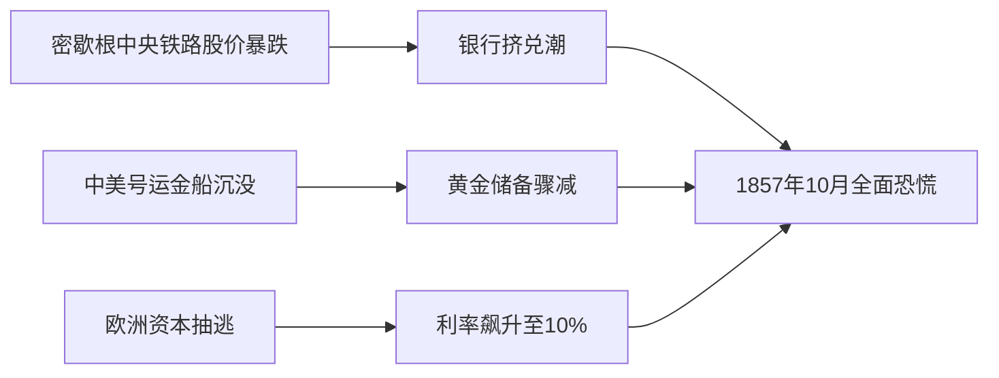

# 伟大的博弈(kindle正版)

状态: TODO
Update Date: 2025年11月14日 10:22
Create Date: 2025年11月14日 10:18

# 《伟大的博弈（珍藏版）：华尔街金融帝国的崛起》书籍信息

创建于：2025-11-12 02:27:15

标签：
AI链接笔记
伟大的博弈
华尔街
金融史

---

原文：[(anonymous)](https://x-1381123255.cos.ap-beijing.myqcloud.com/%E4%BC%9F%E5%A4%A7%E7%9A%84%E5%8D%9A%E5%BC%88%28kindle%E6%AD%A3%E7%89%88%29_01_%E7%AB%A0%E8%8A%82_1.pdf)

📚 **基本信息**
- **书名**：伟大的博弈（珍藏版）：华尔街金融帝国的崛起
- **英文原名**：The Emergence of Wall Street as a World Power(1653-2011)
- **出版社**：中信出版社

✍️ **核心人物**
- **作者**：[美]约翰·S·戈登
- **译者**：祁斌

# 《伟大的博弈（珍藏版）》图书版权信息

创建于：2025-11-12 02:27:30

标签：
AI链接笔记
伟大的博弈
图书版权信息
中信出版社

---

原文：[(anonymous)](https://x-1381123255.cos.ap-beijing.myqcloud.com/%E4%BC%9F%E5%A4%A7%E7%9A%84%E5%8D%9A%E5%BC%88%28kindle%E6%AD%A3%E7%89%88%29_02_%E7%AB%A0%E8%8A%82_2.pdf)

📚 **图书基础信息**
- **书名**：伟大的博弈（珍藏版）
- **书名原文**：The Great Game
- **ISBN**：978-7-5086-1677-3
- **书号**：ISBN 978-7-5086-1677-3/F·1735
- **定价**：58.00元

✍️ **著译者信息**
- **著者**：[美]约翰·S·戈登（John Steele Gordon）
- **译者**：祁斌

📖 **出版信息**
- **出版社**：中信出版集团股份有限公司
- **出版地**：北京（北京市朝阳区惠新东街甲4号富盛大厦2座 邮编 100029）
- **版次**：2011年1月第2版
- **印次**：2011年1月第1次印刷
- **策划推广**：中信出版社（China CITIC divress）

🔢 **图书规格**
- **开本**：787mm×1092mm 1⁄16
- **印张**：27.75
- **字数**：313千字

📝 **版权与服务信息**
- **版权声明**：版权所有 · 侵权必究
- **退换条款**：凡购本社图书，如有缺页、倒页、脱页，由发行公司负责退换
- **服务热线**：010-84849283
- **服务传真**：010-84849000
- **网址**：[http://www.publish.citic.com](http://www.publish.citic.com/)
- **邮箱**：sales@citicpub.com；author@citicpub.com

# 《伟大的博弈》目录大纲整理

创建于：2025-11-12 02:27:46

标签：
AI链接笔记
金融史
《伟大的博弈》
华尔街历史

---

原文：[(anonymous)](https://x-1381123255.cos.ap-beijing.myqcloud.com/%E4%BC%9F%E5%A4%A7%E7%9A%84%E5%8D%9A%E5%BC%88%28kindle%E6%AD%A3%E7%89%88%29_03_%E7%AB%A0%E8%8A%82_3.pdf)

📚 **书籍基本信息**

- 包含再版序（尚福林、易纲）、致中国读者、译者再版序等内容

- 核心主题：华尔街的历史发展与金融博弈

📑 **主体章节大纲**

### 第一部分：早期奠基（1653年-1837年）

1. **“人性堕落的大阴沟”**（1653年～1789年）
2. **“区分好人与恶棍的界线”**（1789年～1807年）
3. **“舔食全美国商业和金融蛋糕上奶油的舌头”**（1807年～1837年）

### 第二部分：动荡与扩张（1837年-1901年）

1. **“除了再来一场大崩溃，这一切还能以什么收场呢？”**（1837年～1857年）
2. **“浮华世界不再是个梦想”**（1857年～1867年）
3. **“谁能责备他们——他们只是做了他们爱做的事而已”**（1867年～1869年）
4. **“面对他们的对手，多头们得意洋洋”**（1869年～1873年）
5. **“你需要做的就是低买高卖”**（1873年～1884年）
6. **“您有什么建议？”**（1884年～1901年）

### 第三部分：监管与转型（1901年-1999年）

1. **“为什么您不告诉他们该怎么做呢，摩根先生？”**（1901年～1914年）
2. **“这种事情经常发生吗？”**（1914年～1920年）
3. **“交易所想做什么就可以做什么”**（1920年～1929年）
4. **“不，他不可能那么干！”**（1929年～1938年）
5. **“华尔街也是……主街”**（1938年～1968年）
6. **“是为贪婪说句好话的时候了”**（1968年～1987年）
7. **“这种趋势会不会继续下去呢？”**（1987年～1999年）

📝 **附录与补充内容**

- 附录1：华尔街上的硝烟（2000年～2004年）

- 附录2：金融危机大事记（2000年～2011年）

- 附加内容：读史偶得——再版跋、网友精彩评论

# 《伟大的博弈》核心观点摘要

创建于：2025-11-12 02:28:04

标签：
AI链接笔记
华尔街
金融史
自由市场

---

原文：[(anonymous)](https://x-1381123255.cos.ap-beijing.myqcloud.com/%E4%BC%9F%E5%A4%A7%E7%9A%84%E5%8D%9A%E5%BC%88%28kindle%E6%AD%A3%E7%89%88%29_04_%E7%AB%A0%E8%8A%82_4.pdf)

📜 **历史背景与主题**
- 时间跨度：350多年人类经济与文明演变史
- 核心视角：聚焦伟大人物、重大主题及世界强国兴衰
- 时代对比：从农业社会到信息时代的生产力革命（铁犁→电脑）、科技飞跃（伽利略望远镜→凯克望远镜）、信息传播革命（马车速度→光速）

🌐 **华尔街的全球地位**
- 定位：可与世界强国比肩的金融帝国
- 影响力：超越国界，全球国家、市场及个人均需密切关注
- 警示：忽视华尔街将导致不可避免的损失

💡 **美国经济崛起的核心优势**
- 制度基础：缺乏欧洲式经济壁垒（如法国大革命前的多重贸易税赋）
- 关键政策：州际间无贸易壁垒，商品自由流通
- 历史结论：自由市场环境是美国经济起飞的秘密

⚖️ **自由市场的本质特征**
- 非零和博弈：区别于扑克游戏的零和属性
- 理想模型：完全理性参与者+完备信息→所有参与者可能成为赢家
- 长期趋势：利益总和远超过损失总和，创造增量价值

👥 **华尔街参与者的人性本质**
- 矛盾统一体：伟大与渺小、高贵与卑贱、聪慧与愚蠢、自私与慷慨并存
- 本质属性：始终是普通人，具有人性的复杂性

🔄 **全球化挑战与监管困境**
- 现实矛盾：华尔街影响力跨国界 vs 监管仅能止步于国家边境
- 改革契机：需类似”泰坦尼克号”级别的金融灾难推动全球统一监管体系

# 尚福林再版序：《伟大的博弈》与中国资本市场发展

创建于：2025-11-12 02:28:19

标签：
AI链接笔记
《伟大的博弈》
资本市场发展史
虚拟经济与实体经济

---

原文：[(anonymous)](https://x-1381123255.cos.ap-beijing.myqcloud.com/%E4%BC%9F%E5%A4%A7%E7%9A%84%E5%8D%9A%E5%BC%88%28kindle%E6%AD%A3%E7%89%88%29_05_%E7%AB%A0%E8%8A%82_5.pdf)

📚 **《伟大的博弈》核心价值**

1. **书籍定位**

- 讲述华尔街350年资本市场发展史

- 展现其从普通街道到世界金融中心的历程

- 揭示资本市场对美国经济起飞的推动作用

1. **核心启示**
    - 提供美国资本市场发展的历史事实与经济数据
    - 反映社会化大生产与资本市场的共生关系
    - 印证虚拟经济理论对现代经济的解释力

🌎 **华尔街历史作用解析**

1. **美国崛起的金融引擎**

- 南北战争：支撑联邦政府战争融资

- 工业化进程：推动铁路时代第一次重工业化

- 新经济转型：助力20世纪80年代后科技产业发展

1. **资本市场功能演进**
    - 基础功能：企业融资、公司治理、资源配置
    - 现代延伸：知识与资本结合，驱动高科技产业

📈 **中国资本市场发展思考**

1. **发展成就与定位**

- 1990年沪深交易所建立，已成全球前列市场

- 核心原则：立足服务实体经济（2008年《中国资本市场发展报告》）

1. **改革关键举措**
    - 综合改革：股权分置改革、上市公司质量提升、机构投资者培育
    - 创新突破：2009年推出创业板与股指期货（应对金融危机冲击）

⚠️ **国际金融危机的教训与借鉴**

1. **危机本质反思**

- 虚拟经济脱离实体经济是危机根源

- 需平衡金融创新与风险监管

1. **中国的应对原则**
    - 坚持资本市场与实体经济协调发展
    - 借鉴华尔街历史经验，完善风险防控体系

🎯 **战略发展方向**

1. **服务国家战略目标**

- 支持创新型国家建设：构建资本-科技对接机制

- 优化产业结构：促进并购重组与技术创新

- 完善社会保障：提供长期稳健投资渠道

1. **现存挑战**
    - 市场主体治理结构待规范
    - 市场功能与结构需进一步健全
    - 国际金融联动风险应对能力待提升

# 易纲再版序：《伟大的博弈》与中国资本市场发展思考

创建于：2025-11-12 02:28:35

标签：
AI链接笔记
伟大的博弈
中国资本市场
人民币国际化

---

原文：[(anonymous)](https://x-1381123255.cos.ap-beijing.myqcloud.com/%E4%BC%9F%E5%A4%A7%E7%9A%84%E5%8D%9A%E5%BC%88%28kindle%E6%AD%A3%E7%89%88%29_06_%E7%AB%A0%E8%8A%82_6.pdf)

📚 **核心思考背景**

- 再版契机：《伟大的博弈》出版5年间，全球金融格局剧变（次贷危机、欧债危机、人民币国际化推进、中国资本市场发展）

- 核心问题：

1. 华尔街/纽约/美国崛起的底层逻辑

2. 人民币如何成为可兑换货币？

3. 资本市场与实体经济的关系

📈 **国际对比与历史启示**

1. 美国 vs 阿根廷：

- 20世纪初：阿根廷与美国人均GDP相当

- 2009年：美国46381美元 vs 阿根廷7726美元

- 关键差异：美国拥有全球最发达资本市场，阿根廷资本市场落后

1. 美国资本市场的历史作用：
    - 经济发展阶段：西部开发→伊利运河修建→铁路兴起→南北战争→工业化→两次世界大战→高科技产业
    - 核心功能：提供资金、优化资源配置、推动实体经济升级

💡 **金融与资本市场的核心认知**

- 金融是现代经济核心，资本市场是金融体系重要组成部分

- 健康关系：资本市场与实体经济协同发展（脱离则导致灾难，如次贷危机）

- 政策价值：完善货币政策传导、辅助宏观调控

🚀 **中国资本市场发展方向**

1. 紧迫性需求：

- 提高直接融资比例

- 提升金融体系效率以应对国际挑战

- 加快国际化以适应人民币国际化

- 推动经济转型与可持续增长

1. 发展路径：
    - 研究发达市场经验教训（美国曾经历监管缺失、投机盛行、央行功能不足等问题）
    - 探索适应中国国情的道路

# 约翰·戈登《致中国读者》核心观点

创建于：2025-11-12 02:28:50

标签：
AI链接笔记
华尔街历史
资本市场
中国经济发展

---

原文：[(anonymous)](https://x-1381123255.cos.ap-beijing.myqcloud.com/%E4%BC%9F%E5%A4%A7%E7%9A%84%E5%8D%9A%E5%BC%88%28kindle%E6%AD%A3%E7%89%88%29_07_%E7%AB%A0%E8%8A%82_7.pdf)

### 一、作者寄语

- 对中国读者阅读本书表示高兴
- 强调中国经济过去20年成就显著
- 指出资本市场对中国经济未来发展至关重要

### 二、华尔街历史启示

### （一）美国发展历程借鉴

1. 200年前美国曾是不发达国家，财政状况恶劣
2. 华尔街随美国经济共同成长，有力推动经济发展
3. 资本市场已成为现代经济生活不可或缺的组成部分

### （二）华尔街的经验教训

1. 历史上曾出现诸多失误
2. 通过吸取教训建立新制度，避免重复犯错
3. 助力美国成为世界强国并在全球金融体系中占据重要地位

### 三、对中国的期望

- 希望中国读者从华尔街历史中获取资本市场发展经验教训
- 期待相关启示对崛起中的中国成为世界强国有所帮助

# 《伟大的博弈》译者再版序：华尔街的历史启示与中国资本市场发展

创建于：2025-11-12 02:29:05

标签：
AI链接笔记
《伟大的博弈》
2008金融危机
中国资本市场

---

原文：[(anonymous)](https://x-1381123255.cos.ap-beijing.myqcloud.com/%E4%BC%9F%E5%A4%A7%E7%9A%84%E5%8D%9A%E5%BC%88%28kindle%E6%AD%A3%E7%89%88%29_08_%E7%AB%A0%E8%8A%82_8.pdf)

📚 **一、金融危机与金融世界演变**
1. 2008年金融危机标志性事件
- 雷曼兄弟2008年9月15日破产，引发全球经济衰退
- 危机波及范围：冰岛至阿根廷多国经济体受创
- 复苏动力：大规模经济救助+国际协作
2. 现代金融世界特征（对比1929年）
- 杠杆率：从10倍升至数十倍
- 市场规模：股票/债券/衍生品等爆炸式增长
- 全球化：从纽约伦敦双中心到全球数十金融中心联动
- 核心矛盾：高效性与脆弱性并存，监管协作缺失

📈 **二、华尔街历史规律与人性本质**
1. 金融史核心逻辑
- 本质：金融投机史+危机史+监管完善史
- 循环模式：危机爆发→修正监管→体系完善
2. 不变的人性驱动
- 共性表现：贪婪与恐惧（与”郁金香泡沫”一致）
- 历史循环性：”资本市场起落和投机者千百年来几乎无改变”

🌐 **三、中国资本市场发展现状**
1. 十年跨越式发展（2000-2010）
- 规模：全球第二大资本市场
- 国际影响：华尔街交易员每日关注中国股市动态
2. 差距与挑战
- 现存问题：效率/机制/结构落后于发达市场
- 全球博弈：交易所并购/上市资源竞争/国际监管合作压力
3. 战略定位
- 经济转型核心动力
- 目标：建设世界一流资本市场

✏️ **四、再版修订主要内容**
1. 文本优化
- 正文文字调整校对
- 译者导读重新整理
- 图片增减：删除无关图，新增重工业化/新经济/金融危机相关图
2. 历史对照补充
- “同一时代的西方和东方”专栏：增补经济金融事件
- 附录更新：新增2000-2004年续写内容及金融危机大事记

# 《伟大的博弈》作者与译者对话：华尔街历史启示录 📚

创建于：2025-11-12 02:29:22

标签：
AI链接笔记
华尔街历史
自由市场经济
中央银行作用

---

原文：[(anonymous)](https://x-1381123255.cos.ap-beijing.myqcloud.com/%E4%BC%9F%E5%A4%A7%E7%9A%84%E5%8D%9A%E5%BC%88%28kindle%E6%AD%A3%E7%89%88%29_09_%E7%AB%A0%E8%8A%82_9.pdf)

### 一、美国经济成功的核心原因

1. **自由市场经济体制**
    - 人们可自由谋求利益，无传统壁垒
    - 州际贸易自由流通，无贸易壁垒（对比欧洲多国征税制度）
2. **历史机遇与制度优势**
    - 建国初期”从零开始”，无历史包袱（引用马克思名言）
    - 1776年《国富论》与美国建国同步，经济学理论指导实践
3. **政府角色定位**
    - 原则：”法无禁止即可为”，政府权力受宪法限制
    - 1929年后逐步加强监管，如1987年股灾干预市场

### 二、美国资本市场发展的曲折历程

1. **早期缺乏中央银行的后果**
    - 经济周期振幅大，恐慌与繁荣交替（如19世纪多次市场崩溃）
    - 依赖J·P·摩根等个人扮演央行角色
2. **市场崩溃的双重影响**
    - 负面影响：经济震荡，社会成本高昂
    - 正面作用：低价回购外资持有的资产（如铁路、工厂）
3. **自我演进与规范**
    - 华尔街经纪人自发约束，逐步走向正轨
    - 典型案例：洛克菲勒垄断被拆分（1911年标准石油分拆为34家公司）

### 三、政府与市场的边界探讨

1. **政府的必要作用**
    - 制定规则与维护秩序（”市场需要警察和裁判”）
    - 建立强有力的中央银行（美联储的重要性）
2. **自由与监管的平衡**
    - 完全自由市场必然崩溃（胡佛观点）
    - 1929年后改革：提高保证金比例，限制投机操作

### 四、华尔街的历史变迁与未来启示

1. **技术驱动的变革**
    - 交易量激增：1929年日成交1600万股→现代瞬间完成
    - 投资者结构变化：持股比例从2%（1929年）→50%+（对话时）
2. **历史教训的借鉴**
    - 1929年股灾：监管缺失+美联储不作为→大萧条
    - 泰坦尼克号事件类比：危机推动制度完善（如24小时无线通信监听）

### 五、作者戈登的创作背景

- 家族渊源：祖父为华尔街经纪人，自幼听金融故事长大
- 写作风格：以真实历史人物和事件诠释经济史（如《华尔街上的娼妓》）

# 华尔街：金融帝国崛起的历史脉络

创建于：2025-11-12 02:29:37

标签：
AI链接笔记
华尔街历史
世界强国演变
自由市场理论

---

原文：[(anonymous)](https://x-1381123255.cos.ap-beijing.myqcloud.com/%E4%BC%9F%E5%A4%A7%E7%9A%84%E5%8D%9A%E5%BC%88%28kindle%E6%AD%A3%E7%89%88%29_10_%E7%AB%A0%E8%8A%82_10.pdf)

### 一、历史背景与主题定位

1. **时间跨度**
    - 覆盖350多年人类文明史，见证经济主体、科技工具、信息传播方式的颠覆性变革
    - 例：从铁犁农民→电脑白领；伽利略望远镜→凯克天文望远镜（观测范围达120亿光年）
2. **核心主题**
    - 聚焦”伟大人物、伟大主题、世界强国”，探讨金融资本如何塑造现代世界

### 二、世界强国的定义与演变

1. **传统定义**
    - 政治学视角：”利益必须被其他国家考虑的国家”（例：俄罗斯因核力量仍为强国）
2. **非国家形态的强国**
    - 中世纪罗马教廷：宗教影响力超越领土与人口
    - 巴林兄弟银行：1818年法国举债时，被黎塞留公爵列为”欧洲第六强国”
3. **华尔街的定位**
    - 21世纪金融帝国：6个狭窄街区却成为全球资本主义心脏，影响远超地理边界

### 三、纽约崛起的关键历史节点

1. **政治决策转折点**
    - 1812年：副总统乔治·克林顿打破僵局，支持美国银行许可证续签
    - 伊利运河修建：德·威特·克林顿州长推动法案，奠定纽约经济枢纽地位
2. **先天优势与时代机遇**
    - 地理：北大西洋最优良海港
    - 文化：荷兰移民的商业传统
    - 理论基础：与亚当·斯密《国富论》（1776年）同期诞生，受益于自由市场理念

### 四、自由市场的本质与矛盾

1. **博弈特性**
    - 非零和游戏：长期利益总和远大于损失（区别于扑克等零和博弈）
    - 现实局限：完全理性与信息完备仅为理想状态，必然存在输家
2. **资本的核心价值**
    - 与劳动力、资源、技术并列的生产要素，支撑企业全链条运转（工厂、薪资、研发等）
3. **市场监管的必然性**
    - 亚当·斯密警示：”同行合谋损害公众利益”需规则与裁判
    - 历史教训：19世纪华尔街因监管缺失导致投机泛滥，后经经纪人主导改革与政府干预逐步规范

### 五、华尔街的历史角色演变

1. **早期阶段（18-19世纪）**
    - 资本市场雏形：依赖舆论监督的小型交易市场
    - 南北战争催化：跃升为全球第二大资本市场，暴露监管体系缺陷
2. **20世纪转型**
    - 经纪人主导改革：压制投机者，建立长期稳定机制
    - 中产阶级参与：证券投资普及，重塑美国经济结构
3. **21世纪新挑战**
    - 技术革命冲击：计算机带来类似蒸汽机的颠覆性影响
    - 利益冲突再现：经纪人与投资者利益博弈推动新一轮改革

### 六、金融帝国的崛起逻辑

1. **成长要素**
    - 地理条件+政治格局+技术进步+运气（关键历史节点的偶然决策）
    - 内部冲突应对：从投机危机到监管改革，痛苦但持续的自我迭代
2. **罗马帝国类比**
    - 相似性：弱小起步→超越邻邦→应对内部分裂→全球影响力
    - 独特性：以资本为武器的”非领土帝国”，迫使所有国家纳入其利益考量

# 华尔街起源与早期金融史（1653-1789）

创建于：2025-11-12 02:29:53

标签：
AI链接笔记
华尔街起源
郁金香泡沫
汉密尔顿金融改革

---

原文：[(anonymous)](https://x-1381123255.cos.ap-beijing.myqcloud.com/%E4%BC%9F%E5%A4%A7%E7%9A%84%E5%8D%9A%E5%BC%88%28kindle%E6%AD%A3%E7%89%88%29_11_%E7%AB%A0%E8%8A%82_11.pdf)

### 一、纽约的起源与荷兰遗产

1. **新阿姆斯特丹的建立**
    - 1626年荷兰西印度公司以商品交换获得曼哈顿岛，命名新阿姆斯特丹
    - 荷兰人商业精神核心：投机文化、自由贸易、多元包容（如接纳犹太人和教友派信徒）
2. **从新阿姆斯特丹到纽约**
    - 1664年英军攻占，改名新约克郡（纽约）献给约克公爵
    - 荷兰遗产留存：地名（布鲁克林）、词汇（cookie）、商业基因

### 二、华尔街的诞生

1. **城墙的兴衰**
    - 1653年彼得·斯特文森为防御英军修建木墙（华尔街名称由来）
    - 1698年城墙拆除，墙边街道发展为”墙街”（Wall Street）
2. **早期商业活动**
    - 奴隶贸易：1698年奴隶占曼哈顿人口14%，成为北方重要奴隶贸易中心
    - 大宗商品交易：毛皮、小麦（面粉出口支柱，市徽含面粉桶图案）

### 三、早期金融投机与泡沫

1. **荷兰郁金香泡沫（17世纪30年代）**
    - 人类首次金融泡沫：郁金香价格飙升后崩盘，单株稀有品种售价达4600弗罗林（相当于一辆马车+两匹马+马具）
    - 启示：投机活动四要素（价格暴涨→狂热追逐→理性丧失→泡沫破灭）
2. **北美首次金融操纵**
    - 1666年弗雷德里克·菲利普斯囤积贝壳串珠（印第安货币），操控货币供应抬高价格

### 四、美国开国元勋的金融理念之争

1. **亚历山大·汉密尔顿的金融架构**
    - 三大改革计划：
    ✅ 建立联邦税收体系
    ✅ 发行新债偿还旧国债（包括州债务）
    ✅ 设立中央银行（模仿英格兰银行）
    - 成果：1794年美国获欧洲最高信用评级，债券溢价10%出售
2. **杰斐逊的批判**
    - 视纽约为”人性堕落的大阴沟”，反对投机活动，主张农业立国
    - 政治博弈：为通过偿债法案，汉密尔顿让步使纽约失去首都地位

### 五、纽约崛起的关键因素

1. **地理优势**
    - 天然良港，哈德逊河流域贸易便利，连接北美内陆与欧洲市场
2. **文化特质**
    - 继承荷兰商业精神：投机技术、风险偏好、移民包容性
    - 1790年人口普查超过费城，成为美国第一大城市

# 美国资本市场早期发展史（1789-1807）：从梧桐树协议到金融监管雏形

创建于：2025-11-12 02:30:08

标签：
AI链接笔记
美国资本市场史
梧桐树协议
汉密尔顿财政政策

---

原文：[(anonymous)](https://x-1381123255.cos.ap-beijing.myqcloud.com/%E4%BC%9F%E5%A4%A7%E7%9A%84%E5%8D%9A%E5%BC%88%28kindle%E6%AD%A3%E7%89%88%29_12_%E7%AB%A0%E8%8A%82_12.pdf)

### 一、时代背景与资本市场萌芽（1789-1791）

📜 **历史节点**
- 1789年：美国联邦政府成立，纽约市政大厅（联邦大厅）见证华盛顿就职
- 1790年：汉密尔顿财政方案推动债券发行，催生纽约资本市场活跃
- 1791年：美国银行成立，发行首只”蓝筹股”（市值1000万美元）

💡 **关键发展**
- 金融工具创新：国债、州政府债券、银行股票陆续涌现
- 市场参与者演变：从”一般经纪人”到专业化证券交易萌芽
- 投机狂热起点：美国银行股票1小时售罄，股价从100美元飙升至185美元

### 二、市场规范化与交易所起源（1792）

🌳 **梧桐树协议核心**
- **签订背景**：21家经纪商为防止场外交易和佣金恶性竞争
- **关键条款**：固定0.25%最低佣金率，会员交易优先权
- **历史意义**：纽约交易所前身，本质为价格同盟（卡特尔）

🏛️ **早期交易场所演变**
1. 咖啡屋交易：作为临时聚会点，存在价格信息泄露问题
2. 证券交易所尝试：1792年初建立的拍卖中心因场外竞争失败
3. 唐提咖啡屋时期：会员制拍卖模式，非会员被排斥场外

### 三、金融投机与监管挑战（1791-1792）

⚠️ **杜尔投机案始末**
- **核心人物**：威廉·杜尔（财政部部长助理，华尔街首位内幕交易者）
- **操纵手段**：利用公职获取内幕信息，多账户对敲交易，高杠杆借贷
- **市场后果**：引发美国首次金融恐慌，25家机构破产，股价暴跌

🔍 **汉密尔顿救市措施**
- 财政部购入大量联邦证券注入流动性
- 要求银行暂缓收回贷款
- 允许短期票据支付海关关税
- **历史影响**：开创政府干预金融市场先例，避免经济长期衰退

### 四、公司制度与银行业发展

🏦 **银行体系演变**
- **纽约银行**：1784年成立，汉密尔顿参与创建，至今仍运营（华尔街1号）
- **美国银行**：1791年设立，联邦财政代理机构，1811年被杰斐逊主义者关闭
- **大通银行前身**：伯尔以自来水公司名义设立，实为金融垄断工具

📜 **公司制度突破**
- **有限责任制度**：现代企业基石，股东责任限于投资额
- **普通公司法**：1811年纽约州首推，简化企业注册流程
- **经济影响**：1792-1817年联邦税收增长9倍，推动经济扩张

### 五、政治与金融的交织

⚔️ **汉密尔顿与伯尔的博弈**
- **财政理念冲突**：联邦主义者vs杰斐逊主义者
- **银行控制权争夺**：伯尔通过”自来水公司法案”暗度陈仓设立银行
- **最终对决**：1804年决斗导致汉密尔顿身亡

🏙️ **华尔街地理变迁**
- 早期功能：政治中心（联邦大厅、三一教堂）
- 转型金融区：汉密尔顿财政方案推动商业建筑取代官邸
- 关键地标：华尔街68号梧桐树（1865年倒塌）、华尔街22号交易中心

# 19世纪美国金融崛起：伊利运河与华尔街早期发展（1807-1837）

创建于：2025-11-12 02:30:24

标签：
AI链接笔记
华尔街历史
伊利运河
杰克逊金融政策

---

原文：[(anonymous)](https://x-1381123255.cos.ap-beijing.myqcloud.com/%E4%BC%9F%E5%A4%A7%E7%9A%84%E5%8D%9A%E5%BC%88%28kindle%E6%AD%A3%E7%89%88%29_13_%E7%AB%A0%E8%8A%82_13.pdf)

### 一、伊利运河：美国经济地理的重塑

📌 **历史背景**

- 19世纪初美国西部开发面临运输瓶颈，阿巴拉契亚山脉阻隔东西部贸易

- 1817年纽约州州长德·威特·克林顿推动伊利运河工程，联邦政府拒绝资助

📊 **工程概况**

- 全长584公里，83道水闸，落差170米，耗资700万美元（超当时联邦年支出1/3）

- 1825年提前2年竣工，实现伊利湖与哈德逊河连通

🚢 **经济影响**

- 运输成本降至原来的1/20，时间缩短至1/3（如面粉运输成本从120美元/吨降至6美元）

- 纽约人口1820-1860年从12.4万激增至108万，港口货物占比从9%升至62%

- 被称为”舔食全美国商业和金融蛋糕上奶油的舌头”，彻底超越费城成为经济中心

### 二、华尔街早期资本市场的形成

📈 **运河股票热潮与首次牛市**

- 1820年代运河概念股引发投机狂热，莫里斯运河股票超额认购3倍

- 欧洲资本大量涌入（如巴林兄弟银行持有运河股票超32万美元）

- 催生专业证券经纪人，1827年纽约证券交易所迁入商人交易所

🎭 **现代投机者原型**

- **雅各布·利特尔**：首位独立经纪人，通过市场波动获利

✅ 标志性操作：囤积莫里斯运河股票，股价从10美元飙升至185美元

✅ 特点：无政府关系，靠短期投机而非内幕交易，三次破产后重生

### 三、杰克逊时代的金融政策与市场震荡

👑 **杰克逊政府核心政策**

- 1834年清偿全部国债（美国历史唯一一次），导致证券供给锐减推高股价

- 1836年签署《铸币流通令》，要求土地交易必须用金币/银币支付

- 关闭第二美国银行，存款转移至”被宠幸的州立银行”

💥 **市场崩溃连锁反应**

- 1837年银行挤兑潮，90%工厂倒闭，美国首次进入大萧条

- 土地投机泡沫破裂，政府土地销售额从2500万美元暴跌

- 费城因州政府2000万美元债务违约，彻底丧失金融中心竞争力

### 四、华尔街的早期特征与历史遗产

🔄 **市场周期雏形**

- 形成”狂热-恐慌-修正”循环模式：运河投机→牛市→政策收紧→熊市

- 1835年纽约大火烧毁700栋建筑（含商人交易所），但交易记录被抢救保留

🏛️ **金融基础设施演变**

- 交易场所：从街头路灯柱交易到商人交易所集中拍卖

- 参与者：场内会员制交易所与场外经纪人并存，日交易量从不足100股增至6000股

# 1837-1857年美国经济与华尔街发展：技术革新、资本狂欢与金融恐慌

创建于：2025-11-12 02:30:39

标签：
AI链接笔记
美国金融史
1857年金融危机
铁路证券

---

原文：[(anonymous)](https://x-1381123255.cos.ap-beijing.myqcloud.com/%E4%BC%9F%E5%A4%A7%E7%9A%84%E5%8D%9A%E5%BC%88%28kindle%E6%AD%A3%E7%89%88%29_14_%E7%AB%A0%E8%8A%82_14.pdf)

### 一、时代背景与经济变革

### 1. 19世纪中期美国经济特征 ⚙️

- **资本市场复苏**：1837年大崩溃后，华尔街从阴霾中缓慢恢复，交易所会员比场外经纪商生存状况更佳
- **基础设施革命**：铁路与电报的发明成为推动经济转型的核心动力
- **区域经济整合**：全国性市场逐步形成，地方经济被纳入统一资本网络

### 2. 关键技术革新及其影响

| 技术 | 经济影响 | 金融影响 |
| --- | --- | --- |
| 铁路 | • 运输成本降低95%
• 催生重工业体系
• 实现全国市场整合 | • 推动股份公司发展
• 铁路证券成华尔街主力品种
• 融资需求刺激资本市场扩张 |
| 电报 | • 信息传递速度从30分钟缩短至秒级
• 统一全国价格体系 | • 确立纽约金融中心地位
• 区域资本市场边缘化
• 高频交易成为可能 |

### 二、资本市场发展与金融创新

### 1. 铁路融资模式演变 🚂

- **资本需求规模**：单条铁路造价达每英里3.6万美元（当时中产年收入仅1000美元）
- **融资工具创新**：
    - 可转换债券（债券持有者可灵活转换为股票）
    - 跨国融资（伊利铁路在伦敦发行大量证券）
    - 投机工具化（伊利铁路被称为”华尔街娼妓”）

### 2. 华尔街生态变化

- **交易场所分化**：
    - 纽约证券交易所：保守型，1850年仅38只铁路股票挂牌
    - 场外市场：活跃型，1856年日交易量达7万股，远超交易所
- **金融中心确立**：电报使纽约价格信息瞬间传遍全国，1850年代彻底取代费城成为金融核心

### 三、标志性人物与投机事件

### 1. 华尔街早期玩家群像 👥

- **丹尼尔·德鲁**：从牲畜贩子到金融大鳄，发明”掺水股”策略，擅长利用市场信息差操纵股价
- **雅各布·利特尔**：通过伦敦市场套利伊利股票，开创跨市场投机模式
- **彼得·库珀**：发明”拇指汤姆”机车，成为工业时代首批百万富翁

### 2. 经典投机案例

- **伊利铁路炒作**：1837年利特尔通过伦敦市场可转债对冲，击败纽约经纪商联盟
- **奥什科什股票骗局**：德鲁故意遗落”买入指令”纸片，诱导对手高位接盘
- **掺水股操作**：通过让牲畜大量饮水增加体重的原理，创造性应用于股票发行

### 四、1857年金融危机全景

### 1. 危机导火索 ⚠️

- **外部因素**：克里米亚战争结束、欧洲谷物丰收导致美国出口锐减
- **内部因素**：
    - 加利福尼亚黄金产量增速放缓（1853年达峰值314万盎司）
    - 铁路过度建设引发产能过剩
    - 俄亥俄人寿保险信托公司破产暴露金融欺诈

### 2. 危机传导路径

### 3. 危机后果

- **直接损失**：纽约半数经纪商破产，985家商户倒闭，债务达1.2亿美元
- **结构变革**：催生新一代金融力量，为南北战争期间的资本市场扩张埋下伏笔

### 五、历史数据与对比视角

### 1. 关键经济指标变化（1840-1857）

| 指标 | 1840年 | 1857年 | 增幅 |
| --- | --- | --- | --- |
| 铁路总长 | 3000英里 | 3万英里 | 900% |
| 生铁产量 | 6.3万吨 | 88.3万吨 | 1300% |
| 银行存款 | 800万美元 | 5000万美元 | 525% |
| 黄金产量 | 4.3万盎司 | 314万盎司 | 7200% |

### 2. 国际比较视角

- **同期欧洲**：英国1821年实行金本位，成为世界金融参照系
- **美国特殊性**：无中央银行情况下，通过市场自发力量完成金融体系构建

# 南北战争与华尔街崛起（1857-1867）

创建于：2025-11-12 02:30:55

标签：
AI链接笔记
华尔街历史
南北战争融资
范德比尔特

---

原文：[(anonymous)](https://x-1381123255.cos.ap-beijing.myqcloud.com/%E4%BC%9F%E5%A4%A7%E7%9A%84%E5%8D%9A%E5%BC%88%28kindle%E6%AD%A3%E7%89%88%29_15_%E7%AB%A0%E8%8A%82_15.pdf)

### 一、战争融资：资本市场的催化剂 ⚔️

### 1. 融资需求与挑战

- 南北战争（1861-1865）成为美国资本市场转型的关键事件
- 北方日均战争费用从1860年17.2万美元激增至1861年末150万美元
- 脱离金本位导致华尔街恐慌，林肯政府面临”国家根基动摇”的危机

### 2. 三种融资方式对比

| 融资方式 | 北方应用 | 南方应用 | 效果差异 |
| --- | --- | --- | --- |
| 税收 | 覆盖21%战争费用，首次开征个人所得税 | 依赖程度低 | 北方财政体系更稳定 |
| 印钞 | 发行4.5亿”绿背纸钞”，通胀率180% | 印钞支付超50%费用，通胀率达9000% | 南方经济彻底崩溃 |
| 国债 | 杰·库克首创公募模式，动员全民购买 | 依赖传统私募 | 北方融资速度超战争支出速度 |

### 3. 金融创新：从私募到公募的革命

- 库克的爱国+投资双驱动策略：”购买国债既是爱国表现，也是好投资”
- 销售规模：战争后期国债发售速度超过政府战争支出速度
- 市场影响：华尔街规模在战争期间扩张几十倍

### 二、资本市场格局重塑 🏦

### 1. 黄金投机与市场分化

- 绿钞与金币并行引发”劣币驱逐良币”（格雷欣法则）
- 黄金价格与北方军战绩负相关：葛底斯堡战役前287绿钞=100黄金
- 投机商通过军事间谍网络提前获取战报，早于林肯政府得知战役结果

### 2. 交易所体系演变

- 纽约证券交易所：维持传统绅士式拍卖，日交易量被新兴交易所超越
- 公开经纪人交易所（原”煤洞交易所”）：首创连续竞价模式，1865年交易量达纽交所10倍
- 专业交易所涌现：石油交易所（1865）、矿业交易所（1870）等

### 3. 市场规模与结构变化

- 1865年华尔街年交易量达60亿美元，经纪商日佣金800-1000美元（相当于中产年收入）
- 全民参与：5%北方人口购买国债，证券持有者从1%人口扩展至大众阶层
- 衍生业务：快餐文化诞生（经纪商无暇规律用餐），24小时交易模式出现

### 三、铁路资本巨头崛起 🚂

### 1. 范德比尔特的商业帝国

- 蒸汽船时代积累2000万美元财富，近70岁转型铁路业
- 战略布局：控制哈莱姆铁路（纽约唯一市内轨道）和哈德逊铁路
- 管理革新：通过效率提升使亏损线路扭亏为盈

### 2. 经典资本战役

| 战役 | 时间 | 策略 | 结果 |
| --- | --- | --- | --- |
| 哈莱姆股票逼空 | 1863.6 | 买断流通股，使卖空者无法交割 | 股价从72美元飙升至180美元，获利200万美元 |
| 哈德逊铁路围歼 | 1863.7 | 买断卖方选择权，收取5%日息 | 股价从112美元涨至180美元，创金融操纵典范 |
| 第二次哈莱姆战役 | 1864.4 | 联合盟友筹集500万美元，控盘13.7万股（超总股本） | 允许议员以285美元平仓，奠定行业地位 |

### 3. 行业整合与竞争

- 1867年合并纽约中央铁路与哈德逊铁路，形成垄断性干线网络
- 与伊利铁路展开竞争，遭遇德鲁、古尔德、菲斯科”三驾马车”对抗
- 开创现代企业管理模式，成为”前无古人的铁路帝国建造者”

### 四、历史影响与启示 🌍

### 1. 美国资本市场跃升

- 从区域市场发展为仅次于伦敦的世界第二大资本市场
- 金融工具创新：公募债券、黄金期货、连续竞价交易系统
- 监管空白：催生”街头流浪者”等投机群体，欺诈事件频发

### 2. 社会经济变革

- 财富分化：前线士兵牺牲与华尔街”浮华世界”形成讽刺对比
- 产业升级：战争需求推动钢铁、纺织、军工等行业资本化
- 城市转型：纽约成为繁华都市，百老汇奢侈品消费激增

# 伊利铁路股权争夺战（1867-1869）：华尔街早期金融博弈与监管觉醒

创建于：2025-11-12 02:31:11

标签：
AI链接笔记
伊利铁路股权战
19世纪美国金融史
华尔街投机与监管

---

原文：[(anonymous)](https://x-1381123255.cos.ap-beijing.myqcloud.com/%E4%BC%9F%E5%A4%A7%E7%9A%84%E5%8D%9A%E5%BC%88%28kindle%E6%AD%A3%E7%89%88%29_16_%E7%AB%A0%E8%8A%82_16.pdf)

### 一、背景与核心冲突 🚂

1. **铁路竞争格局**
    - 美国中西部至纽约市三大干线：纽约中央铁路（范德比尔特）、宾夕法尼亚铁路（托马斯·斯科特）、伊利铁路（德鲁集团）
    - 范德比尔特目标：建立价格同盟稳定运价；德鲁目标：通过股市操纵获利，拒绝合作
2. **时代背景**
    - 19世纪中期美国政府腐败严重，纽约州尤甚
    - 证券法缺失，法官与政客被投机商操控，立法沦为利益博弈工具

### 二、关键人物与阵营 ⚔️

### （一）范德比尔特阵营

- **核心人物**：科尼利厄斯·范德比尔特（”船长”，铁路大亨）
- **策略**：动用资本收购伊利股票，控制董事会
- **盟友**：弗兰克·沃克（董事会成员）

### （二）德鲁-古尔德-菲斯科阵营

- **丹尼尔·德鲁**：伊利铁路财务主管，擅长”掺水股票”与背叛
- **杰·古尔德**：精明投机者，设计做空陷阱与资金操控
- **詹姆斯·菲斯科**：谈判高手，负责股票发行与政治游说

### 三、股权争夺战进程 📉

### 1. 第一阶段：董事会控制权争夺（1867）

- 范德比尔特试图通过选举进入董事会，德鲁假意合作后反水
- 德鲁联合古尔德、菲斯科，通过”友好法官”颁布相反法令，发行可转债稀释股权

### 2. 第二阶段：股票囤积与立法腐败（1868）

- **范德比尔特行动**：
    - 指令法官禁止增发股票，大量购入流通股
    - 耗资数百万美元，持股近20万股但仍未控股
- **德鲁反击**：
    - 印刷5万张”掺水股票”，流通盘激增20%
    - 联合立法机构通过法案合法化欺诈行为，卷走700万美元后逃至新泽西

### 3. 第三阶段：妥协与权力洗牌（1868-1869）

- 双方达成协议：德鲁退出管理层，范德比尔特股票以接近成本价脱手
- 古尔德、菲斯科掌权，继续发行新股至40万股，伦敦市场抛售套现

### 四、历史影响与制度变革 🔄

### （一）直接后果

- 伊利铁路资本结构混乱，股价从83美元暴跌至38.5美元
- 德鲁损失400万美元，范德比尔特虽未控股但迫使对手妥协

### （二）金融监管觉醒

- **自律改革**：纽约证券交易所要求股票登记与发行预告，奠定现代监管基础
- **立法呼吁**：提出股东优先认购权、股票总量公示等原则（1868年《商业和金融周刊》提案）
- **长期影响**：推动1933年《联邦证券法》出台，催生华尔街自律机制

### （三）技术与市场变革

- 1867年股票自动报价机（Edwin A. Calahan发明）加速信息传播
- 大西洋海底电缆（1866年启用）促进跨洋资本流动

### 五、经典案例与名言 📜

1. **德鲁的”单弦竖琴”理论**：
    
    “股价高涨时唱多，低迷时唱空，让市场跟随其节奏买卖”
    
2. **菲斯科的”印刷机战术”**：
    
    “只要印刷机不坏，就能喂饱范德比尔特要的所有股票”
    
3. **立法腐败写照**：
    
    “诚实点票让位于’诚实清点礼金’，议员津贴3美元不够买烟”
    

# 1869-1873年美国金融史关键事件：古尔德黄金操纵案与市场变革

创建于：2025-11-12 02:31:27

标签：
AI链接笔记
古尔德黄金操纵案
黑色星期五（1869）
1873年美国股市崩溃

---

原文：[(anonymous)](https://x-1381123255.cos.ap-beijing.myqcloud.com/%E4%BC%9F%E5%A4%A7%E7%9A%84%E5%8D%9A%E5%BC%88%28kindle%E6%AD%A3%E7%89%88%29_17_%E7%AB%A0%E8%8A%82_17.pdf)

### 一、古尔德黄金操纵案（1869年）

### 1. 背景与前提

- 📌 **货币体系**：美国实行黄金与绿钞复本位制，黄金因”劣币驱逐良币”退出流通，仅在纽约黄金交易市场活跃
- ⚠️ **法律漏洞**：绿钞法案条款允许以绿钞履行黄金合同，为投机提供法律灰色地带
- 💰 **杠杆机制**：黄金交易保证金要求极低（1000美元可买500万美元合同），投机风险与收益极高

### 2. 操纵计划实施

- 👥 **核心人物**：古尔德（策划者）、菲斯科（执行者）、科尔宾（总统关系网）
- 🕵️ **政府渗透**：
    - 通过科尔宾（格兰特总统妹夫）影响总统，灌输”黄金市场自由运行”理念
    - 贿赂财政总管助理巴特菲尔德，获得黄金账户与贷款便利
- 📈 **市场操作**：
    - 控制数倍于纽约市场供应量的黄金合同
    - 散布政府不干预谣言，推动金价从131.625美元/盎司飙升至160美元

### 3. 事件转折与后果

- 🚨 **总统干预**：格兰特识破骗局后下令财政部抛售400万美元黄金
- 💥 **黑色星期五**（1869.9.24）：
    - 黄金价格从160美元暴跌至140美元
    - 市场陷入混乱，经纪商集体平仓，引发全国性金融恐慌
- 🔄 **制度影响**：10年后美国正式确立金本位制

### 二、关键人物结局与后续影响

### 1. 核心人物命运

- 🔫 **菲斯科之死**（1872年）：因情感纠纷被斯托克斯枪杀，引发市场对伊利铁路股票短期追捧
- 📉 **古尔德退场**：1873年失去伊利铁路控制权，转向西部联合公司等继续扩张财富
- ⚖️ **法律追责**：相关诉讼持续至1877年，暴露政府监管漏洞

### 2. 金融市场变革

- 📜 **监管觉醒**：加菲尔德指出”复本位制是投机根源”，推动货币制度改革
- 🏦 **机构洗牌**：库克银行因北太平洋铁路债券发行失败破产（1873年），标志旧式银行家时代结束

### 三、1873年股市大崩溃

### 1. 危机导火索

- 🚂 **铁路投机过热**：南北战争后铁路建设盲目扩张，北太平洋铁路等项目资金链断裂
- 🏴󠁧󠁢󠁥󠁮󠁧󠁿 **欧洲资本撤退**：美国证券在欧洲市场遇冷，政府债券承销受阻

### 2. 市场连锁反应

- 📉 **崩盘进程**：
    - 1873.9.13：凯恩-考克斯公司破产
    - 1873.9.18：库克银行纽约支行停业，引发交易所恐慌
    - 1873.9.30：交易所复市后进入长期低迷
- ⏳ **经济影响**：美国陷入长达6年的经济衰退，南北战争后的繁荣终结

### 四、时代背景与制度遗产

### 1. 同期美国社会特征

- 🚢 **商业扩张**：农产品出口带动套期保值需求，黄金卖空压力常态化
- 🤝 **政商勾结**：特威德集团腐败（1400万美元造价的”特威德法院”）、动产信贷公司丑闻暴露监管缺失

### 2. 金融体系进化

- 📊 **市场成熟**：从野蛮投机向规范化交易过渡，催生J.P.摩根等现代金融力量
- 🌐 **国际影响**：恐慌通过大西洋电缆传导至欧洲，凸显美国金融市场全球关联性

# 华尔街1873-1884：工业化浪潮与金融传奇

创建于：2025-11-12 02:31:43

标签：
AI链接笔记
华尔街历史
美国工业化
J·P·摩根

---

原文：[(anonymous)](https://x-1381123255.cos.ap-beijing.myqcloud.com/%E4%BC%9F%E5%A4%A7%E7%9A%84%E5%8D%9A%E5%BC%88%28kindle%E6%AD%A3%E7%89%88%29_18_%E7%AB%A0%E8%8A%82_18.pdf)

📉 **一、经济周期与市场重塑（1873-1879）**

### 1.1 市场崩溃与欧洲资本撤离

- 1873年恐慌导致287家经纪公司破产，纽约证交所席位价格从7700美元暴跌至4250美元
- 欧洲投资者抛售美国证券，1873-1879年欧洲持有的美国证券资产减少6亿美元
- 德国银行家评价：”美国铁路债券即使天使签字也卖不出去”

### 1.2 危机的积极作用

- **资产回购效应**：美国人以低价购回欧洲抛售的证券，变相提升本土财富
- **泡沫挤出**：淘汰低效企业，资源向强者聚集，美国经济体免疫力增强

🏭 **二、美国工业化进程（19世纪末）**

### 2.1 产业结构转型

- 1878年：纽交所54家上市公司中无制造业企业，以铁路（36家）、电报（4家）为主
- 1900年：工业股票成为市场主体，美国钢产量超全欧洲总和（卡耐基钢铁产量＞英国全国）

### 2.2 推动因素

- 南北战争刺激工业需求+高关税保护
- 铁路网络扩张（1860-1890年里程从3.5万→16.4万英里）形成全国统一市场

💎 **三、金融巨头J·P·摩根的崛起**

### 3.1 核心理念与背景

- 贵族出身，受父亲朱尼厄斯·摩根（接管乔治·皮博迪公司）影响，坚持”诚信至上”
- 名言：”商业信贷的关键是品德，金钱买不到品德”

### 3.2 历史贡献

- **市场稳定者**：1879年成功为小范德比尔特抛售15万股纽约中央铁路股票（每股120美元）
- **行业整合者**：促成纽约中央铁路与宾夕法尼亚铁路和解，终结恶性竞争
- **制度建设者**：将华尔街从投机场所转型为全球经济核心力量

💰 **四、传奇人物与经典案例**

### 4.1 海蒂·格林：吝啬的投资天才

- **财富规模**：1916年去世时资产位列美国前20，唯一白手起家的女性富豪
- **投资哲学**：”低买高卖+节俭+持续调研”，偏好铁路和房地产
- **经典事件**：为找2美分邮票彻夜搜寻，却因丈夫债务被迫支付42万美元

### 4.2 格兰特总统的华尔街悲剧

- **投资失败**：1881年参与格兰特-沃德公司庞氏骗局，损失全部资产（仅剩200美元）
- **意外遗产**：破产后撰写《格兰特回忆录》，销量超30万本，获50万美元版税，成为美国文学经典

📊 **五、关键数据对比**

| 指标 | 1873年 | 1876年 | 1900年 |

|———————|————–|————–|——————|

| 纽交所席位价格 | 7700美元 | 4250美元 | - |

| 美国钢产量 | 依赖进口 | - | 超全欧洲总和 |

| 工业股票占比 | 0% | - | 市场主体 |

# 美国1884-1901年金融史：危机、变革与华尔街崛起

创建于：2025-11-12 02:31:59

标签：
AI链接笔记
1895年黄金危机
摩根救市
道琼斯指数

---

原文：[(anonymous)](https://x-1381123255.cos.ap-beijing.myqcloud.com/%E4%BC%9F%E5%A4%A7%E7%9A%84%E5%8D%9A%E5%BC%88%28kindle%E6%AD%A3%E7%89%88%29_19_%E7%AB%A0%E8%8A%82_19.pdf)

### 一、1893-1895年黄金危机与摩根救市

### 1. 危机背景

- ⚠️ **白银问题根源**
    - 1873年美国停止铸造银币，引发西部银矿工人罢工
    - 1878年《布兰德-埃利逊法案》恢复银币铸造，规定金银比价16:1
    - 1890年《谢尔曼白银法案》要求每月购买450万盎司白银，导致白银贬值、黄金外流
- 📉 **经济连锁反应**
    - 1893年市场崩溃触发黄金恐慌，国库黄金储备1895年1月降至4500万美元（仅为法定储备一半）
    - 欧洲投资者抛售美国证券，黄金被整船运往欧洲

### 2. 摩根的解决方案

- 🏦 **国际融资**：联合洛希尔银行在欧美承销1亿美元黄金债券
- ⚖️ **法律创新**：利用1862年法案授权财政部以债券购买铸币，无需国会批准
- 📊 **市场操作**：通过套利和英镑拆借稳定美元，至1895年6月黄金储备回升至1亿美元

### 二、华尔街转型期的制度创新（1890s）

### 1. 金融基础设施

- 🔄 **清算中心**：1892年纽约建立证券交割清算中心，替代人工传递员交割模式
- 📈 **道琼斯指数**：1896年查尔斯·道创立工业平均指数，初始包含12只股票，首日收于40.94点

### 2. 会计制度革命

- 📑 **会计准则确立**：华尔街推动上市公司实施公认会计准则（GAAP）
- 👔 **职业会计师诞生**：1896年纽约州首设注册会计师（CPA）制度，1884-1889年会计师数量从81人增至322人

### 三、铁路资本博弈与金融巨头对决

### 1. 1901年北太平洋铁路股票战

- 🚂 **核心冲突**
    - **摩根阵营**：代表詹姆斯·希尔的大北方集团，控制芝加哥-伯灵顿-昆西铁路
    - **谢弗阵营**：雅各布·谢弗（库恩·勒布银行）联合E·H·哈里曼，争夺北太平洋铁路控制权
- ⚡ **市场恐慌**
    - 1901年5月空头被迫高价平仓，美国钢铁公司股价单日暴跌34%
    - 摩根与谢弗签订停战协议，允许空头以150美元/股平仓

### 四、经济与社会背景

### 1. 货币制度争议

- 🥇 **金本位捍卫者**：克利夫兰总统、J·P·摩根
- 🥈 **白银支持者**：威廉·詹宁斯·布莱恩（1896年民主党候选人，演讲名言”黄金十字架”）

### 2. 社会矛盾

- 🚫 **反犹主义兴起**：1893年联合联盟俱乐部拒绝犹太会员，摩根等金融巨头保持沉默
- 🏭 **产业结构变化**：工业证券市值从1893年5亿美元快速扩张，铁路证券仍占主板130亿美元市值主导

# 20世纪初美国金融史：摩根时代与美联储诞生（1901-1914）

创建于：2025-11-12 02:32:14

标签：
AI链接笔记
1907年美国金融危机
摩根财团
美联储成立

---

原文：[(anonymous)](https://x-1381123255.cos.ap-beijing.myqcloud.com/%E4%BC%9F%E5%A4%A7%E7%9A%84%E5%8D%9A%E5%BC%88%28kindle%E6%AD%A3%E7%89%88%29_20_%E7%AB%A0%E8%8A%82_20.pdf)

📈 **一、时代背景与经济格局**

### 1.1 美国崛起与国际地位

- 1900年美国取代英国成为世界第一经济强国，工业产值占全球31.65%
- 钢铁、石油、铜等战略资源出口量居世界前列，1900年钢铁制品出口额达1.22亿美元
- 纽约与伦敦金融市场通过大西洋海底电缆实现一体化，华尔街开始参与外国债券承销

### 1.2 华尔街的黄金时代

- 1903年纽约证券交易所迁入宽街8号新大楼，交易大厅配备电子显示器，日均交易量激增
- 摩天大楼兴起：钢铁建材与电梯技术催生”衡平保险公司大厦”等40层建筑，推动美国首部城市规划条例出台

🏭 **二、摩根的商业帝国与垄断实践**

### 2.1 工业整合标志性事件

- 1901年并购卡耐基钢铁公司，创立美国钢铁公司：
✅ 资本金14亿美元（超当年联邦预算2倍）
✅ 产量超过英国全国钢铁公司总和
✅ 成为全球首个”10亿美元级企业”

### 2.2 金融影响力扩张

- 组建通用电气、国际收割机公司等巨头企业
- 主导铁路行业重组，解决E·H·哈里曼与詹姆斯·J·希尔的北太平洋铁路争端

💥 **三、1907年金融危机全景**

### 3.1 危机导火索：铜矿股票投机

- 源头：蒙大拿州比尤特铜矿之争，投机家海因兹通过《矿脉顶法》击败统一铜矿公司
- 扩散：海因兹联合莫尔斯操控联合铜业股票，股价从37.5美元暴涨至60美元后崩盘

### 3.2 恐慌蔓延与市场崩溃

- 1907年10月：尼克博克斯信托公司挤兑，800万美元存款单日被提空
- 连锁反应：美国信托公司现金储备两小时内从120万骤减至18万美元

### 3.3 摩根的央行式干预

- 流动性救援：
⚡ 紧急募集2700万美元稳定经纪行
⚡ 指示财政部将3500万美元政府资金转存信托银行
⚡ 推动纽约清算中心发行8400万美元清算凭证

🏦 **四、美联储诞生的历史必然性**

### 4.1 制度变革背景

- 危机暴露的核心矛盾：美国作为唯一无央行的主要经济体，依赖私人银行家应急
- 政治共识形成：西奥多·罗斯福政府从反托拉斯转向支持金融监管

### 4.2 美联储体系设计

- 1913年《联邦储备法案》关键条款：
🔸 设立12家区域储备银行，纽约联储为实际核心
🔸 采用”公开市场操作+再贴现率”双工具调控货币
🔸 禁止以房地产抵押发放贷款（为1929年危机埋下隐患）

🌍 **五、时代转折点（1913-1914）**

### 5.1 美国金融史分水岭

- 摩根逝世（1913.3.31）：遗产仅6000万美元，影响力远超财富本身
- 政策变革：
🔹 1913年《个人所得税法》通过，针对2%高收入家庭
🔹 进步党崛起，伍德罗·威尔逊当选首位现代自由主义总统

### 5.2 一战前夜的全球格局

- 1914年6月萨拉热窝事件直接触发世界大战
- 华尔街从国内资本枢纽升级为全球战争融资中心

# 第一次世界大战对美国与华尔街的历史性影响（1914-1920）

创建于：2025-11-12 02:32:30

标签：
AI链接笔记
第一次世界大战
华尔街崛起
美国经济转型

---

原文：[(anonymous)](https://x-1381123255.cos.ap-beijing.myqcloud.com/%E4%BC%9F%E5%A4%A7%E7%9A%84%E5%8D%9A%E5%BC%88%28kindle%E6%AD%A3%E7%89%88%29_21_%E7%AB%A0%E8%8A%82_21.pdf)

### 一、战争爆发与华尔街的危机应对

### 1. 战争导火索与市场反应

- 🚨 **萨拉热窝事件**（1914.6）：奥匈帝国王储遇刺，初期市场反应平静
- **恐慌性抛售**（1914.7）：维也纳、柏林等交易所相继闭市，纽约面临全球卖单冲击
- **纽约证交所闭市**：历史上第二次非正常闭市（首次为1907年恐慌），场外地下交易市场活跃

### 2. 美国经济的意外转折

- ❌ **战前悲观预测**：8月普遍认为美国经济将崩溃
- ✅ **战争需求拉动**：欧洲军需品与农产品订单激增，带来南北战争后最大繁荣
- **黄金流向逆转**：年底黄金因安全考虑流入美国，美联储金库储备大增

### 二、美国崛起与华尔街的战略地位

### 1. 工业与金融的双重繁荣

- **军工企业爆发**
    - 伯利恒钢铁：从1000万美元合同跃升至1.35亿美元英国海军订单
    - 杜邦公司：4年军火合同达战前276倍，转型化工巨头
- **股市牛市**：通用汽车股价从39美元涨至500美元，伯利恒钢铁最高达600美元

### 2. 金融资源争夺战

- **协约国的华尔街依赖**
    - 摩根银行：为协约国筹措15亿美元贷款，代理30亿美元军需采购
    - 黄金与证券回流：欧洲资本为避险涌入美国，美国从债务国转变为最大债权国
- **德国的失败尝试**：天价收购伯利恒钢铁被施瓦布拒绝，英海军上将称其”英国救星”

### 三、美国参战与资本市场扩张

### 1. 舆论转向与参战进程

- 🚢 **卢西塔尼亚号事件**（1915.5）：128名美国人遇难，公众舆论倒向协约国
- **从中立到参战**：1917年4月正式对德宣战，《中立法案》禁止贷款条款被突破

### 2. 华尔街的战争融资创新

- **巨额债券发行**：摩根银行组织5亿美元贷款承销团，后续累计15亿美元
- **股票变现操作**：帮助英格兰银行分步抛售30亿美元美国股票，避免市场崩盘
- **税收与资本运作**：英国允许用美国股票支付战争税，加速资本向美国转移

### 四、战后格局与华尔街新纪元

### 1. 美国世纪的开端

- **欧洲霸权终结**：英国日均战争花费达5000万英镑，经济濒临崩溃
- **美国实力跃升**：工业产值、黄金储备、资本市场规模全球第一，纽约取代伦敦成金融中心

### 2. 1920年代的序幕

- **短暂衰退与转型**：1918年战争结束导致订单中断，1920年经济短暂下滑
- **爆炸事件**（1920.9.16）：摩根银行旁马车炸弹致40人死亡，无政府主义者所为，成为资本主义象征伤痕

### 五、关键历史启示

### 1. 经济规律的颠覆

- 不确定性中蕴含机遇：战争创造的需求逆转经济预期
- 金融市场的韧性：闭市后通过场外交易维持流动性

### 2. 政治与资本的交织

- 舆论与利益的共生：德裔美国人占10%仍倒向协约国
- 犹太银行家的立场分化：谢弗亲德遭孤立，高盛亨利·高曼被迫辞职

# 20世纪20年代美国股市与1929年股灾背景解析 📉

创建于：2025-11-12 02:32:45

标签：
AI链接笔记
1929年股灾
纽约证券交易所
保证金投机

---

原文：[(anonymous)](https://x-1381123255.cos.ap-beijing.myqcloud.com/%E4%BC%9F%E5%A4%A7%E7%9A%84%E5%8D%9A%E5%BC%88%28kindle%E6%AD%A3%E7%89%88%29_22_%E7%AB%A0%E8%8A%82_22.pdf)

### 一、纽约证券交易所的制度缺陷（1920s）

1. **私人俱乐部本质**
    - 成立于1817年，至1920年代仍为会员利益服务，忽视公众投资者权益
    - 由寡头集团操控，专门经纪人与大厅交易员控制2/3管理席位
    - 缺乏监管：允许内幕交易、操纵市场，规则可被随意修改
2. **典型操纵案例：斯图兹股票逼空战**
    - **主角**：投机家艾伦·A·赖恩 vs 交易所核心会员空头
    - **过程**：
    ✅ 1920年赖恩囤积斯图兹股票，股价从100美元飙升至391美元
    ✅ 交易所修改规则中止交易，宣布空头合同无效
    ✅ 赖恩利用舆论压力迫使空头以550美元/股平仓，获利100-150万美元
    - **后果**：赖恩被逐出交易所，财富在后续熊市中清零

### 二、关键人物的命运转折

1. **威廉·C·杜兰特**
    - 通用汽车创始人，1920年试图托市通用股票，反因保证金杠杆破产
    - 个人损失9000万美元，最终靠经营保龄球馆维生
2. **本杰明·斯特朗**
    - 美联储主席，1928年洞察股市泡沫风险，三次加息至5%抑制投机
    - 1928年10月去世后，美联储失去调控力，加速危机爆发
3. **安德鲁·梅隆**
    - 财政部长推行减税政策，居民收入增长33%，但加剧贫富分化

### 三、1920年代经济繁荣与股市泡沫

1. **繁荣驱动因素**
    - 🚗 汽车工业崛起：福特T型车普及，带动钢铁、橡胶等行业
    - 💡 技术革新：电力应用使生产率提升40%
    - 💳 信用消费：中产阶级通过保证金（10%首付）参与股市
2. **泡沫特征**
    - 道琼斯指数上涨300%，GDP仅增长50%
    - 资金链条：美联储（5%）→ 经纪人（12%）→ 投资者（20%），高利贷推高风险

### 四、1929年股灾的酝酿与爆发

1. **危机前兆**
    - 1928年斯特朗去世后，美联储停止加息，依赖”道义劝告”无效
    - 1929年9月道指达381点峰值，随后流动性枯竭
2. **历史教训**
    - 缺乏外部监管的私人机构倾向于牺牲公众利益
    - 杠杆投机与监管缺位是市场崩溃的核心诱因

# 1929年美国股灾与华尔街改革（1929-1938）📉

创建于：2025-11-12 02:33:01

标签：
AI链接笔记
罗斯福新政
1929年美国股灾
大萧条

---

原文：[(anonymous)](https://x-1381123255.cos.ap-beijing.myqcloud.com/%E4%BC%9F%E5%A4%A7%E7%9A%84%E5%8D%9A%E5%BC%88%28kindle%E6%AD%A3%E7%89%88%29_23_%E7%AB%A0%E8%8A%82_23.pdf)

### 一、1929年股灾：从繁荣到崩盘

### 1. 崩盘关键节点

- **9月5日**：巴布森预言股市将崩盘，市场短暂暴跌后被视为”技术调整”
- **10月24日（黑色星期四）**：单日交易量1300万股，银行家联合注资2000万美元救市，惠特尼以205美元买入1万股美国钢铁股票稳定市场
- **10月29日**：道指暴跌22%，单日交易量1600万股创纪录，自动报价机延迟4小时

### 2. 股灾后果

- 到1932年道指较1929年高点下跌89%
- 美国进入长达四年的经济衰退，失业率超25%
- 短期国债利率出现负值，市场流动性枯竭

### 二、大萧条的深层原因

### 1. 经济政策失误

- **胡佛政府**：签署《斯慕特-霍利关税法案》引发贸易战，1932年提高税率加剧紧缩
- **美联储**：维持高利率政策，货币供应量下降1/3，9800家银行倒闭

### 2. 因果关系辨析

- 股灾与大萧条无必然因果关系，共同根源是实体经济衰退+政策失误
- 耶鲁大学教授欧文·费雪”股市已达永久高点”论断成为历史笑柄

### 三、罗斯福新政与金融改革

### 1. 核心立法（1933-1940）

- **1933年**：取消金本位制，颁布《证券法》《格拉斯-斯蒂格尔法》（成立FDIC，银行分业经营）
- **1934年**：《证券交易法》出台，成立美国证监会（SEC）
- **1940年**：《投资公司法》《投资顾问法》完善监管框架

### 2. 关键改革措施

- 联邦存款保险覆盖5万美元以下存款
- 摩根银行拆分为J·P·摩根（商业银行）和摩根士丹利（投行）
- 设立SEC监管证券发行与交易，首任主席为老肯尼迪

### 四、华尔街转型：从投机到规范

### 1. 惠特尼丑闻（1938）

- **身份反差**：纽交所总裁→盗用资金100万美元的罪犯，罗斯福惊呼”不，他不可能那么干！”
- **犯罪事实**：挪用退休基金、客户资产、游艇俱乐部资金，个人债务达200万美元
- **后果**：被判5-10年监禁，纽交所声誉扫地，加速改革进程

### 2. 交易所制度革新

- 禁止联手坐庄和内幕交易
- 会员公司债务限定为运营资本15倍
- 实行卖空价格限制（仅允许上涨时卖空）
- 客户账户与自营账户严格分离

# 华尔街转型期（1938-1968）：从主街附属到世界金融中心

创建于：2025-11-12 02:33:16

标签：
AI链接笔记
价值投资
华尔街转型
机构投资者

---

原文：[(anonymous)](https://x-1381123255.cos.ap-beijing.myqcloud.com/%E4%BC%9F%E5%A4%A7%E7%9A%84%E5%8D%9A%E5%BC%88%28kindle%E6%AD%A3%E7%89%88%29_24_%E7%AB%A0%E8%8A%82_24.pdf)

### 一、历史背景与经济基础

1. **二战与战后繁荣** 📈
    - 战争需求推动美国经济扩张（1940-1944年GDP增长125%）
    - 民用需求压抑（住房/汽车/家电）为战后繁荣埋下伏笔
    - 1945年美国公司利润较战前增长300%+
2. **股市与实体经济背离** ⚠️
    - 1939-1942年道指下跌25%，但同期企业盈利从64亿→209亿美元
    - 1940-1945年人均可支配收入翻倍，但资金流向储蓄/国债而非股市
    - 1949年道指仅200点（1940年2倍），而GDP增长至3倍

### 二、关键变革者与行业革新

1. **查尔斯·E·美里尔：现代经纪业先驱** 🏦
    - 首创连锁店模式的美林帝国
        - 固定工资制替代纯佣金模式
        - 大规模广告教育中产阶级投资者
    - 1950年代美林成为全球最大经纪公司（54万账户）
    - 推动行业从”投机作坊”转型为”专业金融服务”
2. **本杰明·格雷厄姆：价值投资奠基人** 📚
    - 著作《证券分析》（1934）建立基本面分析体系
    - 核心策略：寻找净流动资产远高于市值的低估股票
    - 门徒沃伦·巴菲特将其理论发扬光大

### 三、市场结构与参与者演变

1. **机构投资者崛起** 🏛️
    - 养老基金：1961年非保险类养老金持股达174亿美元
    - 共同基金：从1940年5亿美元→1960年170亿美元
    - 工会资本：1960年卡车司机工会持股2350万美元
2. **技术革新与交易所发展** 🔧
    - 1950年代：自动报价机升级（900字节/分钟）
    - 1960年代：数字计算机引入后台交易系统
    - 1968年日交易量突破1000万股（1942年仅45.5万）

### 四、关键事件与监管进化

1. **1954年大牛市启动** 🚀
    - 道指从264点→1964年874点（10年涨幅231%）
    - 突破1929年纪录（381点）耗时25年
    - 机构资金主导市场，蓝筹股市盈率从4倍→15倍
2. **1963年色拉油危机与风险防控** ⛽
    - 安吉利斯囤积豆油骗局导致2家券商破产
    - 纽交所首次建立1000万美元风险基金
    - 确立”行业自救+风险共担”机制，避免系统性风险

### 五、历史意义与遗产

1. **华尔街角色转变** 🌐
    - 从”主街附属品”变为美国经济核心引擎
    - 推动社会养老体系与资本市场深度融合
    - 奠定机构投资者主导的市场格局（至今延续）

# 华尔街变革时代（1968-1987）：从滞胀危机到金融创新

创建于：2025-11-12 02:33:32

标签：
AI链接笔记
华尔街变革
固定佣金制终结
纳斯达克

---

原文：[(anonymous)](https://x-1381123255.cos.ap-beijing.myqcloud.com/%E4%BC%9F%E5%A4%A7%E7%9A%84%E5%8D%9A%E5%BC%88%28kindle%E6%AD%A3%E7%89%88%29_25_%E7%AB%A0%E8%8A%82_25.pdf)

### 一、时代背景与市场困境 📉

1. **经济环境**
    - 20世纪60-70年代美国进入**滞胀时代**（通货膨胀+经济萧条）
    - 关键事件：越南战争、石油危机、股市持续低迷
    - 市场情绪：”华尔街即将灭亡”的论调再次出现
2. **行业痛点**
    - 交易量激增导致**后台系统崩溃**，1968年纽约证交所被迫每周三闭市
    - 固定佣金制与《梧桐树协议》一样古老，成为行业发展障碍
    - 经纪公司因运营成本高企、合规问题频发（如麦克唐奈公司欺诈案）

### 二、关键变革与制度突破 🔄

1. **金融自由化**
    - **1975年5月1日**：纽约证交所放弃**固定佣金制**，终结183年”私人俱乐部”时代
    - **1975年《证券法修正法案》**：要求建立全美统一市场，1978年跨市场交易系统（ITS）上线
2. **机构化转型**
    - 共同基金崛起，**机构投资者交易量占比从1961年26.2%升至1969年42.4%**
    - 明星基金经理涌现：弗雷德·卡尔（企业基金年回报率117%）、杰拉尔德·蔡（曼哈顿基金）
3. **交易所变革**
    - 会员公司上市潮：1971年美林成为首家上市投行，摩根士丹利、高盛随后跟进
    - 技术升级：1965年自动报价机接入电子屏，1971年**纳斯达克**成立（孕育微软、苹果等科技巨头）

### 三、市场危机与监管应对 ⚖️

1. **典型危机事件**
    - **1970年经纪公司倒闭潮**：麦克唐奈公司等4家会员公司清算，催生**证券投资者保护公司（SIPC）**
    - **1980年白银囤积案**：亨特兄弟囤积2亿盎司白银，银价从3美元飙升至50美元，最终崩盘引发市场恐慌
2. **监管体系完善**
    - 1970年《证券投资者保护法》建立投资者赔偿机制
    - 1975年确立全美统一市场原则，打破交易所地域垄断

### 四、技术革命与市场重构 🖥️

1. **计算机化转型**
    - 60年代末：后台操作从纸笔记录转向大型计算机
    - 1971年英特尔推出微处理器，交易系统逐步电子化
    - 1980年代：纽约证交所交易大厅布满显示屏，实现全球实时行情对接
2. **市场格局演变**
    - **纳斯达克**：1971年成立，成为科技企业摇篮（微软、苹果等）
    - **第三市场崛起**：机构投资者通过场外市场进行大宗交易，分流纽交所交易量

### 五、同期全球与中国重要事件 🌐

- **美国**：1971年美元与黄金脱钩、1974年水门事件、1987年”黑色星期一”股灾
- **中国**：1971年恢复联合国席位、1978年改革开放启动、1980年设立经济特区

# 20世纪80-90年代华尔街发展与变革（1987-1999）

创建于：2025-11-12 02:33:47

标签：
AI链接笔记
华尔街历史
1987年股灾
金融全球化

---

原文：[(anonymous)](https://x-1381123255.cos.ap-beijing.myqcloud.com/%E4%BC%9F%E5%A4%A7%E7%9A%84%E5%8D%9A%E5%BC%88%28kindle%E6%AD%A3%E7%89%88%29_26_%E7%AB%A0%E8%8A%82_26.pdf)

📈 **一、市场趋势与关键事件**

### 1.1 股市表现与历史突破

- 1982年：道琼斯指数第三次突破1000点，此后未再跌破
- 1987年8月25日：道指达2722.42点顶峰，10月19日崩盘下跌22.6%（史上最大单日跌幅）
- 1999年：道琼斯指数首次突破10000点，较1990年初上涨400%，较1980年初上涨1300%

### 1.2 危机应对与政策干预

- **1987年股灾**：
    - 全球化导致危机波及全球市场（香港、新加坡、伦敦率先暴跌）
    - 美联储主席格林斯潘”开闸放水”注入流动性，恐慌迅速平息
    - 与1929年对比：投资者分散投资（房地产等多元配置），未引发经济灾难
- **监管转变**：
    - 首次成功阻止市场恐慌演变为系统性危机，终结杰斐逊主义放任思潮
    - 延续汉密尔顿1792年干预传统，政府角色从”自由放任”转向”积极稳定”

💡 **二、金融创新与市场变革**

### 2.1 技术驱动的全球化

- **通信革命**：
    - 跨市场交易系统、纳斯达克、债券电传系统（Telerate）建立
    - 1973年路透社全球外汇实时报价系统实现24小时不间断交易
    - 通信成本暴跌：越洋电话从1950年100万次增至1995年28亿次（50年增长3000倍）
- **市场结构变化**：
    - 纽约证券交易所成为全球资本市场中心，席位价格从1974年6.5万美元升至80年代中期100万美元
    - 垃圾债券市场兴起：密尔肯推动高风险债券成为杠杆收购核心融资工具

### 2.2 金融工具与商业模式创新

- **杠杆收购（LBO）**：通过借债私有化上市公司，与传统IPO反向操作
- **风险套利**：鲍斯基通过内幕信息投机潜在被收购公司，1986年因内幕交易入狱
- **在线交易萌芽**：互联网使即时交易普及，1999年约500万在线股票账户，100万即时交易者

🏛️ **三、关键人物与时代象征**

### 3.1 政策与监管核心人物

- **格林斯潘**：1987年股灾中首次成功干预市场，奠定美联储稳定器角色
- **保罗·沃尔克**：1980年代初加息抑制通胀，贴现率升至20%，引发短暂衰退后复苏
- **詹姆斯·贝克**：1987年威胁美元贬值加剧市场恐慌

### 3.2 争议性金融人物

- **伊凡·博斯基**：风险套利者，通过现金换取内幕信息，1986年入狱3年
- **迈克尔·密尔肯**：垃圾债券市场开创者，扶持CNN、移动电话产业，1989年因98项指控入狱10年（罚款6亿美元，美国商业史最高个人罚金）

🌐 **四、新经济崛起与挑战**

### 4.1 科技企业与资本推动

- 微软、英特尔、谷歌、苹果等高科技企业通过资本市场融资崛起，成为新经济引擎
- 互联网革命：在线交易冲击传统经纪模式，美林公司1999年被迫推出在线服务

### 4.2 全球化与监管困境

- 资本流动突破国界，但监管仍局限于国家主权范围
- 货币主权挑战：密特朗1981年社会主义政策因外汇市场压力被迫放弃
- 网络股泡沫萌芽：1999年出现代码相似股票跟风上涨（如TMCS与TMCO）

# 华尔街上的硝烟（2000-2004年）

创建于：2025-11-12 02:34:03

标签：
AI链接笔记
华尔街历史
网络股泡沫
9·11事件

---

原文：[(anonymous)](https://x-1381123255.cos.ap-beijing.myqcloud.com/%E4%BC%9F%E5%A4%A7%E7%9A%84%E5%8D%9A%E5%BC%88%28kindle%E6%AD%A3%E7%89%88%29_27_%E7%AB%A0%E8%8A%82_27.pdf)

### 一、网络股泡沫破灭与经济衰退（2000-2001年）

📉 **泡沫破裂背景**
- 20世纪90年代华尔街大牛市终结，网络股泡沫因缺乏盈利支撑破灭
- 历史相似案例：19世纪20年代运河概念股、20世纪20年代航空概念股

📊 **市场表现**
- 纳斯达克指数：2000年初突破5000点（5年前的5倍）→年底下跌50%
- 道琼斯指数、标普500指数同步下滑，但跌幅小于纳斯达克
- 2001年美国经济陷入衰退，股市持续下跌

### 二、”9·11”事件的冲击（2001年）

🏙️ **事件影响**
- 纽约金融区：2500+人罹难，办公面积损失超多数美国城市总和，清理耗时9个月
- 三一教堂庭院清理：由美国海岸警卫队志愿者负责（因创始人亚历山大·汉密尔顿安葬于此）

💸 **经济与市场冲击**
- 纽约证交所闭市4天（1914年以来最长停摆），民航停飞数日
- 加深并延长经济衰退，股市重开后直线下落
- 纳斯达克指数2002年跌至1300点（较最高点跌幅74%），标普指数下跌52%

### 三、公司财务丑闻爆发（2002年）

🔍 **标志性事件**
- 安然公司（美国最大能源公司）破产，财务造假曝光，股价归零
- 外部审计机构安达信（全美最大会计师事务所）随之倒闭
- 世通公司（美国最大移动电话服务商）陷入财务丑闻

📜 **监管改革**
- 《萨班尼斯-奥克利法案》出台：
1. 禁止会计师事务所同时提供审计与咨询服务
2. 股票期权需在授予时计入当期费用，提升财务透明度

### 四、经济复苏与市场反弹（2003-2004年）

📈 **复苏动力**
- 2001年、2003年两次减税政策推动经济复苏
- 2003年华尔街迎来良好年景，道琼斯指数从7500点→年底突破10000点（2002年初以来首次）

📊 **2004年市场表现**
- 道琼斯指数站稳10000点关口
- 纳斯达克艰难回升至2000点，但市场对重返泡沫高点缺乏信心

### 五、历史启示

🌟 **华尔街韧性体现**
- 五年内三次重大打击：网络泡沫破裂、”9·11”事件、公司丑闻
- 快速复苏印证其作为全球金融中心的强大生命力
- 历史规律：不断从灾难中吸取教训以防范危机重演

# 2000-2011年金融危机大事记 📉

创建于：2025-11-12 02:34:18

标签：
AI链接笔记
次贷危机
金融危机大事记
雷曼兄弟破产

---

原文：[(anonymous)](https://x-1381123255.cos.ap-beijing.myqcloud.com/%E4%BC%9F%E5%A4%A7%E7%9A%84%E5%8D%9A%E5%BC%88%28kindle%E6%AD%A3%E7%89%88%29_28_%E7%AB%A0%E8%8A%82_28.pdf)

### 一、危机背景与根源（1999-2003）

### 1. 金融监管放松

- 1999年11月：克林顿签署《金融服务现代化法案》，废除分业经营制度，催生次贷产品

### 2. 早期冲击事件

- 2000年3月：网络泡沫破裂，纳斯达克指数暴跌34.2%
- 2000年3月：老虎基金（60亿美元规模）清盘
- 2001年9月11日：”9·11”事件重创华尔街，导致3000多人伤亡
- 2001-2002年：安然、世通公司财务丑闻爆发，安达信会计师事务所倒闭

### 二、危机酝酿期（2003-2006）

### 1. 宽松货币政策

- 2001-2004年：美联储连续降息33个月，利率从3.5%降至1%，创45年新低
- 2002-2004年：小布什政府推出住房政策，全美住房拥有率达历史最高69.2%

### 2. 金融创新与风险积累

- 2004年：SEC放宽投行资本限制，杠杆率飙升至数十倍
- 2005年6月：ISDA允许CDS合约交易，被巴菲特称为”大规模毁灭性武器”
- 2006年6月：Case-Shiller房价指数创历史新高189.3点，较1997年上涨130%

### 三、次贷危机爆发（2007-2008.9）

### 1. 危机序幕（2007）

- 2月：汇丰银行宣布次贷业务巨亏108亿美元
- 4月：新世纪金融公司申请破产保护
- 6月：标普、穆迪下调超100种次贷债券评级
- 8月：贝尔斯登对冲基金破产，全球央行注资超1000亿美元

### 2. 全面危机（2008.3-9）

- 3月：贝尔斯登以2.4亿美元被摩根大通收购（市值曾超120亿美元）
- 7月：”两房”（房利美、房地美）陷入危机，政府出手救助
- 9月7日：美国政府接管”两房”，出资2000亿美元

### 四、全球金融海啸（2008.9-2009）

### 1. 华尔街崩塌

- 9月15日：雷曼兄弟（158年历史）破产，揭开全球金融危机大幕
- 同日：美林证券以440亿美元被美国银行收购
- 9月16日：AIG获850亿美元救助，政府持股79.9%
- 9月21日：高盛、摩根士丹利转型为银行控股公司，独立投行模式终结

### 2. 全球救市行动

- 10月5日：美国通过8500亿美元《紧急经济稳定法》
- 10月8日：多国央行联手降息，英国推出5000亿英镑救市计划
- 2009年2月：奥巴马签署7870亿美元经济刺激计划
- 2009年4月：G20推出1.1万亿美元全球经济刺激计划

### 五、危机深化与监管改革（2009-2011）

### 1. 实体经济冲击

- 2009年3月：标普500指数较2007年高点下跌56%，创1930年代以来最大跌幅
- 2009年10月：美国失业率达10.1%，为1983年以来最高
- 2009年5月：克莱斯勒、通用汽车相继破产

### 2. 金融监管改革

- 2010年7月21日：奥巴马签署《多德-弗兰克法案》，为1930年代以来最全面金融改革
- 核心内容：降低杠杆率、防范系统性风险、设立消费者金融保护署

### 3. 余波与影响

- 2008年12月：麦道夫”庞氏骗局”曝光，涉案金额超650亿美元
- 2009年10月：希腊债务危机爆发，欧洲主权债务危机蔓延
- 2010年11月：中国资本市场超越日本，成为全球第二大资本市场

# 《伟大的博弈》再版跋：资本市场与国家兴衰的历史启示

创建于：2025-11-12 02:34:34

标签：
AI链接笔记
资本市场
金融史
国家兴衰

---

原文：[(anonymous)](https://x-1381123255.cos.ap-beijing.myqcloud.com/%E4%BC%9F%E5%A4%A7%E7%9A%84%E5%8D%9A%E5%BC%88%28kindle%E6%AD%A3%E7%89%88%29_29_%E7%AB%A0%E8%8A%82_29.pdf)

📚 **核心问题：近代战争胜负的经济密码**

- 矛盾现象：鸦片战争/甲午战争中，清朝GDP为英国4倍、日本5倍，却惨败

- 传统解释：清政府腐败无能+列强坚船利炮（显笼统肤浅）

- 深层原因：**资本市场融资能力差异**决定国防经费筹集效率

💡 **关键对比：中英日三国财政模式**

1. **清朝财政困境**

- 收入渠道：苛捐杂税+卖官鬻爵（原始低效）

- 制度弊端：官员层层盘剥，1两财政收入→百姓负担3两

- 结果：民负重不堪，军事财力匮乏

1. **英日融资优势**
    - 现代工具：通过资本市场发行国债（变剥夺为许诺）
    - 双重效益：快速筹集国防经费+推动金融市场发展

🚩 **历史教训与当代实践**

- 启示：落后不仅是军事技术，更是金融制度的落后

- 中国实践：

✅ 1990年在邓小平推动下重建资本市场

✅ 历经20年成为全球最大新兴金融市场

- 现存问题：

⚠️ 新兴市场共性弱点：盲目性/无序性/高投机性

⚠️ 资本分配效率不足，需优化集资-融资-投资链条

📖 **对《伟大的博弈》的评价与期待**

- 价值：展现美国金融市场发展史，提供”前车之鉴”

- 建议：对中国资本市场应”少苛求、多爱护、积极引导”，通过译介佳作促其成熟

# 《伟大的博弈》读者评论总结

创建于：2025-11-12 02:34:49

标签：
AI链接笔记
《伟大的博弈》
华尔街历史
读者评论

---

原文：[(anonymous)](https://x-1381123255.cos.ap-beijing.myqcloud.com/%E4%BC%9F%E5%A4%A7%E7%9A%84%E5%8D%9A%E5%BC%88%28kindle%E6%AD%A3%E7%89%88%29_30_%E7%AB%A0%E8%8A%82_30.pdf)

### 一、书籍核心价值

1. **内容定位**
    - 讲述美国华尔街及整个美国经济发展历程
    - 展现华尔街从无名小巷到金融地标的崛起史
    - 揭示纽约在美国历史进程中的风雨历程
2. **叙事特色**
    - 兼具历史严谨性与故事生动性
    - 分析穿插于事件和人物描述中
    - 语言风格深入浅出、生动诙谐

### 二、翻译质量评价

1. **核心优势**
    - 语言流畅且精准把握专业内容
    - 金融术语解释清晰易懂
2. **附加价值**
    - 提供导读和详尽注释
    - 设置”同一时代的西方和东方”对比专栏

### 三、读者核心反馈

1. **阅读体验**
    - 兼具专业性与可读性，适合跨行业读者
    - 历史与政治内容丰富但不枯燥
2. **思想价值**
    - 引发对中国资本市场发展的思考
    - 展现美国经济从追随到引领潮流的演进
3. **推荐指数**
    - 值得反复阅读，深入掌握细节
    - 金融爱好者可获得深度阅读乐趣