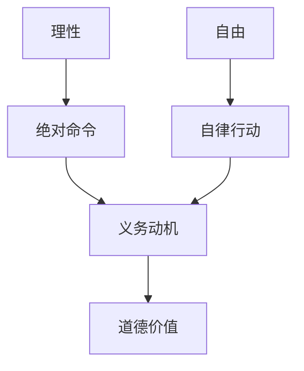

# 公正该如何做是好 (迈克尔·桑德尔) (Z-Library)_merged

状态: TODO
Update Date: 2025年11月9日 14:52
Create Date: 2025年11月7日 14:42

# 公正该如何做是好 (迈克尔·桑德尔) (Z-Library) - 合并版

创建于：2025-11-07 07:44:15

标签：
AI链接笔记
未知章节
书籍下载
资源网站

---

原文：[公正该如何做是好 (迈克尔·桑德尔) (Z-Library)_01_未知章节](https://www.yitulu.com/t/pdf/JrCJh9xw)

📄 **基本信息**
- 章节标题：未知章节
- 主要内容：提供书籍免费下载信息及相关网站推广

🔗 **资源链接**
- 书籍下载地址：www.nybooks.mobi
- 电子书整理方：ePUBw.COM
- 技术支持方：艺图录

---

# 未知章节 - 电子书下载资源

创建于：2025-11-07 07:44:01

标签：
AI链接笔记
电子书下载
资源链接
免费书籍

---

原文：[公正该如何做是好 (迈克尔·桑德尔) (Z-Library)_02_未知章节](https://www.yitulu.com/t/pdf/qV0JQo9X)

📚 **核心信息**

- 书籍下载链接：www.nybooks.mobi

- 整理方：ePUBw.COM

- 服务特点：提供最新最全的优质电子书下载

---

# 无法生成视频笔记（无视频内容）

创建于：2025-11-07 07:43:46

标签：
AI链接笔记
书籍信息
公正：该如何做是好？
无视频内容

---

原文：[公正该如何做是好 (迈克尔·桑德尔) (Z-Library)_03_章节_3](https://www.yitulu.com/t/pdf/0FxBA3gm)

📚 **链接内容分析**

- 提供的链接正文仅包含书籍《公正：该如何做是好？》的基本信息，无视频内容

- 书籍信息：

- 书名：公正：该如何做是好？

- 作者：[美] 桑德尔

- 译者：朱慧玲

- 出版社：中信出版社

- 无视频目录、时间戳或知识点相关内容

---

# 图书《公正：该如何做是好？》信息整理

创建于：2025-11-07 07:43:31

标签：
AI链接笔记
图书信息
中信出版社
公正：该如何做是好？

---

原文：[公正该如何做是好 (迈克尔·桑德尔) (Z-Library)_04_章节_4](https://www.yitulu.com/t/pdf/IU1T7GWa)

📚 **图书基础信息**
- 书名：公正：该如何做是好？
- 原文名：Justice: What’s the Right thing to Do?
- 作者：[美]迈克尔·桑德尔
- 译者：朱慧玲
- 出版社：中信出版社
- 出版时间：2012.12
- 字数：300千字
- 定价：59.00元

🔖 **图书编码信息**
- ISBN：978-7-5086-3623-8
- 中国版本图书馆CIP数据核字（2012）第250374号
- 分类：伦理学-研究（IV. ①B82）

📇 **出版发行信息**
- 策划推广：中信出版社（china citic Press）
- 出版发行：中信出版集团股份有限公司
- 地址：北京市朝阳区惠新东街甲4号富盛大厦2座（邮编100029）
- 出版社官网：[http://www.publish.citic.com/](http://www.publish.citic.com/)
- 官方微博：[http://weibo.com/citicpub](http://weibo.com/citicpub)
- 电子书平台：中信飞书App（[http://m.feishu8.com）](http://m.feishu8.com)/)

---

# 视频知识点目录大纲（无时间戳版）

创建于：2025-11-07 07:43:16

标签：
AI链接笔记
视频知识点
目录大纲
哲学理论

---

原文：[公正该如何做是好 (迈克尔·桑德尔) (Z-Library)_05_目录](https://www.yitulu.com/t/pdf/exTzBTo1)

📚 **核心章节概览**

1. **第一章：做正当之事**

2. **第二章：最大幸福原则 / 功利主义**

3. **第三章：我们拥有自身吗？ / 自由至上主义**

4. **第四章：雇佣帮助 / 市场与道德**

5. **第五章：重要的是动机 / 伊曼纽尔·康德**

6. **第六章：平等的理由 / 约翰·罗尔斯**

7. **第七章：反歧视政策之争**

8. **第八章：谁应得什么？ / 亚里士多德**

9. **第九章：我们彼此负有什么义务？ / 忠诚之难**

10. **第十章：公正与共同善**

11. **后记**

---

# 第一章 做正当之事 - 公正的三种考量维度

创建于：2025-11-07 07:43:01

标签：
AI链接笔记
公正理论
价格欺诈
道德困境

---

原文：[公正该如何做是好 (迈克尔·桑德尔) (Z-Library)_06_第一章 做正当之事](https://www.yitulu.com/t/pdf/062sJ8xw)

### 一、价格欺诈的争议与两种立场（00:00-05:20）

### 1.1 案例背景：2004年飓风”查理”后的价格暴涨

- 冰袋价格：2美元→10美元
- 发电机价格：250美元→2000美元
- 屋顶修理费：清理两棵树收费2.3万美元
- 汽车旅馆房价：40美元→160美元

### 1.2 反价格欺诈法的实践

- 佛罗里达州总检察长查理·克里斯特介入调查
- 西棕榈滩戴斯酒店因涨价被罚7万美元
- 核心争议：**市场自由定价 vs 道德正义**

### 1.3 经济学家的反驳（托马斯·索维尔/杰夫·雅各比）

- ✅ 涨价是供需关系的自然结果，刺激供应商增加供给
- ✅ 价格管制会导致必需品短缺，延缓灾后重建
- ✅ “正当价格”概念已不适用于市场经济

### 二、公正的三种核心考量维度（05:21-12:40）

### 2.1 福利最大化（功利主义视角）

- 支持自由市场：涨价→增加供给→整体福利提升
- 反对政府干预：价格管控会扭曲资源分配效率

### 2.2 尊重自由（自由市场视角）

- 交易自由：买卖双方自愿定价是自由社会的基础
- 强制限价的矛盾：干预个体自由选择，接近”敲诈”

### 2.3 促进德性（道德伦理视角）

- 贪婪的恶：灾难中牟利违背公民互助精神
- 社会德性：良好社会应凝聚共同体意识，而非榨取利益

### 三、延伸案例：从紫心勋章到金融危机（12:41-18:30）

### 3.1 紫心勋章的资格争议（2009年）

- 传统标准：仅授予**身体受伤**的士兵
- 争议焦点：**创伤后应激障碍（PTSD）** 是否算”战斗伤害”
- 五角大楼结论：心理创伤因”非敌人故意造成”被排除

### 3.2 2008金融危机中的政府救助伦理

- 美国国际集团（AIG）：获1730亿美元救助后发放1.65亿美元高管奖金
- 公众愤怒核心：用纳税人钱奖励”导致危机的贪婪者”
- 道德困境：**系统稳定 vs 惩罚失败**

### 四、道德推理的经典困境（18:31-25:00）

### 4.1 失控电车问题

- 情境1：扳动道岔牺牲1人拯救5人→多数认为”正当”
- 情境2：推胖子下桥阻挡电车→多数认为”不正当”
- 核心矛盾：**结果功利主义 vs 行为动机伦理**

### 4.2 阿富汗牧羊人事件（2005年）

- 海豹突击队面临抉择：杀死平民牧羊人or面临暴露风险
- 最终决定：放走牧羊人→导致19名战友牺牲
- 反思：**道德直觉 vs 后果计算**

---

# 功利主义理论与应用解析

创建于：2025-11-07 07:42:46

标签：
AI链接笔记
功利主义
最大幸福原则
伦理困境

---

原文：[公正该如何做是好 (迈克尔·桑德尔) (Z-Library)_07_第二章 最大幸福原则／功利主义](https://www.yitulu.com/t/pdf/sCLZiqBR)

### 一、功利主义核心理论（00:00-05:30）

📚 **边沁功利主义原则**
- 道德最高原则：幸福最大化、痛苦最小化
- 核心主张：行为正当性取决于结果的功利总和
- 理论基础：快乐与痛苦是人类行为的终极主宰

### 二、经典案例分析（05:31-15:45）

⚖️ **1884年米尼奈特号事件**
- 背景：4名海员被困，食物耗尽后杀死17岁男仆帕克
- 争议焦点：为拯救3人而牺牲1人是否道德
- 功利主义辩护：
1. 帕克病重且无家属，死亡损失最小
2. 不杀人可能导致4人全部死亡
3. 整体幸福总量增加

### 三、功利主义实践应用（15:46-25:10）

🔍 **边沁的社会改革计划**
1. **环形监狱设计**
- 中央监视塔实现全视角监控
- 囚犯劳动产生利润，降低管理成本
- 体现效率优先的功利主义思想

1. **乞丐管理方案**
    - 建立救济院强制乞丐劳动
    - 公众可将乞丐送往救济院并获得奖励
    - 目标：减少街头乞讨带来的社会不适

### 四、理论批判与反思（25:11-35:20）

❌ **主要反对观点**
1. **个体权利批判**
- 案例：古罗马基督徒喂狮子的娱乐活动
- 核心质疑：多数人幸福不应建立在少数人痛苦之上

1. **价值量化困境**
    - 菲利浦·莫里斯烟草报告：将吸烟者早死视为财政收益
    - 福特平托车事件：每条生命定价20万美元的成本收益分析
    - 矛盾点：生命价值能否用货币量化？

### 五、功利主义发展与修正（35:21-45:10）

🔄 **密尔的改良理论**
- 《论自由》核心观点：
1. 区分高级快乐与低级快乐
2. “做不满足的人优于做满足的猪”
3. 个体自由是实现社会整体幸福的必要条件
- 理论突破：引入品格价值维度，强调个性发展重要性

### 六、当代伦理挑战（45:11-55:00）

🌍 **功利主义的现实困境**
- 反恐伦理：严刑逼供的道德争议
- 资源分配：老年人生命价值折扣争议
- 环境政策：EPA的生命价值量化标准（年轻人370万美元/老年人230万美元）

---

# 第三章 我们拥有自身吗？/ 自由至上主义

创建于：2025-11-07 07:42:31

标签：
AI链接笔记
自由至上主义
自我所有权
最小政府

---

原文：[公正该如何做是好 (迈克尔·桑德尔) (Z-Library)_08_第三章 我们拥有自身吗？／自由至上主义](https://www.yitulu.com/t/pdf/c6TMwZ2b)

### 3.1 自由至上主义的核心主张（00:00-05:30）

🔑 **核心观点**

- 个人拥有对自身及财产的绝对所有权

- 反对政府通过税收进行财富再分配（视为”强迫劳动”或”盗窃”）

- 支持”最小政府”：仅负责合同执行、保护私有财产和维持和平

### 3.2 对现代政府政策的反对（05:31-12:15）

❌ **三大反对政策**

1. **反对家长式作风**

- 案例：安全带强制法、摩托车头盔法（认为侵犯个人风险自担权）

2. **反对道德立法**

- 案例：禁止卖淫、同性恋权利限制（主张成年人自愿行为不应被干涉）

3. **反对财富再分配**

- 反对累进税、最低工资法、社会保险（认为侵犯财产权）

### 3.3 理论代表人物及著作（12:16-18:40）

📚 **主要思想家**

1. **弗里德里希·哈耶克**

- 《自由宪章》：反对追求经济平等，认为其损害自由社会

2. **米尔顿·弗里德曼**

- 《资本主义与自由》：反对最低工资、行业执照制度，主张市场自由

3. **罗伯特·诺齐克**

- 《无政府、国家与乌托邦》：提出”持有正义”理论，反对模式化分配

### 3.4 关键案例与论证（18:41-28:10）

⚖️ **诺齐克的乔丹案例**

- 假设：乔丹年收入3100万美元，粉丝自愿购票形成收入

- 结论：向乔丹征税再分配=剥夺其劳动成果=部分拥有权，违背自我所有权

🔍 **对再分配的反驳**

1. 功利主义内部反驳：高税收降低生产积极性，最终减少再分配资源

2. 权利论反驳：未经同意征税侵犯财产权，与”仁慈的小偷”本质相同

### 3.5 极端案例的伦理挑战（28:11-35:20）

⚠️ **自我所有权的边界争议**

1. **器官买卖**

- 农民为子女学费卖肾→二次卖肾危及生命是否应被允许？

2. **辅助性自杀**

- 案例：杰克·凯沃金医生协助130名绝症患者自杀（2007年入狱）

3. **自愿食人案**

- 德国罗滕堡案（2001）：双方同意的食人行为是否合法？

### 3.6 理论批判与回应（35:21-40:00）

🔄 **主要反驳与回应**

| 反驳观点 | 自由至上主义回应 |

|————————-|——————————————-|

| 税收≠强迫劳动（可少工作避税） | 类比小偷盗窃现金vs电视：选择损失不改变侵权本质 |

| 乔丹成功依赖团队协作 | 队友报酬已通过市场交易实现公平 |

| 天赋与社会环境是运气 | 否定天赋所有权=否定自我所有权 |

---

# 第四章 雇佣帮助 / 市场与道德

创建于：2025-11-07 07:42:15

标签：
AI链接笔记
市场与道德
征兵制度
代孕伦理

---

原文：[公正该如何做是好 (迈克尔·桑德尔) (Z-Library)_09_第四章 雇佣帮助／市场与道德](https://www.yitulu.com/t/pdf/Bi6jI2JY)

📚 **目录大纲**

1. 市场与道德的核心问题

2. 美国内战时期的征兵制度与替代者争议

3. 志愿兵役制的道德困境

4. 代孕合同的伦理争议

### 1. 市场与道德的核心问题

- **核心议题**：自由市场是否公平？是否存在金钱不应购买的事物？
- **支持市场自由的两种主张**
    - 自由至上主义：尊重个人自由交换权，干涉市场即侵犯自由
    - 功利主义：自由市场促进双方利益，增加总体福利

### 2. 美国内战时期的征兵制度与替代者争议

- **征兵法背景**（1862年）
    - 林肯签署联邦征兵法，允许被征召者支付300美元或雇佣替代者免役
    - 南方同盟同样允许替代制，引发“富人的战争，穷人的战斗”争议
- **制度后果**
    - 1863年纽约征兵暴乱：因阶级不公导致百余人死亡
    - 1864年废除补偿金制度，但北方仍保留雇佣替代者权利

### 3. 志愿兵役制的道德困境

- **三种征兵方式对比**
    1. **强制征兵**：违背个人自由，被视为“奴役”（罗恩·保罗观点）
    2. **内战替代制**：允许花钱雇人服役，加剧阶级歧视
    3. **志愿兵役制**：通过市场招募士兵，80%美国人支持但存在隐性强制
- **关键反驳**
    - **公平性问题**：低收入群体占新兵多数（46%平民有大学教育，仅6.5%士兵有）
    - **公民责任问题**：戴维·肯尼迪认为志愿兵制切断公民与军队的联系

### 4. 代孕合同的伦理争议

- **“婴儿M”案例**（1986年）
    - 威廉·斯特恩与玛丽·贝丝签订代孕合同，后者产后拒绝放弃孩子
    - 新泽西最高法院判决合同无效，认定代孕“贬低人性”
- **核心分歧**
    - **支持方**：自由至上主义强调自愿交易，功利主义认为双方获益
    - **反对方**：伊丽莎白·安德森认为代孕将女性身体和孩子视为商品

---

# 康德道德哲学核心思想解析

创建于：2025-11-07 07:42:00

标签：
AI链接笔记
康德义务论
绝对命令
道德动机

---

原文：[公正该如何做是好 (迈克尔·桑德尔) (Z-Library)_10_第五章 重要的是动机／伊曼纽尔·康德](https://www.yitulu.com/t/pdf/6qePO5bY)

### 一、康德哲学基础与核心立场（00:00-05:30）

### 1.1 哲学定位与批判对象

- 📚 针对功利主义：道德价值不取决于结果（如”城市幸福”与地下室孩子的矛盾）
- 🆚 对比自由至上主义：反对”自我所有权”，主张人是目的而非手段

### 1.2 核心著作与历史背景

- 《道德形而上学基础》（1785）：系统阐述义务论道德观
- 时代背景：美国革命（1776）与法国革命（1789）之间的思想启蒙

### 二、道德哲学核心概念（05:31-15:45）

### 2.1 道德动机论

- ✅ **义务动机**：出于道德法则本身的行为才有道德价值
- ❌ **倾向动机**：因利益、情感或偏好的行为无道德价值（如精明店主的诚实）

### 2.2 自由观二元论

- 🔄 **自律（Autonomy）**：依据理性自我立法（真正自由）
- 🔗 **他律（Heteronomy）**：受自然法则或外在因素支配（如口渴喝雪碧的本能）

### 2.3 理性与命令体系

- 📜 **绝对命令**：无条件的道德法则（如”人是目的而非手段”）
- ⚙️ **假言命令**：基于特定目的的工具理性（如”为赚钱而诚实”）

### 三、绝对命令三大公式（15:46-25:10）

### 3.1 普遍法则公式

- 📏 “仅按照你同时愿意成为普遍法则的准则行动”
- 案例：虚假承诺的矛盾性（普遍化将摧毁承诺本身）

### 3.2 人性目的公式

- 👤 “始终将人视为目的本身，而非仅作为手段”
- 应用：反对功利主义的”多数幸福最大化”（如电车难题中的胖子）

### 3.3 意志自律公式

- 🏛️ “每个理性存在者都是道德法则的立法者”
- 引申：道德法则源于理性自我立法，体现意志自由

### 四、实践应用与道德困境（25:11-35:20）

### 4.1 性道德与尊严维护

- ❌ 反对婚外性行为：将人工具化（即使双方同意）
- ✅ 婚姻伦理：唯有婚姻能实现人格完整结合

### 4.2 诚实义务的绝对性

- 🗣️ 对杀人犯说谎的争议：康德坚持”即使后果有害也必须诚实”
- 反驳贡斯当：真理义务不取决于对象是否”应得真相”

### 4.3 自杀与自我所有权

- 💀 反对自杀：将自身作为解脱痛苦的手段，违背人性尊严
- 对比：与自由至上主义”身体自主权”的根本分歧

### 五、哲学体系与后世影响（35:21-40:00）

### 5.1 核心概念关联图

### 5.2 现代意义

- 🔑 普遍人权理论的哲学基础
- ⚖️ 影响当代生命伦理、政治哲学辩论

---

# 约翰·罗尔斯《正义论》平等的理由

创建于：2025-11-07 07:41:45

标签：
AI链接笔记
罗尔斯正义论
无知之幕
差异原则

---

原文：[公正该如何做是好 (迈克尔·桑德尔) (Z-Library)_11_第六章 平等的理由／约翰·罗尔斯](https://www.yitulu.com/t/pdf/VVcPT7Tx)

### 一、社会契约理论的困境（00:00-05:30）

1. **传统契约论的局限**
    - 洛克”心照不宣的同意”：高速公路穿行≠认可宪法（苍白无力）
    - 康德”假想同意”：全体公众认同≠真正公平（缺乏现实基础）
2. **罗尔斯的突破性解答**
    - 提出”原初状态”思想实验：在平等条件下选择社会原则
    - 核心工具：”无知之幕”（veil of ignorance）遮蔽个人特殊信息

### 二、无知之幕的思想实验（05:31-12:45）

1. **幕布后的选择情境**
    - 不知自身阶层、性别、种族、健康、财富等信息
    - 确保选择不依赖”道德任意性因素”（出生、天赋等偶然条件）
2. **理性选择的必然结果**
    - 拒绝功利主义：避免成为”被扔给狮子的基督徒”
    - 拒绝自由至上主义：防止沦为”无家可归的流浪汉”

### 三、两个正义原则（12:46-20:15）

1. **第一原则：平等的基本自由**
    - 内容：言论自由、宗教自由等基本权利
    - 地位：优先于社会功利和总体福利考量
2. **第二原则：差异原则**
    - 核心：社会经济不平等需满足”最不利者受益”条件
    - 例证：医生高薪合理→改善穷人医疗机会

### 四、契约道德的局限性（20:16-28:30）

1. **实际合同的道德缺陷**
    - 5万美元马桶维修费案例：双方同意≠公平
    - 橡皮清洁工强索费用：缺乏真实同意
2. **休谟的房屋维修案**
    - 租户擅自维修≠房东有付款义务
    - 法庭判决揭示：利益互惠可能产生义务

### 五、四种分配正义理论比较（28:31-35:20）

| 理论类型 | 核心缺陷 | 罗尔斯评价 |
| --- | --- | --- |
| 封建制度 | 基于出生偶然性分配特权 | 最明显的道德任意性 |
| 自由至上主义 | 形式机会平等忽视背景差异 | 未能消除社会偶然性 |
| 精英统治制度 | 天赋才能分配具有任意性 | 自然运气不应决定分配 |
| 差异原则 | 允许有利于最不利者的不平等 | 唯一公平的分配原则 |

### 六、关键反驳与回应（35:21-42:10）

1. **激励反驳**
    - 质疑：高收入激励是否必要？
    - 回应：允许激励→仅当提升最不利者状况
2. **努力反驳**
    - 质疑：比尔·盖茨的努力不应获回报？
    - 回应：努力受家庭环境等偶然因素影响

---

# 第七章 反歧视政策之争

创建于：2025-11-07 07:41:30

标签：
AI链接笔记
教育公平
反歧视政策
平权法案

---

原文：[公正该如何做是好 (迈克尔·桑德尔) (Z-Library)_12_第七章 反歧视政策之争](https://www.yitulu.com/t/pdf/dvULpfvx)

### 一、典型案例解析

### 1.1 霍普伍德案（Cheryl Hopwood）

- 白人女性申请得州大学法学院，成绩3.8且入学考试第83百分位，因少数族裔录取政策未被录取
- 校方主张政策目的是增加法律职业多样性，少数族裔毕业生多进入政府与法律部门
- 争议焦点：成绩优于部分少数族裔申请者却遭拒，是否构成反向歧视

### 1.2 巴克案（Bakke case, 1978）

- 白人男性连续两年被加州大学戴维斯分校医学院拒绝，校方录取分数更低的黑人学生
- 最高法院裁决：支持将种族作为录取参考因素，但反对刚性配额制

### 二、反歧视政策三大理论依据

### 2.1 纠正标准化考试偏见

- SAT等考试存在文化背景差异导致的系统性偏差
- 案例：1951年马丁·路德·金GRE分数低仍被波士顿大学录取
- 研究表明：少数族裔学生标准化考试分数普遍低于白人，需结合背景评估

### 2.2 补偿过往之错

- 核心论点：通过录取偏好弥补历史歧视造成的结构性劣势
- 主要争议：受益者多为中产少数族裔，与历史受害者并非完全重合
- 批评声音：不应让当代白人承担历史歧视责任

### 2.3 促进多样性（主流辩护理由）

- 教育价值：多样化学生群体提升课堂讨论质量与跨文化理解
- 社会功利：培养少数族裔进入精英领域，服务多元社会需求
- 哈佛学院主张：成绩并非唯一标准，多样性带来”智力活力”

### 三、关键法律与政策演变

### 3.1 司法判例

- 1978年巴克案：允许种族作为加分因素（非配额）
- 2003年格鲁特案：密歇根大学法学院政策获支持，强调多样性教育价值
- 各州动向：加州、华盛顿州通过公投禁止教育领域种族优待

### 3.2 政策实践争议

- 得州大学法学院：设定少数族裔录取比例约15%
- “小星城”住房项目：通过种族配额维持社区融合，导致黑人家庭等待时间更长
- 校友子女偏好：与种族优待形成对照的特权传承现象

### 四、核心哲学辩论

### 4.1 权利导向视角（德沃金）

- 录取公平取决于大学使命定义，种族可作为与使命相关的考量因素
- 反驳”权利侵犯论”：申请者无绝对权利要求按单一标准评判

### 4.2 功利主义权衡

- 支持者：多样性带来的社会整体利益高于个体录取公平
- 反对者：以集体目标牺牲个体权利违背正义原则

### 4.3 罗尔斯正义论视角

- 天赋与社会背景均属”道德偶然因素”，不应成为分配依据
- 质疑”功绩至上”：成功更多源于运气而非个人美德

---

# 亚里士多德的公正理论：目的论与应得性的探讨

创建于：2025-11-07 07:41:16

标签：
AI链接笔记
亚里士多德公正理论
目的论推理
德性伦理学

---

原文：[公正该如何做是好 (迈克尔·桑德尔) (Z-Library)_13_第八章 谁应得什么？／亚里士多德](https://www.yitulu.com/t/pdf/A3BjET4E)

### 一、核心问题：谁应得什么？（无时间戳）

- 通过考利·斯马特（Callie Smartt）的案例引出公平分配的本质争议
- 关键矛盾：角色目的的定义 vs 传统能力标准的冲突
→ 拉拉队队长的本质是”激励观众”还是”完成劈叉/翻筋斗”？

### 二、亚里士多德的公正原则（无时间戳）

### 2.1 目的论推理（Teleological）（无时间戳）

- 公正分配需基于事物的”telos”（本质目的）
✅ 案例：长笛应分配给最优秀的演奏者（实现”产生美好音乐”的目的）
✅ 案例：网球场应优先给校网球队（最佳利用场地竞技属性）
- 现代启示：职位/荣誉分配需先明确其社会功能

### 2.2 荣誉性维度（无时间戳）

- 公正不仅是分配结果，更是对”德性”的认可
→ 考利案例中反对者的怨恨本质：传统能力标准的荣誉被贬低
→ 高尔夫球员反对球车的深层原因：体力竞技的荣誉认同危机

### 三、政治共同体的目的（无时间戳）

- 城邦的本质：促进”良善生活”而非仅保障安全/经济
    - 公民需通过参与政治实现”慎议共同善”的德性
    - 对比现代制度：NATO/NAFTA等联盟因缺乏德性培养目的，不算真正城邦
- 职务分配原则：根据”公民美德”而非财富/数量
✅ 伯里克利（Pericles）因卓越政治智慧应得最高荣誉

### 四、德性培养与实践智慧（无时间戳）

- 道德德性的获得：通过习惯而非规则学习
→ “做正义之事成为正义之人”（类似演奏乐器需反复练习）
- 实践智慧（Phronesis）：在具体情境中判断”适当行为”的能力
    - 区别于科学知识：需结合环境特征动态决策

### 五、当代争议案例（无时间戳）

### 5.1 考利·斯马特与拉拉队资格（无时间戳）

- 争议焦点：身体能力是否为队长的本质要求？
    - 支持者：轮椅上的激情表现已实现”激励观众”目的
    - 反对者：传统技能标准的荣誉受损

### 5.2 凯西·马丁（Casey Martin）的高尔夫球车争议（无时间戳）

- 最高法院判决核心：高尔夫运动的本质是”以最少杆数击球”而非体力考验
- 职业球员反对逻辑：体力竞技的荣誉认同受到威胁

---

# 第九章 我们彼此负有什么义务？/忠诚之难

创建于：2025-11-07 07:41:01

标签：
AI链接笔记
历史道歉与补偿
道德个人主义
共同体主义

---

原文：[公正该如何做是好 (迈克尔·桑德尔) (Z-Library)_14_第九章 我们彼此负有什么义务？／忠诚之难](https://www.yitulu.com/t/pdf/QVAnCgs0)

### 一、历史不公与道歉补偿（00:00-05:30）

### 1. 德国对大屠杀的反思

- 以数十亿美元赔偿幸存者及以色列
- 政治领导人持续表达歉意并承担历史责任
- 康拉德·阿登纳1951年联邦议会发言承认罪责

### 2. 日本对战争罪行的态度

- 20世纪90年代私人基金对”慰安妇”有限赔偿
- 2007年安倍晋三否认军队强制妇女为性奴隶
- 美国国会要求日本正式承认并道歉

### 3. 澳大利亚原住民问题

- “被偷的一代”：混血原住民子女被迫与母亲分离
- 电影《末路小狂花》刻画政府强制安置政策
- 2008年陆克文发表官方道歉但未提个体赔偿

### 二、道歉的伦理争议（05:31-12:45）

### 1. 反对道歉的核心论点

- 道德个人主义：当代人不应为前辈过错负责
- 约翰·霍华德：”当代澳大利亚人无需为前人行为道歉”
- 亨利·海德：”未拥有奴隶者不应为奴隶制道歉”

### 2. 支持道歉的主要理由

- 修复历史创伤，促进道德与政治和解
- 承认不公正对受害者后代的持续性影响
- 官方道歉作为政治姿态的象征意义

### 三、道德哲学的两种立场（12:46-20:15）

### 1. 自由主义的个体权利观

- 康德：道德主体是自由选择的独立自我
- 罗尔斯：正义原则应中立于良善生活观念
- 权利优先于善，基于同意与契约

### 2. 共同体主义的叙述性自我

- 麦金泰尔：道德反思需嵌入共同体历史叙事
- 亚里士多德：善在于实现人类本性与潜能
- 道德责任源于社会身份与归属感

### 四、三种道德义务类型（20:16-28:40）

### 1. 自然义务

- 普遍性道德责任（如不杀人、做公正之事）
- 无需同意，基于理性存在的普遍责任

### 2. 自愿义务

- 基于同意的特殊责任（如契约、承诺）
- 具有明确针对性与互惠性

### 3. 团结义务

- 源于共同体历史的特殊责任
- 非经同意却具有道德约束力
- 案例：父母对子女的特殊责任、以色列”摩西行动”救援同胞

### 五、爱国主义与边界伦理（28:41-35:20）

### 1. 国家特殊义务的争议

- 美国公民优先享有社会福利的道德基础
- 以色列优先救援埃塞俄比亚犹太人的伦理辩护
- 移民政策中的”同胞优先”原则

### 2. 经济民族主义案例

- 2009年美国经济刺激计划的”购买美国货”条款
- 奥巴马政府面临的就业保护与贸易公平平衡

---

# 第十章 公正与共同善

创建于：2025-11-07 07:40:45

标签：
AI链接笔记
公正与共同善
自由主义中立性
宗教与政治

---

原文：[公正该如何做是好 (迈克尔·桑德尔) (Z-Library)_15_第十章 公正与共同善](https://www.yitulu.com/t/pdf/vOxBhUb1)

### 1. 宗教与政治的关系

### 1.1 约翰·肯尼迪的演讲（1960年9月12日）

- 背景：肯尼迪作为天主教徒竞选总统，面临宗教偏见
- 核心观点：宗教信仰是私人事务，不会影响公共决策
- 影响：缓解选民顾虑，助其赢得选举

### 1.2 巴拉克·奥巴马的演讲（2006年6月28日）

- 背景：回顾2004年议员竞选时对宗教问题的回应
- 核心观点：宗教信仰塑造价值观，应在政治中发挥作用
- 批评：自由主义者忽视宗教在社会问题解决中的价值

### 2. 自由主义中立性

### 2.1 中立性的内涵

- 政府应在道德和宗教问题上保持中立
- 共和党：经济政策上主张中立，反对政府干预市场
- 民主党：社会文化问题上主张中立，反对”为道德立法”

### 2.2 约翰·罗尔斯的《正义论》（1971年）

- 为自由主义中立性提供哲学辩护
- 主张在讨论公正和权利时，搁置个人道德和宗教信念
- 1993年《政治自由主义》：承认个人情感和奉献的重要性，但认为与公民身份无关

### 3. 社会议题中的道德与宗教争议

### 3.1 堕胎与胚胎干细胞研究

- 争议焦点：生命开始的时间点
- 中立性困境：无法在不表明道德立场的情况下解决合法性问题

### 3.2 同性婚姻

- 三种政策选项：仅认可异性婚姻、认可同性和异性婚姻、政府不认可任何婚姻
- 马萨诸塞州最高法院（2003年）：首个赋予同性婚姻合法性的州
- 婚姻本质：马格丽特·马歇尔认为是”排外性的、充满爱意的承诺”，而非繁衍后代

### 4. 公正与共同善的政治

### 4.1 三种公正进路

- 功利主义：追求最大多数人的最大幸福
- 自由主义：尊重选择自由
- 德性与共同善：认为公正涉及培养德性和推理共同善（作者支持）

### 4.2 罗伯特·肯尼迪的演讲（1968年3月18日）

- 批评物质主义，强调道德目标的重要性
- 认为贫困、战争和种族歧视的解决需要改变生活方式

### 4.3 奥巴马的共同善政治

- 公民身份与服务：提议学生以公共服务换取学费资助
- 市场的道德局限：警惕市场扩张侵蚀非市场规范
- 不平等与团结：贫富差距破坏公民身份所需的团结

---

# 书籍《后记》核心内容整理

创建于：2025-11-07 07:40:30

标签：
AI链接笔记
政治哲学
公正课程
哈佛大学

---

原文：[公正该如何做是好 (迈克尔·桑德尔) (Z-Library)_16_后记](https://www.yitulu.com/t/pdf/qqS16EIT)

### 一、书籍起源与课程背景（无时间戳）

- 本书源于哈佛大学政治哲学课程
- 近30年教授本科生政治哲学，核心课程为”公正”
- 课程内容：学习公正哲学著作+讨论当代法律/政治争论

### 二、课程特色与价值（无时间戳）

- 论辩性教学：学生反驳哲学家观点、同学观点及教授观点
- 核心价值：培养批判性思维+深化对公正问题的理解

### 三、致谢对象分类（无时间戳）

1. **学术支持**
    - 哈佛大学”公正”课程数千名本科生
    - 协助教学的数百名研究生及法学院学生
    - 哈佛法学院暑期研修班（写作支持）
    - 纽约卡内基公司”卡内基学者项目”（研究支持）
2. **出版合作**
    - 法勒-斯特劳斯-吉鲁出版社团队：乔纳森·加拉西、保罗·伊利等
    - 文稿代理人：埃丝特·纽伯格
3. **个人支持**
    - 家人：儿子亚当、艾伦（餐桌讨论伙伴）
    - 灵魂伴侣：基库（道德精神支柱）

### 四、核心研究主题（无时间戳）

- 公正理论与实践
- 市场的道德局限（未完成项目）
- 家庭伦理中的公正讨论

---

# 书籍目录大纲（无时间戳信息）

创建于：2025-11-07 07:40:15

标签：
AI链接笔记
书籍目录
章节大纲
伦理学

---

原文：[公正该如何做是好 (迈克尔·桑德尔) (Z-Library)_17_Table of Contents](https://www.yitulu.com/t/pdf/DjnDq4BR)

📚 **主要章节概览**

1. **第一章：做正当之事**

2. **第二章：最大幸福原则 / 功利主义**

3. **第三章：我们拥有自身吗？ / 自由至上主义**

4. **第四章：雇佣帮助 / 市场与道德**

5. **第五章：重要的是动机 / 伊曼纽尔·康德**

6. **第六章：平等的理由 / 约翰·罗尔斯**

7. **第七章：反歧视政策之争**

8. **第八章：谁应得什么？ / 亚里士多德**

9. **第九章：我们彼此负有什么义务？ / 忠诚之难**

10. **第十章：公正与共同善**

📑 **附加内容**

- 封面、扉页、版权页、目录

- 后记

---

# Landmarks 书籍目录信息

创建于：2025-11-07 07:40:00

标签：
AI链接笔记
书籍目录
电子书下载
Landmarks

---

原文：[公正该如何做是好 (迈克尔·桑德尔) (Z-Library)_18_Landmarks](https://www.yitulu.com/t/pdf/0wsnGWnR)

📚 **基础信息**

- 文档标题：Landmarks

- 文档类型：书籍目录（Table of Contents）

- 整理来源：ePUBw.COM

- 核心功能：提供优质电子书下载服务

---

# 未知章节 - 电子书来源信息

创建于：2025-11-07 07:39:45

标签：
AI链接笔记
未知章节
电子书下载
技术支持

---

原文：[公正该如何做是好 (迈克尔·桑德尔) (Z-Library)_19_未知章节](https://www.yitulu.com/t/pdf/D7C5vOmB)

📚 **基础信息**

- 章节标题：未知章节

- 整理来源：ePUBw.COM

- 核心功能：提供最新最全的优质电子书下载

🔗 **相关链接**

- 技术支持：艺图录