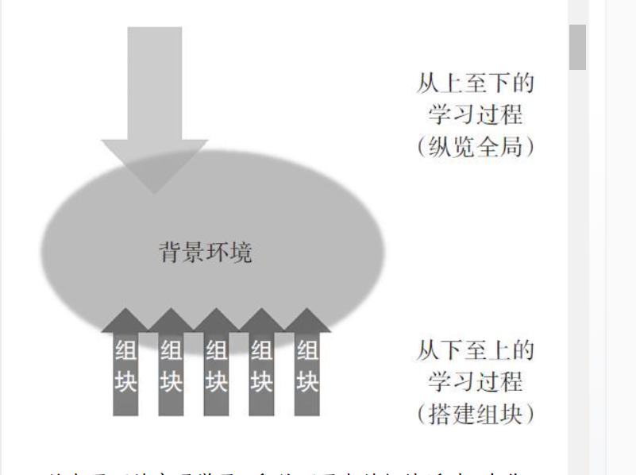

# 学习之道 (芭芭拉·奥克利, Barbara Oakley) (Z-Library)_merged

状态: DOING
Start Time: 2025年11月14日 18:18 (GMT+8)
Update Date: 2025年11月14日 22:48
Create Date: 2025年11月7日 14:56

# 第1章 开启大门：每个人都能提升学习能力

创建于：2025-11-06 23:29:33

标签：
AI链接笔记
学习能力提升
数学学习方法
思维模式转变

---

原文：[学习之道 (芭芭拉·奥克利, Barbara Oakley) (Z-Library)_09_章节_9](https://www.yitulu.com/t/pdf/eHXMXDJz)

### 1. 作者的学习困境与转变历程

- **早年数学恐惧**：因家庭变故进入贫民校区，遭遇严苛数学老师，长期对数学、科学学科产生抵触心理，成绩垫底
- **职业转折点**：从军经历促使反思技术能力重要性，利用退役金重新学习，逐步克服数学恐惧
- **学术成就**：最终获得电气工程学士、电子与计算机工程硕士、系统工程博士学位，成为工程学教授
- 2.1 思维调整
    - **从对抗到接纳**：
        
        放弃"拒绝理解"的精神胜利法，接受"重新训练大脑"的挑战
        
    - **类比迁移**：
        
        将语言学习的良性循环（学得好→喜欢学→花时间多→学得更好）迁移到数理学习
        

### 2. 核心观点：学习能力的普遍性

- **天赋误解破除**：强调”每个人都能提升学习能力”，驳斥”数理天赋论”
- **思维模式差异**：指出问题源于”看待世界的两种方式”，单一学习方式导致困境
- **大脑潜能**：人类天生具备心算能力（如接球、舞蹈、驾驶中的无意识计算）

### 3. 学习方法的关键原则

- **技巧性学习**：掌握思维小技巧可帮助数学差者提升，优等生亦能受益
- **循序渐进**：反对”一口吃个胖子”，强调充足练习时间的重要性
- **良性循环**：通过”学得好→喜欢学→花时间多→学得更好”的正向反馈提升效率

### 4. 书籍价值与适用人群

- **核心目标**：帮助读者轻松学习数理知识，暴露思维过程，提供实用练习方法
- **适用范围**：
    - 数理基础薄弱者
    - 自认为无数理天赋者
    - 希望提升学习效率的学生
    - 追求跨学科思维的研究者

---

# 第2章 放松点有时候太勤奋也是一种病：学习数学和科学的思维模式

创建于：2025-11-06 23:29:18

标签：
AI链接笔记
思维模式
专注模式
发散模式

---

原文：[学习之道 (芭芭拉·奥克利, Barbara Oakley) (Z-Library)_10_章节_10](https://www.yitulu.com/t/pdf/0BEGk9yY)

### 2.1 思维模式的核心概念（无时间戳）

- 大脑存在两种关键思维模式：专注模式（focused mode）和发散模式（diffuse mode）
- 两种模式基于不同神经网络模型，日常活动中频繁切换
- 无法同时处于两种模式，但发散模式可在后台处理非关注事项

### 2.2 专注模式解析（无时间戳）

🔍 **定义**

- 高度集中注意力的状态，用于理性分析和解决已知问题
- 与大脑前额叶皮层（脑门正后方区域）功能相关

🎯 **特点**

- 思维路径固定：类似弹球机中紧密排列的橡胶弹柱，思路沿熟悉路径推进
- 适用场景：乘法运算、语言语法练习、动作分解训练等已有经验的任务
- 局限性：易陷入思维定式，难以突破固有框架

### 2.3 发散模式解析（无时间戳）

🌌 **定义**

- 放松状态下的宏观思维模式，促进灵感和新连接的产生
- 与大脑多区域联动及宏观视角相关

💡 **特点**

- 思维路径开放：类似弹球机中分散排列的橡胶弹柱，思路可跳跃至新区域
- 触发方式：放松注意力、思维漫步、无意识联想（如”突然顿悟”）
- 关键作用：解决全新问题、突破思维定式、提供创造性灵感

### **4. 数学和科学学习的特殊挑战**

- 4.1 **抽象性与隐晦性**
    - 数学概念（如“加号”）比日常语言概念（如“牛”）更抽象。
    - 数学符号（如乘号）可能代表多种运算或概念，更为隐晦。
    - 影响：这使得大脑中的“神经通路”（弹球机的橡胶弹性）更“软”，需要额外练习来强化。
    - 结论：克服拖延对数学和科学学习尤为重要。
- 4.2 **定式效应**
    - 4.2.1 定义：脑海中已有的或最初的想法，会阻碍你产生更好的想法或答案。
    - 4.2.2 在弹球机类比中的体现：思维小球被限制在图上方的熟悉路径，而答案可能在图下方的新路径。
    - 4.2.3 成因：直觉误导，需要让错误的旧观点“改过自新”。
    - 4.2.4 对学生的危害：成为绊脚石，阻碍找到正确思路。
- 4.3 **错误的学习方法：“没学会走就开始跑”**
    - 表现：不阅读教材、不上课、不请教，就直接开始做作业。
    - 后果：如同闭着眼睛玩弹球，无法建立有效的神经模式，自暴自弃。
- 4.4 **掌握正确解决方法的重要性**
    - 不仅关乎学业，也关乎生活：如识别虚假广告、避免财务危机。

### **5. 两种思维模式的协同与切换**

- 5.1 **切换的必要性**
    - 要理解新事物，需要从专注模式切换到发散模式，以寻找新方法。
    - 发散模式无法被随意开关，但有技巧可以帮助切换。
- 5.2 **创造力源于放松**
    - 例证：肖恩·瓦塞尔的经历表明，放松状态下的随意发挥往往比苦思冥想更有创造力。
- 5.3 **生物学演化视角**
    - 5.3.1 生存需求：生物（如鸟类）需要同时处理专注任务（觅食）和发散任务（警戒）。
    - 5.3.2 大脑半球分工的倾向（但非绝对）：
        - 左半球：更侧重于慎重的、注意力集中的、逻辑连贯的思考。
        - 右半球：更侧重于扫视环境、互动、情绪处理及宏观问题。
    - 5.3.3 重要澄清：“左脑/右脑主导”的说法是错误的。任何复杂任务都需要两个半球协同工作。
- 5.5 **解决问题的标准流程**
    - 必须先用专注模式进行艰苦努力。
    - 遇到难题时，发散模式是解决问题不可或缺的部分。
    - 关键：有意识地集中时，发散模式被屏蔽。需要适时放松，让发散模式工作。
    - 核心观点：任何学科的问题解决都依赖于两种模式间的信息往来传递。

### **6. 困惑与拖延**

- 6.1 **接纳困惑**
    - 观点（肯尼斯·莱伯德）：困惑是学习过程中的有益部分，是摸索答案的开始。
    - 能够描述出问题，就已经成功了一半。
- 6.2 **拖延的危害与前奏**
    - 危害：
        - 没有时间供专注模式稳扎稳打。
        - 增加压力。
        - 导致神经模型模糊、残缺，知识结构摇摇欲坠。
        - 临阵磨枪无法真正理解和记忆知识。
    - 原因：两种思维模式都需要时间，而拖延者没有给自己留出时间。
- 7.2 **克服拖延的“番茄工作法”简介**
    - 步骤：
        1. 消除干扰（关掉手机等）。
        2. 设定25分钟计时器。
        3. 在此期间全神贯注于一项任务（不追求完成）。
        4. 时间到后，立即停止并奖励自己。
    - 进阶版：
        1. 想象睡前回顾，写下当天最重要的待办任务。
        2. 在一天内，用至少3个25分钟（番茄时间段）处理最重要的任务。
        3. 当日工作结束后，享受成就感，并写下明天的关键事项。
    - 原理：这种前期准备有助于发散模式预热思考明天的任务。

### 2.5 高效学习策略（无时间戳）

📚 **反直觉的高效阅读法**

- 先快速浏览章节框架（标题/小结/思考题），建立宏观认知
    - **原理**：创造"神经挂钩"，帮助大脑提前建立知识框架，后续学习时更容易"挂靠"新信息
- 多来源交叉验证：教材+视频+搜索引擎，多角度理解概念

---

# 第3章 学习即创造：来自托马斯·爱迪生的启示

创建于：2025-11-06 23:29:03

标签：
AI链接笔记
思维模式转换
发散思维激活
间隔重复记忆

---

原文：[学习之道 (芭芭拉·奥克利, Barbara Oakley) (Z-Library)_11_章节_11](https://www.yitulu.com/t/pdf/zMf57BiL)

### 3.1 爱迪生的创造力秘诀 - 思维模式转换

- 🔬 **专注模式与发散模式**
    - 专注模式：集中精力解决问题，适合线性思考
    - 发散模式：放松状态下的联想思维，利于突破瓶颈
    - 关键技巧：主动切换两种模式（如散步、听音乐、小睡）
- 🧠 **爱迪生的“落球法”**
    - 遇到难题时小睡，手中握球滑落惊醒瞬间捕捉灵感
    - 类似案例：达利“似睡非睡”状态激发艺术创作

### 3.2 3B方法与发散模式激活

- 📝 **霍华德·格鲁伯3B方法**
    - 睡眠（bed）、洗澡（bath）、坐公交（bus）
    - 其他有效方式：运动、绘画、冥想、听纯音乐
- ⚠️ **注意事项**
    - 避免电子游戏、上网等易沉迷活动
    - 每次专注后需留出1-2小时发散时间

### **5. 有效运用两种模式的原则**

- 5.1 **能量的有限性**
    - 专注模式消耗有限的意志力（精神能量）。
    - 课间休息、聊天是提神醒脑的好办法。
- 5.2 **劳逸结合**
    - 如同肌肉训练，大脑在专注模式后需要休息（发散模式）来恢复和生长。
    - 在紧凑的专注模式后，利用发散模式的方法奖励自己。
- 5.3 **激活发散模式的方法清单**
    - **高效方法**：健身房、运动、慢跑/散步/游泳、跳舞、开车兜风、绘画/涂鸦、淋浴/泡澡、听纯音乐、演奏熟悉歌曲、冥想/祷告、**睡觉**。
    - **需谨慎使用（可能引入专注）**：打电子游戏、上网、和朋友聊天、帮助别人、阅读休闲读物、发短信、看电影/戏剧、看电视（非催眠类）。

### 6. 学习心态与策略

- 6.1 **别怕落在后面**
    - 匆忙追赶领跑者可能导致未能真正掌握知识。
    - 建议：退后一步，审视自身长项与弱点，合理安排时间与学业负荷。
    - 放慢脚步，细嚼慢咽，反而可能学得更深入。
- 6.2 **避开思维定式**
    - 接受第一个想法会阻碍寻找更佳路径（国际象棋选手的眼动研究证明）。
    - **眨眼**是打破僵局、重新评估现状的关键行为。
    - **刻意闭眼**有助于提高专注程度，避免干扰。
- 6.3 **卡尔森的策略回顾**
    - 起身离开棋盘是主动切换至发散模式，让直觉在后台工作。
    - 这种快速切换模式的能力依赖于专业知识与实践直觉。
- 6.4 **“砌砖墙”比喻**
    - 学习需要时间让神经模型巩固，如同砌墙需留出泥浆干燥时间（放松）。
    - 试图一蹴而就（填鸭式学习）会导致神经结构歪斜不稳。

### 7. 切换模式与寻求帮助

- 7.1 **专注与发散转换的实例**
    - 特雷弗·德罗兹德的经历：练钢琴时休息后如有神助；解微积分题时在开车途中获得灵感。
- 7.2 **切换模式的最佳实践**
    - 进入下一次专注模式前，应留出足够长的休息时间（通常几个小时）。
    - 经验：学新概念时，别扔上一天才回头复习（灵感还没来得及传给专注模式就会消逝掉）。
- 7.3 **发散模式的整合作用**
    - 将新观点整合到已知信息上，换角度看问题。
    - 解释了为何重大决定要“放一放”，以及休假的重要性。
- 7.4 **处理挫败感**
    - **观察自己**：感到挫败时，退后一步。挫败感是转换到发散模式的信号。
- 7.5 **当你真的被难住时**
    - **重视倾听**：自制力强的人需借助同伴的观察，在临界值时停下。
    - **有效求助**：向同学、同龄人或导师请教，获取不同视角。
    - **提前准备**：提问前先自己深入理解问题基本概念。
    - **求学要趁早**：不要等到考前才寻求帮助。
- 7.6 **失败也是一位良师**
    - 卡桑德拉·戈登的案例：第一次AP计算机科学考试失败，隔年再学后反而发现乐趣并成功，成为计算机科学家。

### 8. 理解学习中的矛盾

- 学习本身有时会阻碍学习能力的发挥。
- 专注既能解决问题，也可能阻碍找到新方法。
- 成功与失败都重要。
- 持之以恒是关键，但方向错误只会带来挫折。

### 工作记忆与长期记忆

- 9.1 **两种主要记忆系统**
    - **工作记忆**
        - 定义：对正在处理的信息进行瞬时、有意识加工的记忆。
        - 容量：约4个“组块”（经组块化处理后实际容量更大）。
        - 比喻：像杂耍演员同时抛接4个球；像大脑中的“黑板”，你在上面可以写写画画，记录那些尚在考虑或者还在试图理解的想法。
        - 维持方法：需要不断排演重复，保持信息活跃，否则，身体就会把能量输送到别处，然后你就会忘记自己之前获取的信息。
    - **长期记忆**
        - 定义：储存大量知识的“仓库”。
        - 特点：信息一旦存入通常长期存在，但可能因埋藏太深而难以提取。
        - 比喻：计算机的“硬盘”。
- 9.2 **信息转移：间隔重复**
    - 把信息从工作记忆转存到长期记忆需要时间和技巧。
    - **间隔重复**：将重复内容分散在几天甚至几周内进行，效果远优于短期集中重复。
    - 原理：与“砌砖墙”同理，需要给神经联结留出巩固时间。

### 10. 睡眠对学习的重要性

- 10.1 **大脑的清理与修复**
    - 睡眠时脑细胞收缩，脑脊液流动冲洗掉清醒时产生的有毒物质。
    - 缺觉导致思维不灵光，与阿尔茨海默症、抑郁症相关。
- 10.2 **巩固记忆与学习**
    - 睡眠回顾知识难点，加深加固神经模型。
    - 提升解决难题、理解知识的能力。
- 10.3 **拼凑答案与梦境**
    - 睡眠让前额叶皮层关机，其他脑区更易交流，拼凑答案。
    - 睡前学习增加梦见知识的概率，梦境能增进理解、巩固记忆、让知识组块触手可及。
- 10.4 **睡眠：最重要的发散模式触发器**
    - 比喻：发散模式是登山途中的“大本营”，必要但非终点。
    - 成功依赖于在两种模式间来回切换的“分段练习”。

### 12. 本章小结

- 处理概念和难题：先让**专注模式**打头阵，然后交由**发散模式**。
- 出现挫败感时，**转移注意力**，启动发散模式。
- 最好的方法是“**每天进步一点点**”。
- 给两种模式**足够时间**，才能建立牢固的神经结构。
- 克服拖延：尝试**计时25分钟**全心投入工作。
- **记忆系统**：
    - **工作记忆**：容量有限的杂耍演员（约4个组块）。
    - **长期记忆**：巨大的仓库，需**定期回访**（间隔重复）保持新鲜。
- **睡眠**是学习的重要部分，能：
    - 构造神经联结（考前睡眠重要）。
    - 帮助攻克难题，理解知识。
    - 巩固重点，修剪枝节。

### **14. 关于创造力的建议（神经心理学家罗伯特·彼尔德）**

- 14.1 **放胆去做！**：个人成功依赖于行动，创意作品量预示一生成就。
- 14.2 **战胜恐惧**：不要让恐惧阻止前进。
- 14.3 **再多做几次总会成功**：如果不喜欢结果，就再来一次。
- 14.4 **批评使我们更优秀**：展示作品以获得客观视角，推动改进。
- 14.5 **接受分歧**：创新性常与“认同度”负相关。质疑既有答案和设想能提升创造力。

### 3.4 失败与创造力的关系

- 3.3 **创造力的本质**
    - 创造力是对自身能力的驾驭和拓展。
    - 解决数学和科学问题背后是创造力在运筹帷幄（如勾股定理的300多种证明）。
    - 每个人都具有创造新神经联结的能力（“创造力的魔法”）。
- 🚀 **创造力三要素**
    - 数量优先：多产出作品提升创意概率
    - 克服恐惧：敢于展示不完美作品
    - 接受批评：从反馈中优化思路

---

# 第4章 组块构建与避免能力错觉 “口默念而心得解” 的秘诀

创建于：2025-11-06 23:28:48

标签：
AI链接笔记
组块构建
能力错觉
记忆痕迹

---

原文：[学习之道 (芭芭拉·奥克利, Barbara Oakley) (Z-Library)_12_章节_12](https://www.yitulu.com/t/pdf/luhJ2VAq)

### 4.1 组块构建与记忆痕迹（00:00-05:30）

- 组块是根据意义将信息碎片组成的集合，如同压缩包整合文件 🧩
- 记忆痕迹形成：神经元激活并发放信号，与相关记忆联结加固
- 所罗门·舍雷舍夫斯基案例：超凡记忆力因缺乏组块能力导致理解障碍

### 4.2 注意力与组块形成（05:31-12:15）

- 注意力章鱼模型：专注时大脑特定区域连接激活，紧张状态会削弱连接能力
- 专注模式 vs 发散模式：
    - 专注模式：集中处理信息，形成神经回路
    - 发散模式：创造性联结不同组块，解决复杂问题
- 关键结论：专注练习+重复是创造记忆痕迹的核心（如高尔夫击球、舞蹈动作）

**2. 组块（Chunking）的概念与价值**

- 2.2 **组块的价值**
    - 使大脑高效运转，无需纠缠所有微观基础信息。
    - 是绝大多数科学、文学和艺术知识的构成基础。
    - 所罗门的缺陷在于无法创造概念性组块。

**3. 构建组块（组合起信息碎片）的步骤**

- 3.1 **第一步：专注（Focus）**
    - 将注意力完全集中在需要组块的信息上。
    - 注意力分散（如开电视、看手机）会阻碍组块构建。
- 3.2 **第二步：理解（Understanding）**
    - 理解是将基本概念打包成组块的“强力胶”。
    - 暂时性理解（“灵光一现”）不等于扎实掌握，必须通过后续练习巩固。
- 3.3 **第三步：获取背景信息（Gaining Context）**
    - 了解组块何时何地使用，何时不适用。
    - 通过在不同问题上反复练习，看清组块在宏观图景中的位置。
    - 背景信息能促进**迁移**——将知识应用到新问题的能力。

**4. 学习的两个方向**

- 4.1 **从下至上的组块过程**
    - 通过练习与重复建立和加固每个组块。
- 4.2 **从上至下的宏观学习**
    - 纵览全局，看到知识在宏观图景中的位置。
- 4.3 **两者的交汇**
    - 背景环境是两个过程的交汇处。
    - 熟练掌握学习材料需要两个过程相辅相成。
- 4.4 **实践建议**
    - 快速浏览章节、听条理清晰的演讲、关注大纲/流程图/表格/思维导图的核心内容，以获取宏观图景，只要完成这一步，接下来就可以填充细节了。

**5. 能力错觉与回想的重要性**

- 5.1 **能力错觉**
    - 定义：学生误以为看着学习材料（阅读笔记/课本）就等于掌握了知识。
    - 表现：不断重复阅读，却很少进行自我测验或提取练习。
- 5.2 **回想（提取练习）的关键作用**
    - 效果远优于单纯阅读。
    - 训练大脑，加深学习深度，促进组块形成。
- 5.3 **避免能力错觉的具体方法**
    - **谨慎划线和标记**（画线的动作会让你欺骗自己大脑在工作，其实只是手在动而已）：先找到主要观点，标记数量降到最少。
    - **在留白处做笔记**：记下总结好的关键概念。
    - **独立完成作业**：不看答案，保证知识在脑中留下深刻印象。
    - **及时练习回想**：最好在24小时内进行，有助于巩固概念、发现漏洞。
    - **使用间隔重复软件**：如Anki，优化学习效率。

**6. 组块如何影响工作记忆**

- 6.1 **初始状态**：工作记忆的四个位点被零碎信息塞满。
- 6.2 **组块形成过程**：脑中的联结变得更加轻松流畅。
- 6.3 **组块形成后**
    - 一个组块只占用工作记忆的一个位点。
    - 它化为一条流畅的思路（“丝带”），可轻松提取和创建新联结。
    - 释放了工作记忆的其他空间，相当于增加了工作记忆的可用信息量。
- 6.4 **重要提醒**
    - 仅仅看着答案做题会产生严重的能力错觉，知识并未被编织进神经回路。

**7. 组块与创造力**

- 7.1 **组块资料库是创造力的基础**
    - 脑中组块越多，解决问题越容易，并能创造出更大规模的组块。
    - 组块经验越丰富，大脑识别问题类别和自动调用解题技巧的能力越强。
        - 1.1 "幸运女神眷顾努力者"的科学解释
            - 积累效应：首个概念存入大脑 = 建立"知识锚点"，后续概念因关联效应更容易吸收
            - 难度感知变化：
                - ✅ 不是知识变简单，而是大脑处理效率提升（神经通路逐渐硬化）
                - ✅ 类比：砌墙时，首块砖最难固定，后续砖块只需嵌入缝隙
        - 1.2 组块的本质
            - **定义**：将零散信息**打包成有意义的整体**（如"手机"组块包含硬件/系统/应用）
            - **神经基础**：神经元集群形成的**稳定功能单元**，调用时如同"一键启动"
- 7.2 **“慢直觉”**
    - 专注与发散思维经过长年累月，产生创造性突破（如达尔文进化论、万维网）。
    - 关键：从多角度感知一个概念，让它们临时随机组合。
    - 广泛兴趣是创意丰富的关键之一。
- 7.3 **两种解题途径**
    - **序列式思维**：逐步推理，依赖专注模式。
    - **直觉/跳跃式思维**：依赖发散模式连接不同组块。
    - 直觉需要专注模式仔细验证，因为它并不总是正确的。

**8. 巩固组块：练习与重复**

- 8.1 **练习的重要性**
    - 解决数学和科学难题就像弹钢琴，练习越多，神经模型越坚实。
    - 一天之内再次强化学习，在构建神经模型的初始阶段至关重要。
- 8.2 **避免巩固错误**
    - 检查纠错非常重要，否则会加固错误的解题过程。
- 8.3 **组块的威力**
    - 数学知识可以被奇妙地压缩，一旦理解透彻，就能快速完整提取并运用到其他思维进程中。

**9. 重要学习策略**

- 9.1 **回忆的场所与方式**
    - **身体活动**：散步等活动有助于理解关键问题。
    - **变换环境**：在不同地点回想材料，可以增进理解，避免依赖单一环境的潜意识提示。
- 9.2 **穿插学习法**
    - **定义**：在同一学习时段内，混合练习不同类型、需要不同解题技巧的题目。
    - **对比**：与**过度学习**（在完全理解后，仍持续练习同一技巧）相对。
    - **过度学习的弊端**：浪费学习时间，导致思维僵化（像只会用锤子的木匠）。
    - **穿插学习的益处**：迫使大脑学习如何挑选和使用恰当的解题技巧，知其然也知其所以然。
    - **实践方法**：
        - 制作索引卡片，随机抽题练习。
        - 打开书本，任意选择不同章节的题目练习。
        - 在作业中，主动在不同章节的题目间切换。
- 9.3 **手写的作用**
    - 手写解题方法和概念有助于记忆。

### 

---

# 第5章 预防拖延化“坏”习惯为好帮手

创建于：2025-11-06 23:28:33

标签：
AI链接笔记
习惯养成
时间管理
拖延预防

---

原文：[学习之道 (芭芭拉·奥克利, Barbara Oakley) (Z-Library)_13_章节_13](https://www.yitulu.com/t/pdf/rBxyRdU1)

**2. 拖延的普遍性与本质**

- 2.1 **拖延是当代通病**：太多事情让我们分神（如社交媒体）。
- 2.2 **拖延在数学和科学学习中的特殊危害**
    - 学习依赖于短暂学习期（砌“神经砖块”）和学习期间隔（“思维水泥”凝固）。
    - 拖延会破坏这个必要的时间节奏。
- 2.3 **拖延与不安**
    - **本质**：我们拖延的，往往是让我们感到**不安**的事情。
    - **神经科学证据**：对数学恐惧的人，仅想到数学就会激活大脑的**痛觉中心**。
    - **关键洞察**：“对一项任务的恐惧会比这项任务本身消耗更多的时间和能量。”（丽塔·埃）
- 2.4 **回避的长期恶果**
    - 暂时回避痛苦，导致长期神经基础不牢。
    - 影响考试表现，错失机会（如奖学金），甚至可能因此放弃某个专业领域。
    - 拖延是一个“关键”恶习，会影响人生的诸多方面。

**3. 拖延的神经机制与成瘾性**

- 3.1 **拖延的过程（图解）**
    1. **不开心**：想到不喜欢的任务（如数学），激活痛觉中枢。
    2. **注意力转移**：将注意力转移到更愉悦的任务上（如查看手机）。
    3. **感到开心（暂时的）**：逃离不适，获得暂时的兴奋与解脱。
- 3.2 **拖延的成瘾性**
    - 提供的片刻兴奋是乏味现实的避风港。
    - 伴随**自欺欺人**的借口：
        - “上网查资料比看书更高效。”
        - “我学不好是因为天生不擅长。”
        - “太早学会忘记。”（忽略其他考试的压力）
    - 直到期末才面对现实。
- 3.3 **拖延的社会心理**
    - 作为技不如人的**借口**。
    - 成为**虚荣心**的温床（“我昨晚才开始备考，这样已经很不错了”）。
- 3.4 **习惯的根深蒂固**
    - 习惯性沉溺于短暂的愉悦。
    - 导致自信心下降，不再指望提高效率。
    - 拖延症患者通常压力更大、身体更差、表现不佳。
    - 坏习惯一旦根深蒂固，便难以摆脱。

**4. 改变的可能与警示**

- 4.1 **成功的改变案例**
    - 葆拉·米特尔的故事：通过“一次一项，逐一完成”获得成就感，从而克服习惯性拖延。
- 4.2 **侥幸心理的危险**
    - 偶尔通宵成功像赌博，会让人心存侥幸。
    - 自我说服“拖延是天性”，放弃改变。
- 4.3 **随着学业深入，拖延危害加剧**
    - 曾经有效的方法最终会失效。
- 4.4 **回到砒霜的比喻**
    - 微量砒霜能产生免疫力，但长期会潜移默化地损害健康（致癌、器官损坏）。
    - 类比：起初只是一点点拖延，但日积月累，危害极大。

---

# 第6章 小恶魔无处不在——深入理解拖延的习惯

创建于：2025-11-06 23:28:17

标签：
AI链接笔记
拖延习惯
番茄工作法
习惯的力量

---

原文：[学习之道 (芭芭拉·奥克利, Barbara Oakley) (Z-Library)_14_章节_14](https://www.yitulu.com/t/pdf/QriqKL7r)

### 6.1 习惯的本质与”小恶魔”模型（00:00-05:30）

- 🧠 **习惯的神经机制**
大脑通过”组块化”形成无意识行为模式（如倒车动作），进入”出窍状态”时无需集中注意力，节省认知资源（组块和习惯有着密切的联系）。
- 🔄 **习惯四要素**
    1. 信号：触发习惯的外部/内部线索（如计划清单、手机通知）
        1. 信号本身无好坏，重点在于你的**反应程序**。
    2. 反应程序：大脑在接到信号暗示时做出的常规性、习惯性的反应（如刷手机代替学习）
        1. 可以是无害、有益或有破坏性的。
    3. 奖励机制：即时愉悦感驱动习惯循环
        1. 拖延的奖励：迅速转移注意力到愉快的事上（拖延带来的逃避快感，养成拖延的习惯）。
        2. * 好习惯的奖励：同样需要找到奖励方式。
    4. 信念：对习惯改变的内在认同（如”我不能克服拖延”）
        1. 改变习惯的关键：**改变信念**。

### 6.2 拖延习惯的拆解与应对策略（05:31-15:45）

### 6.2.1 识别拖延信号（05:31-08:15）

- ⚠️ **常见触发信号**
    - 环境线索：手机震动、杂乱的书桌
    - 时间线索：截止日前夕、周一早晨
    - 情绪线索：焦虑时想吃零食、压力大时刷短视频
- ✅ **应对方法**
    - 物理隔离：将手机交给他人保管（耶斯拉·哈桑案例）
    - 环境重构：图书馆/安静空间学习，使用隔音耳机

### 6.2.2 重塑反应程序（08:16-12:20）

- 📝 **计划制定技巧**
    - 番茄工作法：25分钟专注+5分钟休息（弗朗西斯科·齐里洛发明）
    - 预设场景：课前将手机锁在车内，消除干扰源
- 🚫 **避免意志力消耗**
    - 用”过程目标”代替”结果目标”（如”学习20分钟”而非”完成作业”）

### 6.2.3 建立正向奖励机制（12:21-15:45）

- 🎯 **奖励设计原则**
    - 即时性：完成1个番茄钟后奖励听音乐10分钟
    - 阶梯式：小目标对应小奖励（如看电影），大目标对应大奖励（如旅行）
- 🔄 **替代疗法**
    - 用运动（跑步、拉伸）替代刷手机，激活大脑前额叶

### 6.3 习惯改变的核心：信念与心理对照（15:46-22:10）

- 💪 **信念强化策略**
    - 积极自我对话：”我能专注完成任务”
    - 社交支持：加入学习小组，公开承诺目标
- 🧠 **心理对照法（Gabriele Oettingen）**
    - 步骤1：想象理想结果（如拿到奖学金）
    - 步骤2：对比现实差距（如当前GPA 2.0）
    - 步骤3：制定行动桥梁（如每周3次番茄学习法）

### 6.4 实战工具与案例（22:11-28:30）

- ⏱️ **番茄工作法实操**
    - 25分钟专注期：关闭所有通知，只做单一任务
    - 休息策略：压力小时休息30分钟，临近截止日休息2-5分钟
- 🏆 **成功案例**
    - 凯瑟琳·福克：运动后学习效率提升
    - 查伦·布里森：用”看电影”奖励强化学习习惯

### 6.5 关键总结与行动指南（28:31-30:00）

- 📌 **核心观点**
    1. 习惯改变的关键是”最小阻力原则”：改变信号反应而非彻底消除习惯
    2. 过程导向优于结果导向：关注”做了什么”而非”完成了什么”
    3. 失败是学习机会：爱迪生”1000种造不出电灯的方法”思维

---

# 第7章 搭建组块对抗发懵：如何增进专业知识并减轻焦虑

创建于：2025-11-06 23:28:02

标签：
AI链接笔记
刻意练习
组块学习
测试效应

---

原文：[学习之道 (芭芭拉·奥克利, Barbara Oakley) (Z-Library)_15_章节_15](https://www.yitulu.com/t/pdf/Wda02QCd)

### 7.1 组块学习的核心理念（00:00-05:20）

📌 **核心定义**

- 组块：将概念整合为神经思维模型，压缩知识以释放工作记忆空间

- 类比案例：发动机/冰箱的迭代优化过程，强调知识需逐步雕琢

### 7.2 搭建组块的7个步骤（05:21-18:45）

1. **纸上解题**
    - 禁用答案，完整推导每一步，确保逻辑连贯
2. **重做关键步骤**
    - 聚焦难点，如同音乐家专攻复杂乐段
3. **分散休息**
    - 切换任务（如运动/兼职）激活发散思维
4. **睡前回顾**
    - 利用睡眠巩固神经连接
5. **刻意练习**
    - 次日重复解题，强化薄弱环节
6. **同类题迁移**
    - 用相同方法解决新题，扩展组块库
7. **主动回忆**
    - 碎片化时间（通勤/锻炼）在脑中复现解题步骤

### 7.3 关键学习原理（18:46-25:10）

🔬 **科学依据**

- **生成效应**：回忆优于重复阅读，增强记忆植入

- **测试效应**：自测不仅是评估，更是知识改造过程

- **知识坍塌现象**：学习中理解倒退是大脑重组的必经阶段

### 7.4 实践技巧与误区（25:11-32:30）

✅ **高效策略**

- 手写答案替代荧光笔标记

- 构建分类组块库（如热学/编程模块）

- 穿插学习法：切换内容强化记忆

❌ **常见陷阱**

- 能力错觉：仅通读答案≠掌握

- 过度标记：破坏知识原貌，产生虚假掌握感

---

# 第8章 工具、建议和小技巧：最好用的学习应用和方法

创建于：2025-11-06 23:27:47

标签：
AI链接笔记
学习方法
时间管理
拖延克服

---

原文：[学习之道 (芭芭拉·奥克利, Barbara Oakley) (Z-Library)_16_章节_16](https://www.yitulu.com/t/pdf/z6Y2EWa8)

📚 **目录大纲**

1. 高效行动的核心思维技巧

2. 克服拖延的三大原则

3. 任务管理与计划制定方法

4. 推荐学习工具与应用

5. 自我验证与习惯养成

### 1. 高效行动的核心思维技巧

- **“想方设法”理论**（David Allen）：通过环境调整（如穿运动服、图书馆学习）触发行动信号，利用身体本能反应提升执行力
- **正面思维转化**：将“我太累了”重构为“早餐会很丰盛”，用积极暗示替代负面情绪
- **冥想辅助专注**：推荐入门书籍《穿牛仔裤的佛》，搭配冥想类APP训练干扰屏蔽能力

### 2. 克服拖延的三大原则

1. **物理隔离干扰源**：拖延期间避免开电脑，用纸质笔记记录待解问题随身携带
2. **任务拆解启动法**：优先浏览作业中最简单的题目，用“微小启动”降低行动阻力
3. **时间块聚焦**：设定22分钟番茄时间挑战，灵活调整时长以适应个人节奏

### 3. 任务管理与计划制定方法

- **双清单系统**
    - 周计划：每周日列出20个关键待办事项，分解为每日5-10个可执行任务
    - 日计划：前一晚撰写次日清单，标注优先级（如“先做最难任务”）
- **停工时间管理**：参考卡尔·纽波特策略，设定固定结束时间（如下午5点），平衡工作与休息

### 4. 推荐学习工具与应用

- **专注工具**：番茄工作法计时器、Forest（专注时禁止刷手机）
- **任务管理**：Google Tasks（同步日历）、Evernote（碎片化信息记录）
- **记忆强化**：Anki（间隔重复算法抽认卡）、Quizlet（协作式卡片学习）
- **防干扰软件**：Freedom（屏蔽娱乐网站）、StayFocusd（Chrome扩展插件）

### 5. 自我验证与习惯养成

- **实验式自我观察**：记录拖延时的“僵尸状态”反应，用数据优化应对策略
- **公开承诺机制**：向朋友宣告任务目标，利用社交监督提升执行力
- **微小习惯叠加**：如洗澡时复盘数学题，将学习融入日常无意识行为

---

# 第9章 拖延的小恶魔总结篇：你得和拖延症较较劲

创建于：2025-11-06 23:27:32

标签：
AI链接笔记
时间管理
拖延症克服
习惯养成

---

原文：[学习之道 (芭芭拉·奥克利, Barbara Oakley) (Z-Library)_17_章节_17](https://www.yitulu.com/t/pdf/RdcIsA7K)

### 引言：拖延问题的再聚焦（00:00-05:00）

- 本章作为总结篇，在前期章节基础上补充新见解
- 核心观点：需理性应对拖延，平衡即时冲动与长期收益

### 一、拖延的危害与本质（05:00-15:00）

### 1.1 突击工作模式的弊端

- 效率低下：习惯突击完成工作者效率显著低于定时定量执行者 ⏱️
- 健康风险：长期高压工作导致精疲力竭，依赖肾上腺素会削弱思考能力
- 案例警示：19世纪奥地利砒霜使用者忽视长期毒性，类比拖延的隐性危害

### 1.2 拖延的心理机制

- 情绪驱动：”想做就做”的即时满足感常导致决策失误
- 思维定式：急于行动易陷入浅层思考（如本科生30秒内仓促解题）

### 二、克服拖延的核心策略（15:00-35:00）

### 2.1 理性认知与情绪管理

- 学会”驻足与反馈”：专家解题前平均用45秒分析物理原理归类问题 🧠
- 情绪缓冲：FBI人质谈判案例表明，克制过激反应可避免灾难性后果

### 2.2 行动工具与方法

- 微型任务分解：将大任务拆分为几分钟可完成的具体行动
- 时间管理技巧：
    - 番茄工作法：25分钟专注+短休息循环
    - 行程日志：记录任务完成情况以优化方法
    - 固定日程表：培养身体对规律模式的适应性（如韦斯顿·耶书伦案例）

### 2.3 环境与习惯塑造

- 创造无干扰环境（如图书馆）
- 建立正向反馈：庆祝微小成就，避免完美主义陷阱
- 习惯养成周期：新习惯需3个月适应期，建议循序渐进

### 三、拖延的积极面与平衡艺术（35:00-45:00）

- 战略性等待：区分有害拖延与有益”驻足”，专家常通过慢思考发现深层规律
- 决策质量提升：情绪激动时延迟反应，冷静分析可提升职业选择等重大决策合理性

### 四、总结与行动指南（45:00-50:00）

### 4.1 关键原则回顾

1. 拒绝外部归因，承担自我改变责任
2. 平衡专注与休息，避免负罪感
3. 制定备选计划应对突发状况

### 4.2 即时行动建议

- 记录拖延挑战，尝试”开始后难度会降低”的自我暗示
- 睡前回顾本章要点，利用记忆强化黄金时段

---

# 第10章 增强你的记忆力：大脑虽小，空间无限

创建于：2025-11-06 23:27:18

标签：
AI链接笔记
记忆力提升
记忆宫殿法
空间思维训练

---

原文：[学习之道 (芭芭拉·奥克利, Barbara Oakley) (Z-Library)_18_章节_18](https://www.yitulu.com/t/pdf/U4iO1CFi)

### 1. 记忆力提升的核心原理（00:00-05:30）

- 🌟 **大脑记忆潜力**：普通人通过训练可显著提升记忆力，如约书亚·福尔从记忆普通者成长为记忆冠军
- 🧠 **多感官记忆法**：调动视觉、听觉、触觉等多感官，通过趣味化、创造性方法强化记忆
- 🚀 **关键优势**：释放工作记忆空间，缓解考试紧张，强化长期记忆

### 2. 高效记忆技巧（05:31-15:45）

### 2.1 视觉空间记忆法（05:31-09:10）

- ✏️ **图像联想**：将抽象概念转化为具体图像（例：F=ma→”飞翔的骡子”）
- 🔤 **肢体记忆**：用手指关节代表31天月份，通过触觉强化记忆

### 2.2 记忆宫殿法（09:11-15:45）

- 🏰 **核心步骤**：
    1. 选择熟悉空间（家/学校/常去路线）
    2. 将需记忆内容转化为视觉形象
    3. 在空间中构建联想场景（例：用”地下室→屋顶”记忆皮肤五层结构）
- 📌 **适用场景**：
    - 记忆无关联物品（购物清单）
    - 复杂序列（矿物硬度表：滑石→金刚石）
    - 抽象概念（化学公式/演讲提纲）

### 3. 空间思维能力培养（15:46-22:10）

- 🧩 **后天可习得性**：通过刻意训练提升空间认知（例：雪莉·索尔比从空间感差到工程学专家）
- 🎯 **训练方法**：
    - 3D拼图/素描练习
    - 地图导航替代GPS
    - 拆解与组装物体
- 💡 **职业关联**：工程学、建筑学、计算机科学等领域核心能力

### 4. 科学记忆实践工具（22:11-28:00）

- 🎵 **记忆辅助手段**：
    - 助记口诀（例：矿物硬度口诀”terrible giants can find alligators…“）
    - 音乐联想（阿伏伽德罗常数编成广告曲）
- 🔗 **资源推荐**：
    - TED演讲：约书亚·福尔《记忆宫殿演示》
    - 网站：SkillsToolbox.com（数学符号可视化资源）

---

# 第11章 记忆技巧多多益善：打造生动形象的比喻或类比在数学和科学的学习中

创建于：2025-11-06 23:27:03

标签：
AI链接笔记
记忆技巧
间隔重复
类比记忆法

---

原文：[学习之道 (芭芭拉·奥克利, Barbara Oakley) (Z-Library)_19_章节_19](https://www.yitulu.com/t/pdf/eTAWMobl)

### 1. 比喻与类比的核心价值（00:00-05:30）

- 🌟 **定义**：通过熟悉事物解释新概念，建立神经联结（如叙利亚=麦片碗、约旦=乔丹鞋）
- **效果原理**：形象化类比能将抽象概念转化为可感知图像，提升记忆留存率
- **经典案例**：
    - 电流→水流（电压=压力推动）
    - 微积分极限→运动员接近终点线减速
    - 阳离子→伸爪子的猫（”pawsitive”谐音记忆）
    - 阴离子→洋葱（”negative”联想流泪）

### 2. 间隔重复与记忆强化（05:31-12:15）

- ⏰ **科学重复策略**：
    - 初次记忆后24小时内复习
    - 逐步延长间隔（参考Anki算法）
    - 睡前回顾+晨起巩固形成闭环
- **对抗遗忘机制**：
    - “代谢吸血鬼”理论：未巩固记忆会被自然代谢清除
    - 主动重复次数建议：关键内容至少3次强化
- **实操工具**：
    - 索引卡双向测试法（如密度符号ρ→”rou”发音+单位kg/m³）
    - 手写笔记优于电子记录（肌肉记忆强化）

### 3. 意群与故事化记忆法（12:16-18:40）

- 🔤 **首字母缩略法**：
    - GRHM→大蒜(Garlic)、玫瑰(Rose)、山楂(Hawthorn)、芥末(Mustard)
    - “Old People from Texas Eat Spiders”→颅骨骨块记忆（Occipitale等）
- 📖 **故事联结技巧**：
    - 亨利王喝巧克力奶死亡→十进制单位词首（kilo/ hecto/ deca等）
    - 元素周期表过渡金属→”skitti vicer man feconi kuzin”节奏口诀
- **注意事项**：区分记忆技巧与知识本质（如银/金/铜同族因化学性质而非铸币功能）

### 4. 多感官协同记忆策略（18:41-25:00）

- 🧠 **肌肉记忆**：
    - 手写方程式激活运动皮层记忆
    - 朗读公式调动听觉编码
- 🎭 **情境模拟**：
    - 梦境中演示最短路径算法（安东尼·休托案例）
    - 角色扮演抽象概念（如电子=毛茸茸拖鞋穿越铜板）
- 🚴 **生理辅助**：
    - 有氧运动促进神经元生长
    - 空间位置切换触发情境记忆（咖啡馆/图书馆等）

---

# 第12章 学会自我欣赏形成直观认识体育运动对数学和科学学习方法的启发

创建于：2025-11-06 23:26:48

标签：
AI链接笔记
自我欣赏
组块记忆
学习方法启发

---

原文：[学习之道 (芭芭拉·奥克利, Barbara Oakley) (Z-Library)_20_章节_20](https://www.yitulu.com/t/pdf/9qg4DuH6)

### 1. 体育运动对学习方法的启发（00:00-05:00）

- 以打棒球为例，长期重复练习形成肌肉记忆，类比数学和科学学习中理解原理后无需反复解释方法
- 组块思维：通过组块化知识，身体或大脑能快速响应，如10⁴×10⁵=10⁹的指数相加规律

### 2. 专家能力的形成机制（05:01-15:00）

- 直观决策的重要性：象棋大师、急诊医生等专家依靠直觉快速决策，过度意识化反而干扰判断
- CPR实验证明：90%专业医护人员能凭直觉识别正确操作，教练决策速度远超理论分析者
- 组块记忆模型：象棋大师卡尔森通过10年训练，存储数千棋局组块，能快速匹配相似情境

### 3. 智力与训练的辩证关系（15:01-25:00）

- 普通智力的潜力：部分象棋精英智商仅108-116，通过额外训练达到专业水平
- 高智商的双刃剑：解决复杂问题能力可能导致简单问题钻牛角尖，”二等生”反而因灵活思维表现更优
- 费曼案例：智商125的诺贝尔奖得主，证明潜力需通过练习挖掘而非依赖智力测试

### 4. 高效学习策略（25:01-35:00）

- 避免填鸭式学习：威廉·詹姆斯指出，密集恶补知识难以融会贯通，需通过间隔重复和情境应用内化
- 工作记忆优化：反向重复记忆训练可提升工作记忆容量，平衡专注与发散思维
- 创造力培养：允许”白日梦”状态，利用感觉皮层和潜意识激发创新，如编程兴趣驱动数学知识应用

### 5. 自我认知与成长心态（35:01-45:00）

- 达克效应：能力不足者易高估自我，高能力者可能因他人误判低估自己
- “冒名顶替症候群”：多数人存在自我怀疑，需认识到天赋多样性与努力的价值
- 爱因斯坦名言：”生活的方式只有两种：一种是生活中无奇迹；另一种是生活中事事皆奇迹”

---

# 第13章 塑造你的大脑改变思维，改变人生

创建于：2025-11-06 23:26:33

标签：
AI链接笔记
大脑可塑性
组块
圣地亚哥·拉蒙-卡哈尔

---

原文：[学习之道 (芭芭拉·奥克利, Barbara Oakley) (Z-Library)_21_章节_21](https://www.yitulu.com/t/pdf/cwHvfTcv)

### 一、圣地亚哥·拉蒙-卡哈尔的成长经历（无时间戳）

- **早年叛逆期**
    - 11岁因制作小炮炸坏邻居木门被关入满是跳蚤的牢房
    - 对艺术有浓厚兴趣，但对数学和科学等学科放任自流
    - 父亲唐·胡斯托为让其学会自我约束，送他去拜理发师学艺
- **人生转折点**
    - 20出头时改变思维，开始投入医学传统研究
    - 医学院断断续续完成学业，曾在古巴做军医
    - 多次在教授评选测试中落败，最终取得细胞组织学教授职位

### 二、大脑可塑性相关知识（无时间戳）

- **髓鞘的作用与生长**
    - 髓鞘是一种脂质“绝缘组织”，能让信号在神经元内快速传送
    - 通常到人二十几岁时才停止生长
    - 解释了青少年常难以克制冲动的原因：意图区与控制区之间的纽带尚未完全形成
- **后天努力的重要性**
    - 先天的不足能靠后天的勤勉和专注弥补
    - 努力可以弥补欠缺的天赋，甚至创造天才
    - 运用神经回路时，会促进回路表面髓鞘的形成及其他微观变化

### 三、组块的概念与应用（无时间戳）

- **组块的定义**
    - 合成内容（synthesis）是一种神经模型，可以是抽象化内容、组块或主旨概念
    - 高质量组块构成的神经模型能与钻研的学科产生共鸣，也能在其他学科或生活领域产生反响
- **组块的构建方法**
    - 通过观察、绘画、比较等周而复始的过程捕捉合成的精髓
    - 利用比喻或实体类比构造组块，帮助理解和创造不同领域的概念
- **组块的意义**
    - 掌握组块后能在脑海中形成增强并启迪已有神经模型的想法
    - 能轻松将组块模型传授给他人，还能创造新组块运用到其他领域

### 四、本章小结（无时间戳）

- 大脑发育速度因人而异，许多人的大脑在25岁后才发育成熟
- 在科学界，许多伟大人物起初是前途渺茫的问题少年
- 在科学、数学、技术领域取得成功的专业人士，需学会如何组块——提炼关键思想
- 比喻或实体类比能构造组块，使不同领域概念相互影响
- 无论职业道路如何，要有开放心态，储备数学和科学知识以储存更多组块

---

# 第14章 借方程的诗歌打开心灵之眼解开标准方程下每一句话的含义

创建于：2025-11-06 23:26:18

标签：
AI链接笔记
费曼学习法
方程与诗歌
知识迁移

---

原文：[学习之道 (芭芭拉·奥克利, Barbara Oakley) (Z-Library)_22_章节_22](https://www.yitulu.com/t/pdf/oMl3gTqG)

📚 **目录大纲**

1. 方程与诗歌的共通性

2. 心灵之眼的认知方法

3. 知识迁移的实践技巧

### 1. 方程与诗歌的共通性

- **核心观点**：方程是“理性的诗歌”，需通过“心灵之眼”理解符号背后的鲜活内涵
- **案例对比**
    - 西尔维娅·普拉斯：物理课上因抽象公式感到困惑，仅将方程视为符号组合
    - 乔纳森·库尔顿：歌曲《曼德博集》用“混沌中见秩序”隐喻曼德尔布罗特的分形几何

### 2. 心灵之眼的认知方法

- **具象化想象**
    - 费曼：通过“假装自己是光子”理解相对论，强调简化与类比（如F=ma中力与质量的互动）
    - 爱因斯坦：用“追光者”视角构建相对论，依赖视觉化思维而非纯数学推导
- **费曼学习法**
    - 将复杂概念拆解为关键要素，用简单类比解释（如“像5岁孩子一样解释”）
    - 斯科特·杨：发展为“组块化学习”，通过拟人化赋予抽象概念生命力

### 3. 知识迁移的实践技巧

- **迁移原理**
    - 抽象概念需脱离特定场景，形成可复用的“思维组块”（如数学逻辑迁移至经济学）
    - 反例：仅在会计中应用数学，会限制创造性思维
- **专注与干扰**
    - 频繁中断（如查看手机）会破坏神经组块形成，降低迁移能力
    - 案例：钓鱼技巧从五大湖迁移至佛罗里达礁群，依赖核心原理而非具体工具

---

# 第15章 学习的复兴：自学的价值

创建于：2025-11-06 23:26:03

标签：
AI链接笔记
学习方法论
自学价值
教育创新

---

原文：[学习之道 (芭芭拉·奥克利, Barbara Oakley) (Z-Library)_23_章节_23](https://www.yitulu.com/t/pdf/V9Ru94UH)

### 一、自学的核心价值（无时间戳）

📚 **超越传统学习的局限**
- 自学能以独特方式从入门到精通，突破课堂知识的冰山一角
- 多维度接触学习材料（跨书籍/视频）可发现学科立体维度
- 案例：查尔斯·达尔文退学后通过环球航行自学成才

🧠 **关键成功要素**
- 毅力比智力更重要：达尔文、卡哈尔等案例印证
- 主动剖析材料+同伴反馈是高效学习关键
- 警惕”囫囵吞枣”式学习，需深度理解而非表面掌握

### 二、自学典范案例（无时间戳）

🔬 **科学领域**
1. 本·卡尔森（神经外科医生）
- 曾被医学院劝退，通过专注自学书籍逆袭
- 获总统自由勋章，开创外科手术新方法
2. 圣地亚哥·拉蒙-卡哈尔（神经科学家）
- 成年后从零开始自学大学微积分
- 强调从错误中学习：科学发现源于试错过程

💡 **创新实践领域**
1. 威廉·坎宽巴（发明家）
- 1987年生于非洲，因贫困辍学后自学《能源利用》
- 15岁独立建造风车，解决村庄供电问题
2. 坎迪丝·珀特（神经药理学家）
- 背部受伤经历推动其发现鸦片受体
- 挑战传统研究路径，从疼痛治疗中获得灵感

### 三、自学方法论（无时间戳）

🎯 **高效学习策略**
- 以问题为导向：直击核心而非炫耀知识
- 建立批判性思维：避免”我的答案必然正确”的认知偏差
- 善用导师资源：珍惜指导但不做”黏人学生”

⚠️ **常见误区规避**
- 警惕将失败归咎于教师的无助感
- 防止过度依赖课堂，大学并非学习唯一途径
- 平衡自信与谦逊：接受建设性批评，客观评估自我

### 四、自学与教育体系（无时间戳）

🏫 **传统教育的局限**
- 教师中心模式易导致学生被动等待答案
- 标准化评估可能强化学习无助感
- 案例：比尔·盖茨、扎克伯格等名人退学后仍成就卓越

🔄 **混合学习新模式**
- 结合传统与非传统学习优势
- 推荐：塞尔索·巴塔利亚教授的”主动式+合作式”教学法
- 关键：对自己学业负责，建立自主学习闭环

---

# 第16章 避免自负团队合作的力量

创建于：2025-11-06 23:25:48

标签：
AI链接笔记
认知偏差
团队合作
左右脑功能

---

原文：[学习之道 (芭芭拉·奥克利, Barbara Oakley) (Z-Library)_24_章节_24](https://www.yitulu.com/t/pdf/wv73iwcz)

### 1. 案例引入：弗雷德的故事（无时间戳）

- 右脑突发缺血性脑中风导致左手无法活动
- 核心问题：否认左手功能障碍，表现出”右脑宏观感知障碍”特征
- 症状：固执己见、过度自信、丧失情绪体察能力、投资技能消失

### 2. 大脑半球功能差异（无时间戳）

### 2.1 左右脑分工（无时间戳）

- 左脑：专注分析、逻辑推理、维持现有信念
- 右脑：宏观感知、全局思考、评估更新信念
- 关键结论：认知能力需左右脑协同，单一依赖左脑易导致思维局限

### 2.2 专注模式的风险（无时间戳）

- 特征：条分缕析、保持乐观、自我中心
- 潜在问题：死板教条、忽视结果合理性（例：计算地球周长为2.5英尺）
- 神经科学依据：右脑受损者缺乏”啊哈”顿悟时刻（Schutz 2005）

### 3. 团队合作的价值（无时间戳）

### 3.1 避免认知盲区（无时间戳）

- 尼尔斯·玻尔与理查德·费曼的合作案例
- 核心机制：同伴批评可弥补个人思维局限
- 社会学证据：弱连接理论（马克·格兰诺维特）扩大信息来源

### 3.2 有效团队互动原则（无时间戳）

- 鼓励批判性讨论：允许甚至渴求批评的氛围更高效
- 对事不对人：费曼式批评聚焦问题本身
- 多样化合作形式：即使内向者也可通过低互动方式协作（如便条交流）

### 4. 实践建议（无时间戳）

### 4.1 个人层面（无时间戳）

- 避免自欺欺人：定期反思检查结果合理性
- 重视右脑功能：培养全局思考能力
- 费曼学习法：通过解释验证理解程度

### 4.2 团队层面（无时间戳）

- 建立积极批判环境：允许不同见解表达
- 利用弱连接优势：拓展信息来源和社交圈
- 学科差异策略：理工科适合团队学习，社科类需控制闲聊

---

# 考试本身就是效果非凡的学习经历

创建于：2025-11-06 23:25:33

标签：
AI链接笔记
焦虑应对
考试策略
考前复习

---

原文：[学习之道 (芭芭拉·奥克利, Barbara Oakley) (Z-Library)_25_章节_25](https://www.yitulu.com/t/pdf/XvgbzxFE)

### 1. 考试的价值（00:00-05:00）

📌 **核心观点**

- 考试是高效学习方式，1小时考试比1小时单纯学习记忆更牢

- 包含基础测试（知识点回忆）和解题能力测试

### 2. 考前复习检查清单（05:01-15:00）

✅ **关键自查项**

1. 是否独立理解课本内容（不带目的地找例题）

2. 是否与同学核对作业答案或合作解题

3. 合作前是否先独立写出解题思路

4. 是否积极参与小组讨论（贡献点子/提问）

5. 遇到困难是否请教老师/助教

6. 交作业时是否完全理解答案

7. 考前是否通读学习手册并确保会做所有题目

### 3. 考试策略：由难入简法（15:01-25:00）

🔄 **操作步骤**

1. 浏览试卷→标记最难题目

2. 先做难题，若2分钟无进展立即切换简单题

3. 交替攻克难题与简单题，保持大脑发散模式

4. 例外情况：难题分值低/考试不允许回头检查时优先保简单题

### 4. 考前焦虑应对（25:01-35:00）

🧠 **心理调节技巧**

- **计划B策略**：制定备选职业道路缓解压力

- **呼吸法**：考前深呼吸（腹部扩张式）2-3次

- **正念练习**：区分”考试事实”与”灾难化联想”，将杂念视为浮光掠影

- **书写宣泄**：考前写下焦虑感受，释放负面情绪

### 5. 考场实战技巧（35:01-45:00）

📝 **避坑指南**

- 选择题：先遮盖选项，尝试独立计算答案

- 检查策略：跨顺序检查（如从后往前），验证单位一致性

- 时间管理：难题不恋战，优先确保简单题正确率

- 心态调整：用”我很兴奋”替代”我很紧张”的自我暗示

### 6. 关键注意事项（45:01-50:00）

⚠️ **红线提醒**

- 考前一晚保证充足睡眠（否则所有准备无效）

- 动手做题前停顿3秒审题，避免”死胡同”式解题

- 接受少量压力价值，过度放松反而降低警觉性

---

# 释放无限潜力学习的10个好方法和10个误区

创建于：2025-11-06 23:25:17

标签：
AI链接笔记
费曼学习法
高效学习方法
学习误区

---

原文：[学习之道 (芭芭拉·奥克利, Barbara Oakley) (Z-Library)_26_章节_26](https://www.yitulu.com/t/pdf/ZpS342Og)

### 一、学习理念与核心原则

- 🌟 **大脑学习本质**
    - 专注与发散思维交替可提升解题能力
    - 理解组块化是数学和科学学习的关键
    - 大脑需规律放松以获得新视角
- 🧠 **费曼学习法启示**
    - 用简单语言解释复杂概念（费曼技巧）
    - 通过类比和简化深化理解

### 二、10个高效学习方法

1. **运用回想**：读完内容后回忆要点，先记忆再标记
2. **自我测试**：通过抽认卡或错题回顾强化记忆
3. **组块化问题**：拆解并重组知识点，形成流畅逻辑链
4. **间隔重复**：分散学习量，避免集中突击
5. **交替解题技巧**：混合使用不同方法，灵活应对题型
6. **适时休息**：遇到难题时暂停，利用后台思维处理
7. **解释性提问**：用10岁儿童能理解的语言复述概念
8. **专注训练**：25分钟番茄工作法+奖励机制
9. **优先困难任务**：在精力最佳时段处理复杂内容
10. **心理对照**：通过梦想可视化提升动力

### 三、10个学习误区（需避免）

1. **被动重复阅读**：无回忆的重复浏览等于无效学习
2. **过度标记重点**：仅划重点不记忆，易产生掌握错觉
3. **依赖解题模板**：未独立思考直接看答案
4. **拖延式学习**：考前突击无法形成神经组块
5. **重复相似题型**：机械刷题缺乏技巧迁移
6. **低效小组闲聊**：偏离学习目标的社交浪费时间
7. **忽视教材预习**：未通读课本直接做题
8. **回避提问**：遗留疑问阻碍知识体系构建
9. **频繁分心**：注意力碎片化导致神经连接断裂
10. **睡眠不足**：影响记忆巩固和解题能力

---

# 学习策略与教育启示：从个人经历到科学方法

创建于：2025-11-06 23:25:03

标签：
AI链接笔记
学习策略
教育启示
脑科学应用

---

原文：[学习之道 (芭芭拉·奥克利, Barbara Oakley) (Z-Library)_27_章节_27](https://www.yitulu.com/t/pdf/tKNGN5Ve)

### 00:00-05:00 教师影响与个人转变

- 八年级数学和科学老师帮助作者从班级垫底进步
- 教师通过针对性指导和鼓励改变学生学习态度
- 作者高中几何成绩仍不理想，反映学习过程的复杂性

### 05:01-15:00 家庭教育中的学习困境

- 女儿数学学习中频繁遇到困难，表现为情绪崩溃和反复尝试
- 传统指导方式效果有限，女儿陷入”无效折腾”循环
- 引入特定书籍后，女儿反馈”要是在学校时有这么一本书就好了”

### 15:01-25:00 科学学习策略的特点

- 基于脑科学研究，揭示高效学习的神经机制
- 芭芭拉·奥克利教授通过生动案例解释策略原理
- 强调”知其然更知其所以然”，增强学习说服力

### 25:01-30:00 学习成功的关键要素

- 策略有效性需结合学习者的信念系统
- 情感与认知的交互作用是学习的核心组成部分
- 戴维·B·丹尼尔教授建议：”先学好了，再看是不是还想放弃”

---

# 书籍致谢声明与贡献者名单

创建于：2025-11-06 23:24:47

标签：
AI链接笔记
书籍致谢
贡献者名单
出版声明

---

原文：[学习之道 (芭芭拉·奥克利, Barbara Oakley) (Z-Library)_28_章节_28](https://www.yitulu.com/t/pdf/MAVN03La)

📝 **核心声明**

- 本书任何事实或解读错误由作者个人负责

- 对遗漏致谢的人员表示歉意

👥 **主要贡献者分类**

### 1. 核心支持团队

- **家庭支持**：丈夫Philip Oakley（灵感与生活支持）、女儿Rosie Oakley（内容解读）、Rachel Oakley（生活保障）
- **专业指导**：高级导师Richard Felder教授（职业影响）、写作指导Daphne Gray-Grant（过程支持）

### 2. 内容优化团队

- **艺术设计**：插图作者Kevin Mendez（视觉呈现）
- **编辑审校**：Amy Alkon（内容优化）、Tony Prohaska（编辑眼光）

### 3. 学术与机构支持

- **学科专家**：美国国家科学院Guruprasad Madhavan（宏观内容把控）、CD-adapco公司副总裁Nick Appleyard（技术支持）
- **出版团队**：企鹅出版社Sara Carder & Joanna Ng（出版专业支持）

### 4. 跨领域贡献者

- **多学科同行**：数学教授Anna Spagnuolo、护理专家Barb Penprase、工程学者Chris Kobus等
- **国际合作者**：物理学家Brad Roth、西班牙学者Javier DeFelipe等

---

# 未知章节参考资料笔记

创建于：2025-11-06 23:24:32

标签：
AI链接笔记
未知章节
参考文献
笔记整理

---

原文：[学习之道 (芭芭拉·奥克利, Barbara Oakley) (Z-Library)_29_未知章节](https://www.yitulu.com/t/pdf/bJMS6Z6Y)

📚 **目录大纲**

- 未知章节（无时间戳）

- 章节概述：内容未明确

- 参考文献（无时间戳）

- 文献列表：未提供具体条目

---

# 图片来源及人物信息汇总

创建于：2025-11-06 23:24:17

标签：
AI链接笔记
图片来源
人物照片
版权信息

---

原文：[学习之道 (芭芭拉·奥克利, Barbara Oakley) (Z-Library)_30_章节_30](https://www.yitulu.com/t/pdf/ZnbMUnJ9)

📄 **图片来源与人物信息目录**

（注：文本中未提及具体时间戳，以下按内容逻辑层级整理）

### 一、个人回忆类图片

1. **“10岁的我（1966年9月）与小羊厄尔”**
    - 来源：作者提供

### 二、知名人物相关图片

1. **马格努斯·卡尔森和加里·卡斯帕罗夫**
    - 来源：CBS News提供
2. **托马斯·爱迪生**
    - 来源：托马斯·爱迪生国家历史公园（美国国家公园管理局内部部门）
3. **萨尔瓦多·达利的手杖和豹猫（1965年）**
    - 来源：美国国会图书馆（纽约世界电报&太阳报选集）
    - 作者：罗杰·希金斯（世界电讯报助理摄影师）
4. **保尔·格鲁什科和家人**
    - 来源：保尔·格鲁什科提供
5. **圣地亚哥·拉蒙-卡哈尔**
    - 来源：经卡哈尔子女家属许可，感谢Maria Angeles Ramón y Cajal协助
6. **尼尔斯·玻尔和爱因斯坦（1925年休息中）**
    - 来源：Wikipedia（文件：Niels_Bohr_Albert_Einstein_by_Ehrenfest.jpg）
    - 作者：Paul Ehrenfest

### 三、概念与方法类图片

1. **番茄工作法**
    - 来源：基于弗朗切斯科发布的OTRS许可（Wikipedia：File:Il_pomodoro.jpg）
2. **硬币金字塔及解法**
    - 来源：作者提供（解法图）
3. **三角形**
    - 来源：作者提供，基于de Bono 1970年p.53原始图像概念

### 四、机构与版权信息

1. **美国工程教育协会（ASEE）**
    - 图片：诺曼·福滕伯里（2011年，作者Lung-I Lo）
2. **史密森学会档案馆**
    - 图片：芭芭拉·麦克林托克（图号#SIA2008-5609）