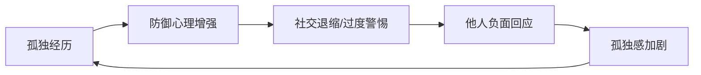

# 情绪急救

状态: TODO
Update Date: 2025年11月14日 10:22
Create Date: 2025年11月14日 10:20

# 《情绪急救：治疗失败、拒绝、内疚等因素导致的各种日常精神伤害的实用策略》版权信息

创建于：2025-11-12 02:41:56

标签：
AI链接笔记
版权信息
书籍基本信息
情绪急救

---

原文：[(anonymous)](https://x-1381123255.cos.ap-beijing.myqcloud.com/%E6%83%85%E7%BB%AA%E6%80%A5%E6%95%91_01_%E7%89%88%E6%9D%83%E4%BF%A1%E6%81%AF.pdf)

📚 **书籍基本信息**

- **书名**：情绪急救：治疗失败、拒绝、内疚等因素导致的各种日常精神伤害的实用策略

- **作者**：（美）温奇

- **出版社**：上海社会科学院出版社

- **出版时间**：2015-08-01

- **ISBN**：9787552009132

⚠️ **版权声明**

- 版权所有侵权必究

# 心理创伤的"情绪急救"：必要性与方法概述

创建于：2025-11-12 02:42:27

标签：
AI链接笔记
情绪急救
心理创伤
自我心理护理

---

原文：[(anonymous)](https://x-1381123255.cos.ap-beijing.myqcloud.com/%E6%83%85%E7%BB%AA%E6%80%A5%E6%95%91_03_%E5%89%8D%E8%A8%80.pdf)

📌 **核心矛盾：身体与心理创伤处理的认知差异**
1. **身体创伤**：普遍具备基础护理知识（如感冒休息、伤口包扎、骨折打石膏）
2. **心理创伤**：对拒绝/孤独/失败等情绪痛苦的应对方法匮乏
- 成年人常回避相关问题或仅建议”与亲友倾诉”
- 缺乏对倾诉有效性的区分判断能力

📂 **心理创伤忽视的根源与危害**

### 一、忽视原因

1. **工具缺失**：缺乏系统性的心理急救方法和工具
2. **专业门槛**：轻度创伤无需/难以寻求专业心理干预
3. **社会认知**：未形成”心理药箱”的日常准备意识

### 二、潜在风险

- 反刍思维→焦虑/抑郁
- 失败/拒绝经历→自卑心理
- 小创伤积累可能发展为严重心理问题

🔧 **情绪急救的价值与定位**
1. **核心作用**：缓解即时痛苦 + 防止问题恶化
2. **适用场景**：日常轻微心理创伤（如被拒绝、职场压力）
3. **专业边界**：无法替代严重心理问题的专业治疗
4. **创新意义**：将心理学研究成果转化为可自我管理的实用技术

📋 **本书架构与目标**
1. **内容设计**：分章节解析常见心理创伤及对应急救技术
2. **使用价值**：构建个人”心理药箱”（含情感创可贴/抗菌药等概念化工具）
3. **目标群体**：普通大众及需要教导孩子情绪管理的家长

# 《如何使用这本书》指南

创建于：2025-11-12 02:42:42

标签：
AI链接笔记
心理伤害因素
阅读指南
自我疗愈

---

原文：[(anonymous)](https://x-1381123255.cos.ap-beijing.myqcloud.com/%E6%83%85%E7%BB%AA%E6%80%A5%E6%95%91_04_%E5%A6%82%E4%BD%95%E4%BD%BF%E7%94%A8%E8%BF%99%E6%9C%AC%E4%B9%A6.pdf)

📚 **全书概览**
- **核心主题**：7种生活中常见的心理伤害因素
- **章节设置**：共7章，每章对应1种心理伤害因素
- **推荐阅读方式**：建议阅读全书内容，即使章节间无直接关联

📑 **章节结构**
1. **第一部分：心理伤害描述**
- 内容：详细阐述每种因素导致的具体心理伤害
- 特点：包含易被忽视的潜在伤害（如孤独对身体健康的长期影响）
- 示例：孤独者可能发展出自我挫败行为模式，无意识推开能减轻痛苦的人

1. **第二部分：治疗方法指导**
    - 内容：提供针对第一部分所述伤害的治疗方案
    - 形式：包含一般治疗指南、”治疗摘要”和”用法用量”等
    - 定位：类比为”家庭心理药箱”，不可替代专业心理医生治疗
    - 重要提示：每个章节末尾均提醒符合条件的读者咨询专业精神卫生专家

🔑 **阅读价值**
- 个人层面：帮助应对紧急心理状况
- 社交层面：识别朋友和家人遇到的心理伤害

# 第一章 拒绝：情绪伤害和日常生活的摩擦伤害

创建于：2025-11-12 02:42:58

标签：
AI链接笔记
拒绝心理
情绪创伤
心理伤害

---

原文：[(anonymous)](https://x-1381123255.cos.ap-beijing.myqcloud.com/%E6%83%85%E7%BB%AA%E6%80%A5%E6%95%91_05_%E7%AC%AC%E4%B8%80%E7%AB%A0%20%E6%8B%92%E7%BB%9D%EF%BC%9A%E6%83%85%E7%BB%AA%E4%BC%A4%E5%AE%B3%E5%92%8C%E6%97%A5%E5%B8%B8%E7%94%9F%E6%B4%BB%E7%9A%84%E6%91%A9%E6%93%A6%E4%BC%A4%E5%AE%B3.pdf)

📚 **目录大纲**

1. 拒绝的普遍性

2. 拒绝的情绪创伤特性

3. 对拒绝影响的认知误区

### 1. 拒绝的普遍性

- **童年阶段**：加入球队被拒、最后一个入选团队、未被邀请参加派对、被小圈子排除、遭受嘲笑或欺负
- **成年阶段**：被约会对象/雇主/朋友拒绝、性要求被配偶拒绝、邻居冷漠对待、家庭成员拒绝被关注

### 2. 拒绝的情绪创伤特性

- **比喻描述**：心理的切割伤和刮擦伤
- **创伤表现**：
    - 撕开情绪表皮，刺入血肉
    - 严重时造成“深长伤口”，需紧急心理救治

### 3. 对拒绝影响的认知误区

- **错误认知**：因经历多样拒绝，故应清晰了解其对情绪、思想和行为的影响
- **实际情况**：大大低估拒绝引发的疼痛及心理创伤

# 拒绝导致的心理创伤：4种类型与影响分析 🧠

创建于：2025-11-12 02:43:14

标签：
AI链接笔记
拒绝心理创伤
情绪痛苦
社交排斥

---

原文：[(anonymous)](https://x-1381123255.cos.ap-beijing.myqcloud.com/%E6%83%85%E7%BB%AA%E6%80%A5%E6%95%91_06_%E6%8B%92%E7%BB%9D%E5%AF%BC%E8%87%B4%E7%9A%84%E5%BF%83%E7%90%86%E5%88%9B%E4%BC%A4.pdf)

### 一、拒绝心理创伤概述

1. **核心定义**
    - 拒绝引发的情绪痛苦会影响思想、诱发愤怒、削弱自尊、动摇归属感
    - 创伤严重程度取决于情境与个体情绪健康水平
    - 未及时干预可能导致”心理感染”，引发并发症
2. **进化心理学根源**
    - 原始社会被群体排斥=生存危机，大脑发展出”社交疼痛预警系统”
    - 脑扫描显示：拒绝与身体疼痛激活相同脑区（可被扑热息痛缓解）

### 二、四大心理创伤类型

### 1. 情绪痛苦

- **强度特征**：即使温和拒绝（如被陌生人排除出扔球游戏）也会引发显著痛苦
- **实验验证**：被试者在虚拟扔球实验中被排斥后，出现情绪低落与自尊下降
- **临床类比**：被描述为”肚子挨拳”或”胸口被捅”，痛苦程度堪比分娩/癌症治疗

### 2. 愤怒与攻击性

- **行为表现**：
✅ 向无辜者发送更响/更长的白噪音
✅ 强迫他人食用4倍量辣酱或难喝饮料
✅ 极端案例：校园枪击案肇事者中87%曾遭受严重排斥
- **社会影响**：美国外科医生联盟报告称，社会排斥比帮派/贫困更易引发青少年暴力

### 3. 受损的自尊

- **认知偏差**：
▶ 个人化：将客观拒绝归因于自身缺陷（如”他们解雇我是因为我无能”）
▶ 以偏概全：从单次拒绝推导出”我永远不会被爱”等极端结论
▶ 过度自责：反复寻找”关键错误举动”（如恋爱失败后纠结”不该喝那杯酒”）
- **案例警示**：安杰洛因失业拒绝产生自我否定，最终导致社交孤立

### 4. 归属感威胁

- **基本需求**：人类对社会接纳有本能需求，长期排斥会引发身心问题
- **典型案例**：大卫（罕见遗传病患者）因外表异常，从童年到大学持续遭受社交排斥，导致社交技能退化与严重自卑
- **干预要点**：需同时处理即时情绪创伤与长期社交能力缺陷

### 三、创伤的潜在风险

1. **短期影响**：理性判断力下降（如失恋者做出跟踪等极端行为）
2. **长期后果**：反复拒绝可能导致攻击性、自伤行为或慢性心理疾病
3. **治疗关键**：及时情绪急救可减少”感染”风险，加速愈合过程

# 如何处理拒绝造成的心理创伤

创建于：2025-11-12 02:43:30

标签：
AI链接笔记
拒绝心理创伤
情绪急救
心理创伤处理

---

原文：[(anonymous)](https://x-1381123255.cos.ap-beijing.myqcloud.com/%E6%83%85%E7%BB%AA%E6%80%A5%E6%95%91_07_%E5%A6%82%E4%BD%95%E5%A4%84%E7%90%86%E6%8B%92%E7%BB%9D%E9%80%A0%E6%88%90%E7%9A%84%E5%BF%83%E7%90%86%E5%88%9B%E4%BC%A4.pdf)

📋 **目录大纲**

1. 需关注的拒绝类型

2. 未处理创伤的风险

3. 无需情绪急救的情况

### 1. 需关注的拒绝类型

- **显著型**：如安杰洛的经历（具体案例未展开）
- **重复型**：如学校/工作场所的欺凌
- **复合型**：兼具显著与重复特点，如大卫常遭同龄人和同学排斥

### 2. 未处理创伤的风险

- 可能产生**深远的负面影响**（未具体说明影响内容）

### 3. 无需情绪急救的情况

- 举例：扔球实验的“幸存者”即使不知是实验，也可能**完全康复**

# 拒绝导致的情绪创伤及一般治疗原则

创建于：2025-11-12 02:43:46

标签：
AI链接笔记
情绪创伤
拒绝心理
心理急救

---

原文：[(anonymous)](https://x-1381123255.cos.ap-beijing.myqcloud.com/%E6%83%85%E7%BB%AA%E6%80%A5%E6%95%91_08_%E4%B8%80%E8%88%AC%E6%B2%BB%E7%96%97%E5%8E%9F%E5%88%99.pdf)

### 一、拒绝导致的4种情绪创伤

- 挥之不去的内心疼痛
- 愤怒和攻击性冲动
- 对自尊的伤害
- 对归属感的伤害

### 二、治疗的重要原则

- ⚠️ 情绪创伤需尽早治疗，避免”感染”和心理并发症
- 注意：本章方法为急救治疗，对严重心理影响可能不足够
- 严重情况需咨询心理健康专业人士（本章最后有指导方针）

### 三、治疗方法分类及作用

### （一）主要疗法（按使用顺序排列）

1. **疗法A：处理自我批判**
    - 目标：安抚情绪痛苦、修复受损自尊
    - 附加作用：减少愤怒和攻击性冲动
2. **疗法B：恢复自我价值**
    - 目标：安抚情绪痛苦、修复受损自尊
    - 附加作用：减少愤怒和攻击性冲动
3. **疗法C：修补社会关系**
    - 目标：修复受到威胁的归属感
    - 附加作用：减少愤怒和攻击性冲动

### （二）备选疗法

- **疗法D：降低敏感度**
    - 注意：可能带来令人不适的情绪副作用

# 疗法A：与自我批判争辩

创建于：2025-11-12 02:44:01

标签：
AI链接笔记
拒绝心理
情绪管理
自我批判

---

原文：[(anonymous)](https://x-1381123255.cos.ap-beijing.myqcloud.com/%E6%83%85%E7%BB%AA%E6%80%A5%E6%95%91_09_%E7%96%97%E6%B3%95A%E4%B8%8E%E8%87%AA%E6%88%91%E6%89%B9%E5%88%A4%E4%BA%89%E8%BE%A9.pdf)

📌 **核心概念**

- 自我批判的危害：夸大责任、加剧痛苦、推迟情绪愈合

- 核心目标：通过客观视角与自我批判争辩，建立对拒绝原因的理性认知

### 一、与自我批判争辩的练习步骤

1. **书面记录**：列出拒绝情境中产生的消极/自我批判想法
2. **针对性反驳**：用客观理由驳倒所有自我批判想法
3. **即时应用**：产生自我批判时立即在心中阐明反驳逻辑

### 二、不同场景的反驳策略

### 2.1 恋爱型拒绝

- **常见非个人原因**：
▶ 无感觉/不来电（如审美偏好差异：喜欢金发vs棕色头发）
▶ 对方个人状态（前任影响、家庭事务、生活方式不合）
▶ 时机问题（婚恋节奏差异、空窗期备胎顾虑）
▶ 对方缺陷（如承诺恐惧、自卑心理、价值观冲突）
- **关键原则**：相信”不是你的错”，拒绝自我归因

### 2.2 职场型拒绝

- **常见非能力原因**：
▶ 岗位匹配度（内部招聘优先、特定技能需求）
▶ 组织文化（排斥异见者、欺凌文化、权力斗争）
▶ 非客观因素（毕业院校、家庭背景等歧视）
- **关键原则**：区分个人绩效与组织动态的关系

### 2.3 社交型拒绝

- **常见非个人原因**：
▶ 群体需求（活动便利性、小圈子排他性）
▶ 关系平衡（友谊精力分配差异、情感需求不匹配）
▶ 兴趣差异（话题单一化导致边缘化）
- **关键原则**：社交排斥≠个人价值否定

### 三、疗法效果与应用

- **主要疗效**：舒缓伤害感、减少自尊损伤、抚慰情绪痛苦
- **次要疗效**：降低愤怒与攻击性冲动
- **用法用量**：拒绝后产生自我批判时立即使用，可重复多次

# 疗法B：恢复自我价值的方法与案例

创建于：2025-11-12 02:44:17

标签：
AI链接笔记
社交焦虑
自我价值恢复
心理干预案例

---

原文：[(anonymous)](https://x-1381123255.cos.ap-beijing.myqcloud.com/%E6%83%85%E7%BB%AA%E6%80%A5%E6%95%91_10_%E7%96%97%E6%B3%95B%E6%81%A2%E5%A4%8D%E4%BD%A0%E7%9A%84%E8%87%AA%E6%88%91%E4%BB%B7%E5%80%BC.pdf)

### 一、疗法核心原理

💡 **自我价值恢复机制**

- 通过强化自身被认可的特质（即使被拒绝者不认可），减轻拒绝伤害并重建自信

- 关键路径：挖掘个人优势 → 创造展示机会 → 获得社交认可 → 提升自我认同

### 二、经典案例：大卫的转变

### 1. 背景与困境

- 患有罕见遗传疾病，长期因外貌被排斥（标签：怪人、弱智、傻瓜）
- 大学初期因社交恐惧不敢主动交流

### 2. 突破口：体育特长

- 核心优势：棒球知识（洋基队铁杆球迷，能精准分析比赛数据）
- 契机：发现早到同学中也有洋基队球迷

### 3. 干预过程

| 阶段 | 行动 | 结果 |
| --- | --- | --- |
| 1. 建立信心 | 心理辅导中强化其棒球专业认知 | “没有人比我了解洋基队” |
| 2. 首次尝试 | 借洋基队季后赛胜利契机主动发言 | 同学击掌认同，开启讨论 |
| 3. 持续互动 | 课前固定讨论棒球话题，化解尴尬（如流口水幽默回应） | 形成稳定社交圈 |
| 4. 身份认同 | 同学主动询问”大卫呢？” | 自我定位转变：”我是大卫，洋基队球迷” |

### 4. 关键成果

- 首次体验”被需要”的归属感
- 社交认可转化为自我价值感：”他们像对待真正的人一样看我”

### 三、恢复自我价值练习（操作指南）

### 1. 自我特质清单

- 列出5个核心优势（优先关联被拒绝场景，如被伴侣拒绝可列”忠诚/体贴”）
- 按重要性排序，选择前2项深入分析

### 2. 深度反思写作（每篇1-2段）

- 分析维度：
✅ 该特质的个人意义
✅ 对人生选择的实际影响
✅ 在自我形象中的权重

### 3. 疗法应用说明

- **适用场景**：遭遇拒绝后立即使用，可重复操作
- **预期效果**：缓解情绪痛苦，重建受损自尊

# 疗法C：修补社交感受

创建于：2025-11-12 02:44:33

标签：
AI链接笔记
社交支持
归属感修复
社交零食

---

原文：[(anonymous)](https://x-1381123255.cos.ap-beijing.myqcloud.com/%E6%83%85%E7%BB%AA%E6%80%A5%E6%95%91_11_%E7%96%97%E6%B3%95C%E4%BF%AE%E8%A1%A5%E7%A4%BE%E4%BA%A4%E6%84%9F%E5%8F%97.pdf)

### 一、社交支持的重要性

1. **核心价值**
    - 缓解拒绝后的压力，恢复受伤的归属感
    - 降低攻击性（实验显示：友好举动可减少被试者攻击行为）
    - 提升自信（青少年/年轻成人与陌生同龄人在线聊天有效）
2. **常见认知偏差**
    - 他人易低估拒绝带来的痛苦（如分娩止痛预期vs实际体验差异）
    - 亲身经历者更能共情（如参加过扔球实验的教师对欺凌更敏感）

### 二、特殊场景下的社交支持

1. **歧视相关排斥**
    - 需从社群获取支持，减少愤怒/抑郁，强化群体认同
    - 抵消主流文化对少数群体的伤害
2. **关系置换原则**
    - 新关系可替代旧关系（适合个性/兴趣时效果更佳）
    - 环境驱动的社交关系（如室友/同事）可能随环境变化自然解散

### 三、重建归属感的方法

1. **寻找适配关系**
    - 评估现有社交圈是否匹配个性/兴趣/生活方式
    - 优先选择有共情能力的支持者（如病友互助小组）
2. **社交零食策略**
    - **核心工具**：亲人照片（实验证明可稳定情绪，优于名人照片）
    - **替代方式**：
        - 回忆积极互动
        - 阅读有意义的邮件/信件
        - 观看亲友视频或接触纪念品

### 四、疗法总结

- **适用场景**：遭遇拒绝或排斥时
- **核心目标**：恢复归属感，减轻愤怒/攻击性
- **附加效果**：舒缓情感痛苦，重建自尊

# 疗法D：自我脱敏 - 心理调节技巧指南

创建于：2025-11-12 02:44:48

标签：
AI链接笔记
自我脱敏疗法
心理调节技巧
拒绝焦虑

---

原文：[(anonymous)](https://x-1381123255.cos.ap-beijing.myqcloud.com/%E6%83%85%E7%BB%AA%E6%80%A5%E6%95%91_12_%E7%96%97%E6%B3%95D%E8%87%AA%E6%88%91%E8%84%B1%E6%95%8F.pdf)

### 1. 核心概念：脱敏的定义与原理

🔍 **基本定义**

- 脱敏是通过反复接触令人不适的情境，逐渐降低其带来的困扰感的心理过程

- 适用场景：约会邀请、求职电话、申请机会、社交破冰等日常拒绝情境

- 注意：不适用于重大拒绝或深刻情感创伤

### 2. 实践案例：脱敏疗法的应用效果

📋 **案例详情**

- **患者情况**：20多岁男性因害怕拒绝不敢接近女性

- **治疗任务**：周末邀请9位女士约会（分3个社交活动进行）

- **关键发现**：

1. 接受”必然被拒绝”的事实后，患者提前获得心理缓冲

2. 首个活动即成功获取2个真实联系方式，无需完成全部任务

3. 患者反馈：”被拒绝也没什么大不了的”

### 3. 实施指南：自我脱敏操作要点

✅ **使用原则**

- **适用范围**：仅限日常轻微拒绝场景（如约会、求职、社交）

- **时间要求**：集中在有限时间内完成（如案例中的周末集中行动）

- **心理准备**：需评估自尊承受力，做好多次被拒的预期

⚠️ **注意事项**

- 避免用于重大情感创伤或深刻拒绝经历

- 需在心理准备充分后启动，避免过度强迫

### 4. 疗法总结：核心价值与效果

💡 **关键收益**

- 形成心理保护层，降低拒绝带来的情绪痛苦

- 快速提升应对类似情境的自信心

- 改变对拒绝的认知评价（从”针对个人”转为”情境常态”）

# 何时咨询心理卫生专业人士

创建于：2025-11-12 02:45:04

标签：
AI链接笔记
心理卫生咨询时机
情绪急救疗法
拒绝心理伤害

---

原文：[(anonymous)](https://x-1381123255.cos.ap-beijing.myqcloud.com/%E6%83%85%E7%BB%AA%E6%80%A5%E6%95%91_13_%E4%BD%95%E6%97%B6%E5%92%A8%E8%AF%A2%E5%BF%83%E7%90%86%E5%8D%AB%E7%94%9F%E4%B8%93%E4%B8%9A%E4%BA%BA%E5%A3%AB.pdf)

📚 **目录大纲**

1. 情绪急救疗法的作用

2. 处理旧拒绝体验的意义

3. 需咨询专业人士的情况

### 1. 情绪急救疗法的作用

- 适用场景：遭受拒绝后
- 核心功能：治疗四类伤害
- 关键价值：减少长期心理并发症风险

### 2. 处理旧拒绝体验的意义

- 核心目标：帮助走上愈合和恢复的道路
- 潜在益处：修复过往心理创伤

### 3. 需咨询专业人士的情况

- 触发条件：拒绝带来的痛苦程度极高
- 具体表现：心理伤口过深
- 核心判断：情绪急救不足以纠正心理伤害

# 第二章 孤独：人际关系的“肌无力”

创建于：2025-11-12 02:45:20

标签：
AI链接笔记
孤独
人际关系质量
情感隔离

---

原文：[(anonymous)](https://x-1381123255.cos.ap-beijing.myqcloud.com/%E6%83%85%E7%BB%AA%E6%80%A5%E6%95%91_14_%E7%AC%AC%E4%BA%8C%E7%AB%A0%20%E5%AD%A4%E7%8B%AC%EF%BC%9A%E4%BA%BA%E9%99%85%E5%85%B3%E7%B3%BB%E7%9A%84%E2%80%9C%E8%82%8C%E6%97%A0%E5%8A%9B%E2%80%9D.pdf)

### 一、时代背景：连接与孤独的悖论

🔗 **矛盾现象**
- 社交媒体实现全球即时连接（可联系数十/数百朋友）
- 约会网站提供多样潜在配偶选择
- 信息浏览与跨地域社交便捷化
- 美国单人家庭占比达27%（超其他家庭类型）

### 二、孤独的本质特征

1. **非单一化表现**
    - 独居者≠必然孤独
    - 已婚/恋爱关系中仍可能孤独
    - 同住者可能因情感疏远产生更强孤独感
2. **核心决定因素**
    - 人际关系质量＞数量
    - 主观情感隔离程度为关键指标

### 三、常见孤独场景分类

📊 **典型情境**
- 通讯录朋友多为泛泛之交（缺乏深厚友谊）
- 有亲密朋友但无爱恋对象
- 职场朝夕相处却情感疏离
- 家族庞大但地理隔离（与关心的人相距远）
- 老年阶段：目睹亲友离世引发孤独

# 孤独与吸烟危害对比及健康影响

创建于：2025-11-12 02:45:35

标签：
AI链接笔记
孤独危害
身心健康
预期寿命

---

原文：[(anonymous)](https://x-1381123255.cos.ap-beijing.myqcloud.com/%E6%83%85%E7%BB%AA%E6%80%A5%E6%95%91_15_%E5%AD%A4%E7%8B%AC%E5%92%8C%E5%90%B8%E7%83%9F%E7%9A%84%E5%8D%B1%E5%AE%B3%E7%9B%B8%E5%90%8C.pdf)

📌 **核心结论**

- 孤独对身心健康的长期伤害不亚于吸烟，可直接减少预期寿命

- 类比：长期孤独 ≈ 每天吸两包”孤独牌香烟”的危害

- 公众对孤独危害的认知不足，导致缺乏干预紧迫感

### 一、孤独对心理健康的影响

1. **情绪与心理问题**
    - 引发情绪痛苦、渴望感
    - 增加抑郁症、自杀倾向风险
    - 导致敌意情绪与睡眠障碍
2. **认知能力下降**
    - 决策能力降低、注意力不集中
    - 判断力减弱
    - 加速阿尔茨海默症发展

### 二、孤独对生理健康的破坏

1. **系统层面影响**
    - 心血管系统：高血压、体重增加、胆固醇升高
    - 内分泌系统：应激激素分泌增多
    - 免疫系统：抵抗力下降（如对流感病毒的防御能力减弱）
2. **具体健康案例**
    - 研究显示：孤独的健康大学生对流感病毒抵抗力显著低于非孤独者

### 三、人际关系的重要性

- 拥有有意义的人际关系是快乐与自我实现的关键
- 长期孤独会损害基本快乐感知，需优先干预

# 孤独的传染性及社会影响

创建于：2025-11-12 02:45:51

标签：
AI链接笔记
心理创伤
孤独传染性
社交网络

---

原文：[(anonymous)](https://x-1381123255.cos.ap-beijing.myqcloud.com/%E6%83%85%E7%BB%AA%E6%80%A5%E6%95%91_16_%E5%AD%A4%E7%8B%AC%E5%85%B7%E6%9C%89%E4%BC%A0%E6%9F%93%E6%80%A7.pdf)

### 一、核心发现：孤独具有传染性

1. **研究结论**
    - 孤独完全符合社交网络中的传染特点
    - 与孤独者接触的个体，研究结束时变得孤独的概率显著增加
2. **传染关键因素**
    - 取决于关系亲密度：关系越好，传染性越强
    - 非亲密圈子也可能发生跨个体传染

### 二、传染机制：社交边缘化的扩散

1. **初始阶段**
    - 孤独者首先被自身社交网络边缘化，孤立程度加深
2. **扩散过程**
    - 密切接触者受影响后同样被边缘化
    - 逐步传遍整个社交网络，形成连锁反应

### 三、现实问题：被忽视的心理创伤

1. **社会认知现状**
    - 日常最易忽视的心理伤害类型
    - 多数人未意识到处理孤独创伤的重要性
2. **应对困境**
    - 缺乏有效处理孤独心理创伤的知识与方法

# 孤独造成的心理创伤：机制、影响与应对

创建于：2025-11-12 02:46:07

标签：
AI链接笔记
孤独心理创伤
社交认知偏差
人际关系肌肉

---

原文：[(anonymous)](https://x-1381123255.cos.ap-beijing.myqcloud.com/%E6%83%85%E7%BB%AA%E6%80%A5%E6%95%91_17_%E5%AD%A4%E7%8B%AC%E9%80%A0%E6%88%90%E7%9A%84%E5%BF%83%E7%90%86%E5%88%9B%E4%BC%A4.pdf)

### 一、孤独的核心困境与影响

### 1. 孤独的双重挑战

- **认知扭曲**：对自我/他人过度挑剔，消极判断人际关系
- **行为封闭**：自我保护倾向加剧社交隔离，形成恶性循环
- **能力退化**：社交技能、共情能力等”人际关系肌肉”弱化

### 2. 关键认知前提

- 孤独非个人过错，却会触发无意识的自我延续机制
- 需以开放心态挑战既定认知，承认自身行为对处境的影响

### 二、痛苦的错误知觉：孤独的认知偏差

### 1. 核心表现

- **普遍性创伤**：40%成年人体验过孤独痛苦，常伴随羞愧自责
- **负面滤镜效应**：
    - 放大社交负面信号（如莱纳尔坚信棋友因年龄拒绝交往）
    - 降低对现有关系质量的评价（实验显示孤独者对互动评分更低）
- **双重标准困境**：
    - 主观感到”被视而不见”
    - 客观上孤独状态易被他人识别并产生负面判断

### 2. 社会认知后果

- 孤独者被视为缺乏吸引力、智力较低（与实际能力无关）
- 外表吸引力无法抵消孤独标签的负面影响
- 形成”隐形斗篷”效应：既阻碍建立新关系，又破坏现有关系

### 三、自我封闭的预言：孤独的行为循环

### 1. 触发情境

- 人生转折期：大学新生、离婚、失业、搬迁等
- 长期孤独后：调整期已过仍深陷情感痛苦

### 2. 恶性循环机制

### 3. 典型案例

- **塞丽娜现象**：减肥后仍延续”被忽视”认知，约会中表现紧张导致失败
- **自我实现预言**：因恐惧拒绝而避免尝试，反而证实”不被喜欢”的假设

### 四、人际关系肌肉萎缩：社交能力退化

### 1. 能力弱化表现

- **共情缺失**：无法准确理解他人需求（如阿尔班送花却放厨房台面）
- **技能生疏**：长期不用导致社交技巧退化，类似肌肉失用性萎缩
- **认知盲区**：意识不到能力弱化，将失败归咎于外部因素

### 2. 重建难点

- 需同时提升多项社交能力（如莱纳尔需学习闲聊、视角转换）
- 易陷入”过度努力-表现失常”的二次困境
- 缺乏使用经验导致技能学习曲线陡峭

### 五、走出孤独的关键原则

1. **认知重构**：识别无意识的负面偏见，收集客观证据
2. **小步实践**：从低风险社交行为开始锻炼”人际关系肌肉”
3. **视角转换**：刻意练习从他人角度理解情境（如分析斯坦利拒绝莱纳尔的真实原因）
4. **接纳过程**：允许初期失败，将其视为技能训练的必要反馈

# 如何治疗孤独造成的心理创伤

创建于：2025-11-12 02:46:23

标签：
AI链接笔记
孤独心理创伤
暂时性孤独
长期孤独

---

原文：[(anonymous)](https://x-1381123255.cos.ap-beijing.myqcloud.com/%E6%83%85%E7%BB%AA%E6%80%A5%E6%95%91_18_%E5%A6%82%E4%BD%95%E6%B2%BB%E7%96%97%E5%AD%A4%E7%8B%AC%E9%80%A0%E6%88%90%E7%9A%84%E5%BF%83%E7%90%86%E5%88%9B%E4%BC%A4.pdf)

### 一、孤独的两种类型

1. **暂时性孤独**
    - 特点：持续时间短，可自行恢复
    - 案例：夏令营中孩子几小时或几天内建立新友谊
2. **长期孤独**
    - 特点：长时间无法改变社交与情感隔离状态
    - 风险：可能引发心理创伤，需及时干预

### 二、干预时机

- ⚠️ 关键信号：陷入长期孤独且感到无力改变现状
- 处理原则：此时治疗孤独引起的创伤迫在眉睫

# 孤独的心理创伤治疗原则与方法

创建于：2025-11-12 02:46:38

标签：
AI链接笔记
心理创伤
孤独治疗
社交能力提升

---

原文：[(anonymous)](https://x-1381123255.cos.ap-beijing.myqcloud.com/%E6%83%85%E7%BB%AA%E6%80%A5%E6%95%91_19_%E4%B8%80%E8%88%AC%E6%B2%BB%E7%96%97%E5%8E%9F%E5%88%99.pdf)

📌 **一、核心治疗目标**

1. 纠正错误知觉：识别并改变导致自我封闭的认知偏差

2. 强化社交能力：提升建立新连接、深化现有关系的能力

3. 缓解情绪困扰：减少孤独引发的持续心理痛苦（尤其适用于社交受限人群）

📋 **二、疗法分类与适用场景**

### （一）知觉与行为纠正类

1. **疗法A：挑战负面看法**
    - 目标：修正孤独导致的认知扭曲
2. **疗法B：识别自我封闭行为**
    - 目标：打破长期孤独形成的自我孤立模式

### （二）社交能力强化类

1. **疗法C：站在他人角度考虑**
    - 作用：增强共情能力，促进人际理解
2. **疗法D：加深情感粘合**
    - 作用：提升现有关系的亲密感与连接质量
3. **疗法E：创造社交联系的机会**
    - 作用：开拓新的社交参与途径

### （三）情绪痛苦缓解类

1. **疗法F：收养动物**
    - 适用人群：因地理隔离、健康或流动性限制导致社交选择有限者

⏱️ **三、治疗关键原则**

1. **及时性**：社交肌肉越缺乏锻炼越易萎缩，需尽早干预

2. **持续性**：需重复实践并保持耐心，避免急于求成导致二次伤害

3. **局限性认知**：部分孤独需专业干预，严重时应咨询心理健康专家

# 疗法A：移除消极负面的有色眼镜 👓

创建于：2025-11-12 02:46:53

标签：
AI链接笔记
社交焦虑
负面思维调整
孤独感克服

---

原文：[(anonymous)](https://x-1381123255.cos.ap-beijing.myqcloud.com/%E6%83%85%E7%BB%AA%E6%80%A5%E6%95%91_20_%E7%96%97%E6%B3%95A%E7%A7%BB%E9%99%A4%E6%B6%88%E6%9E%81%E8%B4%9F%E9%9D%A2%E7%9A%84%E6%9C%89%E8%89%B2%E7%9C%BC%E9%95%9C.pdf)

### 一、疗法核心目标

- 挑战孤独导致的扭曲观念
- 避免自我封闭社交行为
- 建立健康社交关系

### 二、三大关键行动策略

### 1. 战胜悲观！

- **问题表现**：社交前自动产生负面场景预设（如派对尴尬、被排斥）
- **解决方法**：刻意视觉化合理成功场景
    - 假设社交对象友好热情
    - 制定具体互动计划（如与熟人深入交流）
- **案例**：80岁棋手莱纳尔通过主动寒暄，成功与俱乐部成员建立联系

### 2. 不要胡乱猜疑！

- **问题表现**：默认他人对自己持最坏看法
- **典型误区**：
    - 托比因未收到邮件邀请认定友谊破裂（实为邮件被拦截）
    - 塞丽娜认为男性只关注外表（实际因自我封闭导致交往失败）
- **解决方法**：
    - 用过往友谊历史平衡当下怀疑
    - 向内心怀疑主义宣战，给予新关系信任空间

### 3. 采取行动！

- **问题认知**：孤独者易陷入”被动受害者”心态
- **行动步骤**（社交联系识别练习）：
    1. 整理联系人列表（电话/邮件/社交媒体）
    2. 标记久未联系人员及上次互动细节
    3. 按好感度排序，每周主动联系1-2人并尝试约见
    4. 通过活动网站（如Meetup）探索兴趣社群
    5. 确定3个目标活动类型（读书俱乐部/运动团体等）

### 三、治疗摘要

- **用法用量**：全面使用，必要时重复治疗直至社交生活恢复活力
- **主要疗效**：纠正知觉错误，避免自我实现的负面预言
- **次要疗效**：减少精神痛苦

# 疗法B：识别与改善自我挫败行为

创建于：2025-11-12 02:47:09

标签：
AI链接笔记
社交焦虑
自我挫败行为
行为识别

---

原文：[(anonymous)](https://x-1381123255.cos.ap-beijing.myqcloud.com/%E6%83%85%E7%BB%AA%E6%80%A5%E6%95%91_21_%E7%96%97%E6%B3%95B%E6%89%BE%E5%87%BA%E4%BD%A0%E7%9A%84%E8%87%AA%E6%88%91%E6%8C%AB%E8%B4%A5%E8%A1%8C%E4%B8%BA.pdf)

### 一、自我挫败行为的形成机制

🔄 **自我实现的预言循环**
- 孤独导致社交时的谨慎怀疑 → 他人感知后回避 → 验证初始负面判断 → 强化自我挫败模式
- 恐惧驱动的行为反而引发负面结果（如过度防御导致关系破裂）

### 二、自我挫败行为的识别方法

1. **事后反思法**
    
    ▶ 社交焦虑消退后回顾：如”昨天若主动与陌生人交流可能更好”
    
    ▶ 关键信号：事后产生”本可以…“的遗憾感
    
2. **模式识别法**
    
    ▶ 警惕跨场景重复行为：如总是拒绝社交邀请/约会时沉默寡言
    
    ▶ 干预时机：在行为发生前自我提醒倾向，及时制止
    
3. **后果倒推法**
    
    ▶ 接受前提：部分行为对自身无益
    
    ▶ 分析工具：判断言行是否引发”意想不到的负面后果”
    

### 三、典型自我挫败行为案例

📌 **塞丽娜的案例**

- 行为1：极少询问约会对象情况 → 对方认为被忽视

- 行为2：约会时因紧张而不笑 → 传递负面情绪

- 认知转变：”他们一定以为我不喜欢他们” → 意识到行为与结果的关联

📌 **常见行为清单**

- 社交回避：找借口拒绝邀请、以”没准备好”为由缺席聚会

- 沟通障碍：对话中不提问、回答生硬简短、滔滔不绝忽略他人

- 非语言信号：双臂抱胸、假装看手机、面部表情僵硬

- 过度暴露：向初识者倾诉缺点和不安全感

### 四、改善练习与步骤

1. **自我诊断练习**
    
    ▶ 列出至少3个自我挫败行为（含疏忽型，如忘记表达兴趣）
    
    ▶ 示例：”我总是在团队会议上不发言，导致同事认为我不投入”
    
2. **预防执行计划**
    
    ▶ 社交前：阅读行为列表，设定注意力锚点
    
    ▶ 社交中：实时监控预设行为，逐步调整（非一次性杜绝）
    
    ▶ 社交后：记录改进点与未改善项，用于下轮优化
    

### 五、疗法核心要点

💊 **用法用量**

- 适用场景：社交互动失败后复盘 + 重要社交前预防

- 关键动作：持续记录→反思→调整→实践

🎯 **预期疗效**

- 主要：改善社交/浪漫关系质量，纠正错误知觉

- 次要：减少因社交挫败导致的精神痛苦

# 疗法C：换位思考 - 社交肌肉训练指南 🧠

创建于：2025-11-12 02:47:24

标签：
AI链接笔记
换位思考
社交肌肉训练
人际关系改善

---

原文：[(anonymous)](https://x-1381123255.cos.ap-beijing.myqcloud.com/%E6%83%85%E7%BB%AA%E6%80%A5%E6%95%91_22_%E7%96%97%E6%B3%95C%E6%8D%A2%E4%BD%8D%E6%80%9D%E8%80%83.pdf)

### 一、换位思考的核心价值

- **定义**：成功”给予”前需先”接受”他人视角的思维模式
- **功能**：
    1. 了解对方优先级与动机，预测行为反应
    2. 提升协商合作成功率，促进战略制定与沟通
    3. 表达同情心，有效帮助他人
- **风险**：孤独感会削弱该能力，导致社交失误（过度急切/漠然）

### 二、三大常见换位思考失误

### 1. 需要时未进行换位思考

- **表现**：未主动站在对方角度考虑（如幽默表达忽视他人感受）
- **案例**：阿尔班用”另一个女人”形容妻子，未察觉对方反感

### 2. 过度坚持自身观点

- **表现**：对他人看法重视不足，将误解归咎于接收方
- **案例**：电子邮件沟通中，发送者高估接收方对嘲讽语气的辨别能力
- **纠正方法**：预设接收方视角解读信息（表情符号非有效解决方案）

### 3. 依赖错误参考信息

- **表现**：优先使用成见/八卦而非面部表情等有效线索
- **案例**：
    - 认为他人与自己相似时：以自我为参考点
    - 认为差异较大时：依赖刻板印象（如送23双羊毛袜而非Kindle）

### 三、亲密关系中的特殊挑战

- **悖论**：相处时间越长越易忽视换位思考
- **根源**：过度自信导致缺乏深入思考
- **性别差异应对**：
    - 女性：避免占据过多表达空间，鼓励伴侣重新说明
    - 男性（若更擅长表达）：采取类似包容策略

### 四、实践指南

- **核心问题**：”别人的看法可能和我们有什么不同？”
- **思考维度**：
    1. 对方的优先事项与喜好
    2. 关系历史背景
    3. 当前情境因素
- **时间投入**：事前几分钟思考 > 事后几小时争执

### 五、治疗摘要

- **用法用量**：持续练习，不因初期失败气馁
- **主要疗效**：重建社交肌肉，改善交往质量，增强人际关系
- **次要疗效**：减少精神痛苦

# 疗法D：深化情感联系的移情技巧指南

创建于：2025-11-12 02:47:40

标签：
AI链接笔记
情感沟通
移情技巧
换位思考训练

---

原文：[(anonymous)](https://x-1381123255.cos.ap-beijing.myqcloud.com/%E6%83%85%E7%BB%AA%E6%80%A5%E6%95%91_23_%E7%96%97%E6%B3%95D%E6%B7%B1%E5%8C%96%E4%BD%A0%E7%9A%84%E6%83%85%E6%84%9F%E8%81%94%E7%B3%BB.pdf)

### 一、核心概念与现状

1. **移情的定义**
    - 站在他人角度理解情感体验，需结合换位思考+深入探寻对方思维习惯与处境
    - 关键：避免高估自身共情能力，需系统训练
2. **社会现状警示**
    - 📉 大学生同情能力30年大幅下降，反映社会共情能力弱化趋势
    - 多数人需通过刻意练习提升移情技巧

### 二、实践方法：三步移情训练法

### 1. 情境代入：深度模拟他人处境

- **操作要点**：
✅ 持续使用”情感罗盘”，直至准确判定对方感受（非短暂想象）
✅ 结合环境细节：人物关系、时间节点、情绪背景、潜在痛苦/疾病

### 2. 背景分析：把握情感现状

- **关键问题**：
    - 对方的核心期望是什么？
    - 事件发生前的关键时间线中，对方可能经历了什么？
    - **案例**：阿尔班通过设想妻子2小时等待中的心理活动（从期待→失望→发现礼物时的复杂情绪），理解其愤怒根源

### 3. 有效传达：将洞察转化为沟通

- **核心原则**：避免”厨房台面式表达”（如阿尔班将礼物随意放置）
    - **沟通公式**：
    “我意识到你可能感到[情绪]，因为[具体情境]，对吗？”

### 三、经典案例解析：阿尔班与布兰卡的情人节冲突

1. **矛盾焦点**
    - 阿尔班：认为”买礼物=心意到位”，忽略呈现方式
    - 布兰卡：因礼物被随意放置，产生”被忽视”的二次伤害
2. **解决路径**
    - 第一步：代入妻子视角→发现”未被看见的期待”
    - 第二步：还原时间线→理解2小时等待中的情绪积累
    - 第三步：道歉+补偿行动→修复情感裂痕

### 四、效果与应用

1. **核心疗效**
    - 重建社交肌肉，强化情感纽带（婚姻/家庭/友谊）
    - 减少人际关系中的误解与精神痛苦
2. **实践建议**
    - 用法用量：全程治疗+日常高频练习，允许初期失败
    - 最佳模式：双方共同提升，单方努力亦有显著效果

# 疗法E：创造社交联系的机会

创建于：2025-11-12 02:47:56

标签：
AI链接笔记
疗法E
社交联系
孤独克服

---

原文：[(anonymous)](https://x-1381123255.cos.ap-beijing.myqcloud.com/%E6%83%85%E7%BB%AA%E6%80%A5%E6%95%91_24_%E7%96%97%E6%B3%95E%E5%88%9B%E9%80%A0%E7%A4%BE%E4%BA%A4%E8%81%94%E7%B3%BB%E7%9A%84%E6%9C%BA%E4%BC%9A.pdf)

### 一、孤独的核心困境

- 社交参与障碍：对新活动/社会团体犹豫，害怕独自出现
- 负面认知循环：因孤独感到羞耻 → 更不愿社交 → 加剧孤独
- 典型场景不适：陌生场合不自在、痛恨独自旅行、担心被视为”失败者”/“独行侠”

### 二、突破策略：设定更大目标

1. **目标转移法**
    - 原理：通过附加目标分散社交焦虑，聚焦任务而非自我感受
    - 实例：
    ✅ 为写博客/研究参加快速相亲
    ✅ 为创作摄影作品独自旅行
    ✅ 为铁人三项训练加入运动小组
2. **注意力聚焦效果**
    - 减少不安全感和害羞
    - 提升行动专注度（如记录相亲过程、制作旅行摄影集）
    - 强化目标达成动力

### 三、社交联系的实践途径

### （一）互联网工具

1. **虚拟社交平台**
    - 代表案例：”第二人生”（secondlife.com）
    ➤ 功能：3D虚拟世界，支持自定义身份（性别/年龄/能力）、社交互动（聊天/交友/恋爱）、虚拟生活（做生意/建家园）
    - 核心优势：提供现实中无法实现的互动方式
2. **线上转线下模式**
    - 网恋/交友潜力：已成为第二大情侣见面方式（仅次于朋友介绍）
    - 场景替代：超越酒吧/俱乐部等传统浪漫场所，甚至取代超市偶遇

### （二）志愿服务

1. **双重价值**
    - 利他层面：帮助他人减少孤独感
    - 自我提升：增强自我价值感、被需要感
2. **社交改善机制**
    - 降低陌生人交往恐惧
    - 专注助人目标以缓解害羞和不安全感

### 四、治疗概要

- **用法用量**：根据需要全程治疗，必要时重复使用
- **核心疗效**：减少精神痛苦、增加社交机会
- **次要疗效**：强化社交能力（”社交肌肉”）

# 疗法F：收养宠物的心理疗愈价值

创建于：2025-11-12 02:48:11

标签：
AI链接笔记
宠物疗法
孤独感缓解
心理康复

---

原文：[(anonymous)](https://x-1381123255.cos.ap-beijing.myqcloud.com/%E6%83%85%E7%BB%AA%E6%80%A5%E6%95%91_25_%E7%96%97%E6%B3%95F%E6%94%B6%E5%85%BB%E4%B8%80%E4%B8%AA%E5%A5%BD%E6%9C%8B%E5%8F%8B.pdf)

### 一、核心概念

🐾 **疗法定义**

通过领养宠物（如狗、猫）抚慰孤独心灵，尤其适用于社交受限人群（行动不便/地理隔离/社交障碍者）

### 二、宠物疗愈优势

### 1. 狗的独特价值

- **情绪支持**：缓解独居者/老年人孤独感，助力创伤后应激障碍等心理康复
- **社交桥梁**：以宠物为话题促进人际连接（例：”你的狗太可爱了！它叫什么名字？”）
- **科学验证**：研究显示孤独者单独与狗相处时，孤独感降低效果优于与他人共享一只狗

### 2. 猫的补充作用

- **陪伴功能**：虽研究较少，但同样具备陪伴价值
- **养护优势**：比狗更易照顾，适合偏好居家生活的人群

### 三、实施与注意事项

- **适用条件**：需具备照顾宠物的责任能力
- **疗法效果**：核心疗效为减少精神痛苦

# 何时咨询心理卫生专业人士

创建于：2025-11-12 02:48:27

标签：
AI链接笔记
心理卫生咨询时机
情绪急救技术
心理健康求助指南

---

原文：[(anonymous)](https://x-1381123255.cos.ap-beijing.myqcloud.com/%E6%83%85%E7%BB%AA%E6%80%A5%E6%95%91_26_%E4%BD%95%E6%97%B6%E5%92%A8%E8%AF%A2%E5%BF%83%E7%90%86%E5%8D%AB%E7%94%9F%E4%B8%93%E4%B8%9A%E4%BA%BA%E5%A3%AB.pdf)

📚 **目录大纲**

1. 情绪急救技术的作用

2. 需立即咨询专业人士的情况

3. 建议咨询专业人士的其他情况

### 1. 情绪急救技术的作用

- 舒缓孤独造成的情感痛苦
- 纠正破坏情感与社会关系的观念和行为
- 为社会交往提供新机遇

### 2. 需立即咨询专业人士的情况

⚠️ **紧急情况**（出现以下任一情况时）：

- 情绪痛苦严重，产生伤害自己或他人的想法

- 出现自杀倾向

- 处理方式：立刻寻求心理健康专家帮助或前往最近的急诊室

### 3. 建议咨询专业人士的其他情况

（未自残但存在以下情况时）：

- 感到过于绝望或气馁，无法应用情绪急救治疗

- 已尝试情绪急救疗法，但均告失败

- 专业帮助内容：评估现状、找出阻碍恢复健康的因素、提供必要的情感支持

# 第三章 丧失：与精神创伤带伤前进

创建于：2025-11-12 02:48:42

标签：
AI链接笔记
精神创伤
创伤后成长
心理恢复

---

原文：[(anonymous)](https://x-1381123255.cos.ap-beijing.myqcloud.com/%E6%83%85%E7%BB%AA%E6%80%A5%E6%95%91_27_%E7%AC%AC%E4%B8%89%E7%AB%A0%20%E4%B8%A7%E5%A4%B1%EF%BC%9A%E4%B8%8E%E7%B2%BE%E7%A5%9E%E5%88%9B%E4%BC%A4%E5%B8%A6%E4%BC%A4%E5%89%8D%E8%BF%9B.pdf)

### 一、丧失与创伤的基本认知

1. **定义与影响**
    - 丧失与创伤是生活中不可避免的部分，可能破坏生活并留下心理创伤（如失去亲人、暴力受害、疾病等）
    - 愈合需“重新调整自我”，如同断骨接续般拼凑破碎生活
2. **严重程度差异**
    - **重度创伤**：需专业心理干预（如危及生命事件），本章不适用此类情况
    - **轻度丧失**：如失业、朋友争吵、祖辈去世等，通常可自行恢复心理平衡
3. **主观影响因素**
    - 相同事件对不同人影响不同，取决于具体情境（例：失业导致无家可归 vs 仅收入减少）

### 二、创伤恢复的核心挑战与价值

1. **共同挑战**
    - 需“重新拼接心理断片”，将生活碎片组装为功能齐全的整体
2. **创伤后成长**
    - 治疗不仅加速恢复，还可能带来积极改变：提升人际关系价值、增强目标意识、提高生活满意度

### 三、创伤恢复的可控与不可控因素

1. **不可控变量**
    - 事件严重程度、基本心理状态、过往创伤史等
2. **可控变量**
    - 对创伤程度及挑战的清醒认知，主动应用情感急救疗法

# 丧失与精神创伤的心理伤口及恢复

创建于：2025-11-12 02:48:58

标签：
AI链接笔记
心理创伤
身份认同
悲伤恢复

---

原文：[(anonymous)](https://x-1381123255.cos.ap-beijing.myqcloud.com/%E6%83%85%E7%BB%AA%E6%80%A5%E6%95%91_28_%E4%B8%A7%E5%A4%B1%E5%92%8C%E7%B2%BE%E7%A5%9E%E5%88%9B%E4%BC%A4%E9%80%A0%E6%88%90%E7%9A%84%E5%BF%83%E7%90%86%E4%BC%A4%E5%8F%A3.pdf)

📚 **目录大纲**

1. 心理伤口的三大类型

2. 生活被打断：情绪困扰的冲击

3. 身份被改变：自我定义的挑战

4. 信念被切断：世界观的崩塌与重建

5. 人际关系被断开：与他人连接的障碍

### 1. 心理伤口的三大类型

- **自我认知创伤**：威胁自我认知、个体角色和认同感
- **世界观创伤**：挑战基本价值观与信仰体系
- **人际连接创伤**：难以维持有意义的关系与活动

### 2. 生活被打断：情绪困扰的冲击

- **初期反应**
    
    ✅ 生活瘫痪：失去思考与自我照顾能力（如吃饭、洗澡）
    
    ✅ 痛苦的”第一次”：失去某人后的首餐、创伤后的首晚等
    
    ✅ 情绪低谷：悲伤强度可能超过临床抑郁症，但属正常心理反应
    
- **恢复特点**
    
    ⏳ 时间是关键因素：通常6个月后开始自我调整
    
    ⚠️ 风险：若未调整，可能陷入”创伤定义自我”的困境
    

### 3. 身份被改变：自我定义的挑战

- **核心影响**
    
    个体角色与自我定位被颠覆（如职业身份、身体完整性）
    
- **案例：格兰特的故事**
    
    车祸失去双腿后，他拒绝承认”肢体残破的自己”，认为”过去的我已死”
    
- **恢复关键**
    
    重新定义身份，找回兴趣、创造力与热情
    

### 4. 信念被切断：世界观的崩塌与重建

- **世界观的作用**
    
    提供意义感、指引行动（如”凡事有因”、”世界公平”等）
    
- **创伤后的信念危机**
    
    ❓ 常见疑问：”为什么是我？”“如何避免悲剧？”
    
    ⏳ 恢复时间：多数人6个月内尝试合理化，部分人长期无法释怀
    
- **重建意义**
    
    越早整合创伤经验，越易摆脱消沉，降低PTSD风险
    

### 5. 人际关系被断开：与他人连接的障碍

- **典型表现**
    
    🔄 沉迷回忆：与逝者对话、保留其习惯
    
    🚫 社交退缩：拒绝新关系，视之为对逝者的背叛
    
- **案例**
    
    玛克辛：丈夫去世后断绝社交，坚持独自赴10年前约定的旅行
    
    西恩：表弟牺牲后沉迷9·11资料，退出家族聚会
    
- **恢复方向**
    
    重新投入当下关系，避免被过去定义
    

# 如何治疗丧失和心理创伤造成的心理伤口

创建于：2025-11-12 02:49:14

标签：
AI链接笔记
创伤后应激障碍
心理创伤治疗
心理伤口修复

---

原文：[(anonymous)](https://x-1381123255.cos.ap-beijing.myqcloud.com/%E6%83%85%E7%BB%AA%E6%80%A5%E6%95%91_29_%E5%A6%82%E4%BD%95%E6%B2%BB%E7%96%97%E4%B8%A7%E5%A4%B1%E5%92%8C%E5%BF%83%E7%90%86%E5%88%9B%E4%BC%A4%E9%80%A0%E6%88%90%E7%9A%84%E5%BF%83%E7%90%86%E4%BC%A4%E5%8F%A3.pdf)

### 一、创伤的影响

- 打破生活
- 蹂躏人际关系
- 颠覆自我认同

### 二、治疗前提

走出创伤引起的铺天盖地的情绪困扰

### 三、专业求助指征

1. 悲剧深刻
2. 事件发生几年后未恢复
3. 出现创伤后应激障碍症状，如：
    - 侵入性闪回
    - 噩梦
    - 情绪麻木
    - 易变和暴躁

### 四、本章治疗方法说明

可提供帮助，但需注意上述专业求助指征

# 一般治疗原则：心理创伤与恢复疗法

创建于：2025-11-12 02:49:30

标签：
AI链接笔记
心理创伤治疗
情绪管理
自我认同重建

---

原文：[(anonymous)](https://x-1381123255.cos.ap-beijing.myqcloud.com/%E6%83%85%E7%BB%AA%E6%80%A5%E6%95%91_30_%E4%B8%80%E8%88%AC%E6%B2%BB%E7%96%97%E5%8E%9F%E5%88%99.pdf)

### 一、心理创伤的影响

- **情绪痛苦**：铺天盖地的痛苦感受
- **自我认同破坏**：基本认同感及生活角色受损
- **信仰体系动摇**：世界观和价值观受到挑战
- **人际关系挑战**：维持重要人际关系的能力下降

### 二、治疗原则与顺序

### 1. 疗法A：舒缓情绪上的痛苦

- **核心目标**：管理情绪痛苦
- **关键内容**：提供情绪管理指导，讨论阻碍精神恢复的常见谬误
- **适用阶段**：心理调整初期

### 2. 疗法B：恢复失去的“自我”

- **核心目标**：重建自我认同和身份
- **关键内容**：重新连接生活各方面（家庭/工作/学习）
- **使用条件**：仅在回归正常生活状态后使用一次

### 3. 疗法C：探寻悲剧的意义

- **核心目标**：寻找事件意义并从中获益
- **使用前提**：
    1. 需先进行一定研究
    2. 初始痛苦消退后
    3. 感情上足以接受时使用

### 三、注意事项

⚠️ 若痛苦程度过高导致无法完成练习，请参考结尾部分关于寻求精神健康专业人士帮助的建议

# 疗法A：以个人方式舒缓情绪痛苦

创建于：2025-11-12 02:49:46

标签：
AI链接笔记
创伤后应激障碍
情绪痛苦舒缓
个人化应对方式

---

原文：[(anonymous)](https://x-1381123255.cos.ap-beijing.myqcloud.com/%E6%83%85%E7%BB%AA%E6%80%A5%E6%95%91_31_%E7%96%97%E6%B3%95A%E4%BB%A5%E4%BD%A0%E7%9A%84%E6%96%B9%E5%BC%8F%E8%88%92%E7%BC%93%E6%83%85%E7%BB%AA%E4%B8%8A%E7%9A%84%E7%97%9B%E8%8B%A6.pdf)

### 一、背景与核心观点

- **现实案例**：”9·11事件”后，部分创伤者拒绝谈论经历（如被碎片砸伤的年轻人）
- **核心发现**：处理创伤的”标准方法”（如必须谈论事件、五阶段理论）多不正确，个人倾向是关键

### 二、对传统创伤处理观念的批判

1. **错误观念列举**
    - ❌ “五个阶段”理论（否认→愤怒→讨价还价→抑郁→接受）
    - ❌ “必须表达情绪，封存危险”的常识
    - ❌ 危急事件压力情况汇报（CISD）：强制创伤者尽早讨论细节
2. **科学依据**：记忆形成机制
    - 强烈情绪未平息时回忆痛苦经历，会强化记忆与情感的关联，增加破坏力

### 三、个人化应对方式的有效性

1. **核心原则**：无统一”正确”方式，应根据个人倾向选择
    - ✅ 想谈论则找人倾诉
    - ✅ 不想谈论则避免逼迫自己
2. **研究佐证（”9·11”线上研究）**
    - 参与者：2000+人，3/4分享感受，1/4未分享
    - 结果：2年后，**不愿分享者**PTSD症状发生率更低；发帖越长，心理状态越差

### 四、实践建议

1. **尊重自然倾向**
    - 主动告知亲友是否希望讨论相关话题
    - 避免接触创伤提醒信息（如”9·11”患者选择埋头看杂志、不参与闲聊）
2. **替代方案**
    - 缺乏社交支持时：写信给逝者，表达未说的情感
3. **终极疗愈因素**：时间是最有效的治疗

### 五、疗法摘要

- **用法用量**：事件后尽快使用，确定是否与他人交流感受
- **疗效**：管理和降低情绪痛苦

# 疗法B：恢复"自我"迷失的一面

创建于：2025-11-12 02:50:02

标签：
AI链接笔记
自我恢复疗法
创伤后心理重建
自我认同修复

---

原文：[(anonymous)](https://x-1381123255.cos.ap-beijing.myqcloud.com/%E6%83%85%E7%BB%AA%E6%80%A5%E6%95%91_32_%E7%96%97%E6%B3%95B%E6%81%A2%E5%A4%8D%E4%BD%A0%E2%80%9C%E8%87%AA%E6%88%91%E2%80%9D%E8%BF%B7%E5%A4%B1%E7%9A%84%E4%B8%80%E9%9D%A2.pdf)

📌 **核心概念**

- **定义**：帮助个体在创伤事件后，找回因回避行为而丢失的自我身份、生活角色及有意义的品质

- **问题根源**：创伤后长期回避与逝者相关的人/事/活动，导致切割生活重要部分，形成自我认同缺失

### 🔍 问题表现（案例：玛克辛）

- **创伤前**：活跃社交、露营/徒步爱好者、善于讲故事、领导者等
- **创伤后**：停止所有活动、断绝社交、生活空虚10年，丢失冒险/户外爱好者等核心特质

### 📝 恢复练习（6步框架）

### 1. 列创伤前的正向特质（至少10项）

- **示例**：忠诚、热情、冒险、自信、户外爱好者、露营专家、善于讲故事等

### 2. 筛选与现状脱节的特质

- **玛克辛案例**：冒险、领导者、户外爱好者、露营专家、善于讲故事等

### 3. 分析脱节原因（针对每项特质）

- **示例**：冒险精神需与丈夫共享→失去伴侣后认为冒险失去价值

### 4. 制定恢复方案（针对每项特质）

- **关键原则**：循序渐进，寻找替代连接（如与老朋友短途旅行替代独自冒险）
- **案例参考**：用轮椅篮球替代普通篮球（适用于肢体残疾者）

### 5. 按可行性与情感舒适度排序

### 6. 设定目标并逐步实施

### ⚠️ 注意事项

- 若事件仍引发极端情绪困扰，需心理准备后再进行
- 允许按自我节奏推进，避免强迫

### 💊 治疗摘要

- **用法**：持续使用至恢复家庭/工作/学习正常生活
- **疗效**：恢复重要身份认同、重建人际关系；次要疗效：减少情绪痛苦

# 疗法C：寻找悲剧的意义

创建于：2025-11-12 02:50:17

标签：
AI链接笔记
创伤恢复
意义疗法
反事实思维

---

原文：[(anonymous)](https://x-1381123255.cos.ap-beijing.myqcloud.com/%E6%83%85%E7%BB%AA%E6%80%A5%E6%95%91_33_%E7%96%97%E6%B3%95C%E5%AF%BB%E6%89%BE%E6%82%B2%E5%89%A7%E7%9A%84%E6%84%8F%E4%B9%89.pdf)

📚 **疗法C核心概述**

- **定义**：通过寻找丧失和创伤的意义实现心理恢复，基于弗兰克尔《活出生命的意义》理论

- **重要性**：数千项研究证实其对创伤后恢复的关键作用，需通过意义重构心理碎片

### 🔍 意义寻找的两阶段模型

1. **发现意义**
    - 阶段特点：将事件纳入现有信念体系以理解其合理性
    - 时间窗口：通常6个月内开始，可能持续数月至数年
    - 效果：促进情感与心理层面的初步恢复
2. **发现效益**
    - 阶段特点：从创伤中识别积极改变（如自我成长、目标重构）
    - 时间条件：仅出现于精神复苏后期，需足够时间沉淀
    - 效果：提升长期心理健康水平，优于未发现效益者

### 🎯 实践方法：意义寻找策略

### 1. 直接行动法

- **核心逻辑**：针对创伤事件采取建设性行动
- **典型案例**：
    - 罕见病家属推动疾病防治意识
    - 暴力幸存者分享经验以帮助他人
    - 战争残疾军人支持新伤士兵康复
    - “9·11”遇难者家属参与纪念场所设计

### 2. 思维转换练习（分阶段实施）

| 练习类型 | 适用阶段 | 核心方法 | 关键效果 |

|—————-|————————-|———————————–|—————————|

| **“为什么”提问** | 初步情感恢复后 | 用”为什么发生”替代”怎么会发生” | 激活哲学思考，扩大视角 |

| **反事实思维** | 情绪稳定后 | 结合两种假设：

①事件未发生的生活

②事件更糟的结果 | 打破僵化认知，赋予新内涵 |

### 3. 效益发现练习（高阶）

- **前提条件**：持续康复、情感大幅回升后
- **核心步骤**：想象10年后的自我，完成以下句子：
    1. “那时尚未想到，悲剧会使我______”
    2. “当时的行动意义在于______”
    3. “成功的第一步始于______”
    4. “优先目标的改变包括______”
    5. “这些改变带来的生活变化是______”
    6. “我的人生目的是______”

### ⚠️ 重要注意事项

- 练习需循序渐进，避免在急性痛苦期强行进行
- 反事实思维可能引发情绪波动，需做好心理准备
- 若无法完成练习，建议寻求心理健康专业人士帮助

# 何时咨询心理卫生专业人士

创建于：2025-11-12 02:50:34

标签：
AI链接笔记
创伤后应激障碍
心理健康求助指南
心理卫生

---

原文：[(anonymous)](https://x-1381123255.cos.ap-beijing.myqcloud.com/%E6%83%85%E7%BB%AA%E6%80%A5%E6%95%91_34_%E4%BD%95%E6%97%B6%E5%92%A8%E8%AF%A2%E5%BF%83%E7%90%86%E5%8D%AB%E7%94%9F%E4%B8%93%E4%B8%9A%E4%BA%BA%E5%A3%AB.pdf)

### 一、核心求助原则

当丧失或创伤严重影响生活时，应寻求专业帮助

### 二、具体求助场景

### （一）出现特定心理症状

- 创伤后应激障碍症状：侵入闪回、噩梦
- 情绪问题：情绪麻木、易变、暴躁

### （二）自我调节无效

- 已尝试本章疗法但未恢复情绪/心理状态
- 长期无法做出改变或恢复生活功能

### （三）危机风险情况

⚠️ 难以忍受情绪痛苦
⚠️ 出现自伤或伤害他人的想法 → 立即求助或前往急诊室

### 三、专业人士选择建议

优先选择擅长处理相关丧失或创伤的心理健康专家

# 第四章 内疚：情感体系的毒药

创建于：2025-11-12 02:50:49

标签：
AI链接笔记
内疚
情感体系
行为信号

---

原文：[(anonymous)](https://x-1381123255.cos.ap-beijing.myqcloud.com/%E6%83%85%E7%BB%AA%E6%80%A5%E6%95%91_35_%E7%AC%AC%E5%9B%9B%E7%AB%A0%20%E5%86%85%E7%96%9A%EF%BC%9A%E6%83%85%E6%84%9F%E4%BD%93%E7%B3%BB%E7%9A%84%E6%AF%92%E8%8D%AF.pdf)

### 一、内疚的基本概念

1. **定义**
    - 因犯错或给他人造成损害而产生的普通感觉
    - 源于个人言行未达自身标准（如冒犯、侮辱、伤害他人）
2. **普遍性**
    - 日常频率：每天约2小时轻微内疚，每月约3.5小时严重内疚
    - 持续时间：通常较短，部分情况可延续数年甚至数十年

### 二、内疚的功能与积极作用

⚠️ **核心功能：行为信号提示**

- 提示已发生/即将发生：

✅ 违反个人标准（如减肥计划、预算、工作纪律）

✅ 直接/间接伤害他人

- **行为调节机制**：
    1. 触发反思与行动调整（重新评估计划）
    2. 促使道歉与弥补行为
    3. 修复后内疚感迅速消散
- **关系维护价值**：
    - 缓和冲突（如争吵中因对方流泪而心软和解）
    - 修复疏忽（如忘记亲人生日后主动联系）
    - 巩固人际关系（向泄密朋友道歉、补偿）

### 三、内疚的消极影响与风险

1. **剂量效应**
    - 小剂量：行为矫正的“英雄”
    - 大剂量：情感系统的“毒药”
    ⚠️ 长期占据心智，破坏内心安宁
    ⚠️ 损害珍视的人际关系
2. **毒性条件**
    - 无法补偿或纠正错误行为时，内疚感难以消除
    - 毒素积累后，情感系统排毒难度显著增加

# 不健康的内疚与人际关系

创建于：2025-11-12 02:51:05

标签：
AI链接笔记
人际关系
不健康内疚
心理毒素

---

原文：[(anonymous)](https://x-1381123255.cos.ap-beijing.myqcloud.com/%E6%83%85%E7%BB%AA%E6%80%A5%E6%95%91_36_%E4%B8%8D%E5%81%A5%E5%BA%B7%E7%9A%84%E5%86%85%E7%96%9A%E4%B8%8E%E4%BA%BA%E9%99%85%E5%85%B3%E7%B3%BB.pdf)

### 一、内疚的基本分类

1. **个人标准型内疚**
    - 触发场景：违反个人标准（如节食失败、过度消费）
    - 特点：短暂、可弥补，本质为“遗憾”而非“罪恶感”
2. **人际关系型内疚（不健康）**
    - 核心：因影响他人福利产生，长期未解决会转化为心理毒素
    - 主要形式：
    ▶ **未解决的内疚**（最常见/有害）
    ▶ **幸存者的内疚**
    ▶ **分离的内疚**（含“不忠诚的内疚”）

### 二、三种不健康内疚的具体解析

### 1. 未解决的内疚

🔍 **核心成因**

- 道歉时机不当或方式无效

- 伤害过大导致对方无法原谅

- 结果：内疚悬而未决，演变为心理毒素

### 2. 幸存者的内疚

🔍 **典型场景**

- 悲剧（战争/事故/疾病）中的幸存者因存活而自责

- 自我归因：认为需为事件发生负责（即使无实际过错）

- 严重后果：可能引发创伤后应激障碍（PTSD），需专业干预

📌 **案例**：威隆·詹宁斯因让 seat 导致同伴遇难，长期被内疚困扰

### 3. 分离的内疚（含不忠诚的内疚）

🔍 **触发情境**

- 追求个人目标时感到“背叛”他人（如远离父母、违背家庭期望）

- 典型冲突：个人幸福 vs. 家庭/社群价值观（如性取向、宗教选择）

- 特点：即使无过错，仍因“分离”或“不忠诚”感产生强烈内疚

### 三、不健康内疚的共同影响

⚠️ **关键结论**

- 内疚强度与持续时间正相关于心理毒性

- 长期积累可导致严重心理健康创伤

# 内疚造成的心理创伤：影响、机制与人际毒害

创建于：2025-11-12 02:51:21

标签：
AI链接笔记
内疚心理创伤
自我谴责
多比效应

---

原文：[(anonymous)](https://x-1381123255.cos.ap-beijing.myqcloud.com/%E6%83%85%E7%BB%AA%E6%80%A5%E6%95%91_37_%E5%86%85%E7%96%9A%E9%80%A0%E6%88%90%E7%9A%84%E5%BF%83%E7%90%86%E5%88%9B%E4%BC%A4.pdf)

### 一、内疚的双重心理创伤

### 1. 对个体功能的影响

- **情绪困扰**：消耗精力、麻痹行动，成为生存中心主题
- **注意力分散**：轻微内疚如”害虫嗡嗡”，严重内疚阻碍日常责任履行
- **自我惩罚倾向**：通过自我破坏（如放弃乐趣）或自虐行为缓解内疚

### 2. 对人际关系的影响

- **沟通障碍**：回避伤害对象及相关话题，导致交流肤浅
- **关系紧张**：引发家庭/社交圈分裂，甚至形成代际矛盾
- **毒性扩散**：诱发他人不满（33%被内疚者表示不满），降低互动质量

### 二、内疚的核心心理机制

### 1. 自我谴责：幸福感的”打地鼠游戏”

- **案例**：耀西因违背父母期望换专业，陷入严重内疚无法学习
- **实验验证**：内疚组受试者倾向购买学习用品而非休闲商品，潜意识抑制享乐

### 2. “多比效应”：自我惩罚的代偿心理

- **定义**：通过自我伤害（如接受电击、冷水浸泡）弥补过错
- **本质**：以身体痛苦换取社交地位修复，常见于幸存者内疚群体

### 三、人际关系中的内疚毒副作用

### 1. 亲密关系破坏

- **案例**：朱迪因外遇内疚逃避家庭责任，婚姻陷入”伤害-内疚-逃避”循环
- **特征**：过度道歉无法修复信任，反而加剧沟通隔阂

### 2. 家庭系统毒害

- **代际冲突**：安东尼娅驾车误伤母亲后，家庭成员因”忠诚站队”分裂
- **节日引爆点**：家庭聚会成为批判过往错误的舞台，破坏关系稳定性

### 3. 社交操纵与反噬

- **内疚诱导**：33%的人对引发内疚者感到不满，但仅2%的诱导者察觉
- **短期有效，长期有害**：通过内疚影响他人行为，最终导致关系疏远

# 如何治疗内疚导致的心理创伤

创建于：2025-11-12 02:51:37

标签：
AI链接笔记
内疚心理创伤
情绪急救
心理治疗

---

原文：[(anonymous)](https://x-1381123255.cos.ap-beijing.myqcloud.com/%E6%83%85%E7%BB%AA%E6%80%A5%E6%95%91_38_%E5%A6%82%E4%BD%95%E6%B2%BB%E7%96%97%E5%86%85%E7%96%9A%E5%AF%BC%E8%87%B4%E7%9A%84%E5%BF%83%E7%90%86%E5%88%9B%E4%BC%A4.pdf)

📌 **一、内疚的基本作用**
- 核心功能：提醒自身行为可能伤害他人或带来不良后果
- 自然消退机制：通过修改行动计划/弥补过错（如道歉）后，内疚感通常会缓解

📌 **二、情绪急救的适用场景**
需实施情绪急救的3种情况：
1. 错误行为较严重，内疚感持续存在
2. 已尝试道歉/弥补，但内疚感仍挥之不去
3. 遭受强烈的特殊类型内疚：
- 幸存者内疚
- 分离内疚
- 不忠诚内疚

📌 **三、治疗方案引入**
- 当符合上述场景时，需开启”情绪急救医药箱”，选择针对性治疗方案

# 内疚的一般治疗原则与方法

创建于：2025-11-12 02:51:52

标签：
AI链接笔记
内疚治疗原则
关系修复
有效道歉

---

原文：[(anonymous)](https://x-1381123255.cos.ap-beijing.myqcloud.com/%E6%83%85%E7%BB%AA%E6%80%A5%E6%95%91_39_%E4%B8%80%E8%88%AC%E6%B2%BB%E7%96%97%E5%8E%9F%E5%88%99.pdf)

### 一、核心治疗原则

- 根本目标：通过修复与受害者的关系消除内疚感源头
- 关键途径：修补破裂关系 + 赢得对方真正宽恕 → 愧疚显著减少甚至完全消失

### 二、三大治疗方法

### 疗法A：有效的道歉

- 适用场景：可直接修复关系的情况
- 核心机制：制定道歉计划修复情感 → 消除怨恨 + 提升关系
- 效果定位：去除毒性最有效的方法

### 疗法B：自我宽恕

- 适用场景：无法直接道歉或修复关系时
- 核心机制：通过非直接方式缓解内疚 → 减少自责与自罚
- 效果定位：提供”心理解毒剂”和情感救援，毒性去除效果弱于疗法A

### 疗法C：回归生活

- 适用场景：特定类型内疚（幸存者内疚、分离内疚、不忠诚内疚）
- 关键特征：不涉及关系修补的情况

### 三、专业支持建议

- 内容提示：本章结束部分讨论了应咨询心理健康专家的时机

# 疗法A：掌握有效道歉的秘诀 📚

创建于：2025-11-12 02:52:08

标签：
AI链接笔记
有效道歉
人际关系修复
道歉配方

---

原文：[(anonymous)](https://x-1381123255.cos.ap-beijing.myqcloud.com/%E6%83%85%E7%BB%AA%E6%80%A5%E6%95%91_40_%E7%96%97%E6%B3%95A%E6%8E%8C%E6%8F%A1%E6%9C%89%E6%95%88%E9%81%93%E6%AD%89%E7%9A%84%E7%A7%98%E8%AF%80.pdf)

### 一、道歉的复杂性与研究背景

1. **理论与实践的矛盾**
    - 理论：真诚道歉可简单解决人际关系内疚
    - 现实：多数道歉因计划无效导致失败，甚至加剧矛盾
    - 研究缺口：传统研究侧重道歉原因/时机，忽视”如何有效道歉”的核心问题
2. **常见认知误区**
    - “说对不起就够了”：忽略道歉的结构性要素
    - 混淆”道歉行为”与”有效道歉”的本质区别

### 二、有效道歉的核心配方（6大要素）

### （一）基础要素（传统认知）

1. 对事件表示遗憾
2. 明确声明”对不起”
3. 请求原谅
4. 传递真诚态度（例：”真抱歉忘记约会，希望你原谅” vs “是因为今晚的事吗？”）

### （二）关键补充要素（研究新发现）

1. **肯定对方的感受**
    - 核心作用：让对方感到被理解，是解除关系毒素的关键
    - 5步实施法：
    ① 倾听对方完整叙述
    ② 从对方视角复述事件理解
    ③ 表达对事件影响的认知
    ④ 准确描述对方的情绪状态
    ⑤ 传递同情与自责
2. **提供补偿或赎罪**
    - 意义：恢复关系平衡，体现修复诚意
    - 示例：”破坏生日聚会，愿以你的名义举办联欢会补偿”
3. **承认违背期望/规范**
    - 关键行动：明确违反的规则+承诺未来不再犯
    - 示例：”已将你的生日录入电子台历，保证不再忘记”

### 三、案例分析：失败道歉的典型缺失

| 案例人物 | 已具备要素 | 缺失关键要素 | 改进方案 |
| --- | --- | --- | --- |
| 安东尼娅 | 遗憾+道歉+请求原谅+补偿+身体痛苦移情 | 未承认违反”不扔下父母”的家规 | 承诺不再违反家庭规则 |
| 耀西 | 真诚+感受敏感+承认违规 | 未提出补偿学费/减轻父母负担的具体方案 | 主动承担经济责任，说明替代规划 |
| 朱迪 | 道歉+请求原谅+赎罪建议 | 未肯定对方（丈夫）的信任破裂感受+未承认违反婚姻誓言 | 承认”你很难再信任我”，直面婚姻誓言的违背 |

### 四、疗法实施指南

- **用法用量**：全面应用6要素，提前计划道歉时机与场合
- **预期疗效**：减少内疚与自我谴责，修复受损人际关系

# 疗法B：自我原谅（完整指南）

创建于：2025-11-12 02:52:23

标签：
AI链接笔记
心理疗愈
自我原谅疗法
内疚缓解

---

原文：[(anonymous)](https://x-1381123255.cos.ap-beijing.myqcloud.com/%E6%83%85%E7%BB%AA%E6%80%A5%E6%95%91_41_%E7%96%97%E6%B3%95B%E8%87%AA%E6%88%91%E5%8E%9F%E8%B0%85.pdf)

### 一、自我原谅的核心概念

💡 **定义**

- 自我原谅是”过程”而非”决定”，需通过主动行动缓解内疚

- 前提：不代表行为可被接受，而是与错误行为和解

💡 **适用场景**

- 无法获得他人原谅时（联系不到受害者/努力后未获原谅）

- 过度内疚导致自我惩罚、生活质量下降

💡 **科学依据**

- 减少罪恶感，降低自我毁灭倾向

- 案例：自我原谅后拖延行为发生率显著降低

### 二、自我原谅的关键原则

⚠️ **三大禁忌**

1. 避免轻易原谅（需承担全部责任）

2. 不可忽视行为后果（现实/情感影响）

3. 严重损害场景（如重大事故）需专业心理干预

✅ **核心前提**

- 诚实面对错误，明确承认行为对他人的影响

- 自我检讨可能引发不适，但为必经过程

### 三、自我原谅实施步骤（含练习）

### 第一阶段：问责（6步练习）

1. **描述错误行为**
    - 客观记录导致他人伤害的作为/不作为
2. **删除修饰与借口**
    - ❌ 错误示例：”她声称被冒犯”
    - ✅ 修正为：”她感觉受到冒犯”
3. **总结伤害后果**
    - 现实层面：经济损失、时间成本等
    - 情感层面：自尊打击、不满情绪等
4. **校准现实描述**
    - 避免夸大（如”开车撞了她”→”压到她的脚”）
    - 以旁观者视角客观还原事件
5. **分析行为意图**
    - 故意/非故意？良性意图如何导致不良后果？
6. **评估情有可原因素**
    - 背景因素（如压力、情绪）分析，非找借口

### 第二阶段：赎罪（3步行动）

1. **制定行为改变计划**
    - 例：因工作忽视孩子→调整日程/换岗位
2. **设计补偿方案**
    - 直接补偿（如偿还盗窃金额）
    - 间接补偿（如为受害者募捐）
3. **完成赎罪仪式**
    - 例：准备纪念晚餐、删除关联照片、慈善捐赠标记

### 四、自我原谅的效果与注意事项

📌 **预期疗效**

- 减少内疚与自我谴责

- 提升生活享受能力

- 降低重复犯错概率

📌 **专业帮助信号**

- 行为造成严重损害（如人身伤害事故）

- 无法确定能否真正原谅自己

# 疗法C：重新投入生活（内疚管理指南）

创建于：2025-11-12 02:52:40

标签：
AI链接笔记
自我关怀
心理疗愈
内疚管理

---

原文：[(anonymous)](https://x-1381123255.cos.ap-beijing.myqcloud.com/%E6%83%85%E7%BB%AA%E6%80%A5%E6%95%91_42_%E7%96%97%E6%B3%95C%E9%87%8D%E6%96%B0%E6%8A%95%E5%85%A5%E7%94%9F%E6%B4%BB.pdf)

### 一、疗法核心原理

💡 **适用场景**：幸存者内疚、分离内疚、不忠内疚（无过错型内疚）

**核心逻辑**：通过明确行动意义+自我关怀练习，将内疚转化为积极行动动力

**关键目标**：结束自我痛苦→重新投入生活→实现自我原谅

### 二、分类型练习指南

### （一）幸存者内疚管理练习

📝 **核心思路**：将”幸存”视为责任而非特权，通过实现自我价值完成”隐性赎罪”

**典型案例参考**：

1. 癌症幸存者西尔维亚：”若不好好生活，世界将多一名癌症受害者”

2. 裁员幸存者珊德拉：”晋升到能保护优秀员工的位置”

3. 奖学金获得者耶利米：”感恩的最好方式是充分利用天赐机会”

### （二）分离内疚管理练习

🛡️ **核心思路**：自我关怀=更好付出的前提（”先戴氧气面罩再救他人”）

**关键认知重构**：

1. 残疾孩子父亲比利：”自我满足能提升照料质量”

2. 抑郁伴侣照料者玛莎：”享受生活是树立乐观榜样，非铁石心肠”

3. 父母卡姆&贝弗：”适度分离培养孩子适应性与独立性”

### （三）不忠内疚管理练习

⚖️ **核心思路**：在责任与自我认同间建立边界，拒绝情感绑架

**行动准则**：

1. 犹太教徒李维：”不允许他人支配自己的人生选择权”

2. 同性恋者胡安：”要求家人提供平等支持，拒绝为身份道歉”

3. 家长卢卡斯：”不因他人反对牺牲孩子的最佳利益”

### 三、疗法使用说明

- **适用时机**：当内疚感妨碍日常生活功能时启动
- **使用频率**：可重复进行，直至形成稳定认知模式
- **预期效果**：显著减少自我谴责，恢复生活掌控感

# 何时咨询心理卫生专业人士

创建于：2025-11-12 02:52:55

标签：
AI链接笔记
心理卫生咨询
内疚感
心理健康求助

---

原文：[(anonymous)](https://x-1381123255.cos.ap-beijing.myqcloud.com/%E6%83%85%E7%BB%AA%E6%80%A5%E6%95%91_43_%E4%BD%95%E6%97%B6%E5%92%A8%E8%AF%A2%E5%BF%83%E7%90%86%E5%8D%AB%E7%94%9F%E4%B8%93%E4%B8%9A%E4%BA%BA%E5%A3%AB.pdf)

📋 **咨询心理卫生专业人士的情况**

### 一、基础疗法效果不佳时

- 使用本章疗法后，内疚感仍铺天盖地
- 无法运用这些疗法（无论原因）
- 内疚已损害生活质量和人际关系

### 二、自我实践存在困难时

- 疗法B中的练习难以完成
- 担心自身能力无法准确评估责任

### 三、紧急危险情况时

- 内疚感严重，产生伤害自己或他人的想法

### 四、行动建议

- 上述情况需咨询心理卫生专家，评估是否存在抑郁、焦虑或创伤后应激障碍等心理因素
- 紧急情况（伤害想法）应立即咨询专家或前往最近急诊室

# 第五章 反刍：重新揭开结痂的情绪伤疤

创建于：2025-11-12 02:53:11

标签：
AI链接笔记
反刍心理
情绪伤疤
负面情绪

---

原文：[(anonymous)](https://x-1381123255.cos.ap-beijing.myqcloud.com/%E6%83%85%E7%BB%AA%E6%80%A5%E6%95%91_44_%E7%AC%AC%E4%BA%94%E7%AB%A0%20%E5%8F%8D%E5%88%8D%EF%BC%9A%E9%87%8D%E6%96%B0%E6%8F%AD%E5%BC%80%E7%BB%93%E7%97%82%E7%9A%84%E6%83%85%E7%BB%AA%E4%BC%A4%E7%96%A4.pdf)

### 一、反刍的定义与特征

🔄 **核心概念**

- 反刍：自我反思过程中出现的恶性循环，反复重放痛苦场景、记忆和感觉，无法获得新认识或治愈，反而加剧负面情绪

- 比喻：”困在轮子上的仓鼠”，无休止重复却无进展

### 二、反刍的倾向性表现

- **负面偏好**：倾向于反刍痛苦经历（如被嘲笑、批评），而非快乐记忆（如受称赞、成功社交）
- **持续时间**：痛苦事件可能引发数周的反复回想

### 三、反刍的危害

### 1. 情绪困扰

- 加深负面情绪，延长抑郁发作时间

### 2. 行为风险

- 增加酗酒、饮食失调风险

### 3. 认知与解决问题能力

- 产生负面思想，阻碍问题解决

### 4. 生理健康

- 提高心理/生理应激反应，增加心血管疾病风险

### 四、反刍的治疗困境与新方向

### 1. 传统疗法局限

- 基于”说出郁闷即可缓解”的假设，反复谈论痛苦反而加重情绪恶化

### 2. 新研究焦点

- 区分**不良反刍**与**有益自省**
- 探索高效思考感受和问题的方法，避免揭开情感结痂

### 五、关键问题

1. 为何部分自我反思导致不良后果？
2. 反刍倾向者如何在反思中避免妨碍伤口痊愈？

# 反刍造成的心理创伤及四大危害

创建于：2025-11-12 02:53:27

标签：
AI链接笔记
情绪管理
反刍心理创伤
抑郁风险

---

原文：[(anonymous)](https://x-1381123255.cos.ap-beijing.myqcloud.com/%E6%83%85%E7%BB%AA%E6%80%A5%E6%95%91_45_%E5%8F%8D%E5%88%8D%E9%80%A0%E6%88%90%E7%9A%84%E5%BF%83%E7%90%86%E5%88%9B%E4%BC%A4.pdf)

📝 **反刍的定义**

反复回想造成情绪伤害的问题和感受，形成自我强化的恶性循环，引发长期心理创伤。

### 一、加剧痛苦与抑郁风险

1. **自我强化机制**
    - 反刍→更难过→加剧反刍，形成闭环
    - 即使无外界刺激也易触发反刍周期
2. **临床实验验证**
    - 普通人群反思8分钟无情绪影响
    - 有反刍倾向者反思后情绪显著恶化
3. **抑郁诱因**
    - 过度关注痛苦→扭曲认知→消极视角→无助绝望感
    - **案例**：律师琳达因职场创伤持续反刍，1年后仍无法摆脱痛苦回忆

### 二、愤怒膨胀与健康威胁

1. **愤怒循环的形成**
    - 反复回味愤怒事件→强化愤怒情绪→攻击性行为倾向
2. **健康风险**
    - 激活应激反应→心血管系统负担增加→长期易患心血管疾病
3. **人际冲突**
    - 对微小刺激反应过度→迁怒亲友→破坏关系
    - **案例**：卡尔顿因父亲过度干预人生，长期反刍导致愤怒失控，危及婚姻

### 三、认知损伤与决策障碍

1. **资源消耗**
    - 占用情感/智力资源→抑制动机与创造力→注意力分散
2. **行为后果**
    - 延误就医（如乳房肿块检查延迟2个月）
    - 拒绝配合治疗（癌症/冠心病患者）
    - 依赖酒精/暴饮暴食缓解情绪→加剧心理伤害

### 四、人际关系恶化

1. **情感透支**
    - 反复倾诉同一创伤→消耗亲友耐心→引发不满与怨恨
2. **社交退缩**
    - 亲友通过回避深度交流（如改变聚会形式）减少接触
    - **案例**：男子因婚变长期抱怨，朋友通过转移活动类型（电影/运动）回避倾听

# 如何治疗反刍造成的心理创伤

创建于：2025-11-12 02:53:44

标签：
AI链接笔记
心理创伤
情绪急救
反刍

---

原文：[(anonymous)](https://x-1381123255.cos.ap-beijing.myqcloud.com/%E6%83%85%E7%BB%AA%E6%80%A5%E6%95%91_46_%E5%A6%82%E4%BD%95%E6%B2%BB%E7%96%97%E5%8F%8D%E5%88%8D%E9%80%A0%E6%88%90%E7%9A%84%E5%BF%83%E7%90%86%E5%88%9B%E4%BC%A4.pdf)

### 一、反刍的基本认知

1. **定义**：发生令人苦恼的事件后，在脑海中反复思量相关问题的心理现象
2. **自然性**：通常情况下属于正常心理反应，不需要治疗

### 二、反刍需干预的判断标准

1. **时间维度**：事件已过去一段时间
2. **频率特征**：对事件的思考频率有增无减
3. **情感强度**：伴随的情绪反应强度持续增加

### 三、反刍的干预原则

1. **核心目标**：打破反刍的循环模式
2. **干预方式**：申请情绪急救，采取积极治疗方案

# 反刍思维的一般治疗原则

创建于：2025-11-12 02:54:00

标签：
AI链接笔记
情绪管理
反刍思维
心理治疗原则

---

原文：[(anonymous)](https://x-1381123255.cos.ap-beijing.myqcloud.com/%E6%83%85%E7%BB%AA%E6%80%A5%E6%95%91_47_%E4%B8%80%E8%88%AC%E6%B2%BB%E7%96%97%E5%8E%9F%E5%88%99.pdf)

### 一、治疗核心目标

- 破坏反刍自我强化性质，促进心理伤口愈合
- 中断反刍触发循环，降低反刍冲动强度与频率
- 减轻对亲友的情感负担

### 二、疗法施用顺序与要点

### 1. 疗法A：改变视角

- 核心作用：降低反刍冲动强度
- 实施逻辑：通过调整认知视角减少情感燃料添加

### 2. 疗法B：分散注意力

- 核心作用：降低反刍发生频率
- 适用条件：反刍冲动强度减弱时更易实施

### 3. 疗法C：愤怒重构

- 核心目标：处理反刍引发的愤怒与攻击性冲动
- 实施重点：情绪转化与行为冲动管理

### 4. 疗法D：管理友谊

- 核心功能：监控情感支持型人际关系
- 实施方向：优化社交支持系统以辅助康复

# 疗法A：改变视角（心理调节方法）

创建于：2025-11-12 02:54:15

标签：
AI链接笔记
心理调节
情绪管理
视角转换

---

原文：[(anonymous)](https://x-1381123255.cos.ap-beijing.myqcloud.com/%E6%83%85%E7%BB%AA%E6%80%A5%E6%95%91_48_%E7%96%97%E6%B3%95A%E6%94%B9%E5%8F%98%E8%A7%86%E8%A7%92.pdf)

### 一、核心原理：视角差异对情绪的影响

1. **两种视角的定义**
    - 自我沉浸视角（第一人称）：透过自己的眼睛看问题，重播事件经过
    - 自我疏远视角（第三人称）：以旁观者视角分析，重建对事件的理解
2. **关键区别**
    - 第一人称：情绪强度高，与事件发生时相似
    - 第三人称：倾向反思”为什么发生”，得出新观点

### 二、科学依据与效果

🔬 **生理与心理双重改善**

1. 情绪痛苦显著减少（对比第一人称视角组）

2. 血压敏感性降低（升高幅度小，恢复速度快）

3. 应激反应减弱，心血管系统活跃度下降

4. 后续一周：痛苦回忆次数减少，痛苦程度降低

### 三、实践方法：视角切换练习

1. **准备条件**
    - 选择舒适姿势（坐/躺），闭眼，不受打扰
    - 需持续练习，形成条件反射
2. **具体步骤**
    - 回忆场景→拉远镜头，看到自己身处场景中
    - 想象成陌生人路过现场，观察更多背景细节
    - 每次思考时保持统一视角

### 四、使用指南与注意事项

📋 **疗法组合策略**

1. 优先使用自我疏远视角平息强烈情绪

2. 情绪缓解后，结合疗法B（分散注意力）切断反刍

3. 核心目标：减少抑郁/愤怒反刍，恢复智力与精神功能

# 疗法B：分散注意力缓解情绪痛苦指南 🧠

创建于：2025-11-12 02:54:31

标签：
AI链接笔记
分散注意力疗法
反刍思维干预
情绪调节技巧

---

原文：[(anonymous)](https://x-1381123255.cos.ap-beijing.myqcloud.com/%E6%83%85%E7%BB%AA%E6%80%A5%E6%95%91_49_%E7%96%97%E6%B3%95B%E5%BF%AB%E7%9C%8B%EF%BC%8C%E5%B0%8F%E9%B8%9F%EF%BC%81%E5%88%86%E6%95%A3%E6%B3%A8%E6%84%8F%E5%8A%9B%EF%BC%8C%E7%BC%93%E8%A7%A3%E6%83%85%E7%BB%AA%E7%97%9B%E8%8B%A6.pdf)

### 一、反刍思维的危害与压制困境

1. **反刍思维的特点**
    - 情绪扰乱时易触发，切断难度大
    - 明知危害却难以控制
2. **压制思维的反效果**
    - **白熊实验证明**：刻意抑制想法会引发反弹效应（如抑制”白熊”想法后，后续想起次数更频繁）
    - 结论：压制反刍思维不仅无效，还会强化负面想法

### 二、分散注意力：有效干预方法

1. **核心原理**
    - 通过感兴趣或需专注的任务转移注意力，阻断反刍循环
    - 恢复思维质量与问题解决能力
2. **高效分散注意力活动分类**
    - **高强度活动**（适合较长时间）：
    ✅ 中高强度有氧运动、社交互动、电脑游戏
    - **低强度/短时活动**（适合碎片化场景）：
    ✅ 数独/拼图、回想超市布局（如：2号过道=清洁用品，5号=饮料）、手机小游戏
3. **实践建议**
    - 结合场景选择活动（居家/工作/通勤等）
    - 提前测试并记录个人最有效活动清单

### 三、操作步骤：分散注意力练习

1. **制作个性化清单**
    - 列出反刍高发场景（如独处、压力大时）
    - 对应场景列举：
    ▪️ 暂时活动（短时干预）
    ▪️ 持续活动（深度干预）
2. **使用时机**
    - 发现反刍开始时立即启动清单活动
    - 随身携带清单（避免情绪激动时遗忘）

### 四、疗法总结

- **用法用量**：制定个人化分散注意力清单，反刍发生时立即使用
- **疗效**：减少抑郁/愤怒反刍影响，恢复智力与精神功能

# 疗法C：愤怒重构（情绪管理指南）

创建于：2025-11-12 02:54:47

标签：
AI链接笔记
情绪管理
愤怒重构
情绪重组

---

原文：[(anonymous)](https://x-1381123255.cos.ap-beijing.myqcloud.com/%E6%83%85%E7%BB%AA%E6%80%A5%E6%95%91_50_%E7%96%97%E6%B3%95C%E6%84%A4%E6%80%92%E9%87%8D%E6%9E%84.pdf)

### 一、传统愤怒宣泄法的误区

🔥 **宣泄法的危害**

- **案例**：电影《老大靠边闪》中黑帮老大射击枕头、儿童击打人偶等宣泄场景

- **研究结论**：攻击发泄人偶不仅无效，反而加剧愤怒

✅ 实验分组结果：

1. 击打沙袋+想惹气对象 → 更愤怒、攻击性增强

2. 击打沙袋+中性话题 → 愤怒无显著变化

3. 什么都不做 → 愤怒程度最低

### 二、有效愤怒管理：情绪重组

🔄 **核心原理**

- 改变对事件的解释方式，从积极视角重新定义现状

- **案例**：菲尔普斯将对手嘲弄转化为训练动力

### 三、情绪重构四步法

### 1. 找出积极意图

- 挖掘惹怒者行为背后的可取动机（如卡尔顿父亲的帮助意图）

### 2. 确定机会

- 将负面事件视为成长契机（如工作薄弱环节=提升机会）

### 3. 拥抱学习时刻

- 从挫折中总结经验：
✅ 识别信任对象
✅ 发现自身优劣势
✅ 避免重复错误

### 4. 转化冒犯者形象

- 宗教版：视其为需精神帮助者并祷告（需积极祷告内容）
- 世俗版：认为对方可能需要心理干预

### 四、疗法实践指南

- **用法用量**：针对具体愤怒事件记录重构结果，反复重温
- **预期疗效**：
✅ 减少愤怒反刍
✅ 恢复心理功能
✅ 降低生理应激反应

# 疗法D：善待你的朋友

创建于：2025-11-12 02:55:03

标签：
AI链接笔记
疗法D
人际关系维护
情感支持平衡

---

原文：[(anonymous)](https://x-1381123255.cos.ap-beijing.myqcloud.com/%E6%83%85%E7%BB%AA%E6%80%A5%E6%95%91_51_%E7%96%97%E6%B3%95D%E5%96%84%E5%BE%85%E4%BD%A0%E7%9A%84%E6%9C%8B%E5%8F%8B.pdf)

### 一、核心问题：避免亲友情感负担过载

- 风险：反复讨论相同问题可能导致亲友失去耐心、爱心，甚至引发憎恨
- 关键：评估自己是否在情感支持者身上施加过重负担

### 二、评估关系紧张度的练习（4大问题+行动建议）

### 1. 相关事件过去了多久？

- 原则：多数反刍事件应在平均恢复期内讨论
- 案例参考：
▶ 1年恋爱关系 → 恢复期2-3个月
▶ 3年恋爱关系 → 恢复期3-6个月
- 行动：事件超过平均恢复期后，需考虑讨论的时效性

### 2. 你和这个人讨论过多少次这件事？

- 风险：频繁倾诉易导致支持者”疲劳”
- 建议：充分利用多元社交支持资源，避免单一对象负担过重

### 3. 此人是否愿意提及他或她自己的问题和困难？

- 风险：单向倾诉（只谈自己问题）可能破坏友谊
- 平衡策略：
▶ 主动过问朋友生活，讨论他们的困难
▶ 若对方问及你的情况，简短回应后转回对方话题

### 4. 关于你的问题的交流内容占比多少？

- 危害：反刍内容主导谈话会损害友情，定义为”受害者”也影响自身心理健康
- 行动：确保谈话保持轻松基调，主动创造轻松时刻与乐趣

### 三、治疗摘要

- 用法用量：定期评估社交支持关系健康度，必要时修复关系损害
- 疗效：评估和修复紧张关系

# 何时咨询心理卫生专业人士

创建于：2025-11-12 02:55:18

标签：
AI链接笔记
心理卫生咨询时机
反刍思维
抑郁症状

---

原文：[(anonymous)](https://x-1381123255.cos.ap-beijing.myqcloud.com/%E6%83%85%E7%BB%AA%E6%80%A5%E6%95%91_52_%E4%BD%95%E6%97%B6%E5%92%A8%E8%AF%A2%E5%BF%83%E7%90%86%E5%8D%AB%E7%94%9F%E4%B8%93%E4%B8%9A%E4%BA%BA%E5%A3%AB.pdf)

### 一、基础疗法无效时

- 使用本章提及疗法后，反刍冲动依然强劲
- 反刍频率未降低或强度干扰工作生活基本能力

### 二、特殊闯入性思维表现

- 非执着于感情痛苦经历，而是琐事相关症状
    - 洁癖
    - 反复忘记锁门
    - 不记得是否关好煤气
- 需专业评估是否为强迫症症状

### 三、可能的抑郁症状表现

- 持续性情绪低落
- 改变处境时感到无助
- 饮食和睡眠紊乱
- 需专业评估是否需要治疗

### 四、紧急情况处理

- 情绪低落、悲伤或气愤到想要伤害自己或他人
- 立即寻求专业人士帮助或前往最近急诊室

# 第六章 失败：情绪“感冒”如何发展为心理“肺炎”

创建于：2025-11-12 02:55:34

标签：
AI链接笔记
心理创伤
成长经历
失败应对

---

原文：[(anonymous)](https://x-1381123255.cos.ap-beijing.myqcloud.com/%E6%83%85%E7%BB%AA%E6%80%A5%E6%95%91_53_%E7%AC%AC%E5%85%AD%E7%AB%A0%20%E5%A4%B1%E8%B4%A5%EF%BC%9A%E6%83%85%E7%BB%AA%E2%80%9C%E6%84%9F%E5%86%92%E2%80%9D%E5%A6%82%E4%BD%95%E5%8F%91%E5%B1%95%E4%B8%BA%E5%BF%83%E7%90%86%E2%80%9C%E8%82%BA%E7%82%8E%E2%80%9D.pdf)

📌 **核心观点**

- 失败是普遍的人类经验，人与人的区别在于**应对方式**而非是否失败

- 应对失败的能力决定人生的成功与幸福

- 失败可转化为成长经历，但需客观面对、总结经验并坚持目标

### 一、失败的普遍性与幼儿案例

1. **普遍性**
    - 每个人在成年前经历过成千上万次失败，未来仍会持续遭遇
2. **幼儿应对失败的四种典型模式**
    
    | 类型 | 行为表现 | 对应成人反应类比 |
    
    |——–|————————————————————————–|————————————–|
    
    | 1号小孩 | 尝试失败后转向其他事物（如玩尿布） | 认为目标遥不可及，过早放弃 |
    
    | 2号小孩 | 停止努力，消极被动（盯着盒子、嘴唇颤抖） | 消沉、麻木、无奈 |
    
    | 3号小孩 | 持续尝试不同方法，最终成功后重复挑战（撬盒盖→滑动按钮→成功后重来） | 坚持尝试直至成功 |
    
    | 4号小孩 | 因他人成功而情绪失控（脸红、打盒子、流泪） | 自我意识过强，无法乐观面对压力 |
    

### 二、失败的影响与应对原则

1. **失败的双重性**
    - 短期：带来伤害和失望
    - 长期：可成为教育性成长经历（需主动总结经验）
2. **错误应对的风险**
    - 忽略失败伤痛可能导致情况恶化（类比“感冒→肺炎”）
3. **改善应对方式的可能性**
    - 应对模式形成于人生初期，但可通过学习优化为更健康的方式
    - 关键前提：了解失败造成的心理创伤与情感挑战

# 失败造成的心理创伤解析与应对 🧠

创建于：2025-11-12 02:55:51

标签：
AI链接笔记
心理创伤
失败应对
自尊受挫

---

原文：[(anonymous)](https://x-1381123255.cos.ap-beijing.myqcloud.com/%E6%83%85%E7%BB%AA%E6%80%A5%E6%95%91_54_%E5%A4%B1%E8%B4%A5%E9%80%A0%E6%88%90%E7%9A%84%E5%BF%83%E7%90%86%E5%88%9B%E4%BC%A4.pdf)

### 一、失败的心理创伤本质

- **情绪感冒理论**：失败如同情绪感冒，需及时心理护理，否则可能发展为”心理肺炎”（如羞耻、抑郁）
- **创伤形成速度**：1-2次关键失败即可启动恶性循环，特殊意义失败易引发心理并发症

### 二、失败导致的三种心理创伤类型

### 1. 自尊受挫：目标放大与自我渺小化

- **认知扭曲现象**：失败后产生”球门变小效应”（棒球选手低潮期感知偏差）
- **典型负面自我评价**：
    - “我是失败者/白痴”
    - “我无法做好任何事情”
    - “不会有人聘用我/与我约会”
- **自我概括危害**：阻碍准确评估失败原因，转向攻击性格而非改进策略

### 2. 被动与无奈：失败主义思维框架

- **核心表现**：信心消磨→动力丧失→放弃努力→自我实现预言
- **典型案例**：魔术师莱尼因经纪人问题放弃职业梦想，陷入”无法成功”的认知闭环
- **恶性循环机制**：停止尝试→确保失败→验证”不可能成功”的错误前提

### 3. 绩效压力与自我破坏

- **印象威胁效应**：性别/种族刻板印象引发无意识焦虑（如女生数学考试受男生在场影响）
- **自我设限行为模式**：
    - 考试前拖延/熬夜
    - 重要场合制造客观障碍（忘带材料/迟到）
    - 躯体化症状（头痛/肠胃不适）
- **著名案例**：莉迪亚面试连续失败，将原因归咎于外部偶然因素（烤饼干/母亲电话/指甲问题）

### 三、新年目标失败的特殊心理机制

- **常见错误类型**：
    - 目标过多（如波琳的12项目标清单）
    - 相互冲突（健身4次/多陪孩子）
    - 定义模糊（”尽量在工作中更努力”）
- **失败后果**：自尊降低→比制定目标前更沮丧

### 四、关键研究与案例证据

1. **棒球选手感知研究**：成功时球变大（易打），失败时球变小（难打）
2. **考试焦虑影响**：可使智商测试得分降低15分（高智商→平庸水平）
3. **比尔·巴克纳效应**：职业棒球明星关键失误后的长期自责（压力导致过度分析动作）

# 如何治疗失败造成的心理创伤

创建于：2025-11-12 02:56:07

标签：
AI链接笔记
心理创伤治疗
失败应对
心理急救

---

原文：[(anonymous)](https://x-1381123255.cos.ap-beijing.myqcloud.com/%E6%83%85%E7%BB%AA%E6%80%A5%E6%95%91_55_%E5%A6%82%E4%BD%95%E6%B2%BB%E7%96%97%E5%A4%B1%E8%B4%A5%E9%80%A0%E6%88%90%E7%9A%84%E5%BF%83%E7%90%86%E5%88%9B%E4%BC%A4.pdf)

📋 **目录大纲**

1. 失败的心理影响分级

2. 心理干预的必要性判断

3. 心理急救的核心原则

### 1. 失败的心理影响分级

- **轻度影响**：短暂不适，易摆脱（多数普通失败）
- **中度影响**：可转化为经验，指导未来行动（有意义的失败）
- **重度影响**：损伤自尊自信，破坏成功机会（需警惕发展为心理“肺炎”）

### 2. 心理干预的必要性判断

- **无需干预**：
✅ 单次非关键失败
✅ 可自主总结经验并改进
- **需干预信号**：
⚠️ 失败反复发生
⚠️ 应对方式不当导致恶性循环
⚠️ 焦虑自我累积

### 3. 心理急救的核心原则

- **及时性**：若需干预，应尽快进行
- **目标**：阻断焦虑累积，防止心理创伤恶化

# 一般治疗原则：应对失败的心理创伤与干预方法

创建于：2025-11-12 02:56:22

标签：
AI链接笔记
一般治疗原则
失败心理创伤
干预疗法

---

原文：[(anonymous)](https://x-1381123255.cos.ap-beijing.myqcloud.com/%E6%83%85%E7%BB%AA%E6%80%A5%E6%95%91_56_%E4%B8%80%E8%88%AC%E6%B2%BB%E7%96%97%E5%8E%9F%E5%88%99.pdf)

📌 **一、失败的心理创伤（3种核心影响）**

1. **自我认知损害**

- 破坏自信与自尊

- 导致目标感丧失（未来目标遥不可及）

2. **认知扭曲**

- 引发悲观思维（成功无望）

- 促使放弃行为（停止尝试）

3. **情绪与行为障碍**

- 增加焦虑水平

- 无意识破坏未来努力

📌 **二、四大干预疗法（核心功能与目标）**

### 1. 疗法A：获得支持

- **目标**：减少失败对自信和自尊的损害
- **作用**：阻止悲观思维，避免动力受损

### 2. 疗法B：重新控制

- **目标**：提升希望感
- **作用**：帮助抓住成功机会，恢复行动主动性

### 3. 疗法C：承担责任

- **目标**：最小化自我破坏行为
- **核心**：承认失败及恐惧等情绪，直面问题根源

### 4. 疗法D：管理绩效压力

- **目标**：降低负面情绪与压力
- **适用场景**：缓解考试焦虑、印象威胁、失态反应

# 疗法A：从失败中获得支持与成长指南 📚

创建于：2025-11-12 02:56:38

标签：
AI链接笔记
积极心理学
失败管理
心理创伤恢复

---

原文：[(anonymous)](https://x-1381123255.cos.ap-beijing.myqcloud.com/%E6%83%85%E7%BB%AA%E6%80%A5%E6%95%91_57_%E7%96%97%E6%B3%95A%E8%8E%B7%E5%BE%97%E6%94%AF%E6%8C%81.pdf)

### 一、疗法核心原则

1. **支持策略**
    - 单纯情感支持可能加剧失败后的自我否定
    - 有效路径：客观评估失败教训 → 结合社交支持 → 促进现实面对
2. **关键机制**
    - 未摆脱失败阴影时接受同情 → 强化”能力缺陷”认知
    - 先理性分析失败再获取支持 → 情感受益+现实适应

### 二、失败经验教训六维练习

### （一）失败的积极意义转化

1. **失败是伟大的老师**
    - 案例：爱迪生通过数千次失败确定灯丝材料
    - 行动：反思”下一次行动的3个改进点”
2. **失败提供新机遇**
    - 案例：亨利·福特前两次创业失败后，开创流水线生产模式
    - 行动：列出”失败带来的2个未被发现的可能性”
3. **失败使人更强大**
    - 案例：戴安娜·耐德三次挑战长距离游泳，每次失败后体能与意志均获提升
    - 行动：识别”失败中锻炼的3项核心能力”

### （二）认知重构与价值发现

1. **失败中的成功要素**
    - 视角转换：季后赛失利=晋级本身就是成就；面试未过=跻身顶级候选人
    - 行动：用”虽然…但是…”句式提炼3个积极面
2. **失败增强成功意义**
    - 研究结论：克服失败越多，最终成功对情绪/自尊/信心的提升越显著
    - 案例：奥斯卡·皮斯托瑞斯（截肢运动员）通过反复训练获世锦赛资格
3. **过程价值超越结果**
    - 关键发现：稳步推进目标比实现目标更能带来持续幸福感
    - 行动：记录”追求目标过程中的5个成长瞬间”

### 三、疗法应用指南

- **适用场景**：经历有意义的失败后
- **用法用量**：尽快完成书面练习+社交支持结合
- **核心疗效**：最小化自信/自尊/动力损伤，减少绩效压力

# 疗法B：专注于你能够控制的因素

创建于：2025-11-12 02:56:53

标签：
AI链接笔记
目标管理
疗法B
可控因素

---

原文：[(anonymous)](https://x-1381123255.cos.ap-beijing.myqcloud.com/%E6%83%85%E7%BB%AA%E6%80%A5%E6%95%91_58_%E7%96%97%E6%B3%95B%E4%B8%93%E6%B3%A8%E4%BA%8E%E4%BD%A0%E8%83%BD%E5%A4%9F%E6%8E%A7%E5%88%B6%E7%9A%84%E5%9B%A0%E7%B4%A0.pdf)

### 一、核心原理

1. **失败的认知陷阱**
    - 失败易引发无助感→认为事件不可控→放弃努力
    - 长期无助感可能导致临床抑郁症（情绪”感冒”→心理”肺炎”）
    - 科学验证：改变观念+专注可控因素→提升希望/动力/自尊
2. **关键研究证据**
    - 针对65岁以上老年人的实验：
        - 干预前认知：不爱活动是衰老自然现象
        - 干预方法：告知活动量可控+建议每日散步
        - 结果：1个月后养成每周步行2.5英里习惯，体力/心理健康显著改善

### 二、控制实现目标的计划（5步练习法）

### 1. 定义目标：现实+具体+有意义

- ❌ 反面案例：”为夏天减肥”（不具体）、”中彩票”（不现实）、”写畅销小说”（既不具体也不现实）
- ✅ 正面案例：波琳目标”找到三个社交场所，认识志趣相投的人”
- 关键要素：
    - 明确可衡量（如”每周3次健身”而非”变瘦”）
    - 个人意义驱动（如”为子孙满堂保持活力”而非单纯减重）

### 2. 分解目标：大目标→适中难度小步骤

- 原则：避免过易（丧失兴趣）或过难（产生气馁）
- 控制变量聚焦：关注过程表现（可控）而非结果（不可控）
    - 例：健身目标应关注”每周运动3次”，而非”3个月减10斤”
- 波琳案例：罗列兴趣清单→网上搜索场所→每周探访1个场地

### 3. 设定时间框架

- 优先设置小目标的起止时间（更易落地）
- 保持适中完成时限以维持动力
- 波琳计划：次日开始搜索→每周探访1处→稳定后每两周探访新地点

### 4. 预判潜在障碍

- 需考虑：弯路/挫折/诱惑（如节假日聚会对戒酒目标的影响）
- 波琳预判：保姆可能爽约（历史爽约记录）

### 5. 制定解决方案（积极行动导向）

- 原则：转化为具体行动（如”说’不，谢谢，我戒了’“而非”不要烟”）
- 案例：乳腺癌筛查计划组完成率是无计划组的2倍
- 波琳方案：提前储备备用保姆

### 三、重新审视任务执行情况（5步控制法）

### 1. 描述单一失败事件

- 例：莱尼”未能成为职业魔术师”（聚焦最近/单一事件）

### 2. 列出所有失败因素

- 莱尼初始清单：绝招缺乏说服力、没有经纪人、缺少人脉、观众不关心魔术

### 3. 区分可控/不可控因素

- 不可控：没有经纪人看好、观众兴趣（初始认知）
- 可控：放弃决定（初始仅识别此项）

### 4. 转化不可控因素为可控行动

| 原始不可控因素 | 转化为可控行动项 |
| --- | --- |
| 未创造出了不起的绝招 | 尝试多种头脑风暴方法开发新招数 |
| 无人帮助获得演出机会 | 主动联系魔术师/演出预订者/俱乐部老板 |
| 观众不关心魔术 | 重组招数为吸引观众的形式 |

### 5. 制定可控行动清单

- 莱尼行动方案：
    - 用1年时间尝试3种头脑风暴法
    - 重点联系行业人脉+社交媒体曝光
    - 8个月后成果：电视首演新招数，重拾喜悦

### 四、疗法应用指南

1. **用法用量**：每次重大失败后尽快应用，新目标设定前必做
2. **核心疗效**：
    - 防止无助感/绝望感
    - 提升希望感与行动力
    - 提高未来成功率
3. **次要疗效**：
    - 减少对自尊的损害
    - 降低绩效压力

# 疗法C：承担责任，承认恐惧

创建于：2025-11-12 02:57:09

标签：
AI链接笔记
恐惧管理
失败应对
心理疗法

---

原文：[(anonymous)](https://x-1381123255.cos.ap-beijing.myqcloud.com/%E6%83%85%E7%BB%AA%E6%80%A5%E6%95%91_59_%E7%96%97%E6%B3%95C%E6%89%BF%E6%8B%85%E8%B4%A3%E4%BB%BB%EF%BC%8C%E6%89%BF%E8%AE%A4%E6%81%90%E6%83%A7.pdf)

### 一、核心原理

1. **责任承担的重要性**
    - 拒绝为失败承担责任会阻碍经验学习
    - 逃避责任易产生”无法控制”的无力感
    - 自我设限会成为失败的”现成借口”（如莉迪亚案例）
2. **恐惧管理的本质**
    - 承认失败伴随的恐惧是自然反应
    - 压抑恐惧会导致破坏性表达（如面试冲突、生理不适）
    - 营销行业10年变化等客观因素加剧恐惧合理性

### 二、实践方法

1. **恐惧表达渠道**
    - 与支持者交流（家人/朋友）
    - 书面记录（日志/博客）需保持乐观评估
    - 幽默化处理：以玩笑形式减轻情绪痛苦
2. **操作步骤**
    - ① 识别失败后的恐惧与焦虑
    - ② 选择合适渠道表达（对话/写作/幽默）
    - ③ 承担自我设限导致的责任
    - ④ 建设性调整行为模式（如莉迪亚重入职场）

### 三、效果与应用

1. **主要疗效**
    - 减少自信与自尊损害
    - 通过幽默化解失败痛苦
    - 降低绩效压力与失败恐惧
2. **适用场景**
    - 职场重返者（如长期离职后求职）
    - 面对行业变化的适应期
    - 重复性失败情境（多次面试失利）

### 四、典型案例

1. **莉迪亚的转变**
    - 10年职场空白导致自我设限
    - 通过承认恐惧打破面试冲突循环
    - 承担责任后成功回归营销岗位
2. **公众人物示范**
    - 喜剧演员吉姆·绍特：幽默化财务失败经历
    - 比尔·巴克纳：通过影视自嘲（《抑制热情》）治愈运动失误创伤

# 疗法D：从绩效压力中分散注意力的方法指南 🧠

创建于：2025-11-12 02:57:25

标签：
AI链接笔记
绩效压力管理
考试焦虑缓解
注意力分散技巧

---

原文：[(anonymous)](https://x-1381123255.cos.ap-beijing.myqcloud.com/%E6%83%85%E7%BB%AA%E6%80%A5%E6%95%91_60_%E7%96%97%E6%B3%95D%E4%BB%8E%E7%BB%A9%E6%95%88%E5%8E%8B%E5%8A%9B%E4%B8%AD%E5%88%86%E6%95%A3%E8%87%AA%E5%B7%B1%E7%9A%84%E6%B3%A8%E6%84%8F%E5%8A%9B.pdf)

### 一、绩效压力的危害

- 增加考试焦虑，导致关键时刻失态
- 引发印象威胁，耗尽注意力资源
- 形成”压力→失败→更焦虑”的恶性循环

### 二、核心解决方案：主动分散注意力

通过简单行为夺回被压力占用的注意力，具体方法包括：

### 方法1：用口哨驱散焦虑 🎶

- **原理**：专注于吹口哨可阻止过度思虑，避免简单任务出错（如运动动作、日常操作）
- **操作要点**：
    1. 无需高声吹奏，低声即可起效
    2. 注意场合，避免干扰他人
- **案例**：迪斯尼《白雪公主》中七个小矮人通过吹口哨缓解工作压力

### 方法2：考试时的注意力管理法 📝

- **事前预防**：充分准备是基础，避免临时抱佛脚
- **应急处理步骤**：
    1. **平息焦虑**（耗时约1分钟）：
        - 放下笔，看向考场外
        - 专注呼吸，默数1-3调节呼吸节奏
    2. **重新聚焦**：
        - 小声自言自语念出题目和推理过程
        - 将注意力从”担心结果”转移到”任务本身”

### 方法3：消除刻板印象威胁 ✨

- **风险机制**：负面刻板印象会引发自我怀疑，分散任务注意力
- **干预手段**：考前进行自我价值肯定练习
- **实证效果**：
    - 七年级学生实验：写个人重要价值短文，缩小黑人与白人成绩差距40%（持续2年）
    - 大学物理女生实验：自我肯定练习显著提升学业表现
- **适用人群**：对自身能力缺乏自信者

### 三、疗法总结

| 适用场景 | 核心动作 | 关键原理 |
| --- | --- | --- |
| 日常简单任务 | 低声吹口哨 | 占用多余注意力，阻止思虑过度 |
| 考试/高压测试 | 呼吸调节+出声思考 | 生理放松+任务重定向 |
| 身份认同压力 | 书写个人优势价值 | 强化自我效能感 |

# 何时咨询心理卫生专业人士

创建于：2025-11-12 02:57:41

标签：
AI链接笔记
情绪创伤
心理咨询时机
专业心理帮助

---

原文：[(anonymous)](https://x-1381123255.cos.ap-beijing.myqcloud.com/%E6%83%85%E7%BB%AA%E6%80%A5%E6%95%91_61_%E4%BD%95%E6%97%B6%E5%92%A8%E8%AF%A2%E5%BF%83%E7%90%86%E5%8D%AB%E7%94%9F%E4%B8%93%E4%B8%9A%E4%BA%BA%E5%A3%AB.pdf)

📌 **核心目的**

缓解情绪创伤，提升未来准备与表现，助力目标达成

### 一、需咨询专业人士的情况

### 1. 情绪状态持续异常

- 使用本章疗法后仍深陷绝望、无助、羞愧或抑郁
- 心情和想法变得极度忧郁沮丧

### 2. 实际问题未改善

- 绩效压力未降低
- 在应成功的任务中持续失败

### 3. 紧急情况处理

- 若出现严重情绪危机，需立刻求助或前往急诊室

# 第七章 自卑：削弱你的情感免疫系统

创建于：2025-11-12 02:57:57

标签：
AI链接笔记
自卑
自尊
情感免疫系统

---

原文：[(anonymous)](https://x-1381123255.cos.ap-beijing.myqcloud.com/%E6%83%85%E7%BB%AA%E6%80%A5%E6%95%91_62_%E7%AC%AC%E4%B8%83%E7%AB%A0%20%E8%87%AA%E5%8D%91%EF%BC%9A%E5%89%8A%E5%BC%B1%E4%BD%A0%E7%9A%84%E6%83%85%E6%84%9F%E5%85%8D%E7%96%AB%E7%B3%BB%E7%BB%9F.pdf)

📚 **目录大纲**

1. 自卑的负面影响

2. 自尊提升的现状与科学方法

3. 高自尊的潜在缺陷

4. 现代人的自尊矛盾状态

5. 理想自尊的特征

### 1. 自卑的负面影响

- **情感免疫系统薄弱**：易受失败、拒绝等心理伤害
- **心理健康风险**：更高概率出现抑郁、焦虑、饮食紊乱
- **情绪与行为表现**：不快乐、悲观、动力不足、情绪糟糕
- **人际关系**：对人际关系更不满

### 2. 自尊提升的现状与科学方法

- **现状**：
    - 自尊提升产业规模达数十亿美元
    - 多数方法经科学验证无效
- **科学方法**：
    - 可加强情绪免疫系统
    - 无法一蹴而就，但为目前最佳方案

### 3. 高自尊的潜在缺陷

- **极端表现**：
    - 归咎错误于他人，拒绝负面反馈
    - 难以接受自身行为后果，易重蹈覆辙
- **自恋风险**：
    - 自我评价过高，对微小批评极度敏感
    - 易愤怒、报复，心理脆弱

### 4. 现代人的自尊矛盾状态

- **矛盾表现**：
    - 认同人人平等，但坚信自己优于“平凡人”
    - “平凡”一词被赋予负面含义
- **数据悖论**：
    - 定义上2/3人口处于“平均水平”
    - 多数人认为自己在风趣、逻辑、受欢迎等方面高于平均

### 5. 理想自尊的特征

- **范围**：处于“较高且稳定”区间（非极低或极高）
- **表现**：
    - 对自身长短处评估更现实
    - 准确判断他人对自己的看法
    - 心理状态最健康

# 自卑与负面评价的关系解析

创建于：2025-11-12 02:58:13

标签：
AI链接笔记
自卑
抑郁症
负面评价

---

原文：[(anonymous)](https://x-1381123255.cos.ap-beijing.myqcloud.com/%E6%83%85%E7%BB%AA%E6%80%A5%E6%95%91_63_%E5%A6%82%E6%9E%9C%E6%88%91%E4%BB%AC%E5%AF%B9%E5%88%AB%E4%BA%BA%E7%9A%84%E8%AF%84%E4%BB%B7%E4%B9%9F%E4%B8%8D%E9%AB%98%EF%BC%8C%E8%BF%99%E4%B9%9F%E7%AE%97%E6%98%AF%E8%87%AA%E5%8D%91%E5%90%97%EF%BC%9F.pdf)

### 一、核心问题：负面评价他人是否等同于自卑？

- ❌ **案例辨析**：体格健壮年轻人否定自身及他人身体（如批判布拉德·皮特“瘦胳膊”），本质是抑郁导致的“全盘否定”，非单纯自卑
- ✅ **关键区分**：自卑可能伴随自我否定，但对他人/事物的普遍负面评价需警惕抑郁症（需结合其他症状判断）

### 二、自卑者的评价特征研究

1. **评价对象范围**
    - 不仅消极评价“非同类群体”（如不同种族/性别）
    - 也会消极评价“自身所在群体”
2. **偏见程度结论**
    - 与自尊者相比，自卑者对自身群体的偏见更少
    - 对其他群体的消极评价是“整体消极倾向”的一部分，而非针对性偏见

### 三、自尊的构成维度

- 1️⃣ **总体自我评价**：对自身价值的一般性判断
- 2️⃣ **特定领域评价**：在重要角色/领域（如配偶、职业、爱好）的表现认知
- ⚠️ **关键影响**：特定重要领域的成败直接决定总体自我评价（例：有抱负的厨师若烹饪糟糕，即使是专业运动员，自我评价仍较低）

# 自卑造成的心理创伤及影响解析 🧠

创建于：2025-11-12 02:58:29

标签：
AI链接笔记
自我认知偏差
自卑心理创伤
情绪免疫系统

---

原文：[(anonymous)](https://x-1381123255.cos.ap-beijing.myqcloud.com/%E6%83%85%E7%BB%AA%E6%80%A5%E6%95%91_64_%E8%87%AA%E5%8D%91%E9%80%A0%E6%88%90%E7%9A%84%E5%BF%83%E7%90%86%E5%88%9B%E4%BC%A4.pdf)

### 一、自卑的核心心理创伤类型

1. **被围攻的自我：心理脆弱性增强**
    - 轻微挫折/拒绝会引发过度情绪反应（如老板皱眉、朋友爽约）
    - 自我归因偏差：将外部事件过度个人化，恢复速度慢
    - 脑科学证据：自卑者对拒绝的神经疼痛感更强，社交隔离风险高
2. **情绪营养素吸收障碍**
    - 主动抵制积极反馈：如拒绝观看喜剧影片改善心情
    - 积极肯定失效悖论：自卑者因自我认知冲突，反而被鼓励信息伤害
    - 案例：博因极度自卑，将伴侣赞美解读为”不了解真实的我”
3. **慢性权利剥夺感**
    - 社交退缩：团体中沉默寡言，难以脱离不良关系
    - 人际边界模糊：如格拉迪丝在生意中无法争取合理报酬
    - 恶性循环：低期望导致低回报，强化”不配被善待”的认知

### 二、自卑的生理与心理连锁反应

1. **情绪免疫系统受损**
    - 压力应激激素（皮质醇）水平升高
    - 引发高血压、免疫力下降、认知能力降低
2. **意志力瘫痪**
    - 压力下自我控制失效：如减肥者暴饮暴食
    - 失败归因偏差：将意志力不足归咎于性格缺陷
3. **人际互动模式扭曲**
    - 亲密关系满意度低：怀疑伴侣忠诚，过度解读负面信号
    - 社交动态失衡：朋友借钱不还、爽约等边界侵犯行为

### 三、典型案例分析

| 案例 | 核心问题 | 关键表现 |
| --- | --- | --- |
| **博（30岁男性）** | 长期慢性自卑 | 被朋友PUA、恋爱关系无法持久、财务被剥削 |
| **格拉迪丝（40岁女性）** | 创伤后自卑 | 癌症康复期遭丈夫抛弃，生意中无法争取权益 |

### 四、改善方向提示

1. **重建积极反馈通道**：接受符合自我认知的渐进式肯定
2. **人际边界重塑**：明确表达需求，筛选互惠关系
3. **压力管理训练**：通过提升自尊增强情绪缓冲能力

# 如何治疗自卑造成的心理创伤

创建于：2025-11-12 02:58:44

标签：
AI链接笔记
自卑心理创伤
情绪急救
自尊提升

---

原文：[(anonymous)](https://x-1381123255.cos.ap-beijing.myqcloud.com/%E6%83%85%E7%BB%AA%E6%80%A5%E6%95%91_65_%E5%A6%82%E4%BD%95%E6%B2%BB%E7%96%97%E8%87%AA%E5%8D%91%E9%80%A0%E6%88%90%E7%9A%84%E5%BF%83%E7%90%86%E5%88%9B%E4%BC%A4.pdf)

📌 **自尊状态分类**
- 正常波动：短暂低潮，恢复迅速，无需情绪急救
- 需干预情况：自尊时常低迷、无法维护自我、不能设定人际边界

🎯 **疗法核心目标**
1. 即时”止血”（情绪缓解）
2. 长期提升自我价值
3. 建立稳定自尊体系

⏳ **治疗关键认知**
- 非速效过程：需时间+持续精力投入
- 本质逻辑：高自尊是良好生活/人际关系处理能力的结果
- 实践要求：疗法需内化+每日使用+养成习惯

# 自卑的一般治疗原则

创建于：2025-11-12 02:59:00

标签：
AI链接笔记
心理创伤
自卑治疗
自我同情

---

原文：[(anonymous)](https://x-1381123255.cos.ap-beijing.myqcloud.com/%E6%83%85%E7%BB%AA%E6%80%A5%E6%95%91_66_%E4%B8%80%E8%88%AC%E6%B2%BB%E7%96%97%E5%8E%9F%E5%88%99.pdf)

📌 **自卑的心理创伤**

1. 削弱情绪免疫系统，易受心理伤害

2. 对积极反馈和情绪营养素不屑一顾

3. 导致优柔寡断、缺乏自信、权利被剥夺感

📚 **治疗原则与方法**

### 一、治疗目标

纠正自我批判习惯和消极自体感受（尤其在自尊受打击或压力增加时）

### 二、疗法顺序与核心内容

### 1. 疗法A：自我同情

- 作用：避免自我批判思维
- 目标：防止损害脆弱的情感免疫系统

### 2. 疗法B：识别和确认优势

- 作用：识别被忽视或边缘化的优势、素质和能力

### 3. 疗法C：增加对赞扬的容忍

- 作用：确认和重新展现个人积极特质

### 4. 疗法D：提高个人能力

- 作用：重建自尊感

### 5. 疗法E：加强自我控制

- 作用：重建力量感

### 三、专业咨询时机

本章最后说明应咨询心理健康专家的情况

# 疗法A：自我同情——压制自我批评的声音

创建于：2025-11-12 02:59:15

标签：
AI链接笔记
情绪管理
自我同情疗法
自我批评

---

原文：[(anonymous)](https://x-1381123255.cos.ap-beijing.myqcloud.com/%E6%83%85%E7%BB%AA%E6%80%A5%E6%95%91_67_%E7%96%97%E6%B3%95A%E9%87%87%E7%94%A8%E8%87%AA%E6%88%91%E5%90%8C%E6%83%85%EF%BC%8C%E5%8E%8B%E5%88%B6%E8%84%91%E6%B5%B7%E4%B8%AD%E8%87%AA%E6%88%91%E6%89%B9%E8%AF%84%E7%9A%84%E5%A3%B0%E9%9F%B3.pdf)

📌 **一、核心问题：自我批判的双重标准**
1. **现象描述**

- 自卑时对自我的攻击：因错误/失败自我惩罚（称“失败者”“白痴”）、反刍不足与缺点

- 对比他人：不会用同样方式对待孩子/配偶/朋友，却对自己更严苛

1. **本质陷阱**
    - 情绪脆弱时摧毁而非加强“情绪免疫系统”
    - 理性抛弃，陷入“自我虐待合理化”的双重标准

📌 **二、自我同情的概念与认知突破**

1. **定义**

- 用亲切、有帮助的态度对待自己，清除脑海中情感虐待的声音

1. **常见误区**
    - ❌ 担心自我同情导致“懈怠”“降低自尊”
    - ✅ 研究证实：自我同情增强情绪免疫系统，提升表现

📌 **三、自我同情练习（3天计划）**

### 🔍 每日练习步骤

1. **回忆事件**
    - 写下因失败/尴尬/拒绝而自我批判的具体往事及感受
2. **换位思考**
    - 想象事件发生在亲友身上，描述其体验与反应
3. **书写安慰信**
    - 表达理解、同情与支持，强调对方值得被善待
4. **客观重述**
    - 去除指责性语言，仅陈述事实（例：“约会对象未回电”≠“对方认为我是失败者”）

📌 **四、疗法核心参数**

| 项目 | 详情 |
|————–|——————————-|
| **用法用量** | 连续应用3天以上，定期重复 |
| **目标效果** | 自我同情成为自动反应 |
| **主要疗效** | 提高情绪弹性，减少自我批评 |
| **次要疗效** | 减少对积极反馈的阻挡 |

# 疗法B：找出并肯定自己的长处

创建于：2025-11-12 02:59:32

标签：
AI链接笔记
自尊提升
心理疗法
自我肯定

---

原文：[(anonymous)](https://x-1381123255.cos.ap-beijing.myqcloud.com/%E6%83%85%E7%BB%AA%E6%80%A5%E6%95%91_68_%E7%96%97%E6%B3%95B%E6%89%BE%E5%87%BA%E5%B9%B6%E8%82%AF%E5%AE%9A%E8%87%AA%E5%B7%B1%E7%9A%84%E9%95%BF%E5%A4%84.pdf)

📌 **核心概念**

- **自我肯定 vs 积极肯定**

- 积极肯定：可能肯定“想要拥有但不相信已具备的品质”，易让自卑者不适

- 自我肯定：识别并确认**已知具备的有价值特质**（如诚信、忠诚），更易消化

- **核心作用**
    1. 提升自尊，增强对拒绝/失败的抵抗力
    2. 无关品质的肯定也有效（例：未晋升时肯定“好父母”身份）

📝 **关键实践原则**

1. **时机**

- 优先：压力/威胁事件前（考试、面试前）

- 次优：事后练习仍有价值，建议定期（每周/每天）进行

1. **适用场景**
    - 压力加剧期（报税季、期末）
    - 自尊脆弱期（申请学校/职位）

📋 **自我肯定练习步骤**

**准备**：2张空白纸

### 第一步：列积极特质清单

- 内容：重要特质、才能、有意义的成就
- 要求：至少10项，越多越好

### 第二步：记录消极想法

- 内容：过程中出现的消极/批判/自嘲想法（例：“我是失败者”）
- 处理：完成后揉掉丢弃

### 第三步：深度分析积极特质

- 操作：选有意义的项目，写短文阐述
    - 为什么该特质对自己重要
    - 希望它在生活中起到的作用
- 频率：每天分析1项，直至覆盖清单所有内容

### 第四步：持续优化

- 可随时添加新特质并分析

🎯 **疗法效果**

- **主要疗效**：提高情绪弹性、减少脆弱性、降低权利被剥夺感

- **次要疗效**：减少对积极反馈的阻挡、减少自我批评

🔍 **使用说明**

- 用法用量：完成清单项目后，在自尊受威胁时重复使用

- 关键提醒：定期练习以应对不可预测的自尊挑战

# 疗法C：提升对赞扬的宽容

创建于：2025-11-12 02:59:48

标签：
AI链接笔记
疗法C
赞扬宽容
关系自尊

---

原文：[(anonymous)](https://x-1381123255.cos.ap-beijing.myqcloud.com/%E6%83%85%E7%BB%AA%E6%80%A5%E6%95%91_69_%E7%96%97%E6%B3%95C%E6%8F%90%E5%8D%87%E4%BD%A0%E5%AF%B9%E8%B5%9E%E6%89%AC%E7%9A%84%E5%AE%BD%E5%AE%B9.pdf)

📌 **核心问题：自卑与赞扬抗拒**
- 自卑导致难以接受他人（尤其是亲人）的赞扬和积极反馈
- 消极反馈反而让人更自在，因为符合自我否定的认知
- 对赞扬的无意抗拒会损害亲密关系：回绝积极沟通、退缩姿态、贬损关系
- 长期影响：伴侣因察觉抗拒而减少赞扬，形成自卑加剧的恶性循环

🔍 **研究支持：关系自尊的提升**
- 自我肯定与伴侣相关的自我价值 → 提升”关系自尊”
- 效果：更愿意接受配偶赞扬，减少拒绝/回绝行为
- 附加价值：增强自我认知、加深对配偶及关系的理解

📝 **提升宽容的书面练习（每周1次以上）**
1. **回忆积极评价场景**
- 记录伴侣/家人/朋友认可的品质或行为
- 分析对方做出积极评价的原因
2. **自我意义探索**
- 该品质/行为对个人的内在价值
3. **人际价值分析**
- 对人际关系和友谊的具体益处
4. **生活应用拓展**
- 该品质/行为在其他生活领域的帮助

💊 **治疗摘要**
- **用法用量**：定期应用，直至愿意接受赞扬；自尊受挫时重复使用
- **主要疗效**：减少积极反馈抗拒，提高人际关系中的自我评价
- **次要疗效**：增强情绪弹性，降低情绪脆弱性，减少权利被剥夺感

# 疗法D：提升个人力量的实践指南 🚀

创建于：2025-11-12 03:00:03

标签：
AI链接笔记
个人力量提升
自信行动实践
低风险尝试

---

原文：[(anonymous)](https://x-1381123255.cos.ap-beijing.myqcloud.com/%E6%83%85%E7%BB%AA%E6%80%A5%E6%95%91_70_%E7%96%97%E6%B3%95D%E6%8F%90%E5%8D%87%E4%BD%A0%E7%9A%84%E4%B8%AA%E4%BA%BA%E5%8A%9B%E9%87%8F.pdf)

### 一、核心认知：重新定义个人力量

1. **本质区别**
    - 个人力量≠感觉（如读完书后的振奋感）
    - 个人力量=实际行动+结果（如主动沟通并创造改变）
2. **关键领域**
    - 需在人际关系、工作、消费、公民生活等多领域体现

### 二、实践路径：从自卑到自信的四步法

### 1. 识别自信选项（规划蓝图）

- **步骤1**：列出各领域沮丧场景（每领域≥3个）
▶ 例：婚姻中对配偶习惯/分工/沟通风格的不满
- **步骤2**：按「成功可能性」和「失败易管理度」打分排序
▶ 案例：
    - 博向”不亲近朋友”蒂莫西追讨2000美元欠款
    - 格拉迪丝与客户协商额外网页修改的收费问题

### 2. 信息收集与战略规划

- **核心策略**：理解目标对象的优先级与思维方式
▶ 例：博分析蒂莫西的消费习惯（每周花数百美元娱乐），判断其有还款能力
- **关键信息**：
    - 人物：对方的价值观与行为模式
    - 规则：企业投诉流程、职场政策、法律条款等
    - 技能：沟通技巧、谈判策略、人脉资源

### 3. 低风险实践与行动优化

- **行动原则**：从易到难，逐步积累小胜利
- **案例参考**：
    - 博首次沟通失败后，制定”防打断”谈话计划，最终通过书面催款表成功收回首付
    - 格拉迪丝改用电子邮件沟通，避免被客户打断，最终获得额外工作报酬

### 4. 持续迭代与领域迁移

- **滚雪球效应**：一个领域的成功会提升其他领域自信
▶ 例：格拉迪丝通过规范客户收费标准提升职业自信后，开始主动拓展恋爱关系
- **长期维护**：完成清单项目后添加新目标，形成循环提升

### 三、关键工具与注意事项

1. **情绪管理**
    - 避免指责性沟通（如”你为什么不回电话”→改为”我注意到…“）
    - 选择合适时机与场合（如避开对方考试/压力大时谈家务分工）
2. **疗效说明**
    - 主要疗效：提升自信、消除懦弱、增强行动力
    - 次要疗效：改善情绪韧性、提高自尊水平

# 疗法E：提高自我控制能力的方法与实践指南 💪

创建于：2025-11-12 03:00:19

标签：
AI链接笔记
自我控制
意志力训练
情感能量管理

---

原文：[(anonymous)](https://x-1381123255.cos.ap-beijing.myqcloud.com/%E6%83%85%E7%BB%AA%E6%80%A5%E6%95%91_71_%E7%96%97%E6%B3%95E%E6%8F%90%E9%AB%98%E8%87%AA%E6%88%91%E6%8E%A7%E5%88%B6%E7%9A%84%E8%83%BD%E5%8A%9B.pdf)

### 一、自我控制的核心原理

1. **意志力的肌肉特性**
    - 自我控制≈可锻炼的肌肉，过度使用会疲劳失效
    - 例：与老板争执后意志力耗尽，导致饮食失控
2. **情感能量的有限性**
    - 情感能量是意志力的燃料，也驱动选择/决策等心理功能
    - 例：选服装耗尽能量后，无力坚持健身计划

### 二、提升自我控制的三大关键策略

### （一）增强意志力”肌肉”力量

1. **跨领域疲劳现象**
    - 在A领域使用意志力→B领域易疲劳
    - 例：控制饮食后难以坚持学习
2. **微习惯训练法**（4-8周见效）
    - 姿势训练：保持坐直/站直
    - 语言控制：避免说脏话
    - 饮食管理：拒绝甜食
    - **非优势手练习**（推荐）：用左手刷牙/开门/使用鼠标

### （二）管理情感能量资源

1. **葡萄糖的关键作用**
    - 低血糖会削弱意志力（对自动行为无影响）
    - 研究证明：饮用含糖饮料可快速恢复意志力
2. **睡眠与休息的重要性**
    - 疲劳/缺觉严重损害自控能力

### （三）抵御诱惑的四大技巧

1. **激活风险评估系统**
    - 例：戒酒时回忆醉酒后的负面后果
2. **避免”破罐破摔”思维**
    - 单次失控≠全盘失败，及时恢复意志力
3. **切断习惯触发条件**
    - 例：不在沙发上看电视（避免触发咬指甲习惯）
4. **正念观想冲动法**
    - 步骤：
    ① 专注呼吸，将冲动想象为波浪/地震
    ② 观察身体反应，不纠缠、不屈服
    ③ 等待冲动自然消退

### 三、疗法效果与应用

- **用法**：每日针对目标使用
- **疗效**：增强意志力→实现自我完善→提升自尊

# 何时咨询心理卫生专业人士

创建于：2025-11-12 03:00:34

标签：
AI链接笔记
心理卫生咨询时机
心理健康求助
自尊疗法

---

原文：[(anonymous)](https://x-1381123255.cos.ap-beijing.myqcloud.com/%E6%83%85%E7%BB%AA%E6%80%A5%E6%95%91_72_%E4%BD%95%E6%97%B6%E5%92%A8%E8%AF%A2%E5%BF%83%E7%90%86%E5%8D%AB%E7%94%9F%E4%B8%93%E4%B8%9A%E4%BA%BA%E5%A3%AB.pdf)

📚 **目录大纲**

1. 疗法效果与自我应用限制

2. 外部环境因素影响

3. 严重心理危机情况

### 1. 疗法效果与自我应用限制

- 自尊疗法特点：需时间、精力及全面投入才能见效
- 咨询专业人士的条件：
▶ 无法独立使用疗法
▶ 已投入时间精力但自尊未改善

### 2. 外部环境因素影响

- 自卑诱因示例：
▶ 情感虐待（如老板/配偶的伤害行为）
▶ 持续存在的挫折（如努力后仍难找到工作）
- 专业人士作用：评估环境并协助制定改变策略（避免自尊持续受损）

### 3. 严重心理危机情况

- 紧急求助信号：自尊受损导致伤害自己或他人的想法
- 行动建议：
▶ 立即联系心理健康专业人士
▶ 前往最近的急诊室

# 创建个人化心理医疗箱指南 🧠

创建于：2025-11-12 03:00:50

标签：
AI链接笔记
情绪急救
心理医疗箱
心理健康维护

---

原文：[(anonymous)](https://x-1381123255.cos.ap-beijing.myqcloud.com/%E6%83%85%E7%BB%AA%E6%80%A5%E6%95%91_73_%E7%BB%93%E8%AE%BA%EF%BC%9A%E5%88%9B%E5%BB%BA%E4%BD%A0%E8%87%AA%E5%B7%B1%E7%9A%84%E5%BF%83%E7%90%86%E5%8C%BB%E7%96%97%E7%AE%B1.pdf)

### 一、心理医疗箱的必要性

1. **现状问题**
    - 多数人对心理创伤缺乏有效应对
    - 常见错误处理方式：完全忽视或过度强化创伤
    - 长期忽视可能导致心理健康持续受损
2. **核心价值**
    - 提供基础心理急救工具（类比：软膏、绷带、止痛药）
    - 建立主动维护心理健康的意识
    - 预防小创伤发展为严重心理问题（类比：感冒→肺炎）

### 二、心理医疗箱的构建原则

1. **基础工具选择**
    - 基于心理学研究的正统疗法（核心不可替代）
    - 需包含应对常见心理伤害的”非处方工具”：
        - 丧失创伤处理方法
        - 失败情绪调节技术
        - 拒绝心理修复策略
2. **个性化定制策略**
    - 关键依据：个体差异影响创伤程度与治疗效果
    - 实践方法：
        - 记录不同疗法的个人效果反馈
        - 针对特定情境匹配最优工具（如A疗法适合职场压力，B疗法适合人际关系）
        - 建立”常用有效工具清单”（类比：家庭药箱中的偏好止痛药）

### 三、长期维护与发展

1. **动态更新机制**
    - 心理学发展带来新疗法需及时纳入
    - 定期评估现有工具的适用性
    - 随人生阶段调整工具组合
2. **习惯养成建议**
    - 将心理保健融入日常生活细节
    - 建立”心理体检”常规流程
    - 优先度等同于口腔卫生等生理健康维护

### 四、社会价值与未来展望

1. **代际传承意义**
    - 教授儿童情绪急救原则可提升其心理弹性
    - 形成家庭心理健康文化
2. **未来发展愿景**
    - 目标：实现心理保健服务普及化（如当前口腔卫生服务）
    - 预期成果：
        - 新一代具备快速创伤恢复能力
        - 整体提升社会幸福感基线
        - 改变对心理健康的认知偏差

# 书籍致谢辞要点整理

创建于：2025-11-12 03:01:05

标签：
AI链接笔记
书籍致谢
情绪急救
心理健康科普

---

原文：[(anonymous)](https://x-1381123255.cos.ap-beijing.myqcloud.com/%E6%83%85%E7%BB%AA%E6%80%A5%E6%95%91_74_%E8%87%B4%E8%B0%A2.pdf)

📚 **致谢核心背景**
- 作者动机：感叹心理科学前沿成果被忽视，心理创伤问题边缘化，希望通过书籍普及心理健康知识
- 行动契机：经纪人与兄弟建议将抱怨转化为行动，撰写科普书籍

👥 **核心贡献者及贡献**
1. **创意与推动团队**
- 米歇尔·泰斯勒（经纪人）：提供关键建议，全程鼓励支持
- 吉尔·温奇博士（兄弟/同事）：日常激励，担任首位读者与评论员
2. **出版编辑团队**
- 卡罗琳·萨顿（编辑）：制定合适大纲，提供建设性建议
- 布里特妮·罗斯（编辑）：保持热心敏锐，评论简练实用
3. **专业审读团队**
- 玛雅·克莱恩、耶尔·默克尔：提供专业观点
- 詹妮弗·霍弗特博士：提供专业观点
- 理查德·莱夫、弗兰克·安德森等：提供建议
- 丹尼·克莱恩：提供奇妙有用、精心组织的建议
- 杰西卡·赖克曼：提供逐页见地评论
4. **其他支持群体**
- 家人好友：容忍写作期间的沟通减少，提供耐心支持
- 读者：提出意见建议，提升书籍质量
- 病人：自愿尝试情绪急救疗法，提供反馈，成为案例来源（已隐去真实信息）

🏢 **合作机构**
- 哈德逊街出版社（Hudon Street Press）：支持出版项目

🎯 **致谢主旨**
- 感谢所有贡献者的专业支持与情感鼓励
- 期望书籍能帮助读者学会情绪护理和急救，治愈心理创伤，实现成长改善

# 原书注释：拒绝的心理学研究（第一章）

创建于：2025-11-12 03:01:21

标签：
AI链接笔记
社交排斥
社会疼痛
拒绝心理学

---

原文：[(anonymous)](https://x-1381123255.cos.ap-beijing.myqcloud.com/%E6%83%85%E7%BB%AA%E6%80%A5%E6%95%91_75_%E5%8E%9F%E4%B9%A6%E6%B3%A8%E9%87%8A.pdf)

### 一、拒绝的神经机制与疼痛本质

1. **疼痛共性**
    - 社交拒绝与生理疼痛激活相同脑区（Eisenberger et al., 2003）
    - 对乙酰氨基酚（Tylenol）可缓解社交疼痛（DeWall et al., 2010）
2. **进化起源**
    - 社交排斥预警系统是进化产物，保障群体生存（MacDonald & Leary, 2005；Williams & Zadro, 2005）

### 二、拒绝的心理影响

1. **认知功能受损**
    - 削弱逻辑思维与自我调节能力（Baumeister et al., 2002；Baumeister & DeWall, 2005）
2. **情绪与行为反应**
    - 引发愤怒和攻击冲动（Leary et al., 2006）
    - 即使“虚假拒绝”（如电脑排斥）也会降低归属感、控制感和自尊（Zadro et al., 2004）
3. **极端情境下的伤害**
    - 被极端群体（如三K党）排斥仍造成痛苦（Gonsalkorale & Williams, 2007）
    - 死亡游戏中的排斥加剧负面体验（Van Beest et al., 2011）

### 三、拒绝与暴力行为关联

1. **社会暴力**
    - 美国 surgeon general 报告指出社交排斥是青少年暴力的诱因（2001）
    - 校园枪击案与长期社交拒绝相关（Leary et al., 2003）
2. **亲密关系暴力**
    - 拒绝是伴侣间暴力的重要因素（Barnard et al., 1982）

### 四、应对与缓解策略

1. **自我肯定**
    - 自我肯定理论可减轻拒绝伤害（Sherman & Cohen, 2006）
2. **社交连接修复**
    - 简短友好互动（如与实验者交流）可降低攻击性（Twenge et al., 2007）
    - 在线陌生同伴聊天缓解排斥感（Gross, 2009）
3. **社会支持的作用**
    - 群体支持减轻歧视带来的抑郁（Noh & Kasper, 2003）
    - 癌症患者的社会支持改善心理健康（Taylor et al., 1986）

### 五、核心理论基础

- **归属需求理论**：人类天生需要社会接纳（Baumeister & Leary, 1995）
- **“社交零食”概念**：通过象征性社交符号满足归属需求（Gardner et al., 2005）

# 第二章 孤独：心理学研究与影响

创建于：2025-11-12 03:01:36

标签：
AI链接笔记
社交网络
健康风险
孤独心理学

---

原文：[(anonymous)](https://x-1381123255.cos.ap-beijing.myqcloud.com/%E6%83%85%E7%BB%AA%E6%80%A5%E6%95%91_76_%E7%AC%AC%E4%BA%8C%E7%AB%A0%20%E5%AD%A4%E7%8B%AC.pdf)

### 一、孤独的普遍性与定义

📊 **核心数据**

- 超40%成年人在一生中会经历孤独（Hawkley & Cacioppo, 2010）

- 孤独的关键影响因素：非社交关系数量，而是心理感知（Cacioppo & Hawkley, 2005）

### 二、孤独的负面影响

### 1. **健康风险**

- 与临床抑郁症、自杀意念相关（Masi et al., 2011）
- 长期健康风险堪比吸烟（Holt-Lunstad et al., 2010）
- 削弱免疫力：健康大学生接种流感疫苗后免疫反应降低（Pressman et al., 2005）

### 2. **认知与社交功能**

- 损害认知能力：回忆孤独经历会降低智力表现（Baumeister et al., 2002）
- 社交互动中易被识别：他人可通过行为判断孤独者（Rotenberg & Kmill, 1992）
- 吸引力下降：外貌无法抵消孤独带来的负面评价（Lau & Gruen, 1992）

### 三、孤独的传播与循环

🔄 **社会传染特性**

- 在社交网络中具有传染性，可通过关系链扩散（Cacioppo et al., 2009）

- 自我保护机制加剧孤独：孤独者更易陷入社交回避（Cacioppo & Hawkley, 2005）

### 四、相关研究案例

1. **大学生孤独实验**
    - 回忆孤独经历后，认知任务表现显著下降（Baumeister et al., 2002）
2. **社交互动录像研究**
    - 孤独者对关系事件的评价更消极（Duck et al., 1994）

### 五、缓解孤独的潜在途径

- 互联网连接：帮助老年人减少孤独感（Fokkema & Knipscheer, 2007）
- 在线约会：成为第二大常见伴侣相遇方式（Finkel et al., 2012）
- 利他行为：帮助他人可降低孤独感（Cattan et al., 2011）
- 动物辅助疗法：与狗相处能缓解长期护理机构居民的孤独（Banks & Banks, 2005）

# 第三章 丧失与精神创伤 - 核心知识点总结

创建于：2025-11-12 03:01:52

标签：
AI链接笔记
创伤后成长（PTG）
意义建构
悲伤适应

---

原文：[(anonymous)](https://x-1381123255.cos.ap-beijing.myqcloud.com/%E6%83%85%E7%BB%AA%E6%80%A5%E6%95%91_77_%E7%AC%AC%E4%B8%89%E7%AB%A0%20%E4%B8%A7%E5%A4%B1%E4%B8%8E%E7%B2%BE%E7%A5%9E%E5%88%9B%E4%BC%A4.pdf)

### 一、创伤后成长与适应阶段

1. **创伤后成长（PTG）**
    - 概念基础与实证研究：R.G.Tedeschi & L.G.Calhoun（2004）提出，指经历创伤后个体在认知、情感或生活视角上的积极转变。
2. **悲伤适应的时间进程**
    - 急性悲伤阶段通常在6个月后缓解：J.M.Holland等（2006）研究发现，丧亲者在2年内通过意义重构逐渐适应。

### 二、创伤对个体认知的挑战

1. **自我概念的重新定义**
    - 创伤后需重建自我叙事：R.A.Neimeyer（2006）强调通过“重述丧失故事”促进成长。
2. **世界观的动摇与重建**
    - 创伤挑战基本信念（如“世界是安全的”）：R.Janoff-Bulman & C.M.Frantz（1997）指出，从“无意义世界”到“有意义生活”的转变是关键。
    - 尽早重构世界观有助于恢复：同上。

### 三、悲伤理论与记忆研究的新视角

1. **对“悲伤五阶段论”的质疑**
    - 实证研究不支持标准化阶段：J.M.Holland & R.A.Neimeyer（2010）发现，丧亲者的应对方式无统一“正确”路径。
2. **记忆的动态变化**
    - 回忆行为会改变原始记忆：Jonah Lehrer（2012）在《Wired》文章中指出，记忆具有可塑性。

### 四、创伤后恢复的关键机制

1. **意义建构的核心作用**
    - 意义寻找是恢复的决定性因素：L.C.Park（2010）整合研究表明，意义重构显著影响压力适应。
    - 意义建构的两种路径：J.M.Holland等（2006）提出“意义理解”与“益处发现”。
2. **反思方式对恢复的影响**
    - 避免过度追问“为什么”：O.Ayduk & E.Kross（2010）发现，自我疏离式反思（如“从旁观者视角回忆”）更有益。
    - 反事实思维的积极作用：L.J.Kray等（2011）指出，将事件重构为“必然发生”可增强意义感。

### 五、创伤后成长的实践导向

- 从“意义认知”到“意义行动”：S.E.Hobfoll等（2006）强调，将认知层面的成长转化为实际行动（如参与有意义的活动）是关键。

# 第四章 内疚：机制、影响与应对

创建于：2025-11-12 03:02:07

标签：
AI链接笔记
内疚
情绪心理学
自我宽恕

---

原文：[(anonymous)](https://x-1381123255.cos.ap-beijing.myqcloud.com/%E6%83%85%E7%BB%AA%E6%80%A5%E6%95%91_78_%E7%AC%AC%E5%9B%9B%E7%AB%A0%20%E5%86%85%E7%96%9A.pdf)

### 一、内疚的基础特征

⏱️ **日常发生率**

- 研究估计人们每天约经历2小时的轻微内疚感

- 来源：Baumeister, Reis, & Delespaul (1995)

### 二、内疚的核心功能

🔄 **信号作用**

- 主要功能是向个体发出人际关系相关的信号

- 来源：Baumeister et al. (1995)

### 三、不健康内疚的触发场景

⚠️ **关键情境**

- 主要发生在涉及人际关系的场景中

- 来源：Baumeister, Stillwell, & Heatherton (1994)

### 四、内疚的负面影响

### 4.1 认知与行为干扰

🧠 **心理损耗**

- 导致思维和智力活动中断（如拖延后的内疚影响学习）

- 来源：Wohl, Pychyl, & Bennett (2010)

### 4.2 自我惩罚行为

⚰️ **自我伤害倾向**

- 部分人通过自我惩罚缓解内疚（如”多比效应”）

- 案例1：剥夺他人彩票机会后自愿将手浸入冰水

- 案例2：非意识情绪启动实验中出现的自我惩罚行为

- 来源：Nelissen (2012); ZemackRugar et al. (2007); Bastian et al. (2011); Nelissen & Zeelenberg (2009)

### 五、内疚的常见主题与情绪关联

### 5.1 核心主题

🤝 **人际忽视**

- 个人叙事中最常见的内疚主题是人际忽视

- 来源：Baumeister, Stillwell, & Heatherton (1995)

### 5.2 伴随情绪

😠 **怨恨情绪**

- 调查显示33%的人因内疚感到怨恨

- 来源：Baumeister et al. (1995)

### 六、内疚的应对策略

### 6.1 有效道歉

🙏 **道歉失效现状**

- 多数人不擅长提供有效的道歉

- 来源：Fehr & Gelfand (2010)

### 6.2 自我宽恕

💡 **缓解作用**

- 自我宽恕能减少内疚感（如拖延后的自我宽恕降低未来拖延）

- 来源：Hall & Fincham (2005); Wohl et al. (2010)

### 6.3 补偿行为

🛠️ **修复机制**

- 赎罪和赔偿行为可有效缓解内疚

- 来源：Xu, Beue, & Shankland (2011); Exline et al. (2011)

# 第五章 反刍：心理与生理健康的威胁及应对策略

创建于：2025-11-12 03:02:22

标签：
AI链接笔记
反刍思维
心理健康
情绪调节策略

---

原文：[(anonymous)](https://x-1381123255.cos.ap-beijing.myqcloud.com/%E6%83%85%E7%BB%AA%E6%80%A5%E6%95%91_79_%E7%AC%AC%E4%BA%94%E7%AB%A0%20%E5%8F%8D%E5%88%8D.pdf)

### 一、反刍的定义与健康风险

1. **定义**
    - 反复沉浸于负面情绪或经历的思维模式（S.NolenHoeksema等, 2008）
2. **健康威胁**
    - 心理层面：与抑郁症状风险升高相关（G.J.Haeffel, 2010）
    - 生理层面：激活压力反应与心血管系统（B.J.Bushman等, 2005）
    - 行为层面：延误疾病诊断（如乳腺癌症状就医延迟，S.Lyubomirsky等, 2006）；降低癌症患者应对能力（P.Aymanns等, 1995）

### 二、反刍的干预策略

1. **视角调整：自我抽离法**
    - 以旁观者视角回顾痛苦经历，降低血压反应（O.Ayduk & E.Kross, 2010；E.Kross & O.Ayduk, 2008）
2. **认知调节：避免思维抑制**
    - 思维抑制（如“不要想白熊”）会产生反效果（D.M.Wegner等, 1987）
    - 分心策略更有效（如想象超市布局，S.NolenHoeksema等, 2008）
3. **情绪管理：替代宣泄法**
    - 传统“宣泄愤怒”无效，反而加剧攻击行为（B.J.Bushman, 2002）
    - 推荐策略：祈祷（降低愤怒与攻击性，R.H.Bremner等, 2011）；适应性情绪调节（O.P.John & J.J.Gross, 2004）

# 第六章 失败 - 关键研究与核心观点

创建于：2025-11-12 03:02:38

标签：
AI链接笔记
目标设定
失败心理学
自我保护策略

---

原文：[(anonymous)](https://x-1381123255.cos.ap-beijing.myqcloud.com/%E6%83%85%E7%BB%AA%E6%80%A5%E6%95%91_80_%E7%AC%AC%E5%85%AD%E7%AB%A0%20%E5%A4%B1%E8%B4%A5.pdf)

### 一、失败的影响与表现

### 1.1 失败的直接后果

- 💔 削弱信心、动机与希望（Young & Allin, 1986）
- 🧠 可能产生误导性结论（Ibid.）

### 1.2 特定场景中的失败现象

- 📚 考试焦虑：影响学业表现（Hembree, 1988）
- 🔢 刻板印象威胁：女生数学测试表现受影响（Spencer et al., 1999）
- 🎯 压力下的”窒息效应”：技能执行失败（DeCaro et al., 2011）

### 二、失败相关的行为模式

### 2.1 自我保护策略

- 🛡️ 自我设限行为：因恐惧失败而回避努力（Martin et al., 2003）
- 🔍 防御性悲观主义：通过降低期望应对压力（同上）

### 2.2 代际传递效应

- 👨‍👩‍👧‍👦 恐惧失败可在家庭中代际传递（Elliot & Thrash, 2004）

### 三、目标设定与追求中的问题

### 3.1 常见目标错误

- 🎯 目标暴食症：设定过多目标导致失败（Masicampo & Baumeister, 2011）
- 🎯 同时追求多目标：降低成功率（Koestner et al., 2002）

### 3.2 目标设定优化建议

- 🎯 单一目标优先：一次专注一个目标（Koestner et al., 2002）
- 🎯 个人意义联结：定义有意义的目标（Ryan et al., 2009）
- 📝 执行意图：制定具体行动计划（Orbell et al., 1997）

### 四、应对失败的策略与干预

### 4.1 认知与情绪调节

- 😄 幽默视角：缓解失败压力（Stoeber & Janssen, 2011）
- 🌟 价值观肯定：减少刻板印象威胁影响（Cohen et al., 2009；Miyake et al., 2010）

### 4.2 社会支持的有效性

- 🤝 仅提供社会情感支持效果有限（Bolger & Amarel, 2007）

### 4.3 归因训练

- 🔄 通过归因重构提升行动力（例：老年人步行干预研究）（Sarkisian et al., 2007）

### 五、经典实验案例

- 🏈 美式足球射门实验：表现影响对球门大小的感知（Witt & Dorsch, 2009）
- 🎯 目标未完成的认知效应：计划制定可消除负面影响（Masicampo & Baumeister, 2011）

# 第七章 自卑相关研究要点总结

创建于：2025-11-12 03:02:53

标签：
AI链接笔记
自卑
自尊
自我控制

---

原文：[(anonymous)](https://x-1381123255.cos.ap-beijing.myqcloud.com/%E6%83%85%E7%BB%AA%E6%80%A5%E6%95%91_81_%E7%AC%AC%E4%B8%83%E7%AB%A0%20%E8%87%AA%E5%8D%91.pdf)

### 一、自尊的基本特性与影响

### 1.1 自尊水平与幸福感

- 低自尊者通常幸福感较低
- 过高自尊也存在一系列隐患

### 1.2 自尊的群体现象

- 集体自尊存在普遍的”分数膨胀”现象
- 低自尊者也会对自己的群体给出负面评价

### 1.3 自尊的领域特异性

- 我们对自己在生活特定领域的感受影响自尊

### 二、自尊与心理韧性及社交

### 2.1 自尊与心理韧性

- 较高自尊能增强心理韧性
- 低自尊者经历拒绝时更痛苦，且在失败时更脆弱

### 2.2 自尊与社交表现

- 低自尊者往往较少发言

### 三、自尊提升的困境与问题

### 3.1 自尊提升的局限性

- 低自尊者难以从积极事物中获益
- 人们可能会错误认为某些项目帮助自己改善，而实际上并非如此

### 3.2 积极肯定的效果差异

- 积极肯定对不同人效果不同
- 对表现不佳的大学生进行自尊提升干预可能产生反效果
- 低自尊大学生与室友相处时存在特定问题
- 赞扬低自尊者的特定优点可能带来不良影响

### 四、自我同情与自我控制

### 4.1 自我同情的作用

- 自我同情能帮助大学新生缓冲适应期问题
- 自我同情有助于从分离和离婚中更快恢复情绪
- 自我同情能帮助人更快从失败和拒绝经历中恢复

### 4.2 自我控制的特点

- 自我控制实际上更像一块肌肉，会疲劳
- 有多种”意志力锻炼”方法
- 自我控制依赖葡萄糖作为有限能量来源
- 睡眠和休息对意志力功能影响大
- 普通人每天花3-4小时施加某种形式的意志力

### 4.3 诱惑管理

- 管理诱惑的最佳方式是不要高估自己的能力
- 习惯即使与动机冲突也可能持续存在

# 心理类书籍目录大纲

创建于：2025-11-12 02:42:11

标签：
AI链接笔记
情绪管理
心理健康
心理书籍目录

---

原文：[(anonymous)](https://x-1381123255.cos.ap-beijing.myqcloud.com/%E6%83%85%E7%BB%AA%E6%80%A5%E6%95%91_02_%E7%AB%A0%E8%8A%82_2.pdf)

📚 **书籍基本结构**
- 前言
- 主体章节（共7章）
- 结论
- 致谢
- 原书注释

📑 **核心章节概览**
1. **拒绝**

- 情绪伤害

- 日常生活的摩擦伤害

1. **孤独**
    - 人际关系的“肌无力”
2. **丧失**
    - 与精神创伤带伤前进
3. **内疚**
    - 情感体系的毒药
4. **反刍**
    - 重新揭开结痂的情绪伤疤
5. **失败**
    - 情绪“感冒”如何发展为心理“肺炎”
6. **自卑**
    - 削弱你的情感免疫系统

🎯 **结论核心**

- 创建个人心理医疗箱