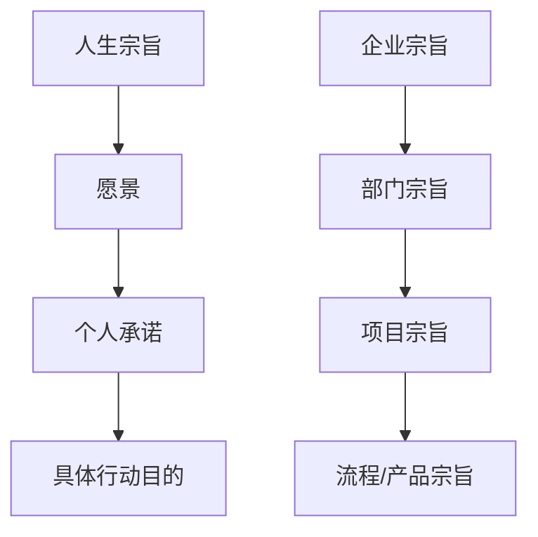

# 搞定：无压工作的艺术时间管理+提升工作+平衡工作与生活的艺术美（共三册） (戴维·艾伦) (Z-Li

状态: TODO
Update Date: 2025年11月14日 10:22
Create Date: 2025年11月14日 08:44

创建于：2025-11-12 03:03:27

标签：

---

原文：[https://x-1381123255.cos.ap-beijing.myqcloud.com/%E6%90%9E%E5%AE%9A%EF%BC%9A%E6%97%A0%E5%8E%8B%E5%B7%A5%E4%BD%9C%E7%9A%84%E8%89%BA%E6%9C%AF%E6%97%B6%E9%97%B4%E7%AE%A1%E7%90%86%2B%E6%8F%90%E5%8D%87%E5%B7%A5%E4%BD%9C%2B%E5%B9%B3%E8%A1%A1%E5%B7%A5%E4%BD%9C%E4%B8%8E%E7%94%9F%E6%B4%BB%E7%9A%84%E8%89%BA%E6%9C%AF%E7%BE%8E%EF%BC%88%E5%85%B1%E4%B8%89%E5%86%8C%EF%BC%89%20%28%E6%88%B4%E7%BB%B4%C2%B7%E8%89%BE%E4%BC%A6%29%20%28Z-Li_02_%E7%9B%AE%E5%BD%95.pdf](https://x-1381123255.cos.ap-beijing.myqcloud.com/%E6%90%9E%E5%AE%9A%EF%BC%9A%E6%97%A0%E5%8E%8B%E5%B7%A5%E4%BD%9C%E7%9A%84%E8%89%BA%E6%9C%AF%E6%97%B6%E9%97%B4%E7%AE%A1%E7%90%86%2B%E6%8F%90%E5%8D%87%E5%B7%A5%E4%BD%9C%2B%E5%B9%B3%E8%A1%A1%E5%B7%A5%E4%BD%9C%E4%B8%8E%E7%94%9F%E6%B4%BB%E7%9A%84%E8%89%BA%E6%9C%AF%E7%BE%8E%EF%BC%88%E5%85%B1%E4%B8%89%E5%86%8C%EF%BC%89%20%28%E6%88%B4%E7%BB%B4%C2%B7%E8%89%BE%E4%BC%A6%29%20%28Z-Li_02_%E7%9B%AE%E5%BD%95.pdf)

将链接内容进行整理，重点要点突出，结构清晰，知识点有目录大纲，不同层级，列表总结

# 《搞定Ⅰ：无压工作的艺术》目录大纲

创建于：2025-11-12 03:03:44

标签：
AI链接笔记
无压工作
时间管理
GTD

---

原文：[(anonymous)](https://x-1381123255.cos.ap-beijing.myqcloud.com/%E6%90%9E%E5%AE%9A%EF%BC%9A%E6%97%A0%E5%8E%8B%E5%B7%A5%E4%BD%9C%E7%9A%84%E8%89%BA%E6%9C%AF%E6%97%B6%E9%97%B4%E7%AE%A1%E7%90%86%2B%E6%8F%90%E5%8D%87%E5%B7%A5%E4%BD%9C%2B%E5%B9%B3%E8%A1%A1%E5%B7%A5%E4%BD%9C%E4%B8%8E%E7%94%9F%E6%B4%BB%E7%9A%84%E8%89%BA%E6%9C%AF%E7%BE%8E%EF%BC%88%E5%85%B1%E4%B8%89%E5%86%8C%EF%BC%89%20%28%E6%88%B4%E7%BB%B4%C2%B7%E8%89%BE%E4%BC%A6%29%20%28Z-Li_03_%E7%9B%AE%E5%BD%95.pdf)

📚 **全书结构概览**

- 分为3个主要部分 + 序言、最新版介绍、结语、致谢及附录

### PART1 搞定：通向从容之道

1. 第1章 新情况，新做法
2. 第2章 掌控生活：横向管理工作流程的5个步骤
3. 第3章 控制项目：纵向管理项目的5个阶段

### PART2 远离压力，提高效率

1. 第4章 准备工作：确定时间、空间和工具
2. 第5章 收集阶段：归拢材料
3. 第6章 理清阶段：清空工作篮
4. 第7章 组织整理：建立好清单
5. 第8章 回顾阶段：保障系统的有效运行
6. 第9章 执行阶段：选择最合适的行动
7. 第10章 学会控制项目

### PART3 三个关键原则

1. 第11章 原则一：养成收集的习惯
2. 第12章 原则二：确定“下一步行动”
3. 第13章 原则三：学会关注结果
4. 第14章 GTD和认知科学
5. 第15章 GTD精进之路

创建于：2025-11-12 03:04:01

标签：

---

原文：[https://x-1381123255.cos.ap-beijing.myqcloud.com/%E6%90%9E%E5%AE%9A%EF%BC%9A%E6%97%A0%E5%8E%8B%E5%B7%A5%E4%BD%9C%E7%9A%84%E8%89%BA%E6%9C%AF%E6%97%B6%E9%97%B4%E7%AE%A1%E7%90%86%2B%E6%8F%90%E5%8D%87%E5%B7%A5%E4%BD%9C%2B%E5%B9%B3%E8%A1%A1%E5%B7%A5%E4%BD%9C%E4%B8%8E%E7%94%9F%E6%B4%BB%E7%9A%84%E8%89%BA%E6%9C%AF%E7%BE%8E%EF%BC%88%E5%85%B1%E4%B8%89%E5%86%8C%EF%BC%89%20%28%E6%88%B4%E7%BB%B4%C2%B7%E8%89%BE%E4%BC%A6%29%20%28Z-Li_04_%E6%9C%AA%E7%9F%A5%E7%AB%A0%E8%8A%82.pdf](https://x-1381123255.cos.ap-beijing.myqcloud.com/%E6%90%9E%E5%AE%9A%EF%BC%9A%E6%97%A0%E5%8E%8B%E5%B7%A5%E4%BD%9C%E7%9A%84%E8%89%BA%E6%9C%AF%E6%97%B6%E9%97%B4%E7%AE%A1%E7%90%86%2B%E6%8F%90%E5%8D%87%E5%B7%A5%E4%BD%9C%2B%E5%B9%B3%E8%A1%A1%E5%B7%A5%E4%BD%9C%E4%B8%8E%E7%94%9F%E6%B4%BB%E7%9A%84%E8%89%BA%E6%9C%AF%E7%BE%8E%EF%BC%88%E5%85%B1%E4%B8%89%E5%86%8C%EF%BC%89%20%28%E6%88%B4%E7%BB%B4%C2%B7%E8%89%BE%E4%BC%A6%29%20%28Z-Li_04_%E6%9C%AA%E7%9F%A5%E7%AB%A0%E8%8A%82.pdf)

将链接内容进行整理，重点要点突出，结构清晰，知识点有目录大纲，不同层级，列表总结

# 《搞定》序言核心优势解析

创建于：2025-11-12 03:04:17

标签：
AI链接笔记
GTD方法
《搞定》序言
模块化工作法

---

原文：[(anonymous)](https://x-1381123255.cos.ap-beijing.myqcloud.com/%E6%90%9E%E5%AE%9A%EF%BC%9A%E6%97%A0%E5%8E%8B%E5%B7%A5%E4%BD%9C%E7%9A%84%E8%89%BA%E6%9C%AF%E6%97%B6%E9%97%B4%E7%AE%A1%E7%90%86%2B%E6%8F%90%E5%8D%87%E5%B7%A5%E4%BD%9C%2B%E5%B9%B3%E8%A1%A1%E5%B7%A5%E4%BD%9C%E4%B8%8E%E7%94%9F%E6%B4%BB%E7%9A%84%E8%89%BA%E6%9C%AF%E7%BE%8E%EF%BC%88%E5%85%B1%E4%B8%89%E5%86%8C%EF%BC%89%20%28%E6%88%B4%E7%BB%B4%C2%B7%E8%89%BE%E4%BC%A6%29%20%28Z-Li_05_%E5%BA%8F%E8%A8%80.pdf)

📚 **书籍定位**

- 区别于常见自我完善类书籍的”老生常谈”或”全有或全无”理念

- 销量可观且稳步增长，具有国际影响力

- 作者戴维·艾伦旨在帮助读者消除工作与生活压力，专注核心目标

### 核心优势一：实用性（模块化与宽容性方法）

1. **模块化设计**
    - 可整体接受或独立应用建议（如单独使用”两分钟规则”）
    - 核心要求：养成”收集”习惯（记录所有承诺/任务）+ 建立可靠存储库
2. **宽容性增量方法**
    - 允许遗忘或推迟处理，无需全面放弃
    - 适合大多数人长期执行，优于激进变革

### 核心优势二：宽泛适用性

1. **技术中立性**
    - 不依赖特定工具（从PalmPilot到智能手机时代均适用）
    - 聚焦永恒原则：注意力管理、情绪调控、创造力激发
2. **应对变化的弹性**
    - 承认生活循环性（变好→变糟→重新掌控）
    - 提供可执行常规措施应对波折

### 核心优势三：建议的完整性与真实性

1. **作者背景支撑**
    - 跨界经历：学生演员、辩论冠军、空手道大师、咨询师等
    - 数十年工作效率顾问经验，案例真实
2. **生活与思想的衔接**
    - 理念源于实践，非理论空谈
    - 态度谦逊，避免增加读者内疚感

# 《搞定》新版修订要点与GTD方法核心解析 📚

创建于：2025-11-12 03:04:34

标签：
AI链接笔记
GTD方法
《搞定》新版修订
无压力工作效率

---

原文：[(anonymous)](https://x-1381123255.cos.ap-beijing.myqcloud.com/%E6%90%9E%E5%AE%9A%EF%BC%9A%E6%97%A0%E5%8E%8B%E5%B7%A5%E4%BD%9C%E7%9A%84%E8%89%BA%E6%9C%AF%E6%97%B6%E9%97%B4%E7%AE%A1%E7%90%86%2B%E6%8F%90%E5%8D%87%E5%B7%A5%E4%BD%9C%2B%E5%B9%B3%E8%A1%A1%E5%B7%A5%E4%BD%9C%E4%B8%8E%E7%94%9F%E6%B4%BB%E7%9A%84%E8%89%BA%E6%9C%AF%E7%BE%8E%EF%BC%88%E5%85%B1%E4%B8%89%E5%86%8C%EF%BC%89%20%28%E6%88%B4%E7%BB%B4%C2%B7%E8%89%BE%E4%BC%A6%29%20%28Z-Li_06_%E6%9C%80%E6%96%B0%E7%89%88%E4%BB%8B%E7%BB%8D.pdf)

### 一、修订背景与核心原则

1. **修订动因**
    - 对2001年首版《搞定》进行重写，优化不完整/过时内容
    - 纳入全球应用经验与方法影响力的新认知
2. **核心原则稳定性**
    - 无压力工作效率原则及方法**永不失效**
    - 适用于任何场景（如2109年木星探险队仍需GTD原则）
    - 关键价值：通过「下一步行动决策」提升任务执行力

### 二、新版主要更新内容

### 1. 技术适应性调整

- **工具模型升级**
    - 删除具体软件推荐，改为「通用工具评估框架」
    - 保留纸质工具指导（兼顾全球读者需求与数字时代纸媒复兴趋势）
- **数字时代应对**
    - 强调技术双刃剑效应：便利信息获取 vs 信息过载干扰
    - 核心解决方案：强化内容管理流程（收集→组织→评价）

### 2. 适用人群扩展

- **突破商务局限**
    - 原版本聚焦企业管理者，新版覆盖学生、艺术家、神职人员等多元群体
    - 实际案例：金融主管、喜剧演员、宗教人士等均受益于GTD
- **标题澄清**
    - 「搞定」≠ 事务繁重，而是通过**最佳行动决策**排除干扰，创造心理空间

### 3. 实践落地优化

- **新增章节价值**
    - 第14章：认知科学研究证实GTD方法有效性
    - 第15章：阐明GTD实践的深度与广度，提供渐进式执行路径
- **习惯养成提示**
    - 核心行为简单（记录事项、决策下一步、检查清单），但长期坚持需刻意练习
    - 推荐参考《习惯的力量》（查尔斯·杜希格）

### 三、GTD方法跨场景价值

1. **全球化验证**
    - 首版被译30+语言，全球特许培训体系建立
    - 文化普适性：无关年龄、性别、职业，适用于需管理复杂任务的所有人
2. **永恒适用性**
    - 24-7在线世界的信息爆炸时代，GTD是保持专注力的核心工具
    - 基本原则（如控制注意力、管理意图）不受技术变革影响

# 《搞定》：高效工作与生活平衡指南 📚

创建于：2025-11-12 03:04:52

标签：
AI链接笔记
高效工作方法
生活平衡指南
个人时间管理

---

原文：[(anonymous)](https://x-1381123255.cos.ap-beijing.myqcloud.com/%E6%90%9E%E5%AE%9A%EF%BC%9A%E6%97%A0%E5%8E%8B%E5%B7%A5%E4%BD%9C%E7%9A%84%E8%89%BA%E6%9C%AF%E6%97%B6%E9%97%B4%E7%AE%A1%E7%90%86%2B%E6%8F%90%E5%8D%87%E5%B7%A5%E4%BD%9C%2B%E5%B9%B3%E8%A1%A1%E5%B7%A5%E4%BD%9C%E4%B8%8E%E7%94%9F%E6%B4%BB%E7%9A%84%E8%89%BA%E6%9C%AF%E7%BE%8E%EF%BC%88%E5%85%B1%E4%B8%89%E5%86%8C%EF%BC%89%20%28%E6%88%B4%E7%BB%B4%C2%B7%E8%89%BE%E4%BC%A6%29%20%28Z-Li_07_%E3%80%8A%E6%90%9E%E5%AE%9A%E3%80%8B%E6%AC%A2%E8%BF%8E%E4%BD%A0.pdf)

### 一、核心宗旨

- 帮助读者实现**高效工作**与**放松生活**的平衡
- 解决”既想出色完成工作，又想享受生活乐趣”的普遍矛盾
- 提供适用于**任何人生阶段**的可持续方法（从学生到企业高管）

### 二、核心理念

1. **效率价值**
    - 重要/有趣工作：追求时间精力的最大回报
    - 枯燥/必要工作：以最小付出快速完成，释放更多时间
2. **心态管理**
    - 高效的本质：在任意时间点确认”当前事正是该做的事”
    - 放松的关键：内心对当前状态的确定性（引用J·A·哈特菲尔德观点）
3. **工具与原则**
    - 工具（软件/设备/清单）仅为辅助，无法替代人的核心决策
    - 原则比方法更重要：”把握原则的人可成功选择方法”（引用爱默生）

### 三、问题诊断

- **现代生活痛点**：信息过载、任务堆积、决策疲劳
- **焦虑根源**：缺乏控制感、组织混乱、准备不足、行动迟缓（引用戴维·凯克奇）
- **传统方法局限**：工具依赖、习惯不可持续、无法应对人生重大变故

### 四、方法体系

1. **核心特点**
    - 简单易学：无需新技能，基于本能优化现有能力
    - 普适性强：适用于企业/家庭/学校等多种场景
    - 动态管理：强调流程而非静态工具
2. **实践建议**
    - 边读边实践：通过行动深化理解（”实践是最佳学习方式”）
    - 批判性应用：质疑验证方法，转化为个人化模式
    - 渐进提升：从基础习惯到高阶应用的终身修炼

### 五、书籍结构

1. **第一部分**：系统概述
    - 方法独特性与及时性
    - 核心框架简介
2. **第二部分**：实施指南
    - 循序渐进的行为模式训练
    - 私人顾问式实操指导
3. **第三部分**：深度应用
    - 方法对工作生活的深远影响
    - 动态流程管理的艺术升华

创建于：2025-11-12 03:05:09

标签：

---

原文：[https://x-1381123255.cos.ap-beijing.myqcloud.com/%E6%90%9E%E5%AE%9A%EF%BC%9A%E6%97%A0%E5%8E%8B%E5%B7%A5%E4%BD%9C%E7%9A%84%E8%89%BA%E6%9C%AF%E6%97%B6%E9%97%B4%E7%AE%A1%E7%90%86%2B%E6%8F%90%E5%8D%87%E5%B7%A5%E4%BD%9C%2B%E5%B9%B3%E8%A1%A1%E5%B7%A5%E4%BD%9C%E4%B8%8E%E7%94%9F%E6%B4%BB%E7%9A%84%E8%89%BA%E6%9C%AF%E7%BE%8E%EF%BC%88%E5%85%B1%E4%B8%89%E5%86%8C%EF%BC%89%20%28%E6%88%B4%E7%BB%B4%C2%B7%E8%89%BE%E4%BC%A6%29%20%28Z-Li_08_PART1%20%E6%90%9E%E5%AE%9A%EF%BC%9A%E9%80%9A%E5%90%91%E4%BB%8E%E5%AE%B9%E4%B9%8B%E9%81%93.pdf](https://x-1381123255.cos.ap-beijing.myqcloud.com/%E6%90%9E%E5%AE%9A%EF%BC%9A%E6%97%A0%E5%8E%8B%E5%B7%A5%E4%BD%9C%E7%9A%84%E8%89%BA%E6%9C%AF%E6%97%B6%E9%97%B4%E7%AE%A1%E7%90%86%2B%E6%8F%90%E5%8D%87%E5%B7%A5%E4%BD%9C%2B%E5%B9%B3%E8%A1%A1%E5%B7%A5%E4%BD%9C%E4%B8%8E%E7%94%9F%E6%B4%BB%E7%9A%84%E8%89%BA%E6%9C%AF%E7%BE%8E%EF%BC%88%E5%85%B1%E4%B8%89%E5%86%8C%EF%BC%89%20%28%E6%88%B4%E7%BB%B4%C2%B7%E8%89%BE%E4%BC%A6%29%20%28Z-Li_08_PART1%20%E6%90%9E%E5%AE%9A%EF%BC%9A%E9%80%9A%E5%90%91%E4%BB%8E%E5%AE%B9%E4%B9%8B%E9%81%93.pdf)

将链接内容进行整理，重点要点突出，结构清晰，知识点有目录大纲，不同层级，列表总结

# 高效事务管理方法：从混乱到心如止水 📚

创建于：2025-11-12 03:05:27

标签：
AI链接笔记
知识工作效率
事务管理方法
心如止水境界

---

原文：[(anonymous)](https://x-1381123255.cos.ap-beijing.myqcloud.com/%E6%90%9E%E5%AE%9A%EF%BC%9A%E6%97%A0%E5%8E%8B%E5%B7%A5%E4%BD%9C%E7%9A%84%E8%89%BA%E6%9C%AF%E6%97%B6%E9%97%B4%E7%AE%A1%E7%90%86%2B%E6%8F%90%E5%8D%87%E5%B7%A5%E4%BD%9C%2B%E5%B9%B3%E8%A1%A1%E5%B7%A5%E4%BD%9C%E4%B8%8E%E7%94%9F%E6%B4%BB%E7%9A%84%E8%89%BA%E6%9C%AF%E7%BE%8E%EF%BC%88%E5%85%B1%E4%B8%89%E5%86%8C%EF%BC%89%20%28%E6%88%B4%E7%BB%B4%C2%B7%E8%89%BE%E4%BC%A6%29%20%28Z-Li_09_%E7%AC%AC1%E7%AB%A0%20%E6%96%B0%E6%83%85%E5%86%B5%EF%BC%8C%E6%96%B0%E5%81%9A%E6%B3%95.pdf)

### 一、核心概念与目标

### 1.1 理想工作状态

- 头脑清醒、轻松自如控制事务
- 全神贯注投入，时间感消失
- 武术家”心如止水”境界：不过度反应也不忽视，灵活应对

### 1.2 方法三大目标

1. 收集所有事务到外部系统，释放大脑内存
2. 对输入信息提前分析决策，形成可执行行动清单
3. 管理协调所有承诺，确保兑现对自己和他人的约定

### 二、现代工作挑战

### 2.1 工作性质变化

- 从明确边界的体力劳动转向无边界的”知识工作”
- 工作质量无上限（”博客能多完美？会议能多鼓舞人心？”）
- 信息无限性：互联网提供无穷资源，导致”永远可以做得更好”

### 2.2 压力来源

- 工作与生活界限模糊（邮件、手机、全球化团队）
- 组织架构永恒变化（目标、产品、伙伴持续更新）
- 个人职业流动性增强（换工作如换岗位频繁）
- 大脑短期记忆过载，类似计算机RAM存储空间不足

### 三、传统方法失效原因

### 3.1 时间管理局限

- 无法创造额外时间，只能优化使用方式
- 日程表仅能管理部分事务，无法应对突发变化

### 3.2 任务清单缺陷

- 多为模糊”材料”（如”处理邮件”“见医生”）而非具体行动
- 缺乏对结果和下一步行动的明确定义

### 3.3 价值观思维局限

- 仅关注大局会增加任务清单长度，未解决执行障碍
- 需与具体行动管理结合才能落地

### 四、高效管理系统构建

### 4.1 横向管理：行动控制

- 全范围扫描所有事务（工作/生活/琐事）
- 确保无遗漏执行，如雷达般全方位监控

### 4.2 纵向管理：项目规划

- 针对单一主题深入思考细节
- 明确预期结果与必要行动步骤

### 4.3 自下而上工作法

1. 先掌控底层具体行动
2. 释放大脑空间提升创造力
3. 再自然过渡到战略思考（避免”提着泳裤游泳”式低效）

### 五、关键执行步骤

### 5.1 材料转化流程

1. **收集**：所有未处理事务（想法/邮件/任务）
2. **处理**：明确每件事的意义和预期结果
3. **决定**：下一步具体行动（打电话/写邮件/头脑风暴）
4. **存储**：将行动提示放入可靠系统

### 5.2 两分钟训练法

- 写下当前最困扰你的事
- 定义理想结果（”事情怎样算完成？”）
- 确定下一步具体行动（”现在立即能做什么推动进展？”）

# 《搞定Ⅲ》引言：GTD方法的核心理念与实践指南

创建于：2025-11-12 03:05:44

标签：
AI链接笔记
GTD方法
高效工作
事务管理

---

原文：[(anonymous)](https://x-1381123255.cos.ap-beijing.myqcloud.com/%E6%90%9E%E5%AE%9A%EF%BC%9A%E6%97%A0%E5%8E%8B%E5%B7%A5%E4%BD%9C%E7%9A%84%E8%89%BA%E6%9C%AF%E6%97%B6%E9%97%B4%E7%AE%A1%E7%90%86%2B%E6%8F%90%E5%8D%87%E5%B7%A5%E4%BD%9C%2B%E5%B9%B3%E8%A1%A1%E5%B7%A5%E4%BD%9C%E4%B8%8E%E7%94%9F%E6%B4%BB%E7%9A%84%E8%89%BA%E6%9C%AF%E7%BE%8E%EF%BC%88%E5%85%B1%E4%B8%89%E5%86%8C%EF%BC%89%20%28%E6%88%B4%E7%BB%B4%C2%B7%E8%89%BE%E4%BC%A6%29%20%28Z-Li_100_%E5%BC%95%E8%A8%80%20%E4%BB%8E%E3%80%8A%E6%90%9E%E5%AE%9A%E2%85%A0%E3%80%8B%E5%88%B0%E3%80%8A%E6%90%9E%E5%AE%9A%E2%85%A2%E3%80%8B.pdf)

### 一、GTD方法的核心价值

📌 **解决的核心问题**

- 缺乏对高效原理的根本认识和有效模型

- 工作与生活事务繁杂导致的压力与低效率

- 理论理解与实际践行之间的差距

✨ **核心目标**

- 实现工作与生活的高效整合（”工作变轻，生活成为成功事业”）

- 建立可靠的事务处理系统，提升掌控感与专注力

- 将GTD从”个人组织整理系统”推广为普适性的生活原则

### 二、GTD方法的发展与定位

📚 **系列书籍关系**

- 《搞定Ⅰ》：基础方法手册，提出5步事务处理法与六层次法（Horizons of Focus）

- 《搞定Ⅲ》：深化GTD原则，提供全面实践路线图，解答”如何长期有效运用”

🔄 **实践常见误区**

1. **部分应用即止步**：仅用邮件/文件管理等局部方法，未深入重要性排序与原理探究

2. **难以长期坚持**：缺乏对GTD原则多维度应用的理解，导致”回到老样子”

3. **低估系统价值**：认为方法繁琐，未意识到拆分使用仍可产生显著效果

### 三、GTD实践人群分类与建议

👥 **三类读者画像**

1. **似懂非懂型**

- 特征：采用部分方法（如清单管理），效果显著但未完整实践

- 建议：重新完整学习模型，探究方法背后的原理

1. **半途而废型**
    - 特征：认可价值但难以坚持，渴望深入应用
    - 建议：通过多渠道理解GTD原则，激发持续实践热情
2. **精通实践型**（极少数）
    - 特征：掌握精髓并高效应用，追求极致发挥
    - 建议：探索更高级方法，推广GTD的广泛适用性

### 四、《搞定Ⅲ》的使用指南

📝 **阅读准备**

- 工具：记事本/录音设备，随时记录灵感与待办事项

- 心态：保持”假设的肯定”，对潜在价值保持敏感

🎯 **核心功能**

- 提供自我培训框架，可用于个人提升或团队教学

- 不直接回答具体问题（如”是否换工作”），而是提供决策方法

- 通过11个部分的模型，实现工作与生活多层面的有序管理

### 五、GTD的底层原则与愿景

🔑 **关键原则**

- 事务可视化：将所有未完成事项纳入”工作篮”，避免心理负担

- 系统性处理：通过收集→处理→组织→回顾→执行的流程实现掌控

- 普适性应用：工作方法可迁移至生活，如”把生活当作事业”

🚀 **终极愿景**

- 在信息过载、变化快速的时代，通过可靠方法实现”从容超脱”

- 提升决策自信，降低行动风险，从”焦头烂额”到”游刃有余”

# 第1章 GTD现象

创建于：2025-11-12 03:06:01

标签：
AI链接笔记
时间管理方法
GTD现象
《搞定Ⅰ》

---

原文：[(anonymous)](https://x-1381123255.cos.ap-beijing.myqcloud.com/%E6%90%9E%E5%AE%9A%EF%BC%9A%E6%97%A0%E5%8E%8B%E5%B7%A5%E4%BD%9C%E7%9A%84%E8%89%BA%E6%9C%AF%E6%97%B6%E9%97%B4%E7%AE%A1%E7%90%86%2B%E6%8F%90%E5%8D%87%E5%B7%A5%E4%BD%9C%2B%E5%B9%B3%E8%A1%A1%E5%B7%A5%E4%BD%9C%E4%B8%8E%E7%94%9F%E6%B4%BB%E7%9A%84%E8%89%BA%E6%9C%AF%E7%BE%8E%EF%BC%88%E5%85%B1%E4%B8%89%E5%86%8C%EF%BC%89%20%28%E6%88%B4%E7%BB%B4%C2%B7%E8%89%BE%E4%BC%A6%29%20%28Z-Li_101_%E7%AC%AC1%E7%AB%A0%20GTD%E7%8E%B0%E8%B1%A1.pdf)

📚 **GTD现象概述**
- 引用《易经》：”屯，刚柔始交而难生，动乎险中，大亨贞。”
- 核心问题：《搞定Ⅰ》（最新版）提出的简单方法为何产生轰动效应？

🔑 **GTD广受好评的4个原因**
1. **概念特性**
- 所有概念行得通
- 简单易懂
- 合乎逻辑
2. **实践特性**
- 易于实践，任何人可在任何时间、任何地点运用
- 辅助工具常见，人人都有
3. **问题背景**
- 解决的问题和人们对这些问题的认识在全球呈稳步增加趋势
4. **心理契合**
- 提出的模型契合人类心理多个层面更深刻、更出于本能的东西

# GTD模型核心原理与应用价值

创建于：2025-11-12 03:06:17

标签：
AI链接笔记
时间管理
GTD模型
高效工作法

---

原文：[(anonymous)](https://x-1381123255.cos.ap-beijing.myqcloud.com/%E6%90%9E%E5%AE%9A%EF%BC%9A%E6%97%A0%E5%8E%8B%E5%B7%A5%E4%BD%9C%E7%9A%84%E8%89%BA%E6%9C%AF%E6%97%B6%E9%97%B4%E7%AE%A1%E7%90%86%2B%E6%8F%90%E5%8D%87%E5%B7%A5%E4%BD%9C%2B%E5%B9%B3%E8%A1%A1%E5%B7%A5%E4%BD%9C%E4%B8%8E%E7%94%9F%E6%B4%BB%E7%9A%84%E8%89%BA%E6%9C%AF%E7%BE%8E%EF%BC%88%E5%85%B1%E4%B8%89%E5%86%8C%EF%BC%89%20%28%E6%88%B4%E7%BB%B4%C2%B7%E8%89%BE%E4%BC%A6%29%20%28Z-Li_102_GTD%E7%9C%9F%E7%9A%84%E6%9C%89%E7%94%A8.pdf)

### 一、GTD模型的核心原理

### 1. 理论起源

- 源于对自我管理方法的研究与改进
- 核心目标：发现高效工作背后的普适原则
- 通过实践验证后形成系统化方法论

### 2. 心理机制基础

- **核心假设**：未记录的事务会持续占用心理资源，导致压力累积与效率下降
- **关键作用**：书面化记录可实现心理减压，提升思维清晰度
- **适用范围**：适用于各类事务管理与不同人群

### 二、GTD的核心价值与应用

### 1. 工作管理价值

- 建立与新事物的协作关系（处理工作篮文件）
- 总揽全局掌控工作流程（定期整理待办事项）
- 有效管理重大项目与家庭关系协调

### 2. 生活平衡价值

- 明确工作核心内容与责任范围
- 实现生活多维度平衡发展
- 兼顾生活与工作的重点事务

### 三、GTD在科技领域的传播

### 1. 传播现状

- 日均50篇英语博客提及（成书时数据）
- 在IT界、高科技领域与博客圈快速传播

### 2. 流行原因

- 与计算机行业核心理念一致：以最少投入获取最大产出
- 提供无漏洞的系统性规则，适配复杂场景处理
- 解决时间管理痛点，实现”无压力高效工作”

### 四、GTD相对其他系统的优势

### 1. 完整性优势

- 包含掌控局面的全部要素：事务捕捉→梳理→追踪
- 首创”客观罗列→价值判断”的标准化流程

### 2. 其他系统的常见缺陷

- 过度简单化或虎头蛇尾
- 忽视不重要事务的暂存管理机制
- 缺乏目标类型分层与结构化处理
- 假定理想化的理性决策环境，脱离现实复杂性

# GTD原则与普适性特点

创建于：2025-11-12 03:06:34

标签：
AI链接笔记
时间管理
GTD原则
普适性方法

---

原文：[(anonymous)](https://x-1381123255.cos.ap-beijing.myqcloud.com/%E6%90%9E%E5%AE%9A%EF%BC%9A%E6%97%A0%E5%8E%8B%E5%B7%A5%E4%BD%9C%E7%9A%84%E8%89%BA%E6%9C%AF%E6%97%B6%E9%97%B4%E7%AE%A1%E7%90%86%2B%E6%8F%90%E5%8D%87%E5%B7%A5%E4%BD%9C%2B%E5%B9%B3%E8%A1%A1%E5%B7%A5%E4%BD%9C%E4%B8%8E%E7%94%9F%E6%B4%BB%E7%9A%84%E8%89%BA%E6%9C%AF%E7%BE%8E%EF%BC%88%E5%85%B1%E4%B8%89%E5%86%8C%EF%BC%89%20%28%E6%88%B4%E7%BB%B4%C2%B7%E8%89%BE%E4%BC%A6%29%20%28Z-Li_103_%E5%AE%83%E7%9A%84%E5%8E%9F%E5%88%99%E7%AE%80%E5%8D%95%E6%98%93%E8%A1%8C.pdf)

📌 **GTD基本原则与实践门槛**
1. **核心优势**：原则简单易行，无需特殊条件即可实践
2. **实践要求**（3项基础条件）：
- 可写字的记事本
- 善于思考的头脑
- 存放记录内容的空间
3. **行为特性**：步骤均为常见行为，基于基本常识

📊 **GTD普适性表现**
1. **方法论根基**：建立在普遍人类原则基础上
2. **不受限因素**：
- 文化背景差异
- 职业身份（CEO/工人/学生等）
- 心理特征与性格类型
- 学习方法与性别差异
3. **应用案例**：
- **人群覆盖**：儿童、艺术家、家庭成员、退休人士等
- **组织类型**：财富50强企业、非营利组织、创业公司、政府机构等
- **行业领域**：金融/医疗/能源/科技/教育/交通等
- **地域分布**：德国、沙特阿拉伯、加拿大、巴西等多国

# GTD流行的核心原因：解决现代社会压力与效率困境

创建于：2025-11-12 03:06:53

标签：
AI链接笔记
GTD
压力管理
效率提升

---

原文：[(anonymous)](https://x-1381123255.cos.ap-beijing.myqcloud.com/%E6%90%9E%E5%AE%9A%EF%BC%9A%E6%97%A0%E5%8E%8B%E5%B7%A5%E4%BD%9C%E7%9A%84%E8%89%BA%E6%9C%AF%E6%97%B6%E9%97%B4%E7%AE%A1%E7%90%86%2B%E6%8F%90%E5%8D%87%E5%B7%A5%E4%BD%9C%2B%E5%B9%B3%E8%A1%A1%E5%B7%A5%E4%BD%9C%E4%B8%8E%E7%94%9F%E6%B4%BB%E7%9A%84%E8%89%BA%E6%9C%AF%E7%BE%8E%EF%BC%88%E5%85%B1%E4%B8%89%E5%86%8C%EF%BC%89%20%28%E6%88%B4%E7%BB%B4%C2%B7%E8%89%BE%E4%BC%A6%29%20%28Z-Li_104_%E9%97%AE%E9%A2%98%E5%9C%A8%E5%8A%A0%E5%89%A7%EF%BC%8C%E4%BA%BA%E4%BB%AC%E5%AF%B9%E8%A7%A3%E5%86%B3%E9%97%AE%E9%A2%98%E7%9A%84%E9%9C%80%E6%B1%82%E6%97%A5%E7%9B%8A%E8%BF%AB%E5%88%87.pdf)

📌 **一、现代社会压力加剧的核心矛盾**
1. **需求本质**
- 人们渴望更多自由而非更多工作
- 需应对历史上最频繁的突发状况
- 核心诉求：自我管理→洞察事物意义及关系
2. **压力根源**
- 非信息过载，而是”意义不明的超负荷”
- 时间无法管理，只能管理自身关注与行动
- 自然环境复杂但意义明确，信息环境则需主动解读

📈 **二、当代变化的独特挑战**
1. **信息密度爆炸**
- 3天接收的变革信息＞父辈1个月甚至祖辈1年
- 每条新信息都可能颠覆事务优先级排序
- 快节奏变化已成为生活常态（技术/邮件/语音留言等）
2. **变化的连锁反应**
- 积极变化也会导致压力（需重构关系/自我形象/家庭结构）
- 传统应对系统无法适应高频调整需求
- 关键能力：将新情况吸收进有意义的框架而非被淹没

🔑 **三、GTD流行的底层逻辑**
1. **解决真问题**
- 不局限于时间/信息管理，聚焦”意义不明的超负荷”
- 提供高效思考方法：快速应对新事→归置适当工作篮
2. **普适性与可习得性**
- 社会对高效率的期待提升（计划落地比灵感更关键）
- 打破”效率天赋论”：类似推销/创新，效率是可传授的流程
- 与个体/文化背景无关，具备全球适用的操作框架

# GTD：基本原理与本能结合的高效方法论

创建于：2025-11-12 03:07:10

标签：
AI链接笔记
高效工作
GTD方法论
个人管理

---

原文：[(anonymous)](https://x-1381123255.cos.ap-beijing.myqcloud.com/%E6%90%9E%E5%AE%9A%EF%BC%9A%E6%97%A0%E5%8E%8B%E5%B7%A5%E4%BD%9C%E7%9A%84%E8%89%BA%E6%9C%AF%E6%97%B6%E9%97%B4%E7%AE%A1%E7%90%86%2B%E6%8F%90%E5%8D%87%E5%B7%A5%E4%BD%9C%2B%E5%B9%B3%E8%A1%A1%E5%B7%A5%E4%BD%9C%E4%B8%8E%E7%94%9F%E6%B4%BB%E7%9A%84%E8%89%BA%E6%9C%AF%E7%BE%8E%EF%BC%88%E5%85%B1%E4%B8%89%E5%86%8C%EF%BC%89%20%28%E6%88%B4%E7%BB%B4%C2%B7%E8%89%BE%E4%BC%A6%29%20%28Z-Li_105_%E5%AE%83%E5%B0%86%E5%9F%BA%E6%9C%AC%E5%8E%9F%E7%90%86%E4%B8%8E%E6%9C%AC%E8%83%BD%E7%9B%B8%E7%BB%93%E5%90%88.pdf)

### 一、GTD的核心价值：连接内外的桥梁

1. **本质定位**
    - 非颠覆性发明，而是发现并系统化人类固有经验公式
    - 不提供具体日程表，而是注入自主掌控感与全局视角
2. **独特优势**
    - 兼顾外界新情况与内心冲动的敏感性
    - 无需预设完美计划，通过信息接收→分类整理→思考行动的循环实现高效

### 二、GTD的运作逻辑：揭开隐含的真相

1. **核心假设**
    - 每个人已具备创造力、动力、灵感和智慧
    - 关键在于扫除障碍，将潜在能力转化为实际行动
2. **实践路径**
    - 接收信息→分类整理→建立联系→明确意义→引导行动
    - 通过工具化流程将隐性经验转化为显性方法论

### 三、GTD的方法论特征

1. **系统性而非固定系统**
    - 作为灵活方法而非僵化系统，可随需求动态调整
    - 兼容生活全场景（目标规划/日常琐事如买猫粮等）
2. **平衡理性与感性**
    - 提供处理敏感复杂问题的框架（如”父亲与临终关怀”等深层议题）
    - 在逻辑分类与本能直觉间建立桥梁

### 四、GTD的广泛吸引力根源

1. **心理层面**
    - 认可人类经验的非线性本质，接纳意外与不确定性
    - 通过”锚定”机制帮助梳理模糊思绪，提升意识清晰度
2. **实践层面**
    - 简化工具选择，聚焦高效行动支持
    - 强调习惯养成，释放内在天赋而非依赖外部激励

# GTD方法核心要点解析

创建于：2025-11-12 03:07:27

标签：
AI链接笔记
GTD
高效工作
任务管理方法

---

原文：[(anonymous)](https://x-1381123255.cos.ap-beijing.myqcloud.com/%E6%90%9E%E5%AE%9A%EF%BC%9A%E6%97%A0%E5%8E%8B%E5%B7%A5%E4%BD%9C%E7%9A%84%E8%89%BA%E6%9C%AF%E6%97%B6%E9%97%B4%E7%AE%A1%E7%90%86%2B%E6%8F%90%E5%8D%87%E5%B7%A5%E4%BD%9C%2B%E5%B9%B3%E8%A1%A1%E5%B7%A5%E4%BD%9C%E4%B8%8E%E7%94%9F%E6%B4%BB%E7%9A%84%E8%89%BA%E6%9C%AF%E7%BE%8E%EF%BC%88%E5%85%B1%E4%B8%89%E5%86%8C%EF%BC%89%20%28%E6%88%B4%E7%BB%B4%C2%B7%E8%89%BE%E4%BC%A6%29%20%28Z-Li_106_%E7%A9%B6%E7%AB%9F%E4%BB%80%E4%B9%88%E6%98%AFGTD%EF%BC%9F.pdf)

### 一、GTD概述

📌 **定义**：GTD（Getting Things Done）是一种高效任务管理方法，基于常识设计，通过系统化整理事务帮助人们提升效率

📌 **特点**：复杂却不令人犯怵，结构无限制条件，兼具简便性、灵活性与实用性

### 二、GTD核心原则

1. **收集阶段**
    - 写出所有注意到的事情
2. **处理阶段**
    - 将可行动事务转化为具体结果和后续步骤
3. **整理阶段**
    - 按处理方式和时间分类整理待办事务与信息
4. **检视阶段**
    - 从6个层面跟踪事务：宗旨、愿景、目标、责任范围、项目、行动

### 三、GTD价值与效果

✅ **个人层面**

- 避免焦头烂额，树立自信心

- 充分激发创造力

✅ **实践层面**

- 用最少注意力和精力完成有意义的事

- 提供高效工作的根本原理，保留方法层面的自由发挥空间

# GTD模型核心框架解析 📋

创建于：2025-11-12 03:07:44

标签：
AI链接笔记
GTD模型
工作流程管理
项目规划

---

原文：[(anonymous)](https://x-1381123255.cos.ap-beijing.myqcloud.com/%E6%90%9E%E5%AE%9A%EF%BC%9A%E6%97%A0%E5%8E%8B%E5%B7%A5%E4%BD%9C%E7%9A%84%E8%89%BA%E6%9C%AF%E6%97%B6%E9%97%B4%E7%AE%A1%E7%90%86%2B%E6%8F%90%E5%8D%87%E5%B7%A5%E4%BD%9C%2B%E5%B9%B3%E8%A1%A1%E5%B7%A5%E4%BD%9C%E4%B8%8E%E7%94%9F%E6%B4%BB%E7%9A%84%E8%89%BA%E6%9C%AF%E7%BE%8E%EF%BC%88%E5%85%B1%E4%B8%89%E5%86%8C%EF%BC%89%20%28%E6%88%B4%E7%BB%B4%C2%B7%E8%89%BE%E4%BC%A6%29%20%28Z-Li_107_3%E7%A7%8DGTD%E6%A8%A1%E5%9E%8B.pdf)

### 一、GTD模型概述

- **定义**：基于日常工作生活实践发明的3种模型协调统一体
- **核心价值**：理顺工作量、项目管理、优先级排序
- **应用效果**：简单易操作，可快速见到成效

### 二、三大核心模型详解

### 1. 掌控工作流程（Mastering Work Flow）

- **5步流程**
    
    1️⃣ 收集阶段（Collect）：列出所有原始信息
    
    2️⃣ 处理阶段（Process）：对每件事做出恰当决定
    
    3️⃣ 组织整理（Organize）：结果分类归档
    
    4️⃣ 检查回顾（Review）：评估部分和整个系统
    
    5️⃣ 执行阶段（Do）：选择恰当行动
    
- **关键工具**：清单管理（GTD软件基础）

### 2. 合乎自然的规划

- **适用场景**：复杂项目规划与管理
- **5步思维流程**
⚡ 目标和原则 → 愿景 → 头脑风暴 → 组织整理 → 明确下一步行动方案
- **特点**：自发式规划，适用于从日常事务到大型项目的各类场景

### 3. 关注层面

- **6个思考维度**（从战略到战术）
🔹 目标和原则
🔹 愿景
🔹 长期目标
🔹 责任范围
🔹 项目
🔹 行动
- **应用价值**：提供全面视角，帮助快速抓住重点，避免盲目行动

### 三、模型协同关系

- **统一核心**：掌控局面（掌控工作流程）+ 摆正视角（规划+关注层面）
- **落地逻辑**：
    1. 通过5步工作流程实现事务掌控
    2. 运用规划模型处理复杂项目
    3. 借助6个关注层面明确优先级
    4. 最终落实为具体行动

# GTD：思想基础

创建于：2025-11-12 03:08:01

标签：
AI链接笔记
注意力管理
GTD思想基础
心商

---

原文：[(anonymous)](https://x-1381123255.cos.ap-beijing.myqcloud.com/%E6%90%9E%E5%AE%9A%EF%BC%9A%E6%97%A0%E5%8E%8B%E5%B7%A5%E4%BD%9C%E7%9A%84%E8%89%BA%E6%9C%AF%E6%97%B6%E9%97%B4%E7%AE%A1%E7%90%86%2B%E6%8F%90%E5%8D%87%E5%B7%A5%E4%BD%9C%2B%E5%B9%B3%E8%A1%A1%E5%B7%A5%E4%BD%9C%E4%B8%8E%E7%94%9F%E6%B4%BB%E7%9A%84%E8%89%BA%E6%9C%AF%E7%BE%8E%EF%BC%88%E5%85%B1%E4%B8%89%E5%86%8C%EF%BC%89%20%28%E6%88%B4%E7%BB%B4%C2%B7%E8%89%BE%E4%BC%A6%29%20%28Z-Li_108_GTD%EF%BC%9A%E6%80%9D%E6%83%B3%E5%9F%BA%E7%A1%80.pdf)

### 一、核心概念：心商（Mental Intelligence）

🧠 **定义**

- 全面理解、管理和强化思考过程的能力

- 广义”思考”：包括脑中重视的真实/假想事物 + 逻辑理性判断

💡 **重要性**

- 思路不通导致思考不透彻，影响办事效率（如邮件/留言处理易极端）

- 思考对心情的影响 > 心情对思考的影响

### 二、大脑的特性：好仆人 vs 坏主人

🔄 **大脑的被动性**

- 多数人被杂乱念头摆布，而非主动思考解决方案

- 想起操心的事 ≠ 能推进它，易造成精力分散

⚖️ **关键区分**

- 大脑：机械反应、提醒事务（好仆人）

- 思考：智力+意图结合，主动判断决策（需掌控）

### 三、人类思考能力的现状

❌ **先天不足**

- 无人生来会系统思考（目标、行动、责任人等）

- 少数人仅在专业领域形成思考习惯，难以迁移

✅ **后天可培养**

- GTD将无意识行为上升为可传授的意识层面模型

- 例：企业培训中的目标设定、行动规划等行为可标准化

### 四、注意力管理的挑战与对策

⚠️ **现代干扰**

- 科技（邮件/手机）导致注意力分散，影响企业绩效

- 传统解决方案（如无邮件日）仅短期有效

🎯 **GTD的价值**

- 区分创造性思考与胡思乱想

- 排除消极干扰，聚焦积极思考通道

- 无需深奥训练，按步骤即可掌握（如菜谱式操作）

# GTD逻辑与实践框架 🧠

创建于：2025-11-12 03:08:18

标签：
AI链接笔记
GTD方法论
时间管理
精力管理

---

原文：[(anonymous)](https://x-1381123255.cos.ap-beijing.myqcloud.com/%E6%90%9E%E5%AE%9A%EF%BC%9A%E6%97%A0%E5%8E%8B%E5%B7%A5%E4%BD%9C%E7%9A%84%E8%89%BA%E6%9C%AF%E6%97%B6%E9%97%B4%E7%AE%A1%E7%90%86%2B%E6%8F%90%E5%8D%87%E5%B7%A5%E4%BD%9C%2B%E5%B9%B3%E8%A1%A1%E5%B7%A5%E4%BD%9C%E4%B8%8E%E7%94%9F%E6%B4%BB%E7%9A%84%E8%89%BA%E6%9C%AF%E7%BE%8E%EF%BC%88%E5%85%B1%E4%B8%89%E5%86%8C%EF%BC%89%20%28%E6%88%B4%E7%BB%B4%C2%B7%E8%89%BE%E4%BC%A6%29%20%28Z-Li_109_GTD%E7%9A%84%E9%80%BB%E8%BE%91.pdf)

### 一、GTD核心原理

1. **核心理念**
    - 清空冗杂念头可使力量倍增，源自”心如止水”（mind like water）的武术境界
    - 状态特征：澄明开放、灵活专注、能量高效运用
2. **效率公式**
    
    ```mermaid
    graph TD
     A[力量] --> B[精力集中]
     B --> C[不分心]
     C --> D[事务处置得当]
    ```
    
    ### 二、分心机制分析
    
    1. **分心根源**
    - 外部干扰：噪声/他人打断/设备故障
    - 内部干扰：思绪混乱/未处理事务的潜意识提醒
    1. **大脑局限**
    - 短期记忆容量有限（仅能保存约十几件事）
    - 无法区分事务优先级（”买面包”与”买房子”消耗同等精力）
    - 未完成事务会持续占用认知资源
        
        ### 三、GTD实践解决方案
        
    1. **压力释放三原则**
    - 捕捉所有事务并条理化
    - 建立可靠的追踪系统
    - 定期查看确保进展
    1. **有效系统特征**
    - 明确性：转化为具体行动步骤
    - 工具化：使用日程表/清单等外部载体
    - 反馈性：未执行时有明确后果提醒
    1. **事务处理流程**`mermaid graph LR 捕捉(捕捉所有事务) --> 明确(明确下一步行动) 明确 --> 追踪(建立提醒系统) 追踪 --> 回顾(定期检视进展)`

### 四、常见认知误区

1. **大脑神话破除**
    - ❌ 大脑是高效中央处理器
    - ✅ 大脑更适合思考而非记忆/提醒
2. **系统依赖差异**
    - 日程表有效原因：决定明确+工具成熟+后果直接
    - 其他事务被忽视原因：目标模糊+系统缺失+反馈延迟

# 掌控生活：横向管理工作流程的5个步骤 📊

创建于：2025-11-12 03:08:35

标签：
AI链接笔记
GTD工作法
时间管理
个人效率

---

原文：[(anonymous)](https://x-1381123255.cos.ap-beijing.myqcloud.com/%E6%90%9E%E5%AE%9A%EF%BC%9A%E6%97%A0%E5%8E%8B%E5%B7%A5%E4%BD%9C%E7%9A%84%E8%89%BA%E6%9C%AF%E6%97%B6%E9%97%B4%E7%AE%A1%E7%90%86%2B%E6%8F%90%E5%8D%87%E5%B7%A5%E4%BD%9C%2B%E5%B9%B3%E8%A1%A1%E5%B7%A5%E4%BD%9C%E4%B8%8E%E7%94%9F%E6%B4%BB%E7%9A%84%E8%89%BA%E6%9C%AF%E7%BE%8E%EF%BC%88%E5%85%B1%E4%B8%89%E5%86%8C%EF%BC%89%20%28%E6%88%B4%E7%BB%B4%C2%B7%E8%89%BE%E4%BC%A6%29%20%28Z-Li_10_%E7%AC%AC2%E7%AB%A0%20%E6%8E%8C%E6%8E%A7%E7%94%9F%E6%B4%BB%EF%BC%9A%E6%A8%AA%E5%90%91%E7%AE%A1%E7%90%86%E5%B7%A5%E4%BD%9C%E6%B5%81%E7%A8%8B%E7%9A%845%E4%B8%AA%E6%AD%A5%E9%AA%A4.pdf)

### 一、核心概念：工作流程管理的5个阶段

1. **收集**：捕获所有引起注意的事务和信息
2. **理清**：分析事务意义并确定下一步行动
3. **组织整理**：分类存储结果并提出行动选项
4. **回顾**：定期检视系统确保无遗漏
5. **执行**：根据情境选择并落实具体行动

### 二、阶段详解

### 1. 收集阶段 📥

- **核心原则**：100%收集一切”未竟之事”，解放大脑
- **收集工具**：
    - 有形：文件夹、纸质记事簿、工作篮
    - 电子：邮件、手机备忘录、录音设备
- **成功要素**：
✅ 全部事务移出大脑，存入外部系统
✅ 控制工具数量，避免分散管理
✅ 定期清空收集工具（非完成任务，而是处理内容）

### 2. 理清阶段 🧠

- **处理流程**：
    1. 明确”它是什么？”（定义事务性质）
    2. 判断”是否需要行动？”
        - 不需要：删除/归档参考资料/放入”将来/也许”清单
        - 需要：确定**下一步具体行动**（可执行、可操作）
- **行动决策三选一**：
⏱️ 2分钟内可完成 → 立即执行
👥 需他人完成 → 指派
⏳ 需延迟处理 → 加入行动清单

### 3. 组织整理阶段 📁

- **核心分类**（8大处理方向）：
    - **需行动事务**：
    - 项目清单（多步骤任务）
    - 日程表（指定时间/日期行动）
    - 下一步行动清单（按情境分类：电话/电脑/居家等）
    - 等待清单（他人处理事项）
    - **非行动事务**：
    - 垃圾（删除）
    - 参考资料（归档系统）
    - 酝酿资料（”将来/也许”清单、备忘录）

### 4. 回顾阶段 🔍

- **关键频率**：
    - 每日：检视日程表+下一步行动清单
    - 每周：全面回顾所有清单（项目/等待/将来也许）
- **每周回顾任务**：
✅ 收集并处理所有材料
✅ 更新各类清单
✅ 确保系统完整、实时、无遗漏

### 5. 执行阶段 🚀

- **行动选择三方法**：
    1. **四标准法**（情境→时间→精力→重要性）
    2. **三分类法**（执行计划内工作→处理突发事件→安排新工作）
    3. **六层次法**（从地面到5楼视野）：
        - 地面：当前行动
        - 1楼：当前项目
        - 2楼：责任范围
        - 3楼：目标
        - 4楼：愿景
        - 5楼：目的与原则

### 三、系统关键原则

- **薄弱环节决定整体效率**：5个阶段需紧密衔接
- **两分钟法则**：快速任务立即完成，避免堆积
- **大脑不是存储器**：依赖外部系统释放认知资源
- **定期清空是核心**：收集工具若不清理则沦为仓库

# 大脑延伸理论：原理与实践指南

创建于：2025-11-12 03:08:52

标签：
AI链接笔记
注意力管理
GTD方法论
大脑延伸理论

---

原文：[(anonymous)](https://x-1381123255.cos.ap-beijing.myqcloud.com/%E6%90%9E%E5%AE%9A%EF%BC%9A%E6%97%A0%E5%8E%8B%E5%B7%A5%E4%BD%9C%E7%9A%84%E8%89%BA%E6%9C%AF%E6%97%B6%E9%97%B4%E7%AE%A1%E7%90%86%2B%E6%8F%90%E5%8D%87%E5%B7%A5%E4%BD%9C%2B%E5%B9%B3%E8%A1%A1%E5%B7%A5%E4%BD%9C%E4%B8%8E%E7%94%9F%E6%B4%BB%E7%9A%84%E8%89%BA%E6%9C%AF%E7%BE%8E%EF%BC%88%E5%85%B1%E4%B8%89%E5%86%8C%EF%BC%89%20%28%E6%88%B4%E7%BB%B4%C2%B7%E8%89%BE%E4%BC%A6%29%20%28Z-Li_110_%E5%A4%A7%E8%84%91%E9%9C%80%E8%A6%81%E5%BB%B6%E4%BC%B8.pdf)

### 一、核心问题：大脑的局限性

🧠 **注意力瓶颈**
- 单任务处理优势：专注一件事时创造力/执行力极强
- 多任务处理缺陷：同时考虑2+问题会导致”认知短路”
- 开放式回路负担：未完成承诺会持续占用大脑资源（类比”鱼拉钓竿”效应）

### 二、解决方案：外部延伸系统

📋 **核心原理**
- 定义：将大脑需追踪的信息/任务转移到外部载体
- 作用：释放认知资源，专注深度思考与创造性工作

### 三、经典延伸工具案例

🔧 **日常应用场景**
1. **日程表系统**
- 功能：管理时间承诺（会议/约会/待办）
- 价值：避免大脑反复记忆时间安排，释放注意力处理事务细节
- 附加效益：通过浏览日程激发关联思考

1. **其他外部延伸工具**
    - 导航标识：高速公路出口指示
    - 计时工具：钟表/日历
    - 状态监测：汽车仪表盘（油量/故障提示）

### 四、延伸系统的普适原则

🎯 **关键实施要素**
1. 明确事务意义与行动方案
2. 建立可靠的外部提示系统
3. 养成定期追踪进度的习惯
4. 适用于复杂问题：财务规划/健康管理等非具象事务

### 五、GTD方法论的价值

🚀 **实践意义**
- 解决复杂情境：处理模糊性高的多维度问题
- 认知升级：从被动应对到主动掌控
- 时代适应性：信息爆炸时代的必备技能（需学习实践的”高级常识”）

# 《搞定Ⅲ》(最新版)第2章：从"不顺"到"顺"的关键步骤

创建于：2025-11-12 03:09:09

标签：
AI链接笔记
自我管理
效率提升
《搞定Ⅲ》

---

原文：[(anonymous)](https://x-1381123255.cos.ap-beijing.myqcloud.com/%E6%90%9E%E5%AE%9A%EF%BC%9A%E6%97%A0%E5%8E%8B%E5%B7%A5%E4%BD%9C%E7%9A%84%E8%89%BA%E6%9C%AF%E6%97%B6%E9%97%B4%E7%AE%A1%E7%90%86%2B%E6%8F%90%E5%8D%87%E5%B7%A5%E4%BD%9C%2B%E5%B9%B3%E8%A1%A1%E5%B7%A5%E4%BD%9C%E4%B8%8E%E7%94%9F%E6%B4%BB%E7%9A%84%E8%89%BA%E6%9C%AF%E7%BE%8E%EF%BC%88%E5%85%B1%E4%B8%89%E5%86%8C%EF%BC%89%20%28%E6%88%B4%E7%BB%B4%C2%B7%E8%89%BE%E4%BC%A6%29%20%28Z-Li_111_%E7%AC%AC2%E7%AB%A0%20%E6%AD%A5%E9%AA%A4.pdf)

📚 **核心问题**

- 如何在纷繁复杂的处境中前进？

- 如何摆脱僵局，让事情有所进展？

- 如何保证举措能推动事物向前发展？

🎯 **本书目标**

- 不提供具体答案，而是指引读者自行找到答案

- 传达从”不顺”到”顺”的通用原则与步骤

- 强调掌控局面与明确方向的相辅相成

### 一、问题本质

1. **“不顺”的普遍性**
    - 存在于人生各层面：事业发展、日常琐事、团队管理等
    - 核心症状：未达到自我/外界的最佳标准
2. **关键认知**
    - 顺与不顺非命运，而是采取有效举措的结果
    - 理清思路、获得掌控的过程完全相同（可快至几秒，长至数年）

### 二、个人与企业的共同诉求

### 1. 个人目标

- 缓解压力、停止拖延、增进平衡
- 提升精力活力、发挥潜力、明确重点
- 高效管理项目/时间、激发创造力、提高自由度

### 2. 企业目标

- 提高效率、加强沟通、减轻压力
- 改善执行、统一重点、分清主次
- 加强时间管理、积极创新

### 三、核心解决方案

✅ **两大核心步骤**

1. **掌控局面**：组织整理各项事务（从混乱到有序）

2. **明确方向**：在适当层面明确目标（从迷茫到聚焦）

⚠️ **常见误区**

- 简单将”有条理”等同于整理，忽略主动掌控

- 单纯制订战略计划，缺乏落地执行的掌控力

# 《搞定Ⅲ》核心步骤与方法论

创建于：2025-11-12 03:09:25

标签：
AI链接笔记
《搞定Ⅲ》
时间管理方法论
个人效能

---

原文：[(anonymous)](https://x-1381123255.cos.ap-beijing.myqcloud.com/%E6%90%9E%E5%AE%9A%EF%BC%9A%E6%97%A0%E5%8E%8B%E5%B7%A5%E4%BD%9C%E7%9A%84%E8%89%BA%E6%9C%AF%E6%97%B6%E9%97%B4%E7%AE%A1%E7%90%86%2B%E6%8F%90%E5%8D%87%E5%B7%A5%E4%BD%9C%2B%E5%B9%B3%E8%A1%A1%E5%B7%A5%E4%BD%9C%E4%B8%8E%E7%94%9F%E6%B4%BB%E7%9A%84%E8%89%BA%E6%9C%AF%E7%BE%8E%EF%BC%88%E5%85%B1%E4%B8%89%E5%86%8C%EF%BC%89%20%28%E6%88%B4%E7%BB%B4%C2%B7%E8%89%BE%E4%BC%A6%29%20%28Z-Li_112_%E6%A0%B8%E5%BF%83%E6%AD%A5%E9%AA%A4.pdf)

📚 **方法论概述**

- 定位：一套行之有效的行为模式，非万能钥匙，而是明确思路的系统方法

- 特点：简单（儿童可学）与复杂（高管可用）的平衡，需通过练习掌握应用时机与场景

### 一、核心执行步骤（5步）

1. **捕捉**：收集引起关注的所有事务
2. **理清**：梳理事务的意义与下一步行动
3. **组织**：对事务进行分类整理
4. **查看**：定期检视清单进度
5. **追踪**：跟进事务执行状态

### 二、关注层面（6层）

- 价值观：行动的根本指引
- 长远目标：设定方向与愿景
- 确切目标：具体可执行的阶段性成果
- 职责范围：明确行动边界与责任
- 关注层面：与当前角色匹配的事务优先级
- 行动执行：落地具体任务

### 三、系统核心原则

1. **平衡结构**：允许延伸发挥，避免过度烦琐束缚
2. **全面性**：需同时覆盖5步骤+6层面，缺一不可
3. **目标一致性**：行动需与目标、价值观对齐
4. **普适性**：适用于个人、家庭（如晚餐准备）、团队、企业等场景

### 四、实践建议

- 核心：通过刻意练习形成「恰当时候用恰当方法」的习惯
- 延伸：参考《搞定Ⅲ》（最新版）获取分场景执行方法与案例

# 《搞定Ⅲ》：生活与工作的导航地图

创建于：2025-11-12 03:09:43

标签：
AI链接笔记
《搞定Ⅲ》
时间管理
知识型工作

---

原文：[(anonymous)](https://x-1381123255.cos.ap-beijing.myqcloud.com/%E6%90%9E%E5%AE%9A%EF%BC%9A%E6%97%A0%E5%8E%8B%E5%B7%A5%E4%BD%9C%E7%9A%84%E8%89%BA%E6%9C%AF%E6%97%B6%E9%97%B4%E7%AE%A1%E7%90%86%2B%E6%8F%90%E5%8D%87%E5%B7%A5%E4%BD%9C%2B%E5%B9%B3%E8%A1%A1%E5%B7%A5%E4%BD%9C%E4%B8%8E%E7%94%9F%E6%B4%BB%E7%9A%84%E8%89%BA%E6%9C%AF%E7%BE%8E%EF%BC%88%E5%85%B1%E4%B8%89%E5%86%8C%EF%BC%89%20%28%E6%88%B4%E7%BB%B4%C2%B7%E8%89%BE%E4%BC%A6%29%20%28Z-Li_113_%E7%94%9F%E6%B4%BB%E5%92%8C%E5%B7%A5%E4%BD%9C%E4%B8%AD%E7%9A%84%E5%9C%B0%E5%9B%BE.pdf)

### 一、地图的隐喻：生活与工作的导航需求

📌 **不看地图的5个条件**

1. 明确当前位置

2. 清楚目标方向

3. 掌握路径方法

4. 无突发状况（如绕行）

5. 了解备选便道（好玩/创意路线）

📌 **需要地图的场景**

- 不知目标位置（如”索诺马在加州哪里？”）

- 不知当前方位（如”在巴黎如何去埃菲尔铁塔？”）

- 路径选择困惑（如”哪条路去索诺马最近？”）

- 突发情况应对（如”公路大火需绕行”）

- 探索额外机会（如”途中有哪些景点可顺路游览？”）

### 二、《搞定Ⅲ》的核心价值：生活地图的功能

🎯 **解决知识型工作者的困境**

- 消除”无头绪”状态：明确”该做什么”

- 缩短”失控时间”：快速从混乱回归有序

- 适用人群广泛：职场人/学生/家长/自由职业者等

📚 **核心目标**

帮助读者掌控全局、抓住重点，实现：

- 高效工作与创造力平衡

- 全情投入当下事务（无”工作/生活”对立感）

### 三、关键概念与方法

### 1. “工作”的广义定义

✅ 凡是”想做但未做的事”均为工作，包括：

- 职场任务（如招聘、提案）

- 生活事务（如孩子生日宴、度假规划）

- 个人成长（如学跳舞、练高尔夫）

### 2. 6个关注层面（地图坐标）

- **3万英尺思考**：未来3~24个月目标（非即刻必需，但需预留关注）
- 其他层级隐含：责任范围（如”2万英尺”）、人生价值观（如”5万英尺”）

### 3. 走出”平衡生活与工作”的误区

⚠️ **错误认知**：将工作与生活视为对立关系

✅ **正确视角**：

- 高效状态下无”公私”分界（如写提案与遛狗均可全神贯注）

- 关键是”消除精力分散”，而非机械分配时间

- 例：有人95%精力投入工作仍感平衡，有人需3个月假期探险

### 四、核心问题与解决方案

🔍 **常见困境**

- 任务优先级混乱（如”45分钟理不清一封邮件”）

- 突发事务打乱计划（如”一个电话引发大量新创意”）

- 隐性问题被忽略（如”与家人的分歧”“想学跳舞的心愿”）

💡 **解决方案**

通过《搞定Ⅲ》的模型：

1. 梳理事务清单，纳入所有困扰因素

2. 明确各关注层面的目标与责任

3. 动态调整路径，保持视角清晰

# 第3章 自我管理的基本内容：GTD模型的掌控与视角

创建于：2025-11-12 03:10:00

标签：
AI链接笔记
GTD模型
自我管理
掌控与视角

---

原文：[(anonymous)](https://x-1381123255.cos.ap-beijing.myqcloud.com/%E6%90%9E%E5%AE%9A%EF%BC%9A%E6%97%A0%E5%8E%8B%E5%B7%A5%E4%BD%9C%E7%9A%84%E8%89%BA%E6%9C%AF%E6%97%B6%E9%97%B4%E7%AE%A1%E7%90%86%2B%E6%8F%90%E5%8D%87%E5%B7%A5%E4%BD%9C%2B%E5%B9%B3%E8%A1%A1%E5%B7%A5%E4%BD%9C%E4%B8%8E%E7%94%9F%E6%B4%BB%E7%9A%84%E8%89%BA%E6%9C%AF%E7%BE%8E%EF%BC%88%E5%85%B1%E4%B8%89%E5%86%8C%EF%BC%89%20%28%E6%88%B4%E7%BB%B4%C2%B7%E8%89%BE%E4%BC%A6%29%20%28Z-Li_114_%E7%AC%AC3%E7%AB%A0%20%E8%87%AA%E6%88%91%E7%AE%A1%E7%90%86%E7%9A%84%E5%9F%BA%E6%9C%AC%E5%86%85%E5%AE%B9.pdf)

📚 **核心引言**

- 名言引用：汤姆·罗宾斯（Tom Robbins）强调自我管理的重要性——”倘若你不能亲自掌舵，就不要怪你的航船停靠在莫名其妙的港口”

🔑 **GTD模型的两大基本要素**

1. **掌控**：对具体事务的有序处理能力

2. **视角**：对整体方向的规划与审视能力

- 关系：两者相互依存、相互影响，需通过不同方法分别提升

🍳 **生活案例类比**

- 厨房场景：

- 掌控层面：打扫厨房、清洗收拾锅碗瓢盆（事务执行）

- 视角层面：考虑做什么菜、如何搭配上菜（规划设计）

- 关联：混乱的厨房影响烹饪专注度，缺乏规划则导致执行失控

🧩 **GTD模型实施框架**

### 一、掌控局面（5个步骤）

- 定义：通过系统化流程处理具体事务，确保执行层面的有序性

### 二、摆正视角（6个关注层面）

- 定义：从宏观到微观的多维度规划，明确目标与方向

💡 **关键结论**

- 11个要素（5步骤+6层面）各有专属工具和行为模式，需平衡整合以发挥最大效用

- 工作效率取决于”最薄弱环节”，需全面优化

# 自我管理矩阵：掌控与视角的四象限模型 📊

创建于：2025-11-12 03:10:17

标签：
AI链接笔记
掌控与视角
自我管理矩阵
四象限模型

---

原文：[(anonymous)](https://x-1381123255.cos.ap-beijing.myqcloud.com/%E6%90%9E%E5%AE%9A%EF%BC%9A%E6%97%A0%E5%8E%8B%E5%B7%A5%E4%BD%9C%E7%9A%84%E8%89%BA%E6%9C%AF%E6%97%B6%E9%97%B4%E7%AE%A1%E7%90%86%2B%E6%8F%90%E5%8D%87%E5%B7%A5%E4%BD%9C%2B%E5%B9%B3%E8%A1%A1%E5%B7%A5%E4%BD%9C%E4%B8%8E%E7%94%9F%E6%B4%BB%E7%9A%84%E8%89%BA%E6%9C%AF%E7%BE%8E%EF%BC%88%E5%85%B1%E4%B8%89%E5%86%8C%EF%BC%89%20%28%E6%88%B4%E7%BB%B4%C2%B7%E8%89%BE%E4%BC%A6%29%20%28Z-Li_115_%E8%87%AA%E6%88%91%E7%AE%A1%E7%90%86%E7%9F%A9%E9%98%B5.pdf)

### 一、核心概念与模型基础

1. **定义**
    - 以「掌控」和「视角」为双轴线构建的自我评估工具
    - 用于定位个人/情境状态，指导动态调整与改进
2. **坐标轴含义**
    - **纵轴（掌控）**：对事务的控制能力（低级→高级）
    - **横轴（视角）**：全局观与长远规划能力（低级→高级）
3. **四象限划分逻辑**
    - 每个象限含「负面标签」（警示作用）与「积极面描述」（发展方向）
    - 理想状态：高掌控+高视角 → 动态平衡是关键

### 二、四象限深度解析

### 1. 左下象限：受害者/回应者 ⚠️→✅

**负面特征（受害者）**

- 无掌控力+无全局视角 → 被动应对危机

- 症状：拖延堆积事务→危机循环→麻木应激

**积极面（回应者）**

- 创业初期/创新突破期的必经阶段

- 类比火箭发射：多数能量用于纠正轨道，需灵敏响应机制

### 2. 右下象限：微观管理者/执行者 📋→🚀

**负面特征（微观管理者）**

- 高掌控力+低视角 → 过度关注细节，忽视目标

- 症状：形式主义（如过度准备）、流程僵化、错失全局

**积极面（执行者）**

- 高效落实结构化任务，需明确「充分准备」的边界

- 关键：完成后需主动切换视角，避免陷入流程依赖

### 3. 左上象限：空想家/梦想家 💭→🎯

**负面特征（空想家）**

- 低掌控力+高视角 → 想法泛滥，缺乏落地能力

- 症状：过度承诺、注意力涣散（「闪亮的垃圾」综合征）

**积极面（梦想家）**

- 创新与愿景的核心驱动力，需搭配「系统捕捉创意」机制

- 典型人群：企业家、创意工作者（需平衡幻想与执行）

### 4. 右上象限：舰长和指挥官 👑→⚖️

**理想特征**

- 高掌控力+高视角 → 行云流水的整合状态

- 表现：工作生活无边界感，专注投入当下

**潜在风险**

- 自满导致忽视预防维护（如未预判危机、停滞创新）

- 关键：持续动态调整，平衡「当下掌控」与「未来规划」

### 三、核心启示与应用

1. **动态性原则**
    - 人/情境会在象限间流动，短暂偏离是常态
    - 长期滞留次优象限需警惕（如受害者→麻木）
2. **象限转化策略**
    - 受害者→提升基础掌控力（如GTD方法）
    - 微观管理者→定期跳出细节，审视目标关联性
    - 空想家→建立创意落地系统（如任务拆解、资源匹配）
3. **实践注意事项**
    - 避免标签固化，负面标签仅作「航向警示」
    - 不同领域可能处于不同象限（如工作高效但健康失控）

# 动态变化的矩阵：掌控与视角的动态平衡

创建于：2025-11-12 03:10:34

标签：
AI链接笔记
掌控与视角
自我认知
动态变化的矩阵

---

原文：[(anonymous)](https://x-1381123255.cos.ap-beijing.myqcloud.com/%E6%90%9E%E5%AE%9A%EF%BC%9A%E6%97%A0%E5%8E%8B%E5%B7%A5%E4%BD%9C%E7%9A%84%E8%89%BA%E6%9C%AF%E6%97%B6%E9%97%B4%E7%AE%A1%E7%90%86%2B%E6%8F%90%E5%8D%87%E5%B7%A5%E4%BD%9C%2B%E5%B9%B3%E8%A1%A1%E5%B7%A5%E4%BD%9C%E4%B8%8E%E7%94%9F%E6%B4%BB%E7%9A%84%E8%89%BA%E6%9C%AF%E7%BE%8E%EF%BC%88%E5%85%B1%E4%B8%89%E5%86%8C%EF%BC%89%20%28%E6%88%B4%E7%BB%B4%C2%B7%E8%89%BE%E4%BC%A6%29%20%28Z-Li_116_%E5%8A%A8%E6%80%81%E5%8F%98%E5%8C%96%E7%9A%84%E7%9F%A9%E9%98%B5.pdf)

📊 **核心观点**

- 个人在掌控与视角构成的象限中的体验并非固定，会随场景、领域、层面动态变化

- 改善现状的第一步是**接受现状**，抗拒现实会阻碍进步

- 明确自身所处象限，有助于实现”诸事顺心”的状态

### 1. 动态变化的具体表现

### 1.1 不同领域的差异

- 可能在A领域掌控力强（如财务规划），在B领域却迷茫（如婚恋关系）
- 可能私人生活有序（如整洁书桌），事业却混乱（如3000+封未回复邮件）

### 1.2 不同层面的差异

- 长期目标清晰（如下一年计划），但短期行动模糊（如工作职责疑惑）
- 人生方向明确（如自我实现目标），但阶段任务缺失（如未来几年大事清单）

### 1.3 场景切换中的快速转变

- 同一活动中可能从”舰长和指挥官”（驾驭任务）→”空想家”（启动新项目）→”微观管理者”（打鼹鼠式救火）→”受害者”（疲于奔命）→”梦想家”（重新规划）→”执行者”（落地行动）→回归”舰长和指挥官”

### 2. 关键启示

- 生活的本质是**复杂且变幻莫测**，需灵活调整掌控与视角
- 进入/停留在”舰长和指挥官”象限的关键：根据处境与自身关系，动态调整战略（加强掌控/调整视角/两者兼顾）
- 核心秘诀：**关注最吸引注意力的事情**

# 关注吸引你注意力的事情 - GTD自我管理入门

创建于：2025-11-12 03:10:52

标签：
AI链接笔记
注意力管理
GTD自我管理
事务处理方法

---

原文：[(anonymous)](https://x-1381123255.cos.ap-beijing.myqcloud.com/%E6%90%9E%E5%AE%9A%EF%BC%9A%E6%97%A0%E5%8E%8B%E5%B7%A5%E4%BD%9C%E7%9A%84%E8%89%BA%E6%9C%AF%E6%97%B6%E9%97%B4%E7%AE%A1%E7%90%86%2B%E6%8F%90%E5%8D%87%E5%B7%A5%E4%BD%9C%2B%E5%B9%B3%E8%A1%A1%E5%B7%A5%E4%BD%9C%E4%B8%8E%E7%94%9F%E6%B4%BB%E7%9A%84%E8%89%BA%E6%9C%AF%E7%BE%8E%EF%BC%88%E5%85%B1%E4%B8%89%E5%86%8C%EF%BC%89%20%28%E6%88%B4%E7%BB%B4%C2%B7%E8%89%BE%E4%BC%A6%29%20%28Z-Li_117_%E5%85%B3%E6%B3%A8%E5%90%B8%E5%BC%95%E4%BD%A0%E6%B3%A8%E6%84%8F%E5%8A%9B%E7%9A%84%E4%BA%8B%E6%83%85.pdf)

### 一、核心观点：注意力即行动信号 📌

1. **注意力的本质**
    - 心事/注意力=未处理的事务或需要调整的视角
    - 未被关注的事务会持续消耗精力（如”电话反复响起”）
    - 忽视问题=阻塞信息流入，降低决策效率
2. **反常识视角**
    - 所有引起注意的事”同等重要”（需统一处理而非仅关注紧急事项）
    - 小故障与大问题的处理方法相同，忽视小事会遮蔽大事

### 二、GTD模型核心原则 🔄

1. **起点：从现状出发**
    - 区别于传统理论（优先级/战略），强调直面当前问题
    - 关键问题：”现在是什么情况？”
2. **行动第一步：捕捉所有心事**
    - 需列出全部注意力事项（不仅是待办清单）
    - 示例：修理打印机、找保姆、回复邮件等具体事务
    - 目的：清理障碍→释放认知资源→聚焦更高层级事务

### 三、实践方法：处理注意力事务 📋

1. **处理原则**
    - 视为”电话问题”：及时回应或明确搁置
    - 累计拖延成本 > 即时处理成本
2. **常见误区**
    - 仅关注紧急事务→非紧急事项持续干扰
    - 忽视小事（如买猫粮、找保姆）→削弱处理大事的能力

### 四、关键结论

- 掌控注意力=减轻心理负担+提升效率
- 下一步：准备行动（下一章内容预告）

# 第4章 获得掌控：捕捉

创建于：2025-11-12 03:11:09

标签：
AI链接笔记
获得掌控
捕捉阶段
信息收集

---

原文：[(anonymous)](https://x-1381123255.cos.ap-beijing.myqcloud.com/%E6%90%9E%E5%AE%9A%EF%BC%9A%E6%97%A0%E5%8E%8B%E5%B7%A5%E4%BD%9C%E7%9A%84%E8%89%BA%E6%9C%AF%E6%97%B6%E9%97%B4%E7%AE%A1%E7%90%86%2B%E6%8F%90%E5%8D%87%E5%B7%A5%E4%BD%9C%2B%E5%B9%B3%E8%A1%A1%E5%B7%A5%E4%BD%9C%E4%B8%8E%E7%94%9F%E6%B4%BB%E7%9A%84%E8%89%BA%E6%9C%AF%E7%BE%8E%EF%BC%88%E5%85%B1%E4%B8%89%E5%86%8C%EF%BC%89%20%28%E6%88%B4%E7%BB%B4%C2%B7%E8%89%BE%E4%BC%A6%29%20%28Z-Li_118_%E7%AC%AC4%E7%AB%A0%20%E8%8E%B7%E5%BE%97%E6%8E%8C%E6%8E%A7%EF%BC%9A%E6%8D%95%E6%8D%89.pdf)

📌 **核心引言**

- 心无杂念的本质是保持开放心态（玛丽·卡罗琳·理查兹）

- 改变事物的前提是强化意识（蒂姆·高尔韦）

- 不清除杂念易受其困扰（霍勒斯·沃波尔）

### 1. 捕捉的定义与原则

- **定义**：实现掌控的第一个阶段，曾用“收集”“清理”“捕获”描述，核心是明确现状、收集所有相关信息
- **原则**：划定“运动场边界”，确认困扰或异常状况，暂不考虑后续处理方式

### 2. 捕捉的触发机制

- **日常状态**：“进展顺利”的事务（如灯正常工作、前台运转）因无需关注而被忽略
- **异常信号**：内心雷达闪现故障信号时才被察觉，例如：
    - 生理需求：寒冷、口渴
    - 人际问题：收到气呼呼的邮件
    - 事务异常：打印机故障、工作机会动心
    - 群体事件：公司正负报道引发的波动

### 3. 捕捉的操作方法

- **个人层面**：将杂念从大脑移出，转化为可追踪形式，例如：
    - 书写记录（纸张、清单、工作篮）
    - 录音（需回放或誊写才能脱离潜意识）
- **群体层面**：
    - 共享收集资料和观点，鼓励成员畅所欲言
    - 通过白板或共享屏幕实时记录想法

# GTD方法：大脑清扫（Mind Sweep）全指南 🧠

创建于：2025-11-12 03:11:26

标签：
AI链接笔记
GTD方法
时间管理
大脑清扫

---

原文：[(anonymous)](https://x-1381123255.cos.ap-beijing.myqcloud.com/%E6%90%9E%E5%AE%9A%EF%BC%9A%E6%97%A0%E5%8E%8B%E5%B7%A5%E4%BD%9C%E7%9A%84%E8%89%BA%E6%9C%AF%E6%97%B6%E9%97%B4%E7%AE%A1%E7%90%86%2B%E6%8F%90%E5%8D%87%E5%B7%A5%E4%BD%9C%2B%E5%B9%B3%E8%A1%A1%E5%B7%A5%E4%BD%9C%E4%B8%8E%E7%94%9F%E6%B4%BB%E7%9A%84%E8%89%BA%E6%9C%AF%E7%BE%8E%EF%BC%88%E5%85%B1%E4%B8%89%E5%86%8C%EF%BC%89%20%28%E6%88%B4%E7%BB%B4%C2%B7%E8%89%BE%E4%BC%A6%29%20%28Z-Li_119_%E8%87%AA%E6%88%91%E5%A4%A7%E8%84%91%E6%B8%85%E6%89%AB.pdf)

### 一、核心概念与目标

- **定义**：全面扫描并捕捉生活/工作中所有引起注意的未完成事务，创建临时搁置点（工作篮/清单）
- **目的**：释放大脑记忆负担，实现思路清晰，为无压工作奠定基础
- **本质**：不问原因，一网打尽所有”需要改变/考虑的事情”

### 二、基础操作步骤

### 1. 物理环境清扫

- 扫描范围：办公桌上下、书架、抽屉、公文包、墙壁公告栏等
- 处理对象：非文具/装饰/参考资料/设备类物件（如坏打印机、待修物品、散落文件）
- 操作方法：全部放入工作篮，不做价值判断

### 2. 心理层面捕捉

- **清单记录**：将想起的事务写在纸条上投入工作篮（避免一次性思考长清单）
- **提示工具**：使用”未完成事务提示清单”（Incomplete Trigger List）
- **处理时长**：1小时~数小时（取决于材料量，资深/长期在岗者通常需更久）

### 三、6级关注层面核查体系

| 层级 | 关注内容 | 典型案例 |
| --- | --- | --- |
| 1万英尺 | 当前项目 | 买新车、雇助理、安装打印机、安排度假/看护 |
| 2万英尺 | 责任范围 | 财务状况、健康管理、家庭关系、自我发展 |
| 3万英尺 | 长短期目标 | 考证计划、储蓄目标、家庭庆典安排 |
| 4万英尺 | 人生愿景 | 职业转型、地域迁移、潜力发挥 |
| 5万英尺 | 宗旨与原则 | 核心价值观冲突、人生目标迷茫 |

### 关键难点解析

- **1万英尺陷阱**：将”问题”误认为”事务”（如孩子成绩担忧、员工矛盾）
- **5万英尺盲区**：忽视精神层面不和谐（如老板行为违背核心价值观）

### 四、深层事务处理要点

1. **识别特征**：非直观、分量重、常被掩盖的心事
2. **处理价值**：问题越敏感根深蒂固，系统化处理的积极效果越大
3. **操作原则**：先承认问题存在，再明确下一步行动（无需立即找到答案）
4. **典型案例**：牧师将”上帝”列入清单→转化为信仰实践相关行动

### 五、实施效果与注意事项

- **适用人群**：项目越大、职责越模糊、在岗时间越长者效果越显著
- **常见误区**：因追求答案而回避承认问题存在
- **核心习惯**：定期清理调整事务，避免”心理垃圾”长期盘踞
- **工具比喻**：像拖拉机一样不加区别地收集所有事务，再系统处理

# 纵向管理项目的5个阶段：自然计划法详解 📋

创建于：2025-11-12 03:11:44

标签：
AI链接笔记
自然计划法
项目纵向管理
头脑风暴技巧

---

原文：[(anonymous)](https://x-1381123255.cos.ap-beijing.myqcloud.com/%E6%90%9E%E5%AE%9A%EF%BC%9A%E6%97%A0%E5%8E%8B%E5%B7%A5%E4%BD%9C%E7%9A%84%E8%89%BA%E6%9C%AF%E6%97%B6%E9%97%B4%E7%AE%A1%E7%90%86%2B%E6%8F%90%E5%8D%87%E5%B7%A5%E4%BD%9C%2B%E5%B9%B3%E8%A1%A1%E5%B7%A5%E4%BD%9C%E4%B8%8E%E7%94%9F%E6%B4%BB%E7%9A%84%E8%89%BA%E6%9C%AF%E7%BE%8E%EF%BC%88%E5%85%B1%E4%B8%89%E5%86%8C%EF%BC%89%20%28%E6%88%B4%E7%BB%B4%C2%B7%E8%89%BE%E4%BC%A6%29%20%28Z-Li_11_%E7%AC%AC3%E7%AB%A0%20%E6%8E%A7%E5%88%B6%E9%A1%B9%E7%9B%AE%EF%BC%9A%E7%BA%B5%E5%90%91%E7%AE%A1%E7%90%86%E9%A1%B9%E7%9B%AE%E7%9A%845%E4%B8%AA%E9%98%B6%E6%AE%B5.pdf)

### 一、纵向管理与横向管理的区别

- **横向管理**：关注行动执行（收集、处理、组织、回顾、执行）
- **纵向管理**：聚焦单一项目深度规划，又称”简式计划”或”信封背面的计划”
- **核心目标**：将思考结果融入个人管理体系，实现项目可控性

### 二、自然计划法5阶段模型

### 1. 定义目标和原则 🎯

- **目标**：明确行动动机（如”为什么召开会议”）
- **原则**：设定行动边界（如预算限制、质量标准）
- **价值**：提供决策标准、调配资源、激发动力

### 2. 展望结果 🔮

- **核心**：描绘成功后的具体景象（感官/数据化描述）
- **原理**：激活大脑网状激活系统，自动筛选相关信息
- **方法**：问”项目完成后会是什么样子？”（如”市场占有率提升2%“）

### 3. 头脑风暴/集思广益 💡

- **三大原则**：
    - 不判断、不批判任何想法
    - 追求数量而非质量
    - 暂不考虑分析组织
- **工具**：思维导图、便利贴、分布式认知（建立”外脑”）
- **关键**：捕捉所有想法，包括”最坏情形”

### 4. 组织整理 🔄

- **分类维度**：
    - 组成要素（人员/资源/流程）
    - 先后顺序（依赖关系）
    - 重要程度（关键路径识别）
- **工具**：甘特图、项目管理软件、清单法
- **输出**：层次分明的工作大纲

### 5. 明确下一步行动方案 🚀

- **核心问题**：”现在可以开始做什么？”
- **关键要素**：
    - 明确责任人
    - 设定可执行步骤
    - 建立”等待”清单跟踪他人任务
- **检验标准**：能否立即执行（如”给供应商打电话确认报价”）

### 三、非自然计划法的常见误区

- ❌ 过早提出”谁有好主意？”（跳过前期阶段）
- ❌ 反应式规划（最后一刻紧急赶工）
- ❌ 忽视原则设定导致后期冲突
- ❌ 未明确下一步行动导致项目停滞

### 四、计划深度的判断标准

- **80%项目**：清单式计划即可（如更换经纪人）
- **15%项目**：需思维导图/PPT辅助（如会议议程）
- **5%复杂项目**：完整应用5阶段模型（如系统上线）

### 五、实用工具与技巧

- **原始工具**：纸笔、信封背面、索引卡片
- **数字工具**：思维导图软件、Project、待办清单APP
- **关键习惯**：
    - 对每个项目组成部分问”下一步行动”
    - 定期回顾”等待”清单
    - 将想法可视化（摊开卡片找结构）

# 记日志：捕捉思绪与自我掌控的方法

创建于：2025-11-12 03:12:00

标签：
AI链接笔记
心理疗愈
记日志方法
自我掌控

---

原文：[(anonymous)](https://x-1381123255.cos.ap-beijing.myqcloud.com/%E6%90%9E%E5%AE%9A%EF%BC%9A%E6%97%A0%E5%8E%8B%E5%B7%A5%E4%BD%9C%E7%9A%84%E8%89%BA%E6%9C%AF%E6%97%B6%E9%97%B4%E7%AE%A1%E7%90%86%2B%E6%8F%90%E5%8D%87%E5%B7%A5%E4%BD%9C%2B%E5%B9%B3%E8%A1%A1%E5%B7%A5%E4%BD%9C%E4%B8%8E%E7%94%9F%E6%B4%BB%E7%9A%84%E8%89%BA%E6%9C%AF%E7%BE%8E%EF%BC%88%E5%85%B1%E4%B8%89%E5%86%8C%EF%BC%89%20%28%E6%88%B4%E7%BB%B4%C2%B7%E8%89%BE%E4%BC%A6%29%20%28Z-Li_120_%E8%AE%B0%E6%97%A5%E5%BF%97.pdf)

### 一、记日志的核心价值

📝 **增强掌控感**

- 解决精力分散、事务顾此失彼的问题

- 通过回顾反思暴露潜在问题

### 二、日志的两种类型及实践

### 1. 日常事务日志

- **内容**：工作内容、当前境遇、事件记录（类似与家人倾诉的日常挂念事）
- **形式**：笔记本电脑+连续文字处理文档
- **作用**：自我排遣，减少对他人的情绪依赖

### 2. 内省精神日志

- **内容**：内心感悟、深度剖析、情怀抒发
- **形式**：钢笔书写于皮革封面日记本
- **特点**：手写方式更利于情感表达与自我反思

### 三、记日志的心理疗愈机制

- **核心原理**：利用纯粹观察的力量舒缓心情
- **关键动作**：客观自然地记录正在发生的事
- **定位**：情况失控时回归正轨的**关键第一步**

# 头脑风暴：原理、方法与核心价值

创建于：2025-11-12 03:12:17

标签：
AI链接笔记
头脑风暴
思维整理
创意激发

---

原文：[(anonymous)](https://x-1381123255.cos.ap-beijing.myqcloud.com/%E6%90%9E%E5%AE%9A%EF%BC%9A%E6%97%A0%E5%8E%8B%E5%B7%A5%E4%BD%9C%E7%9A%84%E8%89%BA%E6%9C%AF%E6%97%B6%E9%97%B4%E7%AE%A1%E7%90%86%2B%E6%8F%90%E5%8D%87%E5%B7%A5%E4%BD%9C%2B%E5%B9%B3%E8%A1%A1%E5%B7%A5%E4%BD%9C%E4%B8%8E%E7%94%9F%E6%B4%BB%E7%9A%84%E8%89%BA%E6%9C%AF%E7%BE%8E%EF%BC%88%E5%85%B1%E4%B8%89%E5%86%8C%EF%BC%89%20%28%E6%88%B4%E7%BB%B4%C2%B7%E8%89%BE%E4%BC%A6%29%20%28Z-Li_121_%E5%A4%B4%E8%84%91%E9%A3%8E%E6%9A%B4.pdf)

### 一、头脑风暴的核心定义

🧠 **本质**

- 针对特定主题的大脑清扫练习

- 专注思考时捕捉注意力焦点的方方面面

- 将大脑中散漫思绪转化为具体可见信息的过程

### 二、适用场景

- 项目规划或局面分析时思路不清晰、犹豫不决
- 筹备具体事务（如婚礼、会议日程）需梳理想法
- 寻求问题最佳解决方案时拓展思路

### 三、实施形式（多样化记录方式）

1. **个人场景**
    - 纸巾/便签潦草记录
    - 绘制思维图
    - 使用电脑软件
2. **团队场景**
    - 白板/画布书写
    - 网络平台集思广益并逐条列点

### 四、核心价值与作用机制

### 1. 释放大脑认知资源

- 避免大脑因持续追踪点子而消耗记忆负荷
- 解放思维空间，专注思考新问题

### 2. 提升创意产出效率

- 为临时念头提供外在搁置点，激发连锁创意
- 不拘形式的记录习惯促进多元观点生成

### 3. 优化决策质量

- 全面罗列可能性，实现最大范围内优中选优
- 将抽象思维转化为可分析的具体信息

# 清理的意义与实践方法

创建于：2025-11-12 03:12:34

标签：
AI链接笔记
注意力管理
清理方法
环境整理

---

原文：[(anonymous)](https://x-1381123255.cos.ap-beijing.myqcloud.com/%E6%90%9E%E5%AE%9A%EF%BC%9A%E6%97%A0%E5%8E%8B%E5%B7%A5%E4%BD%9C%E7%9A%84%E8%89%BA%E6%9C%AF%E6%97%B6%E9%97%B4%E7%AE%A1%E7%90%86%2B%E6%8F%90%E5%8D%87%E5%B7%A5%E4%BD%9C%2B%E5%B9%B3%E8%A1%A1%E5%B7%A5%E4%BD%9C%E4%B8%8E%E7%94%9F%E6%B4%BB%E7%9A%84%E8%89%BA%E6%9C%AF%E7%BE%8E%EF%BC%88%E5%85%B1%E4%B8%89%E5%86%8C%EF%BC%89%20%28%E6%88%B4%E7%BB%B4%C2%B7%E8%89%BE%E4%BC%A6%29%20%28Z-Li_122_%E6%B8%85%E7%90%86.pdf)

### 一、清理的核心价值

🧹 **立竿见影的效果**

- 改善杂乱环境对注意力的干扰，带来焕然一新的心理感受

- 快速恢复士气，帮助进入高效专注的”舰长和指挥官”状态

### 二、清理的标准与原则

📏 **个性化标准**

- 无统一”干净整洁”定义，关键是建立个人可接受的标准

- 触发清理的信号：物品乱放、积灰明显、环境开始影响工作状态

### 三、杂乱的负面影响

⚠️ **失控的恶性循环**

1. **心理逃避**：不敢面对杂乱区域（如抽屉、电脑文档），形成心理负担

2. **注意力分散**：未及时处理的杂物持续消耗心理能量

3. **大脑麻木**：对”待处理事项”（如失效物品）产生无意识回避

### 四、杂乱产生的根源

🔍 **物品生命周期错位**

- 物品功能失效后不会自动消失（如闲置两年的圆珠笔笔芯）

- 未及时处理失效物品，导致空间被无用品占据

### 五、清理的行动价值

✨ **激活大脑潜能**

- 清理行为可打破大脑麻木状态，释放心理压力

- 完成清理后产生成就感，提升行动力与决策意愿

# 集体捕捉：多人协作中的大脑清扫与高效沟通

创建于：2025-11-12 03:12:51

标签：
AI链接笔记
团队协作
集体捕捉
高效沟通

---

原文：[(anonymous)](https://x-1381123255.cos.ap-beijing.myqcloud.com/%E6%90%9E%E5%AE%9A%EF%BC%9A%E6%97%A0%E5%8E%8B%E5%B7%A5%E4%BD%9C%E7%9A%84%E8%89%BA%E6%9C%AF%E6%97%B6%E9%97%B4%E7%AE%A1%E7%90%86%2B%E6%8F%90%E5%8D%87%E5%B7%A5%E4%BD%9C%2B%E5%B9%B3%E8%A1%A1%E5%B7%A5%E4%BD%9C%E4%B8%8E%E7%94%9F%E6%B4%BB%E7%9A%84%E8%89%BA%E6%9C%AF%E7%BE%8E%EF%BC%88%E5%85%B1%E4%B8%89%E5%86%8C%EF%BC%89%20%28%E6%88%B4%E7%BB%B4%C2%B7%E8%89%BE%E4%BC%A6%29%20%28Z-Li_123_%E9%9B%86%E4%BD%93%E6%8D%95%E6%8D%89.pdf)

### 一、集体捕捉的核心概念

1. **定义**
    - 适用于多人合作场景（团队、夫妻、部门、家庭等）的大脑清扫、头脑风暴与清理方法
    - 通过集体梳理思绪，产生秩序感、平衡感和掌控感
2. **核心机制**
    - 存在”合作心理存储空间”，集体清空后可带来群体清爽感
    - 类似共同打扫空间（如车库、衣柜）的心理满足感，效果具有放大效应

### 二、应用场景与操作方法

1. **适用场景**
    - 工作环境：项目团队、管理团队、委员会、董事会会议
    - 家庭/亲密关系：夫妻共同事务、家庭定期沟通
2. **实操步骤**
    - **会前/沟通前**：让每个人说出当下最关心的主要问题
    ✅ 关键：不要求所有内容书面记录，重点问题需记录待解决
    - **过程原则**：
        - 先认可群体内心的疑问，再推进问题解决
        - 识别并排除无关问题，聚焦核心议题

### 三、核心价值与注意事项

1. **核心价值**
    - 增强合作信任：承认问题存在，避免”屋顶乌云”效应
    - 提升参与感：全员信息共享，激发集体凝聚力
    - 提高效率：扫清心理障碍，避免无效沟通
2. **注意事项**
    - 不要求所有议题具备战略性，重点是释放心理负担
    - 需定期开展，如部门会议、家庭沟通固定环节

# 养成捕捉的习惯：提升精力管理与思维效率的关键方法

创建于：2025-11-12 03:13:08

标签：
AI链接笔记
GTD方法
精力管理
捕捉习惯

---

原文：[(anonymous)](https://x-1381123255.cos.ap-beijing.myqcloud.com/%E6%90%9E%E5%AE%9A%EF%BC%9A%E6%97%A0%E5%8E%8B%E5%B7%A5%E4%BD%9C%E7%9A%84%E8%89%BA%E6%9C%AF%E6%97%B6%E9%97%B4%E7%AE%A1%E7%90%86%2B%E6%8F%90%E5%8D%87%E5%B7%A5%E4%BD%9C%2B%E5%B9%B3%E8%A1%A1%E5%B7%A5%E4%BD%9C%E4%B8%8E%E7%94%9F%E6%B4%BB%E7%9A%84%E8%89%BA%E6%9C%AF%E7%BE%8E%EF%BC%88%E5%85%B1%E4%B8%89%E5%86%8C%EF%BC%89%20%28%E6%88%B4%E7%BB%B4%C2%B7%E8%89%BE%E4%BC%A6%29%20%28Z-Li_124_%E5%85%BB%E6%88%90%E6%8D%95%E6%8D%89%E7%9A%84%E4%B9%A0%E6%83%AF.pdf)

### 一、捕捉习惯的核心价值

- 🔍 **定义**：客观指出现状不足，尤其影响问题解决思路的细节
- ✨ **作用**：避免琐事消耗精力，增强对生活的掌控感
- ⚠️ **风险**：忽视琐碎干扰可能导致思维分散、压力累积

### 二、实践原则：平衡条理与效率

1. **选择性整理**
    - 不必追求事无巨细的完美条理
    - 优先处理阻碍核心目标的干扰项（如找不到工具影响工作）
    - 案例：花园小屋仅在工具混乱影响干活时整理
2. **实用主义导向**
    - 允许非绝对整洁的平衡状态（如贴标签的塑料袋收纳配件）
    - 核心目的：减少精力消耗，而非形式上的规整

### 三、GTD方法的关键启示

- 🧠 **大脑清扫技术**
    - 列出所有待办事项（包括想做/可能做/应该做的事）
    - 效果：缓解心理压力，明确任务优先级
    - 案例：情景剧作家通过列清单实现心态转变
- 🧩 **拼图原理**
    - 信息不完整会降低行动动力（如缺失拼图块影响游戏体验）
    - 应用：将所有问题摆上台面，提升决策效率

### 四、行动建议

- 长期实践捕捉习惯，逐步提升细节敏感度
- 定期进行”清单梳理”，释放心理负担
- 聚焦核心目标，在关键领域保持条理（如工作工具、重要文档）

# 抗干扰的武器：理清思路的习惯与方法

创建于：2025-11-12 03:13:24

标签：
AI链接笔记
工作效率
两分钟原则
抗干扰方法

---

原文：[(anonymous)](https://x-1381123255.cos.ap-beijing.myqcloud.com/%E6%90%9E%E5%AE%9A%EF%BC%9A%E6%97%A0%E5%8E%8B%E5%B7%A5%E4%BD%9C%E7%9A%84%E8%89%BA%E6%9C%AF%E6%97%B6%E9%97%B4%E7%AE%A1%E7%90%86%2B%E6%8F%90%E5%8D%87%E5%B7%A5%E4%BD%9C%2B%E5%B9%B3%E8%A1%A1%E5%B7%A5%E4%BD%9C%E4%B8%8E%E7%94%9F%E6%B4%BB%E7%9A%84%E8%89%BA%E6%9C%AF%E7%BE%8E%EF%BC%88%E5%85%B1%E4%B8%89%E5%86%8C%EF%BC%89%20%28%E6%88%B4%E7%BB%B4%C2%B7%E8%89%BE%E4%BC%A6%29%20%28Z-Li_125_%E6%8A%97%E5%B9%B2%E6%89%B0%E7%9A%84%E6%AD%A6%E5%99%A8.pdf)

### 一、干扰的现状与危害

📌 **核心痛点**
- 干扰是影响高效工作的主要因素之一（与会议太多并列）
- 全神贯注时被打断会严重破坏工作状态
- 缺乏理清思路的技巧和工具是人们讨厌被打扰的主因

### 二、抗干扰的关键武器

🔑 **核心解决方案**
- 养成理清思路的习惯是抗干扰的有效办法
- 本质是通过掌控工作流程削弱干扰的负面影响

### 三、典型干扰场景分析

### 场景案例：”公司过路车”问题

- 表现：同事临时请求协助（如索要资料）
- 后果：被迫中断当前重要工作，产生烦躁情绪
- 根源：未养成记录需求、延后处理的习惯

### 四、高效处理干扰的方法

### 1. 两分钟原则

- 适用情况：若任务可在2分钟内完成，可立即处理
- 前提：该任务是当时最要紧的事

### 2. 工作篮管理法

- 操作步骤：
    1. 用纸笔记录新需求（如同事的临时请求）
    2. 将记录放入工作篮
    3. 延后统一查看和处理
- 价值：避免立即中断核心工作，保持专注

### 五、常见误区与改进方向

⚠️ **认知陷阱**
- 误区：因缺乏流程化管理信心，被迫同时处理多件未完成事项
- 改进：建立需求纳入、整理、组织的工作流程，实现任务延后处理

# 笔记的核心作用与实用方法 📝

创建于：2025-11-12 03:13:41

标签：
AI链接笔记
笔记方法
多任务管理
工作篮使用

---

原文：[(anonymous)](https://x-1381123255.cos.ap-beijing.myqcloud.com/%E6%90%9E%E5%AE%9A%EF%BC%9A%E6%97%A0%E5%8E%8B%E5%B7%A5%E4%BD%9C%E7%9A%84%E8%89%BA%E6%9C%AF%E6%97%B6%E9%97%B4%E7%AE%A1%E7%90%86%2B%E6%8F%90%E5%8D%87%E5%B7%A5%E4%BD%9C%2B%E5%B9%B3%E8%A1%A1%E5%B7%A5%E4%BD%9C%E4%B8%8E%E7%94%9F%E6%B4%BB%E7%9A%84%E8%89%BA%E6%9C%AF%E7%BE%8E%EF%BC%88%E5%85%B1%E4%B8%89%E5%86%8C%EF%BC%89%20%28%E6%88%B4%E7%BB%B4%C2%B7%E8%89%BE%E4%BC%A6%29%20%28Z-Li_126_%E7%AC%94%E8%AE%B0%E7%9A%84%E4%BD%9C%E7%94%A8.pdf)

### 一、笔记的核心价值

1. **任务衔接工具**
    - 解决多任务切换时的中断问题，帮助快速恢复工作进度
    - 避免因事务繁忙导致的思路断裂
2. **信息捕捉与提醒**
    - 记录临时出现的新情况/问题，作为后续决策的提示器
    - 防止遗漏需跟进的事务（需配合工作篮处理习惯）

### 二、场景化笔记应用方法

### 1. 电话沟通场景

- **无行动事项**：挂断后可丢弃笔记
- **待决策/参考事项**：留存笔记并放入工作篮，后续处理

### 2. 电话会议场景（推荐工具：思维导图软件）

- **操作流程**：
① 为每位客户/议题创建独立思维导图
② 会议结束后打印导图放入工作篮
③ 后续区分行动项→记录资料→归入项目档案

### 3. 会谈/会议场景

- **操作流程**：
① 提前打印议事清单
② 现场直接在打印文件上记录笔记
③ 结束后将笔记放入工作篮，为后续处理提供基础

### 三、关键实施要点

- **工具配合**：需养成及时处理工作篮的习惯（详见第5章）
- **分层处理**：区分行动性事务与参考性资料，提升笔记效率

# 捕捉思绪的科学方法与实践指南 📝

创建于：2025-11-12 03:13:58

标签：
AI链接笔记
个人知识管理
思绪管理
高效记录方法

---

原文：[(anonymous)](https://x-1381123255.cos.ap-beijing.myqcloud.com/%E6%90%9E%E5%AE%9A%EF%BC%9A%E6%97%A0%E5%8E%8B%E5%B7%A5%E4%BD%9C%E7%9A%84%E8%89%BA%E6%9C%AF%E6%97%B6%E9%97%B4%E7%AE%A1%E7%90%86%2B%E6%8F%90%E5%8D%87%E5%B7%A5%E4%BD%9C%2B%E5%B9%B3%E8%A1%A1%E5%B7%A5%E4%BD%9C%E4%B8%8E%E7%94%9F%E6%B4%BB%E7%9A%84%E8%89%BA%E6%9C%AF%E7%BE%8E%EF%BC%88%E5%85%B1%E4%B8%89%E5%86%8C%EF%BC%89%20%28%E6%88%B4%E7%BB%B4%C2%B7%E8%89%BE%E4%BC%A6%29%20%28Z-Li_127_%E6%8D%95%E6%8D%89%E6%80%9D%E7%BB%AA%E7%9A%84%E5%87%A0%E4%B8%AA%E5%A5%BD%E5%8A%9E%E6%B3%95.pdf)

### 一、为什么需要捕捉思绪？

1. **大脑的局限性**
    - 人类记忆易逝：清晰想法2分钟后可能遗忘
    - 未处理思绪占用心理内存，损害专注力
    - 成熟标志：认识大脑局限，善用外部工具延伸思维
2. **核心原则**
    - 主动主导大脑：”你比你的大脑聪明得多”
    - 心事外化：以有形方式记录，实现心理减负

### 二、高效捕捉工具体系

### （一）工具选择标准

✅ 方便好用，确保不会遗忘

✅ 适配场景（如开车时用语音设备更安全）

✅ 支持快速记录，不被结构束缚

### （二）主流工具对比

| 工具类型 | 优势场景 | 局限性 |

|—————-|————————-|———————-|

| 纸和笔（推荐） | 多数场景高效、无延迟 | 不适合移动中操作 |

| 语音设备 | 开车/运动等双手忙碌时 | 需要后期转文字处理 |

| 电子工具 | 跨设备同步（邮件/云笔记）| 依赖电力和网络 |

| 白板 | 团队 brainstorming | 内容需二次数字化 |

### （三）个人实践方案

- **随身系统**：钱包+纸笔（收集零散想法）+ 笔记本电脑（深度整理）
- **场景化配置**：电话旁/车里/会议室等高频思考区常设记录工具

### 三、捕捉思绪的四大核心法则

### 1. 无评判原则

- 禁止自我否定：”没有不好的点子”
- 承认失控才能重获掌控：直面未完成事务

### 2. 深度挖掘法

- 对初始想法刨根问底，记录所有关联问题
- 例：”买面包”→延伸记录”员工会议需讨论的采购流程优化”

### 3. 意识流捕捉

- 允许思绪自由流动，不设边界
- 团队场景：创造无拘束发言环境，激发深层问题

### 4. 轻承诺策略

- 区分”想法”与”决策”：记录≠执行承诺
- 保持探索心态，避免被不成熟念头束缚

### 四、长期实践建议

1. **习惯养成**：将记录转化为条件反射，随身携带极简工具
2. **系统迭代**：定期优化个人捕捉流程（如尝试语音转文字服务）
3. **场景渗透**：在15分钟以上停留场景（如排队/候机）主动记录

# GTD原则：大脑功能与任务管理方法 🧠

创建于：2025-11-12 03:14:15

标签：
AI链接笔记
GTD原则
任务分解
信息外化

---

原文：[(anonymous)](https://x-1381123255.cos.ap-beijing.myqcloud.com/%E6%90%9E%E5%AE%9A%EF%BC%9A%E6%97%A0%E5%8E%8B%E5%B7%A5%E4%BD%9C%E7%9A%84%E8%89%BA%E6%9C%AF%E6%97%B6%E9%97%B4%E7%AE%A1%E7%90%86%2B%E6%8F%90%E5%8D%87%E5%B7%A5%E4%BD%9C%2B%E5%B9%B3%E8%A1%A1%E5%B7%A5%E4%BD%9C%E4%B8%8E%E7%94%9F%E6%B4%BB%E7%9A%84%E8%89%BA%E6%9C%AF%E7%BE%8E%EF%BC%88%E5%85%B1%E4%B8%89%E5%86%8C%EF%BC%89%20%28%E6%88%B4%E7%BB%B4%C2%B7%E8%89%BE%E4%BC%A6%29%20%28Z-Li_128_%E7%90%A2%E7%A3%A8%E6%9D%90%E6%96%99%E7%9A%84%E5%A4%96%E5%BB%B6.pdf)

### 一、核心原则：大脑功能定位

1. **大脑的强项**
    - 产生想法（创造性思考）
    - 专注单一任务
2. **大脑的弱项**
    - 保存信息（记忆负荷）
    - 同时处理多件事（易混乱）

### 二、关键方法：信息外化与任务分解

### 1. 信息外化的必要性

- 矛盾点：试图用大脑“记住一切”以掌控事物，实则导致压力与低效
- 解决方案：将思绪/任务写下来（不拘形式），解放大脑专注核心工作

### 2. 任务分解的实践案例

- **场景**：家长训练幼儿收拾房间
    - 原始问题：“收拾房间”指令模糊，孩子无从下手
    - 解决方法：
    1. 用大盒子作为视觉化工具
    2. 游戏化分解任务：“找没放好的东西→丢进盒子”
    - 效果：消除模糊压力，触发积极性，避免拖延

### 三、进阶步骤：从收集到明确意义

1. **基础步骤：收集原始材料**
    - 行动：记录所有心事、待办事项（清单、笔记、文档等）
    - 常见误区：仅停留在收集阶段，导致信息杂乱
2. **核心步骤：明确意义**
    - 定义：对收集的信息进行处理，转化为可执行的行动
    - 价值：增强掌控感，提升理性与创造性思考

### 四、掌控感的关键行为模式

1. **四步法则**
    - 认可：识别引起关切的事物
    - 接受：客观面对问题
    - 指出：明确具体事项
    - 行动：形成有效处理模式
2. **效果验证**
    - 立竿见影：减少压力，提升思考效率
    - 普适性：适用于团队管理、家庭教育等多场景

# GTD工作法：明确意义 - 获得掌控的关键步骤

创建于：2025-11-12 03:14:32

标签：
AI链接笔记
GTD工作法
明确意义
思维管理

---

原文：[(anonymous)](https://x-1381123255.cos.ap-beijing.myqcloud.com/%E6%90%9E%E5%AE%9A%EF%BC%9A%E6%97%A0%E5%8E%8B%E5%B7%A5%E4%BD%9C%E7%9A%84%E8%89%BA%E6%9C%AF%E6%97%B6%E9%97%B4%E7%AE%A1%E7%90%86%2B%E6%8F%90%E5%8D%87%E5%B7%A5%E4%BD%9C%2B%E5%B9%B3%E8%A1%A1%E5%B7%A5%E4%BD%9C%E4%B8%8E%E7%94%9F%E6%B4%BB%E7%9A%84%E8%89%BA%E6%9C%AF%E7%BE%8E%EF%BC%88%E5%85%B1%E4%B8%89%E5%86%8C%EF%BC%89%20%28%E6%88%B4%E7%BB%B4%C2%B7%E8%89%BE%E4%BC%A6%29%20%28Z-Li_129_%E7%AC%AC5%E7%AB%A0%20%E8%8E%B7%E5%BE%97%E6%8E%8C%E6%8E%A7%EF%BC%9A%E6%98%8E%E7%A1%AE%E6%84%8F%E4%B9%89.pdf)

### 一、核心概念：明确意义的重要性

1. **行动的前提**
    - 为目标明确意义是成为佼佼者的第二步，与”知识工作运动”紧密关联
    - 避免在”不知道该做什么”的状态中消耗精力，集中关注真正重要的事
2. **哲学启示**
    - 引用史蒂夫·帕夫利纳观点：
    ✦ “不要等待生活的意义自动出现，做出决定，拿起雕刻刀，马上行动”
    ✦ 类比：如同雕塑家需主动雕刻大理石，而非等待雕像自然显现

### 二、GTD视角：明确意义的本质

1. **思维管理的核心**
    - GTD本质是对思维的管理，而非单纯时间管理
    - 关键价值：通过思考决策，自信选择”此刻该做什么”
2. **流程演变**
    - 早期模型称为”处理”(processing)，广义上”明确意义”更准确表达其原则

### 三、实践困境与解决方案

1. **常见问题**
    - 案例：某投资公司董事会主席虽收集想法（即时贴记录），但未建立处理流程，导致信息混乱
2. **行动建议**
    - 建立收集系统：将所有信息放入指定”篮子”
    - 定期处理：取出内容逐一决策，明确每件事的意义与后续行动

创建于：2025-11-12 03:14:49

标签：

---

原文：[https://x-1381123255.cos.ap-beijing.myqcloud.com/%E6%90%9E%E5%AE%9A%EF%BC%9A%E6%97%A0%E5%8E%8B%E5%B7%A5%E4%BD%9C%E7%9A%84%E8%89%BA%E6%9C%AF%E6%97%B6%E9%97%B4%E7%AE%A1%E7%90%86%2B%E6%8F%90%E5%8D%87%E5%B7%A5%E4%BD%9C%2B%E5%B9%B3%E8%A1%A1%E5%B7%A5%E4%BD%9C%E4%B8%8E%E7%94%9F%E6%B4%BB%E7%9A%84%E8%89%BA%E6%9C%AF%E7%BE%8E%EF%BC%88%E5%85%B1%E4%B8%89%E5%86%8C%EF%BC%89%20%28%E6%88%B4%E7%BB%B4%C2%B7%E8%89%BE%E4%BC%A6%29%20%28Z-Li_12_PART2%20%E8%BF%9C%E7%A6%BB%E5%8E%8B%E5%8A%9B%EF%BC%8C%E6%8F%90%E9%AB%98%E6%95%88%E7%8E%87.pdf](https://x-1381123255.cos.ap-beijing.myqcloud.com/%E6%90%9E%E5%AE%9A%EF%BC%9A%E6%97%A0%E5%8E%8B%E5%B7%A5%E4%BD%9C%E7%9A%84%E8%89%BA%E6%9C%AF%E6%97%B6%E9%97%B4%E7%AE%A1%E7%90%86%2B%E6%8F%90%E5%8D%87%E5%B7%A5%E4%BD%9C%2B%E5%B9%B3%E8%A1%A1%E5%B7%A5%E4%BD%9C%E4%B8%8E%E7%94%9F%E6%B4%BB%E7%9A%84%E8%89%BA%E6%9C%AF%E7%BE%8E%EF%BC%88%E5%85%B1%E4%B8%89%E5%86%8C%EF%BC%89%20%28%E6%88%B4%E7%BB%B4%C2%B7%E8%89%BE%E4%BC%A6%29%20%28Z-Li_12_PART2%20%E8%BF%9C%E7%A6%BB%E5%8E%8B%E5%8A%9B%EF%BC%8C%E6%8F%90%E9%AB%98%E6%95%88%E7%8E%87.pdf)

将链接内容进行整理，重点要点突出，结构清晰，知识点有目录大纲，不同层级，列表总结

# 自我组织学现象解析：当组织行为触及内心需求

创建于：2025-11-12 03:15:06

标签：
AI链接笔记
自我组织学
心理机制
决策逃避

---

原文：[(anonymous)](https://x-1381123255.cos.ap-beijing.myqcloud.com/%E6%90%9E%E5%AE%9A%EF%BC%9A%E6%97%A0%E5%8E%8B%E5%B7%A5%E4%BD%9C%E7%9A%84%E8%89%BA%E6%9C%AF%E6%97%B6%E9%97%B4%E7%AE%A1%E7%90%86%2B%E6%8F%90%E5%8D%87%E5%B7%A5%E4%BD%9C%2B%E5%B9%B3%E8%A1%A1%E5%B7%A5%E4%BD%9C%E4%B8%8E%E7%94%9F%E6%B4%BB%E7%9A%84%E8%89%BA%E6%9C%AF%E7%BE%8E%EF%BC%88%E5%85%B1%E4%B8%89%E5%86%8C%EF%BC%89%20%28%E6%88%B4%E7%BB%B4%C2%B7%E8%89%BE%E4%BC%A6%29%20%28Z-Li_130_%E7%BB%84%E7%BB%87%E8%80%85%E6%98%AF%E7%90%86%E7%96%97%E5%B8%88%EF%BC%9F.pdf)

### 一、现象观察：组织者角色的情感化转变

1. **社会趋势**
    - “自我组织学”近年方兴未艾，美国媒体关注到”组织者成了理疗师”的现象
    - 案例：商店售货员询问顾客整理需求时，引发顾客流泪（情感共鸣）
2. **行为表现**
    - 人们在处理琐事时暴露脆弱性，倾向倾诉生活根本问题带来的苦恼
    - 例：纠结如何处理发黄的全家福老照片、是否回复邮件邀请等

### 二、深层逻辑：组织行为背后的心理机制

1. **核心矛盾**
    - 逃避正视事物意义 → 导致事务模糊混乱
    - 解决路径：需先明确与事物的关系、承诺及与自我世界的交融方式
2. **思考触发**
    - 具体问题引发内心探索：处理老照片时会联想到照片中人物及相关情感
    - 简单事务的决策过程，可能让潜藏的内心疑问浮出水面

### 三、典型场景：逃避决策的常见表现

1. **个人层面**
    - 拖延处理重要关系问题：父亲的健康与老年看护安排
    - 社交决策犹豫：是否接受邮件邀请、参与社交活动
2. **团队层面**
    - 逃避关键任务：项目团队拒绝收集财务资料
    - 沟通障碍：队员不愿与部门主管谈判项目期限

# “材料”的质和量：定义、特征与处理意义

创建于：2025-11-12 03:15:23

标签：
AI链接笔记
事务管理
材料处理
认知负荷

---

原文：[(anonymous)](https://x-1381123255.cos.ap-beijing.myqcloud.com/%E6%90%9E%E5%AE%9A%EF%BC%9A%E6%97%A0%E5%8E%8B%E5%B7%A5%E4%BD%9C%E7%9A%84%E8%89%BA%E6%9C%AF%E6%97%B6%E9%97%B4%E7%AE%A1%E7%90%86%2B%E6%8F%90%E5%8D%87%E5%B7%A5%E4%BD%9C%2B%E5%B9%B3%E8%A1%A1%E5%B7%A5%E4%BD%9C%E4%B8%8E%E7%94%9F%E6%B4%BB%E7%9A%84%E8%89%BA%E6%9C%AF%E7%BE%8E%EF%BC%88%E5%85%B1%E4%B8%89%E5%86%8C%EF%BC%89%20%28%E6%88%B4%E7%BB%B4%C2%B7%E8%89%BE%E4%BC%A6%29%20%28Z-Li_131_%E2%80%9C%E6%9D%90%E6%96%99%E2%80%9D%E7%9A%84%E8%B4%A8%E5%92%8C%E9%87%8F.pdf)

📝 **一、材料的核心定义**

- 指降临到生活中、成为心事但尚未明确处理方式的杂事

- 是压迫意识的模糊存在，需通过直观化促使解决

📌 **二、材料的典型特征**

1. **存在形式**

- 物理形式：未丢弃的信件、积攒的名片、零散规划表、用坏的文具、积压的报纸杂志等

- 数字/抽象形式：记事本零散记录、公告栏便条、待办清单中模糊事项、高管未处理的问题

- 情感/心理形式：对前任抽屉物品的感受、员工对老板批评的复杂心情

1. **核心问题**
    - 占据大脑认知资源，持续发出“处理请求”
    - 长期搁置导致麻木，从“烦扰”变为“被忽视”
    - 示例：未丢弃的信（已读但无明确用途）、仅写“母亲”二字的待办记录（未明确具体含义）

🔍 **三、收集材料的意义**

- 直观化呈现问题：将分散的“材料”集中，催促逐一解决

- 释放大脑负荷：避免模糊事项持续占用认知资源

- 促进明确化：通过提问（如“这封信要做什么？”）推动决策

# 处理"材料"：捕捉与明确意义的动态平衡

创建于：2025-11-12 03:15:39

标签：
AI链接笔记
材料处理
思维模式
自我管理

---

原文：[(anonymous)](https://x-1381123255.cos.ap-beijing.myqcloud.com/%E6%90%9E%E5%AE%9A%EF%BC%9A%E6%97%A0%E5%8E%8B%E5%B7%A5%E4%BD%9C%E7%9A%84%E8%89%BA%E6%9C%AF%E6%97%B6%E9%97%B4%E7%AE%A1%E7%90%86%2B%E6%8F%90%E5%8D%87%E5%B7%A5%E4%BD%9C%2B%E5%B9%B3%E8%A1%A1%E5%B7%A5%E4%BD%9C%E4%B8%8E%E7%94%9F%E6%B4%BB%E7%9A%84%E8%89%BA%E6%9C%AF%E7%BE%8E%EF%BC%88%E5%85%B1%E4%B8%89%E5%86%8C%EF%BC%89%20%28%E6%88%B4%E7%BB%B4%C2%B7%E8%89%BE%E4%BC%A6%29%20%28Z-Li_132_%E5%A4%84%E7%90%86%E2%80%9C%E6%9D%90%E6%96%99%E2%80%9D.pdf)

### 一、处理”材料”的核心意义

- 📌 **不处理的后果**：未处理的”材料”会持续消耗精力，造成干扰
- **处理的本质**：明确材料意义 → 归类到同类事务中（后续组织整理步骤）

### 二、捕捉与明确意义的关键区别

| 阶段 | 核心任务 | 思维模式 | 行为特点 |
| --- | --- | --- | --- |
| 捕捉阶段 | 广收并蓄收集信息 | 梦想家视角 | 无拘无束、自由联想 |
| 明确意义阶段 | 评估材料价值与关联性 | 执行者视角 | 理性分析、决策取舍 |

### 三、两种思维模式的特性对比

### 3.1 梦想家模式

- ✨ **优势**：天马行空的创意产出，灵感不受限制
- **典型场景**：阅读时产生12个待办事项、头脑风暴会议
- **工具需求**：可靠的捕捉工具（工作篮/笔记本）

### 3.2 执行者模式

- 📋 **核心职责**：评估新材料的具体问题
    - 这是什么？
    - 值得做吗？
    - 与其他事务冲突吗？
- **决策依据**：现实制约条件 + 个人标准

### 四、常见认知误区与解决方案

### 4.1 主要误区

- ❌ 同时进行捕捉与决策（大脑无法胜任）
- ❌ 传统时间管理法的缺陷：强行统一两种对立模式

### 4.2 改进方案

- ✅ 分阶段处理：先捕捉全部想法，再集中决策
- ✅ 团队场景应用：头脑风暴先”求量”再”求质”

### 五、实践操作原则

1. 捕捉阶段避免分析遴选，保持思维开放性
2. 明确意义阶段专注价值判断，不发散新创意
3. 集体讨论需严格分离”创意提出”与”优劣评估”环节

# 清空工作篮的关键：明确意义与高效处理

创建于：2025-11-12 03:15:57

标签：
AI链接笔记
明确意义
清空工作篮
信息处理步骤

---

原文：[(anonymous)](https://x-1381123255.cos.ap-beijing.myqcloud.com/%E6%90%9E%E5%AE%9A%EF%BC%9A%E6%97%A0%E5%8E%8B%E5%B7%A5%E4%BD%9C%E7%9A%84%E8%89%BA%E6%9C%AF%E6%97%B6%E9%97%B4%E7%AE%A1%E7%90%86%2B%E6%8F%90%E5%8D%87%E5%B7%A5%E4%BD%9C%2B%E5%B9%B3%E8%A1%A1%E5%B7%A5%E4%BD%9C%E4%B8%8E%E7%94%9F%E6%B4%BB%E7%9A%84%E8%89%BA%E6%9C%AF%E7%BE%8E%EF%BC%88%E5%85%B1%E4%B8%89%E5%86%8C%EF%BC%89%20%28%E6%88%B4%E7%BB%B4%C2%B7%E8%89%BE%E4%BC%A6%29%20%28Z-Li_133_%E6%B8%85%E7%A9%BA%E5%B7%A5%E4%BD%9C%E7%AF%AE%E7%9A%84%E5%85%B3%E9%94%AE.pdf)

📌 **核心目标**

- 清空工作篮（语音信箱、邮件、便条等所有收集材料）

- 实现“出神入化的境界”：工作篮时刻清零

### 一、明确意义的重要性

1. **定义**
    - 对收集到的信息进行归类和筛选，明确其与自身的关系
    - 是掌控工作与生活的第二步（承接“捕捉”阶段）
2. **深层价值**
    - 帮助接受现实并超脱于它，自由调整看待问题的视角
    - 归置散漫念头，区分信息实用性（实用/需斟酌/无用）

### 二、信息处理的关键步骤

1. **3大核心步骤**（按顺序执行）
    - **明确意义**：优先澄清事务对自身的意义
    - **组织整理**：根据意义建立适配的系统结构
    - **回顾**：定期检视与调整
2. **常见误区**
    - 未明确意义就直接进入“组织整理”
    - 陷入无意义的事务重组，导致效率低下

### 三、实践原则

1. **主动投入精力**
    - 多数信息无法一眼看透，需积极思考以明确价值
    - 避免被模糊“材料”淹没，主动过滤与聚焦
2. **系统适配性**
    - 意义明确后，组织整理会变得简单
    - 工具需适配内容性质，而非盲目追求方法

# GTD明确意义步骤：从大脑混乱到高效掌控

创建于：2025-11-12 03:16:14

标签：
AI链接笔记
结果导向思维
GTD时间管理
事务分类方法

---

原文：[(anonymous)](https://x-1381123255.cos.ap-beijing.myqcloud.com/%E6%90%9E%E5%AE%9A%EF%BC%9A%E6%97%A0%E5%8E%8B%E5%B7%A5%E4%BD%9C%E7%9A%84%E8%89%BA%E6%9C%AF%E6%97%B6%E9%97%B4%E7%AE%A1%E7%90%86%2B%E6%8F%90%E5%8D%87%E5%B7%A5%E4%BD%9C%2B%E5%B9%B3%E8%A1%A1%E5%B7%A5%E4%BD%9C%E4%B8%8E%E7%94%9F%E6%B4%BB%E7%9A%84%E8%89%BA%E6%9C%AF%E7%BE%8E%EF%BC%88%E5%85%B1%E4%B8%89%E5%86%8C%EF%BC%89%20%28%E6%88%B4%E7%BB%B4%C2%B7%E8%89%BE%E4%BC%A6%29%20%28Z-Li_134_%E8%A6%81%E5%9B%9E%E7%AD%94%E7%9A%84%E5%85%B3%E9%94%AE%E9%97%AE%E9%A2%98.pdf)

### 一、核心问题：明确意义的关键作用

🔍 **掌控感的来源**

- 明确意义是消除大脑混乱、获得掌控感的核心步骤

- 多数人因未区分事务意义陷入”杂务焦虑”，导致精力分散

### 二、基础判断：可行动性分类

📋 **事务分类标准**

1. **可行动事务**

- 需明确目标结果与下一步行动

- 例：”为母亲举办60岁生日宴会”→”起草宾客名单”

1. **不可行动事务**（3类处理方式）
    - **垃圾**：无意义信息（如垃圾邮件、过期通知）
    - **暂缓处理**：”将来/也许”清单（如”学交谊舞”）
    - **参考资料**：有价值信息存档（如联系人电话、项目资料）

### 三、关键思考步骤（GTD核心模型）

### 3.1 结果导向思维

🎯 **明确目标的战术价值**

- 将模糊”材料”转化为具体结果（例：”处理员工问题”→”解决XX绩效问题”）

- 作用：避免拖延，聚焦解决方案，激活大脑行动动力

### 3.2 下一步行动规划

🚀 **行动落地的核心**

- 公式：现状→目标差距→具体行动步骤

- 关键原则：

✅ 明确行动负责人与资源

✅ 会议/决策必须达成行动共识

### 四、常见障碍与解决方案

### 4.1 心理阻力

- **完美主义陷阱**：等待”万事俱备”才行动
- **逃避决策**：对”可/不可行动”划分迟疑

### 4.2 实操工具

- **工作流程图**（《搞定Ⅰ》）：管理工作篮与日常任务
- **分类清单系统**：
▪ 行动清单（含下一步）
▪ 项目清单（含目标结果）
▪ “将来/也许”清单（暂缓事务）

### 五、实施效果与价值

- **个人层面**：减少95%事务中的10%-25%垃圾，释放心理空间
- **组织层面**：会议效率提升，避免”议而不决”
- **关键转变**：从”被事务追着跑”到”主动掌控节奏”

# 基本思考步骤的威力：捕捉与明确意义

创建于：2025-11-12 03:16:31

标签：
AI链接笔记
信息处理
决策方法
思考步骤

---

原文：[(anonymous)](https://x-1381123255.cos.ap-beijing.myqcloud.com/%E6%90%9E%E5%AE%9A%EF%BC%9A%E6%97%A0%E5%8E%8B%E5%B7%A5%E4%BD%9C%E7%9A%84%E8%89%BA%E6%9C%AF%E6%97%B6%E9%97%B4%E7%AE%A1%E7%90%86%2B%E6%8F%90%E5%8D%87%E5%B7%A5%E4%BD%9C%2B%E5%B9%B3%E8%A1%A1%E5%B7%A5%E4%BD%9C%E4%B8%8E%E7%94%9F%E6%B4%BB%E7%9A%84%E8%89%BA%E6%9C%AF%E7%BE%8E%EF%BC%88%E5%85%B1%E4%B8%89%E5%86%8C%EF%BC%89%20%28%E6%88%B4%E7%BB%B4%C2%B7%E8%89%BE%E4%BC%A6%29%20%28Z-Li_135_%E5%9F%BA%E6%9C%AC%E6%80%9D%E8%80%83%E6%AD%A5%E9%AA%A4%E7%9A%84%E5%A8%81%E5%8A%9B.pdf)

### 一、核心概念

1. **本质特征**
    - 简单易懂：12岁孩子可理解掌握
    - 隐性使用：顺利时无意识运用，压力下易中断
    - 关键作用：压力状态下需有意识激活（舰长/指挥官模式）
2. **核心价值**
    - 明确重点→产生动力
    - 建立决策标准→提升掌控力
    - 避免信息过载→减少精力浪费

### 二、实践方法：以邮件处理为例

### 1. 常见处理路径（5种选择）

- **视为垃圾**：判断为群发错发，无需处理
- **存档参考**：无当前价值但未来可能有用，分类保存
- **延迟决策**：存在时间冲突，设置10天后提醒再评估
- **转化行动**：
    - 项目化：列入”了解会议概况”清单
    - 委派任务：指派助理收集活动资料并汇报
- **消极搁置**：随意堆放至待处理区域（不推荐）

### 2. 错误示范

- ❌ 模糊处理：堆积未明确意义的事务
- ❌ 忽视捕捉：信息接收后未即时分类或行动

### 三、应用场景与延伸思考

1. **教育领域痛点**
    - 现状：知识灌输多，信息处理训练少
    - 问题：学生/员工因缺乏重点导致效率低下
2. **两步法则**
    - 第一步：捕捉并明确关注事项意义
    - 第二步：系统化组织，确保大脑可随时调用

# 第6章 获得掌控：组织整理

创建于：2025-11-12 03:16:48

标签：
AI链接笔记
组织整理
秩序与效率
大脑延伸物

---

原文：[(anonymous)](https://x-1381123255.cos.ap-beijing.myqcloud.com/%E6%90%9E%E5%AE%9A%EF%BC%9A%E6%97%A0%E5%8E%8B%E5%B7%A5%E4%BD%9C%E7%9A%84%E8%89%BA%E6%9C%AF%E6%97%B6%E9%97%B4%E7%AE%A1%E7%90%86%2B%E6%8F%90%E5%8D%87%E5%B7%A5%E4%BD%9C%2B%E5%B9%B3%E8%A1%A1%E5%B7%A5%E4%BD%9C%E4%B8%8E%E7%94%9F%E6%B4%BB%E7%9A%84%E8%89%BA%E6%9C%AF%E7%BE%8E%EF%BC%88%E5%85%B1%E4%B8%89%E5%86%8C%EF%BC%89%20%28%E6%88%B4%E7%BB%B4%C2%B7%E8%89%BE%E4%BC%A6%29%20%28Z-Li_136_%E7%AC%AC6%E7%AB%A0%20%E8%8E%B7%E5%BE%97%E6%8E%8C%E6%8E%A7%EF%BC%9A%E7%BB%84%E7%BB%87%E6%95%B4%E7%90%86.pdf)

📚 **核心引言**

- 丘吉尔名言：人生前25年渴望自由，中间25年喜欢秩序，后25年意识到秩序即自由

- 阿瑟·库斯勒观点：自然界稳定系统依赖层级结构，复杂系统需分解为次级结构以维持秩序

### 一、秩序的普遍性与必要性

1. **普遍认知**
    - 多数人承认条理性的价值，无序会导致做事麻烦
    - 即使主张“无序价值”者，生活核心领域（如碗碟、牙刷、钥匙放置）仍存在秩序
    - 极端无序者甚至无法维持基本生活（如找不到床）
2. **当代需求**
    - 信息爆炸时代需“大脑延伸物”缓解心理压力，聚焦高价值工作
    - 依赖组织结构而非单纯大脑功能，是实现高效的关键

### 二、低效系统的问题与高效组织的意义

1. **低效系统的原理**
    - 类比电动机械：短路会阻碍能量有效传输
    - 缺乏组织会导致时间/精力浪费（如无电话清单无法高效利用碎片时间，无待办清单增加外出办事成本）
2. **高效组织的核心**
    - 避免“未抓住问题就解决”的误区（如未理清主次、忽略情境）
    - 警惕不真实/不完整的资料库和情境设定，以免影响掌控力与视角

# “有条理”的核心定义与实践指南 📚

创建于：2025-11-12 03:17:05

标签：
AI链接笔记
时间管理
个人效率
条理性

---

原文：[(anonymous)](https://x-1381123255.cos.ap-beijing.myqcloud.com/%E6%90%9E%E5%AE%9A%EF%BC%9A%E6%97%A0%E5%8E%8B%E5%B7%A5%E4%BD%9C%E7%9A%84%E8%89%BA%E6%9C%AF%E6%97%B6%E9%97%B4%E7%AE%A1%E7%90%86%2B%E6%8F%90%E5%8D%87%E5%B7%A5%E4%BD%9C%2B%E5%B9%B3%E8%A1%A1%E5%B7%A5%E4%BD%9C%E4%B8%8E%E7%94%9F%E6%B4%BB%E7%9A%84%E8%89%BA%E6%9C%AF%E7%BE%8E%EF%BC%88%E5%85%B1%E4%B8%89%E5%86%8C%EF%BC%89%20%28%E6%88%B4%E7%BB%B4%C2%B7%E8%89%BE%E4%BC%A6%29%20%28Z-Li_137_%E2%80%9C%E6%9C%89%E6%9D%A1%E7%90%86%E2%80%9D%E7%A9%B6%E7%AB%9F%E6%84%8F%E5%91%B3%E7%9D%80%E4%BB%80%E4%B9%88.pdf)

### 一、核心定义：什么是“有条理”？

1. **本质特征**
    - 事物各就各位，与它们在你心目中的意义相吻合
    - 例：参考资料未放专属位置/垃圾散落桶外/找不到电话号码 = 缺乏条理
    - 目标：以最高效率、最少精力管理事务
2. **关键前提**
    - 不评价对错，只描述事实
    - 需让所有“有意义的事务”归位

### 二、核心矛盾：条理性的个体差异

1. **因人而异的标准**
    - 每个人对“归属地”的定义不同
    - 例：办公室角落杂物堆 = 某人眼中“暂存待处理区” → 他自认为有条理
2. **不可替代性**
    - 无法替他人决定物品意义（即使是“是否想读某本杂志”）

### 三、易混淆概念：条理 vs 整洁

| **对比维度** | **条理** | **整洁** |

|————–|————————-|————————-|

| 核心目标 | 物品归位到“有意义的地方” | 表面视觉上的整齐有序 |

| 常见误区 | 可能“邋遢”但高效（如凌乱但归位） | 可能整洁但缺乏提示系统 |

### 四、实践痛点：物品意义的动态变化

1. **变化场景举例**
    - 今天的报纸 → 明天的回收物/火灾隐患
    - 6个月前常用的笔芯 → 现在成多余物品
2. **管理难点**
    - 物品意义随时间改变，需动态调整归位规则
    - 未及时更新位置 → 系统逐渐混乱

### 五、改善起点：从小处着手

1. **识别烦恼源**
    - 钱包/记事本中的旧收据、碎纸条、旧电池等“大叫着‘把我丢掉’”的物品
2. **行动方向**
    - 丢弃无意义物品
    - 为“待归档”物品设定明确位置
    - 为“待行动”物品建立提醒机制

### 六、进阶应用：条理性扩展到事务管理

1. **项目/会议的条理性**
    - **概念化归位**：非物理空间，而是流程与责任的明确
    - **操作步骤**：
    ① 捕捉处理相关议题与后勤细节
    ② 确定行动项并安排日程/优先级
    ③ 纳入整体规划并分配责任人
2. **失败案例**
    - 蹩脚主意被当要事/餐饮服务出错 → 会议缺乏条理

### 七、常见问题解答

1. **是否存在“过于有条理”？**
    - 否。只要物品未归位/系统复杂到难找 → 仍需优化

# 意义先于条理：高效组织整理的核心原则

创建于：2025-11-12 03:17:22

标签：
AI链接笔记
意义先于条理
组织整理原则
会议笔记处理

---

原文：[(anonymous)](https://x-1381123255.cos.ap-beijing.myqcloud.com/%E6%90%9E%E5%AE%9A%EF%BC%9A%E6%97%A0%E5%8E%8B%E5%B7%A5%E4%BD%9C%E7%9A%84%E8%89%BA%E6%9C%AF%E6%97%B6%E9%97%B4%E7%AE%A1%E7%90%86%2B%E6%8F%90%E5%8D%87%E5%B7%A5%E4%BD%9C%2B%E5%B9%B3%E8%A1%A1%E5%B7%A5%E4%BD%9C%E4%B8%8E%E7%94%9F%E6%B4%BB%E7%9A%84%E8%89%BA%E6%9C%AF%E7%BE%8E%EF%BC%88%E5%85%B1%E4%B8%89%E5%86%8C%EF%BC%89%20%28%E6%88%B4%E7%BB%B4%C2%B7%E8%89%BE%E4%BC%A6%29%20%28Z-Li_138_%E6%84%8F%E4%B9%89%E5%85%88%E4%BA%8E%E6%9D%A1%E7%90%86.pdf)

### 一、核心原则：意义先于条理

1. **基本原则**
    - 未明确事务意义前试图条理化，结果往往令人失望
    - 多数人惯常行为与该原则相反

### 二、典型案例：会议笔记的处理误区

1. **常见问题**
    - 直接追求笔记形式条理化，忽略内容意义分类
    - 错误做法：将所有会议笔记集中记录在活页夹，形成庞大文档堆
2. **正确处理逻辑**（按意义分类）
    - ✅ 提炼新项目和行动（动态任务）
    - ✅ 归档信息类笔记（备查参考）
    - ✅ 设定评估节点（如两周后结合其他事务进展）
    - ✅ 丢弃无关材料

### 三、常见组织工具的缺陷分析

1. **本质问题**：分类不清晰，沦为”材料垃圾箱”
    - ❌ 待办事务清单：模糊任务混杂
    - ❌ 收藏盒/行动文件夹：碎片化材料重排
    - ❌ 无日期记录的文档：难以查询
2. **工具依赖陷阱**
    - 收纳用品（盒子、文件夹等）仅提供物理边界
    - 缺乏明确分类模型时，工具选择将陷入盲目
    - 示例：未使用的书架软垫、闲置收纳文具

### 四、关键结论

1. 做笔记是必要第一步，但不足以实现生活掌控
2. 组织整理的核心是建立”意义分类模型”（明确收纳目的和标准）
3. 工具仅为辅助，无意义的条理化等同于信息垃圾堆积

# 处理日常琐事的复杂系统

创建于：2025-11-12 03:17:39

标签：
AI链接笔记
GTD模型
日常琐事管理
系统复杂度

---

原文：[(anonymous)](https://x-1381123255.cos.ap-beijing.myqcloud.com/%E6%90%9E%E5%AE%9A%EF%BC%9A%E6%97%A0%E5%8E%8B%E5%B7%A5%E4%BD%9C%E7%9A%84%E8%89%BA%E6%9C%AF%E6%97%B6%E9%97%B4%E7%AE%A1%E7%90%86%2B%E6%8F%90%E5%8D%87%E5%B7%A5%E4%BD%9C%2B%E5%B9%B3%E8%A1%A1%E5%B7%A5%E4%BD%9C%E4%B8%8E%E7%94%9F%E6%B4%BB%E7%9A%84%E8%89%BA%E6%9C%AF%E7%BE%8E%EF%BC%88%E5%85%B1%E4%B8%89%E5%86%8C%EF%BC%89%20%28%E6%88%B4%E7%BB%B4%C2%B7%E8%89%BE%E4%BC%A6%29%20%28Z-Li_139_%E5%A4%84%E7%90%86%E6%97%A5%E5%B8%B8%E7%90%90%E4%BA%8B%E7%9A%84%E5%A4%8D%E6%9D%82%E7%B3%BB%E7%BB%9F.pdf)

### 一、系统复杂度的核心规律

- 📌 **反比关系**：事物越平常（如日常琐事），管理系统越复杂；高层次追求（战略/生活方式）反而简单
- **原因解析**：
    - 日常琐事：活动量大、变化快、细节繁杂
    - 高层计划：内容少、变化小、无需频繁回顾

### 二、日常琐事管理的常见误区

- ❌ **认知偏差**：认为打电话、跑腿等琐事简单，用日程表/待办清单即可应付
- ✅ **真相**：行动层面需处理大量动态细节，简单工具无法满足需求

### 三、有效系统的关键特征

- 1️⃣ **复杂度平衡**：既不能过于复杂（导致弃用），又需足够复杂（容纳多清单及细节）
- 2️⃣ **工具要求**：需超越基础工具，具备清单分类、动态更新、细节追踪功能

### 四、经典解决方案

- 🌟 **GTD模型定位**：被称为”成熟的人应对日常琐事的复杂办法”

# GTD准备工作：时间、空间和工具指南 📋

创建于：2025-11-12 03:17:56

标签：
AI链接笔记
GTD工作法
时间管理
个人效率系统

---

原文：[(anonymous)](https://x-1381123255.cos.ap-beijing.myqcloud.com/%E6%90%9E%E5%AE%9A%EF%BC%9A%E6%97%A0%E5%8E%8B%E5%B7%A5%E4%BD%9C%E7%9A%84%E8%89%BA%E6%9C%AF%E6%97%B6%E9%97%B4%E7%AE%A1%E7%90%86%2B%E6%8F%90%E5%8D%87%E5%B7%A5%E4%BD%9C%2B%E5%B9%B3%E8%A1%A1%E5%B7%A5%E4%BD%9C%E4%B8%8E%E7%94%9F%E6%B4%BB%E7%9A%84%E8%89%BA%E6%9C%AF%E7%BE%8E%EF%BC%88%E5%85%B1%E4%B8%89%E5%86%8C%EF%BC%89%20%28%E6%88%B4%E7%BB%B4%C2%B7%E8%89%BE%E4%BC%A6%29%20%28Z-Li_13_%E7%AC%AC4%E7%AB%A0%20%E5%87%86%E5%A4%87%E5%B7%A5%E4%BD%9C%EF%BC%9A%E7%A1%AE%E5%AE%9A%E6%97%B6%E9%97%B4%E3%80%81%E7%A9%BA%E9%97%B4%E5%92%8C%E5%B7%A5%E5%85%B7.pdf)

### 一、启动GTD的核心准备

### 1.1 预留时间

- ⏰ 建议安排**连续2整天**（周末/节假日最佳）
- 收集过程需6小时+，理清行动需8小时+
- 若无法全职投入，可碎片化启动但需确保单次专注

### 1.2 心理准备

- 初次执行需循序渐进，建议后期重温细节
- 关键原则：**通过行动建立信心**而非依赖情绪驱动
- 经典案例：”两分钟原则”等小技巧可带来显著改变

### 二、工作区设置

### 2.1 固定工作区要求

- 核心要素：办公桌+3个资料存放托盘+基础办公工具
- 家庭/办公室需分别建立**独立控制中心**
- 禁止共享工作区，避免干扰系统连续性

### 2.2 移动工作区配置

- 必备装备：便携公文包+文件夹+移动办公套件
- 数字时代需同步维护云端与本地系统
- 关键原则：**系统一致性优先**，避免频繁重建流程

### 三、核心工具清单

### 3.1 物理工具

| 类别 | 必备物品 | 功能说明 |
| --- | --- | --- |
| 资料管理 | 3个托盘/文件筐、文件夹、打签机 | 区分待处理/已完成/参考资料 |
| 处理工具 | 白纸、便利贴、订书机、回形针 | 快速整理与标记文件 |
| 存储系统 | 档案柜、抽屉（预留1/4空间） | 确保归档便捷性 |

### 3.2 数字工具

- 日程表：仅记录**时间刚性任务**（非行动清单）
- 任务管理软件：需支持清单分类与多设备同步
- 扫描工具：用于数字化纸质参考资料

### 四、归档系统构建

### 4.1 核心原则

- ⚡ **1分钟归档法则**：超过则需优化系统
- 混合管理：物理归档（常用）+云端存储（备查）
- 定期维护：每年至少1次全面整理与清理

### 4.2 分类体系

- **一般性归档**：按字母排序，涵盖各类临时资料
- **专用归档**：合同/财务等需索引的专业文件
- 数字归档：建立统一命名规则，避免关键词混乱

### 五、常见问题解决方案

| 问题场景 | 应对策略 |
| --- | --- |
| 开放式办公环境 | 创建可携带的迷你工作区套件 |
| 数字信息过载 | 实施”24小时冷静期”再决定保存 |
| 归档抵触情绪 | 使用彩色标签与趣味分类提升体验 |

# GTD组织整理系统：分类与管理指南 📋

创建于：2025-11-12 03:18:14

标签：
AI链接笔记
个人时间管理
GTD组织整理
事务分类系统

---

原文：[(anonymous)](https://x-1381123255.cos.ap-beijing.myqcloud.com/%E6%90%9E%E5%AE%9A%EF%BC%9A%E6%97%A0%E5%8E%8B%E5%B7%A5%E4%BD%9C%E7%9A%84%E8%89%BA%E6%9C%AF%E6%97%B6%E9%97%B4%E7%AE%A1%E7%90%86%2B%E6%8F%90%E5%8D%87%E5%B7%A5%E4%BD%9C%2B%E5%B9%B3%E8%A1%A1%E5%B7%A5%E4%BD%9C%E4%B8%8E%E7%94%9F%E6%B4%BB%E7%9A%84%E8%89%BA%E6%9C%AF%E7%BE%8E%EF%BC%88%E5%85%B1%E4%B8%89%E5%86%8C%EF%BC%89%20%28%E6%88%B4%E7%BB%B4%C2%B7%E8%89%BE%E4%BC%A6%29%20%28Z-Li_140_%E7%BB%84%E7%BB%87%E6%95%B4%E7%90%86%E7%9A%84%E7%B1%BB%E5%88%AB.pdf)

### 一、组织整理的核心原则

1. **意义优先**：明确事务意义是分类的前提（功能与形式的统一）
2. **系统平衡**：分类需在”过粗”与”过细”间找到平衡
3. **动态管理**：模糊事务需系统性方法管理，明确归属类别

### 二、核心分类体系（6大基础类别）

### 1. 结果类（目标导向）

- **宗旨**：人生目标/企业使命宣言（5万英尺关注层）
- **原则**：价值观与行为准则（个人操守/企业最佳实践）
- **愿景**：长远成功蓝图（4万英尺心灵地图）
- **目标**：长短期业绩指标（操作层面清单管理）
- **关注层面**：生活/工作多领域对照单（≤20项核心事务）
- **项目**：1年内需分步执行的任务（1万英尺，30-100个/人）
- **期待结果**：追踪他人负责的任务进展（如高管委派项目）

### 2. 行动类（执行导向）

- **日程表事务**（硬质景观）
    - 预约：固定时间事件（例：15:30团队会议）
    - 日期任务：当天必须处理事项（例：周五客户确认快递）
    - 提示信息：当日需知晓的内容
- **情境分类行动**
    - 电话/电脑/办公室/家/外出事宜清单
    - 任何地方可执行事务（例：审阅文件）
    - 议事日程清单（按交流对象分类）
    - 阅读/回顾清单（碎片时间利用）
- **等待清单**：追踪委派他人/外部依赖事务

### 3. 酝酿类（暂缓处理）

- **将来/也许清单**：
    - 非紧急但关注的事项（例：学西班牙语）
    - 可细分”很快/稍后/绝对不是现在”子清单
- **定时提醒事项**：
    - 需延迟决策的事务（例：机会权衡）
    - 工具：日程表/备忘录/助理提醒

### 4. 辅助资料（项目支持）

- **定义**：行动/思考时需查阅的参考信息
- **内容**：项目规划/历史记录/相关材料
- **原则**：与行动提示严格分离，仅含信息不含待办事项

### 5. 参考资料（知识储备）

- **定义**：无即时行动需求但有潜在价值的信息
- **归档标准**：
    - 字母顺序整理
    - 60秒内完成存取
    - 抽屉占用≤3/4空间
    - 每年至少清理一次

### 6. 垃圾（无价值事务）

- **识别标准**：不相关/不重要/无用处的物理/心理冗余
- **处理原则**：及时清理避免系统阻塞（类比”口香糖效应”）

### 三、实践技巧

1. **个性化分类**：根据情境创建专属类别（例：”脑死亡事务清单”）
2. **定期总结**：每周回顾所有清单保持系统活力
3. **工具适配**：利用纸质/电子工具实现无缝管理

# GTD分类系统的设计原则：尽可能简单，而非比较简单

创建于：2025-11-12 03:18:32

标签：
AI链接笔记
事务管理
GTD分类系统
简化原则

---

原文：[(anonymous)](https://x-1381123255.cos.ap-beijing.myqcloud.com/%E6%90%9E%E5%AE%9A%EF%BC%9A%E6%97%A0%E5%8E%8B%E5%B7%A5%E4%BD%9C%E7%9A%84%E8%89%BA%E6%9C%AF%E6%97%B6%E9%97%B4%E7%AE%A1%E7%90%86%2B%E6%8F%90%E5%8D%87%E5%B7%A5%E4%BD%9C%2B%E5%B9%B3%E8%A1%A1%E5%B7%A5%E4%BD%9C%E4%B8%8E%E7%94%9F%E6%B4%BB%E7%9A%84%E8%89%BA%E6%9C%AF%E7%BE%8E%EF%BC%88%E5%85%B1%E4%B8%89%E5%86%8C%EF%BC%89%20%28%E6%88%B4%E7%BB%B4%C2%B7%E8%89%BE%E4%BC%A6%29%20%28Z-Li_141_%E5%B0%BD%E5%8F%AF%E8%83%BD%E7%AE%80%E5%8D%95%EF%BC%8C%E8%80%8C%E4%B8%8D%E6%98%AF%E6%AF%94%E8%BE%83%E7%AE%80%E5%8D%95.pdf)

### 一、核心设计理念

1. **“尽可能简单”的定义**
    - 划分足以明确复杂生活和工作事务的基本门类
    - 保持足够简洁，可凭直觉在忙碌中使用

### 二、对系统复杂度的不同看法

1. **常见质疑**
    - 认为框架太复杂，属于小题大做
    - 认为框架太简单，不够详尽

### 三、系统设计的合理性论证

1. **简化的边界**
    - 基本组织结构已达最简，无法进一步简化
    - 合并门类会导致混乱，去除门类会使事务被胡乱归类或重新淹没
2. **必要性验证**
    - 去掉清单/文件夹/置物盘会导致事务管理失效
    - 单独门类的事务无法被真正移除，需明确分类才能避免模糊不清

# 在地图上组织整理：掌控事务的核心方法

创建于：2025-11-12 03:18:48

标签：
AI链接笔记
事务管理
组织整理方法
信息分类

---

原文：[(anonymous)](https://x-1381123255.cos.ap-beijing.myqcloud.com/%E6%90%9E%E5%AE%9A%EF%BC%9A%E6%97%A0%E5%8E%8B%E5%B7%A5%E4%BD%9C%E7%9A%84%E8%89%BA%E6%9C%AF%E6%97%B6%E9%97%B4%E7%AE%A1%E7%90%86%2B%E6%8F%90%E5%8D%87%E5%B7%A5%E4%BD%9C%2B%E5%B9%B3%E8%A1%A1%E5%B7%A5%E4%BD%9C%E4%B8%8E%E7%94%9F%E6%B4%BB%E7%9A%84%E8%89%BA%E6%9C%AF%E7%BE%8E%EF%BC%88%E5%85%B1%E4%B8%89%E5%86%8C%EF%BC%89%20%28%E6%88%B4%E7%BB%B4%C2%B7%E8%89%BE%E4%BC%A6%29%20%28Z-Li_142_%E5%9C%A8%E5%9C%B0%E5%9B%BE%E4%B8%8A%E7%BB%84%E7%BB%87%E6%95%B4%E7%90%86.pdf)

### 一、组织整理的重要性

1. **应用场景广泛**
    - 会议（委员会例会、员工会议、项目会议）
    - 日常沟通（与家人谈话）
    - 信息处理（电子邮件、消息提示）
2. **核心价值**
    - 加强对事务的掌控力
    - 明确杂务意义，避免无效劳动
    - 促进集体/企业文化形成（如肯定行为、开展培训）

### 二、信息处理的关键问题（需明确的核心疑问）

1. **内容分类**
    - 是否为参考资料？存放位置？
    - 是否涉及项目及行动步骤？归属系统哪个模块？
    - 是否需设为“临时搁置点”？查看时间？
2. **责任与执行**
    - 由谁负责追踪？执行地点？
    - 是否需确立新目标并纳入系统？
    - 如何条理化以方便执行？
3. **理念与文化**
    - 如何处理值得肯定的行为？
    - 理念存放位置及落实负责人？

### 三、组织整理的工具与方法

1. **基础工具**
    - 清单、箱子、置物盘、文件夹
    - 作用：保管提示信息和材料，确保内容井然有序
2. **系统创建**
    - 后续章节（第18章）将详细介绍工具选择及最佳用途
    - 目标：帮助建立个性化的事务管理系统

### 四、保持掌控的下一步：深思（reflection）

1. **前提条件**
    - 已完成事务的捕捉、明确和组织整理
2. **核心要求**
    - 需对离开大脑的事务持续给予适当关注，避免无用功

# 第7章 获得掌控：深思

创建于：2025-11-12 03:19:05

标签：
AI链接笔记
获得掌控
深思
心神安定

---

原文：[(anonymous)](https://x-1381123255.cos.ap-beijing.myqcloud.com/%E6%90%9E%E5%AE%9A%EF%BC%9A%E6%97%A0%E5%8E%8B%E5%B7%A5%E4%BD%9C%E7%9A%84%E8%89%BA%E6%9C%AF%E6%97%B6%E9%97%B4%E7%AE%A1%E7%90%86%2B%E6%8F%90%E5%8D%87%E5%B7%A5%E4%BD%9C%2B%E5%B9%B3%E8%A1%A1%E5%B7%A5%E4%BD%9C%E4%B8%8E%E7%94%9F%E6%B4%BB%E7%9A%84%E8%89%BA%E6%9C%AF%E7%BE%8E%EF%BC%88%E5%85%B1%E4%B8%89%E5%86%8C%EF%BC%89%20%28%E6%88%B4%E7%BB%B4%C2%B7%E8%89%BE%E4%BC%A6%29%20%28Z-Li_143_%E7%AC%AC7%E7%AB%A0%20%E8%8E%B7%E5%BE%97%E6%8E%8C%E6%8E%A7%EF%BC%9A%E6%B7%B1%E6%80%9D.pdf)

📝 **核心主题**

- 学会停下来，避免因忙碌而忽略有价值的事物

### 一、引言：关于“忙碌”的警示

1. **忙碌的本质**
    - 太忙是生命力不够强的表现（罗伯特·路易斯·史蒂文森）
2. **停下的意义**
    - 跑得太快会把有价值的东西抛在后面（道格·金）

### 二、保持心神安定的重要性

1. **比喻论证：目光与心神的关系**
    - 视线飘忽则看不清物体 → 心神不宁则无法洞悉真理
2. **核心观点**
    - 大脑被俗务琐事缠绕时，无法敏锐洞悉真理（圣大巴西勒）

# 闲置系统的价值与"深思"的重要性

创建于：2025-11-12 03:19:22

标签：
AI链接笔记
GTD方法
系统管理
深思反思

---

原文：[(anonymous)](https://x-1381123255.cos.ap-beijing.myqcloud.com/%E6%90%9E%E5%AE%9A%EF%BC%9A%E6%97%A0%E5%8E%8B%E5%B7%A5%E4%BD%9C%E7%9A%84%E8%89%BA%E6%9C%AF%E6%97%B6%E9%97%B4%E7%AE%A1%E7%90%86%2B%E6%8F%90%E5%8D%87%E5%B7%A5%E4%BD%9C%2B%E5%B9%B3%E8%A1%A1%E5%B7%A5%E4%BD%9C%E4%B8%8E%E7%94%9F%E6%B4%BB%E7%9A%84%E8%89%BA%E6%9C%AF%E7%BE%8E%EF%BC%88%E5%85%B1%E4%B8%89%E5%86%8C%EF%BC%89%20%28%E6%88%B4%E7%BB%B4%C2%B7%E8%89%BE%E4%BC%A6%29%20%28Z-Li_144_%E9%97%B2%E7%BD%AE%E4%B8%8D%E7%94%A8%E7%9A%84%E7%B3%BB%E7%BB%9F%E7%AE%97%E4%B8%8D%E4%B8%8A%E7%B3%BB%E7%BB%9F.pdf)

### 一、系统闲置的核心问题

1. **闲置系统的本质**
    - 闲置不用的系统算不上真正的系统
    - 仅完成”捕捉事务+明确意义”可产生部分价值，但未充分释放潜力
2. **系统闲置的后果**
    - 大脑延伸结构（如清单/日程表）若不维护，无法持续提供自由高效的益处
    - 标注事务却不查看、列清单却不使用，均属无效劳动

### 二、系统高效运行的关键步骤

1. **超越基础步骤**
    - 需采取后续行动：结果导向思维决策、战略状况深思熟虑、按部就班推进目标
2. **核心态度要求**
    - 积极投入，拒绝敷衍了事
    - 根据事务意义充分重视、彻底思考

### 三、从”回顾”到”深思”的升级

1. **术语更新的意义**
    - 用”深思”（reflection）取代GTD原术语”回顾”（review）
    - “深思”是必不可少的关键步骤
2. **深思的实践场景**
    - 定期查看日程表标注的事务
    - 拨打前查阅电话清单
    - 个人/团队定期评估项目清单，确保推进节奏与主次分明

# 回顾系统的双重作用与实践方法 📋

创建于：2025-11-12 03:19:39

标签：
AI链接笔记
个人知识管理
时间管理
GTD方法

---

原文：[(anonymous)](https://x-1381123255.cos.ap-beijing.myqcloud.com/%E6%90%9E%E5%AE%9A%EF%BC%9A%E6%97%A0%E5%8E%8B%E5%B7%A5%E4%BD%9C%E7%9A%84%E8%89%BA%E6%9C%AF%E6%97%B6%E9%97%B4%E7%AE%A1%E7%90%86%2B%E6%8F%90%E5%8D%87%E5%B7%A5%E4%BD%9C%2B%E5%B9%B3%E8%A1%A1%E5%B7%A5%E4%BD%9C%E4%B8%8E%E7%94%9F%E6%B4%BB%E7%9A%84%E8%89%BA%E6%9C%AF%E7%BE%8E%EF%BC%88%E5%85%B1%E4%B8%89%E5%86%8C%EF%BC%89%20%28%E6%88%B4%E7%BB%B4%C2%B7%E8%89%BE%E4%BC%A6%29%20%28Z-Li_145_%E6%B7%B1%E6%80%9D%E7%9A%84%E5%8F%8C%E9%87%8D%E4%BD%9C%E7%94%A8.pdf)

### 一、回顾系统的双重核心目的

1. **更新内容**
    - 补充新信息、修正准确性和进度
    - 确保资料连贯可控（如面谈议程、清单事项）
    - 保持对事务的自主性（需定期维护系统）
2. **提供可靠视角**
    - 总览全局，避免陷入紧急事务的疲于应付
    - 明确已完成/未完成事项，实现心安理得
    - 协调多关注层面（如战略计划与日常任务）

### 二、为何必须定期回顾？

1. **外部世界快速变化**
    - 事务在执行中易产生未捕捉的“开放回路”
    - 计划与实际情况存在滞后性（如会议、差旅、职责重点变化）
2. **大脑的局限性**
    - 无法同时处理多级别事务的细节
    - 擅长联想创意，但不擅长追踪具体事项
    - 需依赖外部系统记录，释放脑力用于思考

### 三、回顾的实践要点

1. **频率与关注层面匹配**
    - 高频：电话清单、日程表（每日/随时）
    - 中频：项目进度、周计划（每周）
    - 低频：年度目标、战略计划（季度/年度）
2. **关键行动建议**
    - 每周回顾：清理已完成事项、更新待办、规划下一步
    - 多维度检视：日程表（过去两周+未来两周）、职责清单、战略计划
    - 情境化提示：利用工作环境（如办公桌、会议）触发回顾
3. **常见误区**
    - 认为“列清单是负担”：不完整的系统才会增加压力
    - 忽视更新：过期系统比无系统更糟
    - 依赖大脑记忆：需用外部系统固化思考结果

### 四、高效回顾的核心原则

- **实事求是**：明确“已做/未做”，不自我欺骗
- **系统与思考互补**：用系统追踪细节，用大脑关联创意
- **适度关注**：对各级事务给予恰当时长的检视

# 第8章 获得掌控：参与

创建于：2025-11-12 03:19:56

标签：
AI链接笔记
自主掌控
积极参与
行动落地

---

原文：[(anonymous)](https://x-1381123255.cos.ap-beijing.myqcloud.com/%E6%90%9E%E5%AE%9A%EF%BC%9A%E6%97%A0%E5%8E%8B%E5%B7%A5%E4%BD%9C%E7%9A%84%E8%89%BA%E6%9C%AF%E6%97%B6%E9%97%B4%E7%AE%A1%E7%90%86%2B%E6%8F%90%E5%8D%87%E5%B7%A5%E4%BD%9C%2B%E5%B9%B3%E8%A1%A1%E5%B7%A5%E4%BD%9C%E4%B8%8E%E7%94%9F%E6%B4%BB%E7%9A%84%E8%89%BA%E6%9C%AF%E7%BE%8E%EF%BC%88%E5%85%B1%E4%B8%89%E5%86%8C%EF%BC%89%20%28%E6%88%B4%E7%BB%B4%C2%B7%E8%89%BE%E4%BC%A6%29%20%28Z-Li_146_%E7%AC%AC8%E7%AB%A0%20%E8%8E%B7%E5%BE%97%E6%8E%8C%E6%8E%A7%EF%BC%9A%E5%8F%82%E4%B8%8E.pdf)

📌 **核心观点**

- 积极参与是获得外部世界掌控的第五步（最后一步）

- 自主掌控的本质：对具体资源的分配能力（当下行动选择及满意度）

- 行动是实现目标的唯一途径：结果/标准无法执行，需通过具体行动落地

### 一、参与的关键状态

1. **理想状态**
    - 对行动选择有明确肯定：”此刻正在做的正是应该做的事”
    - 特征：无时间焦虑、无压力压迫感、工作生活融合、专注投入
    - 其他方法（捕捉/明确意义/组织整理/总结回顾）的最终目标
2. **反面状态**
    - 在”怠惰无为”与”忙乱无效”间摇摆
    - 行动质量而非数量是核心评价指标

### 二、行动的实践要点

1. **行动的本质**
    - 现实世界的参与体现为具体动作（如敲键盘、打电话、开口沟通）
    - 一次只能专注做一件事（可中断切换，但需全神贯注）
2. **行动的落地方法**
    - 将行动明确到最细微步骤
    - 先确定行动重点，再规划具体执行因素

### 三、实现参与的前提

- 通过前四步方法清空内心纷扰，建立理性视角
- 从6个关注层面评估活动，增强直觉判断与优先级认知

# GTD核心方法：明确"下一步行动"的关键意义与实践指南

创建于：2025-11-12 03:20:13

标签：
AI链接笔记
GTD方法
待办事项管理
下一步行动

---

原文：[(anonymous)](https://x-1381123255.cos.ap-beijing.myqcloud.com/%E6%90%9E%E5%AE%9A%EF%BC%9A%E6%97%A0%E5%8E%8B%E5%B7%A5%E4%BD%9C%E7%9A%84%E8%89%BA%E6%9C%AF%E6%97%B6%E9%97%B4%E7%AE%A1%E7%90%86%2B%E6%8F%90%E5%8D%87%E5%B7%A5%E4%BD%9C%2B%E5%B9%B3%E8%A1%A1%E5%B7%A5%E4%BD%9C%E4%B8%8E%E7%94%9F%E6%B4%BB%E7%9A%84%E8%89%BA%E6%9C%AF%E7%BE%8E%EF%BC%88%E5%85%B1%E4%B8%89%E5%86%8C%EF%BC%89%20%28%E6%88%B4%E7%BB%B4%C2%B7%E8%89%BE%E4%BC%A6%29%20%28Z-Li_147_%E4%B8%8B%E4%B8%80%E6%AD%A5%E8%A1%8C%E5%8A%A8%E6%98%AF%E4%BB%80%E4%B9%88%EF%BC%9F.pdf)

📋 **一、核心概念：什么是”下一步行动”？**
1. **定义**

- 在模糊与明朗、想法与现实之间架设的桥梁

- 将抽象事务转化为具体可执行的物理行动

- 例：从”处理父亲的情况”→”给罗伯塔打电话询问父亲近况”

1. **关键作用**
    - 解决”从哪里入手”“需要多少时间”等执行问题
    - 避免在可利用情境下错失行动良机
    - 消除大脑对模糊事务的持续纠缠

🔍 **二、判断标准：如何确认行动是否清晰？**

必须明确回答三个问题：

1. 先做什么？

2. 怎么做？

3. 在哪里做？

⚠️ **三、常见误区：待办清单的认知偏差**

1. **普遍问题**

- 多数”待办事项”未明确具体行动（如”安排与鲍勃会面”未说明联系方式）

- 未完成思考过程导致大脑仍处于决策负担状态

1. **典型案例**
    - 去五金店却忘记买万能胶（因未明确”买胶水”是修电灯的下一步）
    - 在机场有时间却未发会议邮件（因未将”启动项目”拆解为具体行动）

💡 **四、实践价值：为何优先明确行动而非结果？**

1. **行动导向的优势**

- 避免空有蓝图却不知从何着手

- 具体行动清单更易带来掌控感与踏实感

- 在执行中明确蓝图比先有蓝图再行动更高效

1. **与结果的关系**
    - 行动由预期结果决定，结果需通过行动实现
    - 行动具体化是处理邮件/工作篮/大脑事务的核心动力

📚 **五、案例佐证：极端环境下的行动管理**

- **杰克·斯塔斯特的发现**

为南极考察/空间站团队设计应急手册时发现：

✅ 提前明确具体行动步骤可在高压下保障任务执行

✅ 类比仪表盘操作逻辑：绿灯→操作A，红灯→操作B

# GTD工作法核心流程：3D模型与两分钟原则

创建于：2025-11-12 03:20:30

标签：
AI链接笔记
GTD工作法
两分钟原则
3D模型

---

原文：[(anonymous)](https://x-1381123255.cos.ap-beijing.myqcloud.com/%E6%90%9E%E5%AE%9A%EF%BC%9A%E6%97%A0%E5%8E%8B%E5%B7%A5%E4%BD%9C%E7%9A%84%E8%89%BA%E6%9C%AF%E6%97%B6%E9%97%B4%E7%AE%A1%E7%90%86%2B%E6%8F%90%E5%8D%87%E5%B7%A5%E4%BD%9C%2B%E5%B9%B3%E8%A1%A1%E5%B7%A5%E4%BD%9C%E4%B8%8E%E7%94%9F%E6%B4%BB%E7%9A%84%E8%89%BA%E6%9C%AF%E7%BE%8E%EF%BC%88%E5%85%B1%E4%B8%89%E5%86%8C%EF%BC%89%20%28%E6%88%B4%E7%BB%B4%C2%B7%E8%89%BE%E4%BC%A6%29%20%28Z-Li_148_%E4%B8%80%E6%97%A6%E4%BD%A0%E7%9F%A5%E9%81%93%E4%BA%86%E4%B8%8B%E4%B8%80%E6%AD%A5%E8%A1%8C%E5%8A%A8%E2%80%A6%E2%80%A6.pdf)

### 一、核心行动框架

📌 **3D模型（GTD核心）**

1. **执行（Do）**：2分钟内可完成的事务立即处理

2. **委派（Delegate）**：他人可执行的任务转交处理（需明确协议关系）

3. **延后（Defer）**：剩余任务纳入追踪系统

### 二、两分钟原则详解

⏱️ **核心依据**

- 即时完成2分钟内任务的效率 > 事后整理+回顾+执行的总耗时

- 未明确”下一步行动”时，无法判断任务耗时（可能2分钟/2小时）

### 三、委派任务的关键要点

👥 **有效委派前提**

- 需明确任务的”下一步具体行动”（而非整个项目）

- 适合场景：他人处理更具权威性/效率更高时

📋 **委派实操建议**

- 简单任务：优先通过邮件委派

- 敏感/复杂任务：当面交接并纳入议事日程追踪

- 高管场景：明确行动后可释放大量下属可执行任务

### 四、工作篮处理效果

✨ **直接收益**

- 解锁积压任务：发现大量可即时完成的工作

- 提升掌控感：产生稳步前进的流畅感（客户反馈：”时间像多了6个月”）

### 五、任务分流结果

🎯 **最终工作分类**

1. 已即时完成（无需列入清单）

2. 已委派他人（需追踪等待结果）

3. 需亲自执行（纳入提示系统追踪）

# 优先级管理与行动决策框架 📊

创建于：2025-11-12 03:20:47

标签：
AI链接笔记
优先级管理
GTD方法
行动决策框架

---

原文：[(anonymous)](https://x-1381123255.cos.ap-beijing.myqcloud.com/%E6%90%9E%E5%AE%9A%EF%BC%9A%E6%97%A0%E5%8E%8B%E5%B7%A5%E4%BD%9C%E7%9A%84%E8%89%BA%E6%9C%AF%E6%97%B6%E9%97%B4%E7%AE%A1%E7%90%86%2B%E6%8F%90%E5%8D%87%E5%B7%A5%E4%BD%9C%2B%E5%B9%B3%E8%A1%A1%E5%B7%A5%E4%BD%9C%E4%B8%8E%E7%94%9F%E6%B4%BB%E7%9A%84%E8%89%BA%E6%9C%AF%E7%BE%8E%EF%BC%88%E5%85%B1%E4%B8%89%E5%86%8C%EF%BC%89%20%28%E6%88%B4%E7%BB%B4%C2%B7%E8%89%BE%E4%BC%A6%29%20%28Z-Li_149_%E7%BA%B3%E5%85%A5%E6%89%80%E6%9C%89%E7%9A%84%E5%8F%82%E4%B8%8E%E8%A6%81%E7%B4%A0.pdf)

### 一、优先级管理的核心挑战

- 传统排序法（A/B/C、1/2/3、高中低）无法应对复杂变量组合
- 每日需处理约5万次优先判断，简单分类易导致焦虑与低效
- 关键原则：行动需与高层次追求保持自上而下的一致性

### 二、优先级决策的6个关注层面（自上而下框架）

1. **核心价值观与宗旨**（5万英尺）：长远目标与价值导向
2. **高远构想与愿景**（4万英尺）：梦寐以求的终极状态
3. **短期目标与预期成果**（3万英尺）：季度/年度可衡量目标
4. **项目与责任范围**（2万英尺）：为达成目标需执行的项目集群
5. **维护性措施与系统运行**（1万英尺）：保障基础运转的常规工作
6. **即时行动与下一步任务**（跑道层面）：当前可执行的具体动作

### 三、行动选择的3种制约因素

### 1. 情境制约

- 核心逻辑：根据所处环境筛选可行行动（例：办公室/外出/电脑前）
- 实践价值：避免思考无法执行的事务，提升选择效率
- 分类建议：按场景建立清单（外出事宜/电话清单/电脑工作/阅读回顾）

### 2. 时间制约

- 关键原则：任务需匹配可用时间片段（例：15分钟碎片时间不启动30分钟任务）
- 战略应用：为高价值任务预留大段安静时间（如创意写作需2小时以上）
- 管理工具：通过每周回顾协调长期目标与短期时间分配

### 3. 精力制约

- 匹配逻辑：根据脑力/心力/体力状态选择任务类型
- 高效组合：精力充沛时处理高挑战任务，疲劳时执行建设性琐事
- 心理价值：避免因无法完成重要任务产生焦虑，保持行动连贯性

### 四、3类行动选择策略

### 1. 事先安排的工作

- 内容来源：转化自各层级目标的具体行动清单
- 典型场景：15个待打电话/30项电脑工作/12项汇报事项等结构化任务

### 2. 突发状况处理

- 常规突发：取回干洗衣物/遛狗/临时会议等日常干扰
- 紧急事件：老板临时交办任务/家人突发状况/客户紧急需求
- 应对关键：依赖完善的清单系统快速评估优先级，确保临时任务不打乱全局

### 3. 新情况处理

- 核心动作：处理工作篮/清理邮件/清空语音信箱（每日30-90分钟）
- 价值定位：维持系统完整性，避免遗漏潜在重要事务
- 决策标准：明确”此刻不做但需记录”的事项，实现安心选择

### 五、高效决策的关键结论

- 系统价值：完整的提示系统使临时调整更从容，90%作用体现在应对突发状况
- 心理基础：明确”不做的事”才能安心选择”要做的事”
- 长期风险：避免”紧急扫描”状态，防止陷入持续救火模式

# 第5章 收集阶段：归拢材料

创建于：2025-11-12 03:21:04

标签：
AI链接笔记
GTD方法
收集阶段
工作篮管理

---

原文：[(anonymous)](https://x-1381123255.cos.ap-beijing.myqcloud.com/%E6%90%9E%E5%AE%9A%EF%BC%9A%E6%97%A0%E5%8E%8B%E5%B7%A5%E4%BD%9C%E7%9A%84%E8%89%BA%E6%9C%AF%E6%97%B6%E9%97%B4%E7%AE%A1%E7%90%86%2B%E6%8F%90%E5%8D%87%E5%B7%A5%E4%BD%9C%2B%E5%B9%B3%E8%A1%A1%E5%B7%A5%E4%BD%9C%E4%B8%8E%E7%94%9F%E6%B4%BB%E7%9A%84%E8%89%BA%E6%9C%AF%E7%BE%8E%EF%BC%88%E5%85%B1%E4%B8%89%E5%86%8C%EF%BC%89%20%28%E6%88%B4%E7%BB%B4%C2%B7%E8%89%BE%E4%BC%A6%29%20%28Z-Li_14_%E7%AC%AC5%E7%AB%A0%20%E6%94%B6%E9%9B%86%E9%98%B6%E6%AE%B5%EF%BC%9A%E5%BD%92%E6%8B%A2%E6%9D%90%E6%96%99.pdf)

📋 **收集阶段核心目标**

- 将所有未竟之事（资料）归拢到”工作篮”，清空大脑

- 理想状态：100%收集所有关心的事情，时刻向目标靠拢

- 关键原则：完成收集后再处理材料，避免中途干扰

### 一、收集前准备

1. **时间投入**
    - 通常需1~6小时，复杂情况可能更长
    - 忙碌时可先记录提示便条（如”清理仓库”）
2. **注意事项**
    - 一次性汇总所有材料到指定位置
    - 避免边收集边处理，防止情绪干扰
    - 明确”隧道尽头”，增强控制感

### 二、收集范围与方法

### （一）外在环境收集

1. **需收集的物品类型**
    - 办公区：信件、备忘录、便利贴、名片、收据、会议记录
    - 抽屉/柜子：损坏物品、过期文件、待整理杂物
    - 空间设施：需移动的家具、故障设备、待更换装饰品
2. **排除四类物品（特殊情况需处理）**
    - 日用品：文具、个人物品（若抽屉过载需处理）
    - 参考资料：说明书、通讯录（过时/需归类时需处理）
    - 装饰品：照片、纪念品（想更换时需处理）
    - 办公设备：电脑、打印机（故障/需升级时需处理）
3. **特殊情况处理**
    - 大件物品：写纸条替代（如”门后画需处理”）并标注日期
    - 过量材料：堆放在工作篮周围，明确区分即可
    - 明确垃圾：立即丢弃；不确定物品：先放入工作篮

### （二）内在大脑清空

1. **操作方法**
    - 用白纸记录脑海中所有事项，每张纸写1件事
    - 耗时：20分钟~1小时，内容随机（工作/私事/琐事）
    - 原则：宁滥勿缺，后续再筛选
2. **“未尽事宜引子”清单**
    - 职业/个人各领域潜在事项检查，确保无遗漏

### 三、常见问题与解决方案

| 问题场景 | 解决方法 |
| --- | --- |
| 工作篮放不下大件物品 | 写纸条记录+标注日期放入工作篮 |
| 收集资料过多溢出 | 堆放在工作篮周围，明确区分 |
| 发现紧急待办事项 | 若必须立即处理则优先完成，否则放入工作篮 |
| 陷入清理整理误区 | 写纸条记录”待整理事项”，放入工作篮 |
| 已有任务清单/计划手册 | 纳入工作篮，统一审视处理 |

# 优先排序的难题与高效行动框架 📊

创建于：2025-11-12 03:21:21

标签：
AI链接笔记
事务管理
优先排序
高效行动

---

原文：[(anonymous)](https://x-1381123255.cos.ap-beijing.myqcloud.com/%E6%90%9E%E5%AE%9A%EF%BC%9A%E6%97%A0%E5%8E%8B%E5%B7%A5%E4%BD%9C%E7%9A%84%E8%89%BA%E6%9C%AF%E6%97%B6%E9%97%B4%E7%AE%A1%E7%90%86%2B%E6%8F%90%E5%8D%87%E5%B7%A5%E4%BD%9C%2B%E5%B9%B3%E8%A1%A1%E5%B7%A5%E4%BD%9C%E4%B8%8E%E7%94%9F%E6%B4%BB%E7%9A%84%E8%89%BA%E6%9C%AF%E7%BE%8E%EF%BC%88%E5%85%B1%E4%B8%89%E5%86%8C%EF%BC%89%20%28%E6%88%B4%E7%BB%B4%C2%B7%E8%89%BE%E4%BC%A6%29%20%28Z-Li_150_%E4%BC%98%E5%85%88%E6%8E%92%E5%BA%8F%E7%9A%84%E9%9A%BE%E9%A2%98.pdf)

### 一、优先排序的核心挑战

1. **多维度决策困境**
    - 需同步考量人生目标、核心价值观、企业宗旨、短期目标（1-2年）、项目进度（含100-200个行动步骤）及日常琐事（上千件）
    - 突发状况可能随时打乱计划，需动态调整
2. **认知复杂性**
    - 无人能完全掌控所有要素，过度简化模型会导致关键信息遗漏，削弱决策可信度
    - 逃避复杂性将引发失控感，阻碍自我提升与目标达成

### 二、优先排序的关键要素（不可删减）

1. **基础条件**
    - 时间、地点、当前精力状态
2. **战略层面**
    - 核心价值观、长期愿景、明确的项目清单
3. **执行层面**
    - 具体行动步骤、健康/理财等关注领域、优先级动态评估

### 三、高效行动的实践原则

1. **接受不完美**
    - 无需追求“行云流水”的理想状态，聚焦“发现问题→纠正偏差→持续行动”循环
    - 行动本身比“完美决策”更能带来掌控感
2. **分阶段提升**
    - 先掌握战术层面的事务管理（如《搞定Ⅰ》），再深入优先级排序
    - 避免在缺乏行动转化系统时空谈优先级，以免引发压力
3. **结构化工具**
    - 5步掌控法+6个层面规划（书中核心框架）
    - 拒绝简单待办清单或ABC排序法，需结合多维度动态评估

### 四、常见误区与解决方案

| 误区 | 解决方案 |
| --- | --- |
| 过度简化决策模型 | 保留关键要素，接受复杂性 |
| 空谈优先级不行动 | 先建立事务转化系统，再细化排序 |
| 追求完美而停滞 | 以“动态调整”替代“静态最优” |

# 第9章 获得掌控：GTD在工作和生活中的应用

创建于：2025-11-12 03:21:38

标签：
AI链接笔记
GTD时间管理
案例分析
获得掌控5步框架

---

原文：[(anonymous)](https://x-1381123255.cos.ap-beijing.myqcloud.com/%E6%90%9E%E5%AE%9A%EF%BC%9A%E6%97%A0%E5%8E%8B%E5%B7%A5%E4%BD%9C%E7%9A%84%E8%89%BA%E6%9C%AF%E6%97%B6%E9%97%B4%E7%AE%A1%E7%90%86%2B%E6%8F%90%E5%8D%87%E5%B7%A5%E4%BD%9C%2B%E5%B9%B3%E8%A1%A1%E5%B7%A5%E4%BD%9C%E4%B8%8E%E7%94%9F%E6%B4%BB%E7%9A%84%E8%89%BA%E6%9C%AF%E7%BE%8E%EF%BC%88%E5%85%B1%E4%B8%89%E5%86%8C%EF%BC%89%20%28%E6%88%B4%E7%BB%B4%C2%B7%E8%89%BE%E4%BC%A6%29%20%28Z-Li_151_%E7%AC%AC9%E7%AB%A0%20%E8%8E%B7%E5%BE%97%E6%8E%8C%E6%8E%A7%EF%BC%9A%E6%8A%8AGTD%E8%BF%90%E7%94%A8%E5%88%B0%E5%B7%A5%E4%BD%9C%E5%92%8C%E7%94%9F%E6%B4%BB%E4%B8%AD.pdf)

### 一、案例背景：罗恩的遗产困境

1. **事件起因**
    - 罗恩·泰勒收到遗产律师通知，失散多年的婶婶格雷西·科特去世，留下一家名为“格雷西的花园”的小店
    - 小店现状：园艺用品店+小型幼儿园+园艺景观设计服务，已停业数周，店内杂乱无章（盆栽枯枝败叶、文件散落、工具胡乱堆放）

### 二、GTD核心方法：获得掌控的5步框架

1. **框架概述**
    - 处理复杂事务的系统性步骤：捕捉 → 明确意义 → 组织整理 → 深思 → 参与

# 掌控“格雷西的花园” - 罗恩的处置步骤

创建于：2025-11-12 03:21:56

标签：
AI链接笔记
组织整理
店铺处置步骤
现状评估

---

原文：[(anonymous)](https://x-1381123255.cos.ap-beijing.myqcloud.com/%E6%90%9E%E5%AE%9A%EF%BC%9A%E6%97%A0%E5%8E%8B%E5%B7%A5%E4%BD%9C%E7%9A%84%E8%89%BA%E6%9C%AF%E6%97%B6%E9%97%B4%E7%AE%A1%E7%90%86%2B%E6%8F%90%E5%8D%87%E5%B7%A5%E4%BD%9C%2B%E5%B9%B3%E8%A1%A1%E5%B7%A5%E4%BD%9C%E4%B8%8E%E7%94%9F%E6%B4%BB%E7%9A%84%E8%89%BA%E6%9C%AF%E7%BE%8E%EF%BC%88%E5%85%B1%E4%B8%89%E5%86%8C%EF%BC%89%20%28%E6%88%B4%E7%BB%B4%C2%B7%E8%89%BE%E4%BC%A6%29%20%28Z-Li_152_%E6%8E%8C%E6%8E%A7%E2%80%9C%E6%A0%BC%E9%9B%B7%E8%A5%BF%E7%9A%84%E8%8A%B1%E5%9B%AD%E2%80%9D.pdf)

### 一、核心目标

- 首要任务：掌控店铺局面（而非直接决定处置方式）
- 前置条件：明确店铺业务、经营状况 → 为后续决策提供依据

### 二、关键步骤

### 1. 捕捉阶段（现状梳理）

- **实地考察**
    - 初步：确认面积、基本状况
    - 二次：记录问题、分类物品（工作篮/收集点/垃圾堆）
    - 清理标准：区分损坏物品、可用物品、未知用途物品、明确无用物品
- **信息收集**
    - 核心问题清单：
    - 资源/设备/可行事项
    - 关键文件（账本位置）
    - 客户/供应商/合作伙伴（买主、银行家、会计、律师、员工）
- **现状评估**（难点）
    - 维度：市场、竞争地位、声誉、地方经济、环境

### 2. 明确意义阶段（决策框架）

- 资产筛选：保留价值评估（产品/设备/文件/供应商）
- 优先级排序：确定必办事项 → 明确处置前的关键行动
- 目标对齐：围绕“明智处置”（出售/继续经营）规划步骤

### 3. 组织整理阶段（执行准备）

- 工具化管理：
    - 制定项目/行动清单
    - 整理参考文件夹（按项目分类）
    - 潜在动作：绘制组织结构图、安排会议（与关联员工）

### 4. 深思阶段（复盘与咨询）

- 定期回顾：已完成/未完成工作核查
- 外部视角：咨询朋友、顾问、专业人士（律师/会计等）→ 校准计划

### 5. 参与阶段（落地执行）

- 行动类型：电话沟通、记录、采购、会议、事务办理
- 特点：任务由前期步骤派生，需持续推进

# 罗恩·泰勒掌控生活的方法

创建于：2025-11-12 03:22:13

标签：
AI链接笔记
时间管理
生活管理
事务处理

---

原文：[(anonymous)](https://x-1381123255.cos.ap-beijing.myqcloud.com/%E6%90%9E%E5%AE%9A%EF%BC%9A%E6%97%A0%E5%8E%8B%E5%B7%A5%E4%BD%9C%E7%9A%84%E8%89%BA%E6%9C%AF%E6%97%B6%E9%97%B4%E7%AE%A1%E7%90%86%2B%E6%8F%90%E5%8D%87%E5%B7%A5%E4%BD%9C%2B%E5%B9%B3%E8%A1%A1%E5%B7%A5%E4%BD%9C%E4%B8%8E%E7%94%9F%E6%B4%BB%E7%9A%84%E8%89%BA%E6%9C%AF%E7%BE%8E%EF%BC%88%E5%85%B1%E4%B8%89%E5%86%8C%EF%BC%89%20%28%E6%88%B4%E7%BB%B4%C2%B7%E8%89%BE%E4%BC%A6%29%20%28Z-Li_153_%E7%BD%97%E6%81%A9%C2%B7%E6%B3%B0%E5%8B%92%E6%8E%8C%E6%8E%A7%E4%BA%86%E8%87%AA%E5%B7%B1%E7%9A%84%E7%94%9F%E6%B4%BB.pdf)

📋 **背景情况**
- 罗恩意外继承一家未知小店“格雷西的花园”
- 新任务特点：未知性、需立即关注
- 原有生活已忙碌，新增事务易导致系统阻塞

### 五大管理步骤

1. **捕捉**
    - 收集积压事务：清理语音信箱、清空公文包
    - 文档集中：将小店相关文档投进工作篮
    - 大脑清扫：列出前几周漏掉的零散事情清单
2. **明确意义**
    - 清理工作篮和笔记
    - 确定要做的事和下一步行动
    - 分类处理资料：剔除无关内容、保存重要参考资料
3. **组织整理**
    - 建立/更新分类系统
    - 整合小店事务到现有清单
    - 确保资料和提示信息各就各位
4. **深思**
    - 日常：每几小时抽身检查关键问题
    - 周末：花2小时总结所有项目、行动和时间安排
    - 动态调整：更新内容、降级项目重要性、产生新想法
5. **参与**
    - 落实为日常行动

# GTD方法核心与实践应用

创建于：2025-11-12 03:22:30

标签：
AI链接笔记
GTD方法
时间管理
高效工作法

---

原文：[(anonymous)](https://x-1381123255.cos.ap-beijing.myqcloud.com/%E6%90%9E%E5%AE%9A%EF%BC%9A%E6%97%A0%E5%8E%8B%E5%B7%A5%E4%BD%9C%E7%9A%84%E8%89%BA%E6%9C%AF%E6%97%B6%E9%97%B4%E7%AE%A1%E7%90%86%2B%E6%8F%90%E5%8D%87%E5%B7%A5%E4%BD%9C%2B%E5%B9%B3%E8%A1%A1%E5%B7%A5%E4%BD%9C%E4%B8%8E%E7%94%9F%E6%B4%BB%E7%9A%84%E8%89%BA%E6%9C%AF%E7%BE%8E%EF%BC%88%E5%85%B1%E4%B8%89%E5%86%8C%EF%BC%89%20%28%E6%88%B4%E7%BB%B4%C2%B7%E8%89%BE%E4%BC%A6%29%20%28Z-Li_154_%E9%82%A3%E4%B9%88%E2%80%A6%E2%80%A6.pdf)

### 一、GTD方法的本质与价值

1. **核心定位**
    - 提炼自人们高效工作的本能行为，是保持平衡与秩序感的常规方法
    - 需通过学习掌握在**新情况/不明朗场景**中的应用逻辑
2. **价值体现**
    - 帮助个人/企业加强掌控感、获得平衡
    - 解决生活/工作中的混乱状态，减少精力消耗

### 二、GTD实践的关键挑战

1. **常见问题诊断**
    - ❓ 内心困扰/未认可的问题干扰生活
    - ❓ 项目/事务/关系需进一步理顺
    - ❓ 分散精力的隐性事务未被正视
    - ❓ 想法与现实脱节导致效率损耗
2. **核心矛盾点**
    - 模型本身简单（5步流程），但**新情况应对**是主要难点
    - 日常秩序易被突发状况（如新职责、未处理邮件）打破

### 三、行动提升方向

1. **基础实践**
    - 熟练运用5步流程（捕捉→明确意义→组织整理→深思→参与）
    - 对所有事务进行系统性梳理（案例：罗恩·泰勒重建”格雷西的花园”）
2. **进阶目标**
    - 凭借GTD方法实现**更高层次**的自我管理
    - 有意识地在混乱中重建秩序，主动消除不安全感

# 第10章 摆正视角

创建于：2025-11-12 03:22:46

标签：
AI链接笔记
摆正视角
目标导向
名言启示

---

原文：[(anonymous)](https://x-1381123255.cos.ap-beijing.myqcloud.com/%E6%90%9E%E5%AE%9A%EF%BC%9A%E6%97%A0%E5%8E%8B%E5%B7%A5%E4%BD%9C%E7%9A%84%E8%89%BA%E6%9C%AF%E6%97%B6%E9%97%B4%E7%AE%A1%E7%90%86%2B%E6%8F%90%E5%8D%87%E5%B7%A5%E4%BD%9C%2B%E5%B9%B3%E8%A1%A1%E5%B7%A5%E4%BD%9C%E4%B8%8E%E7%94%9F%E6%B4%BB%E7%9A%84%E8%89%BA%E6%9C%AF%E7%BE%8E%EF%BC%88%E5%85%B1%E4%B8%89%E5%86%8C%EF%BC%89%20%28%E6%88%B4%E7%BB%B4%C2%B7%E8%89%BE%E4%BC%A6%29%20%28Z-Li_155_%E7%AC%AC10%E7%AB%A0%20%E6%91%86%E6%AD%A3%E8%A7%86%E8%A7%92.pdf)

### 10.1 核心引言

- 本章主题：摆正视角的重要性
- 核心理念：通过调整视角找到正确方向，实现向前迈步

### 10.2 关键名言解析

1. **达格·哈马舍尔德（Dag Hammarskjold）**
    - 核心观点：向前迈步时需紧盯远方地平线，而非埋头试探脚下道路
    - 启示：目标导向优于过度关注细节障碍
2. **格雷格·安德森（Greg Anderson）**
    - 核心观点：事物由灵魂（本质）和肉体（表象）两次创造
    - 启示：需透过表象洞察本质，建立深层认知视角
3. **杰夫·戈登（Jeff Gordon）**
    - 核心观点：全神贯注是避免失误的关键
    - 启示：专注视角可减少干扰，提升行动精准度

# 获得掌控后，继续加油！——掌控与视角的平衡

创建于：2025-11-12 03:23:04

标签：
AI链接笔记
掌控与视角
GTD方法
阅读材料管理

---

原文：[(anonymous)](https://x-1381123255.cos.ap-beijing.myqcloud.com/%E6%90%9E%E5%AE%9A%EF%BC%9A%E6%97%A0%E5%8E%8B%E5%B7%A5%E4%BD%9C%E7%9A%84%E8%89%BA%E6%9C%AF%E6%97%B6%E9%97%B4%E7%AE%A1%E7%90%86%2B%E6%8F%90%E5%8D%87%E5%B7%A5%E4%BD%9C%2B%E5%B9%B3%E8%A1%A1%E5%B7%A5%E4%BD%9C%E4%B8%8E%E7%94%9F%E6%B4%BB%E7%9A%84%E8%89%BA%E6%9C%AF%E7%BE%8E%EF%BC%88%E5%85%B1%E4%B8%89%E5%86%8C%EF%BC%89%20%28%E6%88%B4%E7%BB%B4%C2%B7%E8%89%BE%E4%BC%A6%29%20%28Z-Li_156_%E8%8E%B7%E5%BE%97%E6%8E%8C%E6%8E%A7%E5%90%8E%EF%BC%8C%E7%BB%A7%E7%BB%AD%E5%8A%A0%E6%B2%B9%EF%BC%81.pdf)

### 一、掌控的核心价值

1. 掌控的初始目的：避免精力分散
2. 掌控的直接成果：好心情、清晰思路、心灵自由（GTD方法的核心价值）
3. 持续掌控的关键：平衡感 + 事务性质的优先级管理

### 二、掌控的实践案例：阅读材料管理

### 2.1 第一步：物理空间的掌控（获得初步掌控感）

- 方法：设立专属”阅读/回顾”区域（框、篮、架等组合）
- 操作：收集所有散落资料（报纸、杂志、打印件、手册等），集中归置
- 效果：心理与行为双重掌控，消除潜藏焦虑，获得清爽感

### 2.2 第二步：视角调整（彻底解决问题的关键）

- 核心问题：收集的资料中，有多少”真正该读”？
- 反思方向：
    - 时效性：兴趣是否减退（如几天前热衷 vs 现在兴致降低）
    - 重要性：是否对个人目标有实质价值
    - 必要性：是否仍在收集低价值材料（如仅用于打发时间的杂志）
- 行动建议：评估并取消不必要订阅，更新阅读清单

### 三、掌控与视角的关系

- 逻辑顺序：先获得掌控（整理），再调整视角（筛选）
- 常见误区：未完成整理前直接判断重要性，导致无从下手
- 关键原则：物理掌控是心理清晰的基础，视角调整是价值优化的核心

# 调整视角，保持掌控

创建于：2025-11-12 03:23:21

标签：
AI链接笔记
材料管理
视角调整
掌控方法

---

原文：[(anonymous)](https://x-1381123255.cos.ap-beijing.myqcloud.com/%E6%90%9E%E5%AE%9A%EF%BC%9A%E6%97%A0%E5%8E%8B%E5%B7%A5%E4%BD%9C%E7%9A%84%E8%89%BA%E6%9C%AF%E6%97%B6%E9%97%B4%E7%AE%A1%E7%90%86%2B%E6%8F%90%E5%8D%87%E5%B7%A5%E4%BD%9C%2B%E5%B9%B3%E8%A1%A1%E5%B7%A5%E4%BD%9C%E4%B8%8E%E7%94%9F%E6%B4%BB%E7%9A%84%E8%89%BA%E6%9C%AF%E7%BE%8E%EF%BC%88%E5%85%B1%E4%B8%89%E5%86%8C%EF%BC%89%20%28%E6%88%B4%E7%BB%B4%C2%B7%E8%89%BE%E4%BC%A6%29%20%28Z-Li_157_%E8%B0%83%E6%95%B4%E8%A7%86%E8%A7%92%EF%BC%8C%E4%BF%9D%E6%8C%81%E6%8E%8C%E6%8E%A7.pdf)

### 一、材料失控的核心原因

1. 浅尝辄止：仅归拢材料但未区分重点主次
2. 视角缺失：未用适当视角遴选材料
3. 疏于思考：未经常思考材料意义并去芜存菁

### 二、掌控与视角的关系

1. 视角是掌控的前提
    - 无清晰视角无法判断材料意义
    - 仅能做到相对掌控，无法真正清空大脑
2. 视角易被忽略的原因
    - 获得初步掌控后易飘飘然

### 三、建立秩序感的价值

1. 显著改善视角
2. 清理积压材料有助于理清思路
3. 带来精神清爽愉快的心情

### 四、实现掌控的路径

1. 掌握工作流程5步模型
    - 使事务重点突出、主次分明
2. 建立系统性方法
    - 达到更自由、更有信心的状态
3. 持续精进
    - 清空工作篮和电子邮件只是基础
    - 需掌握多把”钥匙”才能达到”舰长和指挥官”状态

# 多层面掌控：分步思考与系统整合指南

创建于：2025-11-12 03:23:38

标签：
AI链接笔记
多层面掌控
分步思考
系统整合

---

原文：[(anonymous)](https://x-1381123255.cos.ap-beijing.myqcloud.com/%E6%90%9E%E5%AE%9A%EF%BC%9A%E6%97%A0%E5%8E%8B%E5%B7%A5%E4%BD%9C%E7%9A%84%E8%89%BA%E6%9C%AF%E6%97%B6%E9%97%B4%E7%AE%A1%E7%90%86%2B%E6%8F%90%E5%8D%87%E5%B7%A5%E4%BD%9C%2B%E5%B9%B3%E8%A1%A1%E5%B7%A5%E4%BD%9C%E4%B8%8E%E7%94%9F%E6%B4%BB%E7%9A%84%E8%89%BA%E6%9C%AF%E7%BE%8E%EF%BC%88%E5%85%B1%E4%B8%89%E5%86%8C%EF%BC%89%20%28%E6%88%B4%E7%BB%B4%C2%B7%E8%89%BE%E4%BC%A6%29%20%28Z-Li_158_%E5%9C%A8%E5%A4%9A%E4%B8%AA%E5%B1%82%E9%9D%A2%E8%8E%B7%E5%BE%97%E6%8E%8C%E6%8E%A7.pdf)

### 一、核心前提：掌控的理想状态

✅ **终极目标**

- 履行5个掌控步骤并做到极致，即可实现平衡与和谐

- 需定期明确意义并回顾各层面内容，以发挥能力极限

### 二、现实挑战：多层面思考的复杂性

🔄 **思维特性与干扰**

1. **内容关联性**：单一层面探索可能触发其他层面的新发现（如列项目清单时联想到目标/责任/行动）

2. **视角动态性**：深刻自我剖析会改变认知，导致”移动靶效应”

3. **情绪阻力**：高层面思考可能触及不安（如人生追求、价值观），易引发拖延

### 三、实践策略：分步聚焦法

🧠 **高效思考原则**

- **一次一个层面**：避免大脑因多任务处理而分神

- **先自由联想再整合**：允许思绪弹跳，事后系统捕捉创造力成果

- **彻底想透问题**：直面深层隐忧，完成后将获得释然与自尊提升

### 四、案例佐证：培训经验总结

📊 **客户实践反馈**

- 数万名客户验证：分步聚焦法可提升思考效率

- 典型现象：抗拒梳理承诺事务（如某客户对捕捉承诺内容感到恼火）

# 自下而上 vs 自上而下：事务处理的优先级策略

创建于：2025-11-12 03:23:55

标签：
AI链接笔记
GTD方法
自下而上管理
事务优先级

---

原文：[(anonymous)](https://x-1381123255.cos.ap-beijing.myqcloud.com/%E6%90%9E%E5%AE%9A%EF%BC%9A%E6%97%A0%E5%8E%8B%E5%B7%A5%E4%BD%9C%E7%9A%84%E8%89%BA%E6%9C%AF%E6%97%B6%E9%97%B4%E7%AE%A1%E7%90%86%2B%E6%8F%90%E5%8D%87%E5%B7%A5%E4%BD%9C%2B%E5%B9%B3%E8%A1%A1%E5%B7%A5%E4%BD%9C%E4%B8%8E%E7%94%9F%E6%B4%BB%E7%9A%84%E8%89%BA%E6%9C%AF%E7%BE%8E%EF%BC%88%E5%85%B1%E4%B8%89%E5%86%8C%EF%BC%89%20%28%E6%88%B4%E7%BB%B4%C2%B7%E8%89%BE%E4%BC%A6%29%20%28Z-Li_159_%E8%87%AA%E4%B8%8B%E8%80%8C%E4%B8%8A%E8%BF%98%E6%98%AF%E8%87%AA%E4%B8%8A%E8%80%8C%E4%B8%8B%EF%BC%9F.pdf)

### 一、核心方法论对比

### 1. 自下而上法

- 🔑 **核心理念**：从基础事务入手，由简入繁逐级解决
- ✅ **优势**：
    - 低层面易获得掌控感，建立行动信心
    - 处理琐碎事务后自然触发创意思考（GTD实践验证）
    - 避免因高层目标空泛导致行动拖延

### 2. 自上而下法

- ⚠️ **局限性**：
    - 先定目标易停留在激情层面，缺乏执行力（如场外会议的雄心目标）
    - 危机中难以聚焦长远规划（如现金流危机时谈愿景）
    - 易忽视基础事务失控导致目标执行分心

### 二、理论依据与实践验证

### 1. 心理学支撑

- 马斯洛需求层次理论：先解决生存问题（含心理生存），再触及高层需求
- 心理生存痛点：过度承诺、分身乏术等隐蔽性问题需优先处理

### 2. GTD方法价值

- 系统处理事务（捕捉→组织→整合）后，更易接纳高目标挑战
- 风险提示：掌控基础后易过度承诺，需警惕超负荷陷阱

### 三、灵活应用原则

### 1. 优先级判断标准

- 密切关注当前最困扰的层面（如高管聚焦3-4万英尺战略盲区）
- 避免无视紧急问题空谈目标（如失控项目未处理时制定目标=浪费时间）

### 2. 混合策略建议

- 可先明确职责/价值观，再梳理执行事项
- 企业案例：合并后通过文化融合（高层）→目标共识（中层）的自上而下路径

### 四、行动指南

1. 从关注焦点切入，减少拼图板块寻找成本
2. 基础事务失控时优先自下而上，高层战略模糊时聚焦顶层设计
3. 确保目标制定不受其他层面干扰，保持连贯性

# 清空工作篮：理清阶段的核心方法与流程 📥

创建于：2025-11-12 03:24:12

标签：
AI链接笔记
清空工作篮
时间管理
事务处理流程

---

原文：[(anonymous)](https://x-1381123255.cos.ap-beijing.myqcloud.com/%E6%90%9E%E5%AE%9A%EF%BC%9A%E6%97%A0%E5%8E%8B%E5%B7%A5%E4%BD%9C%E7%9A%84%E8%89%BA%E6%9C%AF%E6%97%B6%E9%97%B4%E7%AE%A1%E7%90%86%2B%E6%8F%90%E5%8D%87%E5%B7%A5%E4%BD%9C%2B%E5%B9%B3%E8%A1%A1%E5%B7%A5%E4%BD%9C%E4%B8%8E%E7%94%9F%E6%B4%BB%E7%9A%84%E8%89%BA%E6%9C%AF%E7%BE%8E%EF%BC%88%E5%85%B1%E4%B8%89%E5%86%8C%EF%BC%89%20%28%E6%88%B4%E7%BB%B4%C2%B7%E8%89%BE%E4%BC%A6%29%20%28Z-Li_15_%E7%AC%AC6%E7%AB%A0%20%E7%90%86%E6%B8%85%E9%98%B6%E6%AE%B5%EF%BC%9A%E6%B8%85%E7%A9%BA%E5%B7%A5%E4%BD%9C%E7%AF%AE.pdf)

### 一、清空工作篮的定义与目标

1. **核心定义**
    - 非完成所有任务，而是识别每样东西的性质、意义及下一步行动
    - 转化悬而未决的问题为具体可执行步骤（如：推迟任务→记录至日程表）
2. **前置准备**
    - 阅读本章+下一章内容，避免因系统组织不当导致流程中断
    - 检查软硬件设备正常运行
    - 清理旧任务（如Outlook任务）并放入工作篮
    - 建立基础行动目录：电话、外出事宜、议事日程、用电脑等

### 二、处理阶段三大基本原则

### 1. 从最上面的事务开始处理

- 即使次要事务更紧急，仍需按顺序处理（例：先处理垃圾邮件再处理总统信件）
    - **例外**：积压邮件可采用“后进先出”原则（最新邮件信息最全）

### 2. 一次一事

- 避免中途切换任务导致注意力分散和事务遗漏
    - **好处**：处理被打断时仍保持条理，避免失控
    - **例外**：需短暂转移注意力才能决策的特殊人群，可同时处理2-3件事

### 3. 永不放回工作篮

- 取出事务后立即判定性质与处理方法，避免重复消耗认知精力
    - “不做决定”本身就是消耗精力的决定

### 三、事务分类与处理流程

### （一）无需行动的事务

1. **垃圾**
    - 直接丢弃无价值内容，数字资料需定期审查清理过时信息
2. **待酝酿事务**
    - **定义**：当前无需行动但未来可能有用（如两周后的活动预告、三周后的会议日程）
    - **处理方式**：
        - 记入“将来/也许”清单
        - 写入日程表或备忘录设置提醒
3. **参考资料**
    - 立即归档至系统（纸质文件夹或电子存储），避免“待归档”中转环节
    - 数字资料需有意识筛选：判断保存必要性及获取便捷性

### （二）需要行动的事务

1. **关键问题**：确定“下一步行动是什么？”
    - 具体行动示例：打电话、填表格、搜索资料、发邮件等
    - **注意**：避免模糊表述（如“开会”需明确“发会议邀请邮件”等具体步骤）
2. **行动执行三选一**
    - **立即执行**（2分钟原则）：
    ✅ 适用场景：简短回复邮件、语音留言、快速阅读文件
    ✅ 原理：即时处理比后续跟踪更高效，例：软件副总的邮件处理效率提升案例
    - **委派他人**：
    ✅ 适用场景：非自己最适合处理的任务
    ✅ 推荐方式：电子邮件（优先，留记录）> 字条 > 语音留言 > 日程沟通 > 当面交流
    ✅ 跟踪机制：建立“等待”清单，标注委派日期
    - **推迟执行**：
    ✅ 适用场景：耗时超2分钟且需亲自完成的任务
    ✅ 处理方式：记录具体行动并分类纳入管理系统

### 四、项目定义与后续步骤

1. **项目定义**：需多步行动达成的目标（如“举行生日聚会”“缩减生产线流程”）
2. **行动清单转化**：从独立行动中识别项目，建立项目清单用于定期回顾

### 五、工作流程图核心步骤（理清过程）

```mermaid
graph LR
    A[收集过程] --> B{处理工作篮}
    B --> C[确定事务性质]
    C --> D[无需行动:垃圾/酝酿/参考资料]
    C --> E[需要行动:确定下一步行动]
    E --> F[立即执行(2分钟内)]
    E --> G[委派他人→跟踪等待]
    E --> H[推迟执行→纳入系统]
```

# 关注层面的层级结构与关系

创建于：2025-11-12 03:24:29

标签：
AI链接笔记
关注层面
层级结构
视角管理

---

原文：[(anonymous)](https://x-1381123255.cos.ap-beijing.myqcloud.com/%E6%90%9E%E5%AE%9A%EF%BC%9A%E6%97%A0%E5%8E%8B%E5%B7%A5%E4%BD%9C%E7%9A%84%E8%89%BA%E6%9C%AF%E6%97%B6%E9%97%B4%E7%AE%A1%E7%90%86%2B%E6%8F%90%E5%8D%87%E5%B7%A5%E4%BD%9C%2B%E5%B9%B3%E8%A1%A1%E5%B7%A5%E4%BD%9C%E4%B8%8E%E7%94%9F%E6%B4%BB%E7%9A%84%E8%89%BA%E6%9C%AF%E7%BE%8E%EF%BC%88%E5%85%B1%E4%B8%89%E5%86%8C%EF%BC%89%20%28%E6%88%B4%E7%BB%B4%C2%B7%E8%89%BE%E4%BC%A6%29%20%28Z-Li_160_%E8%8B%A5%E5%B9%B2%E2%80%9C%E5%85%B3%E6%B3%A8%E5%B1%82%E9%9D%A2%E2%80%9D.pdf)

📚 **关注层面概述**
- 后续章节将详细描述各关注层面的内容范围、追踪管理格式、时间间隔及与视角的关系
- 按“自下而上”顺序排列（一般效果最优）

🗺️ **高度类比体系**
- 以“高度”比喻不同视角层面（仅代表视野广度，与内容内在价值不完全对应）
- 示例：紧急电话若关联人生目标（5万英尺），则与人生至高理念同等“重要”

🔄 **层面优先级与关联性**
- 优先级原则：高度越高，参照点优先级越高
- 企业年度计划（3万英尺）支持长远规划（4万英尺）
- “项目”（1万英尺）服务于“责任范围”（2万英尺）
- 关联性：各层面彼此关联、相辅相成，共同构成全局视角
- 核心定位：每个层面都是指向确定目标的“地图”组成部分

# 第11章 紧急问题：下一步行动

创建于：2025-11-12 03:24:46

标签：
AI链接笔记
紧急问题
行动导向
思想与行动

---

原文：[(anonymous)](https://x-1381123255.cos.ap-beijing.myqcloud.com/%E6%90%9E%E5%AE%9A%EF%BC%9A%E6%97%A0%E5%8E%8B%E5%B7%A5%E4%BD%9C%E7%9A%84%E8%89%BA%E6%9C%AF%E6%97%B6%E9%97%B4%E7%AE%A1%E7%90%86%2B%E6%8F%90%E5%8D%87%E5%B7%A5%E4%BD%9C%2B%E5%B9%B3%E8%A1%A1%E5%B7%A5%E4%BD%9C%E4%B8%8E%E7%94%9F%E6%B4%BB%E7%9A%84%E8%89%BA%E6%9C%AF%E7%BE%8E%EF%BC%88%E5%85%B1%E4%B8%89%E5%86%8C%EF%BC%89%20%28%E6%88%B4%E7%BB%B4%C2%B7%E8%89%BE%E4%BC%A6%29%20%28Z-Li_161_%E7%AC%AC11%E7%AB%A0%20%E7%B4%A7%E6%80%A5%E9%97%AE%E9%A2%98%EF%BC%9A%E4%B8%8B%E4%B8%80%E6%AD%A5%E8%A1%8C%E5%8A%A8.pdf)

### 11.1 核心主题

- 紧急问题的行动导向

### 11.2 关键观点

1. 思想与行动的关系
    - 思想激励行动 → 有用
    - 思想取代行动 → 妨碍
2. 行动的重要性
    - 行动是问题的最佳说明

### 11.3 核心引言

- 比尔·雷德（Bill Raeder）：思想激励行动，就是有用；思想取代行动，就是妨碍。
- 玛莎·格雷厄姆（Martha Graham）：最能说明问题的，莫过于行动。

# 紧急层面问题的定义与行动管理

创建于：2025-11-12 03:25:03

标签：
AI链接笔记
待办事项管理
紧急层面问题
行动清单

---

原文：[(anonymous)](https://x-1381123255.cos.ap-beijing.myqcloud.com/%E6%90%9E%E5%AE%9A%EF%BC%9A%E6%97%A0%E5%8E%8B%E5%B7%A5%E4%BD%9C%E7%9A%84%E8%89%BA%E6%9C%AF%E6%97%B6%E9%97%B4%E7%AE%A1%E7%90%86%2B%E6%8F%90%E5%8D%87%E5%B7%A5%E4%BD%9C%2B%E5%B9%B3%E8%A1%A1%E5%B7%A5%E4%BD%9C%E4%B8%8E%E7%94%9F%E6%B4%BB%E7%9A%84%E8%89%BA%E6%9C%AF%E7%BE%8E%EF%BC%88%E5%85%B1%E4%B8%89%E5%86%8C%EF%BC%89%20%28%E6%88%B4%E7%BB%B4%C2%B7%E8%89%BE%E4%BC%A6%29%20%28Z-Li_162_%E8%8C%83%E5%9B%B4.pdf)

### 一、紧急层面问题的核心定义

- **本质**：需要采取的具体可见行动
- **范畴**：涵盖项目后续事务或一步到位的行为（基于兴趣或职责）

### 二、典型行动案例列举

1. 日常事务类
    - 洗车
    - 给母亲打电话
    - 检查语音留言信箱
2. 工作任务类
    - 起草一项提案
    - 跟老板谈谈新创意
3. 采购需求类
    - 上网搜索给弟弟买的礼物
    - 去五金商店买钉子

### 三、行动管理要点

- **决策要求**：确定行动后需明确记录
- **管理方式**：作为”待办事项”列入清单
- **普遍现象**：多数人随时有100多件此类事务待处理

# 事务处理典型格式与分类体系

创建于：2025-11-12 03:25:19

标签：
AI链接笔记
下一步行动
事务分类
日程管理

---

原文：[(anonymous)](https://x-1381123255.cos.ap-beijing.myqcloud.com/%E6%90%9E%E5%AE%9A%EF%BC%9A%E6%97%A0%E5%8E%8B%E5%B7%A5%E4%BD%9C%E7%9A%84%E8%89%BA%E6%9C%AF%E6%97%B6%E9%97%B4%E7%AE%A1%E7%90%86%2B%E6%8F%90%E5%8D%87%E5%B7%A5%E4%BD%9C%2B%E5%B9%B3%E8%A1%A1%E5%B7%A5%E4%BD%9C%E4%B8%8E%E7%94%9F%E6%B4%BB%E7%9A%84%E8%89%BA%E6%9C%AF%E7%BE%8E%EF%BC%88%E5%85%B1%E4%B8%89%E5%86%8C%EF%BC%89%20%28%E6%88%B4%E7%BB%B4%C2%B7%E8%89%BE%E4%BC%A6%29%20%28Z-Li_163_%E5%85%B8%E5%9E%8B%E6%A0%BC%E5%BC%8F.pdf)

### 一、事务执行行动框架

1. **立即执行**
    - 针对可快速完成的具体行动项
2. **委派他人**
    - 适合转交他人处理的任务分配
3. **暂缓搁置**
    - 需设置追踪提醒机制的待办事项

### 二、事务分类系统（第6章”组织整理”核心内容）

### 2.1 一级分类：”下一步行动”大类

- 定义：系统内核心事务分类单元
- 原则：采用简便化细分策略

### 2.2 二级分类清单体系

1. 📅 **日程表事务清单**
    - 特征：需明确日期和时间的固定活动
2. 🌐 **情境分类清单**
    - 电话清单
    - 电脑操作清单
    - 办公室场景清单
    - 家庭事务清单
    - 外出事宜清单
    - 无情境限制清单
3. 🤝 **议事日程清单**
    - 适用场景：面谈或会议专项安排

# 行动执行的决策与管理指南

创建于：2025-11-12 03:25:36

标签：
AI链接笔记
时间管理
任务清单
行动执行

---

原文：[(anonymous)](https://x-1381123255.cos.ap-beijing.myqcloud.com/%E6%90%9E%E5%AE%9A%EF%BC%9A%E6%97%A0%E5%8E%8B%E5%B7%A5%E4%BD%9C%E7%9A%84%E8%89%BA%E6%9C%AF%E6%97%B6%E9%97%B4%E7%AE%A1%E7%90%86%2B%E6%8F%90%E5%8D%87%E5%B7%A5%E4%BD%9C%2B%E5%B9%B3%E8%A1%A1%E5%B7%A5%E4%BD%9C%E4%B8%8E%E7%94%9F%E6%B4%BB%E7%9A%84%E8%89%BA%E6%9C%AF%E7%BE%8E%EF%BC%88%E5%85%B1%E4%B8%89%E5%86%8C%EF%BC%89%20%28%E6%88%B4%E7%BB%B4%C2%B7%E8%89%BE%E4%BC%A6%29%20%28Z-Li_164_%E5%A6%82%E4%BD%95%E3%80%81%E4%BD%95%E6%97%B6%E6%89%A7%E8%A1%8C.pdf)

📋 **行动执行的分类与特点**
1. **无需追踪的行动**
- 触发条件：一想起来或有必要就立即执行
- 典型案例：吃午餐、遛狗、给打印机装纸、跟秘书打招呼、查看电子邮件、更换坏掉的灯泡、接电话、会议上提出想法

1. **需主动管理的行动**
    - 特点：无自动提示，无法自发完成
    - 管理工具：日程表或其他行动清单

🔍 **行动清单的使用方法**
1. **日程表查看时机**
- 适用场景：不知道什么时间该去哪里办什么事
- 查看频率：一天几次或一两次（根据事务复杂和琐碎程度调整）

1. **行动清单查看时机**
    - 适用场景：有闲暇时间，想了解可选活动
    - 查看方式：随时查看

# 紧急事项与优先级管理

创建于：2025-11-12 03:25:53

标签：
AI链接笔记
行动清单
优先级管理
事务整理

---

原文：[(anonymous)](https://x-1381123255.cos.ap-beijing.myqcloud.com/%E6%90%9E%E5%AE%9A%EF%BC%9A%E6%97%A0%E5%8E%8B%E5%B7%A5%E4%BD%9C%E7%9A%84%E8%89%BA%E6%9C%AF%E6%97%B6%E9%97%B4%E7%AE%A1%E7%90%86%2B%E6%8F%90%E5%8D%87%E5%B7%A5%E4%BD%9C%2B%E5%B9%B3%E8%A1%A1%E5%B7%A5%E4%BD%9C%E4%B8%8E%E7%94%9F%E6%B4%BB%E7%9A%84%E8%89%BA%E6%9C%AF%E7%BE%8E%EF%BC%88%E5%85%B1%E4%B8%89%E5%86%8C%EF%BC%89%20%28%E6%88%B4%E7%BB%B4%C2%B7%E8%89%BE%E4%BC%A6%29%20%28Z-Li_165_%E7%B4%A7%E6%80%A5%E4%BA%8B%E9%A1%B9%E4%B8%8E%E4%BC%98%E5%85%88%E7%BA%A7.pdf)

### 一、行动清单的价值

📝 **核心作用**
- 详尽的可执行行动清单能提升做事时的掌控感
- 明确必须做的事项可增强意识与专注力
- 简化事务选择过程，提升行动自信度
- 便于跟踪进展，优化决策判断

### 二、行动清单的执行障碍

🔍 **常见问题**
- 多数人缺乏创建和使用行动清单的习惯
- 培训实验证明：仅需10分钟整理即可显著提升决策信心
- 完整练习（数小时）可带来更深刻的改变效果

### 三、事务整理的层级效应

📊 **关键原理**
1. **彻底整理的必要性**
- 部分整理虽能产生短期满足感，但易导致半途而废
- 系统疏漏会削弱潜意识的信任感与行动自由度
- 不完整的整理使注意力无法实现全情投入

1. **全情投入的本质**
    - 并非指客观上的”最佳选择”
    - 而是在可选范围内做出最明智的决定（尽力而为）

### 四、实践建议

💡 **行动指南**
- 尝试一次彻底的事务梳理（逐项列举，无一疏漏）
- 建立”头脑澄明”的新参照标准
- 将该管理模型应用到极致以验证效果

# GTD方法核心：行动层面的系统化管理

创建于：2025-11-12 03:26:10

标签：
AI链接笔记
GTD方法
下一步行动
行动管理

---

原文：[(anonymous)](https://x-1381123255.cos.ap-beijing.myqcloud.com/%E6%90%9E%E5%AE%9A%EF%BC%9A%E6%97%A0%E5%8E%8B%E5%B7%A5%E4%BD%9C%E7%9A%84%E8%89%BA%E6%9C%AF%E6%97%B6%E9%97%B4%E7%AE%A1%E7%90%86%2B%E6%8F%90%E5%8D%87%E5%B7%A5%E4%BD%9C%2B%E5%B9%B3%E8%A1%A1%E5%B7%A5%E4%BD%9C%E4%B8%8E%E7%94%9F%E6%B4%BB%E7%9A%84%E8%89%BA%E6%9C%AF%E7%BE%8E%EF%BC%88%E5%85%B1%E4%B8%89%E5%86%8C%EF%BC%89%20%28%E6%88%B4%E7%BB%B4%C2%B7%E8%89%BE%E4%BC%A6%29%20%28Z-Li_166_%E8%A1%8C%E5%8A%A8%E6%98%AF%E5%89%8D%E7%BA%BF.pdf)

📌 **行动层面的核心特点**
- 紧急层面最难以全面客观把握
- 数量和变量最多、变化最复杂
- 管理系统复杂度随关注层面降低而增加

🔍 **系统化行动层面的前提条件**
- 前期需大量思考和探索
- 耗费时间运筹安排
- 调动顽强意志养成习惯
- 长期坚持执行

💡 **GTD方法的核心价值**
- “下一步行动”思路立竿见影
- 按情境分类待办事务新颖有效
- 全球最知名、最受欢迎的GTD内容
- 读者常主动展示”下一步行动”清单

🏢 **业界对行动层面的认知**
- “执行”成为商业热门话题
- 管理和领导艺术的标准
- 执行不力是小公司创业失败主因
- 现有执行类著作多侧重组织管理方法

✅ **检验协作效率的唯一标准**
- 是否就具体”下一步行动”达成共识
- 执行人和执行时间是否明确
- 未达成共识需重新执行GTD流程
- 分歧时需重新进行捕捉、组织、分析、构想

🎯 **行动导向的实践意义**
- 精力聚焦实践（电器接地线原理）
- 资源配置是思想决策的落脚点
- 行动是个人承诺与价值观的直接体现
- 关键时刻问”下一步行动是什么”可抓本质

# 破解日常琐事的神秘性：行动与掌控的实践指南

创建于：2025-11-12 03:26:27

标签：
AI链接笔记
日常琐事管理
行动执行力
时间管理争议

---

原文：[(anonymous)](https://x-1381123255.cos.ap-beijing.myqcloud.com/%E6%90%9E%E5%AE%9A%EF%BC%9A%E6%97%A0%E5%8E%8B%E5%B7%A5%E4%BD%9C%E7%9A%84%E8%89%BA%E6%9C%AF%E6%97%B6%E9%97%B4%E7%AE%A1%E7%90%86%2B%E6%8F%90%E5%8D%87%E5%B7%A5%E4%BD%9C%2B%E5%B9%B3%E8%A1%A1%E5%B7%A5%E4%BD%9C%E4%B8%8E%E7%94%9F%E6%B4%BB%E7%9A%84%E8%89%BA%E6%9C%AF%E7%BE%8E%EF%BC%88%E5%85%B1%E4%B8%89%E5%86%8C%EF%BC%89%20%28%E6%88%B4%E7%BB%B4%C2%B7%E8%89%BE%E4%BC%A6%29%20%28Z-Li_167_%E7%A0%B4%E8%A7%A3%E6%97%A5%E5%B8%B8%E7%90%90%E4%BA%8B%E7%9A%84%E7%A5%9E%E7%A7%98%E6%80%A7.pdf)

### 一、核心观点：行动是思想落地的关键

- 高尚的思想、愿望和关注点需转化为具体行动，否则一切都是空谈
- 掌控力（捕捉、明确意义、组织整理、追踪检查）的保持依赖于行动落实

### 二、执行层面的特性与挑战

1. **行动的具体性**
    - 需明确到具体时间点（如“明天上午11:36做某事”）
    - 未知可能性始终存在，导致行动结果具有不确定性
2. **时间管理争议的根源**
    - 自20世纪80年代起，个人绩效方法争论激烈
    - 核心矛盾：无普遍适用的行动标准，模型可行性与辩争激烈程度成反比

### 三、掌控力与视角的实践价值

- **掌控力提升的作用**
    
    ✅ 增强自主掌控，调整视角，实现从容不迫
    
    ✅ 减少行动风险，让人更愿意进入未知领域
    
- **行动落地的必要性**
    
    无论进步多大，必须沉下心落实具体行动，才能体现掌控与视角的价值
    

# 第12章 1万英尺：项目 - 言出必行的重要性

创建于：2025-11-12 03:26:44

标签：
AI链接笔记
1万英尺项目
言出必行
个人诚信

---

原文：[(anonymous)](https://x-1381123255.cos.ap-beijing.myqcloud.com/%E6%90%9E%E5%AE%9A%EF%BC%9A%E6%97%A0%E5%8E%8B%E5%B7%A5%E4%BD%9C%E7%9A%84%E8%89%BA%E6%9C%AF%E6%97%B6%E9%97%B4%E7%AE%A1%E7%90%86%2B%E6%8F%90%E5%8D%87%E5%B7%A5%E4%BD%9C%2B%E5%B9%B3%E8%A1%A1%E5%B7%A5%E4%BD%9C%E4%B8%8E%E7%94%9F%E6%B4%BB%E7%9A%84%E8%89%BA%E6%9C%AF%E7%BE%8E%EF%BC%88%E5%85%B1%E4%B8%89%E5%86%8C%EF%BC%89%20%28%E6%88%B4%E7%BB%B4%C2%B7%E8%89%BE%E4%BC%A6%29%20%28Z-Li_168_%E7%AC%AC12%E7%AB%A0%201%E4%B8%87%E8%8B%B1%E5%B0%BA%EF%BC%9A%E9%A1%B9%E7%9B%AE.pdf)

### 12.1 核心原则

- 对自己及身边人做到**言出必行**
- 涉及对象：家人、雇主/雇员、朋友、房东、医生、牙医、债主等

### 12.2 实践价值

- 遵守诺言可带来**生活自由感**
- 名言引用：约翰–罗杰（John-Roger）强调诚信对生活状态的积极影响

# 项目范围管理核心要点 📋

创建于：2025-11-12 03:27:00

标签：
AI链接笔记
任务管理
项目范围管理
目标分解

---

原文：[(anonymous)](https://x-1381123255.cos.ap-beijing.myqcloud.com/%E6%90%9E%E5%AE%9A%EF%BC%9A%E6%97%A0%E5%8E%8B%E5%B7%A5%E4%BD%9C%E7%9A%84%E8%89%BA%E6%9C%AF%E6%97%B6%E9%97%B4%E7%AE%A1%E7%90%86%2B%E6%8F%90%E5%8D%87%E5%B7%A5%E4%BD%9C%2B%E5%B9%B3%E8%A1%A1%E5%B7%A5%E4%BD%9C%E4%B8%8E%E7%94%9F%E6%B4%BB%E7%9A%84%E8%89%BA%E6%9C%AF%E7%BE%8E%EF%BC%88%E5%85%B1%E4%B8%89%E5%86%8C%EF%BC%89%20%28%E6%88%B4%E7%BB%B4%C2%B7%E8%89%BE%E4%BC%A6%29%20%28Z-Li_169_%E8%8C%83%E5%9B%B4.pdf)

### 1. 项目定义与核心问题

- **基本问题**：我要完成什么？（项目高度的本质）
- **广义项目范畴**：需分步骤在1年内完成的结果（例：修理洗衣机、公司收购）
- **常见数量**：多数人生活/工作中存在30~100件待完成项目

### 2. 项目特性

- **目标属性**：作为小目标，完成后可标记结束
- **回顾周期**：1年内需完成的任务应至少每周回顾
- **开放回路**：所有未完成项目需定期考察进度
- **行动导向**：需通过具体行动分步执行，无法直接”完成项目”本身（例：买防晒霜→实现”休假”）

### 3. 项目识别方法

### 3.1 关键动词判断法

以下动词搭配的宾语即为项目：
- 最终完成 / 实施 / 研究 / 出版 / 分配 / 最大化
- 学习 / 制定 / 组织整理 / 创建 / 设计 / 安装
- 修改 / 提交 / 处理 / 解决

### 3.2 自我检查清单

- 需最终完成的项目
- 待研究的问题
- 需修改的计划

# 第7章 组织整理：建立好清单

创建于：2025-11-12 03:27:18

标签：
AI链接笔记
清单管理
GTD方法
组织整理系统

---

原文：[(anonymous)](https://x-1381123255.cos.ap-beijing.myqcloud.com/%E6%90%9E%E5%AE%9A%EF%BC%9A%E6%97%A0%E5%8E%8B%E5%B7%A5%E4%BD%9C%E7%9A%84%E8%89%BA%E6%9C%AF%E6%97%B6%E9%97%B4%E7%AE%A1%E7%90%86%2B%E6%8F%90%E5%8D%87%E5%B7%A5%E4%BD%9C%2B%E5%B9%B3%E8%A1%A1%E5%B7%A5%E4%BD%9C%E4%B8%8E%E7%94%9F%E6%B4%BB%E7%9A%84%E8%89%BA%E6%9C%AF%E7%BE%8E%EF%BC%88%E5%85%B1%E4%B8%89%E5%86%8C%EF%BC%89%20%28%E6%88%B4%E7%BB%B4%C2%B7%E8%89%BE%E4%BC%A6%29%20%28Z-Li_16_%E7%AC%AC7%E7%AB%A0%20%E7%BB%84%E7%BB%87%E6%95%B4%E7%90%86%EF%BC%9A%E5%BB%BA%E7%AB%8B%E5%A5%BD%E6%B8%85%E5%8D%95.pdf)

📋 **组织整理系统的核心价值**

- 释放大脑压力，专注重要事务

- 系统需比大脑更可靠，确保无遗漏

- 随处理材料动态优化，匹配事项意义变化

### 一、基础分类体系（7大核心类别）

1. **项目清单**：需多步骤完成的任务目录
2. **项目辅助资料**：支持项目决策的参考文件
3. **日程表行动**：有刚性时间要求的任务（如会议、预约）
4. **下一步行动清单**：按情境分类的即时任务（如电话、电脑旁工作）
5. **等待清单**：委派他人或依赖外部结果的事项
6. **参考资料**：非行动性但需存档的信息
7. **将来/也许清单**：暂不执行但未来可能推进的计划

### 二、行动提示信息管理

### 1. 日程表行动

- **核心原则**：仅记录时间刚性任务（指定日期/时段）
- **示例**：”10月15日提交项目方案”、”周三14:00团队会议”

### 2. ASAP行动（无固定时间，越快越好）

**按情境分类清单**：

- 📞 **电话**：待拨打电话列表（附号码提高效率）

- 💻 **在电脑旁**：需用设备完成的任务（如邮件回复、文档编辑）

- 🚶 **外出事宜**：需线下处理的事务（如银行办事、取件）

- 🏢 **办公室杂事**：仅限办公环境执行的工作

- 🏠 **在家时**：家务、个人事务等

- 📋 **议事日程**：按人员/会议分类的待讨论事项

- 📖 **阅读/回顾**：需深度处理的资料（如报告、书籍）

### 三、等待清单与项目管理

### 1. 等待清单

- 跟踪他人负责的任务，需记录**截止时间**和**负责人**
- 定期回顾避免延误，示例：”等待财务审批报销单”

### 2. 项目清单

- **定义**：需多步骤完成的任务（如”装修新房”）
- **管理要点**：
    - 避免按优先级排序，保持目录式清单
    - 复杂项目可拆分子项目，关联辅助资料文件夹
    - 每周回顾确保进度，示例：”Q4产品上线”

### 四、非行动性资料管理

### 1. 参考资料

- **分类**：一般性归档（如合同、手册）、专门资料（如项目档案）
- **工具**：纸质文件夹、电子数据库（如CRM系统）

### 2. 将来/也许清单

- **内容**：长期目标、创意、兴趣计划（如”学习Python编程”）
- **子分类建议**：旅行计划、书籍电影、礼品灵感等

### 五、高效工具与技巧

1. **清单形式**：电子列表、纸质文件夹、数字任务管理软件
2. **两分钟原则**：快速处理琐事，避免堆积
3. **每周回顾**：检查所有清单，更新行动步骤
4. **核查清单**：标准化流程（如旅行准备、会议议程）

# 项目管理典型格式指南

创建于：2025-11-12 03:27:34

标签：
AI链接笔记
项目管理
清单工具
任务索引

---

原文：[(anonymous)](https://x-1381123255.cos.ap-beijing.myqcloud.com/%E6%90%9E%E5%AE%9A%EF%BC%9A%E6%97%A0%E5%8E%8B%E5%B7%A5%E4%BD%9C%E7%9A%84%E8%89%BA%E6%9C%AF%E6%97%B6%E9%97%B4%E7%AE%A1%E7%90%86%2B%E6%8F%90%E5%8D%87%E5%B7%A5%E4%BD%9C%2B%E5%B9%B3%E8%A1%A1%E5%B7%A5%E4%BD%9C%E4%B8%8E%E7%94%9F%E6%B4%BB%E7%9A%84%E8%89%BA%E6%9C%AF%E7%BE%8E%EF%BC%88%E5%85%B1%E4%B8%89%E5%86%8C%EF%BC%89%20%28%E6%88%B4%E7%BB%B4%C2%B7%E8%89%BE%E4%BC%A6%29%20%28Z-Li_170_%E5%85%B8%E5%9E%8B%E6%A0%BC%E5%BC%8F.pdf)

📋 **核心目标**

建立所有待完成项目的总索引，整合计划工具与辅助材料，定期回顾以保持掌控。

### 一、项目清单工具

1. **基础形式**
    - 单行/单页列一项，可收纳进文件夹
    - 功能类似”文件抽屉”，通过标签快速检索
2. **适用场景**
    - 通话对象与内容清单
    - 各类复杂事项汇总

### 二、文件夹索引法局限

1. **价值判断障碍**
    - 重要但规模小的项目（如”更换新轮胎”）不值得单设文件夹
    - 主观区分”工作/私事”导致系统不完整
2. **管理效率问题**
    - 层级冗余，增加检索成本
    - 无法适应碎片化项目管理需求

### 三、系统构建原则

1. **全面性**
    - 无差别捕捉所有项目（含”安排孩子暑假活动”等生活事项）
    - 避免因主观分级遗漏关键任务
2. **周期性**
    - 设定固定回顾时间
    - 逐项检视确保无遗漏

# GTD每周回顾执行指南

创建于：2025-11-12 03:27:51

标签：
AI链接笔记
GTD时间管理
项目管理
每周回顾

---

原文：[(anonymous)](https://x-1381123255.cos.ap-beijing.myqcloud.com/%E6%90%9E%E5%AE%9A%EF%BC%9A%E6%97%A0%E5%8E%8B%E5%B7%A5%E4%BD%9C%E7%9A%84%E8%89%BA%E6%9C%AF%E6%97%B6%E9%97%B4%E7%AE%A1%E7%90%86%2B%E6%8F%90%E5%8D%87%E5%B7%A5%E4%BD%9C%2B%E5%B9%B3%E8%A1%A1%E5%B7%A5%E4%BD%9C%E4%B8%8E%E7%94%9F%E6%B4%BB%E7%9A%84%E8%89%BA%E6%9C%AF%E7%BE%8E%EF%BC%88%E5%85%B1%E4%B8%89%E5%86%8C%EF%BC%89%20%28%E6%88%B4%E7%BB%B4%C2%B7%E8%89%BE%E4%BC%A6%29%20%28Z-Li_171_%E5%A6%82%E4%BD%95%E3%80%81%E4%BD%95%E6%97%B6%E6%89%A7%E8%A1%8C.pdf)

### 一、执行时机

1. **固定周期**
    - 每周1次，1~2小时独处时间
    - 建议在一周结束时进行
2. **触发条件**
    - 项目滞后/下一步行动受阻
    - 主次不分/轻重缓急混乱

### 二、核心目标

1. **清空大脑**
    - 收集松散信息：邮件、票据、便笺、电脑文件等
    - 纳入系统统一整理
2. **掌握最新动态**
    - 更新行动/项目清单
    - 处理未完成任务
    - 发现新增项目
3. **保持创造力**
    - 系统梳理后自然激发灵感
    - 提前规划（如生日庆祝安排）

### 三、关键步骤

1. **日程表管理**
    - 回顾过去两周执行情况
    - 预判未来几周事务
    - 检查时间重叠与期限冲突
2. **清单维护**
    - 标记已完成任务
    - 安排滞后任务下一步行动
    - 新增项目及时录入

### 四、价值与效果

- 避免遗漏重要事务
- 灵活调整时间分配
- 减轻焦虑感，增强掌控力

# 项目思考的威力：GTD每周回顾方法论

创建于：2025-11-12 03:28:08

标签：
AI链接笔记
GTD方法论
每周回顾
项目管理

---

原文：[(anonymous)](https://x-1381123255.cos.ap-beijing.myqcloud.com/%E6%90%9E%E5%AE%9A%EF%BC%9A%E6%97%A0%E5%8E%8B%E5%B7%A5%E4%BD%9C%E7%9A%84%E8%89%BA%E6%9C%AF%E6%97%B6%E9%97%B4%E7%AE%A1%E7%90%86%2B%E6%8F%90%E5%8D%87%E5%B7%A5%E4%BD%9C%2B%E5%B9%B3%E8%A1%A1%E5%B7%A5%E4%BD%9C%E4%B8%8E%E7%94%9F%E6%B4%BB%E7%9A%84%E8%89%BA%E6%9C%AF%E7%BE%8E%EF%BC%88%E5%85%B1%E4%B8%89%E5%86%8C%EF%BC%89%20%28%E6%88%B4%E7%BB%B4%C2%B7%E8%89%BE%E4%BC%A6%29%20%28Z-Li_172_%E9%A1%B9%E7%9B%AE%E6%80%9D%E8%80%83%E7%9A%84%E5%A8%81%E5%8A%9B.pdf)

### 一、核心价值：巩固直觉判断

- 🔄 **作用机制**：通过定期（每周）检查项目/行动/时间表，实现”内心调整”，提升主观判断的准确性
- **理论依据**：怀特海名言——思想运用需集中高效，如同”骑兵连冲锋”，仅在关键节点发力
- **执行原则**：执行时专注行动，思考应提前完成，达到”只需执行、无须再想”的状态

### 二、每周回顾：实战方法论

### 1. 本质与必要性

- 🏋️ **厉兵秣马**：类比职业球赛赛前准备，需在”上场”前完成战略规划
- **情景意识**：提升对复杂环境的感知力，类似战斗机飞行员的战场判断能力
- **心理效应**：未完成回顾会导致持续心理负担，完成后则释放大脑内存

### 2. 实施要点

- **时间保障**：每周需1-2小时不受打扰的专注时段
- **空间营造**：开放办公环境可通过物理隔离（如警用胶带）确保专注
- **内容核心**：评估前周工作、识别团队影响因素、协调跨部门协作

### 三、组织应用案例

- **军队实践**：美国空军上将要求下属每周提交现状报告，强制落实回顾机制
- **企业创新**：
    - 零售巨头用警用胶带象征对专注回顾的制度支持
    - 团队会议前预留1小时静默回顾时间，提升协作效率
    - 项目进度追踪+定期总结，显著降低压力并提升业绩

### 四、家庭场景延伸

- 👨‍👩‍👧‍👦 **生活管理**：夫妻共同回顾日程、总结进度、规划活动，实现无缝协作
- **代际沟通**：家长通过自身回顾习惯，为孩子树立事务管理榜样
- **情感价值**：拉丁美洲家庭案例显示，共享项目清单可加深家庭联结

创建于：2025-11-12 03:28:25

标签：

---

原文：[https://x-1381123255.cos.ap-beijing.myqcloud.com/%E6%90%9E%E5%AE%9A%EF%BC%9A%E6%97%A0%E5%8E%8B%E5%B7%A5%E4%BD%9C%E7%9A%84%E8%89%BA%E6%9C%AF%E6%97%B6%E9%97%B4%E7%AE%A1%E7%90%86%2B%E6%8F%90%E5%8D%87%E5%B7%A5%E4%BD%9C%2B%E5%B9%B3%E8%A1%A1%E5%B7%A5%E4%BD%9C%E4%B8%8E%E7%94%9F%E6%B4%BB%E7%9A%84%E8%89%BA%E6%9C%AF%E7%BE%8E%EF%BC%88%E5%85%B1%E4%B8%89%E5%86%8C%EF%BC%89%20%28%E6%88%B4%E7%BB%B4%C2%B7%E8%89%BE%E4%BC%A6%29%20%28Z-Li_173_%E7%AC%AC13%E7%AB%A0%202%E4%B8%87%E8%8B%B1%E5%B0%BA%EF%BC%9A%E8%B4%A3%E4%BB%BB%E8%8C%83%E5%9B%B4.pdf](https://x-1381123255.cos.ap-beijing.myqcloud.com/%E6%90%9E%E5%AE%9A%EF%BC%9A%E6%97%A0%E5%8E%8B%E5%B7%A5%E4%BD%9C%E7%9A%84%E8%89%BA%E6%9C%AF%E6%97%B6%E9%97%B4%E7%AE%A1%E7%90%86%2B%E6%8F%90%E5%8D%87%E5%B7%A5%E4%BD%9C%2B%E5%B9%B3%E8%A1%A1%E5%B7%A5%E4%BD%9C%E4%B8%8E%E7%94%9F%E6%B4%BB%E7%9A%84%E8%89%BA%E6%9C%AF%E7%BE%8E%EF%BC%88%E5%85%B1%E4%B8%89%E5%86%8C%EF%BC%89%20%28%E6%88%B4%E7%BB%B4%C2%B7%E8%89%BE%E4%BC%A6%29%20%28Z-Li_173_%E7%AC%AC13%E7%AB%A0%202%E4%B8%87%E8%8B%B1%E5%B0%BA%EF%BC%9A%E8%B4%A3%E4%BB%BB%E8%8C%83%E5%9B%B4.pdf)

将链接内容进行整理，重点要点突出，结构清晰，知识点有目录大纲，不同层级，列表总结

# 2万英尺高度的关注范围管理

创建于：2025-11-12 03:28:42

标签：
AI链接笔记
个人管理
事务优先级
职责分类

---

原文：[(anonymous)](https://x-1381123255.cos.ap-beijing.myqcloud.com/%E6%90%9E%E5%AE%9A%EF%BC%9A%E6%97%A0%E5%8E%8B%E5%B7%A5%E4%BD%9C%E7%9A%84%E8%89%BA%E6%9C%AF%E6%97%B6%E9%97%B4%E7%AE%A1%E7%90%86%2B%E6%8F%90%E5%8D%87%E5%B7%A5%E4%BD%9C%2B%E5%B9%B3%E8%A1%A1%E5%B7%A5%E4%BD%9C%E4%B8%8E%E7%94%9F%E6%B4%BB%E7%9A%84%E8%89%BA%E6%9C%AF%E7%BE%8E%EF%BC%88%E5%85%B1%E4%B8%89%E5%86%8C%EF%BC%89%20%28%E6%88%B4%E7%BB%B4%C2%B7%E8%89%BE%E4%BC%A6%29%20%28Z-Li_174_%E8%8C%83%E5%9B%B4.pdf)

📋 **核心定义**

- 2万英尺高度：对现实的提炼层面，聚焦10~15类需高度关注的事务

- 本质：个人/组织需承诺并积极行动维护的职责、兴趣及关键领域

### 一、工作场景应用

1. **企业员工**
    - 核心职能：需明确4~7项年度述职内容（如资产管理、员工发展、客户服务等）
    - 多角色特性：多数岗位需身兼数职，仅少数岗位为单一职能（如密码设置、安保）
2. **创业者/自由职业者**
    - 必管7类事务：行政、管理、公关、销售、财务、经营、质量
3. **大型企业职员**
    - 专业领域细分：精通1-多个领域，每个领域可再细分为7类事务

### 二、生活场景应用

1. **核心分类（7~10类）**
    - 感情生活、家务活、子女教育、财务、自我表达、事业、服务、健康
    - 本质：个人角色与维持生活方式必须涉及的主要方面

### 三、关键方法论

1. **识别关注范围**
    - 行动溯源法：通过日常行为反问”为何做此事？反映什么兴趣/职责？”
    - 案例：
        - “为客户写系统提案” → 对应职责：销售增长/客户开发/系统设计
        - “为姑姑办生日聚会” → 反映亲情维护职责
2. **事务管理原则**
    - 承诺驱动行动：明确承诺事项以激励执行
    - 分类控制：将事务归纳为有限类别（10~15类），避免无序

# 典型格式：核查清单的应用与结构

创建于：2025-11-12 03:28:59

标签：
AI链接笔记
核查清单
典型格式
结构框架

---

原文：[(anonymous)](https://x-1381123255.cos.ap-beijing.myqcloud.com/%E6%90%9E%E5%AE%9A%EF%BC%9A%E6%97%A0%E5%8E%8B%E5%B7%A5%E4%BD%9C%E7%9A%84%E8%89%BA%E6%9C%AF%E6%97%B6%E9%97%B4%E7%AE%A1%E7%90%86%2B%E6%8F%90%E5%8D%87%E5%B7%A5%E4%BD%9C%2B%E5%B9%B3%E8%A1%A1%E5%B7%A5%E4%BD%9C%E4%B8%8E%E7%94%9F%E6%B4%BB%E7%9A%84%E8%89%BA%E6%9C%AF%E7%BE%8E%EF%BC%88%E5%85%B1%E4%B8%89%E5%86%8C%EF%BC%89%20%28%E6%88%B4%E7%BB%B4%C2%B7%E8%89%BE%E4%BC%A6%29%20%28Z-Li_175_%E5%85%B8%E5%9E%8B%E6%A0%BC%E5%BC%8F.pdf)

📋 **核查清单的核心价值**

- 保证各方面平衡

- 全面覆盖生活、项目或部门的重要组成部分

### 一、典型格式分类

1. **高屋建瓴的岗位描述**
2. **个人生活方式核查清单**
3. **组织机构图**
4. **部门结构图**
5. **项目构成核查清单**

### 二、实例应用（以作者写作本书为例）

- **核心框架**：使用核查清单作为整体结构
- **层级细分**：主标题下拆分具体事务（如“工作”分类下的细分内容）

# 2万英尺关注层面：执行与回顾指南 📋

创建于：2025-11-12 03:29:16

标签：
AI链接笔记
个人管理
企业管理
2万英尺关注层面

---

原文：[(anonymous)](https://x-1381123255.cos.ap-beijing.myqcloud.com/%E6%90%9E%E5%AE%9A%EF%BC%9A%E6%97%A0%E5%8E%8B%E5%B7%A5%E4%BD%9C%E7%9A%84%E8%89%BA%E6%9C%AF%E6%97%B6%E9%97%B4%E7%AE%A1%E7%90%86%2B%E6%8F%90%E5%8D%87%E5%B7%A5%E4%BD%9C%2B%E5%B9%B3%E8%A1%A1%E5%B7%A5%E4%BD%9C%E4%B8%8E%E7%94%9F%E6%B4%BB%E7%9A%84%E8%89%BA%E6%9C%AF%E7%BE%8E%EF%BC%88%E5%85%B1%E4%B8%89%E5%86%8C%EF%BC%89%20%28%E6%88%B4%E7%BB%B4%C2%B7%E8%89%BE%E4%BC%A6%29%20%28Z-Li_176_%E5%A6%82%E4%BD%95%E3%80%81%E4%BD%95%E6%97%B6%E6%89%A7%E8%A1%8C.pdf)

### 一、核心定位与价值

- **非执行性内容**：作为生活/工作状况的长期标记，用于引出项目、行动及临时决策
- **核心作用**：确保关注层面维持在满意标准，避免埋头苦干时的方向偏差

### 二、回顾频率与时机

1. **常规频率**：每月1次核查清单（提纲挈领式回顾）
2. **特殊触发条件**：
    - 生活/工作发生重大变化（如岗位调整、企业变革）
    - 需要重新理清思路时（如组织结构调整期）
    - 寻求生活平衡时（如长期高强度工作后需关注休闲）

### 三、企业场景应用

- **可视化工具**：组织结构图（反映职能部门及负责人）
- **典型职能维度**：财务、销售、经营、人力资源、管理、营销
- **管理者视角**：通过组织图检视各部门运行状态

### 四、个人场景应用

- **平衡调节**：
    - 工作过载时：增加休闲娱乐规划
    - 思维僵化时：制定研讨会/培训计划
- **实践方法**：绘制思维导图、清单列表（提升自觉性与决策成熟度）

# 审慎地跨入战略领地：从思维到行动的转化

创建于：2025-11-12 03:29:33

标签：
AI链接笔记
行动管理
战略思维
目标转化

---

原文：[(anonymous)](https://x-1381123255.cos.ap-beijing.myqcloud.com/%E6%90%9E%E5%AE%9A%EF%BC%9A%E6%97%A0%E5%8E%8B%E5%B7%A5%E4%BD%9C%E7%9A%84%E8%89%BA%E6%9C%AF%E6%97%B6%E9%97%B4%E7%AE%A1%E7%90%86%2B%E6%8F%90%E5%8D%87%E5%B7%A5%E4%BD%9C%2B%E5%B9%B3%E8%A1%A1%E5%B7%A5%E4%BD%9C%E4%B8%8E%E7%94%9F%E6%B4%BB%E7%9A%84%E8%89%BA%E6%9C%AF%E7%BE%8E%EF%BC%88%E5%85%B1%E4%B8%89%E5%86%8C%EF%BC%89%20%28%E6%88%B4%E7%BB%B4%C2%B7%E8%89%BE%E4%BC%A6%29%20%28Z-Li_177_%E5%AE%A1%E6%85%8E%E5%9C%B0%E8%B7%A8%E5%85%A5%E6%88%98%E7%95%A5%E9%A2%86%E5%9C%B0.pdf)

🔍 **战略层面的价值**

- 帮助发现深藏内心却未行动的重要问题

- 促使隐晦的改进意愿转化为明确目标

- 增强自信与行动顺畅感

📋 **从战略到执行的路径**

1. **问题识别**

- 从日常事务中抽身，过滤”关注层面”

- 典型场景：企业管理者思考”员工培训”“信任文化”等长远问题

1. **转化方法**
    - 将模糊想法转化为具体项目（如”研究制定新的业绩评估流程”）
    - 明确下一步行动，实现与现实的积极互动
2. **常见战略议题示例**
    - 家庭：定期高质量陪伴孩子
    - 职业：研究MBA学位获取途径
    - 健康：养成每日锻炼习惯
    - 财务：控制日常生活预算
    - 个人成长：重拾绘画等兴趣爱好

⚠️ **关键提醒**

- “2万英尺”战略层面不会自动转化为行动

- 需主动将价值观与取向转化为可执行项目

# 第14章 3万英尺：目标

创建于：2025-11-12 03:29:50

标签：
AI链接笔记
第14章
3万英尺：目标
威廉·詹姆斯名言

---

原文：[(anonymous)](https://x-1381123255.cos.ap-beijing.myqcloud.com/%E6%90%9E%E5%AE%9A%EF%BC%9A%E6%97%A0%E5%8E%8B%E5%B7%A5%E4%BD%9C%E7%9A%84%E8%89%BA%E6%9C%AF%E6%97%B6%E9%97%B4%E7%AE%A1%E7%90%86%2B%E6%8F%90%E5%8D%87%E5%B7%A5%E4%BD%9C%2B%E5%B9%B3%E8%A1%A1%E5%B7%A5%E4%BD%9C%E4%B8%8E%E7%94%9F%E6%B4%BB%E7%9A%84%E8%89%BA%E6%9C%AF%E7%BE%8E%EF%BC%88%E5%85%B1%E4%B8%89%E5%86%8C%EF%BC%89%20%28%E6%88%B4%E7%BB%B4%C2%B7%E8%89%BE%E4%BC%A6%29%20%28Z-Li_178_%E7%AC%AC14%E7%AB%A0%203%E4%B8%87%E8%8B%B1%E5%B0%BA%EF%BC%9A%E7%9B%AE%E6%A0%87.pdf)

### 14.1 章节核心引言

- 核心观点：自觉自愿的行为，无论时间长短、是否连续，都具有重大意义，能影响命运的高贵或卑微
- 引用来源：威廉·詹姆斯（William James）

# 目标层面的范围定义与特征

创建于：2025-11-12 03:30:06

标签：
AI链接笔记
时间管理
目标层面
规划方法

---

原文：[(anonymous)](https://x-1381123255.cos.ap-beijing.myqcloud.com/%E6%90%9E%E5%AE%9A%EF%BC%9A%E6%97%A0%E5%8E%8B%E5%B7%A5%E4%BD%9C%E7%9A%84%E8%89%BA%E6%9C%AF%E6%97%B6%E9%97%B4%E7%AE%A1%E7%90%86%2B%E6%8F%90%E5%8D%87%E5%B7%A5%E4%BD%9C%2B%E5%B9%B3%E8%A1%A1%E5%B7%A5%E4%BD%9C%E4%B8%8E%E7%94%9F%E6%B4%BB%E7%9A%84%E8%89%BA%E6%9C%AF%E7%BE%8E%EF%BC%88%E5%85%B1%E4%B8%89%E5%86%8C%EF%BC%89%20%28%E6%88%B4%E7%BB%B4%C2%B7%E8%89%BE%E4%BC%A6%29%20%28Z-Li_179_%E8%8C%83%E5%9B%B4.pdf)

📋 **目标层面核心问题**

- 基本问题：我想完成什么？

- 定位：关注层面上升一级，属于目标层面

📌 **目标的关键特征**

1. **时间跨度**

- 需花费一年以上时间完成

- 以一年为单位（建议一年做一次总结回顾）

1. **与其他层面的区分**
    - 项目层面：需每周回顾（短期执行）
    - 目标层面（3万英尺）：适合每月/每季度评估（中长期规划）
2. **结果属性**
    - 完成后可勾掉的具体结果

💡 **目标示例**

- 重新设立组织结构

- 出版一本书

- 还清债务

- 送儿子上大学

- 开发新的产品线

- 参加马拉松比赛

# 第8章 回顾阶段：保障系统的有效运行

创建于：2025-11-12 03:30:24

标签：
AI链接笔记
每周回顾
行动清单
个人管理系统

---

原文：[(anonymous)](https://x-1381123255.cos.ap-beijing.myqcloud.com/%E6%90%9E%E5%AE%9A%EF%BC%9A%E6%97%A0%E5%8E%8B%E5%B7%A5%E4%BD%9C%E7%9A%84%E8%89%BA%E6%9C%AF%E6%97%B6%E9%97%B4%E7%AE%A1%E7%90%86%2B%E6%8F%90%E5%8D%87%E5%B7%A5%E4%BD%9C%2B%E5%B9%B3%E8%A1%A1%E5%B7%A5%E4%BD%9C%E4%B8%8E%E7%94%9F%E6%B4%BB%E7%9A%84%E8%89%BA%E6%9C%AF%E7%BE%8E%EF%BC%88%E5%85%B1%E4%B8%89%E5%86%8C%EF%BC%89%20%28%E6%88%B4%E7%BB%B4%C2%B7%E8%89%BE%E4%BC%A6%29%20%28Z-Li_17_%E7%AC%AC8%E7%AB%A0%20%E5%9B%9E%E9%A1%BE%E9%98%B6%E6%AE%B5%EF%BC%9A%E4%BF%9D%E9%9A%9C%E7%B3%BB%E7%BB%9F%E7%9A%84%E6%9C%89%E6%95%88%E8%BF%90%E8%A1%8C.pdf)

📋 **回顾阶段核心目标**

- 充分利用大脑资源，提升工作效率与创造性

- 确保系统实时更新，解放大脑从事高层次思考

- 通过定期回顾维持系统清晰度与稳定性

### 一、回顾的关键问题

1. **关注内容与时机**
    - 需在适当时间查阅对应情境的清单（如电话清单、会议议题清单）
    - 日常回顾可碎片化进行（几秒至几分钟），关键在”即时响应情境需求”
2. **执行频率与方法**
    - 每日：查看日程表（固定时间事务）+ 行动清单（情境化任务）
    - 每周：深度回顾（2小时），确保系统无遗漏、无过期内容

### 二、日常回顾实践

1. **核心工具**
    - 📅 **日程表**：优先处理当日固定时间事务（会议、约会等）
    - 📝 **行动清单**：根据当前情境（办公室/外出/通话）选择任务
2. **情境化回顾示例**
    - 电话空闲时：浏览电话清单
    - 会前1分钟：快速回顾待讨论议题
    - 外出办事时：检查途中可顺路完成的任务

### 三、每周回顾：系统维护的核心

### 3.1 三大核心作用

- 夺回生活主动权，重新评估事务优先级
- 确保系统与现实同步，避免大脑记忆负担
- 激发创造性思维，产生新观点与行动灵感

### 3.2 三大执行步骤

**1. 确认（收集与归拢）**

- 收集散落材料：纸片、收据、名片、电子文档等

- 清空收集工具：日志、邮件、语音消息，提取行动项

- 清空大脑：记录所有未捕获的事务（新项目、创意、待办）

**2. 更新（系统维护）**

- ✅ 回顾”下一步行动”清单：标记已完成项，补充新行动

- 📆 回顾日程表：检查过去2-3周未完成事项，预览未来安排

- ⏳ 回顾”等待”清单：跟进待办事项，发送提醒或更新状态

- 📊 回顾”项目清单”：确保所有项目有明确行动项

**3. 创造（价值提升）**

- 回顾”将来/也许”清单：转化高价值内容为项目，删除过时项

- 收集新创意：记录奇思妙想，纳入管理系统

### 3.3 时间与环境建议

- **最佳时段**：周五下午（记忆清晰、可联系他人、清空大脑迎周末）
- **环境要求**：独立无干扰空间（办公室/家庭专属区域）
- **特殊人群适配**：
    - 忙碌人士：利用长途飞行、加班时段
    - 管理者：固定每周2小时”不被打扰的思考时间”

### 四、高层级回顾（愿景与目标）

- **频率**：根据个人需求（无固定标准，以”内心清晰”为准则）
- **内容**：职业规划、生活满意度、长期目标对齐度
- **前提**：先掌控日常事务（地面/1楼视野），再思考高层问题（3-5楼视野）

# 典型格式：从宏观视角构建规划

创建于：2025-11-12 03:30:40

标签：
AI链接笔记
典型格式
宏观视角
规划文件

---

原文：[(anonymous)](https://x-1381123255.cos.ap-beijing.myqcloud.com/%E6%90%9E%E5%AE%9A%EF%BC%9A%E6%97%A0%E5%8E%8B%E5%B7%A5%E4%BD%9C%E7%9A%84%E8%89%BA%E6%9C%AF%E6%97%B6%E9%97%B4%E7%AE%A1%E7%90%86%2B%E6%8F%90%E5%8D%87%E5%B7%A5%E4%BD%9C%2B%E5%B9%B3%E8%A1%A1%E5%B7%A5%E4%BD%9C%E4%B8%8E%E7%94%9F%E6%B4%BB%E7%9A%84%E8%89%BA%E6%9C%AF%E7%BE%8E%EF%BC%88%E5%85%B1%E4%B8%89%E5%86%8C%EF%BC%89%20%28%E6%88%B4%E7%BB%B4%C2%B7%E8%89%BE%E4%BC%A6%29%20%28Z-Li_180_%E5%85%B8%E5%9E%8B%E6%A0%BC%E5%BC%8F.pdf)

📝 **核心观点**

- 宏观视角（3万英尺视角）下，复杂事物的结构会简化

- 长远理想可用清单、轮廓或计划覆盖

📋 **规划文件特点**

1. **个人/简单场景**

- 年底/年度目标通常仅需十几条愿望清单

- 一张清单或一份文件即可满足需求

1. **企业/复杂场景**
    - 大中型企业战略规划需制定复杂文件
    - 包含多环节、细分结果及次要任务

💼 **典型应用案例**

- 企业年度目标设定与规划会议

- 参会人员：董事、高管、合伙人等

- 会议形式：通常在企业外部召开（避免工作环境干扰）

# 目标制定与执行指南：3万英尺高度的思考方法

创建于：2025-11-12 03:30:57

标签：
AI链接笔记
目标制定周期
3万英尺思考法
年度计划复盘

---

原文：[(anonymous)](https://x-1381123255.cos.ap-beijing.myqcloud.com/%E6%90%9E%E5%AE%9A%EF%BC%9A%E6%97%A0%E5%8E%8B%E5%B7%A5%E4%BD%9C%E7%9A%84%E8%89%BA%E6%9C%AF%E6%97%B6%E9%97%B4%E7%AE%A1%E7%90%86%2B%E6%8F%90%E5%8D%87%E5%B7%A5%E4%BD%9C%2B%E5%B9%B3%E8%A1%A1%E5%B7%A5%E4%BD%9C%E4%B8%8E%E7%94%9F%E6%B4%BB%E7%9A%84%E8%89%BA%E6%9C%AF%E7%BE%8E%EF%BC%88%E5%85%B1%E4%B8%89%E5%86%8C%EF%BC%89%20%28%E6%88%B4%E7%BB%B4%C2%B7%E8%89%BE%E4%BC%A6%29%20%28Z-Li_181_%E5%A6%82%E4%BD%95%E3%80%81%E4%BD%95%E6%97%B6%E6%89%A7%E8%A1%8C.pdf)

### 一、目标制定的周期与时机

### 1.1 年度/长远目标

- 建议频率：至少每年1次
- 最佳时机：新周期开端（如新财政年、新年）
- 核心价值：明确长期方向，避免精力分散

### 1.2 短期回顾与调整

- 建议频率：每月/每季度1次
- 核心作用：纠正方向偏差，动态调整定位
- 适用场景：企业年度计划复盘、个人目标进度跟踪

### 二、个人目标制定实践方法

### 2.1 年度回顾与规划流程

1. **成就梳理**（30分钟）
    - 列出一年内完成的工作、有意义事件
    - 记录去过的新地方、经历的重要里程碑
    - 价值：增强成就感，为新目标提供动力
2. **目标设定**（30分钟）
    - 设想明年年底希望达成的成果清单
    - 结合个人核心需求（如财务、健康、成长）
    - 关键步骤：捕捉→明确意义→组织整理→定期回顾

### 三、企业目标制定的必要性

### 3.1 资源配置与经营逻辑

- 核心作用：明确资源投向，优化组织结构
- 经营前提：需设定具体产量、时间节点目标
- 风险警示：无目标/多目标会导致经营混乱，丧失存在合理性

### 3.2 社会互动价值

- 维持与社会的良性互动关系
- 通过目标证明企业存在价值
- 案例：销售量增长目标（1年vs5年）直接影响战略制定

### 四、目标制定的核心价值

### 4.1 对个人的价值

- 增强内心方向感
- 提供决策判断标准
- 激发问题解决动力（如财务整理）

### 4.2 对组织的价值

- 保持战略聚焦
- 优化资源配置效率
- 建立与社会的互动合理性

### 五、长期实践建议

- 养成定期”3万英尺高度”思考习惯
- 应用场景：精力不济/力量分散时回归正轨
- 关键原则：动态调整，持续优化

# 放宽比赛视野：目标规划与执行指南

创建于：2025-11-12 03:31:15

标签：
AI链接笔记
目标规划
个人管理
GTD模型

---

原文：[(anonymous)](https://x-1381123255.cos.ap-beijing.myqcloud.com/%E6%90%9E%E5%AE%9A%EF%BC%9A%E6%97%A0%E5%8E%8B%E5%B7%A5%E4%BD%9C%E7%9A%84%E8%89%BA%E6%9C%AF%E6%97%B6%E9%97%B4%E7%AE%A1%E7%90%86%2B%E6%8F%90%E5%8D%87%E5%B7%A5%E4%BD%9C%2B%E5%B9%B3%E8%A1%A1%E5%B7%A5%E4%BD%9C%E4%B8%8E%E7%94%9F%E6%B4%BB%E7%9A%84%E8%89%BA%E6%9C%AF%E7%BE%8E%EF%BC%88%E5%85%B1%E4%B8%89%E5%86%8C%EF%BC%89%20%28%E6%88%B4%E7%BB%B4%C2%B7%E8%89%BE%E4%BC%A6%29%20%28Z-Li_182_%E6%94%BE%E5%AE%BD%E6%AF%94%E8%B5%9B%E8%A7%86%E9%87%8E.pdf)

### 一、目标规划的重要性

- 高效个人/企业的共性：拥有明确书面计划
- 高业绩关键：重点突出，书面目标是重点突出的体现

### 二、目标评估的时机

1. **目标完成后无新方向**
    - 状态：原有目标达成，新目标未确立
    - 类比：摩托艇有动能但无方向，盛装打扮却无处可去
    - 感受：有余力却不知做什么
2. **目标与现实脱节**
    - 问题：有宏伟蓝图，但缺乏实施基础和战略
    - 案例：
        - 想当小说家→明年需完成哪一步？
        - 想赚大钱退休→24个月内计划是什么？
        - 企业想提升盈利→短期内可行目标是什么？

### 三、目标抵触心理的原因

- 本质：需放弃熟悉日常，冒险进入未知领域
- 常见担忧：
    - 目标无法实现怎么办？
    - 目标本身不对路怎么办？
    - 需要做出什么牺牲？

### 四、目标设定的智慧

1. **避免盲目高远**
    - 风险：削弱掌控感，尤其当前局面已力不从心时
    - 建议：先夯实基础，站稳脚跟后再调整方向
2. **隐性目标感的价值**
    - 现象：部分成功者未刻意制定目标，但有坚定方向感
    - 本质：内心抱定成功愿望，因此能发现并抓住机会

### 五、GTD模型的核心指导

- **核心理念**：关注引起你注意的事情
- **实践意义**：帮助判断何时确立目标、何时接受现状处理问题

# 第15章 4万英尺：愿景

创建于：2025-11-12 03:31:32

标签：
AI链接笔记
愿景
未来创造
实践开拓

---

原文：[(anonymous)](https://x-1381123255.cos.ap-beijing.myqcloud.com/%E6%90%9E%E5%AE%9A%EF%BC%9A%E6%97%A0%E5%8E%8B%E5%B7%A5%E4%BD%9C%E7%9A%84%E8%89%BA%E6%9C%AF%E6%97%B6%E9%97%B4%E7%AE%A1%E7%90%86%2B%E6%8F%90%E5%8D%87%E5%B7%A5%E4%BD%9C%2B%E5%B9%B3%E8%A1%A1%E5%B7%A5%E4%BD%9C%E4%B8%8E%E7%94%9F%E6%B4%BB%E7%9A%84%E8%89%BA%E6%9C%AF%E7%BE%8E%EF%BC%88%E5%85%B1%E4%B8%89%E5%86%8C%EF%BC%89%20%28%E6%88%B4%E7%BB%B4%C2%B7%E8%89%BE%E4%BC%A6%29%20%28Z-Li_183_%E7%AC%AC15%E7%AB%A0%204%E4%B8%87%E8%8B%B1%E5%B0%BA%EF%BC%9A%E6%84%BF%E6%99%AF.pdf)

### 15.1 核心引言

- 未来不是被发现的，而是由人主动创造的
- 道路并非预设存在，而是通过实践开拓出来的
- 创造与开拓的行动具有双重影响：既塑造行动者，也改变最终目标

### 15.2 关键观点

1. 未来导向性：强调主动构建而非被动接受
2. 实践决定性：突出行动对路径形成的关键作用
3. 动态互动性：揭示行动者与目标的相互塑造关系

# 4万英尺层面：愿景与长远目标

创建于：2025-11-12 03:31:49

标签：
AI链接笔记
4万英尺层面
愿景规划
长远目标

---

原文：[(anonymous)](https://x-1381123255.cos.ap-beijing.myqcloud.com/%E6%90%9E%E5%AE%9A%EF%BC%9A%E6%97%A0%E5%8E%8B%E5%B7%A5%E4%BD%9C%E7%9A%84%E8%89%BA%E6%9C%AF%E6%97%B6%E9%97%B4%E7%AE%A1%E7%90%86%2B%E6%8F%90%E5%8D%87%E5%B7%A5%E4%BD%9C%2B%E5%B9%B3%E8%A1%A1%E5%B7%A5%E4%BD%9C%E4%B8%8E%E7%94%9F%E6%B4%BB%E7%9A%84%E8%89%BA%E6%9C%AF%E7%BE%8E%EF%BC%88%E5%85%B1%E4%B8%89%E5%86%8C%EF%BC%89%20%28%E6%88%B4%E7%BB%B4%C2%B7%E8%89%BE%E4%BC%A6%29%20%28Z-Li_184_%E8%8C%83%E5%9B%B4.pdf)

### 一、核心问题：长远成功的定义

- 本质：长远的成功是什么样，它看起来、听上去和感觉如何？
- 关键：目光横跨多个时间段，兼顾长期和短期影响

### 二、愿景的内涵

### （一）个人层面

- 生活方式
- 事业目标
- 发展方向

### （二）企业层面

- 公司性质
- 立业之本
- 未来发展图景

### 三、问题的简化与积极问法

- 简化问法：你的长远目标（超过2年）是什么？
- 积极问法：如果今后几年小有成就，你希望/想象自己在干什么，是什么形象？

### 四、“长远”的相对性

### （一）不同主体的差异

- 个人：14岁孩子 vs 退休老人，展望截然不同
- 企业：航空公司 vs 刚创立的软件公司/瓜果蔬菜店，长远战略大相径庭

### （二）变革周期与愿景的关系

- 变革周期和速度影响愿景规划
- 案例1：探索外太空、规划一座城市 → 需具备几十年前瞻性
- 案例2：建立共享软件查询系统 → 若干年后适用性可能牵强

# 典型格式：愿景构建与未来畅想方法论

创建于：2025-11-12 03:32:06

标签：
AI链接笔记
战略思维
愿景构建
未来规划方法论

---

原文：[(anonymous)](https://x-1381123255.cos.ap-beijing.myqcloud.com/%E6%90%9E%E5%AE%9A%EF%BC%9A%E6%97%A0%E5%8E%8B%E5%B7%A5%E4%BD%9C%E7%9A%84%E8%89%BA%E6%9C%AF%E6%97%B6%E9%97%B4%E7%AE%A1%E7%90%86%2B%E6%8F%90%E5%8D%87%E5%B7%A5%E4%BD%9C%2B%E5%B9%B3%E8%A1%A1%E5%B7%A5%E4%BD%9C%E4%B8%8E%E7%94%9F%E6%B4%BB%E7%9A%84%E8%89%BA%E6%9C%AF%E7%BE%8E%EF%BC%88%E5%85%B1%E4%B8%89%E5%86%8C%EF%BC%89%20%28%E6%88%B4%E7%BB%B4%C2%B7%E8%89%BE%E4%BC%A6%29%20%28Z-Li_185_%E5%85%B8%E5%9E%8B%E6%A0%BC%E5%BC%8F.pdf)

### 一、典型格式概述

1. **核心定义**
    - 类似“3万英尺”概念，适用于管理层、董事会等战略会议场景
    - 核心特征：超越操作层面，聚焦未来可能性的发散思维
2. **与4万英尺的差异**
    - 关注点：从具体规划转向抽象愿景
    - 自由度：更高的开放性与创意激发空间

### 二、愿景构建实施方法

1. **环境设置**
    - 推荐外部顾问参与，打破传统思维定式
    - 灵活场景组合：根据学员特质调整讨论环境
2. **关键提问技巧**
    - 时间锚定法：
        - “5年后你希望自己在做什么？”
        - 随机指定未来时间点触发思考
    - 愿景聚焦法：
        - “你/企业最大的美好期望是什么？”
3. **创意激发工具**
    - 可视化工具：未来场景故事、藏宝图绘制
    - 艺术表达：拼贴、剪纸等非文字形式

### 三、实施挑战与应对策略

1. **常见阻力**
    - 心理威胁：当前状态与愿景的反差感
    - 时机困境：
        - 危机时期：易成“强加内容”
        - 顺境时期：易被视为“多此一举”
2. **突破方法**
    - 创造性思维模型打破僵局
    - 假设性成功定义：先明确目标再规划路径

### 四、实践案例与效果

1. **个人案例**
    - 1990年手绘愿景图实现情况：
        - 核心要素20年后基本吻合
        - 作用：成为决策背景、机会识别依据、风险承担动力
2. **关键启示**
    - 无意识构想可转化为长期行动指南
    - 视觉化工具能强化信念与行动力

# GTD方法：4万英尺视角的执行与回顾指南 📝

创建于：2025-11-12 03:32:23

标签：
AI链接笔记
GTD方法
4万英尺视角
长远愿景规划

---

原文：[(anonymous)](https://x-1381123255.cos.ap-beijing.myqcloud.com/%E6%90%9E%E5%AE%9A%EF%BC%9A%E6%97%A0%E5%8E%8B%E5%B7%A5%E4%BD%9C%E7%9A%84%E8%89%BA%E6%9C%AF%E6%97%B6%E9%97%B4%E7%AE%A1%E7%90%86%2B%E6%8F%90%E5%8D%87%E5%B7%A5%E4%BD%9C%2B%E5%B9%B3%E8%A1%A1%E5%B7%A5%E4%BD%9C%E4%B8%8E%E7%94%9F%E6%B4%BB%E7%9A%84%E8%89%BA%E6%9C%AF%E7%BE%8E%EF%BC%88%E5%85%B1%E4%B8%89%E5%86%8C%EF%BC%89%20%28%E6%88%B4%E7%BB%B4%C2%B7%E8%89%BE%E4%BC%A6%29%20%28Z-Li_186_%E5%A6%82%E4%BD%95%E3%80%81%E4%BD%95%E6%97%B6%E6%89%A7%E8%A1%8C.pdf)

### 一、4万英尺视角的核心定义

- **本质**：个人/企业的长远愿景与理想未来规划
- **定位**：GTD方法中的”高水平关注层面”，需定期回访保持活力

### 二、常规回顾周期

1. **定期检视**
    - 企业：年度场外规划会议固定议题 / 每2-3年深度讨论
    - 个人：可根据需求随时调整频率
2. **动态调整触发条件**
    - 信息积累到一定程度
    - 外部环境发生重大变化
    - 当事人认知升级或阅历增加

### 三、关键回顾契机

### （一）人生转折事件

- 家庭变化：子女独立/婚姻变动/继承遗产
- 职业发展：意外工作机会/职场转型
- 健康状况：突发疾病/残疾/亲友离世
- 案例：配偶获海外工作机会需举家搬迁2年

### （二）社会变革影响

- 重大事件：政治军事变动/经济危机/环境灾难
- 行业冲击：企业裁员/技术颠覆/政策调整
- 典型案例：9·11事件后人们普遍提升视角高度

### 四、实践应用策略

1. **企业案例**：GTD公司扩张规划
    - 明确业务范围与规模
    - 吸纳新成员与扩大董事会
    - 满足全球对GTD方法的需求
2. **个人应用要点**
    - 短期目标遇阻时需回溯远景
    - 重大决策前需启动高层级思考
    - 定期激活理想以保持前进动力

# 现在就是未来：目标与愿景的实践指南

创建于：2025-11-12 03:32:39

标签：
AI链接笔记
目标设定
愿景规划
GTD方法

---

原文：[(anonymous)](https://x-1381123255.cos.ap-beijing.myqcloud.com/%E6%90%9E%E5%AE%9A%EF%BC%9A%E6%97%A0%E5%8E%8B%E5%B7%A5%E4%BD%9C%E7%9A%84%E8%89%BA%E6%9C%AF%E6%97%B6%E9%97%B4%E7%AE%A1%E7%90%86%2B%E6%8F%90%E5%8D%87%E5%B7%A5%E4%BD%9C%2B%E5%B9%B3%E8%A1%A1%E5%B7%A5%E4%BD%9C%E4%B8%8E%E7%94%9F%E6%B4%BB%E7%9A%84%E8%89%BA%E6%9C%AF%E7%BE%8E%EF%BC%88%E5%85%B1%E4%B8%89%E5%86%8C%EF%BC%89%20%28%E6%88%B4%E7%BB%B4%C2%B7%E8%89%BE%E4%BC%A6%29%20%28Z-Li_187_%E7%8E%B0%E5%9C%A8%E5%B0%B1%E6%98%AF%E6%9C%AA%E6%9D%A5.pdf)

### 一、愿景与目标的核心价值

1. **现状改变的驱动力**
    - 愿景的奥秘在于对现状的改变，而非单纯描绘未来
    - 未来构想影响当前视角、舒适区判断及自我认知
2. **长期愿景的心理作用**
    - 赋予行动”做大事”的意义感，避免成为”无名小卒”
    - 影响神经模式与自我认识，塑造观察事物的态度

### 二、目标设定的黄金法则

1. **可信度阈值原则**
    - 目标需具备至少51%的可信度才能扎根
    - ❌ 过低：缺乏挑战，无法激发欲望
    - ❌ 过高：潜意识轻视，认为无法实现
2. **逆向回溯执行法**
    - 愿景 → 短期目标 → 可执行项目 → 下一步行动
    - 例：”解决全球饥饿”→”给约翰打电话商量厨房提案”

### 三、愿景落地的实践技巧

1. **持续强化意识**
    - 列入”将来/也许”清单，绘制理想场景
    - 从量变到质变：不执行会产生心理不适感
2. **聚焦当下行动**
    - GTD核心：明确”结果是什么？下一步怎么做？”
    - 具体行动能带来即时动力（摩拳擦掌效应）

# 第16章 5万英尺：宗旨和原则

创建于：2025-11-12 03:32:56

标签：
AI链接笔记
原则
5万英尺视角
宗旨

---

原文：[(anonymous)](https://x-1381123255.cos.ap-beijing.myqcloud.com/%E6%90%9E%E5%AE%9A%EF%BC%9A%E6%97%A0%E5%8E%8B%E5%B7%A5%E4%BD%9C%E7%9A%84%E8%89%BA%E6%9C%AF%E6%97%B6%E9%97%B4%E7%AE%A1%E7%90%86%2B%E6%8F%90%E5%8D%87%E5%B7%A5%E4%BD%9C%2B%E5%B9%B3%E8%A1%A1%E5%B7%A5%E4%BD%9C%E4%B8%8E%E7%94%9F%E6%B4%BB%E7%9A%84%E8%89%BA%E6%9C%AF%E7%BE%8E%EF%BC%88%E5%85%B1%E4%B8%89%E5%86%8C%EF%BC%89%20%28%E6%88%B4%E7%BB%B4%C2%B7%E8%89%BE%E4%BC%A6%29%20%28Z-Li_188_%E7%AC%AC16%E7%AB%A0%205%E4%B8%87%E8%8B%B1%E5%B0%BA%EF%BC%9A%E5%AE%97%E6%97%A8%E5%92%8C%E5%8E%9F%E5%88%99.pdf)

📚 **核心引言**

- 玛丽·雪莱：”没有什么力量比矢志不移的决心更能让人的心灵镇定，就好像灵魂把智慧的目光集中在这个志向上。”

- 理查德·斯蒂尔：”一个人应该使他的所作所为令自己满意，一切有始无终、不必要的追求都没有价值。”

🔍 **5万英尺视角定义**

- 视角最高层面，需回答根本问题：

1. 我（我们）为什么是现在的样子？

2. 我（我们）怎么成了现在的样子？（注：此处”怎么”指生而为人的意义和本质，非具体方式）

🎯 **两大核心要素**

1. **宗旨**

- 提供生存的最终目标和方向

2. **原则**

- 体现人生道路上始终坚持的核心价值观

# 宗旨的定义、层级与实践指南 📌

创建于：2025-11-12 03:33:13

标签：
AI链接笔记
目标管理
宗旨定义
决策框架

---

原文：[(anonymous)](https://x-1381123255.cos.ap-beijing.myqcloud.com/%E6%90%9E%E5%AE%9A%EF%BC%9A%E6%97%A0%E5%8E%8B%E5%B7%A5%E4%BD%9C%E7%9A%84%E8%89%BA%E6%9C%AF%E6%97%B6%E9%97%B4%E7%AE%A1%E7%90%86%2B%E6%8F%90%E5%8D%87%E5%B7%A5%E4%BD%9C%2B%E5%B9%B3%E8%A1%A1%E5%B7%A5%E4%BD%9C%E4%B8%8E%E7%94%9F%E6%B4%BB%E7%9A%84%E8%89%BA%E6%9C%AF%E7%BE%8E%EF%BC%88%E5%85%B1%E4%B8%89%E5%86%8C%EF%BC%89%20%28%E6%88%B4%E7%BB%B4%C2%B7%E8%89%BE%E4%BC%A6%29%20%28Z-Li_189_%E5%AE%97%E6%97%A8.pdf)

### 一、宗旨的核心定义

1. **本质内涵**
    - 回答”为什么”的根本原因，是5万英尺视角的顶层逻辑
    - 双重属性：
    ▶ 具体目标（可完成，如”祝贺弟弟晋升”）
    ▶ 本质意义（持续状态，如企业”提供最好产品”的永恒追求）
2. **典型表现形式**
    - 组织层面：使命宣言/宗旨宣言（常与使命、愿景、价值观协同制定）
    - 个人层面：人生目标宣言（如”致力于环保事业”）
    - 日常场景：”我们做XX是为了XX”的简洁表述

### 二、宗旨的多层级框架



### 三、宗旨的实践应用场景

1. **触发思考的时机**
    - 资源分配冲突时（预算/时间有限需决策）
    - 行动迷茫期（缺乏动力或方向分歧）
    - 重大决策前（如企业并购、个人职业选择）
2. **关键作用**
    - 决策标准：判断事项重要性的终极依据
    - 目标校准：确保行动与核心目的一致
    - 冲突解决：通过顶层逻辑化解分歧（如义卖定价争议）

### 四、宗旨确立的进阶指南

1. **组织层面**
    - 制定主体：领导者、创始人、股东共同参与
    - 成熟周期：需5年以上实践检验，经经验积累逐步清晰
2. **个人层面**
    - 避免误区：拒绝空谈概念，需结合实际体验
    - 发展路径：从具体行动目的逐步向上探索人生意义
3. **智慧原则**
    - 保持”健康怀疑”：理论需快速验证有效性
    - 尊重自然成长：不强迫未准备好的个体/组织确立宗旨
    - 儿童启示：向孩子学习直截了当的目的表达

# 执行阶段：选择最合适行动的3大评估方法

创建于：2025-11-12 03:33:30

标签：
AI链接笔记
时间管理
四标准法
六层次法

---

原文：[(anonymous)](https://x-1381123255.cos.ap-beijing.myqcloud.com/%E6%90%9E%E5%AE%9A%EF%BC%9A%E6%97%A0%E5%8E%8B%E5%B7%A5%E4%BD%9C%E7%9A%84%E8%89%BA%E6%9C%AF%E6%97%B6%E9%97%B4%E7%AE%A1%E7%90%86%2B%E6%8F%90%E5%8D%87%E5%B7%A5%E4%BD%9C%2B%E5%B9%B3%E8%A1%A1%E5%B7%A5%E4%BD%9C%E4%B8%8E%E7%94%9F%E6%B4%BB%E7%9A%84%E8%89%BA%E6%9C%AF%E7%BE%8E%EF%BC%88%E5%85%B1%E4%B8%89%E5%86%8C%EF%BC%89%20%28%E6%88%B4%E7%BB%B4%C2%B7%E8%89%BE%E4%BC%A6%29%20%28Z-Li_18_%E7%AC%AC9%E7%AB%A0%20%E6%89%A7%E8%A1%8C%E9%98%B6%E6%AE%B5%EF%BC%9A%E9%80%89%E6%8B%A9%E6%9C%80%E5%90%88%E9%80%82%E7%9A%84%E8%A1%8C%E5%8A%A8.pdf)

📌 **核心评估框架总览**

本章围绕”如何选择最合适行动”展开，提出3种关键评估方法，按由下至上逻辑排列：

1. **四标准法**（某时刻具体行动选择）

2. **三分类法**（每日工作评估）

3. **六层次法**（整体工作检视）

### 一、确定某时刻行动的「四标准法」

按优先级排序的四重筛选维度：

### 1. 情境

- **核心逻辑**：优先考虑当前物理环境与可用工具
✅ 示例情境分类：电话、电脑旁、外出、购物、创意写作
- **实践价值**：避免因环境不适或工具缺失浪费精力
- **进阶技巧**：可创建临时分类（如”出行前”）或按思维模式分类（如”创造性写作”）

### 2. 时间

- **关键原则**：根据可用时长匹配行动
⏱️ 应用场景：
    - 10分钟碎片时间→处理短耗时行动（如改预订、打电话）
    - 连续工作时段→安排需深度专注任务
- **系统要求**：行动清单需包含不同耗时类型任务

### 3. 精力

- **匹配策略**：按当前精力状态选择任务类型
🧠 精力管理矩阵：
    - 高精力→复杂决策/创意工作
    - 低精力→机械性任务（如整理文件、备份数据）
- **重要提醒**：保留”小事清单”应对疲惫期，避免高效时间浪费

### 4. 重要性

- **决策依据**：基于价值观与目标的优先级判断
- **前提条件**：需清晰认知各层级承诺（参考六层次法）

### 二、评估每日工作的「三分类法」

日常活动的三大类型及管理要点：

| 类型 | 定义 | 管理策略 |
| --- | --- | --- |
| 执行预设工作 | 清单内计划任务 | 保持行动清单完整性 |
| 处理突发事件 | 临时出现的紧急事务 | 建立完善系统，避免盲目应对 |
| 安排自身工作 | 规划/组织/回顾类活动 | 每日固定时段处理，避免被紧急事务挤压 |

⚠️ **常见误区**：过度关注突发事件，忽视预设工作与规划活动

### 三、整体检视工作的「六层次法」

类比建筑楼层的人生管理模型（由下至上对应行动到人生意义）：

### 基础执行层（地面-1楼）

- **地面**：具体行动（下一步操作）
▶ 管理要求：按情境分类，确保可执行性
- **1楼**：项目（需多步骤完成的事务）
▶ 管理要求：列出所有项目，释放大脑记忆负担

### 中层管理视野（2楼）

- **核心内容**：职责范围与角色定位
👥 典型分类：
    - 职业维度：员工培训、系统设计、客户服务等
    - 个人维度：家庭管理、健康、爱好等
- **实践工具**：”焦点领域”清单（每1-3个月回顾更新）

### 高层战略视野（3-5楼）

| 层级 | 时间跨度 | 核心问题 |
| --- | --- | --- |
| 3楼 | 1-2年目标 | 短期职业/生活目标是什么？ |
| 4楼 | 长期展望 | 3-5年的发展方向？ |
| 5楼 | 人生意义 | 我的核心价值观与人生目标？ |

🔄 **执行逻辑**：由下至上掌控，先确保行动与项目落地，再逐步聚焦高层目标

# 原则：个人与企业的价值观基石与实践指南

创建于：2025-11-12 03:33:47

标签：
AI链接笔记
行为准则
个人价值观
企业原则

---

原文：[(anonymous)](https://x-1381123255.cos.ap-beijing.myqcloud.com/%E6%90%9E%E5%AE%9A%EF%BC%9A%E6%97%A0%E5%8E%8B%E5%B7%A5%E4%BD%9C%E7%9A%84%E8%89%BA%E6%9C%AF%E6%97%B6%E9%97%B4%E7%AE%A1%E7%90%86%2B%E6%8F%90%E5%8D%87%E5%B7%A5%E4%BD%9C%2B%E5%B9%B3%E8%A1%A1%E5%B7%A5%E4%BD%9C%E4%B8%8E%E7%94%9F%E6%B4%BB%E7%9A%84%E8%89%BA%E6%9C%AF%E7%BE%8E%EF%BC%88%E5%85%B1%E4%B8%89%E5%86%8C%EF%BC%89%20%28%E6%88%B4%E7%BB%B4%C2%B7%E8%89%BE%E4%BC%A6%29%20%28Z-Li_190_%E5%8E%9F%E5%88%99.pdf)

📌 **一、原则的核心定位**

1. **高度等同性**

- 与价值观、宗旨处于同一层面，决定优先级与资源分配

- 例：意大利旅行路线选择需符合”增进历史知识/人文素养”的核心原则

1. **作用机制**
    - 提供情感/智力/物质/精神参照点
    - 明确可接受与不可接受的行为边界
    - 衡量标准：”收获是否达标”“资源投入是否值得”

📌 **二、个人原则探索方法**

1. **关键提问法**

- 工作层面：”什么情况下不在乎工作地点/内容？”

- 生活层面：”什么情况下不在乎居住地/结婚对象？”

- 回答需”直言不讳+发自内心”，挖掘深层价值观

1. **典型价值观清单（示例）**
    - 诚实 | 自我提升 | 爱护他人 | 服务社会
    - 光明磊落 | 回报社会 | 反躬自省

📌 **三、企业原则实践框架**

1. **核心要素（3~50条）**

- 客户服务/质量控制/全面沟通标准

- 超越客户预期/员工发展/股东价值/社会责任

1. **落地工具**
    - **360度反馈**：通过问卷明确关键行为（如”是否信守约定”）
    - **行为准则手册**：童子军案例（可靠/忠诚/助人为乐见等12条）
    - **价值观考核**：人力资源经理对标”客户满意度”等指标

📌 **四、原则执行的黄金时机**

1. **启动阶段**

- 事业/项目初期 | 新人加盟 | 企业合并/战略合作

- 家庭/团队组建时：”日常交往最看重什么？”

1. **问题预防**
    - 避免”价值观冲突后补救”（例：员工因老板违背价值观跳槽）
    - 推荐话术：”我对下列行为极度不满/非常赞许！”

📌 **五、原则的自我管理工具**

1. **个人准则清单**

- 20世纪80年代案例：30条自我行为准则（如”享受简单快乐”）

- 作用：坚定信念+严于律己，定期回顾激励

1. **可视化提醒**
    - 制成小册子/幻灯片 | 纳入绩效考核 | 家庭公约

# 第17章 摆正视角：重访“格雷西的花园”

创建于：2025-11-12 03:34:05

标签：
AI链接笔记
格雷西的花园
视角摆正
简化框架

---

原文：[(anonymous)](https://x-1381123255.cos.ap-beijing.myqcloud.com/%E6%90%9E%E5%AE%9A%EF%BC%9A%E6%97%A0%E5%8E%8B%E5%B7%A5%E4%BD%9C%E7%9A%84%E8%89%BA%E6%9C%AF%E6%97%B6%E9%97%B4%E7%AE%A1%E7%90%86%2B%E6%8F%90%E5%8D%87%E5%B7%A5%E4%BD%9C%2B%E5%B9%B3%E8%A1%A1%E5%B7%A5%E4%BD%9C%E4%B8%8E%E7%94%9F%E6%B4%BB%E7%9A%84%E8%89%BA%E6%9C%AF%E7%BE%8E%EF%BC%88%E5%85%B1%E4%B8%89%E5%86%8C%EF%BC%89%20%28%E6%88%B4%E7%BB%B4%C2%B7%E8%89%BE%E4%BC%A6%29%20%28Z-Li_191_%E7%AC%AC17%E7%AB%A0%20%E6%91%86%E6%AD%A3%E8%A7%86%E8%A7%92%EF%BC%9A%E9%87%8D%E8%AE%BF%E2%80%9C%E6%A0%BC%E9%9B%B7%E8%A5%BF%E7%9A%84%E8%8A%B1%E5%9B%AD%E2%80%9D.pdf)

### 一、核心观点概述

- 前文已论述6个高度层面，每个层面均可继续深入
- 未涵盖所有基本层面，涉及多维度思考、交流与决策
- 无法绝对保证处理所有事务时摆正视角、做好优先级判断（例：烹饪美餐、解决新国家亚文化问题）

### 二、框架设计原则

- 现有模型（原则/宗旨→愿景→目标→责任范围→项目→“下一步行动”）为最优简化框架
- 更复杂框架可能损害生活体验全面性，存在过度聚焦“海市蜃楼”的风险
- 核心理念：尽量简单，而非比较简单

# 格雷西的花园 - 工作重点与管理框架

创建于：2025-11-12 03:34:21

标签：
AI链接笔记
企业管理
目标规划
园艺店运营

---

原文：[(anonymous)](https://x-1381123255.cos.ap-beijing.myqcloud.com/%E6%90%9E%E5%AE%9A%EF%BC%9A%E6%97%A0%E5%8E%8B%E5%B7%A5%E4%BD%9C%E7%9A%84%E8%89%BA%E6%9C%AF%E6%97%B6%E9%97%B4%E7%AE%A1%E7%90%86%2B%E6%8F%90%E5%8D%87%E5%B7%A5%E4%BD%9C%2B%E5%B9%B3%E8%A1%A1%E5%B7%A5%E4%BD%9C%E4%B8%8E%E7%94%9F%E6%B4%BB%E7%9A%84%E8%89%BA%E6%9C%AF%E7%BE%8E%EF%BC%88%E5%85%B1%E4%B8%89%E5%86%8C%EF%BC%89%20%28%E6%88%B4%E7%BB%B4%C2%B7%E8%89%BE%E4%BC%A6%29%20%28Z-Li_192_%E5%B7%A5%E4%BD%9C%E9%87%8D%E7%82%B9.pdf)

📋 **企业概况一览**

### 1. 宗旨

- 提供高质量的园艺设计和园艺用具
- 服务对象：零售客户 + 批发客户

### 2. 核心原则

- 牢固持久的客户关系
- 环境友好型产品
- 支持员工
- 业务赢利与可持续发展

### 3. 愿景目标

### 长期愿景

- 成为邻近三镇“一流的园林景观商店”
- 打造趣味性、创造性、知识性的观光购物点
- 吸引有钱且有时间的目标客户，满足特定需求
- 成为园艺爱好者和设备购买者的首选地
- 实现赢利并开设分店

### 短期目标（未来12个月）

- 销售额增加15%
- 利润率达到20%
- 成立批发业务并实现赢利
- 扩大零售业务占地空间
- 建立管理团队（销售经理、办公室主任、控制员、经营经理）

### 4. 责任范围

- 行政、管理、公共关系/营销
- 销售、财务、零售经营
- 批发经营、园林美化服务、教育

### 5. 重点项目

- 成立批发部
- 整理文档
- 招聘销售负责人
- 完成“埃克景观”合同
- 修理/更新HVAC系统
- 推出客户VIP项目

### 6. 下一步行动

- 为批发部门制订计划
- 邮件请求推荐簿记员（联系人：桑迪/汤姆）
- 电话安排午餐会议（联系人：布兰多）
- 搜索同类商家的网上广告
- 讨论意大利出差事宜（联系人：克里斯）

# 个人视角管理：6个层面与5个步骤实践指南

创建于：2025-11-12 03:34:38

标签：
AI链接笔记
个人视角管理
自我规划体系
掌控生活步骤

---

原文：[(anonymous)](https://x-1381123255.cos.ap-beijing.myqcloud.com/%E6%90%9E%E5%AE%9A%EF%BC%9A%E6%97%A0%E5%8E%8B%E5%B7%A5%E4%BD%9C%E7%9A%84%E8%89%BA%E6%9C%AF%E6%97%B6%E9%97%B4%E7%AE%A1%E7%90%86%2B%E6%8F%90%E5%8D%87%E5%B7%A5%E4%BD%9C%2B%E5%B9%B3%E8%A1%A1%E5%B7%A5%E4%BD%9C%E4%B8%8E%E7%94%9F%E6%B4%BB%E7%9A%84%E8%89%BA%E6%9C%AF%E7%BE%8E%EF%BC%88%E5%85%B1%E4%B8%89%E5%86%8C%EF%BC%89%20%28%E6%88%B4%E7%BB%B4%C2%B7%E8%89%BE%E4%BC%A6%29%20%28Z-Li_193_%E6%91%86%E6%AD%A3%E4%B8%AA%E4%BA%BA%E8%A7%86%E8%A7%92.pdf)

📋 **个人视角管理框架**

### 一、6个层面自我规划体系

1. **宗旨**
    - 核心：表达自我，充实人生，为自己和他人谋福利
2. **原则**
    - 诚实体谅 | 关爱家人亲友 | 自我省察成长 | 平衡可持续生活
3. **愿景**
    - 旅行探索美好之地 | 理想体重+精力充沛 | 自由支配时间金钱
    - 事业目标：格雷西花园盈利后出售给负责任的业内人士
4. **目标**
    - 事业：成立高层管理小组，制定长远投资战略
    - 个人：西班牙语熟练交谈 | 装修厨房/小书房
5. **责任范围**
    - 事业、健康、精神生活、家庭、个人发展、家务活、创意表达、服务、资产、休闲娱乐
6. **项目与行动**
    - 近期项目：外出计划会议、西班牙语学习、厨房装修、墨西哥度假
    - 下一步行动：咨询建筑师、订购学习资料、起草会议议程、修理自行车

### 二、5个步骤掌控生活法

1. 接纳现状：正视生活中发生的一切
2. 捕捉信息：收集待处理事务与目标
3. 明确意义：梳理事务优先级与价值关联
4. 组织整理：结构化分类任务与责任
5. 执行落地：通过具体行动推进目标实现

# 第18章 实际运用

创建于：2025-11-12 03:34:55

标签：
AI链接笔记
实际运用
行动流程
理论与现实差异

---

原文：[(anonymous)](https://x-1381123255.cos.ap-beijing.myqcloud.com/%E6%90%9E%E5%AE%9A%EF%BC%9A%E6%97%A0%E5%8E%8B%E5%B7%A5%E4%BD%9C%E7%9A%84%E8%89%BA%E6%9C%AF%E6%97%B6%E9%97%B4%E7%AE%A1%E7%90%86%2B%E6%8F%90%E5%8D%87%E5%B7%A5%E4%BD%9C%2B%E5%B9%B3%E8%A1%A1%E5%B7%A5%E4%BD%9C%E4%B8%8E%E7%94%9F%E6%B4%BB%E7%9A%84%E8%89%BA%E6%9C%AF%E7%BE%8E%EF%BC%88%E5%85%B1%E4%B8%89%E5%86%8C%EF%BC%89%20%28%E6%88%B4%E7%BB%B4%C2%B7%E8%89%BE%E4%BC%A6%29%20%28Z-Li_194_%E7%AC%AC18%E7%AB%A0%20%E5%AE%9E%E9%99%85%E8%BF%90%E7%94%A8.pdf)

📌 **核心引言**

- 人们更关注结果而非过程：”人们不关心你遭遇了怎样的惊涛骇浪，只关心你的航船有没有顺利抵达港口。”——劳尔·阿姆斯托

### 一、实际运用的挑战

1. **理论与现实的差异**
    - 书中模型完善规整，实际生活无秩序、无规律
    - 现实事务复杂多样，案例和比喻难以完全涵盖
2. **个人体验的共鸣**
    - 生活常显”变幻莫测”“雾里看花”，缺乏书中描述的清晰度
    - 需通过稳定参照点检验进步与连贯性

### 二、核心方法与流程

1. **方法论定位**
    - 基于经验的步骤设计，旨在帮助获得掌控与摆正视角
    - 流程逻辑：捕捉→明确→条理化→追踪→总结→执行
2. **四步行动框架**
    - **第一步：捕捉与梳理**
        - 捕捉引起关注的事务
        - 明确事务性质并条理化
    - **第二步：追踪与总结**
        - 在活动各层面逐项追踪
        - 系统总结事务进展
    - **第三步：果断执行**
        - 采取当时最优举措
    - **第四步：目标境界**
        - 形成配合默契的思考与行动方式
        - 达成并保持”舰长和指挥官”的掌控境界

# 复杂多变下的自我管理：平衡与决策的智慧

创建于：2025-11-12 03:35:12

标签：
AI链接笔记
自我管理
平衡生活
决策优先级

---

原文：[(anonymous)](https://x-1381123255.cos.ap-beijing.myqcloud.com/%E6%90%9E%E5%AE%9A%EF%BC%9A%E6%97%A0%E5%8E%8B%E5%B7%A5%E4%BD%9C%E7%9A%84%E8%89%BA%E6%9C%AF%E6%97%B6%E9%97%B4%E7%AE%A1%E7%90%86%2B%E6%8F%90%E5%8D%87%E5%B7%A5%E4%BD%9C%2B%E5%B9%B3%E8%A1%A1%E5%B7%A5%E4%BD%9C%E4%B8%8E%E7%94%9F%E6%B4%BB%E7%9A%84%E8%89%BA%E6%9C%AF%E7%BE%8E%EF%BC%88%E5%85%B1%E4%B8%89%E5%86%8C%EF%BC%89%20%28%E6%88%B4%E7%BB%B4%C2%B7%E8%89%BE%E4%BC%A6%29%20%28Z-Li_195_%E6%9C%89%E9%9A%BE%E5%BA%A6.pdf)

### 一、现实挑战：平衡与专注的易逝性

- 🌪️ **核心矛盾**：理想的自我管理状态易受复杂多变的现实干扰
- **典型场景**：
    1. 日常突发：紧急电话、项目意外、健康问题、邮件积压打乱节奏
    2. 重大变化：伴侣职业变动需换工作、怀孕等人生节点
    3. 决策困境：每日需处理上千次事务优先级判断

### 二、关键认知：重新定义”齐头并进”

- 🧭 **核心观点**：生活工作的平衡≠一切井井有条，而在于精准定位能力
- **人生地图坐标**：
    - 横向维度：多关注层面的动态平衡（工作/家庭/自我等）
    - 纵向维度：事务优先级的动态调整
- **定位价值**：突发状况时能快速重新找准方向，明确前进路径

### 三、实践方法：明智决策的底层逻辑

- 🚦 **决策奥秘**：铺好目标明确的道路，沿途做好行为标记
- **优先级判断示例**：
    - 邮件处理：何时立即处理vs暂时搁置
    - 会议管理：何时召开（含议题）vs避免浪费时间
    - 时间分配：陪伴孩子vs独处反思
    - 工作策略：总结项目笔记vs起草新提案

# 为意外做好准备：建立自我管理结构的智慧

创建于：2025-11-12 03:35:29

标签：
AI链接笔记
自我管理
精力管理
时间规划

---

原文：[(anonymous)](https://x-1381123255.cos.ap-beijing.myqcloud.com/%E6%90%9E%E5%AE%9A%EF%BC%9A%E6%97%A0%E5%8E%8B%E5%B7%A5%E4%BD%9C%E7%9A%84%E8%89%BA%E6%9C%AF%E6%97%B6%E9%97%B4%E7%AE%A1%E7%90%86%2B%E6%8F%90%E5%8D%87%E5%B7%A5%E4%BD%9C%2B%E5%B9%B3%E8%A1%A1%E5%B7%A5%E4%BD%9C%E4%B8%8E%E7%94%9F%E6%B4%BB%E7%9A%84%E8%89%BA%E6%9C%AF%E7%BE%8E%EF%BC%88%E5%85%B1%E4%B8%89%E5%86%8C%EF%BC%89%20%28%E6%88%B4%E7%BB%B4%C2%B7%E8%89%BE%E4%BC%A6%29%20%28Z-Li_196_%E4%B8%BA%E6%84%8F%E5%A4%96%E5%81%9A%E5%A5%BD%E5%87%86%E5%A4%87.pdf)

### 一、核心认知：认识自我状态的波动性

1. **人性特点**
    - 人非始终处于理想状态（聪明、自觉、情绪饱满），存在敏捷/迟钝、果敢/畏缩的波动
    - 思维敏捷时易误判状态持续性，忽略精力涣散的可能性
2. **聪明人的策略**
    - 提前意识到状态有限性，主动建立流程和结构
    - 确保精力不足时仍能做出明智决策

### 二、现实挑战：自我管理的矛盾性

1. **任务难度与必要性的冲突**
    - 最该做的事往往最难执行（例：需计划却没时间，需休息却压力大）
    - 琐事与“战略性”问题的时间分配矛盾
2. **外部现实与内心状态的错位**
    - 现实生活极少符合当下心情
    - 需通过外部结构平衡内心与外部世界

### 三、解决方案：构建实用的自我管理结构

1. **核心目标**
    - 实现掌控感与全局视角的平衡
    - 应对状态波动与现实矛盾
2. **关键原则**
    - 结构需“方便好用”，覆盖多场景需求
    - 提前规划，未雨绸缪（避免临时应对的低效）

# GTD方法：启动高效系统的工具与窍门 📋

创建于：2025-11-12 03:35:46

标签：
AI链接笔记
GTD方法
时间管理
效率系统

---

原文：[(anonymous)](https://x-1381123255.cos.ap-beijing.myqcloud.com/%E6%90%9E%E5%AE%9A%EF%BC%9A%E6%97%A0%E5%8E%8B%E5%B7%A5%E4%BD%9C%E7%9A%84%E8%89%BA%E6%9C%AF%E6%97%B6%E9%97%B4%E7%AE%A1%E7%90%86%2B%E6%8F%90%E5%8D%87%E5%B7%A5%E4%BD%9C%2B%E5%B9%B3%E8%A1%A1%E5%B7%A5%E4%BD%9C%E4%B8%8E%E7%94%9F%E6%B4%BB%E7%9A%84%E8%89%BA%E6%9C%AF%E7%BE%8E%EF%BC%88%E5%85%B1%E4%B8%89%E5%86%8C%EF%BC%89%20%28%E6%88%B4%E7%BB%B4%C2%B7%E8%89%BE%E4%BC%A6%29%20%28Z-Li_197_%E8%BF%90%E7%94%A8%E5%B7%A5%E5%85%B7%E5%92%8C%E7%AA%8D%E9%97%A8%E2%80%94%E2%80%94%E5%90%AF%E5%8A%A8%E7%B3%BB%E7%BB%9F.pdf)

### 一、系统的重要性

- **核心价值**：效率提升90%源自系统改善，而非单纯激励或智力提升
- **企业案例**：某全球知名企业通过GTD方法培训管理层，显著节省时间并提高决策质量
- **关键原理**：消除精力涣散因素，通过流程化管理降低心力消耗

### 二、系统构建的五大关键要素

### 1. 捕捉工具系统

- **核心要求**：随时可用、使用顺手、形式多样
- **推荐工具**：
    - 便携类：袖珍记事本、录音笔、即时贴
    - 固定场景：工作篮、白板、桌面文件夹
    - 数字工具：头脑风暴软件、邮件转录服务
- **使用原则**：保持大脑清空状态，即时捕捉各类事务与想法

### 2. 事务管理系统

- **三大清单体系**：
    - 日程表：全面准确记录时间节点事务
    - 行动清单：按场景分类（电话/电脑/外出/家庭/等待）
    - 专项清单：目标/计划/愿景/价值观等深度思考内容
- **工具选择**：纸质规划书、Outlook Notes、Lotus Notes等

### 3. 参考资料系统

- **核心目标**：建立便捷舒适的数字与纸质资料管理体系
- **重要性**：避免材料堆积，保持清单与资料的条理分明

### 4. 工作空间系统

- **三级工作台配置**：
    - 办公室工作台：功能齐全的核心工作区
    - 家庭工作台：独立不受干扰的处理空间
    - 移动工作台：公文包/提包式便携办公系统
- **空间标准**：类似”飞行员驾驶舱”，工具/提示/资料触手可及

### 5. 定期回顾系统

- **每日整理**：1小时处理新信息（建议安排在上班首小时或下班前）
- **每周回顾**：2小时安静时间全面梳理（需在日历标记固定时段）
- **深度回顾**：专门安排2万-5万英尺高空视角的战略层面思考

### 三、系统启动三阶段实施

### 1. 基础构建阶段

- 完成大脑清扫：捕捉所有残存事务与想法
- 准备附录1”未完成事务提示清单”
- 建立初始捕捉工具矩阵

### 2. 系统完善阶段

- 设立”自我管理系统优化”专项项目
- 制定具体改进行动（如”完善文件归档系统”）
- 定期评估并推进系统优化项目

### 3. 持续运营阶段

- 工作篮24-48小时清零原则
- 养成雷打不动的捕捉习惯
- 定期（如搬迁时）全面系统重整

### 四、关键成功要素

- **工具适配性**：选择看着舒服、用着顺手的工具组合
- **时间投入**：每日1小时整理时间不可省略
- **习惯养成**：从刻意为之到自动执行的转变过程
- **动态调整**：随生活/责任/能力变化持续优化系统

# 提升工作效率与人生规划指南

创建于：2025-11-12 03:36:03

标签：
AI链接笔记
优先级管理
人生规划
工作效率提升

---

原文：[(anonymous)](https://x-1381123255.cos.ap-beijing.myqcloud.com/%E6%90%9E%E5%AE%9A%EF%BC%9A%E6%97%A0%E5%8E%8B%E5%B7%A5%E4%BD%9C%E7%9A%84%E8%89%BA%E6%9C%AF%E6%97%B6%E9%97%B4%E7%AE%A1%E7%90%86%2B%E6%8F%90%E5%8D%87%E5%B7%A5%E4%BD%9C%2B%E5%B9%B3%E8%A1%A1%E5%B7%A5%E4%BD%9C%E4%B8%8E%E7%94%9F%E6%B4%BB%E7%9A%84%E8%89%BA%E6%9C%AF%E7%BE%8E%EF%BC%88%E5%85%B1%E4%B8%89%E5%86%8C%EF%BC%89%20%28%E6%88%B4%E7%BB%B4%C2%B7%E8%89%BE%E4%BC%A6%29%20%28Z-Li_198_%E9%82%A3%E4%B9%88%E2%80%A6%E2%80%A6.pdf)

### 一、自我系统管理核心

1. **核心步骤**
    - 设立、充实、运用自我系统（本质为常识，但需理解结构与行为模式）
    - 关键：去除妨碍因素，回归”舰长和指挥官”模式 🚢
2. **行动优先级判断**
    - 核心问题：**什么引起你的关切？**
    - 5步（收集/处理/组织/总结/执行）相辅相成，无固定优先级
    - 特殊情况：识别链条中最薄弱环节（例：重要任务可能优先于清空工作篮）

### 二、高效行动策略

1. **工作篮清理建议**
    
    ✅ **四大理由**
    
    - 清空大脑残留材料，保持敏锐清醒
    - 明确所有可选行动，避免遗漏
    - 建立预防关口，接纳新情况
    - 增强掌控感，激发创造性高效做法
2. **多层面视角管理**
    - 6个层面各有范围/内容/格式/活跃程度，需灵活切换
    - 优先级原则：**最忧心的层面即最重要**
    - 典型场景示例：
        - 工作变动→2万英尺层面（与老板沟通）
        - 新工作→1万英尺层面（项目现状）
        - 搬家→日程表层面（必办事宜）
        - 人生抉择→5万英尺层面（核心价值观）

### 三、人生规划实践方法

1. **三个关键行动**
    - 指明并明确当前事务范围
    - 总结并提醒自己关注重点
    - 系统处理所有事务
2. **定期回顾机制**
    - 建议：每3个月回顾年度目标
    - 工具：创建各层面专属文件（非”正确格式”导向，以实用为主）
3. **深度思考问题（示例）**
    - 今明两年的梦想清单
    - 5年后理想生活方式
    - 个人核心价值观与人生宗旨

### 四、核心原则总结

- **灵活调整**：生活变化需转换视角，拒绝倒行逆施
- **未雨绸缪**：主动参与各层面活动，避免被动应对
- **心如止水**：通过系统管理实现”心无杂念，全力聚焦当下”

# GTD方法核心要点与实践指南

创建于：2025-11-12 03:36:20

标签：
AI链接笔记
GTD方法
个人管理
工作效率

---

原文：[(anonymous)](https://x-1381123255.cos.ap-beijing.myqcloud.com/%E6%90%9E%E5%AE%9A%EF%BC%9A%E6%97%A0%E5%8E%8B%E5%B7%A5%E4%BD%9C%E7%9A%84%E8%89%BA%E6%9C%AF%E6%97%B6%E9%97%B4%E7%AE%A1%E7%90%86%2B%E6%8F%90%E5%8D%87%E5%B7%A5%E4%BD%9C%2B%E5%B9%B3%E8%A1%A1%E5%B7%A5%E4%BD%9C%E4%B8%8E%E7%94%9F%E6%B4%BB%E7%9A%84%E8%89%BA%E6%9C%AF%E7%BE%8E%EF%BC%88%E5%85%B1%E4%B8%89%E5%86%8C%EF%BC%89%20%28%E6%88%B4%E7%BB%B4%C2%B7%E8%89%BE%E4%BC%A6%29%20%28Z-Li_199_%E7%AC%AC19%E7%AB%A0%20%E5%B0%BE%E5%A3%B0.pdf)

📚 **GTD方法核心理念**
- **人生旅途隐喻**：人生是一段旅途而非终点，GTD方法指引前进方向，强调过程方法而非结果得分
- **核心价值**：帮助建立正确行为和思考模式，处理复杂情况，实现工作生活的掌控感与视角平衡
- **关键前提**：系统必须管用 + 自觉运用，二者缺一不可

🔄 **GTD实践方法论**
1. **核心框架**
- 5步掌控法：系统性处理生活工作问题的条分缕析程序
- 6个层面视角：不同场景需采用差异化工具方法
- 动态平衡：解决当下操心事项与建立长效处理机制结合

1. **实践要点**
    - 工具适配：根据具体问题选择合适工具（如会议/邮件/家庭事务）
    - 意识培养：形成”捕捉-处理-组织-回顾-执行”的思维惯性
    - 全面应用：覆盖工作（会议/邮件/战略）与生活（家庭/个人成长）场景

💡 **持续精进路径**
- **螺旋式学习**：反复实践中会不断发现新层面，理解逐步深化
- **教学相长**：向他人传授GTD原则（如家人/同事/孩子）可强化自身理解
- **场景迁移**：从个人应用扩展到团队管理、家庭沟通等多元场景
- **定期复盘**：建议阶段性重读内容，结合实践总结新体会

❓ **常用实践问句**（可作为日常思维工具）
1. “你最操心什么？”（捕捉关注点）
2. “你希望达到什么结果？”（明确预期）
3. “下一步怎么行动，把它继续推进？”（确定执行步骤）
4. “你对某事产生兴趣，真正看重的是什么？”（挖掘内在价值）
5. “你用什么来追踪这件事？最好把提示信息放在哪里？”（建立追踪系统）

# 第10章 学会控制项目：纵向视角的项目规划指南 📋

创建于：2025-11-12 03:36:37

标签：
AI链接笔记
自然计划法
项目控制
非正式计划

---

原文：[(anonymous)](https://x-1381123255.cos.ap-beijing.myqcloud.com/%E6%90%9E%E5%AE%9A%EF%BC%9A%E6%97%A0%E5%8E%8B%E5%B7%A5%E4%BD%9C%E7%9A%84%E8%89%BA%E6%9C%AF%E6%97%B6%E9%97%B4%E7%AE%A1%E7%90%86%2B%E6%8F%90%E5%8D%87%E5%B7%A5%E4%BD%9C%2B%E5%B9%B3%E8%A1%A1%E5%B7%A5%E4%BD%9C%E4%B8%8E%E7%94%9F%E6%B4%BB%E7%9A%84%E8%89%BA%E6%9C%AF%E7%BE%8E%EF%BC%88%E5%85%B1%E4%B8%89%E5%86%8C%EF%BC%89%20%28%E6%88%B4%E7%BB%B4%C2%B7%E8%89%BE%E4%BC%A6%29%20%28Z-Li_19_%E7%AC%AC10%E7%AB%A0%20%E5%AD%A6%E4%BC%9A%E6%8E%A7%E5%88%B6%E9%A1%B9%E7%9B%AE.pdf)

### 一、项目控制的核心视角

1. **横向与纵向视角的区别**
    - 横向视角：管理整体生活事务与行动（第4-9章）
    - 纵向视角：深入单一项目，激发创造力与规划细节（本章重点）
2. **核心观点**
    - 需增加**非正式计划**频率：降低心理压力，小成本换取高回报
    - 计划工具（如甘特图）已普及，关键在于释放**创造性与预见性思维**
    - 自下而上管理：先掌控任务细节，再解决抗拒心理

### 二、需要计划的项目类型

1. **第一类**：确定下一步行动后仍需关注的项目
    - 需应用自然计划法：定义目标→展望成果→头脑风暴→组织整理
2. **第二类**：突发新点子或细节的项目
    - 需随时收集想法（如会议/生活中闪现的创意），避免遗漏

### 三、项目计划的关键步骤

### 1. 计划导向的行动方式

| 行动类型 | 适用场景 | 执行工具示例 |

|—————-|———————————–|—————————-|

| 个人头脑风暴 | 需深入思考的复杂项目 | 纸笔思维导图、数字设备 |

| 组织整理 | 资料碎片化但需系统化的项目 | 文件夹分类、电子文档整理 |

| 召开会议 | 涉及多角色协作的项目 | 日程协调工具、会议纪要模板 |

| 收集信息 | 需外部数据支持的项目 | 访谈记录、文献检索 |

### 2. 关键原则

- **随时记录想法**：利用随身携带的工具（纸笔/手机）捕捉灵感
- **明确下一步行动**：避免项目停滞，例如“整理项目资料”“联系XX获取数据”

### 四、项目计划的辅助工具与架构

### 1. 思维辅助工具

- **书写工具**：高质量笔具提升思考意愿（如圆珠笔、中性笔）
- **纸张与记事本**：标准记事本便于撕页归档，手写笔记含情境记忆提示
- **白板/黑板**：适合团队头脑风暴，大空间促进关联思考
- **数字工具**：电脑（大屏幕优先）、思维导图软件、分级概要程序

### 2. 辅助架构

- **文件夹系统**：为每个项目创建专属文件夹，存放资料与笔记
- **活页本/计划手册**：预留空白页，灵活分配项目篇幅
- **软件工具**：思维导图软件（激发创意）、文字处理程序（结构化输出）

### 五、核心原则与实践建议

1. **原则**
    - “形式决定功能”：工具适配场景可提升创造力
    - “超前思考而非焦虑”：主动规划替代被动应对
2. **实践步骤**
    1. 定期（1-3小时）深度思考重点项目
    2. 用思维导图/分级概要梳理想法
    3. 建立资料归档系统，确保信息可追溯

# 高效事务管理与规划系统指南

创建于：2025-11-12 03:36:53

标签：
AI链接笔记
事务管理
项目规划
时间管理

---

原文：[(anonymous)](https://x-1381123255.cos.ap-beijing.myqcloud.com/%E6%90%9E%E5%AE%9A%EF%BC%9A%E6%97%A0%E5%8E%8B%E5%B7%A5%E4%BD%9C%E7%9A%84%E8%89%BA%E6%9C%AF%E6%97%B6%E9%97%B4%E7%AE%A1%E7%90%86%2B%E6%8F%90%E5%8D%87%E5%B7%A5%E4%BD%9C%2B%E5%B9%B3%E8%A1%A1%E5%B7%A5%E4%BD%9C%E4%B8%8E%E7%94%9F%E6%B4%BB%E7%9A%84%E8%89%BA%E6%9C%AF%E7%BE%8E%EF%BC%88%E5%85%B1%E4%B8%89%E5%86%8C%EF%BC%89%20%28%E6%88%B4%E7%BB%B4%C2%B7%E8%89%BE%E4%BC%A6%29%20%28Z-Li_200_%E9%99%84%E5%BD%95.pdf)

📋 **附录1：未完成事务提示清单**

### 工作方面

- **项目管理**：已启动未完成项目、待启动项目、需调研项目
- **人际关系**：对他人承诺（老板/同事/客户等）
- **沟通任务**：电话/邮件/信函/备忘录
- **文档工作**：报告/提案/会议记录/编辑修改
- **会议安排**：主持/出席/汇报会议
- **学习成长**：书籍/期刊/文章阅读
- **财务事务**：预算/资产负债表/应收账款/银行事务
- **计划组织**：目标设定/营销计划/出差/休假
- **组织发展**：组织结构/岗位描述/系统改革/接班人计划
- **人力资源**：招聘/培训/薪酬/员工沟通
- **设备管理**：电脑/打印机/档案/办公用品
- **销售客户**：客户维护/销售流程/客户服务
- **营销活动**：促销/公关/材料制作
- **等待事务**：委派任务/信息回复/报销票据

### 个人方面

- **项目管理**：已启动未完成项目、待启动项目
- **人际关系**：对家人/朋友/伴侣的承诺
- **沟通任务**：电话/邮件/感谢卡
- **生活事件**：生日/旅行/聚会/婚礼
- **家庭管理**：家务/设备维护/财务（账单/投资/保险）
- **健康管理**：医生预约/体检/饮食/锻炼
- **个人发展**：课程/研讨会/技能培养
- **交通出行**：车辆维护/通勤安排
- **衣物管理**：职业装/便装/修补定做
- **宠物照料**：健康/训练/用品

🔄 **附录2：自然式计划模式**

1. **宗旨/指导原则**

- 明确做事目的及决策标准

2. **使命/愿景/目标**

- 定义成功结果及利益相关方期望

3. **头脑风暴**

- 全面收集信息，不做评判，多角度思考

4. **组织整理**

- 细分任务、排序优先级、制定执行框架

5. **明确下一步行动**

- 指定具体行动及负责人

📝 **附录3：项目规划提示清单**

- **资源**：意见征询、经验借鉴、所需资源

- **管理**：负责人、沟通路径、团队配置

- **财务**：成本预算、融资渠道、利润预期

- **执行**：时间安排、交付保障、质量监督

- **风险**：潜在问题及应对方案

⚙️ **附录4：掌控工作流程**

1. **捕捉**：用工具收集所有事务，避免遗漏

2. **明确意义**：判断事务是否可行动，分类处理（执行/委派/延后）

3. **组织整理**：分类管理项目、日程表、行动清单、等待事务

4. **回顾**：每日查看日程/行动，每周回顾目标/项目

5. **执行**：根据场合、时间、精力选择行动

📅 **附录5：每周回顾**

- **保持清爽**：收集零散文件、清空工作篮、记录未捕捉事务

- **保持最新**：检查行动清单、日程表、等待事务、项目进度

- **发挥创造性**：回顾“将来/也许”清单，补充新点子

🌐 **附录7：关注层面（高度图）**

| 高度 | 核心内容 | 频率 |

|————|—————————|———————–|

| 5万英尺 | 宗旨与核心价值观 | 方向调整时 |

| 4万英尺 | 人生愿景 | 年度规划 |

| 3万英尺 | 1-2年目标 | 季度回顾 |

| 2万英尺 | 职责范围 | 月度总结 |

| 1万英尺 | 项目（1年内完成） | 每周回顾 |

| 跑道 | 具体行动 | 每日执行 |

# GTD方法介绍与致谢

创建于：2025-11-12 03:37:10

标签：
AI链接笔记
GTD
工作生活管理
无压高效

---

原文：[(anonymous)](https://x-1381123255.cos.ap-beijing.myqcloud.com/%E6%90%9E%E5%AE%9A%EF%BC%9A%E6%97%A0%E5%8E%8B%E5%B7%A5%E4%BD%9C%E7%9A%84%E8%89%BA%E6%9C%AF%E6%97%B6%E9%97%B4%E7%AE%A1%E7%90%86%2B%E6%8F%90%E5%8D%87%E5%B7%A5%E4%BD%9C%2B%E5%B9%B3%E8%A1%A1%E5%B7%A5%E4%BD%9C%E4%B8%8E%E7%94%9F%E6%B4%BB%E7%9A%84%E8%89%BA%E6%9C%AF%E7%BE%8E%EF%BC%88%E5%85%B1%E4%B8%89%E5%86%8C%EF%BC%89%20%28%E6%88%B4%E7%BB%B4%C2%B7%E8%89%BE%E4%BC%A6%29%20%28Z-Li_201_%E8%87%B4%E8%B0%A2.pdf)

📝 **致谢名单**

1. **核心支持**

- 妻子兼合作伙伴：凯瑟琳（爱、鼓励和支持）

- 客户、员工、同事和朋友（配合与献言献策）

- 全球GTD实践者（反馈意见与洞察力）

1. **专业协助**
    - 顾问：迈克尔·海斯（提醒保持直觉与大背景联系）
    - 代理商：多伊·库弗（奠定商业基础）
    - 编辑：里克·科特（维京出版公司，润色文字）
2. **其他贡献者**
    - 所有给予启迪的认识与不认识的支持者

🔍 **GTD方法核心信息**

1. **基本定义**

- 全称：Getting Things Done（搞定）

- 创始人：戴维·艾伦

- 定位：工作-生活管理系统，个人和组织效率领域“黄金标准”

1. **核心价值**
    - 目标：从高压和不确定状态提升到无压高效的整体状态
    - 功能：高效管理承诺、信息和沟通
    - 附加价值：提升效率、释放创造力、最小化压力
2. **发展背景**
    - 经验基础：30年全球咨询、培训经验
    - 影响力：服务数百万用户，被40%的世界500强公司等机构采用

🌏 **中国区合作与服务**

1. **唯一合作伙伴**：ThrivinAsia（戴维·艾伦公司中国分支）

2. **提供服务**：

- 国际认证GTD精通工作流培训

- 教练项目

3. **联系渠道**：官网www.gtd.asia（获取最新活动信息）

创建于：2025-11-12 03:38:00

标签：

---

原文：[https://x-1381123255.cos.ap-beijing.myqcloud.com/%E6%90%9E%E5%AE%9A%EF%BC%9A%E6%97%A0%E5%8E%8B%E5%B7%A5%E4%BD%9C%E7%9A%84%E8%89%BA%E6%9C%AF%E6%97%B6%E9%97%B4%E7%AE%A1%E7%90%86%2B%E6%8F%90%E5%8D%87%E5%B7%A5%E4%BD%9C%2B%E5%B9%B3%E8%A1%A1%E5%B7%A5%E4%BD%9C%E4%B8%8E%E7%94%9F%E6%B4%BB%E7%9A%84%E8%89%BA%E6%9C%AF%E7%BE%8E%EF%BC%88%E5%85%B1%E4%B8%89%E5%86%8C%EF%BC%89%20%28%E6%88%B4%E7%BB%B4%C2%B7%E8%89%BE%E4%BC%A6%29%20%28Z-Li_20_PART3%20%E4%B8%89%E4%B8%AA%E5%85%B3%E9%94%AE%E5%8E%9F%E5%88%99.pdf](https://x-1381123255.cos.ap-beijing.myqcloud.com/%E6%90%9E%E5%AE%9A%EF%BC%9A%E6%97%A0%E5%8E%8B%E5%B7%A5%E4%BD%9C%E7%9A%84%E8%89%BA%E6%9C%AF%E6%97%B6%E9%97%B4%E7%AE%A1%E7%90%86%2B%E6%8F%90%E5%8D%87%E5%B7%A5%E4%BD%9C%2B%E5%B9%B3%E8%A1%A1%E5%B7%A5%E4%BD%9C%E4%B8%8E%E7%94%9F%E6%B4%BB%E7%9A%84%E8%89%BA%E6%9C%AF%E7%BE%8E%EF%BC%88%E5%85%B1%E4%B8%89%E5%86%8C%EF%BC%89%20%28%E6%88%B4%E7%BB%B4%C2%B7%E8%89%BE%E4%BC%A6%29%20%28Z-Li_20_PART3%20%E4%B8%89%E4%B8%AA%E5%85%B3%E9%94%AE%E5%8E%9F%E5%88%99.pdf)

将链接内容进行整理，重点要点突出，结构清晰，知识点有目录大纲，不同层级，列表总结

# 第11章 原则一：养成收集的习惯 📥

创建于：2025-11-12 03:38:17

标签：
AI链接笔记
个人管理
时间管理
收集习惯

---

原文：[(anonymous)](https://x-1381123255.cos.ap-beijing.myqcloud.com/%E6%90%9E%E5%AE%9A%EF%BC%9A%E6%97%A0%E5%8E%8B%E5%B7%A5%E4%BD%9C%E7%9A%84%E8%89%BA%E6%9C%AF%E6%97%B6%E9%97%B4%E7%AE%A1%E7%90%86%2B%E6%8F%90%E5%8D%87%E5%B7%A5%E4%BD%9C%2B%E5%B9%B3%E8%A1%A1%E5%B7%A5%E4%BD%9C%E4%B8%8E%E7%94%9F%E6%B4%BB%E7%9A%84%E8%89%BA%E6%9C%AF%E7%BE%8E%EF%BC%88%E5%85%B1%E4%B8%89%E5%86%8C%EF%BC%89%20%28%E6%88%B4%E7%BB%B4%C2%B7%E8%89%BE%E4%BC%A6%29%20%28Z-Li_21_%E7%AC%AC11%E7%AB%A0%20%E5%8E%9F%E5%88%99%E4%B8%80%EF%BC%9A%E5%85%BB%E6%88%90%E6%94%B6%E9%9B%86%E7%9A%84%E4%B9%A0%E6%83%AF.pdf)

### 一、收集习惯的核心价值

1. **个人层面**
    - 消除大脑记忆负担，提升心理安全感
    - 增强自我信任感，改善人际关系质量
    - 减少因”毁约自我”导致的焦虑与内疚
2. **组织层面**
    - 建立信息透明的信任机制
    - 避免沟通漏洞造成的执行失败
    - 释放团队创造力，缓解系统性压力

### 二、收集过程的矛盾心理

1. **消极情绪来源**
    - 面对积压事务时的”难以招架”“恐慌”“挫败感”
    - 本质：未履行与自我的隐性协议（而非任务量过多）
2. **积极情绪转化**
    - 全盘梳理后的掌控感与解脱感
    - 关键：将模糊的心理负担转化为具象化待办事项

### 三、消除消极情绪的三种方法

1. **不签订协议**
    - 主动过滤无价值事务（如直接丢弃过时资料）
    - 学会拒绝超出能力范围的承诺
2. **完成协议**
    - 应用”两分钟原则”即时处理琐事
    - 清理积压任务获得成就感
3. **重新商定协议**
    - 对无法即时完成的事项重新规划时间表
    - 例：将”打扫车库”列入”将来/也许”清单并定期回顾

### 四、高效收集的实操要点

1. **收集范围**
    - 覆盖所有未尽事宜：从”买黄油”等琐事到重大项目
    - 标准：直至大脑不再浮现待办事项提示
2. **工具与原则**
    - 建立物理/数字”工作篮”系统
    - 确保信息传递闭环（如邮件/语音留言及时转化为行动项）
3. **常见误区**
    - 仅收集部分事务会导致持续心理内耗
    - 依赖大脑记忆等同于”未明确期限的自我毁约”

### 五、组织收集系统的构建

1. **团队协作关键**
    - 设置共享工作篮（如家庭/部门事务收集点）
    - 建立信息处理SOP：接收→加工→跟踪→执行
2. **文化养成**
    - 允许成员坦然面对超额工作量
    - 鼓励主动协商调整任务优先级

# 第12章 原则二：确定“下一步行动”

创建于：2025-11-12 03:38:34

标签：
AI链接笔记
下一步行动
时间管理
任务分解

---

原文：[(anonymous)](https://x-1381123255.cos.ap-beijing.myqcloud.com/%E6%90%9E%E5%AE%9A%EF%BC%9A%E6%97%A0%E5%8E%8B%E5%B7%A5%E4%BD%9C%E7%9A%84%E8%89%BA%E6%9C%AF%E6%97%B6%E9%97%B4%E7%AE%A1%E7%90%86%2B%E6%8F%90%E5%8D%87%E5%B7%A5%E4%BD%9C%2B%E5%B9%B3%E8%A1%A1%E5%B7%A5%E4%BD%9C%E4%B8%8E%E7%94%9F%E6%B4%BB%E7%9A%84%E8%89%BA%E6%9C%AF%E7%BE%8E%EF%BC%88%E5%85%B1%E4%B8%89%E5%86%8C%EF%BC%89%20%28%E6%88%B4%E7%BB%B4%C2%B7%E8%89%BE%E4%BC%A6%29%20%28Z-Li_22_%E7%AC%AC12%E7%AB%A0%20%E5%8E%9F%E5%88%99%E4%BA%8C%EF%BC%9A%E7%A1%AE%E5%AE%9A%E2%80%9C%E4%B8%8B%E4%B8%80%E6%AD%A5%E8%A1%8C%E5%8A%A8%E2%80%9D.pdf)

### 一、核心价值与概念

📌 **定义**

- 对任何事务明确具体的执行步骤，回答”由谁做、做什么”的问题

- 个人/组织效能提升的基础思维工具

💡 **关键作用**

1. 避免无休止的会议与讨论，聚焦可执行任务

2. 消除拖延：提前10秒决策即可避免事务积压

3. 转化任务态度：从”厌恶抵触”转为”主动推进”

### 二、理论来源与发展

🔍 **起源**

- 30年前由管理咨询顾问迪安·艾奇逊提出

- 基于对高效管理者工作习惯的调研总结

📈 **实践验证**

- 经数十万学员实践验证的自我管理技术

- 组织层面应用可显著提升透明度与执行力

### 三、操作方法与步骤

### 3.1 基本流程

1. **识别任务**：从待办清单中选取事务（如”更换汽车轮胎”）
2. **拆解行动**：将复杂任务分解为具体动作（例：”上网搜索轮胎商店”）
3. **明确要素**：确定行动所需资源（时间/工具/联系人信息）

### 3.2 常见误区

⚠️ **典型错误示例**

- 行动清单包含模糊描述：”与委员会见面”（未明确时间/议题）

- 混淆任务与行动：”调整发动机”需拆解为”联系修理厂→预约时间”

### 3.3 实操技巧

✅ **马克·吐温法则**：

“把复杂任务分解为易操作的小任务，立即实施第一项”

✅ **10秒决策原则**：

多数事务仅需10秒思考即可确定下一步行动

### 四、组织应用与效果

🏢 **团队场景价值**

1. **会议效率**：结束前必问”下一步行动是什么”，避免无结论讨论

2. **责任明确**：多人负责=无人负责，需指定具体执行人

3. **文化塑造**：形成”凡事有交代，件件有着落”的工作氛围

📊 **企业案例**

- 跨国公司调研显示：”最后关头紧急任务”是压力主因，根源为缺乏前期行动规划

### 五、认知升级与心理建设

🧠 **思维转变**

- 从”被动救火”到”主动掌控”：将事务纳入个人节奏管理

- 克服负面想象：聪明人易因过度预见困难而拖延，行动分解可消除心理障碍

💪 **自我效能提升**

- 通过完成明确行动建立正向反馈循环

- 萧伯纳法则：”成功者主动寻找/创造机会，而非抱怨环境”

# 第13章 原则三：学会关注结果

创建于：2025-11-12 03:38:51

标签：
AI链接笔记
自然计划法
目标设定
关注结果

---

原文：[(anonymous)](https://x-1381123255.cos.ap-beijing.myqcloud.com/%E6%90%9E%E5%AE%9A%EF%BC%9A%E6%97%A0%E5%8E%8B%E5%B7%A5%E4%BD%9C%E7%9A%84%E8%89%BA%E6%9C%AF%E6%97%B6%E9%97%B4%E7%AE%A1%E7%90%86%2B%E6%8F%90%E5%8D%87%E5%B7%A5%E4%BD%9C%2B%E5%B9%B3%E8%A1%A1%E5%B7%A5%E4%BD%9C%E4%B8%8E%E7%94%9F%E6%B4%BB%E7%9A%84%E8%89%BA%E6%9C%AF%E7%BE%8E%EF%BC%88%E5%85%B1%E4%B8%89%E5%86%8C%EF%BC%89%20%28%E6%88%B4%E7%BB%B4%C2%B7%E8%89%BE%E4%BC%A6%29%20%28Z-Li_23_%E7%AC%AC13%E7%AB%A0%20%E5%8E%9F%E5%88%99%E4%B8%89%EF%BC%9A%E5%AD%A6%E4%BC%9A%E5%85%B3%E6%B3%A8%E7%BB%93%E6%9E%9C.pdf)

### 1. 关注结果的核心价值

🎯 **提升效率的本质**

- 明确目标与行动的关系：结果清晰才能确定恰当行动，行动明确才能连接现状与目标

- 终极体验：记录问题→明确项目→确定行动→达成目标

### 2. 关键方法与原则

### 2.1 目标设定技巧

- ✅ 有效目标：具体可操作（例：”每周三晚8点陪女儿阅读”）
- ❌ 无效目标：模糊抽象（例：”改善父女关系”）

### 2.2 结果与行动的联动

- 双向思维模型：
    1. 定义结果（目标）→ 2. 确定行动（步骤）
- 解决问题的两种路径：
    - 已知目标找方法
    - 未知目标先明确

### 2.3 自然计划法

- 五大思维步骤：
    1. 追问目的（Why）
    2. 想象成功场景（What）
    3. 头脑风暴想法（How）
    4. 组织分析信息（Sort）
    5. 执行下一步行动（Do）

### 3. 实践应用与效果

### 3.1 个人层面

- 转变状态：从疲于奔命→掌握主控权，节奏变慢但效率提升
- 行为模式：定期清理琐事→建立内在准则→深化高效习惯

### 3.2 组织层面

- 核心问题：明确会议目的/表格用途/人选标准/工具成果
- 改进方向：目标-行动对齐→减少无效沟通→优化资源分配

### 4. 重要观点与金句

- “人生最大乐趣莫过于克服困难、坚定脚步，目睹目标实现” ——塞缪尔·约翰逊
- “只有远大目标而无行动是白日做梦，只有行动而无目标是无用劳作” ——1730年英格兰教堂铭文
- “世界上大部分伤害源于对自身目标认识不足” ——约翰·沃尔夫冈·冯·歌德

# GTD与认知科学：科学视角下的高效工作法 🧠

创建于：2025-11-12 03:39:08

标签：
AI链接笔记
GTD工作法
认知科学
积极心理学

---

原文：[(anonymous)](https://x-1381123255.cos.ap-beijing.myqcloud.com/%E6%90%9E%E5%AE%9A%EF%BC%9A%E6%97%A0%E5%8E%8B%E5%B7%A5%E4%BD%9C%E7%9A%84%E8%89%BA%E6%9C%AF%E6%97%B6%E9%97%B4%E7%AE%A1%E7%90%86%2B%E6%8F%90%E5%8D%87%E5%B7%A5%E4%BD%9C%2B%E5%B9%B3%E8%A1%A1%E5%B7%A5%E4%BD%9C%E4%B8%8E%E7%94%9F%E6%B4%BB%E7%9A%84%E8%89%BA%E6%9C%AF%E7%BE%8E%EF%BC%88%E5%85%B1%E4%B8%89%E5%86%8C%EF%BC%89%20%28%E6%88%B4%E7%BB%B4%C2%B7%E8%89%BE%E4%BC%A6%29%20%28Z-Li_24_%E7%AC%AC14%E7%AB%A0%20GTD%E5%92%8C%E8%AE%A4%E7%9F%A5%E7%A7%91%E5%AD%A6.pdf)

### 一、GTD与认知科学的关联概述

1. **核心价值**
    - GTD原则有效性被社会认知心理学研究证实
    - 科学解释了”简单流程产生惊人效果”的现象
    - 类似”重力理论”：虽日常体验，科学验证提供理论支撑
2. **研究框架分类**
    - 积极心理学
    - 分布式认知（外脑价值）
    - 减轻未解决认知负荷
    - 沉浸理论
    - 自我领导理论
    - 执行意向目标追求
    - 心理资本（PsyCap）

### 二、关键科学依据与GTD实践

### 🔍 1. 积极心理学

- **起源**：2000年马丁·塞利格曼倡导心理学转向积极研究
- **关联GTD**：
    - 关注意义、目的、心理健康等积极心理结构
    - 通过清单管理增强清晰度与掌控感

### 🧠 2. 分布式认知：外脑的价值

- **核心观点**：大脑擅长产生想法而非记忆存储
- **科学支撑**：
    - 比利时研究者（2008）：外部系统可提升认知效率
    - 丹尼尔·列维京《有条不紊的思路》：信息时代需构建”外脑”
- **GTD应用**：任务清单、日历等外部系统替代大脑记忆

### ⚖️ 3. 减轻未解决事项的认知负荷

- **鲍迈斯特研究结论**：
    - 未完成任务占用大脑空间，降低专注力
    - 可靠计划可替代完成任务，释放认知资源
- **GTD解决方案**：
    - 心理RAM转储（清空大脑）
    - 明确下一步行动并外部存储

### 🎯 4. 沉浸理论（心流体验）

- **心流状态特征**：
    - 技能与挑战匹配、目标清晰、即时反馈
    - 行动与意识融合、丧失时间感
- **GTD促进心流的机制**：
    - 单一任务专注（清空大脑后）
    - 明确目标与进度跟踪（外部系统反馈）

### 📋 5. 自我领导理论

- **三大策略与GTD关联**：
    1. **行为导向**：自我提示（GTD系统触发行动）
    2. **自然激励**：完成小任务获得愉悦感
    3. **建设性思维**：将项目转化为具体行动

### 🎯 6. 执行意向的目标追求

- **核心机制**：”如果-那么”计划（情境→行动）
- **GTD典型应用**：
    - “当感到心烦意乱时，进行心理RAM转储”
    - “周日下午进行每周回顾”

### 💪 7. 心理资本（PsyCap）

- **四大构成要素**：
    1. **自我效能**：完成挑战性任务的信心
    2. **乐观**：积极看待当前与未来
    3. **希望**：坚持目标并调整路径
    4. **韧性**：困境后恢复并改善状态
- **GTD提升路径**：
    - 系统管理增强掌控感（自我效能）
    - 完成闭环积累积极体验（乐观）
    - 前端决策明确目标路径（希望）
    - 结构化应对压力（韧性）

# GTD精进之路：从基础到精通的终身实践指南 📚

创建于：2025-11-12 03:39:25

标签：
AI链接笔记
GTD方法
时间管理
个人效能

---

原文：[(anonymous)](https://x-1381123255.cos.ap-beijing.myqcloud.com/%E6%90%9E%E5%AE%9A%EF%BC%9A%E6%97%A0%E5%8E%8B%E5%B7%A5%E4%BD%9C%E7%9A%84%E8%89%BA%E6%9C%AF%E6%97%B6%E9%97%B4%E7%AE%A1%E7%90%86%2B%E6%8F%90%E5%8D%87%E5%B7%A5%E4%BD%9C%2B%E5%B9%B3%E8%A1%A1%E5%B7%A5%E4%BD%9C%E4%B8%8E%E7%94%9F%E6%B4%BB%E7%9A%84%E8%89%BA%E6%9C%AF%E7%BE%8E%EF%BC%88%E5%85%B1%E4%B8%89%E5%86%8C%EF%BC%89%20%28%E6%88%B4%E7%BB%B4%C2%B7%E8%89%BE%E4%BC%A6%29%20%28Z-Li_25_%E7%AC%AC15%E7%AB%A0%20GTD%E7%B2%BE%E8%BF%9B%E4%B9%8B%E8%B7%AF.pdf)

### 一、GTD精进的本质与核心理念

1. **终身实践属性**
    - 类似小提琴/网球等技能，需持续学习优化
    - 核心目标：面对变化时保持**明晰度、稳定性和侧重性**
    - “心如止水”境界：接纳干扰而非对抗，如水般自然适应变化
2. **精通的定义**
    - 不是终点状态，而是**动态能力**：高效行动+灵活应对挑战
    - 关键标志：系统方法内化为”第二本能”，无需刻意思考

### 二、GTD精通的三个层次

| 层级 | 核心特征 | 类比阶段 | 关注重点 |
| --- | --- | --- | --- |
| **基础层** | 掌握基本流程与工具 | 学习驾驶基础操作 | 收集、处理、执行具体任务 |
| **进阶层** | 整合生活管理系统 | 熟练驾驶并规划路线 | 项目管理、角色职责平衡 |
| **精通层** | 创造专注空间与创新价值 | 驾驶高性能车驰骋 | 高阶目标、创造力释放 |

### 三、各层级实践要点

### 1. 基础层：掌握核心要领 ⚙️

- **核心实践**
    - 捕获一切潜在事务（外部存储解放大脑）
    - 明确”下一步行动”清单
    - 维护”等待”清单与日程管理
    - 建立简易归档参考系统
    - 执行”每周回顾”校准系统
- **常见挑战**
    - 初期动作生疏（如手动转向般不自然）
    - 易因压力回归大脑记忆模式
    - 需2年左右固化习惯
- **微小改进价值**
    - 践行”两分钟规则”、清空邮件、记录想法均能显著减压

### 2. 进阶层：集成生活管理系统 🔄

- **核心标志**
    - 完整动态的**项目清单**（含多步骤目标）
    - 个人/职业角色-职责-兴趣地图
    - 定制化系统应对复杂场景
- **关键能力**
    - 将模糊目标转化为可执行项目（如”解决邻里纠纷”）
    - 基于关注领域定期评估项目优先级
    - 压力下反而强化系统应用（而非放弃）

### 3. 精通层：释放创造力与价值 🚀

- **两大核心方向**
    - **注意力升级**：聚焦高价值事务（愿景/目标/价值观）
    - **外脑创造**：利用系统触发新想法（如通过联系人清单发现合作机会）
- **实践策略**
    - 建立动态”操作盘”：无缝处理各类信息（名片/灵感/检测报告等）
    - 定期回顾”将来/也许”清单激活潜在机会
    - 设计个性化提醒机制（如重要关系维护周期）

### 四、关键方法论与工具

1. **系统构建三原则**
    - 全面捕获：无差别纳入所有潜在事务
    - 动态整合：工具与流程随需求进化
    - 信任优先：确保系统100%可靠，避免大脑二次记忆
2. **脱轨与回归**
    - 常见原因：高强度工作/突发状况/习惯未固化
    - 快速修复：重新清空大脑→更新清单→校准系统

# 《搞定》结语：高效行动与返璞归真的实践指南

创建于：2025-11-12 03:39:42

标签：
AI链接笔记
高效行动方法
个人组织管理
工作环境优化

---

原文：[(anonymous)](https://x-1381123255.cos.ap-beijing.myqcloud.com/%E6%90%9E%E5%AE%9A%EF%BC%9A%E6%97%A0%E5%8E%8B%E5%B7%A5%E4%BD%9C%E7%9A%84%E8%89%BA%E6%9C%AF%E6%97%B6%E9%97%B4%E7%AE%A1%E7%90%86%2B%E6%8F%90%E5%8D%87%E5%B7%A5%E4%BD%9C%2B%E5%B9%B3%E8%A1%A1%E5%B7%A5%E4%BD%9C%E4%B8%8E%E7%94%9F%E6%B4%BB%E7%9A%84%E8%89%BA%E6%9C%AF%E7%BE%8E%EF%BC%88%E5%85%B1%E4%B8%89%E5%86%8C%EF%BC%89%20%28%E6%88%B4%E7%BB%B4%C2%B7%E8%89%BE%E4%BC%A6%29%20%28Z-Li_26_%E7%BB%93%E8%AF%AD.pdf)

📝 **核心价值与目标**

- 帮助读者实现「事半功倍」，减轻精神压力

- 引导进入「精力集中且放松自如」的高效状态

- 提供长期适用、效果稳定的行动方法（非成功学理论）

🔑 **关键实施建议**

1. **环境准备**

- 建立个人组织整理设施（如工作篮、计划手册）

- 整理工作区与家庭空间，优化物品摆放

- 创建易访问的个人参考系统（区分工作/家用）

1. **行动步骤**
    - 预留时间分区域整理（先办公室，后家庭），纳入系统处理
    - 允许个性化调整工作环境（挂图片、更换文具等）
    - 分享知识与实践经验（加速学习）
2. **持续优化**
    - 3~6个月后回顾本书，深化理解
    - 与同方法使用者保持交流，参与讨论
    - 访问官网获取免费资源与全球实践网络（www.gettingthingsdone.com）

💡 **核心原则**

- 方法核心不随时代变化，注重返璞归真

- 强调「系统管理」与「状态恢复」，提升行动效率

# 致谢（GTD方法相关著作）

创建于：2025-11-12 03:39:59

标签：
AI链接笔记
GTD方法
致谢
著作贡献者

---

原文：[(anonymous)](https://x-1381123255.cos.ap-beijing.myqcloud.com/%E6%90%9E%E5%AE%9A%EF%BC%9A%E6%97%A0%E5%8E%8B%E5%B7%A5%E4%BD%9C%E7%9A%84%E8%89%BA%E6%9C%AF%E6%97%B6%E9%97%B4%E7%AE%A1%E7%90%86%2B%E6%8F%90%E5%8D%87%E5%B7%A5%E4%BD%9C%2B%E5%B9%B3%E8%A1%A1%E5%B7%A5%E4%BD%9C%E4%B8%8E%E7%94%9F%E6%B4%BB%E7%9A%84%E8%89%BA%E6%9C%AF%E7%BE%8E%EF%BC%88%E5%85%B1%E4%B8%89%E5%86%8C%EF%BC%89%20%28%E6%88%B4%E7%BB%B4%C2%B7%E8%89%BE%E4%BC%A6%29%20%28Z-Li_27_%E8%87%B4%E8%B0%A2.pdf)

📖 **致谢核心主题**

- 引用J·M·劳伦斯名言：生命中最重要的不是我们拥有什么，而是我们拥有谁

### 一、启发与奠基阶段（20世纪80年代初）

- 迪恩·艾奇逊、罗素·毕晓普：提供初步框架，启发GTD方法的形成

### 二、工作团队及组织贡献者

- **核心团队成员**：玛丽安·贝特曼、梅格·爱德华兹、安娜·玛丽亚·冈萨雷斯、安妮·晋内特、莱斯利·博耶尔、凯利·福里斯特、约翰·福里斯特、韦恩·佩珀、弗兰科·萨帕、玛吉·魏斯、迈克·威廉姆斯

### 三、实践验证与支持群体

1. **客户与研讨会参与者**
    - 数万名客户及参与者：验证并微调书中模式
2. **人力资源资深人士**
    - 早期认可本书价值，推动企业文化变革实践
    - 代表人物：迈克尔·温斯顿、本·卡农、苏珊·瓦拉斯科维奇、帕特里特·卡莱尔、曼妮·伯杰、卡罗拉·恩迪克特、克拉拉·斯图奇斯基、艾力特·凯尔曼

### 四、著作出版相关贡献者

- **内容协作与视角支持**：汤姆·哈根、约翰·麦克布莱德、劳拉·麦克布莱德、斯蒂文·刘易斯、格雷格·斯蒂凯莱格、山姆·斯普林、斯蒂文·沙尔、多伊·库维（激情代理人）
- **编辑团队**：
    - 首版编辑：珍妮特·戈尔茨坦
    - 新版本后续编辑：里克·考特（提供写作技巧指导与耐心支持）

### 五、个人精神与生活支持

- **精神指导**：J-R（提醒关注真正重要的事物）
- **家庭支持**：妻子凯瑟琳（信任、关爱、陪伴及辛勤付出）

# GTD（搞定）方法术语表

创建于：2025-11-12 03:40:16

标签：
AI链接笔记
时间管理
GTD术语表
个人管理方法

---

原文：[(anonymous)](https://x-1381123255.cos.ap-beijing.myqcloud.com/%E6%90%9E%E5%AE%9A%EF%BC%9A%E6%97%A0%E5%8E%8B%E5%B7%A5%E4%BD%9C%E7%9A%84%E8%89%BA%E6%9C%AF%E6%97%B6%E9%97%B4%E7%AE%A1%E7%90%86%2B%E6%8F%90%E5%8D%87%E5%B7%A5%E4%BD%9C%2B%E5%B9%B3%E8%A1%A1%E5%B7%A5%E4%BD%9C%E4%B8%8E%E7%94%9F%E6%B4%BB%E7%9A%84%E8%89%BA%E6%9C%AF%E7%BE%8E%EF%BC%88%E5%85%B1%E4%B8%89%E5%86%8C%EF%BC%89%20%28%E6%88%B4%E7%BB%B4%C2%B7%E8%89%BE%E4%BC%A6%29%20%28Z-Li_28_%E9%99%84%E5%BD%95.pdf)

📚 **GTD核心概念**
- **GTD**：“搞定”的首字母缩略词，指本书描述的个人和组织管理方法
- **控制**：自我和组织管理的关键因素之一，让事务处于稳定状态和“掌控下”
- **洞察力**：自我和组织管理的另一关键因素，指观点、侧重点、视野高度
- **高效体验**：控制、放松、关注、用心参与和充分表现的最佳状态

🧠 **工作流程基础**
- **捕获**：搜集具有潜在意义的项目和想法，又称“收集”
- **理清**：确认捕获事项的意义（是否需要行动/参考/丢弃/回顾），又称“处理”
- **组织整理**：将同类事项划分至独立类别和位置
- **回顾**：定期分析规划内容以保持澄清和关注，包括“每周回顾”关键做法
- **执行**：采取具体行动推动事务进展

📊 **关注视野体系（5层模型）**
- **地面视野**：下一步行动（具体可见的执行事项）
- **1楼视野**：项目（需多步骤完成的承诺事项，1年内完成）
- **2楼视野**：重点及责任范围（维持生活工作的核心领域）
- **3楼视野**：目标（3-24个月内实现的中长期结果）
- **4楼视野**：展望（长期预期结果，理想的完胜方案）
- **5楼视野**：目的和原则（终极目标、存在理由和核心价值）

🔄 **关键工具与方法**
- **清单**：提示或评估步骤/程序/行动要素的列表（如旅行清单）
- **工作篮**：存放待处理新事务的物理或数字容器
- **记事本文件夹**：按日期组织的未来提示内容管理工具
- **每周回顾**：保持事务控制和关注的周度整理流程
- **自然规划模式**：实现预期结果的本能思维过程（5阶段）
- **工作的三重性**：预先定义的工作、未规划的行动、定义工作（处理新事务）

📋 **核心分类术语**
- **可执行**：有意采取的某项行动
- **行动支持**：与下一步行动相关的参考资料
- **项目**：1年内完成的多步骤结果，需每周回顾
- **等待**：有待其他来源支持的预期项目类别
- **将来/也许**：未来可能执行的项目和行动类别
- **积压**：大脑和环境中未处理的待办事宜

# 戴维·艾伦公司服务邀请函

创建于：2025-11-12 03:40:32

标签：
AI链接笔记
搞定方法
培训咨询
全球专业团队

---

原文：[(anonymous)](https://x-1381123255.cos.ap-beijing.myqcloud.com/%E6%90%9E%E5%AE%9A%EF%BC%9A%E6%97%A0%E5%8E%8B%E5%B7%A5%E4%BD%9C%E7%9A%84%E8%89%BA%E6%9C%AF%E6%97%B6%E9%97%B4%E7%AE%A1%E7%90%86%2B%E6%8F%90%E5%8D%87%E5%B7%A5%E4%BD%9C%2B%E5%B9%B3%E8%A1%A1%E5%B7%A5%E4%BD%9C%E4%B8%8E%E7%94%9F%E6%B4%BB%E7%9A%84%E8%89%BA%E6%9C%AF%E7%BE%8E%EF%BC%88%E5%85%B1%E4%B8%89%E5%86%8C%EF%BC%89%20%28%E6%88%B4%E7%BB%B4%C2%B7%E8%89%BE%E4%BC%A6%29%20%28Z-Li_29_%E9%82%80%E8%AF%B7%E5%87%BD.pdf)

📋 **公司简介**
- 核心业务：提供培训、辅导、评估和咨询项目
- 服务对象：全球财富500强公司、中小企业、创意人士
- 团队定位：”搞定”方法最佳范例发源地，全球专业人士论坛
- 品质保障：通过经认证的全球培训师、教练和合作伙伴确保教育品质

❓ **核心问题引导**
1. 个人/职业发展需求
- 是否需深入辅导培训以确立/执行/维护/利用”搞定”方法
2. 社群融入意愿
- 是否有意加入认同”搞定”方法的全球性专业团队
3. 组织赋能可能
- 所在组织能否从相关做法中受益
4. 效率提升诉求
- 是否希望获取快速提示和启发，以最少付出实现更大控制力和洞察力

📌 **行动指引**
- 信息获取：访问网站了解范围广泛的产品和服务
- 直接沟通：可随时与公司团队建立联系
- 价值承诺：无论选择哪一级培训，均欢迎加入全球GTD实践者团队
- 愿景展望：借助相关方法轻松改变自己和所处世界

# 《搞定Ⅱ：提升工作与生活效率的52项原则》目录大纲

创建于：2025-11-12 03:41:06

标签：
AI链接笔记
时间管理
搞定Ⅱ
效率原则

---

原文：[(anonymous)](https://x-1381123255.cos.ap-beijing.myqcloud.com/%E6%90%9E%E5%AE%9A%EF%BC%9A%E6%97%A0%E5%8E%8B%E5%B7%A5%E4%BD%9C%E7%9A%84%E8%89%BA%E6%9C%AF%E6%97%B6%E9%97%B4%E7%AE%A1%E7%90%86%2B%E6%8F%90%E5%8D%87%E5%B7%A5%E4%BD%9C%2B%E5%B9%B3%E8%A1%A1%E5%B7%A5%E4%BD%9C%E4%B8%8E%E7%94%9F%E6%B4%BB%E7%9A%84%E8%89%BA%E6%9C%AF%E7%BE%8E%EF%BC%88%E5%85%B1%E4%B8%89%E5%86%8C%EF%BC%89%20%28%E6%88%B4%E7%BB%B4%C2%B7%E8%89%BE%E4%BC%A6%29%20%28Z-Li_31_%E7%9B%AE%E5%BD%95.pdf)

📚 **全书结构概览**

- **前言**：轻松实现轻松做事

- **主体部分**：共5个核心模块，涵盖52项效率原则

- **附录**：工作流程阶段、处理流程图、计划模式、每周回顾指南

### PART1 理清头绪，发挥创造力（13项原则）

1. 理清思路，确立新方向
2. 知道未做之事，才能心安
3. 理清任务，更好选择新任务
4. 明确当前位置，实现未来目标
5. 以有限可能利用无限机遇
6. 一心二用导致压力与失败
7. 有意识权衡轻重缓急
8. 完成未竟之事，释放能量
9. 持续挂念=未搞定
10. 留足空间，创造力自现
11. 渠深流畅
12. 担忧无益
13. 你不是你的工作

### PART2 高效关注（13项原则）

1. 高处着眼，看得更清
2. 身体力行才知如何做
3. 工作无法“足够努力”（需巧干）
4. 精力随心思而动
5. 目标明确→途径更多
6. 精益求精
7. 关注重心变化=结果变化
8. 视角是最贵重的商品
9. 多加思考
10. 思考有度
11. 效率是改善工作的唯一机会
12. 专注一件事才能全神贯注
13. 未来目标的价值在于当前培育的变化

### PART3 建立有效的制约机制（13项原则）

1. 稳定带来创造力
2. 形式与功能符合效率最高原则
3. 优化系统，放飞思想
4. 反应能力提升生存能力
5. 系统强弱取决于最薄弱环节
6. 系统效率与感知度成反比
7. 功能取决于形式
8. 目标明确才能赢得胜利
9. 多人负责=无人负责
10. 确定原则而非监管制度
11. 用大脑思考工作，而非单纯关注工作
12. 思考的价值超乎想象
13. 资源有限→规划更必要

### PART4 放松自我，开始工作（13项原则）

1. 对自己做的事承担责任
2. 过度控制=失去控制
3. 进展越好，状态越好
4. 相信行动选择需多层面自我管理
5. 力量取决于放松能力
6. 预料之内的意外不算意外
7. 目光长远→进展顺畅
8. 放慢速度以提升速度
9. 没有时间做任何项目（需聚焦）
10. 坚持做好小事=重大影响
11. 亲力亲为才能了解事物
12. 动中求变更容易
13. 最伟大的成功源自最惨重的失败

创建于：2025-11-12 03:41:22

标签：

---

原文：[https://x-1381123255.cos.ap-beijing.myqcloud.com/%E6%90%9E%E5%AE%9A%EF%BC%9A%E6%97%A0%E5%8E%8B%E5%B7%A5%E4%BD%9C%E7%9A%84%E8%89%BA%E6%9C%AF%E6%97%B6%E9%97%B4%E7%AE%A1%E7%90%86%2B%E6%8F%90%E5%8D%87%E5%B7%A5%E4%BD%9C%2B%E5%B9%B3%E8%A1%A1%E5%B7%A5%E4%BD%9C%E4%B8%8E%E7%94%9F%E6%B4%BB%E7%9A%84%E8%89%BA%E6%9C%AF%E7%BE%8E%EF%BC%88%E5%85%B1%E4%B8%89%E5%86%8C%EF%BC%89%20%28%E6%88%B4%E7%BB%B4%C2%B7%E8%89%BE%E4%BC%A6%29%20%28Z-Li_32_%E6%9C%AA%E7%9F%A5%E7%AB%A0%E8%8A%82.pdf](https://x-1381123255.cos.ap-beijing.myqcloud.com/%E6%90%9E%E5%AE%9A%EF%BC%9A%E6%97%A0%E5%8E%8B%E5%B7%A5%E4%BD%9C%E7%9A%84%E8%89%BA%E6%9C%AF%E6%97%B6%E9%97%B4%E7%AE%A1%E7%90%86%2B%E6%8F%90%E5%8D%87%E5%B7%A5%E4%BD%9C%2B%E5%B9%B3%E8%A1%A1%E5%B7%A5%E4%BD%9C%E4%B8%8E%E7%94%9F%E6%B4%BB%E7%9A%84%E8%89%BA%E6%9C%AF%E7%BE%8E%EF%BC%88%E5%85%B1%E4%B8%89%E5%86%8C%EF%BC%89%20%28%E6%88%B4%E7%BB%B4%C2%B7%E8%89%BE%E4%BC%A6%29%20%28Z-Li_32_%E6%9C%AA%E7%9F%A5%E7%AB%A0%E8%8A%82.pdf)

将链接内容进行整理，重点要点突出，结构清晰，知识点有目录大纲，不同层级，列表总结

# 轻松实现高效做事：高效行为的四大核心原则 📚

创建于：2025-11-12 03:41:40

标签：
AI链接笔记
时间管理
高效行为原则
无压工作法

---

原文：[(anonymous)](https://x-1381123255.cos.ap-beijing.myqcloud.com/%E6%90%9E%E5%AE%9A%EF%BC%9A%E6%97%A0%E5%8E%8B%E5%B7%A5%E4%BD%9C%E7%9A%84%E8%89%BA%E6%9C%AF%E6%97%B6%E9%97%B4%E7%AE%A1%E7%90%86%2B%E6%8F%90%E5%8D%87%E5%B7%A5%E4%BD%9C%2B%E5%B9%B3%E8%A1%A1%E5%B7%A5%E4%BD%9C%E4%B8%8E%E7%94%9F%E6%B4%BB%E7%9A%84%E8%89%BA%E6%9C%AF%E7%BE%8E%EF%BC%88%E5%85%B1%E4%B8%89%E5%86%8C%EF%BC%89%20%28%E6%88%B4%E7%BB%B4%C2%B7%E8%89%BE%E4%BC%A6%29%20%28Z-Li_33_%E5%89%8D%E8%A8%80%20%E8%BD%BB%E6%9D%BE%E5%AE%9E%E7%8E%B0%E8%BD%BB%E6%9D%BE%E5%81%9A%E4%BA%8B.pdf)

### 一、核心目标与前提

1. **效率本质**
    - 以最小代价完成任务，关键在于高效处理阻力与干扰
    - 现实世界存在阻力，需通过系统方法而非“心血来潮式反应”应对
2. **用户痛点**
    - 厌倦工作生活压力，渴望恢复创造力与自由
    - 需匹配复杂生活的“自然结构”，而非更多约束

### 二、高效行为的四大领域（核心目录）

### 🔹 1. 完成（Completion）

- **核心动作**：把握内部/外部“未竟之事”，恢复目标明确、精力充沛的状态
- **关键价值**：清空障碍，减少心理负担

### 🔹 2. 关注（Focus）

- **核心动作**：在多层面结果与责任中，有意识保持注意力重心
- **关键价值**：明确各层级工作优先级，避免精力分散

### 🔹 3. 结构（Structure）

- **核心动作**：创建可信赖的系统并持续使用，引发适当关注与行为提示
- **关键价值**：替代混乱的压力应对模式，提供稳定的行动框架

### 🔹 4. 行动（Action）

- **核心动作**：建立在灵活机动的行动基础之上
- **关键价值**：强调训练有素的方法，而非单纯“更努力工作”

### 三、理论基础与实践理念

1. **“心如止水”理念**
    - 类比：向池塘扔石头，水面自然反应后恢复平静
    - 应用：通过系统训练实现“不过度反应、不反应不足”的高效状态
2. **核心发现**
    - 无需更多约束，而需“训练有素的方法”
    - 无需更努力工作，而需明确各层级工作并集中注意力

### 四、内容结构与使用建议

1. **内容编排逻辑**
    - 按“完成→关注→结构→行动”四大领域分类
    - 包含原则、短文及实践案例，兼顾理论与应用
2. **使用方法**
    - 可选择性阅读，重点突破当前最需提升的领域
    - 需动态、积极实践，而非被动吸收知识

# PART1 理清头绪，发挥创造力

创建于：2025-11-12 03:41:57

标签：
AI链接笔记
事务管理
创造力提升
效率优化

---

原文：[(anonymous)](https://x-1381123255.cos.ap-beijing.myqcloud.com/%E6%90%9E%E5%AE%9A%EF%BC%9A%E6%97%A0%E5%8E%8B%E5%B7%A5%E4%BD%9C%E7%9A%84%E8%89%BA%E6%9C%AF%E6%97%B6%E9%97%B4%E7%AE%A1%E7%90%86%2B%E6%8F%90%E5%8D%87%E5%B7%A5%E4%BD%9C%2B%E5%B9%B3%E8%A1%A1%E5%B7%A5%E4%BD%9C%E4%B8%8E%E7%94%9F%E6%B4%BB%E7%9A%84%E8%89%BA%E6%9C%AF%E7%BE%8E%EF%BC%88%E5%85%B1%E4%B8%89%E5%86%8C%EF%BC%89%20%28%E6%88%B4%E7%BB%B4%C2%B7%E8%89%BE%E4%BC%A6%29%20%28Z-Li_34_PART1%20%E7%90%86%E6%B8%85%E5%A4%B4%E7%BB%AA%EF%BC%8C%E5%8F%91%E6%8C%A5%E5%88%9B%E9%80%A0%E5%8A%9B.pdf)

📋 **核心问题**

- 当前工作状态：任务量过大，导致无法逐项完成

- 潜在影响：细节处理质量下降，可能因小问题（如“蚊子”）导致整体目标（“捕杀大型猎物”）失败

🔑 **关键解决方案**

1. 摒弃陈腐观念

2. 处理未完成事务

3. 清除前行障碍（琐碎事务）

💡 **核心结论**

- 成功目标明确，但实现过程充满挑战

- 提高效率的有效途径：优化思维与事务管理

# 第1章 理清思路，确立新方向

创建于：2025-11-12 03:42:14

标签：
AI链接笔记
时间管理
未知应对
行动优先级

---

原文：[(anonymous)](https://x-1381123255.cos.ap-beijing.myqcloud.com/%E6%90%9E%E5%AE%9A%EF%BC%9A%E6%97%A0%E5%8E%8B%E5%B7%A5%E4%BD%9C%E7%9A%84%E8%89%BA%E6%9C%AF%E6%97%B6%E9%97%B4%E7%AE%A1%E7%90%86%2B%E6%8F%90%E5%8D%87%E5%B7%A5%E4%BD%9C%2B%E5%B9%B3%E8%A1%A1%E5%B7%A5%E4%BD%9C%E4%B8%8E%E7%94%9F%E6%B4%BB%E7%9A%84%E8%89%BA%E6%9C%AF%E7%BE%8E%EF%BC%88%E5%85%B1%E4%B8%89%E5%86%8C%EF%BC%89%20%28%E6%88%B4%E7%BB%B4%C2%B7%E8%89%BE%E4%BC%A6%29%20%28Z-Li_35_%E7%AC%AC1%E7%AB%A0%20%E7%90%86%E6%B8%85%E6%80%9D%E8%B7%AF%EF%BC%8C%E7%A1%AE%E7%AB%8B%E6%96%B0%E6%96%B9%E5%90%91.pdf)

### 一、行动的价值与优先级

1. **即时行动的意义**
    - 完成当前事务（如整理工作篮、清理邮件、整理抽屉）可夯实精力基础，提升应对未知的能力
    - 面对不确定情况时，优先处理”最显而易见的事务”
2. **关键行动指引**
    - 立即清理/完成一件具体事务（例：整理办公环境、处理积压任务）
    - 为未来变化预留弹性时间

### 二、应对未知与突变

1. **未来突变的必然性**
    - 一个月内极可能发生无法预料的重大事件（作者验证挑战：在日历4周后标注验证）
2. **心态选择**
    - ❌ 视为”雪上加霜”的压力
    - ✅ 视为发挥创意、突破自我的契机

### 三、双层应对策略

1. **精神层面**
    - 保持放松，接纳万物规律
2. **实践层面**
    - 日常有条理规划，建立”训练-作战”模式（引用：”平时多流汗，战时少流血”）
    - 定期整理事务清单，避免压力堆积

### 四、高效管理工具与习惯

1. **思想捕捉工具**
    - 随身携带记录工具（笔记本/卡片/录音机），随时记录灵感
    - 重要性：创意可能在任何场景诞生，遗忘=浪费价值
2. **每周复盘习惯**
    - 定期更新项目清单（未完成事项），保持与最新进展同步
    - 利用碎片时间处理轻量任务（例：等待时打电话、阅读资料）

### 五、反思问题（行动指引）

- 潜在可清理区在哪里？
- 拿不准时，下一步行动是什么？
- 今天能谅解哪些事以释放心理空间？

# 第2章 知道哪些事情自己尚未做，你才会为之心安

创建于：2025-11-12 03:42:31

标签：
AI链接笔记
压力管理
工作流程管理
任务清单

---

原文：[(anonymous)](https://x-1381123255.cos.ap-beijing.myqcloud.com/%E6%90%9E%E5%AE%9A%EF%BC%9A%E6%97%A0%E5%8E%8B%E5%B7%A5%E4%BD%9C%E7%9A%84%E8%89%BA%E6%9C%AF%E6%97%B6%E9%97%B4%E7%AE%A1%E7%90%86%2B%E6%8F%90%E5%8D%87%E5%B7%A5%E4%BD%9C%2B%E5%B9%B3%E8%A1%A1%E5%B7%A5%E4%BD%9C%E4%B8%8E%E7%94%9F%E6%B4%BB%E7%9A%84%E8%89%BA%E6%9C%AF%E7%BE%8E%EF%BC%88%E5%85%B1%E4%B8%89%E5%86%8C%EF%BC%89%20%28%E6%88%B4%E7%BB%B4%C2%B7%E8%89%BE%E4%BC%A6%29%20%28Z-Li_36_%E7%AC%AC2%E7%AB%A0%20%E7%9F%A5%E9%81%93%E5%93%AA%E4%BA%9B%E4%BA%8B%E6%83%85%E8%87%AA%E5%B7%B1%E5%B0%9A%E6%9C%AA%E5%81%9A%EF%BC%8C%E4%BD%A0%E6%89%8D%E4%BC%9A%E4%B8%BA%E4%B9%8B%E5%BF%83%E5%AE%89.pdf)

### 一、压力根源与缓解方法

- 压力源于未履行协议（与自己或他人）
- 缓解途径：解除协议、履行协议或重新商定协议
- 心理内存特性：未完成事项会持续产生催促感
- 关键动作：将未完成事项转化为自觉任务并持续跟进

### 二、传统清单法失效的原因

- 核心问题：试图在单一清单中融合5个独立工作流程阶段
- 爱因斯坦名言：”凡事应该尽量简单，直到不能再简单为止”
- 常见错误：
    1. 同时处理收集、处理、组织整理、回顾和执行
    2. 混淆思绪梳理与任务安排
    3. 仓促权衡轻重导致决策偏差
- 短期效果：暂时消除混乱感
- 长期问题：未处理事项持续产生负面影响

### 三、科学工作流程管理

### （一）分阶段独立处理原则

1. **收集阶段**：
    - 工具：笔+纸
    - 方法：5分钟头脑”倾倒”所有想法
    - 关键：不分析、不整理、不评估可行性
2. **处理阶段**：
    - 核心问题：”这事可行吗？”
    - 思考维度：
        - 预期结果
        - 下一步行动
3. **组织整理阶段**：
    - 整合处理阶段的全部结果
    - 建立结构化分类系统
4. **回顾阶段**：
    - 评估标准：时间、精力、背景、轻重缓急
    - 目标：清晰审视所有选择项
5. **执行阶段**：
    - 基于回顾结果做出最佳选择
    - 专注当下任务

### （二）角色分离原则

- 创造者角色：自由表达所有想法，不考虑实施责任
- 管理者角色：分析意义、确定行动、制定战略选择
- 关键提醒：各阶段任务需单独完成，不可混为一谈

### 四、反思问题

1. 你上次毫无保留地”倾倒”内心想法是在什么时候？
2. 你有自己不愿意看到的待办事项清单吗？
3. 假设不必担心自己没完成的事情，你将会怎样呢？

# 第3章 理清承担的任务，可以更好地选择新任务

创建于：2025-11-12 03:42:49

标签：
AI链接笔记
任务管理
自由与控制平衡
专注与合作

---

原文：[(anonymous)](https://x-1381123255.cos.ap-beijing.myqcloud.com/%E6%90%9E%E5%AE%9A%EF%BC%9A%E6%97%A0%E5%8E%8B%E5%B7%A5%E4%BD%9C%E7%9A%84%E8%89%BA%E6%9C%AF%E6%97%B6%E9%97%B4%E7%AE%A1%E7%90%86%2B%E6%8F%90%E5%8D%87%E5%B7%A5%E4%BD%9C%2B%E5%B9%B3%E8%A1%A1%E5%B7%A5%E4%BD%9C%E4%B8%8E%E7%94%9F%E6%B4%BB%E7%9A%84%E8%89%BA%E6%9C%AF%E7%BE%8E%EF%BC%88%E5%85%B1%E4%B8%89%E5%86%8C%EF%BC%89%20%28%E6%88%B4%E7%BB%B4%C2%B7%E8%89%BE%E4%BC%A6%29%20%28Z-Li_37_%E7%AC%AC3%E7%AB%A0%20%E7%90%86%E6%B8%85%E6%89%BF%E6%8B%85%E7%9A%84%E4%BB%BB%E5%8A%A1%EF%BC%8C%E5%8F%AF%E4%BB%A5%E6%9B%B4%E5%A5%BD%E5%9C%B0%E9%80%89%E6%8B%A9%E6%96%B0%E4%BB%BB%E5%8A%A1.pdf)

### 一、核心前提：认知当前任务状态

1. **必要性**
    - 不了解工作整体情况 → 无法判断可承担的新任务
    - 清晰认知能力边界 → 帮助拒绝不合理任务（基于正直品性）
2. **类比案例**
    - 分散的阅读材料难以读完 → 集中管理可提升效率

### 二、关键矛盾：自由与控制的平衡

1. **核心问题**
    - 组织何时过于死板？控制何时变成限制？
    - 宽松环境何时失效？开放思维何时导致精疲力竭？
2. **现实挑战**
    - 每日400封邮件+100封语音邮件+50次干扰 → 必须选择管理方式
    - 极端倾向：
        - 热衷自由者：因干扰沮丧，仅关注“热门”问题
        - 控制狂：用规则/文件夹过度限制生活范围

### 三、解决方案：专注与合作的结合

1. **定义与价值**
    - 专注：获得力量的关键（如优秀运动员高度集中注意力）
    - 合作：促进能量有效流动的润滑剂
2. **实践应用**
    - 专注：明确当前工作与邮件等任务的关联性
    - 合作：制定策略处理自身产生的任务（如邮件流程）
    - 相互促进：合作减少干扰以实现专注，专注提升合作效率

### 四、认知误区与哲学启示

1. **两种错误认知**
    - 认为世界有固有结构（学生惊叹星座名称的发现）
    - 认为世界完全混乱无序（海象将鞋子、白菜与国王归类）
2. **边界的双面性**
    - 既可能限制行动（“不要阻拦我”），也可能促进成果（“埋头苦干”）
3. **名人名言**
    - 彼得·梅雷·莱瑟姆：能平衡能力与欲望的人是幸运的
    - 鲁本·埃布尔：批判对世界结构的极端认知
    - 林语堂：人生智慧在于“做好该做的事，不做不需做的事”

### 五、反思问题

1. 你真正希望摆脱的是什么？需要哪些规则限制？
2. 在哪些方面可以更加放松？
3. 在哪些方面可以加强管理？

# 明确当前位置：实现目标的前提

创建于：2025-11-12 03:43:06

标签：
AI链接笔记
目标管理
自我定位
现状分析

---

原文：[(anonymous)](https://x-1381123255.cos.ap-beijing.myqcloud.com/%E6%90%9E%E5%AE%9A%EF%BC%9A%E6%97%A0%E5%8E%8B%E5%B7%A5%E4%BD%9C%E7%9A%84%E8%89%BA%E6%9C%AF%E6%97%B6%E9%97%B4%E7%AE%A1%E7%90%86%2B%E6%8F%90%E5%8D%87%E5%B7%A5%E4%BD%9C%2B%E5%B9%B3%E8%A1%A1%E5%B7%A5%E4%BD%9C%E4%B8%8E%E7%94%9F%E6%B4%BB%E7%9A%84%E8%89%BA%E6%9C%AF%E7%BE%8E%EF%BC%88%E5%85%B1%E4%B8%89%E5%86%8C%EF%BC%89%20%28%E6%88%B4%E7%BB%B4%C2%B7%E8%89%BE%E4%BC%A6%29%20%28Z-Li_38_%E7%AC%AC4%E7%AB%A0%20%E8%A6%81%E5%AE%9E%E7%8E%B0%E6%9C%AA%E6%9D%A5%E7%9A%84%E7%9B%AE%E6%A0%87%EF%BC%8C%E9%A6%96%E5%85%88%E6%98%8E%E7%A1%AE%E5%BD%93%E5%89%8D%E7%9A%84%E4%BD%8D%E7%BD%AE.pdf)

### 一、核心观点

📍 **明确位置的意义**

- 为行动提供参照点：确定努力程度与方向

- 减少混乱与偏差，需与他人就现实达成共识

- 忘记未来焦虑，先客观把握现在

### 二、自我定位的6个关键问题（目录大纲）

### 1. 当前任务

- 定义：需立即采取的具体行动（电话、邮件、交谈、杂事等）
- 数量：每人每天约100-200件

### 2. 进行中的项目

- 定义：需多步骤完成的目标（如换轮胎、安排夏令营、企业收购）
- 数量：多数人每天30-100件

### 3. 职责范围

- 定义：工作与生活的主要领域（员工培训、理财、健康、家庭等）
- 数量：通常10-15项

### 4. 短期变化（未来数月）

- 内容：决心实现的目标、行动目的、变革意图

### 5. 长期愿景（未来几年）

- 内容：组织、职业、个人生活的宏观发展规划

### 6. 人生目标

- 本质：作为人类一员的终极”工作”意义

### 三、实践启示

- **常见困境**：多数人难以全面回答上述问题
- **行动建议**：先梳理”当前行动+项目”清单，清除心理障碍
- **关键逻辑**：无现实参照点 → 如”飞翔的荷兰人”漂泊不定；理清现状 → 激发应对未来的灵感

### 四、名人名言

- 阿尔伯特·加缪：”对未来的真正慷慨，体现在把自己的全部奉献给现在。”
- J·克里希那穆提：”纪律意味着探究事物本质并从中领悟。”

# 第5章 以有限的可能，去利用无限的机遇

创建于：2025-11-12 03:43:23

标签：
AI链接笔记
工作效率
目标管理
工作流程管理

---

原文：[(anonymous)](https://x-1381123255.cos.ap-beijing.myqcloud.com/%E6%90%9E%E5%AE%9A%EF%BC%9A%E6%97%A0%E5%8E%8B%E5%B7%A5%E4%BD%9C%E7%9A%84%E8%89%BA%E6%9C%AF%E6%97%B6%E9%97%B4%E7%AE%A1%E7%90%86%2B%E6%8F%90%E5%8D%87%E5%B7%A5%E4%BD%9C%2B%E5%B9%B3%E8%A1%A1%E5%B7%A5%E4%BD%9C%E4%B8%8E%E7%94%9F%E6%B4%BB%E7%9A%84%E8%89%BA%E6%9C%AF%E7%BE%8E%EF%BC%88%E5%85%B1%E4%B8%89%E5%86%8C%EF%BC%89%20%28%E6%88%B4%E7%BB%B4%C2%B7%E8%89%BE%E4%BC%A6%29%20%28Z-Li_39_%E7%AC%AC5%E7%AB%A0%20%E4%BB%A5%E6%9C%89%E9%99%90%E7%9A%84%E5%8F%AF%E8%83%BD%EF%BC%8C%E5%8E%BB%E5%88%A9%E7%94%A8%E6%97%A0%E9%99%90%E7%9A%84%E6%9C%BA%E9%81%87.pdf)

### 一、核心观点

- 若总想完成/拥有/成就一切，终将精疲力竭
- 宏大构想需结合聪明才智与有意识的约束，才能持续发展
- 关键：将众多”期望目标”限制在切实可行的范围内

### 二、影响工作效率的5个关键问题

1. 有自己的想法，但未下定决心行动
2. 不按功能分类安排行动提示和支撑材料
3. 不注意保持并及时审查全面客观的工作清单
4. 浪费精力导致精疲力竭，被迫应对紧急事务
5. 未体会过做对事情的放松感

### 三、工作流程管理原则

### （一）需融合的5个最佳行为方式

1. 用纸笔记录头脑中的一切
2. 及时决策，不拖延至于事无补
3. 安排项目各环节的行动提示，按类别安排后续行动
4. 确保系统全面并及时更新
5. 认真审查系统合理性，验证行动决策正确性

### （二）简洁原则总结

- 关注积极结果，对最重要工作不断采取后续行动
- 最大挑战：坚持不懈贯彻原则并融入生活各方面

### 四、经典名言引用

- 李·西格尔：”有一只表的人能够知道时间，有两只表的人就永远也拿不准了”
- 查尔斯·博伊尔：”如果不加控制，工作就会涌向能干的人那里，直到把他淹没”
- 汤姆·罗宾斯：”如果生活对人们的要求超过了人们对生活的要求，那么我们对生活的憎恨就会变得像对死亡的恐惧那样根深蒂固”

### 五、反思问题

1. 近期是否仔细阅读过自己的工作职责（4~7个关注层面及责任）清单？
2. 是否分析过个人生活中5~10个关注层面（健康、财务、事业、婚姻等），以明确所有必要项目并确保完整无缺？

# 第6章 一心二用带来压力与失败（GTD系统核心观点）

创建于：2025-11-12 03:43:41

标签：
AI链接笔记
GTD系统
一心二用
心理内存管理

---

原文：[(anonymous)](https://x-1381123255.cos.ap-beijing.myqcloud.com/%E6%90%9E%E5%AE%9A%EF%BC%9A%E6%97%A0%E5%8E%8B%E5%B7%A5%E4%BD%9C%E7%9A%84%E8%89%BA%E6%9C%AF%E6%97%B6%E9%97%B4%E7%AE%A1%E7%90%86%2B%E6%8F%90%E5%8D%87%E5%B7%A5%E4%BD%9C%2B%E5%B9%B3%E8%A1%A1%E5%B7%A5%E4%BD%9C%E4%B8%8E%E7%94%9F%E6%B4%BB%E7%9A%84%E8%89%BA%E6%9C%AF%E7%BE%8E%EF%BC%88%E5%85%B1%E4%B8%89%E5%86%8C%EF%BC%89%20%28%E6%88%B4%E7%BB%B4%C2%B7%E8%89%BE%E4%BC%A6%29%20%28Z-Li_40_%E7%AC%AC6%E7%AB%A0%20%E4%B8%80%E5%BF%83%E4%BA%8C%E7%94%A8%E5%B8%A6%E6%9D%A5%E5%8E%8B%E5%8A%9B%E4%B8%8E%E5%A4%B1%E8%B4%A5.pdf)

### 一、核心问题：一心二用的心理机制与负面影响

1. **心理内存的特性**
    - 潜意识存储所有事务（大事/小事、个人/职业），缺乏时间感
    - 未完成事项＞1时，会引发沮丧与焦虑
    - 创造机能试图一心二用，但本质不可能，导致持续内耗
2. **关键引言**
    
    > “着手新项目不一定是积极变化，可能是鲁莽或旧项目未完成的标志；但回顾并完成未竟任务，是积极变化的标志。” ——约翰–罗杰（John-Roger）
    

### 二、GTD系统的“消极”争议与本质辩护

1. **表面“消极”的表现**
    - 起步阶段聚焦：堆积文件、头脑中的“应该做/需要做”清单、未处理邮件
    - 不优先分析“为何堆积”或“按重要性排序”，而是直接反应
2. **深层积极逻辑**
    - **心理资源释放**：若潜意识被“悬而未决问题”占据，无法专注宏观目标；处理琐事是释放心理内存的前提
    - **主动反应训练**：忽视“非紧急但必要”事项才是真正的消极；GTD强迫对所有情况做出反应（温和方式）
    - **大师级行为模式**：学会对各类事务有效反应，而非仅关注“最重要的事”

### 三、实践路径：从琐事处理到宏观规划的衔接

1. **琐事处理的必要性**
    - 新目标/愿景无法让琐事自动消失，需从新视角主动安排：
    ▶ 放手 / 存档 / 立即行动 / 委托他人 / 继续推进 / 搁置等待
    - 未处理的文件和邮件是“做好工作的关键要素缺失”
2. **自我反思问题**
    - 头脑中反复浮现的“承诺改变”念头是什么？
    - 今天回避了什么问题？为何认为明天会消失？
    - 立即放下该问题的短期益处有多大？

### 四、GTD与传统方法的核心差异

| 传统方法 | GTD系统 |
| --- | --- |
| 强调轻重缓急、宏观规划 | 先处理具体琐事，释放心理内存 |
| 起步即聚焦战略目标 | 从反应式行动过渡到主动规划 |

# 第7章 有意识地权衡轻重缓急

创建于：2025-11-12 03:43:58

标签：
AI链接笔记
时间管理
优先级排序
待办清单

---

原文：[(anonymous)](https://x-1381123255.cos.ap-beijing.myqcloud.com/%E6%90%9E%E5%AE%9A%EF%BC%9A%E6%97%A0%E5%8E%8B%E5%B7%A5%E4%BD%9C%E7%9A%84%E8%89%BA%E6%9C%AF%E6%97%B6%E9%97%B4%E7%AE%A1%E7%90%86%2B%E6%8F%90%E5%8D%87%E5%B7%A5%E4%BD%9C%2B%E5%B9%B3%E8%A1%A1%E5%B7%A5%E4%BD%9C%E4%B8%8E%E7%94%9F%E6%B4%BB%E7%9A%84%E8%89%BA%E6%9C%AF%E7%BE%8E%EF%BC%88%E5%85%B1%E4%B8%89%E5%86%8C%EF%BC%89%20%28%E6%88%B4%E7%BB%B4%C2%B7%E8%89%BE%E4%BC%A6%29%20%28Z-Li_41_%E7%AC%AC7%E7%AB%A0%20%E6%9C%89%E6%84%8F%E8%AF%86%E5%9C%B0%E6%9D%83%E8%A1%A1%E8%BD%BB%E9%87%8D%E7%BC%93%E6%80%A5.pdf)

📋 **核心前提：建立完整待办清单**
- 需记录全部未完成事项（无论大小）
- 确保清单完整、最新且可回顾
- 避免心理内存占用导致判断偏差

⚠️ **“次重要”项目的风险**
1. 典型问题：忙于紧急事务而忽视次重要事项
2. 恶性循环：被忽视的次重要事项最终演变为紧急危机
3. 根源分析：传统优先级管理回避了对”次重要”事项的管理责任

📝 **项目管理方法**
- 区分两类清单：
1. 当前项目清单：30~100项未完成且需多步骤处理的任务
2. 未来项目清单：计划将来做但暂不行动的事项
- 管理原则：
✅ 所有项目同等对待，需明确后续行动
✅ 定期回顾进展，有意识决定是否行动
✅ 避免因缺乏思考导致错失推进机会

🚦 **事项临界点理论**
- 非紧急→紧急的转化过程：
1. “需要”阶段：如”咨询轮胎价格”
2. “迫切需要”阶段：如”紧急更换爆胎”
- 关键启示：在”需要”阶段未处理的事项，会被迫在”迫切需要”阶段以更高成本解决

🎯 **有效行动框架**
1. 明确目标：确定所有大小目标及所需行动
2. 及时推进：尽快完成每项工作并跟踪进展
3. 全面响应：不忽视任何请求或未完成事项

💡 **自我反思问题**
- 哪些次重要事项被当前工作挤占？
- 完成被忽视事项的实际价值有多大？
- 完成后将获得怎样的心理感受？

# 第8章 完成未竟之事，释放自身能量

创建于：2025-11-12 03:44:15

标签：
AI链接笔记
执行力
未竟之事
能量管理

---

原文：[(anonymous)](https://x-1381123255.cos.ap-beijing.myqcloud.com/%E6%90%9E%E5%AE%9A%EF%BC%9A%E6%97%A0%E5%8E%8B%E5%B7%A5%E4%BD%9C%E7%9A%84%E8%89%BA%E6%9C%AF%E6%97%B6%E9%97%B4%E7%AE%A1%E7%90%86%2B%E6%8F%90%E5%8D%87%E5%B7%A5%E4%BD%9C%2B%E5%B9%B3%E8%A1%A1%E5%B7%A5%E4%BD%9C%E4%B8%8E%E7%94%9F%E6%B4%BB%E7%9A%84%E8%89%BA%E6%9C%AF%E7%BE%8E%EF%BC%88%E5%85%B1%E4%B8%89%E5%86%8C%EF%BC%89%20%28%E6%88%B4%E7%BB%B4%C2%B7%E8%89%BE%E4%BC%A6%29%20%28Z-Li_42_%E7%AC%AC8%E7%AB%A0%20%E5%AE%8C%E6%88%90%E6%9C%AA%E7%AB%9F%E4%B9%8B%E4%BA%8B%EF%BC%8C%E9%87%8A%E6%94%BE%E8%87%AA%E8%BA%AB%E8%83%BD%E9%87%8F.pdf)

### 一、核心观点

🔑 **未竟之事的影响**

- 消耗精力，阻碍能量有效利用

- 解决/完成后可释放被占用的能量

### 二、关键引言

1. **拉尔夫·沃尔多·爱默生**
    - 当日事当日毕，接纳失误，以平静心态开启新一天
2. **阿尔弗雷德·德索萨神甫**
    - 生活中的”障碍”本身就是生活，而非未来的铺垫
3. **托马斯·爱迪生**
    - 机会常以”工作”的形式出现，勿因表象错失

### 三、平凡事务的价值（以”整理车库”为例）

### 1. 与宏伟规划的差异

| 类型 | 特点 | 需求 |

|————|————————–|————————–|

| 战略规划 | 超越现实，高专注度 | 前瞻性思维 |

| 整理事务 | 直面琐碎，实际操作 | 执行力与责任承担 |

### 2. 带来的意外收获

- 触发灵感：唤起记忆、创造力问题
- 促进行动：主动承担混乱的责任
- 提升状态：完成陈旧事务后的满足感

### 四、对”优先级管理”的反思

- 警惕以”确定优先级”逃避实际事务
- 建议先清理杂乱（工作/生活/大脑），再明确愿景与计划
- 平凡琐事是成就惊人之举的必经之路

### 五、思考问题

1. 何时从平凡活动中获得过灵感？
2. 身边哪些”未竟之事”需要体力解决？
3. 若不行动，可能出现什么后果？

# 第9章 如果你一直想着某件事，很可能是还没有搞定

创建于：2025-11-12 03:44:33

标签：
AI链接笔记
心理内存管理
待办事项处理
外部化记录

---

原文：[(anonymous)](https://x-1381123255.cos.ap-beijing.myqcloud.com/%E6%90%9E%E5%AE%9A%EF%BC%9A%E6%97%A0%E5%8E%8B%E5%B7%A5%E4%BD%9C%E7%9A%84%E8%89%BA%E6%9C%AF%E6%97%B6%E9%97%B4%E7%AE%A1%E7%90%86%2B%E6%8F%90%E5%8D%87%E5%B7%A5%E4%BD%9C%2B%E5%B9%B3%E8%A1%A1%E5%B7%A5%E4%BD%9C%E4%B8%8E%E7%94%9F%E6%B4%BB%E7%9A%84%E8%89%BA%E6%9C%AF%E7%BE%8E%EF%BC%88%E5%85%B1%E4%B8%89%E5%86%8C%EF%BC%89%20%28%E6%88%B4%E7%BB%B4%C2%B7%E8%89%BE%E4%BC%A6%29%20%28Z-Li_43_%E7%AC%AC9%E7%AB%A0%20%E5%A6%82%E6%9E%9C%E4%BD%A0%E4%B8%80%E7%9B%B4%E6%83%B3%E7%9D%80%E6%9F%90%E4%BB%B6%E4%BA%8B%EF%BC%8C%E5%BE%88%E5%8F%AF%E8%83%BD%E6%98%AF%E8%BF%98%E6%B2%A1%E6%9C%89%E6%90%9E%E5%AE%9A.pdf)

📌 **核心观点**

- 未解决的事情会持续困扰大脑，直到明确目标、规划行动并妥善记录

- 需界定”已完成”与”进行中”的标准，并将结果纳入可执行框架

🧠 **心理内存的问题**

1. **大脑的局限性**

- 头脑并非存储信息的最佳工具，却承载超半数待办事务（如”可能怎样/应该怎样”的自我承诺）

- 未完成事务占用心理能量，导致内心冲突与情绪紧张（”精神业力”）

- 简单事务（如”买牛奶”）与复杂决策（如”收购公司”）占用同等认知空间

1. **案例佐证**
    - 某管理人员意识到：过度依赖大脑记忆是”精力用错地方”

✏️ **解决方案**

1. **外部化记录**

- 写下待办事项，分析后选择”立即行动”或”暂缓处理”

- 相信后续可重新评估，将安排交给更高效的外部系统

1. **习惯养成**
    - 成年人需通过长期实践（可能长达两年）改变依赖大脑的习惯
    - 初期效果：精力提升、张弛有度；终极目标：除当前任务外头脑中无杂念

💭 **思考问题**

- 哪些未完成事项已从脑海中移除？如何做到的？

- 仍在纠结的事情是什么？原因何在？

- 有哪些事情不愿再考虑？

# 第10章 只要有空间，创造力就会展现

创建于：2025-11-12 03:44:50

标签：
AI链接笔记
心理空间
创造力
自我价值

---

原文：[(anonymous)](https://x-1381123255.cos.ap-beijing.myqcloud.com/%E6%90%9E%E5%AE%9A%EF%BC%9A%E6%97%A0%E5%8E%8B%E5%B7%A5%E4%BD%9C%E7%9A%84%E8%89%BA%E6%9C%AF%E6%97%B6%E9%97%B4%E7%AE%A1%E7%90%86%2B%E6%8F%90%E5%8D%87%E5%B7%A5%E4%BD%9C%2B%E5%B9%B3%E8%A1%A1%E5%B7%A5%E4%BD%9C%E4%B8%8E%E7%94%9F%E6%B4%BB%E7%9A%84%E8%89%BA%E6%9C%AF%E7%BE%8E%EF%BC%88%E5%85%B1%E4%B8%89%E5%86%8C%EF%BC%89%20%28%E6%88%B4%E7%BB%B4%C2%B7%E8%89%BE%E4%BC%A6%29%20%28Z-Li_44_%E7%AC%AC10%E7%AB%A0%20%E5%8F%AA%E8%A6%81%E6%9C%89%E7%A9%BA%E9%97%B4%EF%BC%8C%E5%88%9B%E9%80%A0%E5%8A%9B%E5%B0%B1%E4%BC%9A%E5%B1%95%E7%8E%B0.pdf)

📝 **核心观点**

- 心理空间若被干扰因素、未处理事务占据，思维流动会受限

- 清理心理通道可培养高效思维方式

🧠 **心理内存的特性**

1. 空间有限

2. 存储混乱（内容过度/不足利用）

🚧 **实践障碍**

- 深层心理挑战：

- 担心面对真实工作量（自我价值与成果挂钩）

- 害怕暴露局限性（假装强大却无需证明）

💡 **解决方案**

- 核心原则：

1. 写出全部问题

2. 全面考虑行动方案

3. 用外部系统处理选择

✨ **实践价值**

- 释放潜能、缓解压力、增强自尊心

- 从创造力源泉而非表面影响出发工作

🌱 **自我价值反思**

- 关键认知：自我价值不取决于已有成绩

- 核心信念：即使一切归零，仍可重新创造

❓ **思考问题**

1. 20年前能否想象如今的经历与成绩？

2. 未知的成功会为你放慢脚步吗？

3. 是否准备好接受更大挑战？

# 第11章 渠深流畅：清理系统以释放潜能

创建于：2025-11-12 03:45:07

标签：
AI链接笔记
自我设限
工作效率
系统优化

---

原文：[(anonymous)](https://x-1381123255.cos.ap-beijing.myqcloud.com/%E6%90%9E%E5%AE%9A%EF%BC%9A%E6%97%A0%E5%8E%8B%E5%B7%A5%E4%BD%9C%E7%9A%84%E8%89%BA%E6%9C%AF%E6%97%B6%E9%97%B4%E7%AE%A1%E7%90%86%2B%E6%8F%90%E5%8D%87%E5%B7%A5%E4%BD%9C%2B%E5%B9%B3%E8%A1%A1%E5%B7%A5%E4%BD%9C%E4%B8%8E%E7%94%9F%E6%B4%BB%E7%9A%84%E8%89%BA%E6%9C%AF%E7%BE%8E%EF%BC%88%E5%85%B1%E4%B8%89%E5%86%8C%EF%BC%89%20%28%E6%88%B4%E7%BB%B4%C2%B7%E8%89%BE%E4%BC%A6%29%20%28Z-Li_45_%E7%AC%AC11%E7%AB%A0%20%E6%B8%A0%E6%B7%B1%E6%B5%81%E7%95%85.pdf)

### 一、核心观点：系统流畅的价值

1. **系统优化的意义**
    - 清理、精简生活与工作系统 → 提升处理外部问题的能力 → 激发无形力量（引力能）
    - 反之：悬而未决的问题和脆弱系统 → 压制新情况，阻碍发展
2. **关键问题**
    - 你是否做好接受更大挑战的准备？
    - 无意识的自我设限可能阻碍接受更新更好的事物

### 二、案例：通过提价解决系统阻滞

1. **问题信号**
    - 为受欢迎客户提供服务时内心抗拒（不想听电话铃响）
    - 根源：高标准服务与低价不匹配 → 投入与回报失衡
2. **解决方案**
    - 提问自我：“如何在听到电话铃声时感到兴奋？” → 答案：提价
    - 效果：投入时间越多越愉快，保持服务激情与质量

### 三、基本原则：自我设限的影响

1. **个人/组织的隐性阻碍**
    - 因“觉得无法应对”而拒绝新机遇（如案例中诊所因系统阻塞推掉新业务）
    - 一线人员压力过大 → 对客户传递隐性负面信号（如“走开！我不想理你！”）
2. **核心矛盾**
    - 多数人追求“更多”（金钱、客户、时间等），却因系统未准备好而错失机会
    - 需平衡“高标准服务”与“合理回报”，避免长期消耗热情

### 四、行动启示与反思

1. **关键问题清单**
    - 你能否与关键人物畅所欲言，提出让他们感觉更好的新主意？
    - 工作/生活中，哪个系统可能受阻滞碍新业务开展？
    - 面对增长机会时，是否因内心抗拒（如热情欠缺）而退缩？
2. **名言启示**
    - 做好准备是成功的首要秘诀 —— 亨利·福特
    - 家有梧桐树，引来金凤凰 —— 中国谚语
    - 成千上万的人渴望永生，却不知如何打发一个下雨的星期天下午 —— 苏珊·厄兹

# 第12章 担忧无益：高效思考与行动指南

创建于：2025-11-12 03:45:23

标签：
AI链接笔记
时间管理
心流状态
高效思考

---

原文：[(anonymous)](https://x-1381123255.cos.ap-beijing.myqcloud.com/%E6%90%9E%E5%AE%9A%EF%BC%9A%E6%97%A0%E5%8E%8B%E5%B7%A5%E4%BD%9C%E7%9A%84%E8%89%BA%E6%9C%AF%E6%97%B6%E9%97%B4%E7%AE%A1%E7%90%86%2B%E6%8F%90%E5%8D%87%E5%B7%A5%E4%BD%9C%2B%E5%B9%B3%E8%A1%A1%E5%B7%A5%E4%BD%9C%E4%B8%8E%E7%94%9F%E6%B4%BB%E7%9A%84%E8%89%BA%E6%9C%AF%E7%BE%8E%EF%BC%88%E5%85%B1%E4%B8%89%E5%86%8C%EF%BC%89%20%28%E6%88%B4%E7%BB%B4%C2%B7%E8%89%BE%E4%BC%A6%29%20%28Z-Li_46_%E7%AC%AC12%E7%AB%A0%20%E6%8B%85%E5%BF%A7%E6%97%A0%E7%9B%8A.pdf)

### 一、核心观点：思考的价值与边界

1. **有效思考 vs 无效担忧**
    - ✅ 审时度势+完善理解=带来实效
    - ❌ 一味担心不行动=浪费时间精力
2. **关键平衡**
    - 在条件允许时尽量少思考，必要时尽量多思考
    - 文明演进依赖“无需思考的延续活动”，而关键决策需集中精力（如怀特海“骑兵冲击”比喻）

### 二、高效思考状态：如何进入“心流”？

1. **状态特征**
    - 忘记时间流逝、高效率（例：下棋、谈判、写作）
    - 非“停止思考”，而是专注于目标的深度投入
2. **进入方法**
    - 通过定期回顾与规划，释放日常“过度思考”压力
    - 明确行动目标，减少无意义内耗

### 三、思考频率与行动框架

| 周期 | 回顾内容 | 目标 |
| --- | --- | --- |
| 每天数次 | 反思实现目标的行动步骤 | 及时调整日常行动 |
| 每周至少1次 | 全面回顾所有项目及行动进展 | 确保短期任务推进 |
| 1-2个月 | 回顾生活/工作职责范围 | 校准中长期方向 |
| 每年1次 | 展望12-18个月个人规划 | 战略层面布局 |
| 每几年 | 重新思考生活愿景（与伙伴） | 人生价值体系更新 |

### 四、名人观点启示

- **托马斯·爱迪生**：“对不嫌麻烦辛勤思考的人来说，没有权宜之计”
- **E.M.福斯特**：“不听到自己说什么，我怎么会知道自己思考的内容？”（思考需外化表达）
- **安迪·鲁尼**：“坐等好主意不如主动行动”（ deadlines倒逼思考产出）

### 五、实践反思问题

1. 什么时候你感觉自己状态最佳？你是如何做到的？
2. 你知道自己的什么项目需要更多的思考吗？要实现这个目标，下一步行动是什么？

# 第13章 你不是你的工作

创建于：2025-11-12 03:45:40

标签：
AI链接笔记
任务清单
注意力管理
工作与生活平衡

---

原文：[(anonymous)](https://x-1381123255.cos.ap-beijing.myqcloud.com/%E6%90%9E%E5%AE%9A%EF%BC%9A%E6%97%A0%E5%8E%8B%E5%B7%A5%E4%BD%9C%E7%9A%84%E8%89%BA%E6%9C%AF%E6%97%B6%E9%97%B4%E7%AE%A1%E7%90%86%2B%E6%8F%90%E5%8D%87%E5%B7%A5%E4%BD%9C%2B%E5%B9%B3%E8%A1%A1%E5%B7%A5%E4%BD%9C%E4%B8%8E%E7%94%9F%E6%B4%BB%E7%9A%84%E8%89%BA%E6%9C%AF%E7%BE%8E%EF%BC%88%E5%85%B1%E4%B8%89%E5%86%8C%EF%BC%89%20%28%E6%88%B4%E7%BB%B4%C2%B7%E8%89%BE%E4%BC%A6%29%20%28Z-Li_47_%E7%AC%AC13%E7%AB%A0%20%E4%BD%A0%E4%B8%8D%E6%98%AF%E4%BD%A0%E7%9A%84%E5%B7%A5%E4%BD%9C.pdf)

📝 **核心观点**

- 列举工作清单的真正目的：成为工作的主人而非奴隶，释放精力投入真正热爱的事

- 控制注意力 = 控制经历 = 控制生命质量（米哈里·契克森米哈）

- 处理事务的终极目标：获得自由去做有创造力、能全身心投入的事

📌 **关键矛盾与解答**

1. **清单的秘密**

- 最出色的项目可能不在清单上（如修剪松树的创造性体验）

- 清单的本质：通过明确任务避免焦虑，而非机械完成所有事项

1. **行动逻辑**
    - 列清单→梳理任务→定期回顾→确认无遗漏→安心投入当下灵感

💡 **重要引用**

- 古斯塔夫·福楼拜：生活稳定有序，工作才能充满动力和创造性

- 临济义玄：饥则食，疲则歇。愚人可能笑我，智者却会理解我

# 高效关注：改变视角的力量

创建于：2025-11-12 03:45:57

标签：
AI链接笔记
高效关注
视角转变
关注焦点

---

原文：[(anonymous)](https://x-1381123255.cos.ap-beijing.myqcloud.com/%E6%90%9E%E5%AE%9A%EF%BC%9A%E6%97%A0%E5%8E%8B%E5%B7%A5%E4%BD%9C%E7%9A%84%E8%89%BA%E6%9C%AF%E6%97%B6%E9%97%B4%E7%AE%A1%E7%90%86%2B%E6%8F%90%E5%8D%87%E5%B7%A5%E4%BD%9C%2B%E5%B9%B3%E8%A1%A1%E5%B7%A5%E4%BD%9C%E4%B8%8E%E7%94%9F%E6%B4%BB%E7%9A%84%E8%89%BA%E6%9C%AF%E7%BE%8E%EF%BC%88%E5%85%B1%E4%B8%89%E5%86%8C%EF%BC%89%20%28%E6%88%B4%E7%BB%B4%C2%B7%E8%89%BE%E4%BC%A6%29%20%28Z-Li_48_PART2%20%E9%AB%98%E6%95%88%E5%85%B3%E6%B3%A8.pdf)

📌 **核心观点**

- 人类最强大的力量是改变自身观察事物方式的能力

- 提升工作效率与成功率，关键在于改变视角而非单纯投入更多精力

🔍 **关注焦点的重要性**

- 关注焦点是实现下一层面收益的核心要素

# 第14章：想看得更清楚，请从更高处着眼

创建于：2025-11-12 03:46:15

标签：
AI链接笔记
提升视角
困境转化
行动法则

---

原文：[(anonymous)](https://x-1381123255.cos.ap-beijing.myqcloud.com/%E6%90%9E%E5%AE%9A%EF%BC%9A%E6%97%A0%E5%8E%8B%E5%B7%A5%E4%BD%9C%E7%9A%84%E8%89%BA%E6%9C%AF%E6%97%B6%E9%97%B4%E7%AE%A1%E7%90%86%2B%E6%8F%90%E5%8D%87%E5%B7%A5%E4%BD%9C%2B%E5%B9%B3%E8%A1%A1%E5%B7%A5%E4%BD%9C%E4%B8%8E%E7%94%9F%E6%B4%BB%E7%9A%84%E8%89%BA%E6%9C%AF%E7%BE%8E%EF%BC%88%E5%85%B1%E4%B8%89%E5%86%8C%EF%BC%89%20%28%E6%88%B4%E7%BB%B4%C2%B7%E8%89%BE%E4%BC%A6%29%20%28Z-Li_49_%E7%AC%AC14%E7%AB%A0%20%E6%83%B3%E7%9C%8B%E5%BE%97%E6%9B%B4%E6%B8%85%E6%A5%9A%EF%BC%8C%E8%AF%B7%E4%BB%8E%E6%9B%B4%E9%AB%98%E5%A4%84%E7%9D%80%E7%9C%BC.pdf)

### 一、核心观点：提升视角的重要性

1. **适用场景**
    - 思想混乱/目标模糊时：放弃当前层面，转向更高视角
    - 行动匆忙/计划不明时：暂停审查计划，可视化梳理想法
    - 创意瓶颈/愿景含糊时：明确成功景象，回归初心目的
2. **关键认知**
    - 困境=重新评估与深度思考的机遇
    - 停止自我内耗式抱怨，聚焦有效行动转化
    - 模糊的事物无法被理解，需释放观念束缚

### 二、经典名言与智慧启示

1. **人生行动**
    - 人生的使命就是勇往直前。——塞缪尔·约翰逊
    - 对抗压力的最强大武器，是转化思想的能力。——威廉·詹姆斯
2. **健康与适应力**
    - 健康是保持生活连贯性、应对变化的能力。——阿伦·安东诺维斯基
    - 身处流水之人可以站立不动，但在人类洪流中却难以做到。——日本谚语
3. **心态与认知**
    - 世事并无好坏之分，关键在于如何面对。
    - 生活成功取决于接受新游戏的速度，而非擅长旧规则。

### 三、实践方法：如何在困境中行动

1. **两步行动法则**
    - 明确目标/最终结果
    - 决定并执行下一步具体行动
2. **应对不可控因素**
    - 接受“意外事件”（如熊市、他人行为）的必然性
    - 将痛苦转化为重新评估的契机，避免惯性滑行

### 四、反思与行动清单

1. **自我提问**
    - 当前哪个项目需要重新安排？
    - 上次休假时间？是否需要再次休息？
    - 何种场景下你会自然从更高视角思考？
    - 当前被何事缠住？接下来可能发生什么？
2. **行动指引**
    - 始终“踩油门”：全身心投入当下“游戏”
    - 重新定义成功：接受变化，快速启动新规则

# 第15章 只有身体力行，你才会知道如何去做

创建于：2025-11-12 03:46:32

标签：
AI链接笔记
实践出真知
未来构想
自动创新机制

---

原文：[(anonymous)](https://x-1381123255.cos.ap-beijing.myqcloud.com/%E6%90%9E%E5%AE%9A%EF%BC%9A%E6%97%A0%E5%8E%8B%E5%B7%A5%E4%BD%9C%E7%9A%84%E8%89%BA%E6%9C%AF%E6%97%B6%E9%97%B4%E7%AE%A1%E7%90%86%2B%E6%8F%90%E5%8D%87%E5%B7%A5%E4%BD%9C%2B%E5%B9%B3%E8%A1%A1%E5%B7%A5%E4%BD%9C%E4%B8%8E%E7%94%9F%E6%B4%BB%E7%9A%84%E8%89%BA%E6%9C%AF%E7%BE%8E%EF%BC%88%E5%85%B1%E4%B8%89%E5%86%8C%EF%BC%89%20%28%E6%88%B4%E7%BB%B4%C2%B7%E8%89%BE%E4%BC%A6%29%20%28Z-Li_50_%E7%AC%AC15%E7%AB%A0%20%E5%8F%AA%E6%9C%89%E8%BA%AB%E4%BD%93%E5%8A%9B%E8%A1%8C%EF%BC%8C%E4%BD%A0%E6%89%8D%E4%BC%9A%E7%9F%A5%E9%81%93%E5%A6%82%E4%BD%95%E5%8E%BB%E5%81%9A.pdf)

📌 **核心观点**

- 行动先于理解：通过实践才能真正掌握方法，而非仅依赖观察

- 认知机制：认同的形象和关注点会激发头脑中的模式，先有想法再有行动

### 一、构想与创造的能力

1. **关键技能**
    - 设想成果与假想现实是高级技能，需刻意提升
    - 引用《奥义书》：心理倾向决定发展方向
    - 引用卡尔·桑伯格：万事皆源自最初的梦想
2. **个人案例**
    - 10年前绘制未来构想图，涵盖工作方式、自由、成功及生活方式
    - 部分实现：通过高科技传播信息（如电子新闻）
    - 未完全实现：爵士长笛演奏水准、全人类真诚联结
    - 意外收获：婚姻（妻子凯瑟琳）与乡村家园（奥海镇）

### 二、自动创新机制

- **运作原理**（马克斯韦尔·马尔茨）
    1. 目标驱动：明确终极结果
    2. 自动引导系统提供实现途径，效果优于有意识思维
- **突破局限**（罗伯特·弗里茨）
    - 避免仅选择“可能/合理”的选项，否则会妥协真正渴望

### 三、实践反思问题

1. 近来关注的焦点是什么？内心深处应关注什么以获取所需资料？
2. 在他人提醒前，不愿拥有/做/成为的事物是什么？如何行动以达成理想效果？

# 第16章 工作足够努力是不可能的

创建于：2025-11-12 03:46:49

标签：
AI链接笔记
工作效率
繁忙陷阱
行动选择

---

原文：[(anonymous)](https://x-1381123255.cos.ap-beijing.myqcloud.com/%E6%90%9E%E5%AE%9A%EF%BC%9A%E6%97%A0%E5%8E%8B%E5%B7%A5%E4%BD%9C%E7%9A%84%E8%89%BA%E6%9C%AF%E6%97%B6%E9%97%B4%E7%AE%A1%E7%90%86%2B%E6%8F%90%E5%8D%87%E5%B7%A5%E4%BD%9C%2B%E5%B9%B3%E8%A1%A1%E5%B7%A5%E4%BD%9C%E4%B8%8E%E7%94%9F%E6%B4%BB%E7%9A%84%E8%89%BA%E6%9C%AF%E7%BE%8E%EF%BC%88%E5%85%B1%E4%B8%89%E5%86%8C%EF%BC%89%20%28%E6%88%B4%E7%BB%B4%C2%B7%E8%89%BE%E4%BC%A6%29%20%28Z-Li_51_%E7%AC%AC16%E7%AB%A0%20%E5%B7%A5%E4%BD%9C%E8%B6%B3%E5%A4%9F%E5%8A%AA%E5%8A%9B%E6%98%AF%E4%B8%8D%E5%8F%AF%E8%83%BD%E7%9A%84.pdf)

📌 **核心观点**

- 对不需要的事物永远无法满足，效率问题同理

- 努力工作并非目标，专注做恰当的事才不辛苦

- 人们常陷入”繁忙陷阱”：用行动感掩盖对核心任务的忽视

📋 **关键问题与反思**

1. **忙碌的本质**

- 美军习语：”凡动弹者，致以敬礼；不动者，捡起来；捡不起来者，画下来”

- 梭罗：”单纯忙还不够……问题在于，我们在忙些什么？”

1. **行动选择偏差**
    - 倾向于做简单任务（如优先处理邮件）而非重要任务
    - 杂乱的提示系统（即时贴、纸条等）导致精力被眼前琐事占用
2. **高效系统的价值**
    - 案例：经理人通过整合待办清单实现工作可视化
    - 顿悟：集中清单能消除遗漏焦虑，提升选择质量

💡 **实践启示**

- 清理心理内存，建立统一行动清单

- 用”是否需要做”而非”是否容易做”作为行动标准

- 明确目标后，”选择不工作”也会变得简单

❓ **自我提问**

1. 当前工作中哪些是”辛苦的工作”？是做时辛苦还是不做时辛苦？

2. 何时会努力工作却不在意时间？如何复现这种专注体验？

# 第17章 精力随心思而动：专注与效率提升指南

创建于：2025-11-12 03:47:06

标签：
AI链接笔记
精力管理
专注力提升
效率技巧

---

原文：[(anonymous)](https://x-1381123255.cos.ap-beijing.myqcloud.com/%E6%90%9E%E5%AE%9A%EF%BC%9A%E6%97%A0%E5%8E%8B%E5%B7%A5%E4%BD%9C%E7%9A%84%E8%89%BA%E6%9C%AF%E6%97%B6%E9%97%B4%E7%AE%A1%E7%90%86%2B%E6%8F%90%E5%8D%87%E5%B7%A5%E4%BD%9C%2B%E5%B9%B3%E8%A1%A1%E5%B7%A5%E4%BD%9C%E4%B8%8E%E7%94%9F%E6%B4%BB%E7%9A%84%E8%89%BA%E6%9C%AF%E7%BE%8E%EF%BC%88%E5%85%B1%E4%B8%89%E5%86%8C%EF%BC%89%20%28%E6%88%B4%E7%BB%B4%C2%B7%E8%89%BE%E4%BC%A6%29%20%28Z-Li_52_%E7%AC%AC17%E7%AB%A0%20%E7%B2%BE%E5%8A%9B%E9%9A%8F%E5%BF%83%E6%80%9D%E8%80%8C%E5%8A%A8.pdf)

### 一、核心观点：心思与精力的关系

1. 心思投入会激活思维主体与客体，神经产生类似想法实现的反应
2. 想法重复出现的难度递减（第二次比第一次更容易）
3. 单纯有想法≠有意识鼓励，需通过主观努力引导力量方向

### 二、专注困境与认知

1. 常见问题：
    - 拖延习惯导致注意力分散
    - 头脑中杂念易干扰目标聚焦
    - 切换关注焦点并坚持的难度大
    - 比喻：改变思维如同”在荆棘丛开辟新路”
2. 关键认知：
    - 目标未实现的主因是关注了其他事情
    - 潜意识会受关注重心和愿景影响，诱发新感觉与行动

### 三、经典名言启示

1. 弗朗西斯·培根：先寻找头脑中好的事物，其他会自然弥补
2. 贺拉斯（Horace）：控制你的头脑，否则它会控制你
3. 尤金·奥尼尔（Eugene O’Neill）：为小事争斗会让自己变得渺小
4. 亚伯拉罕·马斯洛（Abraham Maslow）：关注内心感受可增强对潜意识过程的控制

### 四、提升专注的核心策略：”门前法则”

1. 原理：将重要事项置于意识”门前”，增加触发建设性思考的概率
2. 实践方法：
    - 记录关键事项：项目/目标/灵性思想等不稳定但重要的内容
    - 创造自然触发场景：让重要事项频繁出现在生活中
    - 类比应用：如同睡前将上班必需品放在家门旁防止遗忘

### 五、自我反思问题

1. 个人效率提升诀窍有哪些？
2. 头脑中优先考虑的事项及其位置？
3. 如何在1小时内高频聚焦渴望得到的事物？

# 第18章 目标越明确，实现目标的途径越多

创建于：2025-11-12 03:47:23

标签：
AI链接笔记
效率优化
目标明确化
目标焦点价值观

---

原文：[(anonymous)](https://x-1381123255.cos.ap-beijing.myqcloud.com/%E6%90%9E%E5%AE%9A%EF%BC%9A%E6%97%A0%E5%8E%8B%E5%B7%A5%E4%BD%9C%E7%9A%84%E8%89%BA%E6%9C%AF%E6%97%B6%E9%97%B4%E7%AE%A1%E7%90%86%2B%E6%8F%90%E5%8D%87%E5%B7%A5%E4%BD%9C%2B%E5%B9%B3%E8%A1%A1%E5%B7%A5%E4%BD%9C%E4%B8%8E%E7%94%9F%E6%B4%BB%E7%9A%84%E8%89%BA%E6%9C%AF%E7%BE%8E%EF%BC%88%E5%85%B1%E4%B8%89%E5%86%8C%EF%BC%89%20%28%E6%88%B4%E7%BB%B4%C2%B7%E8%89%BE%E4%BC%A6%29%20%28Z-Li_53_%E7%AC%AC18%E7%AB%A0%20%E7%9B%AE%E6%A0%87%E8%B6%8A%E6%98%8E%E7%A1%AE%EF%BC%8C%E5%AE%9E%E7%8E%B0%E7%9B%AE%E6%A0%87%E7%9A%84%E9%80%94%E5%BE%84%E8%B6%8A%E5%A4%9A.pdf)

### 一、核心悖论与目标焦点价值观

1. **物质世界的悖论**
    - 愿景/目标越具体 → 释放创造力越大
    - 明确行动原因 → 探索途径的自由度越大
    - 例：举办聚会、设计书房、开发软件等场景需明确目的
2. **目标焦点价值观的重要性**
    - 无明确目标 → 工作无意义、步骤混乱
    - 有明确目标 → 决策有标准、跨障碍有动力
    - ⚠️ 爱因斯坦观点：当前时代特点是”手段完美、目标混乱”

### 二、现实案例：目标错位的典型现象

1. **办公室设计问题**
    - 传统办公室：追求气派（如庞大办公桌），却忽视实用需求
    - 现代办公需求：高效沟通、任务追踪、灵活工作空间
    - 矛盾点：”恐龙般庞大”的设施无法满足新目的
2. **低效会议文化**
    - 问题：定期例会成习惯，缺乏实际必要性
    - 建议：取消默认会议，仅保留目标明确的会议，间隔根据现实调整
3. **空间利用的时代变迁**
    - 帆船设计：厨房与生活区合并 → 适应人手短缺现状
    - 家庭空间：厨房取代客厅成为社交中心，书房功能优先级提升
    - 反思：传统布局（如”君王宝座”式办公室）需适配当前任务需求

### 三、行动指南：目标导向的自我检视

1. **资产与工作的目的清单**
    - 梳理对象：空间、保险单、会议、员工、物品等
    - 核心动作：为每个项目写下具体目的，识别需改进项
2. **关键反思问题**
    - 哪些做事程序已过时？废止后可能产生什么影响？
    - 如何创造性利用未被充分使用的空间？
    - 若重建办公室，需保留/丢弃/新增哪些元素？

# 第19章 精益求精

创建于：2025-11-12 03:47:40

标签：
AI链接笔记
目标实现
专注当下
精益求精

---

原文：[(anonymous)](https://x-1381123255.cos.ap-beijing.myqcloud.com/%E6%90%9E%E5%AE%9A%EF%BC%9A%E6%97%A0%E5%8E%8B%E5%B7%A5%E4%BD%9C%E7%9A%84%E8%89%BA%E6%9C%AF%E6%97%B6%E9%97%B4%E7%AE%A1%E7%90%86%2B%E6%8F%90%E5%8D%87%E5%B7%A5%E4%BD%9C%2B%E5%B9%B3%E8%A1%A1%E5%B7%A5%E4%BD%9C%E4%B8%8E%E7%94%9F%E6%B4%BB%E7%9A%84%E8%89%BA%E6%9C%AF%E7%BE%8E%EF%BC%88%E5%85%B1%E4%B8%89%E5%86%8C%EF%BC%89%20%28%E6%88%B4%E7%BB%B4%C2%B7%E8%89%BE%E4%BC%A6%29%20%28Z-Li_54_%E7%AC%AC19%E7%AB%A0%20%E7%B2%BE%E7%9B%8A%E6%B1%82%E7%B2%BE.pdf)

📚 **核心概念**

- 精益求精：通过全力投入目标实现，激发创造力与智慧

- 核心价值：突破脆弱阶段，获得独特视角与深层满足感

### 一、如何做到精益求精

1. **行动准则**
    - 竭尽全力：在当前条件下做到最高水平（≠完美）
    - 动态过程：随认知与资源变化持续优化
    - 专注当下：忘记过去、抛开未来恐惧
2. **关键问题**
    - 核心提问：”当前我能做到的最好事情是什么？”
    - 应用场景：
    ▪ 制作意大利面酱（日常小事）
    ▪ 组织员工会议（工作场景）
    ▪ 与家人朋友交流（人际关系）
3. **必要牺牲**
    - 暂时快乐、固有习惯、自我怀疑
    - 对舒适生活的追求、先前独立性

### 二、精益求精的效果

1. **个人层面**
    - 提升效率与生活乐趣
    - 获得真正自由与自我权利
    - 有益身心健康（缓解焦虑、专注当下）
2. **认知转变**
    - 消除他人负面评价影响
    - 模糊工作/游戏、劳动/闲暇等二元对立

### 三、名人观点

1. **海伦·凯勒**
    - 尽力而为能创造未知奇迹
2. **詹姆斯·米契纳**
    - 精通生活者对一切活动一视同仁，追求完美

# 第20章 关注重心的变化等于结果的变化

创建于：2025-11-12 03:47:58

标签：
AI链接笔记
心态调整
关注重心
准备好状态

---

原文：[(anonymous)](https://x-1381123255.cos.ap-beijing.myqcloud.com/%E6%90%9E%E5%AE%9A%EF%BC%9A%E6%97%A0%E5%8E%8B%E5%B7%A5%E4%BD%9C%E7%9A%84%E8%89%BA%E6%9C%AF%E6%97%B6%E9%97%B4%E7%AE%A1%E7%90%86%2B%E6%8F%90%E5%8D%87%E5%B7%A5%E4%BD%9C%2B%E5%B9%B3%E8%A1%A1%E5%B7%A5%E4%BD%9C%E4%B8%8E%E7%94%9F%E6%B4%BB%E7%9A%84%E8%89%BA%E6%9C%AF%E7%BE%8E%EF%BC%88%E5%85%B1%E4%B8%89%E5%86%8C%EF%BC%89%20%28%E6%88%B4%E7%BB%B4%C2%B7%E8%89%BE%E4%BC%A6%29%20%28Z-Li_55_%E7%AC%AC20%E7%AB%A0%20%E5%85%B3%E6%B3%A8%E9%87%8D%E5%BF%83%E7%9A%84%E5%8F%98%E5%8C%96%E7%AD%89%E4%BA%8E%E7%BB%93%E6%9E%9C%E7%9A%84%E5%8F%98%E5%8C%96.pdf)

### 一、核心观点：关注决定结果

- 调整关注重心 → 产生不同结果（例：关注红色则更容易看到红色）
- 大脑机制：自动筛选符合关注目标的模式
- 成功关键：并非智商或创造力，而是**注意到的事物**

### 二、关键能力：快速恢复”准备好”状态

1. **定义**
    - 一种专注、平衡、敏感、开放的心态
    - 能摆脱干扰（烦恼/兴奋），以全新视角投入新任务
2. **重要性**
    - 所有专业人士（甚至所有人）的核心能力
    - 决定应对新情况/任务的效率与质量
3. **阻碍因素**
    - 悬而未决的杂乱任务占用精力
    - 心理停滞状态削弱专注力

### 三、名人观点与启示

| 人物 | 核心观点 |
| --- | --- |
| 罗伯特·路易斯·史蒂文森 | 平静心态如雷雨中的时钟，不受外界干扰，按节奏前进 |
| 阿尔伯特·爱因斯坦 | 提出新问题比解决问题更重要，创造性想象力是科学进展的标志 |
| 卢克莱修（Lucretius） | 虔诚的本质是**以平和心态看待一切**，而非形式化的仪式 |

### 四、实践反思与行动建议

1. **建立个人系统**
    - 培养轻松返回”准备好”状态的生活/工作方式
    - 减少任务堆积，保持心理清晰
2. **自我评估问题**
    - 恢复”准备好”状态需要多长时间？
    - 面对意外情况时，能否迅速调整视角并行动？
    - 当前最大问题的关注方式是否需要改变？
3. **行动工具**
    - 尝试自我肯定：**“放松，调整目标”**

# 视角：地球上最贵重的商品

创建于：2025-11-12 03:48:15

标签：
AI链接笔记
自我提升
视角价值
灵感捕捉

---

原文：[(anonymous)](https://x-1381123255.cos.ap-beijing.myqcloud.com/%E6%90%9E%E5%AE%9A%EF%BC%9A%E6%97%A0%E5%8E%8B%E5%B7%A5%E4%BD%9C%E7%9A%84%E8%89%BA%E6%9C%AF%E6%97%B6%E9%97%B4%E7%AE%A1%E7%90%86%2B%E6%8F%90%E5%8D%87%E5%B7%A5%E4%BD%9C%2B%E5%B9%B3%E8%A1%A1%E5%B7%A5%E4%BD%9C%E4%B8%8E%E7%94%9F%E6%B4%BB%E7%9A%84%E8%89%BA%E6%9C%AF%E7%BE%8E%EF%BC%88%E5%85%B1%E4%B8%89%E5%86%8C%EF%BC%89%20%28%E6%88%B4%E7%BB%B4%C2%B7%E8%89%BE%E4%BC%A6%29%20%28Z-Li_56_%E7%AC%AC21%E7%AB%A0%20%E8%A7%86%E8%A7%92%E6%98%AF%E5%9C%B0%E7%90%83%E4%B8%8A%E6%9C%80%E8%B4%B5%E9%87%8D%E7%9A%84%E5%95%86%E5%93%81.pdf)

### 一、核心观点：视角的价值

🔑 **视角决定结果**

- 关注重心变化 = 结果变化

- 新情境可激发新想法与解决途径

- 视角转变能将不利环境转化为积极条件

### 二、实践方法：捕捉灵感与自我提升

📝 **记录灵感的重要性**

1. **灵感的易逝性**

- 状态佳时的想法可能不会再次出现

- 日常场景（沙滩、开车时）的创意需及时记录

1. **具体行动建议**
    - 随身携带纸笔/便笺本，随时记录创意
    - 记录清醒状态下的灵感，用于状态不佳时的引导

### 三、经典引用：视角与态度的智慧

💬 **名人名言精选**

1. **萧伯纳**：生命是充满灵感的愚蠢之举，关键是找到它们，绝不要丧失机会

2. **克里斯琴·博韦**：决定环境影响的是环境与我们的关系（同一阵风可送船入港或离港）

3. **梭罗**：通过改变态度改变生活，不愿接触荆棘者无法采摘花朵

# 第22章 多加思考：提升知识型工作效率的核心方法

创建于：2025-11-12 03:48:33

标签：
AI链接笔记
行动管理
知识型工作效率
思考习惯

---

原文：[(anonymous)](https://x-1381123255.cos.ap-beijing.myqcloud.com/%E6%90%9E%E5%AE%9A%EF%BC%9A%E6%97%A0%E5%8E%8B%E5%B7%A5%E4%BD%9C%E7%9A%84%E8%89%BA%E6%9C%AF%E6%97%B6%E9%97%B4%E7%AE%A1%E7%90%86%2B%E6%8F%90%E5%8D%87%E5%B7%A5%E4%BD%9C%2B%E5%B9%B3%E8%A1%A1%E5%B7%A5%E4%BD%9C%E4%B8%8E%E7%94%9F%E6%B4%BB%E7%9A%84%E8%89%BA%E6%9C%AF%E7%BE%8E%EF%BC%88%E5%85%B1%E4%B8%89%E5%86%8C%EF%BC%89%20%28%E6%88%B4%E7%BB%B4%C2%B7%E8%89%BE%E4%BC%A6%29%20%28Z-Li_57_%E7%AC%AC22%E7%AB%A0%20%E5%A4%9A%E5%8A%A0%E6%80%9D%E8%80%83.pdf)

### 一、思考的必要性

🔍 **为何需要思考**

- 非常规因素进入内心/外部环境时，需思考处理方式

- 明确任务下一步行动需最低15秒专注思考

- 缺乏思考会导致压力累积，直至问题被迫解决

💡 **思考的价值**

- 1小时高效思考 ≈ 1个月盲目工作

- 思考是工作与生活的实质，也是最难执行的环节

### 二、知识型工作的3个核心习惯

### 1. 决定事务处理方式与行动步骤

- 需明确最终目标及具体步骤（如打电话/起草回信/购买物品）
- 模糊的任务清单易引发反感，清晰目标是行动前提

### 2. 记录所有目标与任务

- 仅依赖心理内存会导致：忽视其他机会、短期失败、压力增加
- 书面记录可释放大脑负担，避免”必须无所不为”的心理焦虑

### 3. 关注行动提示并利用环境

- 行动提示需结合场景使用（如上网时查看邮件发送任务）
- 分析特定环境下可执行的所有事项，最大化效率

### 三、关键理念与金句

- **戴维·凯克奇**：不主动引导思考，会受懒散制约，失去生活控制权
- **拉尔夫·沃尔多·爱默生**：每种行动都源自一个想法
- **亨利·柏格森**：像实干家那样思考，像思想家那样行动

### 四、现实意义与自我反思

- **时代差异**：父辈工作任务明确，现代知识型工作需主动构建行动框架
- **反思问题**：
    1. 当前占据头脑的事：下一步行动？行动地点？提示放置位置？
    2. 身边非永久存在的事物：需何种思维方式处理？

# 第23章 思考有度：高效处理未竟之事的原则与方法

创建于：2025-11-12 03:48:50

标签：
AI链接笔记
未竟之事处理
任务管理原则
思考有度

---

原文：[(anonymous)](https://x-1381123255.cos.ap-beijing.myqcloud.com/%E6%90%9E%E5%AE%9A%EF%BC%9A%E6%97%A0%E5%8E%8B%E5%B7%A5%E4%BD%9C%E7%9A%84%E8%89%BA%E6%9C%AF%E6%97%B6%E9%97%B4%E7%AE%A1%E7%90%86%2B%E6%8F%90%E5%8D%87%E5%B7%A5%E4%BD%9C%2B%E5%B9%B3%E8%A1%A1%E5%B7%A5%E4%BD%9C%E4%B8%8E%E7%94%9F%E6%B4%BB%E7%9A%84%E8%89%BA%E6%9C%AF%E7%BE%8E%EF%BC%88%E5%85%B1%E4%B8%89%E5%86%8C%EF%BC%89%20%28%E6%88%B4%E7%BB%B4%C2%B7%E8%89%BE%E4%BC%A6%29%20%28Z-Li_58_%E7%AC%AC23%E7%AB%A0%20%E6%80%9D%E8%80%83%E6%9C%89%E5%BA%A6.pdf)

### 一、核心原则：思考有度的本质

- **原则内涵**：思考需简洁聚焦，明确”目的是什么？下一步行动是什么？”即可
- **关键动作**：确定结果与步骤→放置行动提示→释放心理负担
- **效果验证**：完成后获得内心平静（”噢，现在搞定了”）

### 二、未竟之事的心理影响

1. **常见困境**
    - 对复杂任务产生焦虑回避
    - 混淆”重视工作”与”重视自我”（前者必要，后者灾难性）
    - 抗拒面对任务清单导致持续压力
2. **认知误区**
    - 误认为思考未竟之事会破坏内心平静
    - 用想法取代行动（想法→行动=有用；想法→替代行动=障碍）

### 三、高效处理方法

### （一）任务管理悖论破解

- **核心策略**：主动捕捉、把握、评判承诺事项
- **操作要点**：
    1. 客观看待所有任务（作者案例：60个项目/150项行动）
    2. 明确区分”自我”与”工作”
    3. 定期回顾协商任务优先级

### （二）关键认知转变

- 🧠 **创造力体现**：将复杂转化为惊人的简单（而非相反）
- 💡 **行动准则**：完成未竟之事是实现和谐的途径
- 🌱 **成长启示**：有意识处理承诺事项能减少意外消极情况

### 四、深度反思问题

1. 假期前一周对工作的真实看法？
2. 因复杂而拖延的事项，需要采取什么具体行动才能从头脑中释放？

# 第24章 效率是改善工作的唯一机会

创建于：2025-11-12 03:49:06

标签：
AI链接笔记
工作效率
压力管理
有意识行动

---

原文：[(anonymous)](https://x-1381123255.cos.ap-beijing.myqcloud.com/%E6%90%9E%E5%AE%9A%EF%BC%9A%E6%97%A0%E5%8E%8B%E5%B7%A5%E4%BD%9C%E7%9A%84%E8%89%BA%E6%9C%AF%E6%97%B6%E9%97%B4%E7%AE%A1%E7%90%86%2B%E6%8F%90%E5%8D%87%E5%B7%A5%E4%BD%9C%2B%E5%B9%B3%E8%A1%A1%E5%B7%A5%E4%BD%9C%E4%B8%8E%E7%94%9F%E6%B4%BB%E7%9A%84%E8%89%BA%E6%9C%AF%E7%BE%8E%EF%BC%88%E5%85%B1%E4%B8%89%E5%86%8C%EF%BC%89%20%28%E6%88%B4%E7%BB%B4%C2%B7%E8%89%BE%E4%BC%A6%29%20%28Z-Li_59_%E7%AC%AC24%E7%AB%A0%20%E6%95%88%E7%8E%87%E6%98%AF%E6%94%B9%E5%96%84%E5%B7%A5%E4%BD%9C%E7%9A%84%E5%94%AF%E4%B8%80%E6%9C%BA%E4%BC%9A.pdf)

### 一、核心观点

1. 明确目标/标准后，应**轻松实现**以释放资源
2. 效率低下的根源：大脑中任务堆积产生的**低层次杂音**
3. 关键转变：从”结束任务解脱”→”有意识地做事过程”

### 二、压力与效率的恶性循环

1. ❌ 常见问题：
    - 视事务为烦恼而非机遇
    - 急于”结束”以逃避过程
    - 陷入”未完成→不愿开始”的失败主义
2. ✅ 破局关键：
    - 转移内在意识到精神层面
    - 主动接受工作，保持好奇与兴趣
    - 关注当下状态，实现有意识行动

### 三、重要引用

1. 爱因斯坦：生活方式的两种选择——否认奇迹/凡事皆奇迹
2. P.D.邬斯宾斯基：生命在被认为一无是处时开始有意义
3. 罗伯特·海因莱因：懒惰者探索轻松方式推动进步
4. 马克·吐温：探索上帝奥秘比解开人为谜团更有价值

### 四、实践反思问题

1. 何时提高过做事效率？动机与感受如何？
2. 哪些拖延事务需优化安排？解决后能实现什么？

# 第25章 关注一件事才能“全神贯注”

创建于：2025-11-12 03:49:24

标签：
AI链接笔记
专注力
全神贯注
高效执行

---

原文：[(anonymous)](https://x-1381123255.cos.ap-beijing.myqcloud.com/%E6%90%9E%E5%AE%9A%EF%BC%9A%E6%97%A0%E5%8E%8B%E5%B7%A5%E4%BD%9C%E7%9A%84%E8%89%BA%E6%9C%AF%E6%97%B6%E9%97%B4%E7%AE%A1%E7%90%86%2B%E6%8F%90%E5%8D%87%E5%B7%A5%E4%BD%9C%2B%E5%B9%B3%E8%A1%A1%E5%B7%A5%E4%BD%9C%E4%B8%8E%E7%94%9F%E6%B4%BB%E7%9A%84%E8%89%BA%E6%9C%AF%E7%BE%8E%EF%BC%88%E5%85%B1%E4%B8%89%E5%86%8C%EF%BC%89%20%28%E6%88%B4%E7%BB%B4%C2%B7%E8%89%BE%E4%BC%A6%29%20%28Z-Li_60_%E7%AC%AC25%E7%AB%A0%20%E5%85%B3%E6%B3%A8%E4%B8%80%E4%BB%B6%E4%BA%8B%E6%89%8D%E8%83%BD%E2%80%9C%E5%85%A8%E7%A5%9E%E8%B4%AF%E6%B3%A8%E2%80%9D.pdf)

### 一、全神贯注的本质

1. **核心定义**
    - 神志清醒时头脑必然有所关注，仅关注一件事且无分心/内心冲突 → 达到“全神贯注”
    - 状态特征：工作与娱乐、紧张与放松无区别，始终处于“现在做什么？然后做什么？”的专注流中
2. **高效标志**
    - 专心致志处理手头事 = 高效
    - 投入全部精力于“确定无疑最关键的事” → 易实现专注

### 二、专注的两种驱动状态

1. **主动驱动**
    - 对目标执着 → 注意力不被非关键事转移（除非面临需全力应对的明显危机）
2. **被动驱动**
    - 因外部压力或情境限制，被迫专注于“此时此地”的事

### 三、专注的关键原则

1. **动态平衡**
    - 对每件事：从合适角度、在最佳时间段、投入适当注意力（不多不少）
    - 完成后以100%积极性/创造力转向下一个问题
2. **综合视角**
    - 人生事务多面性：仅考虑单一维度 → 梦想者，难以掌控全局（詹姆斯·菲尼莫尔·库珀）

### 四、最高效的执行境界（类似禅宗）

1. **状态描述**
    - 超脱其外 + 全力投身其中 → 现身→整合→思考→决策→处理
    - 因结果/愿景/标准已内化，决策执行睿智，事前事后无需担心，干净利落无后遗症
2. **达成条件**
    - 相信自己能完成更大目标
    - 具备参与复杂事务的能力
    - 完全履行与自己的多层面协议

### 五、实践挑战与解决方案

1. **核心矛盾**
    - 未竟之事是否会阻碍重点明确？
    - 牺牲非重要细节是必要手段还是逃避责任？
2. **行动建议**
    - 用“紧凑客观系统”整理未竟之事 → 减轻心理负担（作者培训案例：管理人员整理后均“感觉好多了”）

### 六、反思问题

1. 上次“全神贯注”做事的时间及达成方式？
2. 哪些事妨碍你全身心投入当前工作？如何解决？
3. 是否有通过做一件事来避免做另一件事的经历？

### 七、名人名言

- **马克·范·多伦**：最幸福的人是竭尽全力去做的人，可全身心投入眼前的机会。

# 未来目标的价值：培育当下的变化与平衡

创建于：2025-11-12 03:49:41

标签：
AI链接笔记
未来目标价值
自我提升与行动平衡
二元困境整合

---

原文：[(anonymous)](https://x-1381123255.cos.ap-beijing.myqcloud.com/%E6%90%9E%E5%AE%9A%EF%BC%9A%E6%97%A0%E5%8E%8B%E5%B7%A5%E4%BD%9C%E7%9A%84%E8%89%BA%E6%9C%AF%E6%97%B6%E9%97%B4%E7%AE%A1%E7%90%86%2B%E6%8F%90%E5%8D%87%E5%B7%A5%E4%BD%9C%2B%E5%B9%B3%E8%A1%A1%E5%B7%A5%E4%BD%9C%E4%B8%8E%E7%94%9F%E6%B4%BB%E7%9A%84%E8%89%BA%E6%9C%AF%E7%BE%8E%EF%BC%88%E5%85%B1%E4%B8%89%E5%86%8C%EF%BC%89%20%28%E6%88%B4%E7%BB%B4%C2%B7%E8%89%BE%E4%BC%A6%29%20%28Z-Li_61_%E7%AC%AC26%E7%AB%A0%20%E6%9C%AA%E6%9D%A5%E7%9B%AE%E6%A0%87%E7%9A%84%E4%BB%B7%E5%80%BC%EF%BC%8C%E5%9C%A8%E4%BA%8E%E5%AE%83%E5%BD%93%E5%89%8D%E5%9F%B9%E8%82%B2%E7%9A%84%E5%8F%98%E5%8C%96.pdf)

### 一、未来目标的核心价值

🎯 **改变当下的视角与行为**
- 价值不体现于”按时完成”，而在于影响当前决定的内容与性质
- 立竿见影的效果：改变观察、感受和完成的事物
- 积极愿景能让设想可行化，促进思想成熟

### 二、人类生存的二元困境

🤔 **提升自我 vs 努力做事的辩证关系**
1. **错误认知**：将两者视为非此即彼的对立选择
2. **真实本质**：高度动态的积极经历，可共存但需平衡
3. **矛盾表现**：
- 过度做事（因习惯/不安）→ 空虚、无聊、缺乏成就感
- 逃避做事（借”提升自我”之名）→ 存在受干扰，无法关注精神层面

### 三、化解冲突的智慧

🌐 **更高层次的整合视角**
- **核心原则**：做小事时心中想着大事（阿尔文·托夫勒）
- **关键问题**：
- 非”是否主动”，而是”如何主动”
- 内观与行动的平衡比例
- 当前最适合的行动类型选择

### 四、经典观点引用

📜 **思想者的启示**
1. **阿尔文·托夫勒**：小事需向大事方向发展
2. **E·B·怀特**：每日困境——改造世界与享受世界的平衡
3. **丹尼尔·哈德森·伯纳姆**：制定大计划，目标高远才有驱动力

### 五、实践反思问题

🔍 **自我觉察清单**
- 假设5年后成功：当下模拟感受与世界观
- 内心与外部世界的平衡状态评估
- 如何调整注意力分配：细微领域vs积极行动

# 建立有效的制约机制

创建于：2025-11-12 03:49:58

标签：
AI链接笔记
系统管理
效率提升
制约机制

---

原文：[(anonymous)](https://x-1381123255.cos.ap-beijing.myqcloud.com/%E6%90%9E%E5%AE%9A%EF%BC%9A%E6%97%A0%E5%8E%8B%E5%B7%A5%E4%BD%9C%E7%9A%84%E8%89%BA%E6%9C%AF%E6%97%B6%E9%97%B4%E7%AE%A1%E7%90%86%2B%E6%8F%90%E5%8D%87%E5%B7%A5%E4%BD%9C%2B%E5%B9%B3%E8%A1%A1%E5%B7%A5%E4%BD%9C%E4%B8%8E%E7%94%9F%E6%B4%BB%E7%9A%84%E8%89%BA%E6%9C%AF%E7%BE%8E%EF%BC%88%E5%85%B1%E4%B8%89%E5%86%8C%EF%BC%89%20%28%E6%88%B4%E7%BB%B4%C2%B7%E8%89%BE%E4%BC%A6%29%20%28Z-Li_62_PART3%20%E5%BB%BA%E7%AB%8B%E6%9C%89%E6%95%88%E7%9A%84%E5%88%B6%E7%BA%A6%E6%9C%BA%E5%88%B6.pdf)

### 一、核心观点

- 有效的制约机制不会让人感到受缚 🚦
- 反而能创造空间，提升系统输出与表达层次

### 二、类比说明

- 公路交通标识的作用：
    1. 降低压力与风险
    2. 保障自由、快速到达目的地
    3. 体现制约创造空间的原理

# 第27章 稳定带来创造力

创建于：2025-11-12 03:50:15

标签：
AI链接笔记
自我管理
组织有序与创造力
稳定与创造力

---

原文：[(anonymous)](https://x-1381123255.cos.ap-beijing.myqcloud.com/%E6%90%9E%E5%AE%9A%EF%BC%9A%E6%97%A0%E5%8E%8B%E5%B7%A5%E4%BD%9C%E7%9A%84%E8%89%BA%E6%9C%AF%E6%97%B6%E9%97%B4%E7%AE%A1%E7%90%86%2B%E6%8F%90%E5%8D%87%E5%B7%A5%E4%BD%9C%2B%E5%B9%B3%E8%A1%A1%E5%B7%A5%E4%BD%9C%E4%B8%8E%E7%94%9F%E6%B4%BB%E7%9A%84%E8%89%BA%E6%9C%AF%E7%BE%8E%EF%BC%88%E5%85%B1%E4%B8%89%E5%86%8C%EF%BC%89%20%28%E6%88%B4%E7%BB%B4%C2%B7%E8%89%BE%E4%BC%A6%29%20%28Z-Li_63_%E7%AC%AC27%E7%AB%A0%20%E7%A8%B3%E5%AE%9A%E5%B8%A6%E6%9D%A5%E5%88%9B%E9%80%A0%E5%8A%9B.pdf)

📌 **核心观点**

稳定的多层面平衡是创造力持续发挥的基础，组织有序与创造力并非对立关系，而是相互促进的统一体。

### 一、组织有序与创造力的关系

1. **常见误区**
    - 认为组织有序会限制自发性、直觉与自由
    - 错误观点：”我可以把所有事情都装在脑子里”
    - 根源：对目标结果缺乏强烈认同，导致将”组织有序”视为负担
2. **正向关联**
    - 案例类比：画家整理颜料画笔、钓鱼者准备钓具是创作/活动的自然前提
    - 关键逻辑：组织有序是创造力的”画布”，缺乏约束机制则难以充分发挥创造力
3. **东西方模式对比**
    - 远东：通过严格纪律与简朴生活实现自由表达
    - 西方：需主动建立”头脑清晰”的工作状态以维持创造力

### 二、实践启示与行动指引

1. **核心结论**
    - 自由与组织有序是”同一枚硬币的两面”：
    → 想获得自由？请努力做到组织有序
    → 想做到组织有序？请努力发挥创造力
2. **自我反思问题**
    - 客观评判：生活和工作中哪些方面”井然有序”？背后的驱动因素是什么？
    - 改进方向：哪些方面”混乱无序”？需通过条理化提升其重要性或趣味性？

# 第28章 形式与功能必须符合效率最高的原则

创建于：2025-11-12 03:50:33

标签：
AI链接笔记
效率原则
个人管理
角色分工

---

原文：[(anonymous)](https://x-1381123255.cos.ap-beijing.myqcloud.com/%E6%90%9E%E5%AE%9A%EF%BC%9A%E6%97%A0%E5%8E%8B%E5%B7%A5%E4%BD%9C%E7%9A%84%E8%89%BA%E6%9C%AF%E6%97%B6%E9%97%B4%E7%AE%A1%E7%90%86%2B%E6%8F%90%E5%8D%87%E5%B7%A5%E4%BD%9C%2B%E5%B9%B3%E8%A1%A1%E5%B7%A5%E4%BD%9C%E4%B8%8E%E7%94%9F%E6%B4%BB%E7%9A%84%E8%89%BA%E6%9C%AF%E7%BE%8E%EF%BC%88%E5%85%B1%E4%B8%89%E5%86%8C%EF%BC%89%20%28%E6%88%B4%E7%BB%B4%C2%B7%E8%89%BE%E4%BC%A6%29%20%28Z-Li_64_%E7%AC%AC28%E7%AB%A0%20%E5%BD%A2%E5%BC%8F%E4%B8%8E%E5%8A%9F%E8%83%BD%E5%BF%85%E9%A1%BB%E7%AC%A6%E5%90%88%E6%95%88%E7%8E%87%E6%9C%80%E9%AB%98%E7%9A%84%E5%8E%9F%E5%88%99.pdf)

### 一、核心原则：形式与功能的效率统一

- 支持型结构与限制型结构的差别：是否与最终目的一致
- 反例：频繁无效会议会降低吸引力；不合理增长目标结构会阻碍进展
- 效率大师标志：懂得选择最适合工作的工具

### 二、个人劳动分工：幻想者与实干者

### （一）角色定义与特征

| 角色 | 思维模式 | 行为偏好 | 冲突表现 |
| --- | --- | --- | --- |
| 幻想者 | 构想宏大项目、理想场景 | 讨厌细节和承诺 | 实干时思考任务量→心生怨恨、沉默寡言 |
| 实干者 | 处理具体事务、推进工作 | 擅长执行但缺乏方向规划能力 | 幻想时被“应思考重要事”心态干扰→情绪低落、麻木不仁 |

### （二）经典名言

> 没有行动的计划只是梦想，而没有计划的行动只是徒劳，计划与行动并举才是世界的希望。
> 
> 
> ——英国苏塞克斯郡一座教堂（约1730年）
> 

### 三、高效协作方法：4大工具

1. **工作篮**
    - 幻想者：记录想法并“移交”给系统
    - 实干者：发现问题后思考“下一步行动”并执行
2. **项目和可能要做的工作清单**
    - 功能：幻想者的“创意成果展示柜”
3. **后续行动清单**
    - 功能：为实干者提供“执行工具”，提升效率感
4. **每周回顾**
    - 功能：定期协调两种角色，确保目标一致、热情协作

### 四、自我反思问题

1. 你的主导角色是幻想者还是实干者？
2. 如何强化相对较弱的一方？

# 第29章 优化系统，放飞思想：个人管理系统的构建与维护

创建于：2025-11-12 03:50:51

标签：
AI链接笔记
个人管理系统
每周回顾
大脑减负

---

原文：[(anonymous)](https://x-1381123255.cos.ap-beijing.myqcloud.com/%E6%90%9E%E5%AE%9A%EF%BC%9A%E6%97%A0%E5%8E%8B%E5%B7%A5%E4%BD%9C%E7%9A%84%E8%89%BA%E6%9C%AF%E6%97%B6%E9%97%B4%E7%AE%A1%E7%90%86%2B%E6%8F%90%E5%8D%87%E5%B7%A5%E4%BD%9C%2B%E5%B9%B3%E8%A1%A1%E5%B7%A5%E4%BD%9C%E4%B8%8E%E7%94%9F%E6%B4%BB%E7%9A%84%E8%89%BA%E6%9C%AF%E7%BE%8E%EF%BC%88%E5%85%B1%E4%B8%89%E5%86%8C%EF%BC%89%20%28%E6%88%B4%E7%BB%B4%C2%B7%E8%89%BE%E4%BC%A6%29%20%28Z-Li_65_%E7%AC%AC29%E7%AB%A0%20%E4%BC%98%E5%8C%96%E7%B3%BB%E7%BB%9F%EF%BC%8C%E6%94%BE%E9%A3%9E%E6%80%9D%E6%83%B3.pdf)

### 一、大脑与个人管理系统的关系

🧠 **大脑的特性与局限**
- 大脑是个人管理系统的“专家”，能判断行动决策的可信度
- 未明确下一步行动时，大脑会持续提醒需牢记的事务，无法放松
- 需“用其所长”：专注思考决策，而非记忆琐碎事务

### 二、构建个人管理系统的核心价值

📈 **系统带来的改变**
- 释放大脑：将结果交给系统处理，如同聘请“行政助理”
- 提升专注力：解脱后可聚焦真正重要的知识型工作（思考/决策/选择）
- 维持高效状态：系统需覆盖各层级事务，避免被细枝末节拖累

### 三、个人管理系统的维护关键

🔄 **系统持续有效的条件**
- 清单需全面且与进展同步
- 定期检查与更新：新信息整合、细节核实、未完成工作回顾调整
- 核心习惯：**每周回顾**（理清工作/流程/组织情况）

### 四、每周回顾的实践要点

⏰ **操作指南**
- 周期：每工作周末尾，需1-2小时
- 方式：暂时摆脱日常事务，进行宏观逻辑分析
- 价值：消除内心苦恼，避免重复思考应做之事
- 常见误区：误认为“没时间做”，实则是节省精力的必要投入

### 五、反思问题

❓ **自我检视**
- 上次全面回顾所有项目并规划后续行动的时间？
- 如何建立机制确保定期执行回顾？

# 第30章 反应能力提升生存能力

创建于：2025-11-12 03:51:09

标签：
AI链接笔记
反应能力
生存能力
环境认知

---

原文：[(anonymous)](https://x-1381123255.cos.ap-beijing.myqcloud.com/%E6%90%9E%E5%AE%9A%EF%BC%9A%E6%97%A0%E5%8E%8B%E5%B7%A5%E4%BD%9C%E7%9A%84%E8%89%BA%E6%9C%AF%E6%97%B6%E9%97%B4%E7%AE%A1%E7%90%86%2B%E6%8F%90%E5%8D%87%E5%B7%A5%E4%BD%9C%2B%E5%B9%B3%E8%A1%A1%E5%B7%A5%E4%BD%9C%E4%B8%8E%E7%94%9F%E6%B4%BB%E7%9A%84%E8%89%BA%E6%9C%AF%E7%BE%8E%EF%BC%88%E5%85%B1%E4%B8%89%E5%86%8C%EF%BC%89%20%28%E6%88%B4%E7%BB%B4%C2%B7%E8%89%BE%E4%BC%A6%29%20%28Z-Li_66_%E7%AC%AC30%E7%AB%A0%20%E5%8F%8D%E5%BA%94%E8%83%BD%E5%8A%9B%E6%8F%90%E5%8D%87%E7%94%9F%E5%AD%98%E8%83%BD%E5%8A%9B.pdf)

### 一、核心观点：反应能力的价值

- 增强环境认知、缩短反应时间、平衡内部系统 → 竞争优势+绩效改善
- 对新情况敏感+适应性强 → 提升生存能力（适用于物种/驾驶员/生产线等场景）

### 二、阻碍反应能力的因素

### 1. 外部干扰

- 堆积的待处理问题 → 形成信息障碍，新情况需迂回应对
- “忙=重要”的认知误区 → 掩盖混乱本质，阻碍高效处理

### 2. 内部逃避机制

- 药物依赖（治疗性/娱乐性）→ 暂时解脱但降低环境敏感度，易上瘾且难戒断
- 回避变化的习惯 → 清理后接触新事务易产生脆弱感，类似”戒毒”的不适体验

### 三、提升反应能力的实践方向

- 逐步停止用借口回避变化 → 初期可能有”被扒光衣服”的不适感
- 建立简洁明了的工作环境 → 便于汇聚集体智慧（引用：木尾寸崎）
- 清理”旧思想”（类比清理旧家具）→ 为创造力腾出空间（引用：迪伊·霍克）
- 前端处理模式 → 团队成员逐个解决问题，提升组织整体”神经系统”效率

### 四、反思问题

1. 当前是否在回避某些需反应的事情？处理它们需要做什么？
2. 他人最愿意用什么方式与你沟通？原因是什么？

# 系统的强弱取决于最薄弱的环节 - 个人与组织管理核心原理

创建于：2025-11-12 03:51:26

标签：
AI链接笔记
系统管理
沟通效率
组织瓶颈

---

原文：[(anonymous)](https://x-1381123255.cos.ap-beijing.myqcloud.com/%E6%90%9E%E5%AE%9A%EF%BC%9A%E6%97%A0%E5%8E%8B%E5%B7%A5%E4%BD%9C%E7%9A%84%E8%89%BA%E6%9C%AF%E6%97%B6%E9%97%B4%E7%AE%A1%E7%90%86%2B%E6%8F%90%E5%8D%87%E5%B7%A5%E4%BD%9C%2B%E5%B9%B3%E8%A1%A1%E5%B7%A5%E4%BD%9C%E4%B8%8E%E7%94%9F%E6%B4%BB%E7%9A%84%E8%89%BA%E6%9C%AF%E7%BE%8E%EF%BC%88%E5%85%B1%E4%B8%89%E5%86%8C%EF%BC%89%20%28%E6%88%B4%E7%BB%B4%C2%B7%E8%89%BE%E4%BC%A6%29%20%28Z-Li_67_%E7%AC%AC31%E7%AB%A0%20%E7%B3%BB%E7%BB%9F%E7%9A%84%E5%BC%BA%E5%BC%B1%E5%8F%96%E5%86%B3%E4%BA%8E%E6%9C%80%E8%96%84%E5%BC%B1%E7%9A%84%E7%8E%AF%E8%8A%82.pdf)

### 一、系统有效性的核心原则

1. **系统价值本质**
    - 释放资源，提升工作层次与完美度
    - 赋予信心以推进工作，但需一以贯之执行
2. **系统失效的关键因素**
    - ❌ 存在无人承担的工作（如”首席执行官打扫洗手间”现象）
    - ❌ 无法应对极端情况（如生病时系统瘫痪）
    - ✅ 真正的系统必须经受最恶劣现实考验

### 二、组织中的薄弱环节：沟通效率瓶颈

### 1. 低效沟通的恶性循环

- **表现**：成员延迟回复邮件（>2周）→ 团队敏感度下降
- **衍生问题**：
    - 交流迟钝懒散，需提高音量/紧迫感突破障碍
    - 形成被动氛围，组织反应”既迟钝又过度积极”
    - 战略变革有始无终，”狼来了”心态削弱沟通有效性

### 2. 高效沟通的正向循环

- **特征**：定期处理邮件，建立敏锐反应机制
- **成果**：
    - 他人自发提升信息质量与适当性
    - 缩短反馈周期，形成健康高效的交流生态

### 三、突破瓶颈的实践路径

1. **建立即时反应机制**
    - 非条件反射式处理沟通，避免无意识拖延
    - 危机前主动行动，替代危机后被动应对
2. **系统优化的具体措施**
    - 清理积压工作，建立明确制度
    - 优化前端决策机制，提升合作质量
    - 类比：”铺设更好线路、安装新火花塞”

### 四、反思与行动问题清单

1. **个人层面**
    - 工作流程瓶颈在哪里？最陈旧的未处理交流方式？
    - 自我管理清单/结构有哪些不完整？
2. **组织层面**
    - 团队/家庭的沟通瓶颈是什么？如何改进？

### 五、核心观点引用

- **马克斯·德普雷**：”把良好沟通变成方便易用的工具，不假思索地派上用场”
- **拉罗什福科**：”榜样最具影响力，无论善恶都会引发模仿”

# 系统效率与感知度的关系：构建自动运行的工作流程

创建于：2025-11-12 03:51:43

标签：
AI链接笔记
系统效率
自动化流程
工作流优化

---

原文：[(anonymous)](https://x-1381123255.cos.ap-beijing.myqcloud.com/%E6%90%9E%E5%AE%9A%EF%BC%9A%E6%97%A0%E5%8E%8B%E5%B7%A5%E4%BD%9C%E7%9A%84%E8%89%BA%E6%9C%AF%E6%97%B6%E9%97%B4%E7%AE%A1%E7%90%86%2B%E6%8F%90%E5%8D%87%E5%B7%A5%E4%BD%9C%2B%E5%B9%B3%E8%A1%A1%E5%B7%A5%E4%BD%9C%E4%B8%8E%E7%94%9F%E6%B4%BB%E7%9A%84%E8%89%BA%E6%9C%AF%E7%BE%8E%EF%BC%88%E5%85%B1%E4%B8%89%E5%86%8C%EF%BC%89%20%28%E6%88%B4%E7%BB%B4%C2%B7%E8%89%BE%E4%BC%A6%29%20%28Z-Li_68_%E7%AC%AC32%E7%AB%A0%20%E7%B3%BB%E7%BB%9F%E7%9A%84%E6%95%88%E7%8E%87%E4%B8%8E%E4%BD%A0%E7%9A%84%E6%84%9F%E7%9F%A5%E5%BA%A6%E6%88%90%E5%8F%8D%E6%AF%94.pdf)

### 一、核心原理：系统效率与感知度的反比关系

- 🧠 **核心观点**：系统越高效，使用者越不易察觉其存在；过度关注系统本身会消耗本职工作精力
- 🎯 **系统目标**：让用户快速脱离”系统思考”，专注于工作、创造和事务处理（类比：享受驾驶而非操作细节）

### 二、高效系统的特征

- 🔄 **自动运行**：操作流程达到”无需刻意思考”的自动化程度
- 📊 **抗压力设计**：能承受工作负荷增长而不崩溃（如单文件夹单文件的归档逻辑）
- ⏱️ **效率优化**：消除低效操作瓶颈（如用快捷键替代鼠标点击可提升4倍速度）

### 三、常见系统失效原因

1. 设计缺陷：流程本身耗时费神（如拥挤复杂的传统档案柜）
2. 操作障碍：未实现自动化运行，需持续投入注意力维护
3. 负荷过载：工作增量超过系统承载能力

### 四、行动指引

- 🔍 审视现有流程：识别需要手动干预的低效环节
- ⚙️ 优化工具使用：掌握并应用效率提升技巧（如快捷键）
- 🏠 打造专属空间：建立功能完善的工作环境（生活管理控制室/工作台）

# 第33章 功能取决于形式

创建于：2025-11-12 03:52:01

标签：
AI链接笔记
个人管理系统
每周回顾
功能与形式

---

原文：[(anonymous)](https://x-1381123255.cos.ap-beijing.myqcloud.com/%E6%90%9E%E5%AE%9A%EF%BC%9A%E6%97%A0%E5%8E%8B%E5%B7%A5%E4%BD%9C%E7%9A%84%E8%89%BA%E6%9C%AF%E6%97%B6%E9%97%B4%E7%AE%A1%E7%90%86%2B%E6%8F%90%E5%8D%87%E5%B7%A5%E4%BD%9C%2B%E5%B9%B3%E8%A1%A1%E5%B7%A5%E4%BD%9C%E4%B8%8E%E7%94%9F%E6%B4%BB%E7%9A%84%E8%89%BA%E6%9C%AF%E7%BE%8E%EF%BC%88%E5%85%B1%E4%B8%89%E5%86%8C%EF%BC%89%20%28%E6%88%B4%E7%BB%B4%C2%B7%E8%89%BE%E4%BC%A6%29%20%28Z-Li_69_%E7%AC%AC33%E7%AB%A0%20%E5%8A%9F%E8%83%BD%E5%8F%96%E5%86%B3%E4%BA%8E%E5%BD%A2%E5%BC%8F.pdf)

📌 **核心观点**

- 恰当的环境和结构保障工作绩效

- 形式引导关注与积极性，激发创造力（例：运动装促锻炼/题目+文字处理系统促著述）

- 确立目标是产生结果的前提

🔍 **关键问题**

- 需关注生活中被忽视的潜在价值领域（如兴趣、关系、梦想等）

- 多数人未充分发挥个人管理系统的作用，尤其缺乏创造力清单

📋 **实践方法**

1. **建立行动提示**

- 在个人管理系统中添加行动提示项目

- 每周回顾时核对实施情况

1. **强化每周回顾**
    - 清理头脑，确定结果和行动
    - 整理更新清单，保持头脑清醒、心态积极
    - 增加创造力清单，激发生活价值

💡 **反思问题**

- 生活中哪些方面被过度忽视？如何设立行动提示以持续关注？

- 为启动某项工作，需要召开何种会议？

🗣️ **名人名言**

- 让你的心灵先越过障碍，其他问题就会迎刃而解。——诺曼·文森特·皮尔

- 并非时势造人，而是人造时势。——本杰明·迪斯雷利

# 第34章 目标明确才能赢得胜利

创建于：2025-11-12 03:52:18

标签：
AI链接笔记
目标管理
项目清单
思考与行动

---

原文：[(anonymous)](https://x-1381123255.cos.ap-beijing.myqcloud.com/%E6%90%9E%E5%AE%9A%EF%BC%9A%E6%97%A0%E5%8E%8B%E5%B7%A5%E4%BD%9C%E7%9A%84%E8%89%BA%E6%9C%AF%E6%97%B6%E9%97%B4%E7%AE%A1%E7%90%86%2B%E6%8F%90%E5%8D%87%E5%B7%A5%E4%BD%9C%2B%E5%B9%B3%E8%A1%A1%E5%B7%A5%E4%BD%9C%E4%B8%8E%E7%94%9F%E6%B4%BB%E7%9A%84%E8%89%BA%E6%9C%AF%E7%BE%8E%EF%BC%88%E5%85%B1%E4%B8%89%E5%86%8C%EF%BC%89%20%28%E6%88%B4%E7%BB%B4%C2%B7%E8%89%BE%E4%BC%A6%29%20%28Z-Li_70_%E7%AC%AC34%E7%AB%A0%20%E7%9B%AE%E6%A0%87%E6%98%8E%E7%A1%AE%E6%89%8D%E8%83%BD%E8%B5%A2%E5%BE%97%E8%83%9C%E5%88%A9.pdf)

### 一、核心观点：目标明确的重要性

🎯 **目标导向的意义**
- 足球运动需明确射门目标，工作亦需清晰目标才能充满掌控感
- 知识工作最大挑战：明确工作内容（彼得·德鲁克观点）

### 二、常见问题：思考与行动的割裂

🌿 **“沼泽困境”表现**
1. 倾向于忙碌却无明确行动目标
2. 过度思考可能性却不转化为实际结果
3. 无意识回避创建项目清单，导致生活工作失控

### 三、关键概念：项目的定义与管理

📋 **项目管理核心**
- **定义**：需通过一系列行动实现的目标（例：买台灯与公司收购均属项目）
- **现状**：普通人通常承担30-100个项目却不自知
- **价值**：项目清单是每周回顾的基础，是掌控注意力的关键工具

### 四、典型人群的改进方向

🔄 **两类人的转化路径**
1. **战略型思考者**：需将愿景转化为具体项目（例：”改变企业文化”→”研究变革管理咨询公司”）
2. **事务型执行者**：需从行动清单反推项目目标（例：”给鲍勃打电话咨询”→明确所属项目）

### 五、金句引用

- “工作会教你如何去做好它。”——爱沙尼亚谚语
- “把想法转化为行动的能力是取得成功的秘诀。”——亨利·沃德·比彻

# 第35章 多人负责等于无人负责

创建于：2025-11-12 03:52:35

标签：
AI链接笔记
自我管理
责任分散效应
委员会管理

---

原文：[(anonymous)](https://x-1381123255.cos.ap-beijing.myqcloud.com/%E6%90%9E%E5%AE%9A%EF%BC%9A%E6%97%A0%E5%8E%8B%E5%B7%A5%E4%BD%9C%E7%9A%84%E8%89%BA%E6%9C%AF%E6%97%B6%E9%97%B4%E7%AE%A1%E7%90%86%2B%E6%8F%90%E5%8D%87%E5%B7%A5%E4%BD%9C%2B%E5%B9%B3%E8%A1%A1%E5%B7%A5%E4%BD%9C%E4%B8%8E%E7%94%9F%E6%B4%BB%E7%9A%84%E8%89%BA%E6%9C%AF%E7%BE%8E%EF%BC%88%E5%85%B1%E4%B8%89%E5%86%8C%EF%BC%89%20%28%E6%88%B4%E7%BB%B4%C2%B7%E8%89%BE%E4%BC%A6%29%20%28Z-Li_71_%E7%AC%AC35%E7%AB%A0%20%E5%A4%9A%E4%BA%BA%E8%B4%9F%E8%B4%A3%E7%AD%89%E4%BA%8E%E6%97%A0%E4%BA%BA%E8%B4%9F%E8%B4%A3.pdf)

📌 **核心观点**

- 行动焦点不集中会导致：不适迟钝、细节感知麻木

- 分担职责的前提：至少1人承担全部责任（”每艘船每次出海只能有一名船长”）

### 一、内部委员会的问题

1. **责任分散效应**
    - 成员均以”正确化身”自居，无人愿担责
    - 缺乏共识或有效领导 → 决策瘫痪
    - 常见推诿话术：”这不是我的责任”“是他们不作为”
2. **低效与内耗**
    - 多视角等同对待 → 决策冲突（甲方vs乙方需求对立）
    - 关注短期/局部事务，忽视整体利益

### 二、解决方案与原则

1. **组织精简原则**
    - 有效委员会规模：≤3人，且需2人缺席（罗伯特·科普兰观点）
    - 明确”首席执行官”角色：负责高层分析、决策与执行监督
2. **自我管理策略**
    - 约束”精力旺盛但不够聪明”的部分，服从”聪明机体”的执行计划
    - 建立合理组织结构：成员各司其职+系统保障持续协作

### 三、关键引用

- 戴夫·巴里：”会议是人类无法发挥全部潜力的根源”
- 刘易斯·卡罗尔：”如果每个人都干好本职工作，世界运转会快很多”
- 戴维·科布利茨：”委员会决定可能比单个成员更愚蠢”

### 四、反思问题

1. 你的内部委员会中，谁是”反抗者”？
2. 如何确保”首席执行官”尽职尽责开展工作？

# 确定原则，而非监管制度

创建于：2025-11-12 03:52:53

标签：
AI链接笔记
团队管理
原则设定
最佳实践

---

原文：[(anonymous)](https://x-1381123255.cos.ap-beijing.myqcloud.com/%E6%90%9E%E5%AE%9A%EF%BC%9A%E6%97%A0%E5%8E%8B%E5%B7%A5%E4%BD%9C%E7%9A%84%E8%89%BA%E6%9C%AF%E6%97%B6%E9%97%B4%E7%AE%A1%E7%90%86%2B%E6%8F%90%E5%8D%87%E5%B7%A5%E4%BD%9C%2B%E5%B9%B3%E8%A1%A1%E5%B7%A5%E4%BD%9C%E4%B8%8E%E7%94%9F%E6%B4%BB%E7%9A%84%E8%89%BA%E6%9C%AF%E7%BE%8E%EF%BC%88%E5%85%B1%E4%B8%89%E5%86%8C%EF%BC%89%20%28%E6%88%B4%E7%BB%B4%C2%B7%E8%89%BE%E4%BC%A6%29%20%28Z-Li_72_%E7%AC%AC36%E7%AB%A0%20%E7%A1%AE%E5%AE%9A%E5%8E%9F%E5%88%99%EF%BC%8C%E8%80%8C%E4%B8%8D%E6%98%AF%E7%9B%91%E7%AE%A1%E5%88%B6%E5%BA%A6.pdf)

📌 **核心观点**

1. 原则优先于规则：明确的原则可减少微观管理，复杂规则会限制行为灵活性

2. 最佳实践提炼：通过记录”最佳表现时刻”定义团队共识标准

3. 提前对齐预期：避免因标准模糊导致的关系压力

### 一、原则与规则的区别

- **原则的价值**：简明目标和原则 → 复杂睿智的行为
- **规则的局限**：复杂规则 → 简单愚蠢的行为（迪伊·霍克）
- **底层逻辑**：规则因原则不清或缺乏信任而产生，长远管理成本更高

### 二、实践方法：明确团队原则

### 2.1 操作步骤

1. 写下标题”我们的最佳表现出现在……”
2. 真实记录团队最佳实践案例
3. 与相关人员共享并对齐认知

### 2.2 案例参考（某团队准则）

- 不断挑战自我，力争参加规模更大的游戏
- 以好奇心而非约束机制引导互动
- 允许探索、表达和试错，不因此追责
- 支持有意识的创意冒险活动
- 保持彬彬有礼与恭敬之心

### 三、关键提醒

- **定期反思**：围绕准则提问（是否达标/改进方向/实例验证）
- **避免拖延**：及早进行标准对齐谈话，减少后期冲突
- **爱因斯坦名言**：重要的东西未必可量化，可量化的未必重要

# 第37章 利用大脑来思考工作，而不是单纯关注工作

创建于：2025-11-12 03:53:10

标签：
AI链接笔记
大脑功能
自我管理
工作常规

---

原文：[(anonymous)](https://x-1381123255.cos.ap-beijing.myqcloud.com/%E6%90%9E%E5%AE%9A%EF%BC%9A%E6%97%A0%E5%8E%8B%E5%B7%A5%E4%BD%9C%E7%9A%84%E8%89%BA%E6%9C%AF%E6%97%B6%E9%97%B4%E7%AE%A1%E7%90%86%2B%E6%8F%90%E5%8D%87%E5%B7%A5%E4%BD%9C%2B%E5%B9%B3%E8%A1%A1%E5%B7%A5%E4%BD%9C%E4%B8%8E%E7%94%9F%E6%B4%BB%E7%9A%84%E8%89%BA%E6%9C%AF%E7%BE%8E%EF%BC%88%E5%85%B1%E4%B8%89%E5%86%8C%EF%BC%89%20%28%E6%88%B4%E7%BB%B4%C2%B7%E8%89%BE%E4%BC%A6%29%20%28Z-Li_73_%E7%AC%AC37%E7%AB%A0%20%E5%88%A9%E7%94%A8%E5%A4%A7%E8%84%91%E6%9D%A5%E6%80%9D%E8%80%83%E5%B7%A5%E4%BD%9C%EF%BC%8C%E8%80%8C%E4%B8%8D%E6%98%AF%E5%8D%95%E7%BA%AF%E5%85%B3%E6%B3%A8%E5%B7%A5%E4%BD%9C.pdf)

### 一、核心观点

🧠 **大脑功能定位**

- 大脑不擅长记忆/提醒，擅长分析选项、决策”如何做”

- 若大脑被记忆/提醒占用，会导致低水平运转、资源滥用

### 二、常规的价值与发展

📌 **常规的三阶段特征**

1. **掌握前**：需高度专注、严格遵守规范（如驾驶初学、空手道”型”练习）

2. **掌握后**：超越形式，实现更高目标（如驾车探索世界、空手道实战应用）

3. **本质**：工具性而非限制性，是能力提升的基础

### 三、工作常规的实践框架

🔄 **工作常规五步法**

1. 收集

2. 整理

3. 组织

4. 审查

5. 行动选择（基于目标与能力匹配度）

### 四、关键引用

- **约翰·歌德**：大师的过人之处首先体现在自我约束
- **索尔·阿林斯基**：敢于面对死亡，才能自由生活，专注信仰事业

### 五、反思问题

1. 是否仍依赖大脑记忆提醒？如何解脱？
2. 需建立何种训练/结构以实现高层次思考？

# 第38章 思考的价值超乎想象

创建于：2025-11-12 03:53:27

标签：
AI链接笔记
创造力
思考价值
分散认知

---

原文：[(anonymous)](https://x-1381123255.cos.ap-beijing.myqcloud.com/%E6%90%9E%E5%AE%9A%EF%BC%9A%E6%97%A0%E5%8E%8B%E5%B7%A5%E4%BD%9C%E7%9A%84%E8%89%BA%E6%9C%AF%E6%97%B6%E9%97%B4%E7%AE%A1%E7%90%86%2B%E6%8F%90%E5%8D%87%E5%B7%A5%E4%BD%9C%2B%E5%B9%B3%E8%A1%A1%E5%B7%A5%E4%BD%9C%E4%B8%8E%E7%94%9F%E6%B4%BB%E7%9A%84%E8%89%BA%E6%9C%AF%E7%BE%8E%EF%BC%88%E5%85%B1%E4%B8%89%E5%86%8C%EF%BC%89%20%28%E6%88%B4%E7%BB%B4%C2%B7%E8%89%BE%E4%BC%A6%29%20%28Z-Li_74_%E7%AC%AC38%E7%AB%A0%20%E6%80%9D%E8%80%83%E7%9A%84%E4%BB%B7%E5%80%BC%E8%B6%85%E4%B9%8E%E6%83%B3%E8%B1%A1.pdf)

📝 **思考与记录的核心价值**
1. 想法的潜在价值
- 即使当前无明显价值，也可能是创意基础
- 需自由记录并留存，以便未来重新斟酌
2. 分散认知理论
- 定义：不加区别地收集各种想法的过程
- 作用：成为工作和生活中创造力的重要源泉

🔄 **自由与形式的协同关系**
1. 创造与整理的相互促进
- 先自由表达、创造和留存想法
- 通过整理协调所有内容，形成良性循环
2. 工具使用的平衡艺术
- 手写笔记：利于即兴发挥和个性化表达
- 电子整理：便于系统化融合与长期保存
- 两者结合可实现相得益彰的效果

💡 **创造力的两种核心形式**
1. 想象力：融合各种事情的能力
2. 解决问题：搞清楚各种事情的能力

🌟 **名人观点精选**
- “没有哪项伟大的发明是从商业计划开始的。” ——佚名
- “我们需要的主要工具包括两种：如何融合各种事情和如何搞清楚各种事情。” ——史蒂文·斯奈德（Steven Snyder）
- “想出一个好主意的最佳途径是先想出一堆主意。” ——莱纳斯·波林（Linus Pauling）
- “所谓的’愚蠢’问题，实际上是某种全新发展情况的最初征兆。” ——阿尔弗雷德·诺思·怀特海（Alfred North Whitehead）

🔍 **实践反思问题**
1. 目前你可能对什么问题采取头脑风暴的做法？尝试一下从未有过的想法会如何？
2. 在什么样的时间、地点，你会产生那种随意但却具有潜在价值的想法？你能方便地记录这些想法吗？
3. 你最喜欢的记录工具是什么？在哪里？怎样才能让这种记录工具更加触手可及？

# 第39章：资源越是有限，规划越有必要

创建于：2025-11-12 03:53:44

标签：
AI链接笔记
效率提升
自我管理
资源规划

---

原文：[(anonymous)](https://x-1381123255.cos.ap-beijing.myqcloud.com/%E6%90%9E%E5%AE%9A%EF%BC%9A%E6%97%A0%E5%8E%8B%E5%B7%A5%E4%BD%9C%E7%9A%84%E8%89%BA%E6%9C%AF%E6%97%B6%E9%97%B4%E7%AE%A1%E7%90%86%2B%E6%8F%90%E5%8D%87%E5%B7%A5%E4%BD%9C%2B%E5%B9%B3%E8%A1%A1%E5%B7%A5%E4%BD%9C%E4%B8%8E%E7%94%9F%E6%B4%BB%E7%9A%84%E8%89%BA%E6%9C%AF%E7%BE%8E%EF%BC%88%E5%85%B1%E4%B8%89%E5%86%8C%EF%BC%89%20%28%E6%88%B4%E7%BB%B4%C2%B7%E8%89%BE%E4%BC%A6%29%20%28Z-Li_75_%E7%AC%AC39%E7%AB%A0%20%E8%B5%84%E6%BA%90%E8%B6%8A%E6%98%AF%E6%9C%89%E9%99%90%EF%BC%8C%E8%A7%84%E5%88%92%E8%B6%8A%E6%9C%89%E5%BF%85%E8%A6%81.pdf)

📌 **核心观点**

1. 资源有限时才需明确目标与提高效率

2. 资源匮乏者若极致规划，反能成为效能最高的群体

3. 愿景与现实差距最大的公司，往往最具创造力

📚 **关键洞察**

### 1. 人类行为的矛盾性

- 最需要做的事 = 最想回避的事
- 最需规划时 = 自认为无暇规划时
- 最需组织时 = 感觉最没时间精力时
- 心灰意冷时 = 快乐者最易引发烦恼

### 2. 杰出者的思维差异

- **芸芸众生**：将事物视为祝福/诅咒
- **出类拔萃者**：将一切视为挑战

### 3. 资源与创造力的悖论

- 假设场景启示：
✅ 负债时若像存钱般谨慎规划
✅ 压力大时优先聚焦重点与行动
✅ 愤怒时主动调整情绪视角
✅ 失控时清理未竟之事并审视承诺
- 资源充裕可能降低改变动力，压力反而催生突破

💡 **反思问题**

1. 资源最少时，你取得的最大成就是什么？

2. 当前需预防的未来潜在危机是什么？

3. 哪个项目资源最匮乏？如何用建设性思维解决？何时解决？

# PART4 放松自我，开始工作

创建于：2025-11-12 03:54:01

标签：
AI链接笔记
行动力提升
压力转化
工作技巧

---

原文：[(anonymous)](https://x-1381123255.cos.ap-beijing.myqcloud.com/%E6%90%9E%E5%AE%9A%EF%BC%9A%E6%97%A0%E5%8E%8B%E5%B7%A5%E4%BD%9C%E7%9A%84%E8%89%BA%E6%9C%AF%E6%97%B6%E9%97%B4%E7%AE%A1%E7%90%86%2B%E6%8F%90%E5%8D%87%E5%B7%A5%E4%BD%9C%2B%E5%B9%B3%E8%A1%A1%E5%B7%A5%E4%BD%9C%E4%B8%8E%E7%94%9F%E6%B4%BB%E7%9A%84%E8%89%BA%E6%9C%AF%E7%BE%8E%EF%BC%88%E5%85%B1%E4%B8%89%E5%86%8C%EF%BC%89%20%28%E6%88%B4%E7%BB%B4%C2%B7%E8%89%BE%E4%BC%A6%29%20%28Z-Li_76_PART4%20%E6%94%BE%E6%9D%BE%E8%87%AA%E6%88%91%EF%BC%8C%E5%BC%80%E5%A7%8B%E5%B7%A5%E4%BD%9C.pdf)

📋 **核心目录大纲**

### 1. 行动的必要性

- 古老忠告的启示：”只管去做！”
- 强调行动的首要性，避免过度思考导致停滞

### 2. 阻碍行动的关键问题

- 目标模糊：”要做的事情未必就是显而易见的”
- 思维干扰：头脑不加制约时易产生”无所适从的迷雾”
- 过度聪明反成负担：导致”不知如何开始”

### 3. 提升行动力的策略

- 驾驭精神动力：主动激励前进步伐
- 转化压力：将压力转化为”轻而易举的效率”
- 掌握行动技巧：积极响应号召，”微妙而高超”地投身工作

# 第40章 对自己做的事情承担起责任

创建于：2025-11-12 03:54:18

标签：
AI链接笔记
知识型工作
自我管理
责任承担

---

原文：[(anonymous)](https://x-1381123255.cos.ap-beijing.myqcloud.com/%E6%90%9E%E5%AE%9A%EF%BC%9A%E6%97%A0%E5%8E%8B%E5%B7%A5%E4%BD%9C%E7%9A%84%E8%89%BA%E6%9C%AF%E6%97%B6%E9%97%B4%E7%AE%A1%E7%90%86%2B%E6%8F%90%E5%8D%87%E5%B7%A5%E4%BD%9C%2B%E5%B9%B3%E8%A1%A1%E5%B7%A5%E4%BD%9C%E4%B8%8E%E7%94%9F%E6%B4%BB%E7%9A%84%E8%89%BA%E6%9C%AF%E7%BE%8E%EF%BC%88%E5%85%B1%E4%B8%89%E5%86%8C%EF%BC%89%20%28%E6%88%B4%E7%BB%B4%C2%B7%E8%89%BE%E4%BC%A6%29%20%28Z-Li_77_%E7%AC%AC40%E7%AB%A0%20%E5%AF%B9%E8%87%AA%E5%B7%B1%E5%81%9A%E7%9A%84%E4%BA%8B%E6%83%85%E6%89%BF%E6%8B%85%E8%B5%B7%E8%B4%A3%E4%BB%BB.pdf)

📌 **核心观点**

- 个人经历是自我选择的结果，需对自身行为负责

- 个体是人生的主导者（编剧、制片人和导演），他人仅为配角

- 优秀团队重视诚信，顶尖参与者能掌控自身表现

🔍 **知识型工作的关键能力（未被充分认可的品质）**

1. **任务管理能力**

- 应对海量工作并保持高效

- 在模糊指导下确定可行项目

- 突发状况时快速决策行动

1. **适应与调整能力**
    - 接收新信息后重新分组、排序并恢复平衡
    - 单独或协作完成工作
    - 重新协商模糊/明确的协议
2. **思维与沟通能力**
    - 开放表达各类想法（含“糟糕想法”）并客观评判
    - 面对挑战时迅速聚焦目标与行动
3. **承诺与精力管理**
    - 持续明确、更新生活与工作中的承诺
    - 全情投入当前任务

💡 **反思问题**

- 是否存在想改变却认为无力改变的情况？下一步行动计划？

- 高效熟人的工作表现是否伴随高代价？

# 第41章 过度控制等于失去控制 📚

创建于：2025-11-12 03:54:35

标签：
AI链接笔记
过度控制
组织系统
微观管理

---

原文：[(anonymous)](https://x-1381123255.cos.ap-beijing.myqcloud.com/%E6%90%9E%E5%AE%9A%EF%BC%9A%E6%97%A0%E5%8E%8B%E5%B7%A5%E4%BD%9C%E7%9A%84%E8%89%BA%E6%9C%AF%E6%97%B6%E9%97%B4%E7%AE%A1%E7%90%86%2B%E6%8F%90%E5%8D%87%E5%B7%A5%E4%BD%9C%2B%E5%B9%B3%E8%A1%A1%E5%B7%A5%E4%BD%9C%E4%B8%8E%E7%94%9F%E6%B4%BB%E7%9A%84%E8%89%BA%E6%9C%AF%E7%BE%8E%EF%BC%88%E5%85%B1%E4%B8%89%E5%86%8C%EF%BC%89%20%28%E6%88%B4%E7%BB%B4%C2%B7%E8%89%BE%E4%BC%A6%29%20%28Z-Li_78_%E7%AC%AC41%E7%AB%A0%20%E8%BF%87%E5%BA%A6%E6%8E%A7%E5%88%B6%E7%AD%89%E4%BA%8E%E5%A4%B1%E5%8E%BB%E6%8E%A7%E5%88%B6.pdf)

### 一、核心观点：过度控制的悖论

1. **类比说明**
    - 握拍过紧影响击球效果 → 过度控制阻碍有效行动
    - 微观管理（过度关注细节）是陷阱，细节需以价值为前提
2. **关键区别**
    - ❌ 单纯追求”组织有序”：沉迷形式，忽视实际行动与决策
    - ✅ 合理组织系统：减轻记忆负担，但需结合思考、智慧与直觉

### 二、”组织有序的痴迷者”特征

1. **行为表现**
    - 投入过量时间研究工作安排细节，却忽视实际成果
    - 试图通过系统替代思考（例：”创立系统后再也不用思考”）
2. **本质问题**
    - 混淆”组织工具”与”行动决策”：工具无法替代人类对复杂因素的判断（如”给弗雷德打电话”需综合多方考量）

### 三、有效组织系统的原则

1. **核心功能**
    - 作为”原始占位符”：承载工作目标与关键部分，而非替代思维
    - 需通过人类思想整合变动部分，与现实世界互动
2. **实操方法**
    - 每周1次全面审视所有项目（详细检查现状与行动）
    - 强调创造性思维的捕捉与实施，而非机械的系统形式

### 四、反思与行动问题

1. **系统精简**
    - 检查工具/程序是否存在”未使用”或”可清理”的过度设计
2. **项目管理**
    - 是否需增加”项目管理工作”？现状检查是否全面且规律？
    - 如何建立更有规律的审查流程？

### 五、名言引用

- “如果一切尽在掌握，你会进展缓慢。” ——马里奥·安德烈蒂（Mario Andretti）
- “有些人什么事都安排得一塌糊涂，有些人什么事都安排得井井有条。” ——佚名

# 第42章 进展越好，状态越好：直觉决策与行动优先级

创建于：2025-11-12 03:54:52

标签：
AI链接笔记
行动优先级
直觉决策
效能提升

---

原文：[(anonymous)](https://x-1381123255.cos.ap-beijing.myqcloud.com/%E6%90%9E%E5%AE%9A%EF%BC%9A%E6%97%A0%E5%8E%8B%E5%B7%A5%E4%BD%9C%E7%9A%84%E8%89%BA%E6%9C%AF%E6%97%B6%E9%97%B4%E7%AE%A1%E7%90%86%2B%E6%8F%90%E5%8D%87%E5%B7%A5%E4%BD%9C%2B%E5%B9%B3%E8%A1%A1%E5%B7%A5%E4%BD%9C%E4%B8%8E%E7%94%9F%E6%B4%BB%E7%9A%84%E8%89%BA%E6%9C%AF%E7%BE%8E%EF%BC%88%E5%85%B1%E4%B8%89%E5%86%8C%EF%BC%89%20%28%E6%88%B4%E7%BB%B4%C2%B7%E8%89%BE%E4%BC%A6%29%20%28Z-Li_79_%E7%AC%AC42%E7%AB%A0%20%E8%BF%9B%E5%B1%95%E8%B6%8A%E5%A5%BD%EF%BC%8C%E7%8A%B6%E6%80%81%E8%B6%8A%E5%A5%BD.pdf)

### 一、效能提升的正向循环

1. 顺畅工作的价值
    - 投入少精力创造多价值
    - 责任心自然提升
    - 处理复杂问题能力增强
2. 坚持的意义
    - 提升效能难度高但收益最大
    - 引用Steve Shull：”小孩子需要练习，难道大孩子就不需要了？”

### 二、直觉决策的必然性

1. 日常决策困境
    - 时间碎片场景（如开会前20分钟）的行动选择难题
    - 传统工具的局限性：清单/优先级排序无法解决实时决策
2. 核心观点
    - 所有行动决策本质是”直觉式冒险”
    - 系统/流程/规划再完善，仍需直觉判断具体时刻行动

### 三、直觉决策的实践框架

1. 关键行动指南
    - 做最坏的打算：处理未完结事项，避免承诺模糊导致内耗
    - 设想最好的情况：聚焦积极结果并全身心投入
    - 放弃中庸之道：敢于突破现状做出改变
2. 心态基础
    - “心如止水”提供信任平台，支撑直觉决策
    - 引用Alan Alda：”离开舒适之城，进入直觉的荒野…找到自我”

### 四、反思与行动问题

1. 决策难度反思
    - 重大决策现在感觉更容易还是更困难？有何教训？
2. 风险评估
    - 应凭直觉冒什么风险？最坏/最好结果是什么？
3. 遗憾对比
    - 对已做之事还是未做之事遗憾更多？

# 第43章 相信自己的行动选择，需要多层面的自我管理

创建于：2025-11-12 03:55:10

标签：
AI链接笔记
自我管理
决策机制
时间管理

---

原文：[(anonymous)](https://x-1381123255.cos.ap-beijing.myqcloud.com/%E6%90%9E%E5%AE%9A%EF%BC%9A%E6%97%A0%E5%8E%8B%E5%B7%A5%E4%BD%9C%E7%9A%84%E8%89%BA%E6%9C%AF%E6%97%B6%E9%97%B4%E7%AE%A1%E7%90%86%2B%E6%8F%90%E5%8D%87%E5%B7%A5%E4%BD%9C%2B%E5%B9%B3%E8%A1%A1%E5%B7%A5%E4%BD%9C%E4%B8%8E%E7%94%9F%E6%B4%BB%E7%9A%84%E8%89%BA%E6%9C%AF%E7%BE%8E%EF%BC%88%E5%85%B1%E4%B8%89%E5%86%8C%EF%BC%89%20%28%E6%88%B4%E7%BB%B4%C2%B7%E8%89%BE%E4%BC%A6%29%20%28Z-Li_80_%E7%AC%AC43%E7%AB%A0%20%E7%9B%B8%E4%BF%A1%E8%87%AA%E5%B7%B1%E7%9A%84%E8%A1%8C%E5%8A%A8%E9%80%89%E6%8B%A9%EF%BC%8C%E9%9C%80%E8%A6%81%E5%A4%9A%E5%B1%82%E9%9D%A2%E7%9A%84%E8%87%AA%E6%88%91%E7%AE%A1%E7%90%86.pdf)

📌 **核心观点**

- 仅靠明确长期目标或细节安排不足以保证高效，需结合多层面自我管理

- 短期内的行动选择将产生长期影响，需重视当下决策

🧠 **决策影响机制（3大动态机制）**

1. **背景**

- 核心问题：此刻我可以做什么？

- 关键行动：提前准备资源（如联系方式清单）以应对突发情况，避免被动压力

1. **工作类型**
    - 核心问题：处理计划内任务/突发任务/更新工作清单？
    - 关键行动：明确任务优先级，避免因逃避而拖延（如及时处理邮件以释放精力）
2. **工作层面**
    - 核心问题：关注邮件/项目/职权范围/目标/义务？
    - 关键行动：平衡不同层面的责任，避免因忽视某一层面导致决策风险

💡 **行动启示**

- 忽视任一机制将增加风险，改进任一机制均可提升行动力

- 决策需结合直觉与理性分析，无简单公式，需动态平衡可变因素

📝 **思考问题**

1. 若有30分钟空闲，今天上班时会做什么？是否做好准备？

2. 目前有哪些层面的对话（如与老板/配偶/合伙人）应及时进行？

# 第44章 你的力量取决于你的放松能力

创建于：2025-11-12 03:55:27

标签：
AI链接笔记
思维管理
放松能力
自由与效率

---

原文：[(anonymous)](https://x-1381123255.cos.ap-beijing.myqcloud.com/%E6%90%9E%E5%AE%9A%EF%BC%9A%E6%97%A0%E5%8E%8B%E5%B7%A5%E4%BD%9C%E7%9A%84%E8%89%BA%E6%9C%AF%E6%97%B6%E9%97%B4%E7%AE%A1%E7%90%86%2B%E6%8F%90%E5%8D%87%E5%B7%A5%E4%BD%9C%2B%E5%B9%B3%E8%A1%A1%E5%B7%A5%E4%BD%9C%E4%B8%8E%E7%94%9F%E6%B4%BB%E7%9A%84%E8%89%BA%E6%9C%AF%E7%BE%8E%EF%BC%88%E5%85%B1%E4%B8%89%E5%86%8C%EF%BC%89%20%28%E6%88%B4%E7%BB%B4%C2%B7%E8%89%BE%E4%BC%A6%29%20%28Z-Li_81_%E7%AC%AC44%E7%AB%A0%20%E4%BD%A0%E7%9A%84%E5%8A%9B%E9%87%8F%E5%8F%96%E5%86%B3%E4%BA%8E%E4%BD%A0%E7%9A%84%E6%94%BE%E6%9D%BE%E8%83%BD%E5%8A%9B.pdf)

### 一、核心观点：放松与高效的关系

1. 放松是实现高效的关键能力
    - 武术领域：放松→速度/准确性→控制与关注
    - 延伸场景：谈判、深度沟通、危机应对等需避免精神紧张
    - 行动建议：识别压力源并处理，培养”专注当下而非过激/不足反应”的技能
2. 自由与效率的关联
    - 核心公式：头脑越自由→创意成果越多→效率越高
    - 老子名言：”夫唯不争，故天下莫能与争”
    - 历史视角：工作效率的进步本质是个人自由度提升

### 二、大脑运行机制与自由障碍

1. 大脑的”双重特性”
    - 低阶思维（类似”小孩”）：
    ✅ 功能：提醒未完成事务、履行承诺
    ❌ 局限：无时间感（要求立即处理）、制造压力与精力分散
    - 高阶思维（真正聪明部分）：
    ✅ 功能：识别目标、规划行动、协调选择、接受”取舍”
    ❌ 限制：需外部系统支持才能完全发挥控制作用
2. 常见误区：
    - 无完整系统时：单纯思考/分析会浪费时间，无法提升效率
    - 缺乏行动管理：未明确目标→未规划后续步骤→心理自由受限

### 三、实践反思问题

1. 自由体验：最近何时感到最自由？如何复现？
2. 效率高峰：何时效率最高？与专注力的关系？
3. 压力源：生活中最大的”背景噪声”是什么？如何平息？

# 第45章 预料之内的意外算不上意外

创建于：2025-11-12 03:55:44

标签：
AI链接笔记
计划干扰管理
前瞻式展望
恐惧应对

---

原文：[(anonymous)](https://x-1381123255.cos.ap-beijing.myqcloud.com/%E6%90%9E%E5%AE%9A%EF%BC%9A%E6%97%A0%E5%8E%8B%E5%B7%A5%E4%BD%9C%E7%9A%84%E8%89%BA%E6%9C%AF%E6%97%B6%E9%97%B4%E7%AE%A1%E7%90%86%2B%E6%8F%90%E5%8D%87%E5%B7%A5%E4%BD%9C%2B%E5%B9%B3%E8%A1%A1%E5%B7%A5%E4%BD%9C%E4%B8%8E%E7%94%9F%E6%B4%BB%E7%9A%84%E8%89%BA%E6%9C%AF%E7%BE%8E%EF%BC%88%E5%85%B1%E4%B8%89%E5%86%8C%EF%BC%89%20%28%E6%88%B4%E7%BB%B4%C2%B7%E8%89%BE%E4%BC%A6%29%20%28Z-Li_82_%E7%AC%AC45%E7%AB%A0%20%E9%A2%84%E6%96%99%E4%B9%8B%E5%86%85%E7%9A%84%E6%84%8F%E5%A4%96%E7%AE%97%E4%B8%8D%E4%B8%8A%E6%84%8F%E5%A4%96.pdf)

📌 **核心观点**

- 计划需预设干扰，接纳变化可稳定推进工作

- 拒绝承认现实变化→滋生对抗情绪与挫折感

- 抱怨干扰→效率低下、死气沉沉

- 应对策略：消除干扰或整合为工作一部分

🔍 **关键思维方法**

1. **前瞻式展望原则**

- 避免沉湎过去消极事件，需：

✅ 接受恐惧体验

✅ 正确认识影响

✅ 原谅并释放自己

✅ 专注追求目标

1. **直面恐惧的价值**
    - 最恐惧的事物中可能蕴含拯救性力量
    - 勇敢≠无畏，而是有比恐惧更重要的目标
2. **商业与个人应用**
    - 团队需主动思考：”可能出差错吗？如何处理？”
    - 直面最坏情况→提升心理应对能力（如士兵考虑死亡可能性→减少恐惧影响）

⚠️ **思维误区警示**

- ❌ 消极思维：沉湎不愉快→畏首畏尾

- ❌ 过度抗拒/否认问题→更难摆脱困境

- ❌ 以”积极思维”为借口回避风险→限制发展

💡 **行动建议**

- 分析生活/工作下坡路的可能性及应对方案

- 识别最害怕失去的事物，评估其对目标的影响

# 第46章 目光越长远，进展越顺畅

创建于：2025-11-12 03:56:01

标签：
AI链接笔记
长远视角
行为节奏
习惯调整

---

原文：[(anonymous)](https://x-1381123255.cos.ap-beijing.myqcloud.com/%E6%90%9E%E5%AE%9A%EF%BC%9A%E6%97%A0%E5%8E%8B%E5%B7%A5%E4%BD%9C%E7%9A%84%E8%89%BA%E6%9C%AF%E6%97%B6%E9%97%B4%E7%AE%A1%E7%90%86%2B%E6%8F%90%E5%8D%87%E5%B7%A5%E4%BD%9C%2B%E5%B9%B3%E8%A1%A1%E5%B7%A5%E4%BD%9C%E4%B8%8E%E7%94%9F%E6%B4%BB%E7%9A%84%E8%89%BA%E6%9C%AF%E7%BE%8E%EF%BC%88%E5%85%B1%E4%B8%89%E5%86%8C%EF%BC%89%20%28%E6%88%B4%E7%BB%B4%C2%B7%E8%89%BE%E4%BC%A6%29%20%28Z-Li_83_%E7%AC%AC46%E7%AB%A0%20%E7%9B%AE%E5%85%89%E8%B6%8A%E9%95%BF%E8%BF%9C%EF%BC%8C%E8%BF%9B%E5%B1%95%E8%B6%8A%E9%A1%BA%E7%95%85.pdf)

### 一、核心观点

1. **长远视角的价值**
    - 工作视角越高，行动越易趋近完美
    - 目标距离越远，发现路径越多，途中修正方向更轻松
    - 举例：新司机因视野狭隘导致驾驶动作急促
2. **事物节奏的重要性**
    - 规律性行为模式的益处：无需刻意营造背景，自动收获回报
    - 常见周期形式：周例会、日常散步、年度计划、定期社交等

### 二、节奏僵化的问题与警示

1. **僵化表现**
    - 重复旧有做法但激情消失
    - 对曾经喜爱的事物（如餐馆、会议）产生厌倦
    - 忽视环境变化，未能调整行为方式
2. **内心信号**
    - 拖延曾经热衷的事
    - 感到压力或负担（如新年狂欢变成任务）
    - 直觉提示需改变以”跟上进展”

### 三、突破僵化的行动建议

1. **关键认知**
    - 目标的简单性造就生活的连贯性（威廉·布雷斯韦特名言）
    - 幸福源于”充满活力、处于发展中的兴趣事物”（查尔斯·金斯利名言）
    - “好人”敢于接受不适，主动调整（如共舞时承认步调不一致并重新开始）
2. **反思问题清单**
    - 需放弃/新增的信息输入（如杂志订阅）
    - 激情消退却仍在坚持的事及替代方案
    - 与宏伟目标匹配的新活动吸引力评估
    - 近期为自己做”不同寻常之事”的频率

# 放慢速度以提升速度：关于休息与成长的智慧

创建于：2025-11-12 03:56:19

标签：
AI链接笔记
工作生活平衡
放慢速度提升效率
耐心与成长

---

原文：[(anonymous)](https://x-1381123255.cos.ap-beijing.myqcloud.com/%E6%90%9E%E5%AE%9A%EF%BC%9A%E6%97%A0%E5%8E%8B%E5%B7%A5%E4%BD%9C%E7%9A%84%E8%89%BA%E6%9C%AF%E6%97%B6%E9%97%B4%E7%AE%A1%E7%90%86%2B%E6%8F%90%E5%8D%87%E5%B7%A5%E4%BD%9C%2B%E5%B9%B3%E8%A1%A1%E5%B7%A5%E4%BD%9C%E4%B8%8E%E7%94%9F%E6%B4%BB%E7%9A%84%E8%89%BA%E6%9C%AF%E7%BE%8E%EF%BC%88%E5%85%B1%E4%B8%89%E5%86%8C%EF%BC%89%20%28%E6%88%B4%E7%BB%B4%C2%B7%E8%89%BE%E4%BC%A6%29%20%28Z-Li_84_%E7%AC%AC47%E7%AB%A0%20%E6%94%BE%E6%85%A2%E9%80%9F%E5%BA%A6%E4%BB%A5%E6%8F%90%E5%8D%87%E9%80%9F%E5%BA%A6.pdf)

### 一、核心观点

⏳ **放慢速度的必要性**

- 过度匆忙会导致目光短浅、精力耗尽

- 明确目标后需相信进程与资源会在最佳时机出现

- 放松是为了以更快速度重新开始（类比换挡需踩离合器）

### 二、理论支撑与类比

1. **生活智慧**
    - 中国谚语：浑水静置可复清
    - 亨利·大卫·梭罗：从容不迫的决断最有用
    - 莉莉·汤姆林：放慢速度可减轻行动压力
    - 诺厄·本·谢伊：耐心是行动前的准备
2. **空手道训练案例**
    - 瓶颈期：持续苦练却无进步
    - 转折点：彻底停止训练一段时间后重新投入
    - 结果：冷静度、熟练度显著提升，节奏与技术细节优化
3. **厨师长与文火慢炖模型**
    - 意识层面=厨师长（指挥过程）
    - 潜意识层面=文火慢炖（复杂化学反应，需时间沉淀）

### 三、实践建议

1. **值得尝试的”浪费时间”清单**
    - 花园散步、与朋友晚餐、团队出游
    - 陪伴孩子游戏、暂时离开工作/创作
    - 确确实实的无所事事
2. **关键问题反思**
    - 今天可做哪些”没时间做”的事？
    - 工作/生活中哪些事项可暂停？
    - 最近一次彻底放空是什么时候？

### 四、核心启示

- 最不愿放慢时，往往是最需要放慢的时刻
- 相信工作流程与潜意识的力量，时机决定一切
- 有意识的暂停是突破瓶颈的关键

# 第48章：你没有时间做任何项目

创建于：2025-11-12 03:56:36

标签：
AI链接笔记
项目管理
行动指南
长期目标

---

原文：[(anonymous)](https://x-1381123255.cos.ap-beijing.myqcloud.com/%E6%90%9E%E5%AE%9A%EF%BC%9A%E6%97%A0%E5%8E%8B%E5%B7%A5%E4%BD%9C%E7%9A%84%E8%89%BA%E6%9C%AF%E6%97%B6%E9%97%B4%E7%AE%A1%E7%90%86%2B%E6%8F%90%E5%8D%87%E5%B7%A5%E4%BD%9C%2B%E5%B9%B3%E8%A1%A1%E5%B7%A5%E4%BD%9C%E4%B8%8E%E7%94%9F%E6%B4%BB%E7%9A%84%E8%89%BA%E6%9C%AF%E7%BE%8E%EF%BC%88%E5%85%B1%E4%B8%89%E5%86%8C%EF%BC%89%20%28%E6%88%B4%E7%BB%B4%C2%B7%E8%89%BE%E4%BC%A6%29%20%28Z-Li_85_%E7%AC%AC48%E7%AB%A0%20%E4%BD%A0%E6%B2%A1%E6%9C%89%E6%97%B6%E9%97%B4%E5%81%9A%E4%BB%BB%E4%BD%95%E9%A1%B9%E7%9B%AE.pdf)

📌 **核心观点**

- 无法直接”做项目”，只能通过积累具体行动实现目标

- 多数停滞项目存在2分钟内可完成的环节

- 缺乏明确行动步骤是项目搁置的主因

### 一、长期项目的认知误区

1. **常见问题**
    - 以”长期”为借口回避行动
    - 混淆”长期项目”与”将来/也许”清单
2. **关键区别**
    
    | 类型 | 定义 | 行动要求 |
    
    |————–|——————————-|————————|
    
    | 长期项目 | 需要尽早完成（可能耗时数年） | 必须确定下一步具体行动 |
    
    | 将来/也许清单 | 暂不执行但保留可能性 | 无需立即行动 |
    

### 二、经典案例与引言

1. **杜·德芳夫人**
    
    > “距离不是问题，最难的是迈出第一步。”
    
2. **利奥泰元帅种树**
    - 园丁因树需百年成材而犹豫
    - 元帅回应：”既然如此，更应该抓紧时间。今天下午就去种！”

### 三、行动指南

1. **项目推进原则**
    - 任何项目（包括长期项目）需明确下一步行动
    - “长期”仅意味着需要更多后续步骤，而非推迟启动
2. **自我反思问题**
    - 你最长远的目标是否有具体行动步骤？
    - 被”没时间”搁置的项目，下一步该如何行动？

# 坚持做好小事，就能产生重大影响

创建于：2025-11-12 03:56:53

标签：
AI链接笔记
小事积累
持续努力
细节管理

---

原文：[(anonymous)](https://x-1381123255.cos.ap-beijing.myqcloud.com/%E6%90%9E%E5%AE%9A%EF%BC%9A%E6%97%A0%E5%8E%8B%E5%B7%A5%E4%BD%9C%E7%9A%84%E8%89%BA%E6%9C%AF%E6%97%B6%E9%97%B4%E7%AE%A1%E7%90%86%2B%E6%8F%90%E5%8D%87%E5%B7%A5%E4%BD%9C%2B%E5%B9%B3%E8%A1%A1%E5%B7%A5%E4%BD%9C%E4%B8%8E%E7%94%9F%E6%B4%BB%E7%9A%84%E8%89%BA%E6%9C%AF%E7%BE%8E%EF%BC%88%E5%85%B1%E4%B8%89%E5%86%8C%EF%BC%89%20%28%E6%88%B4%E7%BB%B4%C2%B7%E8%89%BE%E4%BC%A6%29%20%28Z-Li_86_%E7%AC%AC49%E7%AB%A0%20%E5%9D%9A%E6%8C%81%E5%81%9A%E5%A5%BD%E5%B0%8F%E4%BA%8B%EF%BC%8C%E5%B0%B1%E8%83%BD%E4%BA%A7%E7%94%9F%E9%87%8D%E5%A4%A7%E5%BD%B1%E5%93%8D.pdf)

📌 **核心观点**
1. 真正的变化源于在新互动层面的持续努力
2. 小事的积累是重大进步的关键途径
3. 积极/消极的小事均会产生复利效应

### 一、小事的价值与意义

### 1.1 关键的20%理论

- 对小事不感兴趣的人，对大事感兴趣也是骗人的（约翰·拉斯金）
- 超出承受程度10%的行动会带来心满意足感
- 20%的能力差距可能带来层次突破

### 1.2 小事的决定性作用

- 细节是胜利者与失败者的本质区别（戴维·努南）
- 案例：棒球中场手多走两步、销售人员记住客户名字
- 战场生存/职场成败往往取决于细节把控

### 二、小事积累的实践方向

### 2.1 积极小事案例

- 定期小额投资（收入的一小部分）
- 规律健身（每周参加课程）
- 主动沟通（与员工/家人经常交流）
- 每日反思（固定时间复盘）

### 2.2 消极小事警示

- 习惯性自怨自艾降低自尊与业绩
- 小问题放任发展导致严重后果
- 被动应对生活易陷入平庸

### 三、行动反思与应用

### 3.1 自我提问清单

1. 生活中促成积极变化的琐碎事情有哪些？
2. 当前选择哪件小事定期做可能带来巨大回报？

### 3.2 核心方法论

- 主动掌控而非被动应对
- 规律行动胜于偶尔突击
- 聚焦细节管理实现层次突破

# 亲力亲为才能了解事物：效率方法的实践与动力

创建于：2025-11-12 03:57:10

标签：
AI链接笔记
实践出真知
内在动力
效率方法

---

原文：[(anonymous)](https://x-1381123255.cos.ap-beijing.myqcloud.com/%E6%90%9E%E5%AE%9A%EF%BC%9A%E6%97%A0%E5%8E%8B%E5%B7%A5%E4%BD%9C%E7%9A%84%E8%89%BA%E6%9C%AF%E6%97%B6%E9%97%B4%E7%AE%A1%E7%90%86%2B%E6%8F%90%E5%8D%87%E5%B7%A5%E4%BD%9C%2B%E5%B9%B3%E8%A1%A1%E5%B7%A5%E4%BD%9C%E4%B8%8E%E7%94%9F%E6%B4%BB%E7%9A%84%E8%89%BA%E6%9C%AF%E7%BE%8E%EF%BC%88%E5%85%B1%E4%B8%89%E5%86%8C%EF%BC%89%20%28%E6%88%B4%E7%BB%B4%C2%B7%E8%89%BE%E4%BC%A6%29%20%28Z-Li_87_%E7%AC%AC50%E7%AB%A0%20%E4%BA%B2%E5%8A%9B%E4%BA%B2%E4%B8%BA%E6%89%8D%E8%83%BD%E4%BA%86%E8%A7%A3%E4%BA%8B%E7%89%A9.pdf)

📚 **核心观点**

1. 知识发展依赖有目的的行动，而非被动等待指导

2. 知识必须经得起行动检验，试验是唯一真实的检验方式

3. 动作比语言更具表现力，实践是理解事物的关键

🔍 **关键问题探讨**

1. 为何有人能领会效率方法，而他人不能？

- 相似背景/职业的个体可能存在截然不同的接受度

- 14岁学生与CEO、经理、家长可同等领会效率原则

1. 效率方法实践的核心差异是什么？
    - 内在动力：始终向前的深层次努力
    - 目标导向：为自己/负责的事创造更美好未来
    - 行动力：已处于”司机位置”，主动掌控局面

⚖️ **核心矛盾**

- 使用效率方法最多的人，往往是最不需要的人

- 缺乏掌控局面的勇气 → 不会考虑改进选择

- 不主动行动 → 缺乏判断”更优方法”的参照点

💡 **实践启示**

1. 动力差异决定方法采纳度

- 改进意愿需转化为实际行动

- 需承认并改变现有行为模式

1. 对他人不必强求一致
    - 配偶/同事/家人可能对方法持不同态度
    - 与他人的共识有限，差异属正常现象

🎯 **未来展望**

- 教育体系应传授实践思维流程

- 目标：使效率方法成为多数人的标准操作

❓ **反思问题**

1. 未来18个月，你希望实现多大改观？能否轻松达成？

2. 你当前的系统/流程/方法有多大改进空间？

# 第51章：动中求变更容易

创建于：2025-11-12 03:57:27

标签：
AI链接笔记
压力管理
动中求变
掌控感

---

原文：[(anonymous)](https://x-1381123255.cos.ap-beijing.myqcloud.com/%E6%90%9E%E5%AE%9A%EF%BC%9A%E6%97%A0%E5%8E%8B%E5%B7%A5%E4%BD%9C%E7%9A%84%E8%89%BA%E6%9C%AF%E6%97%B6%E9%97%B4%E7%AE%A1%E7%90%86%2B%E6%8F%90%E5%8D%87%E5%B7%A5%E4%BD%9C%2B%E5%B9%B3%E8%A1%A1%E5%B7%A5%E4%BD%9C%E4%B8%8E%E7%94%9F%E6%B4%BB%E7%9A%84%E8%89%BA%E6%9C%AF%E7%BE%8E%EF%BC%88%E5%85%B1%E4%B8%89%E5%86%8C%EF%BC%89%20%28%E6%88%B4%E7%BB%B4%C2%B7%E8%89%BE%E4%BC%A6%29%20%28Z-Li_88_%E7%AC%AC51%E7%AB%A0%20%E5%8A%A8%E4%B8%AD%E6%B1%82%E5%8F%98%E6%9B%B4%E5%AE%B9%E6%98%93.pdf)

### 一、核心观点：运动的价值

1. **空手道搏击启示**
    - 保持移动比静止更易反应和调整方向
    - 启动运动比改变方向需更多努力
    - 积极投入生活 → 更轻松应对变化

### 二、掌控感：从被动到主动

1. **掌舵哲学**
    - 河流宁静因明确流向（哈尔·博伊尔名言）
    - 晕车/晕船解决方案：亲自掌控方向（开车/掌舵）
    - 工作方法的本质：回到「司机位置」，成为变化的「原因」而非「结果」
2. **富兰克林的警示**
    - 🚢 驾驭事业，否则将被事业驾驭

### 三、应对压力：固定可控，接纳不可控

1. **查克温的极端比喻**
    - 危机中（如骑单轮车抛接链锯时地震）：先固定可控事物，再应对不可控
2. **压力的真相**
    - 任务多≠压力源，失控感才是关键
    - 两种健康状态：
    ✅ 主动投入挑战（如独自驾船出海）
    ✅ 目标明确地「放弃」（与宏大力量合作，非被动屈服）

### 四、行动指南：重新掌舵的方法

1. **关键问题驱动**
    - 问自己：
    ① 你希望有怎样的结果？
    ② 下一步如何行动？
    - 应用场景：即使面对办公桌上的文件堆
2. **思考题**
    - 在不清楚该做什么时，哪些行动可能真正有用？

# 第52章 最伟大的成功源自最惨重的失败

创建于：2025-11-12 03:57:44

标签：
AI链接笔记
完美主义
成功与失败
更佳选择

---

原文：[(anonymous)](https://x-1381123255.cos.ap-beijing.myqcloud.com/%E6%90%9E%E5%AE%9A%EF%BC%9A%E6%97%A0%E5%8E%8B%E5%B7%A5%E4%BD%9C%E7%9A%84%E8%89%BA%E6%9C%AF%E6%97%B6%E9%97%B4%E7%AE%A1%E7%90%86%2B%E6%8F%90%E5%8D%87%E5%B7%A5%E4%BD%9C%2B%E5%B9%B3%E8%A1%A1%E5%B7%A5%E4%BD%9C%E4%B8%8E%E7%94%9F%E6%B4%BB%E7%9A%84%E8%89%BA%E6%9C%AF%E7%BE%8E%EF%BC%88%E5%85%B1%E4%B8%89%E5%86%8C%EF%BC%89%20%28%E6%88%B4%E7%BB%B4%C2%B7%E8%89%BE%E4%BC%A6%29%20%28Z-Li_89_%E7%AC%AC52%E7%AB%A0%20%E6%9C%80%E4%BC%9F%E5%A4%A7%E7%9A%84%E6%88%90%E5%8A%9F%E6%BA%90%E8%87%AA%E6%9C%80%E6%83%A8%E9%87%8D%E7%9A%84%E5%A4%B1%E8%B4%A5.pdf)

### 一、核心观点

1. **成功与失败的关系**
    - 导弹/火箭通过途中不断校正路线到达目的地，类比成功需在失败中持续调整 🚀
    - 最伟大的成功往往源自最惨重的失败，参与才有机会获胜
2. **关键衡量标准**
    - 不以具体事情成败衡量成功，而以“更佳选择的比例”为标准
    - 核心问题：你有后劲吗？（诺埃尔·科沃德）

### 二、行动指南

1. **心态突破**
    - 以成功为目标，而非完美（完美主义背后隐藏恐惧）
    - 保留犯错误的权利 = 保留学习新事物的能力
    - 允许自己表现人性弱点 → 成为更幸福、高效的人（戴维·M·伯恩斯博士）
2. **日常实践**
    - 每天的想法（如5万个/天）都是选择机会，专注有价值的思考
    - 避免因单次失败自我贬低（例：未掌握新流程不必内疚）
    - 持续进步导向：“今年比去年打得更精彩”（高尔夫教练建议）

### 三、反思问题

1. 列举生活中你擅长的3种“游戏”；若尝试新游戏，会选择什么？
2. 最近是否犯过相当严重的错误？

# 高效做事的基本要素准备

创建于：2025-11-12 03:58:01

标签：
AI链接笔记
高效做事
统一模式
前提条件

---

原文：[(anonymous)](https://x-1381123255.cos.ap-beijing.myqcloud.com/%E6%90%9E%E5%AE%9A%EF%BC%9A%E6%97%A0%E5%8E%8B%E5%B7%A5%E4%BD%9C%E7%9A%84%E8%89%BA%E6%9C%AF%E6%97%B6%E9%97%B4%E7%AE%A1%E7%90%86%2B%E6%8F%90%E5%8D%87%E5%B7%A5%E4%BD%9C%2B%E5%B9%B3%E8%A1%A1%E5%B7%A5%E4%BD%9C%E4%B8%8E%E7%94%9F%E6%B4%BB%E7%9A%84%E8%89%BA%E6%9C%AF%E7%BE%8E%EF%BC%88%E5%85%B1%E4%B8%89%E5%86%8C%EF%BC%89%20%28%E6%88%B4%E7%BB%B4%C2%B7%E8%89%BE%E4%BC%A6%29%20%28Z-Li_90_PART5%20%E6%B3%A8%E6%84%8F%E5%9F%BA%E6%9C%AC%E8%A6%81%E7%B4%A0.pdf)

📋 **核心目标**

- 做好应对一切的准备

- 具备高效做事的各种条件

📌 **关键前提**

1. 明确”做好”的定义

2. 明确”做事情”的内涵

🔄 **统一模式原则**

- 因生活中事务数量多、复杂度高

- 需采用统一模式中的具体指导原则以全面覆盖

📚 **延伸阅读**

- 推荐书籍：《搞定I——无压工作的艺术》（最新版）

- 作用：全面了解高效做事的最佳方式

# 工作流程的5个阶段：横向控制操作指南 📋

创建于：2025-11-12 03:58:18

标签：
AI链接笔记
工作流程管理
时间管理
个人 productivity

---

原文：[(anonymous)](https://x-1381123255.cos.ap-beijing.myqcloud.com/%E6%90%9E%E5%AE%9A%EF%BC%9A%E6%97%A0%E5%8E%8B%E5%B7%A5%E4%BD%9C%E7%9A%84%E8%89%BA%E6%9C%AF%E6%97%B6%E9%97%B4%E7%AE%A1%E7%90%86%2B%E6%8F%90%E5%8D%87%E5%B7%A5%E4%BD%9C%2B%E5%B9%B3%E8%A1%A1%E5%B7%A5%E4%BD%9C%E4%B8%8E%E7%94%9F%E6%B4%BB%E7%9A%84%E8%89%BA%E6%9C%AF%E7%BE%8E%EF%BC%88%E5%85%B1%E4%B8%89%E5%86%8C%EF%BC%89%20%28%E6%88%B4%E7%BB%B4%C2%B7%E8%89%BE%E4%BC%A6%29%20%28Z-Li_91_%E5%B7%A5%E4%BD%9C%E6%B5%81%E7%A8%8B%E7%9A%845%E4%B8%AA%E9%98%B6%E6%AE%B5.pdf)

### 目录大纲

1. 收集
2. 处理
3. 组织整理
4. 回顾
5. 执行

### 1. 收集

- **核心动作**：捕获所有外部事务（工作篮、邮件、笔记本等），清空大脑短期记忆
- **关键原则**：
✅ 减少收集工具数量
✅ 定期清空工具（通过后续处理和组织）

### 2. 处理

- **核心动作**：决定收集材料的处理方式
- **分类处理逻辑**：
🔹 **无需行动**：抛开 / 存入备忘录 / 归档备查
🔹 **需要行动**：
    - 2分钟内可完成 → 亲自处理
    - 需他人完成 → 委派并跟踪（等待清单）
    - 需延迟执行 → 列入行动提示清单/文件夹
    - 需多步完成 → 视为项目，列入项目提示清单

### 3. 组织整理

- **核心动作**：将输入信息分类为可检索、可检查的类别
- **4大核心行动类别**：
    1. 项目（决定实施的项目）
    2. 日程表（特定时间点行动）
    3. 下一步行动（尽早执行）
    4. 等待（他人负责的事项，需关注）
- **辅助系统**：
✅ 次级行动清单（电话、杂事、家、电脑等）
✅ 长远目标与价值观清单
✅ 核查清单（工作职责、引子清单等）
✅ 参考资料归档系统（无需行动但需检索的信息）
✅ 未来/也许清单（暂不行动但可能有用的引子）
✅ 项目辅助信息文件（参考系统或待处理文件夹）

### 4. 回顾

- **核心动作**：定期检查与更新系统
- **频率与内容**：
🔸 **每日**：回顾日程表和行动清单
🔸 **每周**：全面回顾，清理、更新系统（参考“每周回顾”部分）
🔸 **长期**：回顾目标、价值观和愿景清单，确保一致性

### 5. 执行

- **核心动作**：基于情境、时间、精力和重要性选择行动
- **关键策略**：
✅ 建立“全生命”行动提示系统，保持灵活性
✅ 相信直觉决策（“做/不做的价值？”）
✅ 多层面审视事务（从日常行动到人生目标）：
    - 跑道：当前行动（每天）
    - 1万英尺：当前项目（每周）
    - 2万英尺：当前职责（每月）
    - 3万英尺：1~2年目标（每季度）
    - 4万英尺：3~5年目标（每年）
    - 5万英尺以上：事业、生活方式（1年以上）

创建于：2025-11-12 03:58:35

标签：

---

原文：[https://x-1381123255.cos.ap-beijing.myqcloud.com/%E6%90%9E%E5%AE%9A%EF%BC%9A%E6%97%A0%E5%8E%8B%E5%B7%A5%E4%BD%9C%E7%9A%84%E8%89%BA%E6%9C%AF%E6%97%B6%E9%97%B4%E7%AE%A1%E7%90%86%2B%E6%8F%90%E5%8D%87%E5%B7%A5%E4%BD%9C%2B%E5%B9%B3%E8%A1%A1%E5%B7%A5%E4%BD%9C%E4%B8%8E%E7%94%9F%E6%B4%BB%E7%9A%84%E8%89%BA%E6%9C%AF%E7%BE%8E%EF%BC%88%E5%85%B1%E4%B8%89%E5%86%8C%EF%BC%89%20%28%E6%88%B4%E7%BB%B4%C2%B7%E8%89%BE%E4%BC%A6%29%20%28Z-Li_92_%E5%A4%84%E7%90%86%E4%B8%8E%E7%BB%84%E7%BB%87%E6%95%B4%E7%90%86%E6%B5%81%E7%A8%8B%E5%9B%BE.pdf](https://x-1381123255.cos.ap-beijing.myqcloud.com/%E6%90%9E%E5%AE%9A%EF%BC%9A%E6%97%A0%E5%8E%8B%E5%B7%A5%E4%BD%9C%E7%9A%84%E8%89%BA%E6%9C%AF%E6%97%B6%E9%97%B4%E7%AE%A1%E7%90%86%2B%E6%8F%90%E5%8D%87%E5%B7%A5%E4%BD%9C%2B%E5%B9%B3%E8%A1%A1%E5%B7%A5%E4%BD%9C%E4%B8%8E%E7%94%9F%E6%B4%BB%E7%9A%84%E8%89%BA%E6%9C%AF%E7%BE%8E%EF%BC%88%E5%85%B1%E4%B8%89%E5%86%8C%EF%BC%89%20%28%E6%88%B4%E7%BB%B4%C2%B7%E8%89%BE%E4%BC%A6%29%20%28Z-Li_92_%E5%A4%84%E7%90%86%E4%B8%8E%E7%BB%84%E7%BB%87%E6%95%B4%E7%90%86%E6%B5%81%E7%A8%8B%E5%9B%BE.pdf)

将链接内容进行整理，重点要点突出，结构清晰，知识点有目录大纲，不同层级，列表总结

# 自然式计划模式（纵向控制方法）

创建于：2025-11-12 03:58:52

标签：
AI链接笔记
自然式计划模式
纵向控制方法
项目管理步骤

---

原文：[(anonymous)](https://x-1381123255.cos.ap-beijing.myqcloud.com/%E6%90%9E%E5%AE%9A%EF%BC%9A%E6%97%A0%E5%8E%8B%E5%B7%A5%E4%BD%9C%E7%9A%84%E8%89%BA%E6%9C%AF%E6%97%B6%E9%97%B4%E7%AE%A1%E7%90%86%2B%E6%8F%90%E5%8D%87%E5%B7%A5%E4%BD%9C%2B%E5%B9%B3%E8%A1%A1%E5%B7%A5%E4%BD%9C%E4%B8%8E%E7%94%9F%E6%B4%BB%E7%9A%84%E8%89%BA%E6%9C%AF%E7%BE%8E%EF%BC%88%E5%85%B1%E4%B8%89%E5%86%8C%EF%BC%89%20%28%E6%88%B4%E7%BB%B4%C2%B7%E8%89%BE%E4%BC%A6%29%20%28Z-Li_93_%E8%87%AA%E7%84%B6%E5%BC%8F%E8%AE%A1%E5%88%92%E6%A8%A1%E5%BC%8F.pdf)

### 一、核心概念

📌 **定义**：参照大脑自然计划事务的模式建立，提供”纵向”控制（如单个项目/情境的高效处理方式）

📌 **目标**：明确项目后实现轻松驾驭，需在1个或多个层面投入关注

### 二、五大实施步骤（目录大纲）

### 1. 目的/指导原则

- **核心问题**：
    - 为什么要做这件事？”有目的”的具体含义？
    - 决策与行动需遵循哪些关键标准/规则？
- **关键作用**：作为项目决策的指导性标准

### 2. 使命/愿景/目标/成功的结果

- **核心问题**：
    - 成功的具体表现是什么？如何验证成功？
    - 利益相关方对成功的看法与感受？

### 3. 头脑风暴

- **核心要求**：
    - 全面收集想法（现状、已知/未知信息、考虑因素等）
    - 原则：全盘考虑、坦诚、无偏见、拒绝批判性分析
    - 方法：多角度分析

### 4. 组织整理

- **核心任务**：
    - 明确组成要素（次级项目）、先后顺序、轻重缓急
    - 输出形式：提纲、符号列表、组织结构图（供审查及控制）

### 5. 下一步行动

- **核心内容**：
    - 确定当前独立要素的具体行动（谁做？做什么？）
    - 如需进一步计划，明确制定计划的具体时间

### 三、关注层面调整规则

- **提升层面**（需进一步明确时）：行动→计划→头脑风暴→愿景→目的
- **降低层面**（需更多具体事务时）：愿景→头脑风暴→计划→行动

### 四、计划充分性判断标准

- ✅ 充分：项目已从头脑中抛开
- ❌ 不足：项目仍在头脑中萦绕（需继续使用该模式直至明朗）

# 每周回顾指南：系统梳理与高效执行框架

创建于：2025-11-12 03:59:08

标签：
AI链接笔记
时间管理
任务清单
每周回顾指南

---

原文：[(anonymous)](https://x-1381123255.cos.ap-beijing.myqcloud.com/%E6%90%9E%E5%AE%9A%EF%BC%9A%E6%97%A0%E5%8E%8B%E5%B7%A5%E4%BD%9C%E7%9A%84%E8%89%BA%E6%9C%AF%E6%97%B6%E9%97%B4%E7%AE%A1%E7%90%86%2B%E6%8F%90%E5%8D%87%E5%B7%A5%E4%BD%9C%2B%E5%B9%B3%E8%A1%A1%E5%B7%A5%E4%BD%9C%E4%B8%8E%E7%94%9F%E6%B4%BB%E7%9A%84%E8%89%BA%E6%9C%AF%E7%BE%8E%EF%BC%88%E5%85%B1%E4%B8%89%E5%86%8C%EF%BC%89%20%28%E6%88%B4%E7%BB%B4%C2%B7%E8%89%BE%E4%BC%A6%29%20%28Z-Li_94_%E6%AF%8F%E5%91%A8%E5%9B%9E%E9%A1%BE%E6%8C%87%E5%8D%97.pdf)

### 一、核心价值与目标

🔑 **万能钥匙**：实现轻松、高效、持续的生活及工作方式

🎯 **核心目标**：提升管理指挥中心的思考能力和信心

⏰ **最佳频率**：每7天运作一次，发挥最大效力

### 二、回顾流程与步骤

### 1. 信息收集阶段

- 散落的纸片
○ 搜罗零碎纸片、名片、收据和各类文件，放入工作篮等候处理
- 整理笔记
○ 回顾日志/笔记本记录、会议记录和潦草笔记，分类记录任务、项目、待处理事项
- 清空大脑
○ 按类别写下未掌握的新项目、任务、待处理事项、将来/也许事项

### 2. 清单回顾阶段

- 回顾“行动”清单
○ 标出完成的行动，查看待执行行动的提示信息
- 回顾“等待”清单
○ 记录后续措施的适当行动，检查最近收到的反馈
- 回顾“项目（及更重大的结果）”清单
○ 依次评估项目/目标/结果的当前情况，确保每项均已采取行动
○ 浏览工作进度辅助材料，构想新行动、任务和待处理工作
- 回顾“将来/也许”清单
○ 查看可开展项目并转移至项目清单，清除不再感兴趣的项目

### 3. 日程与核查阶段

- 回顾以往的日程表
○ 搜寻未完成工作、有用参考数据，纳入当前系统
- 回顾将来的日程表
○ 浏览长短期安排，记住需要采取的行动
- 回顾相关的核查清单
○ 作为采取新行动的引子

### 4. 创新与突破阶段

- 发挥创造力和勇气
○ 添加新奇、精彩、超越常规、富有创造力、发人深省、大胆冒险的创意到系统中

# 《后记》内容整理与要点总结

创建于：2025-11-12 03:59:25

标签：
AI链接笔记
后记要点
简讯订阅
效率提升材料

---

原文：[(anonymous)](https://x-1381123255.cos.ap-beijing.myqcloud.com/%E6%90%9E%E5%AE%9A%EF%BC%9A%E6%97%A0%E5%8E%8B%E5%B7%A5%E4%BD%9C%E7%9A%84%E8%89%BA%E6%9C%AF%E6%97%B6%E9%97%B4%E7%AE%A1%E7%90%86%2B%E6%8F%90%E5%8D%87%E5%B7%A5%E4%BD%9C%2B%E5%B9%B3%E8%A1%A1%E5%B7%A5%E4%BD%9C%E4%B8%8E%E7%94%9F%E6%B4%BB%E7%9A%84%E8%89%BA%E6%9C%AF%E7%BE%8E%EF%BC%88%E5%85%B1%E4%B8%89%E5%86%8C%EF%BC%89%20%28%E6%88%B4%E7%BB%B4%C2%B7%E8%89%BE%E4%BC%A6%29%20%28Z-Li_95_%E5%90%8E%E8%AE%B0.pdf)

### 一、核心期望

1. 对掌控工作及人生事业的思想与技巧的发展和传播充满期待
2. 请求读者提供反馈并积极参与

### 二、后续内容获取

1. **简讯订阅**
    - 内容主题：持续探讨掌控工作及人生事业的相关主题
    - 订阅方式：
        - 登录网站：www.davidco.com（网站提供其他免费效率提升材料）
        - 发送电子邮件：customerservice@davidco.com

### 三、结语

1. 祝读者万事顺利
2. 以提问“你准备好了吗？”引发思考

# 致谢名单与贡献概述

创建于：2025-11-12 03:59:42

标签：
AI链接笔记
致谢名单
写作贡献
项目支持团队

---

原文：[(anonymous)](https://x-1381123255.cos.ap-beijing.myqcloud.com/%E6%90%9E%E5%AE%9A%EF%BC%9A%E6%97%A0%E5%8E%8B%E5%B7%A5%E4%BD%9C%E7%9A%84%E8%89%BA%E6%9C%AF%E6%97%B6%E9%97%B4%E7%AE%A1%E7%90%86%2B%E6%8F%90%E5%8D%87%E5%B7%A5%E4%BD%9C%2B%E5%B9%B3%E8%A1%A1%E5%B7%A5%E4%BD%9C%E4%B8%8E%E7%94%9F%E6%B4%BB%E7%9A%84%E8%89%BA%E6%9C%AF%E7%BE%8E%EF%BC%88%E5%85%B1%E4%B8%89%E5%86%8C%EF%BC%89%20%28%E6%88%B4%E7%BB%B4%C2%B7%E8%89%BE%E4%BC%A6%29%20%28Z-Li_96_%E8%87%B4%E8%B0%A2.pdf)

### 一、核心协作人员

1. **史蒂芬·辛古拉（Stephen Singular）**
    - 身份：自由职业者作家
    - 贡献：回顾6年文字作品、提炼主题、设计初始结构，奠定写作基础
2. **珍妮特·古德斯坦（Janet Goldstein）**
    - 身份：维京出版社编辑
    - 贡献：提供鼓励、深刻见解及敦促，确保工作质量
3. **杜伊·库弗（Doe Coover）**
    - 身份：版权代理人
    - 贡献：引领整个项目进程

### 二、技术与运营支持团队

1. **格雷格·菲斯克（Greg Fisk）& 埃里克·麦克（Eric Mack）**
    - 贡献：提供专业技术支持，保障个人网站及电子简讯的内容发布
2. **朱迪·沃麦克（Jodi Womack）**
    - 身份：办公室人员
    - 贡献：不懈支持网站与简讯的日常运营
3. **史蒂夫·沙尔**
    - 贡献：启发电子简讯作为思想分享平台的重要性

### 三、个人支持

- **凯瑟琳**
    - 身份：妻子、公司核心成员
    - 贡献：创造写作条件、提供关键支持与积极激励，展现无限爱意

# 《搞定Ⅲ：平衡工作与生活的艺术》目录大纲

创建于：2025-11-12 04:00:16

标签：
AI链接笔记
GTD
时间管理
工作生活平衡

---

原文：[(anonymous)](https://x-1381123255.cos.ap-beijing.myqcloud.com/%E6%90%9E%E5%AE%9A%EF%BC%9A%E6%97%A0%E5%8E%8B%E5%B7%A5%E4%BD%9C%E7%9A%84%E8%89%BA%E6%9C%AF%E6%97%B6%E9%97%B4%E7%AE%A1%E7%90%86%2B%E6%8F%90%E5%8D%87%E5%B7%A5%E4%BD%9C%2B%E5%B9%B3%E8%A1%A1%E5%B7%A5%E4%BD%9C%E4%B8%8E%E7%94%9F%E6%B4%BB%E7%9A%84%E8%89%BA%E6%9C%AF%E7%BE%8E%EF%BC%88%E5%85%B1%E4%B8%89%E5%86%8C%EF%BC%89%20%28%E6%88%B4%E7%BB%B4%C2%B7%E8%89%BE%E4%BC%A6%29%20%28Z-Li_98_%E7%9B%AE%E5%BD%95.pdf)

📚 **核心结构**

- **前言与引言**

- 从《搞定Ⅰ》到《搞定Ⅲ》

- **第1-9章：GTD基础与实践**
    - 第1章：GTD现象
    - 第2章：步骤
    - 第3章：自我管理的基本内容
    - **获得掌控（5步核心流程）**
    - 第4章：捕捉
    - 第5章：明确意义
    - 第6章：组织整理
    - 第7章：深思
    - 第8章：参与
    - 第9章：把GTD运用到工作和生活中
- **第10-17章：视角管理（6层级模型）**
    - 第10章：摆正视角
    - **不同高度的视角**
    - 第11章：紧急问题：下一步行动（1万英尺以下）
    - 第12章：1万英尺：项目
    - 第13章：2万英尺：责任范围
    - 第14章：3万英尺：目标
    - 第15章：4万英尺：愿景
    - 第16章：5万英尺：宗旨和原则
    - 第17章：摆正视角：重访“格雷西的花园”
- **第18-19章与附录**
    - 第18章：实际运用
    - 第19章：尾声
    - 附录
    - 致谢

# GTD方法书籍前言解析

创建于：2025-11-12 04:00:32

标签：
AI链接笔记
GTD方法
自我管理
书籍前言

---

原文：[(anonymous)](https://x-1381123255.cos.ap-beijing.myqcloud.com/%E6%90%9E%E5%AE%9A%EF%BC%9A%E6%97%A0%E5%8E%8B%E5%B7%A5%E4%BD%9C%E7%9A%84%E8%89%BA%E6%9C%AF%E6%97%B6%E9%97%B4%E7%AE%A1%E7%90%86%2B%E6%8F%90%E5%8D%87%E5%B7%A5%E4%BD%9C%2B%E5%B9%B3%E8%A1%A1%E5%B7%A5%E4%BD%9C%E4%B8%8E%E7%94%9F%E6%B4%BB%E7%9A%84%E8%89%BA%E6%9C%AF%E7%BE%8E%EF%BC%88%E5%85%B1%E4%B8%89%E5%86%8C%EF%BC%89%20%28%E6%88%B4%E7%BB%B4%C2%B7%E8%89%BE%E4%BC%A6%29%20%28Z-Li_99_%E5%89%8D%E8%A8%80.pdf)

### 一、写作背景与目的

1. **实践反馈**
    - 前两本书《搞定Ⅰ》《搞定Ⅱ》获GTD实践者广泛肯定
    - 收到大量读者来信认可方法效力
2. **核心思考**
    - 探索GTD方法效果显著、适用范围广的深层原因
    - 补充方法推广应用的实践路径
3. **目标读者**
    - 兼顾新老读者需求，构建GTD思想框架

### 二、书籍结构框架

1. **理论基础部分（第1-3章）**
    - 分析GTD现象本质
    - 探讨其全球快速发展的原因
2. **自我管理核心（第4-17章）**
    - **掌控要素**（第4-9章）：活跃执行层面
    - **视角摆正**（第10-17章）：战略规划层面
3. **附录内容**
    - 描述GTD方法基本模型（供参考）

### 三、学习建议

1. **整体性原则**
    - 各组成部分可独立使用，但整体效果大于部分之和
2. **实践方法**
    - 以个人节奏兼收并蓄学习
    - 核心在于洞悉主旨并灵活妙用

创建于：2025-11-12 03:03:10

标签：

---

原文：[https://x-1381123255.cos.ap-beijing.myqcloud.com/%E6%90%9E%E5%AE%9A%EF%BC%9A%E6%97%A0%E5%8E%8B%E5%B7%A5%E4%BD%9C%E7%9A%84%E8%89%BA%E6%9C%AF%E6%97%B6%E9%97%B4%E7%AE%A1%E7%90%86%2B%E6%8F%90%E5%8D%87%E5%B7%A5%E4%BD%9C%2B%E5%B9%B3%E8%A1%A1%E5%B7%A5%E4%BD%9C%E4%B8%8E%E7%94%9F%E6%B4%BB%E7%9A%84%E8%89%BA%E6%9C%AF%E7%BE%8E%EF%BC%88%E5%85%B1%E4%B8%89%E5%86%8C%EF%BC%89%20%28%E6%88%B4%E7%BB%B4%C2%B7%E8%89%BE%E4%BC%A6%29%20%28Z-Li_01_%E7%AB%A0%E8%8A%82_1.pdf](https://x-1381123255.cos.ap-beijing.myqcloud.com/%E6%90%9E%E5%AE%9A%EF%BC%9A%E6%97%A0%E5%8E%8B%E5%B7%A5%E4%BD%9C%E7%9A%84%E8%89%BA%E6%9C%AF%E6%97%B6%E9%97%B4%E7%AE%A1%E7%90%86%2B%E6%8F%90%E5%8D%87%E5%B7%A5%E4%BD%9C%2B%E5%B9%B3%E8%A1%A1%E5%B7%A5%E4%BD%9C%E4%B8%8E%E7%94%9F%E6%B4%BB%E7%9A%84%E8%89%BA%E6%9C%AF%E7%BE%8E%EF%BC%88%E5%85%B1%E4%B8%89%E5%86%8C%EF%BC%89%20%28%E6%88%B4%E7%BB%B4%C2%B7%E8%89%BE%E4%BC%A6%29%20%28Z-Li_01_%E7%AB%A0%E8%8A%82_1.pdf)

将链接内容进行整理，重点要点突出，结构清晰，知识点有目录大纲，不同层级，列表总结

# GTD（搞定）工作–生活管理系统

创建于：2025-11-12 03:40:49

标签：
AI链接笔记
GTD
工作生活管理
效率提升

---

原文：[(anonymous)](https://x-1381123255.cos.ap-beijing.myqcloud.com/%E6%90%9E%E5%AE%9A%EF%BC%9A%E6%97%A0%E5%8E%8B%E5%B7%A5%E4%BD%9C%E7%9A%84%E8%89%BA%E6%9C%AF%E6%97%B6%E9%97%B4%E7%AE%A1%E7%90%86%2B%E6%8F%90%E5%8D%87%E5%B7%A5%E4%BD%9C%2B%E5%B9%B3%E8%A1%A1%E5%B7%A5%E4%BD%9C%E4%B8%8E%E7%94%9F%E6%B4%BB%E7%9A%84%E8%89%BA%E6%9C%AF%E7%BE%8E%EF%BC%88%E5%85%B1%E4%B8%89%E5%86%8C%EF%BC%89%20%28%E6%88%B4%E7%BB%B4%C2%B7%E8%89%BE%E4%BC%A6%29%20%28Z-Li_30_%E7%AB%A0%E8%8A%82_30.pdf)

📌 **GTD基础概念**
- 定义：GTD是Getting Things Done（搞定）的商标缩写
- 创始人：戴维·艾伦独创的工作–生活管理系统
- 核心目标：帮助人们从高压和不确定状态提升到无压高效的整体状态

🔑 **GTD核心价值**
- 功能定位：在管理承诺、信息和沟通方面的高效方法
- 经验积累：集结戴维·艾伦30年的实践经验
- 全球影响力：向全球数百万人提供咨询、指导、培训和组织项目服务
- 行业地位：个人和组织效率领域的”黄金标准”

🌍 **中国区服务体系**
- 官方合作：ThrivinAsia是戴维·艾伦公司（David Allen Company）在中国的唯一指定合作伙伴
- 服务内容：提供戴维·艾伦独创的国际认证GTD精通工作流培训和教练项目
- 客户群体：40%的世界500强公司、创业家、政府机构、教育机构、高科技公司等

✨ **GTD实施效益**
- 提升工作效率
- 释放创造力
- 引领无压生活状态

📱 **联系渠道**
- 官方网站：www.gtd.asia（获取中国区最新活动信息）

# GTD（搞定）工作–生活管理系统详解

创建于：2025-11-12 03:59:59

标签：
AI链接笔记
GTD
工作生活管理
无压高效

---

原文：[(anonymous)](https://x-1381123255.cos.ap-beijing.myqcloud.com/%E6%90%9E%E5%AE%9A%EF%BC%9A%E6%97%A0%E5%8E%8B%E5%B7%A5%E4%BD%9C%E7%9A%84%E8%89%BA%E6%9C%AF%E6%97%B6%E9%97%B4%E7%AE%A1%E7%90%86%2B%E6%8F%90%E5%8D%87%E5%B7%A5%E4%BD%9C%2B%E5%B9%B3%E8%A1%A1%E5%B7%A5%E4%BD%9C%E4%B8%8E%E7%94%9F%E6%B4%BB%E7%9A%84%E8%89%BA%E6%9C%AF%E7%BE%8E%EF%BC%88%E5%85%B1%E4%B8%89%E5%86%8C%EF%BC%89%20%28%E6%88%B4%E7%BB%B4%C2%B7%E8%89%BE%E4%BC%A6%29%20%28Z-Li_97_%E7%AB%A0%E8%8A%82_97.pdf)

📋 **GTD核心概述**

1. **定义**

- GTD是Getting Things Done（搞定）的商标缩写

- 由戴维·艾伦独创的工作–生活管理系统

1. **目标**
    - 帮助人们从高压和不确定状态提升到无压高效的整体状态
2. **价值定位**
    - 在管理承诺、信息和沟通方面的高效方法
    - 集结30年经验，被称为个人和组织效率领域的“黄金标准”

🔍 **GTD应用范围**

1. **服务对象**

- 全球数百万人（含咨询、私人指导、培训、组织项目）

- 40%的世界500强公司、创业家、政府/非政府组织、教育机构、高科技公司

1. **核心收益**
    - 提升工作效率
    - 释放创造力
    - 引领无压生活状态

🤝 **中国区合作与服务**

1. **官方合作**

- ThrivinAsia是戴维·艾伦公司（David Allen Company）在中国的唯一指定合作伙伴

1. **提供服务**
    - 戴维·艾伦独创的国际认证GTD精通工作流培训
    - 教练项目
2. **联系渠道**
    - 访问网站：www.gtd.asia（获取中国区最新活动信息）

# 《搞定：无压工作的艺术》系列三册书籍信息

创建于：2025-11-12 03:37:27

标签：
AI链接笔记
无压工作
戴维·艾伦
中信出版

---

原文：[(anonymous)](https://x-1381123255.cos.ap-beijing.myqcloud.com/%E6%90%9E%E5%AE%9A%EF%BC%9A%E6%97%A0%E5%8E%8B%E5%B7%A5%E4%BD%9C%E7%9A%84%E8%89%BA%E6%9C%AF%E6%97%B6%E9%97%B4%E7%AE%A1%E7%90%86%2B%E6%8F%90%E5%8D%87%E5%B7%A5%E4%BD%9C%2B%E5%B9%B3%E8%A1%A1%E5%B7%A5%E4%BD%9C%E4%B8%8E%E7%94%9F%E6%B4%BB%E7%9A%84%E8%89%BA%E6%9C%AF%E7%BE%8E%EF%BC%88%E5%85%B1%E4%B8%89%E5%86%8C%EF%BC%89%20%28%E6%88%B4%E7%BB%B4%C2%B7%E8%89%BE%E4%BC%A6%29%20%28Z-Li_202_%E7%AB%A0%E8%8A%82_202.pdf)

📚 **书籍基本信息**
- **书名**：搞定：无压工作的艺术+提升工作与生活效率+平衡工作与生活的艺术（共三册）
- **作者**：[美]戴维·艾伦
- **译者**：张静、王勇、梁卿

🔍 **出版与版权信息**
- **出品方**：中信联合云科技有限公司（www.yuntrust.cn）
- **出版社**：中信出版集团股份有限公司（CITIC Publishing Group）
- **版本**：电子书（2016年5月第2版）
- **纸书书号**：978-7-5086-5479-9
- **版权声明**：版权所有·侵权必究

✏️ **编辑团队**
- **电子书编辑**：张畅
- **版权经理**：王文嘉
- **投稿邮箱**：tougao@citicpub.com

# 中信出版社官方平台信息汇总

创建于：2025-11-12 03:37:43

标签：
AI链接笔记
中信出版社
大布阅读
电子书平台

---

原文：[(anonymous)](https://x-1381123255.cos.ap-beijing.myqcloud.com/%E6%90%9E%E5%AE%9A%EF%BC%9A%E6%97%A0%E5%8E%8B%E5%B7%A5%E4%BD%9C%E7%9A%84%E8%89%BA%E6%9C%AF%E6%97%B6%E9%97%B4%E7%AE%A1%E7%90%86%2B%E6%8F%90%E5%8D%87%E5%B7%A5%E4%BD%9C%2B%E5%B9%B3%E8%A1%A1%E5%B7%A5%E4%BD%9C%E4%B8%8E%E7%94%9F%E6%B4%BB%E7%9A%84%E8%89%BA%E6%9C%AF%E7%BE%8E%EF%BC%88%E5%85%B1%E4%B8%89%E5%86%8C%EF%BC%89%20%28%E6%88%B4%E7%BB%B4%C2%B7%E8%89%BE%E4%BC%A6%29%20%28Z-Li_203_%E7%AB%A0%E8%8A%82_203.pdf)

📚 **官方平台目录**

### 一、出版社核心平台

1. 官网
    - 地址：[http://www.citicpub.com/](http://www.citicpub.com/)
2. 官方微博
    - 地址：[http://weibo.com/citicpub](http://weibo.com/citicpub)

### 二、电子书直销平台

1. 平台名称：大布阅读
2. 核心功能：中信电子书直销
3. 访问渠道
    - App：需下载（未提供具体链接）
    - 微信号：大布阅读

### 三、宣传语

- 更多好书，尽在大布阅读