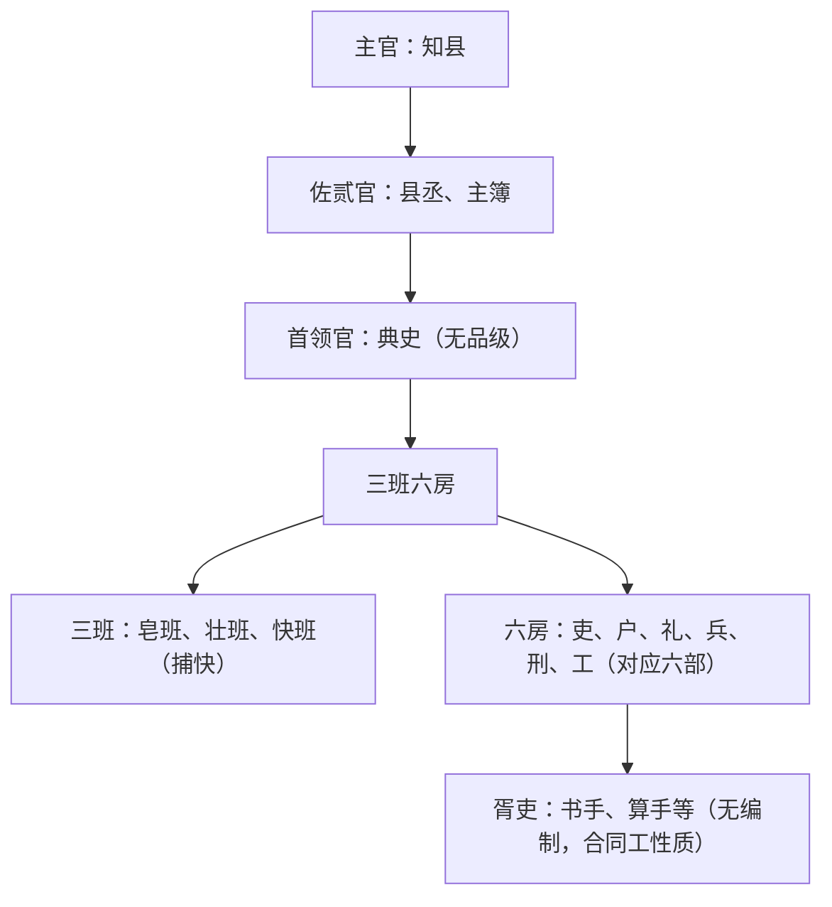

# 显微镜下的大明 (马伯庸) (Z-Library)_merged

状态: TODO
Update Date: 2025年11月11日 07:59
Create Date: 2025年11月11日 07:38

# 显微镜下的大明 (马伯庸) (Z-Library) - 合并版

创建于：2025-11-10 16:52:58

标签：
AI链接笔记
版权信息
显微镜下的大明
马伯庸作品

---

原文：[(anonymous)](https://pdf-1381123255.cos.ap-beijing.myqcloud.com/%E6%98%BE%E5%BE%AE%E9%95%9C%E4%B8%8B%E7%9A%84%E5%A4%A7%E6%98%8E%20%28%E9%A9%AC%E4%BC%AF%E5%BA%B8%29%20%28Z-Library%29_01_%E7%89%88%E6%9D%83%E4%BF%A1%E6%81%AF.pdf)

### 1. 基础版权信息 [00:00-00:10]

- 书名：显微镜下的大明
- 作者：马伯庸
- 出版社：湖南文艺出版社·博集天卷
- 出版时间：2019年1月
- ISBN：9787540488475

### 2. 电子版授权信息 [00:10-00:20]

- 授权方：北京中联百文文化传媒有限公司
- 授权内容：得到APP电子版制作与发行
- 版权声明：版权所有·侵权必究

---

# 第一章都是学霸惹的祸 - 徽州丝绢案起源

创建于：2025-11-10 16:53:15

标签：
AI链接笔记
徽州丝绢案
人丁丝绢税
乙巳改科

---

原文：[(anonymous)](https://pdf-1381123255.cos.ap-beijing.myqcloud.com/%E6%98%BE%E5%BE%AE%E9%95%9C%E4%B8%8B%E7%9A%84%E5%A4%A7%E6%98%8E%20%28%E9%A9%AC%E4%BC%AF%E5%BA%B8%29%20%28Z-Library%29_02_%E7%AC%AC%E4%B8%80%E7%AB%A0%E9%83%BD%E6%98%AF%E5%AD%A6%E9%9C%B8%E6%83%B9%E7%9A%84%E7%A5%B8.pdf)

### 一、背景介绍（无明确时间戳）

- **地理背景**
大明南直隶徽州府下辖歙县等六县，歙县为附郭县（府治所在），府县同城办公。
- **户籍制度**
军户是大明特有户籍，世代为军，归属各地卫所（类似军分区），如张居正、帅嘉谟均为军户出身。

### 二、核心人物与事件起因（隆庆三年）

- **关键人物**
帅嘉谟（字禹臣）：祖籍江夏的军户，隶属新安卫，对数字敏感的数学学霸。
- **发现疑点**
    1. 徽州府每年向南京承运库缴纳“人丁丝绢”8780匹生绢，仅歙县账簿有记录，其他五县无此支出。
    2. 核查《大明会典》发现，该税目应为徽州府六县均摊，而非歙县单独承担。

### 三、历史溯源与计算验证（无明确时间戳）

- **历史线索**
    1. **乙巳改科**（元至正二十五年，1365年）：徽州府六县共亏欠夏粮20480石，以“夏税生丝”名义补缴，折8780匹生绢。
    2. **长期谬误**：该税本应六县分摊，却被改为歙县单独缴纳，至隆庆三年已持续约200年。
- **数据验证**
    - 歙县亏欠夏麦9700石（折银2910两）+ 其他五县亏欠10780石（折银3234两）= 6144两，与“人丁丝绢”折银6146两仅差2两。

### 四、早期申诉与阻力（嘉靖十四年-隆庆四年）

- **前人尝试**
嘉靖十四年（1535年），歙县人程鹏、王相曾越级申诉至应天巡抚和巡按，但因官员调任、五县推诿无果。
- **帅嘉谟的策略**
    1. **呈文技巧**：引用《徽州府志》（实为篡改）强调“六县均输”，并以“一条鞭法”政策（均平赋役、折银征收）为依据。
    2. **情感与数据攻势**：对比浙江、湖广等产丝大区税负，突出歙县非产丝区需“卖粮购丝”的双重负担。

### 五、争议升级与地方博弈（隆庆四年）

- **海瑞批示与中断**
隆庆四年二月，应天巡抚海瑞批示“仰府查议报夺”，但随即调任南京粮储，案件失去推动力。
- **五县抵制**
    1. 以绩溪县教谕杨存礼为代表，指责帅嘉谟“变乱国制”，并以“民变”威胁施压。
    2. 五县知县以“筹备朝觐”为由消极拖延，徽州府以“维稳”为由搁置合议。

### 六、进京上访与后续（隆庆四年-万历三年）

- **关键发现**
帅嘉谟查出徽州府篡改税目：将六县均摊的“人丁丝绢”改为歙县单独缴纳的“夏税生丝”。
- **南京申诉**
隆庆五年六月，通过南京都察院宋御史递呈，获户部支持要求徽州府“查勘税目起源与分摊方案”。
- **危机与沉寂**
帅嘉谟遭死亡威胁逃回原籍，案件停滞至万历三年（1575年）再度爆发。

---

# 万历三年徽州六县丝绢税争议事件全解析

创建于：2025-11-10 16:53:31

标签：
AI链接笔记
万历三年丝绢案
徽州六县争议
明代赋税制度

---

原文：[(anonymous)](https://pdf-1381123255.cos.ap-beijing.myqcloud.com/%E6%98%BE%E5%BE%AE%E9%95%9C%E4%B8%8B%E7%9A%84%E5%A4%A7%E6%98%8E%20%28%E9%A9%AC%E4%BC%AF%E5%BA%B8%29%20%28Z-Library%29_03_%E7%AC%AC%E4%BA%8C%E7%AB%A0%E5%85%AD%E5%8E%BF%E5%A4%A7%E8%BE%A9%E8%AE%BA.pdf)

### 一、事件起因与背景（万历三年三月）

### 1.1 徽州府缉拿帅嘉谟（00:00-05:00）

- 罪名：”捏作在外，屡提不到”，实为欲加之罪
- 矛盾焦点：帅嘉谟为歙县申诉”人丁丝绢”独征问题
- 徽州府动机：户部催办+张居正内阁施压（奉圣旨督办）

### 1.2 军户制度与跨部门执法（05:00-10:00）

- 帅嘉谟身份：军户（隶属新安卫）
- 执法流程：需歙县与新安卫联合行动
- 结果：仅抓获其亲属帅贵，本人躲至江夏县

### 二、歙县官方正式介入（万历三年四月）

### 2.1 知县姚学闵申文（10:00-15:00）

- 核心论点：
    1. 《大明会典》未记载歙县单独缴纳义务
    2. “人丁丝绢”被篡改”夏税生丝”科目
    3. 徽州府户房被五县胥吏把持（世顶名缺）

### 2.2 乡宦全明星阵容背书（15:00-25:00）

- 汪尚宁：都察院右副都御史（副部级）
- 汪道昆：兵部左侍郎（正三品）
- 江珍：贵州左布政使（省部级）
- 方弘静：南京户部右侍郎（副部级）

### 三、六县辩论全面爆发（万历三年五月-七月）

### 3.1 婺源反击（25:00-30:00）

- 知县吴琯主张：歙县亏欠夏麦9700石需补
- 关键提议：查阅洪武十四年黄册原始记录

### 3.2 绩溪辩论策略（30:00-35:00）

- 知县陈嘉策反例举证：
    - 松江府绿豆仅征华亭县
    - 淮安府药材仅征山阳县
    - 金华府麻地仅征武义县

### 3.3 休宁数据攻坚战（35:00-45:00）

- 知县陈履核心证据：
    1. 歙县原有桑园（登瀛/明德乡）
    2. 生丝折绢计算：10974.3斤÷24两/匹=8779匹
    3. 弘治十四年调整折率为20两/匹（定额未变）

### 四、争议升级与黄册调查（万历三年十二月-四年九月）

### 4.1 五县联合声明（45:00-50:00）

- 发布《五邑民人诉辩妄奏揭帖》
- 一致要求：以黄册原始记录为准

### 4.2 后湖查册风波（50:00-60:00）

- 调查团组成：歙县县丞+婺源县丞+休宁训导+帅嘉谟
- 关键发现：洪武十四年黄册关键记录缺失
- 帅嘉谟应对：主张以《大明会典》权威性为准

### 五、核心争议焦点总结

### 5.1 法律依据之争（60:00-65:00）

- 歙县：《大明会典》”徽州府输绢”=六县均摊
- 五县：黄册原始记录=歙县独征

### 5.2 历史遗留问题（65:00-70:00）

- 乙巳改科（洪武年间税赋调整）
- 军户与民户赋税差异
- 地方胥吏势力操控（世顶名缺）

---

# 大明万历年间徽州府民间骚乱事件概述

创建于：2025-11-10 16:53:47

标签：
AI链接笔记
大明万历
徽州府骚乱
官场博弈

---

原文：[(anonymous)](https://pdf-1381123255.cos.ap-beijing.myqcloud.com/%E6%98%BE%E5%BE%AE%E9%95%9C%E4%B8%8B%E7%9A%84%E5%A4%A7%E6%98%8E%20%28%E9%A9%AC%E4%BC%AF%E5%BA%B8%29%20%28Z-Library%29_04_%E5%BC%95%E8%A8%80.pdf)

### 1. 事件背景 - 时间与地点

- 时间：大明万历年间
- 地点：徽州府

### 2. 事件规模与影响范围

- 骚乱规模：不算大
- 持续时间：将近十年
- 波及对象：当地百姓、乡绅乡宦、一府六县官员、应天巡按、应天巡抚、户部尚书、当朝首辅

### 3. 事件核心特征

- 利益集团博弈：诸多利益集团各怀心思，彼此攻讦、算计、妥协
- 官场运作体现：大明朝廷决策出炉过程、地方执行落实方式、官场规则运作模式、利益集团博弈细节纤毫毕现

### 4. 骚乱起因

- 特殊起因：非天灾也非盗匪，源于一位学霸做数学题

---

# 第三章 稀泥与暴乱：徽州丝绢案的税制博弈与社会动荡

创建于：2025-11-10 16:54:03

标签：
AI链接笔记
徽州丝绢案
一条鞭法
明朝税制改革

---

原文：[(anonymous)](https://pdf-1381123255.cos.ap-beijing.myqcloud.com/%E6%98%BE%E5%BE%AE%E9%95%9C%E4%B8%8B%E7%9A%84%E5%A4%A7%E6%98%8E%20%28%E9%A9%AC%E4%BC%AF%E5%BA%B8%29%20%28Z-Library%29_05_%E7%AC%AC%E4%B8%89%E7%AB%A0%E7%A8%80%E6%B3%A5%E4%B8%8E%E6%9A%B4%E4%B9%B1.pdf)

### 一、户部介入与均平方案（万历四年）

### 1.1 户部公文背景

- 徽州府六县因”人丁丝绢”税争议不休，户部以”均平”原则提出解决方案
- 核心逻辑：合并税种、计亩征银，暗合张居正”一条鞭法”改革方向

### 1.2 方案内容

- 统计六县丁粮田亩，合并所有税赋均摊折算
- 结果显示歙县税负超平均值，判定”人丁丝绢”为额外负担

### 二、地方博弈与政策反复（万历四年-五年）

### 2.1 太平府方案（万历四年十一月）

- 丝绢税仍由歙县独交（6145两），但从五县均平银中冲抵5260两
- 五县哗然，认为”换汤不换药”，直指户部尚书殷正茂（歙县人）徇私

### 2.2 冯叔吉折中方案（万历五年）

- 冲抵金额调整为3300两，歙县与五县负担比例46%:54%
- 五县仍不满，称其为”朝三暮四之术”

### 三、社会激变与权力真空（万历五年六月-七月）

### 3.1 婺源议事局成立

- 生员程任卿占领紫阳书院，竖”激变旗”组织抗议
- 动员五县民众围攻县衙、拦截官员，甚至截留公文

### 3.2 休宁-婺源暴乱升级

- 休宁民众伪造公文，谎称”歙贼入侵”引发江南震动
- 婺源县内派系火并，程任卿被指”通歙”遭殴打

### 四、朝廷弹压与责任清算（万历五年七月）

### 4.1 官方应对措施

- 巡按都院发布告示，威胁”倡言鼓众者军法处置”
- 逮捕帅嘉谟（罪名：挪用40两公款买冠带），五县首恶入狱

### 4.2 乡宦转向

- 休宁乡宦汪文辉等上书，将暴乱责任归咎于殷正茂”权奸变制”

### 五、最终解决方案（万历五年-七年）

### 5.1 方案迭代

- **第三版（1577.12）**：五县均摊额降至2000两
- **第四版（1578.11）**：由徽州府从料价银/军需银中补贴
- **第五版（1579.3）**：清查”协济金衢道兵饷银”等重复税种，最终实现”共免两全法”

### 5.2 结果

- 歙县实际税负降至额定70%，五县未增负担
- 为张居正”一条鞭法”提供基层实践案例

---

# 徽州丝绢案：帅嘉谟与程任卿的命运转折

创建于：2025-11-10 16:54:19

标签：
AI链接笔记
徽州丝绢案
帅嘉谟
程任卿

---

原文：[(anonymous)](https://pdf-1381123255.cos.ap-beijing.myqcloud.com/%E6%98%BE%E5%BE%AE%E9%95%9C%E4%B8%8B%E7%9A%84%E5%A4%A7%E6%98%8E%20%28%E9%A9%AC%E4%BC%AF%E5%BA%B8%29%20%28Z-Library%29_06_%E7%AC%AC%E5%9B%9B%E7%AB%A0%E7%A7%8B%E5%90%8E%E7%AE%97%E8%B4%A6.pdf)

### 一、案件审判与判决（万历五年-六年）

### 1.1 徽州府初审判决（万历五年九月） ⏰

- 帅嘉谟罪名：”捏造写词恐吓得财，计赃满贯”
- 判决结果：帅嘉谟、程任卿等被判充军
- 判决本质：政治性判决，牺牲帅嘉谟换取五县稳定

### 1.2 三府会审加重判罚（时间未明确） ⏰

- 冯叔吉认为原判过轻，提审至太平府
- 最终判决：帅嘉谟”杖一百流三千里，遣边戍军”
- 刑部审批：万历六年七月二十日获圣旨批准

### 二、关键人物结局

### 2.1 帅嘉谟戍边 ⏰

- 历史记载：《歙县志》将其列为义士
- 评价：”以匹夫而尘万乘之览，以一朝而翻百年之案”
- 后续：戍边后事迹无记载

### 2.2 程任卿的特殊命运 ⏰

- 罪名：被判斩监候（死刑缓期执行）
- 狱中作为：编撰《丝绢全书》收录案件文献
- 结局：在狱二十年后改判充军，后立军功任把总

### 三、《丝绢全书》的文献价值

### 3.1 编撰背景 ⏰

- 成书时间：程任卿入狱半年后完成
- 内容结构：分金、石、丝、竹等八卷，收录137篇文书
- 编撰原则：客观中立，保留各方文献原貌

### 3.2 历史意义 ⏰

- 文献价值：填补明代县级民间事件记录空白
- 收录范围：涵盖官府公文、民间诉状、书信题记等
- 独特性：唯一完整记录徽州丝绢案全过程的史料

### 四、案件背后的政治角力

### 4.1 张居正的隐秘影响 ⏰

- 余懋学疏奏揭露：张居正借案打击政敌
- 关键证据：《丝绢全书》收录三份查缉”豪右”的官方文件
- 程任卿重判原因：被视为余懋学同党遭牵连

### 4.2 余懋学的政治救赎 ⏰

- 上疏目的：为程任卿减刑并澄清冤情
- 核心观点：列举”五不堪、五不通、四诬捏、四不协”批判原判
- 结果：程任卿改判充军，丝绢税制维持不变

---

# 中国古代户籍制度演变：从秦简到明代户帖制 🔍

创建于：2025-11-10 16:54:35

标签：
AI链接笔记
中国古代户籍制度
秦代档案管理
汉代户律

---

原文：[(anonymous)](https://pdf-1381123255.cos.ap-beijing.myqcloud.com/%E6%98%BE%E5%BE%AE%E9%95%9C%E4%B8%8B%E7%9A%84%E5%A4%A7%E6%98%8E%20%28%E9%A9%AC%E4%BC%AF%E5%BA%B8%29%20%28Z-Library%29_07_%E7%AC%AC%E4%B8%80%E7%AB%A0%E5%A4%A9%E4%B8%8B%E9%80%8F%E6%98%8E.pdf)

### 一、秦代户籍制度的奠基（公元前206年）

### 1.1 萧何的战略远见（00:00-05:30）

- **核心事件**：刘邦入咸阳后，萧何独取秦丞相御史府档案，含天下郡县户口版籍、土地图册、律令文书
- **关键价值**：为刘邦提供”天下透明”的战略数据，支撑”养其民、收巴蜀、定三秦”规划
- **历史记载**：《汉书》评”汉王所以具知天下厄塞、户口多少、强弱之处，以何具得秦图书也”

### 1.2 秦代户籍制度特点（05:31-10:15）

- **数据维度**：涵盖人口（年龄/爵位/迁徙）、土地（位置/面积/作物）、财产（牲畜/税赋）
- **管理体系**：每年更新档案，通过”上计”制度汇总中央，形成动态数据库
- **制度遗产**：商鞅变法确立”十三类数据”管理体系，始皇时期发展为全国性行政网络

### 二、汉代户籍制度的继承与发展（公元前203年）

### 2.1 《户律》的创立（10:16-15:40）

- **萧何改革**：在秦律基础上制定《九章律》，新增《户律》《兴律》《厩律》
- **核心条款**：
    - 计家为户，计人为口，登记籍贯/爵位/年龄/财产
    - 每年八月”案比”（户口核查），三年一”上计”
    - 虚报年龄达三岁者罚钱，强化数据真实性

### 2.2 汉代户籍的历史影响（15:41-20:25）

- **统治工具**：实现”收税有据，束民有方”，成为历代王朝统治基础
- **制度延续**：东晋黄籍白籍、唐代九等户籍、宋代主客户制均承袭汉律精神

### 三、明代户籍制度的重建（1368-1371年）

### 3.1 明初户籍困境（20:26-25:10）

- **元代遗产**：”诸色户计”体系混乱，含职业户（军/匠/盐）、宗教户、贵族私属户等数十类
- **现实挑战**：”版籍多亡，田赋无准”，人口流亡率高，土地隐匿严重

### 3.2 户帖制的创新实践（25:11-35:00）

- **制度设计**（洪武三年，1370年）：
    - **格式规范**：一尺三寸长×一尺二寸宽，分右（圣旨）、中（户情）、左（签押）三区
    - **内容要素**：乡贯/丁口/妇女/户种/事产/住址，骑缝编号+户部半印防伪
    - **执行流程**：户部印制→州县分发→里正核实→百姓申报→籍联存档→户联收执
- **白话圣旨特色**：
> “说与户部官知道，如今户口不明白俚。教中书省置下勘合文簿户帖…比不着的，便拿来做军”
- **成效**：登记人口超5500万，实现”人锁住、地可查”的统治目标

### 3.3 户帖制的历史局限（35:01-40:00）

- **未解决问题**：
    - 土地数据缺失：未同步清丈田地，依赖”金华经验公式”（产量反推面积）
    - 职业户制残留：保留民/军/匠/灶四类，延续元代职业禁锢
- **后续完善**：洪武十四年（1381年）推行黄册与鱼鳞图册，形成”户-地”双轨管理体系

---

# 玄武湖的历史变迁与多舛命运

创建于：2025-11-10 16:54:52

标签：
AI链接笔记
玄武湖历史
湖泊名称演变
孙权 玄武湖

---

原文：[(anonymous)](https://pdf-1381123255.cos.ap-beijing.myqcloud.com/%E6%98%BE%E5%BE%AE%E9%95%9C%E4%B8%8B%E7%9A%84%E5%A4%A7%E6%98%8E%20%28%E9%A9%AC%E4%BC%AF%E5%BA%B8%29%20%28Z-Library%29_08_%E5%BA%8F%E7%AB%A0%E5%A4%A9%E7%94%9F%E5%91%BD%E8%8B%A6%EF%BC%8C%E6%B9%96%E4%B8%AD%E7%8E%84%E6%AD%A6.pdf)

### 1. 玄武湖的拟人化形象（0-10分钟）

- 🌊 中华湖泊拟人对比：
    - 鄱阳湖→器宇轩昂名士
    - 洞庭湖→才华横溢诗人
    - 太湖→叱咤风云大侠
    - 西湖→清纯少女
    - 玄武湖→满脸悲苦的沧桑大叔（屡遭劫难的”湖生”）

### 2. 先秦至汉代的早期历史（10-25分钟）

- 🏛️ 名称演变：
    - 古称”桑泊”（楚国金陵邑时期）
    - 更名”秣陵湖”（秦始皇设秣陵县）
- 传说典故：
    - 望气士称此地有”王气”
    - 秦始皇凿方山泄王气（于史无证，后人附会）
- 汉代状态：籍籍无名，无显著事迹

### 3. 三国至南朝的发展（25-45分钟）

- 🔄 名称更迭：
    - 蒋陵湖（孙权避祖父孙钟讳，因蒋子文陵墓得名）
    - “后湖”（因位于宫苑之后得名）
- 孙权时期影响：
    - 修青溪借走一半湖水
    - 欲修宫苑水路再次借水，因湖水枯竭改引江水
- 南朝兴盛期：
    - 面积达15平方公里（现为1/3）
    - 堆”三神山”（蓬莱、方丈、瀛洲）
    - 修建上林苑、华林苑等皇家园林

### 4. 隋唐至南唐的衰落与短暂复兴（45-65分钟）

- ⚡ 隋朝劫难：
    - 隋文帝推平建康宫苑，玄武湖被填为农田
- 唐代状况：
    - 颜真卿设放生池（湖泊萎缩）
    - 李白诗句”空馀后湖月，波上对江州”
- 南唐复兴：
    - 后主李煜疏浚恢复
    - 冯谧求赐30里湖面遭徐铉讽刺（典出《善谑集》）

### 5. 宋代至明代的重大变迁（65-90分钟）

- 🔨 王安石”废湖为田”：
    - 排空湖水得200余顷农田
    - 开十字河、立四斗门
    - 写诗《书湖阴先生壁》纪念
- 元明时期：
    - 元代两次疏浚恢复蓄水
    - 朱元璋定都后湖：
    - 恢复至最盛时1/3面积
    - 实施”封湖”政策（持续近300年）

---

# 朱元璋的理想：户籍与基层控制制度（第二章）

创建于：2025-11-10 16:55:09

标签：
AI链接笔记
朱元璋
里甲制
赋役黄册

---

原文：[(anonymous)](https://pdf-1381123255.cos.ap-beijing.myqcloud.com/%E6%98%BE%E5%BE%AE%E9%95%9C%E4%B8%8B%E7%9A%84%E5%A4%A7%E6%98%8E%20%28%E9%A9%AC%E4%BC%AF%E5%BA%B8%29%20%28Z-Library%29_09_%E7%AC%AC%E4%BA%8C%E7%AB%A0%E6%9C%B1%E5%85%83%E7%92%8B%E7%9A%84%E7%90%86%E6%83%B3.pdf)

### 一、朱元璋的理想与基层控制目标（00:00-05:00）

- **核心诉求**：实现对社会细致全面的控制，使统治意志直达最基本户籍单位“户”📜
- **现实挑战**：古代科技水平低下，管理成本高昂，中央指令难以100%贯彻
- **历史教训**：
    - 秦朝：过度掌控基层导致管理成本过高，法律严苛形成恶性循环，成为灭亡深层原因之一
    - 西汉至历代：行政力量一般只延伸到县一级，将部分管理权让渡给地方大族，形成中央与地方管理平衡

### 二、明初基层管理问题与改革背景（05:00-10:00）

- **元代遗留问题**：粗放型管理持续百年，地方形成独立小圈子，中央政令执行难度高
- **朱元璋应对措施**：强行迁移浙西富户至京城，但属偶发手段，需制度性解决方案
- **改革基础**：户帖推行一定程度改善局面，但存在妥协，需系统升级

### 三、里甲制的设计与试点（10:00-20:00）

- **湖州小黄册试点**：
    - 基本行政单位“图”：100户为1图，10户1甲设甲首，10甲设里长（非政府编制）
    - 选拔方式：轮换制，按丁粮多寡排序，前十名富户轮流任里长（十年一轮），11-20名任甲首
    - 核心职能：催办税粮军需、排解纠纷、文书作保、治安巡检等，替代乡绅权力
- **制度创新**：
    - 权力分散：打破地方大族垄断，实现“皇帝轮流做”，切割地方利益集团
    - 成本控制：里长、甲首无俸禄，工作支出集体公摊，降低政府管理成本

### 四、全国版里甲制的推行与完善（20:00-30:00）

- **正式推行时间**：洪武十四年（基于湖州试点10年经验）
- **核心升级**：
    1. **建制扩展**：农村设“里”，城市设“坊”，城郊设“厢”
    2. **户籍全覆盖**：民户、军户、匠户、僧道（有田产者）均造册
    3. **户数调整**：110户为1里（10里长+10甲×10户）
    4. **新增徭役职责**：区分“正役”与“杂泛”，十年一轮，公平摊派
- **轮役机制**：
    - 十年周期：每年1里长+1甲（甲首+9户）应役，110户均有份
    - 人户分等：按丁口分上、中、下三等，轮役出丁数不同
    - 连坐制度：一户逃避徭役，全甲受罚；一甲出问题，全里株连

### 五、里甲制的制约与平衡机制（30:00-35:00）

- **老人制**：选拔德高望重老人裁决乡里争讼，制衡里长权力，规定“民间小事先经里甲老人理断”
- **规则约束**：朝廷下发《乡饮酒礼图式》等工作手册，结合地方乡约形成基层准法律条规
- **粮长制**：保留粮长职务（万石税赋区域设1人），监控官吏贪腐，绕开豪右揽纳，辅助里甲工作

### 六、赋役黄册制度（35:00-45:00）

- **与户帖的区别**：
    - 内容更详细：记录田土买卖细目、应纳税额，采用“旧管、新收、开除、实在”四柱式登记
    - 功能扩展：锁定徭役安排，附“编次格眼”（百眼图）作为排班表，又称“赋役黄册”
- **黄册名称由来**：源于“黄口”（代指幼童），隋唐户籍登记中“黄口始生，遂登其数”，后演变为户籍代称
- **分类管理**：民黄册（非现役军人）、军黄册、匠籍册、灶籍册等，分属不同部门掌管

### 七、鱼鳞图册的编订（45:00-55:00）

- **启动时间**：洪武二十年，由国子生武淳主持
- **核心内容**：记录田亩所属、方位、面积、形状、地形、四至、肥瘠、佃户等信息，状如鱼鳞
- **推行基础**：依托里甲制、黄册、粮长制，监生与粮长配合，以“万石”为单位分区清丈
- **完成范围**：先两浙与直隶，后逐步推广，持续至永乐年间

### 八、户籍制度的成效与局限（55:00-60:00）

- **成效**：
    - 严密控制民众：黄册+里甲制管人口徭役，鱼鳞图册+粮长管田地租赋，民众被束缚于土地
    - 稳固税基：全国户数1065万+，人口6054万+，耕地880万顷+，夏麦469万石+，秋米2472万石+
    - 政策自信：洪武二十八年宣布新垦土地“永不起科”（先山东、河南，后扩至北方）
- **局限**：
    - 理想化与僵化：追求绝对平均，束缚民众流动性，后世难以持续
    - 制度变质：“永不起科”正统年间被打破，粮长演变为民众负担，引发流民潮

---

# 第三章 天下第一档案库：明代黄册库的建立与运作

创建于：2025-11-10 16:55:25

标签：
AI链接笔记
明代黄册库
后湖档案管理
千文架阁法

---

原文：[(anonymous)](https://pdf-1381123255.cos.ap-beijing.myqcloud.com/%E6%98%BE%E5%BE%AE%E9%95%9C%E4%B8%8B%E7%9A%84%E5%A4%A7%E6%98%8E%20%28%E9%A9%AC%E4%BC%AF%E5%BA%B8%29%20%28Z-Library%29_10_%E7%AC%AC%E4%B8%89%E7%AB%A0%E5%A4%A9%E4%B8%8B%E7%AC%AC%E4%B8%80%E6%A1%A3%E6%A1%88%E5%BA%93.pdf)

### 一、黄册制度的起源与存档规范（00:00-05:30）

📜 **黄册编制要求**

- **册本数量**：每级官府需制作4本，1本上缴户部（正册，黄纸封面），3本留存地方（底册，青纸封面，洪武24年规定）

- **传递流程**：里→县→府→布政司→京城户部，形成中央集权象征

### 二、黄册库选址与后湖改造（05:31-15:45）

🏯 **选址背景**

- 洪武14年初次攒造黄册达53,393本，需解决 storage 难题

- 后湖（今玄武湖）优势：水域环绕防火、隔绝闲杂人等、距京城近

🔨 **湖区改造工程**

1. **地理隔离**

- 修筑城墙/堤坝阻断山体与湖水联系（如太平堤、钟山濒湖城墙）

- 设闸门切断秦淮河与长江通道，形成独立水域

2. **居民迁移**

- 强制迁出湖区渔民、农户，引发”毛老人镇鼠”民间传说（附会朱元璋活埋老人以”猫”镇鼠）

### 三、黄册库建筑设计与管理规范（15:46-25:10）

🏗️ **库房结构**

- **朝向设计**：东西向为主，利用日光晾晒防潮防虫，南北向为辅

- **架阁系统**：木制多层敞开式架子，每库4个架阁，分层分格存放（禁用竹制，承重不足）

- **防火措施**：地面铺沙覆木板、严禁库内用火、厨房隔离1里以上

📋 **档案管理**

- **晾晒制度**：每年4-10月定期晒册，每次持续5天，用砖墩铁棍搭建晾晒架

- **检索体系**：采用”千文架阁法”，以《千字文》为编号（如”天地玄黄”序列）

### 四、黄册库规模扩张与运营机制（25:11-35:20）

📈 **发展历程**

- **初期规模**：洪武年间梁洲建36间库房，存洪武14年黄册用35座架阁

- **迁都影响**：永乐迁都北京后，黄册库留南京由南京户部代管，江南税赋重地需求

- **明末规模**：库房787间、架阁3,086座，黄册近200万册

🛡️ **安保体系**

- **军事禁区**：三支部队沿湖巡逻，50步设哨卡，湖面定期巡查

- **通行限制**：每月仅逢一/六开湖，需验身份文书，船只铁索锁封

- **人员配置**：南京户科给事中（监督）、户部广西清吏司主事（管理）、50名监生+30名小吏负责日常维护

### 五、黄册库权力斗争与历史影响（35:21-45:00）

⚔️ **典型事件**

- **弘治年间纠纷**：太监郭镛擅闯禁地遭御史弹劾，引发宦官与文官集团报复性博弈

- **何穆整改措施**：设水位刻度、立界碑、限捕鱼时间，变相削弱御史权力

📜 **历史地位**

- 持续运营260余年无火灾，成为明代户籍与赋役管理核心数据库

- 象征中央对地方的绝对掌控，时人评价”天下黄册，实国家重务，亿万载无疆之根本也”

---

# 第四章 黄册攻防战

创建于：2025-11-10 16:55:42

标签：
AI链接笔记
明代黄册制度
后湖驳查
赋役制度舞弊

---

原文：[(anonymous)](https://pdf-1381123255.cos.ap-beijing.myqcloud.com/%E6%98%BE%E5%BE%AE%E9%95%9C%E4%B8%8B%E7%9A%84%E5%A4%A7%E6%98%8E%20%28%E9%A9%AC%E4%BC%AF%E5%BA%B8%29%20%28Z-Library%29_11_%E7%AC%AC%E5%9B%9B%E7%AB%A0%E9%BB%84%E5%86%8C%E6%94%BB%E9%98%B2%E6%88%98.pdf)

### 一、黄册攒造流程（0-38%）

### 1.1 中央到地方的文书流转

- 户部提前半年制定标准格式→下发地方官府翻刻”清册供单”
- 里长、甲首逐层分发供单至每户填写并签名作保
- 里长合成110户供单上交县衙，户房吏书磨算复核（书手负责抄写、算手专司会计）

### 1.2 里册与州县册的形成

- 复核无误后造两本里册：黄封上缴/青封留底（费用由110户自筹）
- 州县汇总数据造总册，仅记录各里总数，实行”本管正官躬亲磨算”制度

### 1.3 黄册规范与材质要求

- 尺寸：宽1尺2寸×长1尺3寸，字体从小字楷书改为大字楷书（弘治三年防作弊）
- 材质：厚实绵纸（禁用粉饰漂白），绵索装订（糨糊需掺花椒明矾防虫蛀）

### 二、后湖驳查制度（38%-65%）

### 2.1 国子监监生的职责与困境

- 工作量：1200名监生人均驳查50本（5500户），3个月内完成
- 工作环境：冬寒夏暑/蚊虫瘴气/湖禁森严（病死需待开湖运尸）
- 待遇问题：义务劳动无酬劳，驳查时间不纳入”实历”考核

### 2.2 驳查效率的衰退

- 监生数量骤减：从1200名（洪武）→200余名（成化十一年）
- 逃役手段：申请”依亲读书”回乡/以丁忧守制为由拖延/雇人冒名顶替
- 工作周期延长：从3个月→2-3年（正德五年新旧黄册积压）

### 三、民间舞弊手段（65%-90%）

### 3.1 人口与田产隐匿

- 活洒：将田地分洒于贫困户名下（如50户各摊1亩）
- 死寄：把土地挂靠绝户名下（利用疫病死亡户籍漏洞）
- 花分子户：通过分家降低户等（上户改中户/中户改下户）

### 3.2 土地交易作弊

- 全不过割：私下白契交易不办红契（逃避官府登记）
- 包纳：仅办理部分田产过户，剩余由原主代耕代缴
- 埋没：篡改土地等级（如良田改盐碱地降税赋）

### 3.3 户籍篡改技术

- 声东击西：故意留破绽引驳查，借机修改其他数据
- 粉饰蛀蚀：用石黄粉末+蜜水装订，加速黄册虫蛀销毁
- 监守自盗：买通后湖库匠扯毁关键页（如陈季三案烧毁塘产记录）

### 四、军户与特殊户籍的困境（90%-98%）

### 4.1 军户负担与逃亡

- 服役要求：正军+余丁2名服役，继丁候补（幼丁也需登记）
- 逃亡手段：贿赂书手改民籍/冒流民异地落籍/过继入赘脱军籍

### 4.2 站户与职业户的反抗

- 站户改籍：驴站户通过”声东击西”法混入民籍
- 集体舞弊：军户集体改属异地卫所（如饶州改福建都司管辖）

### 五、制度崩溃的根源（98%-100%）

- 士绅集团阻挠：利用科举特权兼并土地，形成”投献”利益链
- 基层生态腐败：里长-胥吏-富户勾结，”团局造册”成窝案常态
- 技术手段失效：四柱法核查被流程漏洞破解，黄册沦为形式

---

# 大明后湖黄册库的财政困境与制度崩坏

创建于：2025-11-10 16:56:00

标签：
AI链接笔记
后湖黄册库
明朝财政制度
驳费制度

---

原文：[(anonymous)](https://pdf-1381123255.cos.ap-beijing.myqcloud.com/%E6%98%BE%E5%BE%AE%E9%95%9C%E4%B8%8B%E7%9A%84%E5%A4%A7%E6%98%8E%20%28%E9%A9%AC%E4%BC%AF%E5%BA%B8%29%20%28Z-Library%29_12_%E7%AC%AC%E4%BA%94%E7%AB%A0%E5%B8%9D%E5%9B%BD%E4%B8%80%E8%A7%92%E7%9A%84%E7%B9%81%E8%8D%A3%E6%80%A7%E5%B4%A9%E5%A1%8C.pdf)

### 一、黄册库的财政窘境（00:00-05:30）

💰 **预算缺失的根源**

- 朱元璋设计的”无专项预算”制度：费用由多部门分摊（国子监、刑部、工部等）

- 核心矛盾：朝廷重视黄册库功能却不编列专项支出，依赖各部门”结余”填补

### 二、多部门分摊机制的崩溃（05:31-12:15）

🔄 **责任推诿的恶性循环**

- 朱元璋去世后，部门间以”不敷”为由互相踢皮球

- 永乐迁都后，供养责任转移至南京六部（权势衰弱），两县百姓成为最终负担者

- 典型案例：南京国子监仅承担监生费用，其他支出一概推诿

### 三、驳费制度的诞生与异化（12:16-20:45）

💸 **从罚款到敛财工具**

- **正德九年改革**：史鲁提出”赃罚纸价”制度，对错误黄册罚款充作经费

- **利益链条形成**：

1. 黄册库：依赖罚款维持运营，倾向”滥驳”

2. 地方官吏：故意制造错误，借机加征罚款牟利

3. 底层百姓：承担造册费+罚款+高利贷多重剥削

### 四、繁荣性坍塌的典型表现（20:46-28:30）

📉 **制度功能的彻底异化**

- **财政吸血链**：

- 地方：江西等地公然截留40%驳费

- 中央：工部、兵部、皇帝以各种名义挪用库银

- **黄册质量崩坏**：

- 弘治三年：80%黄册封皮腐烂

- 正德年间：江西黄册8年即蛀成灰末

- 万历时期：扬州府现”三千百岁户主”荒谬案例

### 五、制度崩坏的深层原因（28:31-35:00）

🏛️ **大明体制的结构性缺陷**

- 皇帝拒拨专项预算，依赖”罚款自养”的畸形模式

- 官僚体系利益固化：从皇帝到里长均参与利益分肥

- 监督失效：黄册库沦为”空城计”，靠神秘感维持威慑

---

# 明朝黄册制度的崩溃与影响

创建于：2025-11-10 16:56:16

标签：
AI链接笔记
明朝黄册制度
赋役制度
张居正改革

---

原文：[(anonymous)](https://pdf-1381123255.cos.ap-beijing.myqcloud.com/%E6%98%BE%E5%BE%AE%E9%95%9C%E4%B8%8B%E7%9A%84%E5%A4%A7%E6%98%8E%20%28%E9%A9%AC%E4%BC%AF%E5%BA%B8%29%20%28Z-Library%29_13_%E7%AC%AC%E5%85%AD%E7%AB%A0%E4%B8%80%E4%BB%8E%E4%B8%96%E5%8F%98%E9%99%B5%E8%B0%B7%E6%96%B0.pdf)

### 一、黄册制度的衰败（万历年间）

### 1.1 制度运行失效（无时间戳）

- 地方豪强官吏肆虐，册籍收不上来或解送不及
- 内容不合格或因驳查敛财被强行退回
- 入库后易被水泡、虫咬损坏
- 充斥埋没、飞走、诡寄、影射、挪移等奸弊，无法反映基层真实情况
- 吕坤评价：“十年册籍，半不相同，沿旧稽新，漫无可考。”

### 1.2 户口数据异常（无时间戳）

- 福建福宁州：隆庆年间户口数比洪武年减少三分之二，人口减少五分之三
- 应天府：嘉靖末年户口数为正德年间一半，万历朝仅为正德年间五分之一
- 实际情况：无战乱天灾，人口增长，大户通过包荫、冒合、逃户、隐匿、篡改等手段隐藏增长数

### 二、流民问题与基层失控（无时间戳）

### 2.1 逃户盛行（无时间戳）

- 大明对民众禁锢过严，追求稳定导致物极必反
- “民不胜弊，破资鬻产，逃亡相踵”
- 形成明中后期流民大潮，如江南“船居浮荡”现象

### 2.2 地方实征白册（无时间戳）

- 地方官衙不重视黄册，自行编造实征文册（白册）
- 记录当地人口、土地真实情况，方便管理但不上报
- 《户口总论》：“所谓黄册，只取应虚文，非其实矣。”

### 三、赋役不公与社会矛盾（无时间戳）

### 3.1 赋役制度弊端（无时间戳）

- 里甲制失效，十甲轮值、均摊徭役沦为空谈
- 权贵豪强转嫁负担给普通百姓，“十年之内，人无一岁之息”
- 巧立名目：纲银、办银、库字、夫甲、廪保、夫役、驿传、兵役、饷费等

### 3.2 张居正改革尝试（无时间戳）

- 一条鞭法：徭役分摊从按户改为按丁数和田亩数
- 力役改雇役，民众可折银上缴，官府雇工
- 官收官解，杜绝里长、粮长舞弊
- 终极目标：摊丁入亩（未完成，清朝雍正实现）

### 四、黄册制度的彻底崩溃（无时间戳）

### 4.1 执行机构瘫痪（无时间戳）

- 地方攒造虚应故事，互相推诿，上下因循
- 石耶洞篡改户籍改隶重庆卫，对抗上级
- 官员“遥度”造册，崇祯二十四年黄册成为讽刺

### 4.2 黄册库的命运（无时间戳）

- 顺治十三年：户部尚书孙廷铨发现明末黄册照抄洪武数据
- 清军南下：黄册被用于制作纸甲、药捻和引火折
- 清廷变卖黄册：工部、靖南王、江南总督等大量取用变卖
- 文人方文《负版行》记录黄册沦为街头废纸

---

# 《后湖志》与明代黄册库的历史脉络

创建于：2025-11-10 16:56:36

标签：
AI链接笔记
明代黄册库
后湖志
赵官

---

原文：[(anonymous)](https://pdf-1381123255.cos.ap-beijing.myqcloud.com/%E6%98%BE%E5%BE%AE%E9%95%9C%E4%B8%8B%E7%9A%84%E5%A4%A7%E6%98%8E%20%28%E9%A9%AC%E4%BC%AF%E5%BA%B8%29%20%28Z-Library%29_14_%E5%B0%BE%20%E5%A3%B0.pdf)

### 一、赵官与《后湖志》的编纂背景（00:00-05:00）

- **童年渊源**
弘治年间，四川合州少年赵官听闻后湖黄册库如”仙山”，埋下探索种子。
- **命运转折**
正德六年（1511年），赵官考中三甲，任南京户科给事中，主管后湖黄册库，童年幻想成为现实。

### 二、赵官对黄册库的治理与贡献（05:01-10:00）

- **防火革新**
将厨房从中洲迁至荒洲，制定严苛防火条款，奠定黄册库200余年无火灾的基础。
- **制度优化**
改善驳查监生生活环境，严查黄册舞弊，推动管理规范化。

### 三、《后湖志》的编纂历程与核心价值（10:01-18:00）

- **成书过程**
    1. 正德九年（1514年），赵官联合副手赵济宽，经8次修改成稿，定名《后湖志》（十卷）
    2. 杨廉校订、罗钦顺作序，获江右大儒高度评价：”永永无弊”
    3. 后续增补：嘉靖至天启年间经万文彩、陆凤仪等多次修订，明末因黄册废弛中断
- **内容特点**
📚 非地理志，实为后湖黄册库史，收录：
    - 黄册库沿革掌故、典籍变化
    - 主官与朝廷的奏疏公文
    - 附后湖相关诗文二卷
- **史料价值**
明代黄册研究最直接权威的一手资料，含大量细节：
    - 工食分发、监生饮食管理
    - 黄册用纸原料、库银挪用借口

### 四、《后湖志》的传承与当代意义（18:01-22:00）

- **现代遗存**
南京玄武湖梁洲设明代黄册库遗址文化展，立有赵官泥塑
- **学者贡献**
吴福林先生整理点校《后湖志》，克服版本稀、错漏多等困难，让冷门史料重光

### 五、参考学术资源（22:01-25:00）

- 何柄棣：《明初以降人口及其相关问题》
- 梁方仲：《明代赋役制度》
- 韦庆远：《明代黄册制度》
- 栾成显：《明代黄册研究》

---

# 《显微镜下的大明》序言解析 📚

创建于：2025-11-10 16:56:52

标签：
AI链接笔记
显微镜下的大明
明代基层历史
历史叙事创新

---

原文：[(anonymous)](https://pdf-1381123255.cos.ap-beijing.myqcloud.com/%E6%98%BE%E5%BE%AE%E9%95%9C%E4%B8%8B%E7%9A%84%E5%A4%A7%E6%98%8E%20%28%E9%A9%AC%E4%BC%AF%E5%BA%B8%29%20%28Z-Library%29_15_%E5%BA%8F%20%E8%A8%80.pdf)

### 一、作者与创作背景（00:00-05:00）

- 作者身份：作家（非专业明史学者）
- 创作契机：2014年听朋友讲述万历年间徽州丝绢案
- 核心史料：《丝绢全书》（含100+件官府文书/信札/布告等原始材料）
- 创作动机：原始史料阅读门槛高，需用通俗方式转述历史细节

### 二、历史叙事的创新视角（05:01-10:00）

- 传统历史叙事：宏大叙事为主，缺乏人情味
- 本书特色：聚焦基层微观历史，呈现”具体而微”的细节
    - ✅ 案例：《明实录》仅1句记载 vs 《丝绢全书》完整还原事件
    - ✅ 价值：从”小细节”见”大历史”，如显微镜观察历史切片

### 三、主要篇章内容概览（10:01-15:00）

1. **《学霸必须死——徽州丝绢案始末》**
    - 核心冲突：不公平税收政策引发的利益集团博弈
    - 传播效果：微博首发即引发广泛关注
2. **《谁动了我的祖庙——杨干院律政风云》**
    - 主题：歙县民间庙产争夺案
    - 视角：平民视角下的明代基层司法运作
3. **《笔与灰的抉择——婺源龙脉保卫战》**
    - 焦点：县级官员如何平衡地方重大议题利害
    - 史料基础：婺源《保龙全书》（佘伟点校）
4. **《天下透明——大明第一档案库的前世今生》**
    - 主线：大明黄册库从建立到毁灭的全过程
    - 延伸：探讨明代政治制度的衰落逻辑

### 四、创作理念与学术致谢（15:01-20:00）

- 叙事原则：不直接下结论，将判断权交给读者（效仿《巴黎烧了吗？》作者）
- 学术定位：转述者/翻译官角色，架起学术与大众的桥梁
- 致谢对象（核心学者）：
    1. 秦庆涛（《丝绢全书》点校注释）
    2. 章亚鹏、李义琼（明代税收史财政学解析）
    3. 廖华生（徽州基层政治生态研究）
    4. 吴福林（《后湖志》点校整理）

---

创建于：2025-11-10 16:57:09

标签：

---

原文：[https://pdf-1381123255.cos.ap-beijing.myqcloud.com/%E6%98%BE%E5%BE%AE%E9%95%9C%E4%B8%8B%E7%9A%84%E5%A4%A7%E6%98%8E%20%28%E9%A9%AC%E4%BC%AF%E5%BA%B8%29%20%28Z-Library%29_16_%E7%AC%AC%E4%B8%80%E5%8D%B7%E5%AD%A6%E9%9C%B8%E5%BF%85%E9%A1%BB%E6%AD%BB%E2%80%94%E5%BE%BD%E5%B7%9E%E4%B8%9D%E7%BB%A2%E6%A1%88%E5%A7%8B%E6%9C%AB.pdf](https://pdf-1381123255.cos.ap-beijing.myqcloud.com/%E6%98%BE%E5%BE%AE%E9%95%9C%E4%B8%8B%E7%9A%84%E5%A4%A7%E6%98%8E%20%28%E9%A9%AC%E4%BC%AF%E5%BA%B8%29%20%28Z-Library%29_16_%E7%AC%AC%E4%B8%80%E5%8D%B7%E5%AD%A6%E9%9C%B8%E5%BF%85%E9%A1%BB%E6%AD%BB%E2%80%94%E5%BE%BD%E5%B7%9E%E4%B8%9D%E7%BB%A2%E6%A1%88%E5%A7%8B%E6%9C%AB.pdf)

将视频知识点进行整理，重点要点突出，结构清晰，知识点有目录大纲，不同层级标题，列表；在标题后增加时间戳

---

# 明代徽州杨干院诉讼案始末 📜

创建于：2025-11-10 16:57:25

标签：
AI链接笔记
明代司法案例
徽州宗族纠纷
坟寺制度

---

原文：[(anonymous)](https://pdf-1381123255.cos.ap-beijing.myqcloud.com/%E6%98%BE%E5%BE%AE%E9%95%9C%E4%B8%8B%E7%9A%84%E5%A4%A7%E6%98%8E%20%28%E9%A9%AC%E4%BC%AF%E5%BA%B8%29%20%28Z-Library%29_17_%E7%AB%A0%E8%8A%82_17.pdf)

### 一、案件背景与核心人物

### 1.1 地理与历史背景（0-5分钟）

- 黄山南麓呈坎古镇：唐代原名龙溪，晚唐罗氏兄弟改名”呈坎”（汉武承露盘典故）
- 罗氏家族：堂兄弟罗天秩（秋隐）、罗天真（文昌）定居，后分前罗/后罗两脉
- 杨干院性质：南宋宝祐六年为守护罗秋隐墓修建的坟寺，兼具守墓与宗教功能

### 1.2 关键人物关系（5-10分钟）

- 罗氏代表：罗显（后罗族长）、罗鼐（建寺发起人）、罗兴（赴京上访者）
- 僧人集团：法椿（徽州府都纲）、佛熙（法椿师叔）、佛海（前住持）
- 官方角色：高琦（歙县知县）、刘乾亨（应天巡按）、詹宽（继任巡按）、侯缄（池州知府）

### 二、诉讼起因与发展阶段

### 2.1 冲突导火索（10-15分钟）

- 直接诱因：佛熙用瓦砾覆盖罗秋隐墓，罗显清理后遭僧人要求迁坟
- 深层矛盾：杨干院从坟寺演变为公共寺庙，罗氏对祖坟控制力减弱
- 历史积怨：佛熙曾擅自将墓祠改建观音堂，侵占罗氏祭祀空间

### 2.2 七次诉讼历程（15-40分钟）

1. **歙县初审（嘉靖七年）**
    - 佛熙反告罗氏伪造祖坟谋夺寺产
    - 知县高琦受贿偏袒僧人，判决铲平罗坟（罗显败诉）
2. **巡按再审（嘉靖八年）**
    - 罗显赴巡按察院上诉，案涉官员酷刑
    - 刘乾亨转宁国府异地审理，判决恢复祖坟、佛熙还俗（罗氏胜诉）
3. **法椿反扑（嘉靖九年）**
    - 中元节法会策划斗殴，郑来保死亡案
    - 反诬罗氏殴毙僧人，诉讼升级为人命官司
4. **徽州府会审（嘉靖十年）**
    - 贿赂排年证人被揭穿，佛熙窃换卷宗败露
    - 两县知县合议：确认坟界但模糊人命案（平局）
5. **池州府翻案（嘉靖十一年）**
    - 法椿行贿杨推官，篡改证词称祖坟系伪造
    - 夜间掘坟毁迹，判决平坟拆祠（罗氏败诉）
6. **巡按终裁（嘉靖十二年）**
    - 詹宽以”僭越祭祀”为由，判决平坟并改建佛殿为先贤祠
    - 法椿失去半座寺庙，双方两败俱伤
7. **京诉反转（嘉靖十四年）**
    - 罗兴赴京上访，恰逢嘉靖帝推恩祭祖新政
    - 都察院发回重审，宁国府判决恢复祖坟（罗氏最终胜诉）

### 三、案件核心争议焦点

### 3.1 产权与祭祀权之争（40-45分钟）

- 祖坟位置：寺旁（罗氏主张）vs 寺内（僧人主张）
- 土地归属：洪武流水保簿记载寺产归属杨干院
- 祭祀资格：庶民不得立祠（詹宽判词）vs 追尊始祖（嘉靖新政）

### 3.2 司法程序漏洞（45-50分钟）

- 管辖漏洞：寺僧可选择县衙/巡按/巡抚多渠道诉讼
- 证据操作：佛熙窃换卷宗、法椿伪造僧籍（佛圆/能霓案）
- 异地审理：宁国府/池州府两次异地审判结果截然相反

### 四、历史影响与启示

### 4.1 制度变革催化剂（50-55分钟）

- 推动嘉靖十五年祭祖开禁：允许民间祭祀始祖
- 完善坟寺管理制度：明确寺产与宗族坟地界限
- 暴露明代户籍弊端：寺观隐匿逃户成风（法椿逃户案）

### 4.2 社会文化折射（55-60分钟）

- 宗族力量：罗氏合族捐银4000两支持诉讼
- 宗教生态：佛教寺庙世俗化与利益争夺
- 官场规则：巡按”转委审理”的政治平衡术

---

创建于：2025-11-10 16:57:41

标签：

---

原文：[https://pdf-1381123255.cos.ap-beijing.myqcloud.com/%E6%98%BE%E5%BE%AE%E9%95%9C%E4%B8%8B%E7%9A%84%E5%A4%A7%E6%98%8E%20%28%E9%A9%AC%E4%BC%AF%E5%BA%B8%29%20%28Z-Library%29_18_%E7%AC%AC%E4%BA%94%E5%8D%B7%E5%A4%A9%E4%B8%8B%E9%80%8F%E6%98%8E%E5%A4%A7%E6%98%8E%E7%AC%AC%E4%B8%80%E6%A1%A3%E6%A1%88%E5%BA%93%E7%9A%84%E5%89%8D%E4%B8%96%E4%BB%8A%E7%94%9F.pdf](https://pdf-1381123255.cos.ap-beijing.myqcloud.com/%E6%98%BE%E5%BE%AE%E9%95%9C%E4%B8%8B%E7%9A%84%E5%A4%A7%E6%98%8E%20%28%E9%A9%AC%E4%BC%AF%E5%BA%B8%29%20%28Z-Library%29_18_%E7%AC%AC%E4%BA%94%E5%8D%B7%E5%A4%A9%E4%B8%8B%E9%80%8F%E6%98%8E%E5%A4%A7%E6%98%8E%E7%AC%AC%E4%B8%80%E6%A1%A3%E6%A1%88%E5%BA%93%E7%9A%84%E5%89%8D%E4%B8%96%E4%BB%8A%E7%94%9F.pdf)

将视频知识点进行整理，重点要点突出，结构清晰，知识点有目录大纲，不同层级标题，列表；在标题后增加时间戳

---

# 明代婺源龙脉保护与科举兴衰史

创建于：2025-11-10 16:57:58

标签：
AI链接笔记
明代科举
婺源龙脉
保龙运动

---

原文：[(anonymous)](https://pdf-1381123255.cos.ap-beijing.myqcloud.com/%E6%98%BE%E5%BE%AE%E9%95%9C%E4%B8%8B%E7%9A%84%E5%A4%A7%E6%98%8E%20%28%E9%A9%AC%E4%BC%AF%E5%BA%B8%29%20%28Z-Library%29_19_%E7%AB%A0%E8%8A%82_19.pdf)

### 一、背景：万历二十八年婺源科举失利（00:00-05:30）

- **事件起因**
    - 万历二十八年（1600年）重阳节，婺源得知秋闱结果：本籍学子全军覆没
    - 往届科举成绩：近30年每届中举6-8人，此次仅2名寄籍者中举
- **科举制度背景**
    - 明代科举三级制：乡试（秋闱）→会试（春闱）→殿试
    - 南直隶考生规模：4000余人，录取率极低（约3.3%）

### 二、龙脉风水争议的爆发（05:31-15:20）

- **风水理论基础**
    - 婺源龙脉核心：大鄣山→擂鼓峰→船槽岭（三龙会脉）
    - 风水格局：”群山入斗、风云绵密”，被认为孕育朱子等圣贤
- **石灰产业冲突**
    - 船槽岭石灰岩开采：”随挖随烧，柴省灰美”
    - 灰户作业影响：凿石伐木导致”龙脉剜肉”，引发士绅恐慌

### 三、保龙运动的发起与推进（15:21-30:10）

- **乡宦联合行动**
    - 万历三十二年（1604年）55位乡宦联名请愿
    - 核心人物：兵部左侍郎汪应蛟、户部右侍郎游应乾等34位高官
- **官方应对措施**
    - 知县谭昌言：组织实地勘察，提出”官赎”方案
    - 徽州府批示：划定龙脉保护区，立碑严禁伐石烧灰

### 四、政策执行与利益博弈（30:11-45:40）

- **执行阻力**
    - 灰户生计问题：”不烧灰则近龙居民无以治生而为盗”
    - 矿税制度矛盾：万历矿税导致包税人垄断，禁灰与免税权冲突
- **策略调整**
    - 赵昌期任内创新：四都互监举报制+追罚龙脉银
    - 俞、程囤户规避手段：借护坟名义垄断岩石口开采

### 五、科举与风水的关联性争议（45:41-55:20）

- **科举成绩波动**
    - 万历四十年（1612年）：政策收紧后中举5人（4本籍）
    - 万历四十六年（1618年）：政策松弛后再度脱科
- **风水效应论争**
    - 支持者证据：赵昌期严管期间方大铉获二甲十二名
    - 反对者质疑：灰户与科举无直接因果，实为经济结构问题

### 六、明末保龙运动的延续（55:21-60:00）

- **制度性困境**
    - 历任知县态度差异：谭昌言谨慎/金汝谐姑息/赵昌期铁腕
    - 根本矛盾：山多地少的地理环境与民生需求的冲突
- **历史影响**
    - 编纂《保龙全书》：收录64年斗争文献，形成士绅话语垄断
    - 清代延续：康熙至光绪年间多次爆发保龙诉讼

---

# 寻找《杨干院归结始末》的奇妙经历

创建于：2025-11-10 16:58:14

标签：
AI链接笔记
杨干院归结始末
徽州文书
社科院经历

---

原文：[(anonymous)](https://pdf-1381123255.cos.ap-beijing.myqcloud.com/%E6%98%BE%E5%BE%AE%E9%95%9C%E4%B8%8B%E7%9A%84%E5%A4%A7%E6%98%8E%20%28%E9%A9%AC%E4%BC%AF%E5%BA%B8%29%20%28Z-Library%29_20_%E7%AB%A0%E8%8A%82_20.pdf)

### 1. 缘起：对徽州文书的兴趣 (无具体时间戳)

- 丝绢案后对徽州文书产生浓厚兴趣
- 偶然读到阿风老师论文，首次得知杨干院事迹
- 论文重点在徽州僧俗关系，案件本身仅大略讲述

### 2. 初步尝试：网络与论文搜索 (无具体时间戳)

- 网上搜索《杨干院归结始末》全文未果，未电子化
- 下载大量相关论文，仍一无所获
- 发现唯一途径：前往中国社会科学院历史所查找原件

### 3. 社科院之行：意外的波折 (2017年夏季)

- 3.1 图书馆碰壁
    - 骑共享单车前往社科院，门卫未阻拦
    - 办理借阅证时被拒，因不对普通市民开放
    - 小姑娘警惕拿起手机，作者在报警前转身离开
- 3.2 身份意外确认
    - 即将到门口时被喊“你是亲王？”
    - 得知小姑娘与作者好友是剑三师徒，通过偷拍照片确认身份
    - 小姑娘激动但仍拒绝办证请求
- 3.3 数据库查询与新线索
    - 请求帮忙查询数据库，发现原件藏于历史所，属文物，借阅难度极大
    - 灵机一动请求联系阿风老师，小姑娘答应若碰到可帮忙询问

### 4. 转机：联系上阿风老师 (无具体时间戳)

- 多方寻找后成功添加阿风老师微信
- 忐忑询问是否有《杨干院归结始末》影印本，被告知没有
- 阿风老师透露周绍泉老先生做过部分点校，自己已完成全书点校，即将在下个月出版的《明史研究》登出
- 阿风老师热心分享多篇论文，助力学习

### 5. 成果：基于点校本的写作 (无具体时间戳)

- 因俗务耽搁，文章到现在才写完
- 基于周绍泉、阿风两位老师点校注释的《杨干院归结始末》
- 参考阿风老师多篇相关论文，更像一个学习过程

---

# 大明嘉靖年间彭县官场弊案全解析 📜

创建于：2025-11-10 16:58:30

标签：
AI链接笔记
明代胥吏制度
嘉靖官场弊案
彭县舞弊案

---

原文：[(anonymous)](https://pdf-1381123255.cos.ap-beijing.myqcloud.com/%E6%98%BE%E5%BE%AE%E9%95%9C%E4%B8%8B%E7%9A%84%E5%A4%A7%E6%98%8E%20%28%E9%A9%AC%E4%BC%AF%E5%BA%B8%29%20%28Z-Library%29_21_%E7%AB%A0%E8%8A%82_21.pdf)

### 一、案件背景与县衙结构（0-3分钟）

### 1.1 案件概述

- 发生时间：嘉靖二十年（1541年）-二十九年（1550年）
- 地点：成都府彭县（川西重镇，号称”小成都”）
- 性质：基层胥吏利用职权集体贪腐的典型官场弊案
- 特点：规模小但具有普遍性，被称为”繁盛王朝的青之末”

### 1.2 明代县衙组织架构

### 二、核心人物与利益集团形成（3-8分钟）

### 2.1 主要涉案人员

- **陶成**：吏房书手，负责公文书写抄录，精通文档篡改技巧
- **陈佐**：户房算手，擅长钱粮计算与账簿舞弊
- **刘本敖**：快手（快班役职），负责缉捕治安，精通下乡讹诈手段
- **王廷用**：皂隶（皂班役职），王廷美同族亲戚，长期盘踞衙门
- **王仲杰**：彭县主簿（佐贰官），受贿充当保护伞，后畏罪潜逃

### 2.2 利益集团运作模式

- **权力网络**：上结主簿王仲杰，横勾吏户两房，下联快手皂隶
- **合作方式**：”各结揽写法，讨钱使用”，分工明确、利益均沾
- **典型案例**：嘉靖二十五年（1546年）佥派徭役时，通过”买闲”操作获利

### 三、贪腐手段与典型案例（8-15分钟）

### 3.1 胥吏舞弊三大手段

1. **文书篡改**：书手修改公文日期、姓名，左右人事任免（如崇祯广州府粮道吏职案）
2. **账簿做假**：算手调整田地等级、赋税额度，致人倾家荡产（如万历济南府刘氏案）
3. **身份伪造**：虚构解户”江张本舟”，将四户欠粮合并一人（本案关键情节）

### 3.2 嘉靖二十五年徭役佥派舞弊案

- **操作流程**：
    1. 刘选行贿3斗米+3钱银，由刘本敖代服快手役
    2. 王廷用行贿后继续留任皂隶，顶替严思安
    3. 王廷美通过”越次争参”篡改公格眼簿，进入户房
- **利益分配**：被顶替者每月缴纳”代工食”，胥吏抽取分成

### 四、钱粮舞弊与案件升级（15-22分钟）

### 4.1 嘉靖二十八年粮税征收舞弊

- **佥派解户**：62个解户负责运输6600石粮食，陶陈二人索贿”七成色银八分/户”
- **勒索手段**：
    - 增加富裕家庭徭役额度（病死牛算成年畜力）
    - 故意分配偏远运粮点（三界、庆兴、磁峰、龙门山四乡）

### 4.2 四十石八斗七升粮食短缺事件

- **直接原因**：杜山等五户解粮不足额
- **调查过程**：
    1. 巡按御史鄢某发现问题
    2. 垫江县胡知县第三方审计
    3. 陈佐虚构”江张本舟”掩盖真相
- **判决结果**：杜山与虚构人各罚36石罪谷（可折抵徒刑）

### 五、跨府行贿与全面败露（22-30分钟）

### 5.1 多层级行贿网络

| 行贿人 | 受贿人 | 金额 | 手段 | 结果 |
| --- | --- | --- | --- | --- |
| 陶成等 | 刘景高（防夫） | 2两9钱 | 美色+白银 | 拖延提人1个月 |
| 陶成等 | 鄢乾（司狱司吏） | 3两7钱 | 亲戚关系+白银 | 企图拖延牌票 |
| 刘本敖等 | 赵氏八儿 | 5钱 | 性贿赂 | 羁留刘景高 |

### 5.2 案件败露关键节点

1. **王廷美反水**：因被诬陷敲诈，赴成都府揭发集体舞弊
2. **蒋宗鲁介入**：成都知府亲自批示，发下”即提即走”牌票
3. **王仲杰潜逃**：主簿翻墙逃跑，成为明代官场奇闻

### 六、判决结果与历史启示（30-35分钟）

### 6.1 最终判决

- **主犯**：陶成、陈佐杖一百徒三年（枷号一月）；刘本敖杖八十徒二年；王廷用杖七十徒一年半
- **从犯**：14人分别判杖八十（可折赎），包括赵氏八儿、刘景高等
- **特殊处理**：王廷美、黄德因举报有功免罪；鄢乾革役为民

### 6.2 明代胥吏制度反思

- **制度漏洞**：无编制、无俸禄却掌握实权，形成”吏强官弱”局面
- **贪腐特点**：”细处寻租”，每环节都有明确价码（如纸银、代工食）
- **社会影响**：《几亭全书》记载：”欠银五两，索费二三两”，百姓不堪其扰

---

# 《都公谭纂》中的明代司法冤案：岳氏谋杀亲夫案始末

创建于：2025-11-10 16:58:46

标签：
AI链接笔记
明代司法冤案
《都公谭纂》
三法司制度

---

原文：[(anonymous)](https://pdf-1381123255.cos.ap-beijing.myqcloud.com/%E6%98%BE%E5%BE%AE%E9%95%9C%E4%B8%8B%E7%9A%84%E5%A4%A7%E6%98%8E%20%28%E9%A9%AC%E4%BC%AF%E5%BA%B8%29%20%28Z-Library%29_22_%E7%AB%A0%E8%8A%82_22.pdf)

### 一、案件背景与诬告构陷（故事开端）

- **案件主角**
    1. 杨安：忠勇前卫百户，因病去世
    2. 岳氏：杨安之妻，被诬告谋杀亲夫
    3. 锦衣卫校尉：因求色未遂诬告岳氏
- **诬告内容**
校尉编造岳氏与女婿邱永通奸，通过邻居郝氏找术士沈荣，以符灰混入汤药毒杀杨安

### 二、明代司法制度与量刑标准（法律依据）

- **《大明律》相关条款**
    1. 妻妾谋杀亲夫：斩决
    2. 因奸谋杀亲夫：凌迟（奸夫同斩）
- **案例参考**
湖南袁应春案：丘氏与袁应节通奸，杀夫烧屋，丘氏凌迟，袁应节处斩

### 三、案件审理与部门博弈（司法流程）

### 3.1 初审与屈打成招

- 顺天府收押岳氏、邱永、郝氏、沈荣四人
- 偏信校尉证词，刑讯逼供后定罪

### 3.2 三法司覆审争议

1. **刑部、都察院**：批准死刑
2. **大理寺**：薛瑄发现供词矛盾，两次驳回重审

### 3.3 权力斗争介入

- **薛瑄与王振集团冲突**
    1. 薛瑄拒绝王振拉拢，遭都御史王文（王振党羽）打压
    2. 锦衣卫指挥使马顺（王振党羽）因校尉诬告被牵连，怀恨在心

### 四、真相大白与后续反转（案件结局）

### 4.1 潘洪调查与平反

- 御史潘洪实地走访，证实杨安系久病身亡，诬告不成立
- 正统帝下旨释放四人，处罚刑部、都察院等失职官员

### 4.2 冤案再起与大理寺倾覆

- 马顺报复：重捕岳氏等四人，酷刑逼供二次认罪
- 王振党羽构陷大理寺官员，薛瑄等被下狱，四人最终冤死

### 五、历史余波与人物命运（后续影响）

- **薛瑄**：土木堡之变后复职，后因营救王文触怒英宗辞官
- **王振集团**：马顺在午门被朝臣殴打致死，王山伏法
- **王文**：景泰年间入阁，后因反对迎回英宗被诬谋反处斩

---

创建于：2025-11-10 16:59:03

标签：

---

原文：[https://pdf-1381123255.cos.ap-beijing.myqcloud.com/%E6%98%BE%E5%BE%AE%E9%95%9C%E4%B8%8B%E7%9A%84%E5%A4%A7%E6%98%8E%20%28%E9%A9%AC%E4%BC%AF%E5%BA%B8%29%20%28Z-Library%29_23_%E7%AC%AC%E4%BA%8C%E5%8D%B7%E7%AC%94%E4%B8%8E%E7%81%B0%E7%9A%84%E6%8A%89%E6%8B%A9%E5%A9%BA%E6%BA%90%E9%BE%99%E8%84%89%E4%BF%9D%E5%8D%AB%E6%88%98.pdf](https://pdf-1381123255.cos.ap-beijing.myqcloud.com/%E6%98%BE%E5%BE%AE%E9%95%9C%E4%B8%8B%E7%9A%84%E5%A4%A7%E6%98%8E%20%28%E9%A9%AC%E4%BC%AF%E5%BA%B8%29%20%28Z-Library%29_23_%E7%AC%AC%E4%BA%8C%E5%8D%B7%E7%AC%94%E4%B8%8E%E7%81%B0%E7%9A%84%E6%8A%89%E6%8B%A9%E5%A9%BA%E6%BA%90%E9%BE%99%E8%84%89%E4%BF%9D%E5%8D%AB%E6%88%98.pdf)

将视频知识点进行整理，重点要点突出，结构清晰，知识点有目录大纲，不同层级标题，列表；在标题后增加时间戳

---

创建于：2025-11-10 16:59:20

标签：

---

原文：[https://pdf-1381123255.cos.ap-beijing.myqcloud.com/%E6%98%BE%E5%BE%AE%E9%95%9C%E4%B8%8B%E7%9A%84%E5%A4%A7%E6%98%8E%20%28%E9%A9%AC%E4%BC%AF%E5%BA%B8%29%20%28Z-Library%29_24_%E7%AC%AC%E4%B8%89%E5%8D%B7%E8%B0%81%E5%8A%A8%E4%BA%86%E6%88%91%E7%9A%84%E7%A5%96%E5%BA%99%E6%9D%A8%E5%B9%B2%E9%99%A2%E5%BE%8B%E6%94%BF%E9%A3%8E%E4%BA%91.pdf](https://pdf-1381123255.cos.ap-beijing.myqcloud.com/%E6%98%BE%E5%BE%AE%E9%95%9C%E4%B8%8B%E7%9A%84%E5%A4%A7%E6%98%8E%20%28%E9%A9%AC%E4%BC%AF%E5%BA%B8%29%20%28Z-Library%29_24_%E7%AC%AC%E4%B8%89%E5%8D%B7%E8%B0%81%E5%8A%A8%E4%BA%86%E6%88%91%E7%9A%84%E7%A5%96%E5%BA%99%E6%9D%A8%E5%B9%B2%E9%99%A2%E5%BE%8B%E6%94%BF%E9%A3%8E%E4%BA%91.pdf)

将视频知识点进行整理，重点要点突出，结构清晰，知识点有目录大纲，不同层级标题，列表；在标题后增加时间戳

---

创建于：2025-11-10 16:59:36

标签：

---

原文：[https://pdf-1381123255.cos.ap-beijing.myqcloud.com/%E6%98%BE%E5%BE%AE%E9%95%9C%E4%B8%8B%E7%9A%84%E5%A4%A7%E6%98%8E%20%28%E9%A9%AC%E4%BC%AF%E5%BA%B8%29%20%28Z-Library%29_25_%E7%AC%AC%E5%9B%9B%E5%8D%B7%E5%90%8E%E8%AE%B0.pdf](https://pdf-1381123255.cos.ap-beijing.myqcloud.com/%E6%98%BE%E5%BE%AE%E9%95%9C%E4%B8%8B%E7%9A%84%E5%A4%A7%E6%98%8E%20%28%E9%A9%AC%E4%BC%AF%E5%BA%B8%29%20%28Z-Library%29_25_%E7%AC%AC%E5%9B%9B%E5%8D%B7%E5%90%8E%E8%AE%B0.pdf)

将视频知识点进行整理，重点要点突出，结构清晰，知识点有目录大纲，不同层级标题，列表；在标题后增加时间戳

---

创建于：2025-11-10 16:59:52

标签：

---

原文：[https://pdf-1381123255.cos.ap-beijing.myqcloud.com/%E6%98%BE%E5%BE%AE%E9%95%9C%E4%B8%8B%E7%9A%84%E5%A4%A7%E6%98%8E%20%28%E9%A9%AC%E4%BC%AF%E5%BA%B8%29%20%28Z-Library%29_26_%E7%AC%AC%E5%85%AD%E5%8D%B7%E8%83%A5%E5%90%8F%E7%9A%84%E7%9B%9B%E5%AE%B4%E5%BD%AD%E5%8E%BF%E5%B0%8F%E5%90%8F%E8%88%9E%E5%BC%8A%E6%A1%88.pdf](https://pdf-1381123255.cos.ap-beijing.myqcloud.com/%E6%98%BE%E5%BE%AE%E9%95%9C%E4%B8%8B%E7%9A%84%E5%A4%A7%E6%98%8E%20%28%E9%A9%AC%E4%BC%AF%E5%BA%B8%29%20%28Z-Library%29_26_%E7%AC%AC%E5%85%AD%E5%8D%B7%E8%83%A5%E5%90%8F%E7%9A%84%E7%9B%9B%E5%AE%B4%E5%BD%AD%E5%8E%BF%E5%B0%8F%E5%90%8F%E8%88%9E%E5%BC%8A%E6%A1%88.pdf)

将视频知识点进行整理，重点要点突出，结构清晰，知识点有目录大纲，不同层级标题，列表；在标题后增加时间戳

---

创建于：2025-11-10 17:00:08

标签：

---

原文：[https://pdf-1381123255.cos.ap-beijing.myqcloud.com/%E6%98%BE%E5%BE%AE%E9%95%9C%E4%B8%8B%E7%9A%84%E5%A4%A7%E6%98%8E%20%28%E9%A9%AC%E4%BC%AF%E5%BA%B8%29%20%28Z-Library%29_27_%E7%AC%AC%E4%B8%83%E5%8D%B7%E6%AD%A3%E7%BB%9F%E5%B9%B4%E9%97%B4%E7%9A%84%E5%9B%9B%E6%9D%A1%E5%86%A4%E9%AD%82.pdf](https://pdf-1381123255.cos.ap-beijing.myqcloud.com/%E6%98%BE%E5%BE%AE%E9%95%9C%E4%B8%8B%E7%9A%84%E5%A4%A7%E6%98%8E%20%28%E9%A9%AC%E4%BC%AF%E5%BA%B8%29%20%28Z-Library%29_27_%E7%AC%AC%E4%B8%83%E5%8D%B7%E6%AD%A3%E7%BB%9F%E5%B9%B4%E9%97%B4%E7%9A%84%E5%9B%9B%E6%9D%A1%E5%86%A4%E9%AD%82.pdf)

将视频知识点进行整理，重点要点突出，结构清晰，知识点有目录大纲，不同层级标题，列表；在标题后增加时间戳