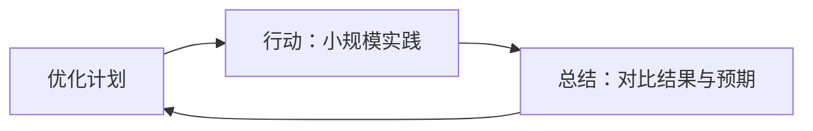

# 横向领导力

状态: TODO
Update Date: 2025年11月14日 10:22
Create Date: 2025年11月14日 08:50

创建于：2025-11-13 01:17:41

标签：

---

原文：[https://x-1381123255.cos.ap-beijing.myqcloud.com/%E6%A8%AA%E5%90%91%E9%A2%86%E5%AF%BC%E5%8A%9B_01_%E6%9C%AA%E7%9F%A5%E7%AB%A0%E8%8A%82.pdf](https://x-1381123255.cos.ap-beijing.myqcloud.com/%E6%A8%AA%E5%90%91%E9%A2%86%E5%AF%BC%E5%8A%9B_01_%E6%9C%AA%E7%9F%A5%E7%AB%A0%E8%8A%82.pdf)

将链接内容进行整理，重点要点突出，结构清晰，知识点有目录大纲，不同层级，列表总结

创建于：2025-11-13 01:17:56

标签：

---

原文：[https://x-1381123255.cos.ap-beijing.myqcloud.com/%E6%A8%AA%E5%90%91%E9%A2%86%E5%AF%BC%E5%8A%9B_02_%E6%9C%AA%E7%9F%A5%E7%AB%A0%E8%8A%82.pdf](https://x-1381123255.cos.ap-beijing.myqcloud.com/%E6%A8%AA%E5%90%91%E9%A2%86%E5%AF%BC%E5%8A%9B_02_%E6%9C%AA%E7%9F%A5%E7%AB%A0%E8%8A%82.pdf)

将链接内容进行整理，重点要点突出，结构清晰，知识点有目录大纲，不同层级，列表总结

创建于：2025-11-13 01:18:43

标签：

---

原文：[https://x-1381123255.cos.ap-beijing.myqcloud.com/%E6%A8%AA%E5%90%91%E9%A2%86%E5%AF%BC%E5%8A%9B_05_%E6%9C%AA%E7%9F%A5%E7%AB%A0%E8%8A%82.pdf](https://x-1381123255.cos.ap-beijing.myqcloud.com/%E6%A8%AA%E5%90%91%E9%A2%86%E5%AF%BC%E5%8A%9B_05_%E6%9C%AA%E7%9F%A5%E7%AB%A0%E8%8A%82.pdf)

将链接内容进行整理，重点要点突出，结构清晰，知识点有目录大纲，不同层级，列表总结

创建于：2025-11-13 01:19:31

标签：

---

原文：[https://x-1381123255.cos.ap-beijing.myqcloud.com/%E6%A8%AA%E5%90%91%E9%A2%86%E5%AF%BC%E5%8A%9B_08_%E6%9C%AA%E7%9F%A5%E7%AB%A0%E8%8A%82.pdf](https://x-1381123255.cos.ap-beijing.myqcloud.com/%E6%A8%AA%E5%90%91%E9%A2%86%E5%AF%BC%E5%8A%9B_08_%E6%9C%AA%E7%9F%A5%E7%AB%A0%E8%8A%82.pdf)

将链接内容进行整理，重点要点突出，结构清晰，知识点有目录大纲，不同层级，列表总结

创建于：2025-11-13 01:21:05

标签：

---

原文：[https://x-1381123255.cos.ap-beijing.myqcloud.com/%E6%A8%AA%E5%90%91%E9%A2%86%E5%AF%BC%E5%8A%9B_14_%E6%9C%AA%E7%9F%A5%E7%AB%A0%E8%8A%82.pdf](https://x-1381123255.cos.ap-beijing.myqcloud.com/%E6%A8%AA%E5%90%91%E9%A2%86%E5%AF%BC%E5%8A%9B_14_%E6%9C%AA%E7%9F%A5%E7%AB%A0%E8%8A%82.pdf)

将链接内容进行整理，重点要点突出，结构清晰，知识点有目录大纲，不同层级，列表总结

# 领导力书籍目录大纲

创建于：2025-11-13 01:18:11

标签：
AI链接笔记
领导力
团队管理
目录大纲

---

原文：[(anonymous)](https://x-1381123255.cos.ap-beijing.myqcloud.com/%E6%A8%AA%E5%90%91%E9%A2%86%E5%AF%BC%E5%8A%9B_03_%E7%AB%A0%E8%8A%82_3.pdf)

📚 **全书结构概览**

- **引言**：任何人都是潜在的领导者

- **第一部分**：真正的领导者，不需要职位

- **第二部分**：做对5步，团队就是你的了

- **第三部分**：做更好的领导者

- **附录**：致谢、出版后记

📑 **分章节核心要点**

### 第一部分：真正的领导者，不需要职位

1. 合作很难？你还没找到方法！
2. 横向领导：怎样巧妙地影响他人

### 第二部分：做对5步，团队就是你的了

1. 目标整理术：把团队拧成一股绳
2. 思考整理术：迅速找到解决问题的方法
3. 计划修正术：不断修正计划，使其趋于完美
4. 激励管理术：让团队成员保持专注
5. 反馈的艺术：不断提升团队工作效率

### 第三部分：做更好的领导者

1. 五项技能的综合运用
2. 假如你是领导者，你还能做什么
3. 敢于站出来的人就是领导者

# 横向领导：无权威也能推动团队高效合作

创建于：2025-11-13 01:18:26

标签：
AI链接笔记
团队协作
横向领导
无权威领导

---

原文：[(anonymous)](https://x-1381123255.cos.ap-beijing.myqcloud.com/%E6%A8%AA%E5%90%91%E9%A2%86%E5%AF%BC%E5%8A%9B_04_%E7%AB%A0%E8%8A%82_4.pdf)

### 一、核心定位与问题引入

📌 **目标读者**

- 曾因团队协作混乱、缺乏组织而感到沮丧的人

- 希望在无权威角色下推动团队达成目标的个体

### 二、传统认知与本书视角

### 2.1 常见协作困境

- 团队缺乏方向：成员对目标、分工、优先级存在分歧
- 依赖权威领导：认为“没有负责人=工作不到位”，忽视协作本质

### 2.2 本书核心主张

- 聚焦“你能做什么”：不依赖职位权力，强调个体推动合作的能力
- 目标：实现“良好合作”——与他人同舟共济，取得高质量结果

### 三、横向领导方法论（核心框架）

### 3.1 方法论本质

- 类比案例：专家用锤子敲机车启动（10美元敲打的动作+990美元知道敲打的部位）
- 核心：行动本身只是结果，关键在于**找准问题、明确方向**

### 3.2 三大实施步骤（层级递进）

1. **基础层：培养个人能力**
    - 独自工作时的执行力与问题解决能力（协作的前提）
2. **战略层：明确合作目标**
    - 清晰定义“良好合作”的具体标准（如方向一致、分工合理、结果可控）
3. **执行层：参与式领导方法**
    - 通过提问、作答、行动等非权威方式，引导同事朝正确方向前进

### 四、关键认知升级

- 任何人都是潜在领导者：无需职位权力，横向影响力可推动团队
- 默契合作非命令产物：需通过共同目标与协作方法逐步建立

# 合作困难的原因与解决策略：横向领导的实践指南

创建于：2025-11-13 01:19:00

标签：
AI链接笔记
横向领导
团队合作效率
个人技能提升

---

原文：[(anonymous)](https://x-1381123255.cos.ap-beijing.myqcloud.com/%E6%A8%AA%E5%90%91%E9%A2%86%E5%AF%BC%E5%8A%9B_06_%E7%AB%A0%E8%8A%82_6.pdf)

📌 **核心问题：合作为何如此艰难？**

1. **人类差异的必然冲突**

- 思想独立+情绪波动（快乐/愤怒/自信/忧虑）

- 对公平的判断迥异，导致摩擦与低效

1. **合作不佳的具体表现**
    - 时间浪费：会议冗长无结论、团队构建耗时超实质工作
    - 挫败感强烈：多数人宁愿独立工作也不愿团队协作
2. **改善无力的困境**
    - 个人技能有限：缺乏固定工作体系，反复犯同类错误
    - 目标模糊：不知“高效合作”的具体标准（如仅靠“友好”无法提升效率）
    - 影响他人困难：权威命令难以改变长期习惯，争夺势力范围成潜规则

🔑 **解决方案：横向领导三步骤**

### 一、培养个人核心技能（五大要素）

| 要素 | 定义与实践重点 |

|——–|—————————————|

| 目标 | 明确可评估的目标，让团队方向一致 |

| 思考 | 结构化分析问题，转化集体智慧为解决方案 |

| 学习 | 通过实践检验想法，培养团队学习习惯 |

| 专注 | 合理分配任务，激发团队斗志与投入度 |

| 反馈 | 以互助为宗旨，提供建设性建议而非竞争拆台|

### 二、构建清晰的团队合作图景

- **个人与团队的协同**：先成为“优秀追随者”，再通过五大技能推动集体协作
- **关键标准**：避免“反面教材”（如无议程会议），明确任务分配、沟通流程等具体规则

### 三、影响他人的三大技巧

1. **提问**：引导团队思考合作问题并自主寻找解决方案
2. **分享**：提出个人想法，邀请他人修改或实践
3. **行动**：以身作则践行改进方案，作为团队优化的基础

📚 **内容结构概览**

- 第1章：合作困境与根源分析

- 第2章：横向领导方法概述

- 第3-7章：五大核心技能（目标/思考/学习/专注/反馈）的个人实践与团队应用

# 横向领导：非职权影响力的核心方法 📊

创建于：2025-11-13 01:19:15

标签：
AI链接笔记
横向领导
非职权影响力
团队协作技巧

---

原文：[(anonymous)](https://x-1381123255.cos.ap-beijing.myqcloud.com/%E6%A8%AA%E5%90%91%E9%A2%86%E5%AF%BC%E5%8A%9B_07_%E7%AB%A0%E8%8A%82_7.pdf)

### 一、核心问题：如何在无职权情况下影响他人

1. **传统困境**
    - 回避问题：局面无改善
    - 直接命令：引发抵触（如”你以为你是老板吗？”）
    - 常见结果：建议被视为指责，导致推诿扯皮
2. **关键洞察**
    - 观察高效团队：分析其成员的互动行为
    - 自我反思：从自身沟通方式找问题根源

### 二、影响失败的三大肇因

1. **命令式沟通触发防御心理**
    - 改进建议被曲解为指责（例：生产线经理与采购员的冲突）
    - 隐含逻辑：”需要改进=存在问题=某人责任”
2. **角色定位引发抵触**
    - 建议者被视为”领导者”，他人被迫成为”追随者”
    - 案例：会议中提出新流程被拒，因威胁他人话语权
3. **缺乏共同理解与参与**
    - 未解释变革原因：仅强调成本，未说明收益
    - 决策过程封闭：他人无”所有权”，执行积极性低

### 三、横向领导的四大核心策略

### 1. 对事不对人：聚焦方法而非指责

- **操作要点**
    - 用”我们的合作方式”替代”你的工作态度”
    - 例：”我们的订单修改流程是否需要优化？”而非”你总是延迟送货”

### 2. 重塑角色认知：赋予参与感与价值感

- **关键原则**
    - 角色需满足：自主性（可决策）+ 能力展示（发挥优势）
    - 避免：单方面分配任务，剥夺他人参与权

### 3. 共同制定计划：开放协作式决策

- **实施步骤**
    1. 分享思考过程（而非直接给结论）
    2. 邀请改进建议（例：”你觉得这个方案如何优化？”）
    3. 接受他人主导（适时扮演追随者角色）

### 4. 非命令式影响技巧

- **三大工具**
    - **提问法**：开放式问题引导思考（例：”造成效率低下的可能原因有哪些？”）
    - **建议法**：以”想法”而非”决定”呈现（例：”或许可以试试XX方法？”）
    - **示范法**：通过可见行动树立榜样（例：高管亲自修补会议室地毯）

### 四、四象限思考框架：结构化沟通工具

| 象限 | 核心问题 | 示例应用场景 |

|——–|————————-|——————————-|

| 数据 | 现状是什么？ | “我们已开会45分钟仍无进展” |

| 分析 | 原因是什么？ | “是否因目标不明确导致分歧？” |

| 方向 | 策略是什么？ | “先共识目标再讨论具体方案？” |

| 下一步 | 具体行动是什么？ | “明天前各自提交目标草案” |

# 目标整理术：把团队拧成一股绳 🎯

创建于：2025-11-13 01:19:47

标签：
AI链接笔记
目标管理
团队协作
个人目标设定

---

原文：[(anonymous)](https://x-1381123255.cos.ap-beijing.myqcloud.com/%E6%A8%AA%E5%90%91%E9%A2%86%E5%AF%BC%E5%8A%9B_09_%E7%AB%A0%E8%8A%82_9.pdf)

### 一、目标的重要性

1. **核心价值**
    - 缺乏目标会导致工作盲目、效率低下
    - 清晰目标是衡量成功的标准，提供行动方向
2. **典型问题**
    - 案例：年轻律师无法理解公司愿景”法律实践出类拔萃”的具体含义
    - 表现：忙碌却无成果、被动执行任务、缺乏工作意义感

### 二、个人目标制定方法

### 2.1 目标制定原则

- **前瞻性**：聚焦未来结果而非过去原因
- **激励性**：目标需激发热情，避免无意义任务（如”挖洞填洞”）
- **可衡量**：用具体成果描述（名词），而非形容词（如”完美”）

### 2.2 三阶段目标体系

| 阶段 | 特点 | 示例 |

|——–|————————–|——————————-|

| 长期目标 | 鼓舞人心，5-10年愿景 | 成为行业领先的环保法律顾问 |

| 中期目标 | 可测量，1-3年里程碑 | 建立3个州法院环境案件胜诉记录 |

| 短期目标 | 即刻执行，1-3个月任务 | 本月完成2份环境损害证据分析 |

### 三、团队目标混乱的根源

1. **目标冲突**
    - 案例：律师事务所三位合伙人目标分歧（高端客户/公益案件/收益最大化）
    - 表现：资源内耗、决策矛盾
2. **执行障碍**
    - 责任分散：团队工作易出现”搭便车”现象（如拔河比赛力量总和下降）
    - 目标模糊：成员不清楚同事目标，难以协作

### 四、团队目标制定策略

### 4.1 目标体系构建

- **共同参与**：全员参与目标制定，确保理解与认同
- **三级联动**：
    - 管理层：制定长远战略目标
    - 中层：分解为可执行的中期目标
    - 员工：设计短期行动方案

### 4.2 目标优化方法

1. **明确目的**：执行任务前追问”为什么”，例：拿报纸需知用途（垫油漆/查股价）
2. **数据支撑**：用具体成果描述目标（如”3个月内与2家媒体公司建立合作”）
3. **动态调整**：定期检查目标一致性，确保短期行动服务长期愿景

### 五、实践工具

- **目标追问法**：连续提问”为什么”，直至触及核心动机
- **愿景具象化**：将抽象目标转化为可操作步骤（如”为和平工作”→制作反暴力教学视频）
- **责任共担**：明确每个成员的目标贡献，避免模糊分工

# 思考整理术：系统性解决问题的方法 🧠

创建于：2025-11-13 01:20:03

标签：
AI链接笔记
思考整理术
系统性思考
四象限饼图

---

原文：[(anonymous)](https://x-1381123255.cos.ap-beijing.myqcloud.com/%E6%A8%AA%E5%90%91%E9%A2%86%E5%AF%BC%E5%8A%9B_10_%E7%AB%A0%E8%8A%82_10.pdf)

### 一、思考整理术的核心价值

1. **问题背景**
    - 个人思维混乱：目标清晰却无法实现，反复兜圈子、忽略关键问题
    - 集体思维灾难：讨论漫无边际（如办公室圣诞聚会筹划），浪费时间且决策质量低
    - 根源：缺乏结构化思考框架，学校教育未教授”如何思考”
2. **核心目标**
    - 个人：培养”始于事实，终于行动”的条理化思考能力
    - 团队：实现”同步思考”，避免无组织讨论的低效与冲突

### 二、个人思考整理术：四象限饼图框架

### 1. 数据（第一象限）：收集关键信息

- **定义**：现状/问题的客观事实（如”会议中30%的人提前离场”）
    - **挑战**：信息超载与认知偏见
        - 常见偏见：偏爱生动信息、过度重视数字、局限自身立场
    - **工具**：
        - **检查清单**：明确需关注的信息类型（如合作检查清单含”目标/学习/专注/反馈”维度）
        - **三个立场法**：
        - 第一立场（我）：自身视角的局限性
        - 第二立场（他们）：模仿关键人物视角（如老板的担忧）
        - 第三立场（看台之上）：客观旁观者视角

### 2. 分析（第二象限）：寻找根本原因

- **关键原则**：区分”可改变的原因”与”不可改变的原因”（如戒烟vs性别差异）
    - **工具：推演阶梯**`mermaid graph TD A[数据：直接观察到的事实] --> B[推理：逻辑分析过程] --> C[结论：最终判断]` 
    - **应用**：回归数据检验结论，避免”银行家妻子的阑尾切除”式推理错误
    #### 3. 方向（第三象限）：制定策略方案
    - **思考三步骤**：
    1. **头脑风暴**：追求数量，抑制评判（如铁路公司”用餐条款”创新方案）
    2. **评估**：记录优缺点，比较选项（而非立即否定）
    3. **决策**：在已知选项中选择，预留调整空间
    #### 4. 下一步（第四象限）：转化为行动计划
    - **核心要求**：具体到”可执行的指令”（如”下周前完成质量标准改善计划”）
    - **常见误区**：仅有良好意图却无行动步骤（”通往地狱的道路由良好意图铺就”）
    ### 三、团队同步思考：结构化协作方法
    1. **理想状态**
    - 共同使用四象限框架，明确每个阶段目标（如聚会筹划先收集”数据”再讨论”方向”）
    - 可视化记录：白板划分”数据/分析/方向/下一步”四栏，同步进度
    2. **关键优势**
    - 避免跳过推理步骤，减少群体思维陷阱
    - 明确分歧根源，而非压制不同意见
    ### 四、横向引导技巧：推动他人条理化思考
    1. **核心原则**
    - 避免直接批评，以提问引导（如”关于客户流失，他们具体说了什么？”）
    - 以身作则：主动使用四象限框架记录讨论
    2. **实用策略**
    - **寻求数据**：”我们还需要哪些信息来验证这个假设？”
    - **引导分析**：”除了人力成本，还有其他可能的原因吗？”
    - **可视化工具**：在白板绘制四象限标题，自然引导讨论方向

# 计划修正术：将思考与行动结合的动态优化方法 📝

创建于：2025-11-13 01:20:18

标签：
AI链接笔记
计划修正术
动态优化方法
行动学习法

---

原文：[(anonymous)](https://x-1381123255.cos.ap-beijing.myqcloud.com/%E6%A8%AA%E5%90%91%E9%A2%86%E5%AF%BC%E5%8A%9B_11_%E7%AB%A0%E8%8A%82_11.pdf)

### 一、核心原理：思考与行动的辩证关系

1. **计划的天然缺陷**
    - 所有计划基于简化模型，必然存在未知漏洞
    - 关键问题不是”是否有缺陷”，而是”哪些地方有缺陷”
2. **工作学习的本质**
    - 与学校教育的差异：需解决新问题而非学习既有知识
    - 核心技能：通过实践检验思想 → 发现缺陷 → 持续优化

### 二、常见问题：阻碍学习的四大障碍

1. **计划与行动脱节**
    - 过度思考导致错失时机（如反复修改提纲却不动笔）
    - 盲目行动缺乏反馈调整（如按错误计划执行却不反思）
2. **完美主义陷阱**
    - 等待”最优计划”而推迟行动
    - 案例：欧洲实业家开发胶水因未测试黏着性导致失败
3. **执行僵化**
    - 将计划视为”神圣不可修改”的指令
    - 案例：建筑工人为遵守设计方案砍倒橡树
4. **总结失效**
    - 仅在任务结束后总结，错失过程优化机会
    - 总结沦为批斗会或表扬大会，未聚焦方法改进

### 三、解决方案：动态循环工作法

### （一）核心模型：准备→行动→总结循环

### （二）关键行动策略

1. **尽早行动**
    - 用”最小可行性测试”验证假设（试点、模拟、模型试验）
    - 提问：”行动与不行动，哪个风险更大？”
2. **即时总结**
    - 过程中而非结束后总结，使用清单工具：
        - 哪些方法有效？需改变哪些做法？
        - 获得的经验能否用于当前/未来工作？
3. **计划动态调整**
    - 案例：滑雪设备商店通过试运营发现顾客服务流程问题
    - 原则：计划与行动可随时切换，相互促进

### 四、团队应用：组织层面的协同优化

1. **常见组织障碍**
    - 计划制定者与执行者分离（如总部计划脱离地区实际）
    - 总结聚焦任务结果而非合作方式改进
2. **改进方案**
    - 建立跨层级反馈机制（如地区代表参与计划修订）
    - 定期召开过程复盘会，重点优化协作流程

### 五、实践工具：个人与团队行动清单

1. **个人学习清单**
    - 每日3问：今天学到什么？需调整什么？如何应用？
    - 行动前5分钟：退一步审视工作方法
2. **团队协作清单**
    - 分阶段总结：目标对齐→分工合理性→沟通效率
    - 案例：阳光软件公司通过全球代表会议优化计划流程

# 激励管理术：让团队成员保持专注 🚀

创建于：2025-11-13 01:20:34

标签：
AI链接笔记
团队激励
专注度管理
任务分配

---

原文：[(anonymous)](https://x-1381123255.cos.ap-beijing.myqcloud.com/%E6%A8%AA%E5%90%91%E9%A2%86%E5%AF%BC%E5%8A%9B_12_%E7%AB%A0%E8%8A%82_12.pdf)

### 一、个人激励：塑造高投入工作状态

### 1. 自我激励的核心问题

- 每个人都有高效期与低谷期，环境影响专注度
- 关键问题：为什么无法持续努力？如何改善？

### 2. 提升个人投入度的3个策略

- **重新定义工作价值**
→ 将短期任务与长期目标绑定（例：广告文案撰写→锤炼语言影响力）
→ 聚焦当下1小时的价值，而非终身职业选择
- **主动拓展工作边界**
→ 承担职责外有价值的任务（例：管道公司员工主动优化质检流程）
→ 将”无人过问的事”转化为个人机会（例：教师将交流中心搬上互联网实现盈利）
- **目标分解法**
→ 将大目标拆解为可执行的小任务
→ 以”当天/下一小时”为单位设定专注目标

### 二、团队激励：构建全员投入的协作系统

### 1. 团队低效的3大根源

- **参与感缺失**：成员感到被冷落，缺乏自主决策权
- **责任分散效应**：群体中个人责任感降低（例：心脏病救援旁观者效应）
- **任务分配随意性**：常见错误标准：
→ 交给”身边的人”/“最努力的人”/“抱怨最少的人”

### 2. 高效团队构建4步法

- **设计有吸引力的角色**
✅ 核心要素：尊重、自主性、可见成果
✅ 案例：军事参谋长通过发掘成员特长激活课堂讨论
- **共同参与决策**
→ 让成员参与目标制定与计划设计（例：足球教练让队员自主制定训练计划）
→ 关键原则：”三个臭皮匠顶个诸葛亮”，保留最终决策权
- **科学分配任务**
🔹 标准1：交给能胜任的最小群体
🔹 标准2：分配给级别最低的胜任者
🔹 标准3：匹配个人能力的最高价值任务
- **建立共同责任机制**
→ 避免”此事不归我管”心态
→ 明确分工是底线而非上限，新项目共同承担

### 三、实践工具：横向领导力的行动框架

### 1. 影响他人的沟通技巧

- **提问式引导**：以”如何让大家更投入？”替代直接命令
- **提供分析而非解决方案**：先引发思考（例：替补球员向教练分析团队依赖性问题）

### 2. 关键行动原则

- **先询问后决定**：既获取建议又提升参与感
- **在他人建议中找价值**：假设每个建议有用，无法理解时请对方解释
- **承担改善责任**：即使无职权，仍可通过横向影响推动团队优化

# 反馈的艺术：提升团队工作效率的方法与实践 📊

创建于：2025-11-13 01:20:49

标签：
AI链接笔记
团队反馈技巧
有效沟通方法
团队效率提升

---

原文：[(anonymous)](https://x-1381123255.cos.ap-beijing.myqcloud.com/%E6%A8%AA%E5%90%91%E9%A2%86%E5%AF%BC%E5%8A%9B_13_%E7%AB%A0%E8%8A%82_13.pdf)

### 一、反馈的重要性与现状

1. **核心价值**
    - 团队成绩取决于资源利用率，反馈能帮助成员提升技能、共享经验
    - 自我判断存在盲区，他人意见可弥补视角局限（如棒球选手需队友检查动作）
2. **现实问题**
    - 实习生、基层员工常缺乏指导，管理者抱怨下属不感恩
    - 因缺乏反馈技能，人们倾向回避指出问题，导致问题积累

### 二、反馈的三大类型与应用场景

| 类型 | 目的 | 核心方法 |
| --- | --- | --- |
| 感谢 | 提升士气、增强归属感 | ✅ 表达主观感受（例：”你的努力让项目提前完成，我很感激”）
✅ 关注过程而非结果（肯定努力而非仅表扬成功） |
| 建议 | 帮助改进技能、方法 | ✅ 对事不对人（例：”这个方案的数据可视化可优化，建议用折线图展示趋势”）
✅ 先询问对方需求再提供具体建议 |
| 评估 | 支持人事决策（晋升/培训） | ⚠️ 需基于明确标准，避免与感谢/建议混淆
⚠️ 单独沟通，避免影响其他反馈效果 |

### 三、有效反馈的实践技巧

### 1. 提供感谢的关键原则

- **及时性**：随时表达（例：下班前感谢同事协助解决问题）
- **真诚具体**：避免空泛表扬，指出具体贡献（例：”你整理的客户资料帮我省了3小时”）
- **区分人与行为**：肯定个人价值（例：”你是团队的宝贵财富”）

### 2. 提出建议的黄金法则

- **明确目的**：先了解对方需求（例：”你希望我从沟通技巧还是方案逻辑提建议？”）
- **聚焦改进**：用”可以这样做”替代”不要那样做”
- **控制数量**：每次建议不超过3点，优先解决关键问题

### 3. 避免常见误区

- ❌ 将反馈等同于批评（批评易引发抵触，建议侧重共同改进）
- ❌ 同时混合多种反馈类型（例：表扬后立即指出不足会削弱感谢效果）
- ❌ 忽视对方接受时机（可协商”明天下午方便讨论改进方案吗？”）

### 四、团队反馈文化的构建

1. **打破错误假设**
    - ❌ “只有弱者需要表扬” → ✅ 顶尖选手也需教练反馈
    - ❌ “指导只能自上而下” → ✅ 后辈可能掌握最新技能，值得学习
2. **建立正向假设**
    - 感谢能提升全员表现（例：出版商因阅读感谢信重获工作热情）
    - 寻求建议是能力的体现（职业运动员依赖教练团队）
3. **实践步骤**
    - **以身作则**：主动向下属/同事请教（例：”关于XX项目，你觉得我哪里可以改进？”）
    - **明确需求**：告诉他人你需要哪种反馈（例：”希望得到具体操作建议，而非总体评价”）
    - **领导示范**：管理者公开寻求反馈，带动团队效仿

# 五项工作技能的综合运用指南 📚

创建于：2025-11-13 01:21:20

标签：
AI链接笔记
横向领导
目标管理
工作技能综合运用

---

原文：[(anonymous)](https://x-1381123255.cos.ap-beijing.myqcloud.com/%E6%A8%AA%E5%90%91%E9%A2%86%E5%AF%BC%E5%8A%9B_15_%E7%AB%A0%E8%8A%82_15.pdf)

### 一、核心技能框架

1. **目标制定**
    
    → 根据期望结果设定目标
    
    → 区分不同时间节点目标：近期可实现目标/中期部门目标/长期组织愿景
    
2. **系统性思考**
    
    → 四步流程：数据收集→原因分析→方向确定→行动规划
    
    → 工具：从”饼图第一象限”切入，评估团队表现与问题根源
    
3. **经验学习**
    
    → 随时总结失败原因（如横向领导失效的5类可能性分析）
    
    → 记录实践过程（建议书面化或录音复盘）
    
4. **投入工作**
    
    → 通过挑战性任务建立参与感
    
    → 自定义角色定位（可团队协作优化角色设计）
    
5. **反馈机制**
    
    → 双向反馈：提供具体建议+主动寻求改进意见
    
    → 频率建议：每周定期反馈
    

### 二、实施方法论

### （1）目标分解示例

- **五年愿景**：全员采用”准备-行动-总结”流程
- **两年规划**：部门级目标落地
- **三月计划**：与搭档建立反馈机制
- **即时行动**：今日获取同事改进建议

### （2）问题解决步骤

1. 观察数据：梳理团队优势与问题表现
2. 分析原因：区分个体认知差异与系统性障碍
3. 制定方向：选择横向领导策略组合
4. 执行验证：小范围测试→记录结果→迭代方法

### 三、关键注意事项

⚠️ 避免将策略等同于战略，需以五项技能为核心

⚠️ 技能学习需循序渐进，建议先掌握单项再综合应用

⚠️ 面对抵触时，优先反思方法适配性而非否定整体框架

# 领导者如何提升团队协作效率

创建于：2025-11-13 01:21:35

标签：
AI链接笔记
团队协作
领导力提升
决策制定

---

原文：[(anonymous)](https://x-1381123255.cos.ap-beijing.myqcloud.com/%E6%A8%AA%E5%90%91%E9%A2%86%E5%AF%BC%E5%8A%9B_16_%E7%AB%A0%E8%8A%82_16.pdf)

📚 **本书核心观点**

- 适用人群：无论是否拥有领导权，均可采纳书中建议

- 领导者优势：权力和地位可帮助更高效地实践建议

❓ **领导者面临的核心问题**

- “我们能否做得更好？怎样才能做得更好？”

- 下属未达预期的原因：团队协调能力不足、依赖管理、工作状态难以改变

🔍 **团队协作低效的三大原因**

1. 注意力集中在具体工作而非协作方式

2. 过度关注自身决策权力，忽视团队参与

3. 依赖命令式管理，缺乏对其他方法的探索

💡 **领导者改进策略**

### 一、关注合作方式

- 观察重点：团队对第3-7章工作元素的处理方式（非仅结果数量/质量）
- 关键问题清单：
▶ 目标是否清晰？成员是否参与目标制定？
▶ 思考是否有条理（事实→原因→策略→行动）？
▶ 是否共同思考并分享结果？
▶ 计划与行动是否结合？是否快速行动并定期总结？
▶ 工作是否具挑战性？成员是否关注工作内容与方式的改进？
▶ 是否存在相互支持、及时反馈的氛围？

### 二、优化决策制定

- 核心方法：**先询问后决定**
- 具体行动：
▶ 邀请关联人员参与决策过程（非授权或投票）
▶ 提前征集意见、传阅讨论手稿
▶ 提升决策质量与认可度，促进执行效率

### 三、转变管理方式

- 关键原则：以身作则＞命令式管理
- 有效方法：
▶ 提出启发性问题、提供数据与建议
▶ 通过行动树立理想工作状态的表率
▶ 减少对命令的依赖，探索横向领导方法

📋 **领导者与普通成员的共同行动清单**

### 个人技能提升

1. 根据结果制定目标
2. 按”问题—分析—战略—策略”顺序思考
3. 快速行动并定期总结经验
4. 投入挑战性任务
5. 营造相互支持与反馈的氛围

### 团队协作促进

1. 提出启发性问题
2. 提供数据、想法和建议
3. 以身作则，虚心接受不同意见

### 领导者额外权限

1. 制定他人无法制定的决策
2. 合理使用命令权

# 敢于站出来的人就是领导者："提供帮助"的行动哲学

创建于：2025-11-13 01:21:52

标签：
AI链接笔记
责任分散效应
领导者思维
提供帮助

---

原文：[(anonymous)](https://x-1381123255.cos.ap-beijing.myqcloud.com/%E6%A8%AA%E5%90%91%E9%A2%86%E5%AF%BC%E5%8A%9B_17_%E7%AB%A0%E8%8A%82_17.pdf)

### 一、核心理念：单脚站立的智慧

1. **希勒尔拉比的故事**
    - 无神论者要求拉比单脚站立背诵《摩西五经》，拉比以”己所不欲，勿施于人”浓缩教义
    - 核心启示：复杂思想可提炼为简洁原则，指导实践
2. **本书核心格言**
    
    → **提供帮助**
    
    - 简单易记，可解释复杂场景
    - 即使忘记细节，记住此原则也能避免大错

### 二、现实警示：袖手旁观的代价

1. **姬蒂·吉诺维斯事件（1966年，纽约）**
    - 女子遇袭尖叫，多人旁观却无人报警，最终遇害
    - 反映”责任分散效应”：每个人都期待他人行动，结果无人行动
2. **组织中的常见困境**
    - 会议低效、无人认领任务、错误计划被默认通过
    - 根源：”假装没看见”的集体沉默

### 三、行动指南：如何”提供帮助”

1. **主动站出来的时机**
    - 工作停滞时、任务空缺时、错误无人质疑时
2. **行动方式（非领导身份也可实践）**
    - 邀请他人协作，而非独自承担
    - 提出优质问题、分享想法、完成具体事务
    - 帮助他人培养能力，而非发号施令

### 四、心态转变：选择更积极的假设

| 消极假设（常见） | 积极假设（建议选择） |
| --- | --- |
| 问题是别人的错 | 我可以改变局面 |
| 无法改变他人行为 | 改变自己是影响他人的最简单方式 |
| 尝试很可能无效 | 坚持正确方向的努力会有回报 |
| 不擅长的事很尴尬 | 学习新技能需突破舒适区 |
| 现状已无法改善 | 改进空间永远存在 |

### 五、实践价值：为何要”提供帮助”

- 避免组织低效，甚至挽救团队/公司
- 获得挑战性工作体验，提升成就感
- 让生活更充实，实现有意义的人生

# 书籍致谢与核心思想概述

创建于：2025-11-13 01:22:07

标签：
AI链接笔记
横向领导
书籍致谢
团队协作方法

---

原文：[(anonymous)](https://x-1381123255.cos.ap-beijing.myqcloud.com/%E6%A8%AA%E5%90%91%E9%A2%86%E5%AF%BC%E5%8A%9B_18_%E7%AB%A0%E8%8A%82_18.pdf)

📚 **书籍基本信息**
- 创作周期：七年
- 思想基础：基于几十年实践经验
- 核心方法：横向领导（无需权威即可推动团队高效工作）

### 一、致谢对象分类

1. **促成合作的关键人物**
    - 赫布·贝尔斯托克（联合国开发计划署）：促成作者罗杰与艾伦相识
2. **思想奠基者**
    - 拉尔夫·科弗代尔（已故）：艾伦的启蒙者，科弗代尔培训项目创立者
    - 伯纳德·巴宾顿·史密斯（已故）：艾伦的导师，项目核心观点提出者
3. **直接贡献者**
    - 弗莱明·马德森（丹麦同事）：与艾伦长期合作，贡献核心思想
    - 克里斯·索恩：梳理初始思想并撰写初稿
    - 约翰·理查森：实质参与创作（编辑/合著），构建框架并增删内容
4. **协助完善者**
    - 罗纳尔德·海菲兹：哈佛肯尼迪学院领导力专家，拓展理论领域
    - 道格·斯通：全程参与头脑风暴与终稿审读
    - 杰夫·韦斯：应用思想于教学并优化表达
    - 韦恩·戴维斯：建议保留关键内容
    - 希拉·赫恩：润色文字并消除性别歧视倾向
5. **支持团队**
    - 洛丽·戈尔登塔尔：哈佛谈判项目部行政助理，排版与文字处理
    - 柯尔斯滕·桑德伯格等（哈珀商业分部）：提升书籍可读性
6. **家庭支持**
    - 作者儿子们（凯文·夏普等）：参与思想研究与意见交换
    - 卡罗琳·费希、玛丽·夏普：长期生活支持

### 二、核心研究脉络

1. **作者背景与分工**
    - 罗杰：研究”解决分歧的最佳途径”→提出”有原则的谈判”
    - 艾伦：研究”团队协作改进方法”→源自科弗代尔培训项目
2. **合作研究问题**
    - 核心议题：如何帮助任何人（无论职位）推动团队高效工作
    - 解决方案：横向领导方法（从”侧面”影响团队表现）
3. **思想发展过程**
    - 初期：整合两人经验形成初步框架
    - 验证：通过多领域人群试验并吸收反馈
    - 完善：经约翰·理查森等编辑整合为系统性理论

# 横向领导：非职权影响力的职场突破指南

创建于：2025-11-13 01:22:22

标签：
AI链接笔记
横向领导
职场影响力
非职权领导

---

原文：[(anonymous)](https://x-1381123255.cos.ap-beijing.myqcloud.com/%E6%A8%AA%E5%90%91%E9%A2%86%E5%AF%BC%E5%8A%9B_19_%E7%AB%A0%E8%8A%82_19.pdf)

📚 **核心问题与误区**
- **职场痛点**：团队效率低、业绩差时，普通员工常以“非领导”为由消极应对，陷入“打工者心态”
- **关键误区**：认为“没有职权就无法领导”，将个人平庸归咎于管理者无能

👤 **作者与理论背景**
- **作者资质**：罗杰·费希尔（谈判/沟通领域权威，《谈判力》《沟通力》作者）
- **研究支持**：受联合国开发计划署委托，哈佛大学谈判项目、肯尼迪政府学院联合支持
- **核心概念**：横向领导——普通职员无需职权即可从“侧面”影响团队

🔑 **横向领导方法论**
- **实现路径**：通过书中提供的「三个步骤」+「五个策略」掌握横向领导技能
- **内容维度**：结合沟通技巧、谈判策略、心理学原理分析实践问题
- **预期效果**：帮助读者打破思维局限，主动推动团队向好发展

📌 **推荐与价值**
- **权威推荐**：获《影响力》作者罗伯特·西奥迪尼、《高效能人士的七个习惯》作者史蒂芬·柯维、查理·芒格、罗莎贝斯·莫斯·坎特一致推荐
- **后浪系列**：同系列已出版《带人的技术》《交办的技术》，本书聚焦“非职权者带人方法”

# 领导力书籍目录大纲

创建于：2025-11-13 01:22:39

标签：
AI链接笔记
领导力
团队管理
非职位领导

---

原文：[(anonymous)](https://x-1381123255.cos.ap-beijing.myqcloud.com/%E6%A8%AA%E5%90%91%E9%A2%86%E5%AF%BC%E5%8A%9B_20_%E7%AB%A0%E8%8A%82_20.pdf)

📚 **全书结构概览**

- **核心主张**：任何人都是潜在的领导者，真正的领导者不需要职位

- **内容划分**：引言 + 3大主体部分 + 致谢与后记

### 一、引言

- 核心观点：任何人都是潜在的领导者

### 二、第一部分：真正的领导者，不需要职位

1. 01 合作很难？你还没找到方法！
2. 02 横向领导：怎样巧妙地影响他人

### 三、第二部分：做对5步，团队就是你的了

1. 03 目标整理术：把团队拧成一股绳
2. 04 思考整理术：迅速找到解决问题的方法
3. 05 计划修正术：不断修正计划，使其趋于完美
4. 06 激励管理术：让团队成员保持专注
5. 07 反馈的艺术：不断提升团队工作效率

### 四、第三部分：做更好的领导者

1. 08 五项技能的综合运用
2. 09 假如你是领导者，你还能做什么
3. 10 敢于站出来的人就是领导者

### 五、附录

- 致谢
- 出版后记