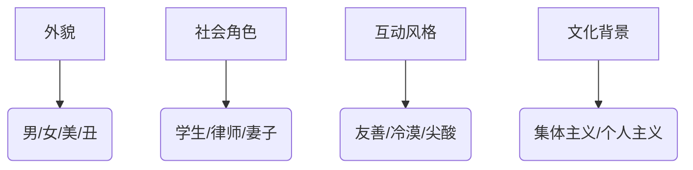

# 沟通的艺术（插图修订第14版）

状态: TODO
Update Date: 2025年11月14日 10:22
Create Date: 2025年11月14日 08:45

创建于：2025-11-13 01:23:12

标签：

---

原文：[https://x-1381123255.cos.ap-beijing.myqcloud.com/%E6%B2%9F%E9%80%9A%E7%9A%84%E8%89%BA%E6%9C%AF%EF%BC%88%E6%8F%92%E5%9B%BE%E4%BF%AE%E8%AE%A2%E7%AC%AC14%E7%89%88%EF%BC%89_02_%E6%9C%AA%E7%9F%A5%E7%AB%A0%E8%8A%82.pdf](https://x-1381123255.cos.ap-beijing.myqcloud.com/%E6%B2%9F%E9%80%9A%E7%9A%84%E8%89%BA%E6%9C%AF%EF%BC%88%E6%8F%92%E5%9B%BE%E4%BF%AE%E8%AE%A2%E7%AC%AC14%E7%89%88%EF%BC%89_02_%E6%9C%AA%E7%9F%A5%E7%AB%A0%E8%8A%82.pdf)

将链接内容进行整理，重点要点突出，结构清晰，知识点有目录大纲，不同层级，列表总结

创建于：2025-11-13 01:30:14

标签：

---

原文：[https://x-1381123255.cos.ap-beijing.myqcloud.com/%E6%B2%9F%E9%80%9A%E7%9A%84%E8%89%BA%E6%9C%AF%EF%BC%88%E6%8F%92%E5%9B%BE%E4%BF%AE%E8%AE%A2%E7%AC%AC14%E7%89%88%EF%BC%89_28_Part%202%20%E7%9C%8B%E5%87%BA%E4%BA%BA%E5%A4%96.pdf](https://x-1381123255.cos.ap-beijing.myqcloud.com/%E6%B2%9F%E9%80%9A%E7%9A%84%E8%89%BA%E6%9C%AF%EF%BC%88%E6%8F%92%E5%9B%BE%E4%BF%AE%E8%AE%A2%E7%AC%AC14%E7%89%88%EF%BC%89_28_Part%202%20%E7%9C%8B%E5%87%BA%E4%BA%BA%E5%A4%96.pdf)

将链接内容进行整理，重点要点突出，结构清晰，知识点有目录大纲，不同层级，列表总结

创建于：2025-11-13 01:35:05

标签：

---

原文：[https://x-1381123255.cos.ap-beijing.myqcloud.com/%E6%B2%9F%E9%80%9A%E7%9A%84%E8%89%BA%E6%9C%AF%EF%BC%88%E6%8F%92%E5%9B%BE%E4%BF%AE%E8%AE%A2%E7%AC%AC14%E7%89%88%EF%BC%89_46_Part%203%20%E7%9C%8B%E4%BA%BA%E4%B9%8B%E9%97%B4.pdf](https://x-1381123255.cos.ap-beijing.myqcloud.com/%E6%B2%9F%E9%80%9A%E7%9A%84%E8%89%BA%E6%9C%AF%EF%BC%88%E6%8F%92%E5%9B%BE%E4%BF%AE%E8%AE%A2%E7%AC%AC14%E7%89%88%EF%BC%89_46_Part%203%20%E7%9C%8B%E4%BA%BA%E4%B9%8B%E9%97%B4.pdf)

将链接内容进行整理，重点要点突出，结构清晰，知识点有目录大纲，不同层级，列表总结

# 例1：关于约翰抽烟行为的两种解释对比

创建于：2025-11-13 01:39:03

标签：
AI链接笔记
行为解释对比
归因视角
人际约定案例

---

原文：[(anonymous)](https://x-1381123255.cos.ap-beijing.myqcloud.com/%E6%B2%9F%E9%80%9A%E7%9A%84%E8%89%BA%E6%9C%AF%EF%BC%88%E6%8F%92%E5%9B%BE%E4%BF%AE%E8%AE%A2%E7%AC%AC14%E7%89%88%EF%BC%89_61_%E4%BE%8B1..pdf)

📋 **案例背景**

- 核心事件：约翰在未询问对方的情况下抽烟，违反双方约定

- 双方约定前提：约翰需在询问对方后，方可在其身边抽烟

### 解释A（中性归因视角）

1. **核心观点**
    - 约翰可能“忘记”了约定（非故意行为）
    - 肯定约翰的基本信誉：在对方“特别在乎的事情上”不会食言
2. **推理逻辑**
    - 以“忘记”作为行为动机 → 排除主观恶意
    - 基于过往信任否定“故意食言”的可能性

### 解释B（负面归因视角）

1. **核心观点**
    - 约翰是“不礼貌、不考虑别人”的人（负面人格评判）
    - 认定行为具有“故意性”：故意抽烟以“把对方逼疯”
2. **推理逻辑**
    - 将行为归因于“只关心自己”的自私本质
    - 进一步推测存在主观恶意目的（逼疯对方）

# 有效沟通的清晰信息处方

创建于：2025-11-13 01:39:20

标签：
AI链接笔记
有效沟通
清晰信息处方
吉布沟通理论

---

原文：[(anonymous)](https://x-1381123255.cos.ap-beijing.myqcloud.com/%E6%B2%9F%E9%80%9A%E7%9A%84%E8%89%BA%E6%9C%AF%EF%BC%88%E6%8F%92%E5%9B%BE%E4%BF%AE%E8%AE%A2%E7%AC%AC14%E7%89%88%EF%BC%89_62_%E4%BE%8B2..pdf)

📋 **目录大纲**

1. 沟通失败的核心原因

2. 吉布的沟通理论：关键差别

3. 清晰信息处方的5大要素

4. 使用清晰信息处方的注意事项

### 一、沟通失败的核心原因

- **缺乏行为描述**：直接给出评价（如“你是个吝啬鬼”），未说明具体行为，导致接收者困惑
- **解释过程模糊**：仅基于事实做解释（如“你应该更常写信”），未清晰呈现推论逻辑
- **情绪与意图混淆**：误将意图（“我想离开”）或解释（“我觉得你错了”）当作情绪表达

### 二、吉布的沟通理论：2大关键差别

1. **评价 vs 描述**
    - ❌ 评价：无行为描述的直接判断（例：“你很自私”）
    - ✅ 描述：行为+解释（例：“你3次未还我咖啡钱，我觉得你可能没在意”）
2. **确定 vs 协商**
    - ❌ 确定：单方面结论（例：“你明显不关心我”）
    - ✅ 协商：清晰呈现推论过程（例：“你很久没联系我，我猜你可能太忙了”）

### 三、清晰信息处方的5大要素

1. **行为描述**
    - 具体动作：“你3次未回复我的消息”
    - 避免模糊词汇：不用“总是”“从不”，用“3次”“上周”等
2. **解释**
    - 说明推论逻辑：“我猜你可能没看到消息”
    - 区分事实与猜想：用“我觉得”“可能”等词
3. **感觉报告**
    - 明确情绪：“我感到担心”“这让我很尴尬”
    - 区分情绪与意图：不说“我想走”（意图），说“我感到紧张”（情绪）
4. **结果陈述**
    - 3种形式：
    ▶ 对说话者：“我因等你电话耽误了约会”
    ▶ 对接收者：“你喝酒后开车差点撞到护栏”
    ▶ 对他人：“你排练时未关门，导致婴儿无法入睡”
5. **意图陈述**
    - 3类诉求：
    ▶ 表达立场：“我希望被称为‘女士’而非‘小妹’”
    ▶ 寻求澄清：“你是否在生我的气？”
    ▶ 未来行动：“若未解决欠款，我不会再借钱给你”

### 四、使用注意事项

- **顺序灵活**：可从情绪/结果切入，不必严格按要素排序
- **语言风格**：用“我觉得”“我希望”等自然表达，避免机械套用
- **要素联结**：可合并表述（例：“你未回复消息（行为），我担心你出事（结果+感觉）”）
- **耐心重复**：复杂信息需多次解释，避免信息遗漏

# 人际沟通学目录大纲

创建于：2025-11-13 01:22:56

标签：
AI链接笔记
沟通技巧
人际沟通
关系管理

---

原文：[(anonymous)](https://x-1381123255.cos.ap-beijing.myqcloud.com/%E6%B2%9F%E9%80%9A%E7%9A%84%E8%89%BA%E6%9C%AF%EF%BC%88%E6%8F%92%E5%9B%BE%E4%BF%AE%E8%AE%A2%E7%AC%AC14%E7%89%88%EF%BC%89_01_%E7%AB%A0%E8%8A%82_1.pdf)

📚 **全书结构概览**

- **Part 1 看入人里**（自我认知与内在沟通）

- **Part 2 看出人外**（信息传递与外部沟通）

- **Part 3 看人之间**（关系互动与冲突管理）

### 第一章 人际沟通入门

1. 沟通的意义与目的
2. 沟通的历程解析
3. 沟通的核心原则与常见迷思
4. 人际沟通的本质特征
5. 成为沟通高手的路径

### Part 1 看入人里

### 第二章 认同：自我的塑造与展现

- 自我概念与沟通的关联
- 沟通中的认同管理策略

### 第三章 知觉：看到什么就是什么

- 知觉形成的完整历程
- 影响知觉的关键因素（个体/情境）
- 知觉的固有倾向与偏差
- 知觉检核方法与同理心实践

### 第四章 情绪：适时适地传达感觉

- 情绪的定义与构成要素
- 情绪表达的影响因素（文化/性别/情境）
- 情绪管理的实用技巧

### Part 2 看出人外

### 第五章 语言：既是障碍又是桥梁

- 语言的符号特性与局限性
- 语言对思维与行为的影响
- 性别差异与文化背景下的语言使用

### 第六章 非口语沟通：超越字词之外的信息

- 非口语沟通的核心特征（普遍性/情境性）
- 非口语信号的主要类型（肢体/表情/空间等）

### 第七章 倾听：不只是听见

- 倾听的定义与完整过程（接收→理解→反馈）
- 倾听的常见挑战（分心/偏见）
- 有效倾听的回应策略

### Part 3 看人之间

### 第八章 发展关系动力

- 建立人际关系的动机
- 关系发展与维系的阶段模式
- 关系中的沟通策略

### 第九章 表达亲密感

- 亲密关系的维度与表现形式
- 自我袒露的原则与边界

### 第十章 增进沟通气氛

- 正向沟通气氛的核心要素
- 防卫心理的成因与化解方法
- 冲突中的面子保全与清晰信息表达

### 第十一章 处理人际冲突

- 冲突的本质与类型划分
- 关系系统中的冲突动态
- 建设性冲突处理技巧（协作/妥协/问题解决）

# 《沟通的艺术》第12版编译者序要点整理

创建于：2025-11-13 01:23:28

标签：
AI链接笔记
人际关系
沟通的艺术
第12版

---

原文：[(anonymous)](https://x-1381123255.cos.ap-beijing.myqcloud.com/%E6%B2%9F%E9%80%9A%E7%9A%84%E8%89%BA%E6%9C%AF%EF%BC%88%E6%8F%92%E5%9B%BE%E4%BF%AE%E8%AE%A2%E7%AC%AC14%E7%89%88%EF%BC%89_03_%E7%AB%A0%E8%8A%82_3.pdf)

📚 **书籍基本信息**
- **初版时间**：至今超过30年
- **版本情况**：第12版（连续出版，美国读者超200万）
- **作者变化**：
- 原作者：罗纳德·阿德勒（Ronald Adler）、奈尔·道恩（Neil Towne）
- 本版作者：罗纳德·阿德勒、拉塞尔·普罗科特（Russell Proctor）
- **作者背景**：
- 罗纳德·阿德勒：6本沟通相关著作（含肯定训练、商务沟通等主题），家庭角色从初版时的新手父亲变为两个孩子的爸爸
- 拉塞尔·普罗科特：北肯塔基大学教授，1990年沟通研讨会与阿德勒相识，共同撰写教科书及文章

🔄 **第12版核心特色**
1. **理念升级**：强调沟通的“交流本质”，重视尊重与主动态度对信任关系的建立（优于单纯技巧）
2. **内容深化**：
- 延续性别与文化融入各主题的传统
- 新增研究资料，修正原论述（如第八章关系发展模式）
3. **结构调整**：
- 原第八章拆分为两章
- 新增第九章“亲密关系的沟通特性”
4. **时代适配**：强化电子媒体对沟通的冲击（如第四章新增沟通渠道选择分析：电子邮件、即时通信、博客等）

📖 **全书内容架构（三级目录大纲）**
- **第一部分：看入人里（第1-4章）**

- 人际沟通本质

- 自我在沟通中的角色（沟通、认同与展现自我）

- 知觉历程与知觉检核

- 情绪表达（影响因素、原则、困扰情绪管理）
- **第二部分：看出人外（第5-7章）**

- 语言信息（性别与语言差异）

- 非口语信息（类型与应用）

- 倾听态度与技巧
- **第三部分：看人之间（第8-11章）**

- 关系发展模式（含非线性形态研究）

- 亲密关系的沟通特性（新增章节）

- 沟通气氛营造

- 人际冲突的形态与建设性处理

🎯 **目标读者与价值**
- **大学教师**：可作为“人际关系与沟通”课程教科书或指定参考书
- **学生**：助力社团/班级管理、室友相处等实践，理论与日常体验结合
- **经营主管**：提升领导力（部属沟通、指令传达、正向工作关系建立）
- **家庭角色**：应用于亲子/夫妻沟通（如自我袒露、情绪表达原则）
- **社会大众**：适用于各类人际情境，增强沟通能力

✏️ **编译特色**
- 译者：黄素菲（台湾阳明大学教授），曾率10位研究生翻译第10版
- 本土化调整：修正国情落差措辞，增加本土沟通实例，优化通识教育适配性

# 第一章 人际沟通入门：沟通的重要性与沉默的代价

创建于：2025-11-13 01:23:44

标签：
AI链接笔记
人际沟通
沉默惩罚
社交隔离

---

原文：[(anonymous)](https://x-1381123255.cos.ap-beijing.myqcloud.com/%E6%B2%9F%E9%80%9A%E7%9A%84%E8%89%BA%E6%9C%AF%EF%BC%88%E6%8F%92%E5%9B%BE%E4%BF%AE%E8%AE%A2%E7%AC%AC14%E7%89%88%EF%BC%89_04_%E7%AB%A0%E8%8A%82_4.pdf)

### 一、核心引言

- 名言：你必须有正视缺点的勇气，你才会有享受优点的福气 ——杰克·坎菲尔（Jack Canfield）

### 二、案例分析：詹姆斯·J·佩洛西的”沉默”经历

### 1. 事件背景

- 人物：詹姆斯·J·佩洛西(James J． Pelosi)，西点军校第452届毕业生
- 起因：1971年（大三）工程学考试疑似作弊，被荣誉委员会定罪（证据不足）
- 惩罚：”沉默”处分——同学公开场合不与他说话，遭受孤立、侮辱和破坏

### 2. 处分细节

- 社交隔离：独自吃饭、独居卧室、信件和置物柜被破坏
- 心理压力：体重下降26磅，多数学生因此退学，他坚持完成学业
- 结果：1973年毕业，成为军校史上唯一接受过沉默处分的毕业生

### 3. 各方观点

- 佩洛西：认为”沉默刑罚应废除，代表军校权威凌驾于法律之上”
- 黛博拉-比尔斯(Deborah Beers)：被孤立对动物都有影响，军队忽视其危害性

### 三、沟通的重要性：理论与实验

### 1. 人类基本需求

- 童年游戏：”沉默”惩罚会导致沮丧或敌意，证明沟通是基本需求
- 核心结论：缺少他人接触是最残酷的惩罚，对生活产生负面影响

### 2. 历史实验证据

- 弗雷德 里克二世(Fredrick Ⅱ)实验（12世纪）：禁止保姆与婴儿说话，婴儿全部死亡
- 现代孤独研究：受试者独居上锁房间，最长仅坚持8天，多数无法忍受2天

### 3. 现实案例印证

- W·卡尔-杰克逊(W．Carl Jackson)：独自航行55天横越大西洋后，感到”没有旁人做伴的生活是没有意义的”
- 结论：人类具有强烈的与他人沟通和相处的需求

# 沟通的重要性：四大核心需求解析

创建于：2025-11-13 01:23:59

标签：
AI链接笔记
沟通重要性
生理需求
社交需求

---

原文：[(anonymous)](https://x-1381123255.cos.ap-beijing.myqcloud.com/%E6%B2%9F%E9%80%9A%E7%9A%84%E8%89%BA%E6%9C%AF%EF%BC%88%E6%8F%92%E5%9B%BE%E4%BF%AE%E8%AE%A2%E7%AC%AC14%E7%89%88%EF%BC%89_05_%E7%AB%A0%E8%8A%82_5.pdf)

📋 **目录大纲**

1. 沟通的必要性

2. 沟通满足的四大核心需求

2.1 生理需求

2.2 认同需求

2.3 社交需求

2.4 实际目标

### 1. 沟通的必要性

- 独处存在临界点，超过后会转化为痛苦
- 人类本质需要友谊与沟通

### 2. 沟通满足的四大核心需求

### 2.1 生理需求 🔬

沟通与健康直接关联，缺乏社交的危害：

- **心血管风险**：社交贫乏对冠状动脉的危害等同于抽烟、高血压等

- **免疫力下降**：社交孤立者感冒几率高4倍

- **寿命影响**：社交孤立者早逝风险是有社会联结者的2-3倍

- **婚姻与健康**：70岁前离婚男性患病死亡率显著升高（心脏病、癌症等风险翻倍）

### 2.2 认同需求 🔍

- 自我认同源于他人互动，非镜像自我认知
- **案例**：阿韦龙狼童因缺乏人类接触，丧失身为人的自我意识
- 童年社交信息对自我认同形成最关键

### 2.3 社交需求 🤝

- 社交联结是生活满意度核心要素：
✅ 最快乐的10%人群拥有丰富社交生活
✅ 女性视“社交性”为生活满意的首要因素
- 沟通问题是婚姻/亲密关系破裂的首要原因

### 2.4 实际目标 🎯

- **工具性目标**：通过沟通达成具体结果（如协商家务、职场沟通）
- **职业发展**：沟通技巧（表达+倾听）比技术能力、经验更影响求职与晋升

# 沟通的历程：从线性观到交流观

创建于：2025-11-13 01:24:17

标签：
AI链接笔记
沟通历程
线性沟通模式
交流沟通模式

---

原文：[(anonymous)](https://x-1381123255.cos.ap-beijing.myqcloud.com/%E6%B2%9F%E9%80%9A%E7%9A%84%E8%89%BA%E6%9C%AF%EF%BC%88%E6%8F%92%E5%9B%BE%E4%BF%AE%E8%AE%A2%E7%AC%AC14%E7%89%88%EF%BC%89_06_1.2%20%E6%B2%9F%E9%80%9A%E7%9A%84%E5%8E%86%E7%A8%8B.pdf)

### 一、线性沟通模式

📡 **核心观点**

- 早期社会科学视角，受电子媒介影响，将沟通视为单向机械过程

- 要素：传送者→编码→信息→渠道→接收者→解码（类似收音机/电视运作）

❌ **局限性**

1. 忽视人类沟通的互动性：仅强调单一方向传递

2. 忽略无意识行为：未考虑非语言线索的传递

3. 脱离情境因素：未涉及文化、关系背景等影响

### 二、交流沟通模式

🔄 **核心改进**

- 突破线性单向性，更准确反映人类沟通的动态性与复杂性

### 2.1 关键概念升级

| 线性模式 | 交流模式 | 改进说明 |

|———-|———-|———-|

| 传送者/接收者 | 沟通者 | 强调双方同时发送与接收信息 |

| 仅口语编码 | 语言+非语言线索 | 纳入面部表情、手势等无意识行为 |

| 单一渠道 | 多渠道选择 | 不同渠道（如当面/电话/文字）影响信息意义 |

### 2.2 新增核心要素

1. **背景重叠**
    - 沟通者的文化、经验、关系等背景需重叠才能有效理解
    - 例：父母与孩子因背景差异易产生冲突
2. **噪音类型扩展**
    - 外部噪音：环境干扰（如噪音、拥挤空间）
    - 生理噪音：疾病、疲倦等生物因素
    - 心理噪音：情绪、偏见等内在干扰（如考试失利导致无法专注）

### 2.3 互动本质

- 沟通是”共同创造”的过程：双方行为相互影响（如父母与子女的互动循环）
- 关系品质取决于双向信息交换，而非单方面”传递-接收”

### 三、沟通的定义总结

沟通是**交流的过程**，其参与者处于不同但重叠的背景下，通过交换信息建立关系，关系品质受外在、生理和心理噪音干扰。

# 沟通的原则与迷思解析

创建于：2025-11-13 01:24:33

标签：
AI链接笔记
人际沟通
沟通原则
沟通迷思

---

原文：[(anonymous)](https://x-1381123255.cos.ap-beijing.myqcloud.com/%E6%B2%9F%E9%80%9A%E7%9A%84%E8%89%BA%E6%9C%AF%EF%BC%88%E6%8F%92%E5%9B%BE%E4%BF%AE%E8%AE%A2%E7%AC%AC14%E7%89%88%EF%BC%89_07_1.3%20%E6%B2%9F%E9%80%9A%E7%9A%84%E5%8E%9F%E5%88%99%E4%B8%8E%E8%BF%B7%E6%80%9D.pdf)

📚 **目录大纲**

1. 沟通的原则

1.1 沟通可以是有目的或无目的的行为

1.2 沟通是不可逆转的

1.3 人不可能不沟通

1.4 沟通是不可复制的

1.5 沟通同时具有内容和关系两个向度

2. 沟通的迷思

2.1 沟通得越多不见得沟通得越好

2.2 意思不在字眼里

2.3 成功的沟通并不表示彼此了解

2.4 人的反应并非只针对单一事件或特定对象

2.5 沟通不会解决所有的问题

📌 **核心知识点总结**

### 1. 沟通的原则

- **目的性与无目的性并存**
    
    ✅ 有目的沟通：如请求加薪、提供建议（需计划言行）。
    
    ❗ 无目的沟通：如无意中的喃喃自语、非口语行为（如不耐烦的叹息），专家对其是否属于沟通存在争议。
    
- **不可逆转性**
    
    已发出的信息无法撤回，解释或道歉可澄清/减缓影响，但无法完全消除印象（类比：“挤出去的牙膏无法塞回”）。
    
- **沟通的必然性**
    
    任何行为（包括沉默、逃避、表情）均传递信息，人“不可能不沟通”，但接收者可能误解原意。
    
- **不可复制性**
    
    沟通受时空、情绪等因素影响，同一行为在不同情境下效果不同（如微笑在不同场合可能被视为友好或做作）。
    
- **双维度属性**
    
    🔸 **内容向度**：明确的信息（如“左转”“价格比较”）。
    
    🔸 **关系向度**：隐含的态度（如主导/从属、重视/忽视），有时比内容更重要（如争吵“谁洗碗”实质是权力关系的博弈）。
    

### 2. 沟通的迷思

- **迷思1：沟通越多越好**
    
    ❌ 过度沟通可能浪费时间或激化矛盾（如“话题讲死结”“负向沟通导致负向结果”）。
    
- **迷思2：意思全在字眼里**
    
    ❌ 接收者可能扭曲原意，需结合语境理解（第三章将解释信息扭曲原因，第五章介绍口语误解类型）。
    
- **迷思3：成功沟通=互相了解**
    
    ❌ 有时模糊回应可维持关系（如委婉评价朋友的新纹身），婚姻满意度可能源于“认为被了解”而非“实际了解”。
    
- **迷思4：反应仅针对单一事件**
    
    ❌ 他人反应受多重因素影响（心情、个性、过往交情等），沟通是动态互动过程。
    
- **迷思5：沟通能解决所有问题**
    
    ❌ 即使沟通清晰，仍可能无法解决问题（如低分争议），甚至诚实表达可能引发新矛盾（需谨慎选择自我揭露时机）。
    

# 人际沟通的本质：定义、特征与数字化时代的演变

创建于：2025-11-13 01:24:49

标签：
AI链接笔记
人际沟通本质
品质性沟通特征
电脑媒介沟通（CMC）

---

原文：[(anonymous)](https://x-1381123255.cos.ap-beijing.myqcloud.com/%E6%B2%9F%E9%80%9A%E7%9A%84%E8%89%BA%E6%9C%AF%EF%BC%88%E6%8F%92%E5%9B%BE%E4%BF%AE%E8%AE%A2%E7%AC%AC14%E7%89%88%EF%BC%89_08_1.4%20%E4%BA%BA%E9%99%85%E6%B2%9F%E9%80%9A%E7%9A%84%E6%9C%AC%E8%B4%A8.pdf)

### 一、人际沟通的两种核心定义

### 1.1 数量性定义

- **核心标准**：以参与者数量划分，特指两人面对面互动（”成对沟通”）
- **适用场景**：店员与顾客、交警与驾驶者等
- **局限性**：无法涵盖沟通的质量差异，如例行公事的对话缺乏”人际性”

### 1.2 品质性定义

- **核心标准**：以沟通质量划分，强调将对方视为”独一无二的个体”
- **关键区别**：≠团体沟通/公开沟通/大众传播，对立面为”非个人化沟通”

### 二、品质性沟通的五大特征

### 2.1 独特性

- **低个人化沟通**：遵循社会规范（如”顾客永远是对的”）和固定角色
- **品质性沟通**：建立独特规范（如亲密关系中的专属玩笑）和灵活角色

### 2.2 不可替代性

- **核心逻辑**：亲密关系因独特性无法被取代，故关系破裂时会产生失落感

### 2.3 相互依存性

- **本质**：双方命运相连，情绪与行为相互影响（如家人的喜怒哀乐）
- **引用观点**：葛根（Kenneth Gergen）提出”自我认同源于互动”

### 2.4 自我揭露

- **表现**：分享情感/想法（含正面与负面，如”我对你很生气”）
- **对比**：非个人化沟通中倾向隐藏自我

### 2.5 内在奖赏

- **动机**：为满足情感需求而经营关系，而非达成外部目的（如交易）

### 三、科技与人际沟通的融合

### 3.1 电脑媒介沟通（CMC）的优势

- **突破限制**：跨越距离、时区，连接远方亲友与社区
- **促进平等**：电子邮件的文字特性缩短性别/阶层/年龄差距
- **数据支持**：网络使用者社交网络更广泛，CMC提升线下互动频率

### 3.2 CMC的局限性

- **无法替代面对面沟通**：大学生研究显示”面对面沟通的满足感无可比拟”
- **依赖平衡**：需与传统沟通方式结合，而非完全替代

### 3.3 典型案例

- **职场沟通**：内向同事通过电子邮件实现深度自我揭露
- **代际沟通**：父子通过网络从”无长谈”变为亲密互动

### 四、个人化与非个人化沟通的平衡

### 4.1 动态连续性

- **非极端二元对立**：多数关系处于”个人化-非个人化”连续谱中（如欣赏店员的幽默感）
- **随时间演变**：恋人关系从”终日谈情说爱”逐渐转为”例行化沟通”

### 4.2 实践建议

- **避免过度个人化**：如”精致料理”需适度，过量会造成负担
- **场景适配**：疲惫/忙碌时可降低个人化互动需求

# 如何成为沟通高手：核心能力与实践指南 📚

创建于：2025-11-13 01:25:05

标签：
AI链接笔记
跨文化沟通
沟通技巧
沟通能力

---

原文：[(anonymous)](https://x-1381123255.cos.ap-beijing.myqcloud.com/%E6%B2%9F%E9%80%9A%E7%9A%84%E8%89%BA%E6%9C%AF%EF%BC%88%E6%8F%92%E5%9B%BE%E4%BF%AE%E8%AE%A2%E7%AC%AC14%E7%89%88%EF%BC%89_09_%E7%AB%A0%E8%8A%82_9.pdf)

### 一、沟通能力的核心认知

### 1.1 沟通能力的定义

- **双重目标**：达成个人目标 + 维持/增进关系
- **无统一标准**：成功沟通需结合个人特质与对方文化背景

### 1.2 关键原则

- **无”理想”沟通之道**：
✅ 风格多样（严肃/幽默、外向/文静等）
✅ 文化差异显著（如美国重视直接表达，亚洲文化更推崇委婉）
- **情境依赖性**：
✅ 同一种技巧在不同场景（朋友/家庭/职场）效果可能相反
✅ 需根据对象调整（如对长辈vs青少年、敏感者vs老友）

### 二、沟通能力的理论基础

### 2.1 马丁·布伯的人际沟通模式

| 模式 | 核心特征 | 应用场景 |
| --- | --- | --- |
| **我与它（I-It）** | 基于需求满足，对方为”客体” | 商业交易、日常服务 |
| **我与汝（I-You）** | 尊重独特性与当下互动，无控制意图 | 亲密关系、深度对话 |

### 2.2 沟通能力的本质

- **非天赋特质**：可通过后天学习提升（如课程训练、实践反思）
- **动态发展**：需根据关系、文化、情境灵活调整

### 三、沟通高手的核心特质

### 3.1 行为多样性与选择能力

- **多元回应库**：面对冒犯性笑话可选择沉默、暗示、坦白等多种策略
- **关键要素**：
    1. 沟通脉络（时间/地点）
    2. 目标（增进感情vs保护隐私）
    3. 对他人的了解（性格/文化背景）

### 3.2 技巧掌握的四阶段

1. **觉醒期**：发现新沟通方法
2. **笨拙期**：初次实践的不熟练阶段
3. **熟练期**：有意识地运用技巧并产生效果
4. **整合期**：技巧内化为自然行为

### 3.3 其他核心能力

- **认知复杂度**：多角度分析情境（如朋友不满可能源于自身行为或对方压力）
- **同理心**：感受并理解对方处境
- **自我监控**：观察并调整自身行为（避免过度或不足）
- **承诺**：投入时间与精力维护关系

### 四、跨文化沟通能力

### 4.1 核心挑战

- **文化差异**：时间观念（如拉丁文化会议弹性较大）、非语言行为（如眼神接触、空间距离）
- **常见误区**：以自身文化标准评判他人行为

### 4.2 提升策略

1. **动机**：主动接触不同背景者
2. **容忍模糊性**：接受文化差异导致的不确定性
3. **开放心胸**：避免将”差异”等同于”错误”
4. **学习技巧**：
✅ 被动观察：模仿目标文化的行为模式
✅ 积极策略：阅读、咨询专家、选修相关课程
✅ 自我袒露：坦诚表达对文化的不熟悉以获取帮助

# 沟通的重要性与基本原则

创建于：2025-11-13 01:25:22

标签：
AI链接笔记
沟通重要性
人际沟通特征
沟通基本原则

---

原文：[(anonymous)](https://x-1381123255.cos.ap-beijing.myqcloud.com/%E6%B2%9F%E9%80%9A%E7%9A%84%E8%89%BA%E6%9C%AF%EF%BC%88%E6%8F%92%E5%9B%BE%E4%BF%AE%E8%AE%A2%E7%AC%AC14%E7%89%88%EF%BC%89_10_1.6%20%E6%91%98%E8%A6%81.pdf)

### 一、沟通的重要性

1. **个人层面**
    - 满足个人需求
    - 增进生理及心理健康
2. **互动本质**
    - 双向交流过程（非单向模式）

### 二、人际沟通的定义与特征

1. **核心定义**
    - 由参与人数建构的脉络
    - 互动状态下的质变过程
2. **品质性特征**
    - 独一无二、不可替代
    - 相互依存、要求内在奖赏
    - 兼具个人化与非个人化双重属性

### 三、沟通的基本原则

1. **信息属性**
    - 可分为有目的/无目的信息
    - 人不可能不沟通（沟通的必然性）
2. **沟通的不可替代性**
    - 无法复制，意义需主动建构（非被动存在于字里行间）
3. **沟通的局限性**
    - 并非越多越好
    - 不能解决所有问题
    - 沟通能力非天生特质

### 四、沟通能力的核心要素

1. **能力本质**
    - 人人可掌握的技巧
    - 目标：正当获取需求 + 维持社群可接受的友谊
2. **高手的能力模型**
    - 多样化沟通行为反应库
    - 情境适配的合宜表现
    - 同理心（理解他人观点）
    - 多角度看待问题
3. **跨文化沟通要点**
    - 必备要素：合适动机、忍受模糊性、开放心胸、知识技巧

# 自我关爱与爱的能力

创建于：2025-11-13 01:25:38

标签：
AI链接笔记
自我关爱
情感能力
爱情心理学

---

原文：[(anonymous)](https://x-1381123255.cos.ap-beijing.myqcloud.com/%E6%B2%9F%E9%80%9A%E7%9A%84%E8%89%BA%E6%9C%AF%EF%BC%88%E6%8F%92%E5%9B%BE%E4%BF%AE%E8%AE%A2%E7%AC%AC14%E7%89%88%EF%BC%89_11_%E7%AB%A0%E8%8A%82_11.pdf)

### 一、核心观点

- 自我关爱是爱他人的前提
- 自我否定会阻碍爱的接收与获得

### 二、逻辑推导

1. 不爱自己 → 无法爱别人
2. 不爱自己 → 不相信被爱 → 拒绝接受爱 → 无法得到爱
3. 自我价值感缺失 → 无法感知伴侣的真实关心

### 三、引用来源

💬 纳撒尼尔·布兰登(Nathaniel Branden)，《爱情心理学》

# 第二章 认同：自我的塑造与展现

创建于：2025-11-13 01:25:54

标签：
AI链接笔记
自我认同
自我塑造
自我展现

---

原文：[(anonymous)](https://x-1381123255.cos.ap-beijing.myqcloud.com/%E6%B2%9F%E9%80%9A%E7%9A%84%E8%89%BA%E6%9C%AF%EF%BC%88%E6%8F%92%E5%9B%BE%E4%BF%AE%E8%AE%A2%E7%AC%AC14%E7%89%88%EF%BC%89_12_%E7%AB%A0%E8%8A%82_12.pdf)

### 一、核心问题引导

- 开篇提问：你是谁？

### 二、自我描述练习

### （一）填写表单：描述自身特质

1. 情绪/感觉（例：快乐、悲伤）
2. 外貌（例：吸引人、矮胖）
3. 社交特质（例：友善的、害羞的）
4. 天分（例：音乐天分、绘画天分、音盲）
5. 智力（例：聪明的、愚笨的）
6. 坚定信念（例：宗教信仰、环保支持者）
7. 社会角色（例：父母、配偶）
8. 身体情况（例：健康的、超重的）

### （二）清单反思

- 审视所写内容，思考如何界定自己
- 列举可能的自我定义方式（如学生、性别、年龄、信仰、职业等）
- 清单意义：所选字眼代表自我认知中最重要的特质轮廓，是“真正的你”的总结

# 沟通与自我概念：理论与实践指南 📚

创建于：2025-11-13 01:26:10

标签：
AI链接笔记
沟通心理学
社会比较
自我概念理论

---

原文：[(anonymous)](https://x-1381123255.cos.ap-beijing.myqcloud.com/%E6%B2%9F%E9%80%9A%E7%9A%84%E8%89%BA%E6%9C%AF%EF%BC%88%E6%8F%92%E5%9B%BE%E4%BF%AE%E8%AE%A2%E7%AC%AC14%E7%89%88%EF%BC%89_13_2.1%20%E6%B2%9F%E9%80%9A%E5%92%8C%E8%87%AA%E6%88%91%E6%A6%82%E5%BF%B5.pdf)

### 一、自我概念的核心定义

1. **基础概念**
    - 对自身稳定可靠的知觉，涵盖身体特征、情绪、天分、价值观等
    - 类似”心理镜子”，反映多维度自我认知
2. **关键特性**
    - **主观性**：可能偏离客观事实（如过度自卑/自负）
    - **抗拒改变**：倾向维持现有认知（认知保守主义）
    - **层级性**：不同自我概念项目重要性存在差异

### 二、自我概念的形成根基

### 1. 生物性因素

- 性格特质50%由基因决定（外向性、害羞性等）
- 五大性格特质模型（神经质、外向性、开放性、宜人性、尽责性）

### 2. 社会性因素

| 影响阶段 | 核心机制 | 典型案例 |

|———-|———-|———-|

| 婴儿期 | 他人对待方式 | 父母的正向/负向反馈 |

| 儿童期 | 口语评价轰炸 | “你真懂事”/“你真笨” |

| 青春期 | 重要他人影响 | 同伴接纳/排挤、教师评价 |

| 成年期 | 社会比较 | 媒体形象对照、群体标准 |

### 三、自我概念的核心理论

### 1. 镜像评价理论

- 库利提出：自我概念是他人评价的镜像反映
- 重要他人（父母/教师/挚友）的评价具有决定性影响

### 2. 社会比较理论

- 两种比较形式：
✅ 向上比较（与优于自己者对比）
✅ 向下比较（与劣于自己者对比）
- 媒体文化加剧身体意象焦虑（如瘦身潮流）

### 3. 自我应验预言

- **四阶段模型**：
    1. 产生期待 → 2. 表现对应行为 → 3. 期待实现 → 4. 强化初始期待
- **两种类型**：
▶ 自我强加型（如演讲前自我暗示失败）
▶ 他人强加型（如教师对”天才学生”的特殊对待）

### 四、自我概念与沟通的互动

### 1. 自尊的影响

| 高自尊者特征 | 低自尊者特征 |

|————–|————–|

| 正向沟通预期 | 负面沟通预期 |

| 主动社交联结 | 社交退缩倾向 |

| 接纳建设性批评 | 对批评过度敏感 |

### 2. 文化与性别差异

- **文化维度**：
🌍 个人主义文化（西方）：强调独立自我
🌏 集体主义文化（亚洲）：强调关系自我
- **性别维度**：
👦 男性自尊常与成就挂钩
👧 女性自尊常与社交关系挂钩

### 五、自我概念优化路径

1. **认知重构**
    - 识别过时/扭曲的自我认知（如”我永远做不好”）
    - 建立客观评价清单（优缺点平衡分析）
2. **行为训练**
    - 寻找积极参照群体
    - 实践新沟通模式（如害羞者主动打招呼）
3. **环境调整**
    - 远离过度批评的人际环境
    - 接触支持性社群

# 自我的展现：沟通作为认同管理 📝

创建于：2025-11-13 01:26:25

标签：
AI链接笔记
自我监控
认同管理
公开自我与隐私自我

---

原文：[(anonymous)](https://x-1381123255.cos.ap-beijing.myqcloud.com/%E6%B2%9F%E9%80%9A%E7%9A%84%E8%89%BA%E6%9C%AF%EF%BC%88%E6%8F%92%E5%9B%BE%E4%BF%AE%E8%AE%A2%E7%AC%AC14%E7%89%88%EF%BC%89_14_%E7%AB%A0%E8%8A%82_14.pdf)

### 一、核心概念：公开自我与隐私自我

1. **隐私自我**
    - 定义：个人真诚反省时所相信的自我（觉知的自我）
    - 特征：无法完全对他人展露，存在不愿分享的隐私特征
2. **展现的自我**
    - 定义：希望他人看到的公开形象（社会承认的角色）
    - 常见角色：勤勉学生、尽责员工、忠诚朋友等
    - 差异举例：独自驾车时的行为 vs 公共场合行为；浴室镜子前的私密状态 vs 他人注视下的表现

### 二、认同管理的特征

1. **多元认同建构**
    - 场景化角色转换：如教授在校园演讲 vs 教堂讲道的风格差异
    - 语言/文化差异：拉丁美洲人根据对话情境选择英语或西班牙语
2. **合作性戏剧过程**
    - 核心观点：沟通者如“编剧”与“演员”，通过即兴互动共同建构认同
    - 冲突案例：电话留言未转达时，“保全面子”角色被拒绝可能引发争执
3. **意识程度的双重性**
    - 有意识管理：面试、第一次约会等情境中的策略性表现
    - 无意识反应：独处时的自然行为、熟悉情境中的“脚本化”角色
4. **情境与个体差异**
    - 情境影响：人际关系早期阶段更注重印象管理；亲近者面前管理强度降低
    - 性别差异：对不亲近的人（无论性别）更在乎认同管理
    - 自我监控度：
        - 高自我监控者：灵活调整行为，易陷入角色混乱
        - 低自我监控者：行为一致性高，沟通更率直

### 三、认同管理的动机与策略

1. **核心动机**
    - 经营关系：展现“最棒的一面”以建立或维持关系
    - 获得顺从：如盛装出席交通法庭争取法官好感
    - 保全面子：修饰反应以符合社会期待（如对残障人士的“若无其事”态度）
2. **管理策略**
    - **面对面互动**：
        - 举止：口语/非口语行为（如医生的友善微笑 vs 冷淡态度）
        - 外貌：服饰、文身等符号化表达（如文身者通过图案宣告健康状况）
        - 配备：汽车、房间装饰等物理工具（如华丽敞篷车传递身份象征）
    - **媒介沟通**：
        - 传统媒介：书信的信纸选择、手写/打字方式
        - 电脑媒介（CMC）：通过编辑信息控制印象，规避面对面沟通的即时压力

### 四、关键原则与伦理边界

1. **弹性原则**
    - 核心观点：极端高/低自我监控均非理想状态，需根据情境灵活调整
    - 案例：教朋友新技能时的耐心选择；面对好辩客户时的情绪管理
2. **诚实性边界**
    - 合理范畴：角色转换≠虚伪，如对待陌生人和亲密朋友的行为差异
    - 伦理风险：假造学历、骗取消费等欺骗性认同管理

# 2.3 摘要：自我概念、自我应验预言与认同管理

创建于：2025-11-13 01:26:42

标签：
AI链接笔记
认同管理
自我概念
自我应验预言

---

原文：[(anonymous)](https://x-1381123255.cos.ap-beijing.myqcloud.com/%E6%B2%9F%E9%80%9A%E7%9A%84%E8%89%BA%E6%9C%AF%EF%BC%88%E6%8F%92%E5%9B%BE%E4%BF%AE%E8%AE%A2%E7%AC%AC14%E7%89%88%EF%BC%89_15_2.3%20%E6%91%98%E8%A6%81.pdf)

### 一、自我概念

### 1. 定义

- 个人关于自我知觉方面比较稳定的部分

### 2. 形成来源

- 部分来自性格遗传
- 由重要他人所传送的信息创造
- 经由与参照团体的社会比较得出
- 得知别人看法是重要渠道

### 3. 特性

- 主观且多元
- 随时间逐步形成，但很难改变

### 4. 影响因素

- 文化
- 性别

### 二、自我应验预言

### 1. 定义

- 当一个人对一件事的预期影响了结果时产生

### 2. 组成来源

- 别人的期待
- 自己强加的

### 3. 类型

- 正面的
- 负面的

### 三、认同管理

### 1. 定义

- 人们设计出来的策略性沟通，用来影响别人对自己的观感

### 2. 相关概念：自我监控

- 高度自我监控者：对自己的行为有高度知觉
- 低自我监控者：较难察觉自己言语行为对别人的影响

### 3. 产生原因

- 源自社交规范和习俗
- 目的是达到多样化的沟通内容和目标

### 4. 表现方式

- 管理举止、外貌和配备来创造认同，以便进行互动定位
- 在面对面或通过媒介沟通时都会产生

### 5. 重要说明

- 每个人都有多个可展现的面貌，选择某一面貌示人不代表不诚实

# 第三章 知觉：看到什么就是什么

创建于：2025-11-13 01:26:58

标签：
AI链接笔记
知觉差异
沟通挑战
心理因素

---

原文：[(anonymous)](https://x-1381123255.cos.ap-beijing.myqcloud.com/%E6%B2%9F%E9%80%9A%E7%9A%84%E8%89%BA%E6%9C%AF%EF%BC%88%E6%8F%92%E5%9B%BE%E4%BF%AE%E8%AE%A2%E7%AC%AC14%E7%89%88%EF%BC%89_16_%E7%AB%A0%E8%8A%82_16.pdf)

📖 **核心引言**

- 名言：”我们通常只看到我们正在寻找的事情，以至于有时候，在不属于它该出现的地方，我们也能找到它。”——埃里克·霍佛（Eric Hoffer）

- 知觉差异的影响：可能导致误解（实际与关系问题），也能通过他人视角增进人际关系与认知

### 本章目标

帮助处理知觉差异带来的沟通挑战，探索世界在不同人眼中不同的原因

### 知觉差异的影响因素（目录大纲）

1. **心理因素**
    - 心理特质
    - 个人需求
    - 兴趣
    - 偏见
2. **生理因素**
    - 影响对外界观点的生理条件
3. **社会角色**
    - 对事件印象的塑造作用
4. **文化因素**
    - 影响是非标准的文化背景

# 知觉历程：选择、组织、诠释与协商

创建于：2025-11-13 01:27:14

标签：
AI链接笔记
刻板印象
人际认知
知觉历程

---

原文：[(anonymous)](https://x-1381123255.cos.ap-beijing.myqcloud.com/%E6%B2%9F%E9%80%9A%E7%9A%84%E8%89%BA%E6%9C%AF%EF%BC%88%E6%8F%92%E5%9B%BE%E4%BF%AE%E8%AE%A2%E7%AC%AC14%E7%89%88%EF%BC%89_17_3.1%20%E7%9F%A5%E8%A7%89%E5%8E%86%E7%A8%8B.pdf)

### 一、知觉概述

🔍 **核心概念**

- 知觉是对”世界所是”与”我们所知”的加工过程，受限于感官范围与认知能力

- 关键步骤：选择→组织→诠释→协商（个体内+人际间互动）

### 二、知觉四步骤详解

### 1. 选择：信息筛选机制

📌 **影响因素**

- **刺激特征**：强度（ loud/大/亮）、重复频率、对比变化（如”失去后才懂得珍惜”）

- **个体动机**：需求驱动（饥饿→关注餐馆）、心理期待（期待恋爱→留意潜在对象）

- **认知偏差**：选择性忽视（如只关注某人优点/缺点）

### 2. 组织：信息结构化处理

🧩 **核心原则**

- **形象-背景法则**：关注焦点（形象）与模糊背景的分离（例：花瓶/双胞胎双歧图）

- **知觉基模分类**

- **刻板印象风险**：过度类化导致认知失真（例：”所有老人都行动迟缓”）

### 3. 诠释：赋予意义的过程

🎯 **关键影响因素**

| 因素 | 案例说明 |
|————–|———————————–|
| 交情深浅 | 预期约会的男性对女性评价更高 |
| 关系满意度 | 婚姻矛盾中负面诠释加剧冲突 |
| 自我概念 | 低自尊者易将中性言行解读为敌意 |
| 文化背景 | 集体主义文化对”顺从”的不同理解 |

### 4. 协商：人际间的意义共建

🤝 **叙事共享机制**

- 不同个体对同一事件的叙事差异（例：吵架双方各执一词）

- 共享叙事的积极作用：增强关系满意度（如共同克服困难的恋人）

- 协商策略：换位思考→寻找共识→构建包容性叙事

### 三、知觉的动态性

🔄 **循环过程**

- 选择、组织、诠释并非线性发生，而是相互影响（例：对某人的负面诠释→持续关注其负面行为）

- 自我应验预言：刻板印象→行为验证→强化偏见（如医患沟通中的信息简化循环）

# 影响知觉的因素（3.2章节）

创建于：2025-11-13 01:27:30

标签：
AI链接笔记
文化差异
知觉影响因素
生理因素

---

原文：[(anonymous)](https://x-1381123255.cos.ap-beijing.myqcloud.com/%E6%B2%9F%E9%80%9A%E7%9A%84%E8%89%BA%E6%9C%AF%EF%BC%88%E6%8F%92%E5%9B%BE%E4%BF%AE%E8%AE%A2%E7%AC%AC14%E7%89%88%EF%BC%89_18_3.2%20%E5%BD%B1%E5%93%8D%E7%9F%A5%E8%A7%89%E7%9A%84%E5%9B%A0%E7%B4%A0.pdf)

### 一、生理因素 🌱

### 1. 感官差异

- 视觉/听觉：对声音、距离等感知不同（如”音量大小争执”）
- 味觉/嗅觉：对食物味道、气味的感受差异
- 温度感知：对冷热的不同反应

### 2. 生理状态

- 年龄：皮亚杰儿童发展阶段理论（7岁前无法换位思考）
- 健康与疲劳：疾病/疲劳会导致行为反常
- 饥饿/饮食：饥饿时脾气暴躁，饱餐后昏昏欲睡；青少年饥饿与辍学率/社交困难正相关
- 生理循环：体温、机警度、心情等昼夜变化（早起鸟vs夜猫子）

### 3. 神经心理状况

- 注意力缺陷/多动障碍（AD/HD）：易分心、难延迟满足
- 躁郁症：情绪波动影响对他人/事件的感知

### 二、文化差异 🌍

### 1. 文化认知偏差

- 文化支配优势实验：倾向关注自身文化背景影像（如美国棒球vs墨西哥斗牛）
- 种族中心主义：认为自身文化优于他人

### 2. 核心文化差异表现

| 维度 | 西方文化 | 亚洲文化 |
| --- | --- | --- |
| 沟通方式 | 重视谈话，沉默=负面信号 | 推崇沉默，”言多必失” |
| 气味观念 | 避免呼气到对方脸上 | 阿拉伯文化视闻味为礼貌 |
| 表达方式 | 直接开放 | 含蓄内敛 |

### 3. 次文化差异

- 种族文化：拉丁美洲女性低头说话≠不诚实，而是礼貌
- 地理因素：气候影响沟通特质（南方爱说话vs北方含蓄）

### 三、社会角色 🎭

### 1. 性别角色

- 传统二分法：阳刚（竞争导向）vs阴柔（情感表达）
- 现代分类：阳性/阴性/阴阳兼具/未分化四种心理类型
- 差异表现：阳刚者忽视情境变量，选择范围较窄

### 2. 职业角色

- 行业差异：植物学家vs动物学家vs心理学家的关注点不同
- 角色实验：斯坦福监狱实验（1971）证明角色可快速改变行为
    - 警卫组：建立严苛规则，出现虐待行为
    - 囚犯组：产生生理不适（胃痛/皮疹）和情绪崩溃

### 3. 教育场景案例

- 教师视角：重视课程内容，易觉得教材简单
- 学生视角：可能视为障碍或社交机会，期末易疲劳

### 四、自我概念 🔍

- 自尊水平影响：高自尊→正面评价他人，低自尊→负面归因
- 投射效应：”我们从别人身上看到的，其实是自己的镜像”

# 知觉的倾向：归因谬误与知觉错误分析 🧠

创建于：2025-11-13 01:27:46

标签：
AI链接笔记
知觉倾向
归因谬误
自利偏误

---

原文：[(anonymous)](https://x-1381123255.cos.ap-beijing.myqcloud.com/%E6%B2%9F%E9%80%9A%E7%9A%84%E8%89%BA%E6%9C%AF%EF%BC%88%E6%8F%92%E5%9B%BE%E4%BF%AE%E8%AE%A2%E7%AC%AC14%E7%89%88%EF%BC%89_19_3.3%20%E7%9F%A5%E8%A7%89%E7%9A%84%E5%80%BE%E5%90%91.pdf)

### 一、知觉倾向概述

- **核心概念**：归因是对自己/他人行为赋予意义的过程
- **关键问题**：社会知觉中存在系统性偏差，导致对现实的扭曲诠释

### 二、主要知觉错误类型

### 2.1 自利偏误（对人严厉，对己仁慈）

- **定义**：评价自己时更宽容，对他人更严苛
- **归因差异**：
    - 他人失败→归咎个人因素（不认真/能力不足）
    - 自己失败→归咎外部因素（压力大/环境影响）
- **典型案例**：
    - 他人超速→”应该小心”；自己超速→”大家都这样”
    - 他人情绪失控→”太敏感”；自己情绪失控→”压力太大”

### 2.2 自我中心倾向（实验验证）

- **能力评价偏差**：
    - 100%受试者认为自己社交能力优于平均
    - 70%认为领导能力在前25%（仅2%自认低于平均）
    - 60%认为运动能力在前25%（仅6%自认低于平均）

### 2.3 负面印象偏好

- **核心表现**：负面特征对整体判断影响更大
- **案例**：即使某人具备多项正面特质（英俊/勤奋/聪明），”自大”的负面标签仍会主导评价
- **应用场景**：面试官更易因单一负面信息拒绝候选人

### 2.4 显著性偏差

- **定义**：过度关注明显可见的刺激因素
- **认知误区**：最明显的因素≠唯一/最重要因素
- **典型案例**：
    - 争吵冲突中仅责怪”第一个发难者”
    - 工作不顺仅归咎直属上司，忽视组织/环境因素

### 2.5 第一印象与标签效应

- **光环效应**：
    - 正面初始印象→赋予更多积极特质（如外貌优势→假设能力更强）
    - 负面初始印象→产生”魔鬼效应”，难以逆转
- **实践启示**：”永远没有第二次机会重塑第一印象”
- **建议策略**：保持开放心态，允许根据新信息修正判断

### 2.6 投射效应（以己度人）

- **定义**：假设他人想法与自己类似的认知偏差
- **影响因素**：自尊水平决定投射方向（高自尊→积极投射，低自尊→消极投射）
- **风险案例**：
    - 用自己的尺度判断他人接受度（如讲色情笑话冒犯保守朋友）
    - 以自身行为模式推测他人（如假设老师乐于接受批评）

### 三、知觉偏差的应对建议

- 警惕单一归因，考虑多重影响因素
- 主动验证假设（直接询问/多方核对）
- 刻意关注正面信息，平衡负面偏好
- 承认认知局限性，保持判断弹性

# 知觉检核：人际沟通中的诠释与澄清技巧

创建于：2025-11-13 01:28:03

标签：
AI链接笔记
人际沟通技巧
知觉检核
非暴力沟通

---

原文：[(anonymous)](https://x-1381123255.cos.ap-beijing.myqcloud.com/%E6%B2%9F%E9%80%9A%E7%9A%84%E8%89%BA%E6%9C%AF%EF%BC%88%E6%8F%92%E5%9B%BE%E4%BF%AE%E8%AE%A2%E7%AC%AC14%E7%89%88%EF%BC%89_20_3.4%20%E7%9F%A5%E8%A7%89%E6%A3%80%E6%A0%B8.pdf)

### 一、知觉检核的核心价值

🔍 **解决人际困境的关键工具**

- 避免因单方面诠释事实导致的沟通冲突

- 减少对他人行为的草率结论，降低对方防卫心理

- 替代直接质问（如”你为什么生气？”），建立更友善的沟通氛围

### 二、知觉检核的三要素

📝 **完整程序拆解**

1. **描述行为**：客观陈述观察到的具体行为（不含评价）

2. **列出诠释**：提供至少两种可能的合理解释

3. **请求澄清**：询问对方真实想法，确认诠释

### 三、经典案例示范

| 情境场景 | 行为描述 | 第一种诠释 | 第二种诠释 | 请求澄清 |
| --- | --- | --- | --- | --- |
| 关门声引发误解 | 大声踱步+用力关门 | 你是否对我生气？ | 你是否只是比较匆忙？ | 你真正的感觉是怎样？ |
| 情绪低落观察 | 连续几天没有笑容 | 是否有事让你心烦？ | 是否只是觉得比较平静？ | 到底是因为什么？ |
| 语调矛盾情境 | 说喜欢但语调迟疑 | 可能并不是真的喜欢？ | 可能只是我的猜测？ | 可以告诉我你真正的想法吗？ |

### 四、知觉检核的灵活运用

🎯 **关键考量因素**

1. **完整性适配**

- 复杂情境需完整三要素，简单情境可简化（如”最近很久没来，发生什么事了吗？”）

- 极端简化：直接询问”怎么啦？”或向第三方求助（如”拉谢尔最近不说话，你知道原因吗？”）

1. **非口语一致性**
    - 需配合开放态度的肢体语言（如温和语调、放松姿态），避免控诉性非口语信号
2. **文化差异敏感**
    - **低语境文化**（北美、西欧）：直接坦白的知觉检核更易被接受
    - **高语境文化**（拉美、亚洲）：过度直白可能引发尴尬，需优先”以和为贵”
3. **颜面保留功能**
    - 替代直接指责（如不说”你又忘洗碗了”，改问”你是打算稍后洗，还是忘记轮到你了？”）

# 同理心与沟通：定义、区分及实践方法

创建于：2025-11-13 01:28:19

标签：
AI链接笔记
同理心
沟通技巧
枕头法

---

原文：[(anonymous)](https://x-1381123255.cos.ap-beijing.myqcloud.com/%E6%B2%9F%E9%80%9A%E7%9A%84%E8%89%BA%E6%9C%AF%EF%BC%88%E6%8F%92%E5%9B%BE%E4%BF%AE%E8%AE%A2%E7%AC%AC14%E7%89%88%EF%BC%89_21_3.5%20%E5%90%8C%E7%90%86%E5%BF%83%E4%B8%8E%E6%B2%9F%E9%80%9A.pdf)

### 一、同理心的核心概念

### 1.1 定义与三要素

- **定义**：从他人视角体验世界、重构观点的能力（非完全等同，而是深度理解）
- **三大面向**
① **认知层面**：中止自我论断，尝试采用对方观点
② **情感层面**：体验他人的恐惧、喜乐、伤心等情绪
③ **关怀层面**：真诚关心对方福祉，超越单纯的换位思考

### 1.2 同理心 vs 同情心（关键差异）

| **维度** | **同理心** | **同情心** |
| --- | --- | --- |
| **视角** | 设身处地，感同身受（”成为对方”） | 以自我视角悲悯（”旁观对方”） |
| **经验共享** | 他人的经验暂时成为自己的经验 | 他人的经验仍独立于自身 |
| **触发条件** | 无需明确痛苦原因，可同理罪犯/陌生人 | 需明确痛苦原因，仅针对”值得同情”对象 |
| **情感关联** | 理解动机≠赞同行为 | 伴随怜悯，但可能产生距离感 |

### 二、同理心的影响因素

- **生物性基础**：遗传因素影响同理心水平（女性同卵双胞胎同理心相似度高于异卵双胞胎）
- **环境作用**：父母对子女感受的敏感度会塑造孩子的同理心能力
- **性别差异**：无一致证据表明某一性别同理心更强

### 三、实践工具：枕头法（多角度思考模型）

### 3.1 核心原理

- **起源**：日本小学生开发，因议题如枕头般有”四边一中心”而得名
- **目标**：通过多立场切换，突破单一视角，增强同理心

### 3.2 五个立场解析

1. **立场一：我对你错**
    - 常规初始视角，聚焦自身正确性与对方错误
2. **立场二：你对我错**
    - 强制转换视角，寻找自身不足并支持对方立场（需勇气与训练）
3. **立场三：双方都对，双方都错**
    - 承认彼此优缺点，发现共同立足点，避免非黑即白思维
4. **立场四：议题不重要**
    - 淡化冲突重要性，关注关系核心价值（如婚姻比婚礼形式更重要）
5. **结论：综合真理**
    - 每个立场均有合理性，理解差异而非追求绝对对错

### 3.3 应用案例：筹划婚礼分歧

- **立场一（我对）**：一生一次的仪式需邀请所有亲友，父母愿分担费用
- **立场二（你对）**：婚礼过度消费会延后买房计划，邀请标准本就无法完美
- **立场三（双方都有道理）**：仪式感重要但需平衡现实需求
- **立场四（议题不重要）**：婚姻质量比婚礼形式更关键
- **结论**：聚焦互敬互爱的核心目标，而非形式争议

### 四、实践价值

- **沟通效果**：减少误解，增强冲突解决能力
- **关系维护**：提升人际信任，避免陷入”输赢”思维
- **自我成长**：突破认知局限，培养多元视角

# 沟通中的知觉与情绪基础

创建于：2025-11-13 01:28:35

标签：
AI链接笔记
情绪智力
信息处理
知觉过程

---

原文：[(anonymous)](https://x-1381123255.cos.ap-beijing.myqcloud.com/%E6%B2%9F%E9%80%9A%E7%9A%84%E8%89%BA%E6%9C%AF%EF%BC%88%E6%8F%92%E5%9B%BE%E4%BF%AE%E8%AE%A2%E7%AC%AC14%E7%89%88%EF%BC%89_22_3.6%20%E6%91%98%E8%A6%81.pdf)

### 3.6 摘要：信息处理与知觉过程

### 一、信息意义赋予四步骤

1. **选择**：从环境中筛选特定刺激
2. **组织**：将刺激整合为有意义形式
3. **诠释**：结合经验、假设、期望等形成理解
4. **协商**：通过叙事与他人分享协商信息

### 二、知觉影响因素

1. **生理因素**
    - 五官性能
    - 年龄与健康状态
2. **心理社会因素**
    - 文化背景
    - 社会角色
    - 自我概念

### 三、知觉优化工具

1. **知觉检核**：验证对他人行为诠释的正确性
2. **同理心**：体验他人观点（≠同情心，无需赞同/可怜）
3. **枕头法**：从五种观点分析议题以增强同理心

### 第四章：情绪与沟通

### 一、情绪的重要性

- 影响自信与社交成功率
- 负面情绪（生气/戒心）破坏关系
- 沉稳情绪有助于问题解决
- 是人际相通的核心纽带

### 二、情绪智力相关理论

1. **罗伯特·斯滕伯格（耶鲁大学）**
    - 高情商表现：了解他人+相处能力
2. **丹尼尔·戈尔曼**
    - 情绪智商是人际相处能力的关键维度
    - 成功人士核心能力：情绪管理+体察他人感觉

### 三、本章探讨方向

1. 感觉的本质
2. 感觉的识别方法
3. 感觉的适时适地表达
4. 感觉的发生机制

# 情绪的构成要素与核心概念解析

创建于：2025-11-13 01:28:52

标签：
AI链接笔记
情绪构成要素
非口语沟通
情绪认知理论

---

原文：[(anonymous)](https://x-1381123255.cos.ap-beijing.myqcloud.com/%E6%B2%9F%E9%80%9A%E7%9A%84%E8%89%BA%E6%9C%AF%EF%BC%88%E6%8F%92%E5%9B%BE%E4%BF%AE%E8%AE%A2%E7%AC%AC14%E7%89%88%EF%BC%89_23_%E7%AB%A0%E8%8A%82_23.pdf)

### 1. 情绪的定义与构成要素

- **定义困境**：情绪常与”感觉”混淆，社会科学家认为需从多维度解析其构成
- **四大核心要素**：生理因素、非口语反应、认知解释、口语表达

### 2. 生理因素

- **身体变化**：心跳增加、血压上升、肾上腺素分泌激增、血糖浓度提高、消化作用减缓、瞳孔放大
- **特殊情境**：伴侣冲突时的”涨潮”现象（约翰－高特曼提出），不利于问题解决

### 3. 非口语反应

- **外显特征**：
    - 外观变化：脸红、冒冷汗
    - 行为表现：面部表情、仪态、手势、声调、音速
- **解读难点**：非口语行为具有模糊性（例：垂头弯腰可能是悲伤或疲惫）
- **行为影响情绪**：
    - 面部表情实验：刻意做出情绪表情会引发相应生理反应
    - 微笑可提升情绪，负面表情则降低情绪

### 4. 认知解释

- **核心作用**：生理反应需通过认知标签定义情绪（例：颤抖可能被解读为兴奋或害怕）
- **津巴多案例**：演讲者将流汗归因于”焦虑/乏味”，得知真实原因（环境太热）后情绪反转
- **害羞研究**：
    - 80%受访者曾有害羞经历，40%自称目前仍害羞
    - 害羞者与非害羞者生理反应相似，差异仅在于自我标签与归因方式

### 5. 口语表达

- **基本情绪争议**：学者对”基本情绪”种类无共识，文化差异显著（例：”羞耻”在中国文化中的特殊性）
- **公认典型情绪**：生气、愉悦、害怕、悲伤
- **情绪强度表达**：过度夸大日常情绪词汇会导致强烈情绪时缺乏精准描述词
- **情绪沟通影响**：
    - 缺乏情绪表达能力易导致社会孤立、人际关系不满、焦虑沮丧
    - 父母”情绪教导”型教养可提升儿童情绪沟通能力，促进人际关系满意度

# 影响情绪表达的因素

创建于：2025-11-13 01:29:09

标签：
AI链接笔记
文化差异
情绪表达
性格与情绪

---

原文：[(anonymous)](https://x-1381123255.cos.ap-beijing.myqcloud.com/%E6%B2%9F%E9%80%9A%E7%9A%84%E8%89%BA%E6%9C%AF%EF%BC%88%E6%8F%92%E5%9B%BE%E4%BF%AE%E8%AE%A2%E7%AC%AC14%E7%89%88%EF%BC%89_24_4.2%20%E5%BD%B1%E5%93%8D%E6%83%85%E7%BB%AA%E8%A1%A8%E8%BE%BE%E7%9A%84%E5%9B%A0%E7%B4%A0.pdf)

📚 **目录大纲**

1. 性格因素

2. 文化因素

3. 性别因素

4. 社会习俗

5. 自我袒露的不安

6. 情绪感染力

### 1. 性格因素

- **外向性**：更易表达正面情绪（欢乐、乐观）
- **神经质性格**：更易表达负面情绪（担心、焦虑）
- **大脑活动差异**：高外向者对正向刺激反应更强，高神经质者对负向刺激反应更强
- **性格非决定性**：内向者可通过互联网等渠道有效社交

### 2. 文化因素

- **情绪引发差异**：同一事件在不同文化中反应不同（如吃蜗牛）
- **情绪价值偏好**：
    - 亚裔/香港华人：认可“低强度正面情绪”（如恬静）
    - 欧裔美国人：认可“高强度正面情绪”（如兴奋）
- **表达程度差异**：
    - 气候影响：温暖地区人群更感性表达
    - 个人主义 vs 集体主义：
    - 集体主义（日本、印度）：重视团体和谐，压抑负向情绪
    - 个人主义（美国、加拿大）：对亲密者坦诚情绪

### 3. 性别因素

- **表达能力差异**：女性对情绪刺激的反应强度、回忆准确率（高出10-15%）均高于男性
- **表达内容差异**：
    - 女性：更易表达正向情绪（爱、喜欢）和脆弱感（害怕、悲伤）
    - 男性：更易展现勇敢与气概，对男性友人较少表达脆弱情绪
- **网络表达差异**：女性更常用表情符号（如“:-)”）传递情绪
- **敏感度影响因素**：沟通对象性别、熟悉程度、权力结构（从属者更敏感）

### 4. 社会习俗

- **情绪表达稀有性**：人们更习惯分享事实和意见，而非感觉
- **正向情绪偏好**：避免传递尴尬或威胁性消息
- **压抑负面情绪**：现代美国人在教育、职场、人际关系中更压抑“不愉快”情绪
- **夫妻沟通案例**：常分享赞赏和对第三者的情绪，但少用口语表达对彼此的负面情绪

### 5. 自我袒露的不安

- **权威形象顾虑**：父母、老板等难承认错误（如“对不起，我错了”）
- **风险担忧**：
    - 情感表达可能被误解为浪漫邀约或软弱
    - 坦白情绪可能让他人不适

### 6. 情绪感染力

- **传递性**：情绪可通过社会互动“感染”（如安静者使人平和，牢骚者使人心情阴霾）
- **快速性**：两分钟无交流接触即可传递情绪
- **长期影响**：情侣、室友相处数月后情绪反应趋于相似

# 情绪表达的原则与实践指南 📝

创建于：2025-11-13 01:29:25

标签：
AI链接笔记
情绪智商
情绪表达原则
自我袒露

---

原文：[(anonymous)](https://x-1381123255.cos.ap-beijing.myqcloud.com/%E6%B2%9F%E9%80%9A%E7%9A%84%E8%89%BA%E6%9C%AF%EF%BC%88%E6%8F%92%E5%9B%BE%E4%BF%AE%E8%AE%A2%E7%AC%AC14%E7%89%88%EF%BC%89_25_4.3%20%E6%83%85%E7%BB%AA%E8%A1%A8%E8%BE%BE%E7%9A%84%E5%8E%9F%E5%88%99.pdf)

### 一、情绪表达的价值

### 1.1 生理健康层面

- ✅ 适当表达情绪者比压抑情绪者更健康
- ❌ 压抑情绪可能导致癌症、气喘、心脏病等疾病
- ⚠️ 过度表达（如激动抨击）会使血压升高20-100毫米汞柱

### 1.2 人际关系层面

- 自我袒露是亲密关系的重要渠道（第九章内容延伸）
- 职场中建设性情绪表达可提升职业成就与员工幸福感
- 职场情绪表达规则更严格，需谨慎处理

### 二、情绪表达的核心原则

### 2.1 准确辨认情绪

- 高情绪导向者：善用情绪信息做决策
- 低情绪导向者：常忽视情绪价值，需加强情绪识别训练
- 关键能力：区分负面情绪类型（焦虑/生气/惭愧/内疚等）是情绪智商核心

### 2.2 区分感觉、表达与行动

- 感觉≠必须表达≠必须行动
- 案例：对朋友心烦时，应探究原因而非直接发泄或压抑
- 研究发现：单纯发泄情绪（如打沙袋）反而会加剧负面感受

### 2.3 精准口语化表达

### 2.3.1 丰富情绪词汇库

- 避免单一描述：”还好/不错/马马虎虎”
- 表达方法：
▶ 单一字词：生气/兴奋/忧郁/好奇
▶ 生理描述：腹痛如绞/胃打结/得意忘形
▶ 行为冲动：想逃跑/想拥抱/想放弃

### 2.3.2 避免情绪伪装

- ❌ 伪情绪表达：”我觉得该去看秀”（实为想法）
- ✅ 真实情绪表达：”我很无聊，所以想去看秀”

### 2.3.3 明确情境限定

- 错误：”我怨恨你”（泛化关系）
- 正确：”当你不守信用时，我会怨恨你”（特定情境）

### 2.4 表达多元情绪

- 常见问题：只表达最负面情绪（如仅表达愤怒）
- 案例：朋友迟到3小时的复杂情绪组合：
▶ 担忧（以为发生意外）+ 庆幸（安全到达）+ 生气（未通知）

### 2.5 选择恰当表达时机

- ❌ 避免时机：情绪爆发瞬间、自身疲惫分心时、对方无准备时
- ✅ 建议方法：采用”想象沟通”预先演练表达内容
- 特殊情况：可选择永远不表达（如对老师/警察的负面情绪）

### 2.6 承担情绪责任

- 错误表达：”你让我生气”/“你伤害我”（归咎他人）
- 正确表达：”当你那样做时，我觉得受伤”（”我”语句，第五章详述）

### 2.7 选择合适沟通渠道

- 电子渠道注意事项：
▶ 避免用语音信箱结束关系
▶ 即时通讯发送负面信息需谨慎
▶ 网络表达不可逆，发送前需三思
- 正面情绪：可选择更公开渠道（如博客分享喜讯）

### 三、实践工具

- 表4-1：情绪表达的生理与人际好处
- 表4-2：情绪词汇表（A-W完整情绪词列表）

# 4.4 管理困扰的情绪

创建于：2025-11-13 01:29:41

标签：
AI链接笔记
情绪管理
非理性信念
自我内言

---

原文：[(anonymous)](https://x-1381123255.cos.ap-beijing.myqcloud.com/%E6%B2%9F%E9%80%9A%E7%9A%84%E8%89%BA%E6%9C%AF%EF%BC%88%E6%8F%92%E5%9B%BE%E4%BF%AE%E8%AE%A2%E7%AC%AC14%E7%89%88%EF%BC%89_26_4.4%20%E7%AE%A1%E7%90%86%E5%9B%B0%E6%89%B0%E7%9A%84%E6%83%85%E7%BB%AA.pdf)

📝 **一、有助益与无助益的情绪**

### 1.1 核心区别

- **强度差异**：适度情绪（如轻微焦虑）可提升效率，极端情绪（如盛怒）降低运作能力
- **持续时间**：短暂负面情绪正常，长期沉溺（如过度悲伤）会导致功能失调

### 1.2 无助益情绪的影响案例

- 大学新生因孤独成为糟糕室友
- 对老板发飙辞职后影响职业发展
- 家庭问题导致工作/学业分心、失眠

📊 **二、无助益情绪的来源**

### 2.1 生理因素

- 遗传基因影响性格特质（如害羞、攻击倾向）
- 杏仁核过度反应：非威胁情境触发”迎战/投降”生理反应（心跳加速、血压升高等）

### 2.2 情绪记忆

- 过往创伤经验引发相似情境的负面情绪（如转学被嘲笑后对陌生环境的不安）

### 2.3 自我内言（核心因素）

- **定义**：对事件的诠释决定情绪反应（如被骂绰号时，视对方为朋友/精神病人会产生不同情绪）
- **反刍思维**：反复强化负面想法，加剧悲伤/焦虑，甚至引发迁怒

🔍 **三、非理性思考与谬误**

| 谬误类型 | 核心表现 | 典型案例 |

|—————-|—————————————–|—————————————–|

| 完美谬误 | 认为沟通者需全能掌控所有情境 | “承认错误是社交缺陷” |

| 赞同谬误 | 过度渴求所有人认可，牺牲自我原则 | “因不喜欢的人否定自己而焦虑” |

| 应该谬误 | 混淆”现实”与”理想”，用”应该”苛求自己/他人 | “朋友应该更了解我”、”我应该永远快乐” |

| 过度推论 | 以有限证据得出绝对化结论 | “我总是忘记朋友生日，我不算朋友” |

| 因果论谬误 | 认为情绪由他人行为决定而非自身信念 | “他让我生气”（实际是对行为的诠释引发情绪）|

| 无助谬误 | 夸大不可控因素，逃避行动 | “我生性害羞，无法变外向” |

| 灾难性预期谬误 | 预设最坏结果，引发自我应验预言 | “邀请他们参加宴会，他们肯定不来” |

🛠️ **四、减少无助益情绪的方法**

### 4.1 情绪管理四步法

1. **监控情绪反应**：识别生理信号（如心跳加速）和行为表现（如跺脚、沉默）
2. **记录引发事件**：明确触发情绪的具体情境（单一事件或累积压力）
3. **分析自我内言**：写下事件与情绪间的自动化想法
4. **驳斥非理性信念**：
    - 判断信念理性与否
    - 解释理由并替换为建设性思考（如将”顾客应该礼貌”改为”多数顾客友善，10%引发纷争”）

# 情绪的多维度解析与有效表达指南

创建于：2025-11-13 01:29:58

标签：
AI链接笔记
情绪表达
情绪分类
情绪调节

---

原文：[(anonymous)](https://x-1381123255.cos.ap-beijing.myqcloud.com/%E6%B2%9F%E9%80%9A%E7%9A%84%E8%89%BA%E6%9C%AF%EF%BC%88%E6%8F%92%E5%9B%BE%E4%BF%AE%E8%AE%A2%E7%AC%AC14%E7%89%88%EF%BC%89_27_4.5%20%E6%91%98%E8%A6%81.pdf)

### 一、情绪的核心面向

1. **生理信号**
    - 通过内在生理改变传递信息
2. **非语言表露**
    - 借助非语言反应展现情绪状态
3. **认知定义**
    - 通过认知解释定义多数情绪情境

### 二、情绪的分类与强度

1. **类型划分**
    - 基本情绪（单一类型）
    - 复合情绪（两种或多种情绪组合）
2. **强度差异**
    - 强烈情绪
    - 温和情绪

### 三、情绪表达的影响因素

1. **个体差异**
    - 性格特质（如内向者较少表达情绪）
2. **社会文化**
    - 文化规范与性别角色影响分享意愿
    - 社会规范限制特定情绪表达（尤其负向情绪）
3. **心理防御**
    - 害怕袒露情绪的负面后果 → 选择隐瞒

### 四、有效情绪表达的指导方针

1. **基础技巧**
    - 口语阐明情绪以提升自我觉察
    - 进行复杂情绪的精准表达
2. **认知管理**
    - 辨别感觉、说话与行动的差异
    - 主动承担情绪责任，避免归咎他人
3. **情境适配**
    - 选择适当的时间、地点与沟通渠道

### 五、情绪的功能与调节

1. **情绪的双重性**
    - 有助益情绪：促进有效行为
    - 无助益情绪：抑制积极行动
2. **负面情绪的成因**
    - 生理层面：大脑杏仁核区域的生理反应
    - 认知层面：非理性想法引发
3. **情绪调节方法**
    - 确认烦恼情绪、事件发展及自我内言
    - 以逻辑情境分析替代非语言思考 → 提升沟通自信与效率

# 第五章 语言：既是障碍又是桥梁

创建于：2025-11-13 01:30:30

标签：
AI链接笔记
人际沟通
语言本质
文化塑造

---

原文：[(anonymous)](https://x-1381123255.cos.ap-beijing.myqcloud.com/%E6%B2%9F%E9%80%9A%E7%9A%84%E8%89%BA%E6%9C%AF%EF%BC%88%E6%8F%92%E5%9B%BE%E4%BF%AE%E8%AE%A2%E7%AC%AC14%E7%89%88%EF%BC%89_29_%E7%AB%A0%E8%8A%82_29.pdf)

📚 **章节核心主题**

语言作为人类独特沟通工具，具有双重性——既是连接的桥梁，也可能成为误解的障碍。本章围绕语言本质、影响及文化塑造展开分析。

### 一、语言的双重性开篇

1. **引用观点（芭芭拉·史翠珊）**
    - 男性特质描述：命令、冲劲、果断、策略型、领导能力、专注坚持
    - 女性特质描述：求全、挤劲、妥协、操控型、掌控全局、难以自拔
    - 核心对比：性别视角下语言表达与行为模式的差异
2. **语言的价值**
    - 人类独有的沟通工具，超越其他动物
    - 缺失语言的后果：无知、信心不足、孤立感

### 二、章节内容框架

1. **语言本质探索**
    - 符号性质解析
    - 误解产生的根源分析
2. **语言对人际互动的影响**
    - 语言使用如何塑造互动气氛
    - 不同表达风格对关系的作用
3. **语言与文化的关系**
    - 语言习惯对文化形态的塑造
    - 宏观视角下的语言社会功能

# 语言的符号本质与沟通意义

创建于：2025-11-13 01:30:46

标签：
AI链接笔记
语言符号
沟通误解
手语系统

---

原文：[(anonymous)](https://x-1381123255.cos.ap-beijing.myqcloud.com/%E6%B2%9F%E9%80%9A%E7%9A%84%E8%89%BA%E6%9C%AF%EF%BC%88%E6%8F%92%E5%9B%BE%E4%BF%AE%E8%AE%A2%E7%AC%AC14%E7%89%88%EF%BC%89_30_5.1%20%E8%AF%AD%E8%A8%80%E6%98%AF%E7%AC%A6%E5%8F%B7.pdf)

### 一、自然界信号 vs 人类语言符号

1. **自然界信号**
    - 信号与事物表征有直接关联（例：烟=燃烧，高烧=生病）
    - 关系独立存在，非人为创造
2. **人类语言符号**
    - 符号与事物表征的关系是专断的（例：”five”（英语）、”cinq”（法语）、”0101”（二进制）均代表数字5）
    - 手语也是符号系统（如美式手语、中式手语等独立体系）

### 二、语言符号的价值与挑战

1. **符号性的恩赐**
    - 实现多维度沟通：观念、原因、过去/现在/未来
    - 突破直接表征限制，拓展认知边界
2. **符号使用的困境**
    - **误解根源**：意义不在字词而在人心（例：”头发修一点”的歧义、”女权主义”的定义分歧）
    - **案例**：大卫·霍华德因”niggardly”（吝啬）与”Nigger”（种族歧视词）同音引发争议

# 语言的影响：沟通中的语言心理学

创建于：2025-11-13 01:31:02

标签：
AI链接笔记
沟通技巧
语言心理学
权力语言

---

原文：[(anonymous)](https://x-1381123255.cos.ap-beijing.myqcloud.com/%E6%B2%9F%E9%80%9A%E7%9A%84%E8%89%BA%E6%9C%AF%EF%BC%88%E6%8F%92%E5%9B%BE%E4%BF%AE%E8%AE%A2%E7%AC%AC14%E7%89%88%EF%BC%89_31_5.2%20%E8%AF%AD%E8%A8%80%E7%9A%84%E5%BD%B1%E5%93%8D.pdf)

### 一、语言的核心作用

🔤 **双重功能**

- 沟通媒介：帮助理解与交流

- 认知塑造：影响知觉、态度及世界观

### 二、命名与认同

📛 **名字的隐含意义**

1. **个人层面**

- 影响他人印象（如”迈克尔”被视为主动，”阿尔弗雷德”较不受欢迎）

- 塑造自我认知与行为模式

- 第一印象影响力随熟悉度降低

1. **群体层面**
    - “黑人”标签：倾向认同主流文化，强调归属感
    - “非裔美国人”标签：重视少数民族自尊，传承独特文化

### 三、联盟与分化策略

🤝 **语言聚敛现象**

- **一致化表现**：模仿对方语速、词汇、礼貌程度（如员工模仿上司语言）

- **网络社群案例**：使用ROTFL（笑倒在地）、ORZ（无奈）等缩写建立群体认同

🔄 **语言分化现象**

- **区隔目的**：通过方言、俚语强调群体独特性（如青少年创造专属用语）

- **风险提示**：非族群成员使用特定用语可能被视为冒犯

### 四、权力语言形态

💬 **语言影响力对比**

| 高权力语言特征 | 低权力语言特征 |

|———————-|———————-|

| 直接断言（例：”我不能准时完成”） | 犹豫模糊（例：”我猜我没办法完成”） |

| 简洁明确 | 过多修饰词（”嗯”“可能”） |

🌍 **文化差异**

- 日本/墨西哥：偏好间接表达以保全面子

- 韩国：常用”或许”替代”一定”避免绝对化

- 平衡建议：短期权威可能高效，但长期易破坏关系

### 五、语言冲突根源

⚠️ **三大沟通陷阱**

1. **事实与意见混淆**

- 事实：可验证的客观陈述（例：”音乐声音很大”）

- 意见：主观判断（例：”你太不体谅人”）

1. **推论替代事实**
    - 风险：猜测他人心思引发矛盾（例：”你不回电话=你在生气”）
    - 解决方案：描述事实+表达推论+确认疑问
2. **情绪性语言**
    - 特征：隐含态度（例：”机智”vs”拐弯抹角”）
    - 建议：使用中性词汇描述行为（例：”用’女孩’称呼我们让我不适”）

### 六、语言责任性

🙋 **人称代词的影响**

| 类型 | 特点与风险 | 应用建议 |

|————|——————————–|——————————|

| “我”陈述 | 明确责任（例：”我很担心”） | 避免过度自我中心 |

| “你”陈述 | 易引发防卫（例：”你太残忍”） | 转化为描述感受（例：”我感到受伤”） |

| “我们”陈述 | 强调共同责任（例：”我们有难题”） | 适用于合作场景，避免强加于人 |

# 性别与语言差异研究

创建于：2025-11-13 01:31:18

标签：
AI链接笔记
性别沟通差异
语言风格
话题选择

---

原文：[(anonymous)](https://x-1381123255.cos.ap-beijing.myqcloud.com/%E6%B2%9F%E9%80%9A%E7%9A%84%E8%89%BA%E6%9C%AF%EF%BC%88%E6%8F%92%E5%9B%BE%E4%BF%AE%E8%AE%A2%E7%AC%AC14%E7%89%88%EF%BC%89_32_5.3%20%E6%80%A7%E5%88%AB%E4%B8%8E%E8%AF%AD%E8%A8%80.pdf)

### 一、研究背景与核心争议

- 争议焦点：”火星vs金星”论（差异极大） vs 差异微小论
- 研究对象：17-80岁男女与同性友人的对话话题分析

### 二、话题内容差异

### 2.1 共同话题

- 工作、电影、电视（两性均高频出现）
- 性及性伴侣话题（同性讨论中均较保留）

### 2.2 性别专属话题

| 女性高频话题 | 男性高频话题 |
| --- | --- |
| 个人家事、关系问题、家庭 | 音乐、时事、运动、事业 |
| 健康生产、体重食物穿着 | 其他男性、运动/媒体人物八卦 |
| 密友家庭八卦（非贬抑性） | 新闻事件、计划安排 |

### 2.3 沟通挫败感表现

- 女性抱怨：男性回避深层情感讨论（如”只聊新闻不聊相处”）
- 男性抱怨：女性过度关注琐碎情绪（如”太把焦点放感觉上”）

### 三、沟通目标与方式差异

### 3.1 核心目标差异

- 共同目标：表现善意、兴趣共鸣、促进互动
- 男性侧重：对话趣味性（笑话/戏弄）、任务完成
- 女性侧重：情感连接（同理陈述）、关系经营

### 3.2 对话特征对比

| 男性沟通风格 | 女性沟通风格 |
| --- | --- |
| 直接、简洁、任务取向 | 间接、详述、关系取向 |
| 主导对话、频繁插嘴（提供观点） | 多问问题（促进分享）、三倍提问量 |
| 评断式形容词、直接指导 | 强调副词、情绪陈述、不确定表达 |
| 幽默敏捷、实用价值导向 | 同情同理陈述、试探性表达 |

### 四、非性别影响因素

### 4.1 主要干扰变量

- 社会哲学：女权主义者妻子说话时间更长
- 解决问题取向：合作/竞争倾向影响大于性别
- 职业角色：教师群体语言风格趋同（跨性别）
- 性别角色认同：
    - 男子气概者：更多支配性语言
    - 女性特质者：更多顺从对等行为
- 权力结构：收入差异对沟通风格影响超出生理性别

### 4.2 女性语言温和性的解释

1. 历史权力弱势：反映社会地位差异（可缩减）
2. 关系优先策略：通过间接表达建立亲密连接（朱莉娅·伍德观点）

### 五、研究结论与实践建议

- 关键发现：
    - 相同点多于差异点（仅1%沟通行为差异由性别导致）
    - 灵活沟通者更具说服力（尤其单一性别听众）
- 实践策略：正视差异但不夸大，视为互动机会而非障碍

# 语言与文化：跨文化沟通的核心差异解析 🗣️

创建于：2025-11-13 01:31:35

标签：
AI链接笔记
跨文化沟通
高低语境文化
语言相对主义

---

原文：[(anonymous)](https://x-1381123255.cos.ap-beijing.myqcloud.com/%E6%B2%9F%E9%80%9A%E7%9A%84%E8%89%BA%E6%9C%AF%EF%BC%88%E6%8F%92%E5%9B%BE%E4%BF%AE%E8%AE%A2%E7%AC%AC14%E7%89%88%EF%BC%89_33_5.4%20%E8%AF%AD%E8%A8%80%E4%B8%8E%E6%96%87%E5%8C%96.pdf)

### 一、语言翻译的文化陷阱

1. **词汇含义冲突案例**
    - 美国乳制品品牌”Pet”在法语区因意为”放屁”闹笑话
    - 墨西哥市场”Fresca”汽水被误指”女同性恋”引发误解
2. **文化语境差异**
    - 日本文化中”道歉”是维持和谐的礼仪，不代表认错
    - 美国文化中”道歉”直接等同于承认责任

### 二、口语沟通形式的文化分野

### （一）低语境vs高语境文化（爱德华·霍尔理论）

| **维度** | **低语境敏感文化** | **高语境敏感文化** |
| --- | --- | --- |
| **核心特征** | 清晰表达思想，重视字词含义 | 维持社会和谐，避免直接冲突 |
| **沟通方式** | 直接明确，”有话直说” | 间接委婉，依赖非语言信号 |
| **典型代表** | 美国、加拿大、以色列 | 日本、韩国、中国、中东国家 |
| **冲突案例** | 以色列人认为巴勒斯坦人”不可捉摸” | 巴勒斯坦人认为以色列人”感觉迟钝” |

### （二）语言表达风格差异

1. **直接程度**
    - 亚洲文化倾向迂回拒绝：”我很同意你的看法，但是…”
    - 北美文化偏好明确表态：直接说”不”或具体拒绝理由
2. **详尽程度**
    - 阿拉伯语：丰富夸张表达（需重复”不要”+宣誓表诚意）
    - 美国原住民文化：偏好沉默应对暧昧情境
3. **正式程度**
    - 韩国：根据年龄、地位、场合使用不同敬语体系
    - 美国：陌生人交流也可保持随性友善

### 三、语言与世界观的塑造

### （一）语言相对主义核心观点

- **定义**：文化世界观被语言结构塑造和反映
- **经典案例**：因纽特人用17-100个词汇描述不同形态的雪

### （二）萨皮尔-沃尔夫假说

1. **强版本（语言决定论）**
    - 语言结构决定思维模式：霍皮族语言无名词动词区分，视世界为动态过程
    - 英文倾向静态描述（如快照），霍皮语倾向动态呈现（如影片）
2. **弱版本（语言相对论）**
    - 语言影响认知而非决定思维：双语者转换语言时价值观会变化
    - 例证：法裔美国人用法语描述图片更浪漫，香港学生用粤语表达更传统

### （三）文化特有概念词汇

- Nemawashi（日语）：决策前的非正式共识建立过程
- Lagniappe（法语）：协议外的额外收获
- Dharma（梵语）：个人独特生活理想路径
- Koyaanisquatsi（霍皮语）：自然平衡与疯狂生活方式的对立

# 语言的双重性与影响因素分析

创建于：2025-11-13 01:31:51

标签：
AI链接笔记
语言差异
性别与语言
文化语境

---

原文：[(anonymous)](https://x-1381123255.cos.ap-beijing.myqcloud.com/%E6%B2%9F%E9%80%9A%E7%9A%84%E8%89%BA%E6%9C%AF%EF%BC%88%E6%8F%92%E5%9B%BE%E4%BF%AE%E8%AE%A2%E7%AC%AC14%E7%89%88%EF%BC%89_34_5.5%20%E6%91%98%E8%A6%81.pdf)

### 一、语言的双重性

- 工具性：语言是有效的沟通工具
- 问题性：语言是人际问题的重要来源

### 二、语言的核心影响

1. **认知塑造**
    - 反映使用者的看法
    - 塑造使用者的思维模式
2. **社会互动**
    - 影响他人被对待的方式
    - 决定说话者的听众吸引力
    - 反映说话者的社会接纳度

### 三、语言差异的关键维度

### （一）性别相关差异

- **表现层面**
    - 谈话内容偏好不同
    - 沟通动机存在差异
    - 表达方式各具特点
- **影响因素**
    - 职业背景
    - 社会心理特征
    - 问题解决倾向
    - 心理性别角色＞生物性别

### （二）文化相关差异

| 文化维度 | 低语境敏感文化 | 高语境敏感文化 |
| --- | --- | --- |
| 表达特点 | 直接清晰、避免含糊 | 委婉含蓄、注重和谐 |
| 语言风格偏好 | 简洁有力 | 详尽周全 |
| 正式程度重视 | 部分文化重视非正式用法 | 部分文化强调正式表达规范 |

# 非口语沟通：超越字词之外的信息

创建于：2025-11-13 01:32:07

标签：
AI链接笔记
非口语沟通
身体语言
观察与推论

---

原文：[(anonymous)](https://x-1381123255.cos.ap-beijing.myqcloud.com/%E6%B2%9F%E9%80%9A%E7%9A%84%E8%89%BA%E6%9C%AF%EF%BC%88%E6%8F%92%E5%9B%BE%E4%BF%AE%E8%AE%A2%E7%AC%AC14%E7%89%88%EF%BC%89_35_%E7%AB%A0%E8%8A%82_35.pdf)

### 一、引言：非口语沟通的重要性

- **核心观点**：沟通不仅通过字词，更通过行为传递信息
- **数据支撑**：情感性信息来源中，非口语部分占比约65%-93%
- **福尔摩斯案例**：通过观察细节（步伐、体重变化、衣着痕迹等）推断他人状态

### 二、非口语沟通的定义

1. **字面含义**：不通过字词的沟通方式
2. **学术界定**：通过非语言途径呈现的信息，包含以下要素：
    - ✅ 包含：身体语言、面部表情、音量/语速/音频、生理外貌、沟通情境、距离、时间
    - ❌ 排除：美国手语（手语属语言系统）、书写文字
    - 特殊形式：叹息、笑声等非字词声音

### 三、非口语沟通的核心要素（案例解析）

### 1. 身体语言与姿势

- 福尔摩斯：踱步、头埋胸膛、双手紧握 → 专注思考状态
- 对华生：指扶手椅、丢雪茄 → 态度亲切但话少

### 2. 观察与推论能力

- **福尔摩斯的观察实例**：
    - 体重增加七磅 → 生活状态稳定（婚姻适合）
    - 鞋子内侧痕迹 → 近期淋雨、行动狼狈
    - 食指硝酸盐污渍+额头肉瘤 → 医疗工作者

### 3. 非语言信号的综合性

- 需结合多维度判断：生理特征（体重、痕迹）、行为习惯（工作状态）、环境线索（衣着、物品）

# 非口语沟通的特征与功能解析 📊

创建于：2025-11-13 01:32:23

标签：
AI链接笔记
非口语沟通特征
情绪传递
欺骗检测

---

原文：[(anonymous)](https://x-1381123255.cos.ap-beijing.myqcloud.com/%E6%B2%9F%E9%80%9A%E7%9A%84%E8%89%BA%E6%9C%AF%EF%BC%88%E6%8F%92%E5%9B%BE%E4%BF%AE%E8%AE%A2%E7%AC%AC14%E7%89%88%EF%BC%89_36_6.1%20%E9%9D%9E%E5%8F%A3%E8%AF%AD%E6%B2%9F%E9%80%9A%E7%9A%84%E7%89%B9%E5%BE%81.pdf)

### 一、非口语沟通的核心特征

### 1.1 沟通的必然性

- 🌟 **无法不沟通**：沉默/回避行为（闭眼、离席等）仍传递”避免接触”信号
- **无意识表达**：结巴、脸红、皱眉等非刻意行为会被赋予意义解读

### 1.2 关系主导性

- **形象管理工具**：通过微笑/姿势/着装塑造形象（比口语更有效）
- **关系状态指标**：厌烦情绪常通过无眼神接触/距离增加等非口语线索传递
- **情绪传递优势**：擅长表达累/生气/吸引等情感，弱于传递事实陈述/条件句

### 二、非口语与口语的互动关系

### 2.1 六大功能类型

| 功能 | 定义与示例 |
| --- | --- |
| 重复 | 语言指示方向时配合手势指向 |
| 补充 | 微笑说”谢谢”比面无表情更显真诚 |
| 替代 | 耸肩替代”不知道”，瞪眼替代制止 |
| 强调 | 指责时手指指向，加重语气强调重点 |
| 调整 | 点头示意继续，看表暗示想结束谈话 |
| 矛盾 | 满脸通红却否认生气（暴露真实情绪） |

### 2.2 欺骗检测线索

- **声音特征**：说谎者语速慢/音调高/错误多
- **时间差异**：准备过的谎言回答快，即兴谎言回答慢
- **注意**：面部表情管控强，身体动作和声音更易泄密

### 三、非口语沟通的复杂性

### 3.1 模糊性表现

- 单一行为多义性：眨眼可表示感谢/诱惑/眼睛不适
- 亲密关系风险：接吻可能被解读为喜欢或性暗示（建议配合口语确认）

### 3.2 解码困难群体

- 特定障碍者：非口语学习障碍（NVLD）患者难以解读表情和社交线索
- 普遍现象：6-12岁儿童主要依赖语言内容判断，成人更关注非口语信号

# 6.2 影响非口语沟通的元素

创建于：2025-11-13 01:32:39

标签：
AI链接笔记
非口语沟通
性别差异
文化影响

---

原文：[(anonymous)](https://x-1381123255.cos.ap-beijing.myqcloud.com/%E6%B2%9F%E9%80%9A%E7%9A%84%E8%89%BA%E6%9C%AF%EF%BC%88%E6%8F%92%E5%9B%BE%E4%BF%AE%E8%AE%A2%E7%AC%AC14%E7%89%88%EF%BC%89_37_6.2%20%E5%BD%B1%E5%93%8D%E9%9D%9E%E5%8F%A3%E8%AF%AD%E6%B2%9F%E9%80%9A%E7%9A%84%E5%85%83%E7%B4%A0.pdf)

### 一、性别对非口语沟通的影响

1. **生理与社会差异基础**
    - 生理差异：身高、体型、音量等
    - 社会差异：女性更擅长非口语表达与解读（历史弱势地位导致）
2. **典型行为差异（西方文化）**
    - 眼神接触：女性更多
    - 交流距离：女性更近（无论同性/异性），男性需更大个人空间
    - 身体姿态：女性直面对方，男性呈45°角；男性习惯前倾
    - 表情与动作：女性面部表情更丰富、笑容更多，肢体动作多于男性
3. **差异与相似性**
    - 实际差异仅约1%，相似性达99%，无“火星vs金星”般夸张

### 二、文化对非口语沟通的影响

1. **文化多样性表现**
    - 非口语行为具有文化编码特性（如菲奥雷洛·拉·瓜迪亚演讲的非口语差异可被识别）
2. **典型文化差异案例**
    - 手势：美国“OK”手势在法国/比利时代表“0”，在希腊/土耳其为侮辱性性邀请
    - 交流距离：美国商务沟通舒适距离约4英尺，中东更近
    - 眼神接触：拉丁美洲/阿拉伯世界直接接触视为礼貌，亚洲/北欧则避免
3. **文化误解与适应**
    - 文化无知易导致人际冲突
    - 跨文化训练可提升非口语解读正确率，沟通者会主动调整行为以适应对方文化

### 三、非口语沟通的普遍性与双重影响

1. **普遍性表现**
    - 基础表情（微笑、大笑、厌恶）为全球共通，源于基因遗传（达尔文演化论观点）
2. **双重影响因素**
    - 非口语行为受基因与文化共同作用

# 非口语沟通的类型与特征 📚

创建于：2025-11-13 01:32:57

标签：
AI链接笔记
身体语言
非口语沟通类型
副语言沟通

---

原文：[(anonymous)](https://x-1381123255.cos.ap-beijing.myqcloud.com/%E6%B2%9F%E9%80%9A%E7%9A%84%E8%89%BA%E6%9C%AF%EF%BC%88%E6%8F%92%E5%9B%BE%E4%BF%AE%E8%AE%A2%E7%AC%AC14%E7%89%88%EF%BC%89_38_6.3%20%E9%9D%9E%E5%8F%A3%E8%AF%AD%E6%B2%9F%E9%80%9A%E7%9A%84%E7%B1%BB%E5%9E%8B.pdf)

### 一、身体动作类沟通

### 1.1 身体定向

- 定义：通过身体、脚、头的朝向传递态度
- 核心信号：
    - 正面朝向→感兴趣/愿意交流
    - 背向→回避/拒绝互动
- 应用场景：拥挤环境中的无意识避让行为

### 1.2 姿势

- 情绪表达功能：
    - 90%一致性识别：生气/悲伤/快乐姿势
    - 最难识别：厌恶情绪
    - 关键区分点：紧张vs放松状态
- 常见身体意象成语：
    - 背水一战（决心）
    - 卸下包袱（解脱）
    - 独当一面（能力）

### 1.3 手势

| 类型 | 特征 | 示例 | 文化差异注意点 |
| --- | --- | --- | --- |
| 强调重点型 | 伴随语言，无法独立存在 | 指路时的手部动作 | - |
| 表征型 | 独立表意，跨文化差异大 | 点头（同意）、竖大拇指 | 伊拉克：竖大拇指=猥亵手势 |
| 调节型 | 无意识生理反应 | 搓头发、扳指关节、抱胸 | 抱胸可能表示取暖或心理防御 |

### 1.4 表情与眼神

- 面部表情复杂性：
    - 眉毛/额头：8种位置变化
    - 眼睛/嘴唇：8+种组合
    - 下巴：约10种姿态
- 眼神沟通功能：
    - 目光接触→关联意愿
    - 目光转移→回避信号
    - 商业应用：服务员保持眼神接触可提高小费收入

### 二、声音类沟通（副语言）

### 2.1 声音要素

- 核心构成：音色、速度、频率、停顿、语气词
- 关键影响：
    - 语速匹配度影响沟通满意度
    - 讽刺语调需依赖副语言线索
    - 10岁以下儿童难辨讽刺信息

### 2.2 社会效应

- 声音魅力与社会评价：
    - 大声无口吃→更自信
    - 迷人声音→更高尊敬度
    - 服务场景：温和语调获得更多顺从

### 三、接触类沟通

### 3.1 触碰类型与功能

| 类型 | 示例 | 社会效应 |
| --- | --- | --- |
| 功能/专业型 | 牙科检查、理发 | 建立专业关系 |
| 社会/礼貌型 | 握手 | 启动社交互动 |
| 友善/温暖型 | 背后支持、拥抱 | 提升好感度 |
| 性唤起型 | 亲密亲吻 | 强化亲密关系 |
| 侵犯型 | 推挤、打耳光 | 破坏关系信任 |

### 3.2 触碰的健康价值

- 孤儿院婴儿研究：
    - 19-20世纪初死亡率：100%
    - 关键原因：缺乏身体接触而非营养/医疗
    - 干预措施：增加拥抱/触摸后死亡率降至10%

### 四、外观类沟通

### 4.1 生理吸引力

- 社会偏见表现：
    - 约会机会：高颜值者约会次数更多
    - 学业评价：教师对漂亮学生评分更高
    - 司法判决：迷人被告获得更轻刑罚
- 动态改善因素：姿势、表情管理可提升吸引力

### 4.2 穿着打扮

- 十大信息传递功能（含示例）：
    - 职业身份（律师制服）
    - 社会阶层（正式着装vs休闲装）
    - 权威感（警察制服提升服从率）
- 实验数据：
    - 穿着正式者：70%路人配合度
    - 穿着随意者：仅40%配合度

### 五、空间类沟通

### 5.1 霍尔人际距离理论

| 距离类型 | 范围 | 适用关系 | 典型场景 |
| --- | --- | --- | --- |
| 亲密距离 | 0-0.5米 | 极亲密关系 | 拥抱、安慰、保护 |
| 个人距离 | 0.5-1.2米 | 熟人/夫妇 | 公开场合交谈 |
| 社会距离 | 1.2-3.6米 | 商业关系 | 销售沟通、同事交流 |
| 公共距离 | >3.6米 | 演讲/陌生人 | 课堂授课、公众演讲 |

### 5.2 领域性

- 空间权力表征：
    - 老板办公室>员工工位
    - 教授专属办公室vs学生共享空间
    - 军队：将军住房>士官单间>士兵营房

### 六、环境与时间沟通

### 6.1 物理环境

- 空间设计影响：
    - 医院病房：环形座椅布置→沟通量×2
    - 医生诊室：移除办公桌→患者放松度×5
    - 办公室整洁度影响信任评价

### 6.2 时间沟通（时间数量学）

- 文化差异：
    - 美国文化：准时=尊重，等待=地位象征
    - 巴西文化：课程迟到30分钟属常态
- 权力表现：
    - 老板可随时打断员工
    - 面试者迟到严重减分
    - VIP享有预约特权

# 非口语沟通概述

创建于：2025-11-13 01:33:13

标签：
AI链接笔记
非口语沟通
沟通要素
沟通功能

---

原文：[(anonymous)](https://x-1381123255.cos.ap-beijing.myqcloud.com/%E6%B2%9F%E9%80%9A%E7%9A%84%E8%89%BA%E6%9C%AF%EF%BC%88%E6%8F%92%E5%9B%BE%E4%BF%AE%E8%AE%A2%E7%AC%AC14%E7%89%88%EF%BC%89_39_6.4%20%E6%91%98%E8%A6%81.pdf)

📚 **非口语沟通目录大纲**

### 一、定义与构成

- **核心定义**：不用字词表达的信息传递方式
- **包含要素**：身体动作、声音、触碰、外貌、物理空间、物理环境、时间

### 二、基本特性

1. **必要性**：沟通的必备要件，无法不传递非口语信息
2. **文化性别影响**：虽有通则性，但受文化和性别差异影响
3. **矛盾性**：常流露出与口语沟通相反的态度和情绪，需确认表达者初衷

### 三、主要功能

- 重复口语内容
- 替代口语表达
- 补充信息细节
- 强调重点内容
- 调整沟通节奏
- 泄漏真实情绪

### 四、与口语沟通的差异

| 特点 | 非口语沟通 |
| --- | --- |
| 表达清晰度 | 暧昧不明 |
| 意识层面 | 大多非意识层面 |
| 可信度优先级 | 口语与非口语不一致时，更依赖非口语 |

### 五、注意事项

- 解读非口语线索时需特别谨慎
- 关注文化背景对非口语信号的影响

# 第七章 倾听：不只是听见

创建于：2025-11-13 01:33:28

标签：
AI链接笔记
倾听技巧
沟通重要性
人际关系

---

原文：[(anonymous)](https://x-1381123255.cos.ap-beijing.myqcloud.com/%E6%B2%9F%E9%80%9A%E7%9A%84%E8%89%BA%E6%9C%AF%EF%BC%88%E6%8F%92%E5%9B%BE%E4%BF%AE%E8%AE%A2%E7%AC%AC14%E7%89%88%EF%BC%89_40_%E7%AB%A0%E8%8A%82_40.pdf)

📖 **倾听的重要性**
- 倾听是沟通中最常使用的类型，大学生53%的沟通时间花在倾听上
- 工作场合中，北美公司员工工作日60%时间花在倾听上
- 倾听与”说”在建立关系中地位同等重要
- 关系品质的满足感来自于被倾听与被了解

📊 **倾听时间分布数据**
- 大学生沟通时间占比：
* 倾听53%（其中大众媒体21%，面对面32%）
* 阅读17%
* 说话16%
* 书写14%

💼 **倾听与现实问题关联**
- 婚姻关系：”无法了解对方观点”是夫妻沟通最常见严重问题
- 职场发展：
* 良好倾听能力者在公司位阶更高
* 资深员工认为倾听是最重要工作技巧（超过专业能力、电脑素养等）
* 人力资源执行官将倾听技巧列为完美经理形象最重要特质

⚠️ **倾听能力认知偏差**
- 144位经理自评：94%认为自己倾听能力”良好”或”非常好”，无人自评”不好”
- 部属评价：大部分认为上司倾听技巧很差
- 结论：每个人都有提升倾听能力的空间

# 倾听的定义与类型解析

创建于：2025-11-13 01:33:46

标签：
AI链接笔记
倾听定义
听与倾听区别
心不在焉倾听

---

原文：[(anonymous)](https://x-1381123255.cos.ap-beijing.myqcloud.com/%E6%B2%9F%E9%80%9A%E7%9A%84%E8%89%BA%E6%9C%AF%EF%BC%88%E6%8F%92%E5%9B%BE%E4%BF%AE%E8%AE%A2%E7%AC%AC14%E7%89%88%EF%BC%89_41_7.1%20%E5%80%BE%E5%90%AC%E7%9A%84%E5%AE%9A%E4%B9%89.pdf)

📚 **目录大纲**

1. 倾听的定义

2. 听与倾听的区别

3. 倾听的两种类型

- 3.1 心不在焉的倾听

- 3.2 心无旁骛的倾听

### 1. 倾听的定义

- **核心概念**：在人际沟通中，解读别人口语信息的过程
- **关键特征**：需主动赋予意义，非被动接收

### 2. 听与倾听的区别

| **维度** | **听** | **倾听** |

|—————-|———————————|——————————-|

| **本质** | 生理过程（声波→神经冲动） | 心理过程（赋予意义） |

| **主动性** | 自动发生（无法完全停止） | 有意识选择（可主动关闭） |

### 3. 倾听的两种类型

### 3.1 心不在焉的倾听

- **定义**：自动化、低专注度的信息处理方式
- **特点**：
✅ 节省认知资源，聚焦重要信息
✅ 适用于冗余/无意义内容（如噪音、闲聊）
- **局限性**：可能依赖刻板印象解读信息

### 3.2 心无旁骛的倾听

- **定义**：对信息进行仔细、审慎的专注反应
- **触发场景**：
➢ 涉及个人利益（如金钱、健康）
➢ 重要人际关系（如亲友倾诉）
- **案例**：艾伦·兰格因祖母被误诊的经历，开始研究心无旁骛的倾听

# 倾听过程的五大核心元素解析 📝

创建于：2025-11-13 01:34:02

标签：
AI链接笔记
沟通心理学
倾听过程元素
有效倾听技巧

---

原文：[(anonymous)](https://x-1381123255.cos.ap-beijing.myqcloud.com/%E6%B2%9F%E9%80%9A%E7%9A%84%E8%89%BA%E6%9C%AF%EF%BC%88%E6%8F%92%E5%9B%BE%E4%BF%AE%E8%AE%A2%E7%AC%AC14%E7%89%88%EF%BC%89_42_7.2%20%E5%80%BE%E5%90%AC%E8%BF%87%E7%A8%8B%E7%9A%84%E5%85%83%E7%B4%A0.pdf)

### 7.2 倾听过程的元素

### 1. 听到（生理基础）

- **定义**：声波刺激内耳形成声音的生理过程
- **影响因素**：
    - 环境噪音（同频率干扰导致信息筛选困难）
    - 听觉疲劳（长期暴露于单一音调/巨大声响）
    - 听力损伤风险（如摇滚乐师及粉丝的永久性失聪）
- **沟通建议**：调整说话方式（放慢语速/提高音量/清晰表达）

### 2. 专注（心理选择）

- **定义**：基于知觉选择的心理过滤过程
- **核心机制**：
    - 信息筛选必要性（避免信息过载）
    - 焦点决定因素：个人愿望/需求/欲望/兴趣
- **提升策略**：
    - 信息相关性（如计划观影时对电影描述更专注）
    - 关系建立需求（为增进关系主动关注对话内容）
    - 反馈机制（出现回馈时注意力更集中）

### 3. 了解（意义解码）

- **定义**：理解信息深层意义的认知过程
- **关键挑战**：
    - 专注≠理解（可能存在”听而不懂”现象）
    - 误解风险（意义解码偏差导致信息失真）

### 4. 回应（互动反馈）

- **定义**：对信息做出的明确反馈行为
- **重要性**：
    - 区分有效/无效倾听的核心指标
    - 体现沟通的交流本质（倾听者的积极参与）
- **反馈形式**：
    - 非语言行为：目光接触/面部表情
    - 语言行为：回应问题/交换意见/表达想法
- **后续扩展**：本章将专节详述倾听回应技巧

### 5. 记忆（信息留存）

- **定义**：保留接收信息的认知能力
- **遗忘曲线**：
    - 即时记忆：50%
    - 8小时后：35%
    - 两个月后：25%
- **信息保留特点**：
    - 日常信息留存率极低（老师/朋友/媒体信息仅少量保留）
    - 需通过特定方法提升记忆效果

# 倾听的挑战：无效类型、原因与应对策略 📝

创建于：2025-11-13 01:34:18

标签：
AI链接笔记
无效倾听类型
倾听障碍原因
有效倾听策略

---

原文：[(anonymous)](https://x-1381123255.cos.ap-beijing.myqcloud.com/%E6%B2%9F%E9%80%9A%E7%9A%84%E8%89%BA%E6%9C%AF%EF%BC%88%E6%8F%92%E5%9B%BE%E4%BF%AE%E8%AE%A2%E7%AC%AC14%E7%89%88%EF%BC%89_43_7.3%20%E5%80%BE%E5%90%AC%E7%9A%84%E6%8C%91%E6%88%98.pdf)

### 一、无效倾听的类型

1. **虚伪的倾听**
    - 表面专注（眼神交流/点头/微笑），内心思考无关事
    - 礼貌外表掩饰对内容的完全忽视
2. **自恋的倾听**
    - 主动转移话题到自身兴趣（如“回应转换钮”）
    - 打断沟通，破坏关系（例：面试中打断雇主）
3. **选择性倾听**
    - 仅关注感兴趣部分，忽略其他内容
    - 明显分心会伤害说话者感受
4. **隔绝性倾听**
    - 避免沟通，对话题刻意回避
    - 对提醒（如未完成工作）敷衍回应
5. **防卫性倾听**
    - 认为他人言论是攻击（例：青少年对父母疑问的抗拒）
    - 对模糊信息缺乏安全感
6. **埋伏性倾听**
    - 专注搜集特定信息（例：检察官侦察对话）
    - 易引发对方防卫心理
7. **鲁钝的倾听**
    - 仅接收表面信息，忽略深层含义
    - 无法理解非直接表达的想法/感受

### 二、无法有效倾听的原因

1. **超负荷的信息**
    - 每日接收信息过多，难以全神贯注
2. **心不在焉**
    - 注意力被自身关心的事（考试/聚会回忆）占据
3. **飞快的思想**
    - 倾听速度（600字/分钟）远超说话速度（100-150字/分钟），导致分心
4. **努力倾听的消耗**
    - 生理反应类似运动（心跳加快/呼吸急促），耗费心神
5. **外在噪音**
    - 环境干扰（交通/音乐/无关谈话）降低倾听质量
6. **错误的假定**
    - 认为话题“听过/太简单/太复杂/无价值”，停止专注
7. **缺乏明显益处**
    - 倾向通过说话掌控沟通，忽视倾听价值
8. **缺乏训练**
    - 教育中对倾听技巧的培养不足
9. **听力问题**
    - 生理听力受损导致沟通障碍
10. **媒体影响**
    - 简短化信息形式（新闻标题/广告）削弱深度倾听习惯

### 三、面对倾听挑战的策略

1. **少说话**
    - 遵循“两耳一嘴”原则，避免抢夺话题
2. **摆脱注意力分散**
    - 排除内外干扰（关电视/拔电话线/专注当下）
3. **不要过早评断**
    - 先完整理解内容，再进行评价
4. **寻找关键意思**
    - 提炼核心观点，必要时通过提问澄清

# 倾听反应的类型与应用指南 📋

创建于：2025-11-13 01:34:33

标签：
AI链接笔记
倾听反应类型
有效沟通技巧
积极倾听

---

原文：[(anonymous)](https://x-1381123255.cos.ap-beijing.myqcloud.com/%E6%B2%9F%E9%80%9A%E7%9A%84%E8%89%BA%E6%9C%AF%EF%BC%88%E6%8F%92%E5%9B%BE%E4%BF%AE%E8%AE%A2%E7%AC%AC14%E7%89%88%EF%BC%89_44_7.4%20%E5%80%BE%E5%90%AC%E5%8F%8D%E5%BA%94%E7%9A%84%E7%B1%BB%E5%9E%8B.pdf)

### 一、倾听的核心要素

- **五大元素**：听到、专注、了解、反应、记忆
- **有效倾听标志**：眼神接触、点头示意、专注表情、共情回应、适时反馈

### 二、倾听反应的六大类型

### 1. 借力使力

- **定义**：通过沉默或简短回应鼓励对方继续表达，促进自我解决问题
- **关键技巧**：
✅ 简短回应（如”嗯哼”“这样啊”）
✅ 沉默催化思考
✅ 非语言关怀（眼神接触、姿势、表情）
- **注意事项**：避免机械刻板，需真诚投入

### 2. 问话

- **核心价值**：获取信息、澄清想法、鼓励自我探索
- **三大功能**：
🔍 了解事实细节：”后续发生了什么？”
🌟 探询感受想法：”你心里怎么想？”
🎯 明确期望需求：”你希望我怎么做？”
- **应用场景**：替代直接忠告，激发对方主动思考

### 3. 释义（积极倾听）

- **定义**：用自己的话重述对方信息，确认理解准确性
- **三大方法**：
① 改变措辞：转换表达方式验证核心意思
② 举例说明：用具体事例体现理解程度
③ 反映潜在寓意：解读弦外之音
- **经典对比**：
▶ 鹦鹉式回应：逐字重复（无意义）
▶ 释义式回应：提炼核心并确认（如”所以你担心预算问题，对吗？”）

### 4. 支持

- **有效类型**：
🤝 同情心：”我理解你的沮丧”
👍 同意认可：”你说得对，这很不公平”
🆘 提供协助：”需要的话我可以帮忙”
💪 恢复信心：”我知道你能做到”
- **避坑指南**：警惕”冷安慰”（否认感受、看轻问题、聚焦未来、火上加油式评断）

### 5. 分析

- **定义**：对内容进行解释，提供替代视角
- **使用原则**：
① 试探性口吻：”也许问题出在…”
② 基于事实逻辑
③ 确认对方接受度
④ 动机需纯粹助人

### 6. 忠告

- **使用前提**：
① 信息准确且可行
② 对方主动寻求
③ 明确责任归属（对方决策）
④ 顾全对方面子
- **风险提示**：易引发依赖或防卫，非万不得已不主动提供

### 7. 评断

- **建设性使用场景**：
✅ 对方明确请求评价
✅ 出于真诚帮助目的
- **禁忌**：避免攻击性批判，慎用”我早就告诉过你”

### 三、选择反应方式的四大考量

1. **性别差异**：
    - 女性更倾向情绪支持，男性可能偏好解决建议
2. **情境需求**：
    - 初期多用借力使力/问话/释义，后期再提供分析/忠告
3. **对象特征**：
    - 直接询问需求：”你需要建议还是只想倾诉？”
4. **个人风格**：
    - 发挥优势，规避短板（如过度评断者需多练习释义）

# 7.5 摘要：倾听的要素、问题与沟通策略

创建于：2025-11-13 01:34:49

标签：
AI链接笔记
有效倾听策略
倾听要素
沟通回应技巧

---

原文：[(anonymous)](https://x-1381123255.cos.ap-beijing.myqcloud.com/%E6%B2%9F%E9%80%9A%E7%9A%84%E8%89%BA%E6%9C%AF%EF%BC%88%E6%8F%92%E5%9B%BE%E4%BF%AE%E8%AE%A2%E7%AC%AC14%E7%89%88%EF%BC%89_45_7.5%20%E6%91%98%E8%A6%81.pdf)

📝 **一、倾听的核心定义**

- **本质**：最普遍但易被忽略的沟通形式

- **与“听到”的差异**：听到是生理过程，倾听是赋予信息含义的主动过程

- **核心要素**（5个）：听到 → 专注 → 理解 → 回应 → 记忆

🔍 **二、倾听不良的原因**

1. **外部干扰**：信息过载、环境噪音

2. **内部干扰**：私人问题、思维跳跃

3. **生理限制**：听力缺陷

4. **能力不足**：缺乏倾听训练

💡 **三、有效倾听的关键策略**

- **核心原则**：少说话、减少注意力分散、避免过早评断、捕捉关键想法

- **信息搜集与支持型回应**：

- 借力使力（鼓励继续表达）

- 问话（澄清细节）

- 释义（复述确认理解）

- 支持（情感共鸣）

- **方向提供与评估型回应**：

- 分析（逻辑拆解问题）

- 忠告（给出建议）

- 评断（评价内容合理性）

🎯 **四、高效沟通者的实践技巧**

- 灵活运用多种回应方式

- 综合考虑性别、情境、对象及自身风格

- 选择最适配的沟通策略

# 第八章 发展关系动力

创建于：2025-11-13 01:35:21

标签：
AI链接笔记
人际沟通
关系动力
动态关系

---

原文：[(anonymous)](https://x-1381123255.cos.ap-beijing.myqcloud.com/%E6%B2%9F%E9%80%9A%E7%9A%84%E8%89%BA%E6%9C%AF%EF%BC%88%E6%8F%92%E5%9B%BE%E4%BF%AE%E8%AE%A2%E7%AC%AC14%E7%89%88%EF%BC%89_47_%E7%AB%A0%E8%8A%82_47.pdf)

📖 **核心引言**

- 引用卡里·纪伯伦《先知》关于关系的经典诗句：

“你们要爱彼此，但是不要让爱成为束缚：让爱在你们灵魂之间，成为一座流动的海洋…如同琵琶，纵然在同一首乐曲下颤动，琴弦还是各自独立。”

### 一、关系的定义与复杂性

1. **日常使用与定义难度**
    - “关系”是高频使用但难定义的词汇，需深入思考其内涵。
2. **字典定义的局限性**
    - 字典定义：”事物之间相互作用、相互影响的状态”，但生理/经济关系无法有效解释人际沟通。

### 二、关系的动态本质

1. **非静止性**
    - 关系并非静止的图画/照片，而是时时改变的过程（如舞蹈、戏剧）。
2. **沟通模式的影响**
    - 即使稳固的关系，也会随沟通模式转变展现不同面貌。

### 三、本章核心内容框架

1. **关系运作机制**
    - 人们如何通过沟通模式建立、经营及结束关系。
2. **关键主题探讨**
    - 自我开放与相反状况的分析。
3. **学习目标**
    - 理解沟通如何界定与反映人与人互动的生活世界。

# 人际吸引的影响因素：建立关系的核心要素分析 📊

创建于：2025-11-13 01:35:36

标签：
AI链接笔记
人际吸引
社会交换理论
相似性原则

---

原文：[(anonymous)](https://x-1381123255.cos.ap-beijing.myqcloud.com/%E6%B2%9F%E9%80%9A%E7%9A%84%E8%89%BA%E6%9C%AF%EF%BC%88%E6%8F%92%E5%9B%BE%E4%BF%AE%E8%AE%A2%E7%AC%AC14%E7%89%88%EF%BC%89_48_%E7%AB%A0%E8%8A%82_48.pdf)

### 一、核心问题：关系建立的底层逻辑

- **本质探讨**：为何选择与某些人建立关系？社会科学研究揭示多维度影响因素
- **关系分类**：被动关系（如家庭、职场）与主动选择关系（如友谊、伴侣）

### 二、关键影响因素分析

### 1. 外貌吸引力

- **初期决定性**：700人盲约实验显示，外貌吸引力直接影响继续约会意愿，社交技巧/才智暂居其次
- **动态变化**：第一印象后，人格特质（如亲切度）对吸引力评价占比提升；关系深入后外表重要性降低
- **实用启示**：”外表打开大门，内在维持关系”

### 2. 相似性原则

- **核心发现**：婚姻满意度与人格特质相似度正相关；中学友伴在社交/运动/习惯等方面高度趋同
- **关键阈值**：重要领域（生涯目标/价值观/朋友圈）相似性吸引力最大，可容忍次要差异（音乐品味）
- **反向效应**：相似者若具备负面特质（长舌/抱怨），会引发厌恶并产生社交距离

### 3. 互补性作用

- **适用场景**：差异满足对方需求时产生吸引力（如支配型+顺从型）
- **关系管理**：分工互补提升效率（如财务决策+家居装饰），争议点常出现在权责划分领域
- **长期平衡**：20年以上成功伴侣关系需兼具生理心理相似性与差异化特质

### 4. 相互吸引力

- **核心机制**：被喜欢的感觉增强自尊，形成”我值得被爱”的自我认同
- **失效条件**：虚伪的示好或与自我认知冲突的赞美（如自认愚蠢者被夸聪明）会被忽视
- **经典案例**：格鲁乔·马克思效应——拒绝加入主动邀请自己的俱乐部

### 5. 能力感知

- **最优组合**：聪明但有明显缺点的人更具吸引力（降低比较焦虑）
- **性别差异**：女性更易被高地位者吸引，男性更关注”真实感”
- **实践策略**：展现能力+承认错误的组合最易获得好感

### 6. 自我袒露

- **关键要素**：信息互惠性与时机适宜性（初期过度暴露不安全经历属禁忌）
- **吸引力公式**：合宜时机+适当内容=高吸引力评价
- **延伸阅读**：第九章将详述自我揭露的方法与时机

### 7. 接近效应

- **物理接近**：邻居/同路学生更易建立友谊（信息获取便利+相似性更高）
- **虚拟延伸**：网络创造”虚拟亲近”社群，突破地理限制
- **双面性**：高接近度既促进友谊也增加冲突风险（如邻里犯罪）

### 8. 社会交换理论

- **核心公式**：关系维持条件=报酬（有形/无形）≥成本（不愉快/付出）
- **报酬类型**：物质（居住条件/薪资）与非物质（情绪支持/名声）
- **现实映射**：商务关系基于资源互换，友谊隐含”互助交易”（如情感支持换实际帮助）

# 关系发展与维系的模式

创建于：2025-11-13 01:35:52

标签：
AI链接笔记
人际沟通技巧
关系发展阶段
辩证关系理论

---

原文：[(anonymous)](https://x-1381123255.cos.ap-beijing.myqcloud.com/%E6%B2%9F%E9%80%9A%E7%9A%84%E8%89%BA%E6%9C%AF%EF%BC%88%E6%8F%92%E5%9B%BE%E4%BF%AE%E8%AE%A2%E7%AC%AC14%E7%89%88%EF%BC%89_49_8.2%20%E5%85%B3%E7%B3%BB%E5%8F%91%E5%B1%95%E4%B8%8E%E7%BB%B4%E7%B3%BB%E7%9A%84%E6%A8%A1%E5%BC%8F.pdf)

📚 **目录大纲**

1. 关系发展模式

- 克奈普的十阶段理论（聚合期+离散期）

- 辩证关系理论

2. 关系的特性

3. 关系维持策略

4. 关系越界与修复

### 一、关系发展模式

### 1. 克奈普的十阶段理论

**聚合期（5阶段）**

- **初始阶段**：表面互动（如握手、闲聊天气），象征建立关系意愿；害羞者可通过网络降低压力

- **试验阶段**：通过“闲谈”探索共同兴趣，网络互动比面对面更快深入

- **强化阶段**：情感表达更直接（如送礼物、讨论关系状态），但持续时间有限

- **整合阶段**：形成“我们”认同（如共享物品、专属语言），责任感增强

- **结合阶段**：公开象征性承诺（如婚礼、合作契约），获得社会支持

**离散期（5阶段）**

- **分化阶段**：从“我们”转向“我”，出现自主需求（如“需要独处时间”）

- **各自阶段**：沟通减少，心理/生理划界（如沉默、减少见面）

- **停滞阶段**：关系僵化，缺乏新鲜感（如“空壳婚姻”“厌倦工作”）

- **逃避阶段**：主动创造距离（如借口生病、直接拒绝见面）

- **结束阶段**：关系终结，分手方式影响能否维持友谊

**关键补充**：

- 非所有关系均线性发展，存在多形态（如直接进入结合期、反复波动）

- 同一关系可同时存在多个阶段特征（如整合期伴随分化需求）

### 2. 辩证关系理论

**核心矛盾（辩证张力）**

- **联系 vs 自主**：既需亲密又需独立（如“抱紧我”与“放我下来”循环）

- **公开 vs 隐私**：袒露自我与保留空间的平衡（如选择性分享过去）

- **循例 vs 新奇**：稳定安全感与新鲜感的冲突（如“可预期的新奇”策略）

**张力管理策略**

| 消极策略 | 积极策略 |

|—————-|————————|

| 否认、无所适从 | 交替（分时侧重两端） |

| 分割（区域划分）| 整合（接受矛盾，如每周新活动） |

| 平衡（妥协） | 再界定（重新诠释矛盾，如“因差异而吸引”） |

### 二、关系的特性

1. **动态变化**：循环经历安全→瓦解→疏离→再整合
2. **文化影响**：西方线性发展 vs 部分文化“闪婚”模式；高/低脉络文化沟通差异（如直接vs含蓄）
3. **需主动维持**：沟通对关系满意度影响占比超80%

### 三、关系维持策略

1. **正向沟通**：保持礼貌乐观，避免批评
2. **开放袒露**：直接表达需求与看法
3. **确认承诺**：语言/行动证明对方重要性
4. **社会网络**：借助亲友支持缓解压力
5. **分工协作**：共同承担责任，肯定关系价值

### 四、关系越界与修复

### 1. 越界类型

- **程度**：轻微（小口角）vs 严重（背叛）
- **性质**：社会规则（公共场合羞辱）vs 关系专属规则（违反“报平安”约定）
- **意图**：无心（失言）vs 故意（报复性言语）
- **频率**：偶发（单次冲突）vs 持续（习惯性情感退缩）

### 2. 修复步骤

- **讨论越界**：非防卫性表达感受（如“你当众怒吼让我尴尬”）
- **有效道歉**：承认错误+诚恳愧疚+补偿承诺（如“我不该自私，以后会改”）
- **原谅的价值**：降低沮丧，促进关系重生

# 8.3 对关系做沟通

创建于：2025-11-13 01:36:09

标签：
AI链接笔记
关系性沟通
后设沟通
非口语信息

---

原文：[(anonymous)](https://x-1381123255.cos.ap-beijing.myqcloud.com/%E6%B2%9F%E9%80%9A%E7%9A%84%E8%89%BA%E6%9C%AF%EF%BC%88%E6%8F%92%E5%9B%BE%E4%BF%AE%E8%AE%A2%E7%AC%AC14%E7%89%88%EF%BC%89_50_8.3%20%E5%AF%B9%E5%85%B3%E7%B3%BB%E5%81%9A%E6%B2%9F%E9%80%9A.pdf)

📚 **目录大纲**

1. 内容与关系性信息

2. 关系性信息的传递方式

3. 关系性信息的类型

4. 后设沟通

### 1. 内容与关系性信息

- **内容信息**：显性表述，如“轮到你洗碗了”“我周六很忙”
- **关系性信息**：隐含意义，传递对对方的感觉（控制感、尊重感、情感性）
▶ 例：上司命令的内容相同，但嘲讽口吻会引发不适（冲突源于沟通方式而非内容）

### 2. 关系性信息的传递方式

- **主要渠道**：非口语行为（语气、表情、肢体语言等）
▶ 例：同一句话“帮我一下”，用“优越”“友善”“恼怒”等语气传递不同关系态度
- **特点**：模糊性高，易被误解（如尖锐语气可能是疲惫而非敌意）

### 3. 关系性信息的类型

| 类型 | 核心含义 | 对比示例 |

|————|————————-|———————————–|

| 亲切感 | 欣赏与喜爱 | 瞪眼怒视 vs 爱的表白 |

| 即时性 | 对他人的兴趣和专注度 | “我们有困难”比“你有问题”更显关注 |

| 尊重感 | 尊敬与认同 | 喜爱2岁表弟（无尊重）vs 尊重正直同事（未必喜欢） |

| 控制性 | 关系中的权力影响 | 健康关系：弹性分配（如分工决策）而非绝对平等 |

### 4. 后设沟通

- **定义**：沟通中的沟通，即“谈论关系本身”
▶ 例：“我希望我们停止争吵”“感谢你对我坦白”
- **作用**：
✅ 解决冲突、提升关系满意度
❗ 风险：过度剖析可能引发反感，需谨慎使用

# 8.4 人际关系与人际沟通核心要点

创建于：2025-11-13 01:36:24

标签：
AI链接笔记
人际关系建立
人际沟通模式
辩证张力

---

原文：[(anonymous)](https://x-1381123255.cos.ap-beijing.myqcloud.com/%E6%B2%9F%E9%80%9A%E7%9A%84%E8%89%BA%E6%9C%AF%EF%BC%88%E6%8F%92%E5%9B%BE%E4%BF%AE%E8%AE%A2%E7%AC%AC14%E7%89%88%EF%BC%89_51_8.4%20%E6%91%98%E8%A6%81.pdf)

### 一、人际关系建立的基础：吸引力因素

- 生理外貌
- 察觉到的相似性
- 人格特质互补性
- 相互间吸引力
- 觉察到的能力
- 自我信息袒露
- 距离与接触频率
- 报酬因素

### 二、人际关系发展与维持的运作模式

### （一）阶段发展模式

- 核心观点：关系发展分为聚合期与离散期
- 关键特征：不同阶段呈现差异化沟通特质

### （二）辩证张力模式

- 核心观点：各阶段需处理相互矛盾的需求
- 共同特性：两种模式均具有变动性、文化影响性、维持必要性

### 三、关系损坏与修复

- 损坏诱因：越界行为
- 修复关键：修复策略与原谅技巧

### 四、人际沟通的核心向度

### （一）内容向度

- 聚焦信息传递的具体内容

### （二）关系向度

- 表现形式：口语沟通+非口语沟通
- 四大呈现方式：
    1. 亲切感
    2. 即时性
    3. 尊重感
    4. 控制性

### 五、特殊沟通类型：后设沟通

- 定义：由沟通者之间的关系信息组成

# 第九章 表达亲密感：人类亲密关系的双重性与平衡

创建于：2025-11-13 01:36:40

标签：
AI链接笔记
亲密关系
自我袒露
豪猪困境

---

原文：[(anonymous)](https://x-1381123255.cos.ap-beijing.myqcloud.com/%E6%B2%9F%E9%80%9A%E7%9A%84%E8%89%BA%E6%9C%AF%EF%BC%88%E6%8F%92%E5%9B%BE%E4%BF%AE%E8%AE%A2%E7%AC%AC14%E7%89%88%EF%BC%89_52_%E7%AB%A0%E8%8A%82_52.pdf)

### 一、核心比喻：豪猪的困境 🦔

1. **现象描述**
    - 豪猪因寒冷需要挤在一起取暖
    - 因身上尖刺相互戳伤而被迫分开
    - 分开后又因寒冷再次靠近，陷入”靠近-刺痛-远离-寒冷”的循环
2. **本质启示**
    - 需不断调整距离：既不疏远到受冻，也不过近到被刺痛
    - 隐喻人类在亲密关系中的核心矛盾

### 二、人类亲密关系的双重性

1. **群体性需求**
    - 渴望与他人亲近，形成社群联结
    - 避免孤独感，确认自身并非孤立存在
2. **个体性需求**
    - 需保持自我独立性，防止他人越界或过度干涉
    - 在关系中保留个人空间与自主性

### 三、本章内容框架

1. **前半部分：探索亲密关系本质**
    - 亲密关系渴望的来源
    - 塑造亲密需求的关键因素
    - 亲密与距离感的张力表现
2. **后半部分：自我袒露的本质与实践**
    - 袒露式沟通的类型划分
    - 自我袒露在人际关系中的运作机制
    - 表达个人想法与感受的实用方法

### 四、理论来源

- **提出者**：哲学家亚瑟·叔本华（Arthur Schopenhauer）
- **注解者**：黛博拉·塔南

# 关系中的亲密：定义、维度与影响因素

创建于：2025-11-13 01:36:56

标签：
AI链接笔记
性别差异
文化影响
亲密关系维度

---

原文：[(anonymous)](https://x-1381123255.cos.ap-beijing.myqcloud.com/%E6%B2%9F%E9%80%9A%E7%9A%84%E8%89%BA%E6%9C%AF%EF%BC%88%E6%8F%92%E5%9B%BE%E4%BF%AE%E8%AE%A2%E7%AC%AC14%E7%89%88%EF%BC%89_53_9.1%20%E5%85%B3%E7%B3%BB%E4%B8%AD%E7%9A%84%E4%BA%B2%E5%AF%86.pdf)

📚 **亲密的核心价值与定义**

### 1. 亲密的重要性

- 满足亲密关系者拥有更高自我价值感、更强自我认同及更好控制力
- 近90%癌症末期患者将亲密关系列为生命中最重要事物
- 案例：50岁癌症母亲感言”生命中没有任何事物比爱更加重要”

### 2. 亲密的定义与关系类型

- **定义**：密切结合、接触、联盟或熟识的状态（韦伯新大学辞典）
- **主要关系类型**（大学生调研）：
    - 爱情（47%）
    - 友谊（36%）
    - 家庭（14%）

🔍 **亲密关系的四大维度**

### 1. 生理维度

- **早期体验**：胎儿期母体环境（温暖水流、心跳节奏）→ 婴儿期拥抱/喂食等滋养
- **成年表现**：
    - 包含浪漫/性向度（25%大学生认同）
    - 共同经历生理挑战（运动/紧急情况）可建立持久联系

### 2. 理性分享维度

- **关键区别**：普通信息交换（如讨论考试）≠ 亲密，深度信息交换才会产生亲密感

### 3. 情绪维度

- **核心**：交换重要感觉与个人信息
- **网络特殊性**：67%邮件用户通过网络社群建立关系，具备相互依赖、沟通广泛性等友谊特征

### 4. 分享活动维度

- **表现形式**：共同工作、训练、创造私密密码/游戏等
- **转变作用**：从”个人中心”到”互为中心”的关系深化

⚖️ **亲密的影响因素**

### 1. 性别差异

| 维度 | 女性特征 | 男性特征 |

|————–|———————————–|———————————–|

| **建立方式** | 重视情绪表露与个人谈话 | 偏好通过共同活动（如运动/任务） |

| **性观念** | 性是关系建立后的亲密表达 | 性是创造亲密感的方式 |

| **沟通模式** | 直接语言/非语言关爱（如亲吻拥抱） | 通过兴趣培养/挑战协助表达关爱 |

### 2. 文化影响

- **历史变迁**：私密行为从大众化（如16世纪德国新婚床见证仪式）转为个人化
- **地域差异**：
    - 美国：自我袒露程度高，陌生人互动更开放
    - 日本（集体主义文化）：圈内/圈外区分明显，公开场合隐藏私人活动
- **全球化趋势**：东西方亲密观念差异缩小，浪漫爱情模式跨文化普及

### 3. 电脑媒介沟通

- **优势**：亲密关系发展速度快于面对面沟通，提供匿名自由表述空间
- **工具**：聊天室、博客、即时通讯等成为现代亲密关系建立/维持的重要元素

⚠️ **亲密感的限制**

- **客观约束**：时间精力有限，无法与所有人建立亲密关系

- **关系迷思**：过度追求亲密沟通可能忽视非亲密人际关系的价值（如礼貌性交流）

# 关系中的自我袒露：定义、模式与实践原则 📘

创建于：2025-11-13 01:37:12

标签：
AI链接笔记
自我袒露
乔哈里视窗
社会穿透模式

---

原文：[(anonymous)](https://x-1381123255.cos.ap-beijing.myqcloud.com/%E6%B2%9F%E9%80%9A%E7%9A%84%E8%89%BA%E6%9C%AF%EF%BC%88%E6%8F%92%E5%9B%BE%E4%BF%AE%E8%AE%A2%E7%AC%AC14%E7%89%88%EF%BC%89_54_9.2%20%E5%85%B3%E7%B3%BB%E4%B8%AD%E7%9A%84%E8%87%AA%E6%88%91%E7%A5%96%E9%9C%B2.pdf)

### 一、自我袒露的核心定义

- **三大特征**
    1. **郑重其事**：需有意识、有目的分享，非随意提及
    2. **有意义**：涉及重要事实、意见或感觉，非琐碎信息
    3. **非公开性**：信息具有私密性，并非人人皆知

### 二、自我袒露的程度：社会穿透模式

- **阿尔特曼与泰勒提出的二维度**
    1. **宽度**：讨论主题的范围（如工作、生活、情感等领域）
    2. **深度**：信息从非个人到个人的层级（如事实→意见→感觉）
- **关系类型与袒露特点**
    - **偶然关系**：广度大但深度浅（如同事间闲聊）
    - **亲密关系**：至少在某一领域有深度，理想状态兼具广度与深度

### 三、自我袒露的四个层次（由浅入深）

1. **陈腔滥调**
    - 社交公式化回应（如“你好吗？”“还好”），无实质信息
    - 作用：维持表面互动，暗示沟通意愿（如“现在不想深入交流”）
2. **事实**
    - 分享有意义的个人经历（如“我曾因成绩休学”）
    - 关键：信息需特殊且非公开，象征关系向更深层次发展
3. **意见**
    - 表达个人观点（如“我对堕胎的看法改变了”）
    - 价值：比事实更能反映个人立场，助力关系定位
4. **感觉**
    - 袒露情绪体验（如“你不坦诚让我受伤”）
    - 注意：需区分意见（客观判断）与感觉（主观情绪）

### 四、自我袒露的模式：乔哈里视窗

| 区域 | 定义 | 信息流向 |
| --- | --- | --- |
| **开放区** | 自己知道、他人也知道的信息 | 无需袒露 |
| **盲区** | 自己不知道、他人知道的信息 | 通过他人反馈获取 |
| **隐藏区** | 自己知道、不愿表露的信息 | 通过自我袒露移至开放区 |
| **未知区** | 自己与他人均不知道的潜在特质 | 通过自我探索移至开放区 |

### 五、自我袒露的好处与风险

### ▶ 好处

- **宣泄**：释放情绪，如道歉或坦白
- **互惠**：引发对方同等程度的袒露（如“你分享工作烦恼，我也愿倾诉家庭问题”）
- **自我澄清**：通过表达厘清自身想法
- **关系增强**：提升婚姻、友谊等关系的满意度
- **社会控制**：影响他人或情境（如员工透露被挖角以争取晋升）

### ▶ 风险

- **拒绝**：担心“你可能不喜欢真实的我”
- **负面印象**：如“不爱狗”可能引发伴侣反感
- **降低关系满意度**：直言“讨厌你黏人”可能引发冲突
- **丧失影响力**：暴露弱点后难以维持权威形象

### 六、自我袒露的实践原则

1. **道德义务**：如HIV感染者需告知伴侣或医护人员
2. **对象重要性**：优先向重要关系对象袒露（如挚友、伴侣）
3. **量与方式**：渐进式分享，平衡正负信息，避免“过度倾诉”
4. **风险评估**：确保收益大于风险（如对方值得信赖）
5. **建设性**：避免攻击对方“地雷区”（如敏感隐私）
6. **清晰性**：具体描述行为（如“不回电话”）而非模糊指责
7. **互惠性**：双方袒露程度需大致平等（治疗关系等特殊情况除外）

# 自我袒露的替代沟通策略 🗣️

创建于：2025-11-13 01:37:28

标签：
AI链接笔记
自我袒露
沟通策略
白色谎言

---

原文：[(anonymous)](https://x-1381123255.cos.ap-beijing.myqcloud.com/%E6%B2%9F%E9%80%9A%E7%9A%84%E8%89%BA%E6%9C%AF%EF%BC%88%E6%8F%92%E5%9B%BE%E4%BF%AE%E8%AE%A2%E7%AC%AC14%E7%89%88%EF%BC%89_55_9.3%20%E8%87%AA%E6%88%91%E8%A2%92%E9%9C%B2%E4%B9%8B%E5%A4%96%E7%9A%84%E5%85%B6%E4%BB%96%E9%80%89%E6%8B%A9.pdf)

### 一、核心议题：诚实与现实的冲突

1. **矛盾情境**
    - 案例：拒绝派对邀请、评价老板柜子、回应亲戚礼物等
    - 伦理困境：社会道德强调诚实，但现实中诚实可能导致负面后果
2. **核心观点**
    - 诚实是理想原则，但实际沟通中需权衡利弊
    - 四种替代策略：沉默、说谎、模棱两可、暗示

### 二、自我袒露的四大替代策略

### 1. 沉默

- **定义**：保留想法与感受，不表达真实意见
- **应用场景**：避免伤害他人或关系（如不说“你看起来糟透了”）
- **特点**：最常见的沟通方式，通过省略重点减少冲突

### 2. 说谎

- **分类**
    - 恶意谎言：损害他人利益
    - 白色谎言：无恶意或帮助性的谎话（如恭维不喜欢的礼物）
- **五大动机**
    1. 保住面子（防止尴尬）
    2. 避免紧张和冲突
    3. 掌控社交反应（如假装感兴趣）
    4. 增进/减少关系（如制造约会机会或拒绝互动）
    5. 获得权力（如以“忙碌”拒绝邀约）
- **影响**
    - 破坏信任：亲密关系中对诚实的期待更高
    - 后果差异：自私动机的谎言易引发关系危机，善意谎言较易被谅解

### 3. 模棱两可

- **定义**：语言存在两种以上看似真实的意义
- **应用场景**
    - 回应不喜欢的礼物：“这类服装真的不怎么常见！”
    - 拒绝性邀请：“我还没准备好”
- **优势**
    - 保护双方面子，避免直接冲突
    - 90%的人在“说谎vs残忍实话”中选择模棱两可

### 4. 暗示

- **定义**：间接传递信息，依赖对方理解隐含意义
- **特点**
    - 比模棱两可更需要接收者配合
    - 风险较低：未被理解时可避免尴尬

### 三、伦理反思与实践考量

1. **可接受的回避情境**
    - 预期小谎（如夸大的故事）
    - 互利谎言（如职场双赢场景）
    - 避免尴尬（如称赞难吃的饭菜）
2. **关键问题**
    - 迂回信息是否为接收者所需？
    - 是否存在更优沟通方式？

# 人际关系亲密感与自我袒露

创建于：2025-11-13 01:37:43

标签：
AI链接笔记
自我袒露
社会穿透模式
人际关系亲密感

---

原文：[(anonymous)](https://x-1381123255.cos.ap-beijing.myqcloud.com/%E6%B2%9F%E9%80%9A%E7%9A%84%E8%89%BA%E6%9C%AF%EF%BC%88%E6%8F%92%E5%9B%BE%E4%BF%AE%E8%AE%A2%E7%AC%AC14%E7%89%88%EF%BC%89_56_9.4%20%E6%91%98%E8%A6%81.pdf)

### 一、亲密感的核心要素

1. **四个向度**
    - 生理的分享
    - 理性的分享
    - 情绪的分享
    - 活动的分享
2. **影响因素**
    - 性别差异
    - 文化背景
    - 沟通场景（电子媒介/面对面互动均可产生）

### 二、自我袒露的定义与模式

1. **定义**
    - 诚实分享个人信息（非公开资源可获取），引导他人互动
2. **社会穿透模式**
    - **两个向度**：深度（情感层次）、广度（话题范围）
    - **深度排序**：感觉袒露＞意见袒露＞事实袒露＞陈腔滥调（最低级）
3. **乔哈里视窗模式**
    - 核心：沟通者的袒露程度决定关系亲密感

### 三、自我袒露的利弊分析

1. **好处**
    - 宣泄情绪、促进互惠
    - 自我澄清与确认
    - 关系发展与维持
    - 社会影响与认同管理
2. **风险**
    - 被拒绝、负面印象
    - 降低关系满意度
    - 丧失影响力、伤害对方

### 四、替代袒露的沟通策略

1. **四种方式**
    - 沉默
    - 说谎（含“白色谎言”）
    - 模棱两可
    - 暗示
2. **白色谎言的功能**
    - 保留双方面子
    - 避免紧张与困境
    - 掌控互动、经营关系、获取权力

# 第十一章 增进沟通气氛

创建于：2025-11-13 01:37:59

标签：
AI链接笔记
人际关系
沟通气氛
情绪影响

---

原文：[(anonymous)](https://x-1381123255.cos.ap-beijing.myqcloud.com/%E6%B2%9F%E9%80%9A%E7%9A%84%E8%89%BA%E6%9C%AF%EF%BC%88%E6%8F%92%E5%9B%BE%E4%BF%AE%E8%AE%A2%E7%AC%AC14%E7%89%88%EF%BC%89_57_%E7%AB%A0%E8%8A%82_57.pdf)

📚 **章节核心观点**

- 人际关系受情感与深刻情绪影响，无法像自然气候般用仪器测量

- 虽不能改变外在天气，但可主动改善内在人际关系气氛

🔍 **章节目标**

1. 理解不同关系状态的成因（美好/令人不适）

2. 识别引发他人防卫、敌意或正面情感的行为

3. 建立健康人际关系概念，掌握改善方法

💡 **关键引言**

> “那些‘自我本位’的人，并没有因为自我意识太多而感到痛苦，反而是因为自我意识太少而烦恼。”

> ——西德尼·J·哈里斯（Sydney.J.Harris）

# 10.1 沟通气氛：正向关系的关键

创建于：2025-11-13 01:38:15

标签：
AI链接笔记
沟通气氛
肯定沟通
不肯定沟通

---

原文：[(anonymous)](https://x-1381123255.cos.ap-beijing.myqcloud.com/%E6%B2%9F%E9%80%9A%E7%9A%84%E8%89%BA%E6%9C%AF%EF%BC%88%E6%8F%92%E5%9B%BE%E4%BF%AE%E8%AE%A2%E7%AC%AC14%E7%89%88%EF%BC%89_58_%E7%AB%A0%E8%8A%82_58.pdf)

📚 **目录大纲**

1. 沟通气氛的定义与重要性

2. 肯定沟通 vs 不肯定沟通

3. 肯定信息的类型

4. 不肯定信息的类型

5. 沟通气氛的发展与螺旋效应

### 1. 沟通气氛的定义与重要性

- **定义**：关系中的情绪氛围，比活动本身更影响互动质量
- **重要性**：
✅ 预测婚姻满意度（高满意度夫妇正向语言:负向语言=5:1）
✅ 提升工作表现与满意度（正向气氛→积极付出）
✅ 影响学习效果（友善班级vs冷漠班级）
- **核心特点**：可通过人为干预改变，非完全随机

### 2. 肯定沟通 vs 不肯定沟通

| **维度** | **肯定沟通** | **不肯定沟通** |

|—————-|—————————–|—————————–|

| **核心逻辑** | 传递“你被重视”的信号 | 传递“你不受关注”的信号 |

| **示例** | “你很重要”“真有你的” | “我才不管你”“你算老几” |

| **判断标准** | 取决于接收者的主观感受 | 可能因表达方式引发误解 |

### 3. 肯定信息的类型（3种）

1. **重视**：基础动作（回应、眼神接触、主动联络）
2. **承认**：倾听并认可他人观点（提问、确认感受、反映问题）
3. **赞同**：明确表达同意（附议、赞美、支持性反馈）

### 4. 不肯定信息的类型（7种）

1. **视若无睹**：无视他人沟通尝试（比攻击更伤人）
2. **口头辱骂**：直接/隐性攻击（如讽刺“胖子过来”）
3. **概括抱怨**：指责个性而非具体问题（“你态度能不能好点？”）
4. **插嘴**：打断他人表达（频繁插嘴→愤怒）
5. **各说各话**：谈论无关话题（如A抱怨倒霉，B转移到送礼）
6. **岔题**：用“剪接”转移焦点（如回避度假计划聊作业）
7. **表里不一**：语言与非语言信息矛盾（如说“我爱你”却咯咯笑）

### 5. 沟通气氛的发展与螺旋效应

- **形成因素**：口语信息+非语言信号（微笑、眼神、语调等）
- **螺旋效应**：
➰ **正向螺旋**：肯定信息→积极回应→气氛更正面
➰ **负向螺旋**：不肯定信息→防御反击→关系恶化（力量强于正向）
- **关键转折点**：
✅ 正向修复：安抚话语→安抚回应
❌ 破裂风险：越过“永不回头点”→关系终结

# 10.2 防卫：原因与对策

创建于：2025-11-13 01:38:31

标签：
AI链接笔记
沟通策略
防卫心理
自我表象

---

原文：[(anonymous)](https://x-1381123255.cos.ap-beijing.myqcloud.com/%E6%B2%9F%E9%80%9A%E7%9A%84%E8%89%BA%E6%9C%AF%EF%BC%88%E6%8F%92%E5%9B%BE%E4%BF%AE%E8%AE%A2%E7%AC%AC14%E7%89%88%EF%BC%89_59_%E7%AB%A0%E8%8A%82_59.pdf)

### 一、防卫的定义与影响

🔍 **核心概念**

- 防卫是婚姻危机的警报之一（约翰·高特曼提出）

- 表现形式：反击（如“我才不是固执的人！”）

- 负面影响：引发对方防卫，破坏沟通气氛

### 二、防卫产生的原因

🤔 **本质解析**

1. **自我表象威胁**

- 外在形象：人格、态度、能力等多维度表现（如职场严肃/朋友面前幽默）

- 触发条件：他人否定或威胁自我重视的形象（例：老板批评“愚蠢错误”、朋友说“自私”）

2. **认知失调反应**

- 当批评与自我认知冲突时，通过防卫维持心理平衡

### 三、防卫反应的三大类型

### （一）攻击批评者

- **口头侵犯**：转移责任（例：“你才把洗脸盆弄脏！”）
- **讽刺**：以幽默掩饰敌意（例：“真该感谢你用肥皂剧消磨人生呢！”）

### （二）扭曲批评信息

- **合理化**：为不愿接受的行为找借口（例：“我得去念书，没法帮你”）
- **补偿**：强调优势掩盖弱点（例：“虽然忘了生日，但帮你找工作了”）
- **退化**：以“不行”替代“不要”（例：“我还没准备好建立关系”）

### （三）躲避刺耳信息

- **身体躲避**：避开攻击源（适用于连续辱骂，不适用于重要关系）
- **压抑**：心理逃避（例：假装没听到批评、转移话题）
- **漠不关心**：表面不在乎（例：“不过是份愚蠢的工作”）
- **替代**：转移情绪至无威胁对象（例：被老板骂后对家人发火）

### 四、防止他人防卫的沟通策略（杰克·吉布理论）

### （一）评价 vs 描述

- ❌ 评价式（指责）：“你这地方真乱！”
- ✅ 描述式（表达感受）：“不打扫会让我生气。”

### （二）支配 vs 问题导向

- ❌ 支配（控制）：“你必须离电话远点！”
- ✅ 问题导向（合作）：“我在等重要电话，麻烦保持畅通好吗？”

### （三）策略 vs 自发

- ❌ 策略（隐瞒动机）：“周五下班后要做什么？”（实为求帮忙搬钢琴）
- ✅ 自发（诚实）：“周五我要搬钢琴，能帮我吗？”

### （四）中立 vs 同理

- ❌ 中立（冷漠）：“不计划就会出事。”
- ✅ 同理（共情）：“事情发展和你想的不一样吧？”

### （五）优越 vs 平等

- ❌ 优越（傲慢）：“你根本不懂！”
- ✅ 平等（尊重）：“我可以分享我的有效方法。”

### （六）确定 vs 协商

- ❌ 确定（武断）：“那绝对行不通！”
- ✅ 协商（开放）：“我觉得可能有麻烦，一起看看怎么解决？”

# 10.3 保留面子：清晰信息处方

创建于：2025-11-13 01:38:47

标签：
AI链接笔记
沟通技巧
清晰信息处方
行为描述

---

原文：[(anonymous)](https://x-1381123255.cos.ap-beijing.myqcloud.com/%E6%B2%9F%E9%80%9A%E7%9A%84%E8%89%BA%E6%9C%AF%EF%BC%88%E6%8F%92%E5%9B%BE%E4%BF%AE%E8%AE%A2%E7%AC%AC14%E7%89%88%EF%BC%89_60_%E7%AB%A0%E8%8A%82_60.pdf)

📝 **清晰信息处方概述**

- **核心目标**：以清晰、直接且无威胁性的方式表达需求、想法和感受，避免他人感到被评断或命令

- **理论基础**：整合第三章知觉检核技巧与第五章“我”信息技巧

- **核心价值**：帮助自我认知，促进有效沟通

### 一、肯定信息的构成

1. **基础元素**：以“我”语言表述，包含3个核心元素
2. **完整结构**：包含5个部分（当前章节重点讲解前两部分）

### 二、关键部分详解

### 2.1 行为描述

- **定义**：客观记录事件的原始资料，不带解释或情绪
- **核心要求**：仅陈述事实，不添加主观意义
- **示例**：
    - 例1：“约翰承诺抽烟前需获得同意，但刚刚未经过允许点烟”
    - 例2：“克里斯从上周末起无笑容，未顺道来访、未提议打球、未回电话”
- **研究结论**：
✅ 满意伴侣：聚焦行为抱怨（如“袜子丢在地板上”）
❌ 不满意伴侣：攻击人格特质（如“你这个邋遢的家伙”）
⚠️ 原因：行为可改变，人格侮辱易留下长期伤害

### 2.2 解释

- **定义**：为行为赋予意义的主观过程
- **核心观点**：同一行为可存在多种解释（需结合第二章知觉检核方法）

# 如何以不防卫态度回应批评 🛡️

创建于：2025-11-13 01:39:36

标签：
AI链接笔记
积极倾听
非防卫沟通
批评回应技巧

---

原文：[(anonymous)](https://x-1381123255.cos.ap-beijing.myqcloud.com/%E6%B2%9F%E9%80%9A%E7%9A%84%E8%89%BA%E6%9C%AF%EF%BC%88%E6%8F%92%E5%9B%BE%E4%BF%AE%E8%AE%A2%E7%AC%AC14%E7%89%88%EF%BC%89_63_10.4%20%E5%AF%B9%E6%89%B9%E8%AF%84%E4%BB%A5%E4%B8%8D%E9%98%B2%E5%8D%AB%E5%9B%9E%E5%BA%94.pdf)

### 一、核心概念与重要性

1. **问题背景**
    - 面对批评时，反击或消极回避易引发争执
    - 需掌握替代方法阻止冲突升级
2. **关键原则**
    - 区分”倾听批评”与”接受批评”：倾听≠认同
    - 保持开放态度可获取有益信息，避免损失

### 二、获取批评信息的技巧

### 1. 询问详情（适用于模糊攻击）

- **作用**：明确模糊批评的具体指向
    - **示例**：
        - “我在什么地方不公平了？”
        - “我哪些时候没帮你？”
    - **注意**：需配合真诚的非语言信号（语调/表情）

### 2. 推测详情（适用于批评者无法明确表达时）

- **方法**：善意猜测批评背后的具体含义
    - **示例**：
        - “你觉得我的计划哪里不合适？是时间安排还是资源分配？”
    - **关键**：表明”寻求理解”的目的，缓解对方情绪

### 三、回应批评的核心策略

### 1. 释义法（积极倾听）

- **定义**：复述对方观点以确认理解
    - **对话示例**（顾客投诉场景）：
        - 顾客：”店员忽略客人！”
        - 管理者：”您的意思是，店员未能及时为您提供帮助，对吗？”
    - **双重好处**：
    ① 降低对方攻击性，营造和谐氛围
    ② 挖掘深层问题（如人手不足）

### 2. 询问需求与后果

- **询问需求**：明确批评者期望的具体改变
    - 例：”你希望我在计划前先征求你的意见吗？”
    - **询问后果**：了解行为对他人的实际影响
        - 例：”我的迟到给你带来了哪些麻烦？”

### 3. 同意批评者的观点

- **类型1：同意事实**
    - 适用场景：批评内容客观真实
    - 例：”你说得对，我确实打破了你的杯子。”
    - **类型2：同意观感**
        - 适用场景：批评基于主观感受
        - 例：”我理解为什么你会觉得我在回避玛丽（因上次争吵）。”

### 四、注意事项

- **态度真诚**：所有技巧需以真心理解为前提
- **避免完美主义**：承认错误≠自我否定
- **区分事实与评价**：接受事实性描述，对评价保留判断

# 10.5 沟通气氛与防卫管理

创建于：2025-11-13 01:39:52

标签：
AI链接笔记
沟通气氛
防卫行为
清晰信息表达

---

原文：[(anonymous)](https://x-1381123255.cos.ap-beijing.myqcloud.com/%E6%B2%9F%E9%80%9A%E7%9A%84%E8%89%BA%E6%9C%AF%EF%BC%88%E6%8F%92%E5%9B%BE%E4%BF%AE%E8%AE%A2%E7%AC%AC14%E7%89%88%EF%BC%89_64_10.5%20%E6%91%98%E8%A6%81.pdf)

### 一、沟通气氛的核心概念

- **定义**：每段人际关系中形成的互动氛围
- **分类**
✅ 正向气氛：以肯定性信息为特征
❌ 负向气氛：以不肯定性信息为特征
- **形成机制**：通过口语/非口语信息长期互动发展而来

### 二、沟通气氛的动态发展

- **螺旋效应**
    - 正向螺旋：积极信息频率与强度持续增长
    - 负向螺旋：消极信息频率与强度持续增长

### 三、防卫行为的应对策略

### 3.1 防卫的本质

- 最具毁灭性的沟通类型，由威胁性信息触发

### 3.2 支持性行为（杰克·吉布提出）

- 作用：降低他人防卫心，适用于潜在威胁信息场景

### 3.3 清晰信息表达法

- **完整结构**
1️⃣ 行为描述（以提问形式呈现）
2️⃣ 至少一个解释
3️⃣ 说话者感受表达
4️⃣ 情境结果描述
5️⃣ 说话者意图说明

### 四、接收批评的非防卫回应

- **核心方法**：先认同评论中的事实与批评者观点
- **目的**：理解批评含义，避免防卫性反应

# 第十一章 处理人际冲突

创建于：2025-11-13 01:40:08

标签：
AI链接笔记
人际冲突处理
冲突隐喻
建设性沟通

---

原文：[(anonymous)](https://x-1381123255.cos.ap-beijing.myqcloud.com/%E6%B2%9F%E9%80%9A%E7%9A%84%E8%89%BA%E6%9C%AF%EF%BC%88%E6%8F%92%E5%9B%BE%E4%BF%AE%E8%AE%A2%E7%AC%AC14%E7%89%88%EF%BC%89_65_%E7%AB%A0%E8%8A%82_65.pdf)

📚 **核心引言**

- 詹姆斯·鲍德温名言：”并不是只要去面对事情，事情就会改变；但是除非开始面对事情，否则没有事情会改变”

### 一、冲突的普遍认知与隐喻表达

1. **大众对冲突的负面感受**
    - 多数人视冲突为”令人厌恶”的体验，类比为”看牙医”
2. **冲突的常见隐喻类型**
    - ⚔️ **战争隐喻**：攻击论点、停火、先发制人
    - 🔥 **爆发性隐喻**：爆发、降温、装保险丝
    - 🔍 **审讯隐喻**：承认错误、指责、听我说
    - 🌀 **混乱隐喻**：哪壶不开提哪壶、棘手情况、惹人讨厌
    - 🎮 **游戏化隐喻**：犯规、不公平、你赢了

### 二、冲突的建设性可能性

1. **重新定义冲突**
    - 冲突可通过正确沟通技巧转化为”舞蹈”，需双方合作实现
    - 初期可能笨拙，通过练习和意志力达成协作而非对立
2. **本章学习重点**
    - 技术层面：帮助与”良好意图的伴侣”建设性处理争论
    - 态度前提：缺乏正确态度，再好的技术也无效

# 11.1 冲突的本质

创建于：2025-11-13 01:40:24

标签：
AI链接笔记
建设性沟通
冲突本质
人际冲突

---

原文：[(anonymous)](https://x-1381123255.cos.ap-beijing.myqcloud.com/%E6%B2%9F%E9%80%9A%E7%9A%84%E8%89%BA%E6%9C%AF%EF%BC%88%E6%8F%92%E5%9B%BE%E4%BF%AE%E8%AE%A2%E7%AC%AC14%E7%89%88%EF%BC%89_66_11.1%20%E5%86%B2%E7%AA%81%E7%9A%84%E6%9C%AC%E8%B4%A8.pdf)

📚 **目录大纲**

1. 冲突的定义

2. 冲突的核心要素

3. 冲突的普遍性

4. 冲突的建设性价值

### 1. 冲突的定义

- 乔伊斯·霍克尔（Joyce Hocker）和威廉·威尔莫特（William Wilmot）定义：**一种表达出来的挣扎**，存在于至少两个相互依赖的个体之间，因**不相容的目标、不足的资源、达成目标时的相互阻挠**而产生。

### 2. 冲突的核心要素

### 2.1 表达出来的挣扎

- 冲突需通过**语言或非语言方式被察觉**（如争吵、沉默、逃避、厌恶的注视）。
- 例：邻居音乐音量问题需双方意识到分歧才构成冲突。

### 2.2 感觉到不相容的目标

- 表面看似“零和博弈”（一方获利，另一方受损），但**双赢解决方案通常存在**。
- 例：音乐音量冲突可通过关窗、耳塞、耳机等方式化解。

### 2.3 知觉到不足的资源

- 常见资源冲突：
    - **金钱**：如员工加薪需求 vs 老板维持成本/扩张计划。
    - **时间**：如加班工作 vs 陪伴家人、个人休闲 vs 社交需求。

### 2.4 互相依赖

- 冲突双方的**福祉相互关联**，解决冲突需意识到“同舟共济”。
- 例：家庭、伴侣、同事间的依赖关系是冲突的基础。

### 2.5 相互阻挠

- 冲突的触发条件：一方**主动阻碍另一方达成目标**。
- 例：反对酒后驾车仅停留在观点不构成冲突，阻止对方酒后驾车时冲突爆发。

### 3. 冲突的普遍性

- **所有深层关系中必然存在冲突**（如伴侣、家庭、同事）。
- 数据支持：
    - 大学生每周约发生7次争论。
    - 81%的人承认与朋友有冲突；剩余19%用“推拉”“小摩擦”描述关系紧张。
    - 家庭晚餐对话中，每餐平均产生3.3个冲突事件。

### 4. 冲突的建设性价值

### 4.1 破坏性沟通（不快乐关系）

- 特征：防卫自我、忽视倾听、缺乏同理心、使用“你”信息语言。

### 4.2 建设性沟通（快乐关系）

- 特征：视分歧为健康信号、直面冲突、使用知觉检核、承认错误、关注问题解决。

# 冲突的类型与处理方式

创建于：2025-11-13 01:40:41

标签：
AI链接笔记
冲突类型
冲突处理方式
双赢沟通

---

原文：[(anonymous)](https://x-1381123255.cos.ap-beijing.myqcloud.com/%E6%B2%9F%E9%80%9A%E7%9A%84%E8%89%BA%E6%9C%AF%EF%BC%88%E6%8F%92%E5%9B%BE%E4%BF%AE%E8%AE%A2%E7%AC%AC14%E7%89%88%EF%BC%89_67_11.2%20%E5%86%B2%E7%AA%81%E7%9A%84%E7%B1%BB%E5%9E%8B.pdf)

📚 **冲突的核心要素**

- **表达出来的挣扎**：差异显现，双方各持歧见

- **相互依赖的个体**：彼此需要，关系受影响

- **不相容的目标**：双方需求对立（如案例中保罗想独处 vs 露西亚想邀朋友）

- **不足的资源**：时间、空间等有限资源引发争夺

### 一、冲突处理的五种取向

### 1. 逃避（双输）

- **定义**：忽视冲突或保持距离（生理/言语回避）
- **特点**：对冲突悲观，搁置问题或放弃关系
- **结果**：双方需求均未满足（例：保罗和露西亚停止一起跑步）
- **适用场景**：短期降低风险（如避免公开争执或伤害）

### 2. 调适（一输一赢）

- **定义**：牺牲自身需求满足对方（“按你的方法做”）
- **特点**：低自我关切、高他人关切
- **文化差异**：集体主义文化视为“高尚”，个人主义文化视为“软弱”
- **结果**：单方妥协，长期易积累不满

### 3. 竞争（一输一赢/双输）

- **定义**：只关注自身需求，强迫对方让步（“我的方法”）
- **权力表现**：威胁、权威压制（如职场上下级、家庭关系）
- **攻击形式**：
    - 直接攻击：批评、命令、嘲讽
    - 被动攻击：间接敌意（如故意迟到、敷衍合作）
- **风险**：升级为双输（如关系破裂、健康受损）

### 4. 妥协（部分双输）

- **定义**：双方各让一步，部分满足需求
- **特点**：“各取一半”，非最优解但快速达成共识
- **案例**：轮流单独跑步/带朋友跑步，双方均牺牲部分目标

### 5. 合作（双赢）

- **定义**：共同解决问题，追求“我们的方法”
- **特点**：高自我关切+高他人关切，创意整合需求
- **案例**：保罗和露西亚可设计“分段跑步计划”（前半段独处，后半段带朋友）
- **适用场景**：长期关系维护，需双方信任与创造力

### 二、冲突处理方式的选择依据

1. **关系权力**：面对权威时优先调适（如服从老板指令）
2. **情境紧急性**：短期问题可妥协，原则问题需竞争
3. **对方合作意愿**：对方不配合时避免强行合作
4. **道德底线**：涉及原则问题需明确立场（如反对歧视性言论）

# 关系系统中的冲突

创建于：2025-11-13 01:40:57

标签：
AI链接笔记
关系冲突系统
互补冲突形态
对称冲突形态

---

原文：[(anonymous)](https://x-1381123255.cos.ap-beijing.myqcloud.com/%E6%B2%9F%E9%80%9A%E7%9A%84%E8%89%BA%E6%9C%AF%EF%BC%88%E6%8F%92%E5%9B%BE%E4%BF%AE%E8%AE%A2%E7%AC%AC14%E7%89%88%EF%BC%89_68_11.3%20%E5%85%B3%E7%B3%BB%E7%B3%BB%E7%BB%9F%E4%B8%AD%E7%9A%84%E5%86%B2%E7%AA%81.pdf)

📚 **目录大纲**

1. 冲突的系统性本质

2. 冲突形态分类

3. 亲密-攻击互动模式

4. 冲突仪式

### 1. 冲突的系统性本质

- 冲突由个体互动决定，非单一选择结果
- 例：邻居不合作→攻击反应；教授开放回应→建设性沟通
- 定义：关系冲突系统——长期互动形成的不一致管理模式

### 2. 冲突形态分类

### 2.1 互补冲突形态

- 特征：双方行为不同但相互增强
- 负面案例：婚姻中”攻击-逃避”循环（妻子直接表达→丈夫退缩）
- 正面案例：员工倾诉→老板倾听（说-听互补模式）

### 2.2 对称冲突形态

- 特征：双方行为相同
- 负面案例：敌意螺旋（威胁→威胁升级）；双方退缩→关系衰退
- 正面案例：肯定沟通者共同解决问题

### 2.3 平行冲突形态

- 特征：在互补与对称模式间转换（随话题/情境变化）

### 3. 亲密-攻击互动模式

| 模式 | 特征描述 |
| --- | --- |
| 不亲密-攻击 | 直接/间接敌意（例：”你朋友聚会真无聊”）→关系满意度低 |
| 不亲密-不攻击 | 回避冲突（例：”不回家就算了”）→稳定但长期满意度下降 |
| 亲密-攻击 | 攻击与亲密并存（例：争吵后快速和好）→适合部分关系（如合作紧密同事） |
| 亲密-非攻击 | 低指责+冲突预防机制→传统型伴侣常见，正面沟通多 |

### 4. 冲突仪式

- 定义：未被承认但重复出现的行为组合
- 常见案例：
▶ 孩子哭闹→父母妥协
▶ 伴侣争吵→一方离开→道歉和解→循环
▶ 老板暴怒→员工回避→危机后补偿
- 风险：过度依赖单一仪式可能降低冲突解决灵活性

# 11.4 冲突类型的变项：性别与文化对冲突管理的影响

创建于：2025-11-13 01:41:14

标签：
AI链接笔记
冲突管理
性别差异
文化影响

---

原文：[(anonymous)](https://x-1381123255.cos.ap-beijing.myqcloud.com/%E6%B2%9F%E9%80%9A%E7%9A%84%E8%89%BA%E6%9C%AF%EF%BC%88%E6%8F%92%E5%9B%BE%E4%BF%AE%E8%AE%A2%E7%AC%AC14%E7%89%88%EF%BC%89_69_11.4%20%E5%86%B2%E7%AA%81%E7%B1%BB%E5%9E%8B%E7%9A%84%E5%8F%98%E9%A1%B9.pdf)

📚 **目录大纲**

1. 冲突管理的影响因素

- 性别差异

- 文化背景

2. 性别对冲突管理的影响

- 儿童期差异

- 青少年期差异

- 成人期差异

- 刻板印象与实际差异

3. 文化对冲突管理的影响

- 集体主义 vs 个人主义

- 高语境 vs 低语境文化

- 文化差异导致的冲突案例

### 1. 冲突管理的核心影响因素

- **关键变量**：性别和文化是影响冲突管理方式的两大核心因素
- **关系系统独特性**：家庭、公司、班级等不同场景中沟通类型差异显著

### 2. 性别对冲突管理的影响

### 2.1 儿童期行为差异

| 性别 | 冲突处理方式 | 典型语言示例 |

|——|————–|————–|

| 男孩 | 攻击性、命令式、竞争型 | “躺下”“不要挡我的路”“过来当医生” |

| 女孩 | 合作性、提议式、解释型 | “让我们去找一些”“你是否可以当病人？”“我们需要先清洁，因为有细菌” |

### 2.2 青少年期差异

- **男性**：直接攻击（口头示威、身体暴力）
- **女性**：间接攻击（耳语、背后说坏话、排斥分化）
- **破坏性对比**：间接攻击的伤害性不亚于直接暴力（如电影《残酷女孩》描述）

### 2.3 成人期差异

- **男性冲突特征**：被认为更关注权力、自我，直接表达，对内容兴趣高于关系
- **女性冲突特征**：更关注关系维持，重视倾听与他人感受，表达更肯定
- **互动影响**：男女混合沟通时，男性攻击性降低，合作性提高

### 2.4 刻板印象与实际差异

- **刻板印象**：认为男性“直接/强势”、女性“顺从/间接”
- **实际差异**：两性冲突处理方式差异微小，更多源于社会认知偏差

### 3. 文化对冲突管理的影响

### 3.1 集体主义 vs 个人主义

- **个人主义文化（如美国）**：强调个人权利与目标，冲突中倾向直接据理力争
- **集体主义文化（如拉丁美洲、亚洲）**：重视团体和谐，避免直接对抗

### 3.2 高语境 vs 低语境文化

| 文化类型 | 沟通特点 | 冲突处理方式 | 典型示例 |

|———-|———-|————–|———-|

| 低语境（如美国） | 直接、无修饰 | 口头直接质疑 | “把门关上好吗？” |

| 高语境（如日本） | 间接、依赖语境 | 暗示式表达 | “今天有点冷”（暗示关门）、“让我想一下”（暗示拒绝） |

### 3.3 跨文化冲突案例

- **美籍丈夫 vs 华裔妻子**：
    - 丈夫：直接口头质疑（低语境习惯）→ 妻子感到防卫或退缩
    - 妻子：通过情绪、眼神表达不满（高语境习惯）→ 丈夫无法理解

# 建设性处理冲突的技巧 📚

创建于：2025-11-13 01:41:30

标签：
AI链接笔记
双赢沟通
人际关系
冲突处理技巧

---

原文：[(anonymous)](https://x-1381123255.cos.ap-beijing.myqcloud.com/%E6%B2%9F%E9%80%9A%E7%9A%84%E8%89%BA%E6%9C%AF%EF%BC%88%E6%8F%92%E5%9B%BE%E4%BF%AE%E8%AE%A2%E7%AC%AC14%E7%89%88%EF%BC%89_70_11.5%20%E5%BB%BA%E8%AE%BE%E6%80%A7%E5%A4%84%E7%90%86%E5%86%B2%E7%AA%81%E7%9A%84%E6%8A%80%E5%B7%A7.pdf)

### 一、冲突解决现状与原因

### 1. 现状

- 合作双赢模式更有利，但大多数人很少使用

### 2. 少用双赢模式的三大原因

- 缺乏洞察力：误认为要赢必须打败对手
- 情绪干扰：冲突时情绪激动，难以理性思考
- 缺乏对方合作：对方倾向竞争，需说服其合作

### 二、建设性冲突处理步骤

### 1. 确认问题和未满足需求

- **明确问题归属**：冲突是”我的问题”，减少情绪性表达
- **定义真实需求**：区分表面需求与深层需求（例：讨钱可能是为争回尊重）

### 2. 订立约会

- 避免突然对抗，选择双方都准备好的时间
- 对方状态不佳时（疲劳/匆忙/焦躁），不应强迫沟通

### 3. 描述问题和需求

- 使用”肯定式清晰信息”方法：行为+结果+想法+感觉+意图
- 确认对方理解：可请对方复述内容，避免误解

### 4. 思考对方观点

- 公平性：对方有获得满意结果的权利
- 实际利益：满足对方需求能促进合作，达成自身目标
- 倾听技巧：运用积极倾听，理解对方需求

### 5. 商议解决之道（托马斯-戈登方法）

- **步骤1：确认和定义冲突**
发现双方问题与需求，设定解决步骤
- **步骤2：发展可能解决方案**
尽可能提出多种想法，暂不评估可行性
- **步骤3：评估解决方案**
诚实表达对各方案的意愿，确保双方支持
- **步骤4：决定最佳方案**
选择对每个人都最有利的方案，可灵活调整

### 6. 追踪解决方案后效

- 定期评估实施进展，必要时调整方案
- 允许流程回溯：某阶段失败时，重复前一阶段

### 三、实践案例：室友冲突解决

### 1. 冲突场景

- 克莉丝因桃莉未洗碗产生不满，引发争吵

### 2. 双赢解决过程

- 明确问题：克莉丝需公平分担家务，桃莉需时间学习
- 提出方案：克莉丝负责清理厨房/客厅，桃莉负责购物
- 结果：公寓变干净，分工公平，关系改善

### 四、关键注意事项

1. 不可跳过步骤：每个步骤都是成功关键，需耐心实践
2. 接受流程回溯：实际操作中可能需要重复前阶段，应对对方抗拒

# 建设性处理冲突的技巧：提问与释疑

创建于：2025-11-13 01:41:45

标签：
AI链接笔记
冲突处理技巧
双赢磋商
如影随形策略

---

原文：[(anonymous)](https://x-1381123255.cos.ap-beijing.myqcloud.com/%E6%B2%9F%E9%80%9A%E7%9A%84%E8%89%BA%E6%9C%AF%EF%BC%88%E6%8F%92%E5%9B%BE%E4%BF%AE%E8%AE%A2%E7%AC%AC14%E7%89%88%EF%BC%89_71_%E7%AB%A0%E8%8A%82_71.pdf)

### 一、核心问题与释疑

1. **双赢方法太好以至于不真实吗？** 🤔
    - 研究证明：合作策略（双赢）比一输一赢更有效
    - **阿克斯罗德“囚徒困境”实验**：
        - 三种结果：背叛（一方赢）、合作（双赢）、互叛（双输）
        - 最优策略：**“如影随形”**（以合作开始，模仿对方策略）
2. **“如影随形”策略的成功原因** 🌟
    - ① 快速惩戒背叛，避免不公平获利
    - ② 及时原谅，不积累积怨（对方合作则立即恢复合作）
    - ③ 行为可预测，创造信任氛围
3. **双赢方式的局限性** ⚠️
    - 无法解决的场景：唯一资源竞争（如职位、名额）、对方拒绝合作
    - 多数情况：通过善意和创意可实现双赢
4. **双赢方式太复杂吗？** ⏳
    - 特点：注重细节和结构化，步骤可灵活简化
    - 价值：重要议题需完整步骤，避免长期冲突消耗时间精力
5. **双赢磋商太理性？** 😠
    - 情绪爆发不可避免（如“维苏威火山”式愤怒）
    - 建议：先释放情绪，再理性解决问题
6. **有可能改变别人吗？** 🤝
    - 策略：展示合作收益与对抗代价（“合作则双赢，对抗则双输”）
    - 技巧：用支持性沟通（倾听、同理、非评价）激发对方合作意愿

### 二、关键结论

- 双赢是实际且合理的策略，“如影随形”是可操作的模型
- 适用场景：多数冲突（除极端竞争或对方不合作）
- 核心能力：平衡理性与情绪，灵活运用沟通技巧

# 冲突处理的关键要点与策略

创建于：2025-11-13 01:42:02

标签：
AI链接笔记
人际关系
双赢沟通
冲突处理

---

原文：[(anonymous)](https://x-1381123255.cos.ap-beijing.myqcloud.com/%E6%B2%9F%E9%80%9A%E7%9A%84%E8%89%BA%E6%9C%AF%EF%BC%88%E6%8F%92%E5%9B%BE%E4%BF%AE%E8%AE%A2%E7%AC%AC14%E7%89%88%EF%BC%89_72_11.7%20%E6%91%98%E8%A6%81.pdf)

📌 **一、冲突的本质与影响**
1. 冲突是人际关系中的日常现象
2. 处理方式决定关系品质：
- ✅ 建设性管理 → 增强互动质量、提升满意度
- ❌ 处理不当 → 导致关系恶化

📌 **二、冲突反应类型**
1. 核心类型（5种）：
- 逃避型
- 调适型
- 竞争型
- 妥协型
- 合作型
2. 应用原则：
- 无单一“万能类型”，需结合具体情境选择
- 双方互动影响最终方式（互补/对称/平行模式）

📌 **三、冲突处理的复杂性**
1. 要素联结：亲密感与攻击性可能共存
2. 仪式特征：可表现为建设性或破坏性模式

📌 **四、影响冲突方式的因素**
1. 个体层面：性别差异
2. 社会层面：文化背景

📌 **五、理想目标与实现路径**
1. 最优结果：双赢局面
2. 达成方法：遵循本书前述沟通步骤

# 沟通类专业书籍《出版后记》核心内容整理 📚

创建于：2025-11-13 01:42:18

标签：
AI链接笔记
沟通技巧
人际关系
沟通书籍

---

原文：[(anonymous)](https://x-1381123255.cos.ap-beijing.myqcloud.com/%E6%B2%9F%E9%80%9A%E7%9A%84%E8%89%BA%E6%9C%AF%EF%BC%88%E6%8F%92%E5%9B%BE%E4%BF%AE%E8%AE%A2%E7%AC%AC14%E7%89%88%EF%BC%89_73_%E7%AB%A0%E8%8A%82_73.pdf)

### 一、沟通的重要性

- **普遍性**：无时无刻不在沟通（包括沉默独处时）
- **影响力**：对人生有巨大影响
    - ✅ 成功沟通：获得工作、消除误会、赢得尊敬
    - ❌ 失败沟通：抵消成果，留下恶劣影响和后遗症

### 二、书籍核心价值

- **定位**：专业沟通书籍，帮助理解并应用沟通
- **特点**：深入浅出、全面细致、贴近现实

### 三、书籍结构大纲

### 1. 第一部分：看入人里

- 核心：与个人有关的沟通因素
- 内容：
    - 人际关系本质
    - 自我在沟通中的角色
    - 知觉与情绪在沟通中的重要性

### 2. 第二部分：看出人外

- 核心：与沟通对象有关的因素
- 内容：
    - 语言特性
    - 非口语特性
    - 倾听的重要性

### 3. 第三部分：看人之间

- 核心：关系动力
- 内容：
    - 关系的重要性
    - 关系中的亲密与距离
    - 增进沟通气氛的方法
    - 处理人际冲突的方法

### 四、书籍特色

- **现实意义**：探讨性别、地域、文化等影响行为的重要因素
- **风格**：平易近人，无费解术语和复杂理论长句
- **辅助内容**：
    - 大量事例：方便理解论点
    - 操作性方法：如“枕头法”“双赢策略”及范例描述
    - 插图、漫画、边栏诗文：强化正文内容，增加阅读趣味

### 五、新版更新

- 调整边栏项目与部分内容（根据当代时事新闻）
- 重点介绍网络沟通等新时代沟通方式