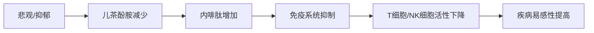

# 活出最乐观的自己_merged

状态: TODO
Update Date: 2025年11月11日 08:05
Create Date: 2025年11月11日 07:57

# 活出最乐观的自己 - 合并版

创建于：2025-11-11 02:05:56

标签：
AI链接笔记
书籍版权信息
湛庐文化
活出最乐观的自己

---

原文：[(anonymous)](https://pdf-1381123255.cos.ap-beijing.myqcloud.com/%E6%B4%BB%E5%87%BA%E6%9C%80%E4%B9%90%E8%A7%82%E7%9A%84%E8%87%AA%E5%B7%B1_01_%E7%AB%A0%E8%8A%82_1.pdf)

📚 **书籍基本信息**
- 书名：活出最乐观的自己
- 著者：[美]马丁·塞利格曼
- 字数：215000
- 电子版定价：22.99美元

📖 **出版信息**
- 纸版出版社：万卷出版社
- 纸版出版时间：2010年8月

🔒 **版权授权信息**
- 授权方：作者
- 被授权方：湛庐文化（Cheers Publishing）
- 授权范围：中国大陆（除港澳台）地区电子版发行
- 语言版本：限简体中文
- 版权声明：版权所有·侵权必究

---

# 幸福可以学来，幸福可以到永远

创建于：2025-11-11 02:06:11

标签：
AI链接笔记
幸福
悲观
乐观

---

原文：[(anonymous)](https://pdf-1381123255.cos.ap-beijing.myqcloud.com/%E6%B4%BB%E5%87%BA%E6%9C%80%E4%B9%90%E8%A7%82%E7%9A%84%E8%87%AA%E5%B7%B1_02_%E7%AB%A0%E8%8A%82_2.pdf)

📚 **全书结构大纲**

### 前言

- 主题：幸福的可学习性与持久性

### 第一部分：什么是悲观，什么是乐观

1. 第1章：悲观者与乐观者的画像
2. 第2章：悲观者的无助感源自何处
3. 第3章：悲观者眼中的挫折
4. 第4章：从悲观滑向抑郁
5. 第5章：想法决定悲喜人生

### 第二部分：乐观的人生为什么精彩

1. 第6章：乐观奠定成功的事业
2. 第7章：孩子为什么会悲观
3. 第8章：乐观的孩子成绩好
4. 第9章：乐观造就赛场冠军
5. 第10章：乐观的身体不生病
6. 第11章：乐观的领袖得民心

### 第三部分：如何活出最乐观的自己

1. 第12章：乐活人生的ABCDE
2. 第13章：帮你的孩子远离悲观
3. 第14章：组织需要怎样的乐观
4. 第15章：乐观可以有弹性

---

# 积极心理学之父马丁·塞利格曼与幸福著作指南 📚

创建于：2025-11-11 02:06:27

标签：
AI链接笔记
积极心理学
马丁·塞利格曼
习得性无助

---

原文：[(anonymous)](https://pdf-1381123255.cos.ap-beijing.myqcloud.com/%E6%B4%BB%E5%87%BA%E6%9C%80%E4%B9%90%E8%A7%82%E7%9A%84%E8%87%AA%E5%B7%B1_03_%E7%AB%A0%E8%8A%82_3.pdf)

### 一、马丁·塞利格曼核心贡献

### 1.1 学术地位与突破

- 国际积极心理学学会理事，被誉为”积极心理学之父”
- 1998年以史上最高票当选美国心理协会主席
- 指出心理学应同时关注美德优势与弱点问题，奠定积极心理学结构体系

### 1.2 研究历程里程碑

- 1964年（博士研究生时期）：发现并证明”习得性无助”现象，轰动心理学界
- 1976年：破格晋升为宾夕法尼亚大学心理系教授
- 研究转向：从悲观心理研究→乐观品质的后天习得性研究

### 1.3 学术影响力

- 出版21部著作，发表218篇关于人类动机和人格的论文
- 擅长将深奥研究与日常生活融合，文笔优美生动，是美国畅销书作者

### 二、核心著作及核心观点

### 2.1 《真实的幸福》

- 核心主张：真正的幸福源于优势运用与生活意义追求，具有可控性
- 实践方法：
    - 改变对过去的消极看法
    - 重视当下的积极体验
    - 建立对未来的积极期望

### 2.2 《活出最乐观的自己》

- 核心发现：乐观者在逆境中成长更快，更容易走向成功
- 关键技术：ABCDE技术（可学习掌握的乐观培养方法）
- 重要观点：乐观是可通过后天学习获得的性格品质

### 2.3 《认识自己，接纳自己》

- 核心框架：区分可改变与不可改变的个人特质
- 实践策略：
    - 聚焦可改变特性（集中时间精力）
    - 接受生物局限性（避免无效消耗）
- 颠覆认知：节食无法长期减肥/酗酒需自然恢复等

### 2.4 《教出乐观的孩子》

- 定位：家长实用指南，培养孩子积极品质
- 教育技巧：
    - 批评需恰如其分，明确错误具体内容
    - 避免将问题夸大为永久性缺陷
    - 不当批评可能影响孩子成年后的悲观/乐观人格

### 三、阅读价值与意义

- 获得积极健康心态，助力事业发展与个人成长
- 兼具科学严谨性与通俗可读性
- 收获不仅限于知识，更包含做人与生活的智慧
- 即使不能完全理解全部思想，阅读大师著作本身就是最有价值的经历

---

# 积极心理学与习得性乐观：从研究起源到实践应用

创建于：2025-11-11 02:06:42

标签：
AI链接笔记
积极心理学
习得性乐观
抑郁预防

---

原文：[(anonymous)](https://pdf-1381123255.cos.ap-beijing.myqcloud.com/%E6%B4%BB%E5%87%BA%E6%9C%80%E4%B9%90%E8%A7%82%E7%9A%84%E8%87%AA%E5%B7%B1_04_%E7%AB%A0%E8%8A%82_4.pdf)

📚 **一、积极心理学的起源与发展**
1. 学术转折点
- 1988年与理查德·派因的会晤改变研究方向
- 从关注心理问题转向研究乐观品质
- 核心著作《活出最乐观的自己》成为积极心理学基础
2. 运动里程碑
- 1996年当选美国心理协会主席（史上最高票）
- 推动积极心理学成为心理学重要分支

🔍 **二、抑郁流行的社会现象分析**
1. 矛盾现象
- 发达国家面临空前抑郁流行病（年轻人为主要群体）
- 社会越富裕/教育越发达，抑郁发生率越高
2. 三大影响因素
- 第一股：”自我”失常（个人主义导致失败承受力下降）
- 第二股：”我们”弱化（对社区/家庭等集体信任侵蚀）
- 第三股：自尊运动误区（过度强调自我感觉而非实际表现）

🧪 **三、习得性乐观的实证研究**
1. 核心项目
- 宾夕法尼亚大学新生干预计划
- 青春期前儿童乐观训练项目
2. 关键成果
- 16小时工作坊组抑郁率（22%）显著低于对照组（32%）
- 20年追踪显示：乐观训练组抑郁比例仅为对照组一半
- 保护效应随时间增强（青春期社会拒绝情境下仍有效）

💡 **四、实践启示与应用**
1. 乐观培养价值
- 预防抑郁和焦虑的有效手段
- 提升长期心理韧性的核心技能
2. 儿童教育反思
- 25年儿童书籍主题变迁：从”克服障碍”转向”感觉良好”
- 健康自尊建立：基于实际成就而非空洞表扬

---

# 悲观与乐观：思维模式如何影响人生

创建于：2025-11-11 02:06:58

标签：
AI链接笔记
习得性无助
悲观与乐观
解释风格

---

原文：[(anonymous)](https://pdf-1381123255.cos.ap-beijing.myqcloud.com/%E6%B4%BB%E5%87%BA%E6%9C%80%E4%B9%90%E8%A7%82%E7%9A%84%E8%87%AA%E5%B7%B1_05_%E7%AB%A0%E8%8A%82_5.pdf)

### 一、悲观与乐观的核心定义

1. **悲观者特征**
    - 认为坏事由自身导致（内归因）
    - 灾难化解读：坏事会持续很久且影响所有方面
    - 典型反应：无助、放弃、自我否定
2. **乐观者特征**
    - 认为坏事是暂时的、外部的、特定的
    - 视挫折为挑战，倾向于积极解决问题
    - 典型反应：快速恢复、持续努力、自我效能感强

### 二、悲观的底层机制：无助感

1. **无助感的形成**
    - 定义：认为“无论如何努力都无法改变命运”的心理状态
    - 发展阶段：
    ➤ 婴儿期：完全依赖，无自主控制能力
    ➤ 成长过程：逐渐习得个人控制（行走、语言等）
    ➤ 悲观者：成年后仍保留“习得性无助”模式
2. **悲观的自我实现循环**
    - 负面事件 → 悲观解释（内/稳/普归因）→ 放弃行动 → 更多负面结果 → 强化悲观

### 三、悲观的危害与案例

1. **核心影响**
    - 情绪：易患抑郁症，自杀风险高
    - 成就：学业/事业表现低于能力水平
    - 健康：免疫力下降，寿命缩短
2. **典型案例**
    - 文学系女生因教授诬陷论文抄袭，陷入自我否定，最终放弃学术，以售货员为生

### 四、传统抑郁症疗法的局限

| 疗法类型 | 核心观点 | 缺陷 |
| --- | --- | --- |
| 心理分析法 | 童年冲突导致自我憎恨 | 耗时久、疗效差、归咎患者自身 |
| 生物医学法 | 大脑化学物质失衡 | 依赖药物、副作用大、易复发 |

### 五、习得性乐观：科学干预方法

1. **核心原理**
    - 关键：改变对失败的**解释风格**（非消极思考）
    - 目标：将悲观归因（内/稳/普）转化为乐观归因（外/暂/特）
2. **实践步骤**
    - 识别自动化负面想法
    - 质疑想法的合理性（寻找反例）
    - 用积极现实的解释替代

### 六、乐观的价值与应用

1. **三大核心益处**
    - 情绪健康：降低抑郁风险
    - 成就提升：学业/职场表现优于能力预期
    - 生理健康：增强免疫力，延长寿命
2. **注意事项**
    - 轻度悲观在风险评估中有用
    - 乐观需基于现实，非盲目积极

---

# 悲观者的无助感：习得性无助的起源与研究

创建于：2025-11-11 02:07:13

标签：
AI链接笔记
习得性无助
三元实验
行为主义批判

---

原文：[(anonymous)](https://pdf-1381123255.cos.ap-beijing.myqcloud.com/%E6%B4%BB%E5%87%BA%E6%9C%80%E4%B9%90%E8%A7%82%E7%9A%84%E8%87%AA%E5%B7%B1_06_%E7%AB%A0%E8%8A%82_6.pdf)

📚 **第1节：个人经历与研究动机**

1. **父亲的无助案例**

- 49岁时突发中风，身体左侧麻痹，后完全瘫痪

- 从冷静稳重变得情绪化，最终表达”不再相信任何事情”的绝望

- 成为作者研究无助感的核心灵感来源

1. **个人成长危机**
    - 转学至军事化私立高中，作为唯一中产家庭孩子感到被排斥
    - 目睹父亲无助状态，首次体会无助带来的痛苦

🔬 **第2节：习得性无助的动物实验**

1. **意外发现**

- 狗在经典条件反射实验中出现”不动”现象：接受声音+电击配对后，即使可逃避也放弃跳跃矮闸

1. **三元实验设计（1965年）**
    - **可逃避组**：按压板块可停止电击 → 全部学会逃避
    - **不可逃避组**：电击与行为无关 → 8只中6只放弃尝试
    - **控制组**：无电击 → 全部快速学会逃避
    - **结论**：无助是习得的，与压力无关，仅与”行为无效”的认知有关
2. **关键反驳实验**
    - **静止奖励实验**：让狗静止5秒即可停止电击
    - **结果**：学会控制的狗未出现无助，推翻行为主义”静止被奖励”的解释

💡 **第3节：人类习得性无助研究**

1. **裕人实验（1971年）**

- **不可逃避噪音组**：多数人忍受噪音，不尝试移动手部逃避

- **可控制组/控制组**：全部学会逃避方法

- **发现**：3人中有1人不易无助；10人中有1人天生被动

1. **核心结论**
    - 无助可跨情境迁移（从噪音→新实验箱）
    - 认知预期（”行为无效”）是关键中介因素

🔄 **第4节：无助的干预与预防**

1. **治疗方法**

- 强制引导行动（如拖拽狗跳过矮闸）→ 100%永久治愈

1. **预防机制**
    - **免疫效应**：提前学习”行为有效”可终身预防无助

---

# 悲观者眼中的挫折：解释风格与乐观思维

创建于：2025-11-11 02:07:29

标签：
AI链接笔记
解释风格
习得性无助
乐观思维

---

原文：[(anonymous)](https://pdf-1381123255.cos.ap-beijing.myqcloud.com/%E6%B4%BB%E5%87%BA%E6%9C%80%E4%B9%90%E8%A7%82%E7%9A%84%E8%87%AA%E5%B7%B1_07_%E7%AB%A0%E8%8A%82_7.pdf)

📚 **第3章核心框架**

### 一、悲观与乐观的现实案例

1. **娜拉与凯文的对比**
    - **共同遭遇**：大型贸易公司会计室裁员，两人失业后抑郁
    - **差异表现**：
        - 娜拉：仅回避会计相关事务，保持生活热情（社交/健身/家庭活动）
        - 凯文：全面崩溃（社交退缩/亲子关系疏离/健康恶化）

### 二、习得性无助理论的挑战与发展

1. **原始理论的漏洞**
    - 1/3被试不会产生无助感，恢复能力存在个体差异
    - 蒂斯代尔质疑：需解释”为何有人永不放弃”
2. **新解释风格理论（归因三维度）**
    
    | 维度 | 定义 | 悲观倾向 | 乐观倾向 |
    
    |————|——————————-|—————————|—————————|
    
    | **永久性** | 事件原因持续时间 | “我永远做不好” | “这次只是太累了” |
    
    | **普遍性** | 事件影响范围 | “我什么都做不好” | “只是这件事没做好” |
    
    | **人格化** | 事件责任归属 | “都是我的错” | “环境/运气影响” |
    

### 三、乐观程度测试与计分

1. **测试维度及计分方式**
    - **坏事件解释（B类）**：PmB（永久性）+ PvB（普遍性）+ PsB（人格化）
    - **好事件解释（G类）**：PmG（永久性）+ PvG（普遍性）+ PsG（人格化）
    - **总分计算**：G-B（越高越乐观，≤0为极端悲观）
2. **分数解读**
    - 悲观者风险：抑郁倾向/潜能抑制/健康受损/生活满意度低
    - 乐观者优势：危机恢复快/成就动机强/健康免疫力高

### 四、关键概念解析

1. **解释风格**
    - 定义：对事件原因的习惯性思维方式（童年/青少年期形成）
    - 核心作用：决定乐观/悲观倾向，影响挫折应对能力
2. **希望公式**
    - 希望 = 暂时性解释（而非永久）+ 特定性解释（而非普遍）
    - 例：”考试失败是因为复习时间不足”（乐观）vs “我天生不是学习的料”（悲观）

---

# 从悲观到抑郁：成因、表现与科学解析 📘

创建于：2025-11-11 02:07:45

标签：
AI链接笔记
习得性无助
抑郁症临床表现
双极抑郁症

---

原文：[(anonymous)](https://pdf-1381123255.cos.ap-beijing.myqcloud.com/%E6%B4%BB%E5%87%BA%E6%9C%80%E4%B9%90%E8%A7%82%E7%9A%84%E8%87%AA%E5%B7%B1_08_%E7%AB%A0%E8%8A%82_8.pdf)

### 一、抑郁的本质与关联

- **核心定义**：抑郁是悲观的放大形态，悲观的解释风格是抑郁的核心
- **关键关联**：悲观时的轻微心理失常状态→抑郁；了解悲观可帮助理解抑郁症
- **案例佐证**：”黄金女孩”苏菲从优秀学生到抑郁患者的转变历程（学业崩溃/人际关系恶化/存在主义绝望）

### 二、抑郁的分类体系

### （一）一般性抑郁（normal depression）

- 触发因素：痛苦与失落（人类不可避免的情感体验）
- 核心特征：懒散被动/兴趣丧失/食欲睡眠紊乱/社交退缩
- 自愈特性：通常可自行缓解（”心理上的小感冒”）
- 流行程度：任何时刻约25%的人处于该状态

### （二）抑郁症（depressive disorder）

1. **双极抑郁症（躁郁症）**
    - 症状组合：躁狂症（极度快乐/狂妄多动/自我膨胀）+ 抑郁症交替发作
    - 遗传关联：同卵双生子患病概率72%，异卵双生子仅14%
    - 治疗方案：碳酸锂有效率约80%（减轻躁狂症状为主）
2. **单极抑郁症**
    - 关键差异：无躁狂症状，遗传几率低于双极抑郁症
    - 医学争议：作者认为与一般性抑郁是同一谱系，仅程度和症状数量不同

### 三、抑郁的四大临床表现

### （1）思想层面

- 认知扭曲：对自我/世界/未来的消极认知（”手指碰到的东西都会变成灰烬”）
- 案例典型：贝克治疗的患者将20-25张壁纸中3张的0.3cm对齐误差视为彻底失败

### （2）情绪层面

- 核心表现：情绪低落/哭泣/焦虑易怒（严重时转为麻木空虚）
- 昼夜规律：清晨3-5点情绪最低潮，傍晚3-6点再次低落，夜间相对缓解

### （3）行为层面

- 三大症状：被动拖延（无法启动非例行事务）/决策困难（如无法选择披萨口味）/自杀行为（终止痛苦或情感操纵）

### （4）身体层面

- 典型症状：食欲减退/性欲丧失/早醒失眠/持续疲劳

### 四、抑郁的评估工具

- **量表名称**：流行病学研究中心抑郁量表（CES-D）
- **计分标准**：0-60分（0-9分正常/10-15分轻度/16-24分中度/24+分重度）
- **使用说明**：高分≠确诊依据，需结合症状持续时间及专业面谈

### 五、抑郁症的流行病学特征

- **发病率趋势**：20世纪以来增加10倍以上（美国两项大型研究证实）
- **年龄变化**：患者年龄层显著降低
- **社会悖论**：物质富足社会反而呈现更高抑郁倾向

### 六、抑郁的成因与干预

### （一）生物学因素

- 适用范围：双极抑郁症（明确生理病因）/部分严重单极抑郁症
- 治疗方式：药物治疗为主（效果双极优于单极）

### （二）心理社会因素（主流成因）

- **核心机制**：习得性无助（经历不可控失败后形成的消极预期）
- **实验验证**：实验室无助模型重现8/9项重度抑郁诊断标准（仅缺自杀倾向）
- **干预路径**：
    - 预防：提前建立行为有效性认知
    - 治疗：展示行为有效性/改变失败归因方式

---

# 认知疗法与抑郁症：从悲观到乐观的思维转变

创建于：2025-11-11 02:08:00

标签：
AI链接笔记
认知疗法
抑郁症治疗
悲观解释风格

---

原文：[(anonymous)](https://pdf-1381123255.cos.ap-beijing.myqcloud.com/%E6%B4%BB%E5%87%BA%E6%9C%80%E4%B9%90%E8%A7%82%E7%9A%84%E8%87%AA%E5%B7%B1_09_%E7%AB%A0%E8%8A%82_9.pdf)

### 一、核心理论基础

### 1. 抑郁症的认知根源

- 🧠 **关键发现者**：心理学家埃利斯（Albert Ellis）与精神科医生贝克
- 🔄 **核心观点**：抑郁症源于**消极思维模式**，而非单纯生理疾病或潜意识冲突
- 🚫 **传统误区**：
    - 生物医学派：仅视为生理疾病
    - 心理分析派：认为是”愤怒内化”结果

### 2. 认知疗法革命性突破

- ✨ **理论颠覆**：抑郁症是”思想意识形态问题”，可通过改变思维模式治愈
- 🆚 **与传统疗法差异**：
    - 药物治疗：缓解症状但不改变思维模式
    - 认知疗法：重塑解释风格，实现长期康复

### 二、认知行为模式分析

### 1. 悲观解释风格三要素

- ⏳ **永久性**：认为坏事”永远不会改变”
- 🌍 **普遍性**：认为失败会”影响所有生活领域”
- 👤 **人格化**：将挫折归咎于”自己的缺陷”

### 2. 反刍思维的危害

- 🔄 **定义**：反复咀嚼负面事件，放大抑郁情绪
- 🚺 **性别差异**：女性更易陷入反刍（思考原因），男性倾向行动转移（如运动、工作）

### 三、认知疗法实践方法

### 1. 五大核心技术

1. 🔍 **识别自动消极想法**（如”我是最糟糕的妈妈”）
2. 🧐 **证据对抗**（列举反驳消极想法的实例）
3. 🔄 **重新归因**（用暂时性、特定性解释替代永久普遍性解释）
4. 🧘 **思维转移**（将注意力从抑郁思绪中引开）
5. 📌 **质疑核心假设**（如”没有爱就活不下去”等非理性信念）

### 2. 治疗效果对比

| 疗法类型 | 短期效果 | 长期效果 | 作用机制 |
| --- | --- | --- | --- |
| 药物治疗 | ⭐⭐⭐⭐ | ⭐⭐ | 缓解症状，无法改变思维 |
| 认知疗法 | ⭐⭐⭐ | ⭐⭐⭐⭐ | 重塑乐观解释风格 |
| 药物+认知联合 | ⭐⭐⭐⭐⭐ | ⭐⭐⭐⭐ | 症状缓解+思维改造 |

### 四、典型案例分析

### 丹雅的转变历程

- 📉 **抑郁期表现**：
    - 自我否定：”我是最糟糕的妈妈”（21分悲观指数）
    - 婚姻关系恶化，认为”一切都是我的错”
- 📈 **治疗后改变**：
    - 重新归因：”老公不肯陪我去教堂是他的问题”（8分乐观指数）
    - 行为激活：找兼职工作，获得经济自主权
- 🔑 **关键转变**：从”自我谴责”到”外部归因+问题解决”

### 五、抑郁症性别差异研究

### 1. 2:1患病比例成因

- 🧠 **思维模式差异**：
    - 女性：反刍思维（分析问题）+ 悲观解释 → 抑郁放大
    - 男性：行动转移（如酗酒、运动）→ 情绪缓解
- 📚 **青春期转折点**：小学男生更易抑郁，青春期后女性比例显著上升

### 2. 实证研究证据

- 🏫 **学生实验**：70%既悲观又考差的学生陷入抑郁
- 🏛️ **监狱研究**：悲观者入狱后抑郁程度显著高于乐观者

---

# 乐观奠定成功的事业：理论与实践研究

创建于：2025-11-11 02:08:16

标签：
AI链接笔记
归因风格测验
乐观解释风格
成功金三角理论

---

原文：[(anonymous)](https://pdf-1381123255.cos.ap-beijing.myqcloud.com/%E6%B4%BB%E5%87%BA%E6%9C%80%E4%B9%90%E8%A7%82%E7%9A%84%E8%87%AA%E5%B7%B1_10_%E7%AB%A0%E8%8A%82_10.pdf)

### 一、乐观与保险销售的关联研究

### 1. 核心案例：德尔的转型故事

- 🥩 **背景**：26年屠宰场工作经验，因工厂关闭失业
- 📈 **转折**：未通过传统职业测试，但归因风格测验显示高乐观性被录用
- 💼 **成果**：第一年薪资比屠宰场高50%，第二年翻倍，成为超级业务员
- 🔑 **关键特质**：坚持性+想象力，能在非常规场景开发客户

### 2. 理论起源：约翰·莱斯利的启示

- ✈️ **偶然对话**：1982年航班上与乐观者莱斯利的交流
- 💡 **研究转向**：从抑郁症研究→积极心理学，关注”永不放弃者”的特质
- 🎯 **核心发现**：乐观者相信”能做到别人做不到的事”

### 二、成功的金三角理论

### 1. 传统筛选机制的局限

- 🏦 **保险业痛点**：每年录用5000人中50%+离职，培训成本3万美元/人
- 📊 **数据对比**：传统职业剖析测验仅能预测37%业绩差异
- ❌ **失效原因**：无法评估面对拒绝时的坚持能力

### 2. 三维成功模型

- 1️⃣ **能力**：专业知识与技能（传统测验评估）
- 2️⃣ **动机**：成就驱动力（态度问卷测量）
- 3️⃣ **乐观**：解释风格决定挫折恢复力（归因风格测验核心）

### 三、归因风格测验的应用

### 1. 测验设计原理

- 📝 **12个情境问题**：6个负面事件+6个正面事件
- 🧠 **归因维度**：内在/外在、永久/暂时、普遍/特定
- 📈 **G-B分数**：好事件与坏事件解释风格的差值

### 2. 实证研究结果

- 🔍 **相关性分析**：
    - 最乐观组比最悲观组业绩高88%
    - 乐观分数低者离职率是高分组的3倍
- 🧪 **对照实验**：
    - 传统方法录用组：乐观者第二年业绩超悲观者31%
    - 特别录用组（职业分9-11分+高乐观）：业绩超传统组27%

### 四、乐观与悲观的辩证关系

### 1. 认知偏差对比

| 维度 | 乐观者特征 | 悲观者特征 |
| --- | --- | --- |
| 控制权判断 | 高估控制能力 | 准确判断实际控制水平 |
| 社交评估 | 高估受欢迎程度 | 准确认知社交表现 |
| 记忆倾向 | 偏向记住积极事件 | 均衡记忆正负事件 |

### 2. 进化视角的解释

- 🌨️ **悲观价值**：冰河时期人类需”未雨绸缪”的风险意识
- ☀️ **乐观价值**：驱动探索未知、发挥潜能的动力源泉
- ⚖️ **动态平衡**：轻度悲观避免愚蠢决策，适度乐观激发创造力

### 五、实践应用指南

### 1. 行业人才筛选

- ✅ **双元标准**：职业剖析测验（能力）+归因风格测验（乐观）
- 📈 **实施效果**：大都会保险市场占有率提升50%，业务员规模扩至12000人

### 2. 乐观的边界

- 🚫 **不适用场景**：会计、安全工程等需绝对现实判断的岗位
- ⏰ **适用时机**：创新项目、销售攻坚、危机应对等需要坚持的场景

---

# 孩子悲观心理的形成与影响因素解析 🧠

创建于：2025-11-11 02:08:32

标签：
AI链接笔记
儿童解释风格
悲观心理形成
归因风格问卷

---

原文：[(anonymous)](https://pdf-1381123255.cos.ap-beijing.myqcloud.com/%E6%B4%BB%E5%87%BA%E6%9C%80%E4%B9%90%E8%A7%82%E7%9A%84%E8%87%AA%E5%B7%B1_11_%E7%AB%A0%E8%8A%82_11.pdf)

### 一、解释风格的重要性

1. **核心定义**
    - 解释风格：对事件因果关系的习惯性解释方式，影响情绪、行为及身心健康
    - 关键维度：永久性（暂时/永久）、普遍性（特定/普遍）、人格化（内归因/外归因）
2. **对人生的影响**
    - 引发抑郁或促人振作
    - 影响目标实现与生活满意度
    - 塑造人际关系与身体健康

### 二、儿童解释风格的形成

1. **发展阶段**
    - 7岁后开始定型，童年期形成的解释风格具有基础性
    - 青春期前儿童普遍乐观，青春期后乐观程度下降
2. **评估工具：儿童归因风格问卷**
    - 适用年龄：8-13岁（25分钟完成），13岁以上可用成人版
    - 计分维度：
        - 消极事件（PmB永久性+PvB普遍性+PsB人格化）
        - 积极事件（PmG永久性+PvG普遍性+PsG人格化）
        - 总分=G类总分-B类总分（女孩均值7.0，男孩均值5.0）

### 三、儿童悲观心理的三大影响因素

### （一）母亲的解释风格示范

- **关键发现**：母亲的乐观程度与孩子高度相关，父亲影响不显著
- **案例分析**：母亲对车门被撞事件的悲观解释（”倒霉事总发生在我身上”）会被孩子内化

### （二）成人批评方式

- **性别差异**：
    - 男孩常收到暂时性批评（”上课不注意听讲”）
    - 女孩常收到永久性批评（”你数学不好”）
- **实验验证**：女孩面对无解字谜时更易归因于”不聪明”，男孩则归因于”不够努力”

### （三）早期生活危机

1. **经济大萧条研究（艾尔德华盛顿大学）**
    - 中产女孩：家庭经济恢复→习得乐观解释风格→晚年心理健康
    - 底层女孩：长期贫困→形成悲观解释风格→晚年身心衰退
2. **重大丧失事件**
    - 母亲早逝（尤其青春期前）易导致孩子对离别产生永久性、普遍性解释
    - 保护因素：亲密关系、外出工作、少子女（≤3个14岁以下孩子）

### 四、儿童悲观的风险与保护

1. **风险信号**
    - 女孩G-B分＜2，男孩＜1需警惕抑郁倾向
    - 悲观解释风格与抑郁症、低成就正相关
2. **进化保护机制**
    - 儿童期自杀率极低（无7岁以下记录），进化层面保障生育潜力

---

# 儿童乐观与学业成就：理论、研究与实践指南

创建于：2025-11-11 02:08:48

标签：
AI链接笔记
解释风格
儿童乐观
学业成就

---

原文：[(anonymous)](https://pdf-1381123255.cos.ap-beijing.myqcloud.com/%E6%B4%BB%E5%87%BA%E6%9C%80%E4%B9%90%E8%A7%82%E7%9A%84%E8%87%AA%E5%B7%B1_12_%E7%AB%A0%E8%8A%82_12.pdf)

📚 **第1章：乐观与悲观的核心理论**

### 1.1 解释风格的定义

- **乐观者**：将失败视为**暂时的、特定的**（如”这次考试太难”），挫折是挑战而非灾难
- **悲观者**：将失败视为**永久的、普遍的**（如”我永远学不好数学”），易陷入长期无助

### 1.2 对学业的影响

- **成功公式**：学业成就 = 智力 × 乐观
- **悲观的恶性循环**：失败→自我否定→退缩→成绩下滑→更悲观

📊 **第2章：儿童抑郁与学业表现**

### 2.1 儿童抑郁的识别（CES-DC测验）

- **评分标准**：0-9分（无抑郁）、10-15分（轻微）、16-24分（中度）、24+分（严重）
- **警示信号**：连续2周15+分，或有自杀倾向需立即就医

### 2.2 抑郁与学业的关联

- 抑郁儿童在字谜/智力测验中表现差，成绩下滑风险高
- 根源常为**悲观解释风格**而非能力不足

👨‍👩‍👧 **第3章：家庭环境的影响**

### 3.1 父母冲突与离婚的长期伤害

- **直接后果**：孩子抑郁风险↑，成绩下滑，社交退缩
- **连锁反应**：经历更多不幸事件（如亲友离世、住院率↑3.5倍）

### 3.2 父母的关键行动

- 避免在孩子面前频繁争吵，或通过建设性沟通解决冲突
- 离婚/分居后需给予孩子额外情感支持，打破”抑郁→悲观”循环

🎒 **第4章：教育场景中的实证研究**

### 4.1 学校表现预测

- **宾州大学研究**：乐观新生的大学成绩比SAT/高中成绩预测值高20%
- **西点军校案例**：悲观者在野兽营退学率显著高于乐观者

### 4.2 性别差异

- **儿童期**：男孩抑郁率（35%）高于女孩（21%），男孩更易悲观
- **青春期**：女性抑郁率反超男性（原因待研究）

🛠️ **第5章：实践启示**

### 5.1 家长与教师指南

- 关注孩子对失败的解释方式，引导其将挫折归因于**可控因素**（如努力不足）
- 利用CES-DC测验定期筛查孩子情绪状态

### 5.2 关键结论

- 乐观可通过干预培养（后续章节将详细说明方法）
- 无乐观，高智商也难以转化为持续成就

---

# 乐观与运动表现：解释风格对赛场成败的影响

创建于：2025-11-11 02:09:03

标签：
AI链接笔记
乐观解释风格
运动心理学
归因理论

---

原文：[(anonymous)](https://pdf-1381123255.cos.ap-beijing.myqcloud.com/%E6%B4%BB%E5%87%BA%E6%9C%80%E4%B9%90%E8%A7%82%E7%9A%84%E8%87%AA%E5%B7%B1_13_%E7%AB%A0%E8%8A%82_13.pdf)

📚 **核心理论与研究背景**

1. **解释风格定义**

- 乐观解释风格：将失败归因于**外在、暂时、特定**因素（如对手强、运气差）

- 悲观解释风格：将失败归因于**内在、永久、普遍**因素（如能力不足、团队不行）

1. **研究核心假设**
    - 个体层面：乐观运动员在压力下表现更佳，失败后更易反弹
    - 团队层面：乐观团队整体成绩更优，尤其在逆境中超越预期

🏊 **经典案例：比昂迪的奥运逆袭**

- **背景**：1988年汉城奥运会，美国游泳名将比昂迪（Matt Biondi）在200米自由泳获铜牌、100米蝶泳获银牌后遭媒体质疑

- **关键转折**：4个月前的归因风格测验显示其为**乐观前25%人群**，模拟挫折情境中，教练谎称其成绩变差，比昂迪第二次反而游得更快（50.0秒 vs 50.2秒）

- **结果**：后续5项比赛全部夺冠，验证乐观者在压力下的韧性

⚾ **团队运动研究：棒球与篮球实证**

### 1. 美国职业棒球大联盟（1985-1986赛季）

- **研究方法**：分析12支球队球员/教练在体育版对失败的解释，计算团队平均解释风格分数（3~21分，≤8分为乐观）
- **典型案例**：
    - **纽约大都会队**（乐观，9.39分）：1986年夺冠，压力下安打率0.277
    - **圣路易红雀队**（悲观，11.09分）：1986年成绩下滑，压力下安打率0.231
- **结论**：乐观团队次年表现显著优于悲观团队，尤其在压力下更稳定

### 2. NBA篮球联赛（1982-1985赛季）

- **创新指标**：以“胜分差”预测球队表现，分析输球后的归因风格
- **典型案例**：
    - **波士顿凯尔特人队**（乐观）：输球后68.4%~81.3%比赛超越预期胜分差
    - **新泽西篮网队**（悲观）：输球后仅37.8%比赛超越预期胜分差
- **结论**：乐观球队在连败后反弹能力更强，悲观球队易陷入持续低迷

🏫 **个体运动验证：伯克利游泳队实验**

- **方法**：对50名校队成员进行归因风格测验，对比教练评估与实际表现

- **关键发现**：

- 乐观者在模拟失败（被告知成绩变差）后第二次游得更快

- 悲观者在压力下表现失常比例是乐观者的2倍

- **教练启示**：归因风格测验比教练直觉更能预测运动员真实抗压能力

🎯 **教练应用指南**

1. **选拔策略**：体能相近时优先选择乐观者，长期表现更稳定

2. **阵容调整**：接力赛中避免使用刚失利的悲观选手，优先启用近期获胜者

3. **训练方向**：通过干预将悲观者转化为乐观者（如认知重构技术）

📌 **核心结论**

- 乐观是可测量、可预测运动表现的关键心理因素，独立于技术水平

- 解释风格在**失败后、高压比赛末段**等情境中影响最显著

---

# 乐观与健康：心理状态对生理的影响及机制

创建于：2025-11-11 02:09:19

标签：
AI链接笔记
习得性无助
免疫系统
乐观与健康

---

原文：[(anonymous)](https://pdf-1381123255.cos.ap-beijing.myqcloud.com/%E6%B4%BB%E5%87%BA%E6%9C%80%E4%B9%90%E8%A7%82%E7%9A%84%E8%87%AA%E5%B7%B1_14_%E7%AB%A0%E8%8A%82_14.pdf)

### 一、案例启示：希望与无助的生命力量

### 1. 丹尼的故事 🌟

- 9岁患伯基特淋巴瘤，坚持写日记记录病情，寄望于东岸专家
- 因专家行程取消陷入绝望，次日出现并发症去世
- 揭示核心：**希望维持生命，无助摧毁生命**

### 2. 维辛坦娜的研究动机

- 越战护士观察到心理状态对士兵/患者的生死影响
- 1976年申请研究生，立志验证”无助是否致命”

### 二、科学验证：心理状态与健康的实验证据

### 1. 控制感对生存的影响

- **养老院实验**（兰格&罗丁, 1976）
    - 实验组（一楼老人）：自主选择早餐/电影/照顾植物
    - 对照组（二楼老人）：被动接受安排
    - 结果：实验组18个月后死亡率更低，幸福感更强

### 2. 习得性无助与癌症抵抗

- **维辛坦娜的老鼠实验**
    - 分组：可逃避电击（控制感）/不可逃避电击（无助感）/无电击
    - 移植癌细胞后结果：
    - 控制感组：70%战胜癌症
    - 无助组：仅27%战胜癌症
    - 无电击组：50%存活（正常水平）
    - 延伸发现：**童年自主控制经验**可增强成年后抗癌能力

### 三、身心关联的核心机制

### 1. 关键科学问题

- **原因**：希望真的维持生命？无助真的致命？
- **机制**：心理状态如何影响生理功能？
- **治疗**：改变认知能否增进健康？

### 2. 生理路径解析 ⚙️



### 3. 免疫系统的调节作用

- T细胞：识别入侵者并快速繁殖
- NK细胞：扑杀异常细胞（如癌细胞）
- 悲观状态导致两者活性显著降低

### 四、乐观的健康收益

### 1. 乐观者的四大优势

1. **免疫增强**：减少无助感，维持免疫系统活性
2. **健康习惯**：主动预防疾病、及时就医
3. **风险规避**：更少遭遇不幸事件（主动应对问题）
4. **社会支持**：更易建立深厚人际关系，缓冲压力

### 2. 长期追踪研究证据

- **哈佛毕业生研究**（瓦利恩特）
    - 25岁时的乐观程度可预测45岁后健康状况
    - 悲观者更早出现严重疾病，健康衰退速度更快
- **乳腺癌患者研究**
    - 乐观解释风格者复发率更低，存活时间更长（独立于病情严重度）

### 五、临床应用：认知疗法与健康干预

### 1. 认知疗法的效果 ✨

- **癌症患者实验**（利维&塞利格曼）
    - 12周认知治疗+放松训练
    - 结果：NK细胞活性显著提升（对照组无变化）

### 2. 高危人群预防策略

- 目标人群：离婚者、极地驻军等压力易感群体
- 干预手段：
    - 识别自动化悲观思维
    - 学习反驳悲观解释
    - 建立积极应对模式

### 六、核心结论与箴言

1. 心理状态是免疫系统的重要调节因子
2. 悲观解释风格是长期健康风险因素
3. 认知疗法可通过改变思维模式增强免疫功能
4. **童年控制经验**对终身健康具有奠基作用

---

# 乐观解释风格与政治选举预测研究

创建于：2025-11-11 02:09:34

标签：
AI链接笔记
乐观解释风格
政治选举预测
心理历史学

---

原文：[(anonymous)](https://pdf-1381123255.cos.ap-beijing.myqcloud.com/%E6%B4%BB%E5%87%BA%E6%9C%80%E4%B9%90%E8%A7%82%E7%9A%84%E8%87%AA%E5%B7%B1_15_%E7%AB%A0%E8%8A%82_15.pdf)

### 一、研究背景与理论基础

1. **核心理论起源**
    - 受阿西莫夫《基地三部曲》中心理历史学启发，认为群体行为可通过心理学原理预测
    - 基于塞利格曼的乐观解释风格理论：乐观者对逆境的解释具有**暂时性、特定性**，悲观者则倾向**永久性、普遍性**
2. **关键概念定义**
    - **CAVE技术**：通过分析文本中因果关系句子，量化解释风格的工具
    - **悲刍分数（pessrum）**：解释风格分数+反刍分数，分数越低表示越乐观
    - **反刍**：仅评论负面事件而不提出解决方案的语言比例

### 二、研究方法与数据

1. **数据收集**
    - **时间范围**：1900-1988年美国22次总统选举、1988年33位参议员选举
    - **文本来源**：候选人接受提名演讲、辩论实录、记者招待会文稿
2. **分析流程**
    1. 提取演讲中因果关系句子并随机排序
    2. 盲评者评分计算乐观分数与反刍比例
    3. 统计行动取向句子占比（提出具体解决方案的内容）

### 三、核心研究发现

### （一）总统选举预测规律

1. **1948-1984年验证**
    - 10次选举中**9次**悲刍分数低的候选人获胜
    - 例外情况：罗斯福连任选举（危机应对表现盖过乐观因素）
2. **1900-1944年扩展验证**
    - 12次选举中**9次**符合乐观者胜选规律
    - 赢面幅度与悲刍分数差距正相关

### （二）1988年选举预测实践 ✅

1. **总统初选预测**
    - **民主党**：杜卡基斯（最乐观）胜，哈特（最悲观）淘汰
    - **共和党**：布什（低悲刍）胜，多尔（高悲刍）退出
2. **总统大选预测**
    - 初测：杜卡基斯7月演讲乐观度飙升，预测领先3%
    - 终测：杜卡基斯秋季演讲回归悲观，布什以8.2%优势胜选
3. **参议员选举预测**
    - 29位候选人中**25位**预测准确，黑马与险胜案例全部命中

### 四、关键案例对比

| 候选人 | 悲刍分数 | 演讲风格特点 | 选举结果 |
| --- | --- | --- | --- |
| 史蒂文森（1952） | 高 | 强调磨难永久性，缺乏行动方案 | 败选 |
| 艾森豪威尔 | 低 | 行动导向，强调”开战第一天” | 胜选 |
| 杜卡基斯（1988） | 波动 | 7月演讲超乐观，秋季回归悲观 | 先领先后败选 |
| 布什（1988） | 稳定低 | 持续强调”解决方案导向” | 胜选 |

### 五、研究结论与意义

1. **核心结论**
    - 选民倾向选择**乐观型领导者**（能激发希望、提出行动方案）
    - 演讲稿风格与即兴发言的解释风格具有**跨场景稳定性**（杜卡基斯除外）
2. **学科贡献**
    - 开创**科学心理历史学**：首次实现重大历史事件的事前预测
    - 验证了乐观解释风格对**群体行为预测**的有效性

---

# 活出最乐观的自己：乐活人生的ABCDE法则

创建于：2025-11-11 02:09:50

标签：
AI链接笔记
乐观心理学
认知行为疗法
ABCDE模型

---

原文：[(anonymous)](https://pdf-1381123255.cos.ap-beijing.myqcloud.com/%E6%B4%BB%E5%87%BA%E6%9C%80%E4%B9%90%E8%A7%82%E7%9A%84%E8%87%AA%E5%B7%B1_16_%E7%AB%A0%E8%8A%82_16.pdf)

### 一、乐观的价值与应用边界

### 1.1 乐观者的优势

- 挫折后复原更快，事业/学业/运动表现更优 🚀
- 身体更健康，寿命更长
- 情绪调节能力更强

### 1.2 乐观技术的使用原则

✅ **适用场景**

- 追求成功（升职/推销/考试）

- 改善情绪（抗抑郁/提升士气）

- 健康管理（应对压力相关疾病）

- 领导力提升（激励他人/争取支持）

❌ **禁用场景**

- 高风险决策（如航空安全检查）

- 危机干预初期（需先建立共情）

- 为困境者提供实际解决方案时

### 二、ABCDE乐观训练模型

### 2.1 核心概念框架

| 阶段 | 含义 | 案例（凯蒂节食失败） |
| --- | --- | --- |
| A（Adversity） | 不好的事 | 酒吧吃炸土豆片+鸡翅 |
| B（Belief） | 自动化想法 | “我意志薄弱，节食全毁了” |
| C（Consequence） | 后果 | 情绪崩溃，吃掉整个蛋糕 |
| D（Disputation） | 反驳 | “仅一次过量不代表失败，已坚持2周证明毅力” |
| E（Energization） | 激发 | 恢复信心，继续执行节食计划 |

### 2.2 关键技术：反驳四步法

1️⃣ **证据检验**

- 寻找与消极想法矛盾的事实（例：朱蒂发现同学成绩比自己差）

- 避免”我总是失败”等绝对化思维

2️⃣ **多元归因**

- 从暂时性/特定性/外在化角度解释问题

- 例：考试失利→”复习时间不足”（可改变）而非”我很笨”（人格化）

3️⃣ **灾难弱化**

- 量化消极事件的实际影响

- 例：”丢了一只耳环”≠”我是糟糕的朋友”

4️⃣ **效用评估**

- 问自己：”这个想法对解决问题有帮助吗？”

- 高风险场景（如拆弹）建议用转移注意力法

### 三、实践工具与训练方法

### 3.1 ABC日记记录模板

```
不好的事：__________
想法：__________（记录永久性/普遍性/人格化解释）
后果：__________（情绪+行为反应）
```

### 3.2 消极思维中断技术

- **物理中断法**：橡皮筋弹手腕/大喊”停止”
- **注意力转移**：研究小物件细节（触觉/嗅觉/听觉）
- **延迟反刍**：设定”焦虑时间”（例：”今晚6点再思考此事”）

### 3.3 反驳训练实战案例

**情境**：发现15岁女儿藏避孕药

**消极想法**：”我是失职母亲，完全不了解孩子”

**有效反驳**：

- 证据：她听进了避孕教育（有保护意识）

- 归因：时代不同，需调整沟通方式

- 效用：借此契机建立性教育对话

### 四、经典案例解析

### 4.1 唐诺的情绪转变

**事件**：母亲在父亲去世4年后再婚

**思维进化**：

1. 初始反应：”母亲背叛父亲”（愤怒）

2. 认知重构：”父亲希望母亲幸福”（共情）

3. 行动转变：决定了解继父，修复母子关系

### 4.2 凯蒂的节食挫折

**关键转折**：从”我彻底失败了”→”单次失误不代表整体计划破产”

---

# 儿童乐观培养指南：ABCDE技术应用手册

创建于：2025-11-11 02:10:05

标签：
AI链接笔记
儿童乐观培养
ABCDE技术
悲观干预

---

原文：[(anonymous)](https://pdf-1381123255.cos.ap-beijing.myqcloud.com/%E6%B4%BB%E5%87%BA%E6%9C%80%E4%B9%90%E8%A7%82%E7%9A%84%E8%87%AA%E5%B7%B1_17_%E7%AB%A0%E8%8A%82_17.pdf)

📚 **一、儿童悲观的影响与干预必要性**
1. **悲观的长期危害**
- 破坏学业表现与生活快乐
- 形成稳定的负面认知模式
- 成为成人期抑郁的风险因素
2. **干预适用场景**（满足以下任一条件需干预）
- 儿童归因问卷得分：女孩＜7分/男孩＜5分
- 抑郁测验得分≥10分（≥16分需强制干预）
- 家庭存在父母冲突、分居或离婚情况

🧩 **二、核心技术：ABCDE乐观训练模型**
1. **基础概念框架**
- A（Adversity）：不好的事（客观事件）
- B（Belief）：想法（对事件的解释）
- C（Consequence）：后果（情绪/行为反应）
- D（Disputation）：反驳（挑战消极想法）
- E（Energization）：激发（产生积极情绪）

1. **分阶段训练步骤**`mermaid graph TD A[ABC概念建立] --> B[生活案例练习] B --> C[ABC记录养成] C --> D[反驳技术训练] D --> E[激发效果巩固] E --> F[外化反驳练习]` 
✏️ **三、ABC阶段训练指南**
1. **目标人群**：8-14岁儿童（7岁需耐心引导，14岁建议成人版）
2. **训练流程**
- 第一阶段：通过3个典型案例理解ABC联结
- 案例1：老师当众批评 → 自我否定想法 → 羞愧情绪
- 案例2：好友结交新朋友 → 自我价值怀疑 → 社交退缩
- 案例3：被高年级学生嘲笑体型 → 自我贬低 → 逃避社交
- 第二阶段：每日ABC记录练习
 `不好的事：____________________ 想法：________________________ 后果：________________________` 
🔍 **四、DE阶段训练指南**
1. **反驳技术四步法**
- 证据法：寻找与消极想法矛盾的事实
- 可能性法：列举事件的其他合理解释
- 暗示法：评估想法对解决问题的实际帮助
- 用处法：分析消极想法的实际危害
2. **典型案例示范**（以”被朋友疏远”为例）
- 消极想法：”她不再喜欢我，因为我不够酷”
- 有效反驳：”她之前也换过多个好朋友，可能只是喜新厌旧”
- 激发效果：”我可以和其他朋友一起吃午餐，不必过度焦虑”
🎭 **五、进阶训练：外化反驳练习**
1. **核心方法**：通过第三方角色（父母/木偶）说出消极想法，孩子进行反驳
2. **情境训练示例**
- 社交情境：被排挤时的自我价值保护
- 学业情境：考试失利后的归因重构
- 家庭情境：父母批评时的理性回应
3. **训练工具**：ABCDE记录表（含反驳与激发栏）

---

# 组织需要怎样的乐观：职场乐观技术与应用指南 📚

创建于：2025-11-11 02:10:21

标签：
AI链接笔记
ABCDE模型
解释风格
职场乐观

---

原文：[(anonymous)](https://pdf-1381123255.cos.ap-beijing.myqcloud.com/%E6%B4%BB%E5%87%BA%E6%9C%80%E4%B9%90%E8%A7%82%E7%9A%84%E8%87%AA%E5%B7%B1_18_%E7%AB%A0%E8%8A%82_18.pdf)

### 一、乐观与悲观的职场影响

1. **案例对比**
    - **史蒂芬（悲观者）**：保险推销遇挫后放弃打电话，选择逃避（喝可乐、看电视）
    - **娜咪（乐观者）**：同样被拒绝仍坚持拨打，通过12个电话获得面谈机会
    - **核心差异**：面对”高墙”时的解释风格决定行动结果
2. **关键结论**
    - 成功≠能力/动机，而取决于**乐观技术**的掌握
    - 悲观者将失败归因于**永久性/普遍性/人格化因素**（如”我总是做不好”）
    - 乐观者将挫折视为**暂时性/特定性/外部因素**（如”这次名单质量差”）

### 二、职场乐观应用场景

1. **适合乐观者的岗位**
    - 高竞争性：销售、经纪人、演艺、筹款
    - 创造性工作：设计、公关、高耗损性岗位
2. **适合轻度悲观者的岗位**
    - 高准确性要求：工程设计、财务控制、法律、质量检测
    - 风险规避型：成本预估、合约洽谈、人事管理
3. **组织价值**
    - 筛选乐观员工可降低流动率、提升生产率
    - 混合配置乐观/悲观者有助于平衡创新与风险控制

### 三、乐观技术：ABCDE模型

1. **核心框架**
    - **A（Adversity）**：不好的事（如客户挂断电话）
    - **B（Belief）**：自动化想法（如”我真是差劲的推销员”）
    - **C（Consequence）**：后果（情绪低落、放弃工作）
    - **D（Disputation）**：反驳消极想法
    - **E（Energization）**：激发积极行动
2. **反驳（D）的四大方法**
    - **证据**：寻找反例（”上周我成功约到3个客户”）
    - **其他可能性**：外部归因（”客户可能正在开会”）
    - **暗示**：降低灾难化（”一次拒绝不代表能力不足”）
    - **用处**：聚焦可控行动（”明天换种开场白试试”）
3. **实践工具**
    - **跳墙游戏**：记录5个职场挫折的ABC，练习反驳
    - **角色演练**：与同事互扮批评者/反驳者，强化反应模式
    - **注意力转移**：用橡皮筋弹手腕、设定”烦恼专属时间”

### 四、常见场景应用示例

| 情境 | 悲观想法 | 乐观反驳 | 激发行动 |
| --- | --- | --- | --- |
| 老板批评工作 | “我总是把事情弄糟” | “这次期限太紧，下次可提前沟通” | 制定改进计划 |
| 销售电话被挂断 | “我的表达能力太差” | “对方可能在忙，下一个会更好” | 调整话术继续拨打 |
| 学生上课无反应 | “我不是好老师” | “部分学生需要更多互动设计” | 尝试小组讨论教学法 |

---

# 第15章 乐观可以有弹性：现代社会抑郁症的根源与解药

创建于：2025-11-11 02:10:38

标签：
AI链接笔记
习得性乐观
抑郁症根源
弹性乐观主义

---

原文：[(anonymous)](https://pdf-1381123255.cos.ap-beijing.myqcloud.com/%E6%B4%BB%E5%87%BA%E6%9C%80%E4%B9%90%E8%A7%82%E7%9A%84%E8%87%AA%E5%B7%B1_19_%E7%AB%A0%E8%8A%82_19.pdf)

📌 **核心问题：抑郁症流行的时代危机**

- **现状**：现代人抑郁症几率是祖父母辈的10倍，女性和年轻人为高危群体

- **警示**：作者对女儿娜拉一代的担忧——除核武器、环境灾难外，精神危机更隐蔽且紧迫

### 一、抑郁症流行的两大社会根源

### 1. 特大号自我的膨胀

- **表现**：社会对个人成功/失败、幸福/痛苦的关注度空前提升
- **后果**：
✅ 积极面：个人控制感增强，选择自由扩大
❌ 消极面：期望过载（工作需有意义/婚姻需完美），失败时归因于自身无能

### 2. 公共意识的消失

- **传统支撑瓦解**：
    - 国家信仰：越战、水门事件削弱对政府信任
    - 家庭纽带：高离婚率、人口流动、少子化导致孤独感
    - 宗教信仰：精神寄托减弱
- **影响**：个人失去意义依附，失败时缺乏社会慰藉

### 二、抑郁症的心理机制：习得性无助

- **形成链条**：不可控失败 → 无助感 → 无望 → 抑郁症
- **文化差异**：原始社会通过集体分担损失缓解无助（如卡鲁里部落补偿丢失猪的成员），而个人主义社会加剧孤独无助

### 三、解决方案：弹性乐观与社会联结

### 1. 平衡自我与集体：道德慢跑实践

- **核心**：通过利他行为对抗过度自我中心
- **具体行动**：
▪ 捐赠5%退税金额并亲自执行慈善
▪ 每周牺牲1晚娱乐时间参与社区服务（流浪者救助/公益宣传等）
▪ 与乞讨者深度交流而非单纯施舍
▪ 教育孩子学习分享与捐赠

### 2. 习得性乐观：思维工具的力量

- **作用**：改变对失败的悲观解释风格（永久/普遍/人格化→暂时/特定/外部归因）
- **边界**：需与智慧结合，避免盲目乐观；需服务于超越自我的目标

### 3. 弹性乐观主义：审时度势的智慧

- **定义**：需乐观时用反驳技术击退抑郁，需理性时接受现实判断
- **价值**：在个人主义文化中，成为特大号自我的”心理防御工事”

塞利格曼的乐观箴言

★ 遏制抑郁需双管齐下：减少自我中心+强化社会集体慰藉

★ 弹性乐观=该乐观时乐观+该悲观时悲观，助我们幸福过一生