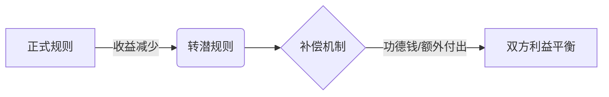

# 血酬定律：中国历史中的生存游戏(官场商场职场必读之书) (吴思) (Z-Library)_merged

状态: TODO
Update Date: 2025年11月11日 19:06
Create Date: 2025年11月11日 19:06

# 血酬定律：中国历史中的生存游戏(官场商场职场必读之书) (吴思) (Z-Library) - 合并版

创建于：2025-11-10 14:16:55

标签：
AI链接笔记
书籍目录
正编
杂编

---

原文：[(anonymous)](https://pdf-1381123255.cos.ap-beijing.myqcloud.com/%E8%A1%80%E9%85%AC%E5%AE%9A%E5%BE%8B%EF%BC%9A%E4%B8%AD%E5%9B%BD%E5%8E%86%E5%8F%B2%E4%B8%AD%E7%9A%84%E7%94%9F%E5%AD%98%E6%B8%B8%E6%88%8F%28%E5%AE%98%E5%9C%BA%E5%95%86%E5%9C%BA%E8%81%8C%E5%9C%BA%E5%BF%85%E8%AF%BB%E4%B9%8B%E4%B9%A6%29%20%28%E5%90%B4%E6%80%9D%29%20%28Z-Library%29_01_%E7%AB%A0%E8%8A%82_1.pdf)

📚 **主要结构**
- 再版前言
- 自序
- 【正编】（共14章）
- 【杂编】（共5章）
- 后记
- 中国通史的一种读法
- 附录：在历史中找到了安身立命的地方

📑 **正编目录**
1. 匪变：血酬定律及其推想
2. 命价考略
3. 潜规则与正式规则切换的秘密
4. 刘瑾潜流
5. 县官的隐身份
6. 灰牢考略
7. 庶人用暗器
8. 出售英雄
9. 硬伙企业
10. 洋旗的价值
11. 地霸发迹的历程
12. 我认出了一个小物种
13. 白员的胜局
14. 金庸给我们编了什么梦

📝 **杂编目录**
1. 《万历十五年》没说透
2. 潜规则的定义
3. 废渠的事理
4. 雁户：基本故事和变型故事
5. 老虎为什么不长翅膀（寓言）

---

# 《血酬定律》再版前言核心要点梳理

创建于：2025-11-10 14:17:12

标签：
AI链接笔记
血酬定律
暴力掠夺
历史分析框架

---

原文：[(anonymous)](https://pdf-1381123255.cos.ap-beijing.myqcloud.com/%E8%A1%80%E9%85%AC%E5%AE%9A%E5%BE%8B%EF%BC%9A%E4%B8%AD%E5%9B%BD%E5%8E%86%E5%8F%B2%E4%B8%AD%E7%9A%84%E7%94%9F%E5%AD%98%E6%B8%B8%E6%88%8F%28%E5%AE%98%E5%9C%BA%E5%95%86%E5%9C%BA%E8%81%8C%E5%9C%BA%E5%BF%85%E8%AF%BB%E4%B9%8B%E4%B9%A6%29%20%28%E5%90%B4%E6%80%9D%29%20%28Z-Library%29_02_%E7%AB%A0%E8%8A%82_2.pdf)

### 一、再版背景与核心进展（2009年1月13日）

- 📌 《血酬定律》初版于2003年，再版时作者吴思已对理论进行补充完善
- 核心进展：找到血酬定律更完整表述方式，新增两类成本权衡维度

### 二、血酬定律三大要点

1. **血酬定义**
    - 以生命为代价从事暴力掠夺的收益
    - ❌ 排除：冒险狩猎、挖煤等非暴力风险活动收益
    - ✅ 限定：以人类及财富为对象的暴力掠夺行为
2. **暴力掠夺发生条件**
    - 当血酬收益＞成本时触发
    - 四大成本权衡维度：
    ▶ 良心成本：同情心与正义感
    ▶ 机会成本：血（卖命）/汗（卖力）/身（卖身）/财（卖东西）的收益比较
    ▶ 物资成本：人工与物资消耗
    ▶ 风险成本：暴力对抗中的伤亡风险
3. **暴力掠夺本质**
    - 不创造财富，仅转移财富
    - 衍生关系：暴力掠夺者与财富创造者的互动史

### 三、理论演进与未来方向

- 2003年初版：包含要点1、3及要点2中的风险成本权衡
- 2009年完善：新增良心成本计算、流血/流汗替代关系（补全机会成本与良心成本）
- 后续研究方向：
▶ 暴力集团与生产集团关系→解释历史现象
▶ 暴力集团竞争关系→解释制度变迁
▶ 构建血酬史观→形成中国历史分析框架

---

# 《血酬定律》自序解读

创建于：2025-11-10 14:17:29

标签：
AI链接笔记
血酬定律
元规则
暴力竞争

---

原文：[(anonymous)](https://pdf-1381123255.cos.ap-beijing.myqcloud.com/%E8%A1%80%E9%85%AC%E5%AE%9A%E5%BE%8B%EF%BC%9A%E4%B8%AD%E5%9B%BD%E5%8E%86%E5%8F%B2%E4%B8%AD%E7%9A%84%E7%94%9F%E5%AD%98%E6%B8%B8%E6%88%8F%28%E5%AE%98%E5%9C%BA%E5%95%86%E5%9C%BA%E8%81%8C%E5%9C%BA%E5%BF%85%E8%AF%BB%E4%B9%8B%E4%B9%A6%29%20%28%E5%90%B4%E6%80%9D%29%20%28Z-Library%29_03_%E7%AB%A0%E8%8A%82_3.pdf)

📚 **一、关于这本书**（自序开篇）
- 承接《潜规则》：探讨”合法伤害权”延伸，提出”血酬”“元规则”等核心概念
- 血酬定义：流血拼命所得酬报，体现生命与生存资源交换关系
- 元规则核心：暴力最强者说了算（决定规则的根本规则）
- 全书结构调整：因元规则发现重构文章分类体系

📑 **二、内容分类体系**（文章架构说明）
1. **官：合法暴力代理集团**
- 刘瑾潜流
- 县官的隐身份
- 灰牢考略
2. **民：农工商生产集团**
- 庶民用暗器、出售英雄
- 硬伙企业、洋旗的价值
3. **“贼”：暴力谋生非法团体**
- 地霸发迹历程、我认出了一个小物种
- 白员的胜局
4. **文化梦想中的暴力**
- 金庸给我们编了什么梦
5. **综合类：暴力竞争计算逻辑**
- 匪变：血酬定律及其推想
- 命价考略、正式规则与潜规则切换的秘密

🔍 **三、补说元规则**（核心概念深化）
- 概念来源：受《规则之理》”meta-rules”启发
- 历史验证：
- 朱元璋修订《大明律》《大诰》体现皇权暴力对规则的决定
- 成吉思汗立法、汉武帝独尊儒术均印证”暴力最强者说了算”
- 正义本质：暴力胜利者对正义观念的选择结果（如孟子言论被删改）

💡 **四、杜撰新词的必要性**（方法论说明）
- 认知困境：传统概念无法描述权力变异现象（如”子民”与”奴婢”的实际界限模糊）
- 命名逻辑：借鉴爱斯基摩人对白色的细分思维，尝试命名”灰牢”“白员”等未被定义的社会现象
- 研究目标：构建吻合中国历史经验的概念体系（为自我理解准备”钢筋砖瓦”）

---

# 血酬定律及其五大推想

创建于：2025-11-10 14:17:45

标签：
AI链接笔记
血酬定律
暴力经济学
制度变迁

---

原文：[(anonymous)](https://pdf-1381123255.cos.ap-beijing.myqcloud.com/%E8%A1%80%E9%85%AC%E5%AE%9A%E5%BE%8B%EF%BC%9A%E4%B8%AD%E5%9B%BD%E5%8E%86%E5%8F%B2%E4%B8%AD%E7%9A%84%E7%94%9F%E5%AD%98%E6%B8%B8%E6%88%8F%28%E5%AE%98%E5%9C%BA%E5%95%86%E5%9C%BA%E8%81%8C%E5%9C%BA%E5%BF%85%E8%AF%BB%E4%B9%8B%E4%B9%A6%29%20%28%E5%90%B4%E6%80%9D%29%20%28Z-Library%29_04_%E7%AB%A0%E8%8A%82_4.pdf)

### 一、血酬定律核心概念（00:00-05:00）

- **定义**：血酬是对暴力的酬报，价值取决于拼争目标的价值
- **本质**：暴力不直接参与价值创造，血酬=目标价值×风险概率
- **核心计算**：生存资源获取与伤亡风险的权衡

### 二、历史现象分析（05:01-15:00）

### 2.1 土匪种地现象（05:01-08:00）

- 明朝正德年间江西土匪”昼耕夜遁”行为
- 生存逻辑：抢劫需以被掠对象存在为前提
- 关键史料：王阳明《南赣剿匪疏》记载

### 2.2 土匪保民机制（08:01-11:00）

- 1922年河南土匪执法案例：处决违纪下属维护地盘秩序
- 双重行为特征：地盘内严格执法 vs 行军时无恶不作
- 牧师伦丁观察：土匪区与非土匪区的治理差异

### 2.3 张献忠部行为模式（11:01-15:00）

- 农耕周期适应：”播种时敛兵暂退，收成后复来”
- 血酬调节机制：确保掠夺对象可持续产出

### 三、五大推想体系（15:01-45:00）

### 3.1 匪变官推想（15:01-20:00）

- **核心逻辑**：追求血酬长期最大化→建立保护掠夺对象的秩序
- **案例**：四川袍哥土匪分段收取”保险费”替代抢劫
- **制度演化**：血酬→法酬（全部税费-公共产品价值）

### 3.2 官变匪推想（20:01-25:00）

- **触发条件**：短期血酬收益＞长期治理收益
- **民国四川案例**：防区制下军阀”预征田赋至民国百年”
- **行为特征**：竭泽而渔政策（与土匪”养鸡生蛋”策略对比）

### 3.3 匪变民推想（25:01-30:00）

- **转化公式**：血酬降低+生产收益提高→暴力转向生产
- **王阳明剿匪成果**：保甲制度+军事打击→山贼转化为”新民”
- **形态演变**：土匪→农奴→自耕农（需帝国秩序恢复为前提）

### 3.4 民变匪推想（30:01-35:00）

- **临界条件**：生产收益＜血酬收益
- **民国数据**：土匪出身占比：无业游民70%＞士兵＞苦力＞农民
- **风险对比**：关东土匪”职业死亡率”超过38%

### 3.5 变法改制推想（35:01-45:00）

- **核心动力**：血酬长期最大化→制度创新
- **典型案例**：
    - 满清”逃人法”演变：从”隐匿者正法”到减轻处罚
    - 蒙元耶律楚材改革：用赋税制替代奴隶制
    - 井田制→初税亩：劳役地租向实物地租转化

### 四、理论延伸与应用（45:01-50:00）

- **跨时代验证**：适用于土匪、军阀、帝国等暴力集团
- **计算模型**：法酬=全部税费-公共产品价值
- **文明启示**：暴力集团与生产系统的动态平衡机制

---

# 命价考略：历史中的生命价值与交易逻辑

创建于：2025-11-10 14:18:02

标签：
AI链接笔记
命价制度
历史暴力经济学
绑票赎金

---

原文：[(anonymous)](https://pdf-1381123255.cos.ap-beijing.myqcloud.com/%E8%A1%80%E9%85%AC%E5%AE%9A%E5%BE%8B%EF%BC%9A%E4%B8%AD%E5%9B%BD%E5%8E%86%E5%8F%B2%E4%B8%AD%E7%9A%84%E7%94%9F%E5%AD%98%E6%B8%B8%E6%88%8F%28%E5%AE%98%E5%9C%BA%E5%95%86%E5%9C%BA%E8%81%8C%E5%9C%BA%E5%BF%85%E8%AF%BB%E4%B9%8B%E4%B9%A6%29%20%28%E5%90%B4%E6%80%9D%29%20%28Z-Library%29_05_%E7%AB%A0%E8%8A%82_5.pdf)

📜 **一、命价问题（1859年案例）**

- **核心对话**：咸丰皇帝与福建布政使张集馨讨论械斗命价

- 大姓与小姓互斗后需支付命价，每名30洋元（西班牙银元）

- 价值换算：1800斤大米（约2000元人民币）

- **本质揭示**：儒家”人命关天”的神话被打破，生命在现实中存在价格行情

💱 **二、官定命价制度**

1. **清朝赎命价格**

- 三品以上官：1.2万两白银 | 平民：1200两白银

- 对比：督抚年养廉银1万两可赎8条命，百姓需60年收入

2. **历史演变**

- 明朝：死刑赎价42贯铜钱（知县年薪）

- 女真族：杀人偿马牛30头

- 汉惠帝：买爵30级免死罪

- 尧舜时代：《尚书·舜典》”金作赎刑”

3. **西藏命价等级（三等九级）**

- 上等：藏王（与身体等量黄金）、高级官员（300-400两）

- 中等：公务员（50-70两）

- 下等：屠夫/乞丐（20两）、妇女/流浪汉（草绳一根）

🔫 **三、绑票与赎票交易**

- **术语体系**

- 人质分类：”请观音”（富家女）、”拉肥猪”（富人）、”抱童子”（儿童）

- 票价类型：快票（当天赎）、彩票（富人）、当票（穷人）、花票（女人）

- **价格差异**

- 1917年山东：富商赎金数万元，平民仅需百余元

- 1927年河南：”不值一双鞋，亦值一盒纸烟”

- **交易逻辑**

- 土匪视角：人质价值=看守成本+谈判能力

- 亲属视角：支付意愿=情感价值+未来收益

⚔️ **四、卖命的成本与收益**

1. **风险数据**

- 东北土匪死亡率：38.2%（1638人中626人死于匪生涯）

- 职业转化链：农民→苦力/士兵→无业游民→土匪（78%土匪来自无业者）

2. **典型案例**

- 佃农刘某为保租地当土匪，38%死亡率换土地使用权

🏴‍☠️ **五、暴力集团的制度进化**

- **低级阶段**：抢劫绑票（风险高/收入不稳定）

- **高级阶段**：制度化收费

- 东北马贼：设卡”吃票”，货物提成10%-30%

- 华南海盗：盐船保护费（每100包盐50元）、护航服务（200元/船）

- **统治逻辑对比**

| 维度 | 海盗 | 官府 |

|————|——————–|——————–|

| 收费依据 | 武力控制航线 | 合法税收权 |

| 服务内容 | 保护商船/赔偿误劫 | 赈灾/治安（实效差）|

| 民众选择 | 主动购买保险 | 被迫纳税 |

⚖️ **六、历史中的大规模人命交易**

- **1230年耶律楚材谏言**

- 蒙古贵族主张”悉空汉人以为牧地”

- 楚材测算：汉人年贡献14元/人（税收）> 牧业收益，救千万人性命

- **1904年日俄战争**

- 日本收买关东马贼：生擒俄兵40元/人，击毙军官30元/人

- 结果：马贼切断俄军补给线，成为日军胜利关键

---

# 潜规则与正式规则切换的秘密 ——说官话的利害计算

创建于：2025-11-10 14:18:18

标签：
AI链接笔记
潜规则
正式规则
利害计算

---

原文：[(anonymous)](https://pdf-1381123255.cos.ap-beijing.myqcloud.com/%E8%A1%80%E9%85%AC%E5%AE%9A%E5%BE%8B%EF%BC%9A%E4%B8%AD%E5%9B%BD%E5%8E%86%E5%8F%B2%E4%B8%AD%E7%9A%84%E7%94%9F%E5%AD%98%E6%B8%B8%E6%88%8F%28%E5%AE%98%E5%9C%BA%E5%95%86%E5%9C%BA%E8%81%8C%E5%9C%BA%E5%BF%85%E8%AF%BB%E4%B9%8B%E4%B9%A6%29%20%28%E5%90%B4%E6%80%9D%29%20%28Z-Library%29_06_%E7%AB%A0%E8%8A%82_6.pdf)

📜 **一、核心命题：规则选择的本质**
- 说官话（正式规则）或不说官话（潜规则）是基于利害计算的历史选择
- 话语之争本质是规则体系选择之争，最终指向利益分配

🔍 **二、案例分析：段光清与营兵的规则博弈**

### 2.1 背景与冲突（1853年宁波）

- 小刀会起义后宁波知府段光清推行民间联防：各户轮流出丁巡夜，商人捐粮供夜宵
- 矛盾焦点：城西开小铺的绿营兵拒绝巡夜，引发邻里公平性质疑

### 2.2 关键对话与策略拆解

- **营兵官话逻辑**：”营兵每夜要跟本官巡夜”（援引军队正式规则逃避义务）
- **段光清破局策略**：
    1. 揭穿官话矛盾：”若营中果每夜出巡，何需百姓巡夜？”
    2. 利益对比：百姓喝粥巡夜vs营兵领饷（日薪20-30斤米）却”畏劳”
    3. 终极威胁：质疑身份合法性”我带你去见营官，问你真是营兵否？”

### 2.3 胜负关键：四步棋的利害计算

1. **第一步**：民间联防体系稳定关乎知府前程，战斗意志远超营兵个人惰性
2. **第二步**：威胁启动军队系统追责程序，营兵面临身份核查风险
3. **第三步**：为军官预留”顺杆爬”空间（可定性为冒牌兵），降低对抗成本
4. **第四步**：暗示绿营整体守土失职，触发系统性责任风险

📚 **三、规则切换的底层逻辑**
- **元规则**：暴力最强者拥有规则决定权，生存风险是终极约束
- **成本收益公式**：

- **选择条件**：当潜规则创造的增量收益 > 正式规则的合规成本

📖 **四、扩展案例：宗教界的规则变通**
- 《老残游记》尼姑庙案例：
- 官话（正式规则）：比丘尼需守童贞，违规逐出
- 潜规则操作：染尘者自付费用+津贴庙用+缴纳功德钱
- 核心逻辑：用私下补偿弥补正式规则破损带来的香火损失

⚖️ **五、规则选择的普遍规律**
- 官话适用场景：需维护整体合法性或存在强力监督时
- 潜规则触发条件：
1. 正式规则执行成本过高
2. 存在非对称信息优势
3. 利益相关方可达成私下补偿协议

---

# 刘瑾潜流：明朝财政阴史与权力腐败研究

创建于：2025-11-10 14:18:34

标签：
AI链接笔记
刘瑾潜流
明朝财政史
权力腐败

---

原文：[(anonymous)](https://pdf-1381123255.cos.ap-beijing.myqcloud.com/%E8%A1%80%E9%85%AC%E5%AE%9A%E5%BE%8B%EF%BC%9A%E4%B8%AD%E5%9B%BD%E5%8E%86%E5%8F%B2%E4%B8%AD%E7%9A%84%E7%94%9F%E5%AD%98%E6%B8%B8%E6%88%8F%28%E5%AE%98%E5%9C%BA%E5%95%86%E5%9C%BA%E8%81%8C%E5%9C%BA%E5%BF%85%E8%AF%BB%E4%B9%8B%E4%B9%A6%29%20%28%E5%90%B4%E6%80%9D%29%20%28Z-Library%29_07_%E7%AB%A0%E8%8A%82_7.pdf)

### 一、千年世界级巨富（00:00-05:30）

📜 **历史背景**

- 2001年《亚洲华尔街日报》评选”千年最富50人”，中国6人上榜：成吉思汗、忽必烈、和珅、刘瑾、伍秉鉴、宋子文

- 刘瑾作为明朝太监，被抄家时查出黄金3360公斤、白银725万公斤（数据存疑）

💰 **财富争议**

- 明末国库白银仅200万公斤，刘瑾家产数据被指夸大10-100倍

- 张居正改革十年国库白银储备600万两，《华尔街日报》记载误差达十倍级

### 二、财政阴史与潜规则（05:31-15:45）

📊 **账目体系**

- 清朝师爷汪辉祖提出”四簿记账法”：

1. 正入簿：应征银谷、税契杂税等明账

2. 正出簿：应解应支、廉奉幕修等明账

3. 杂入簿：平余、斛面、陋规等小金库收入

4. 杂出簿：应酬、馈赠、日常支出等隐性开支

💱 **潜流渠道**

- 主要来源：下级孝敬、百姓常例搜刮

- 主要去向：上级行贿、制度外日常消耗

- 关键特征：”额外婪索”不入账，形成巨大资金缺口

### 三、抽水机规则与权力运作（15:46-25:10）

🔧 **核心机制**

- **暴力索贿**：对中央监察官员（给事中58人、御史110人）强制索贿

- **制度破坏**：

- 正德三年要求各省布政司纳银2万两

- 天下三司官员每人索贿1000-5000两

- 不给则贬斥，给多则升迁

⚖️ **典型案例**

- 给事中周钥因无法满足索贿自杀

- 御史安奎、张彧因贿金不足被枷刑示众

- 武状元安国等60人因拒贿被罚充军

### 四、权力基础与镇压反抗（25:11-35:20）

👑 **权力崛起**

- 正德元年（1506年）联合八太监”击毬为乐”获皇帝信任

- 发动宫廷政变：

1. 驱逐司礼监太监王岳

2. 杖杀天文官杨源

3. 罢免内阁大学士刘健、谢迁

⚔️ **高压统治**

- 创新廷杖制度：扒裤受刑，训练打手”外轻内重”

- 镇压反对派：

- 御史蒋钦三次上疏弹劾，三次受杖致死

- 王阳明因谏言被贬贵州龙场驿丞

### 五、潜流网络与社会影响（35:21-45:15）

🌐 **层级结构**

- **干渠**：中央高官（焦芳、刘宇等阁臣）

- **支渠**：地方三司（都指挥使、布政使、按察使）

- **斗渠**：州县吏员（超编5-10倍）

- **毛渠**：衙役差役（常熟县名200实则万人）

💥 **破坏性后果**

- 官库亏空导致加征”水脚钱”“车脚钱”等九项杂费，额外盘剥达45%

- 民变先兆：大同兵变打出”清君侧”旗号

- 文化反噬：催生王阳明心学体系

---

# 明朝县官隐身份与灰帮化演变（1555-1644）

创建于：2025-11-10 14:18:51

标签：
AI链接笔记
潜规则
明朝驿传制度
官僚集团腐败

---

原文：[(anonymous)](https://pdf-1381123255.cos.ap-beijing.myqcloud.com/%E8%A1%80%E9%85%AC%E5%AE%9A%E5%BE%8B%EF%BC%9A%E4%B8%AD%E5%9B%BD%E5%8E%86%E5%8F%B2%E4%B8%AD%E7%9A%84%E7%94%9F%E5%AD%98%E6%B8%B8%E6%88%8F%28%E5%AE%98%E5%9C%BA%E5%95%86%E5%9C%BA%E8%81%8C%E5%9C%BA%E5%BF%85%E8%AF%BB%E4%B9%8B%E4%B9%A6%29%20%28%E5%90%B4%E6%80%9D%29%20%28Z-Library%29_08_%E7%AB%A0%E8%8A%82_8.pdf)

### 一、海瑞的重大发现（1569年）

- 核心结论：**“县官真做了一个驿丞”**
→ 打破”州县理民、驿递管客”祖制，知县93%精力用于接待过客
→ 来源：海瑞《督抚条约》对制度异化的批判

### 二、驿传腐败的典型案例（1555-1560年）

### 2.1 淳安知县任上的实践（1558年）

- **接待标准对比**
| 官员级别 | 常规接待费 | 海瑞执行标准 | 差额比例 |
|—————-|————|————–|———-|
| 普通官员 | 20-30两 | 0.5-0.6两 | 50倍 |
| 巡抚（省委书记）| 300-400两 | 2两 | 150倍 |
- **关键事件**
    - 胡宗宪公子案（1559年）：拒付超标接待费，反诬其冒充官员
    - 鄢懋卿南巡案（1560年）：揭露”素性简朴”通知与10万两/席的实际反差

### 2.2 财政负担的灰度分析

- **白银征收对比**
| 征收类型 | 每丁负担 | 全县年总额 | 占比 |
|—————-|———-|————|——–|
| 前任常规征收 | 3-4两 | 12950两 | 93% |
| 海瑞改革后征收 | 0.25两 | 925两 | 7% |
| 理想合理征收 | 0.025两 | 92.5两 | 0.7% |

### 三、灰帮化机制与体制根源

### 3.1 时间与资源侵占（1560-1570年）

- **时间成本**：苏松常镇四府县官日均80%工时用于迎送过客
- **信息垄断**：”过客口大，稍不如意则谤言行焉；百姓口小，公议不能上达”

### 3.2 从灰到黑的演变历程

1. **洪武时期（1368-1398）**：陆仲亨侯爵违规用驿马被罚戍边
2. **嘉靖时期（1522-1566）**：驿传证明信20年激增300%，淮扬驿年接待量破万
3. **崇祯时期（1628-1644）**：徐霞客持马牌强征民夫，”二妇人代舆”成常态

### 四、制度崩溃的连锁反应

- **驿站裁员导火索**（1629年）：崇祯裁撤30%驿站，李自成等驿卒失业
- **民变檄文指控**（1644年）：”贿赂公行，百姓脂膏尽入私党”

---

# 灰牢考略：非正式监狱的历史与现实考察

创建于：2025-11-10 14:19:07

标签：
AI链接笔记
灰牢
非正式监狱
学习班

---

原文：[(anonymous)](https://pdf-1381123255.cos.ap-beijing.myqcloud.com/%E8%A1%80%E9%85%AC%E5%AE%9A%E5%BE%8B%EF%BC%9A%E4%B8%AD%E5%9B%BD%E5%8E%86%E5%8F%B2%E4%B8%AD%E7%9A%84%E7%94%9F%E5%AD%98%E6%B8%B8%E6%88%8F%28%E5%AE%98%E5%9C%BA%E5%95%86%E5%9C%BA%E8%81%8C%E5%9C%BA%E5%BF%85%E8%AF%BB%E4%B9%8B%E4%B9%A6%29%20%28%E5%90%B4%E6%80%9D%29%20%28Z-Library%29_09_%E7%AB%A0%E8%8A%82_9.pdf)

### 一、灰牢定义与起源

- **灰牢概念**：非正式监狱的统称，指法律法规不认可但现实中广泛存在的拘禁场所 ⚖️
- **命名由来**：因缺乏官方统称而杜撰，特点是”说黑不黑、说白不白”，存在历史连续性
- **核心特征**：强制关押、惩戒性质、剥夺人身自由，但实施主体无合法监狱权限

### 二、当代灰牢案例分析

### 2.1 学习班（干部称谓）

- **典型案例1**（1997年）：湖北监利县朱长仙事件
    - 背景：水灾之年未获救济，反被强征税费700元
    - 冲突：要求用去年预交800元抵账遭拒，丈夫被关”学习班”
    - 结果：朱长仙喝农药自杀，引发上级调查
- **典型案例2**（2000年11月）：熊华品抗税事件
    - 经过：7名干部带打手深夜抓走欠税农民，头被打破后关入管理区
    - 结果：农民不堪屈辱喝农药身亡，政府赔偿8万元结案

### 2.2 小黑屋（农民称谓）

- **典型案例**（2000年11月）：李启栋冻死事件
    - 起因：公社时期190元欠款利滚利至1800元
    - 遭遇：68岁老人被扒光衣服关进十几平米”小黑屋”
    - 细节：水泥地铺稻草，两天两夜无救助，冻死前干部仍骂”装死”
    - 后续：镇政府赔偿8万元并释放所有被关押者

### 三、灰牢历史演变考

### 3.1 古代形态

- **清代班房**：差役值班场所演变的临时关押点，《道咸宦海见闻录》记载四川卡房每年庾毙一二千人
- **洗心迁善局**：明末乡绅设立的教化机构，禁锢人身自由进行”思想改造”
- **黑窑**：嘉庆年间山西官府关押抗捐商人的场所，与当代小黑屋性质一致

### 3.2 近现代发展

- **延安整风班**（1942年）：88天封闭式学习，不转变立场不放人
- **牛棚**（1966年后）：文革期间各单位关押”牛鬼蛇神”的场所，普及至每个单位
- **学习班**（1967年后）：源自毛泽东”办学习班是个好办法”指示，衍生出”小偷小摸学习班”等变种

### 四、灰牢运作机制

### 4.1 名称拟态策略

- **干部命名**：使用”学习班”“教育班”等合法外衣
- **民间称谓**：直称”小黑屋”“卡房”等写实名称
- **本质**：行政权力通过语言游戏规避法律限制

### 4.2 利益驱动链条

- **直接获利者**：衙役/基层干部通过勒索、虐待、放高利贷牟利
- **制度受益者**：超编人员工资、超标办公楼建设等灰色支出的保障机制
- **权力逻辑**：通过暴力威慑确保超额税费征收，形成”关押-敛财-升迁”恶性循环

### 五、灰牢利害关系分析

### 5.1 权力结构

- **加害方**：基层干部掌握绝对控制权，违法成本极低（城郊乡领导因设黑屋荣升）
- **受害方**：农民每年数以万计被关押，反抗渠道有限（自杀成为最后维权手段）

### 5.2 社会影响

- **直接伤害**：肉体虐待（冻饿打骂）、经济勒索、名誉损害
- **制度腐蚀**：形成”合法伤害权”潜规则，削弱正式法律权威
- **历史循环**：从清代班房到当代小黑屋，灰色暴力手段具有延续性

### 六、权利保障反思

- **宪法对比**：我国宪法第37条明确禁止非法拘禁，但缺乏执行机制
- **国际参照**：英国《人身保护令》制度对滥用权力的制约作用
- **现实启示**：需建立独立司法审查机制，打破”基层暴力-上级默许”的恶性循环

---

# 《诗经》中的庶人“暗器”与古代土地制度变迁

创建于：2025-11-10 14:19:24

标签：
AI链接笔记
诗经
井田制
初税亩

---

原文：[(anonymous)](https://pdf-1381123255.cos.ap-beijing.myqcloud.com/%E8%A1%80%E9%85%AC%E5%AE%9A%E5%BE%8B%EF%BC%9A%E4%B8%AD%E5%9B%BD%E5%8E%86%E5%8F%B2%E4%B8%AD%E7%9A%84%E7%94%9F%E5%AD%98%E6%B8%B8%E6%88%8F%28%E5%AE%98%E5%9C%BA%E5%95%86%E5%9C%BA%E8%81%8C%E5%9C%BA%E5%BF%85%E8%AF%BB%E4%B9%8B%E4%B9%A6%29%20%28%E5%90%B4%E6%80%9D%29%20%28Z-Library%29_10_%E7%AB%A0%E8%8A%82_10.pdf)

### 一、庶人的“暗器”：公田草荒现象解析

### 1.1 《诗经·齐风·甫田》的记载（无具体时间戳）

- 原文引用：“无田甫田，维莠骄骄。无怀远人，劳心忉忉。无田甫田，维莠桀桀。无思远人，劳心怛怛。”
- 核心现象：公田（甫田）中莠草（杂草）丛生，呈现“骄骄”“桀桀”的茂盛状态
- 隐喻含义：庶人通过消极怠工（偷懒）作为对抗贵族的“蔫坏”暗器[93]

### 1.2 公田与井田制背景（无具体时间戳）

- 甫田定义：井田制中的公田，属于贵族集团（公家）所有[94]
- 制度要求：孟子描述“同养公田”制度——“公事毕，然后敢治私事”
- 劳动分配：公田占井田制耕地的九分之一，占用庶人劳动日的十分之一左右

### 二、古今对比：公田经营困境的共性

### 2.1 与人民公社制度的相似性（无具体时间戳）

- 劳动投入差异：庶人在公田“不好好干”，自留地收获远超投入比例
- 监督困境：贵族需设置监督者防止偷懒，但庶人利用“人多分散、信息优势”进行“低成本伤害”
- 文献佐证：《春秋公羊传》何休注明确记载“民不肯尽力于公田”

### 2.2 生产队管理的亲身经验（无具体时间戳）

- 作者经历：二十多年前担任生产队长时，为公田草旺问题发愁
- 本质揭示：公田草荒并非现代独有，而是跨越两千多年的制度性难题

### 三、制度变革：从公田制到“初税亩”

### 3.1 庶人“胜利”与贵族妥协（无具体时间戳）

- 战争结果：公田草荒标志贵族在监督博弈中“战败”
- 变革起点：鲁国“初税亩”（公元前594年）将公田转化为私田，改集体劳动为征收“公粮”

### 3.2 与“大包干”的历史呼应（无具体时间戳）

- 制度内核：“交足国家的，留够集体的，剩下都是自己的”
- 历史循环：1978年大包干政策与初税亩原理一致，均通过明确私有产权激励生产
- 吕氏春秋佐证：“今以众地者，公作则迟，有所匿其力也；分地则速，无所匿迟也。”（《审分》）

### 四、人性与制度演进的深层逻辑

### 4.1 庶民的核心计算（无具体时间戳）

- 利益权衡：“有我多少？”——公有制下劳动成果归属模糊导致激励不足
- 大寨案例：80户人家集体劳动时，个人劳动回报仅为八十分之一，偷懒成本极低

### 4.2 制度竞争与历史淘汰（无具体时间戳）

- 规则采纳：春秋五霸/战国七雄中如秦国商鞅等认可新规则者胜出
- 淘汰机制：冥顽不化之国因后勤、士气不足被淘汰
- 人性恒定：“人的本性和蟋蟀的本性一样，并没有多少变化”，古今心灵相通

---

# 清朝咸丰二年鄞县民变事件分析

创建于：2025-11-10 14:19:40

标签：
AI链接笔记
清朝民变
红白封制度
盐专卖冲突

---

原文：[(anonymous)](https://pdf-1381123255.cos.ap-beijing.myqcloud.com/%E8%A1%80%E9%85%AC%E5%AE%9A%E5%BE%8B%EF%BC%9A%E4%B8%AD%E5%9B%BD%E5%8E%86%E5%8F%B2%E4%B8%AD%E7%9A%84%E7%94%9F%E5%AD%98%E6%B8%B8%E6%88%8F%28%E5%AE%98%E5%9C%BA%E5%95%86%E5%9C%BA%E8%81%8C%E5%9C%BA%E5%BF%85%E8%AF%BB%E4%B9%8B%E4%B9%A6%29%20%28%E5%90%B4%E6%80%9D%29%20%28Z-Library%29_11_%E7%AB%A0%E8%8A%82_11.pdf)

### 一、事件背景与起因（1852年）

### 1.1 红白封制度矛盾

- 贫民碎户用白封纳税，需承担官吏敲诈勒索的”陋规”
- 绅衿大户用红封纳税，可免交额外费用
- 该制度已实行数十年，民众积怨深重但无人敢反抗

### 1.2 周祥千请愿行动

- 周祥千作为监生（候补干部阶层），主动为白封小民发声
- 多次尝试邀集大户联名请愿”请粮价一例征收”遭拒
- 1852年正月被乡民鼓动，在地神庙求签后决定领头请愿

### 二、民变爆发与升级

### 2.1 初次冲突

- 周祥千被鄞县冯太爷以”聚众”罪名关押
- 乡民不满官府处置，于二月二十日蜂拥入城
- 抢出周祥千，将宁波府和鄞县衙门抢掠烧毁

### 2.2 盐界争端背景

- 东乡张潮青因反对盐商垄断私盐市场被关押
- 乾隆年间盐商通过政治运作获得沿海”肩引之地”专卖权
- 该政策与《大清律例》中允许贫民贩卖少量私盐的规定冲突

### 三、官府应对与军事冲突

### 3.1 段光清的安抚策略

- 新任鄞县县令段光清不带武装下乡巡视
- 采用分化策略，让乡民写呈文声明未参与叛乱
- 制定统一折算率（每两银子2600文），取消红白封差别

### 3.2 军事镇压失败

- 浙江臬台调兵镇压，官兵沿途烧杀抢掠激起民愤
- 东乡乡民在石山衕设伏，打死官兵二百多人
- 臬司、运宪等省级官员连夜逃离，将烂摊子留给地方官

### 四、事件平息与结局

### 4.1 周祥千的选择

- 钱粮开征后人心安定，周祥千主动投案自首
- 段光清采取”礼送赴省”策略，避免激化民愤
- 周祥千最终被”斩枭示”，首级解回县里悬挂

### 4.2 东乡叛党瓦解

- 李芝英与官府合作划定盐界，出卖张潮青和俞能贵
- 官府发布悬赏公告：擒获张、俞二人赏洋八百元
- 乡民为保自身安全，联合捉拿张潮青送官

### 4.3 最终处置

- 张潮青、俞能贵被”斩枭示”
- 周祥千妻子发疯，在南乡田野乱跑
- 应乡民请求，官府允许掩埋三人首级，免”目击心伤”

### 五、事件深层分析

### 5.1 制度矛盾

- 从中央律例到地方陋规存在逐级堕落现象
- 专制制度下缺乏合法的利益表达机制
- 民众只能在”顺民”与”暴民”身份间摇摆

### 5.2 乡民心理变化

- 初期：搭便车心态，不愿冒险领头反抗
- 中期：借势发泄不满，参与烧衙门抢监狱
- 后期：为保自身利益，主动抛弃闹事领袖

---

# 明朝"硬伙企业"现象分析

创建于：2025-11-10 14:19:56

标签：
AI链接笔记
硬伙企业
明朝商业史
权力寻租

---

原文：[(anonymous)](https://pdf-1381123255.cos.ap-beijing.myqcloud.com/%E8%A1%80%E9%85%AC%E5%AE%9A%E5%BE%8B%EF%BC%9A%E4%B8%AD%E5%9B%BD%E5%8E%86%E5%8F%B2%E4%B8%AD%E7%9A%84%E7%94%9F%E5%AD%98%E6%B8%B8%E6%88%8F%28%E5%AE%98%E5%9C%BA%E5%95%86%E5%9C%BA%E8%81%8C%E5%9C%BA%E5%BF%85%E8%AF%BB%E4%B9%8B%E4%B9%A6%29%20%28%E5%90%B4%E6%80%9D%29%20%28Z-Library%29_12_%E7%AB%A0%E8%8A%82_12.pdf)

### 一、小企业猝死官场（00:00-05:30）

- **背景事件**
    
    崇祯十三年（1640年）夏至祭地前，工部营缮司杨所修主事奉命拆除皇帝祭天路线临时建筑，发现方泽坛泰折街牌坊对面有高架脊棚，棚上黄纸书”司设监堆设上用钱粮公署”，实为铺户赵二的烧酒杂货店。
    
- **冲突爆发**
    
    司设监太监陆永受以”皇家用度”为由阻挠拆除，杨主事坚持拆棚，双方激烈对峙后强制拆除。
    

### 二、抗害要素与代价（05:31-12:15）

- **虎皮效应**
    - 明朝商人通过贿赂权贵获取”保护伞”，如严嵩当政时当铺花3000两银子购买其名帖（相当于年付5万元人民币），以吓阻官吏敲诈。
    - 此类”虎皮”仅提供部分保护，无法抵御更高层级或更强势的侵害（如慈溪知县向当铺”帮贴公费”）。
- **拟态生存策略**
    - 类比生物学”拟态”：商人（无毒物）通过依附权贵（毒物）伪装自身，降低被侵害风险。
    - 成本：每年支付的保护费需低于预期损失，是弱肉强食环境下的无奈选择。

### 三、官场上的硬度较量（12:16-18:40）

- **事件升级**
    
    陆太监率人在祭坛禁地殴打杨主事及衙役，杨主事上书弹劾。
    
- **最终处置**
    - 崇祯帝批示”街道应清理”，陆永受降三级、杖二十，王识货释放，杨主事未获明确支持。
    - 本质：双方围绕”合法伤害权”争夺利益分配，皇帝以平衡术维持权力稳定。

### 四、有中国特色的企业形式（18:41-25:00）

- **硬伙企业定义**
    
    依靠权贵或暴力机构保护的特殊企业形态，通过”买虎皮”“拉伥入伙”等方式降低生存风险。
    
- **层级特征**
    - 呈金字塔结构：特硬企业（如严嵩关联商铺）、部级/省级硬企业等，依权力等级划分保护力度。
    - 动态变化：权势随场景临时增强（如杨主事因祭天事务获得拆违权）。
- **当代启示**
    - 历史延续性：类似”挂红帽子”“权力股”等现象，反映企业对行政权力的依附性。
    - 生存智慧：通过身份绑定（如安徽某县定民营企业家为副乡级待遇）抵御基层骚扰。

---

# 20世纪中国航运业"挂洋旗"现象分析

创建于：2025-11-10 14:20:12

标签：
AI链接笔记
挂洋旗现象
军阀割据时期
航运业生存策略

---

原文：[(anonymous)](https://pdf-1381123255.cos.ap-beijing.myqcloud.com/%E8%A1%80%E9%85%AC%E5%AE%9A%E5%BE%8B%EF%BC%9A%E4%B8%AD%E5%9B%BD%E5%8E%86%E5%8F%B2%E4%B8%AD%E7%9A%84%E7%94%9F%E5%AD%98%E6%B8%B8%E6%88%8F%28%E5%AE%98%E5%9C%BA%E5%95%86%E5%9C%BA%E8%81%8C%E5%9C%BA%E5%BF%85%E8%AF%BB%E4%B9%8B%E4%B9%A6%29%20%28%E5%90%B4%E6%80%9D%29%20%28Z-Library%29_13_%E7%AB%A0%E8%8A%82_13.pdf)

### 一、花钱挂洋旗（1903-1927年）

- **核心现象**
1925年川江航运36艘轮船中32艘挂洋旗（占比89%），1904年厦门300余艘华商船挂英法美旗，形成全国性”弃龙旗挂洋旗”风潮 🚢
- **典型案例**
1927年重庆富商黄锡滋与法国吉利洋行签订密约：
    - 支付年挂旗费3万两白银（相当于总投资10%）
    - 法方持”虚股”，实际为中方借名避祸
- **成本与风险**
    - 直接成本：挂旗费+法方人员私人开支
    - 潜在风险：法商事后以”虚股”勒索

### 二、洋旗的保护伞价值（1916-1927年）

### 2.1 抵御军阀压榨

- **免缴苛捐杂税**
四川军阀时期有22种税捐名称（如护送费、江防费），挂洋旗船只”从未完纳过任何税捐”
- **避免军差征用**
蜀江公司元济号未挂旗时：1917年滇军扣船当差→北军再扣→1922年被杨森没收改兵船

### 2.2 防范土匪劫掠

- **直接保护措施**
法方派驻5-6名水兵护航，匪乱时出动法国兵轮
- **行业对比**
1926年广东内河未挂旗小轮”多被匪劫夺”，挂旗船”畅行无阻”

### 2.3 对抗贪官污吏

- **行政庇护效应**
“挂洋旗者，官不敢封，差不敢扰”，洋票过卡验规减折，华票则遭”格外留难”
- **制度性劣势**
华商需应对衙门、局员、幕府、官亲多层需索，不遂则被诬”资本不足”“夺小民之利”

### 三、深层原因：权利保护机制差异（1903-1927年）

- **洋人维权模式**
从领事交涉→外交部抗议→兵舰威慑，如1918年英国兵舰介入迫使田团长放船
- **中国官府缺位**
军阀”只认打”，对洋人妥协却压榨华商，1923年广西梧州华船”因军队封船痛苦”改挂英葡旗

### 四、历史演变与结局（1905-1956年）

- **政策干预失效**
1905年镇江设商船公会劝挂龙旗、1907年广东豁免龙旗牌费，但因缺乏实效终归失败
- **企业命运转折**
聚福洋行→1941年改组为强华公司（投靠国民党高官）→1952年公私合营→1956年并入长江航务局

---

# 地霸李珍的发迹历程与民国初年的"横规矩"

创建于：2025-11-10 14:20:28

标签：
AI链接笔记
血酬定律
民国地霸
天津谦德庄

---

原文：[(anonymous)](https://pdf-1381123255.cos.ap-beijing.myqcloud.com/%E8%A1%80%E9%85%AC%E5%AE%9A%E5%BE%8B%EF%BC%9A%E4%B8%AD%E5%9B%BD%E5%8E%86%E5%8F%B2%E4%B8%AD%E7%9A%84%E7%94%9F%E5%AD%98%E6%B8%B8%E6%88%8F%28%E5%AE%98%E5%9C%BA%E5%95%86%E5%9C%BA%E8%81%8C%E5%9C%BA%E5%BF%85%E8%AF%BB%E4%B9%8B%E4%B9%A6%29%20%28%E5%90%B4%E6%80%9D%29%20%28Z-Library%29_14_%E7%AB%A0%E8%8A%82_14.pdf)

### 一、李珍的发迹背景与夺地过程（无时间戳）

- **地盘概况**：谦德庄位于天津城南，方圆二里多地，居民多为劳苦大众，土地分属”李善人”和天主教崇德堂
- **原始势力**：韩慕莲父子（天主教徒、崇德堂收租人）通过开设赌局、窝娼抽头掌控初期地盘
- **夺地手段**：
    1. 勾结地保甄连发（串通官府）和”肉墩子”路春贵（充当打手）
    2. 指使路春贵砸毁韩家赌局并刀砍韩相林
    3. 借官府关系打赢官司，迫使韩家父子气走塘沽

### 二、李珍巩固地盘的”三步棋”（无时间戳）

1. **控制基层权力**
    - 花钱运动乡西五所毛署员，建立”小局子”（警察局派出所）
    - 任用心腹担任警长，实质掌控地方治安
2. **建立暴力组织**
    - 成立”保安公司”，网罗地痞、讼棍、刀笔等
    - 实施”平地抠饼，雁过拔毛”的统治模式
3. **扩张势力网络**
    - 开香堂广收门徒，聚集各地黑恶势力
    - 勾连官私两面，形成”上有官府托庇，下有爪牙驱使”的格局

### 三、保安公司的主要收入来源（无时间戳）

- **房地产代管**：强制代收代管所有房产，克扣房主、勒索房客
- **行业勒索**：
    - 商店：征收”捐税”
    - 小贩：收取”地份钱”
    - 江湖艺人：抽取”毛钿”
    - 妓院：单独收取”门租”和”被子钱”
- **巧立名目敛财**：卫生费、路灯费、修路费等，金额由保安公司单方面决定
- **干股分红**：在宝兴戏院、宝兴池澡堂等企业挂名取利（因李珍号”宝轩”，商号均含”宝”字）

### 四、关键冲突案例：李珍斗曹八（无时间戳）

- **冲突起因**：曹八（有官府背景的大地主）拒绝李珍代收代管房产
- **对抗过程**：
    1. 李珍派20余流氓闹事，曹八雇大兵持枪反击
    2. 曹八通过营务处关系绑走李珍，李珍花钱托关系获释
    3. 李珍扬言”二打曹八”，曹八最终妥协
- **结果影响**：确立保安公司在谦德庄的绝对权威，其他房主不敢反抗

### 五、核心概念：血酬与横规矩（无时间戳）

- **血酬定义**：通过暴力损害换取的生存资源，本质是”破坏要素参与资源分配的份额”
- **横规矩表现**：
    1. 抄手拿佣：混混通过武力垄断市场交易，抽取3-5%佣金
    2. 卖味挂钱：上门自残勒索赌局，换取每日固定津贴
    3. 硬股分红：以暴力为后盾获取企业无偿股份
- **血酬的边界**：维持在”佣金”范围内（3-5%），避免因过度勒索引发反抗和官府镇压

### 六、暴力组织的运作逻辑（无时间戳）

- **内部等级**：大爷/掌柜（如李珍）坐享收益，喽啰/肉墩子（如路春贵）承担风险
- **伪装形式**：以”保安公司”“牙行”等合法名义掩盖暴力本质
- **生存策略**：根据统治时长调整剥削程度，长期地盘倾向”培养税基”而非竭泽而渔

---

# 漕口的生存策略和生存空间

创建于：2025-11-10 14:20:44

标签：
AI链接笔记
漕口
晚清漕规
白颈

---

原文：[(anonymous)](https://pdf-1381123255.cos.ap-beijing.myqcloud.com/%E8%A1%80%E9%85%AC%E5%AE%9A%E5%BE%8B%EF%BC%9A%E4%B8%AD%E5%9B%BD%E5%8E%86%E5%8F%B2%E4%B8%AD%E7%9A%84%E7%94%9F%E5%AD%98%E6%B8%B8%E6%88%8F%28%E5%AE%98%E5%9C%BA%E5%95%86%E5%9C%BA%E8%81%8C%E5%9C%BA%E5%BF%85%E8%AF%BB%E4%B9%8B%E4%B9%A6%29%20%28%E5%90%B4%E6%80%9D%29%20%28Z-Library%29_15_%E7%AB%A0%E8%8A%82_15.pdf)

🔍 **一、踪迹**

- 首次从周育民《晚清财政与社会变迁》中接触“漕口”“白颈”“白规”概念

- 引用湖南巡抚骆秉章奏折：漕口由“刁衿劣监”组成，通过索费（数十两至百两/人）、阻挠纳粮、控告官吏为生

📜 **二、安身立命的根基**

1. **漕规的本质**

- 对法定利益分配的私下修改，含“浮收”刮民与内部分肥

- 明清屡禁不止，如江苏常熟县130年间立6块禁革漕规碑，仍难撼动

1. **石碑的作用**
    - 显示漕规不合法性，成为漕口博弈的“把柄”

🎓 **三、漕口和白颈**

1. **群体特征**

- 成员：生员（秀才）阶层，收入微薄，缺乏仕途机会

- 优势：识字懂法、熟悉官吏内幕、可向上控告、有集体行动能力

1. **生存策略**
    - 索费标准：每人数十至百两，江苏部分地区漕口达三四百名，年漕规数万两
    - 施压手段：阻挠纳粮、赴上司控告、聚众殴吏

🦁 **四、次级物种**

- **食物链定位**：以“漕规利益集团”（官吏胥役）为食，类似“以虎狼为食的寄生者”

- 魏源喻胥役为“虎而冠”，漕口则为更高层级的“次级物种”

⚖️ **五、白规的疆界**

1. **白规定义**：漕口以曝光威胁官吏，形成的分肥规则（“白食漕规”）

2. **发展与冲突**

- 漕口演变为“包户”，替小户代缴漕粮以抽成

- 引发官吏报复与上级干预，如道光年间314名秀才受警告

💬 **六、简短评说**

- **百姓视角**：攀附漕口的小户负担减轻，未攀附者负担加重

- **现代对照**：类似2000年温州“地下组织部长”陈仕松案，通过掌握黑料要挟官员

---

# 白员的胜局 ——兼及淘汰良民假说

创建于：2025-11-10 14:21:01

标签：
AI链接笔记
白员
冗员
合法伤害权

---

原文：[(anonymous)](https://pdf-1381123255.cos.ap-beijing.myqcloud.com/%E8%A1%80%E9%85%AC%E5%AE%9A%E5%BE%8B%EF%BC%9A%E4%B8%AD%E5%9B%BD%E5%8E%86%E5%8F%B2%E4%B8%AD%E7%9A%84%E7%94%9F%E5%AD%98%E6%B8%B8%E6%88%8F%28%E5%AE%98%E5%9C%BA%E5%95%86%E5%9C%BA%E8%81%8C%E5%9C%BA%E5%BF%85%E8%AF%BB%E4%B9%8B%E4%B9%A6%29%20%28%E5%90%B4%E6%80%9D%29%20%28Z-Library%29_16_%E7%AB%A0%E8%8A%82_16.pdf)

📚 **一、正名**

- **核心概念**：提出”白员”定义，指编制外官吏与差役的统称，涵盖”白役”“白书”等群体

- **命名逻辑**：沿用”白役”（编外差役）、”白书”（编外书吏）造词法，弥补原有术语未包含官员的缺陷

- **历史关联**：中国历代兴衰与白员群体呈反比关系（白员兴则社稷衰）

🔍 **二、朱元璋的发现**

- **现象揭露**：洪武十九年（1386年）松江府、苏州府查获2871人”帮闲在官”集团，含”小牢子”“野牢子”“直司”等角色

- **职位猫腻**：同一岗位形成三级结构（正役→一等临时工→二等临时工），如皂隶职位有”小弓兵”“直司”

- **规模对比**：明初县级衙门经制名额约20人，白员达60-70人，为正额3倍；明末顾炎武记载”一役而恒六七人共之”

⚖️ **三、赶尽杀绝**

- **严刑峻法**：

- 官员滥设白员：族诛（远超《大明律》杖一百、徒三年的规定）

- 白员本人：斩首或族诛

- **群众监督**：张榜公示应役名额，鼓励百姓擒拿假充者，赏银20锭（约合人民币六七千元）

- **执行困境**：白员与官吏利益绑定，形成”承票规费+销票酬谢”的差票交易链

💰 **四、当白员的利害计算**

- **收益构成**：

1. 常规收入：酒食供应、市镇”盘费”

2. 灰色收入：讹诈轻微犯罪者（赌博/偷窃）、拦路敲诈（如私磺小贩）

3. 权力寻租：差票买卖（正役出租合法伤害权给白役）

- **成本对比**：

- 正额衙役年名义收入6-12两白银，白员实际年收入可达千两（超教书先生83倍）

- 买差票成本：明末书吏顶首银30-100两，盐院书吏高达1万两

👑 **五、官吏的利害计算**

- **利益驱动**：

- 削减白员：面临生命危险（杨廷和裁员后遭刺杀威胁）、政治报复（董阳清退48名临时工后被调职）

- 容留白员：获取”顶首钱”（如容城财政所白员花费3-5万入职）、转嫁工作风险

- **伪装策略**：以”禁迎送”“禁奢华”等虚文应付上级，实际”早令晚改”

🌾 **六、百姓监督的利害计算**

- **监督成本**：信息获取难（需确认禁令合法性）、行动风险高（绑缚官吏赴京需盘缠与人手）

- **执行困境**：

- 刁民滥用权利：借机敲诈勒索、私下交易

- 公务受阻：正常服役传唤不到（某县251户抗传），差役被民众绑缚

👑 **七、皇帝的利害计算**

- **态度转变**：

- 朱元璋：日均处理400件政事，严刑治贪

- 后世子孙：英宗将日处理政事减至8件，宪宗设”传奉官”（编外官员）达800余人

- **制度失效**：《祖训录》无法约束后代，官僚集团以”白役混充远扬”为由逃避追责

🏆 **八、对局结果**

- **白员胜利**：

- 衙役：巴县额定70人，白役达7000人（100倍）

- 书吏：巴县正吏15人，灰吏228人+白书数百人（30倍）

- 官员：明末文武官员较明初增3倍，”不知又增几倍”

- **朝廷失败**：光绪二十五年（1899年）巴县裁员后迅速反弹，白员规模恢复至原有水平

📉 **九、局势：淘汰良民假说**

- **核心逻辑**：

1. 百姓避税路径：入学校（生员免赋役）、当胥吏（顶首钱买身份）

2. 恶性循环：10人逃1人→9人负担加重→更多人逃入白员/盗贼

- **社会后果**：良民数量下降，”资本主义萌芽”被扼杀（资本流向买官而非生产）

---

# 金庸武侠梦的本质与社会心理解析

创建于：2025-11-10 14:21:17

标签：
AI链接笔记
金庸武侠梦解析
武侠小说社会心理
改良皇帝梦

---

原文：[(anonymous)](https://pdf-1381123255.cos.ap-beijing.myqcloud.com/%E8%A1%80%E9%85%AC%E5%AE%9A%E5%BE%8B%EF%BC%9A%E4%B8%AD%E5%9B%BD%E5%8E%86%E5%8F%B2%E4%B8%AD%E7%9A%84%E7%94%9F%E5%AD%98%E6%B8%B8%E6%88%8F%28%E5%AE%98%E5%9C%BA%E5%95%86%E5%9C%BA%E8%81%8C%E5%9C%BA%E5%BF%85%E8%AF%BB%E4%B9%8B%E4%B9%A6%29%20%28%E5%90%B4%E6%80%9D%29%20%28Z-Library%29_17_%E7%AB%A0%E8%8A%82_17.pdf)

### 一、武侠小说的核心定义（2002年1月10日）

- 武侠小说是”成年人的童话”，风靡汉语世界并席卷影视等大众文化领域
- 核心特征：拥有超常暴力能力（保护自己+伤害他人），但需以武德约束
- 侠的本质：凭一己之力匡扶正义、替天行道的孤独正义执行者

### 二、武侠梦的四大诱惑条件（2002年1月10日）

1. **低门槛成长**
    - 无需特殊家庭背景/资质，普通人可通过”奇遇”快速获得百年功力
    - 维持功力无需戒绝酒肉女色，保留世俗享乐
2. **情感与社会认可**
    - 多名美女芳心暗许，生活充满情趣
    - 江湖扬名立万，获得无条件尊敬与物质供养（年入数百两白银，远超普通家庭）
3. **法外特权**
    - 不受法律约束，杀人无需承担通缉逃亡后果
    - 无身份登记制度束缚，行动完全自由

### 三、武侠梦的本质：改良皇帝梦（2002年1月10日）

- **与皇帝的共性**
    - 拥有绝对暴力权威（”枪杆子出一切”）
    - 实现”既富且贵+美女如云+匡扶正义”的终极幻想
    - 追求绝对安全的逻辑与帝王”一统天下”同质
- **超越皇帝的自由**
    - 无早朝/公文等义务约束
    - 可自由出入民间，摆脱体制化束缚
    - 仅受内心道德约束，无外在权力制衡

### 四、武侠幻想的社会文化根源（2002年1月10日）

- **历史基因**
    - 延续《水浒》《西游记》对”超强暴力拥有者”的英雄崇拜
    - 反映”元规则”认知：暴力决定规则、财富与社会地位
- **当代适应性调整**
    - 融入西方人道主义与自由主义元素
    - 保留忠孝说教减少，弱化杀人蛮横形象
    - 以一夫一妻制爱情观适配现代价值观
- **社会心理动因**
    - 对合法暴力控制者失职的补偿性幻想
    - 对”低成本正义”的渴望（无需制度程序直接呼唤正义）
    - 折射民族文化中”逃避成年责任”的幼稚化倾向

---

# 甘琦与吴思关于《万历十五年》的深度对话

创建于：2025-11-10 14:21:34

标签：
AI链接笔记
潜规则
合法伤害权
万历十五年

---

原文：[(anonymous)](https://pdf-1381123255.cos.ap-beijing.myqcloud.com/%E8%A1%80%E9%85%AC%E5%AE%9A%E5%BE%8B%EF%BC%9A%E4%B8%AD%E5%9B%BD%E5%8E%86%E5%8F%B2%E4%B8%AD%E7%9A%84%E7%94%9F%E5%AD%98%E6%B8%B8%E6%88%8F%28%E5%AE%98%E5%9C%BA%E5%95%86%E5%9C%BA%E8%81%8C%E5%9C%BA%E5%BF%85%E8%AF%BB%E4%B9%8B%E4%B9%A6%29%20%28%E5%90%B4%E6%80%9D%29%20%28Z-Library%29_18_%E7%AB%A0%E8%8A%82_18.pdf)

### 一、《万历十五年》的核心缺陷分析（00:00-05:00）

- **未点透的”潜规则”**
    
    吴思认为黄仁宇抓住了明代社会运行的要害（非正式规则），但未明确提出”潜规则”概念，也未分析其形成机制
    
    ✅ 类比：”水烧到90多度，差一把火没到沸点”
    
- **关键矛盾**
    
    黄仁宇描绘了”道德法令仅为表面文章”的现象，但未揭示实际支配社会的规则
    
    ❓ 核心疑问：为何按圣贤教导办事（海瑞）与不按圣贤教导办事（张居正）的人都失败了？
    

### 二、潜规则的核心机制：合法伤害权（05:01-15:00）

- **定义**
    
    指官吏集团通过合法程序制造麻烦或伤害他人的权力，是潜规则形成的核心依据
    
- **典型表现**
    1. **司法领域**：”官断十条路”——案情模糊时官吏可自由裁量
    2. **上下级关系**：大官怕小吏（张居正案例）——因小吏掌握具体事务处置权
    3. **利益分配**：伤害权可”无中生有攫取利益”，而造福权受资源限制
- **利害格局**
    - 官吏：违规成本低、收益高（如衙役职位需钻营购买）
    - 百姓：反抗风险极高，”当冤大头是最合算的选择”

### 三、官僚集团与底层的关系：被忽视的核心矛盾（15:01-25:00）

- **《万历十五年》的重大遗漏**
    
    黄仁宇聚焦皇帝-官僚、文官-军人关系，却未专门分析官吏集团与农民集团的关系
    
    ⚠️ 类比：”谈公司只谈内部管理，不提市场和消费者”
    
- **历史案例**
    1. 万历十四年：河南淇县王安率众数千人造反
    2. 万历十五年：山东东阿、阳谷农民三千人计划夺县城起事
    3. 朱元璋时期：松江府衙役膨胀至1350人，清理后革除900余名临时工
- **结局推演**
    
    “十羊九牧”模式导致：农民（羊）被过度剥削→反抗→王朝崩溃
    

### 四、数目字管理的局限性（25:01-30:00）

- **黄仁宇的误区**
    1. 技术层面：明代缺乏工商社会基础，无法产生现代数目字管理
    2. 工具层面：明代虽有田亩/户口统计，但数字被利益集团操控（”掩盖的比揭示的多”）
- **根本问题**
    
    明朝为何不能长入工商社会？需从制度根源而非技术层面分析
    

---

# 潜规则的定义 - 基于《潜规则：中国历史中的真实游戏》

创建于：2025-11-10 14:21:57

标签：
AI链接笔记
潜规则定义
社会行为约束
正式制度

---

原文：[(anonymous)](https://pdf-1381123255.cos.ap-beijing.myqcloud.com/%E8%A1%80%E9%85%AC%E5%AE%9A%E5%BE%8B%EF%BC%9A%E4%B8%AD%E5%9B%BD%E5%8E%86%E5%8F%B2%E4%B8%AD%E7%9A%84%E7%94%9F%E5%AD%98%E6%B8%B8%E6%88%8F%28%E5%AE%98%E5%9C%BA%E5%95%86%E5%9C%BA%E8%81%8C%E5%9C%BA%E5%BF%85%E8%AF%BB%E4%B9%8B%E4%B9%A6%29%20%28%E5%90%B4%E6%80%9D%29%20%28Z-Library%29_19_%E7%AB%A0%E8%8A%82_19.pdf)

### 一、定义背景与前提 - （无明确时间戳）

- 《潜规则：中国历史中的真实游戏》出版后，作者应朋友追问补充定义
- 作者最初认为“潜规则”是对社会现象的提示，可唤醒个人知识，定义可能导致僵化
- 最终决定提供定义作为“垫脚石”，核心关注对象仍是“彼岸莽莽社会丛林中的真实生态”

### 二、潜规则的核心定义 - （无明确时间戳）

1. **行为约束属性**
    - 人们私下认可的行为约束
2. **生成机制与作用**
    - 依据当事各方的造福或损害能力，在社会行为主体互动中自发生成
    - 作用：减少冲突、降低交易成本
3. **约束的本质与共识**
    - 行为越界必将招致报复，对利害后果的共识强化了互动各方行为预期的稳定性
4. **与正式制度的关系**
    - 实际得到遵从，但背离正义观念或正式制度规定，侵犯主流意识形态或正式制度维护的利益
    - 存在形式：不得不以隐蔽形式存在，当事人对隐蔽形式本身有明确认可
5. **隐蔽策略与利益获取**
    - 策略：屏蔽正式规则代表于局部互动之外，或将代表拉入私下交易
    - 目的：凭借私下规则替换，获取正式规则不能提供的利益

### 三、潜规则的三方主体 - （无明确时间戳）

- **核心观点**：生成过程中当事人实际为三方（非两方）
    1. 交易双方
    2. 更高层次的正式制度代表
- **隐蔽的策略意义**
    - 双方私下交易时为两个主体，隐蔽交易时形成以正式制度为对手的联盟
    - 隐蔽本身是一种策略，反映了更高层次正式制度代表的存在

---

# 废渠的事理：中国农村合作困境与制度探讨

创建于：2025-11-10 14:22:13

标签：
AI链接笔记
制度经济学
农村合作困境
村级民主

---

原文：[(anonymous)](https://pdf-1381123255.cos.ap-beijing.myqcloud.com/%E8%A1%80%E9%85%AC%E5%AE%9A%E5%BE%8B%EF%BC%9A%E4%B8%AD%E5%9B%BD%E5%8E%86%E5%8F%B2%E4%B8%AD%E7%9A%84%E7%94%9F%E5%AD%98%E6%B8%B8%E6%88%8F%28%E5%AE%98%E5%9C%BA%E5%95%86%E5%9C%BA%E8%81%8C%E5%9C%BA%E5%BF%85%E8%AF%BB%E4%B9%8B%E4%B9%A6%29%20%28%E5%90%B4%E6%80%9D%29%20%28Z-Library%29_20_%E7%AB%A0%E8%8A%82_20.pdf)

📚 **一、案例背景与核心矛盾**

1. **水渠废弃现象**（1988-1990年代）

- 河南兰考县董园村与小靳庄村共用一条数百米水渠，董园村段水泥衬砌有效灌溉，小靳庄段废弃4-5年

- 经济损失：董园村年增收20万元，小靳庄年损失10万元+，累计流失50-60万元

- 产量差距：董园村小麦亩产700-800斤，小靳庄仅500斤

1. **村民访谈关键对话**
    - “董园村的人不让我们用水，有什么办法呢？”
    - “俺村的干部不行，他们不去说，叫我们怎么办？”
    - “如今分田单干，各人有各人的打算，谁也不管这码子事”

📝 **二、曹锦清的”不善合”论断**

1. **核心观点**

- 中国农民”善分不善合”，看不到长远利益与共同利益

- 需要外部”代表者”识别并实现共同利益，依赖感恩与崇拜机制

- 民主制度缺乏社会心理基础，如同”浮在水面的油”

1. **论证依据**
    - 小靳庄村民未自发组织协商用水方案
    - 对比董园村依赖有政治资源的村支书推动水利建设

🔍 **三、对”不善合”论断的反驳**

1. **利益计算视角**

- **个体成本收益失衡**：小靳庄每户年均损失仅数百元，组织合作的谈判/监督成本远高于此

- **干部激励不足**：村干部个人年损失约700-800元，缺乏政治/经济动力推动合作

1. **合作障碍的现实因素**
    - **交易成本高企**：
        - 外部谈判：需与董园村协商水费（如每亩50斤小麦），面临对方要价与偷水风险
        - 内部协调：132户分摊费用、解决占地纠纷需反复谈判
    - **组织能力缺失**：
        - 缺乏强制力后盾（如政府权威），无法解决搭便车与冲突问题
        - 无大户牵头：土地平均分配后，缺乏愿意承担组织成本的利益主体

🏗️ **四、农村合作的可行路径**

1. **现有解决方案**

- **政治/道德英雄模式**：如董园村支书利用亲属关系获取30万水利投资，往返百余次协调占地

- **传统替代机制**：山西洪洞县千年水渠管理中，乡绅/家族牵头+定期选举”掌例”（渠长）

1. **村级民主的潜力与挑战**
    - **潜力**：通过选举产生有动力的管理者，降低组织成本，建立常规监督机制
    - **挑战**：
        - 小农经济自给性强，支付公共服务成本意愿低
        - 基层政权控制与选举形式化问题
        - 城市化背景下农村人才流失

---

# 雁户：基本故事和变型故事

创建于：2025-11-10 14:22:29

标签：
AI链接笔记
雁户
农民工
城乡迁移

---

原文：[(anonymous)](https://pdf-1381123255.cos.ap-beijing.myqcloud.com/%E8%A1%80%E9%85%AC%E5%AE%9A%E5%BE%8B%EF%BC%9A%E4%B8%AD%E5%9B%BD%E5%8E%86%E5%8F%B2%E4%B8%AD%E7%9A%84%E7%94%9F%E5%AD%98%E6%B8%B8%E6%88%8F%28%E5%AE%98%E5%9C%BA%E5%95%86%E5%9C%BA%E8%81%8C%E5%9C%BA%E5%BF%85%E8%AF%BB%E4%B9%8B%E4%B9%A6%29%20%28%E5%90%B4%E6%80%9D%29%20%28Z-Library%29_21_%E7%AB%A0%E8%8A%82_21.pdf)

📝 **一、三个人生故事**

1. **小刘与小叶家庭**

- 背景：1992年因灾外出，妻子小叶在天津当保姆7年，月收入500元占家庭总收入80%

- 矛盾：孩子不识母亲/妻子想回家 vs 家庭收支压力（学杂费、税费等）

- 未来计划：还清债务后考虑回家，最终取决于孩子教育需求

1. **小邱挖煤经历**
    - 工作状态：私人煤窑背煤，日薪20-30元，经历熟人因冒顶死亡
    - 核心目标：外出打工是为盖房（1996年建房花费1.5万元，占打工积蓄主要部分）
    - 回归原因：结婚后妻子担心安全，最终放弃挖煤
2. **小李装修工生活**
    - 工作模式：往返于家乡与上海，做水暖装修工（有活进城，无活返乡种地）
    - 经济目标：已盖房，计划继续打工扩建房屋

📊 **二、基本模式及其变型**

1. **基本模式**

- 定义：以家乡农业为基础，外出打工为填补盖房、教育等额外支出的“青春期插曲”

- 群体特征：占外出劳动力多数（访问村庄占比25%-88%），最终倾向回乡

1. **变型模式**
    - 定义：外出转变为永久性迁移，人生设计从“回乡”转为“进城立足”
    - 案例：丁船主（长江运输个体户）因儿子上学被迫返乡，但仍计划继续船运事业
    - 群体特征：少数人通过买房、转户口、稳定职业实现彻底迁移

🔍 **三、两种模式的制约因素**

1. **基本故事的驱动因素**

- 经济压力：人均土地不足1亩、农产品价格低、税费负担重

- 生存逻辑：单靠农业无法覆盖教育、医疗等开支

1. **变型故事的阻碍与机遇**
    - 阻碍因素：城市户口限制（教育、就业歧视）、政策不稳定（如清理路边摊）
    - 机遇条件：城市就业机会、个人能力（如丁船主的运输技能）

📜 **四、故事的历史**

1. **概念溯源**

- “雁户”：唐代对迁徙民户的称呼，喻指如雁群般往返城乡（《全唐诗》《辞源》）

- “流庸”：汉代对流亡雇工的记载（《汉书·昭帝纪》）

1. **历史对照**
    - 古代悲剧：“流庸”若无法返乡或立足城市，可能沦为流民（如“盲流”），引发社会动荡
    - 当代意义：雁户的归宿（回乡/进城）将影响中国社会结构转型

---

# 老虎为什么不长翅膀（寓言）

创建于：2025-11-10 14:22:46

标签：
AI链接笔记
老虎不长翅膀
生态平衡
寓言故事

---

原文：[(anonymous)](https://pdf-1381123255.cos.ap-beijing.myqcloud.com/%E8%A1%80%E9%85%AC%E5%AE%9A%E5%BE%8B%EF%BC%9A%E4%B8%AD%E5%9B%BD%E5%8E%86%E5%8F%B2%E4%B8%AD%E7%9A%84%E7%94%9F%E5%AD%98%E6%B8%B8%E6%88%8F%28%E5%AE%98%E5%9C%BA%E5%95%86%E5%9C%BA%E8%81%8C%E5%9C%BA%E5%BF%85%E8%AF%BB%E4%B9%8B%E4%B9%A6%29%20%28%E5%90%B4%E6%80%9D%29%20%28Z-Library%29_22_%E7%AB%A0%E8%8A%82_22.pdf)

📜 **寓言背景与设定**

- 时间：六千多万年前的恐龙时代

- 主角：被称为“恐虎”的卵生食肉恐龙（非现代老虎）

- 初始能力：森牙利爪、奔跑如飞、会游泳、能上树，堪称兽中之王

🦅 **翼虎的诞生与优势**

- 变异：一只小虎肩部肉芽发育为翼展十余米的肉翼，具备垂直起降能力

- 捕食优势：捕捉恐牛/羊/鹿如探囊取物，甚至能捕食恐狮/熊/犀/象

- 社会地位：从被雌性嘲笑到成为“万人迷”，雌性组成卫队保卫

🌍 **翼虎的扩张与危机**

1. **基因与繁殖**

- 显性基因：所有后代均有翅膀，孙辈以50%概率遗传

- 繁殖速度：假设年繁殖100后代，20年生育期可直接繁衍2000只

2. **食品危机爆发**

- 草食恐龙减少：搜索时间延长至原3倍

- 食谱扩展：转向捕食其他肉食恐龙，暂时缓解危机

3. **自我控制失败**

- 计划生育与反大吃大喝运动因个体利益驱动失败

- 逃避监管手段：偷生/逃生/买生，领导干部被收买

💥 **灭绝结局**

- 终极危机：大型动物被吃绝种，无法改吃草（肠道长度不足）

- 自相残杀：发展为大兵团空战，最终仅存一只翼虎

- 结局：最后一只翼虎飞至天际消失，物种灭绝

🔍 **寓言启示**

- 核心结论：地球无法支撑打破生态平衡的“超级物种”

- 生存法则：能活下去的物种需“安分守己”，符合地球与其他物种的承载能力

---

# 中国通史的一种读法 ——帝国组织的兴亡条件及其演变

创建于：2025-11-10 14:23:03

标签：
AI链接笔记
中国通史
帝国组织
兴亡条件

---

原文：[(anonymous)](https://pdf-1381123255.cos.ap-beijing.myqcloud.com/%E8%A1%80%E9%85%AC%E5%AE%9A%E5%BE%8B%EF%BC%9A%E4%B8%AD%E5%9B%BD%E5%8E%86%E5%8F%B2%E4%B8%AD%E7%9A%84%E7%94%9F%E5%AD%98%E6%B8%B8%E6%88%8F%28%E5%AE%98%E5%9C%BA%E5%95%86%E5%9C%BA%E8%81%8C%E5%9C%BA%E5%BF%85%E8%AF%BB%E4%B9%8B%E4%B9%A6%29%20%28%E5%90%B4%E6%80%9D%29%20%28Z-Library%29_23_%E7%AB%A0%E8%8A%82_23.pdf)

### 一、农民与帝国

### 1. 帝国是暴力竞争的产物（时间戳：00:00-05:30）

- 当掠夺性活动利益高于生产性活动且长期稳定时，出现“暴力-财政实体”
- 内部包含暴力赋敛集团和福利生产集团
- 权利安排由最强伤害能力拥有者规定，生产能力拥有者通过影响暴力主体间接决定关系
- 暴力赋敛集团是生产关系的直接选择者和维护者，控制暴力资源，可占有生产资料和劳动者人身，或选择更有利的赋敛方式

### 2. 早期土地制度变革（时间戳：05:31-10:15）

- 井田制中庶人在公田偷懒，草荒严重
- 《吕氏春秋》记载：集体耕作速度慢，分地后干活快
- 社会主要物质生产者大规模偷懒行为造成双方损失，削弱贵族财政基础和国家实力
- 催生分田和土地自由买卖，公田劳役转变为“初税亩”实物，农民获更多权利，公家得更多粮食

### 3. 社会结构与制度演变（时间戳：10:16-15:40）

- 井田制瓦解，私田交易增加，自耕农、地主、佃农和雇农分化形成
- 各级贵族逐渐被官僚取代，郡县制替换分封制，进入礼崩乐坏、暴力-财政实体分化兼并时代
- 秦国发挥极致的国君集权制度：下层自耕农制度、中层官僚代理制度、上层独裁者，凭借此体制和奖励耕战政策淘汰列强，创建首个大一统帝国

### 4. 帝国制度特点与影响（时间戳：15:41-20:25）

- 是分封制度进化产物，为复杂形式的单一暴力-财政实体，资源集中顶端，中层为官僚代理支架，基层是小农
- 结束数百年战乱和半无政府状态，确立秩序，受民众欢迎
- 造成官僚集团瞒上欺下追求代理人利益新问题，且因强大导致统治集团自我膨胀，过度侵害被统治者，使自耕农制度受破坏，秦帝国二世而亡

### 二、帝国的均衡与失衡

### 1. 西汉对秦教训的总结与儒家学说（时间戳：20:26-25:10）

- 确立帝国内部暴力赋敛集团与福利生产集团的均衡关系
- 儒家学说完美描述和论证此均衡关系，描绘自耕农向帝国交税，国君通过官僚代理网和里甲组织征收赋税、征集兵员、维护秩序等理想设计
- 儒家描绘的均衡关系是统治集团与被统治集团长期互动经验教训总结

### 2. 统治原则与手段（时间戳：25:11-30:00）

- 管仲“牧民”篇统治原则：“不为不可成，不求不可得，不处不可久，不行不可复”
- 统治集团与物质生产者关系类似牧人与羊群，为长期利益最大化需约束自身，提供并维护生长条件，此即儒家“天恩”“德政”或西方“公共产品”
- 儒家学说成为官方意识形态是统治集团降低统治风险的需要，是暴力统治合乎逻辑的发展，重视意识形态和人心控制是低成本统治手段

### 3. 王朝循环与潜规则体系（时间戳：30:01-35:30）

- 现实关系偏离儒家理想和规定，呈现日渐堕落总体趋势，形成王朝循环
- 偏离均衡点趋势源于官僚代理集团对代理人私利的不懈追求
- 潜规则体系对正规道德法令体系的偏离，源于从皇帝到官吏真实行为对正式角色规定的偏离

### 4. 公私矛盾与监督困境（时间戳：35:31-40:15）

- 贯穿帝国历史的醒目公私矛盾：各级代理人追逐私利损害公共秩序
- 官吏以权谋私效益高，到手利益助其编织关系网和保护网，处于徇私卖法诱惑和激励格局中
- 抑制此激励技术上困难、财政难承担，利害关系上难以指望，因受益者是各级监督者，平民无权监督且被挡在信息通道外

### 三、官营工商业与民营工商业

### 1. 官营工商业特点与局限（时间戳：40:16-45:00）

- 形成和发展与官府关系密切，早期源于暴力赋敛集团及行政权力需求和指令，即周朝“工商食官”
- 以暴力强制为基础，垄断资源，占用和支配人力物力，满足统治集团多方面需要
- 取得辉煌成就，但终究是帝国附庸，无自身生命和发展动力，面临管理成本随分工细化而升高的边界，分工发展进程会终止

### 2. 民营工商业发展与限制（时间戳：45:01-50:30）

- 在市场体系中分工和发展是利益主体不断生成的过程，分工带来收益大于交易成本时会持续发展，无管理效率和行政需要限制边界
- 帝国制度下民营工商业缓慢发展，受诸多外部限制，权力大的领域被霸占垄断，经营不善恶果转嫁给民营工商业，通过垄断和摊派侵占发展空间、削弱发展能力
- 为发展和自卫，被迫在政治领域投入资金和精力，却未获正式保护

### 3. 中西方工商业发展差异及影响（时间戳：50:31-55:45）

- 欧洲工商业吸纳大量人口，工业为农业提供新生产要素，商业保证食品供应，分工与专业化交互促进改变经济和劳动力结构，形成新型文明体系
- 中国官营工商业侵占民营空间、削弱其能力，民营工商业无法成为赋税主要承担者，距离“主义”地位遥远，局部暴乱无力动摇帝国秩序
- 欧洲暴力-财政实体林立竞争环境降低暴力赋敛集团为所欲为能力，为资本抽逃提供去处，统治者额外索取超资本抽逃费用需以权力交换，中国大一统帝国使民间资本无退出空间

### 四、新思想与士阶层

### 1. 意识形态性的执政集团（时间戳：55:46-60:30）

- 士阶层形成于春秋，昌盛于战国，定型于汉唐，依附国君
- 帝国制度下士阶层讨价还价地位下降，董仲舒说服汉武帝独尊儒术，儒家集团成为意识形态性执政团体，具两重性：儒家道统传承者和皇家法统雇员
- 儒家集团缺乏严密组织，政治对手未四分五裂，难以摆脱对皇权依附状态

### 2. 变局下的思想探索（时间戳：60:31-65:15）

- 鸦片战争后中国被拉进陌生竞争环境，帝国制度适应危机，儒家意识形态需解释和对策
- 魏源“师夷长技以制夷”，帝国延续官营工业传统建数十家军火工业企业但经营不善，甲午战争失败凸显制度和意识形态弊端
- 康有为用儒家概念体系重新解释历史和处境，企图君主立宪变法赶超欧美，戊戌变法失败；士大夫集团组织学会寻路，三民主义、自由主义、马克思主义等西方学说登场

### 3. 马克思列宁主义的选择（时间戳：65:16-70:00）

- 马克思主义核心是对欧洲资本主义历史与逻辑的分析，中国资本与欧洲核心图景相去颇远，正统马克思主义解释帝国停滞和治乱循环勉强
- 马克思主义宏大锐利眼光，特别是唯物史观、阶级斗争和无产阶级专政理论，帮助中国共产党创建者找到使命逻辑
- 马列主义世界历史图景蕴涵重大利益分配方案，满足中国社会期待，落后可转化为优势获重要世界历史地位，无产阶级和劳动阶级将摆脱剥削压迫，人类进入理想世界

---

# 孤云访谈吴思：在历史中找到安身立命的地方

创建于：2025-11-10 14:23:19

标签：
AI链接笔记
潜规则
血酬定律
吴思访谈

---

原文：[(anonymous)](https://pdf-1381123255.cos.ap-beijing.myqcloud.com/%E8%A1%80%E9%85%AC%E5%AE%9A%E5%BE%8B%EF%BC%9A%E4%B8%AD%E5%9B%BD%E5%8E%86%E5%8F%B2%E4%B8%AD%E7%9A%84%E7%94%9F%E5%AD%98%E6%B8%B8%E6%88%8F%28%E5%AE%98%E5%9C%BA%E5%95%86%E5%9C%BA%E8%81%8C%E5%9C%BA%E5%BF%85%E8%AF%BB%E4%B9%8B%E4%B9%A6%29%20%28%E5%90%B4%E6%80%9D%29%20%28Z-Library%29_24_%E7%AB%A0%E8%8A%82_24.pdf)

### 一、吴思的人生经历 2003年10月27日

1. **早年背景与教育**
    - 1957年生于北京，父亲为军队杂志编辑，母亲是大学教师
    - 1976年3月高中毕业后到山区农村插队
    - 1978-1982年在中国人民大学中文系读书
2. **职业历程**
    - 1982年毕业后分配到中国农民报（后改名《农民日报》），任职近十年，历任记者、编辑等职
    - 1989年曾准备出国留学，因未获奖学金及忙于写作而放弃
    - 1993年任某刊物副社长兼中文版主编，后该刊物停刊
    - 1993-1996年期间经历多种尝试：编书、筹备杂志复刊、炒股票、写小说，除炒股外均失败，最终失业
    - 1996年底在老领导邀请下加入《炎黄春秋》杂志，任执行主编至今
3. **人生转折点**
    - 1996年后因失业静心读史，从三心二意到专心致志
    - 在《炎黄春秋》编历史杂志，找到安身立命之处，开始深入研究历史

### 二、插队经历对吴思的影响 2003年10月27日

1. **观念冲击**
    - 学生时期有严重教条主义倾向，到农村接触实际后观念图景遭遇重创
    - 用熟悉的教条无法分析和表达现实情况，后在经济学中找到描述逻辑和语言
2. **对人民公社体制的思考**
    - 以大寨大队为例，指出人民公社体制激励不足，效率必定低于大包干
    - 人民公社体制下，个人劳动成果占比低，易导致偷懒行为
3. **对人性的认识**
    - 19岁任生产队指导员、大队党支部副书记，负责57户人家的生产生活安排
    - 在艰难困苦中发现自身能力限制和本性的复杂，意识到人民公社体制的惰性
    - 对中国农业和农民生活改善前景感到悲观

### 三、吴思的著作与理论 2003年10月27日

1. **主要著作**
    - 《陈永贵沉浮中南海——改造中国的试验》：探讨学大寨运动和人民公社运动失败的原因
    - 《潜规则》：提供解读中国社会的新视角和工具，关注官吏、民众和皇帝之间的关系
    - 《血酬定律》：深入追究潜规则所依据的合法伤害权，增加对土匪、黑帮等暴力集团的研究
2. **核心理论**
    - **潜规则**：历史上那些上不得台面的官场运作规则
    - **血酬定律**：人类在拿命换钱或用钱买命时的盈亏得失计算方式，血酬的价值取决于拼争对象的价值
    - **元规则**：所有规则设立遵循的根本规则——暴力最强者说了算，决定规则的规则
3. **理论发展**
    - 《血酬定律》比《潜规则》更深入和宽广，探讨了在横规矩和潜规则中的生存策略
    - 从关注官场规则扩展到一般民众的生存之道，挖掘更深入，扩大了研究范围

### 四、吴思的阅读与研究方法 2003年10月27日

1. **对其思想产生影响的书籍**
    - 《钢铁是怎样炼成的》：早年影响极大，后重读有不忍卒读之感
    - 托尔思泰的《战争与和平》或《安娜·卡列尼娜》：看到自己的灵魂
    - 《唐诗三百首》：调动人世沧桑感，呼唤根本性焦虑
    - 贝克尔的《反抗死亡》：帮助理解人心和人性
    - 《庄子》：描绘精彩的人生和宇宙图景
    - 微观经济学：理解人心一般状态和人际关系均衡状态
    - 制度经济学：分析制度变迁的好手艺
    - 黄仁宇的《万历十五年》：影响转向历史研究
    - 林达的《历史深处的忧虑》：领会美国及其政法制度的实质和演进历史
2. **分析历史的方法来源**
    - 微观经济学和新制度经济学
    - 博弈论和进化论
    - 生物学、行为学、生态学中的观点
    - 中国古代圣贤的利害计算思想
    - 历史唯物主义：学校教育涂上的底色
3. **研究工作的意义**
    - 重新理解中国历史，重建对中国历史的解释
    - 解决中国人面对自己历史时的失语问题，帮助理解民族的来路和现状

---

# 书籍目录大纲（无时间戳版）

创建于：2025-11-10 14:23:36

标签：
AI链接笔记
书籍目录
正编
杂编

---

原文：[(anonymous)](https://pdf-1381123255.cos.ap-beijing.myqcloud.com/%E8%A1%80%E9%85%AC%E5%AE%9A%E5%BE%8B%EF%BC%9A%E4%B8%AD%E5%9B%BD%E5%8E%86%E5%8F%B2%E4%B8%AD%E7%9A%84%E7%94%9F%E5%AD%98%E6%B8%B8%E6%88%8F%28%E5%AE%98%E5%9C%BA%E5%95%86%E5%9C%BA%E8%81%8C%E5%9C%BA%E5%BF%85%E8%AF%BB%E4%B9%8B%E4%B9%A6%29%20%28%E5%90%B4%E6%80%9D%29%20%28Z-Library%29_26_%E7%AB%A0%E8%8A%82_26.pdf)

📚 **主要结构**

- 再版前言

- 自序

- 正编（共14章）

- 杂编（共5章）

- 后记

- 中国通史的一种读法

- 附录

📑 **正编目录**

1. 匪变：血酬定律及其推想

2. 命价考略

3. 潜规则与正式规则切换的秘密

4. 刘瑾潜流

5. 县官的隐身份

6. 灰牢考略

7. 庶人用暗器

8. 出售英雄

9. 硬伙企业

10. 洋旗的价值

11. 地霸发迹的历程

12. 我认出了一个小物种

13. 白员的胜局

14. 金庸给我们编了什么梦

📝 **杂编目录**

1. 《万历十五年》没说透

2. 潜规则的定义

3. 废渠的事理

4. 雁户：基本故事和变型故事

5. 老虎为什么不长翅膀（寓言）