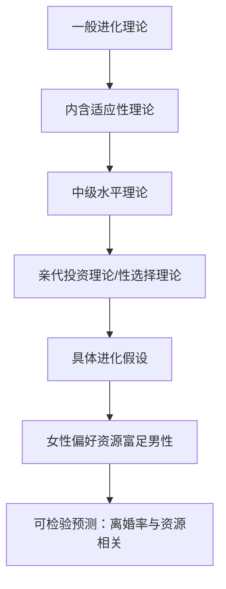

# 进化心理学

状态: TODO
Update Date: 2025年11月14日 11:41
Create Date: 2025年11月14日 11:39

# 进化心理学书籍目录大纲

创建于：2025-11-13 10:25:23

标签：
AI链接笔记
进化心理学
择偶策略
生存适应

---

原文：[(anonymous)](https://x-1381123255.cos.ap-beijing.myqcloud.com/%E8%BF%9B%E5%8C%96%E5%BF%83%E7%90%86%E5%AD%A6_04_%E7%9B%AE%20%E5%BD%95.pdf)

📚 **全书结构概览**

共分为6个部分，涵盖基础理论、生存问题、择偶行为、亲属关系、群居问题及整合科学六大模块，每章含小结与推荐读物。

### 第一部分：进化心理学基础理论

1. **第一章：导致进化心理学产生的科学运动**
    - 进化思想史里程碑事件
    - 对进化理论的常见误解
    - 现代人类起源与心理学领域的关键事件
2. **第二章：作为新科学的进化心理学**
    - 人性的起源与核心原理
    - 进化假设的检验方法与数据来源
    - 适应性问题的确认

### 第二部分：生存问题

1. **第三章：克服恶劣的自然条件**
    - 食物获得与选择策略
    - 居所与风景偏好进化
    - 抵御危险的心理机制（害怕、焦虑等）

### 第三部分：性行为和择偶行为的挑战

1. **第四章：女性的长期择偶策略**
    - 择偶偏好的进化背景与具体内容
    - 背景因素对偏好的影响
    - 偏好如何作用于实际择偶行为
2. **第五章：男性的长期择偶策略**
    - 进化理论视角下的男性偏好
    - 背景因素与实际行为关联
3. **第六章：短期的性关系策略**
    - 男性短期择偶理论与心理机制证据
    - 女性短期择偶的适应性逻辑
    - 背景因素对短期关系的影响

### 第四部分：亲代抚育和亲属关系的挑战

1. **第七章：亲代抚育问题**
    - 母亲照顾多于父亲的进化解释
    - 亲代抚育的进化视角与亲子冲突理论
2. **第八章：亲属关系问题**
    - 内含适应性理论及实证依据

### 第五部分：群居问题

1. **第九章：合作联盟**
    - 合作行为的进化逻辑
    - 互惠式利他行为理论
2. **第十章：攻击与战争**
    - 攻击行为的适应性功能
    - 男性攻击性更强的进化原因
3. **第十一章：两性冲突策略**
    - 性行为发生时间冲突
    - 性嫉妒与留住配偶的策略
    - 资源分配冲突
4. **第十二章：地位、声望和社会支配**
    - 支配等级的形成过程
    - 跨物种的支配行为进化理论

### 第六部分：一门整合的心理科学

1. **第十三章：走向统一的进化心理学**
    - 分支领域：认知、社会、发展、人格、临床及文化心理学
    - 整合心理学的未来方向

# 当代心理科学名著译丛总序解析 📚

创建于：2025-11-13 10:25:39

标签：
AI链接笔记
心理学名著译丛
学科定位
双向建构

---

原文：[(anonymous)](https://x-1381123255.cos.ap-beijing.myqcloud.com/%E8%BF%9B%E5%8C%96%E5%BF%83%E7%90%86%E5%AD%A6_05_%E6%80%BB%20%E5%BA%8F.pdf)

### 一、译丛宗旨与背景

1. **核心目标**
    - 培本固干：聚焦心理学主干内容，避免分支过度扩张导致主干模糊
    - 推动心理学在中国的健康发展，服务于现代化建设中”人的现代化”需求
2. **时代背景**
    - 心理学日益成为”显学”：研究人类自身奥秘的科学属性决定其重要性
    - 社会现实需求：知识爆炸、素质教育、创新培养、心理健康等问题亟待心理学解答

### 二、心理学的学科定位与价值

1. **学科本质**
    - 研究对象：人类自身（认知、意识、情感、人际、个性等）
    - 核心功能：通过”双向建构”过程（认识世界→提升认知结构→反身解剖自身）实现自我探索
2. **发展现状**
    - 优势：生命科学重要组成部分，脑科学进展为其提供生理基础
    - 局限：被称为”准科学”，受研究方法（如技术手段限制）和伦理规范制约

### 三、心理学的多样性特征

1. **学科分支多样性**
    - 源于人类实践活动领域的多样性，形成多交叉分支
2. **文化多样性**
    - 普遍性规律与文化特殊性共存（类比基因型与表现型的统一）
    - 西方心理学先发优势：需以”拿来主义”态度吸纳，兼顾本土化需求

### 四、译丛编纂细节

1. **选编标准**
    - 时间范围：20世纪80年代后作品（兼顾时效性与学术生命力）
    - 内容选择：覆盖主要心理学领域，侧重名家名著、学术权威著作
2. **出版规划**
    - 规模：约25种，涵盖教育发展心理学、实验心理学、社会心理学等
    - 目标：呈现科学心理学”主干”形象，为国内研究提供借鉴
3. **组织实施**
    - 发起单位：华东师范大学心理学系与出版社
    - 顾问团队：国内心理学界权威学者（陈立、荆其诚等）

# 《进化心理学——心理的新科学》中文版序言要点

创建于：2025-11-13 10:25:55

标签：
AI链接笔记
进化心理学
择偶偏好
跨文化差异

---

原文：[(anonymous)](https://x-1381123255.cos.ap-beijing.myqcloud.com/%E8%BF%9B%E5%8C%96%E5%BF%83%E7%90%86%E5%AD%A6_06_%E4%B8%AD%E6%96%87%E7%89%88%E5%BA%8F%E8%A8%80.pdf)

### 一、作者与中国的学术渊源

1. **首次大规模实验研究**
    - 研究主题：全球37种文化背景下的择偶偏好（1989年）
    - 中国样本：中国大陆4个地区 + 台湾地区（中华人民共和国）
    - 总参与人数：10047人
2. **中国样本的关键发现**
    - 🔍 **贞洁偏好**：中国被试对婚姻伴侣的贞洁重视程度最高（视为“必不可少”特征）
    - 跨文化对比：瑞典被试最不重视贞洁（视为“无关紧要”）
    - 研究启示：推动作者后续对择偶文化差异的深入探讨（如Gangestad & Buss, 1993等合作研究）

### 二、对中国心理学界的期望

1. **理论影响**
    - 提供统括性框架：整合心理学各分支研究
    - 核心价值：为探索人类心理机制提供有效视角
2. **研究贡献**
    - 中国心理学家的独特作用：从进化视角研究“人性普遍性”与“文化对心理机制的作用”
    - 合作呼吁：期待与中国学者共同开展研究，成果纳入未来版本
3. **人才培养**
    - 激发学生兴趣：感受进化心理学的研究活力
    - 目标：培养中国未来的进化心理学研究者

# 《进化心理学：心理新科学》中文版序言

创建于：2025-11-13 10:26:10

标签：
AI链接笔记
进化心理学
择偶偏好
文化差异

---

原文：[(anonymous)](https://x-1381123255.cos.ap-beijing.myqcloud.com/%E8%BF%9B%E5%8C%96%E5%BF%83%E7%90%86%E5%AD%A6_07_Preface%20to%20the%20Chinese%20Edition.pdf)

📚 **作者与著作背景**

- 作者：David M. Buss

- 著作：《进化心理学：心理新科学》（Evolutionary Psychology: the New Science of the Mind）

- 序言核心：为中文版撰写，强调中国在作者理论与研究中的特殊地位

🔍 **中国相关研究基础**

1. **跨国择偶偏好研究（1989）**

- 研究覆盖：全球37种文化，10,047名参与者

- 中国样本：中国大陆4个地区 + 中国台湾1个样本

- 关键发现：中国参与者对“贞洁（处女）”的重视程度为全球最高

- 对比：瑞典参与者认为“无关紧要”，中国参与者视为“必不可少”

1. **研究意义**
    - 揭示文化差异在人类择偶领域的关键作用
    - 推动后续对择偶文化差异的深入探索（如Gangestad & Buss, 1993等合作研究）

🌍 **对中国心理学界的期望**

1. **学术影响**

- 为中国心理学研究与教学提供“统一框架”

- 作为理解心理学各分支的“关键视角”

1. **研究合作**
    - 鼓励中国心理学家从进化视角开展实证研究
    - 期待中国学者加入国际合作，其成果纳入未来著作新版
2. **人才培养**
    - 激发中国学生对进化心理学的兴趣
    - 培养新一代中国进化心理学研究者

# 《进化心理学——心理的新科学》序言要点整理

创建于：2025-11-13 10:26:25

标签：
AI链接笔记
进化心理学
学科发展
达尔文预言

---

原文：[(anonymous)](https://x-1381123255.cos.ap-beijing.myqcloud.com/%E8%BF%9B%E5%8C%96%E5%BF%83%E7%90%86%E5%AD%A6_08_%E5%BA%8F%20%E8%A8%80.pdf)

### 一、进化心理学的学科定位与意义

1. **学科性质**
    - 心理学与进化生物学的现代理论综合，具有革命性的新科学
    - 为心理学提供全新基础（达尔文1859年预言）
2. **学术地位**
    - 哈佛Steven Pinker评价：唯一能连贯解释人类经验核心领域（美、母性、道德等）的理论

### 二、进化心理学的发展历程

1. **历史脉络**
    - 1859年：达尔文在《物种起源》预言心理学新基础
    - 1981年：作者首次主持研究时，缺乏实证支持，理论与研究存在隔阂
    - 1999年：本书第一版出版
    - 现状：新杂志创刊、主流期刊文章增加、大学课程开设
2. **突破标志**
    - 理论概念突破+实证研究成果积累，弥合理论与研究的鸿沟

### 三、本书的目标与结构

1. **核心目标**
    - 介绍进化心理学基本原理及研究发现
    - 推动大学开设进化心理学必修课，实现达尔文预言
2. **修订重点（第二版）**
    - 新增200+参考文献，补充最新研究成果
    - 完善认知心理学内容，新增两节：
    ✅ 人类进化历史里程碑
    ✅ 人类起源理论（走出非洲理论/多地域连续性理论）
3. **适用人群**
    - 本科生、非专业人员、研究生及其他领域专业人士

### 四、学科现状与未来方向

1. **当前特点**
    - 充满活力：经验性发现+理论创新
    - 挑战：需平衡海量理论观点与实证依据，控制篇幅
2. **未来展望**
    - 解答核心问题：人类起源、与其他生命形式的关联、心智机制本质

# 《进化心理学》致谢内容整理

创建于：2025-11-13 10:26:40

标签：
AI链接笔记
进化心理学
学术致谢
人类择偶研究

---

原文：[(anonymous)](https://x-1381123255.cos.ap-beijing.myqcloud.com/%E8%BF%9B%E5%8C%96%E5%BF%83%E7%90%86%E5%AD%A6_09_%E8%87%B4%20%E8%B0%A2.pdf)

📚 **作者学术成长历程**
1. **兴趣起源（20世纪70年代中期）**
- 地质学本科课程首次接触进化理论
- 1975年学期论文：通过灵长类比较研究推测男性追求地位的进化动机（与性接触机会相关）
2. **学术发展关键节点**
- 加州大学Berkeley分校研究所：深化进化与人类行为兴趣
- 哈佛大学（1981年起）：任心理学助教，开设基于进化理论的人类动机课程
- 1982年启动首个进化心理学研究项目——人类择偶，最终扩展至全球37种文化、10047人样本

🔑 **核心学术影响者**
1. **理论奠基阶段**
- 主要理论来源：Charles Darwin、W. D. Hamilton、Robert Trivers著作
- Don Symons：1979年著作被认为是现代人类进化心理学首部著作，提供持续深刻评论
2. **关键合作者与修正者**
- Leda Cosmides（哈佛大学研究生）：通过讨论与争论修正观点，介绍丈夫John Tooby
- John Tooby：持续纠正作者观点，共同探讨进化心理学基础问题
3. **学术网络扩展**
- 通过Leda和John结识：Irv DeVore（哈佛大学人类学家）、Martin Daly、Margo Wilson

🏛️ **重要研究机构支持**
1. **哈佛大学**
- 提供教学职位与学术环境，Irv DeVore主持的”猿类研讨会”
2. **行为科学高级研究中心（Palo Alto）**
- 1989-1990年特别项目”进化心理学基础”，与Leda Cosmides、John Tooby等合作研究
3. **密西根大学（1986-1994）**
- “进化与人类行为”研究小组资助，关键成员包括Al Cain、Richard Nisbett等
4. **得克萨斯大学奥斯汀分校**
- 心理学系开展全球最早的进化心理学研究程序之一（主题：个体差异与进化心理学）

📝 **著作贡献者名单**
1. **主要理论与观点贡献者**（按原文顺序）：
Dick Alexander、Bob Axelrod、Jerry Barkow、Jay Belsky、Laura Betzig等47人
2. **版本评论者**
- 第一版：Clifford R. Mynatt（鲍林格林州立大学）、Margo Wilson（麦柯马斯特大学）等5人
- 第二版：John A. Johnson（宾州杜博瓦）、Kevin MacDonald（加州大学长滩分校）等3人
3. **第二版特别贡献者**
Petr Bakalar、Clark Barrett、Richard Dawkins等18人（含详细评论提供者）

# 进化心理学基础理论 - 目录大纲

创建于：2025-11-13 10:26:56

标签：
AI链接笔记
进化心理学
目录大纲
基础理论

---

原文：[(anonymous)](https://x-1381123255.cos.ap-beijing.myqcloud.com/%E8%BF%9B%E5%8C%96%E5%BF%83%E7%90%86%E5%AD%A6_10_%E7%AC%AC%E4%B8%80%E9%83%A8%E5%88%86%20%E8%BF%9B%E5%8C%96%E5%BF%83%E7%90%86%E5%AD%A6%E5%9F%BA%E7%A1%80%E7%90%86%E8%AE%BA.pdf)

📚 **第一部分 进化心理学基础理论**

（共2章，聚焦基础理论知识）

### 第1章：进化心理学的科学运动溯源

1. **进化论发展历史里程碑**
    - 从达尔文以前的进化论
    - 到当今生物学界广泛接受的现代进化论
2. **进化论的三种普遍误解**
    - （内容未展开，待后续补充）
3. **心理学领域重大事件回顾**
    - 达尔文对弗洛伊德精神分析理论的影响
    - 现代认知心理学的主要观点

### 第2章：进化心理学的概念基础与科学工具

1. **人性起源的理论**
    - （内容未展开，待后续补充）
2. **核心概念：进化形成的心理机制**
    - 定义
    - 特征概述
3. **进化心理学假设的检验方法**
    - 主要方法介绍
    - 证据来源说明
4. **适应性问题的确认工具**
    - 从生存问题到群体生活等问题的分析工具

# 进化心理学的科学起源与理论基础 📚

创建于：2025-11-13 10:27:11

标签：
AI链接笔记
进化心理学
自然选择
性选择

---

原文：[(anonymous)](https://x-1381123255.cos.ap-beijing.myqcloud.com/%E8%BF%9B%E5%8C%96%E5%BF%83%E7%90%86%E5%AD%A6_11_%E7%AC%AC%E4%B8%80%E7%AB%A0%20%E5%AF%BC%E8%87%B4%E8%BF%9B%E5%8C%96%E5%BF%83%E7%90%86%E5%AD%A6%E4%BA%A7%E7%94%9F%E7%9A%84%E7%A7%91%E5%AD%A6%E8%BF%90%E5%8A%A8.pdf)

### 一、进化心理学的学科定位

1. **核心目标**：从进化视角理解人类大脑-心理机制
2. **四大关键问题**
    - 心理为何被设计成当前形式
    - 心理机制的组成与结构
    - 心理机制的功能目的
    - 环境输入如何与心理机制互动产生行为

### 二、进化生物学的理论基石

### 2.1 达尔文的两大进化理论

- **自然选择理论**（生存选择）
✅ 三大必要成分：变异/遗传/选择
✅ 核心：差异繁殖成功率（生存是繁殖前提）
- **性选择理论**（繁殖选择）
✅ 同性竞争：同一性别成员间争夺交配权
✅ 异性选择：择偶偏好驱动的特征进化

### 2.2 现代综合理论与扩展

- **颗粒遗传理论**（Mendel）：基因作为最小遗传单位
- **内含适应性理论**（Hamilton）
➤ 经典适应性+亲属繁殖贡献
➤ 遗传相关度：兄弟姐妹0.5/祖父母0.25/堂表亲0.125
- **适应器进化标准**（Williams）
➤ 可靠性：物种普遍拥有
➤ 有效性：高效解决适应问题
➤ 经济性：代价最小化

### 三、人类进化的关键里程碑

| 时间节点 | 重大事件 |
| --- | --- |
| 440万年前 | 两足行走出现 |
| 250万年前 | 能人制造粗糙石器（奥尔德沃工具） |
| 180万年前 | 直立人走出非洲 |
| 150万年前 | 阿舍利手斧出现（对称设计） |
| 50万-10万年前 | 脑容量快速增长至1350立方厘米 |
| 3万年前 | 现代智人取代尼安德特人 |

### 四、心理学领域的理论演进

### 4.1 早期进化思想

- **Freud**：求生本能（生存选择）与性本能（性选择）
- **William James**：人类拥有大量先天本能

### 4.2 行为主义的兴衰

- **核心观点**：通过强化后效塑造行为
- **关键反证**
➤ Harlow恒河猴实验：接触安慰＞食物强化
➤ Garcia效应：味觉厌恶学习的生物准备性

### 4.3 认知革命与进化心理学

- **信息加工隐喻**：心理=特定程序的计算机
- **领域特殊性假设**：心理机制专为解决特定适应问题设计

### 五、常见误解澄清

1. **遗传决定论谬误**：进化=基因+环境交互作用
2. **行为不可改变谬误**：理解机制可优化行为（如调整脂肪摄入）
3. **最佳设计谬误**：进化存在时间滞后（石器时代大脑vs现代环境）

# 进化心理学：理论基础与核心概念 🧠

创建于：2025-11-13 10:27:27

标签：
AI链接笔记
进化心理学
心理机制
适应器

---

原文：[(anonymous)](https://x-1381123255.cos.ap-beijing.myqcloud.com/%E8%BF%9B%E5%8C%96%E5%BF%83%E7%90%86%E5%AD%A6_12_%E7%AC%AC%E4%BA%8C%E7%AB%A0%20%E4%BD%9C%E4%B8%BA%E6%96%B0%E7%A7%91%E5%AD%A6%E7%9A%84%E8%BF%9B%E5%8C%96%E5%BF%83%E7%90%86%E5%AD%A6.pdf)

### 一、进化心理学概述

1. **学科定位**
    - 行为科学最重要的新发展之一（Boyer & Heckhausen, 2000）
    - 现代进化生物学与心理学的综合学科
    - 核心目标：探索人类心理机制的进化起源与功能
2. **研究案例：排卵期与性信号**
    - Grammer（1996）单身酒吧研究发现：
    ✅ 男性更可能接触处于排卵期的女性
    ✅ 排卵期女性着装更暴露（紧身/短款衣物）
    ✅ 揭示繁殖特征与外在行为的关联

### 二、进化的三大产物

| 产物类型 | 定义与特征 | 实例 |
| --- | --- | --- |
| **适应器** | 遗传获得、稳定发展、解决适应问题 | 茧子生成机制、脐带 |
| **副产品** | 无功能设计、伴随适应器存在 | 肚脐眼（脐带副产品） |
| **随机影响** | 突变/环境噪音、无适应性意义 | 灯泡玻璃瑕疵 |

### 三、进化心理学的分析水平

### 四、进化形成的心理机制

1. **核心定义**
    - 输入：特定环境线索（如蛇的视觉信号）
    - 决策规则：”如果-那么”程序（如遇蛇则逃跑）
    - 输出：解决适应问题（生理反应/行为/信息）
2. **关键特性**
    
    ✅ **问题特殊性**：针对特定适应问题（如择偶/觅食）
    
    ✅ **功能专门化**：如语言机制 vs. 面孔识别机制
    
    ✅ **环境依赖性**：需特定线索激活（如恐高症需高度刺激）
    

### 五、检验进化假设的方法

| 方法类型 | 应用场景 | 案例 |
| --- | --- | --- |
| 跨物种比较 | 不同物种适应器差异 | 睾丸重量与精子竞争强度 |
| 两性比较 | 繁殖策略差异 | 男性性嫉妒 vs. 女性情感嫉妒 |
| 实验法 | 控制情境变量 | 群体威胁对凝聚力的影响 |
| 跨文化研究 | 验证心理机制的普遍性 | 择偶偏好的文化一致性 |

### 六、人类主要适应问题

1. **生存问题**：食物选择、躲避天敌
2. **择偶问题**：配偶选择、吸引策略
3. **抚养问题**：亲代投资分配
4. **亲属关系**：亲属识别与利他行为
5. **社会互动**：合作、攻击、地位竞争

# 第二部分 生存问题 - 人类适应器概述

创建于：2025-11-13 10:27:42

标签：
AI链接笔记
自然选择
生存问题
人类适应器

---

原文：[(anonymous)](https://x-1381123255.cos.ap-beijing.myqcloud.com/%E8%BF%9B%E5%8C%96%E5%BF%83%E7%90%86%E5%AD%A6_13_%E7%AC%AC%E4%BA%8C%E9%83%A8%E5%88%86%20%E7%94%9F%E5%AD%98%E9%97%AE%E9%A2%98.pdf)

📚 **章节核心主题**

- 聚焦人类解决生存问题的适应器

- 核心概念：达尔文提出的“恶劣的自然条件”（阻碍生存的力量）

- 逻辑主线：祖先通过克服生存力量实现繁衍生息

### 3.1 食物获取与选择

- **核心问题**：祖先如何获取食物以维持生存
- **三大假设分析**：
    1. 狩猎假设
    2. 采集假设
    3. 食腐假设（scavenger）

### 3.2 栖息之所与环境选择

- 适应器表现：对栖息地和生活环境的偏好选择

### 3.3 危险情境应对机制

- **主要适应器类型**：
    - 害怕
    - 恐惧症
    - 焦虑
- **应对对象**：蛇、疾病等危险情境

### 3.4 进化谜题探讨

- 关键问题1：“人是否注定（programmed）要死”？
- 关键问题2：“为什么有人会自杀”？

# 人类进化心理学：克服恶劣自然条件的生存适应器

创建于：2025-11-13 10:27:57

标签：
AI链接笔记
进化心理学
生存适应器
食物选择机制

---

原文：[(anonymous)](https://x-1381123255.cos.ap-beijing.myqcloud.com/%E8%BF%9B%E5%8C%96%E5%BF%83%E7%90%86%E5%AD%A6_14_%E7%AC%AC%E4%B8%89%E7%AB%A0%20%E5%85%8B%E6%9C%8D%E6%81%B6%E5%8A%A3%E7%9A%84%E8%87%AA%E7%84%B6%E6%9D%A1%E4%BB%B6.pdf)

### 一、生存的进化逻辑

1. **核心问题**
    - 有机体需同时解决”吃什么”与”避免被捕食”的双重挑战（Todd, 2000）
    - 自然选择的底层驱动力：差异繁殖（达尔文, 1859）
    - 生存过滤器：淘汰无法应对疾病、捕食者、气候等威胁的个体
2. **恶劣自然条件的范畴**
    - 气候/天气波动、食物短缺、毒素、疾病/寄生虫
    - 捕食者威胁与种内竞争
    - 人类需发展”常识生物学”（folk biology）知识系统

### 二、食物获取与选择的适应器

1. **杂食者的生存策略**
    - **味觉偏好**：甜味（能量信号）vs 苦味（毒素预警）
    - **新食物恐惧症**：老鼠通过小剂量试错+分开进食规避中毒风险
    - **人类特化机制**：呕吐反射、厌恶反应（粪便/腐肉等危险信号）
2. **文化衍生的解决方案**
    - **香料抗菌假说**：热带地区食谱含更多抗菌香料（如大蒜/洋葱），肉类香料使用量高于植物
    - **酒精偏好起源**：灵长目对成熟果实（含0.6%乙醇）的天然吸引力的进化残留
3. **妊娠病的适应性意义**
    - **胚胎保护机制**：孕早期（器官形成关键期）对毒素的敏感性升高
    - **食物规避模式**：厌恶肉类/辛辣蔬菜（含致畸剂），降低流产风险（有妊娠病者流产率3.8% vs 无者10.4%）

### 三、觅食行为的性别分工

1. **狩猎假设**
    - **男性适应器**：精准投掷能力、心理旋转能力、长距离导航能力
    - **社会协作证据**：!Kung人通过”箭主分配制”促进肉类共享，Ache猎人通过炫耀获得更高交配成功率
2. **采集假设**
    - **女性优势**：空间方位记忆（植物位置识别）、物体排列记忆
    - **儿童保护策略**：携带幼儿时调整觅食时间，优先选择低风险区域
3. **性别空间能力差异**
    - **男性优势**：心理旋转、陌生环境定向、地图解读
    - **女性优势**：物体位置记忆、地标识别（Silverman & Eals, 1992）

### 四、栖息地选择与环境偏好

1. **热带大草原偏好**
    - **景观特征**：适中树荫密度、开阔视野、水源可见性
    - **跨文化验证**：澳大利亚/阿根廷/美国被试均偏好”分叉低矮树木”的草原化景观
2. **三阶段选择机制**
    - **筛选阶段**：快速排除完全开放/封闭环境
    - **信息收集阶段**：评估资源丰度（果实/猎物）与危险（捕食者藏身处）
    - **开发阶段**：权衡短期庇护（雷雨躲避）与长期资源（季节变化预判）

### 五、危险防御系统

1. **恐惧情绪的进化功能**
    - **核心反应模式**：僵住（评估风险）→ 逃跑/躲避 → 攻击 → 投降
    - **发展时间表**：6个月怕高/陌生人→2岁怕动物→学龄期广场恐惧
2. **威胁识别偏向**
    - **视觉优先加工**：蛇/蜘蛛图像从背景中”跳出”的速度快于中性刺激
    - **听觉预警系统**：对接近声源（捕食者信号）的觉察敏感度高于远去声源
3. **疾病抵抗机制**
    - **发烧的适应性**：体温升高抑制病原体繁殖（蜥蜴晒太阳行为的同源机制）
    - **铁元素调控**：感染期主动降低血液铁含量”饿死”细菌

### 六、衰老与自杀的进化视角

1. **衰老的基因多效性理论**
    - **早期收益vs晚期代价**：睾丸激素（繁殖竞争优势）→ 晚年前列腺癌风险
    - **性别差异**：男性更早衰老源于繁殖策略的高风险投入
2. **自杀的进化逻辑**
    - **适应器触发条件**：繁殖潜能丧失（无配偶/疾病）、成为亲属负担
    - **关键预测指标**：家庭负担感（+0.56相关）、性活动频率（-0.67相关）

# 第三部分：性行为和择偶行为的挑战

创建于：2025-11-13 10:28:13

标签：
AI链接笔记
进化心理学
择偶行为
适应性问题

---

原文：[(anonymous)](https://x-1381123255.cos.ap-beijing.myqcloud.com/%E8%BF%9B%E5%8C%96%E5%BF%83%E7%90%86%E5%AD%A6_15_%E7%AC%AC%E4%B8%89%E9%83%A8%E5%88%86%20%E6%80%A7%E8%A1%8C%E4%B8%BA%E5%92%8C%E6%8B%A9%E5%81%B6%E8%A1%8C%E4%B8%BA%E7%9A%84%E6%8C%91%E6%88%98.pdf)

📌 **核心逻辑**

- 差异繁殖是进化动力，性与择偶相关的心理机制是自然选择的关键目标

- 若未演化出解决性与择偶适应性问题的心理机制，进化心理学将失去研究基础

📑 **章节结构**

### 第四章：女性如何择偶

1. 研究基础：大量跨文化研究验证进化心理学假设
2. 核心问题：女性在进化中需解决复杂适应性问题
3. 研究内容：
    - 女性择偶偏好的多样性
    - 择偶欲望对实际行为的影响

### 第五章：男性的择偶偏好与适应性问题

1. 性别差异原则：仅在面临不同适应性问题的领域存在差异，其他领域高度相似
2. 男性独特适应性问题：
    - 选择具有生育能力的配偶
    - 确保长期关系中的父子关系确定性

### 第六章：短期性关系策略（人类择偶隐蔽面）

1. 生理线索证据：
    - 精子竞争研究
    - 女性性高潮研究 → 证明远古非一夫一妻制存在
2. 人类择偶策略灵活性：
    - 可同时采取短期与长期策略（物种中罕见）
    - 策略选择取决于情境因素
3. 影响策略的环境变量：
    - 个体配偶价值（mate value）
    - 择偶群体中的男女比例

# 女性长期择偶策略的进化心理学分析 🧠

创建于：2025-11-13 10:28:28

标签：
AI链接笔记
进化心理学
亲代投资理论
择偶偏好

---

原文：[(anonymous)](https://x-1381123255.cos.ap-beijing.myqcloud.com/%E8%BF%9B%E5%8C%96%E5%BF%83%E7%90%86%E5%AD%A6_16_%E7%AC%AC%E5%9B%9B%E7%AB%A0%20%E5%A5%B3%E6%80%A7%E7%9A%84%E9%95%BF%E6%9C%9F%E6%8B%A9%E5%81%B6%E7%AD%96%E7%95%A5.pdf)

### 一、理论背景

### 1. 繁殖方式的进化

- **无性繁殖**：基因完全复制，无需择偶，但缺乏多样性
- **有性繁殖**：基因重组产生多样性，增强抗寄生虫能力（军备竞争理论）
- **关键代价**：需耗费时间资源寻找配偶

### 2. 亲代投资理论

- **配子差异**：雌性配子大且固定（400个/生），雄性配子小且流动（1200万/小时）
- **投资不平衡**：人类女性需承担妊娠（9个月）、哺乳（最长4年）等更高成本
- **Trivers预测**：投资更多方（通常雌性）择偶更挑剔，投资少方（通常雄性）竞争更激烈

### 3. 择偶偏好的心理机制

- **适应性问题**：需筛选能提供资源、承诺长期关系的男性
- **线索评估**：通过潜在配偶的行为特征（如慷慨度）推断其潜在价值
- **权重整合**：在多品质间权衡（如情绪稳定性vs资源量）

### 二、核心择偶偏好

### 1. 资源获取能力

- **经济资源**：37种文化中女性对配偶经济前景重视度是男性的2倍
- **社会地位**：跨文化研究显示女性更看重职业水平、教育背景等地位线索
- **年龄偏好**：平均偏爱年长3.5岁男性，与资源积累周期正相关

### 2. 承诺与可靠性

- **情绪稳定性**：37种文化中女性对配偶情绪成熟度评分显著高于男性（2.68 vs 2.47）
- **勤奋与抱负**：职场成功和发展前景在长期择偶中评分（2.70）远高于短期关系（0.40）
- **可靠性**：”值得信赖”在21种文化中被列为核心品质，避免资源供给中断风险

### 3. 健康与基因质量

- **身体线索**：对称性面孔（健康标志）、肌肉特征（保护能力）被普遍偏好
- **行为信号**：与孩子积极互动的男性性魅力评分（2.75）显著高于冷漠者（1.25）
- **周期性变化**：排卵期女性更偏好男子气面孔（睾丸激素水平标志）和对称体味

### 4. 爱情与承诺

- **普世性**：88.5%文化存在浪漫爱证据，37种文化均将”相互吸引”列为首要品质
- **承诺信号**：包括忠诚（放弃其他关系）、物质付出（贵重礼物）、情绪支持等维度
- **性别差异**：89%美国女性、82%日本女性拒绝无爱婚姻，即使对方条件优越

### 三、背景影响因素

### 1. 自身资源

- **高收入女性**：对配偶收入要求更高（相关系数+0.35），反驳”结构性资源缺乏假设”
- **职业成就者**：医学/法律毕业生对配偶赚钱能力的要求显著高于普通女性

### 2. 关系周期

- **长期关系**：更重视忠诚（2.80 vs 0.90）、喜爱孩子（2.93 vs 1.21）等品质
- **短期关系**：外貌权重上升，经济前景重要性下降60%以上

### 3. 生理周期

- **排卵期**：对对称男性体味偏好增强，男性化面孔吸引力评分提高23%
- **黄体期**：更重视情绪稳定性和资源可靠性指标

### 4. 配偶价值

- **高魅力女性**：对配偶对称性、男子气概要求更高（相关系数+0.32）
- **征婚广告**：年轻迷人女性对配偶地位、智力的要求条目比普通女性多40%

### 四、行为验证证据

- **征婚响应**：高收入男性收到的女性回复量是低收入者的1.8倍
- **婚姻数据**：37种文化平均新郎比新娘大2.99岁，与偏好（3.42岁）高度吻合
- **阶层流动**：青少年期外貌评分与10年后丈夫地位相关系数达0.43，高于阶级出身（0.27）

# 男性长期择偶策略的进化逻辑与核心偏好 🧠

创建于：2025-11-13 10:28:44

标签：
AI链接笔记
进化心理学
男性择偶偏好
生育力线索

---

原文：[(anonymous)](https://x-1381123255.cos.ap-beijing.myqcloud.com/%E8%BF%9B%E5%8C%96%E5%BF%83%E7%90%86%E5%AD%A6_17_%E7%AC%AC%E4%BA%94%E7%AB%A0%20%E7%94%B7%E6%80%A7%E7%9A%84%E9%95%BF%E6%9C%9F%E6%8B%A9%E5%81%B6%E7%AD%96%E7%95%A5.pdf)

### 一、男性长期择偶的进化背景

1. **婚姻的适应性收益**
    - 增加吸引异性的成功率
    - 提升子女存活率（远古环境中父亲缺失导致死亡率升高10%）
    - 增强父子关系可信度（通过独占性性接触降低亲子不确定性）
    - 促进亲代投资（提供资源、保护及社会联盟支持）
2. **性选择的核心问题**
    - 女性排卵隐蔽性 → 男性需通过间接线索判断生育力
    - 繁殖价值（未来生育潜力）vs 生育力（当前生育能力）的权衡

### 二、男性择偶偏好的核心内容

### （一）生育力线索：年轻与健康

1. **年龄偏好**
    - 跨文化一致倾向：男性理想配偶比自身年轻2-7岁
    - 年龄差动态变化：随男性年龄增长，偏好配偶年龄差距增大（如50岁男性偏好小10-20岁女性）
    - 青春期男性例外：12-19岁更偏好稍年长女性（因同龄女性生育力未达峰值）
2. **外貌与身体线索**
    - **面部特征**：对称面孔、丰满嘴唇、明亮眼睛、光洁皮肤（跨文化一致性评分r=0.93）
    - **体型特征**：腰臀比（WHR）0.7为最优（关联低体脂、高雌激素水平）
    - **行为线索**：轻盈步伐、生动表情（暗示健康与活力）

### （二）父子关系确定性线索

1. **贞洁偏好**
    - 62%文化中存在显著性别差异：男性更重视婚前贞洁与婚后忠贞
    - 文化变异：经济独立女性社会（如瑞典）对贞洁要求显著降低
2. **忠诚行为信号**
    - 优先选择“诚实可靠”“情绪稳定”的伴侣
    - 将性背叛视为最不可接受的品质（评分-2.93，远超其他过错）

### 三、影响择偶策略的背景因素

1. **男性自身条件**
    - 高地位/财富男性更易实现偏好：如国王后宫平均年龄差20-30岁
    - 收入与配偶年龄负相关：月薪10000马克男性要求配偶年轻5-15岁
2. **现代环境干扰**
    - 媒体美女形象泛滥 → 降低对现有伴侣满意度（实验显示：观看模特后对伴侣评分下降12%）
    - 择偶市场全球化：线上平台扩大潜在选择池，加剧偏好与现实的冲突

### 四、偏好对行为的影响

1. **男性行为表现**
    - 征婚广告回应倾向：对25-30岁女性回应率比40岁以上高3倍
    - 婚姻决策模式：初婚年龄差3岁，二婚差5岁，三婚差8岁
2. **女性竞争策略**
    - 外貌优化：76%女性承认通过化妆/节食/健身提升吸引力
    - 情敌诋毁：重点攻击对手“外貌缺陷”（如“肥胖”“皮肤差”）和“不忠历史”

# 短期性关系策略的进化心理学分析

创建于：2025-11-13 10:28:59

标签：
AI链接笔记
进化心理学
性别差异
短期择偶策略

---

原文：[(anonymous)](https://x-1381123255.cos.ap-beijing.myqcloud.com/%E8%BF%9B%E5%8C%96%E5%BF%83%E7%90%86%E5%AD%A6_18_%E7%AC%AC%E5%85%AD%E7%AB%A0%20%E7%9F%AD%E6%9C%9F%E7%9A%84%E6%80%A7%E5%85%B3%E7%B3%BB%E7%AD%96%E7%95%A5.pdf)

### 一、理论基础与性别差异

1. **核心理论依据**
    - Trivers亲代投资理论：男性倾向低成本交配以增加后代数量，女性因生育代价更高而更谨慎
    - 性选择理论：解释两性在短期关系中的心理与行为差异
2. **经典实验证据**
    - **Clarke & Hatfield (1989)研究**：100%女性拒绝陌生人的性请求，75%男性接受
    - **跨文化一致性**：全球10大地区研究显示男性普遍渴望更多性伴侣（Schmitt, 2001）

### 二、男性短期择偶策略

### （一）适应性收益

- **繁殖最大化**：理论上可通过多伴侣增加后代数量（Betzig, 1986）
- **基因多样性**：与不同女性交配提升后代基因适应力

### （二）潜在代价

1. 感染性病风险
2. “猎艳者”名声降低长期择偶吸引力
3. 子女因缺乏父爱存活率下降
4. 遭受配偶或女方亲属暴力报复

### （三）关键适应性问题与解决方案

| 问题 | 进化解决方案 |
| --- | --- |
| 性伴侣数量最大化 | 降低择偶标准、缩短求爱时间 |
| 性接触机会识别 | 偏好性开放女性特征（衣着暴露等） |
| 生育力判断 | 关注年轻、健康等生育力指标 |
| 避免承诺束缚 | 排斥要求长期关系的女性 |

### （四）生理与心理证据

- **生理线索**：人类睾丸相对大小（体重0.079%）高于大猩猩（0.018%），反映精子竞争历史
- **射精量变化**：夫妻分离越久，重逢后首次射精量越多（Baker & Bellis, 1995）
- **零点现象**：男性随夜晚时间推移对女性魅力评分显著提升（Gladue & Delaney, 1990）

### 三、女性短期择偶策略

### （一）进化证据

- **性高潮功能**：高潮时保留70%精子，非高潮仅保留30%，可能提升受孕效率（Baker & Bellis, 1995）
- **跨文化外遇率**：20%-50%已婚女性有婚外性行为（Kinsey et al., 1953）

### （二）假设收益与验证

| 收益类型 | 核心观点 | 支持证据 |
| --- | --- | --- |
| **资源获取** | 通过性交换物质资源或社会地位 | 失业女性更倾向寻找经济条件更好的伴侣 |
| **基因优化** | 选择性魅力高的伴侣以获得优质基因 | 偏好身体对称性高的男性（Gangestad, 1997） |
| **配偶更换** | 摆脱低质量婚姻关系 | 婚姻不幸福女性外遇率更高（Glass, 1985） |
| **基因多样性** | 提升后代应对环境变化的适应力 | 排卵期女性更偏好有魅力的短期伴侣 |

### （三）主要代价

- 名誉受损导致长期择偶困难
- 缺乏男性保护增加性虐待风险
- 单亲生育子女存活率下降

### 四、影响因素与个体差异

1. **性别比例**：女性过剩时短期关系发生率上升（Pedersen, 1991）
2. **成长环境**：父爱缺失或继父存在的女性更早开始性行为（Ellis, 1999）
3. **配偶价值**：
    - 男性：高魅力者更早发生性行为、性伴侣更多
    - 女性：自尊水平与短期关系频率负相关

# 第四部分 亲代抚育和亲属关系的挑战

创建于：2025-11-13 10:29:15

标签：
AI链接笔记
亲代抚育
亲属关系
内含适应性理论

---

原文：[(anonymous)](https://x-1381123255.cos.ap-beijing.myqcloud.com/%E8%BF%9B%E5%8C%96%E5%BF%83%E7%90%86%E5%AD%A6_19_%E7%AC%AC%E5%9B%9B%E9%83%A8%E5%88%86%20%E4%BA%B2%E4%BB%A3%E6%8A%9A%E8%82%B2%E5%92%8C%E4%BA%B2%E5%B1%9E%E5%85%B3%E7%B3%BB%E7%9A%84%E6%8C%91%E6%88%98.pdf)

📚 **第四部分目录大纲**

### 第七章：亲代抚育问题

1. **核心问题**
    - 为何多数物种中母亲比父亲对子女抚养投入更多
2. **亲代抚育模式的关键研究方向**
    - 子女与父母的基因相似程度
    - 子女将父母关爱转化为适应性的能力
    - 父母面临的投资权衡：为子女还是其他适应性难题投资
3. **重要结论**
    - 提供两代冲突现象的进化论解释

### 第八章：亲属关系问题

1. **研究范围**
    - 扩展至大家族亲属：祖辈、孙辈、侄女、侄子、姑母、伯父等
2. **核心理论支撑**
    - 内含适应性理论
3. **主要解释内容**
    - 亲属间的关系本质
    - 生死关头的亲属互助行为
    - 遗嘱中资产向亲属的分配倾向
    - 祖辈对孙辈的投资策略
    - 亲属关系中的性别差异
4. **研究视角**
    - 以更宽广视野考察大家族的进化历程

# 第七章 亲代抚育问题（进化心理学视角）

创建于：2025-11-13 10:29:29

标签：
AI链接笔记
亲代抚育
进化心理学
父母-子女冲突

---

原文：[(anonymous)](https://x-1381123255.cos.ap-beijing.myqcloud.com/%E8%BF%9B%E5%8C%96%E5%BF%83%E7%90%86%E5%AD%A6_20_%E7%AC%AC%E4%B8%83%E7%AB%A0%20%E4%BA%B2%E4%BB%A3%E6%8A%9A%E8%82%B2%E9%97%AE%E9%A2%98.pdf)

### 一、亲代抚育的进化意义

1. **核心价值**
    - 后代是父母基因传递的载体，亲代抚育是确保基因延续的关键机制
    - 自然选择偏好能最大化后代生存与繁殖成功率的抚育策略
2. **代价与收益权衡**
    - **代价**：资源消耗、择偶机会丧失、生存风险增加
    - **收益**：提升后代存活率，增加基因传递概率
    - 只有当收益远大于代价时，亲代抚育才会进化出来

### 二、亲代抚育的性别差异

1. **女性投入更多的进化解释**
    - **父子关系不确定假设**：男性无法100%确认亲子关系，降低投资意愿
    - **遗弃假设**：体内受精物种中，男性可在交配后离开，女性被迫承担更多抚育责任（部分证据不支持）
    - **择偶机会代价假设**：男性亲代投资的机会成本更高，倾向于优先追求择偶
2. **跨文化证据**
    - 以色列集体农场（kibbutz）实验：女性仍倾向于私人抚养子女
    - 全球数据：女性对子女直接照顾时间是男性的4-15倍

### 三、亲代抚育的三大影响因素

### （一）与后代的亲缘关系

1. **亲子关系确定性**
    - 母亲对亲子关系100%确定，父亲存在不确定性
    - 新生儿常被描述“更像父亲”，以增强父亲投资信心
2. **继父母与亲生父母的差异**
    - 继父/母对继子女的积极情感更少，冲突更多
    - 继子女被虐待/杀害的概率是亲生子女的40-100倍
3. **投资差异的实证**
    - 亲生子女获得的大学教育投资显著高于继子女
    - 父子关系越确定，父亲投资越多

### （二）后代的繁殖价值

1. **健康状况影响**
    - 先天缺陷儿童被遗弃/虐待的概率更高
    - 双生子研究：母亲对健康婴儿的投入更多
2. **年龄影响**
    - 婴儿死亡率高，繁殖价值低，被杀害风险最高
    - 随年龄增长，父母杀婴率下降（与繁殖价值正相关）

### （三）资源的其他可利用途径

1. **女性的生育策略**
    - 年轻女性杀婴率更高（未来生育机会多）
    - 未婚女性杀婴率是已婚女性的2倍以上
2. **男性的择偶策略**
    - 高地位男性倾向于将资源用于吸引更多配偶（如Aka部落男性）
    - 男性对现任配偶子女的投资多于前任配偶子女

### 四、父母-子女冲突理论

1. **核心逻辑**
    - 父母与子女仅共享50%基因，利益存在根本冲突
    - 子女希望获得的资源多于父母愿意提供的份额
2. **冲突表现**
    - **子宫内冲突**：胎儿通过分泌hCG阻止母亲流产，母亲则可能终止染色体异常胎儿的妊娠
    - **断奶冲突**：子女希望延长哺乳期，父母希望尽早生育下一胎
    - **资源分配冲突**：多子女家庭中，子女间存在资源竞争
3. **与弗洛伊德理论的对比**
    - 进化视角：冲突源于资源分配，与性别无关
    - 伊底帕斯情结：混淆了性冲突与资源冲突，缺乏实证支持

### 五、关键研究证据

| 研究主题 | 核心发现 |
| --- | --- |
| 继父母虐待风险 | 与继父母同住的儿童被虐待概率是亲生父母家庭的40倍 |
| 新生儿长相感知 | 80%母亲认为新生儿更像父亲，旨在增强父亲投资信心 |
| 大学教育投资差异 | 亲生子女获得的教育投资比继子女高65%，父子关系确定时投资更高 |
| 杀婴率的年龄差异 | 婴儿被亲生父母杀害的风险是其他年龄段儿童的2倍以上 |
| 孕期冲突（子痫前期） | 胎儿通过限制母亲血管增加供血，导致母亲高血压，提高自身存活率 |

# 进化心理学：群居问题（第五部分）

创建于：2025-11-13 10:29:44

标签：
AI链接笔记
进化心理学
群居问题
合作联盟

---

原文：[(anonymous)](https://x-1381123255.cos.ap-beijing.myqcloud.com/%E8%BF%9B%E5%8C%96%E5%BF%83%E7%90%86%E5%AD%A6_22_%E7%AC%AC%E4%BA%94%E9%83%A8%E5%88%86%20%E7%BE%A4%E5%B1%85%E9%97%AE%E9%A2%98.pdf)

📚 **第五部分：群居问题 - 目录大纲**

**核心主题**：群居生活是人类适应过程的关键组成部分，人类拥有专门解决群居问题的进化心理机制

### 第九章：合作联盟的进化

1. **理论基础**
    - 互惠式利他主义理论：为合作行为进化提供解决方案
2. **自然界合作案例**
    - 吸血蝙蝠分享食物
    - 黑猩猩及非人类灵长目动物的互惠式联盟
3. **人类合作行为进化**
    - 友谊的代价与收益分析
    - “真心朋友”心理学：真正的朋友会为对方幸福着想

### 第十章：攻击行为和战争

1. **核心结论**
    - 暴力行为可使自身获得适应性收益（让他人蒙受损失）
2. **攻击性的性别差异**
    - 跨文化现象：男性比女性更具攻击性（含现象解释）
3. **攻击模式划分**
    - 基于攻击者和受害者性别分类
    - 相关实证依据讨论
4. **战争的进化争议**
    - 人类是否进化出专门用于杀害同类的适应器？

### 第十一章：男女两性之间的冲突

1. **理论框架**
    - 策略冲突理论：理解两性冲突的基础
2. **具体冲突形式及证据**
    - 性接触机会冲突
    - 嫉妒冲突
    - 欺骗引发的冲突
    - 资源争夺冲突

### 第十二章：地位和统治级别

1. **进化理论**
    - 地位等级出现的解释
2. **人类与动物的统治现象**
    - 地位追求的性别差异：男性 vs. 女性
    - 统治身份表达行为的差异
3. **服从策略**
    - 相关行为讨论

# 第十章 攻击与战争 - 进化心理学视角

创建于：2025-11-13 10:30:00

标签：
AI链接笔记
进化心理学
性别差异
攻击行为

---

原文：[(anonymous)](https://x-1381123255.cos.ap-beijing.myqcloud.com/%E8%BF%9B%E5%8C%96%E5%BF%83%E7%90%86%E5%AD%A6_24_%E7%AC%AC%E5%8D%81%E7%AB%A0%20%E6%94%BB%E5%87%BB%E4%B8%8E%E6%88%98%E4%BA%89.pdf)

### 一、攻击行为的进化起源

1. **黑猩猩与人类的共性** 🦧
    - 1974年坦桑尼亚Gombe国家公园黑猩猩致命攻击事件首次证实：雄性会组成同盟入侵邻近地域，对同类发起致命攻击
    - 人类与黑猩猩是现存仅有的两种表现出”雄性合作同盟致命攻击”的物种
2. **核心问题**
    - 攻击行为的起因与特征
    - 攻击行为的适应性功能
    - 攻击行为的性别差异机制

### 二、攻击行为的适应性功能

1. **获取他人资源** 💰
    - 男性通过武力夺取资源（如校园欺凌夺取午餐费、黑帮收取保护费）
    - 部落战争中掠夺食物与育龄女性（Yanomamö部落案例）
2. **抵御他人进攻** 🛡️
    - 建立攻击性声望以威慑潜在攻击者
    - 避免因示弱导致持续受辱
3. **同性竞争策略** ⚔️
    - 口头攻击：诋毁竞争者的社会地位（男女共有）
    - 身体攻击：男性通过决斗消除竞争对手
    - 极端形式：酒吧斗殴升级为杀人事件
4. **提升社会地位** 📈
    - 巴拉圭Ache部落男性通过战争提升权力等级
    - 委内瑞拉Yanomamö部落”杀过人的男性（unokais）”拥有更高声望
5. **防止配偶背叛** ❌
    - 男性性嫉妒是家庭暴力主因（83%受虐女性报告丈夫因嫉妒施暴）
    - 攻击行为可阻止配偶与其他男性接触

### 三、攻击行为的性别差异

1. **男性攻击模式** 👨
    - **身体攻击为主**：全球凶杀案中86%凶手为男性，80%受害者为男性
    - **年龄特征**：25岁左右达到攻击高峰（”年轻男性综合征”）
    - **风险策略**：参与危险斗殴、帮派活动以获取繁殖资源
2. **女性攻击模式** 👩
    - **间接攻击为主**：口头诋毁竞争者外形（”太胖/太丑”）和性忠贞（”水性杨花”）
    - **低暴力倾向**：使用棍子等低杀伤性武器，避免危及自身生存
3. **进化解释**
    - 性别二态性：男性体重比女性重12%，肌肉力量优势支持身体攻击
    - 亲代投资差异：女性需保护妊娠/育儿能力，进化出风险规避倾向

### 四、战争的进化逻辑

1. **跨物种比较** ⚔️
    - 仅黑猩猩与人类存在”合作同盟战争”
    - 人类战争具有跨文化普遍性：斯巴达与雅典、十字军东征、卢旺达种族屠杀
2. **战争收益模型**
    - **性接触机会**：帮派成员比非成员性伴侣数量高37%
    - **地位提升**：Yanomamö部落战争领袖拥有更多妻子
    - **资源获取**：俘虏敌方女性、夺取土地与食物
3. **战争风险契约**
    - 死亡风险随机分配（”无知之幕”）
    - 贡献与风险需转化为收益份额（如领导者获得更多战利品）

### 五、关键研究证据

1. **凶杀案统计** 📊
    - 年轻男性（25岁左右）凶杀率是女性的6倍
    - 92%的”三角恋凶杀”为男性间冲突
    - 已婚男性凶杀率显著低于未婚男性
2. **校园欺凌研究** 🏫
    - 54%初中男生参与过身体欺凌，女生仅34%
    - 男生更倾向夺取资源（36%报告被抢财物），女生偏好关系攻击（74%报告被起绰号）
3. **Yanomamö部落实证**
    - 杀过人的男性（unokais）平均拥有2.07个妻子，非杀人者仅1.17个
    - 战争主要导火索：复仇与争夺女性

### 六、争议与理论扩展

1. **杀人机制假说** ⚖️
    - **疏漏假设**：暴力升级的意外结果（如婚姻冲突中失控杀人）
    - **进化机制假设**：存在专门评估”杀人收益>代价”的心理模块
2. **文化情境调节** 🌍
    - “荣誉文化”中：不反击会导致地位下降
    - 学术圈：身体攻击会引发排斥

# 两性冲突的进化心理学解析

创建于：2025-11-13 10:30:15

标签：
AI链接笔记
进化心理学
两性冲突
性策略

---

原文：[(anonymous)](https://x-1381123255.cos.ap-beijing.myqcloud.com/%E8%BF%9B%E5%8C%96%E5%BF%83%E7%90%86%E5%AD%A6_25_%E7%AC%AC%E5%8D%81%E4%B8%80%E7%AB%A0%20%E4%B8%A4%E6%80%A7%E5%86%B2%E7%AA%81.pdf)

### 一、两性冲突的进化基础

### 1.1 策略冲突理论

- 🧠 **核心观点**：冲突源于两性性策略的差异而非争夺相同资源
- 🔄 **冲突本质**：一方策略阻碍另一方策略实施（如男性短期择偶 vs 女性性抑制）
- 😠 **情绪功能**：愤怒、烦恼等消极情绪是解决策略冲突的适应性心理机制

### 1.2 研究方法起源

- 1989年Buss让男女列出异性引发愤怒的事件，收集147种冲突类型
- 从性攻击、性抑制到背叛等行为，建立两性冲突研究基础数据库

### 二、性行为冲突

### 2.1 性亲密度分歧

- ⏱️ **时间差异**：男性渴望更快发生性行为，女性倾向拖延
- 📊 **数据支持**：47%大学生报告约会中存在性亲密度分歧（Byers & Lewis, 1988）
- 🌍 **文化共性**：澳大利亚研究显示53%女性被高估性意愿，45%男性被低估性需求

### 2.2 性意向推断偏差

- 👀 **男性偏向**：对微笑、友好等信号易推断为性兴趣（实验评分：男性3.84 vs 女性1.89）
- 🌐 **跨文化验证**：巴西与美国大学生均表现出男性更高的性意向推断倾向
- 🎭 **女性策略**：200名大学生中，女性更常利用微笑等信号操纵男性心理

### 2.3 性欺骗与错误管理

- 🚫 **男性欺骗**：71%男性承认夸大感情深度获取性接触
- 🛡️ **女性防御**：通过延长求爱时间、好友联盟评估等方式识别欺骗
- 🧠 **认知偏差**：
    - 男性：性知觉夸大偏向（降低错过性机会风险）
    - 女性：承诺怀疑偏向（减少被欺骗风险）

### 三、性攻击与防御

### 3.1 性骚扰现象

- 🏢 **职场冲突**：42%女性经历过职场性骚扰，男性仅15%
- 👩 **受害特征**：20-35岁年轻迷人单身女性为主要目标
- 😡 **情绪差异**：63%女性视性请求为侮辱，67%男性视为荣幸

### 3.2 强奸争议理论

| 适应器理论 | 副产品理论 |
| --- | --- |
| 进化专门心理机制 | 其他机制副产品 |
| 特定情境触发强奸 | 性欲望+暴力能力+机会敏感性 |
| 6项假设（如受害者选择、精子数量） | 无需专门适应器解释 |

### 3.3 女性防御机制

- 🛡️ **预防策略**：选择有威慑力配偶、结成女性联盟、警惕危险环境
- 📅 **周期适应**：排卵期避免危险活动（Chavanne & Gallup, 1998）
- 🧬 **进化证据**：跨文化普遍存在强奸记录，女性发展出心理创伤反应

### 四、性嫉妒冲突

### 4.1 嫉妒性别差异

- ❤️ **男性焦点**：性背叛（60%男性更恼怒）
- 🧠 **女性焦点**：感情背叛（83%女性更苦恼）
- 🧪 **生理证据**：男性想到性背叛时心跳加快5次/分钟，皱眉肌收缩更强

### 4.2 跨文化验证

- 🌍 **文化一致性**：德国、荷兰、韩国、日本均验证嫉妒差异
- 📊 **数据对比**：西方文化男性性背叛恼怒率60%，东方文化类似

### 4.3 留住配偶策略

- 🔒 **男性策略**：隐藏伴侣、资源炫耀、威胁情敌、暴力控制
- 💄 **女性策略**：美容养颜、激发嫉妒、感情操纵
- ⚠️ **暴力风险**：年轻迷人妻子更易遭遇配偶暴力，经济贫困男性更倾向使用暴力

### 五、资源冲突与父权制

### 5.1 资源控制模式

- 💰 **男性竞争**：女性择偶偏好驱动男性资源竞争
- 🔄 **共同进化**：女性偏好与男性竞争策略协同进化
- 🚹 **父权起源**：男性通过资源控制影响女性，非男性联盟压制女性

### 5.2 两性竞争本质

- 同性内部竞争远强于异性间冲突
- 70%谋杀案发生于男性间竞争
- 女性通过诽谤情敌、争夺高地位男性实现竞争

### 六、关键研究结论

1. 两性冲突具有深厚进化根源，而非文化建构
2. 性策略差异是冲突核心，情绪机制是适应性解决方案
3. 嫉妒、性感知偏差等心理机制具有跨文化普遍性
4. 暴力是极端留住配偶策略，与资源获取能力负相关

# 第十二章 地位、声望和社会支配

创建于：2025-11-13 10:30:30

标签：
AI链接笔记
性别差异
进化心理学
社会支配等级

---

原文：[(anonymous)](https://x-1381123255.cos.ap-beijing.myqcloud.com/%E8%BF%9B%E5%8C%96%E5%BF%83%E7%90%86%E5%AD%A6_26_%E7%AC%AC%E5%8D%81%E4%BA%8C%E7%AB%A0%20%E5%9C%B0%E4%BD%8D%E3%80%81%E5%A3%B0%E6%9C%9B%E5%92%8C%E7%A4%BE%E4%BC%9A%E6%94%AF%E9%85%8D.pdf)

### 一、社会地位与支配等级概述

1. **核心概念**
    - 支配等级：群体内成员获取关键资源（生存/繁衍）机会的差异排序
    - 普遍性：从鳌虾、黑猩猩到人类均存在稳定的等级结构
    - 快速形成：50%的人类小组在1分钟内形成等级，成员可通过非语言线索预判自身地位
2. **关键案例**
    - 美国海军作战部长Boorda因佩戴虚假勋章自尽
    - 联邦法官James Ware伪造亲属关系提升社会地位，败露后辞职

### 二、动物界的支配行为

1. **非灵长目动物**
    - **蟋蟀**：通过战斗经验评估实力，胜者睾丸激素水平上升，更受雌性青睐（马尔伯勒公爵效应）
    - **鳌虾**：神经递质5-羟色胺调控支配行为，失败者神经元受抑制，地位改变伴随神经系统变化
2. **灵长目动物（黑猩猩）**
    - 等级标志：服从型个体俯身鞠躬、献上礼物，支配者伸展身体、毛发竖立
    - 繁殖优势：首领占有50%-75%的雌性性接触机会
    - 社会技能：联盟关系比体型更重要，地位动态变化频繁

### 三、人类支配行为的进化逻辑

1. **性别差异的进化基础**
    - **男性**：更高的地位追求动机，与繁殖成功率直接相关
        - 历史证据：6大文明发祥地中，高位男性拥有大量配偶（如印度王公332位妻妾）
        - 现代证据：地位与性伴侣数量、配偶吸引力正相关
    - **女性**：倾向通过亲社会行为（如解决群体冲突）获得地位
2. **支配行为的性别差异表现**
    - **男性**：自我中心式策略（命令他人、控制资源）
    - **女性**：群体导向策略（组织计划、协调关系）
    - 实验证据：高支配型女性常主动任命男性为领导者

### 四、支配行为的认知与情绪机制

1. **支配理论（Cummins）**
    - 领域特殊性推理：专注于社会规范（允许/义务/禁止）的推断
    - 发展优先性：3岁儿童即可理解支配等级的传递性（A>B且B>C则A>C）
    - 推理偏差：对低位者违规行为的识别准确率高于高位者
2. **社会注意力潜力理论（Gilbert）**
    - 核心假设：地位=他人注意力的质量与数量
    - 情绪反应：
        - 地位提升→兴高采烈、助人行为增加
        - 地位下降→羞愧、愤怒、嫉妒（幸灾乐祸现象）

### 五、支配地位的生理与行为指标

1. **生理指标**
    - **睾丸激素**：男性获胜后水平上升，失败后下降；与支配行为正相关
    - **5-羟色胺**：支配者水平更高，与猕猴首领地位稳定性相关
    - **腰臀比（WHR）**：高WHR男性更自信，被认为具有领导气质
2. **行为指标**
    - **言语/非言语线索**：
        - 支配者：站姿笔直、声音洪亮、目光直视、触碰他人
        - 服从者：身体弯曲、频繁点头、语速缓慢
    - **步速**：男性步速与社会经济地位正相关，女性无此关联

### 六、自尊与服从策略

1. **自尊的进化功能**
    - 社会计量器：追踪他人尊重程度，指导挑战/服从决策
    - 配偶价值评估：男性受竞争者地位影响更大，女性受外貌影响更大
2. **服从策略**
    - **低调**：降低自信以避免冲突，表现令人信服的服从行为
    - **诋毁出头鸟**：通过贬低成功者提升自身相对地位，激发幸灾乐祸情绪

# 第六部分 一门整合的心理科学

创建于：2025-11-13 10:30:46

标签：
AI链接笔记
进化心理学
适应性问题
心理学整合

---

原文：[(anonymous)](https://x-1381123255.cos.ap-beijing.myqcloud.com/%E8%BF%9B%E5%8C%96%E5%BF%83%E7%90%86%E5%AD%A6_27_%E7%AC%AC%E5%85%AD%E9%83%A8%E5%88%86%20%E4%B8%80%E9%97%A8%E6%95%B4%E5%90%88%E7%9A%84%E5%BF%83%E7%90%86%E7%A7%91%E5%AD%A6.pdf)

📚 **核心主题**

- 从进化视角评论心理学各领域，强调学科整合

### 1. 第十三章核心内容

- **视角价值**：进化视角深化对心理学主要分支的理解
- **涵盖分支**：认知心理学、社会心理学、发展心理学、人格心理学、临床心理学、文化心理学

### 2. 学科现状批判

- 当前心理学领域间的界线和隔阂具有**人为性**

### 3. 进化心理学的整合作用

- **突破藩篱**：超越传统领域划分
- **组织逻辑**：以人类进化历史中的**适应性问题**为中心，更好地组织整个心理学领域

# 走向统一的进化心理学

创建于：2025-11-13 10:31:01

标签：
AI链接笔记
进化心理学
适应器
认知机制

---

原文：[(anonymous)](https://x-1381123255.cos.ap-beijing.myqcloud.com/%E8%BF%9B%E5%8C%96%E5%BF%83%E7%90%86%E5%AD%A6_28_%E7%AC%AC%E5%8D%81%E4%B8%89%E7%AB%A0%20%E8%B5%B0%E5%90%91%E7%BB%9F%E4%B8%80%E7%9A%84%E8%BF%9B%E5%8C%96%E5%BF%83%E7%90%86%E5%AD%A6.pdf)

### 一、进化心理学的整合框架

1. **核心主张**
    - 提供跨学科整合框架，联结生物学、人类学、心理学等领域
    - 强调心理机制是自然选择的产物，用于解决远古适应问题
2. **对传统心理学的挑战**
    - 批判心理学学科分裂（认知、社会、发展等子领域孤立）
    - 质疑“一般目的性认知机制”假设，提出“领域特殊性机制”理论

### 二、进化认知心理学

1. **关键理论突破**
    - **生态合理性**：认知机制设计匹配远古环境统计规律（如怕蛇不怕插座）
    - **频率表征优势**：人类擅长加工事件频率而非单事件概率（医疗诊断问题实验验证）
2. **经典研究案例**
    - **基率谬误**：忽视总体概率，依赖个体信息
    - **合取谬误**：违反逻辑规则，受典型特征干扰
    - 当问题以频率形式呈现时，正确率从12%提升至76%（视觉呈现时达92%）

### 三、语言的进化

1. **适应器之争**
    - **支持观点**（Pinker）：普遍语法、特定脑区（布洛卡区）、发音器官特化
    - **反对观点**（Chomsky）：语言是大脑体积增长的副产品
2. **功能假说**
    - **社会流言假设**：维持大规模群体社会关系
    - **社会契约假设**：明确婚姻承诺，减少配偶背叛
    - **侃天者假设**：通过叙事能力吸引配偶

### 四、进化社会心理学

1. **核心理论基础**
    - **内含适应性理论**：解释利他行为的基因关联性
    - **性选择理论**：择偶竞争与两性策略差异
    - **互惠利他理论**：非亲属间合作的进化逻辑
2. **道德感的进化**
    - 道德情绪作为“义务装置”：
        - 厌恶感（防止近亲繁殖/摄入有毒物质）
        - 愤怒（惩罚欺骗者）
        - 内疚（修复社会关系）
    - **典型案例**：乱伦厌恶、食狗肉反感的跨文化普遍性

### 五、进化发展心理学

1. **心理理论机制**
    - 3岁理解他人愿望，4岁理解信念，青春期理解性欲望
    - 功能：预测他人行为，规避威胁，形成联盟
2. **依恋与生活史策略**
    - **父亲缺失假设**：早年无父→性早熟+短期择偶策略
    - **安全型依恋**：父母投资稳定→长期择偶+高亲代投入

### 六、进化人格与临床心理学

1. **人格差异的进化起源**
    - **生态位专门化**：出生顺序影响策略（长子认同权威，幼子叛逆）
    - **频率依赖选择**：反社会人格作为低频“欺骗策略”存在
2. **心理障碍的进化视角**
    - **功能障碍标准**：机制未能执行进化设计功能（如血液不凝固）
    - **正常功能的困扰**：
        - 焦虑：高估风险（1次死亡＞99次虚警）
        - 抑郁：放弃无希望目标，重新评估资源

### 七、文化的进化基础

1. **唤起的文化**
    - 环境条件激活普遍机制→群体差异（如寄生虫流行区更重视容貌）
2. **传播的文化**
    - 依赖专门化推理机制筛选信息（如食物共享规则随资源稳定性变化）

# 心理学与社会行为研究参考文献集

创建于：2025-11-13 10:31:16

标签：
AI链接笔记
进化心理学
性别差异
社会认知

---

原文：[(anonymous)](https://x-1381123255.cos.ap-beijing.myqcloud.com/%E8%BF%9B%E5%8C%96%E5%BF%83%E7%90%86%E5%AD%A6_29_%E5%8F%82%E8%80%83%E6%96%87%E7%8C%AE.pdf)

### 📚 核心研究领域

1. **进化心理学基础**
    - 自然选择与社会行为（Darwin, 1859; Hamilton, 1964）
    - 认知模块理论（Cosmides & Tooby, 1992）
    - 性选择与人类形态（Barber, 1995）
2. **性别差异与行为**
    - 攻击行为的性别差异（Archer, 1988; Campbell, 1999）
    - 择偶策略差异（Buss, 1989; Trivers, 1972）
    - 嫉妒心理机制（Buss et al., 1992; DeSteno & Salovey, 1996）
3. **社会认知与关系**
    - 亲属识别与利他行为（Daly et al., 1997; Hamilton, 1964）
    - 欺骗检测机制（Cosmides & Tooby, 1992）
    - 亲子冲突理论（Trivers, 1974）

### 🔬 经典理论与模型

1. **性策略理论**（Buss & Schmitt, 1993）
    - 短期择偶与长期择偶权衡
    - 资源获取与生育价值评估
2. **亲代投资理论**（Trivers, 1972）
    - 父母对子女投入的性别差异
    - 亲子识别与杀婴规避（Burch & Gallup, 2000）
3. **错误管理理论**（Haselton & Buss, 2000）
    - 性意图推断偏差
    - 认知机制的进化权衡

### 📊 关键研究方法

1. **跨文化比较**（Buss et al., 1990; Buunk et al., 1996）
2. **行为生态学模型**（Emlen, 1995; Hill & Kaplan, 1988）
3. **神经影像学研究**（Aharon et al., 2001; Bernhardt, 1997）

创建于：2025-11-13 10:31:31

标签：

---

原文：[https://x-1381123255.cos.ap-beijing.myqcloud.com/%E8%BF%9B%E5%8C%96%E5%BF%83%E7%90%86%E5%AD%A6_30_%E7%B4%A2%20%E5%BC%95.pdf](https://x-1381123255.cos.ap-beijing.myqcloud.com/%E8%BF%9B%E5%8C%96%E5%BF%83%E7%90%86%E5%AD%A6_30_%E7%B4%A2%20%E5%BC%95.pdf)

将链接内容进行整理，重点要点突出，结构清晰，知识点有目录大纲，不同层级，列表总结

# 进化心理学核心概念目录大纲

创建于：2025-11-13 10:31:46

标签：
AI链接笔记
进化心理学
适应器
攻击行为

---

原文：[(anonymous)](https://x-1381123255.cos.ap-beijing.myqcloud.com/%E8%BF%9B%E5%8C%96%E5%BF%83%E7%90%86%E5%AD%A6_31_A.pdf)

📚 **核心理论与假设**

1. 遗弃假设（Abandonability hypothesis）

2. 适应性保守主义假设（Adaptive conservatism hypothesis）

3. 抗菌假设（Antimicrobial hypothesis）

4. 联盟形成理论（Alliance formation theory）

🔬 **进化基础与机制**

1. 适应器（Adaptations）

- 概念与功能

- 进化过程与自然选择的关系

- 物种特异性特征

- 代价与副产品

2. 适应功能（Adaptive function）

3. 适应性问题（Adaptive problem）

- 生存相关问题

- 问题的种类与组织

- 特殊性与识别方法

🧠 **心理与行为适应**

1. 攻击行为（Aggression）

- 适应性模式：同性竞争、地位提升、防御攻击

- 性别差异：男性vs女性

- 情境特殊性与触发机制

- 年轻男性综合征（young male syndrome）

2. 利他主义（Altruism）

- 进化问题与内含适应性理论

- 遗传相关度与亲代投资的关联

- 互惠利他（Reciprocal altruism）

3. 依恋（Attachment）

- 依恋风格：焦虑-矛盾型、回避型

- 与生活史策略的关系

👥 **社会行为与偏好**

1. 择偶偏好（Mate preferences）

- 青少年的择偶偏好

- 女性对抱负、运动能力的关注

- 广告对择偶偏好的影响

2. 亲代投资（Parental investment）

- 姑姑/婶母的投资行为

⚠️ **生存与防御机制**

1. 恐惧与焦虑（Fear/Anxiety）

- 动物恐惧、广场恐惧症（Agoraphobia）

- 社会焦虑与分离焦虑

2. 反捕食者防御（Antipredator defense）

3. 疾病抵抗适应器

# 心理学与进化生物学相关概念目录（B字头）

创建于：2025-11-13 10:32:01

标签：
AI链接笔记
心理学概念
进化生物学
认知偏差

---

原文：[(anonymous)](https://x-1381123255.cos.ap-beijing.myqcloud.com/%E8%BF%9B%E5%8C%96%E5%BF%83%E7%90%86%E5%AD%A6_32_B.pdf)

📚 **核心概念分类**

### 1. 进化与适应性

- By-products of adaptation（适应器的副产品）
- By-product theory of rape（强奸的副产品理论）

### 2. 认知与决策

- Base-rate fallacy（基率谬误）
- Banker’s paradox（银行家困境）

### 3. 社会行为与关系

- Reciprocity among Baboons（狒狒的互惠行为）
- Befriending（友好）

### 4. 人类生理与行为

- Bipedal locomotion（两足运动）
- Bodily symmetry（身体的对称性）
- Body fat, mating preference for（身体脂肪的择偶偏好）
- Body types（体型）

### 5. 心理现象与理论

- Behaviorism（行为主义）
    - radical（激进的）
    - rise of（的兴起）
- Benefit effect（收益效应）

### 6. 美学与感知

- Beauty, standard of（美的标准）
    - across cultures（跨文化）
    - brain and（脑和）
    - emergence early in life（在生命早期出现）
    - evolution of（的进化）
    - examining using computer-generated graphic images（用计算机生成图片来研究）
    - youth and（年轻和）
- Beer goggles（啤酒效应）

### 7. 人口与发展

- Birth control（节育）
- Birth order（出生顺序）

# 心理学与进化生物学核心概念列表（C字头）

创建于：2025-11-13 10:32:16

标签：
AI链接笔记
进化心理学
认知偏向
社会行为

---

原文：[(anonymous)](https://x-1381123255.cos.ap-beijing.myqcloud.com/%E8%BF%9B%E5%8C%96%E5%BF%83%E7%90%86%E5%AD%A6_33_C.pdf)

📚 **核心概念目录大纲**

### 1. 生物与进化相关

### 1.1 物种与生物特征

- **线虫（C. elegans）**
- **黑猩猩（Chimpanzees）**：攻击行为、联盟形成、发情期、食物选择
- **鳌虾（Crayfish）**：地位等级制度
- **蟋蟀（Crickets）**：性选择

### 1.2 进化理论与机制

- **灾变说（Catastrophism）**
- **特创论（Creationism）**
- **经典适应性（Classical fitness）**
- **觉察欺骗者的适应器（Cheater-detection adaptation）**
- **适应器的代价（Costs of adaptations）**

### 2. 心理学分支与理论

### 2.1 分支领域

- **临床心理学（Clinical psychology）**
- **认知心理学（Cognitive psychology）**
- **文化心理学（Cultural psychology）**

### 2.2 核心理论与现象

- **认知革命（Cognitive revolution）**
- **计算理论（Computational theories）**
- **经典条件反射（Classical conditioning）**
- **零点现象（Closing time phenomenon）**

### 3. 认知与行为偏向

- **认知偏向（Cognitive bias）**
- **证实偏向（Confirmation bias）**
- **对应偏向（Correspondence bias）**
- **怀疑承诺的偏向（Commitment skepticism bias）**
- **合取谬误（Conjunction fallacy）**

### 4. 社会行为与关系

### 4.1 合作与冲突

- **合作（Cooperation）**：利他问题、条件性合作、社会契约理论
- **合作联盟（Cooperative alliances/coalitions）**
- **竞争（Competition）**
- **两性冲突（Sexual conflict）**

### 4.2 承诺与欺骗

- **承诺（Commitment）**：男性益处、欺骗、女性择偶偏好关联
- **欺骗（Cheating）**：愤怒反应、问题本质
- **无偿给予（Costly signaling）**

### 5. 家庭与儿童

- **亲代抚育（Parental care）**：遗传相关度影响
- **虐待儿童（Child abuse）**：继父母风险、儿童健康关联
- **杀死儿童（Child homicide）**：年龄、遗传相关度、继父母风险
- **儿童适应器（Adaptations of children）**

### 6. 量表与工具

- **加州支配心理量表（California Psychological Inventory Dominance Scale）**

# 进化心理学相关核心概念与主题（D字头）

创建于：2025-11-14 01:45:08

标签：
AI链接笔记
进化心理学核心概念
支配理论
择偶偏好

---

原文：[(anonymous)](https://x-1381123255.cos.ap-beijing.myqcloud.com/%E8%BF%9B%E5%8C%96%E5%BF%83%E7%90%86%E5%AD%A6_34_D.pdf)

### 一、核心人物与理论

1. **达尔文相关**
    - Charles Darwin（达尔文）
    - Darwinian medicine（达尔文医学）
2. **关键学者**
    - James Dabbs、Martin Daly、Jennifer Davis、R. Dawkins、Denys De Cantanzaro、Todd DeKay、F. de Waal、Robin Dunbar、P. Draper

### 二、进化生物学基础

1. **基因与繁殖**
    - Different genes（不同的基因）
    - Different reproduction（差异繁殖）
    - DNA replication（DNA复制）
2. **进化核心概念**
    - Diminishing returns（收益递减）
    - Natural selection（隐含：差异繁殖为自然选择基础）

### 三、心理学与行为研究

1. **认知与发展**
    - Developmental psychology（发展心理学）
    - Developmental stability（发展的稳定性）
    - Deontic reasoning（道义推理）
    - Children’s understanding of death（儿童对死亡的理解）
2. **社会行为与关系**
    - **支配与地位**（Dominance）
        - 决定因素：身材（size）、睾丸激素（testosterone）、5-羟色胺（serotonin）、社会经济地位（socioeconomic status）
        - 性别差异（sex differences）
        - 言语/非言语指标（verbal and nonverbal indicators）
        - 支配等级（Dominance hierarchies）：动物界中的传递性等级（transitive）
    - **择偶与 mating**
        - 女性偏好：可靠性（Dependability）
        - 短期择偶：发展阶段影响（Developmental stage and short-term mating）
    - **策略与冲突**
        - Dating as strategic interference（约会作为策略冲突）
        - 暴力关联：Dale rape（约会强奸）、violence and dating（约会暴力）

### 四、健康与疾病

1. **疾病与适应**
    - Disease（疾病）：传染性疾病（infectious）、体温调节（body temperature and disease）
    - 机能障碍（Dysfunctions）
    - 自杀与死亡：suicide and death（自杀与死亡）、衰老理论（theory of senescence and death）
2. **心理障碍**
    - Depression（抑郁症）
    - Diagnostic and Statistical Manual of Mental Disorders（DSM，精神疾病诊断与统计手册）

### 五、研究方法与数据

1. **数据与假设检验**
    - Data for testing evolutionary hypothesis（检验进化假设的数据）
    - Data sources：multiple（多种数据来源）、transcending limitations（超越单一数据限制）
    - DNA evidence of ancient skeletons（古人骨骼的DNA证据）
2. **理论与假设**
    - Display hypothesis（炫耀假设）
    - Dominance theory（支配理论）

### 六、其他重要主题

- 劳动分工（Division of labor）
- 障碍儿童（Disabled children）
- 偏心（Discriminative parental solicitude）
- 深藏不露（Deceiving down）

# 进化心理学相关核心概念与术语（E字头）

创建于：2025-11-14 01:45:23

标签：
AI链接笔记
进化心理学
核心概念
术语表

---

原文：[(anonymous)](https://x-1381123255.cos.ap-beijing.myqcloud.com/%E8%BF%9B%E5%8C%96%E5%BF%83%E7%90%86%E5%AD%A6_35_E.pdf)

📚 **核心理论与模型**

1. **基础理论**

- 进化分析（Evolutionary analysis）：检验假设的方法

- 进化论（Evolutionary theory）：普遍误解、确定适应性问题

- 错误管理理论（Error management theory）

1. **关键模型**
    - 生态限制模型（Ecological constraints model）
    - 进化稳定策略（Evolutionarily stable strategy, ESS）

🔍 **核心概念**

1. **进化背景**

- 适应器的进化环境（Environment of evolutionary adaptedness, EEA）

- 进化时间间隔（Evolutionary time lags）

- 可进化性限制（Evolvability constraint）

1. **心理机制**
    - 进化的心理机制（Evolved psychological mechanism）：定义、特征、问题特殊性
    - 进化的杀人机制（Evolved homicide mechanism）
    - 进化的生理反应（Evolved physiological reactions）
2. **社会与行为**
    - 择偶偏好（mate preference）：经济资源、情感支持
    - 婚外情（Extramarital affairs）：行为证据、女性风险与环境
    - 利他行为（Altruism）：与亲近感（Emotional closeness）的关联

📋 **研究方法与领域**

1. **研究方法**

- 实验法（Experimental methods）：检验进化假设的方法与数据来源

1. **分支领域**
    - 临床进化心理学（clinical evolutionary psychology）
    - 认知进化心理学（cognitive evolutionary psychology）
    - 文化进化心理学（cultural evolutionary psychology）

👥 **重要人物与著作**

- 马尔萨斯（Malthus）：《人口论》（Essay on the principle of population）

- 克拉顿-布罗克（Clutton-Brock）：《亲代抚育的进化》（The Evolution of Parental Care）

- 研究者：Edwards, C. P.、Edwards, Donald、Ellis, Bruce、Emlen, Stephen、Etcoff, Nancy、Euler, Harald

# 进化心理学相关概念（F字母分类）

创建于：2025-11-14 01:45:38

标签：
AI链接笔记
进化心理学
家庭结构
恐惧情绪

---

原文：[(anonymous)](https://x-1381123255.cos.ap-beijing.myqcloud.com/%E8%BF%9B%E5%8C%96%E5%BF%83%E7%90%86%E5%AD%A6_36_F.pdf)

📚 **目录大纲**

### 1. 面孔与面部特征

- **面孔研究方向**
    - 计算机生成的面孔进化
    - 婴儿对面孔的反应
    - 较年长者的面孔特征
- **面部特质**
    - 面孔的支配性（Facial dominance）
    - 面孔的对称性（Facial symmetry）→ 含较年长者面孔的对称性

### 2. 家庭与亲属关系

- **家庭类型与理论**
    - 双亲家庭（biparental）、大家庭与简单家庭（extended and simple）
    - Emlen的家庭理论（Emlen’s theory of families）
    - 家庭的进化视角（evolutionary perspective on families）
- **家庭内部要素**
    - 家庭内部冲突（conflicts within families）
    - 家族收益模型（Familial benefits model）
    - 父亲缺失与短期择偶（Father absence and short-term mating）

### 3. 情绪与心理机制

- **恐惧（Fears）**
    - 进化基础与功能：适应性保守主义假设（adaptive conservatism hypothesis）、进化功能（evolutionary function）
    - 表现形式：动物恐惧、儿童恐惧、与恐惧症的区别（distinguished from phobias）
    - 特征：过度概括化（overgeneralization）、直观性（intuitive nature）
- **忠诚（Fidelity）**
    - 关联要素：承诺（commitment）、忠诚线索（cues to fidelity）、婚后性忠诚（postmarital sexual fidelity）
    - 性别差异：男性对忠诚的看法（men’s view on fidelity）

### 4. 食物与生存适应

- **食物选择（Food selection）**
    - 人类适应器：狩猎假设（hunting hypothesis）、采集假设（gathering hypothesis）、食腐假设（scavenging hypothesis）
    - 特殊场景：孕妇的食物选择、素食与食物选择的文化差异
    - 相关假设：抗菌假设（antimicrobial hypothesis）、酒精与水果的关联
- **食物行为**
    - 食物分享：吸血蝙蝠的食物分享行为（food sharing in vampire bats）
    - 食物短缺（Food shortages）

### 5. 进化生物学与选择机制

- **进化相关概念**
    - 雌性选择（Female choice）、生育力（Fertility）→ 含女性生育力评估与性魅力关联
    - 固定行为模式（Fixed action patterns）、建立者效应（Founder effect）
- **选择压力**
    - 基于频率的选择过程（Frequency-dependent selection）
    - 频率主义假设（Frequentist hypothesis）

# G字母开头的进化心理学相关术语目录大纲

创建于：2025-11-14 01:45:53

标签：
AI链接笔记
进化心理学
目录大纲
遗传学

---

原文：[(anonymous)](https://x-1381123255.cos.ap-beijing.myqcloud.com/%E8%BF%9B%E5%8C%96%E5%BF%83%E7%90%86%E5%AD%A6_37_G.pdf)

📚 **核心分类与关键术语**

### 1. 基础遗传学概念

- **基因相关**
    - Genes（基因）：different（不同的）、gene’s eye thinking（基因之眼看世界）、focal（焦点基因）、superior（更优秀的）
    - Genetic variation（遗传变异）、Genotypes（基因型）、Genetic drift（遗传漂变）、Genetic bottlenecks（基因瓶颈）
    - Genetic determinism（遗传决定论）、Genetic differences（遗传差异）
- **遗传关联与理论**
    - Genetic relatedness（遗传相关度）：与利他行为（altruism）、杀死儿童（child homicide）、亲近感（emotional closeness）、内含适应性理论（inclusive fitness theory）、杀婴行为（infanticide）、亲属投资（investment in relatives）、亲代抚育（parental care）、亲代投资（parental investment）相关
    - Genetic conflict of interest（遗传利益冲突）、Genetic benefit hypotheses（遗传收益假设）、Genetically diverse offspring（基因多样化的后代）

### 2. 进化心理学核心假设与理论

- **适应性行为与假设**
    - Gathering hypothesis（采集假设）：与狩猎假设（hunting hypothesis）比较
    - Good genes hypothesis（好基因假设）
    - Group selection（群体选择）理论
- **社会行为与选择压力**
    - Generosity（慷慨）：与男性的选择压力（selection pressure on men）
    - Grandparental investment（祖代投资）：行为和心理表现形式、对孙代投资、与亲子关系不确定性（paternity uncertainty）相关

### 3. 关键人物与著作

- **学者**：Gangestad, Steve、Garcia, John、Cazzaniga, Michael、Geary, David（D. C. Geary）、Gilbert, Paul、Goodall, Jane、Gould, Stephen Jay、Grammer, Karl、Gubernick, David、Greiling, H.、Gregor, Thomas
- **著作**：《害怕的天赋：让我们免受伤害的生存信号》（Gift of fear: Survival Signals that Protect Us from Violence）- De Becher

### 4. 其他重要概念

- **行为与心理现象**：Guilt（内疚）、Guilt induction（罪过感诱发）、Gratitude（感激）、Generation gap（代沟）
- **生物与社会行为**：Gametes（配子）、Game theory（博弈论）、Gang warfare（帮派争斗）、Garcia effect（加西亚效应）
- **环境与偏好**：Geographical location（地理位置）：与择偶偏好（mate preference）相关
- **动物行为**：Ground squirrels（地面松鼠）的警报呼叫（alarm calling）

# 进化心理学相关概念与主题（H字头）

创建于：2025-11-14 01:46:08

标签：
AI链接笔记
进化心理学
择偶偏好
健康线索

---

原文：[(anonymous)](https://x-1381123255.cos.ap-beijing.myqcloud.com/%E8%BF%9B%E5%8C%96%E5%BF%83%E7%90%86%E5%AD%A6_38_H.pdf)

### 1. 基础概念与理论

- **Habitat**
    - 栖息之所（Habitat of life）
    - 生活习性（Habitat preferences）
- **核心理论**
    - Hamilton’s rule（Hamilton规则）
    - Healthy baby hypothesis（健康婴儿假设）

### 2. 人类适应性与行为

- **健康与择偶**
    - 健康线索（cues to Health）：对称性（symmetry）、WHR比率（WHR ratio）、睾丸激素（testosterone）
    - 亲代投资与健康（parental investment and Health）
    - 女性择偶偏好（women’s mate preference for Health）
- **身体特征与偏好**
    - 身高（Height）：择偶偏好（mate preference for）
    - 恐惧反应：高度恐惧（fear of Heights）

### 3. 关键行为与社会现象

- **攻击与暴力**
    - 杀人行为（Homicide）：青少年儿童、男性、配偶、同性间的性别差异
    - 相关概念：攻击（Aggression）、战争（Warfare）、杀婴（infanticide）
- **利他与帮助行为**
    - 帮助行为（Helping）：参见“利他”（Altruism）

### 4. 人类起源与演化

- **人属与早期人类**
    - 人属（Homo）：直立人（Homo erectus）、能人（Homo habilis）、智人（Homo sapiens）
- **狩猎-采集者**
    - 适应性问题（adaptive problems）、唤起文化（evoked culture）、数据来源（sources of data）
    - 狩猎假设（Hunting hypothesis）vs. 采集假设（gathering hypothesis）

### 5. 研究方法与数据

- **数据资源**
    - 人类关系区域档案（Human relations area files, HRAF）
    - 海蒂性学报告（Hite report）、Hunt’s survey

### 6. 重要学者与著作

- Jon Haidt, David Haig, William D. Hamilton, Harry Harlow, John Hartung, Martie Haselton, Kristen Hawkes, J. H. Heerwagen, Kim Hill, Warren Holmes, A. R. Homberg, Janet Hyde, David Hume

# 进化心理学相关核心概念（I字母开头）

创建于：2025-11-14 01:46:23

标签：
AI链接笔记
进化心理学
内含适应性
个体差异

---

原文：[(anonymous)](https://x-1381123255.cos.ap-beijing.myqcloud.com/%E8%BF%9B%E5%8C%96%E5%BF%83%E7%90%86%E5%AD%A6_39_I.pdf)

### 一、行为与繁殖策略

1. **单方的性途径（Impersonal sex path）**
2. **杀婴行为（Infanticide）**
    - 影响因素：婴儿年龄、遗传相关度、女性年龄、女性婚姻状况
3. **背叛（Infidelity）**
    - 类型：性背叛 vs 情感背叛
    - 研究维度：跨文化差异、性别差异、觉察可能性、策略冲突视角

### 二、进化理论与机制

1. **内含适应性（Inclusive fitness）**
    - 核心关联：利他行为
    - 理论基础：Hamilton规则、进化理论及应用
2. **异性选择（Intersexual selection）**
3. **同性竞争（Intrasexual competition/rivalry）**

### 三、遗传与个体差异

1. **遗传（Inheritance）**
    - 关键关联：基因、孟德尔遗传理论、遗传模式
2. **个体差异（Individual differences）**
    - 研究方向：跨环境比较、物种内比较、发展过程、遗传性

### 四、认知与心理机制

1. **印刻（Imprinting）**
2. **陈述性推理（Indicative reasoning）**
3. **信息加工（Information processing）**
    - 主流认知假设、信息加工隐喻

### 五、其他重要概念

1. **近交衰退（Inbreeding depression）**
2. **乱伦（Incest）**
3. **勤奋（Industriousness）**
    - 关联领域：女性择偶偏好
4. **婴儿相关（Infants）**
    - 行为表现：怯生、面孔反应、父母相似度识别
    - 性别差异：婴儿识别的性别差异

# 以字母J开头的人名及相关概念索引

创建于：2025-11-14 01:46:38

标签：
AI链接笔记
人名索引
概念参考
字母J

---

原文：[(anonymous)](https://x-1381123255.cos.ap-beijing.myqcloud.com/%E8%BF%9B%E5%8C%96%E5%BF%83%E7%90%86%E5%AD%A6_40_J.pdf)

📚 **目录大纲**

### 一、人名列表

1. James
2. William Jankoviak
3. William
4. Johnston，Victor
5. Johnston，V. S.
6. Jones，Doug
7. Judge，Debra

### 二、概念及参见项

1. **Jealousy**
    - 提示：See Sexual jealousy（嫉妒。参见“性嫉妒”）
2. **Justice**
    - 相关描述：thirst for（公平，渴望）

# 以字母K开头的相关术语与人物整理

创建于：2025-11-14 01:46:53

标签：
AI链接笔记
术语整理
亲属关系
人物列表

---

原文：[(anonymous)](https://x-1381123255.cos.ap-beijing.myqcloud.com/%E8%BF%9B%E5%8C%96%E5%BF%83%E7%90%86%E5%AD%A6_41_K.pdf)

### 一、人物

1. Kaplan，Hillard
2. Kenrick，Douglas
3. Kinsey，A. C.
4. Kish，Bradley
5. Klein，Stan
6. Konner，Melvin

### 二、地名

1. Kibbutz（基布兹：以色列地名）

### 三、理论与研究

1. Kin·altruism theory（亲属利他理论）
2. Kinsey study（金赛性学研究）

### 四、核心概念：Kinship（亲属关系）

1. 相关参考：See also Families（也可参见“家庭”）
2. 研究方向：
    - evolutionary theory of（亲属关系的进化理论）
    - family dynamics of（亲属关系的家庭动力学）
    - psychology of（亲属关系的心理学）
    - sex and generation and（亲属关系中的性和后代）
    - sex differences in importance of（两性对亲属关系重要性的性别差异）
    - and survival（亲属关系和生存）
    - universal aspects of（亲属关系的普遍方面）

# 心理学相关概念与人物列表

创建于：2025-11-14 01:47:07

标签：
AI链接笔记
心理学概念
人物列表
择偶偏好

---

原文：[(anonymous)](https://x-1381123255.cos.ap-beijing.myqcloud.com/%E8%BF%9B%E5%8C%96%E5%BF%83%E7%90%86%E5%AD%A6_42_L.pdf)

📚 **主要人物**
- L La Cerra，Peggy
- Lamarck，Jean Pierre Antoine de Monet de
- Langlois，Judith
- Larsen，Randy
- Leary，Mark
- Leslie，Allen
- Lorenz，Konrad
- Low，Bobbi
- Luis，S.

🔍 **核心概念**
- **风景偏好（Landscape preferences）**
- **语言（Language）**
- 适应功能（adaptive function of）
- 和大脑（and the brain）
- 进化（evolution of）
- 研究（study of）
- **女同性恋（Lesbians）**
- 择偶偏好（mate preference and）
- **私通（Liaison，[F]）**
- **生活史数据（Life-history data）**
- **生本能（Life-preservative instincts）**
- **爱情（Love）**
- 和承诺（and commitment）
- 跨文化研究（cross-cultural studies of）
- 和婚姻（and marriage）
- 女性的择偶偏好（women’s mate preference and）
- **肉欲、性欲（Lust）**

# 进化心理学相关核心概念与理论（M类主题）

创建于：2025-11-14 01:47:22

标签：
AI链接笔记
进化心理学
择偶行为
配偶价值

---

原文：[(anonymous)](https://x-1381123255.cos.ap-beijing.myqcloud.com/%E8%BF%9B%E5%8C%96%E5%BF%83%E7%90%86%E5%AD%A6_43_M.pdf)

### 一、核心人物与理论奠基

1. **经典学者**
    - Abraham Maslow（马斯洛）
    - Bronislaw Malinowski（马林诺夫斯基）
    - Thomas Malthus（马尔萨斯）
    - Margaret Mead（玛格丽特·米德）
2. **重要理论**
    - Multiregional continuity theory (MCT) 多地域连续性理论
    - Multilevel selection theory 多水平选择理论
    - Modern synthesis 现代综合理论

### 二、择偶行为与策略（核心模块）

### 1. 择偶偏好（Mating preferences）

- **男性择偶偏好**
    - 年龄偏好（age preferences）
    - 对经济资源的关注（economic resources）
    - 对年轻伴侣的倾向（to older men 与较年长男性结婚）
- **女性择偶偏好**
    - 对抱负和勤奋的重视（ambition and industriousness）
    - 对可靠性和稳定性的需求（dependability and stability）
    - 对年长男性的偏好（older men）
    - 对身体保护的需求（physical protection）

### 2. 择偶相关假设与理论

- Mate deprivation hypothesis 配偶缺失假设
- Mate expulsion hypothesis 配偶驱逐假设
- Mate manipulation hypothesis 配偶操纵假设
- Mate switching hypothesis 更换配偶假设
- Mating opportunity cost hypothesis 择偶机会的代价假设
- Mate skill acquisition hypotheses 择偶技巧习得假设

### 3. 配偶关系维持

- Mate-retention tactics 留住配偶的策略
    - 影响强度的情境因素（contexts influencing intensity）
    - 丈夫收入与地位的关联（husband’s income and status）
    - 使用中的性别差异（sex differences in use）
    - 策略中的暴力行为（violence in）
- Mate replacement 取代配偶

### 4. 配偶价值（Mate value）

- 对女性择偶偏好的影响（effect on women’s mate preferences）
- 自我觉知的配偶价值与短期择偶（self-perceived, and short-term mating）

### 三、婚姻与家庭

1. **婚姻（Marriage）**
    - 年龄偏好（age preferences）
    - 与较高职业地位的关联（and high occupational status）
    - 爱情与婚姻（love and）
    - 男性对婚姻的寻求（men seeking）
    - 与拥有资源男性的婚姻（men with resources and）
2. **婚姻状况与行为**
    - 婚姻状况与男性攻击行为（Marital status, and aggression in men）
3. **亲代抚育**
    - 母亲提供的亲代抚育（parental care provided by Mothers）
    - 母亲对孩子的爱（Mothers love of children）

### 四、进化与生物学基础

1. **繁殖与进化**
    - 无性繁殖与有性繁殖（asexual versus sexual reproduction）
    - 突变（Mutations）
    - 现代综合理论（Modern synthesis）
2. **物种与分类**
    - 巨生物（Macroorganisms）
    - 哺乳动物（Mammals）
    - 微生物（Microorganisms）
3. **进化相关现象**
    - 月经周期与择偶偏好（Menstrual cycle and mate preferences）
    - 更年期（Menopause）
    - 道德感的进化（Moral emotions, evolution of）

### 五、其他相关主题

1. **理论与假说**
    - 多水平选择理论（Multilevel selection theory）
    - 配偶缺失假设（Mate deprivation hypothesis）
2. **文化与行为进化**
    - 音乐的进化（Music, evolution of）
    - 电影的进化（Movies, evolution of）

# 进化心理学相关核心概念（N字头）

创建于：2025-11-14 01:47:37

标签：
AI链接笔记
进化心理学
核心概念
N字头术语

---

原文：[(anonymous)](https://x-1381123255.cos.ap-beijing.myqcloud.com/%E8%BF%9B%E5%8C%96%E5%BF%83%E7%90%86%E5%AD%A6_44_N.pdf)

📚 **核心概念目录**

### 1. 理论基础

- **自然选择理论（Natural selection，theory of）**
    - 核心关联：适应器（adaptation and）
    - 理论定位：在进化论中的作用（role of，in evolutionary theory）

### 2. 人类进化与群体

- **尼安德特人（Neanderthals）**

### 3. 心理机制与行为

- **消极情绪（Negative emotions）**
- **新恐惧症（Neophobia）**
- **任人唯亲（Nepotism）**
- **生态位选择（Niche picking）**
- **进化形成的心理机制的多样性（Numerousness of evolved psychological mechanism）**

### 4. 生理与环境因素

- **噪音、随机因素（Noise）**
- **伏隔核（Nucleus accumbens areas）**

### 5. 人物

- **John Neuhoff**

# 生物学与心理学相关术语列表

创建于：2025-11-14 01:47:51

标签：
AI链接笔记
心理学概念
择偶偏好
生物学术语

---

原文：[(anonymous)](https://x-1381123255.cos.ap-beijing.myqcloud.com/%E8%BF%9B%E5%8C%96%E5%BF%83%E7%90%86%E5%AD%A6_45_O.pdf)

### 一、理论与著作

1. **《物种起源》（On the origins of species）**
    - 关联人物：达尔文（Darwin）
2. **走出非洲理论（Out of Africa theory, OOA）**
    - 缩写：OOA

### 二、心理学概念

1. **伊底帕斯情结（Oedipus Complex）**
2. **操作性条件反射（Operant conditioning）**

### 三、生物学与行为学

### （一）生理过程

1. **排卵（Ovulation）**
    - 相关特征：隐蔽的（concealed）、秘密的（cryptic）
    - 关联因素：低WHR比例（lower WHR and）、皮肤变化（skin changes in）
2. **高潮（Orgasm）**

### （二）行为与偏好

1. **择偶偏好（mate preference）**
    - 关联因素：职业地位（Occupational status）、排卵（mating preferences and）、男性的择偶偏好（men’s mating preference and）
2. **一夜情（One-night stands）**

### （三）生物属性

1. **杂食动物（Omnivores）**
2. **后代（Offspring）**
    - 参见：children（儿童）、infants（婴儿）

### 四、其他

1. **观察（Observations）**
    - 数据来源：data from
2. **在性方面的（Over sex）**
3. **繁重的，麻烦的（Onerous）**

### 五、关联人物

1. **O’Connor，Lynn**
2. **Orians， Gordon**

# 进化心理学相关核心概念与术语汇总

创建于：2025-11-14 01:48:07

标签：
AI链接笔记
进化心理学
择偶偏好
亲代投资理论

---

原文：[(anonymous)](https://x-1381123255.cos.ap-beijing.myqcloud.com/%E8%BF%9B%E5%8C%96%E5%BF%83%E7%90%86%E5%AD%A6_46_P.pdf)

### 一、学科基础

- **古人类学与考古学**
    
    Paleoanthropology（古人类学）、Paleoarcheology（古考古学）
    
- **生物学基础**
    
    Pan troglodytes（类人猿）、Paranthropus（傍人）、Particulate inheritance（颗粒遗传）、Pleiotropy（多效性）、Prime locus（主要基因）
    

### 二、进化与遗传

- **进化理论**
    
    Period of evolution（进化的时期）、Punctuated equilibrium（间断平衡）
    
- **遗传相关**
    
    Genetic relatedness（遗传相关度）、Parasite theory（寄生虫理论）
    

### 三、亲代抚育与家庭

- **亲代投资**
    
    Parental care（亲代抚育）：进化视角、资源分配、父母差异、跨物种比较
    
    Parental investment（亲代投资）：利他行为、儿童健康、性别差异、子女差异
    
    Parental investment theory（亲代投资理论）
    
- **亲子关系**
    
    Parent-infant interactions（婴儿抚养期）、Parent-offspring conflict（亲子冲突）：理论、子宫内冲突、恋母情结关联
    
    Parental favoritism（父母偏心）、Parental love（父母的爱）、Parental neglect（父母的忽视）
    
- **特殊议题**
    
    Paternal uncertainty（父子关系的不确定性）：祖代投资、亲代抚育关联
    
    Paternity（父子关系）：婚姻与确定性
    

### 四、性行为与择偶

- **性选择与偏好**
    
    Physical attractiveness（性魅力）：文化差异、进化标准、面孔对称性、生育力、WHR关联
    
    Mate preference（择偶偏好）：身体保护需求、外貌重要性的性别差异
    
- **婚姻与性行为**
    
    Personal ads（征婚启事）：男女反应差异
    
    Premarital sex（婚前性行为）、Premarital chastity（婚前贞洁）、Postmarital sexual fidelity（婚后性忠贞）
    
    Pregnancy（怀孕）：随意性行为风险、食物选择、高血压
    

### 五、心理与行为

- **心理机制**
    
    Personality psychology（人格心理学）、Personality Research Form Dominance Scale（支配型人格量表）
    
    Phobias（恐惧症）：与恐惧的区别、新恐惧症（neophobia）
    
    Panic attacks（惊恐发作）
    
- **社会行为**
    
    Pecking order（喙序）、Prosocial dominant acts（亲社会支配行为）
    
    Patriarchy（父权制）
    

### 六、其他重要概念

- **健康与生理**
    
    Parasites（寄生虫）：盛行率、Preeclampsia（先兆子痫）、Body fat（身体脂肪，关联肥胖）
    
    Physical appearance（外貌）、Women’s mate value（女性择偶价值）
    
- **研究与理论工具**
    
    Prisoner’s dilemma game（囚徒困境博弈）、Positive externalities（积极外部效应）
    
    Principles of psychology（《心理学原理》，James著）
    

# 进化心理学相关核心概念整理

创建于：2025-11-14 01:48:21

标签：
AI链接笔记
进化心理学
繁殖策略
资源竞争

---

原文：[(anonymous)](https://x-1381123255.cos.ap-beijing.myqcloud.com/%E8%BF%9B%E5%8C%96%E5%BF%83%E7%90%86%E5%AD%A6_47_R.pdf)

### 一、理论基础与研究方法

1. **核心理论**
    - 互惠式利他行为（Reciprocal altruism）
        - 进化过程（evolution of）
        - 欺骗问题（Problem of cheating and）
        - 理论框架（theory of）
    - 强奸的适应器理论（Rape-as-adaptation theory）
    - 副产品理论（by-product theory of）
2. **研究方法**
    - 倒序工程（Reverse engineering）

### 二、进化与行为机制

1. **进化产物**
    - 随机影响（Random effects）
    - 随机游动（Random walk）
2. **行为倾向**
    - 激进的行为主义（Radical behaviorism）
    - 对乱伦反感（Repulsion of incest）

### 三、繁殖与选择

1. **繁殖核心概念**
    - 繁殖（Reproduction）
        - 进化（evolution of）
        - 性别差异（sex differences in）
        - 性选择（sexual selection and）
    - 繁殖成效（Reproductive success）
    - 繁殖价值（Reproductive value）
        - 年龄因素（age and）
        - 外貌影响（Physical appearance and）
        - 女性视角（in women）

### 四、资源与竞争

1. **资源相关理论**
    - 资源获取假设（Resource accrual hypothesis）
    - 保留资源的潜力（Resource-holding potential/RHP）
    - 资源不平等（Resource inequality）
        - 成因分析（causes of）
2. **资源行为表现**
    - 资源分配（Resource allocation）
        - 家庭冲突（family conflict and）
        - 遗传模式（in patterns of inheritance）
    - 资源炫耀（Resource display）
    - 资源储存（stockpiling）

### 五、个体与社会行为

1. **个体行为**
    - 狂怒（Rage）
    - 互惠式交换（Reciprocal exchange）
    - 回报（Reciprocation）
2. **社会互动**
    - 名声（Reputation）
        - 攻击行为（aggression and）
    - 亲代投资（parental investment and）

### 六、特定行为与偏好

1. **行为现象**
    - 强奸（Rape）
        - 约会强奸（date）
        - 婚内强奸（marital）
        - 受害者（victims of）
2. **偏好与选择**
    - 女性对男性的偏好（women’ s preferences for men with）
        - 资源因素（Resources）
    - 老鼠的食物选择（Rats, food selection in）

# 进化心理学核心概念与理论目录大纲

创建于：2025-11-14 01:48:37

标签：
AI链接笔记
进化心理学
自然选择
性选择理论

---

原文：[(anonymous)](https://x-1381123255.cos.ap-beijing.myqcloud.com/%E8%BF%9B%E5%8C%96%E5%BF%83%E7%90%86%E5%AD%A6_48_S.pdf)

### 一、基础理论与核心概念

1. **科学基础**
    - Scientific theory（科学理论）
    - Scientific movements（科学运动）
2. **进化核心机制**
    - Selection（选择）
        - Mating preferences（择偶偏好）
        - Natural selection, theory of（自然选择理论）
    - Sexual selection, theory of（性选择理论）
3. **关键假设与理论**
    - Savanna hypothesis（热带大草原假设）
    - Scavenging hypothesis（食腐假设）
    - Scheherazade hypothesis（侃天者假设）
    - Seeding theory（播种理论）
    - Sexy son genes hypothesis（性感的儿子基因假设）
    - Showoff hypothesis（炫耀假设）

### 二、心理机制与行为

1. **自我与社会认知**
    - Self-esteem（自尊）
        - inflated（膨胀的）
        - short-term mating and（短期择偶和）
        - status and（地位和）
    - Self-handicapping（自我设限行为）
    - Self-serving bias（自我保护偏向）
    - Self-perceived mating Success Scale（自我觉知择偶成功量表）
2. **情绪与动机**
    - Separation anxiety（分离焦虑）
    - Shame（害羞）
    - Sexual jealousy（性嫉妒）
3. **社会行为与互动**
    - Altruism（利他行为）
        - Strong reciprocal altruism（牢固的互惠式利他行为）
    - Aggression（攻击行为）
        - Sexual aggression（性攻击/性侵犯）
    - Dominance（支配）
        - Serotonin and（5－羟色胺和）

### 三、性别差异与择偶

1. **短期择偶（Short-term mating）**
    - 性别差异（Sex differences in）
        - 男性：适应性收益（adaptive benefits）、潜在代价（potential costs）
        - 女性：婚外情（extramarital affairs）、名誉损失（costs in reputation）
    - 影响因素：
        - Sex ratio and（性别比例和）
        - context effects on（背景因素影响）
2. **性策略与冲突**
    - Sexual access（性接触机会）
        - sex differences in（性别差异）
        - sexual conflict over（两性冲突）
    - Strategic interference theory（策略冲突理论）

### 四、发展与生理基础

1. **生命史与衰老**
    - Senescence, theory of（衰老理论）
    - Survival（生存）
        - adaptive problems of（适应性问题）
2. **生理机制**
    - Sex, biological（性，生物的）
    - Siblings（同胞）
        - genetic relationship of（遗传关系）
        - conflict among（冲突）

### 五、研究方法与评估工具

- Self-reports, data from（自我报告，数据来源）
- Sociosexuality Orientation Inventory（SOI，社会性别取向问卷）

# 心理学与生物学相关术语列表（T字头）

创建于：2025-11-14 01:48:51

标签：
AI链接笔记
生物学术语
心理学术语
理论概念

---

原文：[(anonymous)](https://x-1381123255.cos.ap-beijing.myqcloud.com/%E8%BF%9B%E5%8C%96%E5%BF%83%E7%90%86%E5%AD%A6_49_T.pdf)

📚 **目录大纲**

### 一、理论与概念

1. **社会现象与策略**
    - Tall poppies（出头鸟）
    - Tit for tat（以牙还牙）
2. **研究方法与框架**
    - Task analysis（任务分析）
    - Time frame（时间范围）
3. **发展心理学**
    - Theory of mind, development of（心理理论，的发展）
4. **文化相关**
    - Transmitted culture（传播的文化）
    - Traditional societies, adaptive problems in（传统社会，的适应性问题）

### 二、生物学与生理

1. **生理结构与物质**
    - Testes, size of（睾丸，的大小）
    - Testosterone（睾丸激素）
        - dominance and（和支配）
        - elevated（的增加）
        - health and（健康和）
    - Toxins（毒素）
        - avoiding（避免）
        - in plants（植物中的）
        - pregnancy and（怀孕和）
        - Production of（的产生）
2. **进化与假设**
    - Trivers-Willard hypothesis（Trivers-Willard 假设）

### 三、人物

- Taylor, Shelly
- Thornhill, Randy
- Tiger, Lionel
- Tilley, Christopher
- Tinbergen, Niko
- Tooby, John
- Tooke, William
- Trivers, Robert

### 四、其他

- Taste preference（味觉偏好）
- Teratogens（致畸剂）
- Tools（工具）

创建于：2025-11-14 01:49:06

标签：

---

原文：[https://x-1381123255.cos.ap-beijing.myqcloud.com/%E8%BF%9B%E5%8C%96%E5%BF%83%E7%90%86%E5%AD%A6_50_U.pdf](https://x-1381123255.cos.ap-beijing.myqcloud.com/%E8%BF%9B%E5%8C%96%E5%BF%83%E7%90%86%E5%AD%A6_50_U.pdf)

将链接内容进行整理，重点要点突出，结构清晰，知识点有目录大纲，不同层级，列表总结

# 生物学与行为学相关概念（V字头）

创建于：2025-11-14 01:49:21

标签：
AI链接笔记
动物行为学
人类行为
生物学概念

---

原文：[(anonymous)](https://x-1381123255.cos.ap-beijing.myqcloud.com/%E8%BF%9B%E5%8C%96%E5%BF%83%E7%90%86%E5%AD%A6_51_V.pdf)

📚 **核心概念目录大纲**

### 1. 动物行为与生理

- **吸血蝙蝠（Vampire bats）**
    - 关键行为：食物分享（food sharing in）
- **猕猴（Vervet monkeys）**
    - 生理指标：5-羟色胺水平（levels of serotonin in）
    - 社会行为：互惠行为（reciprocity among）

### 2. 物种与饮食

- **物种变异（Variation）**
    - 范畴：物种的变异（in species）
- **素食（Vegetarian diet）**
    - 基础概念：素食饮食模式

### 3. 人类行为与社会观念

- **暴力（Violence）**
    - 关联领域：另见攻击行为（Aggression）、 homicide（凶杀）
    - 具体表现：
    - 同性之间的暴力（intrasexual）
    - 留住配偶策略中的暴力（in mate-retention tactics）
    - 对伴侣的暴力（towards partners）
- **处女（Virginity）**
    - 社会属性：处女的价值（value of）

# 以字母“W”开头的相关术语与人物列表

创建于：2025-11-14 01:49:35

标签：
AI链接笔记
人物列表
W开头术语
专有名词

---

原文：[(anonymous)](https://x-1381123255.cos.ap-beijing.myqcloud.com/%E8%BF%9B%E5%8C%96%E5%BF%83%E7%90%86%E5%AD%A6_52_W.pdf)

### 一、人物名称

1. Wagner-Jauregg，Julian
2. Ware，James
3. Watson，James B.
4. Weitzel，Barbara
5. Welllman，Henry
6. Wetsman，A.
7. Whiting，B.
8. Wiederman，Michael
9. Wilkinson，G. W.
10. Williams，George C.
11. Wilson，David
12. Wilson，Edward.
13. Wilson，M.
14. Wilson，Margo
15. Wrangham，R.
16. Wright，T. L.

### 二、专有名词/理论

1. **身体与健康相关**
    - Waist-to-hip ratio（WHR），（腰臀比率）
    - and health status，（和健康状况）of men，（男性的）
    - and women’s reproductive status，（和女性的繁殖状况）
2. **心理学相关**
    - Wason selection task，（华生选择任务）
3. **社会与进化相关**
    - War，evolutionary psychology of，（战争，的进化心理学）
    - Warfare，（战争）men in，（男性的）theory of，（的理论）victors of，（的胜利者）of the Yanomamo，（雅诺马马人的）
4. **其他**
    - Weather conditions，and habitat，（天气条件，和居所）
    - Wired，（布线好了）
    - Womanizer，（猎艳高手）
    - Women in the Kibbutz (Shepher & Tiger). See Children; Infants（《基布兹的女人》）

# 以"Y"为核心的相关概念整理

创建于：2025-11-14 01:49:51

标签：
AI链接笔记
择偶偏好
Y相关概念
年轻男性综合征

---

原文：[(anonymous)](https://x-1381123255.cos.ap-beijing.myqcloud.com/%E8%BF%9B%E5%8C%96%E5%BF%83%E7%90%86%E5%AD%A6_53_Y.pdf)

📚 **核心概念目录大纲**

### 一、专有名词

1. **Y Yosef**
    - 特定名称（具体背景未明确）
2. **R.Young male syndrome**
    - 中文译名：年轻男性综合征

### 二、核心主题：Youth（年轻）

### 2.1 相关研究方向

- 年轻的线索（cues to）
- 男性的择偶偏好（men’s mating preference for）
- 年轻的标志（signs of）
- 年轻相关的美的标准（standards of beauty in）

### 2.2 关联概念

- 参见：Age（年龄）

创建于：2025-11-14 01:50:05

标签：

---

原文：[https://x-1381123255.cos.ap-beijing.myqcloud.com/%E8%BF%9B%E5%8C%96%E5%BF%83%E7%90%86%E5%AD%A6_54_Z.pdf](https://x-1381123255.cos.ap-beijing.myqcloud.com/%E8%BF%9B%E5%8C%96%E5%BF%83%E7%90%86%E5%AD%A6_54_Z.pdf)

将链接内容进行整理，重点要点突出，结构清晰，知识点有目录大纲，不同层级，列表总结

# 《进化心理学：心理的新科学》（第2版）中文版版权信息

创建于：2025-11-13 10:24:38

标签：
AI链接笔记
进化心理学
版权信息
中文版图书

---

原文：[(anonymous)](https://x-1381123255.cos.ap-beijing.myqcloud.com/%E8%BF%9B%E5%8C%96%E5%BF%83%E7%90%86%E5%AD%A6_01_%E7%AB%A0%E8%8A%82_1.pdf)

📚 **原著信息**
- **书名**：EVOLUTIONARY PSYCHOLOGY: THE NEW SCIENCE OF THE MIND（第2版）
- **作者**：BUSS, DAVID
- **ISBN**：0205370713
- **原出版社**：Pearson Education, Inc.（以Allyn & Bacon名义出版）
- **原出版时间**：1999年（第1版）、2004年（第2版）
- **原版权所有**：© 2004, 1999 by Pearson Education, Inc.

📖 **中文版信息**
- **出版合作方**：Pearson Education Asia Ltd. 与华东师范大学出版社
- **出版时间**：2007年
- **版权登记**：上海市版权局著作权合同登记 图字：09-2005-437号

🔒 **版权声明**
- **权利归属**：All rights reserved.（版权所有）
- **禁止行为**：未经Pearson Education, Inc.许可，不得以任何形式（电子/机械，包括 photocopying、recording、信息存储检索系统等）复制或传播本书任何部分
- **侵权责任**：侵权必究
- **防伪标识**：封面贴有Pearson Education出版集团激光防伪标签，无标签者不得销售

# “当代心理科学名著译丛” 选编组织架构

创建于：2025-11-13 10:24:53

标签：
AI链接笔记
当代心理科学名著译丛
选编委员会
组织架构

---

原文：[(anonymous)](https://x-1381123255.cos.ap-beijing.myqcloud.com/%E8%BF%9B%E5%8C%96%E5%BF%83%E7%90%86%E5%AD%A6_02_%E7%AB%A0%E8%8A%82_2.pdf)

📚 **组织架构总览**

1. 选编委员会

- 顾问团队

- 选编委员

2. 选编工作组

👨‍🏫 **1. 选编委员会**

- **顾问**（按原文顺序）

1. 陈立

2. 荆其诚

3. 张厚粲

4. 王甦

- **选编委员**（以姓氏笔画为序）

1. 皮连生

2. 朱杰人

3. 李其维

4. 杨治良

5. 金瑜

6. 俞文钊

7. 缪小春

👥 **2. 选编工作组**

- **组长**：李其维

- **副组长**：朱杰人

- **成员**（以姓氏笔画为序）

1. 皮连生

2. 朱杰人

3. 李其维

4. 阮光页

5. 金瑜

6. 翁春敏

# 《进化心理学：心理的新科学》（第二版）图书信息

创建于：2025-11-13 10:25:08

标签：
AI链接笔记
进化心理学
图书信息
当代心理科学名著译丛

---

原文：[(anonymous)](https://x-1381123255.cos.ap-beijing.myqcloud.com/%E8%BF%9B%E5%8C%96%E5%BF%83%E7%90%86%E5%AD%A6_03_%E7%AB%A0%E8%8A%82_3.pdf)

📚 **基本信息**

- **书名**：进化心理学：心理的新科学（第二版）

- **丛书名**：当代心理科学名著译丛

- **ISBN**：978-7-5617-5271-5

- **定价**：49.80元

✍️ **核心人员**

- **撰著**：D·M·巴斯（美）

- **译者**：熊哲宏、张勇、晏倩

- **项目编辑**：彭呈军

- **责任校对**：朱妙津

🏭 **出版发行**

- **出版社**：华东师范大学出版社

- **出版时间**：2007年6月第1版

- **印刷时间**：2012年2月第3次印刷

- **印数**：10101-12200册

- **社址**：上海市中山北路3663号（邮编200062）

- **网址**：www.ecnupress.com.cn

- **客服电话**：021-62865537

📏 **装帧规格**

- **开本**：787×1092 16开

- **印张**：33.25

- **字数**：635千字

- **封面设计**：高山

- **版式设计**：蒋克